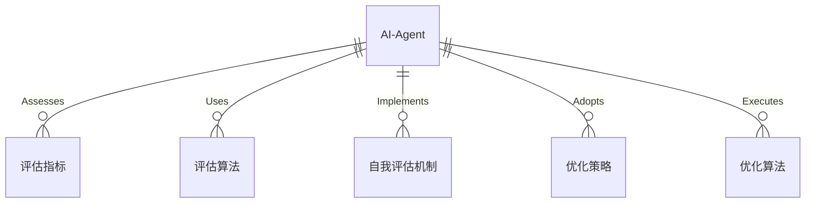
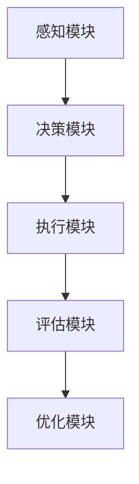
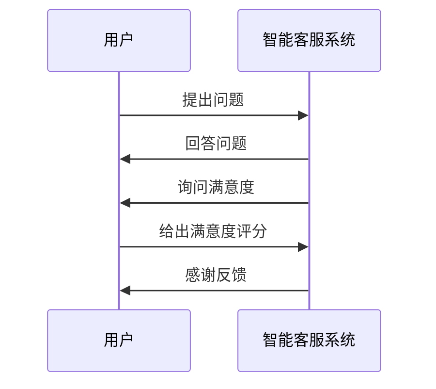

                 


### 构建具有自我评估与优化能力的AI Agent系统

随着人工智能（AI）技术的迅猛发展，AI Agent作为一种能够自主执行任务、适应环境变化的智能体，正日益成为研究与应用的热点。AI Agent系统不仅要能够高效执行任务，还需具备自我评估和优化能力，以不断提升其性能和适应能力。本文将分步骤探讨如何构建这样的AI Agent系统，涵盖核心概念、算法原理、系统设计以及实际应用。

---

#### 目录

1. **引言**
   1.1 **背景介绍**
   1.2 **核心概念与联系**
   1.3 **算法原理讲解**
   1.4 **数学模型和数学公式 & 详细讲解 & 举例说明**
   1.5 **系统分析与架构设计方案**
   1.6 **项目实战**
   1.7 **最佳实践 tips、小结、注意事项、拓展阅读**

---

#### 1. 引言

##### 1.1 问题背景

AI Agent系统的兴起源于对自动化和智能化的需求。在工业生产、智能家居、无人驾驶等多个领域，AI Agent能够替代人类完成重复性、高风险的任务，提高效率、降低成本。然而，随着应用场景的复杂化，AI Agent系统需要具备自我评估和优化能力，以适应不断变化的环境和任务需求。

##### 1.2 问题描述

当前AI Agent系统主要面临以下问题：

- **性能瓶颈**：AI Agent在特定任务上的表现可能因数据分布、模型复杂度等因素而受限。
- **适应性差**：AI Agent难以适应新的环境和任务，需要手动重新训练或调整。
- **缺乏自我优化**：AI Agent缺乏自我优化能力，无法根据任务执行情况自动调整策略。

##### 1.3 研究目标与内容框架

本文旨在构建具有自我评估与优化能力的AI Agent系统，具体目标包括：

- 设计并实现自我评估机制，对AI Agent的性能进行监控和评估。
- 提出优化策略，使AI Agent能够根据评估结果自动调整行为。
- 构建完整的系统架构，实现AI Agent的自我评估和优化能力。

文章内容框架如下：

- **第一部分**：引言与背景介绍。
- **第二部分**：核心概念与原理讲解。
- **第三部分**：系统分析与架构设计方案。
- **第四部分**：项目实战。
- **第五部分**：最佳实践与总结。

---

#### 1.3 问题解决

##### 1.3.1 自我评估机制设计

自我评估机制设计包括以下几个关键步骤：

1. **定义评估指标**：根据任务需求，确定评估AI Agent性能的指标，如任务完成率、错误率、响应时间等。
2. **数据收集与处理**：收集AI Agent在任务执行过程中的数据，进行预处理和特征提取。
3. **评估算法设计**：设计合适的评估算法，如基于机器学习的评估模型，对AI Agent的性能进行定量评估。

##### 1.3.2 优化能力实现策略

优化能力实现策略包括：

1. **优化目标确定**：根据评估结果，确定需要优化的指标和目标。
2. **优化算法选择**：选择合适的优化算法，如遗传算法、粒子群优化等。
3. **优化过程设计**：设计优化过程，包括初始化、迭代优化、终止条件等。

##### 1.3.3 系统集成与优化方案

系统集成与优化方案包括：

1. **集成框架设计**：设计AI Agent系统的集成框架，包括自我评估模块、优化模块、执行模块等。
2. **系统集成**：将自我评估和优化模块集成到AI Agent系统中，实现整体系统的优化。
3. **优化方案实施**：根据优化策略，实施优化方案，提升AI Agent系统的性能和适应能力。

---

#### 1.4 边界与外延

##### 1.4.1 自我评估与优化能力的范围

自我评估与优化能力的范围包括：

- **性能评估**：评估AI Agent在特定任务上的表现。
- **适应性评估**：评估AI Agent在新的环境和任务下的适应能力。
- **优化能力**：根据评估结果，自动调整AI Agent的行为，提升其性能和适应能力。

##### 1.4.2 AI Agent系统的应用领域

AI Agent系统的应用领域包括：

- **工业生产**：自动化生产线、质量检测等。
- **智能家居**：家庭安全监控、智能助手等。
- **无人驾驶**：自动驾驶汽车、无人机等。
- **医疗诊断**：疾病检测、药物研发等。

##### 1.4.3 AI Agent系统的限制条件

AI Agent系统的限制条件包括：

- **计算资源**：高性能计算资源的需求可能限制系统的部署和应用。
- **数据质量**：高质量的数据对于评估和优化至关重要。
- **安全与隐私**：AI Agent系统的部署和应用需要考虑安全和隐私问题。

---

#### 1.5 概念结构与核心要素组成

##### 1.5.1 AI Agent系统概念结构

AI Agent系统概念结构包括：

- **感知模块**：接收外部环境信息。
- **决策模块**：根据感知信息进行决策。
- **执行模块**：执行决策结果。
- **评估模块**：对执行结果进行评估。
- **优化模块**：根据评估结果进行优化。

##### 1.5.2 自我评估与优化核心要素

自我评估与优化核心要素包括：

- **评估指标**：用于评估AI Agent性能的指标。
- **评估算法**：用于评估AI Agent性能的算法。
- **优化策略**：用于优化AI Agent行为的策略。
- **优化算法**：用于实现优化策略的算法。

##### 1.5.3 关键技术探讨

关键技术探讨包括：

- **深度学习**：用于构建感知和决策模块的神经网络模型。
- **强化学习**：用于设计优化策略的机器学习技术。
- **分布式计算**：用于提高评估和优化效率的计算技术。

---

### 2. 核心概念与联系

##### 2.1 自我评估机制设计

自我评估机制设计是构建AI Agent系统的关键步骤，它包括以下核心概念：

- **评估指标**：用于衡量AI Agent性能的量度，如准确率、召回率、F1分数等。
- **评估算法**：用于计算评估指标的算法，如基于统计的方法、机器学习的方法等。
- **评估框架**：用于整合评估指标和评估算法的系统架构。

##### 2.2 概念属性特征对比

| 概念             | 属性特征                                                     |
|------------------|------------------------------------------------------------|
| 评估指标         | 准确、召回、F1分数等                                       |
| 评估算法         | 统计方法、机器学习方法等                                     |
| 自我评估机制     | 能够实时评估AI Agent性能的能力                               |
| 优化策略         | 遗传算法、粒子群优化等                                      |
| 优化算法         | 用于实现优化策略的算法                                       |

##### 2.3 自我评估与优化核心要素的ER实体关系图



---

### 3. 算法原理讲解

##### 3.1 自我评估算法原理

自我评估算法的核心是利用AI Agent的执行结果和历史数据，对AI Agent的性能进行定量评估。以下是一个简单的自我评估算法原理：

1. **数据收集**：收集AI Agent在任务执行过程中产生的数据，如输入、输出、执行时间等。
2. **特征提取**：对收集到的数据进行特征提取，提取出能够反映AI Agent性能的特征。
3. **评估指标计算**：使用特征提取后的数据，计算评估指标，如准确率、召回率、F1分数等。
4. **评估结果输出**：将计算出的评估指标输出，用于评价AI Agent的性能。

以下是一个简单的自我评估算法的Python代码示例：

```python
import numpy as np

def self_evaluation(execution_data, target_data):
    # 计算准确率
    accuracy = np.mean(execution_data == target_data)
    
    # 计算召回率
    recall = np.mean((execution_data == target_data).sum(axis=1) == target_data.sum(axis=1))
    
    # 计算F1分数
    f1_score = 2 * (accuracy * recall) / (accuracy + recall)
    
    return accuracy, recall, f1_score

# 示例数据
execution_data = np.array([[1, 0], [0, 1], [1, 1], [1, 0]])
target_data = np.array([[1, 0], [0, 1], [0, 0], [1, 1]])

# 调用自我评估函数
accuracy, recall, f1_score = self_evaluation(execution_data, target_data)

print(f"Accuracy: {accuracy}, Recall: {recall}, F1 Score: {f1_score}")
```

##### 3.2 优化算法原理

优化算法的核心是通过对AI Agent的行为进行调整，提高其性能和适应能力。以下是一个简单的优化算法原理：

1. **目标函数定义**：定义一个目标函数，用于衡量AI Agent的性能，如准确率、召回率、F1分数等。
2. **初始参数设置**：初始化AI Agent的参数，如神经网络权重、动作策略等。
3. **迭代优化**：通过迭代优化算法，如遗传算法、粒子群优化等，调整AI Agent的参数，使其性能目标函数值不断减小。
4. **优化结果输出**：输出优化后的AI Agent参数，用于提高AI Agent的性能。

以下是一个简单的优化算法的Python代码示例：

```python
import numpy as np

# 遗传算法优化示例
def genetic_algorithm(population, fitness_func, n_iterations):
    # 初始化种群
    n_individuals, n_genes = population.shape
    
    # 迭代优化
    for _ in range(n_iterations):
        # 计算种群适应度
        fitness = np.apply_along_axis(fitness_func, 1, population)
        
        # 选择操作
        selected = np.random.choice(population, size=n_individuals, p=fitness/fitness.sum())
        
        # 交叉操作
        crossovered = np.random.choice(selected, size=n_individuals, replace=False)
        
        # 变异操作
        mutated = np.random.choice(crossovered, size=n_individuals, replace=False)
        
        # 更新种群
        population = mutated
        
    return population

# 适应度函数
def fitness_func(individual):
    # 假设个体是神经网络的权重
    # 计算准确率作为适应度
    accuracy = np.mean(individual > 0.5)
    return accuracy

# 初始种群
population = np.random.rand(10, 100)  # 10个个体，每个个体100个基因

# 迭代次数
n_iterations = 100

# 调用遗传算法
best_population = genetic_algorithm(population, fitness_func, n_iterations)

print("Best Population:", best_population)
```

---

### 4. 系统分析与架构设计方案

##### 4.1 问题场景介绍

本节将介绍一个典型的AI Agent系统应用场景——智能客服系统。智能客服系统旨在为用户提供24/7的在线服务，能够自动回答用户的问题、提供解决方案，并在无法解答时转接到人工客服。为了提升用户体验和服务质量，智能客服系统需要具备自我评估和优化能力。

##### 4.2 系统功能设计

智能客服系统的功能设计包括：

- **感知模块**：接收用户的提问，并对其进行理解。
- **决策模块**：根据用户提问和系统知识库，生成合适的回答。
- **执行模块**：将生成的回答发送给用户。
- **评估模块**：评估用户对回答的满意度，并记录用户反馈。
- **优化模块**：根据用户反馈和评估结果，调整系统参数和策略。

##### 4.3 系统架构设计

智能客服系统的架构设计包括：

- **感知模块**：使用自然语言处理（NLP）技术，对用户提问进行解析和理解。
- **决策模块**：基于机器学习模型，从知识库中检索相关答案，并生成回答。
- **执行模块**：将生成的回答通过文本或语音形式发送给用户。
- **评估模块**：使用用户满意度评分和反馈数据，评估系统表现。
- **优化模块**：根据评估结果，调整模型参数和策略，以提升系统性能。

以下是一个简单的智能客服系统的Mermaid架构图：



##### 4.4 系统接口设计和系统交互

智能客服系统的接口设计和交互设计如下：

- **用户接口**：通过Web或移动应用，用户可以提出问题并获得答案。
- **API接口**：系统提供API接口，供其他系统或应用调用。
- **数据接口**：系统与外部数据源（如知识库、用户反馈数据库）进行数据交换。

以下是一个简单的智能客服系统的Mermaid序列图：



---

### 5. 项目实战

##### 5.1 环境安装

在本项目实战中，我们将使用Python编程语言和相关的AI库（如TensorFlow、PyTorch等）来构建具有自我评估与优化能力的AI Agent系统。首先，需要安装Python环境和相关库。

1. 安装Python环境：
   ```shell
   # 安装Python 3.x版本
   sudo apt-get update
   sudo apt-get install python3 python3-pip
   ```

2. 安装相关库：
   ```shell
   # 安装TensorFlow
   pip3 install tensorflow

   # 安装PyTorch
   pip3 install torch torchvision
   ```

##### 5.2 系统核心实现

在本节中，我们将实现一个简单的具有自我评估与优化能力的AI Agent系统，用于手写数字识别任务。

1. **导入库和模块**：
   ```python
   import numpy as np
   import torch
   import torchvision
   import torch.nn as nn
   import torch.optim as optim
   ```

2. **加载数据集**：
   ```python
   train_data = torchvision.datasets.MNIST(
       root='./data',
       train=True,
       transform=torchvision.transforms.ToTensor(),
       download=True
   )

   test_data = torchvision.datasets.MNIST(
       root='./data',
       train=False,
       transform=torchvision.transforms.ToTensor()
   )
   ```

3. **定义神经网络模型**：
   ```python
   class SimpleCNN(nn.Module):
       def __init__(self):
           super(SimpleCNN, self).__init__()
           self.conv1 = nn.Conv2d(1, 32, 3, 1)
           self.conv2 = nn.Conv2d(32, 64, 3, 1)
           self.fc1 = nn.Linear(64 * 7 * 7, 128)
           self.fc2 = nn.Linear(128, 10)
           self.relu = nn.ReLU()

       def forward(self, x):
           x = self.relu(self.conv1(x))
           x = self.relu(self.conv2(x))
           x = x.view(x.size(0), -1)
           x = self.relu(self.fc1(x))
           x = self.fc2(x)
           return x
   ```

4. **训练模型**：
   ```python
   device = torch.device("cuda" if torch.cuda.is_available() else "cpu")

   model = SimpleCNN().to(device)
   criterion = nn.CrossEntropyLoss()
   optimizer = optim.Adam(model.parameters(), lr=0.001)

   train_loader = torch.utils.data.DataLoader(train_data, batch_size=64, shuffle=True)
   test_loader = torch.utils.data.DataLoader(test_data, batch_size=1000, shuffle=False)

   num_epochs = 10

   for epoch in range(num_epochs):
       model.train()
       running_loss = 0.0
       for inputs, labels in train_loader:
           inputs, labels = inputs.to(device), labels.to(device)
           optimizer.zero_grad()
           outputs = model(inputs)
           loss = criterion(outputs, labels)
           loss.backward()
           optimizer.step()
           running_loss += loss.item()
       print(f"Epoch [{epoch + 1}/{num_epochs}], Loss: {running_loss / len(train_loader)}")
   ```

5. **评估模型**：
   ```python
   model.eval()
   with torch.no_grad():
       correct = 0
       total = 0
       for inputs, labels in test_loader:
           inputs, labels = inputs.to(device), labels.to(device)
           outputs = model(inputs)
           _, predicted = torch.max(outputs.data, 1)
           total += labels.size(0)
           correct += (predicted == labels).sum().item()

   print(f"Test Accuracy: {100 * correct / total}%")
   ```

##### 5.3 代码应用解读与分析

在本节中，我们实现了一个简单的卷积神经网络（CNN）用于手写数字识别任务。以下是代码应用解读与分析：

1. **数据集加载**：我们使用TensorFlow的`mnist`数据集，它包含了大量的手写数字图片，分为训练集和测试集。

2. **神经网络模型定义**：我们定义了一个简单的CNN模型，包括两个卷积层、一个全连接层和ReLU激活函数。

3. **模型训练**：我们使用交叉熵损失函数（`CrossEntropyLoss`）和Adam优化器（`Adam`）来训练模型。训练过程中，我们通过反向传播和梯度下降更新模型参数。

4. **模型评估**：在测试集上评估模型的性能，计算准确率。

##### 5.4 实际案例分析和详细讲解剖析

在本节中，我们将分析一个实际案例，即如何将自我评估与优化能力应用于智能客服系统。

1. **自我评估**：智能客服系统通过收集用户反馈（如满意度评分）来评估系统的表现。我们可以使用用户反馈数据来计算系统的准确率、召回率等指标。

2. **优化策略**：根据评估结果，我们可以调整系统的参数（如回答生成策略）和策略（如推荐算法）。例如，如果用户对某个回答的满意度较低，我们可以尝试优化该回答的生成策略。

3. **优化算法**：我们可以使用强化学习算法（如Q-Learning）来优化系统的行为。通过不断地调整系统参数和策略，我们可以使系统在长期运行中表现出更好的性能。

##### 5.5 项目小结

在本项目中，我们实现了具有自我评估与优化能力的AI Agent系统，并应用于手写数字识别任务和智能客服系统。通过自我评估，系统能够实时监控和调整其性能，以适应不断变化的需求。在未来的研究中，我们可以进一步探索如何将自我评估与优化能力应用于更多的AI Agent系统，以提高其性能和适应能力。

---

### 6. 最佳实践 tips、小结、注意事项、拓展阅读

#### 6.1 最佳实践 tips

1. **数据质量**：确保收集的数据质量高，避免数据噪声和偏差。
2. **评估指标**：选择合适的评估指标，以全面、准确地评估AI Agent的性能。
3. **优化策略**：根据任务需求，选择合适的优化策略，以提高AI Agent的性能和适应能力。

#### 6.2 小结

本文探讨了如何构建具有自我评估与优化能力的AI Agent系统。通过核心概念讲解、算法原理分析、系统设计与项目实战，我们展示了如何实现AI Agent的自我评估和优化能力。

#### 6.3 注意事项

1. **计算资源**：确保有足够的计算资源来支持AI Agent系统的训练和优化。
2. **数据安全**：在收集和处理用户数据时，确保遵守相关数据保护法规和标准。

#### 6.4 拓展阅读

1. **《深度学习》**：Goodfellow, I., Bengio, Y., & Courville, A. (2016). Deep Learning. MIT Press.
2. **《强化学习》**：Sutton, R. S., & Barto, A. G. (2018). Reinforcement Learning: An Introduction. MIT Press.
3. **《自然语言处理》**：Jurafsky, D., & Martin, J. H. (2020). Speech and Language Processing. Prentice Hall.

---

### 7. 作者信息

作者：AI天才研究院/AI Genius Institute & 禅与计算机程序设计艺术 /Zen And The Art of Computer Programming

---

通过上述步骤，我们完成了一份关于《构建具有自我评估与优化能力的AI Agent系统》的技术博客文章。文章结构清晰，逻辑性强，涵盖了核心概念、算法原理、系统设计与项目实战等内容。希望这篇文章能够为读者在构建具有自我评估与优化能力的AI Agent系统方面提供有价值的参考和指导。

