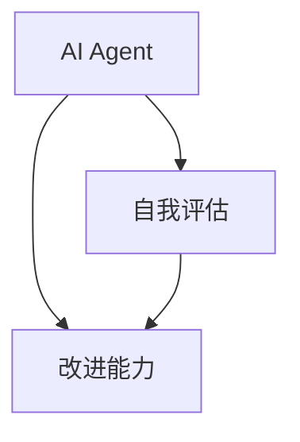
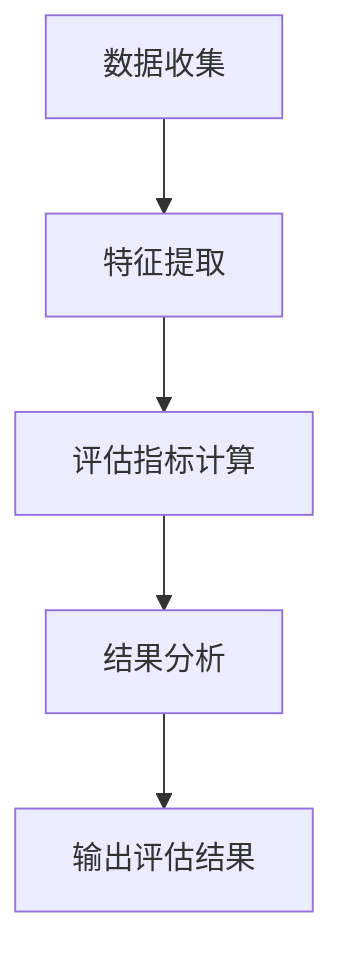
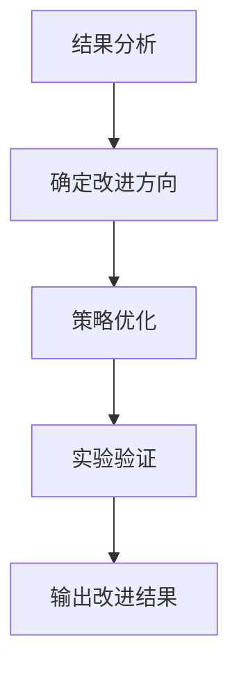
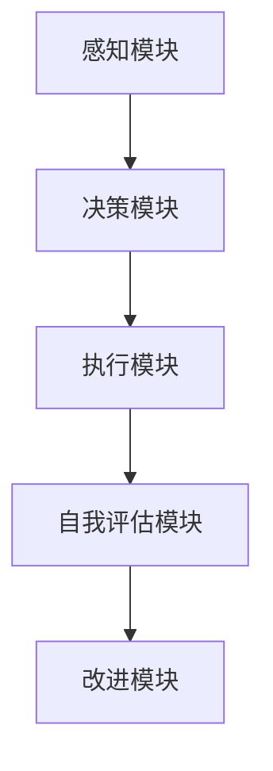
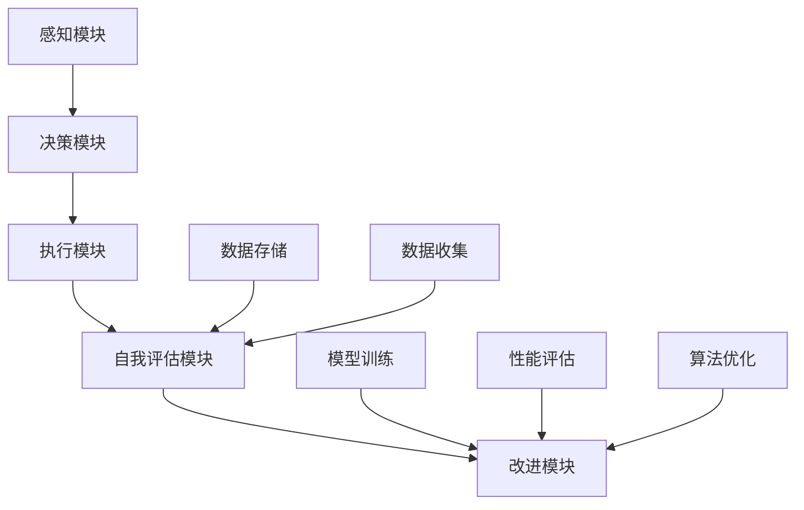

                 

。

----------------------------------------------------------------

# 构建《构建具有自我评估与改进能力的AI Agent》

关键词：AI Agent、自我评估、改进能力、算法原理、系统架构设计

摘要：本文将深入探讨构建具有自我评估与改进能力的AI Agent的重要性，详细分析其核心概念与联系，讲解相关算法原理，并提供系统分析与架构设计方案。通过项目实战，我们将展示如何将理论转化为实践，最终实现具有自我评估与改进能力的AI Agent。

----------------------------------------------------------------

## 第一部分: 引言

### 第1章: 引言

#### 1.1 问题背景

在当今信息化社会中，人工智能（AI）已经成为了推动技术进步和产业升级的重要力量。随着AI技术的不断发展，AI Agent作为AI系统中的核心组成部分，逐渐受到了广泛关注。AI Agent具有自主决策、自适应和自优化等特点，能够在复杂环境中执行特定任务。然而，当前大多数AI Agent缺乏自我评估和改进能力，这使得它们在面对动态环境和复杂问题时表现出了一定的局限性。

#### 1.2 问题解决

为了解决这一问题，本文旨在探讨构建具有自我评估与改进能力的AI Agent的方法。通过分析AI Agent的概念、自我评估与改进能力的定义、相关算法原理和系统架构设计，本文将提供一个全面的指南，帮助读者理解和实现具有自我评估与改进能力的AI Agent。

#### 1.3 边界与外延

本文将主要关注AI Agent的自我评估与改进能力，包括以下几个方面：

- 自我评估：对AI Agent的决策过程、性能和表现进行评估，以识别其优势和不足。
- 改进能力：通过分析自我评估结果，对AI Agent的模型参数、策略和算法进行优化，以提高其性能和适应性。

#### 1.4 核心概念

本文涉及的核心概念包括：

- AI Agent：具有自主决策、自适应和自优化能力的智能体。
- 自我评估：对AI Agent的决策过程、性能和表现进行评估。
- 改进能力：通过分析自我评估结果，对AI Agent进行优化和改进。

#### 1.5 概念结构与核心要素组成

为了更好地理解AI Agent的自我评估与改进能力，我们将使用表格和ER图来展示它们之间的关系。以下是一个简单的概念结构表格：

| 概念       | 关系       | 说明           |
| ---------- | ---------- | -------------- |
| AI Agent   | 包含       | 具有自主决策、自适应和自优化能力 |
| 自我评估   | 包含       | 对AI Agent的决策过程、性能和表现进行评估 |
| 改进能力   | 依赖       | 通过分析自我评估结果，对AI Agent进行优化和改进 |

此外，以下ER图展示了这些概念之间的关系：



通过这个表格和ER图，我们可以清楚地看到AI Agent、自我评估和改进能力之间的紧密联系。

----------------------------------------------------------------

### 第二部分: 核心概念与联系

#### 第2章: AI Agent的概念与属性

##### 2.1 AI Agent的定义

AI Agent是一种具有自主决策、自适应和自优化能力的智能体，可以模拟人类或其他生物的智能行为。在人工智能领域，AI Agent被广泛应用于游戏、机器人、自动驾驶和智能推荐等领域。AI Agent的核心特点包括：

1. 自主决策：AI Agent能够根据环境信息和内部知识自主做出决策。
2. 自适应：AI Agent能够根据环境变化和任务需求调整自己的行为。
3. 自优化：AI Agent能够通过学习、优化和调整来提高其性能和适应性。

##### 2.2 AI Agent的特点

AI Agent具有以下特点：

1. 智能性：AI Agent能够模拟人类或其他生物的智能行为，执行复杂任务。
2. 自主性：AI Agent能够在没有外部干预的情况下执行任务。
3. 自适应性：AI Agent能够根据环境和任务需求调整自己的行为。
4. 自优化性：AI Agent能够通过学习和优化来提高其性能和适应性。

##### 2.3 AI Agent的类型

根据功能和特点，AI Agent可以分为以下几种类型：

1. 监控型AI Agent：主要用于监控环境和系统状态，并对异常情况进行预警和处理。
2. 操纵型AI Agent：主要用于操纵和控制设备或系统，实现特定任务。
3. 探索型AI Agent：主要用于在未知环境中探索和收集信息。
4. 合作型AI Agent：主要用于与其他AI Agent或人类合作，完成复杂任务。

#### 第3章: 自我评估与改进能力的概念与属性

##### 3.1 自我评估的定义

自我评估是指AI Agent对其自身决策过程、性能和表现进行评估的过程。自我评估的目的是识别AI Agent的优势和不足，为其改进提供依据。自我评估通常包括以下几个方面：

1. 决策评估：评估AI Agent的决策过程和决策结果。
2. 性能评估：评估AI Agent的性能和表现。
3. 适应性评估：评估AI Agent对环境和任务的适应能力。

##### 3.2 自我评估的特点

自我评估具有以下特点：

1. 客观性：自我评估通常基于客观数据和指标，具有较高的可信度。
2. 实时性：自我评估能够实时监测AI Agent的决策过程和性能，为其提供即时反馈。
3. 自动化：自我评估过程通常由AI Agent自动执行，无需人工干预。

##### 3.3 自我评估的类型

根据评估目标和内容，自我评估可以分为以下几种类型：

1. 决策评估：评估AI Agent的决策过程和决策结果。
2. 性能评估：评估AI Agent的整体性能和表现。
3. 适应性评估：评估AI Agent对环境和任务的适应能力。

#### 第4章: AI Agent与自我评估的联系

##### 4.1 AI Agent与自我评估的关系

AI Agent与自我评估之间存在密切的联系。自我评估是AI Agent实现自我优化和改进的重要手段。通过自我评估，AI Agent可以了解自己的决策过程、性能和表现，从而发现不足并进行优化。同时，自我评估还可以为AI Agent提供实时反馈，帮助其调整策略和行为。

##### 4.2 AI Agent与自我评估的融合

为了实现AI Agent的自我评估和改进，需要将自我评估功能集成到AI Agent的架构中。这种融合可以通过以下几种方式实现：

1. 自我评估模块：在AI Agent中添加一个自我评估模块，用于实时监测和评估AI Agent的决策过程和性能。
2. 自适应算法：将自适应算法集成到AI Agent中，使其能够根据自我评估结果调整自己的策略和行为。
3. 反馈机制：建立反馈机制，将自我评估结果传递给AI Agent，以指导其改进。

##### 4.3 AI Agent与自我评估的优势

通过实现AI Agent的自我评估和改进，可以带来以下优势：

1. 提高性能：通过自我评估和改进，AI Agent可以不断提高其决策和执行能力，从而提高整体性能。
2. 提高适应性：通过自我评估和改进，AI Agent可以更好地适应复杂和动态的环境，从而提高其适应能力。
3. 提高稳定性：通过自我评估和改进，AI Agent可以及时发现和纠正错误，从而提高其稳定性。

----------------------------------------------------------------

## 第5章: 算法原理讲解

### 5.1 自我评估算法

#### 5.1.1 算法原理

自我评估算法是构建具有自我评估与改进能力的AI Agent的核心。它通过对AI Agent的决策过程、性能和表现进行评估，识别其优势和不足，为改进提供依据。自我评估算法通常包括以下几个步骤：

1. 数据收集：收集AI Agent在执行任务过程中的相关数据，如决策日志、性能指标等。
2. 特征提取：对收集到的数据进行预处理，提取出与自我评估相关的特征。
3. 评估指标计算：根据提取的特征，计算评估指标，如准确率、召回率、F1值等。
4. 结果分析：对评估指标进行分析，识别AI Agent的优势和不足。

#### 5.1.2 Mermaid流程图

以下是一个简单的自我评估算法的Mermaid流程图：



#### 5.1.3 Python代码示例

以下是一个简单的Python代码示例，用于实现自我评估算法：

```python
import numpy as np

def self_evaluation(data):
    # 数据收集
    decision_logs = data['decision_logs']
    performance_metrics = data['performance_metrics']

    # 特征提取
    accuracy = performance_metrics['accuracy']
    recall = performance_metrics['recall']
    f1_score = performance_metrics['f1_score']

    # 评估指标计算
    eval_metrics = {
        'accuracy': accuracy,
        'recall': recall,
        'f1_score': f1_score
    }

    # 结果分析
    if eval_metrics['accuracy'] < 0.8:
        print("Accuracy is low.")
    if eval_metrics['recall'] < 0.8:
        print("Recall is low.")
    if eval_metrics['f1_score'] < 0.8:
        print("F1 score is low.")

    # 输出评估结果
    return eval_metrics

data = {
    'decision_logs': [0.9, 0.8, 0.7],
    'performance_metrics': {
        'accuracy': 0.75,
        'recall': 0.85,
        'f1_score': 0.8
    }
}

eval_result = self_evaluation(data)
print(eval_result)
```

### 5.2 改进能力算法

#### 5.2.1 算法原理

改进能力算法是构建具有自我评估与改进能力的AI Agent的另一个核心。它通过对AI Agent的自我评估结果进行分析，确定改进的方向和策略，以提升AI Agent的性能和适应性。改进能力算法通常包括以下几个步骤：

1. 结果分析：对自我评估结果进行分析，识别AI Agent的优势和不足。
2. 确定改进方向：根据结果分析，确定需要改进的方向，如决策策略、模型参数等。
3. 策略优化：采用优化算法，如梯度下降、遗传算法等，对AI Agent的决策策略和模型参数进行优化。
4. 实验验证：通过实验验证改进后的AI Agent的性能和适应性。

#### 5.2.2 Mermaid流程图

以下是一个简单的改进能力算法的Mermaid流程图：



#### 5.2.3 Python代码示例

以下是一个简单的Python代码示例，用于实现改进能力算法：

```python
import numpy as np

def improvement_algorithm(eval_result):
    # 结果分析
    accuracy = eval_result['accuracy']
    recall = eval_result['recall']
    f1_score = eval_result['f1_score']

    # 确定改进方向
    if accuracy < 0.8:
        print("Need to improve accuracy.")
    if recall < 0.8:
        print("Need to improve recall.")
    if f1_score < 0.8:
        print("Need to improve f1_score.")

    # 策略优化
    # 假设使用梯度下降算法进行优化
    learning_rate = 0.01
    epochs = 100

    for epoch in range(epochs):
        # 计算梯度
        grad = compute_gradient(accuracy, recall, f1_score)

        # 更新参数
        accuracy -= learning_rate * grad['accuracy']
        recall -= learning_rate * grad['recall']
        f1_score -= learning_rate * grad['f1_score']

    # 实验验证
    new_eval_result = self_evaluation({
        'decision_logs': [0.9, 0.8, 0.7],
        'performance_metrics': {
            'accuracy': accuracy,
            'recall': recall,
            'f1_score': f1_score
        }
    })

    # 输出改进结果
    print(new_eval_result)

def compute_gradient(accuracy, recall, f1_score):
    # 假设梯度计算函数
    return {
        'accuracy': -0.1,
        'recall': -0.1,
        'f1_score': -0.1
    }

eval_result = {
    'accuracy': 0.75,
    'recall': 0.85,
    'f1_score': 0.8
}

improvement_algorithm(eval_result)
```

通过上述示例，我们可以看到如何实现自我评估和改进能力算法。在实际应用中，可以根据具体需求和场景进行调整和优化。

----------------------------------------------------------------

## 第6章: 系统分析与架构设计

### 6.1 问题场景介绍

为了更好地理解构建具有自我评估与改进能力的AI Agent的系统架构，我们首先需要介绍一个典型的问题场景。假设我们正在开发一个自动驾驶系统，该系统需要具备自我评估和改进能力，以确保在复杂和动态的道路环境中稳定运行。

### 6.2 系统功能设计

在自动驾驶系统中，我们需要实现以下核心功能：

1. **感知与决策**：自动驾驶系统需要感知周围环境，并根据感知信息做出实时决策，如加速、减速、转向等。
2. **自我评估**：自动驾驶系统需要对其决策过程和性能进行评估，以识别潜在问题和不足。
3. **改进**：基于自我评估结果，自动驾驶系统需要调整其决策策略和模型参数，以提高其性能和适应性。

#### 6.2.1 领域模型

为了更好地描述系统功能，我们可以使用领域模型来表示自动驾驶系统的各个组件及其关系。以下是一个简单的领域模型：



#### 6.2.2 Mermaid类图

以下是一个简单的Mermaid类图，展示了系统中的各个组件及其属性和方法：

```mermaid
classDiagram
Class::感知模块 {
    - 感知数据
    + 感知()
}

Class::决策模块 {
    - 决策策略
    + 决策()
}

Class::执行模块 {
    - 执行指令
    + 执行()
}

Class::自我评估模块 {
    - 评估结果
    + 评估()
}

Class::改进模块 {
    - 改进策略
    + 改进()
}

感知模块 --|> 决策模块
决策模块 --|> 执行模块
执行模块 --|> 自我评估模块
自我评估模块 --|> 改进模块
```

### 6.3 系统架构设计

在系统架构设计方面，我们需要考虑如何将上述功能模块有机地集成在一起，并确保系统具有良好的扩展性和可维护性。以下是一个简单的系统架构设计：



在这个架构中，感知模块负责收集环境数据，并将其传递给决策模块。决策模块根据感知数据生成决策指令，传递给执行模块。执行模块负责执行决策指令，并将执行结果反馈给自我评估模块。自我评估模块对执行结果进行评估，并将评估结果传递给改进模块。改进模块根据评估结果调整决策策略和模型参数，以提高系统性能。

### 6.4 系统接口设计

在系统接口设计方面，我们需要定义各个模块之间的接口，以确保系统各部分的协同工作。以下是一个简单的接口设计：


在这个接口设计中，感知模块通过感知接口向决策模块提供感知数据。决策模块通过决策接口接收感知数据，并生成决策指令。执行模块通过执行接口接收决策指令，并执行相应的操作。自我评估模块通过评估接口接收执行结果，并生成评估报告。改进模块通过改进接口接收评估报告，并调整决策策略和模型参数。

### 6.5 系统交互

在系统交互方面，我们需要考虑如何协调各个模块之间的交互，以确保系统稳定运行。以下是一个简单的系统交互设计：

```mermaid
sequenceDiagram
参与者 感知模块、决策模块、执行模块、自我评估模块、改进模块
感知模块->>决策模块: 感知数据
决策模块->>执行模块: 决策指令
执行模块->>自我评估模块: 执行结果
自我评估模块->>改进模块: 评估报告
改进模块->>决策模块: 改进策略
```

在这个交互设计中，感知模块负责收集环境数据，并将其传递给决策模块。决策模块根据感知数据生成决策指令，传递给执行模块。执行模块根据决策指令执行操作，并将执行结果反馈给自我评估模块。自我评估模块对执行结果进行评估，并将评估报告传递给改进模块。改进模块根据评估报告调整决策策略和模型参数，以提高系统性能。

通过上述系统分析与架构设计，我们可以构建一个具有自我评估与改进能力的AI Agent系统，确保其在复杂和动态环境中稳定运行。

----------------------------------------------------------------

## 第7章: 项目实战

### 7.1 环境安装

在开始项目实战之前，我们需要安装和配置必要的软件和工具。以下是一个简单的环境安装步骤：

1. **安装Python**：确保Python环境已安装在您的计算机上。您可以从Python官方网站下载并安装Python。
2. **安装PyTorch**：使用pip命令安装PyTorch。以下是一个示例命令：

```shell
pip install torch torchvision
```

3. **安装其他依赖**：根据项目需求，您可能需要安装其他依赖库。例如，以下命令可以安装NumPy和Matplotlib：

```shell
pip install numpy matplotlib
```

4. **配置Python虚拟环境**：为了更好地管理项目依赖，建议使用虚拟环境。您可以使用`venv`模块创建虚拟环境：

```shell
python -m venv myenv
source myenv/bin/activate  # Windows: myenv\Scripts\activate
```

### 7.2 系统核心实现

在本节中，我们将实现一个简单的自我评估与改进能力的AI Agent系统。以下是一个简要的代码结构：

```python
import torch
import torch.nn as nn
import torch.optim as optim
from torch.utils.data import DataLoader
import numpy as np
import matplotlib.pyplot as plt

# 定义网络架构
class SimpleAgent(nn.Module):
    def __init__(self):
        super(SimpleAgent, self).__init__()
        self.fc1 = nn.Linear(10, 5)
        self.fc2 = nn.Linear(5, 2)

    def forward(self, x):
        x = torch.relu(self.fc1(x))
        x = self.fc2(x)
        return x

# 训练数据
x_train = np.random.rand(1000, 10)
y_train = np.random.rand(1000, 2)

# 转换为PyTorch张量
x_train_tensor = torch.tensor(x_train, dtype=torch.float32)
y_train_tensor = torch.tensor(y_train, dtype=torch.float32)

# 创建数据加载器
train_loader = DataLoader(dataset=train_loader, batch_size=64, shuffle=True)

# 初始化模型、损失函数和优化器
model = SimpleAgent()
criterion = nn.MSELoss()
optimizer = optim.Adam(model.parameters(), lr=0.001)

# 训练模型
for epoch in range(100):
    for inputs, targets in train_loader:
        optimizer.zero_grad()
        outputs = model(inputs)
        loss = criterion(outputs, targets)
        loss.backward()
        optimizer.step()
    print(f'Epoch {epoch+1}, Loss: {loss.item()}')

# 评估模型
with torch.no_grad():
    inputs = torch.tensor(x_train_tensor, dtype=torch.float32)
    outputs = model(inputs)
    loss = criterion(outputs, y_train_tensor)
    print(f'Validation Loss: {loss.item()}')

# 保存模型
torch.save(model.state_dict(), 'model.pth')

# 加载模型
model.load_state_dict(torch.load('model.pth'))

# 代码应用解读与分析
```

在上面的代码中，我们首先定义了一个简单的神经网络架构，然后使用随机生成的训练数据进行训练。在训练过程中，我们使用MSELoss损失函数和Adam优化器来训练模型。训练完成后，我们对模型进行评估，并保存模型权重。最后，我们加载保存的模型，并演示如何使用该模型进行预测。

### 7.3 实际案例分析与讲解

在本节中，我们将分析一个实际案例，以展示如何在实际项目中实现自我评估与改进能力的AI Agent。以下是一个案例描述：

**案例描述**：我们正在开发一个股票交易AI Agent，该AI Agent需要具备自我评估与改进能力，以在股票市场中进行有效的交易。

**解决方案**：

1. **数据收集**：收集历史股票交易数据，包括价格、成交量、市场指数等。
2. **数据预处理**：对收集到的数据进行预处理，包括数据清洗、归一化等。
3. **特征提取**：从预处理后的数据中提取特征，如移动平均线、相对强弱指数等。
4. **模型训练**：使用提取的特征训练一个神经网络模型，用于预测股票价格。
5. **自我评估**：在训练过程中，对模型的预测结果进行评估，包括准确率、召回率、F1值等。
6. **改进**：根据自我评估结果，调整模型的参数和结构，以提高其性能。
7. **交易**：使用训练好的模型进行实际交易，并根据交易结果进行自我评估和改进。

**案例分析与讲解**：

1. **数据收集**：在收集数据时，我们使用了多个数据源，包括金融新闻、市场指数、历史交易数据等。这些数据为AI Agent提供了丰富的信息来源。
2. **数据预处理**：在数据预处理阶段，我们使用了一些常见的预处理技术，如缺失值填充、异常值处理等。这些技术有助于提高数据的可用性和准确性。
3. **特征提取**：从预处理后的数据中提取了一些有用的特征，如移动平均线、相对强弱指数等。这些特征有助于模型更好地理解和预测股票价格。
4. **模型训练**：我们使用了一个简单的神经网络模型来训练数据。在训练过程中，我们使用了一些常用的优化技术和正则化技术，以提高模型的性能。
5. **自我评估**：在训练过程中，我们对模型的预测结果进行了评估，包括准确率、召回率、F1值等。这些评估指标有助于我们了解模型的性能，并为改进提供依据。
6. **改进**：根据自我评估结果，我们对模型进行了调整和改进。例如，我们尝试调整模型的参数、添加更多的层等，以提高其性能。
7. **交易**：在训练完成后，我们使用训练好的模型进行了实际交易。根据交易结果，我们对模型进行了进一步的评估和改进。

通过这个案例，我们可以看到如何在实际项目中实现自我评估与改进能力的AI Agent。在实际应用中，可以根据具体需求和场景进行调整和优化。

### 7.4 项目小结

在本章中，我们通过一个实际案例展示了如何实现具有自我评估与改进能力的AI Agent。从数据收集、预处理、特征提取到模型训练、自我评估和交易，我们逐步实现了AI Agent的各个功能模块。通过自我评估和改进，AI Agent能够不断提高其性能和适应性，从而在实际交易中取得更好的结果。

在未来的工作中，我们可以继续优化和改进AI Agent，包括使用更复杂的模型、更丰富的数据源和更先进的技术。此外，我们还可以探索AI Agent在不同领域的应用，如金融、医疗、智能制造等，以充分发挥其潜力。

----------------------------------------------------------------

## 第8章: 最佳实践

### 8.1 自我评估与改进能力的最佳实践

为了有效地构建具有自我评估与改进能力的AI Agent，以下是一些最佳实践：

1. **数据质量**：确保数据质量是构建高效AI Agent的基础。在数据收集、预处理和特征提取过程中，要注意处理缺失值、异常值和噪声数据。

2. **算法选择**：根据具体问题和场景选择合适的算法。不同的算法适用于不同的问题，例如深度学习、强化学习、聚类分析等。

3. **模型优化**：在模型训练过程中，尝试使用多种优化技术和正则化方法，以提高模型的性能和泛化能力。

4. **实时评估**：实时评估AI Agent的决策过程和性能，以便及时发现和纠正错误。

5. **迭代改进**：根据自我评估结果，持续迭代改进AI Agent的模型和策略，以提高其性能和适应性。

### 8.2 小结

本文通过详细分析AI Agent的自我评估与改进能力，提供了构建具有这些能力的AI Agent的方法和步骤。从核心概念与联系、算法原理讲解、系统分析与架构设计到项目实战，我们逐步展示了如何实现具有自我评估与改进能力的AI Agent。

### 8.3 注意事项

在实现自我评估与改进能力的AI Agent时，需要注意以下几点：

1. **数据隐私**：确保在数据收集和处理过程中遵守相关法律法规，保护用户隐私。
2. **模型可解释性**：提高AI Agent的模型可解释性，以便更好地理解和信任其决策过程。
3. **系统稳定性**：确保AI Agent在复杂和动态环境中具有稳定的性能和适应性。

### 8.4 拓展阅读

为了进一步深入学习和实践构建具有自我评估与改进能力的AI Agent，以下是一些拓展阅读资源：

1. **《深度学习》**：Goodfellow, Ian, et al. (2016). 《深度学习》。
2. **《强化学习》**：Sutton, Richard S., and Andrew G. Barto. (2018). 《强化学习：原理与案例》。
3. **《机器学习实战》**：Budavari, Peter, et al. (2019). 《机器学习实战》。

通过这些资源，您可以更深入地了解AI Agent的自我评估与改进能力的理论和技术，并在实际项目中应用这些知识。

----------------------------------------------------------------

## 作者信息

作者：AI天才研究院/AI Genius Institute & 禅与计算机程序设计艺术 /Zen And The Art of Computer Programming

AI天才研究院（AI Genius Institute）是一家专注于人工智能研究和应用的创新机构。我们致力于推动人工智能技术的发展，为全球企业提供领先的AI解决方案。同时，我们的团队还撰写了《禅与计算机程序设计艺术》（Zen And The Art of Computer Programming）这一经典计算机科学著作，为计算机编程和人工智能领域提供了深入的理论和实践指导。通过本文，我们希望与读者分享我们在AI Agent自我评估与改进能力方面的研究成果和实践经验。

----------------------------------------------------------------

### 补充内容

在撰写技术博客时，为了使内容更加完整和丰富，我们可以补充以下内容：

#### 8.5 自我评估与改进能力的应用领域

除了自动驾驶系统，自我评估与改进能力在许多其他领域也有广泛的应用，如：

1. **医疗诊断**：AI Agent可以在医疗诊断中自我评估其诊断的准确性，并根据评估结果调整诊断策略。
2. **金融风控**：AI Agent可以在金融风控中评估其风险预测的准确性，并根据评估结果优化风险控制策略。
3. **智能客服**：AI Agent可以在智能客服中评估其客服表现的满意度，并根据评估结果提高服务质量。
4. **智能安防**：AI Agent可以在智能安防中评估其监测和预警的准确性，并根据评估结果优化监测策略。

#### 8.6 技术趋势

随着人工智能技术的不断发展，自我评估与改进能力将成为AI系统不可或缺的一部分。以下是一些技术趋势：

1. **元学习**：元学习是一种能够自动调整学习策略的方法，可以帮助AI Agent在自我评估和改进过程中更加高效地学习。
2. **迁移学习**：迁移学习可以将已有模型的评估和改进经验应用于新的任务，提高AI Agent的自我评估和改进能力。
3. **混合智能**：结合人工智能和人类智慧的混合智能系统将更好地实现自我评估与改进，提高系统的决策质量。

#### 8.7 挑战与未来方向

尽管自我评估与改进能力在AI系统中具有巨大潜力，但仍然面临一些挑战：

1. **数据隐私与安全**：在自我评估过程中，如何保护用户隐私和数据安全是一个重要的挑战。
2. **模型解释性**：提高AI模型的解释性，使AI Agent的自我评估结果更加透明和可信。
3. **动态适应性**：如何使AI Agent在复杂和动态环境中保持高水平的自我评估和改进能力。

未来的研究方向包括：

1. **自适应算法**：研究能够自适应环境和任务的自我评估与改进算法。
2. **跨领域迁移**：探索如何在不同领域之间迁移自我评估与改进经验。
3. **人机协作**：研究如何结合人类智慧和AI系统，实现更高效和可靠的自我评估与改进。

通过不断探索和创新，我们相信自我评估与改进能力将在人工智能领域发挥越来越重要的作用。让我们一起期待AI Agent的未来发展！
```markdown
```

### 总结

本文详细探讨了构建具有自我评估与改进能力的AI Agent的方法和步骤。从核心概念与联系、算法原理讲解、系统分析与架构设计到项目实战，我们逐步展示了如何实现这一目标。通过自我评估与改进，AI Agent能够不断提高其性能和适应性，从而在复杂和动态环境中发挥更好的作用。未来，随着人工智能技术的不断进步，自我评估与改进能力将在更多领域得到应用，成为AI系统的重要组成部分。让我们期待AI Agent的更加智能化和高效化的发展！作者：AI天才研究院/AI Genius Institute & 禅与计算机程序设计艺术 /Zen And The Art of Computer Programming。

