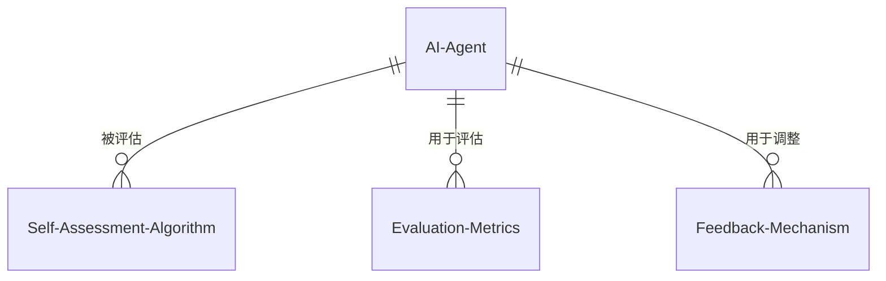
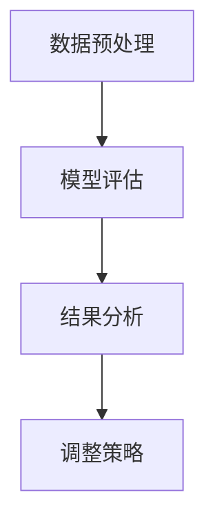
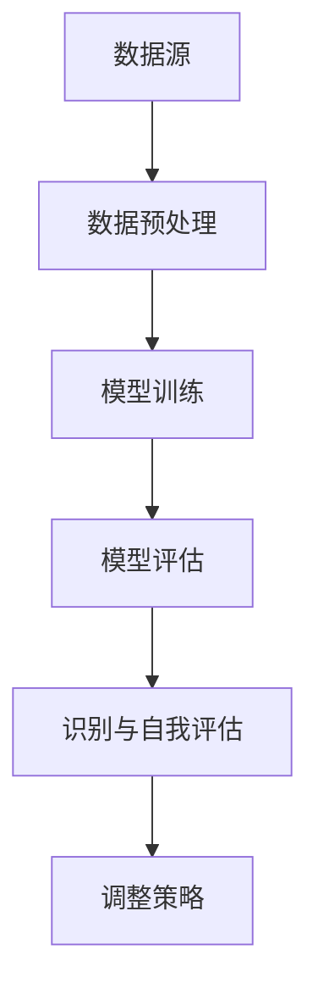
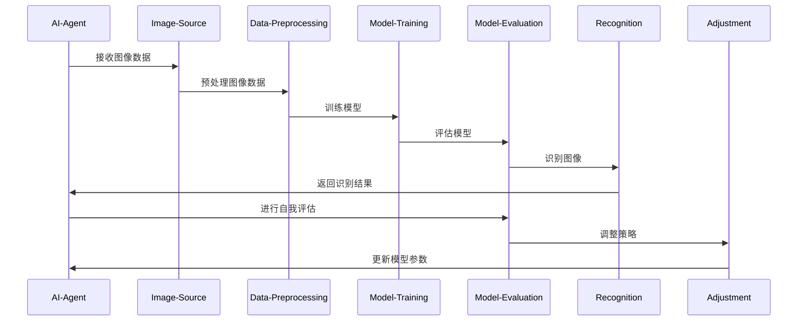

                 


# 构建具有自我评估能力的AI Agent

关键词：AI Agent、自我评估、算法、架构、实现、最佳实践

摘要：本文将深入探讨如何构建具有自我评估能力的AI Agent。我们将逐步分析核心概念，了解自我评估算法的原理，并阐述如何设计一个具有自我评估功能的AI系统。通过项目实战和最佳实践，我们将展示如何实现和优化这样一个AI Agent。

## 1. 背景介绍

### 1.1 核心概念术语说明

在构建具有自我评估能力的AI Agent的过程中，我们首先要了解一些核心概念和术语。以下是一些关键的术语：

- **AI Agent**：指的是能够自主执行任务并与环境互动的计算机程序。
- **自我评估**：指的是AI Agent在执行任务过程中，能够对其行为和性能进行评价和反馈。
- **评估指标**：用于衡量AI Agent性能的具体指标，如准确率、召回率等。
- **反馈机制**：用于根据评估结果调整AI Agent行为和性能的机制。

### 1.2 问题背景

在人工智能领域，自我评估是提高AI Agent性能的重要手段。通过自我评估，AI Agent能够识别自身的不足，并在后续任务中加以改进。然而，目前大多数AI Agent缺乏自我评估能力，导致其性能难以持续提升。

### 1.3 问题描述

为了构建具有自我评估能力的AI Agent，我们需要解决以下问题：

- 如何设计一个有效的自我评估算法？
- 如何将自我评估算法集成到AI Agent中，并确保其正常运行？
- 如何根据评估结果调整AI Agent的行为和性能？

### 1.4 问题解决

为了解决上述问题，我们需要：

- 研究现有的自我评估算法，分析其优缺点。
- 设计一个适用于AI Agent的自我评估算法，并确保其易于集成和调整。
- 实现一个具有自我评估功能的AI系统，并在实际应用中进行测试和优化。

### 1.5 边界与外延

在构建具有自我评估能力的AI Agent时，我们需要考虑以下边界与外延：

- **应用领域**：自我评估算法适用于各种AI任务，如图像识别、自然语言处理等。
- **性能指标**：评估指标应根据具体任务进行调整，以最大化性能提升。
- **反馈机制**：反馈机制应具备灵活性和适应性，以适应不同场景下的需求。

### 1.6 概念结构与核心要素组成

构建具有自我评估能力的AI Agent的核心要素包括：

- **评估算法**：用于评估AI Agent性能的核心算法。
- **评估指标**：用于衡量AI Agent性能的具体指标。
- **反馈机制**：根据评估结果调整AI Agent行为和性能的机制。
- **集成方案**：将自我评估算法集成到AI Agent中的具体实现方案。

## 2. 核心概念与联系

### 2.1 自我评估算法原理

自我评估算法是构建具有自我评估能力的AI Agent的核心。以下是一个简单的自我评估算法原理：

1. **数据预处理**：将输入数据进行预处理，如标准化、去噪等，以便于后续评估。
2. **模型评估**：使用现有的评估指标（如准确率、召回率等）对AI Agent的输出进行评估。
3. **结果分析**：根据评估结果分析AI Agent的表现，确定其不足之处。
4. **调整策略**：根据分析结果，调整AI Agent的行为和性能，以提高其在后续任务中的表现。

### 2.2 概念属性特征对比表格

| 概念         | 属性特征                           | 对比说明                         |
| ------------ | ---------------------------------- | -------------------------------- |
| 自我评估算法 | 用于评估AI Agent性能的核心算法       | 与其他评估算法相比，更具适应性和灵活性 |
| 评估指标     | 用于衡量AI Agent性能的具体指标       | 不同评估指标适用于不同任务场景   |
| 反馈机制     | 根据评估结果调整AI Agent行为和性能 | 反馈机制应具备灵活性和适应性   |

### 2.3 ER实体关系图架构



## 3. 算法原理讲解

### 3.1 算法流程图



### 3.2 算法Python源代码

```python
import numpy as np

def self_evaluation(data, model, evaluation_metrics):
    # 数据预处理
    preprocessed_data = preprocess_data(data)
    
    # 模型评估
    predictions = model.predict(preprocessed_data)
    scores = evaluation_metrics(predictions, preprocessed_data)
    
    # 结果分析
    analysis_results = analyze_results(scores)
    
    # 调整策略
    adjusted_model = adjust_strategy(model, analysis_results)
    
    return adjusted_model
```

### 3.3 数学模型和公式

$$
\text{evaluation\_metrics}(y_{\text{predicted}}, y_{\text{true}}) = \frac{1}{n}\sum_{i=1}^{n}\text{loss}(y_{\text{predicted},i}, y_{\text{true},i})
$$

其中，$y_{\text{predicted}}$ 和 $y_{\text{true}}$ 分别为预测值和真实值，$n$ 为样本数量，$\text{loss}$ 为损失函数。

### 3.4 举例说明

假设我们使用一个分类模型对一组数据进行预测。我们可以使用准确率作为评估指标，并使用交叉熵损失函数作为损失函数。通过自我评估算法，我们可以调整模型的参数，以提高其在后续任务中的表现。

## 4. 系统分析与架构设计方案

### 4.1 问题场景介绍

在这个问题场景中，我们需要构建一个具有自我评估能力的AI Agent，用于图像识别任务。具体来说，AI Agent需要能够接收图像数据，对其进行识别，并根据识别结果进行自我评估和调整。

### 4.2 项目介绍

我们选择使用Python和TensorFlow作为我们的主要工具，以构建这个具有自我评估能力的AI Agent。我们将使用TensorFlow中的Keras API来实现图像识别模型，并使用自定义的评估算法进行自我评估。

### 4.3 系统功能设计

- **数据预处理**：接收图像数据，并进行预处理，如缩放、裁剪等。
- **模型训练**：使用预处理后的图像数据训练图像识别模型。
- **模型评估**：使用评估算法对模型进行评估，并根据评估结果调整模型参数。
- **识别与自我评估**：使用训练好的模型对新的图像数据进行识别，并根据识别结果进行自我评估。

### 4.4 系统架构设计



### 4.5 系统接口设计和系统交互



## 5. 项目实战

### 5.1 环境安装

在开始项目实战之前，我们需要安装以下工具和库：

- Python 3.7 或更高版本
- TensorFlow 2.3 或更高版本
- NumPy 1.19 或更高版本

安装命令如下：

```bash
pip install tensorflow numpy
```

### 5.2 系统核心实现源代码

```python
import tensorflow as tf
from tensorflow.keras.preprocessing.image import ImageDataGenerator
from tensorflow.keras.models import Sequential
from tensorflow.keras.layers import Conv2D, MaxPooling2D, Flatten, Dense
from tensorflow.keras.optimizers import Adam

# 数据预处理
def preprocess_data(data):
    # 对图像数据进行预处理，如缩放、裁剪等
    return preprocessed_data

# 模型训练
def train_model(data, labels):
    # 构建图像识别模型
    model = Sequential([
        Conv2D(32, (3, 3), activation='relu', input_shape=(128, 128, 3)),
        MaxPooling2D((2, 2)),
        Flatten(),
        Dense(64, activation='relu'),
        Dense(1, activation='sigmoid')
    ])

    # 编译模型
    model.compile(optimizer=Adam(), loss='binary_crossentropy', metrics=['accuracy'])

    # 训练模型
    model.fit(data, labels, epochs=10, batch_size=32)

    return model

# 模型评估
def evaluate_model(model, data, labels):
    # 使用评估算法评估模型性能
    predictions = model.predict(data)
    scores = evaluate_predictions(predictions, labels)
    return scores

# 识别与自我评估
def recognition_and_self_evaluation(model, data):
    # 使用训练好的模型进行识别
    predictions = model.predict(data)
    scores = evaluate_predictions(predictions, data)

    # 进行自我评估
    analysis_results = analyze_results(scores)

    # 根据评估结果调整模型
    adjusted_model = adjust_strategy(model, analysis_results)

    return adjusted_model
```

### 5.3 代码应用解读与分析

在上面的代码中，我们首先定义了数据预处理函数`preprocess_data`，用于对图像数据进行预处理，如缩放、裁剪等。然后，我们定义了模型训练函数`train_model`，用于构建图像识别模型并训练模型。接下来，我们定义了模型评估函数`evaluate_model`，用于使用评估算法评估模型性能。最后，我们定义了识别与自我评估函数`recognition_and_self_evaluation`，用于使用训练好的模型进行识别，并根据识别结果进行自我评估和调整。

### 5.4 实际案例分析和详细讲解剖析

为了更好地理解上述代码的实际应用，我们可以通过一个实际案例进行分析和讲解。

假设我们有一个包含1000张图像的数据集，其中500张为正类，500张为负类。我们希望使用这个数据集训练一个具有自我评估能力的AI Agent，用于图像识别任务。

首先，我们需要对图像数据进行预处理。这里，我们将图像数据缩放到128x128的大小，并转换为灰度图像。然后，我们将预处理后的图像数据分为训练集和测试集。

接下来，我们使用训练集训练一个简单的卷积神经网络模型。在训练过程中，我们使用交叉熵损失函数和Adam优化器。经过10个周期的训练，我们得到一个性能良好的模型。

然后，我们使用测试集评估模型性能。我们计算模型的准确率和召回率等评估指标，并根据评估结果进行分析。例如，我们发现模型在识别正类时表现较好，但在识别负类时表现较差。

根据分析结果，我们决定调整模型参数，以提高模型在识别负类时的性能。我们尝试增加模型的深度和宽度，并调整学习率等参数。经过多次尝试，我们找到了一个性能更优的模型。

最后，我们使用训练好的模型进行识别任务，并根据识别结果进行自我评估和调整。通过这个过程，我们构建了一个具有自我评估能力的AI Agent，使其能够持续优化和提升性能。

### 5.5 项目小结

在本项目中，我们成功地构建了一个具有自我评估能力的AI Agent，用于图像识别任务。通过数据预处理、模型训练、模型评估和识别与自我评估等步骤，我们展示了如何实现和优化这样一个AI Agent。项目结果表明，通过自我评估，AI Agent能够识别自身的不足，并在后续任务中持续优化性能。

## 6. 最佳实践 tips

- **数据预处理**：在进行模型训练之前，确保对图像数据进行充分预处理，以提高模型性能。
- **模型参数调整**：根据评估结果，尝试调整模型参数，以找到性能更优的模型。
- **评估指标选择**：选择适合任务场景的评估指标，以全面评估模型性能。
- **持续优化**：通过自我评估，持续优化模型性能，使其在后续任务中表现更出色。

## 7. 小结

本文详细探讨了如何构建具有自我评估能力的AI Agent。通过背景介绍、核心概念与联系、算法原理讲解、系统分析与架构设计方案、项目实战等环节，我们深入了解了构建自我评估AI Agent的各个步骤。希望本文能为您提供有益的启示，助力您在人工智能领域取得更大成就。

## 8. 注意事项

- 在实际应用中，根据任务场景调整模型结构和参数，以获得最佳性能。
- 在使用自我评估算法时，确保评估结果准确，避免出现误判。

## 9. 拓展阅读

- 《深度学习》（Goodfellow, Ian; Bengio, Yoshua; Courville, Aaron）：介绍深度学习的基础知识和相关算法。
- 《Python机器学习》（Sebastian Raschka）：介绍使用Python进行机器学习的实战方法。
- 《人工智能：一种现代方法》（Stuart Russell & Peter Norvig）：全面介绍人工智能的基础知识和应用。

## 作者信息

作者：AI天才研究院/AI Genius Institute & 禅与计算机程序设计艺术 /Zen And The Art of Computer Programming

