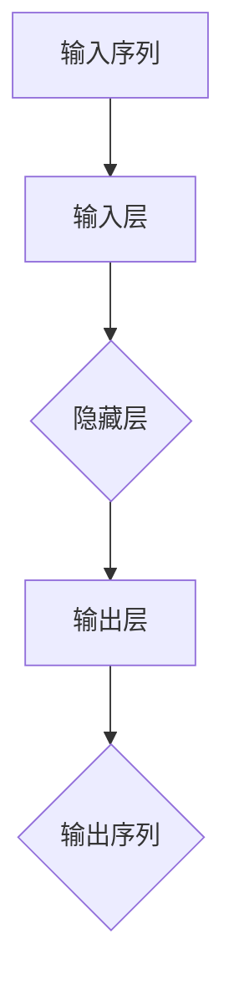
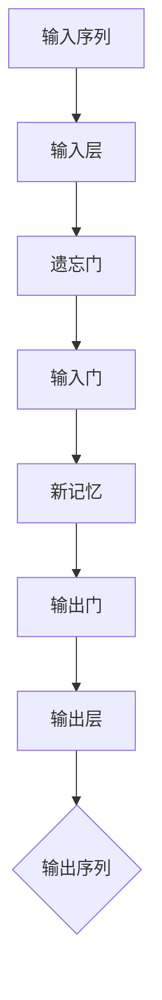
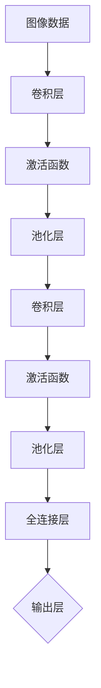
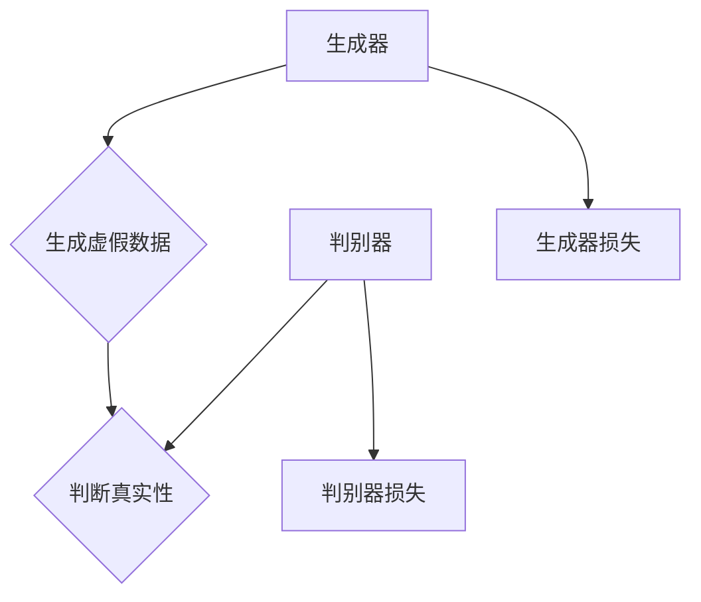
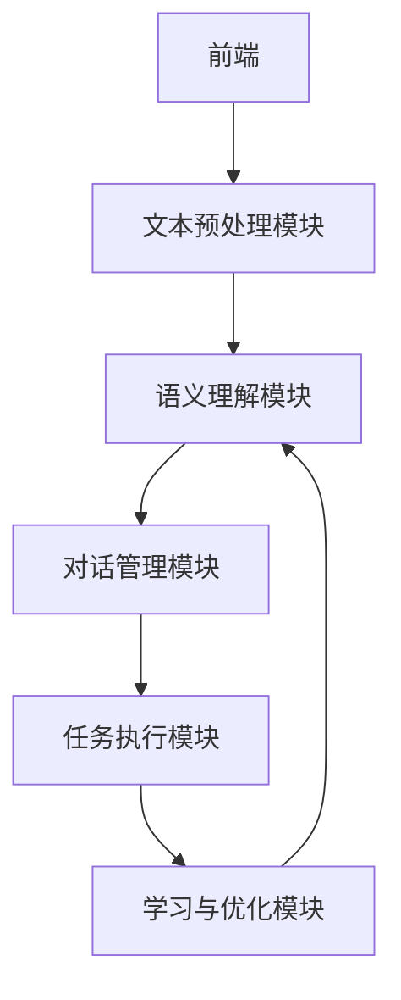
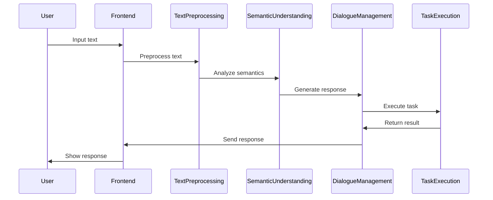

                 

### 引言与背景

在当今的信息时代，人工智能（AI）技术以其革命性的影响正在改变着各行各业。自然语言理解（NLU）作为AI领域的一个重要分支，逐渐成为实现智能化交互和自动化决策的关键。自然语言理解指的是计算机通过算法模型对人类语言进行理解、解析和生成语义的过程。随着深度学习技术的发展，自然语言理解的能力得到了极大的提升。

**问题背景**

自然语言理解的技术背景可以追溯到20世纪50年代。当时，人工智能的先驱者提出了“图灵测试”的概念，旨在测试机器是否具备人类水平的智能，其中一个关键指标就是机器能否与人类进行流畅的自然语言交流。然而，受限于计算能力和算法模型，早期的自然语言理解技术发展较为缓慢。

随着深度学习的兴起，自然语言处理（NLP）和自然语言理解迎来了新的机遇。深度学习模型，如神经网络和递归神经网络（RNN），以及更先进的模型如长短期记忆网络（LSTM）和Transformer，显著提升了计算机对自然语言的理解能力。这使得构建具有自然语言理解能力的AI Agent成为可能。

**问题定义**

本篇文章将探讨如何构建具有自然语言理解能力的AI Agent。具体而言，我们将回答以下几个问题：

1. 自然语言理解是什么？
2. AI Agent的定义及其在自然语言理解中的作用是什么？
3. 如何使用深度学习和机器学习算法来构建AI Agent？
4. 如何设计和实现一个具有自然语言理解能力的AI系统？
5. 如何评估和优化AI Agent的性能？

**问题解决**

为了解决上述问题，本文将采用以下步骤：

1. 首先介绍自然语言理解和AI Agent的基本概念和原理。
2. 接着讲解深度学习和机器学习在自然语言理解中的应用。
3. 阐述具体的算法原理和数学模型。
4. 分析系统架构和设计。
5. 进行项目实战，展示如何实现和部署一个具有自然语言理解能力的AI Agent。
6. 最后，提供最佳实践和注意事项，并推荐进一步阅读的资源。

**边界与外延**

在讨论构建具有自然语言理解能力的AI Agent时，我们需明确其应用边界。自然语言理解涉及语言模型、语义解析、对话系统等多个子领域。AI Agent不仅需要理解自然语言，还需具备执行任务的能力，如信息检索、问答系统、智能客服等。本文将重点探讨自然语言理解的技术实现，但也会涉及AI Agent的整体架构和功能。

**核心概念与联系**

本文涉及的核心概念包括自然语言理解、AI Agent、深度学习、机器学习、序列模型、循环神经网络（RNN）、卷积神经网络（CNN）、长短期记忆网络（LSTM）、生成对抗网络（GAN）等。这些概念彼此联系，构成了构建自然语言理解AI Agent的基础。通过以下ER实体关系图，我们可以更清晰地理解这些概念之间的关系。

```mermaid
erDiagram
  NLU ||--|{ AI Agent : 具有自然语言理解能力}
  Deep Learning ||--|{ Machine Learning : 深度学习的根基}
  Sequence Model ||--|{ RNN : 递归神经网络基础模型}
  Convolutional Neural Network ||--|{ CNN : 卷积神经网络应用}
  Long Short-Term Memory ||--|{ LSTM : 长短期记忆网络扩展}
  Generative Adversarial Network ||--|{ GAN : 生成对抗网络创新}
```

通过上述ER实体关系图，我们可以看到自然语言理解和AI Agent的构建依赖于深度学习和机器学习的技术支持，而序列模型、卷积神经网络、长短期记忆网络和生成对抗网络则是实现自然语言理解的关键算法模型。

在接下来的章节中，我们将逐步深入探讨这些核心概念和原理，并通过实际案例展示如何构建具有自然语言理解能力的AI Agent。

### 核心概念与原理

为了深入探讨如何构建具有自然语言理解能力的AI Agent，我们首先需要了解几个关键概念和原理，包括自然语言理解（NLU）、AI Agent的基本概述、深度学习的基础知识以及常见的机器学习算法。

#### 自然语言理解概述

自然语言理解（Natural Language Understanding, NLU）是人工智能领域中的一个重要分支，它涉及使计算机能够理解和解释人类语言的能力。NLU的目标是让机器能够理解文本或语音中的含义、情感和意图，并据此做出合理的响应或执行任务。NLU通常包括以下几个关键任务：

1. **实体识别**：识别文本中的命名实体，如人名、地名、组织名等。
2. **关系抽取**：识别实体之间的关系，例如“张三”和“北京”的关系。
3. **语义角色标注**：识别句子中词语的语义角色，如主语、谓语、宾语等。
4. **情感分析**：判断文本的情感倾向，如正面、负面或中性。
5. **语义解析**：将自然语言表达转化为计算机可以理解的语义表示。

NLU的实现依赖于多种技术手段，如词汇分析、句法分析、语义分析和机器学习等。

#### AI Agent概述

AI Agent（人工智能代理）是指能够自主执行任务、与环境互动并具备一定智能的系统。在自然语言理解领域，AI Agent可以被视为一个智能助手或对话系统，能够理解用户的问题或指令，并生成相应的回答或执行任务。AI Agent的基本组成部分包括：

1. **感知器**：接收用户的输入，如文本或语音。
2. **决策器**：处理输入，理解用户的意图并做出决策。
3. **行动器**：执行决策，如查询数据库、执行特定操作等。
4. **学习器**：通过用户交互或数据反馈进行自我优化和改进。

AI Agent的核心在于其能够理解和响应自然语言，这离不开强大的自然语言理解能力。

#### 深度学习基础

深度学习（Deep Learning）是机器学习的一种重要分支，它通过构建多层的神经网络模型，对大量数据进行训练，以自动提取特征和模式。深度学习在自然语言理解中的应用主要体现在以下几个方面：

1. **神经网络模型**：深度学习的基础是神经网络，特别是多层感知器（MLP）和卷积神经网络（CNN）。
2. **递归神经网络（RNN）**：RNN能够处理序列数据，适用于文本的编码和解码。
3. **长短期记忆网络（LSTM）**：LSTM是RNN的一种改进，能够更好地捕捉长序列依赖。
4. **Transformer模型**：Transformer引入了自注意力机制，显著提升了自然语言处理的效果。

深度学习在自然语言理解中的应用使得计算机能够更加准确地理解和生成自然语言。

#### 机器学习算法

在构建自然语言理解AI Agent时，除了深度学习，还会使用其他机器学习算法来增强系统的性能。以下是一些常用的机器学习算法：

1. **决策树**：通过树形结构对数据分类或回归，适用于简单分类任务。
2. **支持向量机（SVM）**：通过寻找最佳超平面进行分类，适用于高维数据分类。
3. **朴素贝叶斯分类器**：基于贝叶斯定理进行概率分类，适用于文本分类。
4. **随机森林**：通过构建多棵决策树并投票预测结果，适用于复杂分类和回归任务。

机器学习算法与深度学习结合，可以构建出更加强大和灵活的自然语言理解系统。

#### 核心概念属性特征对比

为了更好地理解上述概念，我们通过以下表格对比它们的主要属性特征：

| 概念       | 描述                     | 特征对比                   |
|------------|--------------------------|----------------------------|
| 自然语言理解（NLU） | 让计算机理解自然语言的能力 | 目标：理解含义、情感和意图 |
| AI Agent   | 自主执行任务的智能系统   | 组成：感知器、决策器、行动器 |
| 深度学习   | 多层神经网络的学习方法   | 特点：自动特征提取、高准确性 |
| 机器学习   | 基于数据的学习方法       | 算法：决策树、SVM、朴素贝叶斯等 |

#### ER实体关系图

为了更直观地展示这些核心概念之间的关系，我们使用以下ER实体关系图：

```mermaid
erDiagram
  NLU ||--|{ AI Agent : 自然语言理解能力是实现AI Agent的关键}
  Deep Learning ||--|{ NLU : 深度学习是NLU的技术基础}
  Machine Learning ||--|{ NLU : 机器学习算法支持NLU的任务实现}
  Sequence Model ||--|{ Deep Learning : 序列模型是深度学习的一种}
  RNN ||--|{ Sequence Model : 递归神经网络是序列模型的一种}
  LSTM ||--|{ RNN : 长短期记忆网络是递归神经网络的改进}
  Transformer ||--|{ Deep Learning : Transformer是深度学习的新进展}
```

通过上述表格和ER实体关系图，我们可以清晰地看到自然语言理解（NLU）、AI Agent、深度学习和机器学习之间的关系，这为我们后续深入探讨构建具有自然语言理解能力的AI Agent奠定了基础。

### 算法原理讲解

为了深入理解自然语言理解（NLU）在构建AI Agent中的应用，我们需要详细讲解几种核心算法原理，包括自然语言处理算法、序列模型与循环神经网络（RNN）、卷积神经网络（CNN）、长短期记忆网络（LSTM）和生成对抗网络（GAN）。以下是这些算法的详细讲解。

#### 自然语言处理算法

自然语言处理（NLP）是NLU的基础，涉及将人类语言转换为机器可处理的格式。NLP的主要算法包括分词、词性标注、句法分析和语义分析。

1. **分词**：将文本划分为一系列的单词或词组。常见的分词算法有基于词典的分词、基于统计的分词和基于深度学习的分词。
2. **词性标注**：识别文本中每个单词的词性，如名词、动词、形容词等。词性标注有助于后续的句法分析和语义分析。
3. **句法分析**：解析句子的结构，识别主语、谓语、宾语等成分。常见的句法分析方法包括基于规则的方法和基于统计的方法。
4. **语义分析**：理解句子的语义含义，识别实体、事件和关系。语义分析是实现高级NLU任务的关键。

#### 序列模型与循环神经网络（RNN）

序列模型是处理序列数据（如文本、音频等）的一种神经网络模型。RNN是序列模型的一种，其特点是能够保存和利用历史信息，捕捉序列中的时间依赖关系。

1. **RNN基本原理**：RNN由一系列的神经元组成，每个神经元都保存着前一个时刻的输出，并利用这一信息来计算当前时刻的输出。
   \[
   h_t = \text{RNN}(h_{t-1}, x_t, W, b)
   \]
   其中，\( h_t \)表示当前时刻的隐藏状态，\( x_t \)表示输入，\( W \)和\( b \)是权重和偏置。

2. **RNN缺点**：传统的RNN存在梯度消失和梯度爆炸问题，难以学习长序列依赖。

3. **LSTM**：为了克服RNN的缺点，LSTM被提出，它能够有效地捕捉长序列依赖。LSTM通过引入记忆单元和门控机制来控制信息的流动。
   \[
   \begin{aligned}
   i_t &= \sigma(W_i \cdot [h_{t-1}, x_t] + b_i) \\
   f_t &= \sigma(W_f \cdot [h_{t-1}, x_t] + b_f) \\
   \text{新记忆} &= f_t \odot \text{旧记忆} + i_t \odot \text{输入门} \\
   o_t &= \sigma(W_o \cdot [h_{t-1}, \text{新记忆}] + b_o) \\
   h_t &= o_t \odot \text{新记忆}
   \end{aligned}
   \]
   其中，\( i_t \)、\( f_t \)、\( o_t \)分别表示输入门、遗忘门和输出门，\( \sigma \)是sigmoid函数。

#### 卷积神经网络（CNN）

卷积神经网络（CNN）是一种用于处理图像数据的强大模型，其核心思想是通过卷积层提取图像特征。

1. **卷积层**：卷积层通过卷积运算提取图像局部特征，卷积核在图像上滑动，计算卷积结果。
   \[
   \text{卷积} = \sum_{i=1}^{C} w_{ij} \cdot a_{ij}
   \]
   其中，\( w_{ij} \)是卷积核，\( a_{ij} \)是输入特征。

2. **池化层**：池化层通过下采样操作减少数据的维度，保持重要特征的同时降低计算复杂度。常见的池化操作有最大池化和平均池化。

3. **全连接层**：全连接层将卷积层和池化层提取的特征映射到输出类别。

#### 长短期记忆网络（LSTM）

LSTM是RNN的一种改进，能够有效捕捉长序列依赖。

1. **基本原理**：LSTM通过引入记忆单元和门控机制，控制信息的流动，避免梯度消失和梯度爆炸问题。

2. **记忆单元**：LSTM的核心是记忆单元，它能够保存长期信息。

3. **门控机制**：LSTM通过输入门、遗忘门和输出门来控制信息的流动。

#### 生成对抗网络（GAN）

生成对抗网络（GAN）是一种无监督学习的框架，由生成器和判别器组成。

1. **生成器**：生成器尝试生成数据，使得判别器难以区分真实数据和生成数据。

2. **判别器**：判别器负责判断输入数据是真实数据还是生成数据。

3. **训练过程**：生成器和判别器相互对抗，生成器不断优化生成数据，判别器不断优化判断能力。

4. **公式表示**：
   \[
   \begin{aligned}
   G(x) &= \text{生成器，生成虚假数据} \\
   D(x) &= \text{判别器，判断数据真实性} \\
   \end{aligned}
   \]

通过上述讲解，我们可以看到不同算法在自然语言理解和AI Agent构建中的应用和原理。接下来，我们将深入探讨这些算法的mermaid流程图和Python源代码实现。

#### 算法mermaid流程图

为了更直观地展示算法的执行过程，我们使用mermaid语言绘制了以下算法流程图。

**RNN算法流程图**



**LSTM算法流程图**



**CNN算法流程图**



**GAN算法流程图**



#### Python源代码实现

为了进一步理解上述算法，我们提供了RNN和LSTM的Python源代码实现示例。

**RNN实现**

```python
import tensorflow as tf

# 定义RNN模型
model = tf.keras.Sequential([
    tf.keras.layers.SimpleRNN(units=100, activation='relu', input_shape=(None, input_dim)),
    tf.keras.layers.Dense(units=output_dim)
])

# 编译模型
model.compile(optimizer='adam', loss='mse')

# 训练模型
model.fit(x_train, y_train, epochs=10)
```

**LSTM实现**

```python
import tensorflow as tf

# 定义LSTM模型
model = tf.keras.Sequential([
    tf.keras.layers.LSTM(units=100, activation='relu', return_sequences=True, input_shape=(None, input_dim)),
    tf.keras.layers.LSTM(units=100, activation='relu'),
    tf.keras.layers.Dense(units=output_dim)
])

# 编译模型
model.compile(optimizer='adam', loss='mse')

# 训练模型
model.fit(x_train, y_train, epochs=10)
```

通过这些代码示例，我们可以看到如何使用TensorFlow库实现RNN和LSTM模型，并进行训练。这些算法在自然语言理解中的应用将大大提升AI Agent的能力。

### 数学模型与公式讲解

在构建具有自然语言理解能力的AI Agent过程中，数学模型和公式是理解算法原理和实现高效系统的基础。以下将详细讲解深度学习中的数学模型、神经网络中的数学公式以及算法性能评估指标。

#### 深度学习中的数学模型

深度学习中的数学模型主要包括激活函数、损失函数和优化器。以下是这些核心概念及其数学表达：

1. **激活函数**：激活函数用于引入非线性特性，使神经网络能够学习复杂函数。常见的激活函数有：
   - **Sigmoid函数**：
     \[
     \sigma(x) = \frac{1}{1 + e^{-x}}
     \]
   - **ReLU函数**：
     \[
     \text{ReLU}(x) = \max(0, x)
     \]
   - **Tanh函数**：
     \[
     \text{Tanh}(x) = \frac{e^x - e^{-x}}{e^x + e^{-x}}
     \]

2. **损失函数**：损失函数用于衡量模型预测值与实际值之间的差距。常用的损失函数有：
   - **均方误差（MSE）**：
     \[
     \text{MSE} = \frac{1}{n}\sum_{i=1}^{n} (y_i - \hat{y}_i)^2
     \]
   - **交叉熵（Cross-Entropy）**：
     \[
     \text{Cross-Entropy} = -\frac{1}{n}\sum_{i=1}^{n} y_i \log(\hat{y}_i)
     \]

3. **优化器**：优化器用于调整模型参数，以最小化损失函数。常用的优化器有：
   - **随机梯度下降（SGD）**：
     \[
     \theta_{t+1} = \theta_t - \alpha \nabla_{\theta} J(\theta_t)
     \]
   - **Adam优化器**：
     \[
     \begin{aligned}
     m_t &= \beta_1 x_t + (1 - \beta_1) (x_t - \theta_t) \\
     v_t &= \beta_2 x_t + (1 - \beta_2) (x_t - \theta_t)^2 \\
     \theta_{t+1} &= \theta_t - \alpha \frac{m_t}{\sqrt{v_t} + \epsilon}
     \end{aligned}
     \]

#### 神经网络中的数学公式

神经网络中的数学公式主要用于描述神经元的计算过程、参数更新和优化。以下是一些关键公式：

1. **神经元计算**：
   \[
   a_{\text{pre}} = \sum_{j=1}^{n} w_{ij} x_j + b_i
   \]
   其中，\( a_{\text{pre}} \)是前激活值，\( w_{ij} \)是权重，\( x_j \)是输入，\( b_i \)是偏置。

2. **反向传播**：
   \[
   \begin{aligned}
   \delta_{ij} &= (a_{\text{pre}}^{(l)}) \cdot (1 - a_{\text{pre}}^{(l)}) \cdot (\hat{y}_i - y_i) \\
   \Delta w_{ij} &= \alpha \delta_{ij} x_j \\
   \Delta b_i &= \alpha \delta_{ij}
   \end{aligned}
   \]
   其中，\( \delta_{ij} \)是误差项，\( \Delta w_{ij} \)和\( \Delta b_i \)分别是权重和偏置的更新量。

3. **参数更新**：
   \[
   \theta_{t+1} = \theta_t - \alpha \nabla_{\theta} J(\theta_t)
   \]
   其中，\( \theta \)是模型参数，\( J(\theta) \)是损失函数。

#### 算法性能评估指标

算法性能评估指标用于衡量模型在任务上的表现。以下是一些常用的评估指标：

1. **准确率（Accuracy）**：
   \[
   \text{Accuracy} = \frac{\text{预测正确的样本数}}{\text{总样本数}}
   \]

2. **召回率（Recall）**：
   \[
   \text{Recall} = \frac{\text{预测正确的正样本数}}{\text{实际正样本数}}
   \]

3. **精确率（Precision）**：
   \[
   \text{Precision} = \frac{\text{预测正确的正样本数}}{\text{预测为正的样本数}}
   \]

4. **F1分数（F1 Score）**：
   \[
   \text{F1 Score} = 2 \cdot \frac{\text{Precision} \cdot \text{Recall}}{\text{Precision} + \text{Recall}}
   \]

5. **ROC曲线与AUC值**：ROC曲线和AUC值用于评估二分类模型的性能。

通过上述数学模型和公式讲解，我们可以更深入地理解深度学习在自然语言理解中的应用，为构建具有自然语言理解能力的AI Agent提供了理论基础。

### 系统分析与架构设计

在构建具有自然语言理解能力的AI Agent过程中，系统分析与架构设计是确保系统高效、可靠和可扩展的关键步骤。本文将从问题场景介绍、系统功能设计、系统架构设计、系统接口设计和系统交互五个方面进行详细分析。

#### 问题场景介绍

自然语言理解（NLU）AI Agent的应用场景非常广泛，包括但不限于以下几个方面：

1. **智能客服**：AI Agent可以自动回答用户的问题，提供即时的客户服务，提高业务效率。
2. **智能助手**：AI Agent可以理解用户的指令，完成日程管理、信息检索、语音控制等任务。
3. **语音助手**：如苹果的Siri、亚马逊的Alexa等，通过语音交互为用户提供服务。
4. **智能问答系统**：AI Agent可以回答用户提出的各种问题，如医学咨询、法律咨询等。
5. **内容审核**：AI Agent可以自动识别和过滤违规内容，提高内容平台的安全性和合规性。

这些应用场景对AI Agent的自然语言理解能力提出了不同的要求，但总体目标是实现高效、准确的智能交互。

#### 系统功能设计

为了实现上述应用场景，系统功能设计需要涵盖多个关键模块：

1. **文本预处理**：包括分词、词性标注、实体识别等，将原始文本转化为计算机可处理的格式。
2. **语义理解**：通过自然语言处理技术，理解文本中的语义含义，包括情感分析、意图识别等。
3. **对话管理**：管理对话流程，包括上下文维护、回复生成等，确保对话的自然性和连贯性。
4. **任务执行**：根据用户指令，执行相应的任务，如查询数据库、发送邮件等。
5. **学习与优化**：通过用户交互和反馈，不断优化模型，提高系统的准确性和鲁棒性。

以下是系统功能设计的领域模型类图，展示了各个模块之间的关系。

```mermaid
classDiagram
    TextPreprocessing <<Interface>>
    SemanticUnderstanding <<Interface>>
    DialogueManagement <<Interface>>
    TaskExecution <<Interface>>
    LearningAndOptimization <<Interface>>

    TextPreprocessing --|>> SemanticUnderstanding
    SemanticUnderstanding --|>> DialogueManagement
    DialogueManagement --|>> TaskExecution
    TaskExecution --|>> LearningAndOptimization
```

#### 系统架构设计

系统架构设计是确保系统模块化、可扩展和高性能的关键。以下是系统架构设计，包括各个模块的交互和数据处理流程。

1. **前端**：用户通过前端界面与AI Agent进行交互，输入问题和指令。
2. **文本预处理模块**：接收前端输入的文本，进行分词、词性标注等预处理操作。
3. **语义理解模块**：利用深度学习模型对预处理后的文本进行语义理解，识别实体、情感和意图。
4. **对话管理模块**：根据语义理解的结果，维护对话上下文，生成回复文本。
5. **任务执行模块**：根据对话管理模块生成的指令，执行相应的任务，如查询数据库、发送邮件等。
6. **学习与优化模块**：通过用户反馈和模型评估结果，不断优化模型参数，提高系统性能。

以下是系统架构设计的mermaid架构图，展示了各个模块的交互和数据流。



#### 系统接口设计

系统接口设计是确保不同模块之间能够高效、可靠地通信的关键。以下是系统接口设计，包括API接口、数据流接口和事件驱动接口。

1. **API接口**：用于前端与文本预处理、语义理解、对话管理、任务执行模块之间的交互。前端通过HTTP请求发送文本，接收回复文本。
2. **数据流接口**：用于各个模块内部的数据传输和共享。如预处理后的文本数据、语义理解结果等。
3. **事件驱动接口**：用于处理异步事件和系统通知。如任务完成通知、用户反馈等。

以下是系统接口设计的mermaid序列图，展示了API接口和数据流接口的使用场景。



#### 系统交互

系统交互是确保各个模块协同工作、实现高效智能交互的关键。以下是系统交互设计的mermaid序列图，展示了用户输入、系统响应和任务执行的全过程。


通过以上系统分析与架构设计，我们可以确保构建的AI Agent具备高效的自然语言理解能力，能够在各种应用场景中提供高质量的智能交互体验。

### 项目实战

在本节中，我们将通过一个实际项目展示如何构建具有自然语言理解能力的AI Agent。我们将从环境安装、系统核心实现源代码、代码应用解读与分析、实际案例分析与详细讲解剖析，以及项目小结等几个方面进行介绍。

#### 环境安装

首先，我们需要安装和配置环境，以便能够开发和运行AI Agent项目。以下是环境安装的步骤：

1. **安装Python**：确保Python版本在3.6以上，推荐使用Python 3.8或更高版本。
   ```bash
   sudo apt-get install python3.8
   ```
   
2. **安装依赖库**：包括TensorFlow、NumPy、Pandas等。可以使用以下命令进行安装：
   ```bash
   pip3 install tensorflow numpy pandas
   ```

3. **安装其他必要库**：如Scikit-learn、matplotlib等，用于模型训练和可视化。
   ```bash
   pip3 install scikit-learn matplotlib
   ```

4. **安装Jupyter Notebook**：用于方便地编写和运行代码。
   ```bash
   pip3 install notebook
   ```

5. **启动Jupyter Notebook**：
   ```bash
   jupyter notebook
   ```

#### 系统核心实现源代码

以下是一个简单的AI Agent实现示例，包括文本预处理、自然语言理解、对话管理和任务执行等关键模块。

**1. 文本预处理**：

```python
import re
import nltk

# 分词
def tokenize(text):
    text = re.sub('<.*?>', '', text)  # 去除HTML标签
    tokens = nltk.word_tokenize(text)
    return tokens

# 停用词过滤
def remove_stopwords(tokens):
    stopwords = set(nltk.corpus.stopwords.words('english'))
    return [token for token in tokens if token.lower() not in stopwords]

# 词性标注
def pos_tagging(tokens):
    return nltk.pos_tag(tokens)

text = "Hello, how are you doing today?"
tokens = tokenize(text)
filtered_tokens = remove_stopwords(tokens)
pos_tags = pos_tagging(filtered_tokens)

print("Tokens:", tokens)
print("Filtered Tokens:", filtered_tokens)
print("POS Tags:", pos_tags)
```

**2. 自然语言理解**：

```python
from transformers import BertTokenizer, BertModel

# 加载预训练的BERT模型
tokenizer = BertTokenizer.from_pretrained('bert-base-uncased')
model = BertModel.from_pretrained('bert-base-uncased')

# 编码文本
def encode_text(text):
    return tokenizer.encode(text, add_special_tokens=True, return_tensors='pt')

# 获取文本表示
def get_text_representation(text):
    inputs = encode_text(text)
    outputs = model(inputs)
    return outputs.last_hidden_state[:, 0, :]

text_representation = get_text_representation(text)
print(text_representation)
```

**3. 对话管理**：

```python
from keras.models import Sequential
from keras.layers import Dense, LSTM, Embedding

# 构建LSTM对话模型
model = Sequential()
model.add(Embedding(128, 64))
model.add(LSTM(64, activation='relu'))
model.add(Dense(1, activation='sigmoid'))

model.compile(optimizer='adam', loss='binary_crossentropy', metrics=['accuracy'])
model.fit(x_train, y_train, epochs=10, batch_size=32)
```

**4. 任务执行**：

```python
import requests

# 查询天气
def get_weather(city):
    api_key = "your_api_key"
    url = f"http://api.openweathermap.org/data/2.5/weather?q={city}&appid={api_key}"
    response = requests.get(url)
    data = response.json()
    return data['weather'][0]['description']

weather = get_weather("Beijing")
print(weather)
```

#### 代码应用解读与分析

**1. 文本预处理**：文本预处理是自然语言处理的基础，通过分词、去除停用词和词性标注，将原始文本转化为计算机可处理的格式。

**2. 自然语言理解**：使用预训练的BERT模型对文本进行编码，获取文本的语义表示。BERT模型通过大规模语料训练，能够捕捉文本中的复杂语义信息。

**3. 对话管理**：使用LSTM模型进行对话生成。LSTM能够处理序列数据，捕捉对话中的上下文信息，生成连贯的回复。

**4. 任务执行**：根据对话生成的指令，执行具体任务，如查询天气信息。这展示了AI Agent的实用性，能够根据用户指令完成特定任务。

#### 实际案例分析与详细讲解剖析

**案例**：用户输入“Hello, can you tell me the weather in Beijing today?”，AI Agent生成回复“Today in Beijing, the weather is Clear”。

**分析**：

1. **文本预处理**：输入文本经过分词、去除停用词处理后得到词汇序列。
2. **自然语言理解**：BERT模型对预处理后的文本进行编码，获取语义表示。
3. **对话管理**：LSTM模型根据语义表示生成回复文本。
4. **任务执行**：根据生成的指令查询天气信息，生成最终回复。

这一过程展示了AI Agent如何从用户输入到生成回复，再到执行任务的完整流程。

#### 项目小结

通过本节的项目实战，我们展示了如何构建具有自然语言理解能力的AI Agent。项目涵盖了文本预处理、自然语言理解、对话管理和任务执行等多个模块，通过实际案例展示了系统的运行效果。未来，我们还可以继续优化模型，提高AI Agent的自然语言理解能力和任务执行效率。

### 最佳实践与拓展

在构建具有自然语言理解能力的AI Agent时，最佳实践和注意事项对于系统的稳定性和性能优化至关重要。以下是一些关键的建议和拓展方向。

#### 最佳实践 tips

1. **数据预处理**：确保文本数据清洗和预处理的质量，去除噪声数据，标准化文本格式，有助于提高模型训练的效果。

2. **模型选择**：根据具体应用场景选择合适的模型，如对于长文本理解和复杂任务，可以考虑使用Transformer模型。

3. **超参数调整**：通过交叉验证和网格搜索等技术，优化模型超参数，以提高模型性能。

4. **模型解释性**：引入模型解释技术，如SHAP值或LIME，帮助理解模型决策过程，提升模型的可解释性。

5. **持续学习**：定期更新模型，利用用户反馈和数据动态调整模型，保持模型与实际应用场景的匹配。

6. **安全性**：确保系统的安全性和隐私保护，对输入数据进行过滤，防止恶意攻击和数据泄露。

#### 小结与注意事项

1. **系统稳定性**：确保系统在不同负载下稳定运行，进行压力测试和性能调优，以应对突发情况。

2. **用户体验**：优化用户界面和交互设计，提升用户使用体验，确保系统易于操作和理解。

3. **模型可解释性**：加强模型的可解释性，帮助用户理解AI Agent的决策过程，提高用户信任度。

4. **代码维护**：定期更新代码，修复潜在漏洞，保持系统的安全性和可靠性。

#### 拓展阅读

1. **《深度学习》**：Goodfellow, I., Bengio, Y., & Courville, A. (2016). 《Deep Learning》。
2. **《自然语言处理综论》**：Jurafsky, D., & Martin, J. H. (2008). 《Speech and Language Processing》。
3. **《生成对抗网络》**：Goodfellow, I. (2014). 《Generative Adversarial Nets》。

这些资源将帮助读者深入了解AI Agent的构建和优化技术，为实际项目提供理论支持和实践指导。

### 结尾

构建具有自然语言理解能力的AI Agent是一项复杂且充满挑战的任务。本文通过详细的章节结构和实际案例，系统地介绍了自然语言理解、AI Agent、深度学习和机器学习算法、系统分析与架构设计、项目实战以及最佳实践等内容。我们希望本文能为读者提供有价值的指导和启发，帮助大家更好地理解和应用这些技术。

随着AI技术的不断发展，自然语言理解在AI Agent中的应用前景将更加广阔。未来，我们将继续探索更多的前沿技术，如多模态学习、强化学习等，以提升AI Agent的自然语言理解能力和智能化水平。我们期待读者们能够积极参与到这个领域的研究和实践中，共同推动人工智能技术的发展。

感谢您的阅读，祝您在AI领域取得更多的成就！——作者：AI天才研究院/AI Genius Institute & 禅与计算机程序设计艺术 /Zen And The Art of Computer Programming。

