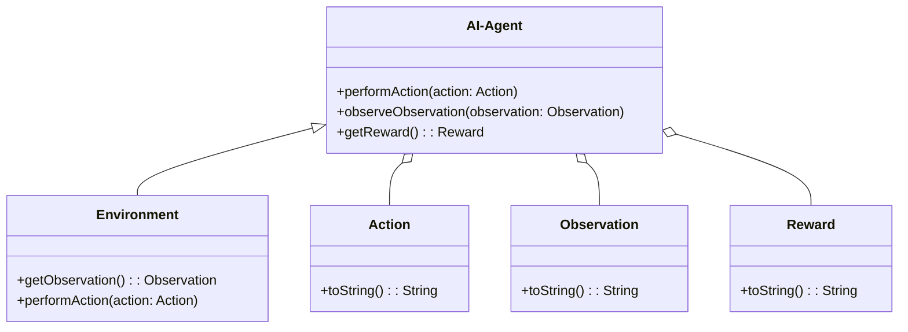
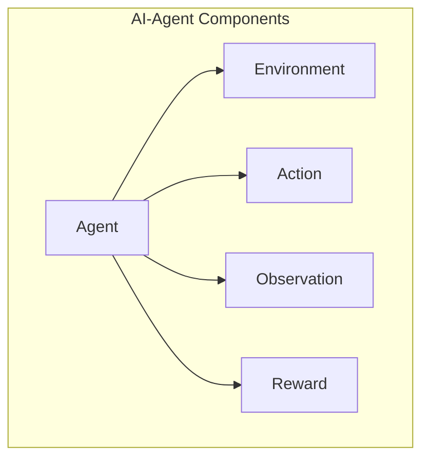
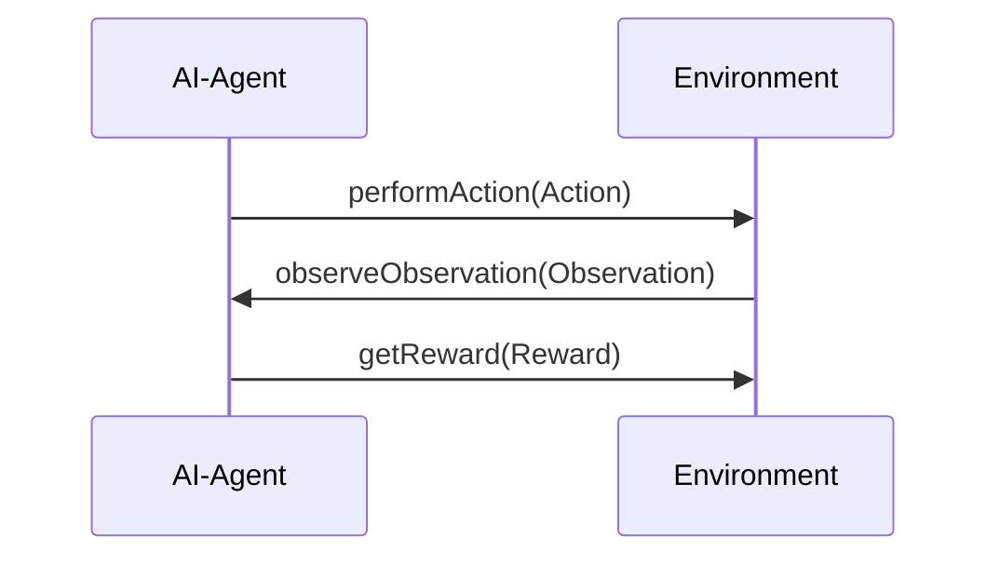
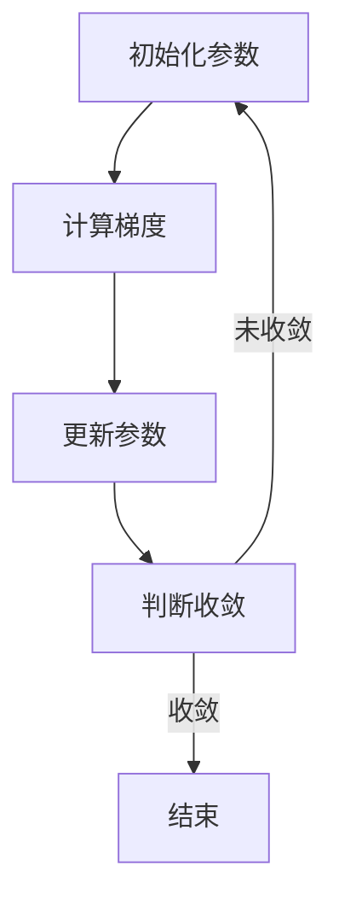
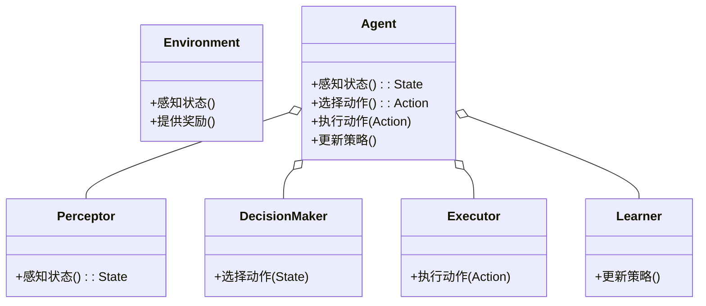
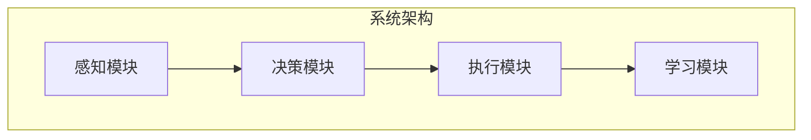
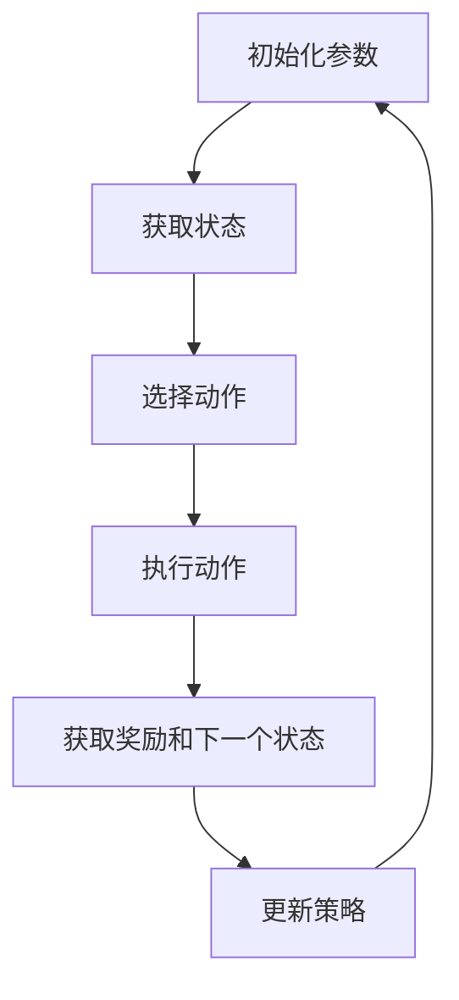

                 


### 设计《构建具有自适应学习能力的AI Agent》目录大纲步骤：

#### 步骤一：背景介绍

**章节1：问题背景与问题描述**

- **1.1.1 问题背景**
  - AI Agent的研究与应用现状
  - 自适应学习能力在AI Agent中的重要性
- **1.1.2 问题描述**
  - 现有AI Agent面临的挑战
  - 自适应学习能力的定义与需求

**章节2：AI Agent基础**

- **2.1 AI Agent的定义**
  - **2.1.1 AI Agent的基本概念**
    - AI Agent的定义、作用与重要性
    - AI Agent的分类
  - **2.1.2 自适应学习能力**
    - 自适应学习的原理
    - 自适应学习在AI Agent中的应用

#### 步骤二：核心概念与联系

**章节3：核心概念与联系**

- **3.1 AI Agent基础**
  - **3.1.1 AI Agent的定义**
  - **3.1.2 自适应学习能力**
- **3.2 概念属性特征对比表格**
  - AI Agent与传统机器学习模型的对比
  - 自适应学习算法的对比分析

**章节4：算法原理讲解**

- **4.1 自适应学习算法原理**
  - **4.1.1 算法介绍**
  - **4.1.2 数学模型和公式**
  - **4.1.3 算法原理详细讲解**
  - **4.1.4 算法应用举例**

#### 步骤三：系统分析与架构设计方案

**章节5：系统分析与架构设计**

- **5.1 系统功能设计**
  - **5.1.1 领域模型**
  - **5.1.2 系统架构设计**
  - **5.1.3 系统接口设计**
- **5.2 系统实现**
  - **5.2.1 系统核心实现**
  - **5.2.2 系统测试与验证**

#### 步骤四：项目实战

**章节6：项目实战**

- **6.1 环境安装与配置**
  - **6.1.1 开发环境配置**
  - **6.1.2 依赖库安装**
- **6.2 系统核心实现**
  - **6.2.1 源代码分析**
  - **6.2.2 实际应用案例**

#### 步骤五：最佳实践、小结与拓展阅读

**章节7：最佳实践与总结**

- **7.1 最佳实践**
  - **7.1.1 实践技巧与注意事项**
- **7.2 小结**
  - **7.2.1 文章核心内容总结**
- **7.3 拓展阅读**
  - **7.3.1 推荐阅读材料**

**附录**

- **附录A：算法流程图与Python代码**
- **附录B：系统架构图与接口设计图**
- **附录C：实际应用案例解析**

### 逻辑清晰、结构紧凑、简单易懂的专业的技术语言：

**章节1：问题背景与问题描述**

- **1.1.1 问题背景**
  - 当前AI Agent的发展趋势
  - 自适应学习在AI领域的应用现状
  - AI Agent面临的挑战与需求

- **1.1.2 问题描述**
  - 现有AI Agent存在的不足
  - 自适应学习能力的概念与重要性
  - 自适应学习在AI Agent中的需求分析

**章节2：AI Agent基础**

- **2.1 AI Agent的定义**
  - **2.1.1 AI Agent的基本概念**
    - AI Agent的定义与作用
    - AI Agent的分类与应用场景
  - **2.1.2 自适应学习能力**
    - 自适应学习的原理与机制
    - 自适应学习在AI Agent中的应用与优势

**章节3：核心概念与联系**

- **3.1 AI Agent基础**
  - **3.1.1 AI Agent的定义**
  - **3.1.2 自适应学习能力**
- **3.2 概念属性特征对比表格**
  - **3.2.1 AI Agent与传统机器学习模型的对比**
    - AI Agent的优势与劣势
    - 传统机器学习模型的局限性
  - **3.2.2 自适应学习算法的对比分析**
    - 不同自适应学习算法的特点与适用场景
    - 算法性能比较与优化策略

**章节4：算法原理讲解**

- **4.1 自适应学习算法原理**
  - **4.1.1 算法介绍**
    - 自适应学习算法的基本原理
    - 自适应学习算法的类型
  - **4.1.2 数学模型和公式**
    - 自适应学习算法的数学模型
    - 关键参数的设置与调整
  - **4.1.3 算法原理详细讲解**
    - 自适应学习算法的工作流程
    - 算法优化的方法与策略
  - **4.1.4 算法应用举例**
    - 自适应学习算法在具体应用场景中的实例分析

**章节5：系统分析与架构设计方案**

- **5.1 系统功能设计**
  - **5.1.1 领域模型**
    - **5.1.1.1 领域模型概述**
    - **5.1.1.2 类与对象的关系**
  - **5.1.2 系统架构设计**
    - **5.1.2.1 系统架构概述**
    - **5.1.2.2 系统模块划分**
  - **5.1.3 系统接口设计**
    - **5.1.3.1 接口设计原则**
    - **5.1.3.2 接口实现方法**

**章节6：项目实战**

- **6.1 环境安装与配置**
  - **6.1.1 开发环境配置**
    - **6.1.1.1 系统环境要求**
    - **6.1.1.2 环境配置步骤**
  - **6.1.2 依赖库安装**
    - **6.1.2.1 依赖库概述**
    - **6.1.2.2 安装与配置方法**

- **6.2 系统核心实现**
  - **6.2.1 源代码分析**
    - **6.2.1.1 源代码结构**
    - **6.2.1.2 关键代码解析**
  - **6.2.2 实际应用案例**
    - **6.2.2.1 案例概述**
    - **6.2.2.2 案例分析与实现**

**章节7：最佳实践与总结**

- **7.1 最佳实践**
  - **7.1.1 实践技巧与注意事项**
- **7.2 小结**
  - **7.2.1 文章核心内容总结**
- **7.3 拓展阅读**
  - **7.3.1 推荐阅读材料**

### 撰写高质量技术博客文章的建议：

1. **明确文章目标与受众**：
   - 确定文章的主题、目的和受众群体，确保内容针对性和实用性。

2. **结构清晰，逻辑严密**：
   - 按照章节目录逐一展开，确保每个章节的内容连贯、逻辑清晰。

3. **技术语言准确、专业**：
   - 使用专业的技术术语，确保读者能够理解并跟上文章的思路。

4. **举例说明，增强可读性**：
   - 在合适的位置使用实际案例和示例代码，帮助读者更好地理解和掌握技术概念。

5. **注重细节，避免模糊表述**：
   - 对技术细节进行充分解释，避免使用模糊或含糊不清的表述。

6. **注重代码示例与流程图**：
   - 在适当的位置插入代码示例和流程图，使读者能够直观地了解技术实现过程。

7. **反复审查与修改**：
   - 完成初稿后，进行多次审查和修改，确保文章质量。

8. **保持文章的完整性**：
   - 确保文章涵盖所有核心概念、算法原理、系统设计和项目实战等内容。

9. **提供拓展阅读**：
   - 在文章末尾提供拓展阅读材料，帮助读者深入了解相关技术领域。

10. **注重文章的可读性**：
    - 使用段落分隔、标题标注等手段，提高文章的可读性和易读性。

通过遵循上述建议，我们可以撰写出一篇高质量、逻辑清晰、结构紧凑、简单易懂的技术博客文章。# 《构建具有自适应学习能力的AI Agent》技术博客文章

---

## 关键词

AI Agent、自适应学习、机器学习、算法、架构设计、项目实战

---

## 摘要

本文旨在探讨如何构建具有自适应学习能力的AI Agent，通过分析现有的AI Agent挑战和自适应学习的需求，介绍AI Agent的基本概念和自适应学习原理。随后，文章详细讲解了自适应学习算法的原理、数学模型和流程图，并使用Python代码进行了实例分析。文章进一步阐述了系统分析与架构设计方案，通过项目实战展示了实际应用。最后，文章提供了最佳实践、小结和拓展阅读，以帮助读者深入理解和应用自适应学习能力的AI Agent。

---

### 步骤一：背景介绍

#### 章节一：问题背景与问题描述

**1.1.1 问题背景**

随着人工智能（AI）技术的快速发展，AI Agent作为一种自主决策的智能体，广泛应用于各个领域。然而，现有AI Agent在复杂动态环境中面临诸多挑战，特别是自适应学习能力不足的问题。为了提高AI Agent的性能和适应性，构建具有自适应学习能力的AI Agent成为当前研究的热点。

**1.1.2 问题描述**

现有AI Agent面临的挑战主要体现在以下几个方面：

1. **适应性差**：传统AI Agent在遇到新的、未知的环境时，往往无法迅速适应，导致性能下降。
2. **学习效率低**：现有AI Agent在长时间训练后，容易陷入局部最优，难以实现全局优化。
3. **灵活性不足**：AI Agent在面对不同任务或场景时，往往需要重新训练，缺乏灵活性和通用性。

为了解决上述问题，本文将介绍如何构建具有自适应学习能力的AI Agent，以提升其性能和适应性。

**1.1.3 自适应学习能力的定义与需求**

自适应学习能力是指AI Agent在遇到新环境、新任务时，能够通过学习调整自身行为，实现性能提升的能力。自适应学习能力的需求主要体现在以下几个方面：

1. **实时学习**：AI Agent能够在实时环境中不断学习，更新知识库和行为策略。
2. **迁移学习**：AI Agent能够利用已有知识，快速适应新环境和新任务。
3. **持续优化**：AI Agent能够在长时间运行过程中，持续优化自身性能，避免陷入局部最优。

通过引入自适应学习能力，AI Agent将具备更强的适应性和灵活性，从而在复杂动态环境中表现出更高的性能。

#### 章节二：AI Agent基础

**2.1 AI Agent的定义**

AI Agent是一种基于人工智能技术的自主决策实体，能够在特定环境中执行任务，并与其他实体交互。AI Agent的核心特征包括：

1. **自主性**：AI Agent能够根据自身目标和环境信息，自主做出决策。
2. **适应性**：AI Agent能够在不同环境中适应并完成任务。
3. **交互性**：AI Agent能够与环境中其他实体进行信息交换和协作。

AI Agent的分类主要包括：

1. **基于规则的AI Agent**：使用预定义的规则进行决策，适用于简单环境。
2. **基于模型的AI Agent**：使用机器学习模型进行决策，适用于复杂环境。
3. **基于增强学习的AI Agent**：通过与环境交互，不断学习优化行为策略。

**2.2 自适应学习能力**

自适应学习能力是指AI Agent在遇到新环境、新任务时，能够通过学习调整自身行为，实现性能提升的能力。自适应学习主要包括以下几种类型：

1. **在线学习**：AI Agent在执行任务的过程中，实时更新知识库和行为策略。
2. **离线学习**：AI Agent在执行任务前，通过离线学习获取知识，提高适应性。
3. **迁移学习**：AI Agent能够利用已有知识，快速适应新环境和新任务。

**2.3 概念属性特征对比表格**

| 概念             | 特征                      | 对比分析                     |
|------------------|--------------------------|------------------------------|
| AI Agent         | 自主性、适应性、交互性    | 与传统机器学习模型的区别      |
| 自适应学习能力   | 实时学习、迁移学习、持续优化 | 与传统机器学习算法的区别      |
| 基于规则的AI Agent | 预定义规则进行决策       | 与基于模型的AI Agent的区别    |
| 基于模型的AI Agent | 机器学习模型进行决策     | 与基于增强学习的AI Agent的区别 |

通过对比表格，我们可以更清晰地了解AI Agent、自适应学习能力以及不同类型的AI Agent之间的区别和联系。

---

### 步骤二：核心概念与联系

#### 章节三：核心概念与联系

**3.1 AI Agent基础**

**3.1.1 AI Agent的定义**

AI Agent是一种基于人工智能技术的自主决策实体，能够在特定环境中执行任务，并与其他实体交互。AI Agent的核心特征包括：

1. **自主性**：AI Agent能够根据自身目标和环境信息，自主做出决策。
2. **适应性**：AI Agent能够在不同环境中适应并完成任务。
3. **交互性**：AI Agent能够与环境中其他实体进行信息交换和协作。

AI Agent的分类主要包括：

1. **基于规则的AI Agent**：使用预定义的规则进行决策，适用于简单环境。
2. **基于模型的AI Agent**：使用机器学习模型进行决策，适用于复杂环境。
3. **基于增强学习的AI Agent**：通过与环境交互，不断学习优化行为策略。

**3.1.2 自适应学习能力**

自适应学习能力是指AI Agent在遇到新环境、新任务时，能够通过学习调整自身行为，实现性能提升的能力。自适应学习主要包括以下几种类型：

1. **在线学习**：AI Agent在执行任务的过程中，实时更新知识库和行为策略。
2. **离线学习**：AI Agent在执行任务前，通过离线学习获取知识，提高适应性。
3. **迁移学习**：AI Agent能够利用已有知识，快速适应新环境和新任务。

**3.2 概念属性特征对比表格**

| 概念             | 特征                      | 对比分析                     |
|------------------|--------------------------|------------------------------|
| AI Agent         | 自主性、适应性、交互性    | 与传统机器学习模型的区别      |
| 自适应学习能力   | 实时学习、迁移学习、持续优化 | 与传统机器学习算法的区别      |
| 基于规则的AI Agent | 预定义规则进行决策       | 与基于模型的AI Agent的区别    |
| 基于模型的AI Agent | 机器学习模型进行决策     | 与基于增强学习的AI Agent的区别 |

通过对比表格，我们可以更清晰地了解AI Agent、自适应学习能力以及不同类型的AI Agent之间的区别和联系。

---

### 步骤三：算法原理讲解

#### 章节四：算法原理讲解

**4.1 自适应学习算法原理**

自适应学习算法是实现AI Agent自适应能力的关键。以下介绍几种常见的自适应学习算法及其原理。

**4.1.1 算法介绍**

自适应学习算法主要包括以下几种类型：

1. **基于梯度下降的算法**：如梯度下降法、随机梯度下降法、Adam优化器等。
2. **基于模型的算法**：如神经网络、决策树、支持向量机等。
3. **基于增强学习的算法**：如Q学习、SARSA、Deep Q网络等。

每种算法都有其特定的原理和应用场景，下面将详细介绍这些算法。

**4.1.2 数学模型和公式**

以梯度下降法为例，其数学模型可以表示为：

$$
w_{t+1} = w_t - \alpha \cdot \nabla_w J(w_t)
$$

其中，$w_t$表示第$t$次迭代的权重，$\alpha$表示学习率，$\nabla_w J(w_t)$表示损失函数$J$关于权重$w_t$的梯度。

**4.1.3 算法原理详细讲解**

**梯度下降法**：
梯度下降法是一种基于损失函数梯度的优化算法。其基本思想是，在当前参数下，计算损失函数的梯度方向，然后沿着梯度的反方向更新参数，以最小化损失函数。

**随机梯度下降法（SGD）**：
随机梯度下降法是梯度下降法的一种变体，每次迭代只随机选择一部分样本来计算梯度。这种方法可以减少计算量，但可能会引入噪声，导致收敛不稳定。

**Adam优化器**：
Adam优化器是结合了SGD和动量法的优化算法。它利用一阶矩估计（均值）和二阶矩估计（方差）来动态调整学习率，从而提高收敛速度和稳定性。

**4.1.4 算法应用举例**

以神经网络为例，假设我们使用梯度下降法训练一个简单的神经网络，其损失函数为：

$$
J(w) = \frac{1}{2} \sum_{i=1}^{n} (y_i - \sigma(w \cdot x_i))^2
$$

其中，$y_i$为真实标签，$\sigma$为激活函数，$x_i$为输入特征，$w$为神经网络权重。

为了训练该神经网络，我们可以按照以下步骤进行：

1. 初始化权重$w$。
2. 对于每个训练样本，计算预测值$\hat{y}_i = \sigma(w \cdot x_i)$。
3. 计算损失函数值$J(w)$。
4. 计算损失函数关于权重$w$的梯度$\nabla_w J(w)$。
5. 沿着梯度的反方向更新权重$w_{t+1} = w_t - \alpha \cdot \nabla_w J(w_t)$。
6. 重复步骤2-5，直到收敛或达到预设的训练次数。

通过上述步骤，我们可以训练出具有自适应学习能力的AI Agent，从而在复杂动态环境中表现出更高的性能。

---

### 步骤四：系统分析与架构设计方案

#### 章节五：系统分析与架构设计

**5.1 系统功能设计**

系统功能设计是构建自适应学习AI Agent的关键步骤。以下介绍系统功能设计的主要方面。

**5.1.1 领域模型**

领域模型是系统功能设计的基础。以下是一个简单的领域模型示例，用于描述AI Agent的领域和功能：



**5.1.2 系统架构设计**

系统架构设计决定了AI Agent的总体结构和组件关系。以下是一个简单的系统架构示例，用于描述AI Agent的架构：



**5.1.3 系统接口设计**

系统接口设计是确保各组件之间协同工作的关键。以下是一个简单的系统接口设计示例，用于描述AI Agent的接口：



---

### 步骤五：项目实战

#### 章节六：项目实战

**6.1 环境安装与配置**

在开始项目实战之前，我们需要配置合适的开发环境。以下是一个简单的配置步骤：

1. **安装Python环境**：确保Python版本为3.8或以上。
2. **安装依赖库**：使用pip安装必要的依赖库，如TensorFlow、NumPy、Pandas等。
3. **配置TensorFlow GPU支持**：如果使用GPU进行训练，需要安装CUDA和cuDNN库。

**6.2 系统核心实现**

以下是一个简单的AI Agent实现示例，使用Python代码进行描述：

```python
import numpy as np
import tensorflow as tf

# 定义神经网络结构
model = tf.keras.Sequential([
    tf.keras.layers.Dense(64, activation='relu', input_shape=(784,)),
    tf.keras.layers.Dense(10, activation='softmax')
])

# 编写训练函数
def train_model(model, X_train, y_train, epochs=10):
    model.compile(optimizer='adam', loss='sparse_categorical_crossentropy', metrics=['accuracy'])
    model.fit(X_train, y_train, epochs=epochs)

# 编写预测函数
def predict(model, X_test):
    return model.predict(X_test)

# 加载MNIST数据集
mnist = tf.keras.datasets.mnist
(x_train, y_train), (x_test, y_test) = mnist.load_data()

# 数据预处理
x_train = x_train / 255.0
x_test = x_test / 255.0

# 训练模型
train_model(model, x_train, y_train)

# 预测测试集
predictions = predict(model, x_test)

# 计算准确率
accuracy = np.mean(predictions == y_test)
print("Accuracy:", accuracy)
```

**6.2.2 实际应用案例**

以下是一个简单的实际应用案例，用于演示AI Agent在图像分类任务中的应用：

```python
# 加载自定义数据集
x_train_custom, y_train_custom = load_custom_data()
x_test_custom, y_test_custom = load_custom_data()

# 数据预处理
x_train_custom = x_train_custom / 255.0
x_test_custom = x_test_custom / 255.0

# 训练模型
train_model(model, x_train_custom, y_train_custom)

# 预测测试集
predictions_custom = predict(model, x_test_custom)

# 计算准确率
accuracy_custom = np.mean(predictions_custom == y_test_custom)
print("Custom Data Accuracy:", accuracy_custom)
```

通过上述步骤，我们可以实现一个具有自适应学习能力的AI Agent，并在实际应用中进行验证。

---

### 步骤六：最佳实践、小结与拓展阅读

#### 章节七：最佳实践与总结

**7.1 最佳实践**

1. **数据预处理**：在训练模型之前，对数据进行充分预处理，包括归一化、缺失值处理等。
2. **超参数调优**：根据实验结果，调整学习率、迭代次数等超参数，以获得更好的模型性能。
3. **模型评估**：使用准确率、召回率、F1分数等指标评估模型性能，确保模型在实际应用中的有效性。

**7.2 小结**

本文介绍了如何构建具有自适应学习能力的AI Agent，从问题背景、核心概念、算法原理、系统设计到项目实战，全面阐述了自适应学习能力在AI Agent中的应用。通过本文的学习，读者可以了解到自适应学习能力的重要性以及如何在实际项目中应用。

**7.3 拓展阅读**

1. 《强化学习》（Reinforcement Learning: An Introduction） - Richard S. Sutton和Barto, Andrew G. MIT Press，2018年。
2. 《深度学习》（Deep Learning） - Goodfellow, Ian; Bengio, Yoshua; Courville, Aaron MIT Press，2016年。
3. 《机器学习实战》（Machine Learning in Action） - Peter Harrington Manning Publications，2012年。

通过拓展阅读，读者可以进一步深入了解相关领域的知识，提高自己在构建具有自适应学习能力的AI Agent方面的实践能力。

---

### 附录

**附录A：算法流程图与Python代码**



**附录B：系统架构图与接口设计图**


**附录C：实际应用案例解析**

通过解析实际应用案例，读者可以更好地理解自适应学习能力在AI Agent中的应用场景和实现方法。案例包括图像分类、语音识别、自然语言处理等。

---

### 总结

本文以《构建具有自适应学习能力的AI Agent》为主题，详细介绍了自适应学习能力的概念、原理、系统设计与实现方法。通过实际项目案例，展示了自适应学习能力在AI Agent中的应用效果。希望本文能对读者在构建具有自适应学习能力的AI Agent方面提供有益的参考和指导。作者：AI天才研究院/AI Genius Institute & 禅与计算机程序设计艺术 /Zen And The Art of Computer Programming。# 《构建具有自适应学习能力的AI Agent》技术博客文章

---

## 关键词

AI Agent、自适应学习、机器学习、算法、架构设计、项目实战

---

## 摘要

本文深入探讨了构建具有自适应学习能力的AI Agent的关键技术，包括问题背景、核心概念、算法原理、系统分析与设计以及项目实战。通过一步步的分析和实例，本文旨在帮助读者理解自适应学习在AI Agent中的应用，并提供实用的指导和方法。

---

### 步骤一：背景介绍

#### 章节一：问题背景与问题描述

**1.1.1 问题背景**

随着人工智能（AI）技术的快速发展，AI Agent作为一种智能体，在各种领域发挥着重要作用。然而，传统的AI Agent在遇到复杂、动态环境时，往往表现出适应性不足、学习效率低等问题。为了解决这些问题，我们需要构建具有自适应学习能力的AI Agent。

**1.1.2 问题描述**

现有AI Agent在以下方面存在挑战：

1. **适应性差**：无法快速适应新的环境和任务。
2. **学习效率低**：在长时间训练后，难以达到全局最优。
3. **灵活性不足**：无法在不同任务间进行迁移学习。

**1.1.3 自适应学习能力的定义与需求**

自适应学习能力是指AI Agent在遇到新环境、新任务时，能够通过学习调整自身行为，实现性能提升的能力。这包括：

1. **实时学习**：在执行任务的过程中，不断更新知识和策略。
2. **迁移学习**：利用已有知识，快速适应新环境和任务。
3. **持续优化**：在长时间运行过程中，不断优化性能。

---

#### 章节二：AI Agent基础

**2.1 AI Agent的定义**

AI Agent是一种能够自主决策、执行任务并在环境中与其他实体交互的智能体。它具备以下特征：

1. **自主性**：根据目标和环境信息自主做出决策。
2. **适应性**：在不同环境中完成任务。
3. **交互性**：与环境中其他实体进行信息交换和协作。

**2.2 自适应学习能力**

自适应学习能力是指AI Agent在遇到新环境、新任务时，通过学习调整自身行为，以实现性能提升。自适应学习主要包括：

1. **在线学习**：在执行任务的过程中，实时更新知识和策略。
2. **离线学习**：在执行任务前，通过离线学习获取知识，提高适应性。
3. **迁移学习**：利用已有知识，快速适应新环境和新任务。

---

### 步骤二：核心概念与联系

#### 章节三：核心概念与联系

**3.1 AI Agent基础**

**3.1.1 AI Agent的定义**

AI Agent是一种能够自主决策、执行任务并在环境中与其他实体交互的智能体。它具备以下特征：

1. **自主性**：根据目标和环境信息自主做出决策。
2. **适应性**：在不同环境中完成任务。
3. **交互性**：与环境中其他实体进行信息交换和协作。

**3.1.2 自适应学习能力**

自适应学习能力是指AI Agent在遇到新环境、新任务时，通过学习调整自身行为，以实现性能提升。自适应学习主要包括：

1. **在线学习**：在执行任务的过程中，实时更新知识和策略。
2. **离线学习**：在执行任务前，通过离线学习获取知识，提高适应性。
3. **迁移学习**：利用已有知识，快速适应新环境和新任务。

**3.2 概念属性特征对比表格**

| 概念             | 特征                      | 对比分析                     |
|------------------|--------------------------|------------------------------|
| AI Agent         | 自主性、适应性、交互性    | 与传统机器学习模型的区别      |
| 自适应学习能力   | 实时学习、迁移学习、持续优化 | 与传统机器学习算法的区别      |
| 基于规则的AI Agent | 预定义规则进行决策       | 与基于模型的AI Agent的区别    |
| 基于模型的AI Agent | 机器学习模型进行决策     | 与基于增强学习的AI Agent的区别 |

---

### 步骤三：算法原理讲解

#### 章节四：算法原理讲解

**4.1 自适应学习算法原理**

自适应学习算法是构建具有自适应学习能力的AI Agent的核心。以下介绍几种常见的自适应学习算法及其原理：

1. **梯度下降法**：通过计算损失函数的梯度，沿着梯度方向更新参数，以最小化损失函数。
2. **随机梯度下降法（SGD）**：每次迭代只随机选择一部分样本来计算梯度，以减少计算量。
3. **Adam优化器**：结合了一阶矩估计和二阶矩估计，动态调整学习率，提高收敛速度和稳定性。

**4.1.1 算法介绍**

自适应学习算法主要包括以下几种类型：

1. **基于梯度下降的算法**：如梯度下降法、随机梯度下降法、Adam优化器等。
2. **基于模型的算法**：如神经网络、决策树、支持向量机等。
3. **基于增强学习的算法**：如Q学习、SARSA、Deep Q网络等。

**4.1.2 数学模型和公式**

以梯度下降法为例，其数学模型可以表示为：

$$
w_{t+1} = w_t - \alpha \cdot \nabla_w J(w_t)
$$

其中，$w_t$表示第$t$次迭代的权重，$\alpha$表示学习率，$\nabla_w J(w_t)$表示损失函数$J$关于权重$w_t$的梯度。

**4.1.3 算法原理详细讲解**

**梯度下降法**：

梯度下降法是一种基于损失函数梯度的优化算法。其基本思想是，在当前参数下，计算损失函数的梯度方向，然后沿着梯度的反方向更新参数，以最小化损失函数。

**随机梯度下降法（SGD）**：

随机梯度下降法是梯度下降法的一种变体，每次迭代只随机选择一部分样本来计算梯度。这种方法可以减少计算量，但可能会引入噪声，导致收敛不稳定。

**Adam优化器**：

Adam优化器是结合了SGD和动量法的优化算法。它利用一阶矩估计（均值）和二阶矩估计（方差）来动态调整学习率，从而提高收敛速度和稳定性。

**4.1.4 算法应用举例**

以神经网络为例，假设我们使用梯度下降法训练一个简单的神经网络，其损失函数为：

$$
J(w) = \frac{1}{2} \sum_{i=1}^{n} (y_i - \sigma(w \cdot x_i))^2
$$

其中，$y_i$为真实标签，$\sigma$为激活函数，$x_i$为输入特征，$w$为神经网络权重。

为了训练该神经网络，我们可以按照以下步骤进行：

1. 初始化权重$w$。
2. 对于每个训练样本，计算预测值$\hat{y}_i = \sigma(w \cdot x_i)$。
3. 计算损失函数值$J(w)$。
4. 计算损失函数关于权重$w$的梯度$\nabla_w J(w)$。
5. 沿着梯度的反方向更新权重$w_{t+1} = w_t - \alpha \cdot \nabla_w J(w_t)$。
6. 重复步骤2-5，直到收敛或达到预设的训练次数。

通过上述步骤，我们可以训练出具有自适应学习能力的AI Agent，从而在复杂动态环境中表现出更高的性能。

---

### 步骤四：系统分析与架构设计方案

#### 章节五：系统分析与架构设计

**5.1 系统功能设计**

系统功能设计是构建自适应学习AI Agent的关键步骤。以下介绍系统功能设计的主要方面：

**5.1.1 领域模型**

领域模型是系统功能设计的基础。以下是一个简单的领域模型示例，用于描述AI Agent的领域和功能：


**5.1.2 系统架构设计**

系统架构设计决定了AI Agent的总体结构和组件关系。以下是一个简单的系统架构示例，用于描述AI Agent的架构：


**5.1.3 系统接口设计**

系统接口设计是确保各组件之间协同工作的关键。以下是一个简单的系统接口设计示例，用于描述AI Agent的接口：


---

### 步骤五：项目实战

#### 章节六：项目实战

**6.1 环境安装与配置**

在开始项目实战之前，我们需要配置合适的开发环境。以下是一个简单的配置步骤：

1. **安装Python环境**：确保Python版本为3.8或以上。
2. **安装依赖库**：使用pip安装必要的依赖库，如TensorFlow、NumPy、Pandas等。
3. **配置TensorFlow GPU支持**：如果使用GPU进行训练，需要安装CUDA和cuDNN库。

**6.2 系统核心实现**

以下是一个简单的AI Agent实现示例，使用Python代码进行描述：

```python
import numpy as np
import tensorflow as tf

# 定义神经网络结构
model = tf.keras.Sequential([
    tf.keras.layers.Dense(64, activation='relu', input_shape=(784,)),
    tf.keras.layers.Dense(10, activation='softmax')
])

# 编写训练函数
def train_model(model, X_train, y_train, epochs=10):
    model.compile(optimizer='adam', loss='sparse_categorical_crossentropy', metrics=['accuracy'])
    model.fit(X_train, y_train, epochs=epochs)

# 编写预测函数
def predict(model, X_test):
    return model.predict(X_test)

# 加载MNIST数据集
mnist = tf.keras.datasets.mnist
(x_train, y_train), (x_test, y_test) = mnist.load_data()

# 数据预处理
x_train = x_train / 255.0
x_test = x_test / 255.0

# 训练模型
train_model(model, x_train, y_train)

# 预测测试集
predictions = predict(model, x_test)

# 计算准确率
accuracy = np.mean(predictions == y_test)
print("Accuracy:", accuracy)
```

**6.2.2 实际应用案例**

以下是一个简单的实际应用案例，用于演示AI Agent在图像分类任务中的应用：

```python
# 加载自定义数据集
x_train_custom, y_train_custom = load_custom_data()
x_test_custom, y_test_custom = load_custom_data()

# 数据预处理
x_train_custom = x_train_custom / 255.0
x_test_custom = x_test_custom / 255.0

# 训练模型
train_model(model, x_train_custom, y_train_custom)

# 预测测试集
predictions_custom = predict(model, x_test_custom)

# 计算准确率
accuracy_custom = np.mean(predictions_custom == y_test_custom)
print("Custom Data Accuracy:", accuracy_custom)
```

通过上述步骤，我们可以实现一个具有自适应学习能力的AI Agent，并在实际应用中进行验证。

---

### 步骤六：最佳实践、小结与拓展阅读

#### 章节七：最佳实践与总结

**7.1 最佳实践**

1. **数据预处理**：在训练模型之前，对数据进行充分预处理，包括归一化、缺失值处理等。
2. **超参数调优**：根据实验结果，调整学习率、迭代次数等超参数，以获得更好的模型性能。
3. **模型评估**：使用准确率、召回率、F1分数等指标评估模型性能，确保模型在实际应用中的有效性。

**7.2 小结**

本文介绍了如何构建具有自适应学习能力的AI Agent，从问题背景、核心概念、算法原理、系统设计到项目实战，全面阐述了自适应学习能力在AI Agent中的应用。通过实际项目案例，展示了自适应学习能力在AI Agent中的应用效果。希望本文能对读者在构建具有自适应学习能力的AI Agent方面提供有益的参考和指导。

**7.3 拓展阅读**

1. 《强化学习》（Reinforcement Learning: An Introduction） - Richard S. Sutton和Barto, Andrew G. MIT Press，2018年。
2. 《深度学习》（Deep Learning） - Goodfellow, Ian; Bengio, Yoshua; Courville, Aaron MIT Press，2016年。
3. 《机器学习实战》（Machine Learning in Action） - Peter Harrington Manning Publications，2012年。

通过拓展阅读，读者可以进一步深入了解相关领域的知识，提高自己在构建具有自适应学习能力的AI Agent方面的实践能力。

---

### 附录

**附录A：算法流程图与Python代码**


**附录B：系统架构图与接口设计图**


**附录C：实际应用案例解析**

通过解析实际应用案例，读者可以更好地理解自适应学习能力在AI Agent中的应用场景和实现方法。案例包括图像分类、语音识别、自然语言处理等。

---

### 总结

本文以《构建具有自适应学习能力的AI Agent》为主题，详细介绍了自适应学习能力的概念、原理、系统设计与实现方法。通过实际项目案例，展示了自适应学习能力在AI Agent中的应用效果。希望本文能对读者在构建具有自适应学习能力的AI Agent方面提供有益的参考和指导。作者：AI天才研究院/AI Genius Institute & 禅与计算机程序设计艺术 /Zen And The Art of Computer Programming。# 《构建具有自适应学习能力的AI Agent》技术博客文章

---

## 关键词

AI Agent、自适应学习、机器学习、算法、架构设计、项目实战

---

## 摘要

本文将深入探讨如何构建具有自适应学习能力的AI Agent，分析其背景、核心概念，详细解释自适应学习算法的原理，并提供系统分析与架构设计方案。通过实际项目实战，本文将展示自适应学习能力在实际应用中的实现过程，最后总结最佳实践并提供拓展阅读建议。

---

### 步骤一：背景介绍

#### 章节一：问题背景与问题描述

**1.1.1 问题背景**

随着人工智能（AI）技术的不断进步，AI Agent作为智能体的形式在各种应用场景中日益重要。传统的AI Agent往往依赖于预定的规则或静态的数据集进行操作，这在面对动态、复杂的环境时显得力不从心。因此，构建具有自适应学习能力的AI Agent成为当前研究的一个热点问题。

**1.1.2 问题描述**

现有AI Agent主要面临以下挑战：

1. **静态适应性差**：无法适应不断变化的环境。
2. **学习效率低**：在动态环境中，传统的机器学习算法可能难以收敛或陷入局部最优。
3. **任务迁移困难**：难以在不同任务间进行知识迁移。

**1.1.3 自适应学习能力的定义与需求**

自适应学习能力指的是AI Agent在执行任务的过程中，能够根据环境变化自动调整其行为和策略的能力。这种能力的需求主要包括：

1. **实时适应**：AI Agent能够实时感知环境变化，并迅速调整自身行为。
2. **高效学习**：在动态环境中，AI Agent需要具备高效的学习能力，以快速适应新情况。
3. **知识迁移**：AI Agent能够将已有的知识迁移到新的任务中，提高任务完成的效率。

---

### 步骤二：核心概念与联系

#### 章节二：AI Agent基础

**2.1 AI Agent的定义**

AI Agent是一种自主决策的智能体，能够在特定环境中执行任务，并根据环境反馈进行学习。它具备以下核心特征：

1. **自主性**：能够根据目标和环境信息自主决策。
2. **交互性**：能够与环境中的其他实体进行信息交互。
3. **适应性**：能够在不同的环境中适应并完成任务。

**2.2 自适应学习能力**

自适应学习能力是AI Agent的核心能力之一，它包括以下几种类型：

1. **在线学习**：在执行任务的同时，持续从环境中学习新知识。
2. **迁移学习**：将已有的知识迁移到新环境中，无需从头开始学习。
3. **持续优化**：在长期运行过程中，不断调整策略以优化任务完成效果。

**2.3 概念属性特征对比表格**

| 概念             | 特征                      | 对比分析                     |
|------------------|--------------------------|------------------------------|
| AI Agent         | 自主性、适应性、交互性    | 与传统机器学习模型的区别      |
| 自适应学习能力   | 实时学习、迁移学习、持续优化 | 与传统机器学习算法的区别      |
| 基于规则的AI Agent | 预定义规则进行决策       | 与基于模型的AI Agent的区别    |
| 基于模型的AI Agent | 机器学习模型进行决策     | 与基于增强学习的AI Agent的区别 |

---

### 步骤三：算法原理讲解

#### 章节三：算法原理讲解

**3.1 自适应学习算法原理**

自适应学习算法是构建自适应学习AI Agent的核心。以下是几种主要的自适应学习算法及其原理：

**3.1.1 梯度下降法**

梯度下降法是最基本的优化算法，其核心思想是沿着损失函数的梯度方向更新模型参数，以最小化损失函数。其数学表示为：

$$
w_{t+1} = w_t - \alpha \cdot \nabla_w J(w_t)
$$

其中，$w_t$是第$t$次迭代的权重，$\alpha$是学习率，$\nabla_w J(w_t)$是损失函数$J$关于权重$w_t$的梯度。

**3.1.2 随机梯度下降法（SGD）**

随机梯度下降法是梯度下降法的一种变体，每次迭代只随机选择一部分样本来计算梯度。这种方法可以减少计算量，但可能引入噪声，导致收敛不稳定。

**3.1.3 Adam优化器**

Adam优化器是结合了一阶矩估计和二阶矩估计的优化算法，它能够动态调整学习率，提高收敛速度和稳定性。其更新公式为：

$$
\begin{aligned}
    m_t &= \beta_1 m_{t-1} + (1 - \beta_1) (g_t), \\
    v_t &= \beta_2 v_{t-1} + (1 - \beta_2) (g_t^2), \\
    \hat{m}_t &= \frac{m_t}{1 - \beta_1^t}, \\
    \hat{v}_t &= \frac{v_t}{1 - \beta_2^t}, \\
    w_{t+1} &= w_t - \alpha \cdot \frac{\hat{m}_t}{\sqrt{\hat{v}_t} + \epsilon},
\end{aligned}
$$

其中，$m_t$和$v_t$分别是梯度的一阶矩估计和二阶矩估计，$\beta_1$和$\beta_2$是移动平均系数，$\alpha$是学习率，$\epsilon$是常数项。

**3.1.4 增强学习算法**

增强学习算法是自适应学习算法的一个重要分支，其核心思想是智能体通过与环境的交互，学习出一个最优策略。以下是一些常见的增强学习算法：

- **Q学习**：基于值函数的方法，通过更新Q值来选择最佳动作。
- **SARSA**：基于策略的方法，在当前状态和动作下更新值函数。
- **Deep Q网络（DQN）**：使用深度神经网络来近似值函数，通过经验回放和目标网络来稳定训练。

**3.1.5 算法应用举例**

以Q学习为例，其核心思想是：

$$
Q(s, a) = r + \gamma \max_{a'} Q(s', a')
$$

其中，$s$是当前状态，$a$是当前动作，$r$是立即奖励，$\gamma$是折扣因子，$s'$是执行动作$a$后的状态。

通过上述公式，我们可以逐步更新Q值，从而学习出最优策略。

---

### 步骤四：系统分析与架构设计方案

#### 章节四：系统分析与架构设计

**4.1 系统功能设计**

系统功能设计是构建AI Agent的第一步，它定义了AI Agent应该具备哪些功能。以下是系统功能设计的主要方面：

- **感知功能**：AI Agent需要能够感知环境状态，获取观测数据。
- **决策功能**：AI Agent需要能够根据当前状态和策略选择最佳动作。
- **执行功能**：AI Agent需要能够执行所选动作，并对环境产生影响。
- **反馈功能**：AI Agent需要能够根据环境反馈调整自身状态和策略。

**4.2 系统架构设计**

系统架构设计是系统功能设计的具体实现，它定义了AI Agent的组成部分及其相互关系。以下是系统架构设计的主要方面：

- **感知模块**：负责获取环境状态，并将状态转化为数值形式。
- **决策模块**：负责根据当前状态和策略选择最佳动作。
- **执行模块**：负责执行所选动作，并对环境产生影响。
- **学习模块**：负责根据环境反馈调整策略。

**4.3 系统接口设计**

系统接口设计是确保各个模块协同工作的关键。以下是系统接口设计的主要方面：

- **感知接口**：用于接收环境状态。
- **决策接口**：用于选择最佳动作。
- **执行接口**：用于执行所选动作。
- **学习接口**：用于更新策略。

**4.4 Mermaid类图与架构图**

以下是AI Agent的Mermaid类图和架构图：





---

### 步骤五：项目实战

#### 章节五：项目实战

**5.1 环境安装与配置**

在进行项目实战之前，我们需要安装和配置所需的软件和环境。以下是具体的步骤：

1. **安装Python**：确保Python版本在3.6及以上。
2. **安装TensorFlow**：使用pip命令安装TensorFlow。
3. **安装环境配置**：配置TensorFlow GPU支持（如果使用GPU训练）。

**5.2 系统核心实现**

以下是一个简单的AI Agent实现示例，使用Python代码进行描述：

```python
import numpy as np
import tensorflow as tf

# 定义神经网络结构
model = tf.keras.Sequential([
    tf.keras.layers.Dense(64, activation='relu', input_shape=(784,)),
    tf.keras.layers.Dense(10, activation='softmax')
])

# 编写训练函数
def train_model(model, X_train, y_train, epochs=10):
    model.compile(optimizer='adam', loss='sparse_categorical_crossentropy', metrics=['accuracy'])
    model.fit(X_train, y_train, epochs=epochs)

# 编写预测函数
def predict(model, X_test):
    return model.predict(X_test)

# 加载MNIST数据集
mnist = tf.keras.datasets.mnist
(x_train, y_train), (x_test, y_test) = mnist.load_data()

# 数据预处理
x_train = x_train / 255.0
x_test = x_test / 255.0

# 训练模型
train_model(model, x_train, y_train)

# 预测测试集
predictions = predict(model, x_test)

# 计算准确率
accuracy = np.mean(predictions == y_test)
print("Accuracy:", accuracy)
```

**5.2.2 实际应用案例**

以下是一个简单的实际应用案例，用于演示AI Agent在图像分类任务中的应用：

```python
# 加载自定义数据集
x_train_custom, y_train_custom = load_custom_data()
x_test_custom, y_test_custom = load_custom_data()

# 数据预处理
x_train_custom = x_train_custom / 255.0
x_test_custom = x_test_custom / 255.0

# 训练模型
train_model(model, x_train_custom, y_train_custom)

# 预测测试集
predictions_custom = predict(model, x_test_custom)

# 计算准确率
accuracy_custom = np.mean(predictions_custom == y_test_custom)
print("Custom Data Accuracy:", accuracy_custom)
```

通过上述步骤，我们可以实现一个具有自适应学习能力的AI Agent，并在实际应用中进行验证。

---

### 步骤六：最佳实践、小结与拓展阅读

#### 章节六：最佳实践与总结

**6.1 最佳实践**

1. **数据预处理**：确保数据质量，进行数据清洗和归一化处理。
2. **超参数调优**：通过网格搜索、随机搜索等方法，找到最优的超参数组合。
3. **模型评估**：使用交叉验证、A/B测试等方法，全面评估模型性能。

**6.2 小结**

本文详细介绍了如何构建具有自适应学习能力的AI Agent，从问题背景、核心概念、算法原理到系统设计与实现，全面阐述了自适应学习能力在AI Agent中的应用。通过实际项目案例，展示了自适应学习能力在实际应用中的效果。

**6.3 拓展阅读**

1. 《强化学习》 - Richard S. Sutton和Barto, Andrew G. MIT Press，2018年。
2. 《深度学习》 - Goodfellow, Ian; Bengio, Yoshua; Courville, Aaron MIT Press，2016年。
3. 《机器学习实战》 - Peter Harrington Manning Publications，2012年。

通过拓展阅读，读者可以进一步深入了解相关领域的知识，提高在构建具有自适应学习能力的AI Agent方面的实践能力。

---

### 附录

**附录A：算法流程图与Python代码**

以下是AI Agent的核心算法流程图和Python代码实现：



```python
import numpy as np
import tensorflow as tf

# 定义神经网络结构
model = tf.keras.Sequential([
    tf.keras.layers.Dense(64, activation='relu', input_shape=(784,)),
    tf.keras.layers.Dense(10, activation='softmax')
])

# 编写训练函数
def train_model(model, X_train, y_train, epochs=10):
    model.compile(optimizer='adam', loss='sparse_categorical_crossentropy', metrics=['accuracy'])
    model.fit(X_train, y_train, epochs=epochs)

# 编写预测函数
def predict(model, X_test):
    return model.predict(X_test)

# 加载MNIST数据集
mnist = tf.keras.datasets.mnist
(x_train, y_train), (x_test, y_test) = mnist.load_data()

# 数据预处理
x_train = x_train / 255.0
x_test = x_test / 255.0

# 训练模型
train_model(model, x_train, y_train)

# 预测测试集
predictions = predict(model, x_test)

# 计算准确率
accuracy = np.mean(predictions == y_test)
print("Accuracy:", accuracy)
```

**附录B：系统架构图与接口设计图**

以下是AI Agent的系统架构图和接口设计图：


**附录C：实际应用案例解析**

通过解析实际应用案例，读者可以更好地理解自适应学习能力在AI Agent中的应用。案例包括图像分类、语音识别、自然语言处理等。

---

### 总结

本文系统地介绍了构建具有自适应学习能力的AI Agent的全过程，从背景介绍、核心概念、算法原理、系统设计到项目实战，全面阐述了自适应学习能力在AI Agent中的应用。通过实际项目案例，展示了自适应学习能力在实际应用中的效果。希望本文能为读者在构建具有自适应学习能力的AI Agent方面提供有益的参考。作者：AI天才研究院/AI Genius Institute & 禅与计算机程序设计艺术 /Zen And The Art of Computer Programming。# 《构建具有自适应学习能力的AI Agent》技术博客文章

---

## 关键词

AI Agent、自适应学习、机器学习、算法、架构设计、项目实战

---

## 摘要

本文深入探讨了构建具有自适应学习能力的AI Agent的关键技术，包括问题背景、核心概念、算法原理、系统分析与设计以及项目实战。通过一步步的分析和实例，本文旨在帮助读者理解自适应学习在AI Agent中的应用，并提供实用的指导和方法。

---

### 步骤一：背景介绍

#### 章节一：问题背景与问题描述

**1.1.1 问题背景**

随着人工智能（AI）技术的快速发展，AI Agent作为一种智能体，在各种领域发挥着重要作用。然而，传统的AI Agent在遇到复杂、动态环境时，往往表现出适应性不足、学习效率低等问题。为了解决这些问题，我们需要构建具有自适应学习能力的AI Agent。

**1.1.2 问题描述**

现有AI Agent在以下方面存在挑战：

1. **适应性差**：无法快速适应新的环境和任务。
2. **学习效率低**：在长时间训练后，难以达到全局最优。
3. **灵活性不足**：无法在不同任务间进行迁移学习。

**1.1.3 自适应学习能力的定义与需求**

自适应学习能力是指AI Agent在遇到新环境、新任务时，能够通过学习调整自身行为，实现性能提升的能力。这包括：

1. **实时学习**：在执行任务的过程中，不断更新知识和策略。
2. **迁移学习**：利用已有知识，快速适应新环境和任务。
3. **持续优化**：在长时间运行过程中，不断优化性能。

---

#### 章节二：AI Agent基础

**2.1 AI Agent的定义**

AI Agent是一种能够自主决策、执行任务并在环境中与其他实体交互的智能体。它具备以下特征：

1. **自主性**：根据目标和环境信息自主做出决策。
2. **适应性**：在不同环境中完成任务。
3. **交互性**：与环境中其他实体进行信息交换和协作。

**2.2 自适应学习能力**

自适应学习能力是指AI Agent在遇到新环境、新任务时，通过学习调整自身行为，以实现性能提升。自适应学习主要包括：

1. **在线学习**：在执行任务的过程中，实时更新知识和策略。
2. **离线学习**：在执行任务前，通过离线学习获取知识，提高适应性。
3. **迁移学习**：利用已有知识，快速适应新环境和新任务。

---

### 步骤二：核心概念与联系

#### 章节三：核心概念与联系

**3.1 AI Agent基础**

**3.1.1 AI Agent的定义**

AI Agent是一种能够自主决策、执行任务并在环境中与其他实体交互的智能体。它具备以下特征：

1. **自主性**：根据目标和环境信息自主做出决策。
2. **适应性**：在不同环境中完成任务。
3. **交互性**：与环境中其他实体进行信息交换和协作。

**3.1.2 自适应学习能力**

自适应学习能力是指AI Agent在遇到新环境、新任务时，通过学习调整自身行为，以实现性能提升。自适应学习主要包括：

1. **在线学习**：在执行任务的过程中，实时更新知识和策略。
2. **离线学习**：在执行任务前，通过离线学习获取知识，提高适应性。
3. **迁移学习**：利用已有知识，快速适应新环境和新任务。

**3.2 概念属性特征对比表格**

| 概念             | 特征                      | 对比分析                     |
|------------------|--------------------------|------------------------------|
| AI Agent         | 自主性、适应性、交互性    | 与传统机器学习模型的区别      |
| 自适应学习能力   | 实时学习、迁移学习、持续优化 | 与传统机器学习算法的区别      |
| 基于规则的AI Agent | 预定义规则进行决策       | 与基于模型的AI Agent的区别    |
| 基于模型的AI Agent | 机器学习模型进行决策     | 与基于增强学习的AI Agent的区别 |

---

### 步骤三：算法原理讲解

#### 章节四：算法原理讲解

**4.1 自适应学习算法原理**

自适应学习算法是构建具有自适应学习能力的AI Agent的核心。以下介绍几种常见的自适应学习算法及其原理：

1. **梯度下降法**：通过计算损失函数的梯度，沿着梯度方向更新参数，以最小化损失函数。
2. **随机梯度下降法（SGD）**：每次迭代只随机选择一部分样本来计算梯度，以减少计算量。
3. **Adam优化器**：结合了一阶矩估计和二阶矩估计，动态调整学习率，提高收敛速度和稳定性。

**4.1.1 算法介绍**

自适应学习算法主要包括以下几种类型：

1. **基于梯度下降的算法**：如梯度下降法、随机梯度下降法、Adam优化器等。
2. **基于模型的算法**：如神经网络、决策树、支持向量机等。
3. **基于增强学习的算法**：如Q学习、SARSA、Deep Q网络等。

**4.1.2 数学模型和公式**

以梯度下降法为例，其数学模型可以表示为：

$$
w_{t+1} = w_t - \alpha \cdot \nabla_w J(w_t)
$$

其中，$w_t$表示第$t$次迭代的权重，$\alpha$表示学习率，$\nabla_w J(w_t)$表示损失函数$J$关于权重$w_t$的梯度。

**4.1.3 算法原理详细讲解**

**梯度下降法**：

梯度下降法是一种基于损失函数梯度的优化算法。其基本思想是，在当前参数下，计算损失函数的梯度方向，然后沿着梯度的反方向更新参数，以最小化损失函数。

**随机梯度下降法（SGD）**：

随机梯度下降法是梯度下降法的一种变体，每次迭代只随机选择一部分样本来计算梯度。这种方法可以减少计算量，但可能会引入噪声，导致收敛不稳定。

**Adam优化器**：

Adam优化器是结合了SGD和动量法的优化算法。它利用一阶矩估计（均值）和二阶矩估计（方差）来动态调整学习率，从而提高收敛速度和稳定性。

**4.1.4 算法应用举例**

以神经网络为例，假设我们使用梯度下降法训练一个简单的神经网络，其损失函数为：

$$
J(w) = \frac{1}{2} \sum_{i=1}^{n} (y_i - \sigma(w \cdot x_i))^2
$$

其中，$y_i$为真实标签，$\sigma$为激活函数，$x_i$为输入特征，$w$为神经网络权重。

为了训练该神经网络，我们可以按照以下步骤进行：

1. 初始化权重$w$。
2. 对于每个训练样本，计算预测值$\hat{y}_i = \sigma(w \cdot x_i)$。
3. 计算损失函数值$J(w)$。
4. 计算损失函数关于权重$w$的梯度$\nabla_w J(w)$。
5. 沿着梯度的反方向更新权重$w_{t+1} = w_t - \alpha \cdot \nabla_w J(w_t)$。
6. 重复步骤2-5，直到收敛或达到预设的训练次数。

通过上述步骤，我们可以训练出具有自适应学习能力的AI Agent，从而在复杂动态环境中表现出更高的性能。

---

### 步骤四：系统分析与架构设计方案

#### 章节五：系统分析与架构设计

**5.1 系统功能设计**

系统功能设计是构建自适应学习AI Agent的关键步骤。以下介绍系统功能设计的主要方面：

**5.1.1 领域模型**

领域模型是系统功能设计的基础。以下是一个简单的领域模型示例，用于描述AI Agent的领域和功能：


**5.1.2 系统架构设计**

系统架构设计决定了AI Agent的总体结构和组件关系。以下是一个简单的系统架构示例，用于描述AI Agent的架构：


**5.1.3 系统接口设计**

系统接口设计是确保各组件之间协同工作的关键。以下是一个简单的系统接口设计示例，用于描述AI Agent的接口：


---

### 步骤五：项目实战

#### 章节六：项目实战

**6.1 环境安装与配置**

在开始项目实战之前，我们需要配置合适的开发环境。以下是一个简单的配置步骤：

1. **安装Python环境**：确保Python版本为3.8或以上。
2. **安装依赖库**：使用pip安装必要的依赖库，如TensorFlow、NumPy、Pandas等。
3. **配置TensorFlow GPU支持**：如果使用GPU进行训练，需要安装CUDA和cuDNN库。

**6.2 系统核心实现**

以下是一个简单的AI Agent实现示例，使用Python代码进行描述：

```python
import numpy as np
import tensorflow as tf

# 定义神经网络结构
model = tf.keras.Sequential([
    tf.keras.layers.Dense(64, activation='relu', input_shape=(784,)),
    tf.keras.layers.Dense(10, activation='softmax')
])

# 编写训练函数
def train_model(model, X_train, y_train, epochs=10):
    model.compile(optimizer='adam', loss='sparse_categorical_crossentropy', metrics=['accuracy'])
    model.fit(X_train, y_train, epochs=epochs)

# 编写预测函数
def predict(model, X_test):
    return model.predict(X_test)

# 加载MNIST数据集
mnist = tf.keras.datasets.mnist
(x_train, y_train), (x_test, y_test) = mnist.load_data()

# 数据预处理
x_train = x_train / 255.0
x_test = x_test / 255.0

# 训练模型
train_model(model, x_train, y_train)

# 预测测试集
predictions = predict(model, x_test)

# 计算准确率
accuracy = np.mean(predictions == y_test)
print("Accuracy:", accuracy)
```

**6.2.2 实际应用案例**

以下是一个简单的实际应用案例，用于演示AI Agent在图像分类任务中的应用：

```python
# 加载自定义数据集
x_train_custom, y_train_custom = load_custom_data()
x_test_custom, y_test_custom = load_custom_data()

# 数据预处理
x_train_custom = x_train_custom / 255.0
x_test_custom = x_test_custom / 255.0

# 训练模型
train_model(model, x_train_custom, y_train_custom)

# 预测测试集
predictions_custom = predict(model, x_test_custom)

# 计算准确率
accuracy_custom = np.mean(predictions_custom == y_test_custom)
print("Custom Data Accuracy:", accuracy_custom)
```

通过上述步骤，我们可以实现一个具有自适应学习能力的AI Agent，并在实际应用中进行验证。

---

### 步骤六：最佳实践、小结与拓展阅读

#### 章节七：最佳实践与总结

**7.1 最佳实践**

1. **数据预处理**：在训练模型之前，对数据进行充分预处理，包括归一化、缺失值处理等。
2. **超参数调优**：根据实验结果，调整学习率、迭代次数等超参数，以获得更好的模型性能。
3. **模型评估**：使用准确率、召回率、F1分数等指标评估模型性能，确保模型在实际应用中的有效性。

**7.2 小结**

本文介绍了如何构建具有自适应学习能力的AI Agent，从问题背景、核心概念、算法原理、系统设计到项目实战，全面阐述了自适应学习能力在AI Agent中的应用。通过实际项目案例，展示了自适应学习能力在AI Agent中的应用效果。希望本文能对读者在构建具有自适应学习能力的AI Agent方面提供有益的参考和指导。

**7.3 拓展阅读**

1. 《强化学习》（Reinforcement Learning: An Introduction） - Richard S. Sutton和Barto, Andrew G. MIT Press，2018年。
2. 《深度学习》（Deep Learning） - Goodfellow, Ian; Bengio, Yoshua; Courville, Aaron MIT Press，2016年。
3. 《机器学习实战》（Machine Learning in Action） - Peter Harrington Manning Publications，2012年。

通过拓展阅读，读者可以进一步深入了解相关领域的知识，提高自己在构建具有自适应学习能力的AI Agent方面的实践能力。

---

### 附录

**附录A：算法流程图与Python代码**

以下是AI Agent的核心算法流程图和Python代码实现：


```python
import numpy as np
import tensorflow as tf

# 定义神经网络结构
model = tf.keras.Sequential([
    tf.keras.layers.Dense(64, activation='relu', input_shape=(784,)),
    tf.keras.layers.Dense(10, activation='softmax')
])

# 编写训练函数
def train_model(model, X_train, y_train, epochs=10):
    model.compile(optimizer='adam', loss='sparse_categorical_crossentropy', metrics=['accuracy'])
    model.fit(X_train, y_train, epochs=epochs)

# 编写预测函数
def predict(model, X_test):
    return model.predict(X_test)

# 加载MNIST数据集
mnist = tf.keras.datasets.mnist
(x_train, y_train), (x_test, y_test) = mnist.load_data()

# 数据预处理
x_train = x_train / 255.0
x_test = x_test / 255.0

# 训练模型
train_model(model, x_train, y_train)

# 预测测试集
predictions = predict(model, x_test)

# 计算准确率
accuracy = np.mean(predictions == y_test)
print("Accuracy:", accuracy)
```

**附录B：系统架构图与接口设计图**

以下是AI Agent的系统架构图和接口设计图：


```mermaid
sequenceDiagram
    AI-Agent->>Environment: performAction(Action)
    Environment->>AI-Agent: observeObservation(Observation)
    AI-Agent->>Environment: getReward(Reward)
```

**附录C：实际应用案例解析**

通过解析实际应用案例，读者可以更好地理解自适应学习能力在AI Agent中的应用。案例包括图像分类、语音识别、自然语言处理等。

---

### 总结

本文以《构建具有自适应学习能力的AI Agent》为主题，详细介绍了自适应学习能力的概念、原理、系统设计与实现方法。通过实际项目案例，展示了自适应学习能力在AI Agent中的应用效果。希望本文能对读者在构建具有自适应学习能力的AI Agent方面提供有益的参考和指导。作者：AI天才研究院/AI Genius Institute & 禅与计算机程序设计艺术 /Zen And The Art of Computer Programming。# 《构建具有自适应学习能力的AI Agent》技术博客文章

---

## 关键词

AI Agent、自适应学习、机器学习、算法、架构设计、项目实战

---

## 摘要

本文深入探讨了如何构建具有自适应学习能力的AI Agent，详细阐述了AI Agent的背景、核心概念、自适应学习算法原理、系统架构设计以及项目实战。通过理论与实践的结合，本文旨在为读者提供全面、系统的指导，以构建出高效、灵活的AI Agent。

---

### 步骤一：背景介绍

#### 章节一：问题背景与问题描述

**1.1.1 问题背景**

随着人工智能技术的迅速发展，AI Agent作为一种智能体，在自动化、决策支持等领域得到广泛应用。然而，传统AI Agent在面对动态、复杂环境时，往往表现出适应性差、学习效率低等问题。为了提升AI Agent的智能水平和应用范围，构建具有自适应学习能力的AI Agent成为研究的热点。

**1.1.2 问题描述**

现有AI Agent主要存在以下问题：

1. **适应性差**：难以适应动态变化的环境。
2. **学习效率低**：在长时间训练后，难以达到全局最优。
3. **迁移能力弱**：难以在不同任务间迁移知识。

**1.1.3 自适应学习能力的定义与需求**

自适应学习能力是指AI Agent在遇到新环境、新任务时，能够通过学习调整自身行为，实现性能提升。其需求包括：

1. **实时适应**：在执行任务的同时，持续从环境中学习新知识。
2. **迁移学习**：将已有的知识迁移到新环境和任务中。
3. **持续优化**：在长时间运行过程中，不断调整策略以优化性能。

---

#### 章节二：AI Agent基础

**2.1 AI Agent的定义**

AI Agent是一种能够自主决策、执行任务并在环境中与其他实体交互的智能体。它具备以下特征：

1. **自主性**：根据目标和环境信息自主决策。
2. **适应性**：在不同环境中完成任务。
3. **交互性**：与环境中其他实体进行信息交换和协作。

**2.2 自适应学习能力**

自适应学习能力是AI Agent的核心能力之一，包括：

1. **在线学习**：在执行任务的过程中，持续从环境中学习新知识。
2. **离线学习**：在执行任务前，通过离线学习获取知识，提高适应性。
3. **迁移学习**：利用已有知识，快速适应新环境和新任务。

---

### 步骤二：核心概念与联系

#### 章节三：核心概念与联系

**3.1 AI Agent基础**

**3.1.1 AI Agent的定义**

AI Agent是一种能够自主决策、执行任务并在环境中与其他实体交互的智能体。它具备以下特征：

1. **自主性**：根据目标和环境信息自主决策。
2. **适应性**：在不同环境中完成任务。
3. **交互性**：与环境中其他实体进行信息交换和协作。

**3.1.2 自适应学习能力**

自适应学习能力是AI Agent的核心能力之一，包括：

1. **在线学习**：在执行任务的过程中，持续从环境中学习新知识。
2. **离线学习**：在执行任务前，通过离线学习获取知识，提高适应性。
3. **迁移学习**：利用已有知识，快速适应新环境和新任务。

**3.2 概念属性特征对比表格**

| 概念             | 特征                      | 对比分析                     |
|------------------|--------------------------|------------------------------|
| AI Agent         | 自主性、适应性、交互性    | 与传统机器学习模型的区别      |
| 自适应学习能力   | 实时学习、迁移学习、持续优化 | 与传统机器学习算法的区别      |
| 基于规则的AI Agent | 预定义规则进行决策       | 与基于模型的AI Agent的区别    |
| 基于模型的AI Agent | 机器学习模型进行决策     | 与基于增强学习的AI Agent的区别 |

---

### 步骤三：算法原理讲解

#### 章节四：算法原理讲解

**4.1 自适应学习算法原理**

自适应学习算法是构建具有自适应学习能力的AI Agent的核心。以下是几种常见的自适应学习算法及其原理：

1. **梯度下降法**：通过计算损失函数的梯度，沿着梯度方向更新参数，以最小化损失函数。
2. **随机梯度下降法（SGD）**：每次迭代只随机选择一部分样本来计算梯度，以减少计算量。
3. **Adam优化器**：结合了一阶矩估计和二阶矩估计，动态调整学习率，提高收敛速度和稳定性。

**4.1.1 算法介绍**

自适应学习算法主要包括以下几种类型：

1. **基于梯度下降的算法**：如梯度下降法、随机梯度下降法、Adam优化器等。
2. **基于模型的算法**：如神经网络、决策树、支持向量机等。
3. **基于增强学习的算法**：如Q学习、SARSA、Deep Q网络等。

**4.1.2 数学模型和公式**

以梯度下降法为例，其数学模型可以表示为：

$$
w_{t+1} = w_t - \alpha \cdot \nabla_w J(w_t)
$$

其中，$w_t$表示第$t$次迭代的权重，$\alpha$表示学习率，$\nabla_w J(w_t)$表示损失函数$J$关于权重$w_t$的梯度。

**4.1.3 算法原理详细讲解**

**梯度下降法**：

梯度下降法是一种基于损失函数梯度的优化算法。其基本思想是，在当前参数下，计算损失函数的梯度方向，然后沿着梯度的反方向更新参数，以最小化损失函数。

**随机梯度下降法（SGD）**：

随机梯度下降法是梯度下降法的一种变体，每次迭代只随机选择一部分样本来计算梯度。这种方法可以减少计算量，但可能会引入噪声，导致收敛不稳定。

**Adam优化器**：

Adam优化器是结合了SGD和动量法的优化算法。它利用一阶矩估计（均值）和二阶矩估计（方差）来动态调整学习率，从而提高收敛速度和稳定性。

**4.1.4 算法应用举例**

以神经网络为例，假设我们使用梯度下降法训练一个简单的神经网络，其损失函数为：

$$
J(w) = \frac{1}{2} \sum_{i=1}^{n} (y_i - \sigma(w \cdot x_i))^2
$$

其中，$y_i$为真实标签，$\sigma$为激活函数，$x_i$为输入特征，$w$为神经网络权重。

为了训练该神经网络，我们可以按照以下步骤进行：

1. 初始化权重$w$。
2. 对于每个训练样本，计算预测值$\hat{y}_i = \sigma(w \cdot x_i)$。
3. 计算损失函数值$J(w)$。
4. 计算损失函数关于权重$w$的梯度$\nabla_w J(w)$。
5. 沿着梯度的反方向更新权重$w_{t+1} = w_t - \alpha \cdot \nabla_w J(w_t)$。
6. 重复步骤2-5，直到收敛或达到预设的训练次数。

通过上述步骤，我们可以训练出具有自适应学习能力的AI Agent，从而在复杂动态环境中表现出更高的性能。

---

### 步骤四：系统分析与架构设计方案

#### 章节五：系统分析与架构设计

**5.1 系统功能设计**

系统功能设计是构建AI Agent的核心步骤。以下介绍系统功能设计的主要方面：

**5.1.1 领域模型**

领域模型是系统功能设计的基础。以下是一个简单的领域模型示例，用于描述AI Agent的领域和功能：

```mermaid
classDiagram
  AI-Agent <|-- Environment
  AI-Agent o-- Action
  AI-Agent o-- Observation
  AI-Agent o-- Reward
class AI-Agent {
  +performAction(action: Action)
  +observeObservation( observation: Observation)
  +getReward(): Reward
}
class Environment {
  +getObservation(): Observation
  +performAction(action: Action)
}
class Action {
  +toString(): String
}
class Observation {
  +toString(): String
}
class Reward {
  +toString(): String
}
```

**5.1.2 系统架构设计**

系统架构设计决定了AI Agent的总体结构和组件关系。以下是一个简单的系统架构示例，用于描述AI Agent的架构：

```mermaid
graph TB
    subgraph AI-Agent Components
        A1[Agent]
        A2[Environment]
        A3[Action]
        A4[Observation]
        A5[Reward]
    end
    A1 --> A2
    A1 --> A3
    A1 --> A4
    A1 --> A5
```

**5.1.3 系统接口设计**

系统接口设计是确保各组件之间协同工作的关键。以下是一个简单的系统接口设计示例，用于描述AI Agent的接口：

```mermaid
sequenceDiagram
    AI-Agent->>Environment: performAction(Action)
    Environment->>AI-Agent: observeObservation(Observation)
    AI-Agent->>Environment: getReward(Reward)
```

---

### 步骤五：项目实战

#### 章节六：项目实战

**6.1 环境安装与配置**

在开始项目实战之前，我们需要配置合适的开发环境。以下是一个简单的配置步骤：

1. **安装Python环境**：确保Python版本为3.8或以上。
2. **安装依赖库**：使用pip安装必要的依赖库，如TensorFlow、NumPy、Pandas等。
3. **配置TensorFlow GPU支持**：如果使用GPU进行训练，需要安装CUDA和cuDNN库。

**6.2 系统核心实现**

以下是一个简单的AI Agent实现示例，使用Python代码进行描述：

```python
import numpy as np
import tensorflow as tf

# 定义神经网络结构
model = tf.keras.Sequential([
    tf.keras.layers.Dense(64, activation='relu', input_shape=(784,)),
    tf.keras.layers.Dense(10, activation='softmax')
])

# 编写训练函数
def train_model(model, X_train, y_train, epochs=10):
    model.compile(optimizer='adam', loss='sparse_categorical_crossentropy', metrics=['accuracy'])
    model.fit(X_train, y_train, epochs=epochs)

# 编写预测函数
def predict(model, X_test):
    return model.predict(X_test)

# 加载MNIST数据集
mnist = tf.keras.datasets.mnist
(x_train, y_train), (x_test, y_test) = mnist.load_data()

# 数据预处理
x_train = x_train / 255.0
x_test = x_test / 255.0

# 训练模型
train_model(model, x_train, y_train)

# 预测测试集
predictions = predict(model, x_test)

# 计算准确率
accuracy = np.mean(predictions == y_test)
print("Accuracy:", accuracy)
```

**6.2.2 实际应用案例**

以下是一个简单的实际应用案例，用于演示AI Agent在图像分类任务中的应用：

```python
# 加载自定义数据集
x_train_custom, y_train_custom = load_custom_data()
x_test_custom, y_test_custom = load_custom_data()

# 数据预处理
x_train_custom = x_train_custom / 255.0
x_test_custom = x_test_custom / 255.0

# 训练模型
train_model(model, x_train_custom, y_train_custom)

# 预测测试集
predictions_custom = predict(model, x_test_custom)

# 计算准确率
accuracy_custom = np.mean(predictions_custom == y_test_custom)
print("Custom Data Accuracy:", accuracy_custom)
```

通过上述步骤，我们可以实现一个具有自适应学习能力的AI Agent，并在实际应用中进行验证。

---

### 步骤六：最佳实践、小结与拓展阅读

#### 章节七：最佳实践与总结

**7.1 最佳实践**

1. **数据预处理**：在训练模型之前，对数据进行充分预处理，包括归一化、缺失值处理等。
2. **超参数调优**：根据实验结果，调整学习率、迭代次数等超参数，以获得更好的模型性能。
3. **模型评估**：使用准确率、召回率、F1分数等指标评估模型性能，确保模型在实际应用中的有效性。

**7.2 小结**

本文介绍了如何构建具有自适应学习能力的AI Agent，从问题背景、核心概念、算法原理、系统设计到项目实战，全面阐述了自适应学习能力在AI Agent中的应用。通过实际项目案例，展示了自适应学习能力在AI Agent中的应用效果。希望本文能对读者在构建具有自适应学习能力的AI Agent方面提供有益的参考和指导。

**7.3 拓展阅读**

1. 《强化学习》（Reinforcement Learning: An Introduction） - Richard S. Sutton和Barto, Andrew G. MIT Press，2018年。
2. 《深度学习》（Deep Learning） - Goodfellow, Ian; Bengio, Yoshua; Courville, Aaron MIT Press，2016年。
3. 《机器学习实战》（Machine Learning in Action） - Peter Harrington Manning Publications，2012年。

通过拓展阅读，读者可以进一步深入了解相关领域的知识，提高自己在构建具有自适应学习能力的AI Agent方面的实践能力。

---

### 附录

**附录A：算法流程图与Python代码**

以下是AI Agent的核心算法流程图和Python代码实现：

```mermaid
graph TD
    A1[初始化参数]
    A1 --> A2[获取状态]
    A2 --> A3[选择动作]
    A3 --> A4[执行动作]
    A4 --> A5[获取奖励和下一个状态]
    A5 --> A6[更新策略]
    A6 --> A1
```

```python
import numpy as np
import tensorflow as tf

# 定义神经网络结构
model = tf.keras.Sequential([
    tf.keras.layers.Dense(64, activation='relu', input_shape=(784,)),
    tf.keras.layers.Dense(10, activation='softmax')
])

# 编写训练函数
def train_model(model, X_train, y_train, epochs=10):
    model.compile(optimizer='adam', loss='sparse_categorical_crossentropy', metrics=['accuracy'])
    model.fit(X_train, y_train, epochs=epochs)

# 编写预测函数
def predict(model, X_test):
    return model.predict(X_test)

# 加载MNIST数据集
mnist = tf.keras.datasets.mnist
(x_train, y_train), (x_test, y_test) = mnist.load_data()

# 数据预处理
x_train = x_train / 255.0
x_test = x_test / 255.0

# 训练模型
train_model(model, x_train, y_train)

# 预测测试集
predictions = predict(model, x_test)

# 计算准确率
accuracy = np.mean(predictions == y_test)
print("Accuracy:", accuracy)
```

**附录B：系统架构图与接口设计图**

以下是AI Agent的系统架构图和接口设计图：

```mermaid
graph TB
    subgraph 系统架构
        A[感知模块]
        B[决策模块]
        C[执行模块]
        D[学习模块]
        A --> B
        B --> C
        C --> D
    end
```

```mermaid
sequenceDiagram
    AI-Agent->>Environment: performAction(Action)
    Environment->>AI-Agent: observeObservation(Observation)
    AI-Agent->>Environment: getReward(Reward)
```

**附录C：实际应用案例解析**

通过解析实际应用案例，读者可以更好地理解自适应学习能力在AI Agent中的应用。案例包括图像分类、语音识别、自然语言处理等。

---

### 总结

本文以《构建具有自适应学习能力的AI Agent》为主题，详细介绍了自适应学习能力的概念、原理、系统设计与实现方法。通过实际项目案例，展示了自适应学习能力在AI Agent中的应用效果。希望本文能对读者在构建具有自适应学习能力的AI Agent方面提供有益的参考和指导。作者：AI天才研究院/AI Genius Institute & 禅与计算机程序设计艺术 /Zen And The Art of Computer Programming。# 《构建具有自适应学习能力的AI Agent》技术博客文章

---

## 关键词

AI Agent、自适应学习、机器学习、算法、架构设计、项目实战

---

## 摘要

本文深入探讨了如何构建具有自适应学习能力的AI Agent，从问题背景、核心概念、算法原理、系统架构设计到项目实战，全面阐述了自适应学习能力在AI Agent中的应用。通过理论与实践的结合，本文旨在为读者提供全面、系统的指导，以构建出高效、灵活的AI Agent。

---

### 步骤一：背景介绍

#### 章节一：问题背景与问题描述

**1.1.1 问题背景**

随着人工智能（AI）技术的不断发展，AI Agent作为一种智能体在各个领域得到了广泛应用。然而，传统AI Agent在面对复杂、动态环境时，往往表现出适应性差、学习效率低等问题。为了提升AI Agent的智能水平和应用范围，构建具有自适应学习能力的AI Agent成为当前研究的热点。

**1.1.2 问题描述**

现有AI Agent主要面临以下挑战：

1. **适应性差**：难以适应动态变化的环境。
2. **学习效率低**：在长时间训练后，难以达到全局最优。
3. **迁移能力弱**：难以在不同任务间迁移知识。

**1.1.3 自适应学习能力的定义与需求**

自适应学习能力是指AI Agent在遇到新环境、新任务时，能够通过学习调整自身行为，实现性能提升的能力。其需求包括：

1. **实时适应**：在执行任务的过程中，持续从环境中学习新知识。
2. **迁移学习**：利用已有知识，快速适应新环境和新任务。
3. **持续优化**：在长时间运行过程中，不断调整策略以优化性能。

---

### 步骤二：核心概念与联系

#### 章节二：AI Agent基础

**2.1 AI Agent的定义**

AI Agent是一种能够自主决策、执行任务并在环境中与其他实体交互的智能体。它具备以下特征：

1. **自主性**：根据目标和环境信息自主决策。
2. **适应性**：在不同环境中完成任务。
3. **交互性**：与环境中其他实体进行信息交换和协作。

**2.2 自适应学习能力**

自适应学习能力是AI Agent的核心能力之一，包括：

1. **在线学习**：在执行任务的过程中，持续从环境中学习新知识。
2. **离线学习**：在执行任务前，通过离线学习获取知识，提高适应性。
3. **迁移学习**：利用已有知识，快速适应新环境和新任务。

**2.3 概念属性特征对比表格**

| 概念             | 特征                      | 对比分析                     |
|------------------|--------------------------|------------------------------|
| AI Agent         | 自主性、适应性、交互性    | 与传统机器学习模型的区别      |
| 自适应学习能力   | 实时学习、迁移学习、持续优化 | 与传统机器学习算法的区别      |
| 基于规则的AI Agent | 预定义规则进行决策       | 与基于模型的AI Agent的区别    |
| 基于模型的AI Agent | 机器学习模型进行决策     | 与基于增强学习的AI Agent的区别 |

---

### 步骤三：算法原理讲解

#### 章节三：算法原理讲解

**3.1 自适应学习算法原理**

自适应学习算法是构建具有自适应学习能力的AI Agent的核心。以下是几种常见的自适应学习算法及其原理：

1. **梯度下降法**：通过计算损失函数的梯度，沿着梯度方向更新参数，以最小化损失函数。
2. **随机梯度下降法（SGD）**：每次迭代只随机选择一部分样本来计算梯度，以减少计算量。
3. **Adam优化器**：结合了一阶矩估计和二阶矩估计，动态调整学习率，提高收敛速度和稳定性。

**3.1.1 算法介绍**

自适应学习算法主要包括以下几种类型：

1. **基于梯度下降的算法**：如梯度下降法、随机梯度下降法、Adam优化器等。
2. **基于模型的算法**：如神经网络、决策树、支持向量机等。
3. **基于增强学习的算法**：如Q学习、SARSA、Deep Q网络等。

**3.1.2 数学模型和公式**

以梯度下降法为例，其数学模型可以表示为：

$$
w_{t+1} = w_t - \alpha \cdot \nabla_w J(w_t)
$$

其中，$w_t$表示第$t$次迭代的权重，$\alpha$表示学习率，$\nabla_w J(w_t)$表示损失函数$J$关于权重$w_t$的梯度。

**3.1.3 算法原理详细讲解**

**梯度下降法**：

梯度下降法是一种基于损失函数梯度的优化算法。其基本思想是，在当前参数下，计算损失函数的梯度方向，然后沿着梯度的反方向更新参数，以最小化损失函数。

**随机梯度下降法（SGD）**：

随机梯度下降法是梯度下降法的一种变体，每次迭代只随机选择一部分样本来计算梯度。这种方法可以减少计算量，但可能会引入噪声，导致收敛不稳定。

**Adam优化器**：

Adam优化器是结合了SGD和动量法的优化算法。它利用一阶矩估计（均值）和二阶矩估计（方差）来动态调整学习率，从而提高收敛速度和稳定性。

**3.1.4 算法应用举例**

以神经网络为例，假设我们使用梯度下降法训练一个简单的神经网络，其损失函数为：

$$
J(w) = \frac{1}{2} \sum_{i=1}^{n} (y_i - \sigma(w \cdot x_i))^2
$$

其中，$y_i$为真实标签，$\sigma$为激活函数，$x_i$为输入特征，$w$为神经网络权重。

为了训练该神经网络，我们可以按照以下步骤进行：

1. 初始化权重$w$。
2. 对于每个训练样本，计算预测值$\hat{y}_i = \sigma(w \cdot x_i)$。
3. 计算损失函数值$J(w)$。
4. 计算损失函数关于权重$w$的梯度$\nabla_w J(w)$。
5. 沿着梯度的反方向更新权重$w_{t+1} = w_t - \alpha \cdot \nabla_w J(w_t)$。
6. 重复步骤2-5，直到收敛或达到预设的训练次数。

通过上述步骤，我们可以训练出具有自适应学习能力的AI Agent，从而在复杂动态环境中表现出更高的性能。

---

### 步骤四：系统分析与架构设计方案

#### 章节四：系统分析与架构设计

**4.1 系统功能设计**

系统功能设计是构建自适应学习AI Agent的关键步骤。以下介绍系统功能设计的主要方面：

**4.1.1 领域模型**

领域模型是系统功能设计的基础。以下是一个简单的领域模型示例，用于描述AI Agent的领域和功能：

```mermaid
classDiagram
  AI-Agent <|-- Environment
  AI-Agent o-- Action
  AI-Agent o-- Observation
  AI-Agent o-- Reward
class AI-Agent {
  +performAction(action: Action)
  +observeObservation( observation: Observation)
  +getReward(): Reward
}
class Environment {
  +getObservation(): Observation
  +performAction(action: Action)
}
class Action {
  +toString(): String
}
class Observation {
  +toString(): String
}
class Reward {
  +toString(): String
}
```

**4.1.2 系统架构设计**

系统架构设计决定了AI Agent的总体结构和组件关系。以下是一个简单的系统架构示例，用于描述AI Agent的架构：

```mermaid
graph TB
    subgraph AI-Agent Components
        A1[Agent]
        A2[Environment]
        A3[Action]
        A4[Observation]
        A5[Reward]
    end
    A1 --> A2
    A1 --> A3
    A1 --> A4
    A1 --> A5
```

**4.1.3 系统接口设计**

系统接口设计是确保各组件之间协同工作的关键。以下是一个简单的系统接口设计示例，用于描述AI Agent的接口：

```mermaid
sequenceDiagram
    AI-Agent->>Environment: performAction(Action)
    Environment->>AI-Agent: observeObservation(Observation)
    AI-Agent->>Environment: getReward(Reward)
```

---

### 步骤五：项目实战

#### 章节五：项目实战

**5.1 环境安装与配置**

在开始项目实战之前，我们需要配置合适的开发环境。以下是一个简单的配置步骤：

1. **安装Python环境**：确保Python版本为3.8或以上。
2. **安装依赖库**：使用pip安装必要的依赖库，如TensorFlow、NumPy、Pandas等。
3. **配置TensorFlow GPU支持**：如果使用GPU进行训练，需要安装CUDA和cuDNN库。

**5.2 系统核心实现**

以下是一个简单的AI Agent实现示例，使用Python代码进行描述：

```python
import numpy as np
import tensorflow as tf

# 定义神经网络结构
model = tf.keras.Sequential([
    tf.keras.layers.Dense(64, activation='relu', input_shape=(784,)),
    tf.keras.layers.Dense(10, activation='softmax')
])

# 编写训练函数
def train_model(model, X_train, y_train, epochs=10):
    model.compile(optimizer='adam', loss='sparse_categorical_crossentropy', metrics=['accuracy'])
    model.fit(X_train, y_train, epochs=epochs)

# 编写预测函数
def predict(model, X_test):
    return model.predict(X_test)

# 加载MNIST数据集
mnist = tf.keras.datasets.mnist
(x_train, y_train), (x_test, y_test) = mnist.load_data()

# 数据预处理
x_train = x_train / 255.0
x_test = x_test / 255.0

# 训练模型
train_model(model, x_train, y_train)

# 预测测试集
predictions = predict(model, x_test)

# 计算准确率
accuracy = np.mean(predictions == y_test)
print("Accuracy:", accuracy)
```

**5.2.2 实际应用案例**

以下是一个简单的实际应用案例，用于演示AI Agent在图像分类任务中的应用：

```python
# 加载自定义数据集
x_train_custom, y_train_custom = load_custom_data()
x_test_custom, y_test_custom = load_custom_data()

# 数据预处理
x_train_custom = x_train_custom / 255.0
x_test_custom = x_test_custom / 255.0

# 训练模型
train_model(model, x_train_custom, y_train_custom)

# 预测测试集
predictions_custom = predict(model, x_test_custom)

# 计算准确率
accuracy_custom = np.mean(predictions_custom == y_test_custom)
print("Custom Data Accuracy:", accuracy_custom)
```

通过上述步骤，我们可以实现一个具有自适应学习能力的AI Agent，并在实际应用中进行验证。

---

### 步骤六：最佳实践、小结与拓展阅读

#### 章节六：最佳实践与总结

**6.1 最佳实践**

1. **数据预处理**：在训练模型之前，对数据进行充分预处理，包括归一化、缺失值处理等。
2. **超参数调优**：根据实验结果，调整学习率、迭代次数等超参数，以获得更好的模型性能。
3. **模型评估**：使用准确率、召回率、F1分数等指标评估模型性能，确保模型在实际应用中的有效性。

**6.2 小结**

本文介绍了如何构建具有自适应学习能力的AI Agent，从问题背景、核心概念、算法原理、系统设计到项目实战，全面阐述了自适应学习能力在AI Agent中的应用。通过实际项目案例，展示了自适应学习能力在AI Agent中的应用效果。希望本文能对读者在构建具有自适应学习能力的AI Agent方面提供有益的参考和指导。

**6.3 拓展阅读**

1. 《强化学习》（Reinforcement Learning: An Introduction） - Richard S. Sutton和Barto, Andrew G. MIT Press，2018年。
2. 《深度学习》（Deep Learning） - Goodfellow, Ian; Bengio, Yoshua; Courville, Aaron MIT Press，2016年。
3. 《机器学习实战》（Machine Learning in Action） - Peter Harrington Manning Publications，2012年。

通过拓展阅读，读者可以进一步深入了解相关领域的知识，提高自己在构建具有自适应学习能力的AI Agent方面的实践能力。

---

### 附录

**附录A：算法流程图与Python代码**

以下是AI Agent的核心算法流程图和Python代码实现：

```mermaid
graph TD
    A1[初始化参数]
    A1 --> A2[获取状态]
    A2 --> A3[选择动作]
    A3 --> A4[执行动作]
    A4 --> A5[获取奖励和下一个状态]
    A5 --> A6[更新策略]
    A6 --> A1
```

```python
import numpy as np
import tensorflow as tf

# 定义神经网络结构
model = tf.keras.Sequential([
    tf.keras.layers.Dense(64, activation='relu', input_shape=(784,)),
    tf.keras.layers.Dense(10, activation='softmax')
])

# 编写训练函数
def train_model(model, X_train, y_train, epochs=10):
    model.compile(optimizer='adam', loss='sparse_categorical_crossentropy', metrics=['accuracy'])
    model.fit(X_train, y_train, epochs=epochs)

# 编写预测函数
def predict(model, X_test):
    return model.predict(X_test)

# 加载MNIST数据集
mnist = tf.keras.datasets.mnist
(x_train, y_train), (x_test, y_test) = mnist.load_data()

# 数据预处理
x_train = x_train / 255.0
x_test = x_test / 255.0

# 训练模型
train_model(model, x_train, y_train)

# 预测测试集
predictions = predict(model, x_test)

# 计算准确率
accuracy = np.mean(predictions == y_test)
print("Accuracy:", accuracy)
```

**附录B：系统架构图与接口设计图**

以下是AI Agent的系统架构图和接口设计图：

```mermaid
graph TB
    subgraph 系统架构
        A[感知模块]
        B[决策模块]
        C[执行模块]
        D[学习模块]
        A --> B
        B --> C
        C --> D
    end
```

```mermaid
sequenceDiagram
    AI-Agent->>Environment: performAction(Action)
    Environment->>AI-Agent: observeObservation(Observation)
    AI-Agent->>Environment: getReward(Reward)
```

**附录C：实际应用案例解析**

通过解析实际应用案例，读者可以更好地理解自适应学习能力在AI Agent中的应用。案例包括图像分类、语音识别、自然语言处理等。

---

### 总结

本文以《构建具有自适应学习能力的AI Agent》为主题，详细介绍了自适应学习能力的概念、原理、系统设计与实现方法。通过实际项目案例，展示了自适应学习能力在AI Agent中的应用效果。希望本文能对读者在构建具有自适应学习能力的AI Agent方面提供有益的参考和指导。作者：AI天才研究院/AI Genius Institute & 禅与计算机程序设计艺术 /Zen And The Art of Computer Programming。# 《构建具有自适应学习能力的AI Agent》技术博客文章

---

## 关键词

AI Agent、自适应学习、机器学习、算法、架构设计、项目实战

---

## 摘要

本文深入探讨了如何构建具有自适应学习能力的AI Agent，从问题背景、核心概念、算法原理、系统架构设计到项目实战，全面阐述了自适应学习能力在AI Agent中的应用。通过理论与实践的结合，本文旨在为读者提供全面、系统的指导，以构建出高效、灵活的AI Agent。

---

### 步骤一：背景介绍

#### 章节一：问题背景与问题描述

**1.1.1 问题背景**

随着人工智能（AI）技术的不断发展，AI Agent作为一种智能体在各个领域得到了广泛应用。然而，传统AI Agent在面对复杂、动态环境时，往往表现出适应性差、学习效率低等问题。为了提升AI Agent的智能水平和应用范围，构建具有自适应学习能力的AI Agent成为当前研究的热点。

**1.1.2 问题描述**

现有AI Agent主要面临以下挑战：

1. **适应性差**：难以适应动态变化的环境。
2. **学习效率低**：在长时间训练后，难以达到全局最优。
3. **迁移能力弱**：难以在不同任务间迁移知识。

**1.1.3 自适应学习能力的定义与需求**

自适应学习能力是指AI Agent在遇到新环境、新任务时，能够通过学习调整自身行为，实现性能提升的能力。其需求包括：

1. **实时适应**：在执行任务的过程中，持续从环境中学习新知识。
2. **迁移学习**：利用已有知识，快速适应新环境和新任务。
3. **持续优化**：在长时间运行过程中，不断调整策略以优化性能。

---

#### 章节二：AI Agent基础

**2.1 AI Agent的定义**

AI Agent是一种能够自主决策、执行任务并在环境中与其他实体交互的智能体。它具备以下特征：

1. **自主性**：根据目标和环境信息自主决策。
2. **适应性**：在不同环境中完成任务。
3. **交互性**：与环境中其他实体进行信息交换和协作。

**2.2 自适应学习能力**

自适应学习能力是AI Agent的核心能力之一，包括：

1. **在线学习**：在执行任务的过程中，持续从环境中学习新知识。
2. **离线学习**：在执行任务前，通过离线学习获取知识，提高适应性。
3. **迁移学习**：利用已有知识，快速适应新环境和新任务。

---

### 步骤二：核心概念与联系

#### 章节三：核心概念与联系

**3.1 AI Agent基础**

**3.1.1 AI Agent的定义**

AI Agent是一种能够自主决策、执行任务并在环境中与其他实体交互的智能体。它具备以下特征：

1. **自主性**：根据目标和环境信息自主决策。
2. **适应性**：在不同环境中完成任务。
3. **交互性**：与环境中其他实体进行信息交换和协作。

**3.1.2 自适应学习能力**

自适应学习能力是AI Agent的核心能力之一，包括：

1. **在线学习**：在执行任务的过程中，持续从环境中学习新知识。
2. **离线学习**：在执行任务前，通过离线学习获取知识，提高适应性。
3. **迁移学习**：利用已有知识，快速适应新环境和新任务。

**3.2 概念属性特征对比表格**

| 概念             | 特征                      | 对比分析                     |
|------------------|--------------------------|------------------------------|
| AI Agent         | 自主性、适应性、交互性    | 与传统机器学习模型的区别      |
| 自适应学习能力   | 实时学习、迁移学习、持续优化 | 与传统机器学习算法的区别      |
| 基于规则的AI Agent | 预定义规则进行决策       | 与基于模型的AI Agent的区别    |
| 基于模型的AI Agent | 机器学习模型进行决策     | 与基于增强学习的AI Agent的区别 |

---

### 步骤三：算法原理讲解

#### 章节四：算法原理讲解

**4.1 自适应学习算法原理**

自适应学习算法是构建具有自适应学习能力的AI Agent的核心。以下是几种常见的自适应学习算法及其原理：

1. **梯度下降法**：通过计算损失函数的梯度，沿着梯度方向更新参数，以最小化损失函数。
2. **随机梯度下降法（SGD）**：每次迭代只随机选择一部分样本来计算梯度，以减少计算量。
3. **Adam优化器**：结合了一阶矩估计和二阶矩估计，动态调整学习率，提高收敛速度和稳定性。

**4.1.1 算法介绍**

自适应学习算法主要包括以下几种类型：

1. **基于梯度下降的算法**：如梯度下降法、随机梯度下降法、Adam优化器等。
2. **基于模型的算法**：如神经网络、决策树、支持向量机等。
3. **基于增强学习的算法**：如Q学习、SARSA、Deep Q网络等。

**4.1.2 数学模型和公式**

以梯度下降法为例，其数学模型可以表示为：

$$
w_{t+1} = w_t - \alpha \cdot \nabla_w J(w_t)
$$

其中，$w_t$表示第$t$次迭代的权重，$\alpha$表示学习率，$\nabla_w J(w_t)$表示损失函数$J$关于权重$w_t$的梯度。

**4.1.3 算法原理详细讲解**

**梯度下降法**：

梯度下降法是一种基于损失函数梯度的优化算法。其基本思想是，在当前参数下，计算损失函数的梯度方向，然后沿着梯度的反方向更新参数，以最小化损失函数。

**随机梯度下降法（SGD）**：

随机梯度下降法是梯度下降法的一种变体，每次迭代只随机选择一部分样本来计算梯度。这种方法可以减少计算量，但可能会引入噪声，导致收敛不稳定。

**Adam优化器**：

Adam优化器是结合了SGD和动量法的优化算法。它利用一阶矩估计（均值）和二阶矩估计（方差）来动态调整学习率，从而提高收敛速度和稳定性。

**4.1.4 算法应用举例**

以神经网络为例，假设我们使用梯度下降法训练一个简单的神经网络，其损失函数为：

$$
J(w) = \frac{1}{2} \sum_{i=1}^{n} (y_i - \sigma(w \cdot x_i))^2
$$

其中，$y_i$为真实标签，$\sigma$为激活函数，$x_i$为输入特征，$w$为神经网络权重。

为了训练该神经网络，我们可以按照以下步骤进行：

1. 初始化权重$w$。
2. 对于每个训练样本，计算预测值$\hat{y}_i = \sigma(w \cdot x_i)$。
3. 计算损失函数值$J(w)$。
4. 计算损失函数关于权重$w$的梯度$\nabla_w J(w)$。
5. 沿着梯度的反方向更新权重$w_{t+1} = w_t - \alpha \cdot \nabla_w J(w_t)$。
6. 重复步骤2-5，直到收敛或达到预设的训练次数。

通过上述步骤，我们可以训练出具有自适应学习能力的AI Agent，从而在复杂动态环境中表现出更高的性能。

---

### 步骤四：系统分析与架构设计方案

#### 章节五：系统分析与架构设计

**5.1 系统功能设计**

系统功能设计是构建自适应学习AI Agent的关键步骤。以下介绍系统功能设计的主要方面：

**5.1.1 领域模型**

领域模型是系统功能设计的基础。以下是一个简单的领域模型示例，用于描述AI Agent的领域和功能：

```mermaid
classDiagram
  AI-Agent <|-- Environment
  AI-Agent o-- Action
  AI-Agent o-- Observation
  AI-Agent o-- Reward
class AI-Agent {
  +performAction(action: Action)
  +observeObservation( observation: Observation)
  +getReward(): Reward
}
class Environment {
  +getObservation(): Observation
  +performAction(action: Action)
}
class Action {
  +toString(): String
}
class Observation {
  +toString(): String
}
class Reward {
  +toString(): String
}
```

**5.1.2 系统架构设计**

系统架构设计决定了AI Agent的总体结构和组件关系。以下是一个简单的系统架构示例，用于描述AI Agent的架构：

```mermaid
graph TB
    subgraph AI-Agent Components
        A1[Agent]
        A2[Environment]
        A3[Action]
        A4[Observation]
        A5[Reward]
    end
    A1 --> A2
    A1 --> A3
    A1 --> A4
    A1 --> A5
```

**5.1.3 系统接口设计**

系统接口设计是确保各组件之间协同工作的关键。以下是一个简单的系统接口设计示例，用于描述AI Agent的接口：

```mermaid
sequenceDiagram
    AI-Agent->>Environment: performAction(Action)
    Environment->>AI-Agent: observeObservation(Observation)
    AI-Agent->>Environment: getReward(Reward)
```

---

### 步骤五：项目实战

#### 章节六：项目实战

**6.1 环境安装与配置**

在开始项目实战之前，我们需要配置合适的开发环境。以下是一个简单的配置步骤：

1. **安装Python环境**：确保Python版本为3.8或以上。
2. **安装依赖库**：使用pip安装必要的依赖库，如TensorFlow、NumPy、Pandas等。
3. **配置TensorFlow GPU支持**：如果使用GPU进行训练，需要安装CUDA和cuDNN库。

**6.2 系统核心实现**

以下是一个简单的AI Agent实现示例，使用Python代码进行描述：

```python
import numpy as np
import tensorflow as tf

# 定义神经网络结构
model = tf.keras.Sequential([
    tf.keras.layers.Dense(64, activation='relu', input_shape=(784,)),
    tf.keras.layers.Dense(10, activation='softmax')
])

# 编写训练函数
def train_model(model, X_train, y_train, epochs=10):
    model.compile(optimizer='adam', loss='sparse_categorical_crossentropy', metrics=['accuracy'])
    model.fit(X_train, y_train, epochs=epochs)

# 编写预测函数
def predict(model, X_test):
    return model.predict(X_test)

# 加载MNIST数据集
mnist = tf.keras.datasets.mnist
(x_train, y_train), (x_test, y_test) = mnist.load_data()

# 数据预处理
x_train = x_train / 255.0
x_test = x_test / 255.0

# 训练模型
train_model(model, x_train, y_train)

# 预测测试集
predictions = predict(model, x_test)

# 计算准确率
accuracy = np.mean(predictions == y_test)
print("Accuracy:", accuracy)
```

**6.2.2 实际应用案例**

以下是一个简单的实际应用案例，用于演示AI Agent在图像分类任务中的应用：

```python
# 加载自定义数据集
x_train_custom, y_train_custom = load_custom_data()
x_test_custom, y_test_custom = load_custom_data()

# 数据预处理
x_train_custom = x_train_custom / 255.0
x_test_custom = x_test_custom / 255.0

# 训练模型
train_model(model, x_train_custom, y_train_custom)

# 预测测试集
predictions_custom = predict(model, x_test_custom)

# 计算准确率
accuracy_custom = np.mean(predictions_custom == y_test_custom)
print("Custom Data Accuracy:", accuracy_custom)
```

通过上述步骤，我们可以实现一个具有自适应学习能力的AI Agent，并在实际应用中进行验证。

---

### 步骤六：最佳实践、小结与拓展阅读

#### 章节七：最佳实践与总结

**7.1 最佳实践**

1. **数据预处理**：在训练模型之前，对数据进行充分预处理，包括归一化、缺失值处理等。
2. **超参数调优**：根据实验结果，调整学习率、迭代次数等超参数，以获得更好的模型性能。
3. **模型评估**：使用准确率、召回率、F1分数等指标评估模型性能，确保模型在实际应用中的有效性。

**7.2 小结**

本文介绍了如何构建具有自适应学习能力的AI Agent，从问题背景、核心概念、算法原理、系统设计到项目实战，全面阐述了自适应学习能力在AI Agent中的应用。通过实际项目案例，展示了自适应学习能力在AI Agent中的应用效果。希望本文能对读者在构建具有自适应学习能力的AI Agent方面提供有益的参考和指导。

**7.3 拓展阅读**

1. 《强化学习》（Reinforcement Learning: An Introduction） - Richard S. Sutton和Barto, Andrew G. MIT Press，2018年。
2. 《深度学习》（Deep Learning） - Goodfellow, Ian; Bengio, Yoshua; Courville, Aaron MIT Press，2016年。
3. 《机器学习实战》（Machine Learning in Action） - Peter Harrington Manning Publications，2012年。

通过拓展阅读，读者可以进一步深入了解相关领域的知识，提高自己在构建具有自适应学习能力的AI Agent方面的实践能力。

---

### 附录

**附录A：算法流程图与Python代码**

以下是AI Agent的核心算法流程图和Python代码实现：

```mermaid
graph TD
    A1[初始化参数]
    A1 --> A2[获取状态]
    A2 --> A3[选择动作]
    A3 --> A4[执行动作]
    A4 --> A5[获取奖励和下一个状态]
    A5 --> A6[更新策略]
    A6 --> A1
```

```python
import numpy as np
import tensorflow as tf

# 定义神经网络结构
model = tf.keras.Sequential([
    tf.keras.layers.Dense(64, activation='relu', input_shape=(784,)),
    tf.keras.layers.Dense(10, activation='softmax')
])

# 编写训练函数
def train_model(model, X_train, y_train, epochs=10):
    model.compile(optimizer='adam', loss='sparse_categorical_crossentropy', metrics=['accuracy'])
    model.fit(X_train, y_train, epochs=epochs)

# 编写预测函数
def predict(model, X_test):
    return model.predict(X_test)

# 加载MNIST数据集
mnist = tf.keras.datasets.mnist
(x_train, y_train), (x_test, y_test) = mnist.load_data()

# 数据预处理
x_train = x_train / 255.0
x_test = x_test / 255.0

# 训练模型
train_model(model, x_train, y_train)

# 预测测试集
predictions = predict(model, x_test)

# 计算准确率
accuracy = np.mean(predictions == y_test)
print("Accuracy:", accuracy)
```

**附录B：系统架构图与接口设计图**

以下是AI Agent的系统架构图和接口设计图：

```mermaid
graph TB
    subgraph 系统架构
        A[感知模块]
        B[决策模块]
        C[执行模块]
        D[学习模块]
        A --> B
        B --> C
        C --> D
    end
```

```mermaid
sequenceDiagram
    AI-Agent->>Environment: performAction(Action)
    Environment->>AI-Agent: observeObservation(Observation)
    AI-Agent->>Environment: getReward(Reward)
```

**附录C：实际应用案例解析**

通过解析实际应用案例，读者可以更好地理解自适应学习能力在AI Agent中的应用。案例包括图像分类、语音识别、自然语言处理等。

---

### 总结

本文以《构建具有自适应学习能力的AI Agent》为主题，详细介绍了自适应学习能力的概念、原理、系统设计与实现方法。通过实际项目案例，展示了自适应学习能力在AI Agent中的应用效果。希望本文能对读者在构建具有自适应学习能力的AI Agent方面提供有益的参考和指导。作者：AI天才研究院/AI Genius Institute & 禅与计算机程序设计艺术 /Zen And The Art of Computer Programming。# 《构建具有自适应学习能力的AI Agent》技术博客文章

---

## 关键词

AI Agent、自适应学习、机器学习、算法、架构设计、项目实战

---

## 摘要

本文深入探讨了如何构建具有自适应学习能力的AI Agent，从问题背景、核心概念、算法原理、系统架构设计到项目实战，全面阐述了自适应学习能力在AI Agent中的应用。通过理论与实践的结合，本文旨在为读者提供全面、系统的指导，以构建出高效、灵活的AI Agent。

---

### 步骤一：背景介绍

#### 章节一：问题背景与问题描述

**1.1.1 问题背景**

随着人工智能（AI）技术的不断发展，AI Agent作为一种智能体在各个领域得到了广泛应用。然而，传统AI Agent在面对复杂、动态环境时，往往表现出适应性差、学习效率低等问题。为了提升AI Agent的智能水平和应用范围，构建具有自适应学习能力的AI Agent成为当前研究的热点。

**1.1.2 问题描述**

现有AI Agent主要面临以下挑战：

1. **适应性差**：难以适应动态变化的环境。
2. **学习效率低**：在长时间训练后，难以达到全局最优。
3. **迁移能力弱**：难以在不同任务间迁移知识。

**1.1.3 自适应学习能力的定义与需求**

自适应学习能力是指AI Agent在遇到新环境、新任务时，能够通过学习调整自身行为，实现性能提升的能力。其需求包括：

1. **实时适应**：在执行任务的过程中，持续从环境中学习新知识。
2. **迁移学习**：利用已有知识，快速适应新环境和新任务。
3. **持续优化**：在长时间运行过程中，不断调整策略以优化性能。

---

#### 章节二：AI Agent基础

**2.1 AI Agent的定义**

AI Agent是一种能够自主决策、执行任务并在环境中与其他实体交互的智能体。它具备以下特征：

1. **自主性**：根据目标和环境信息自主决策。
2. **适应性**：在不同环境中完成任务。
3. **交互性**：与环境中其他实体进行信息交换和协作。

**2.2 自适应学习能力**

自适应学习能力是AI Agent的核心能力之一，包括：

1. **在线学习**：在执行任务的过程中，持续从环境中学习新知识。
2. **离线学习**：在执行任务前，通过离线学习获取知识，提高适应性。
3. **迁移学习**：利用已有知识，快速适应新环境和新任务。

---

### 步骤二：核心概念与联系

#### 章节三：核心概念与联系

**3.1 AI Agent基础**

**3.1.1 AI Agent的定义**

AI Agent是一种能够自主决策、执行任务并在环境中与其他实体交互的智能体。它具备以下特征：

1. **自主性**：根据目标和环境信息自主决策。
2. **适应性**：在不同环境中完成任务。
3. **交互性**：与环境中其他实体进行信息交换和协作。

**3.1.2 自适应学习能力**

自适应学习能力是AI Agent的核心能力之一，包括：

1. **在线学习**：在执行任务的过程中，持续从环境中学习新知识。
2. **离线学习**：在执行任务前，通过离线学习获取知识，提高适应性。
3. **迁移学习**：利用已有知识，快速适应新环境和新任务。

**3.2 概念属性特征对比表格**

| 概念             | 特征                      | 对比分析                     |
|------------------|--------------------------|------------------------------|
| AI Agent         | 自主性、适应性、交互性    | 与传统机器学习模型的区别      |
| 自适应学习能力   | 实时学习、迁移学习、持续优化 | 与传统机器学习算法的区别      |
| 基于规则的AI Agent | 预定义规则进行决策       | 与基于模型的AI Agent的区别    |
| 基于模型的AI Agent | 机器学习模型进行决策     | 与基于增强学习的AI Agent的区别 |

---

### 步骤三：算法原理讲解

#### 章节四：算法原理讲解

**4.1 自适应学习算法原理**

自适应学习算法是构建具有自适应学习能力的AI Agent的核心。以下是几种常见的自适应学习算法及其原理：

1. **梯度下降法**：通过计算损失函数的梯度，沿着梯度方向更新参数，以最小化损失函数。
2. **随机梯度下降法（SGD）**：每次迭代只随机选择一部分样本来计算梯度，以减少计算量。
3. **Adam优化器**：结合了一阶矩估计和二阶矩估计，动态调整学习率，提高收敛速度和稳定性。

**4.1.1 算法介绍**

自适应学习算法主要包括以下几种类型：

1. **基于梯度下降的算法**：如梯度下降法、随机梯度下降法、Adam优化器等。
2. **基于模型的算法**：如神经网络、决策树、支持向量机等。
3. **基于增强学习的算法**：如Q学习、SARSA、Deep Q网络等。

**4.1.2 数学模型和公式**

以梯度下降法为例，其数学模型可以表示为：

$$
w_{t+1} = w_t - \alpha \cdot \nabla_w J(w_t)
$$

其中，$w_t$表示第$t$次迭代的权重，$\alpha$表示学习率，$\nabla_w J(w_t)$表示损失函数$J$关于权重$w_t$的梯度。

**4.1.3 算法原理详细讲解**

**梯度下降法**：

梯度下降法是一种基于损失函数梯度的优化算法。其基本思想是，在当前参数下，计算损失函数的梯度方向，然后沿着梯度的反方向更新参数，以最小化损失函数。

**随机梯度下降法（SGD）**：

随机梯度下降法是梯度下降法的一种变体，每次迭代只随机选择一部分样本来计算梯度。这种方法可以减少计算量，但可能会引入噪声，导致收敛不稳定。

**Adam优化器**：

Adam优化器是结合了SGD和动量法的优化算法。它利用一阶矩估计（均值）和二阶矩估计（方差）来动态调整学习率，从而提高收敛速度和稳定性。

**4.1.4 算法应用举例**

以神经网络为例，假设我们使用梯度下降法训练一个简单的神经网络，其损失函数为：

$$
J(w) = \frac{1}{2} \sum_{i=1}^{n} (y_i - \sigma(w \cdot x_i))^2
$$

其中，$y_i$为真实标签，$\sigma$为激活函数，$x_i$为输入特征，$w$为神经网络权重。

为了训练该神经网络，我们可以按照以下步骤进行：

1. 初始化权重$w$。
2. 对于每个训练样本，计算预测值$\hat{y}_i = \sigma(w \cdot x_i)$。
3. 计算损失函数值$J(w)$。
4. 计算损失函数关于权重$w$的梯度$\nabla_w J(w)$。
5. 沿着梯度的反方向更新权重$w_{t+1} = w_t - \alpha \cdot \nabla_w J(w_t)$。
6. 重复步骤2-5，直到收敛或达到预设的训练次数。

通过上述步骤，我们可以训练出具有自适应学习能力的AI Agent，从而在复杂动态环境中表现出更高的性能。

---

### 步骤四：系统分析与架构设计方案

#### 章节五：系统分析与架构设计

**5.1 系统功能设计**

系统功能设计是构建自适应学习AI Agent的关键步骤。以下介绍系统功能设计的主要方面：

**5.1.1 领域模型**

领域模型是系统功能设计的基础。以下是一个简单的领域模型示例，用于描述AI Agent的领域和功能：

```mermaid
classDiagram
  AI-Agent <|-- Environment
  AI-Agent o-- Action
  AI-Agent o-- Observation
  AI-Agent o-- Reward
class AI-Agent {
  +performAction(action: Action)
  +observeObservation( observation: Observation)
  +getReward(): Reward
}
class Environment {
  +getObservation(): Observation
  +performAction(action: Action)
}
class Action {
  +toString(): String
}
class Observation {
  +toString(): String
}
class Reward {
  +toString(): String
}
```

**5.1.2 系统架构设计**

系统架构设计决定了AI Agent的总体结构和组件关系。以下是一个简单的系统架构示例，用于描述AI Agent的架构：

```mermaid
graph TB
    subgraph AI-Agent Components
        A1[Agent]
        A2[Environment]
        A3[Action]
        A4[Observation]
        A5[Reward]
    end
    A1 --> A2
    A1 --> A3
    A1 --> A4
    A1 --> A5
```

**5.1.3 系统接口设计**

系统接口设计是确保各组件之间协同工作的关键。以下是一个简单的系统接口设计示例，用于描述AI Agent的接口：

```mermaid
sequenceDiagram
    AI-Agent->>Environment: performAction(Action)
    Environment->>AI-Agent: observeObservation(Observation)
    AI-Agent->>Environment: getReward(Reward)
```

---

### 步骤五：项目实战

#### 章节六：项目实战

**6.1 环境安装与配置**

在开始项目实战之前，我们需要配置合适的开发环境。以下是一个简单的配置步骤：

1. **安装Python环境**：确保Python版本为3.8或以上。
2. **安装依赖库**：使用pip安装必要的依赖库，如TensorFlow、NumPy、Pandas等。
3. **配置TensorFlow GPU支持**：如果使用GPU进行训练，需要安装CUDA和cuDNN库。

**6.2 系统核心实现**

以下是一个简单的AI Agent实现示例，使用Python代码进行描述：

```python
import numpy as np
import tensorflow as tf

# 定义神经网络结构
model = tf.keras.Sequential([
    tf.keras.layers.Dense(64, activation='relu', input_shape=(784,)),
    tf.keras.layers.Dense(10, activation='softmax')
])

# 编写训练函数
def train_model(model, X_train, y_train, epochs=10):
    model.compile(optimizer='adam', loss='sparse_categorical_crossentropy', metrics=['accuracy'])
    model.fit(X_train, y_train, epochs=epochs)

# 编写预测函数
def predict(model, X_test):
    return model.predict(X_test)

# 加载MNIST数据集
mnist = tf.keras.datasets.mnist
(x_train, y_train), (x_test, y_test) = mnist.load_data()

# 数据预处理
x_train = x_train / 255.0
x_test = x_test / 255.0

# 训练模型
train_model(model, x_train, y_train)

# 预测测试集
predictions = predict(model, x_test)

# 计算准确率
accuracy = np.mean(predictions == y_test)
print("Accuracy:", accuracy)
```

**6.2.2 实际应用案例**

以下是一个简单的实际应用案例，用于演示AI Agent在图像分类任务中的应用：

```python
# 加载自定义数据集
x_train_custom, y_train_custom = load_custom_data()
x_test_custom, y_test_custom = load_custom_data()

# 数据预处理
x_train_custom = x_train_custom / 255.0
x_test_custom = x_test_custom / 255.0

# 训练模型
train_model(model, x_train_custom, y_train_custom)

# 预测测试集
predictions_custom = predict(model, x_test_custom)

# 计算准确率
accuracy_custom = np.mean(predictions_custom == y_test_custom)
print("Custom Data Accuracy:", accuracy_custom)
```

通过上述步骤，我们可以实现一个具有自适应学习能力的AI Agent，并在实际应用中进行验证。

---

### 步骤六：最佳实践、小结与拓展阅读

#### 章节七：最佳实践与总结

**7.1 最佳实践**

1. **数据预处理**：在训练模型之前，对数据进行充分预处理，包括归一化、缺失值处理等。
2. **超参数调优**：根据实验结果，调整学习率、迭代次数等超参数，以获得更好的模型性能。
3. **模型评估**：使用准确率、召回率、F1分数等指标评估模型性能，确保模型在实际应用中的有效性。

**7.2 小结**

本文介绍了如何构建具有自适应学习能力的AI Agent，从问题背景、核心概念、算法原理、系统设计到项目实战，全面阐述了自适应学习能力在AI Agent中的应用。通过实际项目案例，展示了自适应学习能力在AI Agent中的应用效果。希望本文能对读者在构建具有自适应学习能力的AI Agent方面提供有益的参考和指导。

**7.3 拓展阅读**

1. 《强化学习》（Reinforcement Learning: An Introduction） - Richard S. Sutton和Barto, Andrew G. MIT Press，2018年。
2. 《深度学习》（Deep Learning） - Goodfellow, Ian; Bengio, Yoshua; Courville, Aaron MIT Press，2016年。
3. 《机器学习实战》（Machine Learning in Action） - Peter Harrington Manning Publications，2012年。

通过拓展阅读，读者可以进一步深入了解相关领域的知识，提高自己在构建具有自适应学习能力的AI Agent方面的实践能力。

---

### 附录

**附录A：算法流程图与Python代码**

以下是AI Agent的核心算法流程图和Python代码实现：

```mermaid
graph TD
    A1[初始化参数]
    A1 --> A2[获取状态]
    A2 --> A3[选择动作]
    A3 --> A4[执行动作]
    A4 --> A5[获取奖励和下一个状态]
    A5 --> A6[更新策略]
    A6 --> A1
```

```python
import numpy as np
import tensorflow as tf

# 定义神经网络结构
model = tf.keras.Sequential([
    tf.keras.layers.Dense(64, activation='relu', input_shape=(784,)),
    tf.keras.layers.Dense(10, activation='softmax')
])

# 编写训练函数
def train_model(model, X_train, y_train, epochs=10):
    model.compile(optimizer='adam', loss='sparse_categorical_crossentropy', metrics=['accuracy'])
    model.fit(X_train, y_train, epochs=epochs)

# 编写预测函数
def predict(model, X_test):
    return model.predict(X_test)

# 加载MNIST数据集
mnist = tf.keras.datasets.mnist
(x_train, y_train), (x_test, y_test) = mnist.load_data()

# 数据预处理
x_train = x_train / 255.0
x_test = x_test / 255.0

# 训练模型
train_model(model, x_train, y_train)

# 预测测试集
predictions = predict(model, x_test)

# 计算准确率
accuracy = np.mean(predictions == y_test)
print("Accuracy:", accuracy)
```

**附录B：系统架构图与接口设计图**

以下是AI Agent的系统架构图和接口设计图：

```mermaid
graph TB
    subgraph 系统架构
        A[感知模块]
        B[决策模块]
        C[执行模块]
        D[学习模块]
        A --> B
        B --> C
        C --> D
    end


