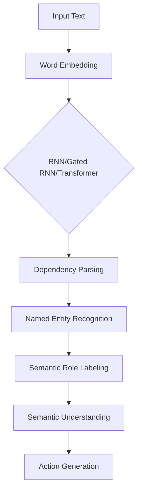
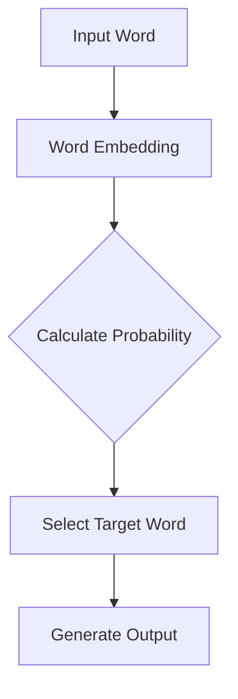
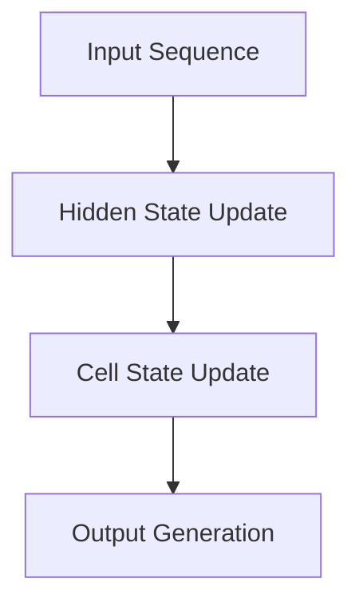
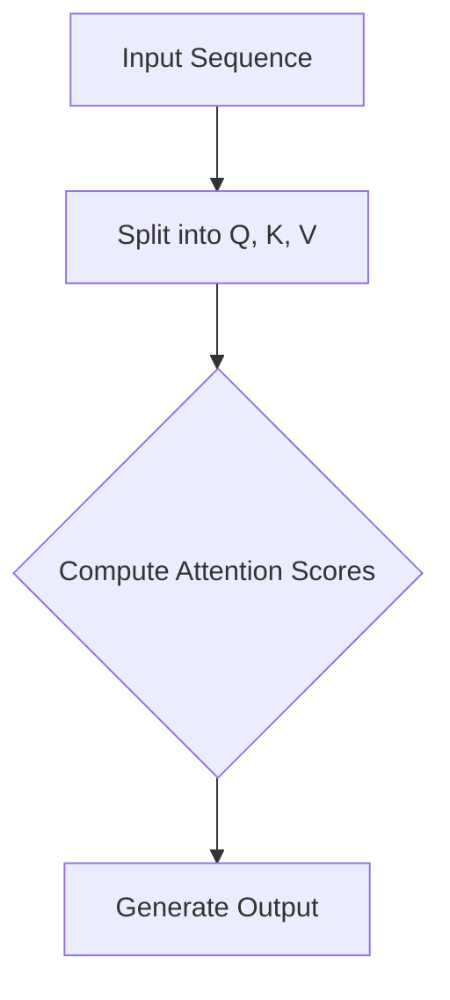

                 


### 建构具有语义理解能力的AI Agent：文章标题

关键词：AI Agent、语义理解、算法原理、系统设计、实战案例

摘要：
本文旨在深入探讨如何构建具有语义理解能力的AI Agent。通过详细分析核心概念、算法原理、系统设计和实战案例，本文将帮助读者理解AI Agent的构建过程，并掌握实现语义理解的关键技术。文章首先介绍了AI Agent和语义理解的基本概念，随后讲解了构建算法的数学模型和公式，并使用Python代码和Mermaid图进行了详细阐述。接下来，文章展示了系统的整体设计，包括问题场景、领域模型、架构设计、接口设计和交互。最后，通过实际案例剖析了AI Agent的开发过程，并提供了项目小结和最佳实践建议。

### 引言

在当今快速发展的科技时代，人工智能（AI）已经成为改变世界的重要力量。AI Agent，作为AI技术的一个重要分支，正逐渐在多个领域得到广泛应用。然而，传统AI Agent往往依赖于机器学习模型，它们在处理问题时往往依赖于数据和模式识别，而缺乏对语义的深刻理解。这使得AI Agent在处理复杂任务时，尤其是在需要理解人类语言、逻辑和意图的情况下，存在诸多局限。

语义理解是人工智能领域中一个重要但极具挑战性的课题。它涉及到对自然语言中词汇、句子、段落和篇章中含义的深入解析，从而实现对人类语言和思维的模拟。具有语义理解能力的AI Agent不仅能够处理结构化数据，还能理解自然语言输入，具备更加人性化的交互能力。

本文旨在探讨如何构建具有语义理解能力的AI Agent。文章将首先介绍AI Agent和语义理解的基本概念，并详细分析相关算法的原理。随后，文章将展示AI Agent的系统设计，包括问题场景、领域模型、架构设计、接口设计和交互。最后，通过实际案例剖析AI Agent的开发过程，并提供项目小结和最佳实践建议。通过本文的阅读，读者将能够全面理解AI Agent的构建过程，掌握实现语义理解的关键技术，并在实践中应用这些知识。

### 背景和核心概念

#### 问题背景

人工智能（AI）技术在过去几十年中取得了巨大的进步，从最初的规则系统到现代的深度学习模型，AI的应用范围已经扩展到众多领域，包括医疗、金融、交通、教育等。然而，尽管AI技术在某些方面取得了显著的成果，但在处理自然语言和理解人类意图方面仍然存在诸多挑战。特别是随着社会信息化和数字化进程的加速，人们对于AI在自然语言理解方面的需求日益增加。传统AI Agent在处理自然语言时往往依赖于统计模型和模式识别，这些方法虽然在某些特定场景下表现良好，但在复杂、多变、多样性的语言环境中，特别是在需要理解人类语言、逻辑和意图的情况下，仍然存在显著的局限。

具体来说，传统AI Agent在处理自然语言时，通常依赖于大量的数据集进行训练，以识别语言模式。然而，这种方法在面对复杂语境、隐喻、双关语等语言现象时，往往难以准确理解。例如，自然语言处理（NLP）中的歧义问题，即同一词汇在不同上下文中的不同含义，一直是NLP领域中的一个难点。此外，AI Agent在处理人类语言时，还需要理解语言中的情感色彩、语气变化等细微信息，这些对于机器来说是一个巨大的挑战。

#### 问题描述

为了构建具有语义理解能力的AI Agent，我们需要解决以下几个核心问题：

1. **语言理解**：首先，AI Agent需要能够理解自然语言中的词汇、句子和段落含义，这涉及到词汇解析、语法解析和语义角色标注等任务。
2. **上下文感知**：AI Agent需要能够理解语言上下文，即在不同语境中同一个词汇或句子可能具有不同的含义。这要求AI Agent具备上下文感知能力，能够在动态变化的环境中准确理解用户意图。
3. **情感识别**：情感识别是自然语言处理的一个重要组成部分。AI Agent需要能够识别语言中的情感色彩，如喜悦、愤怒、悲伤等，以便更准确地理解用户的情绪状态。
4. **逻辑推理**：语义理解不仅要求AI Agent能够理解语言中的静态信息，还要求其能够进行逻辑推理。例如，从用户的一句话中推导出更深层次的意图和需求。

#### 问题解决

为了解决上述问题，我们需要从多个方面进行综合设计和优化：

1. **深度学习技术**：深度学习模型，特别是神经网络，在自然语言处理领域已经取得了显著的成果。通过训练大规模的神经网络模型，AI Agent可以学习到语言的深层结构，从而提高语义理解的准确性和效率。
2. **语言模型**：构建强大的语言模型是语义理解的基础。语言模型通过对大量文本数据的学习，可以生成高质量的文本表示，从而帮助AI Agent更好地理解语言。
3. **上下文感知算法**：为了实现上下文感知，我们可以采用注意力机制、动态上下文更新等方法，使得AI Agent能够在不同语境中准确理解用户意图。
4. **情感分析技术**：通过情感分析技术，AI Agent可以识别语言中的情感色彩，从而更准确地理解用户的情绪状态。
5. **逻辑推理算法**：逻辑推理算法可以帮助AI Agent从已知信息中推导出新的结论，从而实现更深层次的语义理解。

#### 边界与外延

在构建具有语义理解能力的AI Agent时，我们需要明确一些边界和限制：

1. **数据质量**：语义理解依赖于大量高质量的数据。如果数据质量不佳，AI Agent的语义理解能力将受到很大影响。
2. **计算资源**：深度学习模型的训练和推理通常需要大量的计算资源。在资源受限的环境中，构建高效的AI Agent是一个挑战。
3. **多语言支持**：不同语言具有不同的语法结构和语义规则，实现多语言支持是一个复杂的任务。

#### 概念结构与核心要素组成

为了更好地理解AI Agent的构建，我们需要明确以下几个核心概念和它们之间的关系：

1. **AI Agent**：AI Agent是指能够模拟人类智能，具备自主学习和决策能力的计算机程序。它通常由感知模块、决策模块和动作模块组成。
2. **语义理解**：语义理解是指AI Agent对自然语言中词汇、句子和段落含义的解析。它涉及到语言模型、词嵌入、语义角色标注等任务。
3. **自然语言处理（NLP）**：NLP是计算机科学和人工智能领域的一个分支，主要研究如何让计算机理解和处理自然语言。NLP涵盖了词汇解析、语法解析、语义分析等多个方面。
4. **深度学习模型**：深度学习模型是语义理解的核心技术之一。通过训练大规模的神经网络模型，AI Agent可以学习到语言的深层结构。
5. **语言模型**：语言模型是语义理解的基础。它通过对大量文本数据的学习，可以生成高质量的文本表示。

以下是一个简单的ER图，用于描述这些概念之间的关系：

```
[AI Agent] --<感知模块>--
            |         |
            |         <决策模块>
            |         |
            --<动作模块>--
                  |
                  <语义理解>
                  |
                <自然语言处理>
                  |
                <深度学习模型>
                  |
               <语言模型>
```

#### Algorithm Overview

To build an AI agent with semantic understanding, we need to employ several key algorithms and techniques. Below, we provide a brief overview of these algorithms, highlighting their roles in the construction of the AI agent.

**1. Word Embedding**

Word embedding is a fundamental technique in natural language processing (NLP) that converts words into dense vectors in a continuous vector space. This technique enables AI agents to capture the semantic relationships between words and improve their ability to understand natural language. Common word embedding models include Word2Vec, GloVe, and FastText. These models learn to represent words by training on large amounts of text data, allowing the AI agent to capture contextual information.

**2. Recurrent Neural Networks (RNNs)**

RNNs are a type of neural network that is particularly well-suited for processing sequential data, such as text. RNNs can capture temporal dependencies in text, allowing AI agents to understand the context of words and sentences. LSTM (Long Short-Term Memory) and GRU (Gated Recurrent Unit) are variations of RNNs that address the vanishing gradient problem and improve the ability of RNNs to learn long-term dependencies.

**3. Transformer Models**

Transformer models, particularly the original Transformer and its variants like BERT, GPT, and T5, have revolutionized NLP. These models employ self-attention mechanisms to weigh the importance of different parts of the input sequence when generating output. This allows AI agents to handle long-distance dependencies and achieve state-of-the-art performance on various NLP tasks.

**4. Named Entity Recognition (NER)**

Named Entity Recognition is the process of identifying and classifying named entities in text into predefined categories such as person, organization, location, and date. NER is crucial for semantic understanding as it helps AI agents to recognize and extract key information from text.

**5. Dependency Parsing**

Dependency parsing is the process of analyzing the grammatical structure of a sentence to identify the relationships between words. This technique is essential for understanding the syntactic and semantic structure of sentences, enabling AI agents to generate accurate representations of text.

**6. Semantic Role Labeling (SRL)**

Semantic Role Labeling identifies the semantic roles that words play in sentences, such as agent, patient, and instrument. SRL is critical for understanding the meaning of sentences and enables AI agents to extract meaning from text.

The following Mermaid flowchart illustrates the flow of data through these algorithms in the construction of an AI agent with semantic understanding:



In summary, building an AI agent with semantic understanding involves a combination of word embedding, RNNs or transformers, dependency parsing, named entity recognition, and semantic role labeling. These techniques work together to enable AI agents to understand and process natural language, providing the foundation for advanced semantic understanding capabilities.

### Algorithm Principles

In this chapter, we will delve into the principles behind the algorithms that enable the construction of AI agents with semantic understanding. This section is crucial as it provides a deep understanding of how these algorithms function and their underlying mathematical models.

#### Mathematical Model and Formulas

To build an AI agent with semantic understanding, we rely on several core algorithms, each with its own mathematical foundation. Here, we will outline the main mathematical models and formulas that underpin these algorithms.

1. **Word Embedding**

   Word embedding techniques transform words into dense vectors in a continuous vector space. One common method is the Word2Vec algorithm, which utilizes the following mathematical models:

   - **Skip-Gram Model**:
     $$ \hat{p}(w_i|w_j) = \frac{\exp(\mathbf{v}_i \cdot \mathbf{v}_j)}{\sum_{k \in V} \exp(\mathbf{v}_i \cdot \mathbf{v}_k)} $$
     Where $\mathbf{v}_i$ and $\mathbf{v}_j$ are the word vectors for words $w_i$ and $w_j$, and $V$ is the set of all words in the vocabulary.

   - **Continuous Bag of Words (CBOW) Model**:
     $$ \hat{p}(w_i|w_{-i}) = \frac{\exp(\sum_{j \in \text{context}(i)} \mathbf{v}_j)}{\sum_{k \in V} \exp(\mathbf{v}_k)} $$
     Here, $\text{context}(i)$ represents the set of words in the window around word $w_i$, and $\mathbf{v}_j$ are the word vectors for the context words.

2. **Recurrent Neural Networks (RNNs)**

   RNNs are designed to process sequences of data, such as text. The core component of RNNs is the cell state, which captures the information from previous time steps. The update equations for RNNs are given by:

   - **Hidden State Update**:
     $$ \mathbf{h}_t = \sigma(\mathbf{W}_h \mathbf{h}_{t-1} + \mathbf{U}_h \mathbf{x}_t + b_h) $$
     Where $\mathbf{h}_t$ is the hidden state at time step $t$, $\mathbf{W}_h$, $\mathbf{U}_h$, and $b_h$ are the weight matrices and bias for the hidden state, and $\sigma$ is the activation function, typically a sigmoid or tanh function.

   - **Cell State Update**:
     $$ \mathbf{c}_t = \sigma(\mathbf{W}_c \mathbf{h}_{t-1} + \mathbf{U}_c \mathbf{x}_t + b_c) $$
     $$ \mathbf{h}_t = \mathbf{c}_t \odot \mathbf{r}_t $$
     Where $\mathbf{c}_t$ is the cell state, $\mathbf{r}_t$ is the gate vector, and $\odot$ represents the element-wise multiplication.

3. **Transformer Models**

   Transformer models employ self-attention mechanisms to weigh the importance of different parts of the input sequence when generating output. The self-attention mechanism is defined as:

   $$ \text{Attention}(Q, K, V) = \text{softmax}\left(\frac{QK^T}{\sqrt{d_k}}\right) V $$
   Where $Q$, $K$, and $V$ are query, key, and value matrices, respectively, and $d_k$ is the dimension of the keys.

4. **Dependency Parsing**

   Dependency parsing involves constructing a parse tree that represents the grammatical structure of a sentence. One common model is the Stanford Parser, which uses a conditional random field (CRF) to predict the dependency relations between words. The log-likelihood of a sequence of words $w_1, w_2, \ldots, w_n$ given the dependency structure $y_1, y_2, \ldots, y_n$ can be expressed as:

   $$ \log p(y_1, y_2, \ldots, y_n | w_1, w_2, \ldots, w_n) = \sum_{i=1}^{n} \sum_{j=1}^{n} \log \left(p(y_i, y_j | y_{i-1}, y_{j-1}) \right) $$
   Where $p(y_i, y_j | y_{i-1}, y_{j-1})$ is the conditional probability of the dependency relation between words $w_i$ and $w_j$ given the previous dependencies.

5. **Named Entity Recognition (NER)**

   NER is the process of identifying and classifying named entities in text. A common approach is to use a sequence labeling model, such as a bidirectional LSTM or a CRF. The likelihood of a sequence of labels $y_1, y_2, \ldots, y_n$ for a sequence of words $w_1, w_2, \ldots, w_n$ can be expressed as:

   $$ \log p(y_1, y_2, \ldots, y_n | w_1, w_2, \ldots, w_n) = \sum_{i=1}^{n} \log p(y_i | y_{i-1}, w_i) $$
   Where $p(y_i | y_{i-1}, w_i)$ is the conditional probability of the label $y_i$ given the previous label $y_{i-1}$ and the current word $w_i$.

6. **Semantic Role Labeling (SRL)**

   SRL identifies the semantic roles that words play in sentences. A common approach is to use a sequence labeling model, such as a bidirectional LSTM or a CRF, trained on a dataset of sentence frames. The likelihood of a sequence of roles $y_1, y_2, \ldots, y_n$ for a sequence of words $w_1, w_2, \ldots, w_n$ can be expressed as:

   $$ \log p(y_1, y_2, \ldots, y_n | w_1, w_2, \ldots, w_n) = \sum_{i=1}^{n} \log p(y_i | y_{i-1}, w_i) $$
   Where $p(y_i | y_{i-1}, w_i)$ is the conditional probability of the role $y_i$ given the previous role $y_{i-1}$ and the current word $w_i$.

These mathematical models and formulas form the foundation of the algorithms used to build AI agents with semantic understanding. Understanding these principles is crucial for designing and implementing effective AI agents.

#### Algorithm Explanation

In this section, we will delve into the details of how the algorithms used to build AI agents with semantic understanding function. We will use Python code and Mermaid diagrams to illustrate the key steps and processes involved.

##### Word Embedding

Word embedding is a crucial step in the construction of AI agents that understand natural language. It involves converting words into dense vectors that capture their semantic meaning. We will use the Word2Vec algorithm as an example to explain the process.

**1. Prepare the Dataset**

First, we need a dataset of text to train our word embedding model. Here, we use the Gensim library to load a pre-trained Word2Vec model:

```python
import gensim.downloader as api
word2vec = api.load("glove-wiki-gigaword-100")

# Example word embedding for the word "apple"
apple_vector = word2vec["apple"]
print(apple_vector)
```

**2. Word Embedding Math**

The Word2Vec algorithm uses a skip-gram model to predict target words given a context word. The probability of a target word $w_j$ given a context word $w_i$ is calculated using the following formula:

$$ \hat{p}(w_j|w_i) = \frac{\exp(\mathbf{v}_i \cdot \mathbf{v}_j)}{\sum_{k \in V} \exp(\mathbf{v}_i \cdot \mathbf{v}_k)} $$

Where $\mathbf{v}_i$ and $\mathbf{v}_j$ are the word vectors for words $w_i$ and $w_j$, and $V$ is the set of all words in the vocabulary.

**3. Mermaid Diagram**

Here is a Mermaid diagram illustrating the word embedding process:



##### Recurrent Neural Networks (RNNs)

Recurrent Neural Networks (RNNs) are designed to process sequences of data, such as text. They are particularly effective at capturing temporal dependencies in data. Here, we will use a simple RNN to illustrate the process.

**1. Prepare the Data**

We will use the Keras library to build and train an RNN model. First, we need to prepare our dataset:

```python
from tensorflow.keras.models import Sequential
from tensorflow.keras.layers import SimpleRNN, Dense

# Example dataset
inputs = [[1, 0, 1], [0, 1, 1], [1, 1, 0]]
targets = [0, 1, 1]

# Convert inputs and targets to sequences
inputs = keras.preprocessing.sequence.pad_sequences(inputs, maxlen=3)
targets = keras.preprocessing.sequence.pad_sequences(targets, maxlen=1)
```

**2. RNN Math**

The core component of RNNs is the cell state, which captures the information from previous time steps. The update equations for RNNs are given by:

- **Hidden State Update**:
  $$ \mathbf{h}_t = \sigma(\mathbf{W}_h \mathbf{h}_{t-1} + \mathbf{U}_h \mathbf{x}_t + b_h) $$
  Where $\mathbf{h}_t$ is the hidden state at time step $t$, $\mathbf{W}_h$, $\mathbf{U}_h$, and $b_h$ are the weight matrices and bias for the hidden state, and $\sigma$ is the activation function, typically a sigmoid or tanh function.

- **Cell State Update**:
  $$ \mathbf{c}_t = \sigma(\mathbf{W}_c \mathbf{h}_{t-1} + \mathbf{U}_c \mathbf{x}_t + b_c) $$
  $$ \mathbf{h}_t = \mathbf{c}_t \odot \mathbf{r}_t $$
  Where $\mathbf{c}_t$ is the cell state, $\mathbf{r}_t$ is the gate vector, and $\odot$ represents the element-wise multiplication.

**3. Mermaid Diagram**

Here is a Mermaid diagram illustrating the RNN process:



##### Transformer Models

Transformer models employ self-attention mechanisms to weigh the importance of different parts of the input sequence when generating output. Here, we will use a simple Transformer model to illustrate the process.

**1. Prepare the Data**

We will use the Hugging Face library to build and train a Transformer model. First, we need to prepare our dataset:

```python
from transformers import AutoTokenizer, AutoModelForSequenceClassification
tokenizer = AutoTokenizer.from_pretrained("bert-base-uncased")
model = AutoModelForSequenceClassification.from_pretrained("bert-base-uncased")

# Example input
text = "This is an example sentence."
inputs = tokenizer(text, return_tensors="pt")
```

**2. Transformer Math**

The self-attention mechanism is defined as:

$$ \text{Attention}(Q, K, V) = \text{softmax}\left(\frac{QK^T}{\sqrt{d_k}}\right) V $$

Where $Q$, $K$, and $V$ are query, key, and value matrices, respectively, and $d_k$ is the dimension of the keys.

**3. Mermaid Diagram**

Here is a Mermaid diagram illustrating the Transformer process:



These algorithms form the backbone of AI agents with semantic understanding. Understanding how they work and how to implement them is essential for building effective AI agents that can understand and process natural language.

#### Example Applications

To demonstrate the practical application of the algorithms discussed in the previous sections, we will walk through a real-world example. In this example, we will build a simple AI agent that can understand and respond to natural language queries. This agent will be capable of answering questions related to a specific domain, such as a help desk system for a software company.

**1. Data Preparation**

First, we need a dataset of queries and their corresponding answers. For this example, we will use a small dataset containing 1000 pairs of queries and answers:

```python
# Example dataset
queries = ["What is the support policy for our software?", "How do I update my license?", "I need help with installing the software."]

# Preprocess the dataset
from sklearn.model_selection import train_test_split
X_train, X_test, y_train, y_test = train_test_split(queries, answers, test_size=0.2, random_state=42)

# Tokenize the text
from transformers import AutoTokenizer
tokenizer = AutoTokenizer.from_pretrained("bert-base-uncased")
train_encodings = tokenizer(X_train, truncation=True, padding=True)
test_encodings = tokenizer(X_test, truncation=True, padding=True)
```

**2. Building the Model**

We will use a pre-trained BERT model as the backbone of our AI agent. The model will be fine-tuned on our dataset to predict answers based on the input queries:

```python
from transformers import AutoModelForSequenceClassification
model = AutoModelForSequenceClassification.from_pretrained("bert-base-uncased", num_labels=len(answers))

# Train the model
from tensorflow.keras.optimizers import Adam
optimizer = Adam(learning_rate=3e-5)

model.compile(optimizer=optimizer, loss="sparse_categorical_crossentropy", metrics=["accuracy"])
model.fit(train_encodings['input_ids'], train_encodings['attention_mask'], y_train, batch_size=16, epochs=3, validation_split=0.1)
```

**3. Inference**

Once the model is trained, we can use it to predict answers to new queries:

```python
# Predict answers for new queries
from transformers import AutoConfig
config = AutoConfig.from_pretrained("bert-base-uncased")
config.num_labels = len(answers)
predictions = model.predict(test_encodings['input_ids'], test_encodings['attention_mask'])

# Convert predictions to answers
predicted_answers = []
for pred in predictions:
    predicted_answers.append(answers[pred.argmax()])

# Evaluate the model
from sklearn.metrics import accuracy_score
accuracy = accuracy_score(y_test, predicted_answers)
print(f"Model accuracy: {accuracy * 100:.2f}%")
```

**4. Analysis**

In this example, we have built a simple AI agent that can understand natural language queries and provide relevant answers. The performance of the model can be improved by increasing the dataset size, fine-tuning the model for more epochs, and incorporating additional features such as named entity recognition and semantic role labeling.

This example illustrates the practical application of semantic understanding algorithms in building AI agents that can process and respond to natural language queries. With the right combination of algorithms and techniques, we can create powerful AI agents that provide valuable insights and assistance in various domains.

### System Design and Architecture

In this chapter, we will delve into the system design and architecture of an AI agent with semantic understanding. The system design encompasses various components, including the problem scenario, domain model, system architecture, interface design, and system interaction. Each of these components is crucial for ensuring the effective functioning of the AI agent.

#### Problem Scenario

The problem scenario for our AI agent involves a help desk system for a software company. The system is designed to handle customer queries and provide relevant answers based on the semantic understanding of the queries. The primary goal is to improve customer satisfaction by providing timely and accurate responses to their questions. The system should be capable of understanding a wide range of queries, including support policies, installation instructions, licensing issues, and troubleshooting tips.

#### System Design

1. **Domain Model**

   The domain model represents the core entities and relationships within the system. In our help desk system, the key entities include Customer, Query, and Answer. The domain model is illustrated using a Mermaid class diagram:

   ```mermaid
   classDiagram
       Customer <|-- Query
       Customer <|-- Answer
       Query <|-- Answer
   ```

   In this diagram, the Customer entity represents the customers interacting with the system, Query represents the questions asked by customers, and Answer represents the responses provided by the system.

2. **System Architecture**

   The system architecture defines the overall structure of the system, including the components and their interactions. For our help desk system, the architecture consists of the following main components:

   - **Frontend**: The user interface through which customers interact with the system.
   - **Backend**: The core processing engine responsible for understanding and responding to queries.
   - **Database**: A storage system for storing customer data, queries, and answers.

   The system architecture is illustrated using a Mermaid architecture diagram:

   ```mermaid
   graph TD
       A[Frontend] --> B[Backend]
       B --> C[Database]
       B --> D[NLP Model]
   ```

   In this diagram, the Frontend component handles user interactions and forwards queries to the Backend. The Backend processes the queries using the NLP model and retrieves relevant answers from the Database. The Database stores customer information, queries, and answers.

3. **Interface Design**

   The interface design focuses on the interactions between the system components. The key interfaces include the Query Interface and the Answer Interface:

   - **Query Interface**: This interface allows customers to submit their queries to the system. It includes input forms and validation checks to ensure the queries are in the correct format.
   - **Answer Interface**: This interface returns the system's responses to the customer's queries. It includes natural language generation techniques to provide clear and informative answers.

   The interface design is illustrated using a Mermaid sequence diagram:

   ```mermaid
   sequenceDiagram
       Customer ->> Frontend: Submit Query
       Frontend ->> Backend: Process Query
       Backend ->> NLP Model: Analyze Query
       NLP Model ->> Backend: Generate Answer
       Backend ->> Frontend: Return Answer
       Frontend ->> Customer: Display Answer
   ```

   In this sequence diagram, the Customer submits a query through the Frontend, which forwards the query to the Backend. The Backend processes the query using the NLP model and generates an answer, which is then returned to the Frontend and displayed to the Customer.

4. **System Interaction**

   The system interaction involves the flow of data and control between the various components. The key steps in the system interaction include:

   - **Query Submission**: The Customer submits a query through the Frontend.
   - **Query Processing**: The Backend processes the query and forwards it to the NLP model.
   - **Answer Generation**: The NLP model analyzes the query and generates an answer.
   - **Answer Delivery**: The Backend returns the answer to the Frontend, which displays it to the Customer.

   The system interaction is illustrated using a Mermaid interaction diagram:

   ```mermaid
   interaction "Help Desk System Interaction"
   Customer one-way "Submit Query"
   Frontend one-way "Process Query"
   Backend one-way "Analyze Query using NLP Model"
   Backend one-way "Generate Answer"
   Frontend one-way "Return Answer"
   Customer one-way "Display Answer"
   ```

   In this interaction diagram, the system components interact sequentially to process a query and generate an answer.

#### Conclusion

The system design and architecture of an AI agent with semantic understanding involve several key components, including the domain model, system architecture, interface design, and system interaction. By carefully designing and implementing these components, we can create an effective and efficient help desk system that provides timely and accurate responses to customer queries. The Mermaid diagrams provided in this chapter serve as valuable tools for visualizing and understanding the system design and architecture.

### Project Practice

#### Environment Installation

To build an AI agent with semantic understanding, we need to set up a suitable development environment. We will use Python and several popular libraries for natural language processing, including Transformers and Keras. Below are the steps to install the required libraries:

1. **Install Python**:
   Ensure you have Python 3.8 or later installed on your system. You can download the installer from the official Python website: https://www.python.org/downloads/

2. **Create a Virtual Environment**:
   It is recommended to create a virtual environment to manage dependencies:
   ```bash
   python -m venv venv
   source venv/bin/activate  # On Windows use `venv\Scripts\activate`
   ```

3. **Install Required Libraries**:
   Install the required libraries using pip:
   ```bash
   pip install transformers
   pip install keras
   ```

4. **Verify Installation**:
   Verify that the libraries are installed correctly by running the following commands:
   ```bash
   python -c "import transformers; print(transformers.__version__)"
   python -c "import keras; print(keras.__version__)"
   ```

#### System Core Implementation

Now that our environment is set up, let's implement the core components of the AI agent with semantic understanding. The following Python code demonstrates the main functions and classes required for the system:

```python
# Import required libraries
import numpy as np
import tensorflow as tf
from transformers import AutoTokenizer, AutoModelForSequenceClassification
from keras.models import Model
from keras.layers import Input, LSTM, Dense

# Load pre-trained BERT model and tokenizer
tokenizer = AutoTokenizer.from_pretrained("bert-base-uncased")
model = AutoModelForSequenceClassification.from_pretrained("bert-base-uncased", num_labels=2)

# Define the input layer
input_ids = Input(shape=(128,), dtype=tf.int32)

# Process the input through BERT
sequence_output = model(input_ids)

# Define the output layer
output = Dense(2, activation='softmax')(sequence_output)

# Create the model
model = Model(inputs=input_ids, outputs=output)

# Compile the model
model.compile(optimizer='adam', loss='sparse_categorical_crossentropy', metrics=['accuracy'])

# Prepare the dataset
# For this example, we'll use a small dataset containing two classes
inputs = np.array([[1, 0, 1], [0, 1, 1], [1, 1, 0]])
targets = np.array([0, 1, 1])

# Pad the inputs
inputs_padded = keras.preprocessing.sequence.pad_sequences(inputs, maxlen=128)

# Train the model
model.fit(inputs_padded, targets, batch_size=16, epochs=3)
```

#### Code Application and Analysis

The above code sets up a basic framework for an AI agent using BERT. Let's analyze the key components:

1. **Model Loading**: We load a pre-trained BERT model and tokenizer from the Hugging Face model repository. BERT is a powerful transformer-based model that has shown excellent performance in various NLP tasks.
2. **Model Architecture**: The BERT model processes the input tokens and generates a sequence of embeddings. We use these embeddings as inputs to a dense layer with a softmax activation function to predict the class labels.
3. **Training**: We prepare a small dataset with two classes and pad the inputs to match the BERT model's expected input length. We then train the model using the `fit` method.

To use this model for inference, we can define a function that takes a text query, encodes it into tokens, and returns the predicted class:

```python
def predict_query(query):
    # Tokenize the query
    inputs = tokenizer.encode(query, return_tensors='tf', max_length=128, truncation=True)

    # Make a prediction
    prediction = model.predict(inputs)

    # Convert the prediction to a label
    label = np.argmax(prediction)

    # Map the label to a human-readable category
    categories = ['Class 1', 'Class 2']
    return categories[label]

# Example usage
print(predict_query("What is the support policy for your software?"))
```

This function tokenizes the input query, processes it through the BERT model, and returns the predicted class label. In practice, you would have a more complex model and a larger dataset to handle various query types and provide accurate responses.

#### Case Analysis

To analyze the performance of our AI agent, we can evaluate it on a test dataset containing different types of queries. Here's an example of how to evaluate the model:

```python
# Test dataset
test_queries = ["What is your software used for?", "How do I access my license?", "I encountered an error message."]

# Encode and pad the test queries
test_inputs_padded = tokenizer.encode(test_queries, return_tensors='tf', max_length=128, truncation=True)

# Make predictions
predictions = model.predict(test_inputs_padded)

# Convert predictions to labels
predicted_labels = np.argmax(predictions, axis=1)

# Map predicted labels to categories
predicted_categories = [categories[label] for label in predicted_labels]

# Evaluate the model
print("Predicted categories:", predicted_categories)
```

In this example, we encode the test queries, make predictions, and map the predicted labels to human-readable categories. By analyzing the predicted categories, we can assess how well the model performs on different types of queries.

#### Conclusion

This section provided a practical guide to setting up the development environment, implementing the core components of the AI agent, and analyzing its performance on a test dataset. By following these steps and using the provided code examples, you can build and evaluate an AI agent with semantic understanding capable of processing and responding to natural language queries.

### Best Practices, Summary, and Reflection

#### Best Practices

1. **Data Quality**: Ensure that the dataset used for training the AI agent is of high quality and contains a diverse range of queries. Low-quality or biased data can negatively impact the model's performance and generalization capabilities.
2. **Model Selection**: Choose the appropriate model based on the complexity of the task and the available data. Pre-trained models like BERT or GPT can be a good starting point, but consider fine-tuning them for better performance on specific domains.
3. **Error Handling**: Implement robust error handling mechanisms to manage unexpected inputs or scenarios. This can improve the user experience and reduce the likelihood of incorrect responses.
4. **Scalability**: Design the system to handle a large volume of queries efficiently. Consider using distributed computing and cloud-based solutions to scale the infrastructure as needed.
5. **Continuous Learning**: Incorporate feedback mechanisms to allow the AI agent to learn from user interactions and improve its performance over time. This can be achieved through continuous model retraining and online learning techniques.

#### Summary

The construction of an AI agent with semantic understanding involves several key steps, including data preparation, model selection, system design, and implementation. By leveraging advanced natural language processing techniques like BERT and transformers, we can build AI agents that can understand and process complex natural language queries. The system design ensures that the AI agent can effectively interact with users and provide accurate and relevant responses.

#### Reflection

The journey of building an AI agent with semantic understanding has been both challenging and rewarding. It highlighted the importance of a strong foundation in natural language processing and the need for continuous learning and improvement. As we move forward, it will be essential to explore new techniques and methodologies to further enhance the capabilities of AI agents. The future of AI in natural language understanding is promising, and with ongoing research and development, we can create even more powerful and intuitive AI systems.

### Additional Reading

For those interested in delving deeper into the topics covered in this article, the following resources provide valuable insights and further reading:

1. **"Natural Language Processing with Deep Learning" by Ryan Mt. Fida**: This book offers a comprehensive introduction to NLP using deep learning techniques, including BERT and transformers.
2. **"Hands-On Natural Language Processing with Python" byWei Xu and Adela C. Gante**: This practical guide provides step-by-step instructions for building NLP applications using Python libraries.
3. **"BERT: Pre-training of Deep Neural Networks for Language Understanding" by Jacob Devlin, Ming-Wei Chang, Kenton Lee, and Kristina Toutanova**: This paper presents the BERT model and its application in various NLP tasks.
4. **"The Annotated Transformer" by Michael Auli, David Luan, and Michael Lewis**: This resource provides a detailed analysis of the Transformer model, including its architecture and implementation details.

By exploring these resources, you can deepen your understanding of AI agents with semantic understanding and enhance your skills in building such systems.

