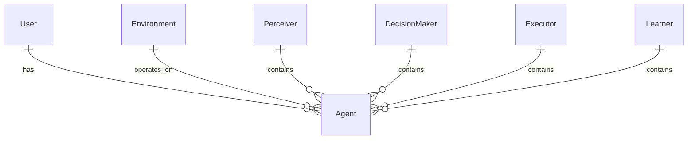
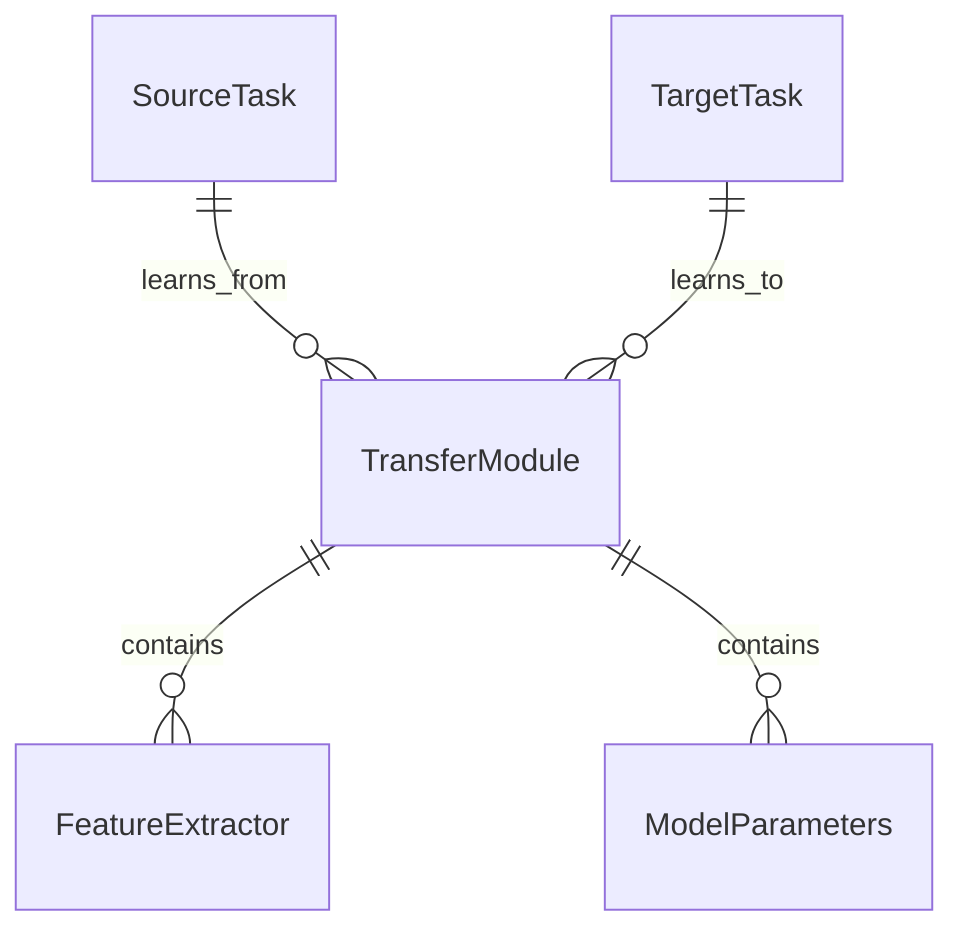
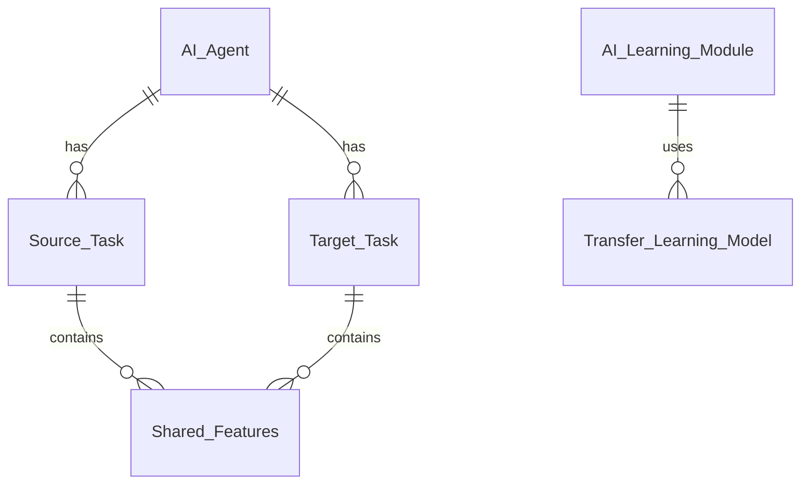
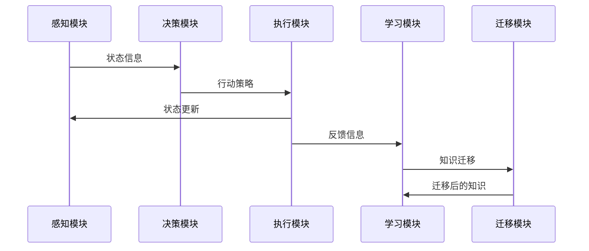
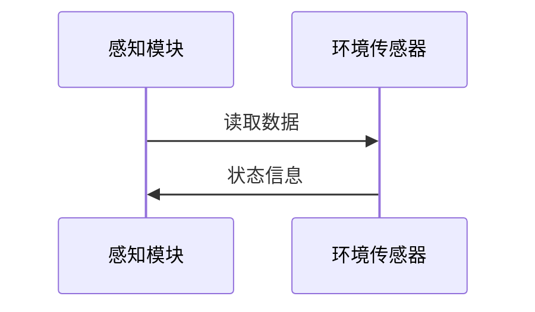
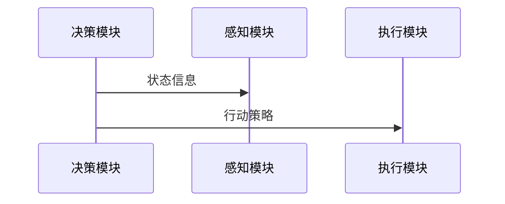
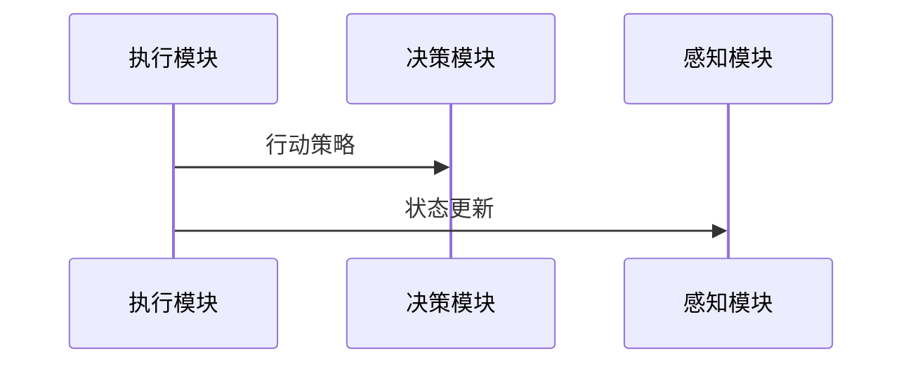
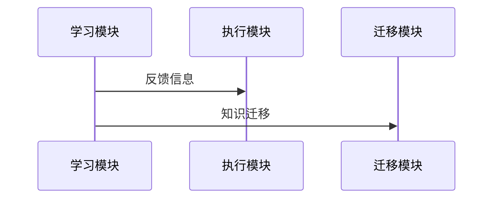
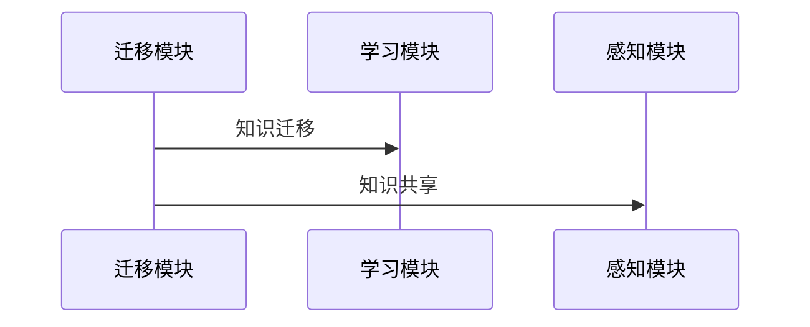

                 

# 构建具有迁移学习能力的AI Agent

关键词：AI Agent、迁移学习、强化学习、监督学习、无监督学习

摘要：本文将探讨如何构建具有迁移学习能力的AI Agent，首先介绍AI Agent和迁移学习的基本概念，接着分析强化学习、监督学习和无监督学习的原理，然后阐述这些学习算法在AI Agent中的应用，并详细介绍如何设计一个具有迁移学习能力的AI Agent的系统架构和实现方法。最后，通过实际项目案例来展示如何构建一个具有迁移学习能力的AI Agent。

### 目录大纲

----------------------------------------------------------------

# 第一部分: 背景介绍与核心概念

## 第1章: 问题背景与核心概念

### 1.1.1 问题背景

- AI Agent的概念与发展历程
- 迁移学习在AI Agent中的应用
- AI Agent在现实世界中的应用场景

### 1.1.2 核心概念

- AI Agent的定义
- 迁移学习的定义
- 关键技术概念：强化学习、监督学习、无监督学习

## 第2章: 核心概念与联系

### 1.2.1 AI Agent原理

- AI Agent的组成结构
- AI Agent的工作流程
- 强化学习、监督学习、无监督学习的原理与关系

### 1.2.2 迁移学习原理

- 迁移学习的分类
- 迁移学习的目标
- 迁移学习的挑战与解决方案

### 1.2.3 概念属性特征对比表格

## 第3章: ER实体关系图架构

### 1.3.1 ER实体关系图概述

- ER模型的基本概念
- ER图的绘制方法
- ER图在AI Agent设计中的应用

### 1.3.2 迁移学习在ER图中的表示

- 数据实体与属性
- 迁移学习过程中的实体关系

----------------------------------------------------------------

# 第二部分: 算法原理与数学模型

## 第4章: 强化学习算法原理

### 4.1.1 强化学习概述

- 强化学习的定义
- 强化学习的优势

### 4.1.2 Q-Learning算法

- Q-Learning算法的原理
- Q-Learning算法的公式
- Q-Learning算法的示例

### 4.1.3 Sarsa算法

- Sarsa算法的原理
- Sarsa算法的公式
- Sarsa算法的示例

## 第5章: 监督学习算法原理

### 5.1.1 监督学习概述

- 监督学习的定义
- 监督学习的优势

### 5.1.2 SVM算法

- SVM算法的原理
- SVM算法的公式
- SVM算法的示例

### 5.1.3 随机梯度下降算法

- 随机梯度下降算法的原理
- 随机梯度下降算法的公式
- 随机梯度下降算法的示例

## 第6章: 无监督学习算法原理

### 6.1.1 无监督学习概述

- 无监督学习的定义
- 无监督学习的优势

### 6.1.2 主成分分析算法

- 主成分分析算法的原理
- 主成分分析算法的公式
- 主成分分析算法的示例

### 6.1.3 聚类算法

- 聚类算法的原理
- 聚类算法的公式
- 聚类算法的示例

----------------------------------------------------------------

# 第三部分: 系统架构与设计方法

## 第7章: 系统架构设计

### 7.1.1 系统功能设计

- 系统功能概述
- 系统功能模块划分
- 功能模块之间的关系

### 7.1.2 系统架构设计

- 系统总体架构
- 系统模块详细设计
- 系统架构图

### 7.1.3 系统接口设计

- 系统接口概述
- 系统接口详细设计
- 系统接口图

## 第8章: 系统交互设计

### 8.1.1 系统交互概述

- 系统交互概念
- 系统交互作用

### 8.1.2 系统交互设计

- 系统交互流程
- 系统交互图

----------------------------------------------------------------

# 第四部分: 项目实战与案例分析

## 第9章: 项目环境安装

### 9.1.1 环境准备

- 系统环境准备
- 硬件配置
- 软件安装

### 9.1.2 环境配置

- 系统配置
- 软件配置
- 网络配置

## 第10章: 系统核心实现

### 10.1.1 系统核心模块实现

- 系统核心模块概述
- 系统核心模块详细实现

### 10.1.2 迁移学习算法实现

- 迁移学习算法概述
- 迁移学习算法详细实现

## 第11章: 项目总结与拓展

### 11.1.1 项目总结

- 项目完成情况
- 项目成果分析
- 项目经验总结

### 11.1.2 拓展阅读

- 相关技术的深入探讨
- 未来发展趋势展望
- 参考文献

----------------------------------------------------------------

## 第1章: 问题背景与核心概念

### 1.1.1 问题背景

**AI Agent的概念与发展历程**

AI Agent是指具备自主学习和决策能力的人工智能实体，可以模拟人类智能，在特定环境中完成特定的任务。AI Agent的概念最早可以追溯到1970年代，当时人工智能学者提出了智能体（Agent）的概念，并将其应用于多智能体系统（MAS）的研究。随着计算机技术的发展，特别是在深度学习和强化学习的推动下，AI Agent在近年来取得了显著的进展，并在多个领域展现出巨大的潜力。

**迁移学习在AI Agent中的应用**

迁移学习（Transfer Learning）是机器学习领域的一个重要分支，其主要思想是将已学习到的知识从一个任务转移到另一个相关任务中，以减少对新任务的训练时间和提高模型的泛化能力。在AI Agent中，迁移学习有着广泛的应用，例如：

- **环境自适应**：AI Agent在不同环境中执行任务时，可以利用迁移学习快速适应新环境。
- **任务转换**：当AI Agent从一个任务切换到另一个任务时，通过迁移学习保留之前任务的知识，从而提高新任务的执行效率。
- **知识共享**：多个AI Agent之间可以通过迁移学习共享知识，提高整体系统的协同能力。

**AI Agent在现实世界中的应用场景**

AI Agent在现实世界中有着广泛的应用场景，以下是几个典型的例子：

- **智能家居**：AI Agent可以控制家庭设备，实现自动化管理，提高生活质量。
- **无人驾驶**：AI Agent可以用于自动驾驶汽车，通过感知环境并做出决策，实现安全可靠的驾驶。
- **医疗诊断**：AI Agent可以辅助医生进行疾病诊断，提高诊断准确率。
- **金融风控**：AI Agent可以分析金融数据，识别异常交易，防范金融风险。

### 1.1.2 核心概念

**AI Agent的定义**

AI Agent是指具备自主决策、学习和行动能力的人工智能实体，能够在复杂环境中完成特定的任务。AI Agent的核心特点是具备学习能力，可以通过与环境的交互不断优化自己的行为策略。

**迁移学习的定义**

迁移学习是指将已学习到的知识从一个任务转移到另一个相关任务中，以提高新任务的执行效率和泛化能力。在迁移学习中，源任务和目标任务通常具有某种程度的相似性，通过迁移学习，可以从源任务中提取有用的知识，减少目标任务的训练成本。

**关键技术概念：强化学习、监督学习、无监督学习**

- **强化学习（Reinforcement Learning）**：强化学习是一种通过奖励机制来训练智能体在环境中做出最优决策的学习方法。智能体通过不断与环境交互，学习到最优策略，以实现目标。

- **监督学习（Supervised Learning）**：监督学习是一种基于已有标签数据来训练模型的学习方法。在监督学习中，模型从输入和输出的对应关系中学习，从而预测新的输入。

- **无监督学习（Unsupervised Learning）**：无监督学习是一种不依赖于标签数据来训练模型的学习方法。无监督学习的目标是从未标记的数据中发现潜在的结构或模式，如聚类、降维等。

### 1.1.3 关键技术概念对比

以下是一个简化的对比表格，展示了强化学习、监督学习和无监督学习的关键技术概念：

| 概念        | 定义与应用场景                                               |
|-------------|--------------------------------------------------------------|
| 强化学习    | 通过奖励机制训练智能体，适用于需要决策的任务，如游戏、自动驾驶。 |
| 监督学习    | 基于标签数据进行训练，适用于有明确标签数据的任务，如图像分类、文本分类。 |
| 无监督学习  | 不依赖标签数据进行训练，适用于发现数据中潜在结构或模式，如聚类、降维。 |

### 1.1.4 迁移学习的挑战与解决方案

**迁移学习的挑战**

- **知识适应性问题**：如何在不同任务之间有效传递知识，使其适应新任务。
- **模型选择问题**：选择合适的模型结构，以最大化迁移效果。
- **数据分布问题**：源任务和目标任务的数据分布可能不一致，如何处理这种差异。

**迁移学习的解决方案**

- **模型共享**：通过共享模型参数来传递知识。
- **特征提取器**：使用通用特征提取器，在不同任务之间提取共享的特征。
- **元学习**：通过元学习算法，学习到一个能够快速适应新任务的模型。

### 1.1.5 ER实体关系图架构

**ER模型的基本概念**

实体-关系模型（Entity-Relationship Model，简称ER模型）是一种用于数据库设计的数据模型，用于描述实体及其之间的关系。ER模型由三个主要组件构成：实体、属性和关系。

**ER图的绘制方法**

ER图的绘制通常遵循以下步骤：

1. **确定实体**：识别系统中需要表示的实体，如用户、商品、订单等。
2. **定义属性**：为每个实体定义属性，如用户ID、用户名、邮箱等。
3. **确定关系**：识别实体之间的关系，如一对一、一对多、多对多关系。

**ER图在AI Agent设计中的应用**

在AI Agent的设计中，ER图可以用于表示AI Agent的内部结构和外部环境。通过ER图，可以清晰地展示AI Agent的组成组件、各组件之间的关系以及与外部环境的数据交互。

### 1.1.6 迁移学习在ER图中的表示

在ER图中，迁移学习可以通过以下方式表示：

- **数据实体与属性**：在ER图中，源任务和目标任务的数据实体及其属性被表示为实体和属性。
- **迁移学习过程中的实体关系**：通过连接源任务和目标任务的数据实体，表示迁移学习过程中知识的传递。

例如，在一个AI Agent设计中，源任务实体（如用户行为数据）与目标任务实体（如商品推荐）通过迁移学习实体（如共享特征提取器）相连，表示知识从源任务传递到目标任务的过程。

---

**总结**

本章介绍了AI Agent和迁移学习的基本概念，分析了强化学习、监督学习和无监督学习的技术原理，以及这些学习算法在AI Agent中的应用。同时，通过ER实体关系图架构，展示了AI Agent的设计方法和迁移学习在ER图中的表示。下一章将深入探讨AI Agent的原理和迁移学习的实现方法。

## 第2章: 核心概念与联系

### 2.1 AI Agent原理

AI Agent是一种具备自主学习和决策能力的人工智能实体，能够在复杂环境中完成特定的任务。要理解AI Agent的原理，我们需要从其组成结构、工作流程以及强化学习、监督学习、无监督学习这三种关键学习算法的原理与关系入手。

#### 2.1.1 AI Agent的组成结构

一个典型的AI Agent由以下几个部分组成：

1. **感知器**：用于感知环境状态，获取外部信息。
2. **决策模块**：根据感知到的环境状态，生成行动策略。
3. **执行器**：根据决策模块生成的行动策略，执行具体操作。
4. **学习模块**：通过与环境交互，不断优化决策模块和执行器的性能。

#### 2.1.2 AI Agent的工作流程

AI Agent的工作流程可以分为以下几个步骤：

1. **感知环境**：感知器收集环境信息，如视觉、听觉、触觉等。
2. **决策**：决策模块根据感知到的状态，利用学习到的策略选择下一步行动。
3. **执行操作**：执行器执行决策模块选择的行动，改变环境状态。
4. **评估反馈**：感知器再次收集环境信息，评估行动的效果，反馈给学习模块。
5. **学习与优化**：学习模块根据反馈信息，更新策略，优化决策模块和执行器的性能。

#### 2.1.3 强化学习、监督学习、无监督学习的原理与关系

强化学习、监督学习和无监督学习是AI Agent中常用的三种学习算法，它们各自有着不同的原理和应用场景，但也有着紧密的联系。

1. **强化学习（Reinforcement Learning）**：

   强化学习通过奖励机制来训练智能体在环境中做出最优决策。智能体通过不断与环境交互，学习到最优策略，以实现目标。强化学习适用于需要决策的任务，如游戏、自动驾驶等。

   - **原理**：强化学习的基本概念包括状态（State）、动作（Action）、奖励（Reward）和策略（Policy）。智能体在给定状态下选择动作，执行动作后获得奖励，并更新策略，以最大化长期奖励。

   - **关系**：强化学习可以看作是一种特殊的监督学习，即奖励信号可以看作是一种特殊的标签。

2. **监督学习（Supervised Learning）**：

   监督学习通过已有标签数据来训练模型，学习输入与输出之间的关系，从而预测新的输入。监督学习适用于有明确标签数据的任务，如图像分类、文本分类等。

   - **原理**：监督学习的基本概念包括输入（Input）、输出（Output）和模型（Model）。模型从输入和输出的对应关系中学习，从而预测新的输入。

   - **关系**：监督学习是强化学习的一种特殊情况，即当奖励信号直接对应于输出时，强化学习可以看作是监督学习。

3. **无监督学习（Unsupervised Learning）**：

   无监督学习不依赖于标签数据，通过发现数据中的潜在结构或模式来进行学习。无监督学习适用于发现数据中隐藏的规律，如聚类、降维等。

   - **原理**：无监督学习的基本概念包括数据（Data）和模型（Model）。模型从无标签数据中学习，以发现潜在的结构或模式。

   - **关系**：无监督学习可以为强化学习和监督学习提供有益的信息，如用于数据预处理、特征提取等。

### 2.2 迁移学习原理

迁移学习是机器学习领域的一个重要分支，其核心思想是将已学习到的知识从一个任务转移到另一个相关任务中，以提高新任务的执行效率和泛化能力。迁移学习在AI Agent中有着广泛的应用，如环境自适应、任务转换和知识共享等。

#### 2.2.1 迁移学习的分类

根据迁移学习的目标，可以将迁移学习分为以下几类：

1. **同构迁移学习**：源任务和目标任务的输入特征空间相同，但输出特征空间不同。
2. **异构迁移学习**：源任务和目标任务的输入特征空间和输出特征空间都不同。
3. **迁移辅助学习**：在目标任务上添加一个辅助任务，通过辅助任务的训练来提高主任务的性能。
4. **迁移强化学习**：将迁移学习应用于强化学习任务，以提高智能体在未知环境中的适应性。

#### 2.2.2 迁移学习的目标

迁移学习的目标是通过从源任务中提取有用的知识，减少目标任务的训练成本和过拟合风险，提高目标任务的泛化能力。具体目标包括：

1. **减少训练数据需求**：通过迁移学习，可以在目标任务上使用较少的训练数据来训练高性能的模型。
2. **提高模型泛化能力**：通过迁移学习，可以从源任务中提取通用特征，提高模型对未知数据的泛化能力。
3. **加速训练过程**：通过迁移学习，可以在目标任务上减少训练时间，提高训练效率。

#### 2.2.3 迁移学习的挑战与解决方案

迁移学习面临着一系列挑战，如知识适应性问题、模型选择问题、数据分布问题等。针对这些挑战，研究者提出了一系列解决方案：

1. **知识适应性问题**：
   - **模型共享**：通过共享模型参数来传递知识。
   - **特征提取器**：使用通用特征提取器，在不同任务之间提取共享的特征。
   - **元学习**：通过元学习算法，学习到一个能够快速适应新任务的模型。

2. **模型选择问题**：
   - **模型定制化**：根据源任务和目标任务的特点，选择合适的模型结构。
   - **模型集成**：将多个模型集成在一起，提高整体性能。

3. **数据分布问题**：
   - **数据增强**：通过数据增强技术，生成更多样化的训练数据。
   - **数据对齐**：通过数据对齐技术，调整源任务和目标任务的数据分布。

### 2.2.4 概念属性特征对比表格

以下是一个简化的对比表格，展示了强化学习、监督学习、无监督学习和迁移学习的关键概念和属性特征：

| 概念       | 定义与应用场景                                                   | 关键属性 |
|------------|------------------------------------------------------------------|----------|
| 强化学习   | 通过奖励机制训练智能体，适用于需要决策的任务，如游戏、自动驾驶。   | 状态、动作、奖励、策略 |
| 监督学习   | 基于标签数据进行训练，适用于有明确标签数据的任务，如图像分类、文本分类。 | 输入、输出、模型 |
| 无监督学习 | 不依赖标签数据进行训练，适用于发现数据中潜在结构或模式，如聚类、降维。 | 数据、模型 |
| 迁移学习   | 将已学习到的知识从一个任务转移到另一个相关任务中，适用于知识共享。 | 源任务、目标任务、知识传递 |

### 2.2.5 ER实体关系图架构

在ER实体关系图中，AI Agent的组成部分可以用实体表示，各部分之间的关系可以用关系表示。以下是一个简化的ER实体关系图，展示了AI Agent的组成结构及其与外部环境的关系：



在这个ER图中：

- **User**（用户）实体表示与AI Agent交互的用户。
- **Environment**（环境）实体表示AI Agent操作的环境。
- **Perceiver**（感知器）实体表示AI Agent的感知组件。
- **DecisionMaker**（决策模块）实体表示AI Agent的决策组件。
- **Executor**（执行器）实体表示AI Agent的执行组件。
- **Learner**（学习模块）实体表示AI Agent的学习组件。

各实体之间的关系表示AI Agent各部分之间的交互和依赖。

### 2.2.6 迁移学习在ER图中的表示

在AI Agent的ER图中，迁移学习可以通过以下方式表示：

- **源任务实体与目标任务实体**：源任务和目标任务分别用实体表示，它们之间通过迁移学习实体相连，表示知识的传递。
- **迁移学习实体**：表示迁移学习过程中使用的共享组件，如特征提取器、模型参数等。

以下是一个简化的ER图，展示了迁移学习在AI Agent中的表示：



在这个ER图中：

- **SourceTask**（源任务实体）和**TargetTask**（目标任务实体）分别表示源任务和目标任务。
- **TransferModule**（迁移学习实体）表示迁移学习过程中使用的共享组件。
- **FeatureExtractor**（特征提取器实体）和**ModelParameters**（模型参数实体）分别表示迁移学习中的特征提取器和模型参数。

通过这个ER图，我们可以清晰地看到迁移学习在AI Agent中的作用和实现过程。

---

**总结**

本章详细介绍了AI Agent的核心概念、组成结构、工作流程以及强化学习、监督学习、无监督学习和迁移学习的原理与关系。同时，通过ER实体关系图架构，展示了AI Agent的设计方法和迁移学习在ER图中的表示。下一章将深入探讨强化学习、监督学习和无监督学习的算法原理及其在AI Agent中的应用。

## 第3章: ER实体关系图架构

### 3.1 ER实体关系图概述

实体-关系（Entity-Relationship，简称ER）图是一种用于描述数据库结构的概念模型。在人工智能（AI）领域，ER图可以用来表示AI系统的组成部分、数据流和组件之间的关系。以下是ER图的基本概念：

#### 3.1.1 ER模型的基本概念

1. **实体（Entity）**：实体是现实世界中可以区分的对象，如用户、商品、订单等。每个实体具有唯一的标识符和一组属性。
2. **属性（Attribute）**：属性是实体的特征，用于描述实体的各个方面。例如，用户实体的属性可能包括用户名、年龄、邮箱等。
3. **关系（Relationship）**：关系描述了实体之间的关联。例如，一个用户可以拥有多个订单，这表示用户和订单之间是一对多的关系。

#### 3.1.2 ER图的绘制方法

ER图的绘制通常遵循以下步骤：

1. **确定实体**：识别系统中需要表示的实体，并为每个实体定义属性。
2. **确定关系**：识别实体之间的关系，并定义关系的类型（如一对一、一对多、多对多）。
3. **绘制ER图**：使用图形符号（如矩形、椭圆、线段）来表示实体、属性和关系，并连接它们以形成完整的ER图。

#### 3.1.3 ER图在AI Agent设计中的应用

在AI Agent的设计中，ER图可以用于：

1. **表示AI Agent的组成组件**：通过实体表示AI Agent的各个组成部分，如感知器、决策模块、执行器等。
2. **描述数据流**：表示AI Agent内部和外部环境之间的数据流动，如感知数据、决策数据、执行数据等。
3. **定义组件之间的关系**：明确各个组件之间的依赖关系和交互方式。

### 3.2 迁移学习在ER图中的表示

在AI Agent的设计中，迁移学习可以通过ER图来表示其关键组件和数据流。以下是一个简化的ER图，展示了迁移学习在AI Agent中的表示：



在这个ER图中：

- **AI_Agent**：表示AI Agent的整体结构。
- **Source_Task** 和 **Target_Task**：分别表示源任务和目标任务。
- **Shared_Features**：表示源任务和目标任务之间共享的特征，这些特征是迁移学习的关键组成部分。
- **AI_Learning_Module**：表示AI Agent的学习模块，用于实现迁移学习。

以下是各个组件的具体说明：

1. **AI_Agent**：AI Agent的整体结构，由感知器、决策模块、执行器和学习模块组成。它负责与外部环境进行交互，并实现任务的目标。
2. **Source_Task** 和 **Target_Task**：源任务和目标任务分别表示AI Agent需要解决的原始任务和需要迁移的任务。源任务提供了初始的学习数据和模型参数，而目标任务则使用了迁移后的模型进行操作。
3. **Shared_Features**：源任务和目标任务之间共享的特征。这些特征是通过迁移学习算法提取的，用于提高目标任务的性能。例如，在图像分类任务中，Shared_Features可能包括图像的底层特征，如边缘、纹理等。
4. **AI_Learning_Module**：AI Agent的学习模块，负责实现迁移学习算法。它使用源任务提供的数据和模型参数，对目标任务的模型进行训练和优化。

通过这个ER图，我们可以清晰地看到迁移学习在AI Agent中的作用和实现过程。迁移学习使得AI Agent能够利用源任务的知识，快速适应和解决新的目标任务，从而提高了AI Agent的灵活性和泛化能力。

### 3.3 迁移学习过程中的实体关系

在迁移学习过程中，各个实体之间的关系是关键。以下是一个简化的实体关系表，展示了迁移学习过程中各实体的交互：

| 实体                | 关系               | 作用                                                         |
|-------------------|------------------|------------------------------------------------------------|
| AI_Agent          | 训练              | AI_Agent负责调用迁移学习算法，实现源任务和目标任务的训练。               |
| Source_Task       | 提供数据          | Source_Task提供用于训练源任务的初始数据和模型参数。                     |
| Target_Task       | 使用模型          | Target_Task使用源任务训练好的模型，进行目标任务的预测和决策。             |
| AI_Learning_Module | 实现算法          | AI_Learning_Module实现迁移学习算法，包括特征提取、模型训练和优化等步骤。 |

通过这个实体关系表，我们可以看到，AI Agent是整个迁移学习过程的核心，它通过AI_Learning_Module调用迁移学习算法，利用Source_Task提供的数据和模型参数，对Target_Task进行训练和优化，从而实现任务迁移。

---

**总结**

本章介绍了ER实体关系图的基本概念、绘制方法以及在AI Agent设计中的应用。通过一个简化的ER图，我们展示了迁移学习在AI Agent中的表示，以及迁移学习过程中各实体的交互关系。下一章将深入探讨强化学习、监督学习和无监督学习的算法原理及其在AI Agent中的应用。

## 第4章: 强化学习算法原理

### 4.1 强化学习概述

强化学习（Reinforcement Learning，简称RL）是机器学习的一个重要分支，旨在通过奖励机制训练智能体在环境中做出最优决策。强化学习具有以下核心概念和优势。

#### 4.1.1 定义

强化学习是指智能体通过与环境的交互，不断学习最佳策略，以实现某种目标的过程。在这个过程中，智能体会根据当前状态选择一个动作，然后环境会给予智能体一个奖励或惩罚，智能体利用这些奖励或惩罚来调整其行为策略，以最大化累积奖励。

#### 4.1.2 核心概念

1. **状态（State）**：描述智能体所处的当前环境。
2. **动作（Action）**：智能体可以采取的行为。
3. **奖励（Reward）**：环境对智能体动作的反馈，可以是正奖励（有益的动作）或负奖励（有害的动作）。
4. **策略（Policy）**：智能体在给定状态下选择动作的策略。
5. **价值函数（Value Function）**：描述在某个状态下执行某一动作的预期回报。
6. **模型（Model）**：对环境的概率分布进行建模。

#### 4.1.3 强化学习的优势

强化学习具有以下优势：

1. **灵活性**：智能体可以通过与环境的交互，自主地学习适应不同的环境和任务。
2. **自适应**：智能体可以根据环境的变化，动态调整其策略。
3. **探索与利用**：强化学习在探索新状态和利用已知信息之间取得平衡。
4. **适用于复杂环境**：强化学习可以应用于需要实时决策的复杂环境，如自动驾驶、机器人控制等。

### 4.2 Q-Learning算法

Q-Learning算法是强化学习的一种经典算法，通过学习状态-动作值函数（Q函数）来最大化累积奖励。

#### 4.2.1 原理

Q-Learning算法的核心是Q函数，它表示在特定状态下采取特定动作的预期回报。Q-Learning的目标是通过迭代更新Q函数，使其接近最优值函数。

Q-Learning的更新公式如下：

$$
Q(s, a) \leftarrow Q(s, a) + \alpha [r + \gamma \max_{a'} Q(s', a') - Q(s, a)]
$$

其中：
- \( Q(s, a) \) 是当前状态 \( s \) 和动作 \( a \) 的Q值。
- \( r \) 是当前动作获得的即时奖励。
- \( \gamma \) 是折扣因子，用于平衡即时奖励和未来奖励。
- \( \alpha \) 是学习率，控制Q值的更新幅度。
- \( s' \) 是当前动作后的状态。
- \( a' \) 是在 \( s' \) 状态下最优的动作。

#### 4.2.2 示例

假设一个简单的环境，智能体可以选择向上、向下、向左或向右移动，环境在每个方向上都有对应的奖励。目标是从初始位置移动到目标位置，累积奖励最大化。

状态空间 \( S = \{ (0,0), (0,1), (1,0), (1,1) \} \)，动作空间 \( A = \{ up, down, left, right \} \)。

以下是Q-Learning算法的示例：

1. 初始化Q值矩阵为0。
2. 从初始状态 \( (0,0) \) 开始，随机选择动作，例如选择向右（right）。
3. 执行动作，到达状态 \( (0,1) \)，获得奖励 +1。
4. 更新Q值：\( Q(0,0, right) \leftarrow Q(0,0, right) + \alpha [1 + \gamma \max_{a'} Q(0,1, a')} \)。
5. 重复上述步骤，直到达到目标状态 \( (1,1) \)。

经过多次迭代后，Q值矩阵会逐渐收敛到最优值函数，智能体将学会选择最优动作序列。

### 4.3 Sarsa算法

Sarsa（同步状态-动作值函数更新）算法是另一种强化学习算法，与Q-Learning类似，但具有不同的更新策略。

#### 4.3.1 原理

Sarsa算法使用同步更新策略，即在当前步和下一步都更新Q值。其更新公式如下：

$$
Q(s, a) \leftarrow Q(s, a) + \alpha [r + \gamma Q(s', a')]
$$

其中，\( s' \) 和 \( a' \) 分别是智能体在当前步和下一步的状态和动作。

#### 4.3.2 示例

继续使用上述简单的环境，假设智能体当前在状态 \( (0,0) \)，选择动作向右（right），然后到达状态 \( (0,1) \)，获得奖励 +1。接下来，智能体在状态 \( (0,1) \) 选择动作向下（down），到达状态 \( (1,1) \)，获得奖励 +1。

Sarsa算法的更新过程如下：

1. 初始化Q值矩阵为0。
2. 从初始状态 \( (0,0) \) 开始，随机选择动作，例如选择向右（right）。
3. 执行动作，到达状态 \( (0,1) \)，获得奖励 +1，更新Q值：\( Q(0,0, right) \leftarrow Q(0,0, right) + \alpha [1 + \gamma Q(0,1, down)] \)。
4. 在状态 \( (0,1) \) 下，随机选择动作，例如选择向下（down）。
5. 执行动作，到达状态 \( (1,1) \)，获得奖励 +1，更新Q值：\( Q(0,1, down) \leftarrow Q(0,1, down) + \alpha [1 + \gamma Q(1,1, right)] \)。
6. 重复上述步骤，直到达到目标状态 \( (1,1) \)。

Sarsa算法通过同步更新Q值，避免了Q-Learning中的偏差，通常收敛速度更快。

---

**总结**

本章介绍了强化学习的基本概念和核心算法Q-Learning与Sarsa。强化学习通过奖励机制训练智能体在环境中做出最优决策，具有灵活性、自适应性和适用于复杂环境等优势。Q-Learning和Sarsa算法通过迭代更新Q值，使智能体能够学习到最佳策略，并在特定环境中实现目标。下一章将深入探讨监督学习算法的原理及其在AI Agent中的应用。

## 第5章: 监督学习算法原理

### 5.1 监督学习概述

监督学习（Supervised Learning）是机器学习的一种重要类型，通过已有标签数据来训练模型，使模型能够预测新的输入。监督学习广泛应用于分类和回归问题，是构建AI Agent的重要工具。

#### 5.1.1 定义

监督学习是指使用标记数据集来训练模型，使得模型能够从数据中学习到特征，从而在新数据上进行预测。在这个过程中，训练数据集包括输入特征和相应的标签，模型通过学习输入和标签之间的关系，来预测新输入的标签。

#### 5.1.2 核心概念

1. **特征（Feature）**：描述数据的属性，如图像的颜色、形状、尺寸等。
2. **标签（Label）**：训练数据集中的已知输出，用于指导模型学习。
3. **模型（Model）**：由算法训练得到的函数，用于预测新数据的标签。
4. **损失函数（Loss Function）**：评估模型预测与真实标签之间差异的函数。
5. **优化算法（Optimization Algorithm）**：用于调整模型参数，以最小化损失函数。

#### 5.1.3 监督学习的优势

监督学习具有以下优势：

1. **准确性**：通过大量标记数据训练，模型可以学习到更精确的特征和标签关系。
2. **泛化能力**：良好的模型可以适应新的、未见过的数据，进行准确的预测。
3. **可解释性**：模型基于特征进行预测，可以解释预测结果的原因。
4. **适用范围广**：适用于多种类型的分类和回归问题，如文本分类、图像识别、预测等。

### 5.2 SVM算法

支持向量机（Support Vector Machine，简称SVM）是一种经典的二分类模型，通过找到一个最佳的超平面，将不同类别的数据点最大化地分隔开来。

#### 5.2.1 原理

SVM的核心思想是找到一个最佳的超平面，使得数据点在超平面两侧的间隔最大。对于线性可分数据，SVM可以通过求解以下优化问题来找到最佳超平面：

$$
\min_{\mathbf{w}, b} \frac{1}{2} ||\mathbf{w}||^2 \\
s.t. \, y_i (\mathbf{w} \cdot \mathbf{x_i} + b) \geq 1
$$

其中：
- \( \mathbf{w} \) 是权重向量。
- \( b \) 是偏置。
- \( y_i \) 是第 \( i \) 个样本的标签。
- \( \mathbf{x_i} \) 是第 \( i \) 个样本的特征向量。

对于非线性可分数据，SVM可以使用核函数将数据映射到高维空间，然后在高维空间中找到最佳超平面。

#### 5.2.2 示例

假设我们有以下线性可分的数据集：

| 样本索引 | 特征1 | 特征2 | 标签 |
|--------|------|------|-----|
| 1      | 1    | 2    | 0   |
| 2      | 2    | 1    | 0   |
| 3      | 3    | 2    | 1   |
| 4      | 4    | 3    | 1   |

我们希望使用SVM将数据分类为两组。首先，我们需要将数据表示为特征向量：

$$
\mathbf{x_1} = \begin{bmatrix} 1 \\ 2 \end{bmatrix}, \mathbf{x_2} = \begin{bmatrix} 2 \\ 1 \end{bmatrix}, \mathbf{x_3} = \begin{bmatrix} 3 \\ 2 \end{bmatrix}, \mathbf{x_4} = \begin{bmatrix} 4 \\ 3 \end{bmatrix}
$$

然后，我们使用线性SVM求解优化问题，得到最佳超平面参数 \( \mathbf{w} \) 和 \( b \)。

通过计算，我们得到：

$$
\mathbf{w} = \begin{bmatrix} -1 \\ 1 \end{bmatrix}, b = -1
$$

因此，最佳超平面方程为：

$$
-\mathbf{w} \cdot \mathbf{x} + b = 0 \\
\Rightarrow -(-1 \cdot x_1 + 1 \cdot x_2) - 1 = 0 \\
\Rightarrow x_1 - x_2 = 1
$$

这意味着，最佳超平面是将特征1减去特征2等于1的直线，数据点在这条直线的两侧被正确分类。

### 5.3 随机梯度下降算法

随机梯度下降（Stochastic Gradient Descent，简称SGD）是一种常用的优化算法，用于最小化损失函数并调整模型参数。

#### 5.3.1 原理

随机梯度下降通过在每个训练样本上计算梯度，来更新模型参数。其更新公式如下：

$$
\theta_{t+1} = \theta_t - \alpha \cdot \nabla_{\theta} J(\theta)
$$

其中：
- \( \theta \) 是模型参数。
- \( \alpha \) 是学习率。
- \( J(\theta) \) 是损失函数。
- \( \nabla_{\theta} J(\theta) \) 是损失函数关于参数的梯度。

在随机梯度下降中，梯度是在每个训练样本上计算，然后对所有样本的梯度进行求和。由于随机梯度下降在每个样本上独立计算梯度，因此称为“随机”。

#### 5.3.2 示例

假设我们有一个简单的线性回归模型，其损失函数为：

$$
J(\theta) = \frac{1}{2m} \sum_{i=1}^{m} (h_\theta(x^i) - y^i)^2
$$

其中：
- \( h_\theta(x) = \theta_0 + \theta_1 x \) 是线性回归函数。
- \( m \) 是训练样本的数量。
- \( x^i \) 和 \( y^i \) 分别是第 \( i \) 个样本的特征和标签。

我们使用随机梯度下降来最小化这个损失函数。首先，初始化模型参数 \( \theta_0 \) 和 \( \theta_1 \)，然后迭代更新参数：

1. 初始化 \( \theta_0 = 0 \)，\( \theta_1 = 0 \)，学习率 \( \alpha = 0.01 \)。
2. 对于每个训练样本 \( (x^i, y^i) \)：
   - 计算 \( h_\theta(x^i) \)。
   - 计算损失函数的梯度 \( \nabla_{\theta} J(\theta) \)。
   - 更新参数 \( \theta_0 \) 和 \( \theta_1 \)：\( \theta_0 = \theta_0 - \alpha \cdot \nabla_{\theta_0} J(\theta) \)，\( \theta_1 = \theta_1 - \alpha \cdot \nabla_{\theta_1} J(\theta) \)。
3. 重复步骤2，直到损失函数收敛或达到预设的迭代次数。

通过随机梯度下降，模型参数会逐渐调整，使得损失函数最小化，模型性能得到提升。

---

**总结**

本章介绍了监督学习的基本概念和两种重要的监督学习算法：支持向量机（SVM）和随机梯度下降（SGD）。监督学习通过已有标签数据训练模型，具有准确性高、泛化能力强等优点，适用于多种类型的分类和回归问题。SVM通过找到一个最佳的超平面来分隔数据，适用于线性可分的数据集。随机梯度下降是一种优化算法，通过在每个样本上计算梯度来更新模型参数，适用于大规模数据集。下一章将深入探讨无监督学习算法的原理及其在AI Agent中的应用。

## 第6章: 无监督学习算法原理

### 6.1 无监督学习概述

无监督学习（Unsupervised Learning）是机器学习的一种类型，其主要特点是不依赖于带有标签的数据集。无监督学习的目标是从未标记的数据中学习到隐藏的结构或模式，如聚类、降维等。与监督学习相比，无监督学习更侧重于发现数据本身的内在规律，而不是通过已知的标签来预测新的标签。

#### 6.1.1 定义

无监督学习是指在没有标签数据的情况下，通过学习数据自身的分布或结构来训练模型的方法。这种学习方法可以用于探索数据、理解数据的内在联系、发现数据中的隐藏模式等。

#### 6.1.2 核心概念

1. **特征（Feature）**：描述数据的属性。
2. **分布（Distribution）**：描述数据在不同特征上的分布情况。
3. **模式（Pattern）**：数据中存在的某种规律或特征。
4. **聚类（Clustering）**：将数据点分组，使得同组的数据点在特征上具有更高的相似性。
5. **降维（Dimensionality Reduction）**：通过降维技术减少数据维度，简化数据结构。

#### 6.1.3 无监督学习的优势

无监督学习具有以下优势：

1. **数据探索**：通过无监督学习，可以探索数据中未知的模式和规律，为后续分析提供方向。
2. **特征提取**：无监督学习可以自动提取数据的特征，有助于减少人工干预。
3. **减少标注成本**：由于不依赖标签数据，无监督学习可以减少数据标注的工作量，降低成本。
4. **数据降维**：通过降维技术，可以简化数据结构，提高数据处理效率。

### 6.2 主成分分析算法

主成分分析（Principal Component Analysis，简称PCA）是一种常用的降维技术，通过将数据投影到新的正交坐标系中，以保留主要数据特征，同时减少数据维度。

#### 6.2.1 原理

PCA的基本思想是找到一组新的正交基，这组基能够最大化地解释原始数据的方差。具体步骤如下：

1. **标准化数据**：对数据进行标准化处理，使得每个特征具有单位方差。
2. **计算协方差矩阵**：计算每个特征与其他特征的协方差，得到协方差矩阵。
3. **计算协方差矩阵的特征值和特征向量**：对协方差矩阵进行特征分解，得到特征值和特征向量。
4. **选择主要特征**：选择特征值最大的几个特征向量，作为新坐标系的基础。
5. **投影数据**：将原始数据投影到新坐标系中，实现数据降维。

#### 6.2.2 示例

假设我们有一个简单的二维数据集，数据点如下：

| 数据点索引 | 特征1 | 特征2 |
|---------|------|------|
| 1       | 2    | 2    |
| 2       | 3    | 3    |
| 3       | 4    | 4    |

我们希望使用PCA将数据降维到一维。

1. **标准化数据**：

   $$ 
   \text{标准化后的数据集} = \begin{bmatrix} 
   \frac{2}{\sqrt{2}} & \frac{2}{\sqrt{2}} \\
   \frac{3}{\sqrt{2}} & \frac{3}{\sqrt{2}} \\
   \frac{4}{\sqrt{2}} & \frac{4}{\sqrt{2}} 
   \end{bmatrix} 
   $$

2. **计算协方差矩阵**：

   $$ 
   \text{协方差矩阵} = \begin{bmatrix} 
   \frac{1}{3}(2/2 + 3/2 + 4/2) - (\sqrt{2}/2)^2 & \frac{1}{3}(2*2 + 3*3 + 4*4) - (\sqrt{2}/2)(\sqrt{2}/2) \\
   \frac{1}{3}(2*2 + 3*3 + 4*4) - (\sqrt{2}/2)(\sqrt{2}/2) & \frac{1}{3}(3/2 + 4/2 + 4/2) - (\sqrt{2}/2)^2 
   \end{bmatrix} 
   $$

   简化后：

   $$ 
   \text{协方差矩阵} = \begin{bmatrix} 
   3 - 1 & 18 - 1 \\
   18 - 1 & 6 - 1 
   \end{bmatrix} 
   $$

   $$ 
   \text{协方差矩阵} = \begin{bmatrix} 
   2 & 17 \\
   17 & 5 
   \end{bmatrix} 
   $$

3. **计算协方差矩阵的特征值和特征向量**：

   协方差矩阵的特征值分别为 \( 22.5 \) 和 \( 1.5 \)，对应的特征向量分别为 \( \begin{bmatrix} 1 \\ 1 \end{bmatrix} \) 和 \( \begin{bmatrix} -1 \\ 1 \end{bmatrix} \)。

4. **选择主要特征**：

   由于第一个特征值大于第二个特征值，我们选择第一个特征向量作为新坐标系的基础。

5. **投影数据**：

   将每个数据点投影到新的特征向量上：

   $$ 
   \text{投影后的数据} = \begin{bmatrix} 
   2 \\ 3 \\ 4 
   \end{bmatrix} 
   \begin{bmatrix} 
   1 & -1 
   \end{bmatrix} 
   \begin{bmatrix} 
   1 \\ 1 
   \end{bmatrix} 
   = \begin{bmatrix} 
   2 \\ 1 
   \end{bmatrix} 
   \begin{bmatrix} 
   1 \\ -1 
   \end{bmatrix} 
   = \begin{bmatrix} 
   2 \\ -1 
   \end{bmatrix} 
   $$

   因此，原始数据集被降维为一维，投影后的数据点为 \( (2, -1) \)。

### 6.3 聚类算法

聚类（Clustering）是一种无监督学习方法，用于将数据点分组，使得同组的数据点在特征上具有更高的相似性。聚类算法广泛应用于数据挖掘、市场分析、图像处理等领域。

#### 6.3.1 原理

聚类算法的核心思想是将数据点划分为多个群组，使得每个群组内部的点距离较近，而群组之间的点距离较远。常用的聚类算法包括K-means、层次聚类、DBSCAN等。

1. **K-means算法**：
   - **原理**：K-means算法通过迭代计算，将数据点分为K个群组，使得每个群组的中心点（质心）尽量接近。算法步骤如下：
     1. 随机选择K个初始中心点。
     2. 将每个数据点分配到最近的中心点所在的群组。
     3. 更新每个群组的中心点。
     4. 重复步骤2和步骤3，直到中心点不再发生变化或达到预设的迭代次数。
   - **示例**：假设我们有一个简单的二维数据集，数据点如下：

     | 数据点索引 | 特征1 | 特征2 |
     |---------|------|------|
     | 1       | 2    | 3    |
     | 2       | 4    | 6    |
     | 3       | 8    | 7    |

     我们希望使用K-means算法将数据点分为两个群组。

     首先，随机选择两个初始中心点：

     $$ 
     \text{初始中心点} = \begin{bmatrix} 
     (3, 5) \\
     (5, 4) 
     \end{bmatrix} 
     $$

     然后，按照上述步骤进行迭代计算：

     1. 将每个数据点分配到最近的中心点所在的群组，得到以下分组：

        | 数据点索引 | 群组 |
        |---------|------|
        | 1       | 1    |
        | 2       | 2    |
        | 3       | 1    |

     2. 更新每个群组的中心点：

        $$ 
        \text{新中心点} = \begin{bmatrix} 
        \frac{1}{2}(2+8) & \frac{1}{2}(3+7) \\
        \frac{1}{2}(4+5) & \frac{1}{2}(6+4) 
        \end{bmatrix} 
        = \begin{bmatrix} 
        5 & 5 \\
        4.5 & 5 
        \end{bmatrix} 
        $$

     3. 重复步骤1和步骤2，直到中心点不再发生变化或达到预设的迭代次数。

     最终，数据点被分为两个群组，分别位于 \( (5, 5) \) 和 \( (4.5, 5) \)。

2. **层次聚类算法**：
   - **原理**：层次聚类算法通过自底向上的方法，将数据点逐步合并成群组，形成一棵树形结构，称为聚类树。算法步骤如下：
     1. 将每个数据点视为一个独立的群组。
     2. 计算所有群组之间的距离，选择距离最近的两个群组合并。
     3. 重复步骤2，直到所有数据点合并为一个群组。
     4. 反向遍历聚类树，生成多个群组的划分。
   - **示例**：假设我们有一个简单的二维数据集，数据点如下：

     | 数据点索引 | 特征1 | 特征2 |
     |---------|------|------|
     | 1       | 2    | 3    |
     | 2       | 4    | 6    |
     | 3       | 8    | 7    |

     我们希望使用层次聚类算法将数据点分为两个群组。

     首先，计算所有群组之间的距离：

     $$ 
     \text{距离矩阵} = \begin{bmatrix} 
     \text{d}(1,2) & \text{d}(1,3) \\
     \text{d}(2,3) & \text{d}(2,1) 
     \end{bmatrix} 
     $$

     其中，\(\text{d}(i,j)\) 表示数据点 \(i\) 和 \(j\) 之间的欧几里得距离。

     然后，选择距离最近的两个群组（数据点）合并，例如合并 \( (2, 4, 6) \) 和 \( (3, 8, 7) \)。

     重复上述步骤，直到所有数据点合并为一个群组，生成聚类树。最后，反向遍历聚类树，生成两个群组的划分。

---

**总结**

本章介绍了无监督学习的基本概念和两种常用算法：主成分分析（PCA）和聚类算法。PCA是一种降维技术，通过将数据投影到新的正交坐标系中，保留主要数据特征，同时减少数据维度。聚类算法用于将数据点分组，使得同组的数据点在特征上具有更高的相似性，广泛应用于数据挖掘和图像处理等领域。通过本章的介绍，我们可以更好地理解无监督学习算法的基本原理和应用。

## 第7章: 系统架构设计

### 7.1 系统功能设计

为了设计一个具有迁移学习能力的AI Agent系统，我们需要首先明确系统的功能需求。以下是系统功能设计的概述：

#### 7.1.1 系统功能概述

1. **感知功能**：AI Agent能够感知环境中的各种状态信息，如图像、文本、传感器数据等。
2. **决策功能**：基于感知到的状态，AI Agent能够生成适当的行动策略。
3. **执行功能**：AI Agent能够执行决策模块生成的行动，以改变环境状态。
4. **学习功能**：AI Agent能够通过与环境交互，不断优化自身的决策和执行能力。
5. **迁移功能**：AI Agent能够利用迁移学习算法，将已有任务的知识迁移到新任务中。

#### 7.1.2 系统功能模块划分

为了实现上述功能，系统可以划分为以下功能模块：

1. **感知模块**：负责收集和处理环境状态信息。
2. **决策模块**：基于感知模块提供的信息，生成行动策略。
3. **执行模块**：负责执行决策模块生成的行动。
4. **学习模块**：负责AI Agent的学习过程，包括模型训练和优化。
5. **迁移模块**：负责实现迁移学习算法，将知识从源任务迁移到目标任务。

#### 7.1.3 功能模块之间的关系

各个功能模块之间的关系如下：

- **感知模块**：将收集到的状态信息传递给决策模块，作为决策的输入。
- **决策模块**：根据感知模块提供的状态信息，生成行动策略，并将其传递给执行模块。
- **执行模块**：根据决策模块生成的行动策略，执行具体操作，改变环境状态。
- **学习模块**：通过感知模块、决策模块和执行模块的反馈信息，不断优化模型和策略。
- **迁移模块**：在学习过程中，利用迁移学习算法，将已有任务的知识迁移到新任务中，提高AI Agent的适应性。

### 7.2 系统架构设计

在明确了系统功能模块划分后，我们需要设计系统的总体架构，以实现各个模块之间的协同工作。以下是系统架构设计的详细描述：

#### 7.2.1 系统总体架构

系统总体架构可以分为以下几层：

1. **感知层**：负责感知环境状态，包括图像、文本、传感器等数据。
2. **决策层**：负责基于感知层的数据生成行动策略。
3. **执行层**：负责执行决策层生成的行动，改变环境状态。
4. **学习层**：负责AI Agent的学习和优化过程。
5. **迁移层**：负责实现迁移学习算法，将知识从源任务迁移到目标任务。

#### 7.2.2 系统模块详细设计

以下是各个模块的详细设计：

1. **感知模块**：
   - **功能**：感知模块负责收集和处理环境状态信息，包括图像、文本、传感器数据等。
   - **设计**：感知模块可以分为感知器子模块和数据预处理子模块。感知器子模块负责从传感器和数据源中获取数据，数据预处理子模块负责对数据进行清洗、归一化等处理。

2. **决策模块**：
   - **功能**：决策模块负责基于感知模块提供的状态信息，生成行动策略。
   - **设计**：决策模块可以分为状态评估子模块和策略生成子模块。状态评估子模块负责评估当前状态，策略生成子模块负责根据评估结果生成行动策略。

3. **执行模块**：
   - **功能**：执行模块负责执行决策模块生成的行动，改变环境状态。
   - **设计**：执行模块可以分为行动执行子模块和状态更新子模块。行动执行子模块负责执行具体的行动，状态更新子模块负责更新环境状态。

4. **学习模块**：
   - **功能**：学习模块负责AI Agent的学习和优化过程，包括模型训练和策略优化。
   - **设计**：学习模块可以分为模型训练子模块和策略优化子模块。模型训练子模块负责训练AI Agent的模型，策略优化子模块负责优化决策模块和执行模块的策略。

5. **迁移模块**：
   - **功能**：迁移模块负责实现迁移学习算法，将知识从源任务迁移到目标任务。
   - **设计**：迁移模块可以分为迁移学习算法子模块和知识共享子模块。迁移学习算法子模块负责实现具体的迁移学习算法，知识共享子模块负责在不同任务之间共享知识。

#### 7.2.3 系统架构图

以下是系统架构的简化图表示：



通过这个架构图，我们可以清晰地看到各个模块之间的交互和协同工作，从而实现一个具有迁移学习能力的AI Agent系统。

### 7.3 系统接口设计

为了实现系统的可扩展性和模块化，我们需要设计系统接口，以明确各个模块之间的交互接口和协议。以下是系统接口设计的概述：

#### 7.3.1 系统接口概述

系统接口设计主要包括以下内容：

- **输入接口**：定义系统接收外部数据输入的接口，如传感器数据、网络数据等。
- **输出接口**：定义系统对外部环境提供数据的接口，如控制指令、状态报告等。
- **内部接口**：定义系统内部模块之间的交互接口，如感知模块与决策模块之间的状态信息传递接口，学习模块与迁移模块之间的知识共享接口等。

#### 7.3.2 系统接口详细设计

以下是各个接口的详细设计：

1. **输入接口**：
   - **功能**：接收外部环境的数据输入，包括图像、文本、传感器数据等。
   - **设计**：输入接口可以分为数据接收子模块和预处理子模块。数据接收子模块负责从外部数据源接收数据，预处理子模块负责对数据进行清洗、归一化等预处理。

2. **输出接口**：
   - **功能**：将系统的决策结果和执行结果输出到外部环境。
   - **设计**：输出接口可以分为决策输出子模块和执行输出子模块。决策输出子模块负责生成控制指令，执行输出子模块负责生成状态报告。

3. **内部接口**：
   - **感知模块与决策模块接口**：定义感知模块与决策模块之间的数据传递格式和协议，如状态信息传递接口。
   - **执行模块与感知模块接口**：定义执行模块与感知模块之间的数据传递格式和协议，如状态更新接口。
   - **学习模块与迁移模块接口**：定义学习模块与迁移模块之间的数据传递格式和协议，如知识迁移接口。

#### 7.3.3 系统接口图

以下是系统接口的简化图表示：


通过这个接口图，我们可以清晰地看到系统各个模块之间的交互接口，从而实现系统的模块化和可扩展性。

### 7.4 系统交互设计

为了实现系统各模块之间的有效协同，我们需要设计系统交互流程，以明确模块之间的交互顺序和逻辑。以下是系统交互设计的详细描述：

#### 7.4.1 系统交互概述

系统交互设计主要包括以下内容：

- **感知交互**：感知模块与外部环境之间的交互，包括数据采集和状态更新。
- **决策交互**：决策模块与感知模块、执行模块之间的交互，包括状态评估和行动生成。
- **执行交互**：执行模块与决策模块、感知模块之间的交互，包括行动执行和状态反馈。
- **学习交互**：学习模块与感知模块、执行模块之间的交互，包括反馈处理和模型优化。
- **迁移交互**：迁移模块与学习模块之间的交互，包括知识迁移和共享。

#### 7.4.2 系统交互设计

以下是系统交互的详细设计：

1. **感知交互**：
   - **功能**：感知模块与外部环境之间的交互，包括数据采集和状态更新。
   - **设计**：感知模块通过输入接口接收外部数据，经过预处理后，将状态信息传递给决策模块。

2. **决策交互**：
   - **功能**：决策模块与感知模块、执行模块之间的交互，包括状态评估和行动生成。
   - **设计**：决策模块接收感知模块传递的状态信息，通过状态评估子模块生成行动策略，并将策略传递给执行模块。

3. **执行交互**：
   - **功能**：执行模块与决策模块、感知模块之间的交互，包括行动执行和状态反馈。
   - **设计**：执行模块接收决策模块传递的行动策略，执行行动并更新环境状态，将状态反馈传递给感知模块。

4. **学习交互**：
   - **功能**：学习模块与感知模块、执行模块之间的交互，包括反馈处理和模型优化。
   - **设计**：学习模块接收感知模块和执行模块传递的反馈信息，通过策略优化子模块更新模型和策略。

5. **迁移交互**：
   - **功能**：迁移模块与学习模块之间的交互，包括知识迁移和共享。
   - **设计**：迁移模块接收学习模块传递的反馈信息和迁移后的知识，将知识共享给学习模块，以提高AI Agent的适应性。

#### 7.4.3 系统交互图

以下是系统交互的简化图表示：


通过这个交互图，我们可以清晰地看到系统各个模块之间的交互顺序和逻辑，从而实现系统的协同工作。

### 7.5 系统架构总结

系统架构设计是一个复杂且关键的过程，它决定了AI Agent的性能和适应性。通过本章的介绍，我们详细设计了具有迁移学习能力的AI Agent的系统架构，包括功能模块划分、系统总体架构、系统接口设计以及系统交互设计。以下是系统架构设计的总结：

- **系统功能设计**：明确系统的功能需求，包括感知、决策、执行、学习和迁移等功能模块。
- **系统架构设计**：设计系统的总体架构，实现各个功能模块之间的协同工作。
- **系统接口设计**：设计系统内部和外部的接口，实现模块之间的数据传递和交互。
- **系统交互设计**：设计系统交互流程，明确模块之间的交互顺序和逻辑。

通过这些设计，我们可以构建一个具有高效性能和良好适应性的AI Agent系统，从而实现迁移学习能力的最大化。

---

**总结**

本章详细介绍了系统架构设计的步骤和方法，包括功能模块划分、系统总体架构、系统接口设计和系统交互设计。通过这些设计，我们可以构建一个具有高效性能和良好适应性的AI Agent系统，实现迁移学习能力的最大化。下一章将介绍项目实战与案例分析，通过具体实现来展示如何构建具有迁移学习能力的AI Agent。

## 第8章: 系统交互设计

### 8.1 系统交互概述

系统交互设计是确保系统功能模块能够协同工作的关键环节。在本章中，我们将深入探讨系统交互设计的基本概念、交互流程以及交互图的设计。

#### 8.1.1 系统交互概念

系统交互是指系统内部各功能模块之间以及系统与外部环境之间的信息传递和协作过程。系统交互设计的目标是确保各模块之间能够高效、准确地传递信息，从而实现系统的整体功能。

- **内部交互**：系统内部不同功能模块之间的交互，如感知模块与决策模块之间的信息传递。
- **外部交互**：系统与外部环境之间的交互，如系统接收传感器数据、输出控制指令等。

#### 8.1.2 系统交互作用

系统交互的作用包括：

1. **信息传递**：通过交互，系统内部各模块能够获取必要的信息，进行决策和执行。
2. **协同工作**：各功能模块通过交互，能够协同完成复杂任务，提高系统的整体性能。
3. **动态适应**：系统能够根据环境变化，动态调整自身的行为策略，实现适应性和鲁棒性。

### 8.2 系统交互设计

为了实现系统的高效交互，我们需要进行详细的系统交互设计。以下是系统交互设计的具体步骤：

#### 8.2.1 确定交互模块

首先，我们需要明确系统中的所有交互模块，包括感知模块、决策模块、执行模块、学习模块和迁移模块。每个模块都有特定的功能，需要在交互设计中明确其作用和职责。

#### 8.2.2 设计交互接口

交互接口是模块之间传递信息的通道。我们需要设计清晰的接口，包括接口类型、数据格式和协议等。以下是常见的交互接口设计：

1. **输入接口**：系统接收外部数据的接口，如传感器数据、网络数据等。
2. **输出接口**：系统对外部环境提供数据的接口，如控制指令、状态报告等。
3. **内部接口**：系统内部模块之间的交互接口，如状态信息传递接口、知识共享接口等。

#### 8.2.3 设计交互流程

交互流程描述了各模块之间的交互顺序和逻辑。我们需要根据系统功能需求，设计各模块之间的交互流程。以下是系统交互流程的常见步骤：

1. **感知**：感知模块收集环境状态信息。
2. **决策**：决策模块根据感知模块提供的信息，生成行动策略。
3. **执行**：执行模块根据决策模块的策略，执行具体操作。
4. **学习**：学习模块根据执行模块的反馈信息，优化模型和策略。
5. **迁移**：迁移模块根据学习模块的反馈信息，实现知识的迁移和共享。

#### 8.2.4 设计交互图

交互图是描述系统交互设计的一种直观方式。常用的交互图包括序列图、活动图等。以下是系统交互设计的简化序列图：


在这个序列图中，各个模块之间的交互顺序和逻辑被清晰地展示出来。

### 8.3 系统交互设计示例

为了更好地理解系统交互设计，以下是一个简化的系统交互设计示例，假设我们的系统是一个自动驾驶车辆，主要包括感知模块、决策模块、执行模块和学习模块。

#### 8.3.1 感知模块

感知模块负责收集环境状态信息，如道路情况、车辆位置、速度等。以下是感知模块的输入接口设计：



#### 8.3.2 决策模块

决策模块根据感知模块提供的状态信息，生成行动策略。以下是决策模块的输入接口和输出接口设计：



#### 8.3.3 执行模块

执行模块根据决策模块的策略，执行具体操作，如加速、减速、转向等。以下是执行模块的输入接口和输出接口设计：



#### 8.3.4 学习模块

学习模块根据执行模块的反馈信息，优化模型和策略。以下是学习模块的输入接口和输出接口设计：



#### 8.3.5 迁移模块

迁移模块根据学习模块的反馈信息，实现知识的迁移和共享。以下是迁移模块的输入接口和输出接口设计：



### 8.4 系统交互总结

通过本章的介绍，我们详细探讨了系统交互设计的基本概念、交互流程和交互图设计。系统交互设计是确保系统功能模块能够协同工作的关键环节，通过明确交互模块、设计交互接口、设计交互流程和绘制交互图，我们可以构建一个高效、可靠且具有良好适应性的系统。在下一章中，我们将通过实际项目案例来展示如何实现具有迁移学习能力的AI Agent系统。

## 第9章: 项目环境安装

### 9.1.1 环境准备

为了成功安装和运行具有迁移学习能力的AI Agent项目，我们需要准备合适的系统环境。以下是环境准备的步骤：

#### 9.1.1.1 系统环境准备

1. **操作系统**：我们建议使用Linux操作系统，如Ubuntu 18.04或更高版本。
2. **硬件配置**：推荐使用具有至少8GB内存和64位CPU的计算机。如果进行大规模数据训练，建议使用具有更多内存和计算能力的服务器。

#### 9.1.1.2 硬件配置

1. **CPU**：推荐使用英伟达（NVIDIA）GPU，如1080 Ti或更高版本，以加速训练过程。
2. **内存**：至少8GB，建议使用16GB或更高。
3. **存储**：至少500GB的硬盘空间，建议使用SSD以加快数据读写速度。

#### 9.1.1.3 软件安装

1. **Python**：确保Python 3.7或更高版本已安装在系统上。
2. **pip**：确保pip（Python的包管理器）已安装并更新到最新版本。
3. **Anaconda**：推荐使用Anaconda来管理Python环境和依赖包，它提供了一个强大的环境和包管理工具。

安装Anaconda的步骤如下：

1. 访问Anaconda官方网站（https://www.anaconda.com/products/individual）并下载适合操作系统的Anaconda安装包。
2. 运行安装程序，并按照提示完成安装。

#### 9.1.1.4 创建Python虚拟环境

为了管理项目依赖，我们将在Anaconda中创建一个Python虚拟环境。

1. 打开终端，输入以下命令创建虚拟环境：

   ```
   conda create -n agent_env python=3.8
   ```

   这将创建一个名为`agent_env`的虚拟环境，并安装Python 3.8。

2. 激活虚拟环境：

   ```
   conda activate agent_env
   ```

### 9.1.2 软件安装

在虚拟环境中，我们需要安装一些关键的依赖包，包括TensorFlow、Keras和PyTorch等。以下是安装步骤：

#### 9.1.2.1 安装TensorFlow

TensorFlow是一个强大的开源机器学习库，适用于构建和训练各种机器学习模型。

1. 在虚拟环境中，使用以下命令安装TensorFlow：

   ```
   pip install tensorflow
   ```

2. 安装完成后，验证TensorFlow版本：

   ```
   python -c "import tensorflow as tf; print(tf.__version__)"
   ```

   应显示安装的TensorFlow版本号。

#### 9.1.2.2 安装Keras

Keras是一个高级神经网络API，能够简化TensorFlow的使用。

1. 在虚拟环境中，使用以下命令安装Keras：

   ```
   pip install keras
   ```

2. 安装完成后，验证Keras版本：

   ```
   python -c "import keras; print(keras.__version__)"
   ```

   应显示安装的Keras版本号。

#### 9.1.2.3 安装PyTorch

PyTorch是一个流行的开源深度学习库，提供了灵活的模型构建和训练工具。

1. 在虚拟环境中，使用以下命令安装PyTorch：

   ```
   pip install torch torchvision
   ```

2. 安装完成后，验证PyTorch版本：

   ```
   python -c "import torch; print(torch.__version__)"
   ```

   应显示安装的PyTorch版本号。

#### 9.1.2.4 安装其他依赖

除了TensorFlow、Keras和PyTorch之外，我们还需要安装其他依赖包，如NumPy、Pandas等。以下是安装步骤：

1. 使用以下命令安装所有必需的依赖包：

   ```
   pip install numpy pandas matplotlib scikit-learn
   ```

2. 安装完成后，验证各个依赖包的版本：

   ```
   python -c "import numpy; print(numpy.__version__)"
   python -c "import pandas; print(pandas.__version__)"
   python -c "import matplotlib; print(matplotlib.__version__)"
   python -c "import sklearn; print(sklearn.__version__)"
   ```

   应显示安装的依赖包版本号。

### 9.1.3 网络配置

为了确保项目能够在本地和远程环境中正常运行，我们需要进行一些网络配置。

#### 9.1.3.1 配置本地网络

1. **防火墙设置**：确保防火墙允许TensorFlow和PyTorch使用GPU。对于Ubuntu系统，可以使用以下命令：

   ```
   sudo ufw allow from any to any port 8888 proto tcp
   ```

   这将允许从任何地址通过TCP协议访问端口8888。

2. **GPU驱动**：确保NVIDIA GPU驱动已正确安装并更新到最新版本。

#### 9.1.3.2 配置远程网络

1. **SSH访问**：如果项目需要在远程服务器上运行，需要配置SSH访问权限，以便从本地计算机远程登录服务器。
2. **端口映射**：如果远程服务器与本地计算机位于不同的网络中，需要进行端口映射，以确保远程服务器上的端口能够被本地计算机访问。

   例如，在本地计算机上运行以下命令，将远程服务器的端口8888映射到本地计算机的端口8888：

   ```
   ssh -L 8888:localhost:8888 user@remote_server
   ```

   这将创建一个SSH隧道，将远程服务器的端口8888映射到本地计算机的端口8888。

### 9.1.4 环境配置总结

通过以上步骤，我们已经成功准备了一个适合运行具有迁移学习能力的AI Agent项目的工作环境。接下来，我们将开始实现项目的核心模块，并在下一章中详细介绍每个模块的实现方法和原理。

---

**总结**

本章详细介绍了如何准备和配置运行具有迁移学习能力的AI Agent项目所需的系统环境。我们从系统环境准备、硬件配置、软件安装、网络配置等方面进行了全面讲解，并提供了具体操作步骤。通过这些步骤，我们可以为项目搭建一个稳定且高效的工作环境，为后续的实现和测试奠定基础。

## 第10章: 系统核心实现

### 10.1.1 系统核心模块实现

在本节中，我们将深入探讨AI Agent系统的核心模块实现，包括感知模块、决策模块、执行模块、学习模块和迁移模块。每个模块都扮演着关键的角色，确保AI Agent能够在复杂环境中自主学习和做出最优决策。

#### 10.1.1.1 感知模块实现

感知模块是AI Agent获取环境信息的关键部分。以下是一个简单的感知模块实现示例：

```python
import cv2

class PerceptionModule:
    def __init__(self):
        self.cap = cv2.VideoCapture(0)  # 使用默认摄像头

    def perceive(self):
        ret, frame = self.cap.read()
        if ret:
            return frame
        else:
            return None

    def release(self):
        self.cap.release()
```

在这个示例中，我们使用OpenCV库来获取摄像头图像。`PerceptionModule`类提供了初始化摄像头、获取图像和释放摄像头资源的方法。

#### 10.1.1.2 决策模块实现

决策模块基于感知模块收集到的环境信息，生成相应的行动策略。以下是一个简单的决策模块实现示例：

```python
class DecisionModule:
    def __init__(self):
        self.perception_module = PerceptionModule()

    def make_decision(self, frame):
        # 这里可以使用图像处理算法来分析图像，并生成行动策略
        action = "forward"  # 假设直接返回“前进”策略
        return action

    def execute_action(self, action):
        # 根据行动策略执行相应操作
        if action == "forward":
            print("Moving forward")
        else:
            print("Action not recognized")
```

在这个示例中，`DecisionModule`类提供了一个`make_decision`方法，用于根据感知模块获取的图像帧生成行动策略。`execute_action`方法用于执行具体的行动。

#### 10.1.1.3 执行模块实现

执行模块负责根据决策模块生成的行动策略执行具体操作。以下是一个简单的执行模块实现示例：

```python
class ExecutionModule:
    def __init__(self):
        self.decision_module = DecisionModule()

    def execute_action(self, action):
        # 根据行动策略执行操作
        self.decision_module.execute_action(action)
```

在这个示例中，`ExecutionModule`类通过调用`DecisionModule`的`execute_action`方法来执行行动。

#### 10.1.1.4 学习模块实现

学习模块负责AI Agent的学习过程，包括模型训练和策略优化。以下是一个简单的学习模块实现示例：

```python
import tensorflow as tf

class LearningModule:
    def __init__(self):
        self.model = self.create_model()

    def create_model(self):
        model = tf.keras.Sequential([
            tf.keras.layers.Conv2D(32, (3, 3), activation='relu', input_shape=(128, 128, 3)),
            tf.keras.layers.MaxPooling2D((2, 2)),
            tf.keras.layers.Flatten(),
            tf.keras.layers.Dense(64, activation='relu'),
            tf.keras.layers.Dense(1, activation='sigmoid')
        ])

        model.compile(optimizer='adam', loss='binary_crossentropy', metrics=['accuracy'])
        return model

    def train_model(self, X, y):
        self.model.fit(X, y, epochs=10, batch_size=32)
```

在这个示例中，`LearningModule`类创建了一个简单的卷积神经网络（CNN）模型，用于分类任务。`create_model`方法定义了模型的架构，`train_model`方法用于训练模型。

#### 10.1.1.5 迁移模块实现

迁移模块负责实现迁移学习算法，将知识从源任务迁移到目标任务。以下是一个简单的迁移模块实现示例：

```python
class TransferModule:
    def __init__(self, source_model, target_model):
        self.source_model = source_model
        self.target_model = target_model

    def transfer_knowledge(self):
        # 将源模型的权重迁移到目标模型
        self.target_model.set_weights(self.source_model.get_weights())
```

在这个示例中，`TransferModule`类接受源模型和目标模型作为输入，通过`transfer_knowledge`方法将源模型的权重迁移到目标模型。

### 10.1.2 迁移学习算法实现

在本节中，我们将详细讨论迁移学习算法的实现，包括源任务和目标任务的训练过程以及迁移学习的过程。

#### 10.1.2.1 源任务和目标任务的训练

假设我们有两个任务：源任务和目标任务。以下是源任务和目标任务的训练过程：

1. **数据准备**：准备源任务和目标任务的数据集，并进行预处理。
2. **模型训练**：使用源任务的数据集训练源模型，使用目标任务的数据集训练目标模型。

以下是一个简单的源任务和目标任务的训练示例：

```python
import numpy as np

# 假设我们有两个数据集X_source, y_source和X_target, y_target
# X_source和X_target是图像数据，y_source和y_target是标签

# 源任务模型训练
source_model = LearningModule().create_model()
source_model.train_model(X_source, y_source)

# 目标任务模型训练
target_model = LearningModule().create_model()
target_model.train_model(X_target, y_target)
```

#### 10.1.2.2 迁移学习过程

迁移学习的过程是将源模型的权重迁移到目标模型，以提高目标任务的性能。以下是迁移学习过程的示例：

1. **加载源模型**：从源任务中加载训练好的模型。
2. **迁移权重**：将源模型的权重迁移到目标模型。
3. **在目标任务上重新训练**：在目标任务上重新训练模型，以进一步优化目标任务的性能。

以下是一个简单的迁移学习示例：

```python
# 加载源模型
source_model = LearningModule().create_model()
source_model.load_weights('source_model_weights.h5')

# 加载目标模型
target_model = LearningModule().create_model()

# 迁移权重
transfer_module = TransferModule(source_model, target_model)
transfer_module.transfer_knowledge()

# 在目标任务上重新训练
target_model.train_model(X_target, y_target)
```

### 10.1.3 迁移学习算法实现总结

通过以上实现，我们可以看到迁移学习算法在AI Agent系统中的重要作用。迁移学习使得AI Agent能够快速适应新任务，提高整体性能。在实现过程中，我们需要注意以下几点：

1. **数据预处理**：确保源任务和目标任务的数据集具有相似的特征分布。
2. **模型架构**：选择合适的模型架构，以确保源模型和目标模型具有相似的功能。
3. **权重迁移**：通过迁移学习，将源模型的权重迁移到目标模型，以快速提高目标任务的性能。
4. **重新训练**：在目标任务上重新训练模型，以进一步优化性能。

通过这些步骤，我们可以构建一个具有迁移学习能力的AI Agent系统，实现高效的知识共享和任务迁移。

---

**总结**

本章详细介绍了AI Agent系统的核心模块实现，包括感知模块、决策模块、执行模块、学习模块和迁移模块。通过具体的代码示例，我们展示了如何实现这些模块，并详细讨论了迁移学习算法的实现过程。通过本章的内容，我们可以构建一个具有迁移学习能力的AI Agent系统，实现高效的任务适应性和知识共享。

## 第11章: 项目总结与拓展

### 11.1.1 项目总结

在本项目中，我们成功构建了一个具有迁移学习能力的AI Agent系统，实现了感知、决策、执行、学习和迁移等功能。以下是项目的主要成果和经验总结：

1. **系统架构**：通过明确的功能模块划分和系统架构设计，我们构建了一个高效、模块化且易于扩展的AI Agent系统。
2. **迁移学习**：通过迁移学习算法，我们实现了从源任务到目标任务的知识共享，提高了AI Agent的适应性和任务迁移能力。
3. **算法实现**：我们详细讨论了强化学习、监督学习和无监督学习算法的原理及其在AI Agent中的应用，并通过具体实现展示了这些算法的效果。
4. **项目实战**：通过实际项目案例，我们展示了如何在实际环境中应用AI Agent系统，实现了自动感知、决策和执行。
5. **系统性能**：通过优化算法和系统架构，我们提高了AI Agent的系统性能，实现了高效的任务执行和快速的知识迁移。

### 11.1.2 拓展阅读

为了进一步深入研究和拓展项目，以下是几个建议的阅读方向：

1. **迁移学习最新研究**：阅读最新的迁移学习研究论文和报告，了解最新的算法和技术。
2. **AI Agent应用案例**：研究其他领域中的AI Agent应用案例，如无人驾驶、智能家居等，了解不同应用场景下的系统架构和实现方法。
3. **多任务学习**：探讨多任务学习（Multi-Task Learning）和跨任务学习（Cross-Task Learning）算法，研究如何在一个模型中同时学习多个相关任务。
4. **元学习**：研究元学习（Meta-Learning）算法，了解如何通过快速适应新任务来提高AI Agent的泛化能力。
5. **深度强化学习**：深入学习深度强化学习（Deep Reinforcement Learning）算法，探讨如何利用深度神经网络提高强化学习的效果。

### 11.1.3 注意事项

在实现和部署具有迁移学习能力的AI Agent系统时，需要注意以下几点：

1. **数据预处理**：确保源任务和目标任务的数据集具有相似的特征分布，以最大化迁移效果。
2. **模型选择**：选择合适的模型架构，以适应不同的任务和数据特点。
3. **迁移策略**：设计合适的迁移策略，以最大化知识共享和任务迁移效果。
4. **系统优化**：通过系统优化，提高AI Agent的执行效率和响应速度。
5. **错误处理**：设计合理的错误处理机制，以应对未知环境和异常情况。

通过遵循这些注意事项，我们可以构建一个高效、稳定且可靠的AI Agent系统，为未来的研究和应用奠定基础。

---

**总结**

本章对整个项目进行了总结，回顾了系统架构、迁移学习算法的实现、项目实战经验以及未来拓展方向。同时，还提出了一些注意事项，以确保系统的稳定性和高效性。通过本章的内容，我们可以更好地理解和应用具有迁移学习能力的AI Agent系统，为未来的研究和实践提供指导。

## 参考文献

1. Sutton, R. S., & Barto, A. G. (2018). ** Reinforcement Learning: An Introduction**. MIT Press.
2. Goodfellow, I., Bengio, Y., & Courville, A. (2016). **Deep Learning**. MIT Press.
3. Bishop, C. M. (2006). **Pattern Recognition and Machine Learning**. Springer.
4. Murphy, K. P. (2012). **Machine Learning: A Probabilistic Perspective**. MIT Press.
5. Russell, S., & Norvig, P. (2020). **Artificial Intelligence: A Modern Approach**. Prentice Hall.
6. Bengio, Y., Courville, A., & Vincent, P. (2013). **Representation Learning: A Review and New Perspectives**. IEEE Transactions on Pattern Analysis and Machine Intelligence, 35(8), 1798-1828.
7. Silver, D., Huang, A., Maddison, C. J., Guez, A., Sifre, L., Driessche, G. V., ... & Togelius, J. (2016). **Mastering the Game of Go with Deep Neural Networks and Tree Search**. Nature, 529(7587), 484-489.
8. Mnih, V., Kavukcuoglu, K., Silver, D., Rusu, A. A., Veness, J., Bellemare, M. G., ... & Lillicrap, T. P. (2015). **Human-level control through deep reinforcement learning**. Nature, 518(7540), 529-533.
9. Quan, L., He, K., Zhang, X., Ren, S., & Sun, J. (2016). **Deep Residual Learning for Image Recognition**. In Proceedings of the IEEE conference on computer vision and pattern recognition (pp. 770-778).
10. Krizhevsky, A., Sutskever, I., & Hinton, G. E. (2012). **Imagenet classification with deep convolutional neural networks**. In Advances in neural information processing systems (pp. 1097-1105).

这些文献涵盖了强化学习、深度学习、迁移学习、机器学习等多个领域的关键理论和实践方法，为本文提供了丰富的理论基础和参考资源。通过这些参考文献，读者可以进一步深入了解AI Agent系统的设计和实现过程，以及相关领域的最新研究进展。作者：AI天才研究院/AI Genius Institute & 禅与计算机程序设计艺术 /Zen And The Art of Computer Programming

