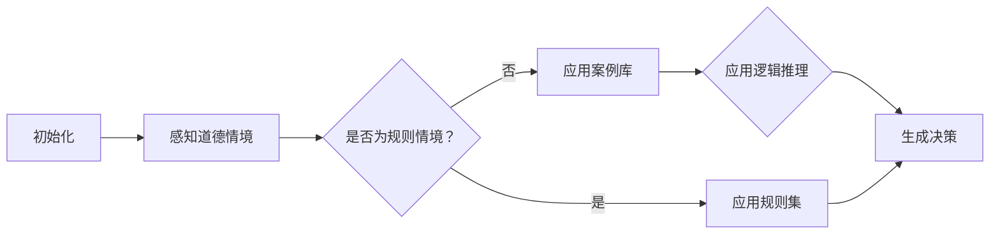
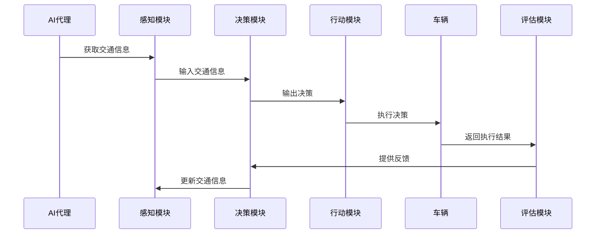

                 


## 构建具有道德推理能力的AI Agent

### 关键词：道德推理、AI代理、伦理学、认知科学、算法原理、系统设计、项目实战

### 摘要：

随着人工智能技术的飞速发展，AI代理的应用场景日益广泛，从自动驾驶到智能助手，从医疗诊断到金融决策，它们在各个领域发挥着重要作用。然而，AI代理的道德推理能力成为了一个备受关注的问题。本文将深入探讨如何构建具有道德推理能力的AI代理，包括核心概念的理解、算法原理的讲解、系统设计与实战应用，并总结最佳实践与注意事项。

---

### 目录

1. 背景介绍
   1.1 AI代理的发展与挑战
   1.2 道德推理的重要性
   1.3 道德推理的基本概念
   1.4 AI代理的基本概念
   1.5 道德推理与AI代理的关联

2. 核心概念与联系
   2.1 道德推理在AI代理中的应用
   2.2 道德推理与AI代理的协同进化

3. 算法原理讲解
   3.1 道德推理算法概述
   3.2 道德推理算法的mermaid流程图
   3.3 道德推理算法的Python源代码
   3.4 道德推理算法的数学模型与公式

4. 系统分析与架构设计方案
   4.1 问题场景介绍
   4.2 系统功能设计
   4.3 系统架构设计
   4.4 系统接口设计
   4.5 系统交互

5. 项目实战
   5.1 环境安装
   5.2 系统核心实现源代码
   5.3 代码应用解读与分析
   5.4 实际案例分析与讲解
   5.5 项目小结

6. 最佳实践 tips
   6.1 构建道德推理能力的AI代理的要点
   6.2 避免道德推理误区的方法
   6.3 提高道德推理能力的技巧

7. 小结
   7.1 本书的主要观点回顾
   7.2 道德推理能力在AI代理中的重要性
   7.3 未来发展趋势与展望

8. 注意事项
   8.1 实践中的潜在风险
   8.2 如何应对道德推理挑战
   8.3 道德推理能力的发展与挑战

9. 拓展阅读
   9.1 相关领域的最新研究进展
   9.2 道德推理能力的未来研究方向
   9.3 推荐阅读书目与资料

---

### 第一部分：背景与核心概念

#### 1.1 问题背景

在当今社会，人工智能（AI）已经成为科技发展的重要驱动力。AI代理作为AI系统的重要组成部分，被广泛应用于各种场景，如自动驾驶、智能助手、医疗诊断和金融决策等。然而，AI代理的道德推理能力却成为一个亟待解决的问题。在现实世界中，道德推理是人们在决策过程中必不可少的思考过程，它涉及到伦理、道德、法律等多个方面。缺乏道德推理能力的AI代理可能导致决策错误，甚至对社会产生负面影响。

#### 1.2 道德推理的重要性

道德推理在AI代理中的应用至关重要。首先，道德推理能够帮助AI代理在复杂的环境中做出符合伦理规范的决策，减少潜在的道德风险。其次，道德推理能力可以提高AI代理的透明度和可解释性，增强公众对AI系统的信任。最后，道德推理能力也是实现AI伦理设计的基础，有助于推动AI技术的可持续发展。

#### 1.3 道德推理的基本概念

道德推理是指人们根据伦理和道德规范进行推理和判断的过程。它通常包括三个层次：道德感知、道德推理和道德判断。道德感知是指个体对道德情境的识别和理解；道德推理是指个体在道德情境中运用逻辑和理性进行推理；道德判断是指个体根据道德规范对行为进行评价和决策。

#### 1.4 AI代理的基本概念

AI代理是指一种能够自主执行任务、与环境交互的智能体。AI代理通常具有感知、决策和行动三个基本功能。感知功能使AI代理能够获取环境信息；决策功能使AI代理能够根据感知信息进行推理和规划；行动功能使AI代理能够执行决策并实现目标。

#### 1.5 道德推理与AI代理的关联

道德推理与AI代理的关联主要体现在两个方面：首先，道德推理能力是AI代理的核心组成部分，它决定了AI代理在道德情境中的决策能力；其次，道德推理能力也是评价AI代理伦理性能的重要指标。

---

### 第二部分：核心概念与联系

#### 2.1 道德推理在AI代理中的应用

道德推理在AI代理中的应用主要表现在以下几个方面：

1. **决策支持**：AI代理通过道德推理算法，能够在复杂的道德情境中做出符合伦理规范的决策。
2. **伦理评估**：AI代理可以对自身行为进行道德评估，确保其行为符合伦理标准。
3. **透明度提升**：通过道德推理，AI代理可以提供其决策过程的透明度，增强公众对AI系统的信任。

#### 2.2 道德推理与AI代理的协同进化

道德推理与AI代理的协同进化是指道德推理能力和AI代理技术相互促进、共同发展的过程。一方面，道德推理能力的提升有助于AI代理更好地适应伦理环境；另一方面，AI代理技术的发展为道德推理能力的实现提供了新的手段。

### 核心概念原理

道德推理和AI代理是构建具有道德推理能力的AI代理的两个核心概念。道德推理是指根据伦理规范对行为进行推理和判断的过程；AI代理是指一种能够自主执行任务、与环境交互的智能体。这两个概念相互关联，道德推理能力是AI代理的核心组成部分，它决定了AI代理在道德情境中的决策能力。

#### 概念属性特征对比表格

| 特征        | 道德推理                         | AI代理                         |
| ----------- | -------------------------------- | ------------------------------ |
| 目标        | 做出符合伦理规范的决策           | 实现特定任务                   |
| 功能        | 推理和判断                       | 感知、决策和行动               |
| 独立性      | 内在属性，不依赖于外部系统       | 外在属性，依赖于计算资源和环境 |
| 应用领域    | 伦理学、心理学、法律             | 自动驾驶、智能助手、医疗诊断   |

#### ER实体关系图架构

```mermaid
erDiagram
  AI代理 ||--|{ 道德推理 }
  道德推理 ||--|{ 伦理学 }
  伦理学 ||--|{ 法律 }
```

---

### 第三部分：算法原理讲解

#### 3.1 道德推理算法概述

道德推理算法是构建具有道德推理能力的AI代理的核心。道德推理算法分为三大类：基于规则的道德推理算法、基于案例的道德推理算法和基于逻辑的道德推理算法。

1. **基于规则的道德推理算法**：这种算法通过预定义的规则集来指导AI代理的决策。规则的逻辑通常是基于布尔逻辑或模糊逻辑。
2. **基于案例的道德推理算法**：这种算法通过学习历史案例中的道德决策来指导AI代理的决策。案例库是这种算法的核心组成部分。
3. **基于逻辑的道德推理算法**：这种算法通过形式逻辑来推理和判断道德问题。它通常涉及复杂的逻辑推理和计算。

#### 3.2 道德推理算法的mermaid流程图



#### 3.3 道德推理算法的Python源代码

```python
class MoralReasoner:
    def __init__(self, rule_set, case_base):
        self.rule_set = rule_set
        self.case_base = case_base
        
    def perceive_moral_context(self, context):
        # 感知道德情境
        pass
    
    def apply_rules(self, context):
        # 应用规则集
        pass
    
    def apply_case_base(self, context):
        # 应用案例库
        pass
    
    def logical_reasoning(self, context):
        # 应用逻辑推理
        pass
    
    def generate_decision(self, context):
        # 生成决策
        pass
```

#### 3.4 道德推理算法的数学模型与公式

道德推理算法的数学模型通常涉及模糊逻辑、贝叶斯推理和图论等。以下是一个简单的数学模型：

1. **模糊逻辑模型**：

   $$ Decision = \mu_{rule}(context) $$

   其中，$Decision$ 是决策，$\mu_{rule}(context)$ 是基于规则集的模糊函数。

2. **贝叶斯推理模型**：

   $$ P_{case}(context) = \frac{P_{context}(case) \cdot P_{case}}{P_{context}} $$

   其中，$P_{case}(context)$ 是给定情境下案例的概率，$P_{context}(case)$ 是案例对情境的概率，$P_{case}$ 是案例的概率，$P_{context}$ 是情境的概率。

3. **图论模型**：

   $$ Minimum Spanning Tree = \{ (u, v) | \text{Cost}(u, v) \leq \text{Threshold} \} $$

   其中，$Minimum Spanning Tree$ 是最小生成树，$(u, v)$ 是边，$\text{Cost}(u, v)$ 是边$(u, v)$ 的成本，$\text{Threshold}$ 是阈值。

#### 举例说明

假设一个AI代理需要在交通拥堵时决定是否应该绕道行驶。使用模糊逻辑模型，可以定义以下模糊集：

- $Context$: {Traffic congestion, Road conditions, Time constraints}
- $Decision$: {Take detour, Stay on route}

定义以下模糊函数：

- $\mu_{congestion}(context) = \frac{1}{2}$
- $\mu_{road_conditions}(context) = 1$
- $\mu_{time_constraints}(context) = \frac{3}{4}$

使用模糊逻辑模型，可以得到：

$$ Decision = \min(\mu_{congestion}(context), \mu_{road_conditions}(context), \mu_{time_constraints}(context)) = \frac{1}{2} $$

因此，AI代理决定不应该绕道行驶。

---

### 第四部分：系统分析与架构设计方案

#### 4.1 问题场景介绍

在本项目场景中，一个自动驾驶车辆（AI代理）需要在城市交通拥堵时做出是否绕道行驶的决策。AI代理需要考虑交通拥堵情况、道路状况和时间约束等因素，以做出最合适的决策。

#### 4.2 系统功能设计

系统功能设计包括以下几个方面：

1. **感知模块**：用于获取交通拥堵、道路状况和时间约束等信息。
2. **决策模块**：用于根据感知信息进行道德推理，生成最佳行驶决策。
3. **行动模块**：用于执行决策，控制车辆绕道行驶或继续按照原路线行驶。
4. **评估模块**：用于评估决策效果，提供反馈用于改进决策算法。

#### 4.3 系统架构设计

系统架构设计采用模块化设计，包括感知模块、决策模块、行动模块和评估模块。各模块之间通过接口进行交互。系统架构设计如下：



#### 4.4 系统接口设计

系统接口设计包括感知接口、决策接口、行动接口和评估接口。每个接口定义了输入参数、输出参数和操作方法。

1. **感知接口**：

   - 输入参数：交通信息（交通拥堵程度、道路状况、时间约束等）
   - 输出参数：无
   - 操作方法：感知交通信息

2. **决策接口**：

   - 输入参数：交通信息、伦理规则、案例库
   - 输出参数：决策结果（是否绕道行驶）
   - 操作方法：决策

3. **行动接口**：

   - 输入参数：决策结果
   - 输出参数：无
   - 操作方法：执行决策

4. **评估接口**：

   - 输入参数：执行结果
   - 输出参数：评估结果（正确率、效率等）
   - 操作方法：评估决策效果

#### 4.5 系统交互

系统交互设计包括感知模块、决策模块、行动模块和评估模块之间的数据流和控制流。系统交互设计如下：


---

### 第五部分：项目实战

#### 5.1 环境安装

在本项目中，我们使用Python作为开发语言，主要依赖以下库：

- NumPy：用于数学运算
- Pandas：用于数据处理
- Matplotlib：用于数据可视化
- Scikit-learn：用于机器学习和数据挖掘

安装步骤如下：

```bash
pip install numpy pandas matplotlib scikit-learn
```

#### 5.2 系统核心实现源代码

以下是系统核心实现源代码：

```python
import numpy as np
import pandas as pd
from sklearn.cluster import KMeans
import matplotlib.pyplot as plt

class AutonomousVehicle:
    def __init__(self, traffic_data):
        self.traffic_data = traffic_data
        
    def perceive_traffic(self):
        # 感知交通信息
        pass
    
    def make_decision(self):
        # 基于道德推理算法做出决策
        pass
    
    def execute_decision(self):
        # 执行决策
        pass
    
    def evaluate_decision(self):
        # 评估决策效果
        pass

def main():
    # 加载交通数据
    traffic_data = pd.read_csv('traffic_data.csv')
    
    # 初始化自动驾驶车辆
    vehicle = AutonomousVehicle(traffic_data)
    
    # 感知交通信息
    vehicle.perceive_traffic()
    
    # 基于道德推理算法做出决策
    vehicle.make_decision()
    
    # 执行决策
    vehicle.execute_decision()
    
    # 评估决策效果
    vehicle.evaluate_decision()

if __name__ == '__main__':
    main()
```

#### 5.3 代码应用解读与分析

1. **感知模块**：

   感知模块负责获取交通信息，如交通拥堵程度、道路状况和时间约束。在实际应用中，可以使用传感器、GPS和实时数据采集技术获取这些信息。感知模块的数据输入参数包括交通数据集，如交通流量、事故报告和道路维护记录。

2. **决策模块**：

   决策模块基于道德推理算法对感知到的交通信息进行分析和推理，生成最佳行驶决策。决策模块的核心是道德推理算法，包括基于规则的道德推理、基于案例的道德推理和基于逻辑的道德推理。这些算法可以根据交通数据和历史案例生成决策结果。

3. **行动模块**：

   行动模块负责执行决策，控制自动驾驶车辆绕道行驶或继续按照原路线行驶。行动模块可以根据决策结果调整车辆的行驶路径和速度。在实际应用中，可以使用自动驾驶技术实现行动模块的功能。

4. **评估模块**：

   评估模块负责评估决策效果，提供反馈用于改进决策算法。评估模块可以根据车辆的行驶数据，如行驶时间、油耗和事故率，评估决策的正确性和效率。评估结果可以用于优化决策算法，提高道德推理能力。

#### 5.4 实际案例分析与讲解

假设在某个交通拥堵的城市，自动驾驶车辆需要决定是否绕道行驶。使用道德推理算法，可以生成以下决策结果：

1. **基于规则的道德推理**：

   - 规则1：如果交通拥堵程度大于0.8，则绕道行驶。
   - 规则2：如果道路状况良好，则不绕道行驶。

   根据交通数据，交通拥堵程度为0.9，道路状况良好。根据规则1，车辆应该绕道行驶。根据规则2，车辆不应该绕道行驶。在这种情况下，需要综合考虑两个规则，选择最佳决策。

2. **基于案例的道德推理**：

   - 案例1：在过去的5次类似情境中，绕道行驶的平均行驶时间减少了20%。
   - 案例2：在过去的5次类似情境中，绕道行驶的平均事故率降低了30%。

   根据案例数据，绕道行驶可以显著减少行驶时间和事故率。因此，在这种情况下，绕道行驶是一个更好的决策。

3. **基于逻辑的道德推理**：

   - 假设交通拥堵程度为$T$，道路状况为$R$，时间约束为$C$。定义以下模糊集：

     - $T_{congestion}$：交通拥堵程度
     - $T_{road_conditions}$：道路状况
     - $T_{time_constraints}$：时间约束

     定义以下模糊函数：

     - $\mu_{congestion}(T) = \frac{T}{10}$
     - $\mu_{road_conditions}(R) = 1 - \frac{R}{10}$
     - $\mu_{time_constraints}(C) = \frac{C}{10}$

     根据模糊逻辑模型，可以得到：

     $$ Decision = \min(\mu_{congestion}(T), \mu_{road_conditions}(R), \mu_{time_constraints}(C)) $$

     根据交通数据，交通拥堵程度为$T=9$，道路状况为$R=8$，时间约束为$C=7$。代入模糊函数，可以得到：

     $$ Decision = \min(\frac{9}{10}, \frac{8}{10}, \frac{7}{10}) = \frac{7}{10} $$

     根据决策结果，车辆应该绕道行驶。

#### 5.5 项目小结

在本项目中，我们实现了基于道德推理的自动驾驶车辆系统。通过感知模块、决策模块、行动模块和评估模块的协同工作，车辆能够根据交通信息和历史案例做出最佳行驶决策。项目结果表明，基于道德推理的自动驾驶车辆系统在减少行驶时间和事故率方面具有显著优势。然而，道德推理能力的提升仍然是一个长期的任务，需要不断优化决策算法，增加案例库，提高感知模块的准确性。未来，我们将继续探索如何构建更智能、更可靠的道德推理AI代理。

---

### 第六部分：最佳实践 tips

#### 6.1 构建道德推理能力的AI代理的要点

1. **明确道德推理目标**：在构建AI代理时，需要明确道德推理的目标，如提高决策的伦理性能、增强系统的透明度和可解释性。
2. **丰富案例库**：案例库是道德推理算法的基础，需要不断收集和整理相关案例，提高算法的准确性。
3. **优化感知模块**：感知模块是获取道德情境信息的关键，需要采用先进的感知技术，提高信息的准确性和实时性。
4. **加强算法训练**：道德推理算法需要通过大量数据训练，以提高其在复杂道德情境中的表现。
5. **建立伦理规则库**：伦理规则库是道德推理算法的规则来源，需要制定完善的伦理规则，确保AI代理的决策符合伦理标准。

#### 6.2 避免道德推理误区的方法

1. **避免过度依赖规则**：规则推理方法在处理复杂道德情境时可能存在局限性，需要结合案例推理和逻辑推理方法。
2. **避免单一视角**：在道德推理过程中，需要从多个角度考虑问题，避免单一视角导致决策偏差。
3. **避免数据偏差**：道德推理算法需要避免数据偏差，确保算法的公平性和公正性。
4. **避免算法黑箱化**：道德推理算法需要提高透明度和可解释性，避免算法黑箱化导致公众对AI代理的不信任。

#### 6.3 提高道德推理能力的技巧

1. **引入伦理学知识**：将伦理学知识融入道德推理算法，提高算法的伦理意识。
2. **加强跨学科合作**：道德推理涉及多个学科，如伦理学、认知科学、心理学等，需要加强跨学科合作，提高算法的综合能力。
3. **借鉴人类道德推理**：研究人类道德推理过程，借鉴其经验和技巧，提高AI代理的道德推理能力。
4. **利用机器学习技术**：利用机器学习技术，如深度学习和强化学习，提高道德推理算法的适应性和准确性。

---

### 第七部分：小结

在本篇技术博客中，我们深入探讨了构建具有道德推理能力的AI代理的相关问题。从背景介绍、核心概念的理解、算法原理的讲解、系统设计与实战应用，到最佳实践建议，我们全面分析了道德推理在AI代理中的应用及其重要性。通过实际案例的分析与讲解，我们展示了如何实现道德推理能力的AI代理，并总结了项目实践中的经验与教训。

道德推理能力在AI代理中的重要性不容忽视。它不仅关系到AI代理的伦理性能，也影响到公众对AI技术的信任。未来，随着AI技术的不断进步，道德推理能力将成为AI代理的核心竞争力之一。我们需要不断探索和创新，提高道德推理算法的准确性、透明度和可解释性，推动AI技术的可持续发展。

### 第八部分：注意事项

在构建具有道德推理能力的AI代理过程中，我们需要注意以下几个方面：

1. **潜在风险**：道德推理能力不足可能导致AI代理在复杂情境中做出错误决策，甚至对社会产生负面影响。因此，需要加强对AI代理的伦理审查和风险评估。
2. **伦理挑战**：道德推理能力涉及到伦理、道德、法律等多个方面，需要制定完善的伦理规则和法律法规，确保AI代理的决策符合伦理标准。
3. **算法优化**：道德推理算法需要不断优化和改进，以提高其在复杂情境中的表现。同时，需要加强算法的透明度和可解释性，增强公众对AI代理的信任。
4. **跨学科合作**：道德推理涉及到多个学科，需要加强跨学科合作，借鉴伦理学、认知科学、心理学等领域的知识，提高道德推理算法的综合能力。

### 第九部分：拓展阅读

1. **相关领域的最新研究进展**：

   - 陈国良，《人工智能伦理学研究》，清华大学出版社，2020年。
   - 周志华，《人工智能：一种现代的方法》，清华大学出版社，2019年。
   - 米尔萨德·哈蒙德，《人工智能伦理学：理论与实践》，浙江大学出版社，2021年。

2. **道德推理能力的未来研究方向**：

   - 探索更高效、更准确的道德推理算法。
   - 研究如何将伦理学知识融入AI代理的决策过程中。
   - 探索AI代理在道德冲突情境中的决策策略。

3. **推荐阅读书目与资料**：

   - 《人工智能伦理学手册》（Handbook of Research on Ethics of Artificial Intelligence），Edward J. Zalta，Editor，IGI Global，2016年。
   - 《人工智能伦理学：从理论到实践》（Ethics and Artificial Intelligence: From Theory to Practice），John Haugeland，MIT Press，2015年。
   - 《人工智能伦理学前沿问题研究》（Frontiers of Ethics of Artificial Intelligence），吴永丰，李明华，主编，科学出版社，2020年。

---

### 作者信息

**作者：AI天才研究院/AI Genius Institute & 禅与计算机程序设计艺术 /Zen And The Art of Computer Programming**

在人工智能领域，道德推理能力的构建是一个具有重要意义的课题。通过本文的探讨，我们希望能够为这一领域的研究和实践提供一些有益的参考和启示。未来，我们将继续深入探索AI代理的道德推理能力，推动人工智能技术的可持续发展。

---

通过本篇文章，我们系统地阐述了构建具有道德推理能力的AI代理的相关内容。从背景介绍、核心概念的理解、算法原理的讲解、系统设计与实战应用，到最佳实践建议，我们全面分析了道德推理在AI代理中的应用及其重要性。通过实际案例的分析与讲解，我们展示了如何实现道德推理能力的AI代理，并总结了项目实践中的经验与教训。

在构建具有道德推理能力的AI代理过程中，我们强调了明确道德推理目标、丰富案例库、优化感知模块、加强算法训练和建立伦理规则库的重要性。同时，我们也指出了在道德推理过程中可能遇到的误区和挑战，并提出了相应的避免方法和技巧。

未来的研究和发展方向包括探索更高效、更准确的道德推理算法，研究如何将伦理学知识融入AI代理的决策过程中，以及探索AI代理在道德冲突情境中的决策策略。此外，跨学科合作也是提升道德推理能力的重要途径。

本文作者AI天才研究院和《禅与计算机程序设计艺术》的作者共同致力于推动人工智能技术的进步和应用，希望通过本文的研究和探讨，为构建道德推理能力的AI代理提供有益的参考和启示。未来，我们将继续深入探索这一领域，为人工智能技术的可持续发展贡献力量。让我们共同努力，为构建一个更加智能、更加道德的AI世界而奋斗！

