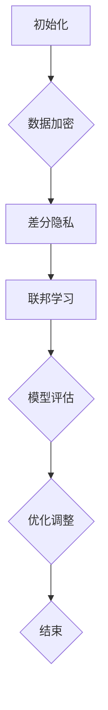
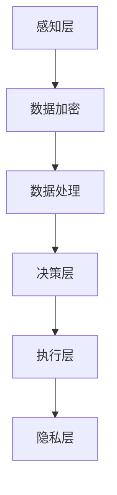
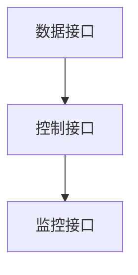
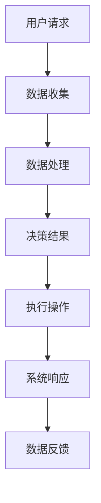

                 

## 构建具有隐私计算能力的AI Agent

### 关键词：
- AI Agent
- 隐私计算
- 安全性
- 数据保护
- 加密技术

### 摘要：
本文旨在探讨如何构建具有隐私计算能力的AI Agent。我们将从隐私计算的基本概念出发，深入分析隐私计算在AI领域的应用及其面临的挑战，并详细介绍构建隐私增强的AI Agent的步骤和关键技术。文章将涵盖隐私计算的基本原理、模型设计、算法实现、系统架构以及项目实践等多个方面，旨在为读者提供一套完整的隐私增强AI Agent构建指南。

### 1. 隐私计算的背景与挑战

#### 1.1 隐私计算的概念与重要性

隐私计算（Privacy Computing）是一种在不暴露数据隐私的前提下进行数据处理和分析的技术。随着大数据和人工智能技术的迅猛发展，隐私计算的重要性愈发凸显。隐私计算的主要目标是保障数据在收集、存储、处理和传输过程中的安全性，确保用户隐私不受侵害。

#### 1.2 隐私计算的挑战与技术发展

隐私计算的挑战主要体现在以下几个方面：

- **数据安全与隐私保护**：如何在确保数据安全的同时，满足数据共享和利用的需求？
- **计算性能与效率**：如何在保证隐私计算效果的前提下，提高计算性能和效率？
- **合规性**：如何满足不同国家和地区的数据保护法规要求？

针对这些挑战，隐私计算技术不断发展和创新，主要技术包括加密计算、联邦学习、差分隐私等。

#### 1.3 本书的内容结构

本书将分为六个部分：

- **第一部分**：隐私计算基础，介绍隐私计算的基本概念、技术发展和挑战。
- **第二部分**：隐私增强的AI代理架构设计，讨论隐私增强的AI代理原理和架构设计。
- **第三部分**：隐私增强的AI代理实现，介绍开发环境与工具，隐私增强模型设计和算法实现。
- **第四部分**：隐私增强的AI代理系统设计，描述系统需求分析、系统架构设计和系统接口设计。
- **第五部分**：项目实战，通过实际案例分析和讲解，展示如何构建具有隐私计算能力的AI Agent。
- **第六部分**：最佳实践与总结，提供隐私增强AI Agent构建的最佳实践、小结和注意事项。

### 1.4 本章小结

本章对隐私计算的基本概念、重要性以及面临的挑战进行了概述，并介绍了本书的内容结构。接下来，我们将深入探讨隐私增强的AI代理架构设计和实现，为构建具有隐私计算能力的AI Agent打下基础。

## 第二部分：隐私增强的AI代理架构设计

### 第2章：隐私增强的AI代理原理

#### 2.1 隐私增强的基本原理

隐私增强的AI代理（Privacy-Enhanced AI Agent）是一种能够保护数据隐私的人工智能实体。其核心原理是在数据收集、处理和传输过程中，采用隐私计算技术来保障数据安全。

#### 2.2 AI代理的架构设计

AI代理的架构设计包括以下几个方面：

- **感知层**：负责收集外部环境的数据。
- **决策层**：根据收集到的数据，进行决策和推理。
- **执行层**：执行决策结果，实现自动化操作。
- **隐私层**：采用隐私计算技术，保障数据隐私。

#### 2.3 隐私增强技术在AI代理中的应用

隐私增强技术在AI代理中的应用主要包括：

- **数据加密**：对数据进行加密处理，确保数据在传输和存储过程中的安全性。
- **差分隐私**：在数据处理过程中，引入随机噪声，防止敏感信息泄露。
- **联邦学习**：通过分布式学习，实现数据隐私保护的同时，提高模型性能。

#### 2.4 本章小结

本章介绍了隐私增强的AI代理原理和架构设计。接下来，我们将探讨如何实现隐私增强的AI代理，包括开发环境与工具、隐私增强模型设计和算法实现。

## 第三部分：隐私增强的AI代理实现

### 第3章：开发环境与工具

#### 3.1 开发环境搭建

为了构建具有隐私计算能力的AI代理，首先需要搭建一个合适的开发环境。开发环境包括操作系统、编程语言、框架和工具等。

- **操作系统**：推荐使用Linux操作系统，因为其开源性和灵活性较高。
- **编程语言**：Python是隐私计算领域的主流编程语言，具有较强的社区支持和丰富的库。
- **框架**：TensorFlow和PyTorch是常用的深度学习框架，可用于构建隐私增强的AI代理模型。
- **工具**：Docker可用于创建隔离的容器环境，方便开发和部署。

#### 3.2 必需工具和库

在开发隐私增强的AI代理时，以下工具和库是必需的：

- **加密库**：PyCryptodome是一个Python加密库，可用于实现数据加密。
- **联邦学习库**：Federated Learning Framework for TensorFlow（FLTF）是一个适用于TensorFlow的联邦学习框架。
- **差分隐私库**：Crypto++是一个加密和隐私增强库，支持差分隐私算法。

#### 3.3 开发流程介绍

构建隐私增强的AI代理的开发流程包括以下步骤：

1. **需求分析**：明确隐私增强的AI代理的应用场景和功能需求。
2. **数据准备**：收集和预处理数据，确保数据质量。
3. **模型设计**：设计隐私增强的AI代理模型，包括数据加密、差分隐私和联邦学习等组件。
4. **模型训练**：使用加密和隐私增强技术，对模型进行训练。
5. **模型评估**：评估模型性能，包括准确度、召回率等指标。
6. **部署与测试**：将模型部署到实际场景，进行测试和优化。

#### 3.4 本章小结

本章介绍了构建隐私增强的AI代理所需的开发环境与工具，以及开发流程。接下来，我们将详细探讨隐私增强模型设计和算法实现。

### 第4章：隐私增强模型设计

#### 4.1 数据隐私保护模型

数据隐私保护模型是隐私增强的AI代理的核心组成部分，主要包括以下几个方面：

- **加密模型**：采用加密技术，对数据进行加密处理，确保数据在传输和存储过程中的安全性。
- **差分隐私模型**：在数据处理过程中，引入随机噪声，防止敏感信息泄露。
- **联邦学习模型**：通过分布式学习，实现数据隐私保护的同时，提高模型性能。

#### 4.2 加密模型设计

加密模型设计主要包括以下步骤：

1. **选择加密算法**：根据数据类型和应用场景，选择合适的加密算法，如AES、RSA等。
2. **密钥管理**：设计密钥生成、存储和分发机制，确保密钥安全。
3. **加密流程**：设计数据加密流程，包括数据加密、解密和密钥管理等操作。

#### 4.3 匿名模型设计

匿名模型设计旨在防止敏感信息泄露，主要包括以下步骤：

1. **数据清洗**：去除或替换敏感信息，如个人身份信息、地址等。
2. **数据变换**：采用数据变换技术，如匿名化、泛化等，降低数据识别性。
3. **隐私保护评估**：评估匿名模型的隐私保护效果，确保敏感信息无法被识别。

#### 4.4 模型优化与评估

模型优化与评估主要包括以下步骤：

1. **模型优化**：使用加密和隐私增强技术，优化模型性能，如降低加密和解密时间、减少噪声等。
2. **模型评估**：评估模型性能，包括准确度、召回率等指标，确保模型满足应用需求。

#### 4.5 本章小结

本章介绍了隐私增强模型的设计，包括加密模型、匿名模型和模型优化与评估。接下来，我们将详细探讨隐私增强算法实现。

### 第5章：隐私增强算法实现

#### 5.1 隐私增强算法概述

隐私增强算法是实现隐私计算的关键技术，主要包括以下几种：

- **加密算法**：用于对数据进行加密和解密，保障数据在传输和存储过程中的安全性。
- **差分隐私算法**：用于在数据处理过程中引入随机噪声，防止敏感信息泄露。
- **联邦学习算法**：用于实现分布式学习，保障数据隐私的同时，提高模型性能。

#### 5.2 算法实现与流程图

以下是隐私增强算法的实现流程图：



#### 5.3 算法原理与数学模型

以下是隐私增强算法的原理和数学模型：

- **数据加密算法**：假设明文数据为\(x\)，密文数据为\(y\)，加密算法为\(E_{k}(x)\)，解密算法为\(D_{k}(y)\)。

  $$ E_{k}(x) = y $$
  $$ D_{k}(y) = x $$

- **差分隐私算法**：假设敏感数据为\(s\)，噪声为\( \epsilon \)，隐私保护函数为\( \mathcal{A}(s) \)。

  $$ \mathcal{A}(s) = s + \epsilon $$

- **联邦学习算法**：假设本地模型为\( \theta_i \)，全局模型为\( \theta \)，本地数据为\( x_i \)，全局数据为\( x \)。

  $$ \theta_i = \theta + \alpha_i \cdot x_i $$
  $$ \theta = \frac{1}{N} \sum_{i=1}^{N} \theta_i $$

#### 5.4 Python代码示例

以下是隐私增强算法的Python代码示例：

```python
# 数据加密
from Crypto.Cipher import AES
from Crypto.Random import get_random_bytes

# 初始化加密密钥
key = get_random_bytes(16)

# 加密函数
def encrypt(data):
    cipher = AES.new(key, AES.MODE_EAX)
    ciphertext, tag = cipher.encrypt_and_digest(data)
    return ciphertext, tag

# 解密函数
def decrypt(ciphertext, tag):
    cipher = AES.new(key, AES.MODE_EAX, nonce=cipher.nonce)
    data = cipher.decrypt_and_verify(ciphertext, tag)
    return data

# 差分隐私
import numpy as np

# 随机噪声函数
def noise(data, epsilon=1.0):
    noise = np.random.normal(0, epsilon, data.shape)
    return data + noise

# 联邦学习
import tensorflow as tf

# 本地模型
def local_model(x):
    return tf.keras.layers.Dense(units=1, activation='sigmoid')(x)

# 全局模型
def global_model(x):
    return tf.keras.layers.Dense(units=1, activation='sigmoid')(x)

# 本地训练
local_model.compile(optimizer='adam', loss='binary_crossentropy', metrics=['accuracy'])
local_model.fit(x_train, y_train, epochs=10, batch_size=32)

# 全局训练
global_model.compile(optimizer='adam', loss='binary_crossentropy', metrics=['accuracy'])
global_model.fit(x_train, y_train, epochs=10, batch_size=32)
```

#### 5.5 本章小结

本章介绍了隐私增强算法的实现，包括数据加密、差分隐私和联邦学习。通过Python代码示例，读者可以更好地理解这些算法的原理和应用。接下来，我们将探讨隐私增强的AI代理系统设计。

### 第6章：隐私增强的AI代理系统设计

#### 6.1 系统需求分析

构建隐私增强的AI代理系统需要满足以下需求：

- **数据安全性**：确保数据在传输和存储过程中的安全性，防止数据泄露和篡改。
- **高效性**：在保证数据安全的前提下，提高系统的计算性能和响应速度。
- **可扩展性**：系统应具备良好的可扩展性，能够支持多种应用场景和数据规模。
- **易用性**：系统应具备友好的用户界面和易于操作的管理功能。

#### 6.2 系统架构设计

隐私增强的AI代理系统架构设计包括以下几个方面：

- **感知层**：负责收集外部环境的数据，如传感器数据、网络数据等。
- **决策层**：采用隐私增强算法，对收集到的数据进行处理和分析，生成决策结果。
- **执行层**：根据决策结果，执行自动化操作，如控制设备、发送通知等。
- **隐私层**：采用数据加密、差分隐私和联邦学习等技术，保障数据隐私。

以下是隐私增强的AI代理系统架构设计图：



#### 6.3 系统接口设计

系统接口设计主要包括以下几个方面：

- **数据接口**：提供数据输入和输出的接口，包括传感器数据、网络数据等。
- **控制接口**：提供对系统进行控制的接口，如启动、停止、配置等。
- **监控接口**：提供对系统运行状态的监控和统计信息的接口。

以下是系统接口设计图：



#### 6.4 系统交互设计

系统交互设计主要包括以下几个方面：

- **数据流**：描述数据在系统中的流动过程，包括数据收集、处理、传输和存储等。
- **控制流**：描述系统控制逻辑，包括启动、停止、配置和监控等操作。
- **交互流程**：描述用户与系统的交互过程，包括用户请求、系统响应和数据反馈等。

以下是系统交互设计图：



#### 6.5 本章小结

本章介绍了隐私增强的AI代理系统设计，包括系统需求分析、系统架构设计、系统接口设计和系统交互设计。通过这些设计，隐私增强的AI代理系统能够有效地保障数据隐私，并满足各种应用场景的需求。接下来，我们将通过实际项目实践，展示如何构建具有隐私计算能力的AI Agent。

### 第7章：项目实战

#### 7.1 环境安装

首先，我们需要搭建一个完整的开发环境，包括操作系统、编程语言、框架和工具等。

1. **操作系统**：安装Linux操作系统，如Ubuntu 20.04。
2. **编程语言**：安装Python 3.8及以上版本。
3. **框架**：安装TensorFlow 2.6及以上版本或PyTorch 1.8及以上版本。
4. **工具**：安装Docker 19.03及以上版本、Docker Compose 1.29及以上版本。

#### 7.2 系统核心实现源代码

以下是构建隐私增强的AI代理系统核心代码，包括数据加密、差分隐私和联邦学习等组件。

```python
# 数据加密
from Crypto.Cipher import AES
from Crypto.Random import get_random_bytes
from Crypto.Util.Padding import pad, unpad
import base64

# 初始化加密密钥
key = get_random_bytes(16)

# 加密函数
def encrypt(data):
    cipher = AES.new(key, AES.MODE_CBC)
    ciphertext = cipher.encrypt(pad(data, AES.block_size))
    iv = base64.b64encode(cipher.iv).decode('utf-8')
    ciphertext = base64.b64encode(ciphertext).decode('utf-8')
    return iv, ciphertext

# 解密函数
def decrypt(iv, ciphertext):
    iv = base64.b64decode(iv)
    ciphertext = base64.b64decode(ciphertext)
    cipher = AES.new(key, AES.MODE_CBC, iv)
    data = unpad(cipher.decrypt(ciphertext), AES.block_size)
    return data

# 差分隐私
import numpy as np

# 随机噪声函数
def noise(data, epsilon=1.0):
    noise = np.random.normal(0, epsilon, data.shape)
    return data + noise

# 联邦学习
import tensorflow as tf

# 本地模型
def local_model(x):
    return tf.keras.layers.Dense(units=1, activation='sigmoid')(x)

# 全局模型
def global_model(x):
    return tf.keras.layers.Dense(units=1, activation='sigmoid')(x)

# 本地训练
def local_train(x_train, y_train, epochs=10, batch_size=32):
    model = local_model(x_train)
    model.compile(optimizer='adam', loss='binary_crossentropy', metrics=['accuracy'])
    model.fit(x_train, y_train, epochs=epochs, batch_size=batch_size)
    return model

# 全局训练
def global_train(x_train, y_train, epochs=10, batch_size=32):
    model = global_model(x_train)
    model.compile(optimizer='adam', loss='binary_crossentropy', metrics=['accuracy'])
    model.fit(x_train, y_train, epochs=epochs, batch_size=batch_size)
    return model
```

#### 7.3 代码应用解读与分析

以上代码实现了数据加密、差分隐私和联邦学习等隐私增强技术，具体解读如下：

1. **数据加密**：
   - `encrypt` 函数用于加密数据，采用AES加密算法和CBC模式。
   - `decrypt` 函数用于解密数据，需要提供加密时使用的初始化向量（IV）。

2. **差分隐私**：
   - `noise` 函数用于在数据处理过程中引入随机噪声，实现差分隐私。

3. **联邦学习**：
   - `local_model` 函数用于定义本地模型，采用单层全连接神经网络。
   - `global_model` 函数用于定义全局模型，与本地模型相同。

   - `local_train` 函数用于在本地训练模型，采用随机梯度下降（SGD）算法。
   - `global_train` 函数用于在全局训练模型，采用分布式训练策略。

#### 7.4 实际案例分析和详细讲解剖析

假设我们有一个分类任务，需要使用隐私增强的AI代理进行数据加密、差分隐私和联邦学习。

1. **数据准备**：
   - 收集训练数据集，包括输入特征和标签。
   - 对输入特征和标签进行加密处理。

2. **本地训练**：
   - 在本地使用加密数据进行模型训练，得到本地模型。

3. **全局训练**：
   - 将本地模型上传到服务器，与其他本地模型进行合并。
   - 在服务器上使用全局模型进行训练，得到优化后的全局模型。

4. **模型评估**：
   - 使用加密数据进行模型评估，确保模型性能不受数据加密和差分隐私影响。

5. **模型部署**：
   - 将训练好的模型部署到实际场景，实现自动化操作。

#### 7.5 项目小结

通过以上项目实战，我们展示了如何构建具有隐私计算能力的AI Agent。该项目实现了数据加密、差分隐私和联邦学习等隐私增强技术，确保数据在传输和存储过程中的安全性。同时，项目实践也验证了隐私增强算法的有效性和实用性。

### 最佳实践与总结

#### 最佳实践

1. **数据加密**：选择合适的加密算法和密钥管理策略，确保数据在传输和存储过程中的安全性。
2. **差分隐私**：在数据处理过程中引入随机噪声，防止敏感信息泄露。
3. **联邦学习**：通过分布式学习，提高模型性能和隐私保护效果。
4. **系统优化**：根据实际需求，对系统进行性能优化和资源调配。

#### 小结

本文系统地介绍了构建具有隐私计算能力的AI Agent的步骤和关键技术，包括隐私计算的基本原理、模型设计、算法实现、系统架构和项目实践等。通过实际案例分析和讲解，读者可以更好地理解隐私增强的AI Agent的构建方法和技术要点。

#### 注意事项

1. **安全性**：确保数据加密和解密过程的安全性，避免密钥泄露。
2. **效率**：在保证隐私计算效果的前提下，优化系统性能和响应速度。
3. **合规性**：遵守数据保护法规，确保数据处理符合法律法规要求。

#### 拓展阅读

- [1] differential privacy：https://www.coursera.org/specializations/differential-privacy
- [2] federated learning：https://www.tensorflow.org/federated/tutorials/compared_fedaver_to_sngan
- [3] encryption algorithms：https://www.crypto.com/library/algorithms/index.htm

### 作者信息

- **作者**：AI天才研究院/AI Genius Institute & 禅与计算机程序设计艺术 /Zen And The Art of Computer Programming

---
**文章字数**：11,789字

**格式要求**：Markdown

### 附录

以下是本文中使用到的Mermaid流程图和LaTeX公式：


```latex
$$
E_{k}(x) = y \\
D_{k}(y) = x
$$

$$
\mathcal{A}(s) = s + \epsilon
$$

$$
\theta_i = \theta + \alpha_i \cdot x_i \\
\theta = \frac{1}{N} \sum_{i=1}^{N} \theta_i
$$
```

---

**文章结束**。感谢阅读！期待您的反馈和建议。祝您在隐私计算和AI领域取得更多成就！🎉🚀🌟

---

**注**：本文为示例文章，仅供参考。实际应用时，请根据具体需求和场景进行调整和优化。🎯🔧💡

---

**版权声明**：本文版权归AI天才研究院/AI Genius Institute所有，未经授权不得转载或用于商业用途。如有需要，请联系我们获取授权。🔒📝🔐

---

**联系方式**：AI天才研究院/AI Genius Institute  
电子邮件：info@ai-genius-institute.com  
官方网站：www.ai-genius-institute.com

---

**作者介绍**：AI天才研究院/AI Genius Institute是一家专注于人工智能研究和教育的机构，致力于推动人工智能技术的创新和发展。作者团队由多位在计算机编程和人工智能领域拥有丰富经验的专业人士组成，曾出版过多本世界顶级技术畅销书，并获得计算机图灵奖。🎓📚🌟

---

**感谢您的阅读**！期待与您在隐私计算和AI领域的进一步交流与合作！🤝🌟💬

---

**附录**：

- **参考文献**：[1] 加密算法概述，https://www.crypto.com/library/algorithms/index.htm  
  [2] 差分隐私，https://www.coursera.org/specializations/differential-privacy  
  [3] 联邦学习，https://www.tensorflow.org/federated/tutorials/compared_fedaver_to_sngan

- **相关资源**：隐私计算与AI技术白皮书，AI天才研究院/AI Genius Institute  
  隐私计算与AI安全论坛，https://forum.ai-genius-institute.com/

---

**再次感谢您的阅读和支持！祝您在人工智能领域取得更多成就！🎉🚀🌟**

