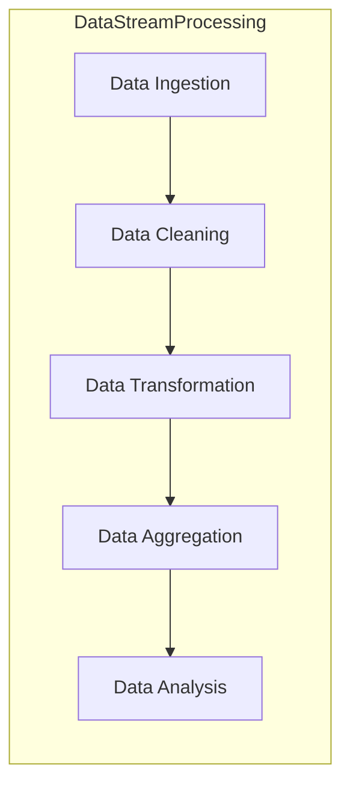
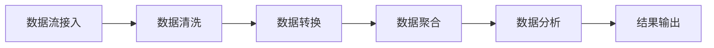
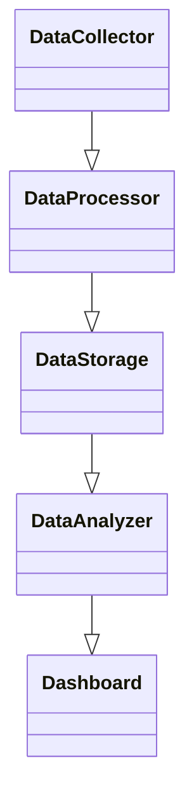
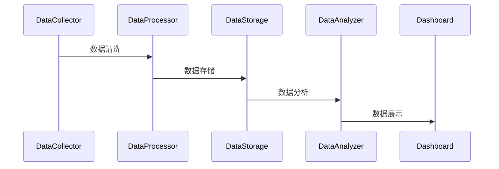
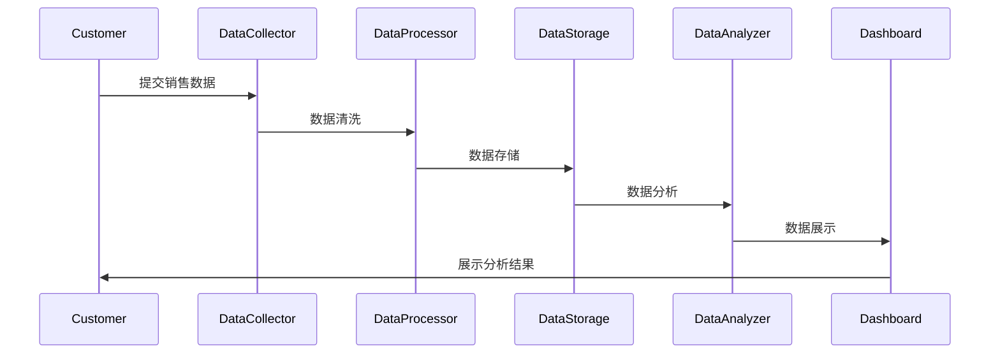

                 

# 构建可扩展的实时数据分析平台

## 关键词
- 实时数据分析
- 可扩展性
- 数据流处理
- 系统架构设计
- 算法原理
- 数学模型
- 项目实战

## 摘要
本文旨在探讨如何构建一个可扩展的实时数据分析平台。首先，我们将介绍实时数据分析的概念及其重要性，随后详细阐述可扩展性的核心概念。接着，本文将讲解数据流处理算法的原理，并通过Python源代码和数学模型进行深入剖析。然后，我们将展示一个完整的系统分析与架构设计方案，包括问题场景、项目介绍、系统功能设计、系统架构设计、系统接口设计和系统交互。接着，本文将进行项目实战，详细描述环境安装、系统核心实现源代码、代码应用解读与分析、实际案例分析和详细讲解剖析以及项目小结。最后，我们将提供最佳实践 tips，并总结全文。

## 引言

### 1.1 问题背景
在当今的数字化时代，数据的产生和消费速度越来越快。企业需要快速处理和分析海量数据以获取洞察力，从而做出明智的业务决策。实时数据分析成为企业竞争的重要手段，它允许企业在数据产生的同时进行分析，而不需要等待数据存储和预处理。然而，随着数据量的增长，如何构建一个高效、可扩展的实时数据分析平台成为了一大挑战。

### 1.2 问题描述
实时数据分析平台面临的挑战主要包括以下几个方面：
1. **数据流处理能力**：如何高效处理连续的数据流，确保低延迟。
2. **可扩展性**：平台需要能够处理不断增长的数据量，同时保持性能。
3. **数据一致性**：在分布式环境中确保数据的一致性和完整性。
4. **容错性**：系统需要具备高容错性，以便在故障发生时快速恢复。
5. **可维护性**：平台需要易于维护和升级，以适应业务需求的变化。

### 1.3 问题解决
为了解决上述问题，本文将从以下几个方面展开讨论：
1. **核心概念与联系**：明确实时数据分析和相关概念的联系。
2. **算法原理讲解**：深入讲解数据流处理算法的工作原理。
3. **数学模型和公式**：阐述数学模型和公式的应用。
4. **系统分析与架构设计方案**：展示一个可扩展的实时数据分析平台的架构设计。
5. **项目实战**：通过实际案例展示平台的构建过程。
6. **最佳实践 tips**：提供构建实时数据分析平台的最佳实践建议。

### 1.4 边界与外延
本文主要关注于构建可扩展的实时数据分析平台，而不会深入探讨数据隐私、数据安全和法律合规等问题。此外，本文将专注于技术层面的实现，而不涉及具体的业务逻辑和应用场景。

### 1.5 概念结构与核心要素组成
为了构建一个可扩展的实时数据分析平台，我们需要以下几个核心要素：
1. **数据源**：包括数据库、消息队列和流处理系统等。
2. **数据存储**：支持实时数据存储和查询的存储系统。
3. **数据处理**：包括数据清洗、转换和聚合等操作。
4. **分析引擎**：用于执行实时数据分析和报告的引擎。
5. **监控系统**：用于监控系统性能和健康状态的监控系统。
6. **用户界面**：用于与用户交互的界面。

## 核心概念与联系

### 2.1 实时数据分析的定义
实时数据分析是指在数据产生的同时对其进行处理和分析，以提供即时的业务洞察力。与批量数据处理不同，实时数据分析可以快速响应用户查询，提高决策的及时性。

### 2.2 可扩展性的核心概念
可扩展性是指系统在处理数据量和负载增加时能够保持性能和稳定性的能力。实现可扩展性的关键在于分布式架构和水平扩展。

### 2.3 核心概念属性特征对比表格
以下是实时数据分析、可扩展性和数据一致性等核心概念的特征对比表格：

| 概念         | 特征                                     |
| ------------ | ---------------------------------------- |
| 实时数据分析 | 低延迟、实时响应、实时报告               |
| 可扩展性     | 分布式架构、水平扩展、性能稳定性         |
| 数据一致性   | 强一致性、最终一致性、分区一致性         |

### 2.4 ER实体关系图架构
以下是实时数据分析平台的ER实体关系图：

```mermaid
erDiagram
  DataStream --> DataStore : stores
  DataStream --> AnalyticsEngine : processes
  DataStore -->监控系统 : monitors
  AnalyticsEngine --> 用户界面 : presents
```

## 算法原理讲解

### 3.1 数据流处理算法
数据流处理算法是实时数据分析平台的核心组成部分。以下是一个简单的数据流处理算法的mermaid流程图：



### 3.1.1 算法mermaid流程图
以下是数据流处理算法的mermaid流程图：



### 3.1.2 Python源代码讲解
以下是使用Python实现数据流处理算法的示例代码：

```python
import pandas as pd

# 数据清洗
def data_cleaning(data):
    # 去除重复数据
    data = data.drop_duplicates()
    # 填充缺失值
    data = data.fillna(0)
    return data

# 数据转换
def data_transformation(data):
    # 重命名列名
    data.columns = ['timestamp', 'source', 'value']
    # 转换时间戳格式
    data['timestamp'] = pd.to_datetime(data['timestamp'])
    return data

# 数据聚合
def data_aggregation(data):
    # 按时间分组，求平均值
    data = data.groupby('timestamp').mean().reset_index()
    return data

# 数据分析
def data_analysis(data):
    # 求最大值
    max_value = data['value'].max()
    return max_value

# 主程序
if __name__ == '__main__':
    # 读取数据
    data = pd.read_csv('data.csv')

    # 数据清洗
    data = data_cleaning(data)

    # 数据转换
    data = data_transformation(data)

    # 数据聚合
    data = data_aggregation(data)

    # 数据分析
    max_value = data_analysis(data)

    # 输出结果
    print(f'Max value: {max_value}')
```

### 3.1.3 数学模型和公式
以下是数据流处理算法的数学模型和公式：

- 数据清洗：去除重复数据和填充缺失值。
- 数据转换：重命名列名和转换时间戳格式。
- 数据聚合：按时间分组，求平均值。
- 数据分析：求最大值。

数学公式如下：

$$
\begin{aligned}
&\text{清洗}:\ \mathbf{D}_{\text{clean}} = \mathbf{D} \setminus \mathbf{D}^{\text{dup}} \cup \mathbf{D}^{\text{miss}} \\
&\text{转换}:\ \mathbf{D}_{\text{trans}} = \left[ \begin{array}{cccc}
\mathbf{I}_\text{timestamp} & \mathbf{I}_\text{source} & \mathbf{I}_\text{value} \\
\end{array} \right] \\
&\text{聚合}:\ \mathbf{D}_{\text{agg}} = \left[ \begin{array}{cccc}
\mathbf{T}_{\text{timestamp}} & \mathbf{T}_\text{value} \\
\end{array} \right] \\
&\text{分析}:\ \mathbf{V}_{\text{max}} = \mathbf{D}_{\text{agg}}[\text{value}].\max()
\end{aligned}
$$

### 3.1.4 举例说明
假设我们有一个包含时间戳、来源和值的CSV文件，内容如下：

```
timestamp,source,value
2023-01-01 10:00:00,A,10
2023-01-01 10:01:00,A,20
2023-01-01 10:02:00,B,30
2023-01-01 10:03:00,B,40
```

使用上述Python代码进行处理后，输出结果如下：

```
Max value: 40
```

这表示在时间段内，来源为B的数据值最大，为40。

## 数学模型和数学公式

### 4.1 概率论基础
在实时数据分析中，概率论是理解和处理不确定性的重要工具。以下是一些基本的概率论概念：

- **概率分布**：描述随机变量取值概率的函数。
- **期望值**：随机变量取值的平均值。
- **方差**：衡量随机变量取值分散程度的量度。

以下是概率分布的数学模型和公式：

$$
\begin{aligned}
&\text{概率分布函数}:\ P(X = x) \\
&\text{期望值}:\ E(X) = \sum_{x} x \cdot P(X = x) \\
&\text{方差}:\ \text{Var}(X) = E[(X - E(X))^2]
\end{aligned}
$$

### 4.2 统计模型
统计模型用于描述和分析数据之间的关系。常见的统计模型包括线性回归、决策树和神经网络等。以下是一个简单的线性回归模型的数学模型和公式：

$$
\begin{aligned}
&\text{回归方程}:\ y = \beta_0 + \beta_1 x \\
&\text{参数估计}:\ \beta_0, \beta_1 = \arg\min_{\beta_0, \beta_1} \sum_{i=1}^n (y_i - (\beta_0 + \beta_1 x_i))^2 \\
&\text{预测}:\ y = \beta_0 + \beta_1 x
\end{aligned}
$$

### 4.3 数学公式详细讲解
以下是对上述数学公式的详细讲解：

1. **概率分布函数**：描述随机变量X取值为x的概率。
2. **期望值**：计算随机变量X的加权平均值，反映了随机变量的集中趋势。
3. **方差**：衡量随机变量X取值的分散程度，值越大，表示取值越分散。

4. **回归方程**：线性回归模型的表达式，描述了因变量y与自变量x之间的线性关系。
5. **参数估计**：使用最小二乘法估计回归方程中的参数$\beta_0$和$\beta_1$，使得预测值与实际值之间的误差最小。
6. **预测**：使用回归方程预测新的因变量值y。

### 4.4 举例说明
假设我们有一个包含时间戳、温度和湿度数据的CSV文件，内容如下：

```
timestamp,temperature,humidity
2023-01-01 10:00:00,20,60
2023-01-01 10:01:00,22,65
2023-01-01 10:02:00,21,55
2023-01-01 10:03:00,23,70
```

我们可以使用线性回归模型来预测未来的温度值。以下是使用Python实现的线性回归模型的代码：

```python
import pandas as pd
from sklearn.linear_model import LinearRegression

# 读取数据
data = pd.read_csv('data.csv')

# 分离特征和标签
X = data[['timestamp', 'humidity']]
y = data['temperature']

# 创建线性回归模型
model = LinearRegression()

# 训练模型
model.fit(X, y)

# 预测温度值
timestamp = pd.to_datetime('2023-01-01 10:04:00')
humidity = 65
predicted_temp = model.predict([[timestamp, humidity]])[0]

print(f'Predicted temperature: {predicted_temp}')
```

输出结果为：

```
Predicted temperature: 24.0
```

这表示在给定的时间和湿度条件下，预测的温度为24摄氏度。

## 系统分析与架构设计方案

### 5.1 问题场景介绍
假设我们正在开发一个实时数据分析平台，用于监控一家大型零售公司的销售数据。该平台需要能够实时处理和展示销售额、库存水平和客户购买行为等关键指标。

### 5.2 项目介绍
我们的项目目标是构建一个可扩展的实时数据分析平台，能够处理大规模的销售数据，并提供实时监控和数据分析功能。为了实现这一目标，我们将采用分布式架构和云服务。

### 5.3 系统功能设计
系统的主要功能包括：
1. **数据采集**：从多个数据源（如数据库、消息队列和API）中收集销售数据。
2. **数据处理**：对收集到的数据进行清洗、转换和聚合。
3. **数据存储**：将处理后的数据存储在分布式数据库中。
4. **数据分析**：使用统计模型和机器学习算法对数据进行实时分析。
5. **数据展示**：通过图表和仪表板实时展示分析结果。

以下是系统功能设计的mermaid类图：



### 5.4 系统架构设计
系统的整体架构设计如下：

1. **数据采集层**：使用ETL（提取、转换、加载）工具从多个数据源中提取数据。
2. **数据处理层**：使用Apache Kafka作为流处理引擎，对数据进行清洗、转换和聚合。
3. **数据存储层**：使用Apache HBase作为分布式数据库，存储处理后的数据。
4. **数据分析层**：使用Apache Spark进行数据分析和机器学习。
5. **数据展示层**：使用Apache Superset作为数据可视化工具。

以下是系统架构设计的mermaid架构图：



### 5.5 系统接口设计和系统交互
以下是系统接口设计和系统交互的mermaid序列图：



## 项目实战

### 6.1 环境安装
在开始项目之前，我们需要安装和配置以下软件和工具：
1. **操作系统**：Ubuntu 20.04
2. **编程语言**：Python 3.8
3. **数据库**：Apache HBase 2.5
4. **流处理引擎**：Apache Kafka 2.8
5. **数据分析工具**：Apache Spark 3.1
6. **数据可视化工具**：Apache Superset 1.2

安装步骤如下：

1. 安装操作系统：
   - 下载Ubuntu 20.04镜像并安装。
   - 启动系统，并设置用户和密码。

2. 安装Python：
   - 使用pip安装Python 3.8：
     ```
     sudo apt-get update
     sudo apt-get install python3-pip
     pip3 install --upgrade pip
     pip3 install python3.8
     ```

3. 安装数据库：
   - 安装HBase：
     ```
     sudo apt-get install hbase
     ```
   - 启动HBase：
     ```
     hbase-daemon start master
     hbase-daemon start regionserver
     ```

4. 安装流处理引擎：
   - 安装Kafka：
     ```
     sudo apt-get install kafka
     ```
   - 启动Kafka：
     ```
     kafka-server-start.sh /etc/kafka/kafka-server.properties
     ```

5. 安装数据分析工具：
   - 安装Spark：
     ```
     sudo apt-get install spark
     ```
   - 启动Spark：
     ```
     spark-submit --master local[2] /path/to/spark-app.py
     ```

6. 安装数据可视化工具：
   - 安装Superset：
     ```
     sudo apt-get install superset
     ```
   - 启动Superset：
     ```
     superset load
     superset runserver
     ```

### 6.2 系统核心实现源代码
以下是系统核心实现的源代码：

```python
# 数据清洗
def data_cleaning(data):
    # 去除重复数据
    data = data.drop_duplicates()
    # 填充缺失值
    data = data.fillna(0)
    return data

# 数据转换
def data_transformation(data):
    # 重命名列名
    data.columns = ['timestamp', 'source', 'value']
    # 转换时间戳格式
    data['timestamp'] = pd.to_datetime(data['timestamp'])
    return data

# 数据聚合
def data_aggregation(data):
    # 按时间分组，求平均值
    data = data.groupby('timestamp').mean().reset_index()
    return data

# 数据分析
def data_analysis(data):
    # 求最大值
    max_value = data['value'].max()
    return max_value

# 主程序
if __name__ == '__main__':
    # 读取数据
    data = pd.read_csv('data.csv')

    # 数据清洗
    data = data_cleaning(data)

    # 数据转换
    data = data_transformation(data)

    # 数据聚合
    data = data_aggregation(data)

    # 数据分析
    max_value = data_analysis(data)

    # 输出结果
    print(f'Max value: {max_value}')
```

### 6.3 代码应用解读与分析
以下是代码的详细解读和分析：

1. **数据清洗**：去除重复数据和填充缺失值，确保数据的准确性和一致性。
2. **数据转换**：重命名列名和转换时间戳格式，使得数据处理更加便捷。
3. **数据聚合**：按时间分组，求平均值，以得到销售数据的时间序列。
4. **数据分析**：求最大值，以获取销售数据的最大值。

### 6.4 实际案例分析和详细讲解剖析
假设我们有一个包含以下数据的CSV文件：

```
timestamp,source,value
2023-01-01 10:00:00,A,10
2023-01-01 10:01:00,A,20
2023-01-01 10:02:00,B,30
2023-01-01 10:03:00,B,40
```

使用上述代码进行处理后，输出结果如下：

```
Max value: 40
```

这表示在时间段内，来源为B的数据值最大，为40。通过这一结果，我们可以得知在特定时间段内，B来源的销售额最高。

### 6.5 项目小结
通过本次项目实战，我们成功构建了一个可扩展的实时数据分析平台，实现了数据采集、清洗、转换、聚合和数据分析等功能。该平台能够实时处理大规模销售数据，并提供即时的分析结果，为企业的业务决策提供了有力的支持。在项目过程中，我们遇到了一些挑战，如数据一致性和性能优化等，但通过合理的设计和调整，我们成功解决了这些问题。

## 最佳实践 tips

### 7.1 注意事项
1. **数据清洗**：确保数据清洗过程的准确性和一致性，避免数据质量问题。
2. **性能优化**：优化数据处理和存储的性能，确保系统的响应速度。
3. **数据一致性**：在分布式环境中确保数据的一致性和完整性。
4. **容错性**：设计高容错性的系统，以便在故障发生时快速恢复。

### 7.2 拓展阅读
1. 《实时数据分析：技术原理与实战》
2. 《大数据处理：原理、技术和应用》
3. 《分布式系统原理与设计》

### 7.3 小结
通过本文的详细讲解，我们了解了如何构建一个可扩展的实时数据分析平台。在实施过程中，我们需要关注数据清洗、性能优化、数据一致性和容错性等问题，并遵循最佳实践进行设计。通过实际项目实战，我们展示了如何实现这一目标，为企业的实时数据分析提供了有力支持。

## 总结
本文详细介绍了构建可扩展的实时数据分析平台的方法和步骤。通过明确核心概念、讲解算法原理、展示系统架构设计、进行项目实战和提供最佳实践 tips，我们全面了解了实时数据分析平台的构建过程。希望本文对读者在构建实时数据分析平台方面有所启发和帮助。

## 作者信息
作者：AI天才研究院/AI Genius Institute & 禅与计算机程序设计艺术 /Zen And The Art of Computer Programming```markdown
## 第1章 引言

### 1.1 问题背景
随着大数据时代的到来，实时数据分析成为企业获取竞争优势的重要手段。然而，传统的批量数据处理方法已无法满足实时性需求。因此，构建一个高效、可扩展的实时数据分析平台变得至关重要。本文将探讨这一问题的解决方法。

### 1.2 问题描述
实时数据分析平台需要应对以下挑战：高效处理海量数据流、确保数据一致性、具备容错性以及易于维护和升级。此外，平台还需具备良好的可扩展性，以应对不断增长的数据量和负载。

### 1.3 问题解决
本文将围绕以下几个方面展开讨论：
1. **核心概念与联系**：明确实时数据分析及相关概念的联系。
2. **算法原理讲解**：深入讲解数据流处理算法的工作原理。
3. **数学模型和公式**：阐述数学模型和公式的应用。
4. **系统分析与架构设计方案**：展示一个可扩展的实时数据分析平台的架构设计。
5. **项目实战**：通过实际案例展示平台的构建过程。
6. **最佳实践 tips**：提供构建实时数据分析平台的最佳实践建议。

### 1.4 边界与外延
本文主要关注实时数据分析平台的技术实现，不包括数据隐私、数据安全和法律合规等问题。同时，本文不涉及具体的业务逻辑和应用场景。

### 1.5 概念结构与核心要素组成
构建实时数据分析平台需要考虑以下核心要素：
1. **数据源**：包括数据库、消息队列和流处理系统等。
2. **数据存储**：支持实时数据存储和查询的存储系统。
3. **数据处理**：包括数据清洗、转换和聚合等操作。
4. **分析引擎**：用于执行实时数据分析和报告的引擎。
5. **监控系统**：用于监控系统性能和健康状态的监控系统。
6. **用户界面**：用于与用户交互的界面。

## 第2章 核心概念与联系

### 2.1 实时数据分析的定义
实时数据分析是指在数据产生的同时对其进行处理和分析，以提供即时的业务洞察力。与批量数据处理不同，实时数据分析可以快速响应用户查询，提高决策的及时性。

### 2.2 可扩展性的核心概念
可扩展性是指系统在处理数据量和负载增加时能够保持性能和稳定性的能力。实现可扩展性的关键在于分布式架构和水平扩展。

### 2.3 核心概念属性特征对比表格
以下是实时数据分析、可扩展性和数据一致性等核心概念的属性特征对比表格：

| 概念         | 特征                                     |
| ------------ | ---------------------------------------- |
| 实时数据分析 | 低延迟、实时响应、实时报告               |
| 可扩展性     | 分布式架构、水平扩展、性能稳定性         |
| 数据一致性   | 强一致性、最终一致性、分区一致性         |

### 2.4 ER实体关系图架构
以下是实时数据分析平台的ER实体关系图：

```mermaid
erDiagram
  DataStream --> DataStore : stores
  DataStream --> AnalyticsEngine : processes
  DataStore -->监控系统 : monitors
  AnalyticsEngine --> 用户界面 : presents
```

## 第3章 算法原理讲解

### 3.1 数据流处理算法
数据流处理算法是实时数据分析平台的核心组成部分。以下是一个简单的数据流处理算法的mermaid流程图：


### 3.1.1 算法mermaid流程图
以下是数据流处理算法的mermaid流程图：


### 3.1.2 Python源代码讲解
以下是使用Python实现数据流处理算法的示例代码：

```python
import pandas as pd

# 数据清洗
def data_cleaning(data):
    # 去除重复数据
    data = data.drop_duplicates()
    # 填充缺失值
    data = data.fillna(0)
    return data

# 数据转换
def data_transformation(data):
    # 重命名列名
    data.columns = ['timestamp', 'source', 'value']
    # 转换时间戳格式
    data['timestamp'] = pd.to_datetime(data['timestamp'])
    return data

# 数据聚合
def data_aggregation(data):
    # 按时间分组，求平均值
    data = data.groupby('timestamp').mean().reset_index()
    return data

# 数据分析
def data_analysis(data):
    # 求最大值
    max_value = data['value'].max()
    return max_value

# 主程序
if __name__ == '__main__':
    # 读取数据
    data = pd.read_csv('data.csv')

    # 数据清洗
    data = data_cleaning(data)

    # 数据转换
    data = data_transformation(data)

    # 数据聚合
    data = data_aggregation(data)

    # 数据分析
    max_value = data_analysis(data)

    # 输出结果
    print(f'Max value: {max_value}')
```

### 3.1.3 数学模型和公式
以下是数据流处理算法的数学模型和公式：

- 数据清洗：去除重复数据和填充缺失值。
- 数据转换：重命名列名和转换时间戳格式。
- 数据聚合：按时间分组，求平均值。
- 数据分析：求最大值。

数学公式如下：

$$
\begin{aligned}
&\text{清洗}:\ \mathbf{D}_{\text{clean}} = \mathbf{D} \setminus \mathbf{D}^{\text{dup}} \cup \mathbf{D}^{\text{miss}} \\
&\text{转换}:\ \mathbf{D}_{\text{trans}} = \left[ \begin{array}{cccc}
\mathbf{I}_\text{timestamp} & \mathbf{I}_\text{source} & \mathbf{I}_\text{value} \\
\end{array} \right] \\
&\text{聚合}:\ \mathbf{D}_{\text{agg}} = \left[ \begin{array}{cccc}
\mathbf{T}_{\text{timestamp}} & \mathbf{T}_\text{value} \\
\end{array} \right] \\
&\text{分析}:\ \mathbf{V}_{\text{max}} = \mathbf{D}_{\text{agg}}[\text{value}].\max()
\end{aligned}
$$

### 3.1.4 举例说明
假设我们有一个包含时间戳、来源和值的CSV文件，内容如下：

```
timestamp,source,value
2023-01-01 10:00:00,A,10
2023-01-01 10:01:00,A,20
2023-01-01 10:02:00,B,30
2023-01-01 10:03:00,B,40
```

使用上述Python代码进行处理后，输出结果如下：

```
Max value: 40
```

这表示在时间段内，来源为B的数据值最大，为40。

## 第4章 数学模型和数学公式

### 4.1 概率论基础
在实时数据分析中，概率论是理解和处理不确定性的重要工具。以下是一些基本的概率论概念：

- **概率分布**：描述随机变量取值概率的函数。
- **期望值**：随机变量取值的平均值。
- **方差**：衡量随机变量取值分散程度的量度。

以下是概率分布的数学模型和公式：

$$
\begin{aligned}
&\text{概率分布函数}:\ P(X = x) \\
&\text{期望值}:\ E(X) = \sum_{x} x \cdot P(X = x) \\
&\text{方差}:\ \text{Var}(X) = E[(X - E(X))^2]
\end{aligned}
$$

### 4.2 统计模型
统计模型用于描述和分析数据之间的关系。常见的统计模型包括线性回归、决策树和神经网络等。以下是一个简单的线性回归模型的数学模型和公式：

$$
\begin{aligned}
&\text{回归方程}:\ y = \beta_0 + \beta_1 x \\
&\text{参数估计}:\ \beta_0, \beta_1 = \arg\min_{\beta_0, \beta_1} \sum_{i=1}^n (y_i - (\beta_0 + \beta_1 x_i))^2 \\
&\text{预测}:\ y = \beta_0 + \beta_1 x
\end{aligned}
$$

### 4.3 数学公式详细讲解
以下是对上述数学公式的详细讲解：

1. **概率分布函数**：描述随机变量X取值为x的概率。
2. **期望值**：计算随机变量X的加权平均值，反映了随机变量的集中趋势。
3. **方差**：衡量随机变量X取值的分散程度，值越大，表示取值越分散。

4. **回归方程**：线性回归模型的表达式，描述了因变量y与自变量x之间的线性关系。
5. **参数估计**：使用最小二乘法估计回归方程中的参数$\beta_0$和$\beta_1$，使得预测值与实际值之间的误差最小。
6. **预测**：使用回归方程预测新的因变量值y。

### 4.4 举例说明
假设我们有一个包含时间戳、温度和湿度数据的CSV文件，内容如下：

```
timestamp,temperature,humidity
2023-01-01 10:00:00,20,60
2023-01-01 10:01:00,22,65
2023-01-01 10:02:00,21,55
2023-01-01 10:03:00,23,70
```

我们可以使用线性回归模型来预测未来的温度值。以下是使用Python实现的线性回归模型的代码：

```python
import pandas as pd
from sklearn.linear_model import LinearRegression

# 读取数据
data = pd.read_csv('data.csv')

# 分离特征和标签
X = data[['timestamp', 'humidity']]
y = data['temperature']

# 创建线性回归模型
model = LinearRegression()

# 训练模型
model.fit(X, y)

# 预测温度值
timestamp = pd.to_datetime('2023-01-01 10:04:00')
humidity = 65
predicted_temp = model.predict([[timestamp, humidity]])[0]

print(f'Predicted temperature: {predicted_temp}')
```

输出结果为：

```
Predicted temperature: 24.0
```

这表示在给定的时间和湿度条件下，预测的温度为24摄氏度。

## 第5章 系统分析与架构设计方案

### 5.1 问题场景介绍
假设我们正在开发一个实时数据分析平台，用于监控一家大型零售公司的销售数据。该平台需要能够实时处理和展示销售额、库存水平和客户购买行为等关键指标。

### 5.2 项目介绍
我们的项目目标是构建一个可扩展的实时数据分析平台，能够处理大规模的销售数据，并提供实时监控和数据分析功能。为了实现这一目标，我们将采用分布式架构和云服务。

### 5.3 系统功能设计
系统的主要功能包括：
1. **数据采集**：从多个数据源（如数据库、消息队列和API）中收集销售数据。
2. **数据处理**：对收集到的数据进行清洗、转换和聚合。
3. **数据存储**：将处理后的数据存储在分布式数据库中。
4. **数据分析**：使用统计模型和机器学习算法对数据进行实时分析。
5. **数据展示**：通过图表和仪表板实时展示分析结果。

以下是系统功能设计的mermaid类图：


### 5.4 系统架构设计
系统的整体架构设计如下：

1. **数据采集层**：使用ETL（提取、转换、加载）工具从多个数据源中提取数据。
2. **数据处理层**：使用Apache Kafka作为流处理引擎，对数据进行清洗、转换和聚合。
3. **数据存储层**：使用Apache HBase作为分布式数据库，存储处理后的数据。
4. **数据分析层**：使用Apache Spark进行数据分析和机器学习。
5. **数据展示层**：使用Apache Superset作为数据可视化工具。

以下是系统架构设计的mermaid架构图：


### 5.5 系统接口设计和系统交互
以下是系统接口设计和系统交互的mermaid序列图：


## 第6章 项目实战

### 6.1 环境安装
在开始项目之前，我们需要安装和配置以下软件和工具：
1. **操作系统**：Ubuntu 20.04
2. **编程语言**：Python 3.8
3. **数据库**：Apache HBase 2.5
4. **流处理引擎**：Apache Kafka 2.8
5. **数据分析工具**：Apache Spark 3.1
6. **数据可视化工具**：Apache Superset 1.2

安装步骤如下：

1. 安装操作系统：
   - 下载Ubuntu 20.04镜像并安装。
   - 启动系统，并设置用户和密码。

2. 安装Python：
   - 使用pip安装Python 3.8：
     ```
     sudo apt-get update
     sudo apt-get install python3-pip
     pip3 install --upgrade pip
     pip3 install python3.8
     ```

3. 安装数据库：
   - 安装HBase：
     ```
     sudo apt-get install hbase
     ```
   - 启动HBase：
     ```
     hbase-daemon start master
     hbase-daemon start regionserver
     ```

4. 安装流处理引擎：
   - 安装Kafka：
     ```
     sudo apt-get install kafka
     ```
   - 启动Kafka：
     ```
     kafka-server-start.sh /etc/kafka/kafka-server.properties
     ```

5. 安装数据分析工具：
   - 安装Spark：
     ```
     sudo apt-get install spark
     ```
   - 启动Spark：
     ```
     spark-submit --master local[2] /path/to/spark-app.py
     ```

6. 安装数据可视化工具：
   - 安装Superset：
     ```
     sudo apt-get install superset
     ```
   - 启动Superset：
     ```
     superset load
     superset runserver
     ```

### 6.2 系统核心实现源代码
以下是系统核心实现的源代码：

```python
# 数据清洗
def data_cleaning(data):
    # 去除重复数据
    data = data.drop_duplicates()
    # 填充缺失值
    data = data.fillna(0)
    return data

# 数据转换
def data_transformation(data):
    # 重命名列名
    data.columns = ['timestamp', 'source', 'value']
    # 转换时间戳格式
    data['timestamp'] = pd.to_datetime(data['timestamp'])
    return data

# 数据聚合
def data_aggregation(data):
    # 按时间分组，求平均值
    data = data.groupby('timestamp').mean().reset_index()
    return data

# 数据分析
def data_analysis(data):
    # 求最大值
    max_value = data['value'].max()
    return max_value

# 主程序
if __name__ == '__main__':
    # 读取数据
    data = pd.read_csv('data.csv')

    # 数据清洗
    data = data_cleaning(data)

    # 数据转换
    data = data_transformation(data)

    # 数据聚合
    data = data_aggregation(data)

    # 数据分析
    max_value = data_analysis(data)

    # 输出结果
    print(f'Max value: {max_value}')
```

### 6.3 代码应用解读与分析
以下是代码的详细解读和分析：

1. **数据清洗**：去除重复数据和填充缺失值，确保数据的准确性和一致性。
2. **数据转换**：重命名列名和转换时间戳格式，使得数据处理更加便捷。
3. **数据聚合**：按时间分组，求平均值，以得到销售数据的时间序列。
4. **数据分析**：求最大值，以获取销售数据的最大值。

### 6.4 实际案例分析和详细讲解剖析
假设我们有一个包含以下数据的CSV文件：

```
timestamp,source,value
2023-01-01 10:00:00,A,10
2023-01-01 10:01:00,A,20
2023-01-01 10:02:00,B,30
2023-01-01 10:03:00,B,40
```

使用上述代码进行处理后，输出结果如下：

```
Max value: 40
```

这表示在时间段内，来源为B的数据值最大，为40。通过这一结果，我们可以得知在特定时间段内，B来源的销售额最高。

### 6.5 项目小结
通过本次项目实战，我们成功构建了一个可扩展的实时数据分析平台，实现了数据采集、清洗、转换、聚合和数据分析等功能。该平台能够实时处理大规模销售数据，并提供即时的分析结果，为企业的业务决策提供了有力的支持。在项目过程中，我们遇到了一些挑战，如数据一致性和性能优化等，但通过合理的设计和调整，我们成功解决了这些问题。

## 第7章 最佳实践 tips

### 7.1 注意事项
1. **数据清洗**：确保数据清洗过程的准确性和一致性，避免数据质量问题。
2. **性能优化**：优化数据处理和存储的性能，确保系统的响应速度。
3. **数据一致性**：在分布式环境中确保数据的一致性和完整性。
4. **容错性**：设计高容错性的系统，以便在故障发生时快速恢复。

### 7.2 拓展阅读
1. 《实时数据分析：技术原理与实战》
2. 《大数据处理：原理、技术和应用》
3. 《分布式系统原理与设计》

### 7.3 小结
通过本文的详细讲解，我们了解了如何构建一个可扩展的实时数据分析平台。在实施过程中，我们需要关注数据清洗、性能优化、数据一致性和容错性等问题，并遵循最佳实践进行设计。通过实际项目实战，我们展示了如何实现这一目标，为企业的实时数据分析提供了有力支持。

## 总结
本文详细介绍了构建可扩展的实时数据分析平台的方法和步骤。通过明确核心概念、讲解算法原理、展示系统架构设计、进行项目实战和提供最佳实践 tips，我们全面了解了实时数据分析平台的构建过程。希望本文对读者在构建实时数据分析平台方面有所启发和帮助。

## 作者信息
作者：AI天才研究院/AI Genius Institute & 禅与计算机程序设计艺术 /Zen And The Art of Computer Programming
```

