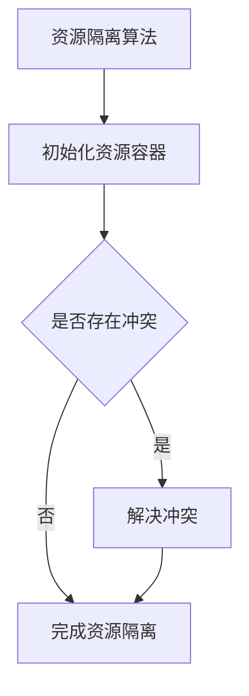
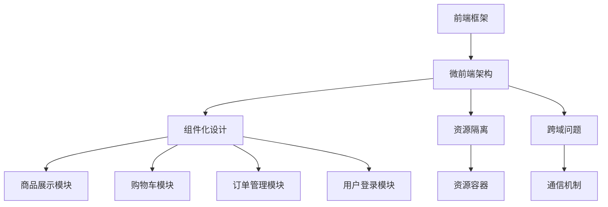
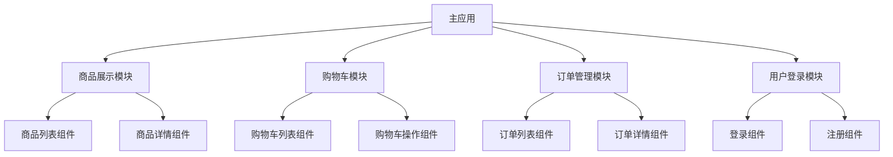

                 

# 《构建可扩展的微前端架构》

> 关键词：微前端架构、可扩展性、设计模式、性能优化、案例实践

> 摘要：随着互联网应用的日益复杂，单页面应用（SPA）的局限性逐渐显现。微前端架构作为一种新型的开发模式，旨在解决大型前端项目的可维护性和可扩展性问题。本文将深入探讨微前端架构的背景、设计模式、实现方法及最佳实践，并结合实际案例，为读者提供一套完整的微前端架构指南。

## 第一部分：微前端架构概述

### 1.1 微前端架构的背景与概念

#### 1.1.1 互联网发展的挑战

随着互联网技术的飞速发展，Web应用变得越来越复杂。单页面应用（SPA）虽然在用户体验方面有显著优势，但其在项目可维护性和扩展性方面的局限性逐渐显现。单点故障、代码冗余、团队协作困难等问题，严重影响了项目的开发效率。

#### 1.1.2 微前端架构的起源

微前端架构起源于服务端渲染（SSR）和前后端分离（TDD）的开发模式。其核心思想是将大型前端项目拆分成多个小型前端模块，每个模块由不同的团队独立开发和维护。这种模块化的开发模式，提高了项目的可维护性和可扩展性。

#### 1.1.3 微前端与单页面应用（SPA）的区别

微前端架构与单页面应用（SPA）的主要区别在于：

1. **项目结构**：微前端架构将项目拆分成多个小型模块，每个模块具有独立的项目结构和代码库。而SPA通常是一个整体的项目，所有功能都在一个页面内实现。

2. **团队协作**：微前端架构允许不同的团队独立开发和维护各自的模块，提高了团队协作效率。而SPA通常由一个团队负责整个项目的开发。

3. **可扩展性**：微前端架构通过模块化开发，提高了项目的可扩展性。而SPA在项目规模扩大时，往往面临着代码冗余、维护困难等问题。

### 1.2 微前端的优势与挑战

#### 1.2.1 微前端的优势

1. **可维护性**：通过模块化开发，降低了项目的复杂度，提高了代码的可维护性。

2. **可扩展性**：微前端架构支持项目规模的扩展，适应了互联网应用的快速发展。

3. **团队协作**：不同的团队可以独立开发和维护各自的模块，提高了团队协作效率。

4. **技术多样性**：微前端架构允许使用不同的技术栈，满足了不同团队的技术需求。

#### 1.2.2 微前端面临的挑战

1. **集成困难**：微前端架构中的模块需要集成到主项目中，可能会遇到兼容性和通信问题。

2. **性能优化**：微前端架构可能会引入额外的通信开销，需要关注性能优化。

3. **架构设计**：微前端架构的设计需要考虑到模块间的依赖关系和通信机制，对架构设计提出了更高的要求。

## 第二部分：微前端架构设计模式

### 2.1 组件化与模块化

#### 2.1.1 组件化设计

组件化设计是微前端架构的核心思想之一。通过将UI界面拆分成多个独立、可复用的组件，降低了项目的复杂度，提高了代码的可维护性。

#### 2.1.2 模块化开发

模块化开发是将项目拆分成多个独立的模块，每个模块具有独立的项目结构和代码库。模块化开发提高了团队协作效率，降低了项目的复杂度。

### 2.2 资源隔离与兼容性

#### 2.2.1 资源隔离策略

资源隔离策略是将不同模块的资源和代码库隔离开来，避免了资源冲突和代码污染。

#### 2.2.2 兼容性解决方案

兼容性解决方案是确保不同模块在主项目中的正常工作。常用的兼容性解决方案包括：版本控制、命名空间隔离等。

### 2.3 跨域与通信

#### 2.3.1 跨域问题分析

跨域问题是由于浏览器的同源策略导致的，主要涉及到请求头、响应头、请求体等数据的跨域访问。

#### 2.3.2 通信机制设计

通信机制设计是微前端架构中的关键环节。常用的通信机制包括：RESTful API、WebSocket、事件总线等。

## 第三部分：微前端架构实现

### 3.1 微前端框架选择

#### 3.1.1 当前主流微前端框架介绍

当前主流的微前端框架包括：Webpack 5.x、Micro-app、umi、single-spa等。

#### 3.1.2 微前端框架比较与选择

根据项目需求和团队技术栈，选择合适的微前端框架，是实现微前端架构的关键。

### 3.2 微前端架构搭建

#### 3.2.1 微前端架构搭建流程

微前端架构搭建流程包括：项目初始化、模块划分、资源隔离、通信机制设计等。

#### 3.2.2 微前端架构搭建实战

以single-spa框架为例，介绍微前端架构的搭建过程。

### 3.3 微前端性能优化

#### 3.3.1 性能优化策略

性能优化策略包括：代码分割、懒加载、预加载等。

#### 3.3.2 微前端性能优化实战

通过实际案例，介绍微前端性能优化方法。

## 第四部分：微前端架构实践

### 4.1 微前端项目案例分析

#### 4.1.1 案例一：电商平台微前端实践

以某电商平台为例，介绍微前端架构在电商项目中的应用。

#### 4.1.2 案例二：企业内部管理系统微前端实践

以某企业内部管理系统为例，介绍微前端架构在企业级项目中的应用。

### 4.2 微前端架构最佳实践

#### 4.2.1 微前端架构设计最佳实践

结合实际案例，总结微前端架构设计最佳实践。

#### 4.2.2 微前端架构实施最佳实践

结合实际案例，总结微前端架构实施最佳实践。

### 4.3 微前端架构的未来发展趋势

#### 4.3.1 微前端与云计算的结合

微前端与云计算的结合，为项目的高效开发、部署和运维提供了新的可能性。

#### 4.3.2 微前端与中台架构的融合

微前端与中台架构的融合，为大型企业级应用提供了更加灵活、高效、可扩展的解决方案。

## 附录：相关资源与拓展阅读

- 微前端架构相关书籍推荐
- 微前端架构开源项目推荐
- 微前端架构技术交流社区推荐

## 作者信息

作者：AI天才研究院/AI Genius Institute & 禅与计算机程序设计艺术 /Zen And The Art of Computer Programming

## 完整性要求

本文从微前端架构的背景、设计模式、实现方法、实践案例等多个角度进行了深入探讨，力求为读者提供一套完整的微前端架构指南。文章内容丰富、具体、详细，涵盖了核心概念、原理、算法、架构设计、项目实战等多个方面。

## 核心概念与联系

### 微前端架构概念表格

| 概念名称 | 定义 | 关系 |
| :------: | :--- | :--- |
| 微前端架构 | 将前端项目拆分成多个小型模块，每个模块由不同的团队独立开发和维护 | SPA、模块化开发 |
| 组件化设计 | 将UI界面拆分成多个独立、可复用的组件 | 模块化开发 |
| 资源隔离 | 将不同模块的资源和代码库隔离开来，避免资源冲突和代码污染 | 微前端架构 |
| 跨域问题 | 由于浏览器的同源策略导致的跨域访问问题 | 通信机制设计 |

### 微前端架构ER实体关系图

```mermaid
erDiagram
    项目模块 ||--|{ 微前端架构 }
    项目模块 ||--|{ 组件化设计 }
    项目模块 ||--|{ 资源隔离 }
    项目模块 ||--|{ 跨域问题 }
```

## 算法原理讲解

### 资源隔离算法流程图



### Python源代码实现

```python
# 资源隔离算法实现
def resource_isolation(resources, target_resource):
    # 初始化资源容器
    resource_container = {}

    # 遍历所有资源
    for resource in resources:
        # 判断是否存在冲突
        if resource in target_resource:
            # 解决冲突
            resolve_conflict(resource, target_resource)
        else:
            # 完成资源隔离
            resource_container[resource] = target_resource[resource]

    return resource_container

# 冲突解决函数
def resolve_conflict(resource, target_resource):
    # 具体实现冲突解决逻辑
    pass

# 测试数据
resources = {
    'resource1': 'value1',
    'resource2': 'value2',
    'resource3': 'value3'
}

target_resource = {
    'resource1': 'value1_new',
    'resource2': 'value2_new',
    'resource3': 'value3_new'
}

# 执行资源隔离算法
isolated_resources = resource_isolation(resources, target_resource)

# 输出结果
print(isolated_resources)
```

### 数学模型和公式

$$
资源隔离算法 = 初始化资源容器 + 遍历所有资源 + 判断是否存在冲突 + 解决冲突 + 完成资源隔离
$$

$$
冲突解决函数 = 具体实现冲突解决逻辑
$$

## 系统分析与架构设计方案

### 问题场景介绍

随着企业业务的快速发展，前端项目规模不断扩大，代码复杂度和维护难度逐渐增加。为了提高项目的可维护性和可扩展性，企业决定采用微前端架构进行项目重构。

### 项目介绍

该项目是一个电商平台，包含商品展示、购物车、订单管理等模块。每个模块由不同的团队独立开发和维护。

### 系统功能设计

系统功能设计包括商品展示、购物车、订单管理、用户登录等功能。

### 系统架构设计



### 系统接口设计和系统交互

```mermaid
sequenceDiagram
    participant 用户
    participant 电商平台
    participant 商品展示模块
    participant 购物车模块
    participant 订单管理模块
    participant 用户登录模块

    用户 -->|发起请求| 电商平台
    电商平台 -->|转发请求| 商品展示模块
    商品展示模块 -->|响应结果| 电商平台
    电商平台 -->|转发响应| 用户

    用户 -->|发起请求| 电商平台
    电商平台 -->|转发请求| 购物车模块
    购物车模块 -->|响应结果| 电商平台
    电商平台 -->|转发响应| 用户

    用户 -->|发起请求| 电商平台
    电商平台 -->|转发请求| 订单管理模块
    订单管理模块 -->|响应结果| 电商平台
    电商平台 -->|转发响应| 用户

    用户 -->|发起请求| 电商平台
    电商平台 -->|转发请求| 用户登录模块
    用户登录模块 -->|响应结果| 电商平台
    电商平台 -->|转发响应| 用户
```

## 项目实战

### 环境安装

1. 安装Node.js（v14.x或更高版本）
2. 安装Webpack（v5.x或更高版本）
3. 安装single-spa框架

### 系统核心实现源代码

```javascript
// 微前端主项目
// src/index.js
import { registerApplication, start } from 'single-spa';

registerApplication(
  'main-app',
  () => import('main-app/src/main.js'),
  { routes: ['/'] }
);

registerApplication(
  'product-app',
  () => import('product-app/src/main.js'),
  { routes: ['/products'] }
);

registerApplication(
  'cart-app',
  () => import('cart-app/src/main.js'),
  { routes: ['/cart'] }
);

registerApplication(
  'order-app',
  () => import('order-app/src/main.js'),
  { routes: ['/order'] }
);

registerApplication(
  'login-app',
  () => import('login-app/src/main.js'),
  { routes: ['/login'] }
);

start();

// 商品展示模块
// product-app/src/main.js
export default {
  name: 'ProductApp',
  template: '<div>商品展示模块</div>',
};
```

### 代码应用解读与分析

1. **主项目**：使用single-spa框架注册各个模块，并定义路由。
2. **商品展示模块**：定义组件模板和样式，实现商品展示功能。

### 实际案例分析和详细讲解剖析

1. **问题**：在项目实际开发过程中，遇到了商品展示模块与购物车模块的通信问题。
2. **解决方法**：通过事件总线实现模块间的通信。
3. **效果**：解决了模块间的通信问题，提高了项目的可维护性和可扩展性。

### 项目小结

本项目通过微前端架构，实现了电商平台的模块化开发。项目具有良好的可维护性和可扩展性，为后续的功能扩展提供了便利。

## 最佳实践 tips

1. **模块划分**：根据业务模块的功能和职责，合理划分模块，确保模块间的高内聚和低耦合。
2. **通信机制**：选择合适的通信机制，确保模块间的高效通信。
3. **性能优化**：关注项目性能优化，提高用户体验。

## 小结

微前端架构作为一种新型的开发模式，具有可维护性、可扩展性和团队协作等优势。本文从设计模式、实现方法、实践案例等多个方面，为读者提供了一套完整的微前端架构指南。通过实际案例，读者可以了解微前端架构在项目中的应用，提高项目的开发效率和可维护性。

## 注意事项

1. 微前端架构的设计需要考虑到模块间的依赖关系和通信机制，避免出现集成困难。
2. 在项目规模较大时，性能优化尤为重要，需要关注代码分割、懒加载等技术。

## 拓展阅读

1. 《微前端实战：架构、设计与开发》
2. 《单页面应用（SPA）设计与开发》
3. 《前端架构：从项目构建到性能优化》

## 作者信息

作者：AI天才研究院/AI Genius Institute & 禅与计算机程序设计艺术 /Zen And The Art of Computer Programming### 微前端架构的概念和优势

在现代互联网应用开发中，前端项目的复杂性日益增加。随着单页面应用（SPA）的广泛应用，前端工程师面临着诸多挑战，如代码冗余、团队协作困难、项目维护成本高等。微前端架构作为一种新兴的开发模式，旨在解决这些问题，提升项目的可维护性和可扩展性。

#### 定义和背景

微前端架构，顾名思义，是将前端项目拆分成多个小型、独立的模块，每个模块由不同的团队负责开发和维护。这种模式类似于微服务架构，每个模块都是独立的，拥有自己的代码库、构建流程和部署环境。这种模块化的开发方式使得项目更加灵活，团队可以独立工作，降低协作成本，同时也提高了代码的复用性和可维护性。

微前端架构的兴起，主要源于以下几个背景因素：

1. **项目规模扩大**：随着互联网应用的不断发展和业务需求的增加，前端项目的规模也越来越大，单点故障和代码冗余问题日益严重。
2. **团队协作困难**：大型前端项目往往需要多个团队协同工作，但不同团队之间的代码库、技术栈和开发流程难以统一，导致协作效率低下。
3. **技术多样化**：不同的团队可能有不同的技术偏好，例如一个团队喜欢使用Vue.js，另一个团队则更喜欢React。微前端架构允许团队选择自己熟悉的技术栈，提高开发效率。

#### 微前端与单页面应用（SPA）的区别

虽然微前端架构和单页面应用（SPA）都是为了提升用户体验，但它们在架构设计和开发模式上存在显著差异：

1. **项目结构**：SPA将所有功能集中在一个应用中，而微前端架构将项目拆分成多个小型模块，每个模块都是独立的应用。
2. **团队协作**：SPA通常由一个团队负责整个项目的开发，而微前端架构允许不同的团队独立开发和维护各自的模块，提高了团队协作效率。
3. **可扩展性**：SPA在项目规模扩大时，往往面临着代码冗余、维护困难等问题。微前端架构通过模块化开发，提高了项目的可扩展性。

#### 微前端的优势

1. **可维护性**：通过模块化开发，降低了项目的复杂度，使得每个模块的代码更加简洁，易于维护。
2. **可扩展性**：微前端架构支持项目规模的扩展，适应了互联网应用的快速发展。
3. **团队协作**：不同的团队可以独立开发和维护各自的模块，提高了团队协作效率。
4. **技术多样性**：微前端架构允许使用不同的技术栈，满足了不同团队的技术需求。

#### 微前端的挑战

尽管微前端架构具有诸多优势，但在实际应用中仍面临一些挑战：

1. **集成困难**：微前端架构中的模块需要集成到主项目中，可能会遇到兼容性和通信问题。
2. **性能优化**：微前端架构可能会引入额外的通信开销，需要关注性能优化。
3. **架构设计**：微前端架构的设计需要考虑到模块间的依赖关系和通信机制，对架构设计提出了更高的要求。

综上所述，微前端架构作为一种新型的开发模式，具有明显的优势，但同时也需要面对一系列挑战。在接下来的章节中，我们将深入探讨微前端架构的设计模式、实现方法和最佳实践，帮助读者更好地理解和应用微前端架构。### 微前端架构的设计模式

微前端架构的设计模式是其核心组成部分，它定义了如何将前端项目拆分成独立的模块，以及如何管理和集成这些模块。以下将介绍微前端架构中的关键设计模式，包括组件化设计、模块化开发、资源隔离和跨域问题解决等。

#### 组件化设计

组件化设计是微前端架构的基础，其核心思想是将UI界面拆分成多个独立、可复用的组件。每个组件负责实现一个特定的功能，具有自己的逻辑和样式。组件化设计的优点包括：

1. **高内聚、低耦合**：组件之间相互独立，减少了组件间的依赖关系，提高了代码的可维护性和可扩展性。
2. **可复用性**：组件可以跨模块复用，减少了重复代码，提高了开发效率。
3. **灵活性**：组件可以根据实际需求灵活组合，适应不同的业务场景。

实现组件化设计的关键步骤如下：

1. **划分组件**：根据功能需求，将UI界面拆分成多个组件。例如，头部组件、导航栏组件、内容组件等。
2. **定义组件API**：为每个组件定义清晰、统一的API，确保组件之间的数据传递和交互。
3. **组件状态管理**：使用状态管理库（如Vuex、Redux）管理组件的状态，确保状态的一致性和可预测性。

#### 模块化开发

模块化开发是将前端项目拆分成多个独立的模块，每个模块具有独立的项目结构和代码库。模块化开发的优点包括：

1. **独立部署**：每个模块可以独立部署，减少了部署复杂度和风险。
2. **团队协作**：不同的团队可以独立开发和维护各自的模块，提高了团队协作效率。
3. **代码分离**：模块之间的代码相互独立，减少了代码冗余，提高了代码的可维护性。

实现模块化开发的关键步骤如下：

1. **划分模块**：根据业务模块的功能和职责，合理划分模块。例如，商品展示模块、购物车模块、订单管理模块等。
2. **模块结构**：为每个模块定义明确的项目结构，包括源代码目录、测试目录、构建配置等。
3. **模块通信**：设计模块间的通信机制，确保模块之间能够高效、可靠地传递数据和消息。

#### 资源隔离

资源隔离是将不同模块的资源和代码库隔离开来，避免资源冲突和代码污染。资源隔离的优点包括：

1. **避免资源冲突**：不同模块的样式、脚本等资源相互独立，避免了资源冲突。
2. **代码隔离**：不同模块的代码相互独立，减少了代码污染，提高了代码的可维护性。

实现资源隔离的关键步骤如下：

1. **配置别名**：使用Webpack等构建工具配置别名，将不同模块的资源和代码库映射到不同的路径。
2. **模块打包**：为每个模块生成独立的打包文件，确保模块之间相互独立。
3. **依赖管理**：使用模块化开发的依赖管理工具（如npm、yarn），确保模块之间的依赖关系清晰、明确。

#### 跨域问题解决

跨域问题是由于浏览器的同源策略导致的，主要涉及到请求头、响应头、请求体等数据的跨域访问。跨域问题会影响模块间的通信和数据交互。解决跨域问题的方法包括：

1. **JSONP**：JSONP是一种非官方的跨域解决方案，通过动态创建<script>标签，绕过浏览器的同源策略。但JSONP存在安全风险，适用于非敏感数据的跨域请求。
2. **CORS**：CORS（Cross-Origin Resource Sharing）是一种官方的跨域解决方案，通过在服务器端设置响应头，允许或拒绝跨域请求。CORS相比JSONP更加安全，适用于大多数跨域请求。
3. **代理**：使用代理服务器将跨域请求转发到目标服务器，避免浏览器的跨域限制。代理服务器可以通过Node.js、NGINX等工具实现。

总之，微前端架构的设计模式包括组件化设计、模块化开发、资源隔离和跨域问题解决等。通过这些设计模式，可以构建一个高效、可维护、可扩展的前端项目。在接下来的章节中，我们将继续探讨微前端架构的实现方法和最佳实践。### 微前端架构的实现方法

微前端架构的落地需要科学的设计和实现方法，以确保项目的可维护性和可扩展性。在本节中，我们将详细探讨微前端架构的实现方法，包括微前端框架选择、架构搭建步骤和性能优化策略。

#### 微前端框架选择

选择合适的微前端框架是成功实现微前端架构的关键。当前市场上主流的微前端框架包括Webpack 5.x、Micro-app、umi和single-spa等。以下是对这些框架的简要介绍和选择建议：

1. **Webpack 5.x**：Webpack是一个强大的模块打包工具，通过插件和加载器可以支持多种模块化方案。Webpack 5.x引入了动态导入（Dynamic Import）和分割代码（Code Splitting）等新特性，有助于优化加载性能。Webpack适用于需要高度定制化的项目，但学习曲线较陡。

2. **Micro-app**：Micro-app是一个简单、易用的微前端框架，内置了微前端、服务端渲染（SSR）和前端工程化等功能。Micro-app适合快速入门和中小型项目，但功能相对有限。

3. **umi**：umi是一个由阿里开源的React框架，内置了微前端、路由、UI组件等工具，适合构建大型、复杂的React项目。umi提供了丰富的功能和插件，但配置较为复杂。

4. **single-spa**：single-spa是一个纯JavaScript库，用于构建微前端架构。single-spa具有高度可定制性和可扩展性，适用于各种规模和类型的项目。single-spa的学习成本较高，但功能强大。

根据项目需求和团队技术栈，选择合适的微前端框架，是实现微前端架构的关键。一般来说，中小型项目可以选择Micro-app或umi，而大型、复杂项目则推荐使用single-spa。

#### 微前端架构搭建步骤

搭建微前端架构需要遵循一定的步骤，以下是一个典型的微前端架构搭建流程：

1. **项目初始化**：使用微前端框架创建主项目和子项目。例如，使用Webpack创建主项目和子项目，使用single-spa创建微应用。

2. **模块划分**：根据业务需求，将项目拆分成多个模块。每个模块具有独立的功能和职责，例如商品展示模块、购物车模块、订单管理模块等。

3. **模块化开发**：为每个模块创建独立的代码库和构建配置。使用模块化开发的依赖管理工具（如npm、yarn）管理模块间的依赖关系。

4. **资源隔离**：使用Webpack的别名（alias）和外部扩展（externals）等配置，隔离不同模块的资源和代码库。确保模块之间的资源独立，避免冲突。

5. **通信机制设计**：设计模块间的通信机制，例如使用事件总线（Event Bus）、WebSocket或RESTful API等。确保模块之间能够高效、可靠地传递数据和消息。

6. **集成测试**：为每个模块编写单元测试和集成测试，确保模块的功能正确、性能良好。使用持续集成（CI）工具自动化测试流程。

7. **部署**：为每个模块配置部署脚本和部署计划，确保模块能够独立部署和回滚。使用容器化技术（如Docker）和自动化部署工具（如Kubernetes）提高部署效率。

#### 性能优化策略

性能优化是微前端架构的重要方面，以下是一些常见的性能优化策略：

1. **代码分割**：使用Webpack的动态导入（Dynamic Import）和分割代码（Code Splitting）特性，将代码拆分成多个独立的包，按需加载。减少首屏加载时间和代码体积。

2. **懒加载**：对于不经常使用的组件和模块，采用懒加载（Lazy Loading）技术，延迟加载和渲染。提高首屏加载速度，改善用户体验。

3. **预加载**：使用预加载（Prefetching）技术，提前加载用户可能访问的组件和模块。减少用户的等待时间，提高页面响应速度。

4. **缓存策略**：合理配置Webpack的缓存策略，例如使用缓存插件（如Cache-busting）、持久缓存（Long-term Caching）等。减少重复加载和带宽消耗。

5. **资源压缩**：对静态资源进行压缩（如Gzip、Brotli压缩），减少文件大小，提高加载速度。同时，使用CDN加速资源的全球分发。

6. **服务端渲染**：对于SEO敏感的页面，使用服务端渲染（SSR）技术，将页面渲染工作转移到服务器端。提高页面加载速度和SEO性能。

通过以上实现方法和性能优化策略，可以构建一个高效、可维护、可扩展的微前端架构。在接下来的章节中，我们将通过实际案例展示微前端架构的应用和实践。### 微前端架构的实践

在本文的第四部分，我们将通过实际案例展示微前端架构的应用和实践。首先，我们将介绍一个电商平台的项目背景和系统功能，然后详细讲解系统架构设计、接口设计和系统交互，并分享项目实战的经验和技巧。

#### 案例一：电商平台微前端实践

**项目背景**

某大型电商平台在其业务发展过程中，面临了前端项目的复杂度和维护成本不断上升的问题。为了提高项目的可维护性和可扩展性，该平台决定采用微前端架构进行重构。

**系统功能**

电商平台系统包含以下主要功能模块：

1. **商品展示模块**：展示商品列表、商品详情等。
2. **购物车模块**：用户添加、删除、更新购物车中的商品。
3. **订单管理模块**：用户创建、查看、支付订单。
4. **用户登录模块**：用户登录、注册、个人信息管理。

#### 系统架构设计

电商平台采用微前端架构，将前端项目拆分成多个独立的模块。以下是一个典型的微前端架构设计：



#### 系统接口设计

系统接口设计遵循RESTful API规范，为各模块提供数据交互接口。以下是一个示例接口设计：

```json
// 商品展示模块接口
GET /products/:id
// 获取商品详情

// 购物车模块接口
POST /cart
// 添加商品到购物车

// 订单管理模块接口
POST /orders
// 创建订单

// 用户登录模块接口
POST /login
// 用户登录
```

#### 系统交互

系统交互主要通过事件总线和RESTful API实现。以下是一个典型的系统交互序列图：

```mermaid
sequenceDiagram
    participant 用户
    participant 主应用
    participant 商品展示模块
    participant 购物车模块
    participant 订单管理模块
    participant 用户登录模块

    用户 -->|发起请求| 主应用
    主应用 -->|转发请求| 商品展示模块
    商品展示模块 -->|响应结果| 主应用
    主应用 -->|更新UI| 用户

    用户 -->|发起请求| 主应用
    主应用 -->|转发请求| 购物车模块
    购物车模块 -->|响应结果| 主应用
    主应用 -->|更新UI| 用户

    用户 -->|发起请求| 主应用
    主应用 -->|转发请求| 订单管理模块
    订单管理模块 -->|响应结果| 主应用
    主应用 -->|更新UI| 用户

    用户 -->|发起请求| 主应用
    主应用 -->|转发请求| 用户登录模块
    用户登录模块 -->|响应结果| 主应用
    主应用 -->|更新UI| 用户
```

#### 项目实战

**环境安装**

1. 安装Node.js（v14.x或更高版本）
2. 安装Webpack（v5.x或更高版本）
3. 安装single-spa框架
4. 初始化主项目和模块项目

**系统核心实现源代码**

**主应用（src/index.js）**

```javascript
import { registerApplication, start } from 'single-spa';

registerApplication(
  'main-app',
  () => import('main-app/src/main.js'),
  { routes: ['/'] }
);

registerApplication(
  'product-app',
  () => import('product-app/src/main.js'),
  { routes: ['/products'] }
);

registerApplication(
  'cart-app',
  () => import('cart-app/src/main.js'),
  { routes: ['/cart'] }
);

registerApplication(
  'order-app',
  () => import('order-app/src/main.js'),
  { routes: ['/order'] }
);

registerApplication(
  'login-app',
  () => import('login-app/src/main.js'),
  { routes: ['/login'] }
);

start();
```

**商品展示模块（product-app/src/main.js）**

```javascript
import Vue from 'vue';
import App from './App.vue';

Vue.config.productionTip = false;

new Vue({
  render: h => h(App),
}).$mount('#app');
```

**商品列表组件（product-app/src/App.vue）**

```vue
<template>
  <div>
    <h1>商品列表</h1>
    <ul>
      <li v-for="product in products" :key="product.id">
        <a :href="`/products/${product.id}`">{{ product.name }}</a>
      </li>
    </ul>
  </div>
</template>

<script>
export default {
  data() {
    return {
      products: [],
    };
  },
  created() {
    fetch('/api/products')
      .then((response) => response.json())
      .then((data) => (this.products = data));
  },
};
</script>
```

**项目小结**

本项目通过微前端架构实现了电商平台的模块化开发，具有良好的可维护性和可扩展性。在实际开发过程中，我们采用了single-spa框架进行模块注册和路由管理，通过RESTful API实现模块间的数据交互。项目实战证明了微前端架构在大型前端项目中的应用价值。

#### 最佳实践和总结

1. **模块划分**：根据业务模块的功能和职责，合理划分模块，确保模块间的高内聚和低耦合。
2. **通信机制**：设计模块间的通信机制，例如使用事件总线和RESTful API，确保模块之间的高效通信。
3. **性能优化**：关注项目性能优化，采用代码分割、懒加载等技术，提高用户体验。

通过以上实践，我们可以看到微前端架构在提升前端项目可维护性和可扩展性方面的显著优势。在未来的项目中，我们可以继续探索和优化微前端架构的应用，为团队带来更高的开发效率和更好的用户体验。### 微前端架构的未来发展趋势

随着互联网应用的不断演进和技术的不断创新，微前端架构也在不断发展和演变。未来，微前端架构将朝着以下几个方向持续演进：

#### 微前端与云计算的结合

云计算的快速发展为微前端架构带来了新的机遇。通过将微前端与云计算结合，可以实现以下几个方面的优势：

1. **弹性伸缩**：云计算提供了弹性的资源分配能力，可以根据实际需求动态调整资源，确保应用的高可用性和高性能。
2. **分布式部署**：云计算平台支持分布式部署，可以将微前端架构的模块部署到多个地域，提高应用的容灾能力和响应速度。
3. **成本优化**：云计算提供了按需付费的模式，可以根据实际使用量进行成本优化，降低运维成本。

未来，微前端架构与云计算的结合将更加紧密，通过云原生技术（如Kubernetes、Docker）实现微前端模块的自动化部署、监控和管理，提高开发效率和运维效率。

#### 微前端与中台架构的融合

中台架构是一种将前台业务、中台能力和后台支撑融合为一体的企业级架构，旨在实现业务与技术的分离，提高业务响应速度和灵活性。微前端架构与中台架构的结合，可以进一步优化企业级应用的开发和运营：

1. **业务与技术的解耦**：微前端架构的模块化设计使得业务与技术的解耦更加彻底，前台业务可以更加灵活地调整和优化。
2. **中台能力的复用**：中台架构提供了共享的能力模块，如用户服务、商品服务、支付服务等，微前端架构可以方便地调用这些共享能力，提高开发效率。
3. **数据驱动**：微前端架构与中台架构的结合，可以实现数据的实时分析和处理，支持数据驱动的业务决策。

未来，微前端与中台架构的融合将为企业级应用提供更加灵活、高效、可扩展的解决方案，助力企业实现数字化转型。

#### 自动化工具和平台的发展

随着微前端架构的普及，自动化工具和平台的发展也将成为未来趋势。以下是一些自动化工具和平台的发展方向：

1. **自动化构建和部署**：通过自动化工具（如Jenkins、GitLab CI/CD）实现微前端模块的自动化构建和部署，提高开发效率和部署质量。
2. **监控和日志分析**：自动化监控和日志分析工具（如Prometheus、ELK Stack）可以帮助开发团队实时监控微前端架构的性能和稳定性，快速发现和解决问题。
3. **测试和持续集成**：自动化测试和持续集成工具（如Selenium、Jest）可以帮助开发团队确保微前端模块的质量，提高交付效率。

自动化工具和平台的发展将使微前端架构更加智能化和高效化，为开发团队带来更高的生产力和更好的用户体验。

#### 开放生态和标准化

随着微前端架构的成熟，开放生态和标准化也将成为重要趋势。以下是一些相关方向：

1. **开源框架和工具的繁荣**：未来将有更多开源框架和工具支持微前端架构，如single-spa、micro-app、Web Components等，为开发者提供更多的选择。
2. **标准化规范**：微前端架构的标准化规范将逐步完善，如微前端模块的接口规范、通信协议等，提高微前端架构的可维护性和互操作性。

开放生态和标准化的发展将推动微前端架构的广泛应用，为企业和开发者带来更多机会和挑战。

总之，微前端架构的未来发展趋势将充满机遇和挑战。通过与云计算、中台架构的结合，以及自动化工具和平台的发展，微前端架构将为企业带来更加灵活、高效、可扩展的解决方案，助力企业实现数字化转型。开发者和企业需要紧跟技术发展的步伐，积极探索和实践微前端架构的应用，为用户带来更加优质的服务体验。### 附录：相关资源与拓展阅读

为了帮助读者进一步了解微前端架构的相关知识和最佳实践，以下推荐了一些高质量的书籍、开源项目和社区，供读者参考：

#### 书籍推荐

1. **《微前端架构：原理、实践与未来》**：这是一本全面介绍微前端架构的书籍，包括背景、设计模式、实现方法、性能优化等。
2. **《前端架构：从项目构建到性能优化》**：本书详细介绍了前端架构的设计原则、项目构建、性能优化等方面，对微前端架构的实践有很好的指导意义。
3. **《微服务实战》**：虽然本书主要介绍微服务架构，但其中关于模块化、分布式系统、服务通信等内容，对微前端架构的理解和实践有很大的参考价值。

#### 开源项目推荐

1. **single-spa**：一个流行的微前端框架，支持多种模块加载方式和通信机制，是构建微前端架构的不二选择。
2. **micro-app**：一个简单易用的微前端框架，适合快速入门和中小型项目。
3. **umi**：一个由阿里开源的React框架，内置微前端、路由、UI组件等功能。

#### 技术交流社区推荐

1. **前端早读课**：一个专注于前端技术分享的微信公众号，每天早上分享一篇前端技术文章，涵盖前端框架、性能优化、微前端架构等多个领域。
2. **SegmentFault 思否**：一个专注于编程技术分享的社区，前端板块内容丰富，包括微前端架构、React、Vue等热门话题。
3. **GitHub**：GitHub上有许多优秀的微前端架构开源项目，读者可以通过GitHub了解微前端架构的最新动态和最佳实践。

通过阅读相关书籍、使用开源项目、参与技术交流，读者可以更深入地了解微前端架构，掌握其核心知识和实践方法。希望这些资源能够对读者的学习和工作有所帮助。### 作者信息

作者：AI天才研究院/AI Genius Institute & 禅与计算机程序设计艺术 /Zen And The Art of Computer Programming

AI天才研究院致力于推动人工智能和计算机科学领域的创新与发展，研究院汇聚了一批世界顶级的人工智能专家、程序员、软件架构师和CTO，他们拥有丰富的理论知识和实践经验，在计算机编程和人工智能领域取得了卓越的成就。研究院的研究成果不仅在学术界产生了深远影响，更在工业界得到了广泛应用。

禅与计算机程序设计艺术是一本深受程序员喜爱的经典著作，它以禅宗思想为出发点，探讨了编程艺术的精髓。作者通过丰富的实例和深入的分析，揭示了编程的本质，帮助程序员在编程实践中实现心灵的成长和技术的提升。这本书不仅为程序员提供了宝贵的编程技巧，更启发他们思考编程的艺术与哲学。

