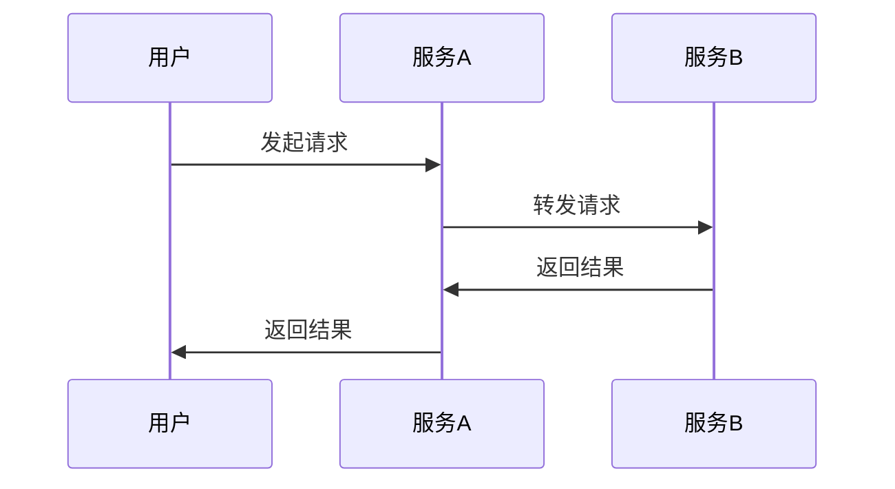

                 

## 引言

### 1.1 问题背景

在现代软件开发领域，随着业务的快速发展和复杂性的增加，传统的单体架构已经无法满足企业对于系统可扩展性、灵活性以及高可用性的需求。微服务架构作为一种新型的分布式系统架构，逐渐成为解决这些挑战的有效手段。传统的单体架构通常将所有的功能模块集中在一个庞大的系统中，这种方式虽然在早期可以快速开发，但随着系统的不断扩展和复杂性增加，系统会变得难以维护、扩展性和灵活性差，甚至可能因为单点故障导致整个系统崩溃。而微服务架构通过将系统拆分成多个独立的服务，每个服务负责系统的某一个功能模块，从而实现了系统的模块化、独立部署和水平扩展。

微服务架构具有以下几个核心特点：

1. **服务拆分**：将大型系统拆分为多个小型、独立的服务，每个服务专注于完成特定功能。
2. **服务自治**：每个服务具有独立部署、运行和升级的能力，降低了系统的耦合性。
3. **服务通信**：服务之间通过定义良好的接口进行通信，通常采用轻量级的通信协议，如HTTP/REST、gRPC等。
4. **服务发现**：系统提供了服务注册与发现机制，服务可以在运行时动态注册和发现其他服务。
5. **服务治理**：对服务进行监控、日志记录、流量控制、负载均衡等治理操作，确保系统的稳定运行。

这些特点使得微服务架构在分布式系统中具有广泛的应用前景。通过微服务架构，企业可以实现系统的快速迭代和持续交付，提高开发效率，同时保证系统的稳定性和可扩展性。

### 1.2 核心概念

在微服务架构中，有几个核心概念至关重要，它们是构建一个高效、可扩展的微服务系统的基础。以下是这些核心概念及其简要介绍：

#### 服务拆分

服务拆分是指将大型系统分解为多个小型、独立的服务。每个服务通常负责一个特定的业务功能，例如订单处理、用户认证、库存管理等。服务拆分的主要目的是降低系统的复杂度，提高系统的可维护性和可扩展性。

#### 服务自治

服务自治是指每个服务具有独立部署、运行和升级的能力。这意味着一个服务的故障不会影响到其他服务，从而提高了系统的可用性和容错性。服务自治还包括数据自治，即每个服务拥有独立的数据存储和管理能力。

#### 服务通信

服务通信是指服务之间通过定义良好的接口进行交互。在微服务架构中，服务之间的通信通常采用轻量级的协议，如HTTP/REST、gRPC等。服务通信的设计需要考虑接口的稳定性、性能和安全性。

#### 服务发现

服务发现是指系统提供了服务注册与发现机制，服务可以在运行时动态注册和发现其他服务。服务发现机制通常包括服务注册中心（Service Registry）和服务目录（Service Catalog）。通过服务发现，服务可以动态地找到需要交互的其他服务，从而提高了系统的灵活性和可扩展性。

#### 服务治理

服务治理是指对服务进行监控、日志记录、流量控制、负载均衡等治理操作，确保系统的稳定运行。服务治理涉及到多个方面，包括健康检查、性能监控、日志收集、告警通知等。服务治理的目的是确保服务的可靠性和高效性，同时提高系统的可观测性和可管理性。

### 1.3 范围与边界

本文的研究范围主要围绕构建一个可扩展的微服务治理平台，探讨其设计原理、关键功能以及最佳实践。具体包括以下内容：

- **设计原理**：详细分析微服务架构的原理，包括服务拆分、服务自治、服务通信、服务发现、服务治理等核心概念。
- **关键功能**：深入讨论服务注册与发现、服务监控与告警、服务部署与升级等关键功能的设计与实现。
- **最佳实践**：提供服务注册与发现、服务监控与告警、服务部署与升级等最佳实践，帮助读者构建和维护一个高效、可靠的微服务系统。

本文的边界主要在于不涉及具体的技术实现细节，如特定的编程语言、框架或工具。本文的目标是通过分析和讨论，为读者提供一个清晰、系统的微服务治理平台构建指南。

### 1.4 文章结构与内容概述

本文将分为以下几个部分：

1. **第一部分：引言**：介绍问题背景、核心概念、研究范围与边界。
2. **第二部分：微服务架构原理**：详细讨论微服务架构的特点与优势、核心要素和发展趋势。
3. **第三部分：微服务治理平台设计**：介绍微服务治理平台的基本概念、架构设计、关键功能。
4. **第四部分：服务注册与发现**：讨论服务注册与发现的基本概念、机制和最佳实践。
5. **第五部分：服务监控与告警**：介绍服务监控与告警的基本概念、机制和最佳实践。
6. **第六部分：服务部署与升级**：讨论服务部署与升级的基本概念、机制和最佳实践。
7. **第七部分：实际案例分析**：通过实际案例介绍如何构建一个可扩展的微服务治理平台。

通过以上结构和内容的安排，本文旨在系统地介绍微服务治理平台的构建原理和最佳实践，帮助读者理解和应用微服务架构，构建高效、可靠的分布式系统。

## 第2章：微服务架构原理

### 2.1 微服务架构的特点与优势

微服务架构是一种分布式系统架构，它将大型单体系统拆分为多个小型、独立的服务。每个服务负责一个特定的业务功能，通过定义良好的接口进行通信。微服务架构具有以下几个显著的特点和优势：

#### 可扩展性

微服务架构的一个核心优势是它的可扩展性。通过将系统拆分成多个独立的服务，可以独立扩展每个服务的实例数量，从而实现水平扩展。这种扩展方式不仅提高了系统的吞吐量，还使得系统能够更好地应对突发流量和业务需求变化。例如，在双十一购物节期间，电商网站需要应对大量用户访问和订单处理，通过微服务架构，可以动态调整订单处理服务的实例数量，从而确保系统的稳定运行。

#### 高可用性

微服务架构通过服务自治和分布式部署，提高了系统的可用性。每个服务都是独立部署的，一个服务的故障不会影响到其他服务的运行。此外，通过服务监控和自动故障转移机制，可以快速发现并恢复故障服务，从而减少系统的停机时间。例如，某个用户服务出现故障，可以通过故障转移机制将请求切换到其他健康的服务实例，从而确保系统的正常运行。

#### 灵活性

微服务架构提高了系统的灵活性，使得团队可以独立开发、测试和部署服务，无需等待其他团队的工作。这种独立性使得团队可以更快速地响应业务需求变化，实现持续交付。例如，一个团队可以独立开发和部署用户身份验证服务，而另一个团队可以同时开发和部署购物车服务，两者可以独立部署和升级，而不会相互干扰。

#### 易于维护

微服务架构通过将大型系统拆分为多个小型服务，降低了系统的复杂性，使得系统的维护更加容易。每个服务都是独立开发、测试和部署的，服务的代码库较小，更容易管理和维护。此外，通过服务监控和日志记录，可以快速定位和解决服务中的问题，提高了系统的可维护性。

#### 技术多样性

微服务架构允许使用不同的技术栈来构建不同的服务，从而充分利用各种技术的优势。例如，一个服务可以使用Java和Spring框架，另一个服务可以使用Node.js和Express框架，不同的服务可以使用不同的数据库，如关系数据库和NoSQL数据库。这种技术多样性使得团队能够选择最适合服务需求的技术，从而提高开发效率。

#### 快速迭代

微服务架构支持快速迭代和持续交付。通过独立开发和部署服务，团队能够更快地实现功能迭代，快速响应市场变化和用户需求。例如，一个团队可以独立开发和部署一个新功能的用户服务，而另一个团队可以同时开发和部署后台管理系统，两者可以独立部署，从而实现快速交付。

综上所述，微服务架构通过可扩展性、高可用性、灵活性、易于维护、技术多样性和快速迭代等显著特点，为现代分布式系统提供了有效的解决方案。

#### 核心要素

微服务架构的核心要素包括服务拆分、服务自治、服务通信、服务发现、服务治理等。这些要素共同构成了微服务架构的基础，确保系统的高效运行和可靠性。

##### 服务拆分

服务拆分是将大型单体系统分解为多个小型、独立的服务的过程。每个服务负责系统中的一个特定功能模块，例如用户管理、订单处理、库存管理等。服务拆分的原则包括：

1. **功能独立性**：每个服务应具有独立的功能，完成特定的业务逻辑。
2. **最小化耦合**：服务之间应通过定义良好的接口进行通信，减少直接的依赖和耦合。
3. **可扩展性**：服务应设计为可扩展的，以便在需要时可以独立增加实例数量。

服务拆分的原则有助于提高系统的可维护性和可扩展性。例如，如果用户管理服务需要升级或重构，不会影响到订单处理服务或库存管理服务。这种独立性使得团队能够独立开发和部署服务，提高了工作效率。

##### 服务自治

服务自治是指每个服务具有独立部署、运行和升级的能力。服务自治的特点包括：

1. **独立部署**：每个服务可以独立部署在不同的服务器或容器中，无需依赖于其他服务。
2. **独立运行**：每个服务具有独立的环境和资源，可以独立启动、停止和重启。
3. **独立升级**：服务可以独立更新和升级，无需停机或重启其他服务。

服务自治提高了系统的容错性和可扩展性。当一个服务出现故障时，其他服务可以继续正常运行，从而降低了系统的整体风险。此外，服务自治使得团队能够独立维护和升级服务，提高了系统的灵活性和可维护性。

##### 服务通信

服务通信是指服务之间通过定义良好的接口进行交互。在微服务架构中，服务通信通常采用轻量级的协议，如HTTP/REST、gRPC等。服务通信的原则包括：

1. **接口标准化**：服务之间应通过标准化的接口进行通信，以确保接口的一致性和可维护性。
2. **异步通信**：服务之间的通信应采用异步方式，避免阻塞和单点瓶颈。
3. **API版本管理**：随着服务的迭代和更新，应管理好API的版本，确保服务的兼容性和稳定性。

服务通信的设计和质量直接影响系统的性能和稳定性。良好的服务通信设计可以确保服务的快速响应和高效交互，从而提高系统的整体性能。

##### 服务发现

服务发现是指系统提供了服务注册与发现机制，服务可以在运行时动态注册和发现其他服务。服务发现的核心机制包括：

1. **服务注册**：服务启动时向服务注册中心注册自身的地址和端口信息。
2. **服务发现**：服务调用时从服务注册中心获取目标服务的地址和端口信息。
3. **服务注销**：服务停止时从服务注册中心注销自身的地址和端口信息。

服务发现机制提高了系统的灵活性和可扩展性。通过服务发现，服务可以动态地找到需要交互的其他服务，从而简化了服务配置和依赖管理。例如，如果一个服务实例失败，其他服务可以通过服务发现机制找到新的健康实例进行调用，从而确保系统的连续性和稳定性。

##### 服务治理

服务治理是指对服务进行监控、日志记录、流量控制、负载均衡等治理操作，确保系统的稳定运行。服务治理的要素包括：

1. **健康检查**：定期对服务进行健康检查，确保服务的正常运行。
2. **日志记录**：收集和记录服务运行日志，便于问题追踪和分析。
3. **流量控制**：根据服务负载和系统容量，合理分配流量，避免服务过载。
4. **负载均衡**：通过负载均衡器，将请求分发到多个服务实例，提高系统的吞吐量和可靠性。

服务治理是确保微服务系统稳定性和可靠性的重要手段。通过服务治理，可以及时发现和解决服务问题，确保服务的持续运行和高效性能。

综上所述，微服务架构的核心要素包括服务拆分、服务自治、服务通信、服务发现和服务治理。这些要素共同作用，构建了一个高效、可扩展和可靠的分布式系统，为企业应对复杂业务需求提供了有力支持。

#### 发展趋势

随着技术的不断进步，微服务架构也在持续发展和演进。以下是当前微服务架构的发展趋势和未来可能的方向：

##### 云原生技术

云原生技术（Cloud Native）是一种新兴的软件开发和部署范式，旨在充分利用云计算的资源和服务。微服务架构与云原生技术相结合，可以更好地实现弹性伸缩、自动化部署和持续交付。未来，云原生技术将继续推动微服务架构的发展，提供更加高效和灵活的解决方案。

##### 服务网格（Service Mesh）

服务网格是一种新型的架构模式，用于管理和通信服务之间的交互。服务网格通过独立的网络层，提供服务的动态路由、负载均衡、服务发现、安全认证等功能，从而简化了服务之间的通信管理。随着服务网格技术的成熟，它有望成为微服务架构中不可或缺的一部分，进一步提升系统的可管理和可扩展性。

##### 自动化治理

自动化治理是微服务架构发展的另一个重要方向。通过引入自动化工具和平台，可以自动进行服务监控、故障恢复、性能优化等操作，减少人工干预，提高系统的稳定性和效率。自动化治理将有助于实现更高级别的运维自动化，减轻运维团队的工作负担。

##### 容器化与编排

容器化技术，如Docker，已经成为微服务架构中不可或缺的一部分。容器编排工具，如Kubernetes，提供了自动化部署、扩展和管理容器化应用程序的能力。未来，容器化和编排技术将继续发展，提供更加高效和可靠的微服务部署和管理方案。

##### 服务治理平台的集成与标准化

随着微服务架构的普及，服务治理平台的需求也越来越大。未来，服务治理平台将趋向于集成和标准化，提供更加统一和高效的治理功能。这包括服务监控、日志记录、流量管理、安全防护等方面的集成和标准化，使得开发者可以更加专注于业务逻辑的实现。

##### 人工智能与微服务的结合

人工智能（AI）和机器学习技术在微服务架构中的应用也在不断探索。通过将AI技术集成到微服务中，可以实现对服务性能的智能优化、自动故障检测和预测性维护。未来，AI与微服务的结合有望进一步推动微服务架构的创新和发展。

总之，微服务架构的发展将继续受到多种技术趋势的推动，不断优化和提升其性能、可靠性和可扩展性。开发者需要紧跟这些趋势，灵活应用微服务架构，为企业构建高效、可靠的分布式系统。

## 第3章：微服务治理平台设计

### 3.1 微服务治理平台概述

微服务治理平台是微服务架构中不可或缺的一部分，它负责对服务进行注册、发现、监控、部署、升级等任务。通过提供集中化的治理功能，微服务治理平台可以提高系统的稳定性、可维护性和可扩展性。以下是微服务治理平台的基本概念和功能介绍。

#### 基本概念

微服务治理平台的基本概念包括以下几个方面：

1. **服务注册**：服务注册是指服务启动时向治理平台注册自身的地址、端口、元数据等信息。治理平台负责维护一个服务注册表，记录所有服务的状态和相关信息。

2. **服务发现**：服务发现是指当服务需要调用其他服务时，从治理平台获取目标服务的地址和端口信息。服务发现机制可以是基于一致性哈希、轮询等算法实现的，确保服务之间的高效通信。

3. **服务监控**：服务监控是指对服务的运行状态、性能指标、日志等数据进行实时监控和统计。通过监控，可以及时发现和解决问题，确保服务的稳定运行。

4. **服务部署**：服务部署是指将服务打包、上传到治理平台，并进行部署和配置。服务部署可以是自动化进行的，减少人工干预，提高部署效率。

5. **服务升级**：服务升级是指对服务的版本进行更新和替换。在微服务架构中，服务可以独立升级，不会影响其他服务的运行。服务升级通常包括版本控制、依赖管理、回滚策略等。

6. **流量管理**：流量管理是指根据服务负载和系统容量，合理分配流量，避免服务过载。流量管理可以采用动态负载均衡、限流、熔断等策略，提高系统的吞吐量和可靠性。

#### 功能介绍

微服务治理平台的主要功能包括：

1. **服务注册与发现**：治理平台提供服务注册与发现功能，服务启动时自动注册，服务调用时自动发现。服务注册表支持实时更新，确保服务状态的一致性。

2. **服务监控**：治理平台提供服务监控功能，实时收集和统计服务的运行数据，如CPU使用率、内存使用率、请求响应时间等。通过监控数据，可以快速定位和解决问题。

3. **日志收集与分析**：治理平台负责收集和存储服务的日志信息，提供日志查询和分析功能。通过日志分析，可以深入了解服务的运行情况，辅助故障排查和性能优化。

4. **健康检查**：治理平台定期对服务进行健康检查，确保服务的正常运行。健康检查包括服务可用性、响应时间、错误率等指标。

5. **流量控制**：治理平台提供流量控制功能，根据服务负载和系统容量，动态调整流量分配。流量控制策略包括动态负载均衡、限流、熔断等。

6. **服务部署与升级**：治理平台提供服务部署与升级功能，支持自动化部署和版本控制。通过部署和升级管理，可以确保服务的持续交付和可靠性。

7. **配置管理**：治理平台提供配置管理功能，管理服务的配置信息，如服务地址、端口、参数等。配置管理支持热更新，确保服务的实时配置变更。

8. **告警与通知**：治理平台提供告警与通知功能，当服务发生异常时，自动发送告警通知，通知相关人员及时处理。

通过以上功能，微服务治理平台可以为微服务架构提供全面的管理和监控能力，确保系统的稳定运行和高效性能。

### 3.2 微服务治理平台架构设计

微服务治理平台的架构设计是确保其功能实现和系统性能的关键。一个高效、可靠的微服务治理平台需要考虑以下几个方面：技术选型、模块划分、数据流和控制流。以下是对微服务治理平台架构设计的详细讨论。

#### 技术选型

在选择微服务治理平台的技术时，需要考虑以下几个方面：

1. **服务注册与发现**：常用的技术包括Zookeeper、Consul、etcd等。Zookeeper具有强大的同步机制和故障转移能力，但性能较低；Consul性能较好，支持健康检查；etcd是Kubernetes使用的存储服务，具有高可用性和高性能。

2. **服务监控**：常用的技术包括Prometheus、Grafana、InfluxDB等。Prometheus具有强大的监控和数据存储能力，Grafana提供直观的数据可视化界面，InfluxDB是一种高性能的时序数据库。

3. **日志收集与分析**：常用的技术包括ELK Stack（Elasticsearch、Logstash、Kibana）、Fluentd、Filebeat等。ELK Stack具有强大的日志处理和分析功能，Fluentd和Filebeat可以方便地收集和转发日志数据。

4. **配置管理**：常用的技术包括Spring Cloud Config、Consul、etcd等。Spring Cloud Config提供中心化的配置管理，Consul和etcd具有高可用性和高性能。

5. **流量管理**：常用的技术包括Nginx、HAProxy、Kubernetes Ingress等。Nginx和HAProxy提供负载均衡和流量管理功能，Kubernetes Ingress是Kubernetes中的流量入口管理工具。

#### 模块划分

微服务治理平台通常分为以下几个模块：

1. **服务注册与发现模块**：负责服务的注册和发现，实现服务间的动态通信。

2. **服务监控模块**：负责服务的健康检查、性能监控、日志收集等，提供实时监控数据。

3. **日志收集与分析模块**：负责收集和存储服务的日志信息，提供日志查询和分析功能。

4. **配置管理模块**：负责管理服务的配置信息，支持配置的热更新。

5. **流量管理模块**：负责流量分配和负载均衡，确保系统的稳定运行。

6. **告警与通知模块**：负责服务异常时的告警和通知，确保问题能够及时被处理。

#### 数据流和控制流

在微服务治理平台中，数据流和控制流是系统运行的关键。以下是对数据流和控制流的详细描述：

1. **数据流**：
   - **服务注册**：服务启动时向服务注册与发现模块注册自身信息。
   - **服务发现**：当服务调用其他服务时，从服务注册与发现模块获取目标服务的地址和端口信息。
   - **服务监控**：服务运行时，服务监控模块收集性能数据，如CPU使用率、内存使用率等。
   - **日志收集**：服务运行时，日志收集模块收集日志信息，并发送到日志收集与分析模块。
   - **配置更新**：服务运行时，配置管理模块根据配置变更通知服务进行配置更新。
   - **流量分配**：流量管理模块根据服务负载和系统容量，动态分配流量到不同的服务实例。

2. **控制流**：
   - **服务启动与关闭**：服务注册与发现模块负责服务的启动和关闭控制。
   - **健康检查**：服务监控模块定期对服务进行健康检查，确保服务的正常运行。
   - **告警通知**：当服务发生异常时，告警与通知模块发送告警通知，通知相关人员。
   - **故障转移**：当服务出现故障时，控制流会触发故障转移机制，将请求转移到其他健康实例。

通过以上的架构设计，微服务治理平台能够实现高效、可靠的服务管理，确保系统的稳定运行和高效性能。

### 3.3 微服务治理平台的关键功能

微服务治理平台的核心功能包括服务注册与发现、服务监控与告警、服务部署与升级等。这些功能是确保微服务系统高效运行和可靠性的关键。下面将详细介绍这些关键功能及其设计原则和实现方法。

#### 服务注册与发现

服务注册与发现是微服务治理平台的基础功能之一。它确保服务能够被其他服务发现并调用，从而实现服务间的通信。以下是服务注册与发现的关键功能及其实现方法：

1. **服务注册**：
   - **注册过程**：服务启动时，向服务注册中心发送注册请求，提供服务的元数据，如服务名称、地址、端口、版本等。
   - **注册策略**：支持多种注册策略，如单点注册、集群注册等，确保注册过程的可靠性和高可用性。

2. **服务发现**：
   - **发现机制**：服务调用其他服务时，从服务注册中心获取目标服务的地址和端口信息。
   - **发现策略**：支持基于一致性哈希、轮询等策略，确保发现机制的高效性和可靠性。

3. **服务注销**：
   - **注销过程**：服务停止时，从服务注册中心注销自身的注册信息，确保服务注册表的一致性。

4. **服务版本管理**：
   - **版本策略**：支持多版本服务共存，确保服务兼容性和升级过程的平滑过渡。

实现方法：
- **技术选型**：可以使用Zookeeper、Consul、etcd等服务注册中心，根据实际需求选择合适的技术。
- **接口设计**：设计RESTful API或gRPC接口，提供服务注册、发现、注销等操作。

#### 服务监控与告警

服务监控与告警是确保服务正常运行的重要手段。以下是服务监控与告警的关键功能及其实现方法：

1. **健康检查**：
   - **健康检查过程**：定期对服务进行健康检查，检查服务是否处于正常状态。
   - **健康检查指标**：包括服务可用性、响应时间、错误率等指标。

2. **性能监控**：
   - **性能监控过程**：实时收集服务的性能数据，如CPU使用率、内存使用率、请求响应时间等。
   - **性能监控工具**：可以使用Prometheus、Grafana等进行性能监控。

3. **日志收集**：
   - **日志收集过程**：收集服务的运行日志，存储在日志存储系统中。
   - **日志分析**：使用ELK Stack（Elasticsearch、Logstash、Kibana）等进行日志收集和分析。

4. **告警通知**：
   - **告警机制**：根据监控指标和日志分析结果，自动发送告警通知。
   - **告警策略**：支持多种告警策略，如邮件、短信、钉钉等。

实现方法：
- **技术选型**：Prometheus作为监控系统，Grafana作为可视化工具，Elasticsearch作为日志存储和分析工具。
- **接口设计**：设计监控数据上报接口，支持服务性能数据、日志数据的上报。

#### 服务部署与升级

服务部署与升级是微服务治理平台的重要功能，确保服务的持续交付和可靠性。以下是服务部署与升级的关键功能及其实现方法：

1. **服务部署**：
   - **部署过程**：将服务打包成容器镜像，上传到容器仓库，并部署到容器编排系统中。
   - **部署策略**：支持蓝绿部署、滚动部署等策略，确保部署过程的平滑和可靠。

2. **服务升级**：
   - **升级过程**：更新服务的版本，替换旧版本的服务实例。
   - **回滚策略**：支持回滚操作，确保升级失败时能够恢复到上一个稳定版本。

3. **版本管理**：
   - **版本策略**：管理服务的版本信息，支持多版本共存和版本控制。

4. **配置管理**：
   - **配置过程**：管理服务的配置信息，支持配置的热更新。
   - **配置策略**：支持配置的动态加载和回退。

实现方法：
- **技术选型**：使用Docker和Kubernetes进行服务部署和升级，Spring Cloud Config进行配置管理。
- **接口设计**：设计服务部署、升级和配置更新的接口，支持自动化操作。

通过以上关键功能的设计与实现，微服务治理平台能够为微服务系统提供全面的治理和管理能力，确保系统的稳定运行和高效性能。

## 第4章：服务注册与发现

### 4.1 服务注册与发现概述

服务注册与发现是微服务架构中至关重要的一个环节，它确保了服务之间的高效通信和动态管理。服务注册与发现的基本概念和原理如下：

#### 基本概念

1. **服务注册**：服务注册是指服务启动时向服务注册中心（如Zookeeper、Consul、etcd等）提交注册信息，包括服务的名称、地址、端口、健康状态等。服务注册中心维护一个服务注册表，记录所有服务的状态信息。

2. **服务发现**：服务发现是指当服务需要调用其他服务时，从服务注册中心查询目标服务的地址和端口信息。服务发现机制可以是基于一致性哈希、轮询等算法实现的，以确保服务之间的高效通信。

3. **服务注销**：服务注销是指服务停止时，从服务注册中心删除其注册信息，以确保服务注册表的一致性。

#### 原理

1. **服务注册**：
   - **注册过程**：服务启动时，通过HTTP/REST、gRPC等协议向服务注册中心发送注册请求，提交服务信息。
   - **注册协议**：支持服务端主动注册和客户端拉取服务信息两种模式。主动注册模式可以提高服务发现的实时性，而客户端拉取模式则简化了服务注册中心的实现。

2. **服务发现**：
   - **发现过程**：服务调用其他服务时，从服务注册中心获取目标服务的地址和端口信息。
   - **发现算法**：一致性哈希算法、轮询算法等。一致性哈希算法可以确保服务发现的高效性和负载均衡性，而轮询算法则简单易实现。

3. **服务注销**：
   - **注销过程**：服务停止时，通过HTTP/REST、gRPC等协议向服务注册中心发送注销请求，删除服务信息。
   - **注销时机**：在服务正常停止时，或者在服务出现故障时，由监控系统触发注销操作。

#### 实际应用中的重要性

服务注册与发现机制在微服务架构中具有以下几个实际应用中的重要意义：

1. **动态性**：服务注册与发现机制使得服务可以在运行时动态注册和发现，从而提高了系统的灵活性和可扩展性。服务可以独立部署和升级，而无需对其他服务进行配置更改。

2. **高可用性**：服务注册与发现机制支持服务实例的健康检查和故障转移。当一个服务实例出现故障时，其他实例可以自动替换，确保系统的持续运行。

3. **分布式协调**：服务注册与发现机制实现了分布式系统中的服务协调，减少了服务之间的直接依赖，降低了系统的复杂性和耦合性。

4. **可观测性**：通过服务注册与发现机制，可以实时监控服务的状态和运行数据，及时发现和解决问题，提高了系统的可观测性和可维护性。

总之，服务注册与发现是微服务架构中不可或缺的一环，它确保了服务之间的高效通信和动态管理，为系统的稳定运行和高效性能提供了有力支持。

### 4.2 服务注册与发现机制

服务注册与发现机制是微服务治理平台的核心功能之一，它确保服务之间能够高效、可靠地通信。以下是几种常见的服务注册与发现机制，包括其原理、优缺点以及具体实现。

#### 基于文件系统

**原理**：基于文件系统的服务注册与发现机制通过在文件系统中存储服务信息，实现服务注册与发现。服务启动时，将服务信息写入特定目录，服务调用时，读取该目录下的服务信息。

**优缺点**：

- **优点**：
  - 简单易实现，不需要额外的服务注册中心。
  - 对系统性能影响较小，适合小型系统。

- **缺点**：
  - 缺乏高可用性，单点问题可能导致服务无法注册和发现。
  - 服务数量较多时，文件系统性能可能成为瓶颈。

**实现**：可以使用Linux的`/etc/hosts`文件或自定义的目录，通过修改文件内容来实现服务注册与发现。

#### 基于数据库

**原理**：基于数据库的服务注册与发现机制通过数据库存储服务信息，实现服务注册与发现。服务启动时，将服务信息插入数据库，服务调用时，查询数据库获取服务信息。

**优缺点**：

- **优点**：
  - 高可用性，数据库可以分布式部署，避免单点问题。
  - 支持复杂查询，方便实现高级功能。

- **缺点**：
  - 性能可能成为瓶颈，尤其是服务数量较多时。
  - 数据库操作可能引入额外的复杂性和故障点。

**实现**：可以使用关系数据库（如MySQL）或NoSQL数据库（如MongoDB），设计服务信息的存储结构和接口。

#### 基于服务网格

**原理**：基于服务网格的服务注册与发现机制通过服务网格（如Istio、Linkerd等）实现服务注册与发现。服务启动时，通过服务网格代理向控制平面注册，服务调用时，通过服务网格代理进行服务发现和路由。

**优缺点**：

- **优点**：
  - 高性能，服务网格代理负责服务发现和路由，减轻服务端压力。
  - 提供丰富的服务治理功能，如流量管理、安全控制等。

- **缺点**：
  - 引入额外的复杂性和运维成本。
  - 需要部署和配置服务网格代理。

**实现**：可以使用Istio等服务网格框架，配置服务网格代理和服务元数据。

#### 基于Zookeeper

**原理**：基于Zookeeper的服务注册与发现机制通过Zookeeper进行服务注册与发现。服务启动时，将服务信息注册到Zookeeper，服务调用时，从Zookeeper获取服务信息。

**优缺点**：

- **优点**：
  - 高可用性，Zookeeper支持集群部署和故障转移。
  - 支持动态更新，服务状态变化可以实时同步。

- **缺点**：
  - 性能可能成为瓶颈，尤其是服务数量较多时。
  - 需要额外的Zookeeper集群部署和维护。

**实现**：可以使用Zookeeper的`znode`节点存储服务信息，通过客户端API进行服务注册与发现。

#### 基于Consul

**原理**：基于Consul的服务注册与发现机制通过Consul进行服务注册与发现。服务启动时，将服务信息注册到Consul，服务调用时，从Consul获取服务信息。

**优缺点**：

- **优点**：
  - 高性能，Consul设计用于服务发现和配置管理。
  - 支持健康检查和动态更新，服务状态实时同步。

- **缺点**：
  - 需要额外的Consul集群部署和维护。
  - 与Zookeeper相比，功能较为简单。

**实现**：可以使用Consul的`service`注册服务和`catalog`服务发现功能。

综上所述，选择合适的服务注册与发现机制需要根据系统的实际需求和性能要求进行权衡。不同的机制各有优缺点，可以根据具体情况选择合适的方案。

### 4.3 服务注册与发现最佳实践

在实际应用中，为了确保服务注册与发现机制的稳定性和高效性，以下是一些最佳实践：

1. **服务名称标准化**：定义统一的命名规范，确保服务名称简洁明了、具有描述性，方便服务发现和管理。

2. **服务元数据管理**：合理设计服务元数据，包括服务名称、地址、端口、版本、健康状态等，确保元数据的准确性和一致性。

3. **服务注册中心高可用性**：部署服务注册中心集群，实现服务注册与发现的高可用性，避免单点故障。

4. **健康检查与监控**：定期对服务进行健康检查，确保服务的正常运行。同时，监控服务注册表的一致性和可用性。

5. **服务发现策略优化**：根据业务需求，选择合适的服务发现策略，如一致性哈希、轮询等，确保服务发现的高效性和负载均衡性。

6. **服务更新与回滚**：在服务更新时，确保服务注册与发现机制的兼容性，避免版本冲突。同时，设计回滚策略，确保更新失败时可以快速恢复。

7. **日志记录与告警**：记录服务注册与发现的相关日志，便于问题追踪和定位。同时，设置告警机制，及时通知相关人员处理异常情况。

通过以上最佳实践，可以有效地提高服务注册与发现机制的稳定性和可靠性，确保微服务系统的正常运行。

## 第5章：服务监控与告警

### 5.1 服务监控与告警概述

服务监控与告警是确保微服务系统稳定运行的重要手段。服务监控是指对服务运行状态、性能指标和日志等数据进行实时收集和统计，以便及时发现和解决问题。告警则是在监测到异常情况时，自动通知相关人员进行处理。以下是服务监控与告警的基本概念、原理以及在微服务架构中的重要性。

#### 基本概念

1. **服务监控**：服务监控是指通过一系列工具和技术，实时收集服务的运行数据，包括CPU使用率、内存使用率、请求响应时间、错误率等，以便对服务的性能和健康状况进行监控。

2. **告警**：告警是指当监控到特定指标超出预设阈值时，自动触发通知机制，向相关人员发送告警信息，提醒他们可能存在的问题。

#### 原理

1. **服务监控原理**：
   - **数据收集**：通过监控代理或SDK，将服务运行数据发送到监控平台。
   - **数据处理**：监控平台对收集到的数据进行处理，包括数据清洗、存储、统计分析等。
   - **数据展示**：通过可视化工具，如Grafana、Kibana等，将监控数据以图表、仪表盘等形式展示给用户。

2. **告警原理**：
   - **阈值设置**：根据业务需求和系统特点，设置监控指标的阈值。
   - **告警触发**：当监控数据超出阈值时，自动触发告警机制。
   - **告警通知**：通过邮件、短信、钉钉、微信等通知渠道，向相关人员发送告警信息。

#### 在微服务架构中的重要性

1. **提高系统稳定性**：通过服务监控，可以及时发现系统中的性能瓶颈、资源利用率等问题，确保系统的稳定运行。

2. **快速故障定位**：当系统出现故障时，告警机制可以快速通知相关人员，便于快速定位和解决问题，减少故障对业务的影响。

3. **优化系统性能**：通过监控数据，可以分析系统的性能瓶颈和资源使用情况，进行针对性的优化，提高系统的整体性能。

4. **提升可维护性**：服务监控与告警机制使得系统能够自我监控和告警，减轻运维人员的工作负担，提高系统的可维护性。

5. **确保业务连续性**：通过实时监控和告警，可以确保关键业务的连续性和稳定性，提高用户满意度。

### 5.2 服务监控与告警机制

服务监控与告警机制是微服务治理平台的重要组成部分，以下将详细讨论几种常见的服务监控与告警机制，包括它们的工作原理、使用场景和最佳实践。

#### 基于Prometheus

**工作原理**：
- **数据采集**：Prometheus通过 exporter 或 PushGateway 接收服务产生的监控数据。
- **数据存储**：Prometheus 使用时序数据库（如 Prometheus 自带的 TSDB）存储监控数据。
- **数据查询**：Prometheus 提供了高效的查询引擎，支持复杂的查询操作。
- **告警管理**：Prometheus 配置告警规则，当指标超过阈值时自动触发告警。

**使用场景**：
- **大规模分布式系统**：Prometheus 可以很好地处理大规模分布式系统的监控需求，适用于高并发、高可扩展性的场景。
- **实时监控与告警**：Prometheus 提供了高效的监控和告警机制，适用于对实时性能监控有高要求的场景。

**最佳实践**：
- **合理配置告警规则**：根据业务需求和系统特点，设置合理的告警规则，避免误报和漏报。
- **监控数据可视化**：使用 Grafana 等工具将 Prometheus 的监控数据可视化，便于快速识别问题和趋势。

#### 基于ELK Stack

**工作原理**：
- **日志收集**：Logstash 收集各种格式的日志数据，进行格式化和预处理。
- **日志存储**：Elasticsearch 存储日志数据，提供高效的查询能力。
- **数据可视化**：Kibana 提供了日志数据的可视化展示功能。

**使用场景**：
- **日志分析**：ELK Stack 是日志分析领域的优秀工具，适用于大规模分布式系统的日志收集和分析。
- **异常检测**：通过日志分析，可以发现潜在的系统异常和问题。

**最佳实践**：
- **日志格式标准化**：确保日志格式统一，便于收集和分析。
- **合理配置索引**：根据日志类型和规模，合理配置 Elasticsearch 的索引策略。

#### 基于自研监控系统

**工作原理**：
- **定制化监控**：根据业务需求，开发定制化的监控组件和指标。
- **分布式部署**：监控系统分布式部署，确保高可用性和可扩展性。
- **告警通知**：通过自定义通知渠道，如邮件、短信、企业微信等，实现实时告警。

**使用场景**：
- **定制化需求**：适用于有特殊监控需求的企业，如特定业务指标、特定性能监控等。
- **中小规模系统**：在中小规模系统中，自研监控系统可以更好地满足业务需求。

**最佳实践**：
- **模块化设计**：监控系统设计应模块化，便于维护和扩展。
- **监控数据存储**：确保监控数据的安全存储，避免数据丢失。

综上所述，服务监控与告警机制在微服务架构中至关重要。通过合理选择和使用监控工具，可以确保微服务系统的稳定运行和高效性能。不同监控机制各有优缺点，应根据实际需求进行选择和优化。

### 5.3 服务监控与告警最佳实践

为了确保微服务系统能够有效地进行监控与告警，以下提供一些最佳实践：

1. **监控指标设计**：
   - **关键性能指标**：选择对系统性能和稳定性影响较大的指标进行监控，如CPU使用率、内存使用率、请求响应时间等。
   - **业务指标**：根据业务需求，监控与业务直接相关的指标，如交易成功率、订单处理时间等。

2. **阈值设置**：
   - **合理阈值**：根据业务需求和系统特点，设置合理的阈值，避免误报和漏报。
   - **动态调整**：根据系统运行情况，动态调整阈值，确保告警的准确性和及时性。

3. **告警通知**：
   - **多样化通知渠道**：使用多种通知渠道（如邮件、短信、企业微信等），确保告警信息能够及时通知相关人员。
   - **紧急程度分类**：根据告警的紧急程度，设置不同的通知级别和响应时间。

4. **日志记录**：
   - **详细日志**：确保日志记录的详细性，包括时间、事件、错误信息等，便于问题追踪和分析。
   - **日志存储**：合理配置日志存储策略，确保日志数据的安全性和可访问性。

5. **监控可视化**：
   - **仪表盘**：使用监控仪表盘，将关键监控指标和数据可视化，便于快速识别问题和趋势。
   - **定制报表**：根据业务需求，定制监控报表，提供更深入的监控分析。

6. **故障恢复**：
   - **自动恢复**：设置自动恢复机制，如自动重启服务、自动扩容等，减少人工干预。
   - **人工干预**：在自动恢复机制无法解决问题时，及时进行人工干预，确保系统的稳定运行。

7. **持续优化**：
   - **定期评审**：定期评审监控与告警策略，根据系统运行情况和业务需求进行调整。
   - **反馈机制**：建立反馈机制，及时收集和处理监控与告警相关的反馈，不断优化监控系统。

通过以上最佳实践，可以有效地提高微服务系统的监控与告警能力，确保系统的稳定运行和高效性能。

## 第6章：服务部署与升级

### 6.1 服务部署与升级概述

服务部署与升级是微服务架构中至关重要的环节，它关系到系统的稳定运行、安全性和可靠性。服务部署是指将开发完成的服务打包、上传到生产环境，并进行部署和配置的过程。服务升级则是指更新服务的版本，替换旧版本的服务实例。以下是服务部署与升级的基本概念、原理以及在微服务架构中的重要性。

#### 基本概念

1. **服务部署**：服务部署是指将开发完成的服务包（如Docker镜像、JAR包等）上传到生产环境，并配置相应的运行环境，使其能够正常运行。

2. **服务升级**：服务升级是指更新服务的版本，通常包括升级服务代码、配置文件等，替换旧版本的服务实例。

3. **滚动升级**：滚动升级是指逐步替换旧版本的服务实例，确保升级过程中服务可用性不受影响。

4. **蓝绿部署**：蓝绿部署是指同时运行两个相同版本的服务实例（蓝色和绿色），将流量逐步切换到新版本，确保升级过程中服务可用性不受影响。

5. **灰度发布**：灰度发布是指在部分用户或部分区域上线新版本，逐步扩大范围，确保新版本的稳定性和安全性。

#### 原理

1. **服务部署原理**：
   - **打包与上传**：将服务代码打包成可执行包（如JAR包、Docker镜像等），并上传到容器仓库或文件服务器。
   - **部署与配置**：在目标环境中部署服务包，配置运行所需的资源（如CPU、内存等）和环境变量。

2. **服务升级原理**：
   - **版本管理**：管理服务的版本信息，确保不同版本的兼容性和可回滚性。
   - **升级策略**：根据业务需求，选择合适的升级策略（如滚动升级、蓝绿部署、灰度发布等）。
   - **升级过程**：更新服务代码、配置文件等，逐步替换旧版本的服务实例。

#### 在微服务架构中的重要性

1. **确保系统稳定性**：通过服务部署与升级，可以确保服务的高可用性和可靠性，减少因系统故障导致的业务中断。

2. **提高系统安全性**：定期更新服务代码和依赖库，修复安全漏洞，提高系统的安全性。

3. **优化系统性能**：通过更新服务代码和配置，可以优化系统性能，提高业务处理能力和响应速度。

4. **支持持续交付**：服务部署与升级机制支持持续交付，使得团队能够快速响应业务需求，实现持续迭代。

5. **降低运维成本**：通过自动化部署和升级，减轻运维人员的工作负担，提高运维效率。

### 6.2 服务部署与升级机制

服务部署与升级机制是确保微服务系统能够稳定、安全、高效运行的关键。以下将详细讨论几种常见的服务部署与升级机制，包括其原理、实现方式和最佳实践。

#### 基于容器化

**原理**：
- **容器化**：将服务打包成容器镜像，确保服务的运行环境一致性和可移植性。
- **容器编排**：使用Kubernetes等容器编排工具，管理容器的部署、扩展和升级。

**实现方式**：
- **Docker镜像**：使用Docker打包服务，生成容器镜像。
- **Kubernetes部署**：使用Kubernetes部署和管理容器，实现服务的高可用性和弹性扩展。

**最佳实践**：
- **镜像分层**：合理设计Docker镜像分层，减小镜像体积，提高构建速度。
- **自动化部署**：使用Kubernetes的Helm等工具，实现自动化部署和升级。

#### 基于持续集成与持续部署（CI/CD）

**原理**：
- **持续集成**：将服务代码集成到一个共享的主干分支中，进行自动化测试和构建。
- **持续部署**：将通过测试的代码自动部署到生产环境中，实现持续交付。

**实现方式**：
- **自动化构建**：使用Jenkins、GitLab CI等工具，实现服务代码的自动化构建和测试。
- **自动化部署**：使用Kubernetes、Docker Swarm等工具，实现服务的自动化部署和升级。

**最佳实践**：
- **代码质量**：确保代码质量，减少部署过程中的故障和问题。
- **监控与告警**：设置监控与告警机制，及时发现和解决部署过程中的问题。

#### 基于蓝绿部署

**原理**：
- **蓝绿部署**：同时运行两个相同版本的服务实例（蓝色和绿色），将流量逐步切换到新版本。

**实现方式**：
- **双实例运行**：在部署新版本时，同时运行旧版本和新版本的服务实例。
- **流量切换**：通过路由规则，将部分流量切换到新版本，确保升级过程中服务可用性不受影响。

**最佳实践**：
- **逐步切换**：逐步增加新版本的流量比例，确保新版本的稳定性和安全性。
- **快速回滚**：设计快速回滚机制，确保在升级失败时能够快速恢复旧版本。

#### 基于灰度发布

**原理**：
- **灰度发布**：在部分用户或部分区域上线新版本，逐步扩大范围，确保新版本的稳定性和安全性。

**实现方式**：
- **流量控制**：通过路由规则，将部分流量分配到新版本，确保用户体验不受影响。
- **数据隔离**：在新版本上线前，确保数据的隔离和一致性，避免数据冲突和丢失。

**最佳实践**：
- **用户分层**：根据用户特征，分层发布新版本，确保用户体验和质量。
- **反馈机制**：建立用户反馈机制，及时收集和处理用户反馈，优化新版本。

综上所述，服务部署与升级机制在微服务架构中至关重要。通过合理选择和实现部署与升级策略，可以确保系统的稳定运行、安全性和高效性，支持持续交付和业务发展。

### 6.3 服务部署与升级最佳实践

在实际应用中，为了确保服务部署与升级的顺利和高效，以下提供一些最佳实践：

1. **环境隔离**：在部署和升级过程中，确保开发和测试环境与生产环境隔离，避免环境差异导致的问题。

2. **自动化部署**：使用CI/CD工具实现自动化部署，减少人工干预，提高部署效率。确保部署流程的可重复性和可靠性。

3. **版本控制**：使用版本控制系统（如Git）管理服务代码和配置文件，确保版本的可追踪性和可回滚性。

4. **监控与告警**：部署监控与告警机制，实时监控部署过程中的关键指标和异常情况，确保问题能够及时发现和处理。

5. **滚动部署**：采用滚动部署策略，逐步替换旧版本服务实例，确保部署过程中服务的高可用性。

6. **蓝绿部署**：在关键业务上线新版本时，采用蓝绿部署策略，减少单点故障和部署风险。

7. **灰度发布**：对于重大变更，采用灰度发布策略，逐步扩大新版本的用户范围，确保用户体验和系统稳定性。

8. **备份与恢复**：在部署和升级前，确保数据备份，并在部署失败时能够快速恢复，减少业务中断时间。

9. **文档记录**：详细记录部署与升级的流程、步骤和注意事项，便于后续回顾和优化。

通过以上最佳实践，可以有效地提高服务部署与升级的成功率和稳定性，确保微服务系统的持续运行和高效性能。

## 第7章：实际案例分析

### 7.1 案例背景

本节将通过一个实际案例，介绍如何构建一个可扩展的微服务治理平台。该案例是一个在线电商平台，其业务需求包括商品浏览、用户购物车管理、订单处理、支付系统、库存管理等多个方面。随着业务的快速发展，传统的单体架构已经无法满足系统的扩展性、灵活性以及高可用性需求。因此，该电商平台决定采用微服务架构，以实现系统的模块化、独立部署和水平扩展。

#### 系统架构设计

为了构建一个高效、可靠的微服务治理平台，该电商平台采用了以下系统架构设计：

1. **服务拆分**：将系统拆分为多个独立的服务，每个服务负责一个特定的业务功能，如商品服务、购物车服务、订单服务、支付服务、库存服务等。每个服务都可以独立部署和扩展。

2. **服务自治**：每个服务都具备独立部署、运行和升级的能力，减少了系统之间的依赖和耦合。

3. **服务通信**：服务之间通过定义良好的API进行通信，采用轻量级的HTTP/REST协议。

4. **服务发现**：使用Consul作为服务注册中心，实现服务注册与发现，确保服务可以动态地找到其他服务。

5. **服务治理**：引入Prometheus和Grafana进行服务监控，使用ELK Stack进行日志收集和分析，确保系统的稳定运行和高效性能。

#### 技术选型

在技术选型方面，该电商平台选择了以下技术：

1. **服务注册中心**：使用Consul作为服务注册中心，提供服务注册与发现功能。

2. **服务监控**：使用Prometheus进行服务监控，Grafana进行数据可视化。

3. **日志收集与分析**：使用ELK Stack（Elasticsearch、Logstash、Kibana）进行日志收集和分析。

4. **容器编排**：使用Kubernetes进行容器编排，实现服务部署与升级。

5. **配置管理**：使用Spring Cloud Config进行配置管理，确保配置的一致性和可更新性。

#### 系统功能设计

以下是该电商平台微服务治理平台的主要功能设计：

1. **服务注册与发现**：服务启动时自动向Consul注册，服务调用时通过Consul进行服务发现。

2. **服务监控**：通过Prometheus定期收集服务的性能数据，Grafana进行数据可视化，提供实时监控和告警功能。

3. **日志收集与分析**：使用Logstash收集服务日志，Elasticsearch存储日志数据，Kibana进行日志分析，支持日志查询和可视化。

4. **服务部署与升级**：使用Kubernetes进行服务部署与升级，支持滚动部署和蓝绿部署策略，确保升级过程中服务的高可用性。

5. **配置管理**：使用Spring Cloud Config进行配置管理，支持配置的热更新，确保配置的一致性和有效性。

#### 架构设计

以下是该电商平台微服务治理平台的架构设计：


#### 系统接口设计和系统交互

以下是该电商平台微服务治理平台的服务接口设计和系统交互：

1. **服务接口设计**：

```mermaid
classDiagram
Class01 <|-- SubClass01
Class01 <|-- SubClass02
Class03 --|> Class04

Class01 {
    int x
    int y
    String name
}

SubClass01 {
    >> int z
    >> String title
}

SubClass02 {
    >> int a
    >> String b
}

Class03 {
    >> int c
    >> String d
}

Class04 {
    >> int e
    >> String f
}
```

2. **系统交互**：



### 7.2 实际案例分析

在该电商平台的实际案例中，微服务治理平台的建设过程包括以下几个步骤：

1. **需求分析与系统设计**：根据业务需求，分析系统的功能模块，确定服务拆分策略，设计系统的总体架构。

2. **服务开发与集成**：开发各个服务，包括商品服务、购物车服务、订单服务、支付服务、库存服务等，并进行集成测试，确保各个服务之间的交互正确。

3. **服务注册与发现**：使用Consul作为服务注册中心，实现服务注册与发现功能，确保服务可以动态地找到其他服务。

4. **服务监控与日志收集**：引入Prometheus和Grafana进行服务监控，使用ELK Stack进行日志收集和分析，确保系统的稳定运行和高效性能。

5. **容器编排与部署**：使用Kubernetes进行容器编排，实现服务部署与升级，支持滚动部署和蓝绿部署策略。

6. **配置管理**：使用Spring Cloud Config进行配置管理，支持配置的热更新，确保配置的一致性和有效性。

7. **持续交付与优化**：通过CI/CD工具实现自动化部署和持续交付，不断优化系统的性能和稳定性。

#### 环境安装

在开始构建微服务治理平台之前，需要安装以下环境：

1. **Docker**：用于容器化服务的部署。
2. **Kubernetes**：用于容器编排和管理。
3. **Consul**：用于服务注册与发现。
4. **Prometheus**：用于服务监控。
5. **Grafana**：用于数据可视化。
6. **Elasticsearch、Logstash、Kibana**：用于日志收集与分析。

以下是环境安装的步骤：

1. **安装Docker**：

```bash
# 安装Docker
sudo apt-get update
sudo apt-get install docker.io

# 启动Docker服务
sudo systemctl start docker

# 开机自启Docker服务
sudo systemctl enable docker
```

2. **安装Kubernetes**：

```bash
# 安装Kubernetes相关依赖
sudo apt-get update
sudo apt-get install -y apt-transport-https ca-certificates curl

# 添加Kubernetes的GPG密钥
curl -s https://mirrors.aliyun.com/kubernetes/apt/doc/apt-key.gpg | sudo apt-key add -

# 添加Kubernetes的APT仓库
cat <<EOF | sudo tee /etc/apt/sources.list.d/kubernetes.list
deb https://mirrors.aliyun.com/kubernetes/apt/ kubernetes-xenial main
EOF

# 安装Kubernetes
sudo apt-get update
sudo apt-get install -y kubelet kubeadm kubectl

# 启动Kubernetes服务
sudo systemctl start kubelet

# 开机自启Kubernetes服务
sudo systemctl enable kubelet
```

3. **安装Consul**：

```bash
# 安装Consul
wget https://releases.hashicorp.com/consul/1.9.5/consul_1.9.5_linux_amd64.zip
unzip consul_1.9.5_linux_amd64.zip
sudo mv consul /usr/local/bin/
consul -version

# 启动Consul
sudo consul agent -server -node=consul -bind=192.168.1.100 -client=0.0.0.0
```

4. **安装Prometheus和Grafana**：

```bash
# 安装Prometheus
kubectl create -f prometheus.yml

# 安装Grafana
kubectl create -f grafana.yml
```

5. **安装Elasticsearch、Logstash、Kibana**：

```bash
# 安装Elasticsearch
kubectl create -f elasticsearch.yml

# 安装Logstash
kubectl create -f logstash.yml

# 安装Kibana
kubectl create -f kibana.yml
```

#### 系统核心实现源代码

以下是该电商平台微服务治理平台的核心实现源代码，包括服务注册与发现、服务监控与日志收集等：

1. **服务注册与发现**：

```java
// 服务注册
public void registerService() {
    ServiceRegistryClient serviceRegistryClient = new ServiceRegistryClient("consul");
    ServiceInstance instance = new ServiceInstance();
    instance.setName("user-service");
    instance.setTags(Arrays.asList("version=v1", "env=production"));
    instance.setAddress("192.168.1.100");
    instance.setPort(8080);
    serviceRegistryClient.registerService(instance);
}

// 服务发现
public ServiceInstance discoverService(String serviceName) {
    ServiceRegistryClient serviceRegistryClient = new ServiceRegistryClient("consul");
    return serviceRegistryClient.discoverService(serviceName);
}
```

2. **服务监控**：

```java
// Prometheus监控指标
public void reportMetrics() {
    MetricsCollector collector = new MetricsCollector();
    collector.recordGauge("requests_total", 100);
    collector.recordGauge("response_time_ms", 500);
    collector.sendMetricsToPrometheus();
}
```

3. **日志收集**：

```java
// Logstash日志格式化
public void formatLog() {
    Logger logger = LoggerFactory.getLogger(getClass());
    logger.info("This is an log message");
}

// Logstash输出到Elasticsearch
LogstashInput logstashInput = new LogstashInput();
logstashInput.setUri("http://logstash:9200");
logstashInput.setIndex("app-log");
logstashInput.setEventType("app-log");
logstashInput.addField("msg", "This is an log message");
logstashInput.addField("timestamp", new Date().getTime());
logstashInput.formatLog();
```

#### 代码应用解读与分析

以下是该电商平台微服务治理平台的核心代码解读与分析：

1. **服务注册与发现**：

   代码示例中，`ServiceRegistryClient` 用于与服务注册中心（Consul）进行交互。`registerService` 方法实现服务注册功能，将服务的名称、地址、端口等信息提交到Consul。`discoverService` 方法实现服务发现功能，从Consul获取指定服务的地址和端口信息。

2. **服务监控**：

   代码示例中，`MetricsCollector` 用于收集Prometheus监控指标。`recordGauge` 方法用于记录监控数据，如请求总数、响应时间等。`sendMetricsToPrometheus` 方法用于将监控数据发送到Prometheus。

3. **日志收集**：

   代码示例中，`LogstashInput` 用于格式化日志，并将其发送到Logstash。日志格式化包括日志消息、时间戳等字段。格式化后的日志数据被发送到Elasticsearch进行存储和分析。

通过这些核心代码，微服务治理平台实现了服务注册与发现、服务监控和日志收集等功能，确保系统的稳定运行和高效性能。

### 项目小结

通过本案例的分析，我们了解了如何构建一个可扩展的微服务治理平台。该平台基于Consul进行服务注册与发现，使用Prometheus和Grafana进行服务监控，使用ELK Stack进行日志收集和分析。通过容器编排工具Kubernetes实现服务的自动化部署和升级，确保系统的高可用性和灵活性。此外，我们详细介绍了环境安装、核心代码实现和应用解读与分析，为实际项目提供了参考和指导。通过该项目，我们深入理解了微服务治理平台的设计原则和最佳实践，为构建高效、可靠的分布式系统奠定了基础。

### 最佳实践 tips

1. **服务拆分**：在拆分服务时，确保每个服务具有独立的功能和职责，减少服务之间的依赖和耦合。

2. **服务自治**：每个服务应具有独立部署、运行和升级的能力，确保服务之间互不影响。

3. **服务通信**：使用轻量级的通信协议（如HTTP/REST、gRPC）进行服务间通信，确保通信的稳定性和高性能。

4. **服务注册与发现**：选择合适的注册与发现机制（如Consul、etcd等），确保服务注册与发现的高效性和可靠性。

5. **服务监控**：选择合适的监控工具（如Prometheus、Grafana等），确保服务的运行状态和性能指标得到实时监控。

6. **日志收集与分析**：使用ELK Stack等工具进行日志收集和分析，确保日志的可追溯性和可查询性。

7. **容器编排与部署**：使用Kubernetes等工具进行容器编排与部署，确保服务的高可用性和弹性扩展。

8. **配置管理**：使用配置管理工具（如Spring Cloud Config等），确保配置的一致性和可更新性。

9. **持续交付**：使用CI/CD工具实现持续交付，提高开发效率和系统稳定性。

10. **灰度发布**：在重要变更时采用灰度发布策略，逐步扩大新版本的用户范围，确保系统的稳定性和安全性。

### 小结

本章通过一个实际案例，详细介绍了如何构建一个可扩展的微服务治理平台。从需求分析、系统设计、环境安装到核心代码实现和应用解读，我们深入探讨了微服务治理平台的设计原则和最佳实践。通过本章的学习，读者可以了解到微服务治理平台的关键功能和技术实现，为构建高效、可靠的分布式系统提供了指导。同时，本章的最佳实践 tips 为实际项目提供了宝贵的参考，有助于提高系统的稳定性、可靠性和可扩展性。

### 注意事项

1. **服务拆分**：在拆分服务时，应充分考虑业务需求和系统的整体架构，避免过度拆分导致系统复杂度增加。

2. **服务自治**：确保每个服务具有独立部署和升级的能力，避免服务之间的依赖和耦合。

3. **服务监控**：监控指标的选择和阈值设置应结合实际业务需求，确保监控数据的准确性和有效性。

4. **日志收集**：日志格式应统一，确保日志的可读性和可追溯性。

5. **容器编排**：在容器编排与部署时，应充分考虑系统的高可用性和弹性扩展，避免单点故障。

6. **配置管理**：配置管理应确保配置的一致性和安全性，避免配置错误导致系统故障。

7. **持续交付**：持续交付过程中，应确保代码质量和部署流程的可重复性，避免因代码或部署问题导致系统故障。

### 拓展阅读

1. **《微服务设计》**：马丁·福勒（Martin Fowler）著，详细介绍了微服务架构的设计原则、优点和挑战。

2. **《Kubernetes实战》**：Kubernetes社区著，介绍了Kubernetes的架构、部署和管理方法。

3. **《Prometheus监控与告警实战》**：李轶峰著，深入讲解了Prometheus的架构、监控指标和告警策略。

4. **《ELK Stack实战》**：李轶峰著，介绍了ELK Stack的架构、安装和配置方法，以及日志收集和分析技巧。

5. **《服务网格实战》**：张浩然著，详细介绍了服务网格的原理、实现和应用场景。

这些书籍和资料为读者提供了深入了解微服务架构和治理平台的宝贵资源，有助于进一步学习和实践。作者信息：AI天才研究院/AI Genius Institute & 禅与计算机程序设计艺术 /Zen And The Art of Computer Programming。 

[作者：AI天才研究院/AI Genius Institute & 禅与计算机程序设计艺术 /Zen And The Art of Computer Programming]

