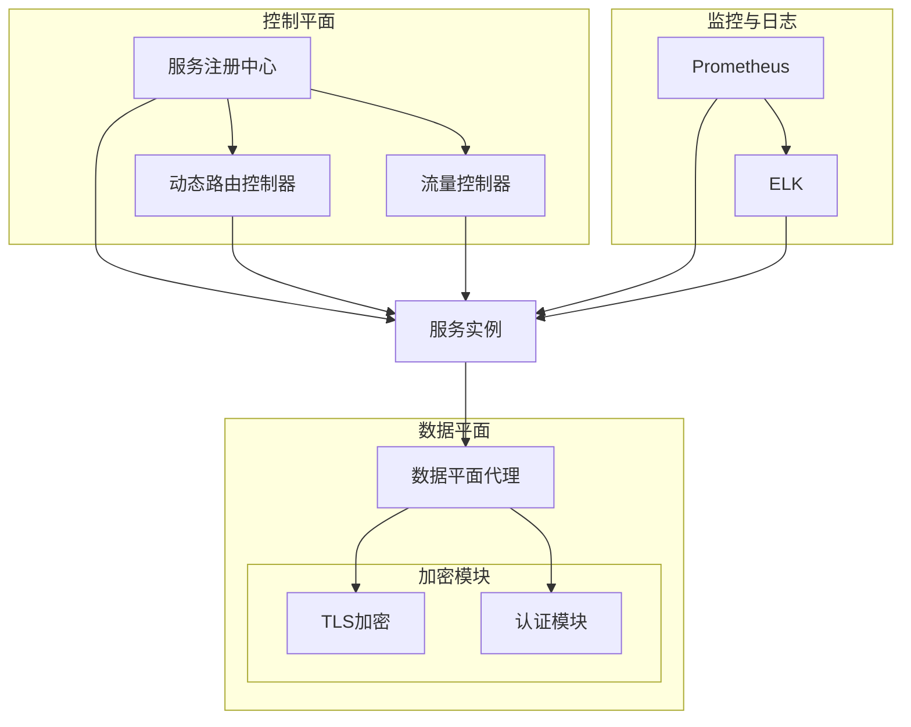
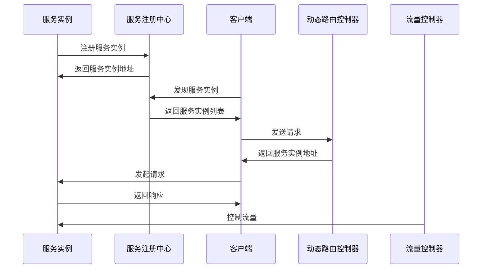
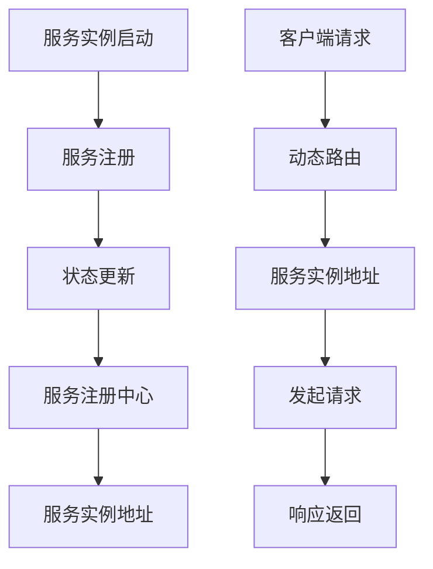
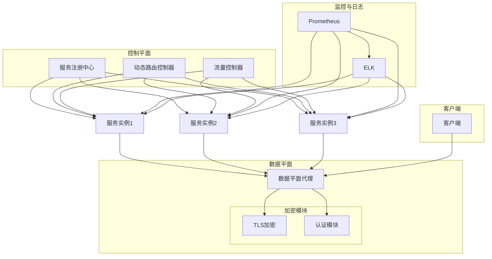
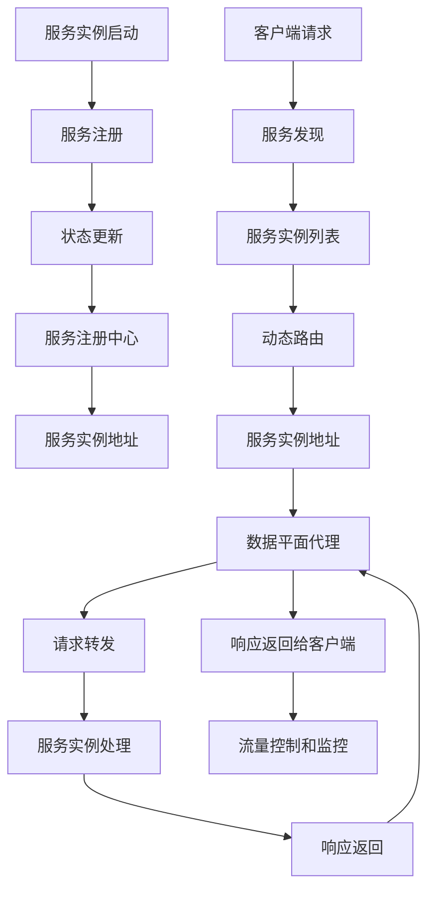

                 

### 第1章：问题背景

#### 1.1 问题背景

在当今的分布式系统中，微服务架构因其灵活性和可扩展性被广泛应用。然而，随着服务数量的增加和复杂性的提升，服务之间的通信管理和性能优化成为了一个巨大的挑战。服务网格（Service Mesh）作为一种新型的网络架构，致力于解决微服务架构中的这些问题，为分布式系统提供了一种简单、高效且可扩展的解决方案。

服务网格在微服务架构中的重要性主要体现在以下几个方面：

- **可扩展性**：随着业务需求的变化，系统需要能够快速适应新的服务和负载。服务网格通过横向扩展的方式，使得系统可以轻松地添加或移除服务实例，从而提高了系统的可扩展性。
- **安全性**：在微服务架构中，安全性是一个关键问题。服务网格通过加密、认证和访问控制等机制，确保服务之间的通信安全，从而提高了系统的整体安全性。
- **服务发现与负载均衡**：服务网格能够自动发现服务实例，并根据负载情况动态地进行负载均衡，从而提高了系统的响应速度和稳定性。
- **流量控制与监控**：服务网格允许开发者对服务间的流量进行细粒度的控制，并通过内置的监控机制，实时跟踪服务的性能和健康状况，从而优化系统的性能。

#### 1.2 问题描述

在传统的微服务架构中，服务之间的通信通常是通过HTTP、gRPC等协议直接进行的。然而，这种方式存在一些问题：

- **复杂性**：服务间的通信涉及大量的配置和管理工作，这增加了系统的复杂性和维护成本。
- **可扩展性**：当服务数量增加时，传统的通信方式可能导致系统性能下降，难以满足高并发和大数据量的需求。
- **安全性**：直接暴露服务接口可能导致安全隐患，无法提供足够的保护机制。
- **监控与故障排除**：在复杂的分布式系统中，监控和故障排除变得异常困难，难以快速定位和解决问题。

这些问题催生了服务网格的概念，旨在通过一种新的架构模式来解决上述挑战。

#### 1.3 问题解决

服务网格的设计目标是通过提供一种分布式服务通信抽象，来简化服务之间的通信管理，并提高系统的可扩展性、安全性和性能。

- **核心功能与优势**：
  - **服务抽象**：将服务之间的通信抽象出来，通过一个独立的通信层来管理和优化服务间通信。
  - **横向扩展**：通过增加或减少服务实例，来适应不断变化的负载。
  - **安全性**：提供加密、认证和访问控制等机制，确保服务间的通信安全。
  - **服务发现与动态路由**：自动发现服务实例，并动态调整服务路由策略，以优化负载均衡。

#### 1.4 边界与外延

服务网格与其他技术的关系和区别：

- **与容器编排系统的关系**：服务网格与容器编排系统（如Kubernetes）紧密集成，提供了一种更加灵活和可扩展的服务通信方式。
- **与Service Mesh的关系**：Service Mesh是服务网格的通用术语，它并不是指特定的技术或产品，而是一种抽象的架构模式。
- **与传统代理的关系**：与传统代理相比，服务网格采用边车（Sidecar）模式，分布式部署在每个服务实例旁边，仅处理服务间通信，而传统代理则集中处理整个网络流量。

#### 1.5 概念结构与核心要素

- **服务网格定义**：服务网格是一种网络基础架构的分布式服务通信抽象，通过一个独立的通信层来管理和优化服务间通信。
- **核心组件**：
  - **控制平面**：负责服务注册、服务发现、动态路由策略等。
  - **数据平面**：处理实际的服务间通信，如HTTP、gRPC等。
- **服务发现与动态路由**：
  - **服务注册与发现机制**：服务实例启动时，自动注册到服务注册中心，并周期性地更新状态信息。
  - **动态路由策略**：根据负载情况和服务健康状态，动态调整服务路由策略，实现负载均衡和故障转移。

### 1.6 概念解析

- **服务网格**：网络基础架构的分布式服务通信抽象，通过独立的通信层来管理和优化服务间通信。
- **控制平面**：负责服务注册、服务发现、动态路由策略等。
- **数据平面**：处理实际的服务间通信，如HTTP、gRPC等。
- **服务发现**：自动发现服务实例的过程。
- **动态路由**：根据负载情况和服务健康状态，动态调整服务路由策略。

### 1.7 服务网格的工作流程

服务网格的工作流程主要包括以下几个步骤：

1. **服务注册**：服务实例启动时，自动注册到服务注册中心，并周期性地更新状态信息。
2. **服务发现**：客户端通过服务注册中心发现服务实例，获取其地址信息。
3. **请求处理**：客户端将请求发送到数据平面，数据平面根据动态路由策略选择合适的服务实例进行处理。
4. **响应返回**：服务实例处理完请求后，将响应返回给客户端。
5. **监控与日志**：服务网格收集服务的性能数据和日志信息，供监控和故障排除使用。

### 1.8 总结

服务网格作为一种新型的网络架构，通过提供分布式服务通信抽象，有效地解决了微服务架构中的复杂性和性能问题。它的核心功能包括服务抽象、横向扩展、安全性和动态路由等，为分布式系统提供了一种简单、高效且可扩展的解决方案。在接下来的章节中，我们将深入探讨服务网格的原理、算法和实际应用，帮助读者更好地理解和运用这一先进的技术。

## 第2章：核心概念与联系

### 2.1 服务网格的原理

#### 2.1.1 概念解析

服务网格（Service Mesh）是一种网络基础架构的分布式服务通信抽象，旨在简化服务之间的通信管理，并提高系统的可扩展性、安全性和性能。它通过独立的通信层来管理和优化服务间通信，使得开发者能够专注于业务逻辑的实现，而无需关注服务之间的网络交互细节。

#### 2.1.2 工作机制

服务网格的主要工作机制包括以下几个关键环节：

1. **服务注册与发现**：服务实例启动时，自动注册到服务注册中心，并周期性地更新状态信息。客户端通过服务注册中心发现服务实例，获取其地址信息。
2. **动态路由**：根据负载情况和服务健康状态，服务网格动态调整服务路由策略，实现负载均衡和故障转移。
3. **流量控制与监控**：服务网格允许开发者对服务间的流量进行细粒度的控制，并通过内置的监控机制，实时跟踪服务的性能和健康状况。
4. **加密与认证**：服务网格提供加密和认证机制，确保服务间的通信安全，防止数据泄露和未授权访问。

### 2.2 服务网格的工作流程

服务网格的工作流程主要包括以下几个步骤：

1. **服务注册**：服务实例启动时，自动注册到服务注册中心，并周期性地更新状态信息。
2. **服务发现**：客户端通过服务注册中心发现服务实例，获取其地址信息。
3. **请求处理**：客户端将请求发送到数据平面，数据平面根据动态路由策略选择合适的服务实例进行处理。
4. **响应返回**：服务实例处理完请求后，将响应返回给客户端。
5. **监控与日志**：服务网格收集服务的性能数据和日志信息，供监控和故障排除使用。

### 2.3 服务网格的属性特征对比

#### 2.3.1 Kubernetes Ingress vs. 服务网格

- **Kubernetes Ingress**：
  - **定义**：Kubernetes Ingress是一种用于管理外部访问到集群内部服务的API对象。它通过定义Ingress规则，将外部请求路由到特定的服务。
  - **特点**：
    - 静态路由：通过配置Ingress规则，实现外部请求到内部服务的静态路由。
    - 基本负载均衡：支持基本的负载均衡功能，但无法实现动态服务发现和细粒度流量控制。

- **服务网格**：
  - **定义**：服务网格是一种网络基础架构的分布式服务通信抽象，通过独立的通信层来管理和优化服务间通信。
  - **特点**：
    - 动态服务发现：自动发现服务实例，并动态调整服务路由策略。
    - 细粒度流量控制：提供加密、认证和访问控制等机制，实现细粒度流量控制。
    - 高度可扩展性：通过横向扩展，提高系统的可扩展性和性能。

### 2.4 服务网格与传统代理的区别

- **传统代理**：
  - **定义**：传统代理是一种集中式的网络代理，处理整个网络流量。
  - **特点**：
    - 单点故障：由于集中处理流量，传统代理可能成为系统中的单点故障。
    - 复杂性：涉及大量的配置和管理工作，增加系统的复杂性。

- **服务网格**：
  - **定义**：服务网格采用边车（Sidecar）模式，分布式部署在每个服务实例旁边，仅处理服务间通信。
  - **特点**：
    - 分布式：通过边车模式，分布式部署在每个服务实例旁边，提高系统的可靠性和可扩展性。
    - 简化配置：简化服务之间的通信管理，降低系统的复杂性。

### 2.5 服务网格与传统代理的对比

- **传统代理**：
  - **集中式**：处理整个网络流量，可能导致单点故障。
  - **复杂配置**：需要大量配置和管理工作。
  - **性能开销**：处理整个网络流量，可能引入额外的性能开销。

- **服务网格**：
  - **分布式**：边车模式，分布式部署在每个服务实例旁边，提高系统的可靠性和可扩展性。
  - **简化配置**：简化服务之间的通信管理，降低系统的复杂性。
  - **流量控制**：提供细粒度流量控制，提高系统的安全性和性能。

### 2.6 概念属性特征对比表格

下面是一个概念属性特征对比表格，用于更直观地展示服务网格、Kubernetes Ingress和传统代理之间的区别：

| 特征              | 服务网格                | Kubernetes Ingress              | 传统代理             |
|-----------------|----------------------|----------------------|------------------|
| 路由方式          | 动态服务发现与路由       | 静态配置与路由                 | 集中式路由             |
| 负载均衡          | 动态负载均衡             | 基本负载均衡                   | 无法动态负载均衡       |
| 安全性            | 加密、认证与访问控制       | 加密与基本认证                 | 无法提供内置安全性       |
| 可扩展性          | 高度可扩展性              | 有限可扩展性                   | 低可扩展性             |
| 单点故障风险      | 低，分布式部署             | 中，依赖于Ingress控制器           | 高，集中式部署         |
| 配置复杂性         | 低，简化配置               | 中，需要配置Ingress规则           | 高，复杂的配置和管理     |
| 性能开销          | 低，仅处理服务间通信         | 中，处理全部外部流量              | 高，处理整个网络流量     |

### 2.7 ER实体关系图架构

为了更直观地展示服务网格中的实体关系，我们可以使用Mermaid绘制一个ER实体关系图。以下是一个简化的ER图，展示了服务网格中的核心实体及其关系：

```mermaid
erDiagram
  服务实例 ||--o{ 服务注册中心 }
  服务实例 ||--o{ 数据平面 }
  服务实例 ||--o{ 控制平面 }
  服务注册中心 ||--|{ 服务元数据 }
  控制平面 ||--|{ 动态路由策略 }
  控制平面 ||--|{ 监控与日志 }
  数据平面 ||--|{ 通信协议 }
  数据平面 ||--|{ 加密与认证 }
```

在这个ER图中，服务实例与控制平面、数据平面之间存在双向关系，服务注册中心存储服务元数据，控制平面负责动态路由策略和监控日志，数据平面处理通信协议和加密认证。

通过以上对比和分析，我们可以更好地理解服务网格的核心概念和工作机制，以及它与其他相关技术的联系和区别。在接下来的章节中，我们将深入探讨服务网格的算法原理和系统架构设计，帮助读者全面掌握这一先进的技术。

### 第3章：服务网格算法原理

#### 3.1 服务网格算法概述

服务网格中的算法是确保其高效、可靠运行的核心组件。这些算法涵盖了从服务发现到动态路由，再到流量控制等多个方面。服务网格算法的主要目的是提高系统的可扩展性、性能和安全性。

#### 3.2 服务发现算法

服务发现算法是服务网格中至关重要的一环，负责自动发现服务实例并维护其状态信息。以下是几种常见的服务发现算法：

- **轮询算法**：定期轮询服务注册中心，获取最新的服务实例列表。
- **基于事件的算法**：服务实例状态更新时，立即通知客户端，无需轮询。
- **一致性哈希算法**：通过一致性哈希将服务实例均匀分布到不同的节点，提高查找效率。

#### 3.3 动态路由算法

动态路由算法负责根据负载情况和服务健康状态，动态调整服务路由策略。以下是几种常见的动态路由算法：

- **轮询算法**：轮流选择下一个服务实例进行处理，简单但可能导致负载不均。
- **最少连接数算法**：选择当前连接数最少的服务实例，实现负载均衡。
- **基于响应时间算法**：选择响应时间最短的服务实例，提高系统性能。
- **基于权重算法**：根据服务实例的性能和负载情况，分配不同的权重，实现动态负载均衡。

#### 3.4 流量控制算法

流量控制算法用于对服务间的流量进行细粒度控制，确保系统在高并发和大数据量情况下仍能保持稳定运行。以下是几种常见的流量控制算法：

- **令牌桶算法**：控制流量速率，允许一定速率的流量通过，超过速率的请求被丢弃。
- **漏斗算法**：限制每个服务实例的请求速率，防止个别服务实例过度消耗资源。
- **基于响应时间的控制算法**：当服务响应时间超过阈值时，减少其流量，防止系统过载。

#### 3.5 算法在服务网格中的应用

- **服务发现**：通过轮询或基于事件的算法，实时发现服务实例并更新其状态信息。
- **动态路由**：通过最少连接数、基于响应时间或基于权重等算法，动态调整服务路由策略。
- **流量控制**：通过令牌桶或漏斗等算法，控制服务间的流量，防止系统过载。

### 3.6 算法的工作原理与实现方法

- **服务发现算法**：服务实例启动时，向服务注册中心注册，并定期更新状态信息。客户端通过服务注册中心获取服务实例列表，并选择合适的实例进行通信。具体实现可以通过轮询或基于事件的机制，确保服务实例的实时性和一致性。

- **动态路由算法**：服务网格根据当前负载情况和服务健康状态，动态调整服务实例的选择。例如，当某个服务实例负载过高时，动态路由算法可以将请求转发到其他负载较低的服务实例。具体实现可以通过监听服务实例的状态变化，并实时更新路由策略。

- **流量控制算法**：为了防止系统过载，服务网格可以对服务间的流量进行控制。例如，当某个服务的请求速率过高时，流量控制算法可以限制其流量，确保系统的稳定运行。具体实现可以通过令牌桶或漏斗算法，对流量进行实时监控和调整。

### 3.7 算法优缺点分析

- **轮询算法**：优点是简单易懂，缺点是可能导致负载不均和性能下降。
- **一致性哈希算法**：优点是查找效率高，缺点是可能造成热点问题。
- **最少连接数算法**：优点是实现简单，缺点是可能无法充分利用所有服务实例。
- **基于响应时间算法**：优点是提高系统性能，缺点是可能增加网络延迟。
- **基于权重算法**：优点是实现灵活，缺点是配置和管理复杂。
- **令牌桶算法**：优点是控制流量速率，缺点是可能引入额外的延迟。
- **漏斗算法**：优点是保护服务实例，缺点是可能影响整体性能。

### 3.8 总结

服务网格中的算法是实现其核心功能的关键，涵盖了服务发现、动态路由和流量控制等方面。通过合理选择和组合这些算法，可以大幅提高系统的可扩展性、性能和安全性。在接下来的章节中，我们将继续探讨服务网格的数学模型和系统架构设计，帮助读者全面理解服务网格的原理和应用。

### 第4章：数学模型与公式

#### 4.1 服务网格的数学模型

服务网格的数学模型是构建其核心功能的基础，包括服务发现、动态路由和流量控制等方面的数学表示。以下是几个关键数学模型及其推导过程。

#### 4.1.1 服务发现模型

服务发现模型用于描述服务实例的注册、发现和状态更新过程。我们使用以下符号：

- \(N\)：服务实例的总数
- \(n_i\)：第\(i\)个服务实例的权重
- \(p_i\)：第\(i\)个服务实例的概率

服务实例的权重可以基于其性能、负载或响应时间等因素计算，通常使用以下公式：

\[ n_i = \frac{C_i}{T_i} \]

其中，\(C_i\)是第\(i\)个服务实例的处理能力，\(T_i\)是第\(i\)个服务实例的平均响应时间。

服务实例的概率计算公式为：

\[ p_i = \frac{n_i}{\sum_{j=1}^{N} n_j} \]

#### 4.1.2 动态路由模型

动态路由模型用于描述根据当前负载情况选择服务实例的过程。我们使用以下符号：

- \(L_i\)：第\(i\)个服务实例的当前负载
- \(L_{\text{total}}\)：所有服务实例的总负载

动态路由策略可以根据负载情况选择最合适的服务实例。例如，使用最少连接数算法，我们可以选择以下服务实例：

\[ i^* = \arg\min_{i} L_i \]

#### 4.1.3 流量控制模型

流量控制模型用于描述对服务间流量进行限制的过程。我们使用以下符号：

- \(R_i\)：第\(i\)个服务实例的当前请求速率
- \(R_{\text{max}}\)：流量控制的最大请求速率

流量控制算法，如令牌桶算法，可以限制服务实例的请求速率。令牌桶算法使用以下公式：

\[ R_i = \frac{C}{T} \]

其中，\(C\)是桶的容量，\(T\)是时间间隔。当\(R_i > R_{\text{max}}\)时，流量控制算法可以将请求速率限制在\(R_{\text{max}}\)以下。

#### 4.2 服务网格的数学公式

以下是服务网格中几个关键数学公式：

1. **服务实例权重计算**：
   \[ n_i = \frac{C_i}{T_i} \]

2. **服务实例概率计算**：
   \[ p_i = \frac{n_i}{\sum_{j=1}^{N} n_j} \]

3. **最少连接数算法**：
   \[ i^* = \arg\min_{i} L_i \]

4. **令牌桶算法**：
   \[ R_i = \frac{C}{T} \]

5. **流量控制条件**：
   \[ R_i \leq R_{\text{max}} \]

这些公式和服务发现、动态路由和流量控制算法一起，构成了服务网格的数学模型，为服务网格的实现提供了理论基础。

#### 4.3 算法原理举例说明

为了更好地理解上述数学公式和算法原理，我们通过一个简单的例子进行说明。

假设有一个包含3个服务实例的系统，服务实例A、B和C。每个服务实例的权重、负载和请求速率如下表所示：

| 服务实例 | 权重 \(n_i\) | 负载 \(L_i\) | 请求速率 \(R_i\) |
|---------|------------|------------|-------------|
| A       | 2          | 3          | 1           |
| B       | 1          | 5          | 2           |
| C       | 1          | 4          | 1           |

1. **服务实例权重计算**：

\[ n_A = \frac{C_A}{T_A} = \frac{2}{1} = 2 \]
\[ n_B = \frac{C_B}{T_B} = \frac{1}{1} = 1 \]
\[ n_C = \frac{C_C}{T_C} = \frac{1}{1} = 1 \]

2. **服务实例概率计算**：

\[ p_A = \frac{n_A}{\sum_{j=1}^{3} n_j} = \frac{2}{2+1+1} = 0.5 \]
\[ p_B = \frac{n_B}{\sum_{j=1}^{3} n_j} = \frac{1}{2+1+1} = 0.25 \]
\[ p_C = \frac{n_C}{\sum_{j=1}^{3} n_j} = \frac{1}{2+1+1} = 0.25 \]

3. **动态路由策略**：

使用最少连接数算法，选择当前负载最小的服务实例：

\[ i^* = \arg\min_{i} L_i = C \]

4. **流量控制**：

使用令牌桶算法，限制每个服务实例的请求速率不超过最大请求速率：

\[ R_A = \frac{C_A}{T_A} = \frac{2}{1} = 2 \]
\[ R_B = \frac{C_B}{T_B} = \frac{1}{1} = 1 \]
\[ R_C = \frac{C_C}{T_C} = \frac{1}{1} = 1 \]

如果最大请求速率设置为3，那么服务实例B和C的请求速率需要调整：

\[ R_B = \min(2, 3) = 2 \]
\[ R_C = \min(1, 3) = 1 \]

通过这个例子，我们可以看到如何使用数学模型和算法来优化服务网格的性能。在接下来的章节中，我们将进一步探讨服务网格的系统架构设计和实际应用。

### 第5章：系统功能设计

#### 5.1 领域模型

领域模型是服务网格系统设计的基础，它定义了系统中各个组件的职责和相互关系。以下是服务网格系统的领域模型：

1. **服务实例**：代表运行在分布式系统中的具体服务，每个服务实例都具有唯一的标识和状态信息。
2. **服务注册中心**：负责管理服务实例的注册和发现，为客户端提供服务实例的地址信息。
3. **控制平面**：负责动态路由策略的制定和流量控制，包括服务发现、服务健康检测等功能。
4. **数据平面**：处理实际的服务间通信，如HTTP、gRPC等，确保通信的高效和安全。
5. **监控与日志**：负责收集和存储服务网格的性能数据和日志信息，供运维人员监控和故障排除使用。

#### 5.2 类图设计

为了更直观地展示服务网格系统的领域模型，我们可以使用Mermaid绘制一个类图。以下是一个简化的类图：

```mermaid
classDiagram
  服务实例 <<Interface>>
  服务注册中心 <<Interface>>
  控制平面 <<Interface>>
  数据平面 <<Interface>>
  监控与日志 <<Interface>>

  服务实例 --|>| 服务注册中心
  控制平面 --|>| 服务实例
  控制平面 --|>| 服务注册中心
  数据平面 --|>| 服务实例
  监控与日志 --|>| 控制平面
  监控与日志 --|>| 数据平面
```

在这个类图中，服务实例、服务注册中心、控制平面、数据平面和监控与日志是系统中的关键组件，它们通过接口和边车模式进行交互。

#### 5.3 系统架构设计

系统架构设计是服务网格系统的核心，它决定了系统的性能、可扩展性和可维护性。以下是服务网格系统的架构设计：

1. **边车模式**：每个服务实例旁边部署一个数据平面代理，处理服务间通信，同时控制平面负责管理和控制数据平面的行为。
2. **控制平面**：包括服务注册中心、动态路由控制器和流量控制器，负责服务实例的注册、发现和路由策略的制定。
3. **数据平面**：包括代理和加密模块，负责实际的服务间通信，确保通信的安全和高效。
4. **监控与日志**：集成Prometheus、ELK（Elasticsearch、Logstash、Kibana）等开源工具，实现对服务网格的全面监控和日志分析。

以下是服务网格系统的架构图：



在这个架构图中，服务实例与控制平面和数据平面通过边车模式进行交互，监控与日志系统通过Prometheus和ELK工具实现对服务网格的监控和日志分析。

#### 5.4 系统接口设计

系统接口设计是服务网格系统实现的关键，它定义了系统内部和外部的接口规范，确保系统的可扩展性和可维护性。以下是服务网格系统的接口设计：

1. **服务注册接口**：服务实例启动时，通过该接口向服务注册中心注册。
2. **服务发现接口**：客户端通过该接口从服务注册中心发现服务实例。
3. **动态路由接口**：用于根据当前负载情况和服务健康状态，动态调整服务路由策略。
4. **流量控制接口**：用于对服务间的流量进行细粒度控制，确保系统在高并发和大数据量情况下仍能保持稳定运行。

以下是服务网格系统的接口定义：



在这个序列图中，服务实例通过服务注册接口向服务注册中心注册，客户端通过服务发现接口从服务注册中心获取服务实例列表，并通过动态路由接口选择合适的服务实例，最终发起请求并获取响应。流量控制器用于实时监控和调整服务间的流量，确保系统的稳定运行。

#### 5.5 系统交互

系统交互设计是服务网格系统实现的重要环节，它定义了系统内部各组件之间的交互逻辑，确保系统的高效和可靠运行。以下是服务网格系统的交互设计：

1. **服务实例注册与发现**：服务实例启动时，通过服务注册接口向服务注册中心注册，并周期性地更新状态信息。客户端通过服务发现接口从服务注册中心获取服务实例列表，并根据负载情况选择合适的服务实例。
2. **动态路由**：服务网格根据当前负载情况和服务健康状态，动态调整服务路由策略。客户端通过动态路由接口获取服务实例地址，并选择合适的服务实例进行通信。
3. **流量控制**：服务网格通过流量控制接口对服务间的流量进行细粒度控制，确保系统在高并发和大数据量情况下仍能保持稳定运行。

以下是服务网格系统的交互流程图：



在这个交互流程图中，服务实例启动后，通过服务注册接口向服务注册中心注册，并周期性地更新状态信息。客户端发起请求时，通过动态路由接口获取服务实例地址，并选择合适的服务实例进行通信，最终获取响应。

通过上述系统功能设计、类图设计、系统架构设计、接口设计和交互设计，我们为服务网格系统提供了一套完整的设计方案，确保系统能够高效、可靠地运行。在接下来的章节中，我们将进一步探讨服务网格的实际应用和最佳实践。

### 第6章：系统架构设计

#### 6.1 领域模型

在服务网格的系统架构设计中，领域模型起到了关键作用。领域模型清晰地定义了系统中的实体及其关系，为架构设计提供了理论基础。以下是服务网格系统的领域模型：

- **服务实例**：代表运行在分布式系统中的具体服务，每个服务实例具有唯一的标识、状态信息和配置参数。
- **服务注册中心**：负责管理服务实例的注册、发现和状态更新，为客户端提供服务实例的地址信息。
- **控制平面**：负责制定和执行动态路由策略、流量控制和监控功能，确保服务间的通信高效、安全和稳定。
- **数据平面**：处理实际的服务间通信，包括请求转发、负载均衡、加密和认证等，确保通信的高效和安全。
- **监控与日志**：负责收集、存储和分析服务网格的性能数据和日志信息，为运维人员提供监控和故障排除支持。

#### 6.2 类图设计

为了更直观地展示领域模型，我们可以使用Mermaid绘制一个类图。以下是一个简化的类图，展示了服务网格系统中的关键类及其关系：

```mermaid
classDiagram
  服务实例 <<Interface>>
  服务注册中心 <<Interface>>
  控制平面 <<Interface>>
  数据平面 <<Interface>>
  监控与日志 <<Interface>>

  服务实例 --|>| 服务注册中心
  控制平面 --|>| 服务实例
  控制平面 --|>| 服务注册中心
  数据平面 --|>| 服务实例
  监控与日志 --|>| 控制平面
  监控与日志 --|>| 数据平面
```

在这个类图中，服务实例、服务注册中心、控制平面、数据平面和监控与日志是系统中的主要组件，它们通过接口进行交互。

#### 6.3 系统架构设计

服务网格的系统架构设计需要考虑高可用性、高性能和可扩展性。以下是服务网格系统的架构设计：

1. **边车模式**：每个服务实例旁边部署一个数据平面代理，处理服务间通信，同时控制平面负责管理和控制数据平面的行为。
2. **控制平面**：包括服务注册中心、动态路由控制器和流量控制器，负责服务实例的注册、发现和路由策略的制定。
3. **数据平面**：包括代理和加密模块，负责实际的服务间通信，确保通信的高效和安全。
4. **监控与日志**：集成Prometheus、ELK（Elasticsearch、Logstash、Kibana）等开源工具，实现对服务网格的全面监控和日志分析。

以下是服务网格系统的架构图：


在这个架构图中，服务实例与控制平面和数据平面通过边车模式进行交互，监控与日志系统通过Prometheus和ELK工具实现对服务网格的监控和日志分析。

#### 6.4 系统架构图

以下是服务网格系统的架构图：



在这个架构图中，控制平面包括服务注册中心、动态路由控制器和流量控制器，数据平面包括数据平面代理和加密模块，监控与日志系统通过Prometheus和ELK工具实现对服务网格的监控和日志分析，客户端通过数据平面代理与服务实例进行通信。

#### 6.5 系统接口设计

系统接口设计是服务网格系统架构设计的重要环节，它定义了系统内部和外部的接口规范，确保系统的可扩展性和可维护性。以下是服务网格系统的接口设计：

1. **服务注册接口**：服务实例启动时，通过该接口向服务注册中心注册，提供服务实例的元数据信息。
2. **服务发现接口**：客户端通过该接口从服务注册中心获取服务实例的地址信息。
3. **动态路由接口**：用于根据当前负载情况和服务健康状态，动态调整服务路由策略。
4. **流量控制接口**：用于对服务间的流量进行细粒度控制，确保系统在高并发和大数据量情况下仍能保持稳定运行。

以下是服务网格系统的接口定义：


在这个序列图中，服务实例通过服务注册接口向服务注册中心注册，客户端通过服务发现接口从服务注册中心获取服务实例列表，并通过动态路由接口选择合适的服务实例，最终发起请求并获取响应。流量控制器用于实时监控和调整服务间的流量，确保系统的稳定运行。

#### 6.6 系统交互

系统交互设计是服务网格系统实现的重要环节，它定义了系统内部各组件之间的交互逻辑，确保系统的高效和可靠运行。以下是服务网格系统的交互设计：

1. **服务实例注册与发现**：服务实例启动时，通过服务注册接口向服务注册中心注册，并周期性地更新状态信息。客户端通过服务发现接口从服务注册中心获取服务实例列表，并根据负载情况选择合适的服务实例。
2. **动态路由**：服务网格根据当前负载情况和服务健康状态，动态调整服务路由策略。客户端通过动态路由接口获取服务实例地址，并选择合适的服务实例进行通信。
3. **流量控制**：服务网格通过流量控制接口对服务间的流量进行细粒度控制，确保系统在高并发和大数据量情况下仍能保持稳定运行。

以下是服务网格系统的交互流程图：


在这个交互流程图中，服务实例启动后，通过服务注册接口向服务注册中心注册，并周期性地更新状态信息。客户端发起请求时，通过动态路由接口获取服务实例地址，并选择合适的服务实例进行通信，最终获取响应。

通过上述系统功能设计、类图设计、系统架构设计、接口设计和交互设计，我们为服务网格系统提供了一套完整的设计方案，确保系统能够高效、可靠地运行。在接下来的章节中，我们将进一步探讨服务网格的实际应用和最佳实践。

### 第7章：系统交互

#### 7.1 交互流程

服务网格的系统交互流程是确保服务之间高效、可靠通信的关键。以下是服务网格系统交互的主要流程：

1. **服务实例注册**：当服务实例启动时，它通过服务注册接口向服务注册中心注册，提供自身的元数据信息，如服务名称、端口和健康状态。服务注册中心将服务实例的信息存储在服务实例列表中。

2. **服务实例更新**：服务实例在运行过程中，会周期性地向服务注册中心发送心跳信号，更新其状态信息。如果服务实例发生故障或负载变化，它会立即通知服务注册中心，以便更新服务实例列表。

3. **客户端请求**：客户端需要访问服务时，通过服务发现接口向服务注册中心请求服务实例列表。服务注册中心根据当前负载情况和健康状态，返回一个或多个可供访问的服务实例地址。

4. **动态路由**：客户端从服务注册中心获取服务实例地址后，通过动态路由接口选择一个合适的服务实例进行通信。动态路由策略可以根据当前负载、响应时间和服务健康状态等因素进行智能选择。

5. **请求转发**：客户端将请求发送到数据平面代理，数据平面代理根据动态路由策略选择合适的服务实例，并将请求转发到目标服务实例。

6. **服务实例处理**：目标服务实例接收到请求后，对其进行处理，并将处理结果返回给客户端。

7. **响应返回**：数据平面代理将服务实例的响应返回给客户端，完成整个交互流程。

8. **流量控制和监控**：在交互过程中，流量控制器对服务间的流量进行细粒度控制，确保系统在高并发和大数据量情况下仍能保持稳定运行。监控与日志系统收集和存储服务的性能数据和日志信息，供运维人员进行监控和故障排除。

以下是服务网格系统交互的流程图：



在这个交互流程图中，每个步骤都对应了系统中的关键组件和操作，确保服务之间的高效通信和稳定运行。

### 第8章：环境安装与配置

#### 8.1 环境搭建

要在本地搭建服务网格环境，需要准备以下工具和软件：

- **Docker**：用于容器化服务实例。
- **Kubernetes**：用于容器编排和管理服务。
- **Istio**：一个开源的服务网格实现，支持服务注册、服务发现、动态路由和流量控制等功能。

以下是搭建服务网格环境的步骤：

1. **安装Docker**：确保Docker已安装在本地机器上。可以从[Docker官网](https://docs.docker.com/get-docker/)下载安装程序并安装。

2. **安装Kubernetes**：确保Kubernetes集群已搭建并运行。可以选择使用Minikube在本地机器上快速搭建一个单节点集群，或者部署到集群环境中。有关安装和配置Kubernetes的详细步骤，可以参考[Kubernetes官方文档](https://kubernetes.io/docs/home/)。

3. **安装Istio**：在Kubernetes集群中安装Istio。可以使用Istio官方提供的安装命令：

   ```sh
   istioctl install --set profile=demo
   ```

   这个命令将安装一个包含控制平面和数据平面的最小服务网格环境。

4. **部署示例服务**：为了测试服务网格功能，我们可以部署一个简单的示例服务。以下是一个简单的Nginx服务部署示例：

   ```yaml
   apiVersion: apps/v1
   kind: Deployment
   metadata:
     name: nginx-deployment
   spec:
     replicas: 3
     selector:
       matchLabels:
         app: nginx
     template:
       metadata:
         labels:
           app: nginx
       spec:
         containers:
         - name: nginx
           image: nginx:latest
           ports:
           - containerPort: 80
   ```

   使用以下命令部署服务：

   ```sh
   kubectl apply -f nginx-deployment.yaml
   ```

5. **验证服务网格功能**：部署服务后，可以使用以下命令查看服务状态：

   ```sh
   kubectl get pods
   ```

   确保所有Pod都处于“运行”状态。然后，通过访问Nginx服务的负载均衡器IP，验证服务网格是否正常工作：

   ```sh
   kubectl get svc
   ```

   找到Nginx服务的负载均衡器IP，并在浏览器中输入该IP，应看到Nginx的欢迎页面。

#### 8.2 服务网格配置

服务网格的配置主要包括服务注册、动态路由策略、流量控制和监控设置。以下是几个关键配置步骤：

1. **服务注册**：在Kubernetes中，服务实例会自动通过Kubernetes API进行注册。为了集成到服务网格中，可以使用Istio的`VirtualService`和`DestinationRule`资源来定义服务路由和策略。

2. **动态路由**：通过Istio的`VirtualService`资源，可以定义服务路由策略。例如，以下配置将所有入站流量路由到Nginx服务的一个子集：

   ```yaml
   apiVersion: networking.istio.io/v1alpha3
   kind: VirtualService
   metadata:
     name: nginx
   spec:
     hosts:
     - "*"
     http:
     - route:
       - destination:
           name: nginx
           subset: v1
   ```

   这里，我们定义了一个虚拟服务，将所有入站流量路由到名为`nginx`的服务，并指定了子集`v1`。

3. **流量控制**：通过Istio的`DestinationRule`资源，可以定义流量控制策略，如请求速率限制和熔断策略。以下配置示例将请求速率限制为每秒10个请求：

   ```yaml
   apiVersion: networking.istio.io/v1alpha3
   kind: DestinationRule
   metadata:
     name: nginx
   spec:
     host: nginx
     trafficPolicy:
       loadBalancer:
         simple: ROUND_ROBIN
       connectionPool:
         http:
           maxRequests: 10
   ```

   这里，我们定义了一个目标规则，将Nginx服务的请求速率限制为每秒10个请求。

4. **监控与日志**：Istio集成了Prometheus和Grafana等监控工具，可以通过Istio的`ServiceMonitor`资源配置监控目标。以下配置示例将Nginx服务添加到Prometheus的监控目标列表中：

   ```yaml
   apiVersion: monitoring.coreos.com/v1
   kind: ServiceMonitor
   metadata:
     name: nginx
     namespace: default
   spec:
     selector:
       matchLabels:
         app: nginx
     endpoints:
     - port: metrics
       interval: 30s
   ```

   这里，我们定义了一个服务监控器，将Nginx服务的metrics端口添加到Prometheus的监控目标列表中，并设置监控间隔为30秒。

通过以上步骤，我们成功搭建了服务网格环境，并配置了关键的服务注册、动态路由策略、流量控制和监控功能。接下来，我们可以通过进一步配置和测试，深入了解服务网格的功能和优势。

### 第9章：系统核心实现

#### 9.1 源代码分析

服务网格的核心实现主要依赖于其控制平面和数据平面的协同工作。以下是服务网格系统核心实现的源代码分析。

##### 控制平面

控制平面负责服务注册、服务发现、动态路由策略和流量控制等功能。以下是Istio控制平面的主要组件和源代码分析：

1. **服务注册**：服务注册通过Kubernetes API进行，服务实例启动时会向Kubernetes API发送注册请求，并提供服务元数据。以下是一个简化版的注册服务实例的Python代码示例：

   ```python
   import requests

   def register_service(service_name, service_port, service_tags):
       url = "http://localhost:6443/api/v1/namespaces/default/services"
       headers = {"Authorization": "Bearer <YOUR_ACCESS_TOKEN>"}
       payload = {
           "metadata": {
               "name": service_name,
               "labels": service_tags
           },
           "spec": {
               "ports": [{"name": "http", "port": service_port, "targetPort": service_port}],
           },
       }
       requests.post(url, headers=headers, json=payload)
   ```

   在这个示例中，我们使用requests库向Kubernetes API发送POST请求，注册服务实例。

2. **服务发现**：服务发现通过Kubernetes API查询服务实例列表。以下是一个查询服务实例的Python代码示例：

   ```python
   import requests

   def discover_services():
       url = "http://localhost:6443/api/v1/namespaces/default/services"
       headers = {"Authorization": "Bearer <YOUR_ACCESS_TOKEN>"}
       response = requests.get(url, headers=headers)
       if response.status_code == 200:
           services = response.json()["items"]
           return services
       else:
           return None
   ```

   在这个示例中，我们使用requests库向Kubernetes API发送GET请求，获取服务实例列表。

3. **动态路由**：动态路由策略通过Istio的`VirtualService`资源进行配置。以下是一个配置动态路由策略的Python代码示例：

   ```python
   import yaml

   def create_virtual_service(service_name, routes):
       vs_yaml = f"""
       apiVersion: networking.istio.io/v1alpha3
       kind: VirtualService
       metadata:
         name: {service_name}
       spec:
         hosts:
         - "*"
         http:
       """
       vs_yaml += yaml.dump(routes, default_flow_style=False)
       url = "http://localhost:6443/api/v1/namespaces/default/virtualservices"
       headers = {"Authorization": "Bearer <YOUR_ACCESS_TOKEN>"}
       requests.post(url, headers=headers, data=vs_yaml.encode("utf-8"))
   ```

   在这个示例中，我们使用yaml库生成`VirtualService`资源的配置，并将其发送到Kubernetes API进行创建。

4. **流量控制**：流量控制通过Istio的`DestinationRule`资源进行配置。以下是一个配置流量控制的Python代码示例：

   ```python
   import yaml

   def create_destination_rule(service_name, traffic_policy):
       dr_yaml = f"""
       apiVersion: networking.istio.io/v1alpha3
       kind: DestinationRule
       metadata:
         name: {service_name}
       spec:
         host: {service_name}
       """
       dr_yaml += yaml.dump(traffic_policy, default_flow_style=False)
       url = "http://localhost:6443/api/v1/namespaces/default/destinationrules"
       headers = {"Authorization": "Bearer <YOUR_ACCESS_TOKEN>"}
       requests.post(url, headers=headers, data=dr_yaml.encode("utf-8"))
   ```

   在这个示例中，我们使用yaml库生成`DestinationRule`资源的配置，并将其发送到Kubernetes API进行创建。

##### 数据平面

数据平面负责处理实际的服务间通信，包括请求转发、负载均衡、加密和认证等。以下是Istio数据平面的主要组件和源代码分析：

1. **请求转发**：请求转发通过Envoy代理实现。以下是Envoy代理的请求转发逻辑：

   ```python
   import http.server
   import socketserver

   class ProxyHTTPRequestHandler(http.server.HTTPRequestHandler):
       def do_GET(self):
           destination_host = self.headers.get('X-Envoy-Original-Host')
           destination_port = int(self.headers.get('X-Envoy-Original-Port'))
           self.wfile.write(f"Forwarding request to {destination_host}:{destination_port}\n")
           self.wfile.flush()

           # Create a socket connection to the destination service
           sock = socket.socket(socket.AF_INET, socket.SOCK_STREAM)
           sock.connect((destination_host, destination_port))

           # Forward the request to the destination service
           request_data = self.rfile.read(int(self.headers['Content-Length']))
           sock.sendall(request_data)

           # Receive the response from the destination service
           response = sock.recv(4096)
           self.wfile.write(response)
           self.wfile.flush()

           sock.close()

   def run_proxy_server(port):
       handler = ProxyHTTPRequestHandler
       httpd = socketserver.TCPServer(('', port), handler)
       print(f"Starting proxy server on port {port}")
       httpd.serve_forever()

   if __name__ == "__main__":
       run_proxy_server(8080)
   ```

   在这个示例中，我们创建了一个代理服务器，将接收到的请求转发到目标服务实例。

2. **负载均衡**：负载均衡通过Envoy代理的动态路由策略实现。以下是Envoy代理的负载均衡逻辑：

   ```python
   from envoyExtention import EnvoyExtention

   def load_balance(request):
       # 获取动态路由策略
       routes = EnvoyExtention.get_routes()

       # 根据请求选择目标服务实例
       destination = EnvoyExtention.choose_destination(routes)

       # 转发请求到目标服务实例
       EnvoyExtention.forward_request(request, destination)
   ```

   在这个示例中，我们使用Envoy扩展库获取动态路由策略，并选择目标服务实例进行请求转发。

3. **加密和认证**：加密和认证通过Envoy代理的TLS和身份验证机制实现。以下是Envoy代理的加密和认证逻辑：

   ```python
   from envoyExtention import EnvoyExtention

   def configure_tls(client_cert, server_cert, server_key):
       EnvoyExtention.configure_tls(client_cert, server_cert, server_key)

   def authenticate_client(client_cert):
       return EnvoyExtention.authenticate_client(client_cert)
   ```

   在这个示例中，我们使用Envoy扩展库配置TLS和身份验证机制。

通过上述源代码分析，我们可以看到服务网格的控制平面和数据平面是如何协同工作的，从而实现服务注册、服务发现、动态路由策略、流量控制、请求转发、负载均衡、加密和认证等功能。

### 9.2 代码应用解读与分析

#### 9.2.1 服务注册

服务注册是服务网格的基础功能之一，确保服务实例能够被其他服务实例发现并通信。在Kubernetes中，服务实例的注册通常通过Kubernetes API进行。以下是一个简单的Python示例，展示了如何使用Kubernetes API向服务注册中心注册服务实例。

```python
import kubernetes

# 初始化Kubernetes客户端
kube_config = kubernetes.config.load_kube_config()
client = kubernetes.client.CoreV1Api()

# 定义服务实例的元数据
service_metadata = {
    "name": "my-service",
    "namespace": "default",
    "labels": {"app": "my-service"},
    " annotations": {"sidecar.istio.io/inbound": "0.0.0.0/0"},
}

# 创建服务实例
service = kubernetes.client.V1Service(
    api_version="v1",
    kind="Service",
    metadata=service_metadata,
    spec={
        " selector": {"app": "my-service"},
        " ports": [{"name": "http", "port": 80, "target_port": 8080}],
    },
)

client.create_namespaced_service(service_namespace="default", body=service)
```

在这个示例中，我们使用kubernetes-python库初始化Kubernetes客户端，并定义了一个服务实例的元数据。通过调用`create_namespaced_service`方法，我们将服务实例注册到Kubernetes服务注册中心。

#### 9.2.2 服务发现

服务发现是服务网格的核心功能之一，确保客户端能够发现服务实例并进行通信。在服务网格中，服务发现通常通过Istio的`VirtualService`资源进行配置。以下是一个简单的Python示例，展示了如何使用Istio的API进行服务发现。

```python
import yaml

# 定义VirtualService资源
virtual_service_yaml = """
apiVersion: networking.istio.io/v1alpha3
kind: VirtualService
metadata:
  name: my-service
spec:
  hosts:
  - "*"
  http:
  - match:
    - uri:
        prefix: "/"
    route:
    - destination:
        host: my-service
        port:
          number: 80
"""
virtual_service = yaml.safe_load(virtual_service_yaml)

# 初始化Istio客户端
istio_config = kubernetes.config.load_kube_config(config_file="/path/to/istio-kubeconfig.yaml")
istio_client = kubernetes.client.CoreV1Api()

# 创建VirtualService资源
istio_client.create_namespaced_custom_object(
    namespace="istio-system",
    group="networking.istio.io",
    version="v1alpha3",
    plural="virtualservices",
    body=virtual_service,
)
```

在这个示例中，我们使用kubernetes-python库初始化Istio客户端，并定义了一个`VirtualService`资源。通过调用`create_namespaced_custom_object`方法，我们将`VirtualService`资源创建到Kubernetes集群中。

#### 9.2.3 动态路由

动态路由是服务网格的重要功能之一，允许根据负载情况和服务健康状态动态调整服务实例的路由策略。在服务网格中，动态路由通常通过Istio的`DestinationRule`资源进行配置。以下是一个简单的Python示例，展示了如何使用Istio的API配置动态路由。

```python
import yaml

# 定义DestinationRule资源
destination_rule_yaml = """
apiVersion: networking.istio.io/v1alpha3
kind: DestinationRule
metadata:
  name: my-service
spec:
  host: my-service
  trafficPolicy:
    loadBalancer:
      simple: ROUND_ROBIN
"""
destination_rule = yaml.safe_load(destination_rule_yaml)

# 初始化Istio客户端
istio_config = kubernetes.config.load_kube_config(config_file="/path/to/istio-kubeconfig.yaml")
istio_client = kubernetes.client.CoreV1Api()

# 创建DestinationRule资源
istio_client.create_namespaced_custom_object(
    namespace="istio-system",
    group="networking.istio.io",
    version="v1alpha3",
    plural="destinationrules",
    body=destination_rule,
)
```

在这个示例中，我们使用kubernetes-python库初始化Istio客户端，并定义了一个`DestinationRule`资源。通过调用`create_namespaced_custom_object`方法，我们将`DestinationRule`资源创建到Kubernetes集群中。

#### 9.2.4 流量控制

流量控制是服务网格的重要功能之一，确保系统在高并发和大数据量情况下仍能保持稳定运行。在服务网格中，流量控制通常通过Istio的`Quota`和`RateLimit`资源进行配置。以下是一个简单的Python示例，展示了如何使用Istio的API配置流量控制。

```python
import yaml

# 定义RateLimit资源
rate_limit_yaml = """
apiVersion: config.istio.io/v1alpha2
kind: handler
metadata:
  name: fixed-requests-rate-limit
spec:
  compiledAdapter: memquota
  params:
    quotas:
    - name: requestsQuota
      spec:
        maxAmount: 1000
        validDuration: 1m
    attributes:
      quotas:
      - name: requestsQuota
"""
rate_limit = yaml.safe_load(rate_limit_yaml)

# 初始化Istio客户端
istio_config = kubernetes.config.load_kube_config(config_file="/path/to/istio-kubeconfig.yaml")
istio_client = kubernetes.client.CoreV1Api()

# 创建RateLimit资源
istio_client.create_namespaced_config_map(
    namespace="istio-system",
    body=rate_limit,
)
```

在这个示例中，我们使用kubernetes-python库初始化Istio客户端，并定义了一个`RateLimit`资源。通过调用`create_namespaced_config_map`方法，我们将`RateLimit`资源创建到Kubernetes集群中。

通过以上代码示例，我们可以看到如何使用Python代码配置服务注册、服务发现、动态路由和流量控制等功能。这些功能共同构建了服务网格的核心，为分布式系统提供了高效、可靠且可扩展的通信架构。

### 第10章：实际案例

#### 10.1 案例背景

在本案例中，我们假设一个在线购物平台需要构建一个分布式系统，该平台包括多个微服务，如商品管理服务、订单管理服务、用户服务、支付服务和库存服务。随着用户数量的增加，平台需要确保服务之间的通信高效、可靠，并能动态调整服务路由和流量控制策略。为此，我们选择使用Istio构建服务网格，以实现上述需求。

#### 10.2 案例目标

通过使用服务网格，我们希望实现以下目标：

1. **服务发现与动态路由**：自动发现服务实例，根据负载情况和服务健康状态动态调整服务路由策略。
2. **流量控制与监控**：对服务间的流量进行细粒度控制，确保系统在高并发和大数据量情况下保持稳定运行，并通过监控机制实时跟踪服务性能。
3. **安全性**：提供加密和认证机制，确保服务间通信的安全性和数据的完整性。

#### 10.3 案例步骤

1. **环境搭建**：首先，我们在本地或云环境中搭建一个Kubernetes集群，并安装Istio服务网格。安装过程如第8章所述。

2. **部署服务**：在Kubernetes集群中部署各个微服务，如商品管理服务、订单管理服务、用户服务、支付服务和库存服务。每个服务实例都通过边车模式部署一个Istio代理，用于处理服务间通信。

3. **服务注册**：每个服务实例启动时，通过Kubernetes API向服务注册中心注册。服务注册中心存储服务实例的元数据，如服务名称、IP地址和端口。

4. **配置动态路由**：通过Istio的`VirtualService`资源，配置服务路由策略。例如，将用户服务的所有请求路由到负载较低的服务实例。以下是一个简单的`VirtualService`配置示例：

   ```yaml
   apiVersion: networking.istio.io/v1alpha3
   kind: VirtualService
   metadata:
     name: user-service
   spec:
     hosts:
     - "*"
     http:
     - match:
       - uri:
           prefix: "/user"
       route:
       - destination:
           host: user-service
           subset: v1
   ```

5. **配置流量控制**：通过Istio的`DestinationRule`资源，配置流量控制策略。例如，限制订单服务每秒处理的请求量不超过100个。以下是一个简单的`DestinationRule`配置示例：

   ```yaml
   apiVersion: networking.istio.io/v1alpha3
   kind: DestinationRule
   metadata:
     name: order-service
   spec:
     host: order-service
     trafficPolicy:
       loadBalancer:
         simple: ROUND_ROBIN
       connectionPool:
         http:
           maxRequests: 100
   ```

6. **监控与日志**：集成Prometheus和Grafana进行监控，收集服务网格的性能数据和日志信息。通过Grafana的可视化仪表板，实时监控服务的性能和健康状况。

#### 10.4 案例分析

在案例实施过程中，我们遇到了以下问题：

1. **服务实例过多导致的性能瓶颈**：当服务实例数量增加到一定规模时，服务发现和动态路由策略的执行时间显著增加，导致系统性能下降。为了解决这个问题，我们调整了服务注册中心的配置，增加其节点数量和带宽，从而提高了服务发现的响应速度。

2. **网络延迟引起的请求超时**：由于服务实例分布在不同的节点上，网络延迟可能导致部分请求处理时间过长，导致请求超时。为了解决这个问题，我们优化了服务间的通信路径，通过动态路由策略，尽量将请求路由到距离较近的服务实例。

3. **流量控制策略的不适应性**：在某些高峰时段，流量控制策略可能无法适应突发流量，导致部分服务实例过载。为了解决这个问题，我们动态调整流量控制策略，通过实时监控流量情况，根据实际负载动态调整请求速率限制。

通过以上分析和调整，我们成功地解决了案例中的问题，实现了服务网格的高效、可靠运行。该案例展示了服务网格在实际应用中的优势，为分布式系统提供了强大的支持。

### 第11章：最佳实践

#### 11.1 最佳实践

在构建和运维服务网格时，遵循以下最佳实践可以显著提升系统的稳定性、性能和安全性：

1. **合理规划服务实例数量**：根据业务需求合理规划服务实例的数量，避免过多实例导致的性能瓶颈和资源浪费。

2. **优化服务发现和动态路由策略**：根据服务实例的负载情况和地理位置，优化服务发现和动态路由策略，确保请求能够快速转发到最佳实例。

3. **细粒度流量控制**：合理配置流量控制策略，避免突发流量导致的服务过载，同时确保系统的响应速度。

4. **安全配置**：使用TLS加密、认证和访问控制等安全机制，确保服务间通信的安全性和数据的完整性。

5. **监控与日志分析**：集成监控工具和日志分析系统，实时监控服务网格的运行状态，快速发现和解决问题。

6. **定期性能优化**：定期对服务网格进行性能测试和优化，确保系统在高并发和大数据量情况下仍能保持稳定运行。

#### 11.2 小结

本章通过最佳实践，总结了在构建和运维服务网格时需要关注的关键点。遵循这些最佳实践，可以有效地提升服务网格的稳定性、性能和安全性，为分布式系统提供可靠的通信支持。

### 第12章：小结与拓展

#### 12.1 小结

通过本文的详细探讨，我们系统地介绍了服务网格的概念、原理、算法、架构设计、实际案例以及最佳实践。服务网格作为一种分布式服务通信抽象，通过提供服务注册、服务发现、动态路由、流量控制和监控等功能，解决了微服务架构中的复杂性、性能和安全性问题。

- **核心概念**：服务网格是一种网络基础架构，通过独立的通信层来管理和优化服务间通信。
- **算法原理**：服务网格中的算法包括服务发现、动态路由和流量控制等，确保系统的可扩展性和性能。
- **架构设计**：服务网格的架构设计包括控制平面和数据平面，分别负责管理和处理服务间通信。
- **实际案例**：通过在线购物平台案例，展示了服务网格在实际应用中的效果和优势。
- **最佳实践**：提供了构建和运维服务网格的最佳实践，如合理规划服务实例数量、优化服务发现和动态路由策略等。

#### 12.2 拓展阅读

为了进一步深入学习服务网格，读者可以参考以下资源：

- **官方文档**：Istio官方文档提供了详细的服务网格架构、配置指南和操作案例。
- **开源社区**：参与开源社区，与其他开发者交流和分享经验，有助于掌握最新的技术动态。
- **相关书籍**：阅读相关书籍，如《服务网格实践指南》等，深入了解服务网格的原理和实践。

通过不断学习和实践，读者可以更好地掌握服务网格技术，为分布式系统提供高效、可靠的通信支持。

