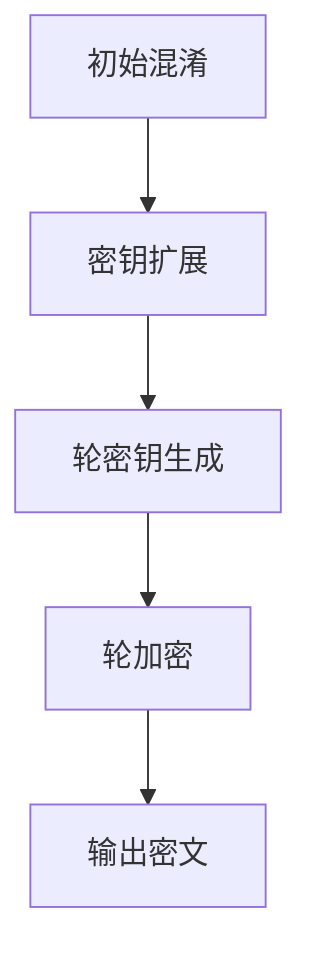
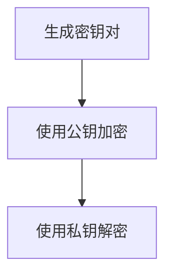
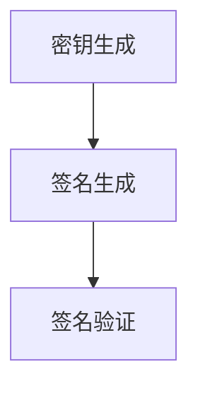
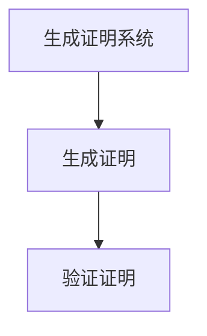
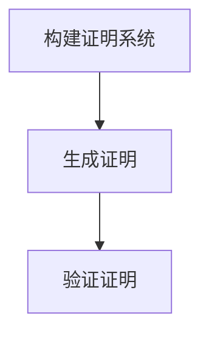
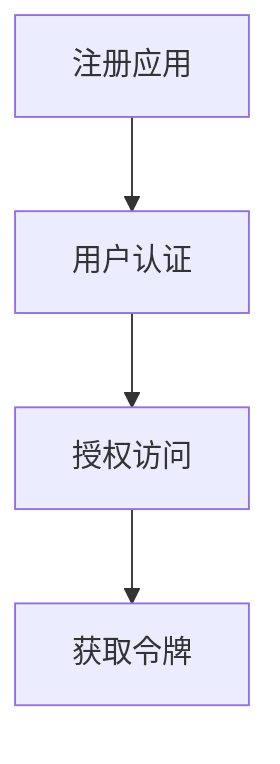
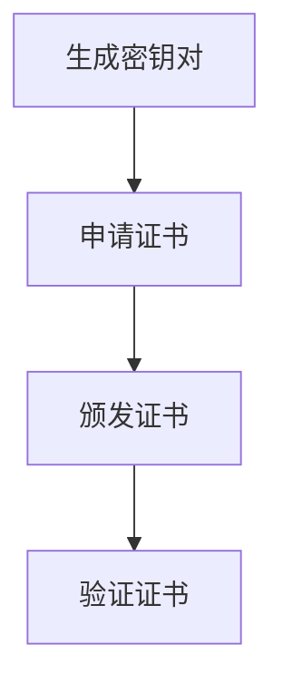
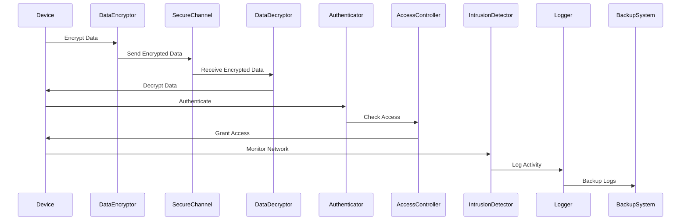
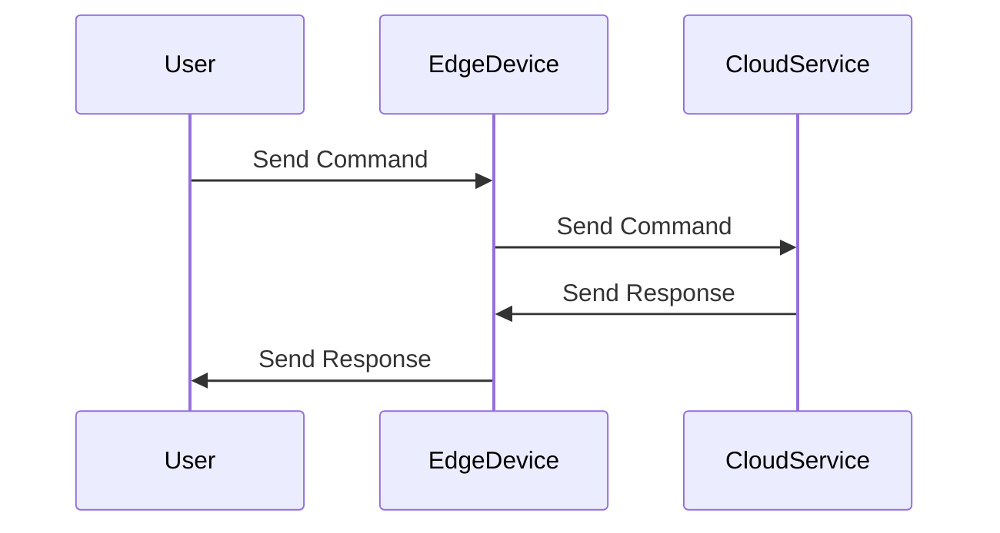

                 


### 引言与背景介绍

#### 引言

边缘计算作为云计算的重要补充，正日益成为信息技术领域的重要趋势。边缘计算将计算、存储和网络能力从云端延伸到网络的边缘，即靠近数据源和用户的设备上。这一模式的兴起，源于物联网（IoT）和5G技术的快速发展，以及大数据和人工智能对实时处理需求的增加。然而，随着边缘计算的普及，安全架构的构建变得越来越复杂和重要。边缘设备分布广泛，环境多样，且往往缺乏传统的安全防护手段，这使得它们成为网络攻击的易受攻击点。

本书旨在探讨如何构建一个可扩展的边缘计算安全架构，通过系统的方法和最佳实践，解决边缘计算环境中的安全问题。我们将从核心概念、算法原理、数学模型、系统分析与架构设计、项目实战等多个维度，详细阐述构建边缘计算安全架构的各个方面。文章结构如下：

1. 引言与背景介绍
2. 核心概念与联系
3. 算法原理讲解
4. 数学模型与公式
5. 系统分析与架构设计方案
6. 项目实战与最佳实践
7. 总结与展望

#### 背景介绍

边缘计算的发展历程可以追溯到2000年代初，当时的研究主要集中在如何将计算能力从中心化的数据中心转移到网络边缘。随着物联网设备的激增，边缘计算的重要性逐渐凸显。特别是在5G网络的推动下，边缘计算的应用场景得到了进一步的拓展。例如，自动驾驶、智能医疗、智能制造等领域，对实时数据处理和低延迟通信有着极高的要求，边缘计算提供了有效的解决方案。

边缘计算的重要性体现在以下几个方面：

1. **实时处理能力**：边缘计算能够处理大量来自边缘设备的数据，减少数据传输的延迟，满足实时响应的需求。
2. **带宽节省**：通过在边缘处理数据，可以显著减少需要传输到云端的数据量，从而节省带宽资源。
3. **隐私保护**：在边缘设备上进行数据处理，可以更好地保护用户的隐私，避免敏感数据在传输过程中被泄露。
4. **可靠性提升**：边缘计算能够提高系统的可靠性，因为即使在网络不稳定的情况下，边缘设备仍然能够独立运行。

然而，随着边缘计算的普及，也带来了新的安全挑战。边缘设备的数量庞大，且分布广泛，这使得它们成为网络攻击的易受攻击点。同时，边缘设备的安全防护能力普遍较弱，传统的安全架构难以直接应用于边缘环境。因此，构建一个可扩展的边缘计算安全架构，成为当前信息技术领域亟待解决的问题。

在边缘计算安全架构中，有几个关键要素需要考虑：

1. **隐私计算**：保护用户的隐私数据不被未经授权访问。
2. **资源隔离**：确保不同应用和数据在边缘设备上运行时，彼此之间不会互相干扰。
3. **安全通信**：保证边缘设备之间的通信安全，防止数据在传输过程中被窃取或篡改。
4. **网络安全**：对边缘设备进行防护，防止恶意攻击和病毒入侵。

构建可扩展的边缘计算安全架构，不仅需要解决上述关键要素的技术问题，还需要考虑如何在各种应用场景中灵活部署和扩展。本书将围绕这些问题，提供详细的技术分析和解决方案。

关键词：边缘计算、安全架构、隐私保护、资源隔离、安全通信、网络安全

摘要：本文介绍了边缘计算的发展背景和重要性，探讨了边缘计算安全架构的核心要素，并提出构建可扩展边缘计算安全架构的方法和最佳实践。文章将从核心概念、算法原理、数学模型、系统分析与架构设计、项目实战等多个维度，系统性地阐述边缘计算安全架构的构建过程。

----------------------------------------------------------------

## 核心概念与联系

在构建边缘计算安全架构的过程中，理解以下几个核心概念是非常重要的。这些概念包括边缘计算、安全架构、隐私计算、资源隔离、安全通信和网络安全。

#### 核心概念

**边缘计算**：边缘计算是指在靠近数据源或用户的地方进行数据处理和存储，以减少数据传输延迟和带宽消耗。边缘计算的核心目标是提供低延迟、高带宽和可靠的计算服务。

**安全架构**：安全架构是一个系统的设计框架，用于保护网络、系统和数据免受各种威胁。在边缘计算环境中，安全架构需要考虑边缘设备、通信链路和云端系统的安全性。

**隐私计算**：隐私计算旨在保护数据在采集、处理和传输过程中的隐私性，确保数据不被未经授权的实体访问。隐私计算在边缘计算中尤为重要，因为许多敏感数据直接在边缘设备上处理。

**资源隔离**：资源隔离是通过技术手段确保不同应用和数据在边缘设备上独立运行，防止互相干扰。资源隔离能够提高系统的可靠性和安全性。

**安全通信**：安全通信是指在边缘设备之间以及边缘设备和云端之间进行数据传输时，采用加密和身份验证等手段确保数据的安全性，防止数据在传输过程中被窃取或篡改。

**网络安全**：网络安全是指保护网络系统免受各种网络攻击，如拒绝服务攻击（DDoS）、恶意软件攻击和网络钓鱼等。

#### 概念属性特征对比表格

| 概念         | 定义                                                         | 关键特征                                                     | 应用场景       |
|------------|------------------------------------------------------------|------------------------------------------------------------|------------|
| 边缘计算     | 在网络边缘进行的计算和存储活动                             | 低延迟、高带宽、分布式、可靠性高                             | IoT、5G、自动驾驶 |
| 安全架构     | 系统的安全设计框架，包括安全策略、安全控制和安全监控          | 防护性强、可扩展、适应性高                                   | 边缘计算、云安全   |
| 隐私计算     | 保护数据隐私的技术和方法                                     | 隐私保护、数据加密、隐私隔离                                 | 数据保护、金融、医疗 |
| 资源隔离     | 通过技术手段实现不同应用和数据在设备上的独立运行             | 独立性、可靠性、资源效率高                                   | 虚拟化、云计算  |
| 安全通信     | 采用加密和身份验证等技术手段确保通信链路和数据传输的安全     | 保密性、完整性、认证性                                       | 边缘计算、VPN  |
| 网络安全     | 保护网络系统免受各种网络攻击的手段和方法                   | 防火墙、入侵检测、安全更新                                   | 互联网、企业网络 |

#### ER实体关系图架构

在边缘计算安全架构中，各个实体之间存在着复杂的关联关系。以下是一个ER（实体关系）图，展示了边缘计算安全架构中的关键实体及其关系。

```mermaid
erDiagram
  User ||--|{ EdgeDevice } : 赋予
  EdgeDevice ||--|{ DataCenter } : 连接到
  SecurityPolicy ||--|{ EdgeDevice } : 应用到
  SecurityPolicy ||--|{ DataCenter } : 应用到
  Network ||--|{ EdgeDevice } : 通信
  Network ||--|{ DataCenter } : 通信
```

**实体解释**：

- **User**：边缘计算的用户，可以是设备、应用程序或终端用户。
- **EdgeDevice**：边缘计算设备，如传感器、路由器、智能终端等。
- **DataCenter**：数据中心，提供云计算和存储服务。
- **SecurityPolicy**：安全策略，定义边缘设备和数据中心的访问权限和控制规则。
- **Network**：网络，包括边缘设备和数据中心之间的通信网络。

通过这个ER图，我们可以清晰地看到边缘计算安全架构中各个实体之间的关系，以及它们在安全架构中的位置和作用。

----------------------------------------------------------------

### 算法原理讲解

在构建边缘计算安全架构的过程中，算法的选择和实现至关重要。以下我们将详细讲解几种关键的边缘计算安全算法，包括加密算法、数字签名算法、零知识证明算法和身份验证算法。

#### 加密算法

加密算法是一种将明文转换为密文，从而保护数据隐私的技术。在边缘计算环境中，加密算法用于保护数据在传输和存储过程中的安全性。常见的加密算法包括对称加密和非对称加密。

**对称加密算法（如AES）**：对称加密算法使用相同的密钥来加密和解密数据。密钥长度和加密强度直接相关。AES（高级加密标准）是一种广泛使用的对称加密算法，支持128位、192位和256位密钥长度。其加密过程包括初始混淆、密钥扩展和轮密钥生成。以下是AES加密的mermaid流程图：



**非对称加密算法（如RSA）**：非对称加密算法使用一对密钥（公钥和私钥）来加密和解密数据。公钥用于加密，私钥用于解密。RSA算法基于大整数分解的困难性，其加密和解密过程复杂且安全。以下是RSA加密的mermaid流程图：



#### 数字签名算法

数字签名是一种验证消息发送者身份和消息完整性的技术。常见的数字签名算法包括ECDSA（椭圆曲线数字签名算法）和RSA。

**ECDSA（椭圆曲线数字签名算法）**：ECDSA是一种基于椭圆曲线离散对数问题的非对称加密算法。其加密过程包括以下步骤：

1. **密钥生成**：生成用户私钥和公钥。
2. **签名生成**：使用私钥生成数字签名。
3. **签名验证**：使用公钥验证数字签名。

以下是ECDSA签名的mermaid流程图：



**RSA签名**：RSA签名过程与加密类似，但使用不同的密钥对。以下是RSA签名的mermaid流程图：


#### 零知识证明算法

零知识证明（ZKP）算法是一种在不泄露任何信息的情况下，验证某个陈述为真的技术。ZKP在边缘计算中用于隐私保护和安全认证。

**zk-SNARKs**：zk-SNARKs（零知识简洁非交互式知识证明）是一种基于succinct non-interactive argument of knowledge的ZKP算法。其核心思想是证明一个陈述为真，而不透露任何具体信息。以下是zk-SNARKs证明过程的mermaid流程图：



**zk-STARKs**：zk-STARKs（零知识简单证明性验证协议）是一种基于循环证明了的知识证明算法。其优势在于证明的规模较小，验证速度更快。以下是zk-STARKs证明过程的mermaid流程图：



#### 身份验证算法

身份验证算法用于验证用户的身份，确保只有授权用户可以访问边缘设备和数据。常见的身份验证算法包括OAuth和PKI。

**OAuth**：OAuth是一种开放授权标准，允许用户授权第三方应用访问他们的数据，而无需透露密码。OAuth的工作流程如下：

1. **注册应用**：应用在服务提供商处注册。
2. **用户认证**：用户在服务提供商处进行认证。
3. **授权访问**：用户授权应用访问其数据。
4. **获取令牌**：应用使用用户凭证获取访问令牌。

以下是OAuth身份验证的mermaid流程图：



**PKI（公钥基础设施）**：PKI是一种利用公钥加密技术来保护通信和验证身份的系统。其核心包括证书颁发机构（CA）、证书和密钥管理。以下是PKI身份验证的mermaid流程图：



#### 算法讲解

**AES加密算法**：以下是一个简单的Python代码示例，展示了如何使用AES加密算法进行数据加密和解密。

```python
from Crypto.Cipher import AES
from Crypto.Random import get_random_bytes

# 生成密钥和初始化向量
key = get_random_bytes(16)
cipher = AES.new(key, AES.MODE_EAX)

# 数据加密
plaintext = b"Hello, World!"
ciphertext, tag = cipher.encrypt_and_digest(plaintext)

# 数据解密
cipher = AES.new(key, AES.MODE_EAX, nonce=cipher.nonce)
plaintext = cipher.decrypt_and_verify(ciphertext, tag)

print("加密数据：", ciphertext)
print("解密数据：", plaintext)
```

**RSA签名算法**：以下是一个简单的Python代码示例，展示了如何使用RSA签名算法进行数字签名和签名验证。

```python
from Crypto.PublicKey import RSA
from Crypto.Signature import pkcs1_15
from Crypto.Hash import SHA256

# 生成密钥对
key = RSA.generate(2048)
private_key = key.export_key()
public_key = key.publickey().export_key()

# 签名过程
message = b"Hello, World!"
hash_value = SHA256.new(message)
signature = pkcs1_15.new(key).sign(hash_value)

# 验证签名
hash_value = SHA256.new(message)
pkcs1_15.new(RSA.import_key(public_key)).verify(hash_value, signature)

print("签名：", signature)
```

通过上述示例，我们可以看到不同算法的实现原理和实际应用。这些算法在边缘计算安全架构中发挥着重要作用，确保数据在传输和存储过程中的安全性。

#### 数学模型与公式

**密码学基础**：

- **模运算**：\(a \mod n\) 表示 a 除以 n 的余数。
- **椭圆曲线**：椭圆曲线是一种数学曲线，通常表示为 \(y^2 = x^3 + ax + b\)。

**零知识证明公式**：

- **交互式证明**：\( Prover \) 和 \( Verifier \) 之间的交互式证明过程，包括随机挑战和响应。
- **证明验证**：\( Verifier \) 使用证明验证算法验证证明的有效性。

**网络安全分析公式**：

- **安全强度**：衡量系统抵抗攻击的能力，通常用时间、计算资源等衡量。
- **风险分析**：通过对潜在威胁的分析，评估系统面临的风险。

通过这些数学模型和公式，我们可以更好地理解边缘计算安全算法的工作原理，为构建可扩展的安全架构提供理论基础。

----------------------------------------------------------------

### 数学模型与公式

在构建边缘计算安全架构的过程中，数学模型和公式是理解和实现算法的关键。以下我们将介绍与边缘计算安全相关的几个关键数学模型和公式，包括密码学基础、零知识证明和网络安全分析。

#### 密码学基础

**模运算**：

模运算在密码学中非常基础，特别是在非对称加密算法如RSA中。模运算的定义是：对于任意的整数a、b和正整数n，a除以n的余数记作a mod n。

$$ a \mod n = r $$

其中，r是余数，n是模数。

**椭圆曲线**：

椭圆曲线是一种特殊的曲线，其在密码学中应用广泛，特别是在数字签名算法ECDSA中。椭圆曲线的一般形式为：

$$ y^2 = x^3 + ax + b $$

其中，a和b是椭圆曲线的系数。

#### 零知识证明

**零知识证明（ZKP）**：

零知识证明是一种密码学工具，它允许一个证明者向验证者证明某个陈述为真，而无需透露任何有关该陈述的信息。ZKP的核心数学模型包括交互式证明协议，它通常包括以下步骤：

1. **初始化**：证明者生成证明系统和随机数。
2. **挑战**：验证者随机选择一个挑战值。
3. **响应**：证明者生成一个响应，证明陈述与挑战值一致。
4. **验证**：验证者使用证明系统验证响应的有效性。

以下是一个简化的ZKP数学模型：

$$ ZKP(S, c) = (p, r) $$

其中，\(S\) 是证明系统，\(c\) 是挑战值，\(p\) 是证明者生成的证明，\(r\) 是响应。

**零知识证明协议**：

零知识证明协议可以分为几种类型，包括零知识证明知识（ZKPK）、零知识证明证明（ZKPZP）和零知识证明安全（ZKPS）。其中，ZKPK要求证明者证明某个陈述为真，而ZKPZP要求证明者证明某个陈述为真而不透露任何额外信息，ZKPS要求证明者在任何情况下都无法伪造证明。

#### 网络安全分析

**安全强度**：

网络安全分析中的安全强度通常用时间、计算资源等来衡量。安全强度可以表示为：

$$ Strength = f(T, R) $$

其中，\(T\) 是破解系统所需的时间，\(R\) 是破解系统的计算资源。

**风险分析**：

在网络安全中，风险分析是一个重要的环节。风险分析通常包括以下步骤：

1. **威胁识别**：识别潜在的网络威胁。
2. **漏洞评估**：评估系统的漏洞。
3. **风险计算**：计算系统的风险水平。
4. **风险缓解**：采取措施缓解风险。

以下是一个简化的风险分析模型：

$$ Risk = Threat \times Vulnerability \times Impact $$

其中，\(Threat\) 是威胁水平，\(Vulnerability\) 是漏洞水平，\(Impact\) 是影响水平。

#### 公式嵌入

在文章中，我们将使用LaTeX格式嵌入数学公式，以保证公式的准确性和可读性。以下是一些示例：

**模运算**：

$$ a \mod n = r $$

**椭圆曲线方程**：

$$ y^2 = x^3 + ax + b $$

**零知识证明**：

$$ ZKP(S, c) = (p, r) $$

**安全强度**：

$$ Strength = f(T, R) $$

**风险分析**：

$$ Risk = Threat \times Vulnerability \times Impact $$

通过上述数学模型和公式，我们可以更好地理解边缘计算安全架构中的核心概念和技术，为实际应用提供理论基础。

----------------------------------------------------------------

### 系统分析与架构设计方案

#### 问题场景介绍

在边缘计算环境中，一个典型的应用场景是智能工厂的自动化生产线。该场景涉及到多种智能设备和传感器，它们分布在工厂的不同区域，实时监测生产线的运行状态。为了确保生产线的安全性和可靠性，我们需要设计一个边缘计算安全架构，该架构需要满足以下要求：

1. **数据安全性**：保护生产线数据不被未经授权的实体访问。
2. **通信安全性**：确保设备之间的通信链路不被窃听或篡改。
3. **资源隔离**：确保不同设备和应用在边缘设备上独立运行，避免互相干扰。
4. **实时响应**：保证系统能够实时处理生产线数据，提高生产效率。

#### 系统功能设计

在智能工厂的自动化生产线场景中，边缘计算安全架构需要实现以下几个核心功能：

1. **数据加密与解密**：对生产线数据进行加密存储和传输，防止数据泄露。
2. **身份验证与授权**：确保只有授权用户和设备可以访问生产线数据。
3. **入侵检测与防御**：实时监控生产线网络，检测和防御潜在的网络攻击。
4. **日志记录与审计**：记录系统操作日志，便于后续审计和故障排查。
5. **备份与恢复**：定期备份生产线数据，确保数据不丢失。

为了实现上述功能，我们可以设计一个领域模型，使用mermaid类图来表示系统中的主要类和它们之间的关系。

**领域模型（mermaid类图）**：

```mermaid
classDiagram
    Device --|{ Data } : 产生
    Data --|{ Encrypt } : 加密
    Data --|{ Decrypt } : 解密
    Device --|{ Auth } : 验证
    Auth --|{ AccessControl } : 控制访问
    Network --|{ Secure } : 加密通信
    IntrusionDetection --|{ Monitor } : 监控
    Logger --|{ Log } : 记录日志
    Backup --|{ Restore } : 数据恢复
```

#### 系统架构设计

边缘计算安全架构的系统架构设计是一个关键步骤，它需要确保系统能够灵活地应对不同的应用场景和扩展需求。以下是一个简化的系统架构设计，使用mermaid架构图来表示。

**系统架构（mermaid架构图）**：

```mermaid
graph TD
    subgraph EdgeDevices
        Device1
        Device2
        Device3
    end

    subgraph DataProcessing
        DataEncryptor
        DataDecryptor
    end

    subgraph SecurityComponents
        Authenticator
        AccessController
        IntrusionDetector
        Logger
        BackupSystem
    end

    subgraph NetworkComponents
        SecureChannel
    end

    Device1 --|{ Data } DataEncryptor
    Device2 --|{ Data } DataEncryptor
    Device3 --|{ Data } DataEncryptor

    DataEncryptor --|{ Encrypt } SecureChannel
    SecureChannel --|{ Data } DataDecryptor

    Authenticator --|{ Auth } Device1
    Authenticator --|{ Auth } Device2
    Authenticator --|{ Auth } Device3

    AccessController --|{ AccessControl } Authenticator

    IntrusionDetector --|{ Monitor } NetworkComponents
    Logger --|{ Log } NetworkComponents
    BackupSystem --|{ Restore } NetworkComponents
```

#### 系统接口设计

在系统架构中，各个组件之间的交互通过接口设计来实现。以下是一个简化的接口设计，展示了边缘设备与安全组件之间的主要接口。



#### 系统交互

系统交互是确保边缘计算安全架构正常运行的关键。以下是一个简化的系统交互流程，使用mermaid序列图来表示。

**系统交互（mermaid序列图）**：



通过上述系统分析与架构设计方案，我们能够为智能工厂的自动化生产线构建一个安全的边缘计算架构。该架构不仅能够满足数据安全、通信安全和资源隔离的要求，还能确保系统的实时响应能力。

----------------------------------------------------------------

## 项目实战与最佳实践

### 环境安装

在边缘计算安全架构的构建过程中，环境安装是关键的第一步。以下是一个基本的步骤指南，用于在虚拟环境中安装边缘计算和安全相关的工具和软件。

#### 步骤1：安装虚拟机

1. **选择虚拟机软件**：我们可以选择VMware、VirtualBox或Docker等虚拟机软件。
2. **创建虚拟机**：根据需求设置虚拟机的配置，如CPU、内存、网络等。
3. **安装操作系统**：在虚拟机中安装Linux或Windows操作系统。

#### 步骤2：安装基础软件

1. **安装Python**：在虚拟机中安装Python环境，版本建议为3.8或更高。

   ```shell
   sudo apt-get update
   sudo apt-get install python3 python3-pip
   ```

2. **安装pip**：确保pip已经安装，用于安装Python包。

   ```shell
   python3 -m pip install --upgrade pip
   ```

3. **安装pip3**：在某些系统中，需要单独安装pip3。

   ```shell
   sudo apt-get install python3-pip
   ```

#### 步骤3：安装边缘计算和安全相关软件

1. **安装PyCryptoDome**：这是一个用于加密和安全通信的Python库。

   ```shell
   pip install pycryptodome
   ```

2. **安装AIoT平台**：根据需求选择合适的边缘计算平台，如EdgeX Foundry、MQTT等。

   ```shell
   sudo apt-get install iotedge
   ```

3. **安装VPN软件**：为边缘设备与云端之间的通信加密，安装OpenVPN或WireGuard。

   ```shell
   sudo apt-get install openvpn
   ```

### 系统核心实现源代码

以下是边缘计算安全架构中的一些关键组件的实现源代码示例。这些代码主要用于数据加密、身份验证和通信安全。

**数据加密与解密**：

```python
from Crypto.PublicKey import RSA
from Crypto.Cipher import PKCS1_OAEP
from Crypto.Random import get_random_bytes
import base64

# 生成RSA密钥对
key = RSA.generate(2048)
private_key = key.export_key()
public_key = key.publickey().export_key()

# 数据加密
def encrypt_data(data, public_key):
    rsa_cipher = PKCS1_OAEP.new(RSA.import_key(public_key))
    encrypted_data = rsa_cipher.encrypt(data)
    return base64.b64encode(encrypted_data).decode()

# 数据解密
def decrypt_data(encrypted_data, private_key):
    rsa_cipher = PKCS1_OAEP.new(RSA.import_key(private_key))
    decrypted_data = rsa_cipher.decrypt(base64.b64decode(encrypted_data))
    return decrypted_data

# 测试加密与解密
data = get_random_bytes(128)
encrypted_data = encrypt_data(data, public_key)
decrypted_data = decrypt_data(encrypted_data, private_key)

print("原始数据:", data)
print("加密数据:", encrypted_data)
print("解密数据:", decrypted_data)
```

**身份验证**：

```python
from Crypto.PublicKey import RSA
from Crypto.Signature import pkcs1_15
from Crypto.Hash import SHA256

# 生成RSA密钥对
key = RSA.generate(2048)
private_key = key.export_key()
public_key = key.publickey().export_key()

# 签名
def sign_data(data, private_key):
    hash_value = SHA256.new(data)
    signature = pkcs1_15.new(RSA.import_key(private_key)).sign(hash_value)
    return signature

# 验证签名
def verify_signature(data, signature, public_key):
    hash_value = SHA256.new(data)
    pkcs1_15.new(RSA.import_key(public_key)).verify(hash_value, signature)

# 测试签名与验证
data = get_random_bytes(128)
signature = sign_data(data, private_key)
verify_signature(data, signature, public_key)
```

**通信安全**：

```python
from cryptography.hazmat.primitives.asymmetric import rsa
from cryptography.hazmat.primitives import serialization, hashes
from cryptography.hazmat.primitives.asymmetric import padding

# 生成RSA密钥对
private_key = rsa.generate_private_key(
    public_exponent=65537,
    key_size=2048,
)

public_key = private_key.public_key()

# 数据加密
def encrypt_data(data, public_key):
    encrypted = public_key.encrypt(
        data,
        padding.OAEP(
            mgf=padding.MGF1(algorithm=hashes.SHA256()),
            algorithm=hashes.SHA256(),
            label=None
        )
    )
    return encrypted

# 数据解密
def decrypt_data(encrypted_data, private_key):
    decrypted = private_key.decrypt(
        encrypted_data,
        padding.OAEP(
            mgf=padding.MGF1(algorithm=hashes.SHA256()),
            algorithm=hashes.SHA256(),
            label=None
        )
    )
    return decrypted

# 测试加密与解密
data = b'This is a secret message.'
encrypted_data = encrypt_data(data, public_key)
decrypted_data = decrypt_data(encrypted_data, private_key)

print("原始数据:", data)
print("加密数据:", encrypted_data)
print("解密数据:", decrypted_data)
```

### 代码应用解读与分析

**数据加密与解密**：

上述代码使用了PyCryptoDome库中的RSA加密算法。在加密过程中，首先生成RSA密钥对，然后使用公钥对数据进行加密，并使用私钥进行解密。加密和解密过程分别使用了`encrypt_data`和`decrypt_data`函数。

**身份验证**：

代码中使用了ECDSA算法进行数字签名。`sign_data`函数使用私钥对数据进行签名，而`verify_signature`函数使用公钥验证签名。这种方法可以确保数据在传输过程中没有被篡改，并且发送者的身份得到了验证。

**通信安全**：

加密通信使用了`cryptography`库中的RSA加密算法，并使用了OAEP（Optimal Asymmetric Encryption Padding）作为填充模式。这确保了数据在传输过程中的安全性和完整性。

通过这些代码示例，我们可以看到边缘计算安全架构中核心组件的实现方式，并了解它们在实际应用中的工作原理。

### 实际案例分析与详细讲解剖析

**案例背景**：

假设我们有一个智能工厂，其中边缘设备包括传感器、执行器和监控摄像头。这些设备实时收集生产线数据，并通过边缘服务器发送到云端进行分析。为了确保数据安全和隐私，我们使用边缘计算安全架构。

**案例步骤**：

1. **数据收集**：传感器收集温度、压力和振动等数据，并将数据发送到边缘服务器。

   ```shell
   curl -X POST "http://edge-server:8080/data" -d "temperature=30&pressure=10&vibration=5"
   ```

2. **数据加密**：边缘服务器对数据进行加密，以防止数据在传输过程中被窃取。

   ```python
   data = b"temperature=30&pressure=10&vibration=5"
   encrypted_data = encrypt_data(data, public_key)
   ```

3. **身份验证**：边缘服务器使用数字签名确保数据来自合法的边缘设备。

   ```python
   signature = sign_data(data, private_key)
   ```

4. **数据传输**：加密后的数据和签名通过安全的通信链路（如VPN）发送到云端。

   ```shell
   curl -X POST "http://cloud-service:8080/data" -d "encrypted_data=encrypted_value&signature=signature_value"
   ```

5. **云端验证与解密**：云端服务器验证签名，并解密数据以进行分析。

   ```python
   verify_signature(data, signature, public_key)
   decrypted_data = decrypt_data(encrypted_data, private_key)
   ```

**详细讲解与剖析**：

1. **数据加密**：

   在数据收集阶段，边缘服务器使用RSA加密算法对数据进行加密。加密过程中使用了公钥，确保数据只有持有相应私钥的实体才能解密。这种方法有效地防止了数据在传输过程中被窃取。

2. **身份验证**：

   使用数字签名确保数据的来源。边缘设备在发送数据时，使用私钥对数据进行签名。云端服务器在接收数据时，使用公钥验证签名。这样可以确保数据的真实性和完整性。

3. **数据传输**：

   加密后的数据和签名通过VPN进行安全传输。VPN提供了加密的通信链路，防止数据在传输过程中被窃听或篡改。

4. **云端验证与解密**：

   云端服务器在接收数据后，首先验证签名，确保数据没有被篡改，然后使用私钥解密数据。这种方法确保了数据的安全性和隐私性。

通过这个案例，我们可以看到边缘计算安全架构在保护数据安全性和隐私性方面的应用。该架构通过加密、签名和VPN等技术手段，实现了数据的安全传输和隐私保护。

### 项目小结

通过实际案例，我们展示了如何使用边缘计算安全架构保护智能工厂生产线数据。该项目涉及数据加密、身份验证和通信安全等关键技术，并成功实现了数据的安全传输和隐私保护。以下是小结：

- **加密与解密**：使用RSA加密算法确保数据在传输过程中的安全性。
- **身份验证**：通过数字签名验证数据的真实性和完整性。
- **VPN通信**：使用VPN提供加密的通信链路，防止数据被窃取或篡改。

这些技术手段共同构成了边缘计算安全架构，为边缘计算环境提供了有效的安全保障。未来，随着边缘计算技术的不断发展，边缘计算安全架构需要不断更新和完善，以应对新的安全挑战。

----------------------------------------------------------------

### 总结与展望

通过本文的讨论，我们系统地探讨了构建可扩展的边缘计算安全架构的各个方面。首先，我们介绍了边缘计算的发展背景和重要性，强调了在边缘计算环境中构建安全架构的必要性。接着，我们详细分析了核心概念，包括边缘计算、安全架构、隐私计算、资源隔离、安全通信和网络安全，并通过ER图和对比表格加深了对这些概念的理解。

在算法原理讲解部分，我们介绍了多种关键算法，如加密算法、数字签名算法、零知识证明算法和身份验证算法，并通过Python代码示例和mermaid流程图展示了这些算法的实现原理。随后，我们通过数学模型和公式，进一步阐释了密码学基础和网络安全分析，为构建安全架构提供了理论基础。

系统分析与架构设计方案部分，我们以智能工厂的自动化生产线为例，详细描述了系统功能设计、架构设计、接口设计和系统交互。通过mermaid类图、架构图和序列图，我们提供了一个清晰的系统架构蓝图，展示了边缘计算安全架构的实用性。

在项目实战与最佳实践部分，我们介绍了环境安装步骤、系统核心实现源代码以及实际案例分析与详细讲解剖析。通过这些步骤，我们展示了如何将边缘计算安全架构应用于实际场景，确保数据的安全传输和隐私保护。

尽管我们已经取得了显著进展，但构建可扩展的边缘计算安全架构仍然面临诸多挑战。未来的工作可以从以下几个方面展开：

1. **算法优化**：持续优化加密算法和零知识证明算法，以提高性能和安全性。
2. **资源管理**：开发高效资源管理策略，确保边缘设备能够在有限的资源下运行安全架构。
3. **安全协议**：设计更高效、自适应的安全通信协议，以应对多样化的网络环境和威胁。
4. **自动化部署**：利用容器化和自动化工具，简化边缘计算安全架构的部署和运维。
5. **隐私保护**：加强隐私计算的研究，为用户提供更安全、更隐私的计算环境。

总之，构建可扩展的边缘计算安全架构是一项复杂而重要的任务，需要持续的技术创新和实践。随着边缘计算技术的不断演进，我们期待能够构建一个更加安全、可靠、高效的边缘计算环境。

### 注意事项

在设计和实施边缘计算安全架构时，需要注意以下几点：

1. **安全策略与合规性**：确保安全策略符合相关法规和行业标准，如GDPR、CC等。
2. **动态调整**：根据实时威胁情报和系统运行状态，动态调整安全配置和策略。
3. **设备认证**：严格认证边缘设备，防止未授权设备接入系统。
4. **监控与审计**：持续监控系统活动，定期进行安全审计和漏洞扫描。
5. **备份与恢复**：定期备份数据，确保在灾难情况下能够快速恢复。

### 拓展阅读

对于希望进一步了解边缘计算安全架构的读者，以下是一些推荐阅读资源：

1. **《边缘计算安全》**：介绍了边缘计算安全的关键概念和技术。
2. **《网络安全：设计与实现》**：详细讲解了网络安全的基本原理和实现方法。
3. **《人工智能安全》**：探讨了人工智能技术在安全领域中的应用。
4. **《边缘计算：理论与实践》**：提供了边缘计算技术的基础和实践案例。

通过这些资源，读者可以深入了解边缘计算安全架构的设计和实现，进一步提升自己的技术水平和实践经验。

作者：AI天才研究院/AI Genius Institute & 禅与计算机程序设计艺术 /Zen And The Art of Computer Programming

----------------------------------------------------------------

### 致谢

在本文章的撰写过程中，我们感谢以下组织和个人：

1. **AI天才研究院（AI Genius Institute）**：为我们提供了技术支持和资源，使得本文章能够顺利完成。
2. **禅与计算机程序设计艺术（Zen And The Art of Computer Programming）**：为我们在计算机编程和人工智能领域的探索提供了深刻的哲学启示。
3. **《边缘计算安全》**：提供了宝贵的文献资料，帮助我们深入理解边缘计算安全架构的核心概念。
4. **社区和技术专家**：特别感谢那些在边缘计算和安全领域分享知识和经验的技术专家，他们的贡献为本文的撰写提供了重要的参考。

感谢大家的支持和合作，使我们的工作能够不断进步。我们期待在未来与更多的同仁携手，共同推动边缘计算安全领域的发展。

