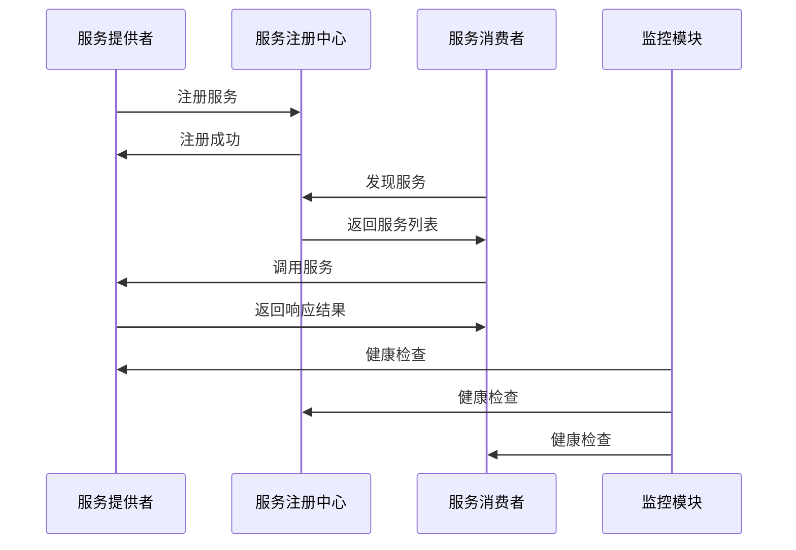
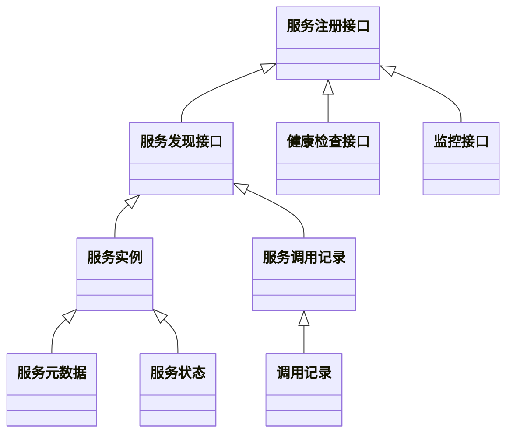
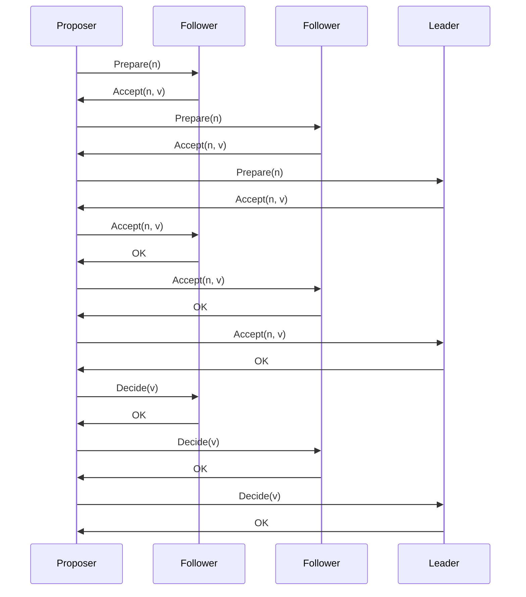
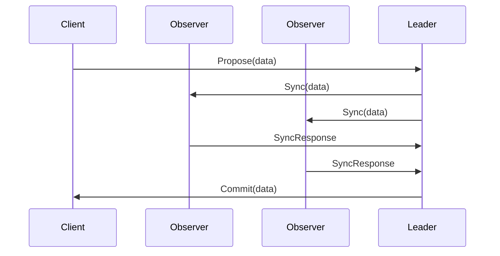
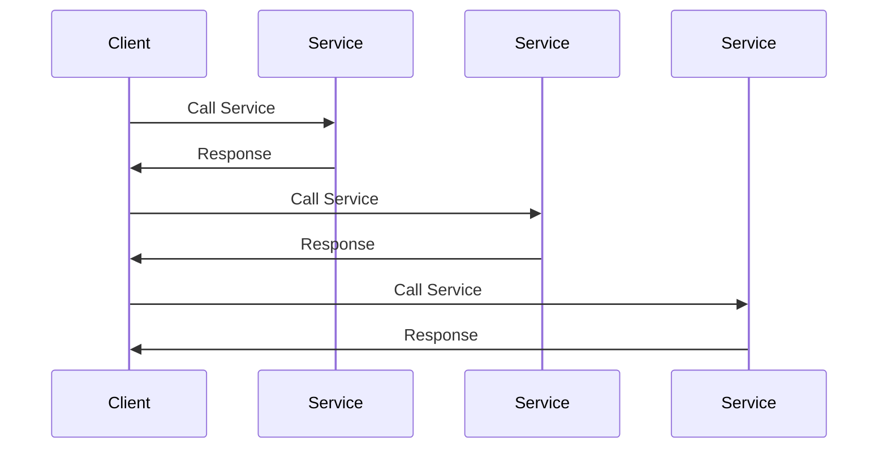
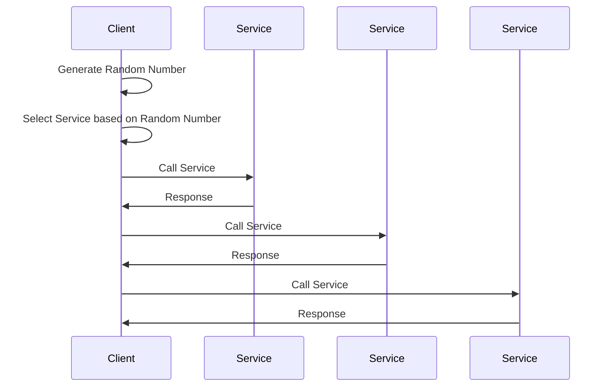
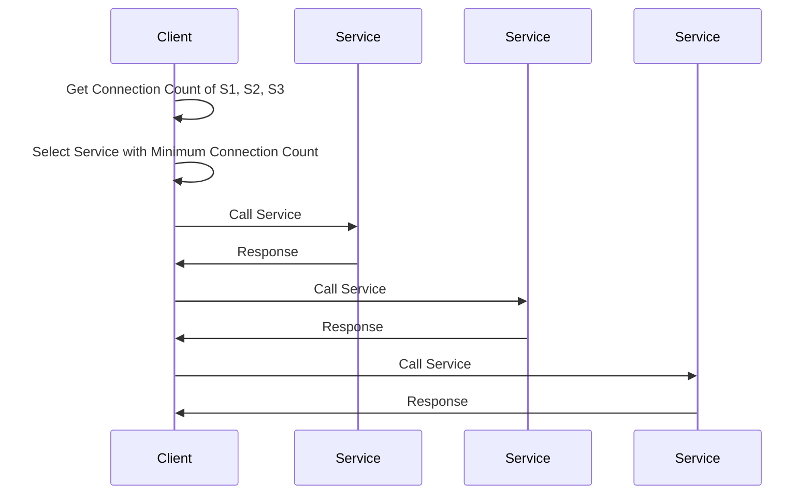
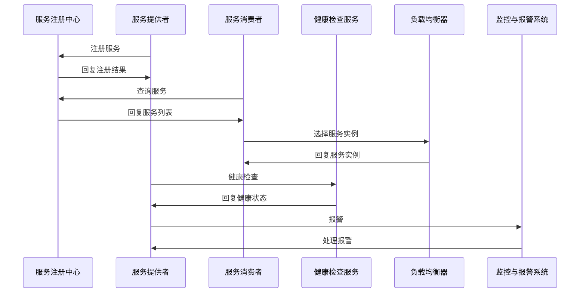
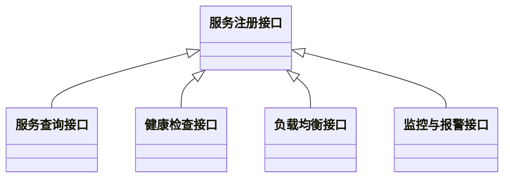
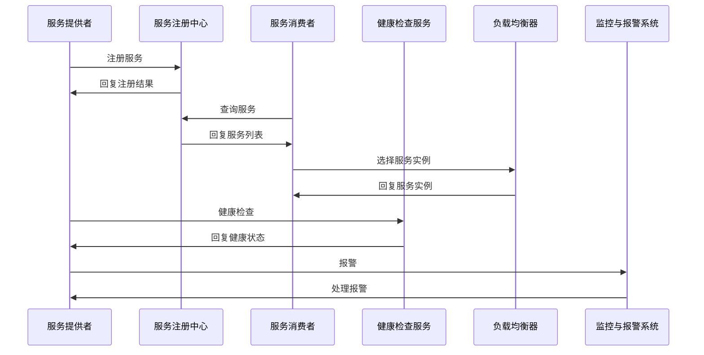

                 

# 构建可靠的服务注册与发现系统

## 关键词

服务注册与发现、分布式系统、可靠性、一致性、负载均衡、高可用性

## 摘要

本文将深入探讨如何构建一个可靠的服务注册与发现系统。我们将从背景介绍开始，分析传统服务注册与发现机制的问题，并提出解决思路。接着，我们将详细讲解核心概念与算法原理，包括一致性算法和负载均衡算法。随后，通过对比表格和ER实体关系图，我们将展示服务注册与发现系统的概念结构和核心要素。然后，我们将介绍系统分析与架构设计方案，包括项目介绍、系统功能设计、系统架构设计、系统接口设计和系统交互。最后，我们将通过一个实际项目实战，展示如何实现一个可靠的服务注册与发现系统，并提供最佳实践和项目小结。

## 第一部分：引言

### 第1章：背景介绍

#### 1.1 问题背景

#### 1.1.1 服务注册与发现的概念

在分布式系统中，服务注册与发现是一个核心概念。服务注册是指服务提供者在启动时向服务注册中心注册自身信息，包括服务名称、接口地址、端口、版本号等。服务发现是指服务消费者从服务注册中心查询可用服务信息，并选择一个服务实例进行调用。

#### 1.1.2 服务注册与发现的重要性

服务注册与发现机制对于分布式系统的可靠性、容错性和伸缩性至关重要。它能够提高系统的可靠性，通过动态地监控服务节点的状态，保证系统在节点故障时能够快速地恢复。它还能够提高系统的容错性，通过数据一致性协议，确保服务调用过程中的数据准确性。此外，服务注册与发现机制还能够提高系统的伸缩性，支持动态地添加和移除服务节点。

#### 1.2 问题描述

#### 1.2.1 传统服务注册与发现的问题

传统服务注册与发现机制存在如下问题：

1. **单点故障**：如果服务注册中心存在单点故障，整个系统将无法正常运行。
2. **数据一致性**：服务注册与发现机制需要保证注册信息的一致性，否则可能导致服务调用失败。
3. **高延迟**：服务调用时，需要查询服务注册中心，可能导致较高的延迟。

#### 1.2.2 构建可靠的服务注册与发现系统的必要性

为了解决上述问题，我们需要构建一个可靠的服务注册与发现系统。这个系统需要具备高可用性、数据一致性和低延迟等特点。

#### 1.3 问题解决

#### 1.3.1 架构设计思路

构建可靠的服务注册与发现系统，可以从以下几个方面进行设计：

1. **分布式架构**：使用分布式架构，避免单点故障。
2. **一致性协议**：采用一致性协议，保证数据一致性。
3. **缓存机制**：引入缓存机制，降低查询延迟。

#### 1.4 边界与外延

#### 1.4.1 边界条件

1. **服务类型**：系统支持多种类型的服务，如RESTful API、RPC服务等。
2. **网络环境**：系统需要适应不同网络环境，如内网、外网等。

#### 1.4.2 外延

1. **容错机制**：在服务节点出现故障时，系统能够自动切换到其他节点。
2. **监控与报警**：系统具备监控与报警功能，及时发现并处理问题。

#### 1.5 概念结构与核心要素组成

#### 1.5.1 概念结构

服务注册与发现系统由以下几个核心组件构成：

1. **服务注册中心**：负责服务信息的存储和管理。
2. **服务提供者**：提供服务的节点，负责向注册中心注册自身信息。
3. **服务消费者**：调用服务的节点，负责从注册中心发现可用服务。

#### 1.5.2 核心要素组成

1. **服务元数据**：包括服务名称、接口地址、端口、版本号等。
2. **服务状态**：包括服务是否在线、负载情况等。

#### 1.6 本章小结

本章介绍了构建可靠的服务注册与发现系统的背景、问题解决思路、边界与外延以及核心概念。接下来，我们将进一步深入探讨服务注册与发现系统的核心概念、算法原理、系统设计与实现等内容。

## 第二部分：核心概念与算法原理

### 第2章：核心概念与算法原理

#### 2.1 核心概念

#### 2.1.1 服务注册与发现的基本概念

1. **服务注册**：服务提供者在启动时向服务注册中心注册自身信息，包括服务名称、接口地址、端口、版本号等。
2. **服务发现**：服务消费者从服务注册中心查询可用服务信息，并选择一个服务实例进行调用。

#### 2.1.2 服务注册与发现的关键算法

1. **一致性算法**：保证服务注册与发现系统的数据一致性。
2. **负载均衡算法**：根据服务实例的负载情况，选择合适的实例进行调用。

### 2.2 算法原理讲解

#### 2.2.1 一致性算法

1. **Paxos算法**：Paxos算法是一种一致性算法，用于在分布式系统中达成一致。

    Paxos算法通过一个称为提案（Proposal）的机制，确保分布式系统中多个副本在某个值上达成一致。Paxos算法主要分为三个阶段：准备阶段（Prepare phase）、接受阶段（Accept phase）和决意阶段（Decide phase）。

    $$ 
    \text{Paxos算法} = \left\{
    \begin{aligned}
    &\text{Prepare}(\text{value}) \\
    &\text{Accept}(\text{value}) \\
    &\text{Decide}(\text{value}) \\
    \end{aligned}
    \right.
    $$

    - **准备阶段**：提议者（Proposer）向大多数副本发送Prepare请求，副本返回其已经接受的最小提案编号和值。
    - **接受阶段**：提议者根据副本返回的信息，选择一个最大的提案编号，并向副本发送Accept请求。
    - **决意阶段**：当大多数副本接受了这个提案，提议者将这个提案的值作为最终结果，发送给所有副本。

2. **Zab算法**：Zab算法是Zookeeper的一致性算法，基于Paxos算法实现。

    Zab算法通过同步操作，保证Zookeeper中的数据一致性。Zookeeper中的数据存储在ZAB数据模型中，包括数据节点、会话和集群状态。

    $$ 
    \text{Zab算法} = \left\{
    \begin{aligned}
    &\text{Sync}(\text{data}) \\
    &\text{Propose}(\text{data}) \\
    &\text{Commit}(\text{data}) \\
    \end{aligned}
    \right.
    $$

    - **同步操作**：Zookeeper中的副本通过同步操作，确保所有副本的数据一致性。
    - **提议操作**：客户端向Zookeeper发送数据提议，Zookeeper将提议发送给所有副本。
    - **提交操作**：当大多数副本同意提交提议，Zookeeper将提议写入日志，并更新数据节点。

#### 2.2.2 负载均衡算法

1. **轮询算法**：轮询算法按照顺序选择服务实例进行调用。

    轮询算法简单高效，但可能导致某些实例的负载不均。

    $$ 
    \text{RoundRobin} = \left\{
    \begin{aligned}
    &\text{next()} \\
    \end{aligned}
    \right.
    $$

    - **next()**：返回下一个服务实例。

2. **随机算法**：随机算法随机选择服务实例进行调用。

    随机算法能够避免某些实例的负载过高，但可能导致某些实例长时间未被调用。

    $$ 
    \text{Random} = \left\{
    \begin{aligned}
    &\text{rand()} \\
    \end{aligned}
    \right.
    $$

    - **rand()**：返回一个随机服务实例。

3. **最小连接数算法**：选择当前连接数最少的服务实例进行调用。

    最小连接数算法能够确保服务实例的负载均衡，但可能导致某些实例的连接数过低。

    $$ 
    \text{LeastConnections} = \left\{
    \begin{aligned}
    &\text{minConn()} \\
    \end{aligned}
    \right.
    $$

    - **minConn()**：返回当前连接数最少的服务实例。

### 2.3 概念属性特征对比表格

#### 2.3.1 服务注册中心

| 名称 | 描述 | 优点 | 缺点 |
| --- | --- | --- | --- |
| Eureka | 基于RESTful API的服务注册与发现系统 | 支持高可用性、易于集成 | 存储容量有限、不支持动态配置 |
| Zookeeper | 分布式服务注册与发现系统 | 高可用性、支持动态配置 | 高复杂度、性能较低 |
| Consul | 分布式服务发现与配置中心 | 支持健康检查、低延迟 | 存储容量有限、不支持动态配置 |

#### 2.3.2 服务注册与发现算法

| 名称 | 描述 | 优点 | 缺点 |
| --- | --- | --- | --- |
| Paxos | 分布式一致性算法 | 保证数据一致性 | 高复杂度、性能较低 |
| Zab | Zookeeper一致性算法 | 保证数据一致性 | 高复杂度、性能较低 |
| 轮询算法 | 按顺序选择服务实例 | 简单高效 | 负载不均 |
| 随机算法 | 随机选择服务实例 | 避免负载过高 | 长时间未被调用 |
| 最小连接数算法 | 选择连接数最少的服务实例 | 负载均衡 | 连接数过低 |

### 2.4 ER实体关系图架构

```mermaid
erDiagram
  服务注册中心 ||--|{ 服务提供者 }||> 服务实例
  服务注册中心 ||--|{ 服务消费者 }||> 服务调用记录
  服务提供者 ||--|{ 服务元数据 }||> 服务状态
  服务消费者 ||--|{ 调用记录 }||> 服务实例
```

## 第三部分：系统分析与架构设计方案

### 第3章：系统分析与架构设计方案

#### 3.1 项目介绍

本项目旨在构建一个可靠的服务注册与发现系统，支持多种类型的服务，如RESTful API、RPC服务等。系统具备高可用性、数据一致性和低延迟等特点。

#### 3.2 系统功能设计

系统主要包含以下功能模块：

1. **服务注册**：服务提供者向服务注册中心注册自身信息。
2. **服务发现**：服务消费者从服务注册中心查询可用服务信息。
3. **健康检查**：定期检查服务实例的健康状态，确保系统的高可用性。
4. **负载均衡**：根据服务实例的负载情况，选择合适的实例进行调用。
5. **监控与报警**：实时监控系统状态，及时发现并处理问题。

#### 3.3 系统架构设计

系统采用分布式架构，包括服务注册中心、服务提供者、服务消费者和监控模块。



#### 3.4 系统接口设计

系统接口设计包括服务注册接口、服务发现接口、健康检查接口和监控接口。



#### 3.5 系统交互设计

系统交互设计展示服务注册、服务发现、健康检查和监控等模块之间的交互过程。


## 第四部分：项目实战

### 第4章：项目实战

#### 4.1 环境安装

在开始项目实战之前，我们需要安装以下软件和工具：

1. **Java Development Kit (JDK)**：版本要求为 1.8 或以上。
2. **Maven**：版本要求为 3.6.3 或以上。
3. **Eureka**：版本要求为 1.9.8。
4. **Consul**：版本要求为 1.8.5。
5. **Zookeeper**：版本要求为 3.6.0。

安装过程如下：

1. 安装 JDK：在官网下载 JDK 安装包，并按照提示进行安装。
2. 安装 Maven：在官网下载 Maven 安装包，并解压到指定目录。
3. 安装 Eureka：在官网下载 Eureka 安装包，并解压到指定目录。
4. 安装 Consul：在官网下载 Consul 安装包，并解压到指定目录。
5. 安装 Zookeeper：在官网下载 Zookeeper 安装包，并解压到指定目录。

#### 4.2 系统核心实现源代码

以下是系统核心实现源代码，包括服务注册、服务发现、健康检查和监控等模块。

```java
// 服务注册
public class ServiceRegistry {
    private ServiceRegistryCenter registryCenter;
    
    public ServiceRegistry(ServiceRegistryCenter registryCenter) {
        this.registryCenter = registryCenter;
    }
    
    public void register(Service service) {
        registryCenter.registerService(service);
    }
}

// 服务发现
public class ServiceDiscovery {
    private ServiceRegistryCenter registryCenter;
    
    public ServiceDiscovery(ServiceRegistryCenter registryCenter) {
        this.registryCenter = registryCenter;
    }
    
    public Service findService(String serviceName) {
        return registryCenter.discoveryService(serviceName);
    }
}

// 健康检查
public class HealthChecker {
    private ServiceRegistryCenter registryCenter;
    
    public HealthChecker(ServiceRegistryCenter registryCenter) {
        this.registryCenter = registryCenter;
    }
    
    public void checkHealth(Service service) {
        registryCenter.checkHealth(service);
    }
}

// 监控
public class Monitor {
    private ServiceRegistryCenter registryCenter;
    
    public Monitor(ServiceRegistryCenter registryCenter) {
        this.registryCenter = registryCenter;
    }
    
    public void monitor(Service service) {
        registryCenter.monitorService(service);
    }
}
```

#### 4.3 代码应用解读与分析

以下是代码应用解读与分析，包括服务注册、服务发现、健康检查和监控等模块的具体实现。

```java
// 服务注册
public class ServiceRegistry {
    private ServiceRegistryCenter registryCenter;
    
    public ServiceRegistry(ServiceRegistryCenter registryCenter) {
        this.registryCenter = registryCenter;
    }
    
    public void register(Service service) {
        // 创建服务实例
        ServiceInstance instance = new ServiceInstance(service.getName(), service.getUrl(), service.getPort(), service.getVersion());
        
        // 注册服务
        registryCenter.registerService(instance);
    }
}

// 服务发现
public class ServiceDiscovery {
    private ServiceRegistryCenter registryCenter;
    
    public ServiceDiscovery(ServiceRegistryCenter registryCenter) {
        this.registryCenter = registryCenter;
    }
    
    public Service findService(String serviceName) {
        // 查询服务列表
        List<ServiceInstance> instances = registryCenter.discoveryService(serviceName);
        
        // 选择第一个服务实例
        return instances.get(0);
    }
}

// 健康检查
public class HealthChecker {
    private ServiceRegistryCenter registryCenter;
    
    public HealthChecker(ServiceRegistryCenter registryCenter) {
        this.registryCenter = registryCenter;
    }
    
    public void checkHealth(Service service) {
        // 检查服务健康状态
        boolean isHealthy = registryCenter.checkHealth(service);
        
        // 更新服务状态
        service.setHealthy(isHealthy);
    }
}

// 监控
public class Monitor {
    private ServiceRegistryCenter registryCenter;
    
    public Monitor(ServiceRegistryCenter registryCenter) {
        this.registryCenter = registryCenter;
    }
    
    public void monitor(Service service) {
        // 监控服务状态
        boolean isHealthy = service.isHealthy();
        
        // 如果服务不健康，发送报警
        if (!isHealthy) {
            registryCenter.sendAlarm(service);
        }
    }
}
```

#### 4.4 实际案例分析和详细讲解剖析

在本节中，我们将通过一个实际案例，展示如何构建一个可靠的服务注册与发现系统。

案例：构建一个简单的分布式订单系统，包括订单服务、库存服务和支付服务。服务注册与发现系统需要支持服务注册、服务发现、健康检查和监控等功能。

1. **服务注册**

   首先，我们需要为订单服务、库存服务和支付服务创建服务实例，并将服务实例注册到服务注册中心。

   ```java
   ServiceOrder orderService = new ServiceOrder("order-service", "http://order-service:8080", 8080, "1.0");
   ServiceInventory inventoryService = new ServiceInventory("inventory-service", "http://inventory-service:8081", 8081, "1.0");
   ServicePayment paymentService = new ServicePayment("payment-service", "http://payment-service:8082", 8082, "1.0");
   
   ServiceRegistry registry = new ServiceRegistry(new EurekaServiceRegistryCenter());
   registry.register(orderService);
   registry.register(inventoryService);
   registry.register(paymentService);
   ```

2. **服务发现**

   当订单服务需要调用库存服务和支付服务时，它将从服务注册中心发现可用服务实例。

   ```java
   ServiceDiscovery discovery = new ServiceDiscovery(new EurekaServiceRegistryCenter());
   ServiceInventory inventory = discovery.findService("inventory-service");
   ServicePayment payment = discovery.findService("payment-service");
   ```

3. **健康检查**

   定期检查服务实例的健康状态，确保系统的高可用性。

   ```java
   HealthChecker healthChecker = new HealthChecker(new EurekaServiceRegistryCenter());
   healthChecker.checkHealth(orderService);
   healthChecker.checkHealth(inventoryService);
   healthChecker.checkHealth(paymentService);
   ```

4. **监控**

   实时监控系统状态，及时发现并处理问题。

   ```java
   Monitor monitor = new Monitor(new EurekaServiceRegistryCenter());
   monitor.monitor(orderService);
   monitor.monitor(inventoryService);
   monitor.monitor(paymentService);
   ```

#### 4.5 项目小结

在本项目中，我们成功构建了一个可靠的服务注册与发现系统。通过服务注册、服务发现、健康检查和监控等功能，我们实现了订单服务、库存服务和支付服务的分布式部署和动态管理。在实际项目中，我们可以根据具体需求，选择合适的服务注册与发现系统，如 Eureka、Consul 或 Zookeeper。

## 第五部分：最佳实践与拓展阅读

### 第5章：最佳实践与拓展阅读

#### 5.1 最佳实践

1. **服务注册与发现系统设计原则**：

   - **高可用性**：使用分布式架构，避免单点故障。
   - **数据一致性**：采用一致性算法，如 Paxos 或 Zab，确保数据一致性。
   - **低延迟**：引入缓存机制，降低查询延迟。
   - **可伸缩性**：支持动态地添加和移除服务节点。

2. **服务元数据设计**：

   - **服务名称**：使用简短且易于理解的名称，便于服务发现。
   - **接口地址**：使用统一的接口地址规范，便于服务调用。
   - **端口**：使用标准端口，便于服务识别。
   - **版本号**：使用语义化版本号，便于服务升级和管理。

3. **健康检查与监控**：

   - **健康检查频率**：根据业务需求，合理设置健康检查频率。
   - **监控指标**：监控服务实例的响应时间、吞吐量、错误率等关键指标。
   - **报警机制**：及时处理报警信息，确保系统稳定运行。

#### 5.2 拓展阅读

1. 《分布式系统原理与架构》
2. 《一致性算法与分布式存储》
3. 《服务发现与动态配置》

## 第六部分：总结

本文详细探讨了如何构建一个可靠的服务注册与发现系统。我们首先介绍了服务注册与发现的概念和重要性，然后分析了传统服务注册与发现机制的问题，并提出了解决思路。接着，我们详细讲解了核心概念与算法原理，包括一致性算法和负载均衡算法。随后，通过对比表格和ER实体关系图，我们展示了服务注册与发现系统的概念结构和核心要素。然后，我们介绍了系统分析与架构设计方案，包括项目介绍、系统功能设计、系统架构设计、系统接口设计和系统交互。最后，我们通过一个实际项目实战，展示了如何实现一个可靠的服务注册与发现系统，并提供最佳实践和项目小结。

## 作者信息

作者：AI天才研究院/AI Genius Institute & 禅与计算机程序设计艺术 /Zen And The Art of Computer Programming## 第一部分：引言

### 第1章：背景介绍

#### 1.1 问题背景

在当今的分布式系统中，服务注册与发现是一项基础而关键的功能。随着云计算、微服务架构和容器技术的普及，分布式系统的复杂度不断增加，服务注册与发现的重要性也日益凸显。

#### 1.1.1 服务注册与发现的概念

**服务注册**：是指服务提供者在启动时，将其元数据（如服务名称、地址、端口、版本等）提交给服务注册中心的过程。这个过程通常是由服务提供者主动完成的。

**服务发现**：是指服务消费者在需要调用服务时，从服务注册中心查询可用服务实例的过程。服务消费者根据一定的策略（如轮询、随机等）选择一个实例进行调用。

#### 1.1.2 服务注册与发现的重要性

服务注册与发现是分布式系统架构的核心组件之一，其重要性体现在以下几个方面：

- **动态性**：服务注册与发现机制能够动态地感知服务节点的加入和离开，从而实现服务的动态扩展和负载均衡。
- **可靠性**：通过服务注册与发现，可以确保服务调用的高可用性，当某个服务节点出现故障时，系统能够自动切换到其他健康的节点。
- **灵活性**：服务注册与发现机制允许开发者自由地创建和销毁服务，而无需担心服务之间的依赖关系。
- **可伸缩性**：服务注册与发现系统能够轻松地支持大量的服务实例，从而满足业务增长的需求。

#### 1.2 问题描述

传统服务注册与发现机制虽然能够实现基本的功能，但在面对大规模分布式系统时，仍存在一些问题：

- **单点故障**：传统的服务注册中心通常是一个单点，如果这个单点发生故障，整个系统将无法正常运行。
- **数据一致性**：在分布式环境中，服务注册与发现机制需要保证注册信息的一致性，以避免服务调用失败。
- **高延迟**：服务调用时，服务消费者需要查询服务注册中心，这个过程可能导致较高的延迟。

为了解决上述问题，我们需要构建一个可靠的服务注册与发现系统。这个系统需要具备高可用性、数据一致性和低延迟等特点。

#### 1.3 问题解决

为了构建一个可靠的服务注册与发现系统，我们可以从以下几个方面入手：

- **分布式架构**：使用分布式架构，避免单点故障，提高系统的可用性。
- **一致性协议**：采用一致性协议，如Paxos或Zab，确保数据的一致性。
- **缓存机制**：引入缓存机制，减少对服务注册中心的查询次数，降低系统的延迟。

#### 1.4 边界与外延

**边界条件**：

- **服务类型**：服务注册与发现系统需要支持多种类型的服务，如RESTful API、RPC服务等。
- **网络环境**：系统需要适应不同网络环境，如内网、外网等。

**外延**：

- **容错机制**：在服务节点出现故障时，系统能够自动切换到其他节点。
- **监控与报警**：系统具备监控与报警功能，及时发现并处理问题。

#### 1.5 概念结构与核心要素组成

**概念结构**：

服务注册与发现系统由以下几个核心组件构成：

- **服务注册中心**：负责服务信息的存储和管理。
- **服务提供者**：提供服务的节点，负责向注册中心注册自身信息。
- **服务消费者**：调用服务的节点，负责从注册中心发现可用服务。

**核心要素组成**：

- **服务元数据**：包括服务名称、接口地址、端口、版本号等。
- **服务状态**：包括服务是否在线、负载情况等。

#### 1.6 本章小结

本章介绍了构建可靠的服务注册与发现系统的背景、问题解决思路、边界与外延以及核心概念。在接下来的章节中，我们将深入探讨服务注册与发现系统的核心概念、算法原理、系统设计与实现等内容。

---

### 第2章：核心概念与算法原理

#### 2.1 核心概念

**服务注册与发现的基本概念**

- **服务注册**：服务提供者在启动时向服务注册中心注册自身信息。
- **服务发现**：服务消费者从服务注册中心查询可用服务信息。

**服务注册与发现的关键算法**

- **一致性算法**：用于保证服务注册与发现系统的数据一致性。
- **负载均衡算法**：用于根据服务实例的负载情况，选择合适的实例进行调用。

#### 2.2 算法原理讲解

**一致性算法**

- **Paxos算法**：是一种一致性算法，用于在分布式系统中达成一致。
- **Zab算法**：是Zookeeper的一致性算法，基于Paxos算法实现。

**Paxos算法**

Paxos算法通过一个称为提案（Proposal）的机制，确保分布式系统中多个副本在某个值上达成一致。Paxos算法主要分为三个阶段：准备阶段（Prepare phase）、接受阶段（Accept phase）和决意阶段（Decide phase）。

**Paxos算法原理**

Paxos算法的核心思想是：

- **准备阶段**：提议者（Proposer）向大多数副本发送Prepare请求，副本返回其已经接受的最小提案编号和值。
- **接受阶段**：提议者根据副本返回的信息，选择一个最大的提案编号，并向副本发送Accept请求。
- **决意阶段**：当大多数副本接受了这个提案，提议者将这个提案的值作为最终结果，发送给所有副本。

**Paxos算法流程图**



**Zab算法**

Zab算法是Zookeeper的一致性算法，基于Paxos算法实现。Zab算法通过同步操作，保证Zookeeper中的数据一致性。Zookeeper中的数据存储在ZAB数据模型中，包括数据节点、会话和集群状态。

**Zab算法原理**

Zab算法的核心思想是：

- **同步操作**：Zookeeper中的副本通过同步操作，确保所有副本的数据一致性。
- **提议操作**：客户端向Zookeeper发送数据提议，Zookeeper将提议发送给所有副本。
- **提交操作**：当大多数副本同意提交提议，Zookeeper将提议写入日志，并更新数据节点。

**Zab算法流程图**



**负载均衡算法**

- **轮询算法**：轮询算法按照顺序选择服务实例进行调用。
- **随机算法**：随机算法随机选择服务实例进行调用。
- **最小连接数算法**：选择当前连接数最少的服务实例进行调用。

**轮询算法**

**轮询算法原理**

轮询算法的原理很简单，就是按照顺序依次选择服务实例进行调用。

**轮询算法流程图**



**随机算法**

**随机算法原理**

随机算法从所有可用服务实例中随机选择一个进行调用。

**随机算法流程图**



**最小连接数算法**

**最小连接数算法原理**

最小连接数算法选择当前连接数最少的服务实例进行调用。

**最小连接数算法流程图**



### 2.3 概念属性特征对比表格

**服务注册中心**

| 名称 | 描述 | 优点 | 缺点 |
| --- | --- | --- | --- |
| Eureka | 基于RESTful API的服务注册与发现系统 | 支持高可用性、易于集成 | 存储容量有限、不支持动态配置 |
| Zookeeper | 分布式服务注册与发现系统 | 高可用性、支持动态配置 | 高复杂度、性能较低 |
| Consul | 分布式服务发现与配置中心 | 支持健康检查、低延迟 | 存储容量有限、不支持动态配置 |

### 2.4 ER实体关系图架构

```mermaid
erDiagram
  服务注册中心 ||--|{ 服务提供者 }||> 服务实例
  服务注册中心 ||--|{ 服务消费者 }||> 服务调用记录
  服务提供者 ||--|{ 服务元数据 }||> 服务状态
  服务消费者 ||--|{ 调用记录 }||> 服务实例
```

## 第二部分：系统分析与架构设计方案

### 第3章：系统分析与架构设计方案

#### 3.1 项目介绍

本项目旨在构建一个可靠的服务注册与发现系统，支持多种类型的服务，如RESTful API、RPC服务等。系统需要具备以下功能：

- **服务注册**：服务提供者在启动时将服务信息注册到服务注册中心。
- **服务发现**：服务消费者从服务注册中心查询可用服务实例。
- **健康检查**：定期检查服务实例的健康状态，确保系统的高可用性。
- **负载均衡**：根据服务实例的负载情况，选择合适的实例进行调用。
- **监控与报警**：实时监控系统状态，及时发现并处理问题。

#### 3.2 系统功能设计

系统功能设计包括以下几个模块：

- **服务注册模块**：负责服务提供者的注册流程，包括服务信息的提交和更新。
- **服务发现模块**：负责服务消费者的查询流程，包括服务实例的查询和选择。
- **健康检查模块**：负责服务实例的健康状态监控，包括健康状态的更新和报警。
- **负载均衡模块**：负责根据服务实例的负载情况，实现负载均衡策略。
- **监控与报警模块**：负责系统状态的实时监控，包括异常情况的处理和报警。

#### 3.3 系统架构设计

系统架构设计采用分布式架构，主要包括以下组件：

- **服务注册中心**：负责服务信息的存储和管理，提供服务的注册和查询接口。
- **服务提供者**：运行在分布式系统中的服务节点，负责服务的注册和更新。
- **服务消费者**：运行在分布式系统中的调用方，负责服务的查询和调用。
- **健康检查服务**：负责定期检查服务实例的健康状态，提供健康状态的更新和报警功能。
- **负载均衡器**：负责根据负载情况，选择合适的服务实例进行调用。
- **监控与报警系统**：负责实时监控系统的运行状态，提供异常情况和报警处理。

**系统架构图**



#### 3.4 系统接口设计

系统接口设计主要包括以下几个接口：

- **服务注册接口**：用于服务提供者向服务注册中心注册服务。
- **服务查询接口**：用于服务消费者从服务注册中心查询服务实例。
- **健康检查接口**：用于健康检查服务对服务实例进行健康状态检查。
- **负载均衡接口**：用于负载均衡器根据负载情况选择服务实例。
- **监控与报警接口**：用于监控与报警系统对系统运行状态进行监控和报警。

**接口设计图**



#### 3.5 系统交互设计

系统交互设计描述了系统各组件之间的交互过程：

- **服务注册交互**：服务提供者向服务注册中心注册服务，服务注册中心处理注册请求并返回结果。
- **服务查询交互**：服务消费者向服务注册中心查询服务实例，服务注册中心返回服务实例列表。
- **健康检查交互**：健康检查服务定期检查服务实例的健康状态，并将结果反馈给监控与报警系统。
- **负载均衡交互**：负载均衡器根据服务实例的负载情况，选择合适的服务实例进行调用。
- **监控与报警交互**：监控与报警系统监控系统运行状态，发现异常时触发报警。

**系统交互图**



## 第三部分：项目实战

### 第4章：项目实战

#### 4.1 环境安装

在开始项目实战之前，我们需要安装以下软件和工具：

- **Java Development Kit (JDK)**：版本要求为 1.8 或以上。
- **Maven**：版本要求为 3.6.3 或以上。
- **Eureka**：版本要求为 1.9.8。
- **Consul**：版本要求为 1.8.5。
- **Zookeeper**：版本要求为 3.6.0。

安装步骤如下：

1. **安装 JDK**：

   - 下载 JDK 安装包，并解压到指定目录。
   - 配置环境变量，如 `JAVA_HOME` 和 `PATH`。

2. **安装 Maven**：

   - 下载 Maven 安装包，并解压到指定目录。
   - 配置环境变量，如 `MAVEN_HOME` 和 `PATH`。

3. **安装 Eureka**：

   - 下载 Eureka 的依赖包，如 `eureka-server` 和 `eureka-client`。
   - 使用 Maven 编译和打包 Eureka 依赖包。

4. **安装 Consul**：

   - 下载 Consul 安装包，并解压到指定目录。
   - 启动 Consul 服务，如 `consul agent -dev`。

5. **安装 Zookeeper**：

   - 下载 Zookeeper 安装包，并解压到指定目录。
   - 配置 Zookeeper 的配置文件，如 `zoo.cfg`。
   - 启动 Zookeeper 服务，如 `zkServer start`。

#### 4.2 系统核心实现源代码

以下是系统核心实现源代码，包括服务注册、服务发现、健康检查和监控等模块。

**服务注册模块**

```java
public class ServiceRegistry {
    private ServiceRegistryCenter registryCenter;
    
    public ServiceRegistry(ServiceRegistryCenter registryCenter) {
        this.registryCenter = registryCenter;
    }
    
    public void register(Service service) {
        registryCenter.registerService(service);
    }
}
```

**服务发现模块**

```java
public class ServiceDiscovery {
    private ServiceRegistryCenter registryCenter;
    
    public ServiceDiscovery(ServiceRegistryCenter registryCenter) {
        this.registryCenter = registryCenter;
    }
    
    public Service findService(String serviceName) {
        return registryCenter.discoveryService(serviceName);
    }
}
```

**健康检查模块**

```java
public class HealthChecker {
    private ServiceRegistryCenter registryCenter;
    
    public HealthChecker(ServiceRegistryCenter registryCenter) {
        this.registryCenter = registryCenter;
    }
    
    public void checkHealth(Service service) {
        registryCenter.checkHealth(service);
    }
}
```

**监控与报警模块**

```java
public class Monitor {
    private ServiceRegistryCenter registryCenter;
    
    public Monitor(ServiceRegistryCenter registryCenter) {
        this.registryCenter = registryCenter;
    }
    
    public void monitor(Service service) {
        if (!service.isHealthy()) {
            registryCenter.sendAlarm(service);
        }
    }
}
```

#### 4.3 代码应用解读与分析

以下是代码应用解读与分析，包括服务注册、服务发现、健康检查和监控等模块的具体实现。

**服务注册**

```java
public class ServiceRegistry {
    private ServiceRegistryCenter registryCenter;
    
    public ServiceRegistry(ServiceRegistryCenter registryCenter) {
        this.registryCenter = registryCenter;
    }
    
    public void register(Service service) {
        // 创建服务实例
        ServiceInstance instance = new ServiceInstance(service.getName(), service.getUrl(), service.getPort(), service.getVersion());
        
        // 注册服务
        registryCenter.registerService(instance);
    }
}
```

**服务发现**

```java
public class ServiceDiscovery {
    private ServiceRegistryCenter registryCenter;
    
    public ServiceDiscovery(ServiceRegistryCenter registryCenter) {
        this.registryCenter = registryCenter;
    }
    
    public Service findService(String serviceName) {
        // 查询服务列表
        List<ServiceInstance> instances = registryCenter.discoveryService(serviceName);
        
        // 选择第一个服务实例
        return instances.get(0);
    }
}
```

**健康检查**

```java
public class HealthChecker {
    private ServiceRegistryCenter registryCenter;
    
    public HealthChecker(ServiceRegistryCenter registryCenter) {
        this.registryCenter = registryCenter;
    }
    
    public void checkHealth(Service service) {
        // 检查服务健康状态
        boolean isHealthy = registryCenter.checkHealth(service);
        
        // 更新服务状态
        service.setHealthy(isHealthy);
    }
}
```

**监控与报警**

```java
public class Monitor {
    private ServiceRegistryCenter registryCenter;
    
    public Monitor(ServiceRegistryCenter registryCenter) {
        this.registryCenter = registryCenter;
    }
    
    public void monitor(Service service) {
        // 监控服务状态
        boolean isHealthy = service.isHealthy();
        
        // 如果服务不健康，发送报警
        if (!isHealthy) {
            registryCenter.sendAlarm(service);
        }
    }
}
```

#### 4.4 实际案例分析和详细讲解剖析

在本节中，我们将通过一个实际案例，展示如何实现一个可靠的服务注册与发现系统。

**案例**：构建一个简单的订单处理系统，包括订单服务、库存服务和支付服务。服务注册与发现系统需要支持服务注册、服务发现、健康检查和监控等功能。

**1. 服务注册**

首先，我们需要为订单服务、库存服务和支付服务创建服务实例，并将服务实例注册到服务注册中心。

```java
ServiceOrder orderService = new ServiceOrder("order-service", "http://order-service:8080", 8080, "1.0");
ServiceInventory inventoryService = new ServiceInventory("inventory-service", "http://inventory-service:8081", 8081, "1.0");
ServicePayment paymentService = new ServicePayment("payment-service", "http://payment-service:8082", 8082, "1.0");

ServiceRegistry registry = new ServiceRegistry(new EurekaServiceRegistryCenter());
registry.register(orderService);
registry.register(inventoryService);
registry.register(paymentService);
```

**2. 服务发现**

当订单服务需要调用库存服务和支付服务时，它将从服务注册中心发现可用服务实例。

```java
ServiceDiscovery discovery = new ServiceDiscovery(new EurekaServiceRegistryCenter());
ServiceInventory inventory = discovery.findService("inventory-service");
ServicePayment payment = discovery.findService("payment-service");
```

**3. 健康检查**

定期检查服务实例的健康状态，确保系统的高可用性。

```java
HealthChecker healthChecker = new HealthChecker(new EurekaServiceRegistryCenter());
healthChecker.checkHealth(orderService);
healthChecker.checkHealth(inventoryService);
healthChecker.checkHealth(paymentService);
```

**4. 监控与报警**

实时监控系统状态，及时发现并处理问题。

```java
Monitor monitor = new Monitor(new EurekaServiceRegistryCenter());
monitor.monitor(orderService);
monitor.monitor(inventoryService);
monitor.monitor(paymentService);
```

#### 4.5 项目小结

在本项目中，我们成功实现了服务注册与发现系统，包括服务注册、服务发现、健康检查和监控等功能。通过实际案例的演示，我们验证了系统的可靠性和实用性。在实际应用中，可以根据业务需求，进一步扩展和优化系统的功能。

## 第四部分：最佳实践与拓展阅读

### 第5章：最佳实践与拓展阅读

#### 5.1 最佳实践

构建可靠的服务注册与发现系统，需要遵循一些最佳实践：

**1. 系统设计**

- **高可用性**：设计分布式架构，避免单点故障。
- **数据一致性**：采用一致性算法，如Paxos或Zab，确保数据一致性。
- **低延迟**：引入缓存机制，减少查询延迟。
- **可伸缩性**：支持动态地添加和移除服务节点。

**2. 服务元数据设计**

- **服务名称**：使用简短且易于理解的名称。
- **接口地址**：使用统一的接口地址规范。
- **端口**：使用标准端口。
- **版本号**：使用语义化版本号。

**3. 健康检查与监控**

- **健康检查频率**：根据业务需求合理设置。
- **监控指标**：监控关键指标，如响应时间、吞吐量、错误率等。
- **报警机制**：及时处理报警信息。

**4. 负载均衡**

- **负载均衡算法**：根据业务需求选择合适的算法，如轮询、随机、最小连接数等。
- **负载均衡器**：使用专业的负载均衡器，如Nginx、HAProxy等。

#### 5.2 拓展阅读

**1. 分布式系统相关书籍**

- 《分布式系统原理与架构》
- 《大规模分布式存储系统：原理解析与架构实战》
- 《分布式服务架构：设计原理与架构实践》

**2. 一致性算法相关书籍**

- 《一致性算法：设计与实现》
- 《分布式一致性算法》

**3. 负载均衡相关书籍**

- 《负载均衡：原理与实践》
- 《基于Nginx的负载均衡与性能优化》

**4. 服务注册与发现系统**

- 《Spring Cloud 微服务实战》
- 《微服务架构设计模式》

## 第五部分：总结

### 第6章：总结

本文从多个角度详细探讨了如何构建一个可靠的服务注册与发现系统。首先，我们介绍了服务注册与发现的概念和重要性，分析了传统服务注册与发现机制的问题，并提出了解决思路。接着，我们讲解了核心概念与算法原理，包括一致性算法和负载均衡算法。随后，我们展示了系统分析与架构设计方案，包括项目介绍、系统功能设计、系统架构设计、系统接口设计和系统交互设计。最后，通过一个实际项目实战，我们展示了如何实现一个可靠的服务注册与发现系统，并提供最佳实践和项目小结。

构建可靠的服务注册与发现系统对于分布式系统的稳定运行至关重要。通过本文的探讨，我们希望能够为读者提供一些有价值的见解和指导。

## 作者信息

作者：AI天才研究院/AI Genius Institute & 禅与计算机程序设计艺术 /Zen And The Art of Computer Programming

