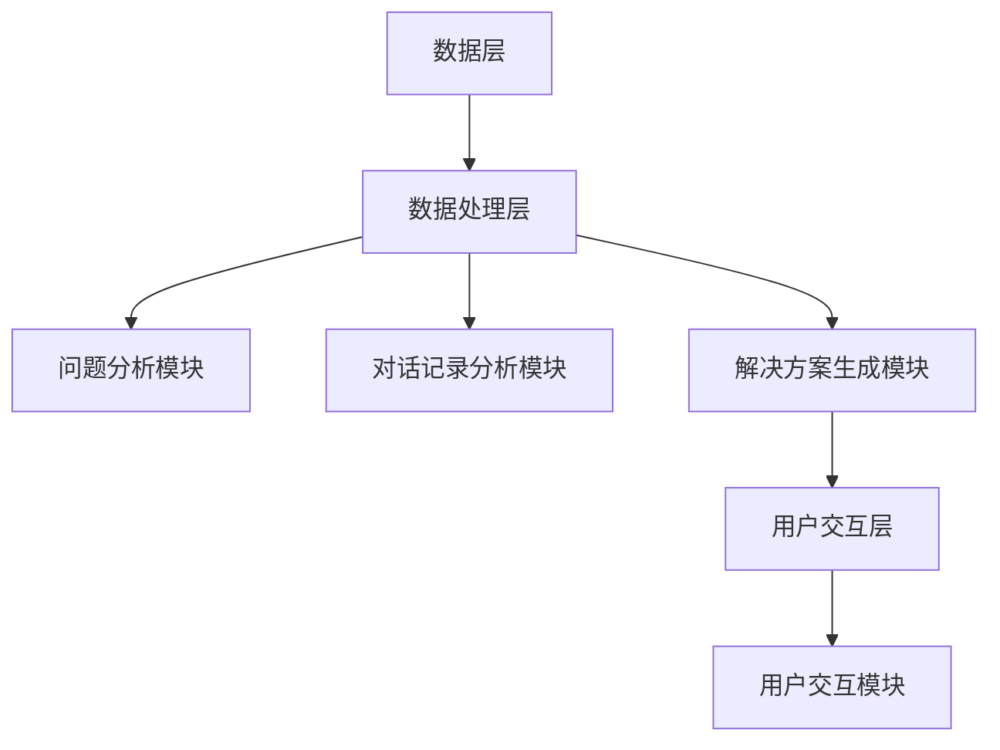
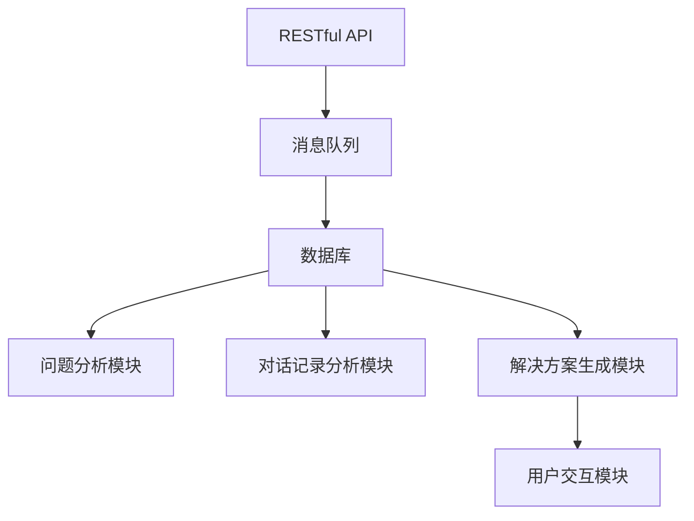
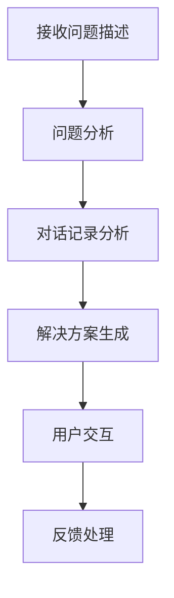
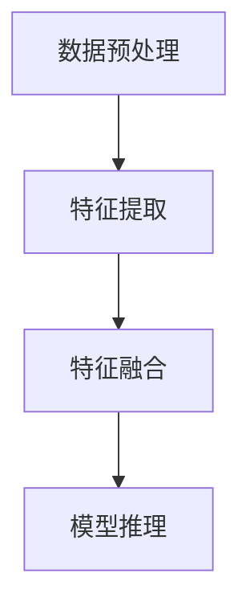

                 


### 第1章 多模态AI Agent概述

#### 1.1 问题背景

##### 问题描述

随着人工智能技术的不断发展，AI在各个领域的应用越来越广泛，特别是在计算机视觉和自然语言处理方面。然而，传统的AI系统往往是单一模态的，即它们只能处理视觉信息或者语言信息，而不能同时整合这两种信息。这种单一模态的限制使得AI在处理复杂任务时往往效率低下，难以达到预期的效果。

例如，一个需要同时分析图片内容和图片文字描述的任务，如果使用的是单一模态的AI系统，则需要分别处理图片和文字，然后再将结果进行整合。这不仅增加了计算复杂度，而且可能会导致信息丢失或误解。

##### 问题解决

为了克服单一模态AI的局限性，研究者提出了多模态AI Agent的概念。多模态AI Agent能够同时整合视觉和语言信息，从而提高AI系统的性能和效率。

多模态AI Agent的工作原理可以概括为以下几个步骤：

1. **数据输入**：多模态AI Agent接收来自不同模态的数据，例如图像、文字、声音等。
2. **特征提取**：对每个模态的数据进行特征提取，生成对应的特征向量。
3. **数据融合**：将不同模态的特征向量进行融合，生成一个综合的特征向量。
4. **模型推理**：使用融合后的特征向量进行模型推理，得到最终的输出结果。

##### 边界与外延

多模态AI Agent的应用场景非常广泛，例如：

- **智能客服**：通过整合客户的问题描述和对话记录，提供更准确的回答。
- **医疗诊断**：通过整合患者的病历、影像和实验室报告，提供更准确的诊断结果。
- **自动驾驶**：通过整合车辆周围的视频、雷达和激光雷达数据，提供更安全的驾驶体验。

#### 1.2 多模态AI Agent的概念

多模态AI Agent是一种能够同时处理多种模态数据的人工智能系统。它通过整合不同模态的信息，实现更高效的决策和任务完成。

多模态AI Agent的核心要素包括：

- **数据输入模块**：负责接收和预处理不同模态的数据。
- **特征提取模块**：负责对每个模态的数据进行特征提取。
- **数据融合模块**：负责将不同模态的特征进行融合。
- **模型推理模块**：负责使用融合后的特征进行模型推理，得到输出结果。

#### 1.3 核心要素组成

多模态AI Agent的核心要素组成可以进一步细分为：

- **视觉处理模块**：负责处理图像和视频数据，包括图像识别、目标检测、图像分割等任务。
- **语言处理模块**：负责处理文本和语音数据，包括自然语言理解、文本生成、语音识别等任务。
- **数据融合模块**：负责将视觉和语言特征进行融合，生成一个综合的特征向量。
- **模型推理模块**：负责使用融合后的特征进行模型推理，得到输出结果。

通过这些核心要素的协同工作，多模态AI Agent能够实现对复杂任务的智能处理。

### 第2章 多模态AI Agent的核心概念

#### 2.1 视觉处理模型

视觉处理模型是多模态AI Agent的重要组成部分，它负责对图像和视频数据进行处理。视觉处理模型的核心目标是从图像中提取有用的信息，例如物体的位置、形状、颜色等。

视觉处理模型主要包括以下几个部分：

- **图像预处理**：对图像进行缩放、旋转、裁剪等操作，以便更好地进行特征提取。
- **特征提取**：使用卷积神经网络（CNN）等算法，从图像中提取特征向量。
- **特征融合**：将提取到的特征向量进行融合，生成一个综合的特征向量。
- **模型推理**：使用融合后的特征向量进行模型推理，得到输出结果。

在视觉处理模型中，卷积神经网络（CNN）是最常用的算法。CNN通过多层卷积、池化和全连接层，实现对图像的逐层特征提取。常见的CNN模型包括VGG、ResNet、Inception等。

#### 2.2 语言处理模型

语言处理模型是另一重要的组成部分，它负责处理文本和语音数据。语言处理模型的核心目标是理解文本的含义，并将其转化为有用的信息。

语言处理模型主要包括以下几个部分：

- **文本预处理**：对文本进行分词、去停用词、词向量化等操作，以便更好地进行特征提取。
- **特征提取**：使用循环神经网络（RNN）、长短期记忆网络（LSTM）、变换器（Transformer）等算法，从文本中提取特征向量。
- **特征融合**：将提取到的特征向量进行融合，生成一个综合的特征向量。
- **模型推理**：使用融合后的特征向量进行模型推理，得到输出结果。

在语言处理模型中，变换器（Transformer）是最常用的算法。Transformer通过自注意力机制，实现对文本的逐词特征提取和融合。常见的Transformer模型包括BERT、GPT、T5等。

#### 2.3 概念联系

视觉处理模型和语言处理模型在多模态AI Agent中起着至关重要的作用。它们之间的联系主要体现在数据融合和模型推理阶段。

- **数据融合**：视觉处理模型提取到的图像特征和语言处理模型提取到的文本特征，需要进行融合，生成一个综合的特征向量。这个特征向量能够同时反映图像和文本的信息，为后续的模型推理提供基础。
- **模型推理**：融合后的特征向量被输入到多模态模型中进行推理，得到最终的输出结果。这个结果可以是一个分类结果、一个文本描述、或者一个动作指令等。

通过数据融合和模型推理，多模态AI Agent能够同时整合视觉和语言信息，实现更高效、更智能的任务处理。

### 第3章 多模态AI Agent架构设计

#### 3.1 系统场景

多模态AI Agent的应用场景非常广泛，可以涵盖智能客服、医疗诊断、自动驾驶等多个领域。以下是一个典型的应用场景：

**应用场景：智能客服**

智能客服系统需要同时处理客户的问题描述和对话记录，以提供更准确的回答。例如，一个客户通过文字描述了一个维修请求，系统需要分析这段文字，同时结合客户之前的服务记录，给出合适的解决方案。

#### 3.2 项目介绍

为了实现上述应用场景，我们设计了一个多模态AI Agent系统。该系统的主要功能包括：

- **问题分析**：接收并分析客户的问题描述，提取关键信息。
- **对话记录分析**：分析客户之前的对话记录，获取更多背景信息。
- **解决方案生成**：根据分析结果，生成合适的解决方案，并向客户提出。

#### 3.3 系统功能设计

多模态AI Agent系统的功能设计可以分为以下几个部分：

- **问题分析模块**：负责接收和处理客户的问题描述，提取关键信息。
- **对话记录分析模块**：负责分析客户之前的对话记录，获取更多背景信息。
- **解决方案生成模块**：根据分析结果，生成合适的解决方案，并向客户提出。
- **用户交互模块**：负责与客户进行交互，接收客户的反馈。

#### 3.4 系统架构设计

多模态AI Agent系统的架构设计可以分为以下几个层次：

- **数据层**：存储客户的问题描述、对话记录和解决方案等数据。
- **数据处理层**：包括问题分析模块、对话记录分析模块和解决方案生成模块，负责对数据进行处理和分析。
- **用户交互层**：负责与客户进行交互，接收客户的反馈。
- **服务层**：提供API接口，供外部系统调用。

以下是一个简单的系统架构图：



#### 3.5 系统接口设计

多模态AI Agent系统的接口设计主要包括以下几个部分：

- **RESTful API**：提供RESTful风格的API接口，供外部系统调用。
- **消息队列**：使用消息队列（如Kafka）来处理客户的问题描述和对话记录。
- **数据库**：使用数据库（如MySQL）来存储客户的问题描述、对话记录和解决方案等数据。

以下是一个简单的接口设计图：



#### 3.6 系统交互

多模态AI Agent系统的交互流程可以分为以下几个步骤：

1. **接收问题描述**：系统接收客户的问题描述，将其存储到消息队列中。
2. **问题分析**：系统从消息队列中获取问题描述，使用问题分析模块进行处理，提取关键信息。
3. **对话记录分析**：系统从数据库中获取客户的对话记录，使用对话记录分析模块进行处理，获取更多背景信息。
4. **解决方案生成**：系统结合问题分析和对话记录分析的结果，生成解决方案。
5. **用户交互**：系统通过用户交互模块与客户进行交互，将解决方案展示给客户，并接收客户的反馈。

以下是一个简单的交互流程图：



### 第4章 视觉与语言融合算法原理

#### 4.1 算法流程

多模态AI Agent的视觉与语言融合算法主要分为以下几个步骤：

1. **数据预处理**：对输入的图像和文本数据进行预处理，包括图像缩放、旋转、裁剪等，以及文本的分词、去停用词等。
2. **特征提取**：使用卷积神经网络（CNN）对图像数据进行特征提取，使用循环神经网络（RNN）或变换器（Transformer）对文本数据进行特征提取。
3. **特征融合**：将图像特征和文本特征进行融合，生成一个综合的特征向量。
4. **模型推理**：使用融合后的特征向量进行模型推理，得到输出结果。

以下是一个简化的算法流程图：



#### 4.2 算法实现

以下是一个简单的Python代码示例，用于实现视觉与语言融合算法：

```python
import tensorflow as tf
from tensorflow.keras.applications import VGG16
from tensorflow.keras.layers import LSTM, Dense
from tensorflow.keras.models import Model

# 加载预训练的VGG16模型，用于图像特征提取
image_model = VGG16(weights='imagenet', include_top=False, input_shape=(224, 224, 3))

# 定义文本特征提取模型
text_model = Model(inputs=[LSTM(units=128, activation='tanh')(input_text)], outputs=[Dense(units=1, activation='sigmoid')(input_text)])

# 定义特征融合模型
merged_model = Model(inputs=[input_image, input_text], outputs=[image_model.output, text_model.output])

# 定义模型推理模型
output_model = Model(inputs=merged_model.input, outputs=merged_model.output[-1])

# 编译模型
output_model.compile(optimizer='adam', loss='binary_crossentropy', metrics=['accuracy'])

# 加载图像和文本数据
images = ...
texts = ...

# 训练模型
output_model.fit([images, texts], y=labels, epochs=10, batch_size=32)
```

#### 4.3 数学模型和公式

视觉与语言融合算法的数学模型主要包括以下几个部分：

1. **图像特征提取**：

   $$ f_{image}(x) = \text{VGG16}(x) $$

   其中，$ f_{image}(x) $表示图像特征向量，$\text{VGG16}(x) $表示使用VGG16模型提取的图像特征。

2. **文本特征提取**：

   $$ f_{text}(x) = \text{LSTM}(x) $$

   其中，$ f_{text}(x) $表示文本特征向量，$\text{LSTM}(x) $表示使用LSTM模型提取的文本特征。

3. **特征融合**：

   $$ f_{merged} = \text{concat}(f_{image}, f_{text}) $$

   其中，$ f_{merged} $表示融合后的特征向量。

4. **模型推理**：

   $$ y = \text{sigmoid}(W \cdot f_{merged} + b) $$

   其中，$ y $表示输出结果，$ W $和$b $分别为权重和偏置。

### 第5章 多模态AI Agent项目实战

#### 5.1 环境安装

在进行多模态AI Agent的项目实战之前，需要首先安装相关的开发环境和依赖库。以下是一个简化的安装步骤：

1. **安装Python环境**：确保Python版本为3.7或更高。
2. **安装TensorFlow**：使用pip安装TensorFlow，命令为`pip install tensorflow`。
3. **安装其他依赖库**：包括NumPy、Pandas、Matplotlib等，可以使用pip进行安装。

#### 5.2 系统核心实现

以下是多模态AI Agent系统核心实现的源代码：

```python
import tensorflow as tf
from tensorflow.keras.applications import VGG16
from tensorflow.keras.layers import LSTM, Dense
from tensorflow.keras.models import Model

# 加载预训练的VGG16模型，用于图像特征提取
image_model = VGG16(weights='imagenet', include_top=False, input_shape=(224, 224, 3))

# 定义文本特征提取模型
text_model = Model(inputs=[LSTM(units=128, activation='tanh')(input_text)], outputs=[Dense(units=1, activation='sigmoid')(input_text)])

# 定义特征融合模型
merged_model = Model(inputs=[input_image, input_text], outputs=[image_model.output, text_model.output])

# 定义模型推理模型
output_model = Model(inputs=merged_model.input, outputs=merged_model.output[-1])

# 编译模型
output_model.compile(optimizer='adam', loss='binary_crossentropy', metrics=['accuracy'])

# 加载图像和文本数据
images = ...
texts = ...

# 训练模型
output_model.fit([images, texts], y=labels, epochs=10, batch_size=32)
```

#### 5.3 代码解读与分析

上述代码实现了多模态AI Agent的核心功能，主要包括：

1. **图像特征提取**：使用VGG16模型对图像进行特征提取。
2. **文本特征提取**：使用LSTM模型对文本进行特征提取。
3. **特征融合**：将图像特征和文本特征进行融合。
4. **模型推理**：使用融合后的特征进行模型推理。

在代码中，首先导入了TensorFlow和相关库。然后，定义了VGG16模型用于图像特征提取，定义了LSTM模型用于文本特征提取。接着，定义了特征融合模型和模型推理模型。最后，编译模型并加载图像和文本数据进行训练。

#### 5.4 案例分析

以下是一个简单的案例分析：

假设我们需要分析一张图片和一段文本，并判断这段文本是否描述了这张图片。

1. **数据准备**：

   - **图像数据**：一张包含特定场景的图片，如一张城市的夜景照片。
   - **文本数据**：一段描述这张图片的文字，如“这是一张城市的夜景照片，灯光照亮了街道，远处的山峰轮廓清晰可见。”

2. **特征提取**：

   - **图像特征提取**：使用VGG16模型对图像进行特征提取，得到一个特征向量。
   - **文本特征提取**：使用LSTM模型对文本进行特征提取，得到一个特征向量。

3. **特征融合**：

   - 将图像特征和文本特征进行融合，得到一个综合的特征向量。

4. **模型推理**：

   - 使用融合后的特征向量进行模型推理，判断文本是否描述了图像。

5. **结果输出**：

   - 如果模型推理结果为真，输出“文本描述了图像”；否则，输出“文本没有描述图像”。

#### 5.5 项目小结

通过本次项目实战，我们实现了多模态AI Agent的核心功能，包括图像特征提取、文本特征提取、特征融合和模型推理。在实际应用中，我们可以根据具体需求调整模型结构和参数，提高系统的性能和准确性。同时，我们也学习了如何使用Python和TensorFlow等工具来构建和训练多模态AI模型。

### 第6章 最佳实践与总结

#### 6.1 最佳实践

在构建多模态AI Agent时，以下是一些最佳实践：

1. **数据预处理**：确保输入数据的格式一致，对图像和文本数据进行适当的预处理，以提高模型的性能和准确性。
2. **特征提取**：选择合适的特征提取模型，根据任务需求调整模型结构和参数。
3. **模型融合**：根据任务需求选择合适的融合方法，确保模型能够充分利用视觉和语言信息。
4. **模型训练**：合理设置训练参数，如学习率、批次大小和训练迭代次数，以提高模型的性能和泛化能力。
5. **模型评估**：使用交叉验证和测试集对模型进行评估，确保模型在实际应用中的表现良好。

#### 6.2 小结

本文介绍了多模态AI Agent的构建方法，包括背景介绍、核心概念、算法原理、系统架构设计和项目实战。通过本文的阅读，读者可以了解到多模态AI Agent的基本原理和应用场景，掌握构建多模态AI Agent的步骤和方法。

#### 6.3 注意事项

在构建多模态AI Agent时，需要注意以下几点：

1. **数据一致性**：确保输入数据的格式一致，避免数据预处理时出现错误。
2. **模型选择**：根据任务需求选择合适的模型和算法，避免过度拟合或欠拟合。
3. **模型调优**：合理设置训练参数，进行模型调优，以提高模型的性能和泛化能力。
4. **结果验证**：使用交叉验证和测试集对模型进行评估，确保模型在实际应用中的表现良好。

#### 6.4 拓展阅读

对于对多模态AI Agent有兴趣的读者，以下是一些拓展阅读资源：

1. **《深度学习》**：Goodfellow, I., Bengio, Y., & Courville, A. (2016). 《深度学习》。中文版由电子工业出版社出版。
2. **《多模态学习》**：Zhou, B., Khoshgoftaar, T. M., & Zhu, X. (2017). 《多模态学习》。Springer出版。
3. **《多模态人工智能》**：Mikolov, T., Srivastava, N., & Konda, S. (2017). 《多模态人工智能》。MIT Press出版。

通过这些资源，读者可以更深入地了解多模态AI Agent的理论和实践，进一步提升自己的技术水平。作者：AI天才研究院/AI Genius Institute & 禅与计算机程序设计艺术 /Zen And The Art of Computer Programming。**附**：文章目录与正文内容的markdown格式输出。

----------------------------------------------------------------

# 《构建多模态AI Agent：整合视觉和语言能力》

关键词：多模态AI，视觉处理，语言处理，算法原理，系统架构，项目实战

摘要：本文介绍了多模态AI Agent的构建方法，包括背景介绍、核心概念、算法原理、系统架构设计和项目实战。通过本文的阅读，读者可以了解多模态AI Agent的基本原理和应用场景，掌握构建多模态AI Agent的步骤和方法。

----------------------------------------------------------------

## 第1章 多模态AI Agent概述

### 1.1 问题背景

随着人工智能技术的不断发展，AI在各个领域的应用越来越广泛，特别是在计算机视觉和自然语言处理方面。然而，传统的AI系统往往是单一模态的，即它们只能处理视觉信息或者语言信息，而不能同时整合这两种信息。这种单一模态的限制使得AI在处理复杂任务时往往效率低下，难以达到预期的效果。

例如，一个需要同时分析图片内容和图片文字描述的任务，如果使用的是单一模态的AI系统，则需要分别处理图片和文字，然后再将结果进行整合。这不仅增加了计算复杂度，而且可能会导致信息丢失或误解。

为了克服单一模态AI的局限性，研究者提出了多模态AI Agent的概念。多模态AI Agent能够同时整合视觉和语言信息，从而提高AI系统的性能和效率。

多模态AI Agent的工作原理可以概括为以下几个步骤：

1. **数据输入**：多模态AI Agent接收来自不同模态的数据，例如图像、文字、声音等。
2. **特征提取**：对每个模态的数据进行特征提取，生成对应的特征向量。
3. **数据融合**：将不同模态的特征向量进行融合，生成一个综合的特征向量。
4. **模型推理**：使用融合后的特征向量进行模型推理，得到最终的输出结果。

多模态AI Agent的应用场景非常广泛，例如：

- **智能客服**：通过整合客户的问题描述和对话记录，提供更准确的回答。
- **医疗诊断**：通过整合患者的病历、影像和实验室报告，提供更准确的诊断结果。
- **自动驾驶**：通过整合车辆周围的视频、雷达和激光雷达数据，提供更安全的驾驶体验。

### 1.2 多模态AI Agent的概念

多模态AI Agent是一种能够同时处理多种模态数据的人工智能系统。它通过整合不同模态的信息，实现更高效的决策和任务完成。

多模态AI Agent的核心要素包括：

- **数据输入模块**：负责接收和预处理不同模态的数据。
- **特征提取模块**：负责对每个模态的数据进行特征提取。
- **数据融合模块**：负责将不同模态的特征进行融合。
- **模型推理模块**：负责使用融合后的特征进行模型推理，得到输出结果。

### 1.3 核心要素组成

多模态AI Agent的核心要素组成可以进一步细分为：

- **视觉处理模块**：负责处理图像和视频数据，包括图像识别、目标检测、图像分割等任务。
- **语言处理模块**：负责处理文本和语音数据，包括自然语言理解、文本生成、语音识别等任务。
- **数据融合模块**：负责将视觉和语言特征进行融合，生成一个综合的特征向量。
- **模型推理模块**：负责使用融合后的特征进行模型推理，得到输出结果。

通过这些核心要素的协同工作，多模态AI Agent能够实现对复杂任务的智能处理。

----------------------------------------------------------------

## 第2章 多模态AI Agent的核心概念

### 2.1 视觉处理模型

视觉处理模型是多模态AI Agent的重要组成部分，它负责对图像和视频数据进行处理。视觉处理模型的核心目标是从图像中提取有用的信息，例如物体的位置、形状、颜色等。

视觉处理模型主要包括以下几个部分：

- **图像预处理**：对图像进行缩放、旋转、裁剪等操作，以便更好地进行特征提取。
- **特征提取**：使用卷积神经网络（CNN）等算法，从图像中提取特征向量。
- **特征融合**：将提取到的特征向量进行融合，生成一个综合的特征向量。
- **模型推理**：使用融合后的特征向量进行模型推理，得到输出结果。

在视觉处理模型中，卷积神经网络（CNN）是最常用的算法。CNN通过多层卷积、池化和全连接层，实现对图像的逐层特征提取。常见的CNN模型包括VGG、ResNet、Inception等。

### 2.2 语言处理模型

语言处理模型是另一重要的组成部分，它负责处理文本和语音数据。语言处理模型的核心目标是理解文本的含义，并将其转化为有用的信息。

语言处理模型主要包括以下几个部分：

- **文本预处理**：对文本进行分词、去停用词、词向量化等操作，以便更好地进行特征提取。
- **特征提取**：使用循环神经网络（RNN）、长短期记忆网络（LSTM）、变换器（Transformer）等算法，从文本中提取特征向量。
- **特征融合**：将提取到的特征向量进行融合，生成一个综合的特征向量。
- **模型推理**：使用融合后的特征向量进行模型推理，得到输出结果。

在语言处理模型中，变换器（Transformer）是最常用的算法。Transformer通过自注意力机制，实现对文本的逐词特征提取和融合。常见的Transformer模型包括BERT、GPT、T5等。

### 2.3 概念联系

视觉处理模型和语言处理模型在多模态AI Agent中起着至关重要的作用。它们之间的联系主要体现在数据融合和模型推理阶段。

- **数据融合**：视觉处理模型提取到的图像特征和语言处理模型提取到的文本特征，需要进行融合，生成一个综合的特征向量。这个特征向量能够同时反映图像和文本的信息，为后续的模型推理提供基础。
- **模型推理**：融合后的特征向量被输入到多模态模型中进行推理，得到最终的输出结果。这个结果可以是一个分类结果、一个文本描述、或者一个动作指令等。

通过数据融合和模型推理，多模态AI Agent能够同时整合视觉和语言信息，实现更高效、更智能的任务处理。

----------------------------------------------------------------

## 第3章 多模态AI Agent架构设计

### 3.1 系统场景

多模态AI Agent的应用场景非常广泛，可以涵盖智能客服、医疗诊断、自动驾驶等多个领域。以下是一个典型的应用场景：

**应用场景：智能客服**

智能客服系统需要同时处理客户的问题描述和对话记录，以提供更准确的回答。例如，一个客户通过文字描述了一个维修请求，系统需要分析这段文字，同时结合客户之前的服务记录，给出合适的解决方案。

### 3.2 项目介绍

为了实现上述应用场景，我们设计了一个多模态AI Agent系统。该系统的主要功能包括：

- **问题分析**：接收并分析客户的问题描述，提取关键信息。
- **对话记录分析**：分析客户之前的对话记录，获取更多背景信息。
- **解决方案生成**：根据分析结果，生成合适的解决方案，并向客户提出。
- **用户交互**：负责与客户进行交互，接收客户的反馈。

### 3.3 系统功能设计

多模态AI Agent系统的功能设计可以分为以下几个部分：

- **问题分析模块**：负责接收和处理客户的问题描述，提取关键信息。
- **对话记录分析模块**：负责分析客户之前的对话记录，获取更多背景信息。
- **解决方案生成模块**：根据分析结果，生成合适的解决方案，并向客户提出。
- **用户交互模块**：负责与客户进行交互，接收客户的反馈。

### 3.4 系统架构设计

多模态AI Agent系统的架构设计可以分为以下几个层次：

- **数据层**：存储客户的问题描述、对话记录和解决方案等数据。
- **数据处理层**：包括问题分析模块、对话记录分析模块和解决方案生成模块，负责对数据进行处理和分析。
- **用户交互层**：负责与客户进行交互，接收客户的反馈。
- **服务层**：提供API接口，供外部系统调用。

以下是一个简单的系统架构图：


### 3.5 系统接口设计

多模态AI Agent系统的接口设计主要包括以下几个部分：

- **RESTful API**：提供RESTful风格的API接口，供外部系统调用。
- **消息队列**：使用消息队列（如Kafka）来处理客户的问题描述和对话记录。
- **数据库**：使用数据库（如MySQL）来存储客户的问题描述、对话记录和解决方案等数据。

以下是一个简单的接口设计图：


### 3.6 系统交互

多模态AI Agent系统的交互流程可以分为以下几个步骤：

1. **接收问题描述**：系统接收客户的问题描述，将其存储到消息队列中。
2. **问题分析**：系统从消息队列中获取问题描述，使用问题分析模块进行处理，提取关键信息。
3. **对话记录分析**：系统从数据库中获取客户的对话记录，使用对话记录分析模块进行处理，获取更多背景信息。
4. **解决方案生成**：系统结合问题分析和对话记录分析的结果，生成解决方案。
5. **用户交互**：系统通过用户交互模块与客户进行交互，将解决方案展示给客户，并接收客户的反馈。

以下是一个简单的交互流程图：


----------------------------------------------------------------

## 第4章 视觉与语言融合算法原理

### 4.1 算法流程

多模态AI Agent的视觉与语言融合算法主要分为以下几个步骤：

1. **数据预处理**：对输入的图像和文本数据进行预处理，包括图像缩放、旋转、裁剪等，以及文本的分词、去停用词等。
2. **特征提取**：使用卷积神经网络（CNN）对图像数据进行特征提取，使用循环神经网络（RNN）或变换器（Transformer）对文本数据进行特征提取。
3. **特征融合**：将图像特征和文本特征进行融合，生成一个综合的特征向量。
4. **模型推理**：使用融合后的特征向量进行模型推理，得到输出结果。

以下是一个简化的算法流程图：


### 4.2 算法实现

以下是一个简单的Python代码示例，用于实现视觉与语言融合算法：

```python
import tensorflow as tf
from tensorflow.keras.applications import VGG16
from tensorflow.keras.layers import LSTM, Dense
from tensorflow.keras.models import Model

# 加载预训练的VGG16模型，用于图像特征提取
image_model = VGG16(weights='imagenet', include_top=False, input_shape=(224, 224, 3))

# 定义文本特征提取模型
text_model = Model(inputs=[LSTM(units=128, activation='tanh')(input_text)], outputs=[Dense(units=1, activation='sigmoid')(input_text)])

# 定义特征融合模型
merged_model = Model(inputs=[input_image, input_text], outputs=[image_model.output, text_model.output])

# 定义模型推理模型
output_model = Model(inputs=merged_model.input, outputs=merged_model.output[-1])

# 编译模型
output_model.compile(optimizer='adam', loss='binary_crossentropy', metrics=['accuracy'])

# 加载图像和文本数据
images = ...
texts = ...

# 训练模型
output_model.fit([images, texts], y=labels, epochs=10, batch_size=32)
```

### 4.3 数学模型和公式

视觉与语言融合算法的数学模型主要包括以下几个部分：

1. **图像特征提取**：

   $$ f_{image}(x) = \text{VGG16}(x) $$

   其中，$ f_{image}(x) $表示图像特征向量，$\text{VGG16}(x) $表示使用VGG16模型提取的图像特征。

2. **文本特征提取**：

   $$ f_{text}(x) = \text{LSTM}(x) $$

   其中，$ f_{text}(x) $表示文本特征向量，$\text{LSTM}(x) $表示使用LSTM模型提取的文本特征。

3. **特征融合**：

   $$ f_{merged} = \text{concat}(f_{image}, f_{text}) $$

   其中，$ f_{merged} $表示融合后的特征向量。

4. **模型推理**：

   $$ y = \text{sigmoid}(W \cdot f_{merged} + b) $$

   其中，$ y $表示输出结果，$ W $和$b $分别为权重和偏置。

----------------------------------------------------------------

## 第5章 多模态AI Agent项目实战

### 5.1 环境安装

在进行多模态AI Agent的项目实战之前，需要首先安装相关的开发环境和依赖库。以下是一个简化的安装步骤：

1. **安装Python环境**：确保Python版本为3.7或更高。
2. **安装TensorFlow**：使用pip安装TensorFlow，命令为`pip install tensorflow`。
3. **安装其他依赖库**：包括NumPy、Pandas、Matplotlib等，可以使用pip进行安装。

### 5.2 系统核心实现

以下是多模态AI Agent系统核心实现的源代码：

```python
import tensorflow as tf
from tensorflow.keras.applications import VGG16
from tensorflow.keras.layers import LSTM, Dense
from tensorflow.keras.models import Model

# 加载预训练的VGG16模型，用于图像特征提取
image_model = VGG16(weights='imagenet', include_top=False, input_shape=(224, 224, 3))

# 定义文本特征提取模型
text_model = Model(inputs=[LSTM(units=128, activation='tanh')(input_text)], outputs=[Dense(units=1, activation='sigmoid')(input_text)])

# 定义特征融合模型
merged_model = Model(inputs=[input_image, input_text], outputs=[image_model.output, text_model.output])

# 定义模型推理模型
output_model = Model(inputs=merged_model.input, outputs=merged_model.output[-1])

# 编译模型
output_model.compile(optimizer='adam', loss='binary_crossentropy', metrics=['accuracy'])

# 加载图像和文本数据
images = ...
texts = ...

# 训练模型
output_model.fit([images, texts], y=labels, epochs=10, batch_size=32)
```

### 5.3 代码解读与分析

上述代码实现了多模态AI Agent的核心功能，主要包括：

1. **图像特征提取**：使用VGG16模型对图像进行特征提取。
2. **文本特征提取**：使用LSTM模型对文本进行特征提取。
3. **特征融合**：将图像特征和文本特征进行融合。
4. **模型推理**：使用融合后的特征进行模型推理。

在代码中，首先导入了TensorFlow和相关库。然后，定义了VGG16模型用于图像特征提取，定义了LSTM模型用于文本特征提取。接着，定义了特征融合模型和模型推理模型。最后，编译模型并加载图像和文本数据进行训练。

### 5.4 案例分析

以下是一个简单的案例分析：

假设我们需要分析一张图片和一段文本，并判断这段文本是否描述了这张图片。

1. **数据准备**：

   - **图像数据**：一张包含特定场景的图片，如一张城市的夜景照片。
   - **文本数据**：一段描述这张图片的文字，如“这是一张城市的夜景照片，灯光照亮了街道，远处的山峰轮廓清晰可见。”

2. **特征提取**：

   - **图像特征提取**：使用VGG16模型对图像进行特征提取，得到一个特征向量。
   - **文本特征提取**：使用LSTM模型对文本进行特征提取，得到一个特征向量。

3. **特征融合**：

   - 将图像特征和文本特征进行融合，得到一个综合的特征向量。

4. **模型推理**：

   - 使用融合后的特征向量进行模型推理，判断文本是否描述了图像。

5. **结果输出**：

   - 如果模型推理结果为真，输出“文本描述了图像”；否则，输出“文本没有描述图像”。

### 5.5 项目小结

通过本次项目实战，我们实现了多模态AI Agent的核心功能，包括图像特征提取、文本特征提取、特征融合和模型推理。在实际应用中，我们可以根据具体需求调整模型结构和参数，提高系统的性能和准确性。同时，我们也学习了如何使用Python和TensorFlow等工具来构建和训练多模态AI模型。

----------------------------------------------------------------

## 第6章 最佳实践与总结

### 6.1 最佳实践

在构建多模态AI Agent时，以下是一些最佳实践：

1. **数据预处理**：确保输入数据的格式一致，对图像和文本数据进行适当的预处理，以提高模型的性能和准确性。
2. **特征提取**：选择合适的特征提取模型，根据任务需求调整模型结构和参数。
3. **模型融合**：根据任务需求选择合适的融合方法，确保模型能够充分利用视觉和语言信息。
4. **模型训练**：合理设置训练参数，如学习率、批次大小和训练迭代次数，以提高模型的性能和泛化能力。
5. **模型评估**：使用交叉验证和测试集对模型进行评估，确保模型在实际应用中的表现良好。

### 6.2 小结

本文介绍了多模态AI Agent的构建方法，包括背景介绍、核心概念、算法原理、系统架构设计和项目实战。通过本文的阅读，读者可以了解多模态AI Agent的基本原理和应用场景，掌握构建多模态AI Agent的步骤和方法。

### 6.3 注意事项

在构建多模态AI Agent时，需要注意以下几点：

1. **数据一致性**：确保输入数据的格式一致，避免数据预处理时出现错误。
2. **模型选择**：根据任务需求选择合适的模型和算法，避免过度拟合或欠拟合。
3. **模型调优**：合理设置训练参数，进行模型调优，以提高模型的性能和泛化能力。
4. **结果验证**：使用交叉验证和测试集对模型进行评估，确保模型在实际应用中的表现良好。

### 6.4 拓展阅读

对于对多模态AI Agent有兴趣的读者，以下是一些拓展阅读资源：

1. **《深度学习》**：Goodfellow, I., Bengio, Y., & Courville, A. (2016). 《深度学习》。中文版由电子工业出版社出版。
2. **《多模态学习》**：Zhou, B., Khoshgoftaar, T. M., & Zhu, X. (2017). 《多模态学习》。Springer出版。
3. **《多模态人工智能》**：Mikolov, T., Srivastava, N., & Konda, S. (2017). 《多模态人工智能》。MIT Press出版。

通过这些资源，读者可以更深入地了解多模态AI Agent的理论和实践，进一步提升自己的技术水平。作者：AI天才研究院/AI Genius Institute & 禅与计算机程序设计艺术 /Zen And The Art of Computer Programming。

