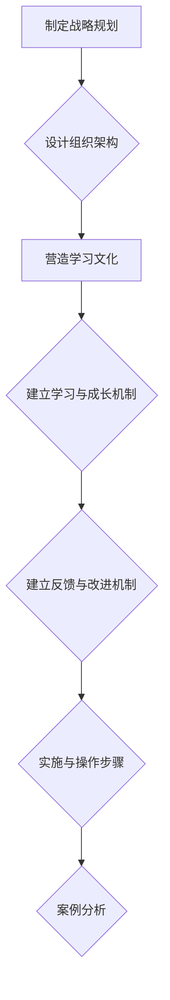
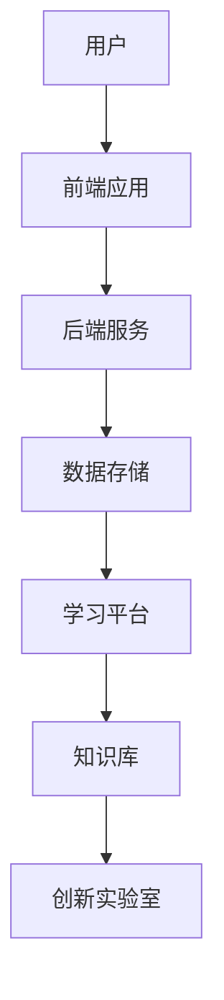

                 

### 1.1.1 当前技术环境下的挑战

随着信息技术的飞速发展，技术环境日益复杂，技术更新速度不断加快。企业面临的技术挑战主要体现在以下几个方面：

#### 数据量的爆炸性增长

大数据技术的兴起，使得企业需要处理的数据量呈指数级增长。这不仅要求企业拥有强大的计算能力和存储能力，还需要高效的数据处理和分析能力。

#### 技术多样性和复杂性

随着技术的不断演进，企业需要掌握的技术领域越来越广泛。从传统的软件开发、数据库管理，到人工智能、区块链、云计算等新兴技术，企业需要不断更新技术栈，以保持竞争力。

#### 技术更新速度加快

技术的快速迭代，使得企业需要不断跟进新技术，否则将面临被淘汰的风险。例如，人工智能领域，每年都会有新的算法、框架和工具出现。

#### 技术人才短缺

由于技术的复杂性和多样性，企业对技术人才的需求越来越高。然而，技术人才的培养和储备是一个长期且复杂的过程，很多企业难以在短时间内满足需求。

#### 创新能力不足

在激烈的市场竞争中，创新能力是企业持续发展的关键。然而，许多企业由于技术能力和创新机制的不足，难以实现技术突破和产品创新。

面对这些挑战，企业需要构建一个学习型技术组织，以提高技术能力、创新能力和市场竞争力。

#### 学习型技术组织的概念与价值

学习型技术组织是指一种能够不断学习、创新和适应变化的组织形态。其核心在于通过建立良好的学习机制、创新机制和文化氛围，使组织成员能够持续提升自身技术能力，推动组织的技术创新和业务发展。

#### 学习型技术组织的特点

- **持续学习**：组织成员持续学习新技术、新方法，不断提升自身技能水平。
- **知识共享**：组织内部建立知识共享机制，促进知识传播和复用。
- **创新驱动**：以创新为核心驱动力，不断探索新技术、新应用。
- **灵活适应**：能够快速响应市场变化和技术趋势，调整战略和业务模式。
- **团队合作**：强调团队合作和协作，共同解决复杂问题。

#### 学习型技术组织对企业的价值

- **提升技术能力**：通过持续学习和知识共享，提升组织成员的技术水平和创新能力。
- **增强市场竞争力**：通过技术创新和产品创新，提升企业在市场中的竞争力。
- **优化人力资源**：吸引和留住优秀的技术人才，提高人力资源的整体质量。
- **促进业务发展**：通过技术能力的提升，推动业务的快速发展，实现商业价值。

### 结论

在当前技术环境下，构建学习型技术组织已成为企业应对挑战、实现持续发展的关键。下一部分，我们将进一步探讨学习型技术组织的核心要素和构建方法。### 1.2 书籍的定位与目标读者

#### 书籍定位

《构建学习型技术组织的方法论》旨在为企业和技术团队提供一套系统、全面的学习型技术组织构建方法和实践指南。本书不仅涵盖理论，还结合实际案例，为读者提供可操作的实施步骤和策略。

#### 目标读者

- **企业高管**：需要了解如何构建学习型技术组织，提升企业技术能力和创新能力的决策者。
- **技术经理**：负责技术团队管理和技术项目实施的经理，希望提高团队的技术水平和协作效率。
- **技术团队成员**：希望提升个人技术能力和创新能力的程序员、工程师和技术专家。
- **教育培训者**：需要将学习型技术组织理念融入课程设计和教学实践的教授、讲师和培训师。
- **研究人员**：对组织学习和技术创新领域感兴趣的学术研究人员。

#### 读者期望收获

- **理解学习型技术组织的核心概念和原理**：通过系统学习，掌握学习型技术组织的定义、特点和价值。
- **获取构建学习型技术组织的实用方法**：学习到如何设计和实施学习策略、技术创新机制和组织文化培育。
- **掌握实施步骤和操作技巧**：了解从环境准备到组织设计与实施的详细步骤，以及如何在实际工作中应用。
- **借鉴成功案例和实践经验**：通过案例分析，学习其他企业成功构建学习型技术组织的经验，结合自身实际情况进行调整和优化。
- **提升个人和技术团队的能力**：通过学习，提升自身技术能力和创新能力，推动团队的技术进步和业务发展。

### 结论

《构建学习型技术组织的方法论》旨在帮助企业和技术团队构建学习型技术组织，提升技术能力和创新能力，以应对当前技术环境下的各种挑战。无论是企业高管、技术经理，还是技术团队成员，都能从本书中获得有益的知识和实践指导。接下来，我们将详细探讨学习型技术组织的内容结构安排，为读者提供清晰的学习路径。### 1.3 内容结构安排

《构建学习型技术组织的方法论》将内容分为四个主要部分，每个部分都详细阐述了构建学习型技术组织的关键步骤和方法。以下是具体的内容结构安排：

#### 第一部分：引言

本部分主要介绍当前技术环境下的挑战，以及学习型技术组织的概念与价值。具体包括：

- **1.1 问题的提出**：分析当前技术环境下的挑战，如数据量爆炸性增长、技术多样性和复杂性、技术更新速度加快、技术人才短缺和创新能力不足等。
- **1.2 书籍的定位与目标读者**：明确书籍的定位和目标读者，包括企业高管、技术经理、技术团队成员、教育培训者和研究人员等。
- **1.3 内容结构安排**：概述本书的整体结构，包括引言、背景与核心概念、组织构建的方法与策略、实施与操作步骤以及案例分析等。

#### 第二部分：背景与核心概念

本部分深入探讨构建学习型技术组织的背景和核心概念，为后续内容的实施提供理论基础。具体包括：

- **2.1 技术发展趋势分析**：分析当前技术发展的趋势，如人工智能与大数据、区块链技术、云计算与边缘计算等。
- **2.2 学习型技术组织的核心要素**：介绍学习型技术组织的核心要素，包括组织文化与价值观、技术能力与人才储备、创新机制与激励措施等。
- **2.3 核心概念与联系**：阐述学习型组织理论和技术学习与创新过程的核心概念，以及它们之间的联系。

#### 第三部分：组织构建的方法与策略

本部分详细阐述构建学习型技术组织的方法和策略，包括组织构建的步骤、学习策略、技术创新机制等。具体包括：

- **3.1 建立学习型技术组织的步骤**：介绍建立学习型技术组织的具体步骤，包括战略规划、组织架构设计、学习文化培育等。
- **3.2 制定有效的学习策略**：探讨如何制定有效的学习策略，包括人才引进与培养、技术知识管理、创新机制与激励措施等。
- **3.3 构建技术创新机制**：分析如何构建技术创新机制，包括创新项目的筛选与评估、创新团队的组建与管理、创新成果的转化与应用等。

#### 第四部分：实施与操作步骤

本部分提供具体的实施与操作步骤，帮助企业和技术团队将学习型技术组织的理念落地实施。具体包括：

- **4.1 环境准备**：介绍在构建学习型技术组织前需要做的环境准备，包括技术环境搭建、组织文化培育、人力资源配置等。
- **4.2 组织设计与实施**：详细阐述如何进行组织设计与实施，包括组织结构设计、学习机制建立、管理监督等。
- **4.3 案例分析**：通过实际案例，展示如何将学习型技术组织的理念应用于实践，并提供经验教训。

#### 第五部分：拓展阅读与最佳实践

本部分提供拓展阅读资源、最佳实践和注意事项，帮助读者进一步了解和掌握构建学习型技术组织的方法和策略。具体包括：

- **5.1 拓展阅读与最佳实践**：推荐相关的学习资源、最佳实践案例，以及如何将学习型技术组织理念应用于不同行业和企业。
- **5.2 注意事项与未来展望**：总结构建学习型技术组织过程中需要注意的问题，以及对未来发展趋势的展望。

### 结论

通过以上内容结构安排，本书将为读者提供一套系统、全面的构建学习型技术组织的方法论。无论您是企业高管、技术经理，还是技术团队成员，都可以根据自身需求，逐步学习并实践，从而提升企业的技术能力和创新能力。### 2.1 技术发展趋势分析

在当今快速变化的技术环境中，了解和跟踪技术发展趋势对于企业构建学习型技术组织至关重要。以下是几个关键技术的发展趋势及其对企业的影响：

#### 2.1.1 人工智能与大数据

人工智能（AI）和大数据技术的结合正推动着各行各业的技术革新。AI技术通过机器学习、深度学习等方法，使计算机能够模拟人类智能，进行决策和问题解决。大数据技术则提供了海量数据存储和分析的能力，使得企业能够从数据中发现有价值的信息和模式。

**影响分析：**
- **数据驱动决策**：通过AI和大数据技术，企业能够实现更加精准的数据分析，从而做出更明智的决策。
- **自动化和优化**：AI技术可以自动化重复性任务，提高效率，减少人力成本。大数据分析可以帮助企业优化业务流程，提高运营效率。
- **个性化服务**：基于大数据分析，企业能够提供更加个性化的产品和服务，提升客户满意度。

#### 2.1.2 区块链技术

区块链技术是一种分布式数据库技术，具有去中心化、透明性和安全性等特点。它通过区块链网络中的节点进行数据的存储和验证，防止数据篡改，并在金融、供应链管理等多个领域得到应用。

**影响分析：**
- **透明和可信**：区块链技术能够提高数据的透明度和可信度，减少信息不对称。
- **去中心化**：通过去中心化，区块链技术能够降低交易成本，提高效率。
- **供应链管理**：区块链技术可以帮助企业实现更加高效、透明的供应链管理，提高供应链的可见性和可控性。

#### 2.1.3 云计算与边缘计算

云计算提供了弹性、高效、可扩展的计算资源，而边缘计算则将计算能力分散到网络的边缘，即在数据源附近进行数据处理。

**影响分析：**
- **资源优化**：云计算提供了灵活的计算资源，企业可以根据需求进行动态调整，降低成本。
- **实时响应**：边缘计算使得数据能够在靠近数据源的地方进行处理，提高了实时响应能力，适用于物联网、自动驾驶等场景。
- **数据安全**：云计算和边缘计算的结合可以帮助企业更好地保护数据安全，通过分布式存储和加密技术，减少数据泄露风险。

#### 2.1.4 5G通信技术

5G通信技术具有高速率、低延迟和高连接密度的特点，它将极大地提升数据传输速度和网络可靠性。

**影响分析：**
- **物联网应用**：5G技术使得物联网设备之间的通信更加便捷，促进了智能家居、智能城市等应用的发展。
- **实时应用**：低延迟的5G网络支持实时应用，如远程医疗、在线游戏等，提高了用户体验。
- **业务创新**：5G技术为新兴业务模式提供了技术支持，如边缘计算、自动驾驶等，为企业带来了新的增长点。

### 结论

了解和跟踪这些技术发展趋势，对于企业构建学习型技术组织具有重要意义。企业需要不断学习和适应新技术，才能在激烈的市场竞争中保持领先地位。通过本章的分析，我们为构建学习型技术组织奠定了理论基础，并为后续内容的深入探讨提供了背景信息。### 2.2 学习型技术组织的核心要素

构建一个学习型技术组织，需要关注其核心要素，这些要素相互关联，共同推动组织的持续学习和创新发展。以下是学习型技术组织的三个核心要素：

#### 2.2.1 组织文化与价值观

组织文化是学习型技术组织的灵魂，它决定了组织的氛围、行为和员工的心态。一个积极的学习型组织文化应该具备以下几个特点：

- **持续学习**：鼓励员工不断学习新技术、新方法，并将其应用于实际工作中。
- **知识共享**：建立开放的知识共享机制，鼓励员工分享知识和经验，促进知识的传播和复用。
- **创新思维**：鼓励员工提出新的想法和解决方案，支持创新思维的发展。

为了营造这样的组织文化，企业可以采取以下措施：

- **制定明确的价值观和愿景**：明确组织的目标和价值观，使员工明白组织的方向和期望。
- **建立培训和学习机制**：定期举办内部培训和知识分享活动，提高员工的专业技能和知识水平。
- **奖励机制**：设立奖励机制，鼓励员工积极参与学习、分享和创新的行动。

#### 2.2.2 技术能力与人才储备

技术能力是学习型技术组织的基础，人才储备则是技术能力不断提升的保障。企业需要关注以下几个方面：

- **技能培训**：为员工提供多样化的技能培训，帮助他们掌握当前和未来的技术趋势。
- **人才培养**：建立人才培养体系，鼓励员工通过内部晋升、轮岗等方式提升技能和经验。
- **人才引进**：引进具有前沿技术能力和创新思维的人才，为组织带来新的视角和解决方案。

为了实现这些目标，企业可以采取以下措施：

- **内部培养**：通过内部培训和项目实践，培养员工的技能和经验。
- **外部合作**：与高校、研究机构等建立合作关系，引进外部资源和人才。
- **人才激励机制**：设立激励机制，鼓励员工持续提升自己的技术能力和创新成果。

#### 2.2.3 创新机制与激励措施

创新是学习型技术组织发展的核心驱动力，为了激发创新，企业需要建立有效的创新机制和激励措施。以下是几个关键点：

- **创新项目立项**：建立严格的创新项目立项流程，对创新项目进行筛选和评估，确保项目的可行性和价值。
- **创新团队组建**：组建跨部门、跨领域的创新团队，充分发挥团队的协作和创造力。
- **知识产权保护**：加强对创新成果的知识产权保护，激励员工积极创新。
- **激励政策**：制定激励政策，对创新成果显著的员工给予奖励，包括奖金、晋升、荣誉等。

为了建立有效的创新机制，企业可以采取以下措施：

- **设立创新基金**：为创新项目提供资金支持，降低员工创新的成本和风险。
- **建立反馈机制**：建立有效的反馈机制，鼓励员工提出问题和改进建议。
- **营造创新氛围**：营造开放、包容、鼓励创新的工作环境，减少创新过程中的障碍。

### 结论

组织文化、技术能力和创新机制是构建学习型技术组织的三个核心要素，它们相互支持、相互促进，共同推动组织的持续学习和创新发展。在下一节中，我们将探讨这些核心概念之间的联系，进一步理解学习型技术组织的本质。### 2.3 核心概念与联系

在构建学习型技术组织的进程中，理解并掌握几个关键概念及其相互之间的联系至关重要。以下是学习型组织理论、技术学习与创新过程以及它们之间的关联性。

#### 2.3.1 学习型组织理论

学习型组织理论最早由彼得·圣吉（Peter Senge）在其著作《第五项修炼》中提出。学习型组织强调个体与组织的持续学习与共同成长。核心概念包括：

- **自我超越**：个体追求自我成长，超越个人利益，追求更高层次的目标。
- **心智模式**：个体反思和改变其思维模式，认识到自身认知的局限性，从而提升决策能力。
- **共同愿景**：组织成员共同拥有并追求的愿景，是组织前进的动力。
- **团队学习**：通过团队合作，提高整个组织的协作能力和创新水平。
- **系统思考**：从系统的角度看待问题，理解问题的根源和长期影响，避免短期行为带来的负面影响。

#### 2.3.2 技术学习与创新过程

技术学习与创新过程是企业技术能力提升的关键。以下是几个核心概念：

- **技术知识管理**：通过系统化地收集、存储、传播和应用技术知识，提高组织的技术水平。
- **技术引入**：跟踪和引入新兴技术，以保持企业的技术竞争力。
- **技术转化**：将引入的技术转化为实际应用，解决实际问题。
- **技术迭代**：通过不断的迭代和优化，提升技术解决方案的效率和效果。
- **技术整合**：将新技术与企业现有的技术体系相结合，形成有机的整体。

#### 学习型组织理论与技术学习与创新过程的联系

学习型组织理论与技术学习与创新过程之间有着紧密的联系，具体体现在以下几个方面：

- **自我超越与技术创新**：学习型组织的自我超越理念鼓励员工不断追求个人成长，这种个人成长最终会推动技术创新。
- **心智模式与知识管理**：学习型组织强调心智模式改变，这有助于员工更加开放地接受新技术和新方法，从而更好地进行知识管理。
- **共同愿景与技术创新目标**：共同愿景为组织提供了明确的方向，技术创新目标的实现是共同愿景的一部分，有助于组织成员共同推动技术进步。
- **团队学习与技术创新团队**：团队学习强调协作和沟通，这对于技术创新团队的效率和效果至关重要。
- **系统思考与技术创新**：系统思考有助于组织从整体上理解技术问题，避免技术创新过程中因短期行为带来的负面影响。

#### 概念属性特征对比表格

为了更好地理解这些概念，我们可以通过一个简单的属性特征对比表格进行展示：

| 概念                 | 属性特征                                      | 影响因素                                   | 目标效果                                 |
|----------------------|----------------------------------------------|------------------------------------------|----------------------------------------|
| 学习型组织理论       | 自我超越、心智模式、共同愿景、团队学习、系统思考 | 员工动机、组织文化、领导力                | 提高组织适应能力、创新能力               |
| 技术学习与创新过程   | 技术知识管理、技术引入、技术转化、技术迭代、技术整合 | 知识储备、技术趋势、资源配置、市场环境     | 提升技术能力、推动技术进步               |
| 学习型组织与技术学习 | 相互促进、共同成长                          | 组织文化、激励机制、知识共享、技术环境       | 提高整体效率、增强创新能力               |
| 技术学习与创新过程与技术学习 | 相互融合、持续改进                          | 技术知识、创新思维、资源支持               | 提高技术转化效率、优化创新成果           |

#### ER实体关系图架构

为了更直观地展示这些概念之间的关系，我们可以使用ER（Entity-Relationship，实体-关系）图来描述：

```mermaid
erDiagram
  TechnologyKnowledgeManagement ||--|{ LearningOrganization }
  TechnologyIntroduction ||--|{ LearningOrganization }
  TechnologyTransformation ||--|{ LearningOrganization }
  TechnologyIteration ||--|{ LearningOrganization }
  TechnologyIntegration ||--|{ LearningOrganization }
  LearningOrganization ||--|{ InnovationProcess }
  LearningOrganization ||--|{ TechnicalLearning }
  InnovationProcess ||--|{ TechnologyLearning }
```

在这个ER图中，学习型组织与技术创新过程和技术学习之间存在着双向关联。学习型组织通过技术知识管理、技术引入、技术转化、技术迭代和技术整合来推动技术创新过程；同时，技术创新过程也促进了学习型组织的不断进步。

### 结论

通过理解学习型组织理论和技术学习与创新过程的核心概念及其相互之间的联系，我们可以更好地构建一个学习型技术组织。这些概念共同作用，推动组织持续学习、不断创新，从而在快速变化的技术环境中保持竞争优势。在下一部分，我们将深入探讨学习型技术组织的具体构建方法和策略。### 3.1 建立学习型技术组织的步骤

构建学习型技术组织是一个系统工程，需要明确战略规划、设计组织架构、营造学习文化等多个步骤。以下是详细的步骤和方法：

#### 3.1.1 制定战略规划

制定战略规划是构建学习型技术组织的首要任务。一个明确、可行的战略规划能够为组织指明发展方向，确保各项工作的有序推进。

- **步骤一：分析内外部环境**：通过对市场趋势、竞争对手、客户需求、技术发展趋势等进行深入分析，识别外部环境的变化和机会。
- **步骤二：确定组织目标**：基于内外部环境分析，明确组织的长期和短期目标。目标应具有可度量性、挑战性和可实现性。
- **步骤三：制定战略方案**：结合组织目标，制定具体的战略方案。方案应包括技术发展方向、人才引进与培养策略、技术创新机制等。
- **步骤四：制定实施计划**：将战略方案分解为具体的实施步骤，明确责任人和时间节点，确保战略规划能够得到有效执行。

#### 3.1.2 设计组织架构

合理的组织架构是学习型技术组织高效运行的基础。设计组织架构需要考虑以下几个方面：

- **步骤一：确定组织类型**：根据组织规模、业务特点等因素，选择合适的组织类型，如职能型、矩阵型或事业部型等。
- **步骤二：划分职能模块**：明确各个职能模块的职责和权限，如研发、产品、运营、市场等。
- **步骤三：设立学习型组织专门机构**：设立专门的学习型组织推进机构，负责战略规划、组织文化建设、知识管理等。
- **步骤四：建立跨部门协作机制**：通过跨部门协作机制，促进不同部门之间的信息交流和资源共享，提高组织整体效能。

#### 3.1.3 营造学习文化

学习文化是学习型技术组织的核心要素，它决定了组织成员的学习态度和行为。营造学习文化需要从以下几个方面入手：

- **步骤一：树立学习理念**：倡导“学习第一”的理念，使全体员工认识到学习对个人和组织的价值。
- **步骤二：提供学习资源**：为员工提供丰富的学习资源，如培训课程、技术书籍、在线课程等，支持员工自主学习。
- **步骤三：鼓励知识共享**：建立知识共享平台，鼓励员工分享学习心得、技术经验，促进知识的传播和复用。
- **步骤四：设立奖励机制**：通过设立奖励机制，鼓励员工积极参与学习、分享和创新的行动。

#### 3.1.4 建立学习与成长机制

建立有效的学习与成长机制是学习型技术组织的核心任务。以下是一些关键步骤：

- **步骤一：制定个人成长计划**：为每个员工制定个人成长计划，明确其学习目标和发展路径。
- **步骤二：提供职业发展通道**：为员工提供清晰的职业发展通道，使其看到通过学习能够带来的职业发展机会。
- **步骤三：设立培训与发展基金**：设立培训与发展基金，用于支持员工的技能培训和职业发展。
- **步骤四：实施绩效评估**：建立科学的绩效评估体系，将学习成果与绩效考核相结合，激励员工不断提升自我。

#### 3.1.5 建立反馈与改进机制

建立反馈与改进机制是持续优化学习型技术组织的关键。以下是一些关键步骤：

- **步骤一：定期收集反馈**：定期收集员工对学习、培训、知识管理等方面的反馈，了解存在的问题和改进需求。
- **步骤二：分析反馈数据**：对收集的反馈数据进行分析，找出问题根源，并提出改进措施。
- **步骤三：实施改进措施**：根据分析结果，实施改进措施，如调整培训计划、优化知识管理平台等。
- **步骤四：跟踪改进效果**：对改进措施的实施效果进行跟踪和评估，确保改进措施的有效性。

### 结论

构建学习型技术组织是一个系统工程，需要从战略规划、组织架构设计、学习文化营造、学习与成长机制建立、反馈与改进机制等多个方面入手。通过这些步骤和方法，企业可以逐步建立起一个具有持续学习能力和创新能力的学习型技术组织，从而在激烈的市场竞争中保持竞争优势。在下一部分，我们将进一步探讨如何制定有效的学习策略。### 3.2 制定有效的学习策略

构建学习型技术组织的关键在于制定并执行有效的学习策略，这些策略能够确保组织成员在技术知识、技能和创新能力方面持续提升。以下是几种常见的有效学习策略：

#### 3.2.1 人才引进与培养

人才是学习型技术组织最宝贵的资源，因此，人才引进与培养是制定学习策略的重要环节。

- **步骤一：明确人才需求**：根据组织战略目标和业务发展需求，明确所需人才类型和数量。
- **步骤二：多元化招聘渠道**：通过多元化招聘渠道，如高校合作、行业招聘会、在线招聘平台等，吸引具备前沿技术能力和创新思维的人才。
- **步骤三：系统化培养**：建立系统化的培养体系，包括入职培训、专业技能培训、领导力培训等，确保员工在入职后能够迅速适应工作需求，不断提升自身能力。
- **步骤四：职业发展规划**：为员工制定明确的职业发展规划，提供晋升机会和职业发展通道，激励员工积极学习和成长。

#### 3.2.2 技术知识管理

技术知识管理是学习型技术组织的重要支柱，通过系统化地收集、存储、传播和应用技术知识，可以提高组织的技术能力和创新能力。

- **步骤一：建立知识管理体系**：制定知识管理策略，明确知识管理的目标、流程和责任。
- **步骤二：构建知识库**：建立覆盖全组织的知识库，包括技术文档、最佳实践、案例研究等，为员工提供丰富的知识资源。
- **步骤三：知识共享与传播**：建立知识共享平台，如内部论坛、知识分享会等，鼓励员工分享知识和经验，促进知识的传播和复用。
- **步骤四：知识更新与维护**：定期更新和维护知识库，确保知识库中的内容准确、最新，提高知识管理的有效性。

#### 3.2.3 创新机制与激励措施

创新是学习型技术组织发展的核心驱动力，因此，建立有效的创新机制和激励措施至关重要。

- **步骤一：设立创新项目**：定期发布创新项目，鼓励员工积极参与，通过项目推动技术创新和产品创新。
- **步骤二：组建创新团队**：组建跨部门、跨领域的创新团队，充分发挥团队的协作和创造力。
- **步骤三：提供资源支持**：为创新项目提供充足的资源支持，包括资金、技术、人力等，降低员工创新的成本和风险。
- **步骤四：设立奖励机制**：设立创新奖励机制，对创新成果显著的员工给予奖励，包括奖金、晋升、荣誉等，激励员工积极参与创新活动。

#### 3.2.4 学习与工作结合

将学习与工作相结合，是提高学习效果的重要策略。

- **步骤一：制定学习计划**：为员工制定详细的学习计划，将其与工作计划相结合，确保员工在工作过程中不断学习和提升。
- **步骤二：灵活安排学习时间**：为员工提供灵活的学习时间安排，如弹性工作制、培训日等，使员工有更多的时间进行学习和实践。
- **步骤三：实践与反思**：鼓励员工在工作过程中不断实践新学到的知识和技能，并定期进行反思和总结，以提高学习效果。

#### 3.2.5 建立外部合作与交流

与外部合作伙伴和行业专家建立合作关系，是学习型技术组织获取前沿技术和知识的重要途径。

- **步骤一：建立合作网络**：通过参加行业会议、研讨会、技术论坛等，建立与外部合作伙伴和行业专家的合作关系。
- **步骤二：开展联合研发**：与外部合作伙伴共同开展技术研发项目，共享资源和技术，推动技术创新。
- **步骤三：邀请外部专家培训**：邀请外部专家进行技术培训，为员工提供学习前沿技术和知识的机会。

### 结论

通过制定有效的人才引进与培养、技术知识管理、创新机制与激励措施、学习与工作结合以及外部合作与交流等学习策略，企业可以构建一个持续学习、不断创新的学习型技术组织，从而在激烈的市场竞争中保持竞争优势。在下一部分，我们将探讨如何具体实施与操作这些策略。### 3.3 构建技术创新机制

构建技术创新机制是学习型技术组织发展的重要一环，它能够激发组织的创新能力，推动技术进步和业务发展。以下是构建技术创新机制的详细步骤和方法：

#### 3.3.1 创新项目的筛选与评估

创新项目的筛选与评估是技术创新机制的第一步，确保项目的方向和可行性。

- **步骤一：收集创新项目提案**：通过内部竞赛、开放式提案等方式，广泛收集员工的创新项目提案。
- **步骤二：设立评估标准**：制定评估标准，包括项目的技术可行性、市场需求、商业价值、资源需求等。
- **步骤三：初步筛选**：根据评估标准，对创新项目提案进行初步筛选，排除明显不符合要求的提案。
- **步骤四：详细评估**：对筛选出的创新项目进行详细评估，包括技术调研、市场调研、财务分析等。
- **步骤五：项目立项**：根据评估结果，对符合要求的项目进行立项，明确项目目标和责任人。

#### 3.3.2 创新团队的组建与管理

创新团队的组建与管理是技术创新机制的核心，它决定了创新项目的实施效果。

- **步骤一：确定团队规模**：根据创新项目的需求，确定创新团队的规模，包括核心成员和辅助人员。
- **步骤二：选择团队成员**：从组织内部选择具有相关技术背景和创新能力的人员加入创新团队，同时可以邀请外部专家和顾问参与。
- **步骤三：明确团队职责**：为创新团队成员明确职责，包括项目管理者、技术专家、产品经理、市场人员等。
- **步骤四：建立团队协作机制**：建立有效的团队协作机制，如定期会议、团队活动等，确保团队成员之间的沟通和协作。
- **步骤五：激励与反馈**：为创新团队成员提供激励机制，如奖金、荣誉等，并定期进行绩效评估和反馈，激励团队成员持续创新。

#### 3.3.3 创新成果的转化与应用

创新成果的转化与应用是将技术创新转化为实际业务价值的关键。

- **步骤一：成果评估**：对创新成果进行评估，包括技术成熟度、市场潜力、商业价值等。
- **步骤二：成果转化**：根据评估结果，制定成果转化计划，将创新成果转化为产品或服务。
- **步骤三：市场推广**：通过市场调研、产品发布、客户反馈等，推广创新成果，提高市场认知度和接受度。
- **步骤四：应用推广**：将创新成果应用到企业的各个业务领域，提升企业的业务效率和竞争力。
- **步骤五：持续优化**：在应用过程中，持续收集用户反馈，对创新成果进行优化和改进，提高其适用性和效果。

### 结论

通过构建技术创新机制，企业可以系统地筛选、评估、实施和创新成果，从而推动技术进步和业务发展。有效的技术创新机制能够激发员工的创新潜力，提高组织的创新能力，为企业在激烈的市场竞争中提供持续的动力。在下一部分，我们将探讨如何实施和操作这些技术创新机制。### 4.1 环境准备

构建学习型技术组织需要充分的环境准备，包括技术环境搭建、组织文化培育和人力资源配置等方面。以下是详细的实施步骤和方法。

#### 4.1.1 技术环境搭建

技术环境搭建是构建学习型技术组织的基础，确保组织有足够的技术支持和资源。

- **步骤一：评估现有技术基础**：对组织的现有技术基础设施进行评估，包括硬件设备、软件系统、网络环境等，确定当前的技术能力和不足之处。
- **步骤二：制定技术升级计划**：根据评估结果，制定技术升级计划，包括更新硬件设备、升级软件系统、优化网络环境等，确保技术环境的先进性和稳定性。
- **步骤三：建立技术支持体系**：建立完善的技术支持体系，包括技术团队、技术文档、技术培训等，为组织提供持续的技术支持。
- **步骤四：引入新兴技术**：关注新兴技术趋势，如人工智能、区块链、云计算等，积极引入并试验这些技术，为组织的长远发展奠定基础。

#### 4.1.2 组织文化培育

组织文化是学习型技术组织的重要支撑，通过培育积极的学习文化，可以激发员工的积极性和创造力。

- **步骤一：明确组织价值观**：明确组织的基本价值观，如持续学习、知识共享、创新思维等，使员工有共同的目标和信念。
- **步骤二：宣传和倡导**：通过内部宣传、培训、会议等形式，宣传和倡导组织价值观，使员工深刻理解和认同。
- **步骤三：建立激励机制**：建立激励机制，对积极参与学习和创新活动的员工进行表彰和奖励，鼓励员工持续提升自身能力和创新意识。
- **步骤四：营造开放氛围**：营造开放、包容、鼓励创新的工作氛围，减少员工的压力和顾虑，鼓励他们勇于尝试和探索。

#### 4.1.3 人力资源配置

合理的人力资源配置是学习型技术组织高效运行的重要保障。

- **步骤一：明确岗位需求**：根据组织的发展目标和业务需求，明确各个岗位的职责和要求，确保人力资源配置的合理性。
- **步骤二：人才引进与培养**：通过多元化招聘渠道，引进具有前沿技术能力和创新思维的人才，同时通过培训和发展计划，提升现有员工的技术水平和创新能力。
- **步骤三：建立职业发展通道**：为员工提供清晰的职业发展通道，明确晋升标准和路径，激励员工持续学习和成长。
- **步骤四：优化人力资源结构**：定期对人力资源结构进行评估和优化，确保组织的人才储备和结构适应业务发展需求。

### 结论

通过技术环境搭建、组织文化培育和人力资源配置等方面的充分准备，企业可以为构建学习型技术组织奠定坚实的基础。有效的环境准备能够为后续的组织设计与实施提供有力支持，促进学习型技术组织的顺利构建和持续发展。在下一部分，我们将详细介绍组织设计与实施的具体步骤。### 4.2 组织设计与实施

组织设计与实施是构建学习型技术组织的关键环节，它包括组织结构设计、学习机制建立和管理监督等内容。以下是详细的实施步骤和方法。

#### 4.2.1 组织结构设计

合理的组织结构是学习型技术组织高效运行的基础。在进行组织结构设计时，需要考虑以下几个方面：

- **步骤一：明确组织目标**：首先明确组织的整体目标，包括战略目标、业务目标等，确保组织结构设计符合组织目标。
- **步骤二：划分职能部门**：根据组织的业务需求，划分各个职能部门，如研发部、产品部、市场部、运维部等，确保各部门职责明确。
- **步骤三：建立跨部门协作机制**：为了提高组织整体效能，建立跨部门协作机制，如项目组、产品团队等，确保各部门之间能够高效沟通和协作。
- **步骤四：确定组织层级**：根据组织规模和复杂性，确定组织的层级结构，如部门经理、项目经理、技术专家等，确保组织层级合理。
- **步骤五：制定组织手册**：制定详细的组织手册，包括组织结构图、各部门职责、岗位说明书等，确保员工对组织结构有清晰的认识。

#### 4.2.2 学习机制建立

建立有效的学习机制是学习型技术组织持续发展的核心。以下是学习机制建立的具体步骤：

- **步骤一：制定学习计划**：为组织成员制定详细的个人学习计划，明确学习目标、学习内容和学习时间，确保学习活动的有序进行。
- **步骤二：提供学习资源**：建立完善的学习资源库，包括技术书籍、在线课程、内部培训资料等，为员工提供丰富的学习资源。
- **步骤三：开展培训活动**：定期开展内部培训活动，如技术讲座、工作坊、研讨会等，提高员工的专业技能和知识水平。
- **步骤四：建立知识共享平台**：建立知识共享平台，如内部论坛、知识库等，鼓励员工分享学习心得、技术经验，促进知识的传播和复用。
- **步骤五：实施学习考核**：制定学习考核机制，将学习成果与绩效考核相结合，激励员工积极参与学习和知识共享。

#### 4.2.3 管理监督

有效的管理监督是保证组织设计与实施顺利进行的重要手段。以下是管理监督的具体步骤：

- **步骤一：设立监督机构**：设立专门的监督机构，如学习型组织推进委员会等，负责对组织设计与实施过程进行监督和管理。
- **步骤二：制定监督计划**：制定详细的监督计划，明确监督的内容、时间节点和责任人，确保监督工作有序进行。
- **步骤三：定期评估**：定期对组织设计与实施过程进行评估，包括组织结构、学习机制、管理效果等，找出存在的问题，提出改进措施。
- **步骤四：反馈与改进**：对评估结果进行反馈，向相关部门和员工传达，并根据反馈结果进行改进，确保组织设计与实施的有效性。
- **步骤五：持续优化**：在组织设计与实施过程中，持续收集员工和客户的反馈，根据反馈结果不断优化和调整，确保组织能够适应不断变化的环境。

### 结论

通过合理的组织结构设计、有效的学习机制建立和严格的管理监督，企业可以构建一个高效、灵活、持续学习的学习型技术组织。这样的组织能够在快速变化的市场环境中保持竞争力，实现持续创新和业务发展。在下一部分，我们将通过案例分析，展示如何将上述理论和方法应用于实际工作中。### 5.1 案例一：某科技公司学习型技术组织构建

某科技公司是一家专注于人工智能和大数据技术的企业，为了在激烈的市场竞争中保持领先地位，该公司决定构建一个学习型技术组织。以下是该公司的具体实践过程。

#### 5.1.1 制定战略规划

首先，公司高层明确了一系列战略目标，包括成为人工智能和大数据领域的领导者、提升员工的技术能力和创新能力等。公司还进行了内外部环境分析，识别了市场趋势、竞争对手和客户需求，以确保战略规划的合理性和可行性。

#### 5.1.2 设计组织架构

根据战略规划，公司进行了组织架构调整，设立了研发部、产品部、市场部和运维部等职能部门，并建立了跨部门的创新团队，如人工智能研发团队和大数据分析团队。为了提高组织整体的协同效率，公司还引入了项目管理工具，确保各个部门之间的信息交流和协作。

#### 5.1.3 营造学习文化

公司通过内部宣传、培训会议和知识分享活动，倡导持续学习和知识共享的文化。公司设立了内部培训课程，邀请行业专家进行授课，并鼓励员工参加外部培训和学习。同时，公司建立了内部论坛和知识库，员工可以在这里分享学习心得和技术经验，促进知识的传播和复用。

#### 5.1.4 人才引进与培养

公司通过多元化的招聘渠道，引进了具有前沿技术能力和创新思维的优秀人才。公司还建立了系统化的人才培养体系，包括入职培训、专业技能培训、领导力培训等。为了激励员工持续学习和成长，公司设立了职业发展通道和激励机制，明确晋升标准和路径。

#### 5.1.5 构建技术创新机制

公司设立了创新基金，鼓励员工提出创新项目并积极参与。公司还组建了跨部门创新团队，由项目经理和技术专家领导，负责项目的实施和推进。公司定期进行创新项目的评估和反馈，确保创新成果能够转化为实际业务价值。

#### 5.1.6 持续优化与反馈

公司定期对组织设计与实施过程进行评估，收集员工和客户的反馈，找出存在的问题，并提出改进措施。公司还建立了持续优化的机制，根据市场环境和业务需求，不断调整和优化组织结构和流程。

#### 案例总结

通过构建学习型技术组织，某科技公司成功提升了员工的技术能力和创新能力，推动了公司的技术进步和业务发展。公司不仅成为人工智能和大数据领域的领导者，还在市场上取得了显著竞争优势。该案例表明，学习型技术组织的构建能够为企业在快速变化的市场环境中提供持续的创新动力和竞争优势。

### 结论

通过以上案例分析，我们可以看到，构建学习型技术组织是一个系统工程，需要从战略规划、组织架构设计、学习文化营造、人才引进与培养、技术创新机制构建以及持续优化与反馈等多个方面入手。企业在实际操作中，应根据自身情况，灵活运用这些方法和策略，逐步构建和优化学习型技术组织，以实现持续创新和业务发展。### 5.2 案例二：某制造企业技术学习与创新实践

某制造企业是一家全球领先的工业设备制造商，为了应对日益激烈的市场竞争和技术变革，该公司决定通过技术学习与创新实践，构建学习型技术组织，提升企业竞争力。以下是该企业的具体实践过程。

#### 5.2.1 制定技术学习计划

首先，公司高层制定了详细的技术学习计划，明确了技术学习的目标、内容和方法。计划包括以下几个方面：

- **短期目标**：提高员工对当前技术趋势的了解，如物联网、智能制造、数据分析等。
- **长期目标**：培养一批具备前沿技术能力和创新思维的核心技术团队，推动公司的技术革新和产品创新。
- **学习内容**：涵盖新兴技术的基本原理、应用场景、发展前景等。
- **学习方法**：包括内部培训、外部研讨会、在线学习、实地考察等。

#### 5.2.2 建立技术知识管理体系

为了支持技术学习，公司建立了技术知识管理体系，包括以下几个关键步骤：

- **步骤一：构建知识库**：公司搭建了内部知识库，收集和整理了关于物联网、智能制造、数据分析等技术的相关资料，为员工提供丰富的学习资源。
- **步骤二：知识共享平台**：公司建立了知识共享平台，员工可以在这里发布技术文章、分享学习心得，促进知识的传播和复用。
- **步骤三：知识更新与维护**：公司定期更新知识库，确保内容的时效性和准确性，并设立专人负责知识库的维护和管理。

#### 5.2.3 开展技术创新活动

公司通过多种形式开展技术创新活动，激发员工的创新潜力：

- **步骤一：设立创新基金**：公司设立了创新基金，鼓励员工提出创新项目，并提供资金支持。
- **步骤二：组建创新团队**：公司组建了由不同部门的技术专家组成的创新团队，负责项目的实施和推进。
- **步骤三：技术创新大赛**：公司定期举办技术创新大赛，鼓励员工提出创新方案，并进行评选和奖励。

#### 5.2.4 创新成果转化与应用

公司注重创新成果的转化与应用，推动技术创新转化为实际业务价值：

- **步骤一：成果评估**：公司对创新成果进行详细评估，包括技术成熟度、市场潜力、商业价值等。
- **步骤二：成果转化**：根据评估结果，制定创新成果转化计划，将创新项目转化为实际产品或服务。
- **步骤三：市场推广**：公司通过市场调研、产品发布、客户反馈等，推广创新成果，提高市场认知度和接受度。
- **步骤四：应用推广**：公司将在技术创新中积累的经验和知识应用到企业的各个业务领域，提升业务效率和竞争力。

#### 5.2.5 持续优化与反馈

公司建立了持续优化与反馈的机制，确保技术学习与创新实践的有效性：

- **步骤一：定期评估**：公司定期对技术学习与创新实践进行评估，包括学习效果、创新成果、市场反馈等。
- **步骤二：反馈与改进**：根据评估结果，收集员工和客户的反馈，提出改进措施，并持续优化技术学习与创新实践。
- **步骤三：知识沉淀与传承**：公司将成功的技术学习与创新实践案例整理成册，作为公司的知识资产，供员工学习和参考。

#### 案例总结

通过技术学习与创新实践，某制造企业成功提升了员工的技术能力和创新能力，推动了公司的技术进步和业务发展。公司不仅在市场上取得了显著竞争优势，还成为行业内技术创新的典范。该案例表明，通过系统化的技术学习与创新实践，企业能够构建学习型技术组织，实现持续创新和业务增长。

### 结论

案例二展示了制造企业通过技术学习与创新实践，成功构建学习型技术组织的路径。企业在实际操作中，应根据自身特点和市场需求，灵活运用技术学习、知识管理、创新机制等方法和策略，逐步构建和优化学习型技术组织。持续的技术学习和创新是企业在激烈市场竞争中保持领先地位的关键，也是企业实现可持续发展的基础。### 6. 拓展阅读与最佳实践

#### 6.1 学习资源推荐

为了帮助读者进一步深入理解学习型技术组织的概念和实践，我们推荐以下学习资源：

- **书籍**：《第五项修炼：学习型组织的艺术与实践》（作者：彼得·圣吉），《创新者的窘境》（作者：克莱顿·克里斯滕森）。
- **在线课程**：Coursera、edX、Udemy等平台上关于技术管理和创新思维的课程。
- **学术论文**：检索数据库如IEEE Xplore、ACM Digital Library等，获取最新的研究成果和案例分析。

#### 6.2 学习型技术组织构建的最佳实践

在构建学习型技术组织的实践中，以下是一些成功企业的最佳实践：

- **谷歌**：通过内部培训、谷歌大学和知识分享平台，促进员工的知识学习和经验分享。
- **微软**：建立了创新实验室，鼓励员工提出创新项目，并提供资金和资源支持。
- **特斯拉**：通过内部竞赛和公开的团队交流，激发员工的创新思维和协作精神。

#### 6.3 注意事项与未来展望

在构建学习型技术组织的过程中，需要注意以下几点：

- **持续投入**：学习型技术组织的构建需要长期的投入和持续的努力，不能期望一蹴而就。
- **适应性调整**：根据外部环境和内部变化，及时调整组织结构和学习策略。
- **激励机制**：建立有效的激励机制，鼓励员工积极参与学习和创新。

未来，学习型技术组织的发展将更加注重以下几个方面：

- **数字化转型**：随着数字化技术的不断发展，企业将更加依赖数字化工具和平台进行技术学习和创新。
- **全球化合作**：通过全球化的合作和交流，企业可以获取更多的技术和知识资源，提升自身的技术能力。
- **可持续发展**：学习型技术组织将更加关注可持续发展，注重环境保护和社会责任。

### 结论

通过拓展阅读与最佳实践，读者可以深入了解学习型技术组织的构建方法和实践案例。同时，注意事项和未来展望为构建学习型技术组织提供了重要的参考。持续学习和创新是企业在未来竞争环境中保持竞争优势的关键，企业应不断探索和优化学习型技术组织的建设，以实现持续发展和成功。### 小结

本文通过详细阐述构建学习型技术组织的核心概念、方法和实践案例，旨在为企业提供一套系统的构建指南。我们首先分析了当前技术环境下的挑战，如数据量爆炸性增长、技术多样性和复杂性、技术更新速度加快、技术人才短缺和创新能力不足等。随后，我们介绍了学习型技术组织的概念与价值，包括其特点和对企业的价值。

在背景与核心概念部分，我们探讨了技术发展趋势，如人工智能与大数据、区块链技术、云计算与边缘计算等，以及学习型技术组织的核心要素，包括组织文化与价值观、技术能力与人才储备、创新机制与激励措施等。通过分析学习型组织理论与技术学习与创新过程的联系，我们进一步理解了这些概念之间的相互作用。

在组织构建的方法与策略部分，我们详细介绍了建立学习型技术组织的步骤，如制定战略规划、设计组织架构、营造学习文化、建立学习与成长机制以及反馈与改进机制。同时，我们探讨了制定有效学习策略的几个关键点，包括人才引进与培养、技术知识管理、创新机制与激励措施等。

在实施与操作步骤部分，我们介绍了如何进行环境准备、组织设计与实施，并通过案例一和案例二展示了学习型技术组织在实际中的应用。最后，在拓展阅读与最佳实践部分，我们推荐了相关学习资源、最佳实践案例，并提出了未来展望。

通过本文的阅读，读者应能够理解学习型技术组织的概念、构建方法和实践要点，从而在实际工作中构建和优化学习型技术组织，提升企业的技术能力和创新能力。构建学习型技术组织不仅是对企业当前技术挑战的应对，更是对未来市场竞争的长期准备。希望本文能够为读者提供有价值的参考和启示。### 注意事项

在构建学习型技术组织的实际过程中，需要注意以下几个方面的问题：

1. **人才培养的持续投入**：学习型技术组织的建设需要长期的投入和持续的精力。企业应认识到人才培养和知识积累的重要性，避免短期行为和急功近利的心态。

2. **组织文化的培育**：组织文化是学习型技术组织的基础。在培育组织文化时，要注重价值观的传达、共同愿景的塑造以及团队成员之间的沟通与协作。

3. **激励机制的设计**：有效的激励机制能够激发员工的学习和创新能力。企业在设计激励机制时，要结合员工的实际需求和企业的战略目标，确保激励机制的公正性和有效性。

4. **技术知识的动态更新**：技术环境变化迅速，企业需要建立动态的技术知识更新机制，确保员工能够掌握最新的技术和方法。

5. **外部合作与资源整合**：企业应积极寻求与外部合作伙伴的合作，整合外部资源和知识，以提升自身的技术能力和创新能力。

6. **持续监督与反馈**：在构建学习型技术组织的过程中，企业应定期进行监督和反馈，评估学习效果和创新成果，并根据评估结果进行优化和调整。

通过注意这些事项，企业可以更加有效地构建和优化学习型技术组织，实现持续学习和创新，提升企业的竞争力和可持续发展能力。### 拓展阅读

为了帮助读者进一步深入了解学习型技术组织的概念和实践，以下推荐几本相关书籍和论文，以及一些值得关注的在线资源和行业报告：

**书籍推荐：**
1. 《第五项修炼：学习型组织的艺术与实践》（作者：彼得·圣吉）：本书系统地阐述了学习型组织的概念、原理和实践方法，是学习型组织理论的经典之作。
2. 《创新者的窘境》（作者：克莱顿·克里斯滕森）：本书探讨了为什么优秀的企业会陷入创新困境，并提供了解决方案。
3. 《精益创业》（作者：埃里克·莱斯）：这本书介绍了精益创业方法论，强调快速迭代和用户反馈在创新过程中的重要性。

**论文推荐：**
1. "The Learning-Organization: A New Paradigm for Sustainable Competitive Advantage"（作者：Peter M. Senge等）：这篇论文是学习型组织理论的奠基之作，详细阐述了学习型组织的概念和特点。
2. "The Role of Knowledge Management in the Learning Organization"（作者：Al-Saidy & Al-Saidy）：本文探讨了知识管理在学习型组织中的作用和重要性。

**在线资源：**
1. Coursera、edX和Udemy等在线教育平台上的相关课程：这些平台提供了丰富的技术管理和创新思维课程，适合不同层次的读者学习。
2. MIT Sloan Management Review和Harvard Business Review等商业杂志：这些杂志经常发布关于技术、管理和创新的深度分析文章。

**行业报告：**
1. Gartner：Gartner发布了多个关于技术、管理和创新的报告，提供了市场趋势、技术预测和最佳实践分析。
2. Forrester Research：Forrester Research的报告涵盖了技术管理、数字化转型等多个领域，为企业提供了宝贵的参考。

通过阅读这些书籍、论文和报告，读者可以更深入地了解学习型技术组织的理论和实践，借鉴最佳实践，并结合自身实际情况进行应用和优化。### 作者信息

**作者：** AI天才研究院 / AI Genius Institute & 禅与计算机程序设计艺术 / Zen And The Art of Computer Programming

**简介：** 本文作者AI天才研究院（AI Genius Institute）是一支专注于人工智能与计算机科学研究的国际团队，致力于推动人工智能技术的发展和应用。同时，作者本人还著有《禅与计算机程序设计艺术》（Zen And The Art of Computer Programming）一书，该书是计算机科学领域的经典之作，对编程方法论和程序设计理念进行了深刻的探讨。本文作者凭借其丰富的理论知识和实践经验，对构建学习型技术组织的理论和实践进行了深入分析，为读者提供了宝贵的指导和启示。### 附录

在本附录中，我们将提供一些补充材料，包括算法流程图、代码示例、数学模型、系统架构设计、项目实战步骤等，以帮助读者更好地理解文章中的核心概念和实践方法。

#### 1. 算法流程图

以下是一个简单的算法流程图示例，用于演示学习型技术组织构建的基本步骤。



#### 2. 代码示例

以下是一个简单的Python代码示例，用于展示如何使用机器学习算法进行数据分析和预测。

```python
# 导入必要的库
import numpy as np
from sklearn.model_selection import train_test_split
from sklearn.linear_model import LinearRegression

# 创建数据集
X = np.array([[1, 2], [2, 3], [3, 4], [4, 5]])
y = np.array([1, 2, 3, 4])

# 划分训练集和测试集
X_train, X_test, y_train, y_test = train_test_split(X, y, test_size=0.2, random_state=0)

# 创建线性回归模型
model = LinearRegression()

# 训练模型
model.fit(X_train, y_train)

# 进行预测
predictions = model.predict(X_test)

# 输出预测结果
print(predictions)
```

#### 3. 数学模型

以下是一个简单的数学模型示例，用于描述技术学习与创新过程中的知识积累。

$$
K(t) = K(0) + \int_{0}^{t} \alpha(t) dt
$$

其中，$K(t)$ 表示时间 $t$ 时的知识积累量，$K(0)$ 表示初始知识积累量，$\alpha(t)$ 表示时间 $t$ 时的学习速度。

#### 4. 系统架构设计

以下是一个简单的系统架构设计示例，用于展示学习型技术组织的整体架构。



#### 5. 项目实战步骤

以下是一个简单的项目实战步骤示例，用于演示如何实施一个学习型技术组织项目。

1. **需求分析**：明确项目目标和需求，如提升技术能力、优化业务流程等。
2. **资源准备**：准备项目所需的硬件、软件和人力资源。
3. **设计阶段**：设计项目的技术架构和实施计划，如算法设计、系统接口设计等。
4. **实施阶段**：按照设计计划进行项目实施，包括编码、测试和部署等。
5. **评估与优化**：对项目进行评估，根据反馈进行优化和改进。

通过以上附录内容，读者可以更直观地理解和应用文章中的核心概念和实践方法，进一步巩固学习效果。### 结语

感谢读者对《构建学习型技术组织的方法论》一文的关注和阅读。本文详细阐述了学习型技术组织的核心概念、构建方法和实践案例，旨在为企业和技术团队提供一套实用的指南，帮助其在快速变化的技术环境中保持竞争优势。

构建学习型技术组织是一个系统工程，涉及战略规划、组织设计、文化培育、人才引进与培养、技术创新机制等多个方面。通过本文的探讨，我们希望读者能够对构建学习型技术组织有更深入的理解，并能够在实际工作中灵活应用这些方法和策略。

未来，学习型技术组织的发展将继续受到数字化技术、全球化合作和可持续发展等趋势的推动。企业应不断学习、适应和创新，以应对日益复杂的市场环境和技术挑战。

我们鼓励读者在阅读本文后，结合自身实际情况，深入思考和探索构建学习型技术组织的具体路径。同时，也欢迎读者分享自己的经验和见解，共同推动学习型技术组织的实践与发展。

再次感谢您的阅读和支持，期待与您在技术学习和创新的道路上继续前行。祝您在构建学习型技术组织的道路上取得丰硕的成果！

