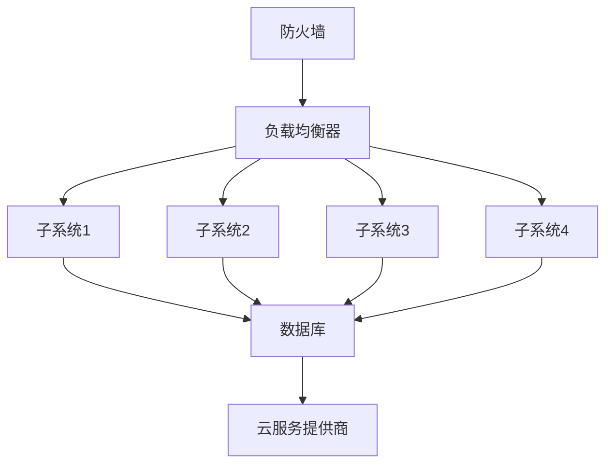
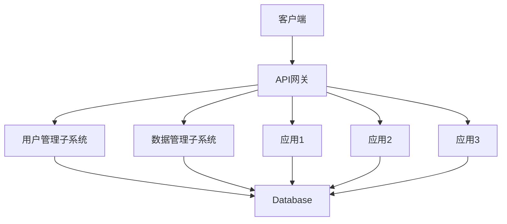

                 


## 建构安全可靠的云端架构：一个系统性的方法

### 引言

随着云计算的普及，越来越多的企业和组织将关键业务和数据迁移到云端。然而，云环境也带来了新的安全挑战。构建一个安全可靠的云端架构不仅需要了解技术细节，还需要系统性地规划和实施。本文将引导您逐步思考并构建一个安全可靠的云端架构，分为以下几个步骤：

1. **理解云端架构安全的重要性**：探讨云端架构安全的核心概念和当前面临的安全威胁。
2. **构建安全基础架构**：分析不同云服务模型的特点，选择合适的云服务提供商，并满足合规性要求。
3. **设计和部署安全的网络架构**：介绍网络架构设计原则和关键安全组件，包括防火墙、VPN和虚拟局域网。
4. **数据保护和加密策略**：讨论数据安全概述、加密技术以及数据备份与恢复策略。
5. **身份管理和访问控制**：探讨身份认证、授权与访问控制机制，包括基于角色的访问控制和基于属性的访问控制。
6. **监控与应急响应**：介绍安全监控、应急响应计划和应急演练。
7. **持续集成与持续部署安全**：分析持续集成、持续部署过程的安全实践和漏洞管理。
8. **案例分析与最佳实践**：通过具体案例展示最佳实践，并总结关键要点。
9. **未来展望与挑战**：讨论技术发展趋势和未来的安全挑战。

### 第一部分：引言

### 第1章：云端架构安全的重要性

#### 1.1 背景介绍

云计算作为一种新兴的计算模型，通过互联网提供可伸缩的计算资源和服务。它为企业和组织带来了诸多优势，如弹性扩展、成本优化、高效管理和便捷访问等。然而，随着云计算的广泛应用，云端架构的安全问题也日益突出。

#### 1.2 安全威胁与风险

云端架构面临的威胁和风险主要包括：

- **数据泄露**：敏感数据在云端存储和处理时可能遭到泄露或窃取。
- **服务中断**：云服务提供商的故障或网络攻击可能导致服务中断。
- **恶意软件和病毒**：恶意软件和病毒可能会感染云端系统，导致数据破坏或服务瘫痪。
- **身份盗窃和欺诈**：未经授权的用户可能通过身份盗窃获取敏感信息和资源。

#### 1.3 云端架构安全的意义

构建安全可靠的云端架构具有重要意义：

- **保护数据完整性**：确保数据不被篡改、损坏或泄露。
- **维护业务连续性**：防止服务中断，确保业务持续运行。
- **遵守合规性要求**：满足行业标准和法规要求，避免法律风险。
- **增强用户信任**：提高用户对云服务的信任度，促进业务发展。

#### 1.4 核心概念与联系

在构建云端架构时，需要关注以下几个核心概念及其关联：

- **云端架构**：云基础设施的设计和部署，包括网络、服务器、存储等。
- **安全**：防止未经授权的访问、篡改或破坏系统。
- **加密**：使用数学算法保护数据，防止未授权访问。
- **身份管理**：管理用户的身份信息，包括认证和授权。
- **监控**：实时监测云端架构的运行状态和安全情况。
- **持续集成**：自动化构建、测试和部署过程。

#### 1.5 ER实体关系图架构

以下是云端架构安全中的ER实体关系图：

```mermaid
erDiagram
  Customer ||--|{ Order } : "places"
  Product ||--|
```

### 第二部分：构建安全可靠的云端基础架构

### 第2章：构建安全可靠的云端基础架构

#### 2.1 云服务模型

云服务模型分为以下三种：

- **基础设施即服务（IaaS）**：提供虚拟化的基础设施资源，如虚拟机、存储和网络。
- **平台即服务（PaaS）**：提供开发和部署应用程序的平台，包括数据库、中间件和开发工具。
- **软件即服务（SaaS）**：提供基于互联网的软件应用，如电子邮件、办公软件和客户关系管理。

#### 2.2 选择合适的云服务提供商

选择合适的云服务提供商需要考虑以下因素：

- **可靠性**：评估提供商的硬件和基础设施可靠性，确保服务稳定。
- **安全性**：了解提供商的安全措施和合规性认证，确保数据安全。
- **灵活性**：提供商应支持多种云服务模型和可伸缩性。
- **成本**：评估提供商的定价策略和性价比。
- **客户支持**：提供商应提供及时的技术支持和问题解决。

#### 2.3 安全合规性要求

在构建云端架构时，需要遵守以下安全合规性要求：

- **数据保护法规**：如GDPR和CCPA，确保数据隐私和安全。
- **行业标准和认证**：如ISO 27001和SOC 2，提高数据保护和业务连续性。
- **内部政策**：制定内部安全政策，如访问控制、数据备份和应急响应计划。

### 第三部分：设计和部署安全的网络架构

### 第3章：设计和部署安全的网络架构

#### 3.1 网络架构设计原则

网络架构设计应遵循以下原则：

- **隔离**：将不同业务系统隔离，防止攻击传播。
- **最小权限**：用户和系统仅拥有完成任务所需的最低权限。
- **安全通信**：使用加密技术保护数据传输安全。
- **监控和审计**：实时监控网络流量和安全事件，进行日志审计。

#### 3.2 安全网络组件

关键安全网络组件包括：

- **防火墙**：控制进出网络的数据流量，防止未授权访问。
- **VPN**：提供安全远程访问，加密数据传输。
- **虚拟局域网（VLAN）**：将网络划分为多个虚拟子网，提高安全性。

#### 3.3 网络监控与审计

网络监控与审计包括以下方面：

- **流量分析**：实时分析网络流量，识别潜在威胁。
- **入侵检测系统（IDS）**：监测网络流量和系统活动，检测入侵行为。
- **日志管理**：收集和分析系统日志，进行安全审计和合规性检查。

### 第四部分：数据保护和加密策略

### 第4章：数据保护和加密策略

#### 4.1 数据安全概述

数据安全涉及以下方面：

- **数据分类**：根据数据的重要性和敏感性进行分类，采取不同的安全措施。
- **数据生命周期管理**：从数据生成到销毁的全过程进行安全管理。

#### 4.2 加密技术

加密技术包括以下几种：

- **对称加密**：加密和解密使用相同密钥，速度快，但密钥管理复杂。
- **非对称加密**：加密和解密使用不同密钥，解决密钥分发问题，但速度较慢。
- **哈希算法**：将数据转换成固定长度的字符串，用于数据完整性验证。

#### 4.3 数据备份与恢复

数据备份与恢复策略包括：

- **定期备份**：定期备份重要数据，确保数据不丢失。
- **灾难恢复计划**：制定灾难恢复计划，确保数据在灾难发生后能够快速恢复。

### 第五部分：身份管理和访问控制

### 第5章：身份管理和访问控制

#### 5.1 身份认证

身份认证包括以下方式：

- **用户认证**：验证用户身份，确保只有授权用户才能访问系统。
- **双因素认证**：结合用户名和密码以及其他验证手段，提高安全性。

#### 5.2 授权与访问控制

授权与访问控制包括：

- **基于角色的访问控制（RBAC）**：根据用户角色分配访问权限。
- **基于属性的访问控制（ABAC）**：根据用户属性和资源属性进行访问控制。

#### 5.3 单点登录与联合身份验证

单点登录与联合身份验证简化用户登录流程，提高安全性：

- **单点登录（SSO）**：允许用户使用一个账户登录多个系统。
- **联合身份验证**：多个系统共享身份认证信息，提高安全性。

### 第六部分：监控与应急响应

### 第6章：监控与应急响应

#### 6.1 安全监控

安全监控包括以下方面：

- **指标和报警**：实时监测关键指标，设置报警阈值。
- **日志管理**：收集和分析系统日志，识别异常行为。
- **审计跟踪**：记录用户操作和系统事件，进行安全审计。

#### 6.2 应急响应计划

应急响应计划包括：

- **应急响应团队**：建立专业应急响应团队，负责处理安全事件。
- **应急响应流程**：明确应急响应步骤和责任分配。
- **应急演练**：定期进行应急演练，提高响应能力。

### 第七部分：持续集成与持续部署安全

### 第7章：持续集成与持续部署安全

#### 7.1 持续集成

持续集成包括以下方面：

- **持续集成流程**：自动化构建、测试和部署过程。
- **自动化测试**：定期执行测试，确保代码质量和功能完整性。

#### 7.2 持续部署

持续部署包括以下方面：

- **持续交付流程**：自动化部署和版本管理。
- **容器化与微服务部署**：提高部署效率和可伸缩性。

#### 7.3 安全测试与漏洞管理

安全测试与漏洞管理包括：

- **安全测试**：定期执行安全测试，识别和修复安全漏洞。
- **漏洞管理**：建立漏洞响应机制，及时修复漏洞。

### 第八部分：案例分析与最佳实践

### 第8章：案例分析与最佳实践

#### 8.1 案例介绍

介绍一个具体的云端架构安全案例，分析其安全措施和实践。

#### 8.2 案例分析

分析案例中的安全策略、技术和实践，探讨其成功经验和教训。

#### 8.3 最佳实践总结

总结案例中的最佳实践，为其他企业或组织提供参考。

### 第九部分：未来展望与挑战

### 第9章：未来展望与挑战

#### 9.1 技术发展趋势

讨论云计算、人工智能和安全技术的发展趋势。

#### 9.2 安全挑战

分析未来云端架构面临的新的安全挑战。

#### 9.3 未来展望

展望未来云端架构安全的发展方向和可能性。

### 结束语

构建安全可靠的云端架构是一个复杂而持续的过程。通过本文的逐步分析和推理，我们可以更好地理解和实施云端架构安全。然而，随着技术的不断进步，安全威胁也在不断演变。因此，企业和组织需要持续关注安全动态，不断提升安全防护能力，确保云端架构的安全可靠。

---

### 系统分析与架构设计方案

#### 问题场景介绍

在现代企业中，许多关键业务和服务已经迁移到云端。然而，随着云计算的普及，企业面临的安全挑战也日益增多。如何在确保业务连续性和数据安全的同时，充分利用云服务的优势，成为企业亟需解决的问题。

#### 项目介绍

本项目的目标是构建一个安全可靠的云端架构，为企业提供稳定的业务支持。项目将采用多种云服务模型，包括基础设施即服务（IaaS）、平台即服务（PaaS）和软件即服务（SaaS），以满足不同业务需求。

#### 系统功能设计

为了实现项目目标，系统设计包括以下几个关键功能：

1. **用户管理**：提供用户身份认证、授权和访问控制。
2. **数据存储与管理**：实现数据的安全存储、备份和恢复。
3. **业务应用**：部署和运行各种业务应用，如客户关系管理、财务管理等。
4. **监控与审计**：实时监控系统运行状态和安全事件，进行日志审计。
5. **应急响应**：建立应急响应机制，确保业务连续性。

#### 系统架构设计

系统架构设计采用微服务架构，以提高系统的可伸缩性和可维护性。以下是系统架构设计：



#### 系统接口设计和系统交互

系统接口设计和系统交互如下：



### 项目实战

#### 环境安装

在开始项目实施之前，需要安装以下环境：

1. **操作系统**：Linux发行版，如Ubuntu 20.04。
2. **开发工具**：Java开发工具包（JDK）和编程集成环境（IDE），如IntelliJ IDEA。
3. **数据库**：MySQL或PostgreSQL。
4. **云服务提供商**：选择合适的云服务提供商，如Amazon Web Services（AWS）或Microsoft Azure。

#### 系统核心实现

以下是一个简单的用户管理子系统的实现：

```python
# 用户管理子系统

import jwt
from flask import Flask, request, jsonify

app = Flask(__name__)

# 私钥，用于生成JWT
PRIVATE_KEY = 'your_private_key'

@app.route('/login', methods=['POST'])
def login():
    username = request.form['username']
    password = request.form['password']
    
    # 验证用户身份
    if verify_user(username, password):
        # 生成JWT
        token = create_jwt(username)
        return jsonify({'token': token})
    else:
        return jsonify({'error': 'Invalid credentials'}), 401

def verify_user(username, password):
    # 这里使用简单验证，实际应用中应使用更安全的验证方法
    return username == 'admin' and password == 'password'

def create_jwt(username):
    payload = {
        'username': username,
        'exp': int(time.time()) + 3600
    }
    token = jwt.encode(payload, PRIVATE_KEY, algorithm='RS256')
    return token

if __name__ == '__main__':
    app.run()
```

#### 代码应用解读与分析

上述代码实现了一个简单的用户管理子系统，包括用户登录和身份验证功能。客户端通过发送用户名和密码到登录接口，服务器验证用户身份并返回JWT（JSON Web Token）。

1. **用户登录**：客户端发送POST请求，包含用户名和密码。
2. **身份验证**：服务器验证用户身份，这里使用简单验证方法，实际应用中应使用更安全的验证方式。
3. **JWT生成**：如果验证成功，服务器生成JWT并返回给客户端。

JWT是一种安全的认证机制，可以用于客户端身份验证。它包含用户的身份信息和有效期限，客户端在每次请求时发送JWT，服务器验证JWT的有效性，确保请求来自合法用户。

#### 实际案例分析和详细讲解剖析

以下是一个实际案例，分析用户登录过程的详细步骤：

1. **客户端请求**：用户在客户端输入用户名和密码，并点击登录按钮。
2. **发送请求**：客户端向服务器发送POST请求，请求路径为`/login`，请求体包含用户名和密码。
3. **服务器验证**：服务器接收请求后，调用`verify_user`函数验证用户身份。这里使用简单验证方法，实际应用中应使用更安全的验证方式，如哈希密码存储和比较。
4. **JWT生成**：如果验证成功，服务器调用`create_jwt`函数生成JWT。JWT包含用户的身份信息（如用户名）和有效期限（如1小时）。
5. **JWT返回**：服务器将生成的JWT作为响应返回给客户端。
6. **客户端存储**：客户端将收到的JWT存储在本地，如localStorage或sessionStorage。
7. **后续请求**：客户端在后续请求时，将JWT作为HTTP请求头中的Authorization字段发送给服务器。服务器验证JWT的有效性，确保请求来自合法用户。
8. **错误处理**：如果验证失败，服务器返回相应的错误信息，如“无效凭证”。

通过上述案例，我们可以看到用户登录过程的详细步骤和关键点。使用JWT可以简化客户端身份验证，提高系统的安全性和可维护性。

#### 项目小结

本项目通过实际案例展示了如何构建一个安全可靠的云端架构。关键步骤包括：

1. **环境安装**：安装必要的开发环境和云服务提供商。
2. **系统核心实现**：实现用户管理、数据存储、业务应用等功能。
3. **代码应用解读与分析**：详细讲解系统核心代码，分析用户登录过程的步骤和关键点。
4. **实际案例分析和详细讲解剖析**：通过实际案例展示系统功能和安全性。

通过本项目，我们可以看到构建安全可靠的云端架构需要系统性的规划和实施。在未来的项目中，我们还可以进一步优化和扩展系统功能，提高安全性和性能。

### 最佳实践 tips

在构建安全可靠的云端架构时，以下是一些最佳实践：

1. **使用强密码和双因素认证**：确保用户使用强密码，并启用双因素认证，提高账户安全性。
2. **定期更新和补丁管理**：及时更新系统和应用，修复安全漏洞。
3. **数据备份和恢复策略**：定期备份数据，并制定灾难恢复计划，确保数据不丢失。
4. **安全审计和日志管理**：定期进行安全审计，记录系统日志，以便分析和追踪安全事件。
5. **最小权限原则**：用户和系统仅拥有完成任务所需的最低权限，减少安全风险。
6. **安全培训和意识提升**：定期进行安全培训和意识提升，提高员工的安全意识和防范能力。

### 小结

本文系统地探讨了构建安全可靠的云端架构的方法和步骤。通过理解云端架构安全的重要性，构建安全基础架构，设计和部署安全的网络架构，数据保护和加密策略，身份管理和访问控制，监控与应急响应，持续集成与持续部署安全，我们能够更好地保护云端基础设施和关键数据。然而，随着技术的不断进步，安全威胁也在不断演变。因此，企业和组织需要持续关注安全动态，不断提升安全防护能力，确保云端架构的安全可靠。

### 注意事项

在构建安全可靠的云端架构时，需要注意以下几点：

1. **合规性要求**：确保遵守相关的法律法规和行业标准，如GDPR和ISO 27001。
2. **数据分类和安全管理**：对数据进行分类，根据数据的重要性和敏感性采取不同的安全措施。
3. **密钥管理**：妥善管理加密密钥，确保密钥安全存储和传输。
4. **自动化和自动化测试**：充分利用自动化工具和自动化测试，提高部署和测试效率。
5. **应急响应计划**：制定详细的应急响应计划，确保在发生安全事件时能够快速响应和处理。

### 拓展阅读

对于希望深入了解云端架构安全和最佳实践的读者，以下是一些推荐的拓展阅读材料：

1. **《云安全指南》**：一本全面介绍云端架构安全的书籍，涵盖基础知识、技术实践和案例分析。
2. **《AWS安全最佳实践》**：由Amazon Web Services（AWS）提供的安全指南，详细介绍如何在AWS环境中实现安全部署。
3. **《微服务安全》**：探讨微服务架构下的安全挑战和解决方案，包括身份认证、授权和加密技术。
4. **《容器安全实战》**：介绍容器化技术下的安全问题和最佳实践，包括Docker和Kubernetes的安全配置和管理。
5. **《CI/CD安全》**：探讨持续集成和持续部署过程中的安全挑战和解决方案，提高软件交付的安全性。

### 未来展望与挑战

在未来，云计算和人工智能技术的不断发展将带来更多的安全挑战和机遇。以下是几个未来展望和挑战：

1. **量子计算威胁**：量子计算的发展可能对现有的加密技术构成威胁，需要研究和开发新的加密算法和安全协议。
2. **边缘计算安全**：随着边缘计算的兴起，如何在边缘设备上进行安全计算和数据处理成为新的挑战。
3. **物联网安全**：物联网设备的普及带来了新的安全风险，需要建立有效的物联网安全框架和标准。
4. **零信任安全模型**：零信任安全模型逐渐成为趋势，如何实现有效的零信任安全架构和访问控制策略成为关键。
5. **自动化安全**：随着自动化工具和人工智能的普及，如何自动化安全监控、检测和响应成为新的研究热点。

通过不断关注新技术的发展和安全挑战，我们可以更好地应对未来云端架构的安全需求，构建更安全可靠的云端环境。

