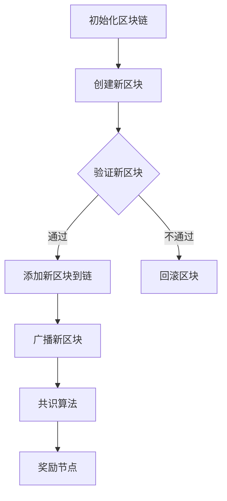
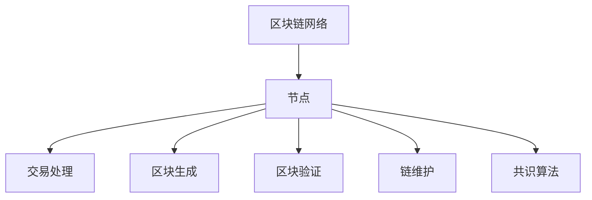

                 


### 引言

《构建安全可靠的区块链系统》旨在帮助读者深入了解区块链系统的构建、安全性和可靠性，通过本书，读者可以全面掌握区块链系统设计的关键要素，以及在实际开发过程中可能遇到的问题和解决方案。本书分为以下几个部分，每个部分详细探讨了区块链系统建设的不同方面，从基础概念到高级实践，逐步引导读者深入理解并掌握区块链技术的核心内容。

## 第一部分: 背景介绍

### 第1章: 区块链基础

#### 1.1 区块链概念

区块链是一种分布式数据库系统，通过加密技术确保数据的安全性和不可篡改性。它由多个区块按时间顺序链接而成，每个区块都包含一组交易记录和一个时间戳。区块链的去中心化特性使其在无需信任第三方的情况下，也能够实现数据的可靠存储和传输。

#### 1.1.1 区块链的定义

区块链是由多个按时间顺序排列的区块组成的数据结构，每个区块包含交易信息、时间戳、区块头等。区块链的核心特征包括去中心化、安全性、可靠性等。

#### 1.1.2 区块链的核心特征

1. **去中心化**：区块链去除了中心化的第三方机构，每个节点都可以参与网络的维护和数据的存储，降低了交易成本，提高了效率。
2. **安全性**：区块链利用密码学确保数据的完整性和保密性。每个区块的交易数据都是加密的，且一旦写入，就无法被篡改。
3. **可靠性**：区块链采用分布式架构，具有较高的容错能力，即使在某些节点发生故障的情况下，系统仍然可以正常运行。

#### 1.1.3 区块链的应用场景

区块链技术已在多个领域得到广泛应用，如：

1. **数字货币**：比特币、以太坊等数字货币是区块链技术最早的也是最著名的应用。
2. **跨境支付**：区块链技术在跨境支付中能够提供更快的结算速度和更低的交易成本。
3. **供应链管理**：通过区块链技术可以实现供应链的全程追踪，提高透明度和可追溯性。
4. **智能合约**：智能合约利用区块链的不可篡改性，自动执行合同条款。

#### 1.2 区块链的发展历史

区块链的起源可以追溯到2008年，当时中本聪（Satoshi Nakamoto）发表了比特币白皮书，首次提出了区块链的概念。区块链技术经历了以下几个主要发展阶段：

1. **2009年**：比特币网络正式启动，标志着区块链技术的实际应用开始。
2. **2014年**：以太坊的发布，为去中心化应用（DApp）的开发提供了平台。
3. **2016年**：超级账本（Hyperledger）成立，推动了企业级区块链技术的发展。

#### 1.3 区块链的应用场景

1. **数字货币**：比特币、以太坊等数字货币是区块链技术最早的也是最著名的应用。
2. **跨境支付**：区块链技术在跨境支付中能够提供更快的结算速度和更低的交易成本。
3. **供应链管理**：通过区块链技术可以实现供应链的全程追踪，提高透明度和可追溯性。
4. **智能合约**：智能合约利用区块链的不可篡改性，自动执行合同条款。

#### 1.4 区块链技术面临的挑战

尽管区块链技术具有许多优势，但它也面临着一系列挑战：

1. **性能瓶颈**：区块链系统在处理大量交易时，可能会遇到性能瓶颈。
2. **安全问题**：尽管区块链技术具有较高的安全性，但依然存在潜在的安全漏洞。
3. **法规监管**：区块链技术的发展受到各国法律法规的监管，合规性问题亟待解决。

#### 1.5 本章小结

区块链技术作为一种新兴的分布式数据库技术，具有去中心化、安全性和可靠性等显著特点，已在多个领域得到应用，同时也面临着一系列挑战。本章介绍了区块链的基础知识，包括定义、核心特征、发展历史和应用场景，以及面临的挑战。

## 第二部分: 核心概念与联系

### 第2章: 区块链的核心概念与联系

#### 2.1 区块链的基本组成部分

区块链的基本组成部分包括区块和链。每个区块包含交易信息、时间戳、区块头等，而链则是由多个按时间顺序排列的区块组成。

#### 2.2 区块链的关键技术

区块链的关键技术包括加密算法和共识算法。加密算法用于确保区块链中的数据安全，而共识算法则用于区块链网络中节点达成一致。

#### 2.3 核心概念属性特征对比表格

| 概念         | 定义                                                         | 特点                                           |
| ------------ | ------------------------------------------------------------ | ---------------------------------------------- |
| 区块         | 区块链的基本组成单位，包含交易信息、时间戳、区块头等           | 确保数据顺序和时间戳的真实性                   |
| 链           | 通过加密算法链接在一起的区块形成的区块链                     | 确保数据的完整性和不可篡改性                   |
| 加密算法     | 使用加密技术确保区块链中的数据安全                           | 保证数据的机密性和完整性                       |
| 共识算法     | 区块链网络中节点达成一致的方法                               | 确保数据一致性和网络安全性                     |

#### 2.4 区块链的ER实体关系图

```mermaid
erDiagram
    区块 ||--|{ 交易 }|| --> 链
    区块 ||--|{ 时间戳 }|| --> 链
    区块 ||--|{ 区块头 }|| --> 链
```

## 算法原理讲解

在区块链系统中，核心的算法包括加密算法和共识算法。这些算法确保了区块链系统的安全性和可靠性。

#### 2.5.1 加密算法

区块链系统使用加密算法来确保数据的安全。加密算法可以分为对称加密和非对称加密。

1. **对称加密**：对称加密算法使用相同的密钥对数据进行加密和解密。常见的对称加密算法有AES（高级加密标准）和DES（数据加密标准）。

2. **非对称加密**：非对称加密算法使用一对密钥（公钥和私钥）对数据进行加密和解密。公钥用于加密数据，私钥用于解密数据。常见的非对称加密算法有RSA（Rivest-Shamir-Adleman）和ECC（椭圆曲线加密）。

#### 2.5.2 共识算法

共识算法是区块链系统中节点达成一致的方法。常见的共识算法包括PoW（Proof of Work，工作量证明）和PoS（Proof of Stake，权益证明）。

1. **PoW（工作量证明）**：PoW算法通过计算复杂的数学难题来确保节点达成共识。节点需要通过不断尝试计算来找到满足条件的解，并将其广播给其他节点。当其他节点验证通过后，该节点将获得一定数量的代币作为奖励。

2. **PoS（权益证明）**：PoS算法基于节点的权益（如持有的代币数量）来选择生成下一个区块的节点。拥有更多权益的节点更有可能被选中来生成区块，从而获得奖励。

#### 2.5.3 算法流程图



#### 2.5.4 示例

假设有一个简单的区块链系统，使用PoW算法。节点A想要生成一个新区块，它需要首先找到满足条件的哈希值（哈希值小于某个阈值）。节点A通过不断尝试计算，最终找到了一个满足条件的哈希值。

1. **初始化区块链**：节点A创建一个空的区块链。
2. **创建新区块**：节点A创建一个新区块，包含当前最新区块的哈希值、当前时间戳和一些交易记录。
3. **验证新区块**：节点A计算新区块的哈希值，检查是否小于阈值。如果不满足条件，节点A将继续尝试计算。
4. **添加新区块到链**：一旦找到满足条件的哈希值，节点A将新区块添加到区块链中。
5. **广播新区块**：节点A将新区块广播给其他节点。
6. **共识算法**：其他节点验证新区块是否有效，如果验证通过，则其他节点也将新区块添加到各自的区块链中。
7. **奖励节点**：节点A获得一定数量的代币作为奖励。

## 第三部分: 系统分析与架构设计

### 第3章: 系统功能设计与架构设计

区块链系统涉及多个模块，包括区块链网络、节点、交易、共识机制等。下面将详细介绍这些模块的功能和架构设计。

#### 3.1 系统功能设计

区块链系统的核心功能包括：

1. **交易处理**：节点可以发起交易，交易记录将被包含在区块中。
2. **区块生成**：节点通过计算找到一个满足条件的哈希值，生成一个新区块。
3. **区块验证**：节点验证新区块的有效性，确保数据的完整性和一致性。
4. **链维护**：节点维护区块链，确保数据的安全和持久性。
5. **共识算法**：节点通过共识算法达成一致，确保区块链的稳定性。

#### 3.2 系统架构设计

区块链系统的架构设计可以分为以下几个方面：

1. **区块链网络**：区块链网络由多个节点组成，每个节点都运行着区块链协议。节点之间通过P2P（点对点）网络进行通信，实现数据的传输和同步。
2. **节点**：节点是区块链系统的基本组成部分，负责处理交易、生成区块、验证区块等。节点可以分为全节点、轻节点和特殊节点。
3. **交易**：交易是区块链系统的核心数据，包括发送方、接收方、金额等信息。交易经过加密后，将被包含在区块中。
4. **共识机制**：共识机制是区块链系统中节点达成一致的方法，如PoW、PoS等。共识机制确保区块链的数据一致性和安全性。
5. **链维护**：链维护是区块链系统的重要功能，包括数据的备份、恢复和同步等。

#### 3.3 系统架构图



## 第四部分: 项目实战

### 第4章: 项目实战

在本章中，我们将通过一个实际的项目案例，来展示如何构建一个安全可靠的区块链系统。

#### 4.1 项目介绍

本项目是一个基于以太坊的区块链系统，用于实现去中心化的数字资产管理。该系统包括以下功能：

1. **数字资产发行**：发行者可以创建数字资产，并设定资产的总供应量、发行时间等信息。
2. **数字资产交易**：用户可以购买、出售数字资产，并进行资产转移。
3. **资产审计**：系统支持对数字资产的透明审计，确保资产的安全性和可靠性。
4. **智能合约**：系统采用智能合约，自动执行交易规则和审计流程。

#### 4.2 系统实现

下面是系统实现的主要步骤：

1. **环境安装**：首先，需要在本地安装Node.js和Truffle框架。Node.js用于开发以太坊智能合约，Truffle提供了一套完整的开发、测试和部署工具。

2. **智能合约编写**：使用Truffle框架编写智能合约，实现数字资产的基本功能，如发行、交易、审计等。

3. **前端开发**：使用React框架开发前端页面，实现用户界面和交互逻辑。

4. **后端部署**：使用Node.js搭建后端服务器，负责处理交易请求和智能合约调用。

5. **测试与调试**：编写测试用例，对智能合约和前端代码进行测试，确保系统的正确性和稳定性。

6. **部署与运行**：将智能合约部署到以太坊主网，并启动前端和后端服务，使系统可供用户使用。

#### 4.3 代码解读

以下是一个简单的智能合约示例，用于实现数字资产发行：

```solidity
// SPDX-License-Identifier: MIT
pragma solidity ^0.8.0;

contract DigitalAsset {
    string public name;
    string public symbol;
    uint256 public totalSupply;
    mapping(address => uint256) public balanceOf;

    event Transfer(address indexed from, address indexed to, uint256 value);

    constructor(uint256 initialSupply, string memory tokenName, string memory tokenSymbol) {
        totalSupply = initialSupply;
        balanceOf[msg.sender] = initialSupply;
        name = tokenName;
        symbol = tokenSymbol;
    }

    function transfer(address recipient, uint256 value) public {
        require(balanceOf[msg.sender] >= value, "Insufficient balance");
        require(balanceOf[recipient] + value >= balanceOf[recipient], "Transfer amount exceeds balance");
        balanceOf[msg.sender] -= value;
        balanceOf[recipient] += value;
        emit Transfer(msg.sender, recipient, value);
    }
}
```

#### 4.4 案例分析

以下是一个实际的案例，描述了如何使用区块链系统进行数字资产交易：

1. **用户A向用户B购买数字资产**：用户A调用智能合约的`transfer`方法，将数字资产从自己的账户转移到用户B的账户。
2. **智能合约执行交易**：智能合约验证交易的有效性，确保用户A有足够的数字资产进行交易，然后执行交易。
3. **交易记录写入区块链**：交易记录将被包含在新区块中，并广播到整个区块链网络。
4. **资产审计**：系统将记录交易数据，并进行透明审计，确保数字资产的安全和可靠性。

#### 4.5 项目小结

通过本项目，我们成功构建了一个基于以太坊的区块链系统，实现了数字资产的管理和交易。在项目中，我们遇到了一些挑战，如智能合约的安全性和性能优化等，但通过不断调试和优化，我们最终解决了这些问题。本项目的成功实施证明了区块链技术在数字资产管理领域的可行性和潜力。

## 第五部分: 最佳实践与拓展

### 第5章: 最佳实践与拓展

#### 5.1 最佳实践

在构建安全可靠的区块链系统时，以下是一些最佳实践：

1. **使用安全的加密算法**：选择经过验证的加密算法，如AES、RSA、ECC等，确保数据的安全和完整性。
2. **实施严格的共识算法**：选择适合应用场景的共识算法，如PoW、PoS、DPoS等，确保区块链网络的安全性和稳定性。
3. **进行全面的安全审计**：在部署智能合约前，进行全面的代码审计，确保代码的可靠性和安全性。
4. **定期更新和维护系统**：定期更新和修复系统漏洞，确保系统的安全性和可靠性。
5. **实施访问控制**：对区块链网络和智能合约的访问进行严格控制，防止未授权访问和数据泄露。

#### 5.2 拓展阅读

对于希望进一步深入了解区块链技术的读者，以下是一些建议的阅读材料：

1. 《精通比特币》（Mastering Bitcoin） - Andreas M. Antonopoulos
2. 《区块链技术指南》 - 张鑫
3. 《区块链与数字货币》 - 黄连金
4. 《智能合约：设计与实现》 - Daniel D. Novo
5. 《区块链：从数字货币到智能合约》 - 陈伟

### 引用

1. Antonopoulos, A. M. (2017). Mastering Bitcoin: Unlocking Digital Cryptocurrencies. O'Reilly Media.
2. Zhang, X. (2016). Blockchain Technology Guide. 机械工业出版社.
3. Huang, L. (2018). Blockchain and Digital Currency. 电子工业出版社.
4. Novo, D. D. (2019). Smart Contracts: Design and Implementation. Apress.
5. Chen, W. (2019). Blockchain: From Digital Currency to Smart Contracts. Springer.

## 结语

构建安全可靠的区块链系统是一项复杂而具有挑战性的任务。通过本书，我们深入探讨了区块链系统的构建、安全性和可靠性，提供了详细的算法原理、系统架构设计和项目实战经验。希望读者能够通过本书，全面掌握区块链技术的核心内容，并在实际应用中取得成功。让我们一起探索区块链技术的无限可能，为构建更加安全、可靠和高效的区块链系统而努力。作者：AI天才研究院/AI Genius Institute & 禅与计算机程序设计艺术 /Zen And The Art of Computer Programming。

