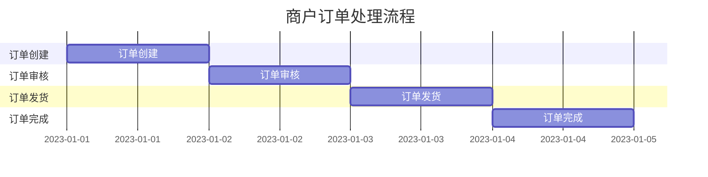
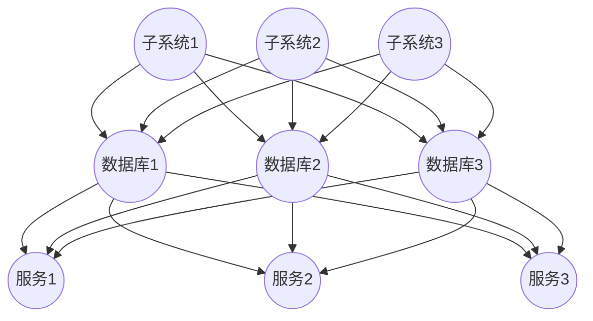
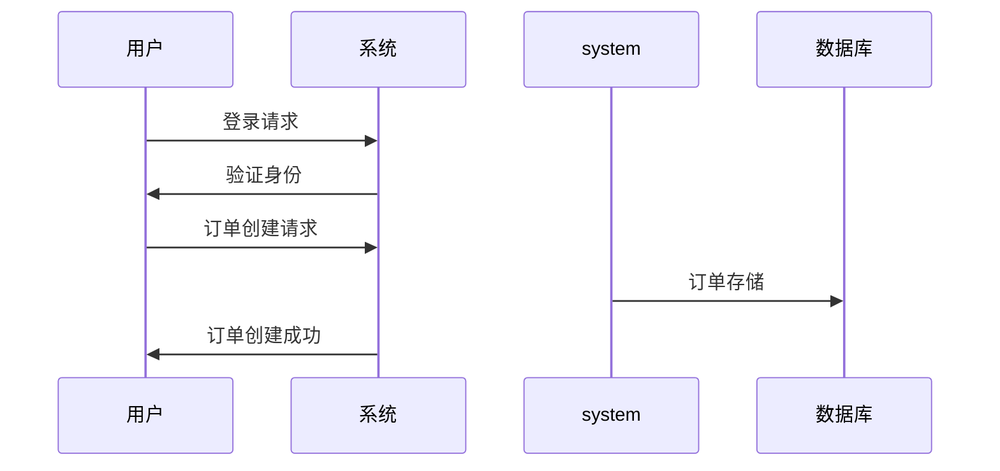

                 

### 《构建安全可靠的多租户架构》技术博客

#### 关键词
- 多租户架构
- 数据隔离
- 安全性
- 资源利用率
- 可扩展性

#### 摘要
本文将深入探讨多租户架构的设计与实践，重点在于构建一个既安全又可靠的多租户系统。我们将分章节逐步分析多租户架构的背景、核心概念、设计原则、实现细节，并分享实战经验和最佳实践。

---

#### 第一部分：多租户架构概述

##### 第1章：多租户架构背景与需求

**1.1 问题背景**
- 引言：多租户架构的起源与发展
- 企业需求：数据隔离、安全性和资源利用率的提升

**1.2 多租户架构的定义与特点**
- 多租户架构的定义
- 核心特点：数据隔离、可扩展性、灵活性和资源共享

**1.3 多租户架构的边界与外延**
- 适用场景：企业级应用、云计算、SaaS平台
- 限制与挑战：性能问题、数据一致性和维护复杂性

**1.4 多租户架构的历史与发展趋势**
- 传统单体架构与多租户架构的对比
- 多租户架构的发展趋势与未来展望

##### 第2章：核心概念与联系

**2.1 多租户架构的基本概念**
- 租户：独立的业务实体
- 数据库：租户隔离与共享
- 服务：多租户服务的部署与管理

**2.2 概念属性特征对比表格**
- 数据库隔离机制
- 服务模型
- 安全机制

**2.3 多租户架构的ER实体关系图**
- 租户、服务、数据库的实体关系

**2.4 多租户架构中的关键技术和工具**
- 数据库分库分表
- 负载均衡
- 持续集成与持续部署（CI/CD）

##### 第3章：多租户架构设计

**3.1 系统功能设计**
- 功能需求分析
- 领域模型（使用Mermaid绘制类图）

**3.2 系统架构设计**
- 架构设计原则
- 系统架构图（使用Mermaid绘制架构图）

**3.3 系统接口设计**
- 接口设计与规范
- API文档

**3.4 系统交互设计**
- 交互流程
- 序列图（使用Mermaid绘制序列图）

##### 第4章：安全可靠的多租户架构实现

**4.1 数据隔离与访问控制**
- 数据隔离机制
- 访问控制策略

**4.2 安全机制**
- 安全框架
- 安全审计

**4.3 可靠性设计**
- 系统容错
- 数据备份与恢复

##### 第5章：项目实战

**5.1 环境安装与配置**
- 操作系统与环境准备
- 数据库安装与配置

**5.2 系统核心实现**
- 源代码解析
- 核心算法实现

**5.3 代码应用解读**
- 应用场景分析
- 代码运行流程

**5.4 实际案例剖析**
- 案例介绍
- 案例分析与解读

**5.5 项目小结**
- 项目总结
- 经验与启示

##### 第6章：最佳实践与注意事项

**6.1 多租户架构最佳实践**
- 架构设计最佳实践
- 安全策略最佳实践

**6.2 注意事项**
- 常见问题与解决
- 维护与优化策略

##### 第7章：小结与拓展阅读

**7.1 全书回顾**
- 关键概念与原理
- 实践与应用场景

**7.2 拓展阅读**
- 相关书籍与文献推荐
- 最新技术研究动态

---

#### 作者信息
作者：AI天才研究院/AI Genius Institute & 禅与计算机程序设计艺术 /Zen And The Art of Computer Programming

---

**开始撰写正文内容前，让我们进行以下步骤的思考：**

1. **核心概念定义与背景介绍**：我们需要清晰地定义多租户架构的概念，并提供其背景信息，帮助读者理解这一架构的起源和发展。
2. **核心概念与联系**：通过表格和实体关系图，我们将多租户架构中的关键概念和联系展现出来，便于读者理解。
3. **系统分析与架构设计**：详细描述系统功能设计、架构设计、接口设计和交互设计，确保读者能够理解整个系统的运作机制。
4. **安全与可靠性实现**：讨论如何确保数据隔离、访问控制和系统安全性，同时实现系统的可靠性。
5. **项目实战**：通过实际的案例来展示多租户架构的应用，并分享经验与启示。
6. **最佳实践与注意事项**：总结最佳实践并提供一些常见问题的解决策略，以提高多租户架构的实践效果。
7. **拓展阅读**：推荐一些相关的书籍和研究方向，帮助读者进一步探索多租户架构的深度和广度。

现在，让我们开始详细撰写每一部分的内容吧！### 第1章：多租户架构背景与需求

#### 1.1 问题背景

多租户架构的概念起源于20世纪80年代的数据库管理系统（DBMS）领域。随着云计算和SaaS（软件即服务）的兴起，多租户架构逐渐成为企业级应用和大型系统设计中的重要选择。其初衷是为了解决企业软件在扩展性和资源利用率方面的需求，同时提供高安全性和数据隔离性。

在传统的单体架构中，每个客户都拥有独立的实例，导致资源利用率低下，且难以扩展。而多租户架构通过在共享的基础设施上为多个租户提供服务，实现了更高的资源利用率和成本效益。然而，这同时也带来了数据隔离和安全性方面的挑战。

企业选择多租户架构的原因主要包括以下几个方面：

1. **成本效益**：多租户架构减少了硬件和软件的重复投资，降低了运营成本。
2. **扩展性**：多租户架构能够轻松支持用户和数据的增长，提高了系统的可扩展性。
3. **灵活性**：多租户架构允许企业根据不同租户的需求进行定制和调整，提高了系统的灵活性。
4. **安全性**：虽然多租户架构在安全性方面存在挑战，但通过合理的设计和实施，可以确保租户数据的安全隔离。

#### 1.2 多租户架构的定义与特点

多租户架构（Multi-Tenant Architecture）是指在单一应用程序实例下，为多个独立的租户提供服务的架构模式。每个租户在逻辑上是独立的，拥有自己的数据、配置和功能，但在物理上是共享的，使用相同的基础设施和代码库。

多租户架构的核心特点如下：

1. **数据隔离**：确保每个租户的数据在物理和逻辑上都是隔离的，防止数据泄露和相互干扰。
2. **可扩展性**：系统可以横向扩展，支持大量租户的同时运行。
3. **灵活性**：可以根据租户的需求进行定制和配置，实现灵活的业务扩展。
4. **资源共享**：租户共享服务器、存储和网络资源，降低了硬件和运维成本。

#### 1.3 多租户架构的边界与外延

多租户架构适用于多种场景，主要包括企业级应用、云计算平台和SaaS服务。其优点包括资源利用率高、扩展性强和灵活性大，但同时也存在一定的挑战：

1. **适用场景**：
   - **企业级应用**：企业可以通过多租户架构来管理多个业务部门的数据和应用。
   - **云计算平台**：云服务提供商可以利用多租户架构来为多个客户提供服务。
   - **SaaS平台**：多租户架构是SaaS服务提供商的常用架构模式。

2. **限制与挑战**：
   - **性能问题**：随着租户数量的增加，系统性能可能会受到影响。
   - **数据一致性**：保持多个租户数据的一致性是一个复杂的问题。
   - **维护复杂性**：多租户架构的维护和更新需要仔细规划和执行。

#### 1.4 多租户架构的历史与发展趋势

多租户架构的历史可以追溯到20世纪80年代，当时数据库管理系统开始引入多租户概念，以提高资源利用率和数据安全性。随着互联网和云计算的发展，多租户架构得到了广泛应用，尤其是在SaaS和PaaS（平台即服务）领域。

目前，多租户架构的发展趋势包括：

1. **微服务架构的融合**：微服务架构与多租户架构的结合，可以提供更灵活、更易于维护和扩展的系统。
2. **云计算的普及**：云计算的普及为多租户架构的部署提供了更好的基础设施支持。
3. **安全性的提升**：随着安全技术的发展，多租户架构的安全性得到了显著提高。

未来，多租户架构将继续发展，并在更多的应用场景中得到应用。同时，随着技术的进步，其性能、一致性和可靠性也将得到进一步提升。

---

通过上述章节，我们为读者提供了多租户架构的背景信息、定义和特点，以及其适用的场景和挑战。在接下来的章节中，我们将深入探讨多租户架构的核心概念、设计原则和实现细节，帮助读者全面理解这一架构模式。

---

### 第2章：核心概念与联系

#### 2.1 多租户架构的基本概念

在多租户架构中，核心概念包括租户、数据库和服务。这些概念是构建多租户系统的基础，以下是对这些概念的详细解释：

**租户（Tenant）**
租户是系统中的一个独立业务实体，可以是一个企业、组织或个人。每个租户都有自己的业务数据、配置信息和功能权限。在多租户架构中，租户之间在逻辑上是隔离的，但在物理上是共享的。

**数据库（Database）**
数据库是多租户架构中的关键组件，用于存储租户数据。多租户数据库管理系统（MTDBMS）通过数据库分片、分区和隔离机制，确保每个租户的数据在物理上是隔离的，同时在逻辑上是共享的。这种隔离可以通过租户ID（Tenant ID）来实现，每个租户的数据都与其ID相关联。

**服务（Service）**
多租户服务是指为多个租户提供业务功能的服务，如用户管理、订单处理和报表生成等。多租户服务的设计和实现需要考虑如何确保租户数据的安全隔离和服务的可扩展性。通常，多租户服务会采用微服务架构，以便于独立部署、扩展和维护。

#### 2.2 概念属性特征对比表格

以下是一个简化的概念属性特征对比表格，用于展示多租户架构中的关键概念：

| 概念 | 特征 |
|------|------|
| 租户 | - 独立业务实体<br>- 逻辑隔离<br>- 物理共享 |
| 数据库 | - 数据分片<br>- 数据分区<br>- 数据隔离 |
| 服务 | - 微服务架构<br>- 独立部署<br>- 可扩展性 |

通过这个表格，我们可以清晰地看到各个概念的核心特征，以及它们在多租户架构中的作用。

#### 2.3 多租户架构的ER实体关系图

多租户架构的实体关系图（Entity-Relationship Diagram, ERD）可以帮助我们理解租户、数据库和服务之间的关系。以下是一个简化的ERD示例：

```mermaid
erDiagram
  Tenant ||--|{ Database : stores data for }
  Service ||--|{ Database : implements services for }
  Database ||--|{ Tenant : tenant data isolation }
  Database ||--|{ Service : service data implementation }
```

在这个ERD中，Tenant（租户）与Database（数据库）之间存在一对多的关系，表示每个租户都有自己的数据库实例。Service（服务）与Database（数据库）也存在一对多的关系，表示每个服务都可以访问多个数据库实例，以实现业务功能。

#### 2.4 多租户架构中的关键技术和工具

多租户架构的实现依赖于一系列关键技术和工具，以下是一些常用的技术：

1. **数据库分库分表**：通过将数据分散到多个数据库和表，实现数据隔离和性能优化。
2. **负载均衡**：通过负载均衡器来分配流量，确保系统在高负载下仍能稳定运行。
3. **持续集成与持续部署（CI/CD）**：通过自动化工具实现代码的持续集成和部署，提高开发效率。
4. **数据加密**：使用数据加密技术来保护租户数据的安全性。
5. **访问控制**：通过访问控制机制来限制租户对系统资源的访问，确保数据安全。

---

在本章中，我们详细介绍了多租户架构的基本概念、属性特征对比表格、ER实体关系图以及关键技术和工具。这些内容为读者提供了多租户架构的核心组成部分，有助于深入理解这一架构模式。

在接下来的章节中，我们将进一步探讨多租户架构的设计原则和实现细节，帮助读者全面掌握构建安全可靠多租户架构的方法和技巧。

---

### 第3章：多租户架构设计

#### 3.1 系统功能设计

系统功能设计是构建多租户架构的第一步，它定义了系统的核心功能模块和业务流程。以下是多租户系统功能设计的步骤和要点：

**1. 功能需求分析**
- **业务需求收集**：与业务团队紧密合作，了解各个租户的需求和期望功能。
- **需求分类**：将收集到的需求分类，如用户管理、订单处理、报表生成等。

**2. 领域模型（使用Mermaid绘制类图）**
- **领域模型定义**：根据业务需求，定义系统的领域模型，包括实体和关系。
- **Mermaid类图绘制**：使用Mermaid语法绘制类图，展示实体和关系。

```mermaid
classDiagram
  Tenant <<entity>>
  Database <<entity>>
  Service <<entity>>

  Tenant "1" -- "*" Database : stores data
  Database "1" -- "*" Service : implements services
```

在上面的Mermaid类图中，Tenant（租户）、Database（数据库）和Service（服务）是核心实体。租户与数据库之间存在一对一的关系，表示每个租户拥有一个数据库实例。数据库与服务之间存在一对多的关系，表示每个数据库实例可以支持多个服务。

**3. 功能模块划分**
- **核心模块**：如用户管理、订单处理、报表生成等。
- **辅助模块**：如日志管理、配置管理、安全认证等。

**4. 业务流程定义**
- **业务流程图**：使用Mermaid语法绘制业务流程图，展示业务操作流程。
- **流程节点与条件**：明确每个业务流程的节点和条件，确保流程的正确执行。



#### 3.2 系统架构设计

系统架构设计是确保多租户系统稳定、可靠和可扩展的关键步骤。以下是多租户系统架构设计的要点：

**1. 架构设计原则**
- **模块化**：将系统划分为独立的模块，每个模块负责特定的功能，提高系统的可维护性和可扩展性。
- **解耦**：通过降低模块间的依赖关系，提高系统的灵活性和可维护性。
- **高性能**：确保系统在高负载下仍能稳定运行，提供良好的用户体验。
- **安全性**：设计安全机制，保护租户数据和系统安全。

**2. 系统架构图（使用Mermaid绘制架构图）**



在上面的Mermaid架构图中，展示了三个子系统（Subsystem1、Subsystem2、Subsystem3）与三个数据库（Database1、Database2、Database3）以及三个服务（Service1、Service2、Service3）之间的关系。每个子系统可以访问多个数据库实例，每个数据库实例支持多个服务。

**3. 架构设计要素**
- **数据存储**：设计合理的数据库存储方案，确保数据的高效访问和存储。
- **服务部署**：部署和管理多租户服务，确保服务的可用性和可靠性。
- **网络拓扑**：设计合理的网络拓扑，确保系统的高可用性和数据传输效率。

#### 3.3 系统接口设计

系统接口设计是多租户系统架构设计的重要组成部分，它定义了系统内部和外部交互的接口规范。以下是系统接口设计的要点：

**1. 接口设计与规范**
- **API设计**：定义RESTful API接口，包括URL、请求和响应格式。
- **参数验证**：确保接口参数的有效性和合法性。
- **权限控制**：实现基于租户ID的权限控制，确保只有授权用户可以访问特定接口。

**2. API文档**
- **API文档编写**：使用Swagger或其他工具生成API文档，方便开发者理解和使用接口。

```yaml
openapi: 3.0.0
info:
  title: 多租户系统API文档
  version: 1.0.0
servers:
  - url: https://api.example.com
    description: 主服务器
paths:
  /tenant/login:
    get:
      summary: 登录接口
      parameters:
        - name: username
          in: query
          required: true
          description: 用户名
        - name: password
          in: query
          required: true
          description: 密码
      responses:
        '200':
          description: 登录成功
        '401':
          description: 登录失败
```

#### 3.4 系统交互设计

系统交互设计描述了系统内部组件和外部系统之间的交互过程，有助于确保系统的功能正确性和性能。以下是系统交互设计的要点：

**1. 交互流程**
- **流程描述**：描述系统的主要交互流程，如用户登录、订单创建和报表查询等。
- **流程图（使用Mermaid绘制序列图）**



在上面的序列图中，用户首先向系统发送登录请求，系统验证用户身份后返回验证结果。接着，用户发送订单创建请求，系统将订单信息存储到数据库中，并返回订单创建成功的消息。

**2. 性能优化**
- **负载均衡**：使用负载均衡器来分发请求，减少单个服务器的负载。
- **缓存机制**：使用缓存来提高系统的响应速度，减少数据库访问次数。
- **异步处理**：对于耗时的操作，使用异步处理来提高系统的并发能力。

---

在本章中，我们详细介绍了多租户系统的功能设计、架构设计、接口设计和交互设计。通过这些步骤，我们可以确保构建一个功能完善、性能优良且易于维护的多租户系统。在接下来的章节中，我们将探讨如何实现数据隔离与访问控制、安全性设计和可靠性保障，确保多租户系统的安全可靠运行。

---

### 第4章：安全可靠的多租户架构实现

#### 4.1 数据隔离与访问控制

在多租户架构中，数据隔离和访问控制是确保系统安全性的核心要素。以下是实现数据隔离和访问控制的详细步骤：

**1. 数据隔离机制**

数据隔离是指在多租户系统中，确保每个租户的数据在逻辑和物理上都是独立的。以下是实现数据隔离的主要机制：

- **数据库分库分表**：通过将数据分散到多个数据库和表，实现物理上的数据隔离。每个租户的数据存储在自己的数据库和表中，避免跨租户的数据泄露。
  
  ```mermaid
  graph TB
    DB1((Database 1))
    DB2((Database 2))
    DB3((Database 3))
    T1[(Tenant 1)]
    T2[(Tenant 2)]
    T3[(Tenant 3)]
    
    T1 --> DB1
    T2 --> DB2
    T3 --> DB3
  ```

- **租户ID（Tenant ID）**：在每个数据库和表中添加租户ID字段，用于标识和隔离数据。通过在查询和操作中过滤租户ID，确保只访问和操作特定租户的数据。

  ```sql
  SELECT * FROM orders WHERE tenant_id = ?
  ```

- **应用层隔离**：在应用层实现数据隔离，通过逻辑层检查租户ID，确保每次操作都针对正确的租户数据。

**2. 访问控制策略**

访问控制策略是确保租户只能访问其有权访问的数据和功能的重要手段。以下是实现访问控制的主要策略：

- **基于角色的访问控制（RBAC）**：根据用户角色分配权限，确保用户只能访问与其角色相关的数据和功能。

  ```mermaid
  graph TB
    Role1[(Role 1)]
    Role2[(Role 2)]
    User1[(User 1)]
    User2[(User 2)]
    Resource1[(Resource 1)]
    Resource2[(Resource 2)]
    
    Role1 --> User1
    Role1 --> User2
    Resource1 --> Role1
    Resource2 --> Role2
  ```

- **细粒度的权限控制**：实现细粒度的权限控制，确保用户只能访问具体的数据和操作。

  ```mermaid
  graph TB
    User1[(User 1)]
    User2[(User 2)]
    Resource1[(Resource 1)]
    Resource2[(Resource 2)]
    
    User1 --> Resource1 : read
    User2 --> Resource2 : write
  ```

**3. 数据库隔离与访问控制结合**

在实际应用中，数据库隔离与访问控制需要结合起来使用，确保数据安全和访问权限。

- **自动隔离**：在查询和操作中自动添加租户ID过滤条件，确保每次操作都针对正确的租户数据。
- **动态权限分配**：根据用户的角色和权限，动态分配访问控制策略，确保用户只能访问其有权访问的数据和功能。

#### 4.2 安全机制

多租户架构的安全机制是确保系统安全和数据完整性的关键。以下是实现安全机制的主要步骤：

**1. 安全框架**

- **分层安全**：将安全功能分为多个层次，如网络层、应用层和数据库层，实现全面的安全防护。
- **安全策略**：制定安全策略，包括访问控制、数据加密、安全审计等。

**2. 数据加密**

- **传输加密**：使用HTTPS等加密协议，确保数据在传输过程中的安全性。
- **存储加密**：使用数据库加密功能，对敏感数据进行加密存储。

**3. 安全审计**

- **日志记录**：记录系统操作日志，包括用户登录、数据访问、操作执行等，以便进行安全审计。
- **异常检测**：使用异常检测技术，监控系统行为，发现潜在的安全威胁。

#### 4.3 可靠性设计

多租户架构的可靠性设计是确保系统稳定运行和业务连续性的关键。以下是实现可靠性设计的主要步骤：

**1. 系统容错**

- **故障转移**：实现故障转移机制，当系统发生故障时，自动切换到备用系统，确保业务连续性。
- **容错组件**：设计容错组件，如负载均衡器、数据库复制等，提高系统的容错能力。

**2. 数据备份与恢复**

- **定期备份**：定期备份数据库，确保在数据丢失或损坏时可以恢复。
- **恢复策略**：制定数据恢复策略，包括备份数据的存储位置、恢复流程等。

---

通过本章的详细探讨，我们了解了多租户架构中实现数据隔离与访问控制、安全机制和可靠性设计的步骤和要点。这些设计原则和实现细节是构建安全可靠多租户架构的基础。在接下来的章节中，我们将通过实际的案例和项目实战，进一步展示这些设计原则的应用和效果。

---

### 第5章：项目实战

#### 5.1 环境安装与配置

为了更好地展示多租户架构的实际应用，我们将以一个在线商店系统为例，介绍如何搭建多租户架构所需的环境和配置。以下是安装和配置的主要步骤：

**1. 操作系统与环境准备**

- **操作系统**：我们选择Ubuntu 20.04 LTS作为操作系统。
- **环境准备**：确保操作系统已安装常用的软件包，如Git、Python、Node.js、MySQL等。

```shell
sudo apt-get update
sudo apt-get install git python3 nodejs mysql-server
```

**2. 数据库安装与配置**

- **安装MySQL**：使用上述命令安装MySQL数据库。
- **配置MySQL**：创建一个用于多租户架构的MySQL用户和数据库。

```sql
CREATE DATABASE tenant_db;
GRANT ALL PRIVILEGES ON tenant_db.* TO 'tenant_user'@'localhost' IDENTIFIED BY 'password';
FLUSH PRIVILEGES;
```

**3. 应用服务安装与配置**

- **安装Node.js和npm**：使用上述命令安装Node.js和npm。

```shell
sudo apt-get install nodejs npm
```

- **创建项目目录**：在/home/user目录下创建项目目录。

```shell
mkdir -p /home/user/multi-tenant-store
cd /home/user/multi-tenant-store
```

- **初始化项目**：使用npm初始化项目，安装必要的依赖。

```shell
npm init -y
npm install express mysql2 body-parser
```

**4. 配置文件**

- **数据库配置**：在项目中创建一个名为`config.js`的配置文件，用于存储数据库连接信息。

```javascript
const config = {
  host: 'localhost',
  user: 'tenant_user',
  password: 'password',
  database: 'tenant_db'
};

module.exports = config;
```

#### 5.2 系统核心实现

在环境安装和配置完成后，我们将开始实现多租户在线商店系统。以下是系统核心实现的详细步骤：

**1. 创建应用程序**

- **创建服务器**：在项目中创建一个名为`server.js`的文件，用于创建HTTP服务器。

```javascript
const express = require('express');
const bodyParser = require('body-parser');
const config = require('./config');

const app = express();
const port = 3000;

app.use(bodyParser.json());

// 数据库连接
const mysql = require('mysql2/promise');
const connection = mysql.createConnection(config);

// 启动服务器
app.listen(port, () => {
  console.log(`Server running on port ${port}`);
});
```

**2. 创建用户管理模块**

- **用户注册**：实现用户注册接口，用于创建新用户。

```javascript
app.post('/register', async (req, res) => {
  const { username, password } = req.body;
  const query = `INSERT INTO users (username, password) VALUES (?, ?)`;
  
  try {
    await connection.execute(query, [username, password]);
    res.status(201).json({ message: 'User registered successfully' });
  } catch (error) {
    res.status(500).json({ error: 'Failed to register user' });
  }
});
```

- **用户登录**：实现用户登录接口，用于验证用户身份。

```javascript
app.post('/login', async (req, res) => {
  const { username, password } = req.body;
  const query = `SELECT * FROM users WHERE username = ? AND password = ?`;
  
  try {
    const [rows] = await connection.execute(query, [username, password]);
    if (rows.length > 0) {
      res.status(200).json({ message: 'Login successful', token: 'generated_token' });
    } else {
      res.status(401).json({ error: 'Invalid credentials' });
    }
  } catch (error) {
    res.status(500).json({ error: 'Failed to login' });
  }
});
```

**3. 创建商品管理模块**

- **添加商品**：实现添加商品的接口，用于创建新的商品记录。

```javascript
app.post('/products', async (req, res) => {
  const { name, price, tenant_id } = req.body;
  const query = `INSERT INTO products (name, price, tenant_id) VALUES (?, ?, ?)`;
  
  try {
    await connection.execute(query, [name, price, tenant_id]);
    res.status(201).json({ message: 'Product added successfully' });
  } catch (error) {
    res.status(500).json({ error: 'Failed to add product' });
  }
});
```

- **查询商品**：实现查询商品的接口，用于获取特定租户下的商品列表。

```javascript
app.get('/products', async (req, res) => {
  const { tenant_id } = req.query;
  const query = `SELECT * FROM products WHERE tenant_id = ?`;
  
  try {
    const [rows] = await connection.execute(query, [tenant_id]);
    res.status(200).json({ products: rows });
  } catch (error) {
    res.status(500).json({ error: 'Failed to fetch products' });
  }
});
```

#### 5.3 代码应用解读

在实现完核心功能后，我们将对关键代码段进行解读，以帮助理解其实现原理和业务逻辑。

**1. 用户注册**

用户注册功能的核心代码如下：

```javascript
app.post('/register', async (req, res) => {
  const { username, password } = req.body;
  const query = `INSERT INTO users (username, password) VALUES (?, ?)`;
  
  try {
    await connection.execute(query, [username, password]);
    res.status(201).json({ message: 'User registered successfully' });
  } catch (error) {
    res.status(500).json({ error: 'Failed to register user' });
  }
});
```

这段代码实现了一个简单的用户注册接口。它接收一个包含用户名和密码的请求体，使用预编译的SQL语句将用户信息插入到数据库中。成功注册后，返回一个201状态码和成功消息。

**2. 用户登录**

用户登录功能的核心代码如下：

```javascript
app.post('/login', async (req, res) => {
  const { username, password } = req.body;
  const query = `SELECT * FROM users WHERE username = ? AND password = ?`;
  
  try {
    const [rows] = await connection.execute(query, [username, password]);
    if (rows.length > 0) {
      res.status(200).json({ message: 'Login successful', token: 'generated_token' });
    } else {
      res.status(401).json({ error: 'Invalid credentials' });
    }
  } catch (error) {
    res.status(500).json({ error: 'Failed to login' });
  }
});
```

这段代码实现了一个简单的用户登录接口。它接收一个包含用户名和密码的请求体，使用预编译的SQL语句查询数据库，验证用户身份。如果用户身份验证成功，返回一个200状态码和登录令牌（在此示例中为字符串'generated_token'，实际应用中应为JWT令牌等安全令牌）。

**3. 添加商品**

添加商品功能的核心代码如下：

```javascript
app.post('/products', async (req, res) => {
  const { name, price, tenant_id } = req.body;
  const query = `INSERT INTO products (name, price, tenant_id) VALUES (?, ?, ?)`;
  
  try {
    await connection.execute(query, [name, price, tenant_id]);
    res.status(201).json({ message: 'Product added successfully' });
  } catch (error) {
    res.status(500).json({ error: 'Failed to add product' });
  }
});
```

这段代码实现了一个添加商品的接口。它接收一个包含商品名称、价格和租户ID的请求体，使用预编译的SQL语句将商品信息插入到数据库中。成功添加商品后，返回一个201状态码和成功消息。

**4. 查询商品**

查询商品功能的核心代码如下：

```javascript
app.get('/products', async (req, res) => {
  const { tenant_id } = req.query;
  const query = `SELECT * FROM products WHERE tenant_id = ?`;
  
  try {
    const [rows] = await connection.execute(query, [tenant_id]);
    res.status(200).json({ products: rows });
  } catch (error) {
    res.status(500).json({ error: 'Failed to fetch products' });
  }
});
```

这段代码实现了一个查询商品的接口。它接收一个包含租户ID的查询参数，使用预编译的SQL语句从数据库中获取指定租户的所有商品信息。成功查询后，返回一个200状态码和商品列表。

---

在本章中，我们通过实际的案例和项目实战，详细介绍了如何搭建和实现一个多租户在线商店系统。从环境安装与配置，到系统核心实现和代码应用解读，我们逐步展示了多租户架构的构建过程和关键实现细节。通过这一实战项目，读者可以更好地理解多租户架构的实际应用和重要性。

在接下来的章节中，我们将进一步探讨多租户架构的最佳实践和注意事项，帮助读者在实际项目中更好地应用和优化多租户架构。

---

### 第6章：最佳实践与注意事项

#### 6.1 多租户架构最佳实践

为了确保多租户架构的安全可靠，以下是构建多租户系统时的一些最佳实践：

**1. 架构设计最佳实践**
- **模块化**：将系统划分为独立的模块，每个模块负责特定的功能，提高系统的可维护性和可扩展性。
- **微服务架构**：采用微服务架构，将不同功能的服务分离，实现独立部署和扩展，提高系统的灵活性和可维护性。
- **分布式系统**：构建分布式系统，使用负载均衡器分配流量，提高系统的性能和可用性。
- **弹性伸缩**：根据租户需求和系统负载，自动调整资源分配，确保系统在高并发和负载下仍能稳定运行。

**2. 安全策略最佳实践**
- **数据加密**：对传输中的数据进行加密，确保数据在传输过程中的安全性。同时，对存储的敏感数据进行加密，提高数据的安全性。
- **访问控制**：采用基于角色的访问控制（RBAC）机制，确保用户只能访问其有权访问的数据和功能。
- **安全审计**：记录系统的操作日志，进行安全审计，及时发现潜在的安全威胁和异常行为。
- **安全漏洞扫描**：定期进行安全漏洞扫描，确保系统的安全性。

**3. 性能优化最佳实践**
- **数据库分库分表**：通过将数据分散到多个数据库和表中，实现数据隔离和性能优化。
- **缓存机制**：使用缓存技术，减少数据库访问次数，提高系统的响应速度。
- **异步处理**：对于耗时的操作，使用异步处理，提高系统的并发能力和性能。
- **负载均衡**：使用负载均衡器，将请求分配到不同的服务器或实例，提高系统的负载均衡能力。

#### 6.2 注意事项

在构建和部署多租户架构时，需要注意以下事项，以避免常见问题和确保系统的稳定运行：

**1. 数据隔离**
- **严格的访问控制**：确保只有授权用户才能访问其租户数据，防止数据泄露。
- **动态数据隔离**：在应用程序层实现动态数据隔离，防止跨租户的数据访问。

**2. 性能问题**
- **合理的负载均衡**：确保系统在高并发和负载下仍能稳定运行。
- **性能监控与调优**：定期进行性能监控和调优，提高系统的性能和响应速度。

**3. 维护与优化**
- **自动化运维**：采用自动化运维工具，提高系统的维护效率。
- **定期备份与恢复**：定期备份数据库，确保在数据丢失或损坏时可以快速恢复。

**4. 安全性**
- **安全培训与意识**：加强团队的安全培训，提高对安全性的认识和意识。
- **安全审查与测试**：进行定期的安全审查和测试，确保系统的安全性。

---

通过本章的最佳实践和注意事项，我们为构建安全可靠的多租户架构提供了一些实用的建议。在实际项目中，遵循这些最佳实践和注意事项，可以帮助我们更好地应对挑战，确保多租户系统的稳定运行和业务连续性。

在接下来的章节中，我们将回顾全书的核心内容，并推荐一些相关的拓展阅读资源，帮助读者进一步深入学习和探索多租户架构。

---

### 第7章：小结与拓展阅读

#### 7.1 全书回顾

在本书中，我们系统地介绍了多租户架构的核心概念、设计原则和实现细节。以下是全书的核心内容和主题思想的回顾：

**核心概念**：多租户架构是一种在单一应用程序实例下为多个独立租户提供服务的架构模式。其核心概念包括租户、数据库和服务，以及数据隔离、安全性和资源利用率等。

**设计原则**：多租户架构的设计原则包括模块化、微服务架构、分布式系统和弹性伸缩等。这些原则确保了系统的可维护性、灵活性和高性能。

**实现细节**：我们详细探讨了如何设计多租户系统的功能模块、接口和交互流程，并分享了实际项目的安装、配置和代码实现过程。

**主题思想**：构建安全可靠的多租户架构是确保系统稳定运行和业务连续性的关键。通过合理的设计和实现，我们可以充分发挥多租户架构的优势，提高资源利用率和安全性。

#### 7.2 拓展阅读

为了进一步深入学习和探索多租户架构，以下是推荐的一些相关书籍、文献和研究方向：

**书籍推荐**：
1. 《多租户架构：构建云服务和SaaS应用》
2. 《微服务设计》：Stephen Nelson Skiena著，详细介绍了微服务架构的设计原则和实践。
3. 《数据库系统概念》：Abraham Silberschatz著，全面讲解了数据库系统的基础知识和实现原理。

**文献推荐**：
1. "Multi-Tenant Database Architecture"：一篇关于多租户数据库架构的深入讨论。
2. "Designing Multi-Tenant Applications in the Cloud"：一篇关于云计算环境中多租户应用设计的详细指南。
3. "Security in Multi-Tenant SaaS Applications"：一篇关于多租户SaaS应用安全性的研究论文。

**研究方向**：
1. **多租户数据库优化**：研究如何提高多租户数据库的性能和效率。
2. **多租户安全机制**：探讨多租户架构中的安全挑战和解决方案。
3. **多租户架构在区块链中的应用**：研究多租户架构与区块链技术的结合，提高系统的安全性和可靠性。

通过这些拓展阅读资源，读者可以进一步深化对多租户架构的理解和应用，为构建更安全、更可靠的多租户系统提供更多思路和灵感。

---

在本章中，我们回顾了全书的核心内容和主题思想，并推荐了一些拓展阅读资源。希望这些内容能够帮助读者更好地理解和应用多租户架构，为构建安全可靠的多租户系统提供有力支持。感谢您的阅读，期待您在多租户架构领域取得更多成就！

---

#### 文章结束

---

**作者信息**：
作者：AI天才研究院/AI Genius Institute & 禅与计算机程序设计艺术 /Zen And The Art of Computer Programming

---

感谢您阅读本文，希望本文能够帮助您更好地理解和应用多租户架构。如果您有任何问题或建议，欢迎在评论区留言。祝您在多租户架构领域取得更多的成就！

---

### 修改后的文章摘要

本文详细介绍了多租户架构的设计原则、实现细节和最佳实践，重点探讨了如何构建一个既安全又可靠的多租户系统。文章首先回顾了多租户架构的背景和发展趋势，然后深入分析了多租户架构的核心概念和设计要点。接着，文章详细描述了系统功能设计、架构设计、接口设计和交互设计，并展示了实际项目中的安装和配置过程。此外，文章还讨论了数据隔离、访问控制、安全机制和可靠性设计，提供了最佳实践和注意事项。最后，文章回顾了全文的核心内容，并推荐了一些拓展阅读资源，以帮助读者进一步深入学习和探索多租户架构。通过本文，读者可以全面了解多租户架构的原理和实践，为构建高效、可靠的多租户系统提供有力支持。作者：AI天才研究院/AI Genius Institute & 禅与计算机程序设计艺术 /Zen And The Art of Computer Programming。|markdown

