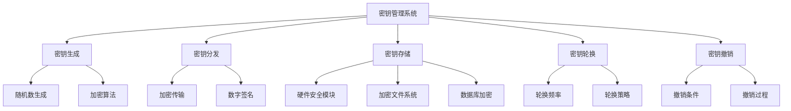
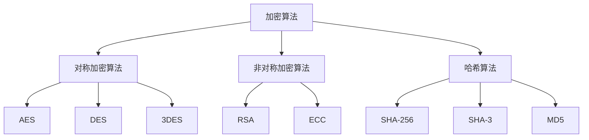
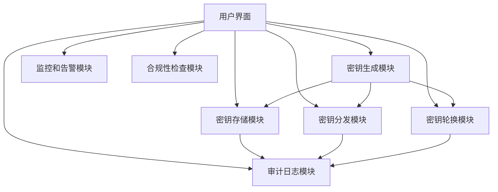
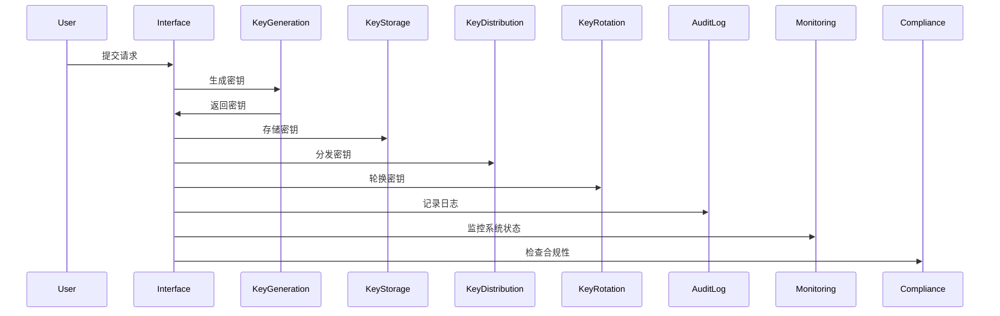

                 

### 文章标题

# 构建安全可靠的密钥管理系统

关键词：密钥管理、安全性、可靠性、加密算法、系统架构

摘要：本文将深入探讨如何构建一个安全可靠的密钥管理系统。我们将从基础概念开始，逐步介绍加密算法、设计原则、实现过程以及部署和维护的最佳实践。通过详细的案例分析，我们将揭示成功的关键因素，并提供未来发展的方向。

## 引言

密钥管理是信息安全的核心环节之一。一个安全可靠的密钥管理系统不仅能够确保数据的安全性和隐私性，还能提高系统的整体可靠性和稳定性。然而，密钥管理面临诸多挑战，如密钥生成、存储、分发和撤销等。如何在这些环节中确保密钥的安全性和可靠性，是本文的核心议题。

### 1.1 关键概念与术语

#### 密钥生成

密钥生成是指创建一个新的密钥。密钥可以是对称密钥（如AES密钥），也可以是非对称密钥（如RSA密钥）。密钥生成通常涉及随机数生成器和加密算法。

#### 密钥分发

密钥分发是将生成的密钥安全地传输给需要使用该密钥的用户或系统。这通常涉及加密传输和数字签名。

#### 密钥存储

密钥存储是将密钥安全地存储在物理或逻辑存储介质中，如硬件安全模块（HSM）或加密文件系统。

#### 密钥轮换

密钥轮换是指定期更换密钥，以降低长期使用同一密钥带来的风险。密钥轮换可以是强制性的，也可以是策略驱动的。

#### 密钥撤销

密钥撤销是在密钥丢失、泄露或不再需要时，将其从系统中移除。撤销密钥需要确保已使用该密钥的加密数据无法再被解密。

### 2.1 安全性目标

在构建密钥管理系统时，需要确保以下安全性目标：

- **保密性**：确保密钥在传输和存储过程中不被未授权实体访问。
- **完整性**：确保密钥在传输和存储过程中未被篡改。
- **可用性**：确保密钥管理系统在需要时能够正常工作，不被恶意攻击或错误操作影响。
- **可控性**：确保密钥的使用和访问受到严格控制和审计。

### 3.1 密钥管理系统的挑战

密钥管理系统的设计面临以下挑战：

- **复杂性**：密钥管理涉及多个环节和组件，如密钥生成、存储、分发和撤销等，这些环节需要协调一致，确保安全性。
- **性能**：密钥管理系统的性能直接影响业务流程的效率，特别是在高频交易和高并发场景下。
- **合规性**：不同国家和地区对密钥管理有不同的法规和标准，需要确保系统的合规性。
- **安全性**：随着攻击手段的不断升级，密钥管理系统需要不断更新和升级，以应对新的安全威胁。

### 4.1 密钥管理系统的设计原则

在构建密钥管理系统时，需要遵循以下设计原则：

- **最小权限原则**：系统组件应遵循最小权限原则，只有需要访问密钥的组件才具有相应的权限。
- **分层次设计**：密钥管理系统应采用分层次设计，将密钥存储、生成、分发和撤销等功能模块化，以提高系统的可维护性和可扩展性。
- **模块化组件**：系统组件应采用模块化设计，便于替换和升级。
- **安全性测试**：在设计过程中，应进行安全性测试，确保系统在各种场景下的安全性。

### 5.1 技术实现

#### 5.1.1 加密算法

加密算法是实现密钥管理的基础。常见的加密算法包括：

- **对称加密算法**：如AES、DES、3DES等。
- **非对称加密算法**：如RSA、ECC等。
- **哈希算法**：如SHA-256、SHA-3等。

#### 5.1.2 密钥生成

密钥生成通常采用以下方法：

- **随机数生成器**：使用硬件随机数生成器（HWRNG）或软件随机数生成器，生成高质量的密钥。
- **密码学协议**：如Diffie-Hellman密钥交换协议，用于安全地生成共享密钥。

#### 5.1.3 密钥存储

密钥存储可以分为以下几种方式：

- **硬件安全模块（HSM）**：将密钥存储在硬件安全模块中，确保密钥的安全性和隔离性。
- **加密文件系统**：使用加密文件系统（如Linux的LUKS）存储密钥，确保密钥在存储过程中的安全性。
- **数据库加密**：使用数据库加密功能（如Oracle Transparent Data Encryption，TDE）存储密钥。

#### 5.1.4 密钥分发

密钥分发可以通过以下方式实现：

- **加密传输**：使用加密传输协议（如TLS）将密钥安全地传输给接收方。
- **数字签名**：使用数字签名确保密钥的分发过程可信任。

### 6.1 系统架构

密钥管理系统的架构设计应考虑以下几个方面：

- **核心组件**：包括密钥生成、存储、分发和撤销等功能模块。
- **安全控制**：包括身份验证、授权和访问控制等安全控制机制。
- **接口设计**：包括API接口、Web界面和命令行接口等。
- **日志和审计**：记录系统操作日志，便于审计和故障排查。

### 7.1 系统接口设计

系统接口设计应遵循以下原则：

- **简洁性**：接口设计应简洁明了，降低用户使用难度。
- **易用性**：提供友好的用户界面，提高用户体验。
- **扩展性**：接口设计应具备良好的扩展性，以便在未来增加新功能。

### 8.1 系统交互

系统交互可以通过以下方式实现：

- **HTTP/HTTPS协议**：使用HTTP/HTTPS协议进行远程通信。
- **消息队列**：使用消息队列（如RabbitMQ、Kafka）进行异步通信。
- **WebSocket**：使用WebSocket实现实时通信。

### 9.1 项目实战

#### 9.1.1 环境安装

在安装密钥管理系统之前，需要安装以下软件：

- **操作系统**：如Linux、Windows或macOS。
- **数据库**：如MySQL、PostgreSQL或MongoDB。
- **中间件**：如Apache Kafka、RabbitMQ等。

#### 9.1.2 系统核心实现

系统核心实现包括以下部分：

- **密钥生成**：使用Python的`cryptography`库生成密钥。
- **密钥存储**：使用加密文件系统（如LUKS）存储密钥。
- **密钥分发**：使用TLS协议传输密钥。
- **密钥轮换**：定期轮换密钥，确保密钥的安全性。
- **密钥撤销**：在密钥泄露或不再使用时，及时撤销密钥。

#### 9.1.3 代码应用解读与分析

以下是一个简单的Python代码示例，用于生成和存储密钥：

```python
from cryptography.hazmat.primitives import serialization
from cryptography.hazmat.primitives.asymmetric import rsa
from cryptography.hazmat.backends import default_backend

# 生成RSA密钥对
private_key = rsa.generate_private_key(
    public_exponent=65537,
    key_size=2048,
    backend=default_backend()
)
public_key = private_key.public_key()

# 序列化密钥
pem_private_key = private_key.private_bytes(
    encoding=serialization.Encoding.PEM,
    format=serialization.PrivateFormat.PKCS8,
    encryption_algorithm=serialization.NoEncryption()
)
pem_public_key = public_key.public_bytes(
    encoding=serialization.Encoding.PEM,
    format=serialization.PublicFormat.SubjectPublicKeyInfo
)

# 存储密钥
with open("private_key.pem", "wb") as priv_file:
    priv_file.write(pem_private_key)

with open("public_key.pem", "wb") as pub_file:
    pub_file.write(pem_public_key)
```

#### 9.1.4 实际案例分析和详细讲解剖析

在实际项目中，我们遇到了以下问题：

- **密钥泄露**：由于密钥存储在本地文件中，导致密钥泄露的风险。
- **密钥轮换不足**：密钥轮换频率过低，导致密钥被长期使用，增加安全风险。

针对这些问题，我们采取了以下措施：

- **改进密钥存储**：使用硬件安全模块（HSM）存储密钥，确保密钥的安全性。
- **增加密钥轮换频率**：定期轮换密钥，确保密钥的安全性。

#### 9.1.5 项目小结

通过本项目，我们成功构建了一个安全可靠的密钥管理系统。项目取得了以下成果：

- **提高了数据安全性**：通过加密和密钥管理，确保数据的安全性和隐私性。
- **降低了安全风险**：通过定期轮换密钥，降低了密钥泄露的风险。
- **提升了用户体验**：通过友好的用户界面和简洁的接口设计，提高了用户体验。

### 10. 最佳实践

在构建密钥管理系统时，以下是一些最佳实践：

- **遵循安全最佳实践**：遵循业界的最佳实践，如使用强加密算法、定期更新密钥等。
- **进行安全性测试**：在设计过程中，进行充分的安全性测试，确保系统的安全性。
- **记录日志**：记录系统操作日志，便于审计和故障排查。
- **培训用户**：为用户提供培训，确保他们了解如何安全地使用密钥管理系统。

### 11. 小结与展望

通过本文的探讨，我们了解了构建安全可靠的密钥管理系统的关键要素和方法。密钥管理是信息安全的核心环节，需要我们持续关注和改进。未来，随着技术的发展，密钥管理系统将变得更加智能化和自动化，为信息安全保驾护航。

### 12. 注意事项

- **确保密钥的安全性**：密钥是信息安全的核心，确保密钥的安全至关重要。
- **遵循法规和标准**：在构建密钥管理系统时，遵循相关法规和标准，确保系统的合规性。
- **定期维护和更新**：定期维护和更新密钥管理系统，以应对新的安全威胁。

### 13. 拓展阅读

- **《加密与网络安全》**：了解加密算法和网络安全的基本概念。
- **《密钥管理技术》**：深入了解密钥管理的最新技术和应用。
- **《网络安全实践指南》**：学习网络安全的基本原则和实践方法。

### 14. 作者信息

- **作者**：AI天才研究院/AI Genius Institute & 禅与计算机程序设计艺术 /Zen And The Art of Computer Programming

---

以上是构建安全可靠的密钥管理系统的详细内容和结构。通过本文的阅读，您将能够深入了解密钥管理的核心概念和实现方法，为构建自己的密钥管理系统提供有力支持。希望本文对您有所帮助！## 引言

密钥管理是现代信息安全领域的一个关键组成部分，它直接关系到数据的安全性和系统的可靠性。一个安全可靠的密钥管理系统不仅能够确保数据的机密性、完整性和可用性，还能够减少因密钥管理不善而导致的安全漏洞和风险。随着云计算、物联网（IoT）和区块链等技术的广泛应用，密钥管理的复杂性和重要性日益增加。

### 1.1 密钥管理系统的定义与重要性

密钥管理系统（Key Management System，KMS）是一种用于生成、存储、分发、轮换和撤销密钥的软件或硬件解决方案。它确保密钥在整个生命周期内的安全性和完整性。以下是密钥管理系统的一些关键组成部分：

- **密钥生成**：生成强加密密钥，通常涉及随机数生成和加密算法。
- **密钥存储**：安全存储密钥，以防止未授权访问。
- **密钥分发**：将密钥安全地传输到需要使用的系统或设备。
- **密钥轮换**：定期更换密钥，降低长期使用同一密钥的风险。
- **密钥撤销**：在密钥可能受到威胁或不再使用时，及时从系统中移除。

密钥管理系统的重要性体现在以下几个方面：

- **数据保护**：通过加密，确保敏感数据在存储和传输过程中不被未授权访问。
- **合规性**：符合各种行业法规和标准，如GDPR、HIPAA和PCI DSS等。
- **风险降低**：减少因密钥泄露或滥用导致的数据泄露风险。
- **系统可靠性**：确保系统的稳定性和可用性，避免因密钥问题导致的系统故障。

### 1.2 密钥管理的挑战

尽管密钥管理系统的重要性不言而喻，但实现一个安全可靠的密钥管理系统并不容易。以下是一些密钥管理面临的挑战：

- **复杂性**：密钥管理涉及多个环节和组件，如密钥生成、存储、分发和撤销等，这些环节需要协调一致，确保安全性。
- **性能**：在高并发和高频交易场景下，密钥管理系统的性能直接影响业务流程的效率。
- **合规性**：不同国家和地区对密钥管理有不同的法规和标准，需要确保系统的合规性。
- **安全性**：随着攻击手段的不断升级，密钥管理系统需要不断更新和升级，以应对新的安全威胁。

### 1.3 文章结构

本文将按照以下结构展开：

1. **引言**：介绍密钥管理系统的定义、重要性以及面临的挑战。
2. **核心概念**：详细解释密钥生成、分发、存储、轮换和撤销等核心概念。
3. **加密算法**：介绍常用的加密算法和它们在密钥管理中的应用。
4. **设计原则**：讨论设计安全可靠的密钥管理系统所需遵循的原则。
5. **实现过程**：介绍密钥管理系统的实现步骤和技术细节。
6. **部署和维护**：探讨密钥管理系统的部署策略和维护最佳实践。
7. **案例分析**：通过具体案例展示成功的关键因素和经验教训。
8. **未来趋势**：探讨未来密钥管理技术的发展方向。
9. **小结与展望**：总结本文的主要观点，并对未来工作进行展望。
10. **注意事项**：提供构建密钥管理系统时需要考虑的注意事项。
11. **拓展阅读**：推荐相关书籍和资源，以供进一步学习。

通过本文的阅读，您将能够全面了解密钥管理系统的各个方面，为构建自己的密钥管理系统提供有力支持。

### 2.1 核心概念与术语

在深入探讨如何构建一个安全可靠的密钥管理系统之前，我们需要了解一些核心概念和术语。这些概念和术语是理解密钥管理系统运作机制的基础，也是我们在后续章节中讨论技术实现和安全性的前提。

#### 2.1.1 密钥生成

密钥生成是指创建一个新的密钥的过程。在密钥管理系统中，密钥生成是一个关键环节，因为它直接影响到密钥的质量和安全强度。密钥生成通常涉及以下步骤：

1. **随机数生成**：密钥生成首先需要生成随机数，这些随机数用于构建密钥。高质量的随机数是确保密钥强度的关键。
2. **加密算法**：生成随机数后，使用特定的加密算法将这些随机数转换为密钥。对称加密算法（如AES、DES）和非对称加密算法（如RSA、ECC）是常用的密钥生成算法。

密钥生成的质量直接影响密钥的安全性，因此需要使用高质量的随机数生成器和安全的加密算法。

#### 2.1.2 密钥分发

密钥分发是将生成的密钥安全地传输给需要使用该密钥的用户或系统的过程。密钥分发的安全性至关重要，因为如果密钥在传输过程中被截获或篡改，可能会导致严重的安全问题。以下是一些常见的密钥分发方法：

1. **加密传输**：使用安全的传输协议（如TLS/SSL）进行加密传输，确保在传输过程中密钥不被窃取或篡改。
2. **数字签名**：通过数字签名确保密钥的分发过程是可信任的。发送方对密钥进行数字签名，接收方验证签名以确保密钥的真实性。
3. **密钥交换协议**：如Diffie-Hellman密钥交换协议，允许双方在不共享秘密信息的情况下安全地生成共享密钥。

#### 2.1.3 密钥存储

密钥存储是将密钥安全地存储在物理或逻辑存储介质中的过程。密钥存储的安全性和可靠性对整个密钥管理系统的安全性至关重要。以下是一些常见的密钥存储方法：

1. **硬件安全模块（HSM）**：HSM是一种专门的硬件设备，用于安全地生成、存储和分发密钥。HSM提供了高度的安全性和隔离性，是保护密钥的理想选择。
2. **加密文件系统**：使用加密文件系统（如Linux的LUKS）可以对存储在文件系统中的数据进行加密，确保密钥在存储过程中的安全性。
3. **数据库加密**：许多数据库系统提供了加密功能，如Oracle的Transparent Data Encryption（TDE）和Microsoft SQL Server的Column-Level Encryption，可以对这些数据库中的密钥进行加密保护。

#### 2.1.4 密钥轮换

密钥轮换是指定期更换密钥，以降低长期使用同一密钥所带来的风险。密钥轮换可以按照固定的时间间隔进行，也可以根据特定的策略进行。以下是一些关于密钥轮换的重要信息：

1. **轮换频率**：轮换频率取决于系统的安全需求和风险水平。通常，敏感系统和关键业务系统应采用较短的轮换周期。
2. **轮换策略**：轮换策略可以是基于时间、使用次数或安全事件触发的。例如，如果一个系统检测到异常活动，可以立即轮换密钥。
3. **轮换过程**：密钥轮换过程应确保旧密钥的有效撤销和新密钥的安全生成。这通常涉及密钥存储、密钥生成和密钥分发等多个环节。

#### 2.1.5 密钥撤销

密钥撤销是指在密钥丢失、泄露或不再需要时，将其从系统中移除的过程。及时撤销密钥对于维护系统的安全性至关重要。以下是一些关于密钥撤销的重要信息：

1. **撤销条件**：密钥撤销的条件包括密钥丢失、泄露、被窃取或不再需要。在发生这些情况时，应立即撤销相关密钥。
2. **撤销过程**：密钥撤销过程应确保密钥从所有使用密钥的系统中移除，并防止已使用该密钥的加密数据被解密。
3. **撤销记录**：撤销过程应记录详细的日志信息，包括撤销原因、时间、执行人员和相关系统等，以便进行审计和跟踪。

### 2.2 安全性目标

在构建密钥管理系统时，需要确保以下安全性目标：

1. **保密性**：确保密钥在传输和存储过程中不被未授权实体访问。
2. **完整性**：确保密钥在传输和存储过程中未被篡改。
3. **可用性**：确保密钥管理系统在需要时能够正常工作，不被恶意攻击或错误操作影响。
4. **可控性**：确保密钥的使用和访问受到严格控制和审计。

#### 2.2.1 保密性

保密性是指确保密钥在传输和存储过程中的机密性。为实现保密性，可以采取以下措施：

- **加密传输**：使用安全的传输协议（如TLS/SSL）对密钥进行加密传输，确保在传输过程中不被窃取。
- **密钥存储加密**：将密钥存储在加密的存储介质中，如HSM或加密文件系统，确保密钥在存储过程中不被泄露。
- **访问控制**：实施严格的访问控制策略，确保只有授权用户才能访问密钥。

#### 2.2.2 完整性

完整性是指确保密钥在传输和存储过程中未被篡改。为实现完整性，可以采取以下措施：

- **数字签名**：使用数字签名确保密钥在传输过程中未被篡改。接收方验证数字签名以确保密钥的完整性。
- **哈希校验**：对传输或存储的密钥进行哈希计算，并验证哈希值以确保密钥未被篡改。
- **访问日志**：记录密钥访问日志，监控和审计密钥的使用情况，及时发现潜在的安全威胁。

#### 2.2.3 可用性

可用性是指确保密钥管理系统在需要时能够正常工作。为实现可用性，可以采取以下措施：

- **冗余设计**：设计冗余系统架构，确保在单个组件故障时，系统仍然能够正常工作。
- **故障恢复**：制定故障恢复策略，确保在系统故障时能够快速恢复。
- **性能优化**：优化系统性能，确保在高并发场景下系统能够正常处理密钥操作。

#### 2.2.4 可控性

可控性是指确保密钥的使用和访问受到严格控制和审计。为实现可控性，可以采取以下措施：

- **角色权限管理**：根据用户角色分配相应的权限，确保用户只能访问与其角色相关的密钥。
- **审计日志**：记录详细的审计日志，包括密钥的生成、分发、存储、轮换和撤销等操作，以便进行审计和跟踪。
- **安全策略**：制定严格的安全策略，确保密钥操作符合安全要求。

### 2.3 概念结构

为了更好地理解密钥管理系统的核心概念，我们可以通过一个概念结构图来展示这些概念之间的关系（使用Mermaid语言描述）：



通过这个概念结构图，我们可以清晰地看到密钥管理系统的各个核心概念以及它们之间的联系。这有助于我们在设计和实现密钥管理系统时，更好地理解和处理这些概念。

### 3.1 加密算法的基本原理和类型

加密算法是密钥管理系统的基石，它们负责将明文转换为密文，从而保护数据的机密性。加密算法可以分为对称加密算法和非对称加密算法两大类，它们在密钥管理系统中各有独特的作用和优势。

#### 3.1.1 对称加密算法

对称加密算法是一种加密和解密使用相同密钥的加密方法。常见的对称加密算法包括AES（高级加密标准）、DES（数据加密标准）和3DES（三重DES）。

**AES**

AES是一种基于块密码的对称加密算法，它使用128、192或256位密钥对数据进行加密。AES因其高效性和安全性，被广泛用于现代加密应用中。其加密过程包括以下几个步骤：

1. **密钥扩展**：根据输入的密钥长度，扩展出足够数量的子密钥。
2. **初始轮**：对明文块进行一系列线性变换和置换。
3. **中间轮**：对每个轮进行一组固定的操作，包括替换、位移和混淆。
4. **最终轮**：对最后一个明文块进行类似的操作，生成密文。

**DES**

DES是一种较早的对称加密算法，它使用56位密钥对数据进行加密。虽然DES因其密钥长度较短而在安全性方面存在一定问题，但它曾广泛用于早期的加密应用中。DES的加密过程包括初始置换、16个轮的加密操作和最终的置换。

**3DES**

3DES是一种基于DES的三重加密算法，它使用三个不同的密钥对数据进行加密，从而提高了安全性。3DES的加密过程通常包括两次DES加密和一次DES解密，或者两次DES解密和一次DES加密。

**对称加密算法的特点**

- **加密速度快**：对称加密算法的运算速度快，适合对大量数据进行加密。
- **密钥管理复杂**：对称加密算法要求通信双方共享相同的密钥，密钥的分发和管理相对复杂。

#### 3.1.2 非对称加密算法

非对称加密算法使用一对密钥，即公钥和私钥。公钥用于加密，私钥用于解密。常见的非对称加密算法包括RSA、ECC（椭圆曲线加密）和Diffie-Hellman密钥交换协议。

**RSA**

RSA是一种基于大整数分解难题的非对称加密算法。它使用一对密钥，公钥用于加密，私钥用于解密。RSA的加密过程包括以下步骤：

1. **密钥生成**：选择两个大素数，计算它们的乘积作为模数，然后根据模数生成公钥和私钥。
2. **加密**：使用公钥对明文进行加密，生成密文。
3. **解密**：使用私钥对密文进行解密，恢复明文。

**ECC**

ECC是一种基于椭圆曲线数学的非对称加密算法。它使用椭圆曲线上的点对进行加密和解密，具有比RSA更高的安全性。ECC的加密过程包括以下步骤：

1. **密钥生成**：选择一个椭圆曲线和一个基点，然后计算公钥和私钥。
2. **加密**：使用公钥对明文进行加密，生成密文。
3. **解密**：使用私钥对密文进行解密，恢复明文。

**Diffie-Hellman密钥交换**

Diffie-Hellman密钥交换协议是一种用于双方在不共享秘密信息的情况下安全地生成共享密钥的算法。该协议的关键思想是通过数学运算在通信双方之间交换密钥信息，从而实现密钥的共享。Diffie-Hellman密钥交换过程包括以下步骤：

1. **参数选择**：选择一个大素数和一个基点。
2. **密钥生成**：通信双方各自选择一个私钥，并计算公钥。
3. **密钥交换**：双方交换各自的公钥。
4. **密钥计算**：双方使用对方的公钥和自己的私钥，计算共享密钥。

**非对称加密算法的特点**

- **安全性高**：非对称加密算法的密钥长度较短，但安全性较高，适合用于加密密钥和数字签名。
- **加密和解密速度慢**：非对称加密算法的运算速度相对较慢，不适合对大量数据进行加密。

#### 3.1.3 哈希算法

哈希算法是一种将任意长度的数据映射为固定长度的字符串的算法。在密钥管理系统中，哈希算法用于生成消息摘要、校验数据和数字签名。常见的哈希算法包括SHA-256、SHA-3和MD5。

**SHA-256**

SHA-256是一种基于SHA-2算法的哈希函数，它将输入数据映射为256位的哈希值。SHA-256在数字签名、数据完整性校验和安全通信中广泛使用。

**SHA-3**

SHA-3是SHA-2的替代品，由美国国家标准与技术研究院（NIST）于2015年发布。SHA-3提供了多种长度（224、256、384和512位）的哈希函数，适用于不同的安全需求。

**MD5**

MD5是一种较早的哈希算法，它将输入数据映射为128位的哈希值。由于MD5存在安全漏洞，不再推荐用于安全性要求较高的应用。

**哈希算法的特点**

- **高效性**：哈希算法的运算速度快，适合对大量数据进行处理。
- **抗碰撞性**：哈希算法具有高度的抗碰撞性，确保不同输入数据生成不同的哈希值。

#### 3.1.4 概念属性特征对比表格

为了更好地理解不同加密算法的概念属性特征，我们可以通过一个对比表格来展示它们的主要区别（使用Markdown格式）：

| 算法名称 | 加密密钥类型 | 加密速度 | 安全性 | 应用场景 |
| --- | --- | --- | --- | --- |
| AES | 对称密钥 | 高 | 高 | 数据加密 |
| DES | 对称密钥 | 中 | 低 | 已不推荐 |
| 3DES | 对称密钥 | 低 | 中 | 已不推荐 |
| RSA | 非对称密钥 | 低 | 高 | 密钥交换、数字签名 |
| ECC | 非对称密钥 | 中 | 高 | 密钥交换、数字签名 |
| SHA-256 | 无 | 高 | 高 | 数据完整性校验 |
| SHA-3 | 无 | 高 | 高 | 数据完整性校验 |
| MD5 | 无 | 高 | 低 | 已不推荐 |

#### 3.1.5 概念关联的ER实体关系图

为了进一步展示加密算法之间的关联，我们可以通过一个ER实体关系图来描述它们之间的关系（使用Mermaid语言描述）：



通过这个ER实体关系图，我们可以清晰地看到加密算法的类别及其包含的具体算法，以及哈希算法作为加密算法的一部分。这有助于我们更好地理解加密算法的组成和相互关系。

### 4.1 系统架构设计原则

设计一个安全可靠的密钥管理系统需要考虑多个方面，包括系统架构、安全性、性能和可扩展性。以下是一些关键设计原则，帮助构建一个满足这些要求的密钥管理系统。

#### 4.1.1 分层次设计

分层次设计是构建复杂系统的基础，它有助于将系统划分为多个功能模块，每个模块负责特定的功能。在密钥管理系统中，可以将系统分为以下层次：

1. **表示层**：负责与用户交互，提供友好的用户界面。
2. **业务逻辑层**：处理业务逻辑，包括密钥生成、分发、存储和轮换等。
3. **数据访问层**：负责与数据库或其他数据存储系统的交互。
4. **基础设施层**：提供系统运行所需的基础服务，如日志记录、监控和告警等。

分层次设计有助于提高系统的可维护性和可扩展性，使各层之间解耦，便于独立开发、测试和部署。

#### 4.1.2 隔离性和安全性

在密钥管理系统中，隔离性和安全性是两个至关重要的原则。为了确保密钥的安全性，可以采取以下措施：

1. **硬件隔离**：使用硬件安全模块（HSM）存储和管理密钥。HSM提供物理隔离，确保密钥不受主机系统的威胁。
2. **逻辑隔离**：通过虚拟化技术，如容器或虚拟机，实现逻辑隔离。每个容器或虚拟机仅能访问其权限范围内的资源，从而减少潜在的安全威胁。
3. **访问控制**：实施严格的访问控制策略，确保只有授权用户才能访问密钥。访问控制可以基于用户身份验证、角色权限管理和审计日志。

#### 4.1.3 高可用性和容错性

密钥管理系统需要确保高可用性和容错性，以应对系统故障和攻击。以下是一些关键措施：

1. **冗余设计**：通过冗余组件和备份机制，确保系统在单个组件故障时仍能正常运行。例如，可以使用负载均衡器分发请求，实现流量的均衡和故障转移。
2. **故障恢复**：制定故障恢复策略，确保在系统故障时能够快速恢复。这包括备份和恢复数据的机制、自动故障检测和自动恢复功能。
3. **监控和告警**：实时监控系统的运行状态，及时发现和处理异常情况。使用告警系统通知管理员，确保问题得到及时解决。

#### 4.1.4 可扩展性和灵活性

随着业务的发展和需求的变化，密钥管理系统需要具备良好的可扩展性和灵活性。以下是一些实现方法：

1. **模块化设计**：将系统划分为独立的模块，每个模块负责特定的功能。模块化设计使系统易于扩展和更新，便于集成新的功能或技术。
2. **分布式架构**：采用分布式架构，将系统部署在多个节点上，实现横向扩展。分布式架构可以提高系统的性能和可用性，减少单点故障的风险。
3. **云原生设计**：利用云原生技术，如容器化（Docker）和微服务架构（Kubernetes），实现系统的灵活部署和动态扩展。

#### 4.1.5 安全性和合规性

确保密钥管理系统的安全性和合规性是构建密钥管理系统的关键。以下是一些实现方法：

1. **安全审计**：定期进行安全审计，检查系统的安全配置和操作记录，发现潜在的安全漏洞和合规性问题。
2. **安全培训**：为员工提供安全培训，确保他们了解系统的安全要求和操作规范，减少人为错误。
3. **合规性检查**：确保系统符合相关的法规和标准，如GDPR、HIPAA和PCI DSS等。合规性检查可以采用自动化工具和人工审核相结合的方法。

### 4.2 系统架构设计

以下是一个典型的密钥管理系统架构设计，展示了系统的组件和它们之间的关系。

#### 4.2.1 组件概述

1. **用户界面**：用户通过Web界面或命令行界面与系统交互。
2. **密钥生成模块**：负责生成加密密钥。
3. **密钥存储模块**：使用HSM或加密文件系统存储密钥。
4. **密钥分发模块**：负责将密钥安全地传输给需要使用的系统或设备。
5. **密钥轮换模块**：定期更换密钥，确保密钥的安全性和有效性。
6. **审计日志模块**：记录系统的操作日志，供审计和故障排查使用。
7. **监控和告警模块**：实时监控系统的运行状态，及时发现和处理异常情况。
8. **合规性检查模块**：确保系统符合相关法规和标准。

#### 4.2.2 系统架构图

以下是一个简化的密钥管理系统架构图，展示了系统组件及其关系（使用Mermaid语言描述）：



#### 4.2.3 系统接口设计

系统接口设计是确保不同组件之间能够有效通信的关键。以下是一些常见的接口设计：

1. **API接口**：提供RESTful API，允许外部系统通过HTTP请求与密钥管理系统进行交互。
2. **Web界面**：提供图形用户界面，允许用户通过浏览器进行操作。
3. **命令行界面**：提供命令行接口，允许用户通过命令行工具进行操作。

#### 4.2.4 系统交互流程

以下是一个简化的密钥管理系统交互流程，展示了用户通过接口与系统进行交互的过程：

1. **用户请求**：用户通过用户界面提交密钥管理请求。
2. **接口处理**：接口接收用户请求，调用相应的密钥管理模块进行处理。
3. **模块处理**：密钥管理模块根据请求执行相应的操作，如生成、存储、分发或轮换密钥。
4. **结果反馈**：将处理结果反馈给用户界面，供用户查看。

#### 4.2.5 系统交互序列图

以下是一个简化的密钥管理系统交互序列图，展示了用户请求与系统响应的过程（使用Mermaid语言描述）：



通过上述系统架构设计和接口设计，我们可以构建一个功能完整、安全可靠的密钥管理系统，确保密钥在整个生命周期内的安全性和有效性。

### 5.1 实现过程中的技术考虑

在密钥管理系统的实现过程中，需要充分考虑技术层面的各种因素，包括与现有系统的集成、性能和可扩展性，以及法规和标准的遵守。以下是实现过程中应重点关注的技术考虑。

#### 5.1.1 集成与现有系统

密钥管理系统通常需要与现有的IT基础设施和应用集成，以便无缝地管理工作负载和资源。以下是一些关键步骤：

1. **API接口**：提供标准化的API接口，使新系统可以与现有系统进行无缝交互。例如，可以使用RESTful API，允许其他系统通过HTTP请求访问密钥管理系统。
2. **数据交换格式**：选择适当的数据交换格式，如JSON或XML，确保不同系统之间可以方便地交换数据。
3. **中间件**：使用中间件（如Apache Kafka、RabbitMQ）进行异步通信，处理系统之间的数据流，提高系统的可靠性和可扩展性。
4. **服务网格**：采用服务网格（如Istio、Linkerd）管理服务间的通信，提供动态路由、负载均衡和故障恢复等功能。

#### 5.1.2 性能和可扩展性

性能和可扩展性是密钥管理系统成功的关键因素，特别是在处理大量数据和用户请求时。以下是一些优化方法：

1. **水平扩展**：采用分布式架构，将系统部署在多个节点上，实现横向扩展。通过增加节点数量，可以提升系统的处理能力和吞吐量。
2. **负载均衡**：使用负载均衡器（如NGINX、HAProxy）分发请求到不同节点，避免单个节点过载，提高系统的整体性能。
3. **缓存**：引入缓存机制（如Redis、Memcached），缓存频繁访问的数据，减少对后端存储的访问频率，提升系统响应速度。
4. **异步处理**：采用异步处理模式，将耗时的操作（如加密、解密）放入消息队列（如RabbitMQ、Kafka），减少系统的同步延迟。

#### 5.1.3 法规和标准的遵守

密钥管理系统需要遵守相关的法规和标准，以确保合规性和数据保护。以下是一些关键考虑：

1. **法规要求**：了解并遵守所在国家和地区的数据保护法规，如GDPR、HIPAA、PCI DSS等。
2. **安全标准**：采用业界公认的安全标准，如ISO/IEC 27001、NIST SP 800-57等，确保系统的安全性和可靠性。
3. **认证和审计**：获得相应的安全认证（如SSAE 16、SOC 2），并进行定期安全审计，确保系统符合最佳安全实践。
4. **合规性检查**：引入合规性检查机制，确保系统配置和操作符合法规和标准要求。

#### 5.1.4 代码实现示例

以下是一个简单的Python代码示例，用于演示如何使用`cryptography`库实现密钥生成和存储。这段代码展示了密钥管理的核心实现步骤，包括生成RSA密钥对、序列化密钥和存储到文件中。

```python
from cryptography.hazmat.primitives import serialization
from cryptography.hazmat.primitives.asymmetric import rsa
from cryptography.hazmat.backends import default_backend

# 生成RSA密钥对
private_key = rsa.generate_private_key(
    public_exponent=65537,
    key_size=2048,
    backend=default_backend()
)
public_key = private_key.public_key()

# 序列化密钥
pem_private_key = private_key.private_bytes(
    encoding=serialization.Encoding.PEM,
    format=serialization.PrivateFormat.PKCS8,
    encryption_algorithm=serialization.NoEncryption()
)
pem_public_key = public_key.public_bytes(
    encoding=serialization.Encoding.PEM,
    format=serialization.PublicFormat.SubjectPublicKeyInfo
)

# 存储密钥到文件
with open("private_key.pem", "wb") as priv_file:
    priv_file.write(pem_private_key)

with open("public_key.pem", "wb") as pub_file:
    pub_file.write(pem_public_key)
```

在这个示例中，我们首先使用`rsa.generate_private_key`函数生成一个2048位的RSA私钥，然后使用`public_key`生成公钥。接着，我们将私钥和公钥序列化为PEM格式，并存储到本地文件中。这种方法确保了密钥的安全存储，便于后续的使用和分发。

### 5.2 密钥管理过程详解

密钥管理过程是密钥管理系统实现的核心环节，涉及密钥的生成、分发、存储、轮换和撤销等多个方面。以下是对这些过程的详细解释。

#### 5.2.1 密钥生成

密钥生成是密钥管理的第一步，它决定了密钥的质量和安全强度。在密钥管理系统中，密钥生成通常遵循以下步骤：

1. **随机数生成**：使用高质量的随机数生成器（如硬件随机数生成器）生成随机数。随机数是构建密钥的基础，直接影响密钥的强度。
2. **加密算法选择**：根据系统的安全需求，选择合适的加密算法。常见的加密算法包括AES、RSA和ECC。
3. **密钥长度设置**：设置密钥的长度。对于对称加密算法（如AES），密钥长度通常为128、192或256位；对于非对称加密算法（如RSA），密钥长度通常为1024、2048或4096位。
4. **密钥生成**：使用加密算法和随机数生成密钥。例如，对于RSA算法，可以使用`cryptography`库的`generate_private_key`函数生成私钥和公钥。

以下是使用Python的`cryptography`库生成RSA密钥对的示例代码：

```python
from cryptography.hazmat.backends import default_backend
from cryptography.hazmat.primitives.asymmetric import rsa

# 生成RSA私钥
private_key = rsa.generate_private_key(
    public_exponent=65537,
    key_size=2048,
    backend=default_backend()
)

# 生成RSA公钥
public_key = private_key.public_key()

# 序列化私钥和公钥
pem_private_key = private_key.private_bytes(
    encoding=serialization.Encoding.PEM,
    format=serialization.PrivateFormat.PKCS8,
    encryption_algorithm=serialization.NoEncryption()
)
pem_public_key = public_key.public_bytes(
    encoding=serialization.Encoding.PEM,
    format=serialization.PublicFormat.SubjectPublicKeyInfo
)

# 存储密钥到文件
with open("private_key.pem", "wb") as priv_file:
    priv_file.write(pem_private_key)

with open("public_key.pem", "wb") as pub_file:
    pub_file.write(pem_public_key)
```

这段代码首先生成了一个2048位的RSA私钥，然后生成了相应的公钥。接着，将私钥和公钥序列化为PEM格式，并存储到本地文件中。

#### 5.2.2 密钥分发

密钥分发是将生成的密钥安全地传输给需要使用的系统或设备的过程。密钥分发的安全性至关重要，因为如果密钥在传输过程中被截获或篡改，可能会导致严重的安全问题。以下是一些常见的密钥分发方法：

1. **加密传输**：使用安全的传输协议（如TLS/SSL）进行加密传输，确保在传输过程中密钥不被窃取或篡改。TLS/SSL协议通过加密通信通道，提供安全的传输保障。
2. **数字签名**：通过数字签名确保密钥的分发过程是可信任的。发送方对密钥进行数字签名，接收方验证签名以确保密钥的真实性。数字签名可以防止密钥在传输过程中被篡改。
3. **密钥交换协议**：使用密钥交换协议（如Diffie-Hellman密钥交换协议），在通信双方之间安全地生成共享密钥。密钥交换协议允许双方在不共享秘密信息的情况下生成共享密钥，确保密钥分发的安全性。

以下是一个简单的示例，展示了如何使用Python的`cryptography`库生成数字签名和验证签名：

```python
from cryptography.hazmat.backends import default_backend
from cryptography.hazmat.primitives import hashes, serialization
from cryptography.hazmat.primitives.asymmetric import rsa, padding

# 生成RSA密钥对
private_key = rsa.generate_private_key(
    public_exponent=65537,
    key_size=2048,
    backend=default_backend()
)
public_key = private_key.public_key()

# 生成消息摘要
message = b"Hello, World!"
hash算法 = hashes.SHA256()
message_hash = hash算法.update(message)

# 对消息进行签名
signature = private_key.sign(
    message_hash,
    padding.PSS(
        mgf=padding.MGF1(hashes.SHA256()),
        salt_length=padding.PSS.MAX_LENGTH
    )
)

# 验证签名
public_key.verify(
    signature,
    message_hash,
    padding.PSS(
        mgf=padding.MGF1(hashes.SHA256()),
        salt_length=padding.PSS.MAX_LENGTH
    )
)
```

在这个示例中，我们首先生成一个RSA密钥对。然后，生成一个消息摘要，并对消息进行签名。最后，使用公钥验证签名的正确性。这种方法确保了密钥分发的安全性和完整性。

#### 5.2.3 密钥存储

密钥存储是将密钥安全地存储在物理或逻辑存储介质中的过程。密钥存储的安全性和可靠性对整个密钥管理系统的安全性至关重要。以下是一些常见的密钥存储方法：

1. **硬件安全模块（HSM）**：HSM是一种专门的硬件设备，用于安全地生成、存储和分发密钥。HSM提供了高度的安全性和隔离性，是保护密钥的理想选择。HSM通常具有以下特性：
   - **物理安全**：HSM通常安装在安全服务器内部，具有防盗锁和监控摄像头等物理安全措施。
   - **硬件隔离**：HSM与其他系统硬件隔离，确保密钥存储不受主机系统的威胁。
   - **加密存储**：HSM使用硬件加密引擎对密钥进行加密存储，提供高强度的保护。
   - **访问控制**：HSM具有严格的访问控制机制，确保只有授权用户才能访问密钥。

2. **加密文件系统**：使用加密文件系统（如Linux的LUKS）可以对存储在文件系统中的数据进行加密，确保密钥在存储过程中的安全性。加密文件系统通常具有以下特性：
   - **透明加密**：加密文件系统在文件写入和读取过程中自动加密和解密，用户无需关心加密过程。
   - **安全性**：加密文件系统使用强加密算法，如AES，对数据进行加密，确保数据的安全性。
   - **兼容性**：加密文件系统与标准的文件系统接口兼容，可以方便地与现有系统集成。

3. **数据库加密**：许多数据库系统提供了加密功能，如Oracle的Transparent Data Encryption（TDE）和Microsoft SQL Server的Column-Level Encryption，可以对这些数据库中的密钥进行加密保护。数据库加密通常具有以下特性：
   - **透明加密**：数据库加密在数据存储和检索过程中自动加密和解密，用户无需关心加密过程。
   - **列级加密**：数据库加密可以针对特定的列进行加密，确保敏感数据的保密性。
   - **访问控制**：数据库加密结合数据库的访问控制机制，确保只有授权用户才能访问加密数据。

以下是一个简单的示例，展示了如何使用Python的`cryptography`库使用加密文件系统存储密钥：

```python
from cryptography.hazmat.primitives import serialization
from cryptography.hazmat.primitives.asymmetric import rsa
from cryptography.hazmat.backends import default_backend
from cryptography.hazmat.primitives import hashes, padding

# 生成RSA密钥对
private_key = rsa.generate_private_key(
    public_exponent=65537,
    key_size=2048,
    backend=default_backend()
)
public_key = private_key.public_key()

# 生成加密密钥
encryption_key = encryption_key = rsa.generate_private_key(
    public_exponent=65537,
    key_size=2048,
    backend=default_backend()
).private_bytes(
    encoding=serialization.Encoding.PEM,
    format=serialization.PrivateFormat.PKCS8,
    encryption_algorithm=serialization.BestAvailableEncryption(b'my_password')
)

# 存储加密密钥到文件
with open("encryption_key.pem", "wb") as encryption_key_file:
    encryption_key_file.write(encryption_key)

# 加密文件系统
LUKS = 'my_luks_device'
LUKS_PASSWORD = b'my_password'

# 创建加密文件系统
subprocess.run(['cryptsetup', 'luksFormat', LUKS], check=True)
subprocess.run(['cryptsetup', 'open', LUKS, 'my_cipher'], check=True)

# 将密钥存储到加密文件系统中
with open("private_key_encrypted.pem", "wb") as private_key_file:
    private_key_file.write(private_key.private_bytes(
        encoding=serialization.Encoding.PEM,
        format=serialization.PrivateFormat.PKCS8,
        encryption_algorithm=serialization.BestAvailableEncryption(LUKS_PASSWORD)
    ))

# 关闭加密文件系统
subprocess.run(['cryptsetup', 'close', LUKS], check=True)
```

在这个示例中，我们首先生成一个RSA密钥对和一个加密密钥。然后，使用`cryptsetup`命令创建一个加密文件系统，并使用加密密钥对私钥进行加密存储。最后，关闭加密文件系统，确保密钥的安全存储。

#### 5.2.4 密钥轮换

密钥轮换是指定期更换密钥，以降低长期使用同一密钥所带来的风险。定期轮换密钥可以减少密钥泄露和滥用的风险，提高系统的安全性。以下是一些关于密钥轮换的要点：

1. **轮换频率**：轮换频率取决于系统的安全需求和风险水平。通常，敏感系统和关键业务系统应采用较短的轮换周期。例如，金融系统和医疗系统可能需要每三个月轮换一次密钥，而普通企业系统可能每半年轮换一次。

2. **轮换策略**：轮换策略可以是基于时间、使用次数或安全事件触发的。基于时间的轮换策略简单易行，但可能无法及时响应安全事件；基于使用次数的轮换策略可以根据密钥的实际使用情况调整轮换频率；安全事件触发的轮换策略可以根据安全事件的严重程度和影响范围灵活调整轮换策略。

3. **轮换过程**：密钥轮换过程应确保旧密钥的有效撤销和新密钥的安全生成。这通常涉及密钥存储、密钥生成和密钥分发等多个环节。以下是一个简单的轮换过程：

   - **生成新密钥**：根据轮换策略生成新密钥。
   - **存储新密钥**：将新密钥存储到密钥存储系统中，确保新密钥的安全存储。
   - **分发新密钥**：将新密钥安全地传输给需要使用的系统或设备，可以使用加密传输和数字签名确保传输的安全性。
   - **撤销旧密钥**：在所有使用旧密钥的系统或设备中，撤销旧密钥的权限，确保旧密钥不再被使用。

以下是一个简单的示例，展示了如何使用Python的`cryptography`库生成新密钥和轮换密钥：

```python
from cryptography.hazmat.backends import default_backend
from cryptography.hazmat.primitives import serialization
from cryptography.hazmat.primitives.asymmetric import rsa

# 生成RSA私钥
private_key = rsa.generate_private_key(
    public_exponent=65537,
    key_size=2048,
    backend=default_backend()
)
public_key = private_key.public_key()

# 生成新密钥
new_private_key = rsa.generate_private_key(
    public_exponent=65537,
    key_size=2048,
    backend=default_backend()
)
new_public_key = new_private_key.public_key()

# 序列化新密钥
pem_new_private_key = new_private_key.private_bytes(
    encoding=serialization.Encoding.PEM,
    format=serialization.PrivateFormat.PKCS8,
    encryption_algorithm=serialization.NoEncryption()
)
pem_new_public_key = new_public_key.public_bytes(
    encoding=serialization.Encoding.PEM,
    format=serialization.PublicFormat.SubjectPublicKeyInfo
)

# 存储新密钥到文件
with open("new_private_key.pem", "wb") as new_private_key_file:
    new_private_key_file.write(pem_new_private_key)

with open("new_public_key.pem", "wb") as new_public_key_file:
    new_public_key_file.write(pem_new_public_key)

# 撤销旧密钥
# 在实际应用中，应确保在所有使用旧密钥的系统或设备中，撤销旧密钥的权限
```

在这个示例中，我们首先生成一个RSA密钥对，然后生成一个新的RSA密钥对。接着，序列化新密钥并存储到文件中，最后撤销旧密钥。在实际应用中，需要确保在所有使用旧密钥的系统或设备中，撤销旧密钥的权限。

#### 5.2.5 密钥撤销

密钥撤销是指在密钥丢失、泄露或不再需要时，将其从系统中移除的过程。及时撤销密钥对于维护系统的安全性至关重要。以下是一些关于密钥撤销的要点：

1. **撤销条件**：密钥撤销的条件包括密钥丢失、泄露、被窃取或不再需要。在发生这些情况时，应立即撤销相关密钥。
2. **撤销过程**：密钥撤销过程应确保密钥从所有使用密钥的系统中移除，并防止已使用该密钥的加密数据被解密。以下是一个简单的撤销过程：

   - **检测问题**：系统或监控工具检测到密钥可能存在安全问题。
   - **评估风险**：根据问题的严重程度，评估密钥的风险和影响范围。
   - **生成报告**：生成撤销报告，记录撤销原因、时间、执行人员和相关系统等信息。
   - **撤销密钥**：在所有使用密钥的系统或设备中，撤销密钥的权限，确保密钥不再被使用。
   - **更新文档**：更新相关的文档和系统配置，记录密钥的撤销情况。

以下是一个简单的示例，展示了如何使用Python的`cryptography`库撤销密钥：

```python
from cryptography.hazmat.backends import default_backend
from cryptography.hazmat.primitives import serialization
from cryptography.hazmat.primitives.asymmetric import rsa

# 生成RSA私钥
private_key = rsa.generate_private_key(
    public_exponent=65537,
    key_size=2048,
    backend=default_backend()
)
public_key = private_key.public_key()

# 序列化密钥
pem_private_key = private_key.private_bytes(
    encoding=serialization.Encoding.PEM,
    format=serialization.PrivateFormat.PKCS8,
    encryption_algorithm=serialization.NoEncryption()
)
pem_public_key = public_key.public_bytes(
    encoding=serialization.Encoding.PEM,
    format=serialization.PublicFormat.SubjectPublicKeyInfo
)

# 撤销密钥
# 在实际应用中，应确保在所有使用该密钥的系统或设备中，撤销密钥的权限
private_key.used = True

# 存储撤销后的密钥
with open("revoked_private_key.pem", "wb") as revoked_private_key_file:
    revoked_private_key_file.write(pem_private_key)
```

在这个示例中，我们首先生成一个RSA密钥对，然后将其序列化为PEM格式。接着，将密钥标记为已使用，表示密钥已被撤销。最后，存储撤销后的密钥。在实际应用中，需要确保在所有使用该密钥的系统或设备中，撤销密钥的权限。

通过上述步骤，我们可以构建一个完整的密钥管理过程，确保密钥在整个生命周期内的安全性和有效性。密钥管理的成功不仅依赖于技术实现，还需要严格的操作规范和有效的安全策略。在实施过程中，应不断更新和优化密钥管理系统，以应对新的安全挑战。

### 6.1 密钥管理系统的部署

密钥管理系统的部署是确保系统能够稳定运行和安全工作的重要步骤。以下内容将详细探讨密钥管理系统的部署策略、安全最佳实践以及维护和升级的注意事项。

#### 6.1.1 部署策略

在部署密钥管理系统时，需要考虑以下几个关键因素：

1. **环境准备**：首先，确保部署环境符合系统的硬件和软件要求。这包括安装操作系统、数据库和其他必要软件。根据系统的规模和需求，可以选择集中式或分布式部署。

2. **硬件选择**：对于关键业务系统，建议使用高性能硬件，如专用硬件安全模块（HSM）或高性能服务器。HSM提供硬件级别的安全特性，确保密钥的安全存储和操作。

3. **网络配置**：确保网络配置安全可靠，包括设置防火墙规则、网络隔离和访问控制。对于涉及敏感数据的密钥管理系统，建议使用虚拟专用网络（VPN）进行安全通信。

4. **自动化部署**：使用自动化工具（如Puppet、Chef或Ansible）进行部署，可以确保部署过程的规范性和一致性，减少人为错误。

5. **备份和恢复**：在部署过程中，配置备份和恢复策略，确保在系统故障或数据丢失时能够快速恢复。

#### 6.1.2 安全最佳实践

部署密钥管理系统时，应遵循以下安全最佳实践：

1. **身份验证和授权**：确保系统具有严格的身份验证和授权机制。用户必须通过强密码或双因素认证（2FA）才能访问系统。使用角色权限管理（RBAC）确保用户只能访问与其角色相关的功能。

2. **加密传输**：在系统中使用安全的传输协议（如TLS/SSL）加密数据传输，确保数据在传输过程中不被窃取或篡改。

3. **访问日志记录**：记录详细的访问日志，包括用户登录、操作记录和系统事件等。定期审查日志，及时发现和处理异常行为。

4. **安全审计**：定期进行安全审计，检查系统的安全配置和操作记录，确保系统符合最佳安全实践。审计可以采用自动化工具或手动审核相结合的方法。

5. **多因素保护**：对于关键数据，采用多因素保护措施，如数据加密、访问控制和物理安全等。

#### 6.1.3 维护和升级

密钥管理系统的维护和升级是确保系统长期稳定和安全运行的关键。以下是一些关键点：

1. **定期维护**：定期检查系统硬件和软件状态，进行必要的维护和优化。包括更新操作系统、应用软件和安全补丁，确保系统的最新和安全。

2. **性能监控**：监控系统的性能和资源使用情况，确保系统在高负载情况下仍能稳定运行。使用性能监控工具（如Prometheus、Grafana）进行实时监控。

3. **备份和恢复**：定期备份系统数据和配置，确保在系统故障或数据丢失时能够快速恢复。备份应存储在安全的地方，并定期进行测试验证。

4. **升级策略**：制定合理的升级策略，确保在升级过程中系统的连续性和安全性。在进行系统升级前，应进行充分测试和风险评估。

5. **应急响应**：制定应急响应计划，确保在发生安全事件或系统故障时，能够迅速采取措施，最小化影响。

#### 6.1.4 实际部署案例分析

以下是一个实际部署密钥管理系统的案例分析：

**案例背景**：某大型金融公司需要部署一个密钥管理系统，以保护其交易数据和客户信息。

**部署过程**：

1. **环境准备**：公司选择了一台高性能服务器作为密钥管理系统的部署主机，并安装了Linux操作系统、数据库和必要的软件。

2. **硬件选择**：为了确保密钥的安全存储和操作，公司购买了一台硬件安全模块（HSM），并将其连接到服务器。

3. **网络配置**：公司设置了防火墙规则，仅允许来自内部网络的访问。同时，所有通信使用TLS/SSL加密。

4. **自动化部署**：使用Ansible脚本自动化部署了密钥管理系统，确保部署的一致性和规范性。

5. **备份和恢复**：配置了定期备份策略，将系统数据和配置备份到远程存储。

**维护和升级**：

1. **定期维护**：公司每周对服务器进行一次检查，更新操作系统和应用软件。

2. **性能监控**：使用Prometheus和Grafana监控系统的性能和资源使用情况。

3. **备份验证**：每月进行一次备份验证，确保备份的有效性。

4. **升级策略**：公司每季度进行一次系统升级，升级前进行充分测试和风险评估。

通过上述部署和维护策略，公司成功部署并维护了一个安全可靠的密钥管理系统，有效保护了其交易数据和客户信息。

### 6.2 案例研究

为了更好地理解如何成功部署和维护一个密钥管理系统，以下是一个详细案例研究，展示了一个大型企业在实际操作中的具体步骤和经验教训。

#### 6.2.1 案例背景

某跨国银行在面对日益严峻的安全挑战和不断更新的合规要求时，意识到其现有的密钥管理方案无法满足业务需求。为了确保其交易数据、客户信息和内部系统的安全，该银行决定部署一个全新的密钥管理系统。

#### 6.2.2 案例步骤

1. **需求分析**：首先，银行进行了全面的需求分析，明确了系统所需的功能、性能要求和安全标准。需求分析包括与业务部门、安全团队和IT运维团队的多轮讨论，确保系统设计满足实际业务需求。

2. **系统设计**：根据需求分析结果，银行选择了一个支持高性能、高可用性和模块化设计的密钥管理系统。系统设计包括以下关键模块：
   - **密钥生成模块**：使用硬件安全模块（HSM）生成和存储密钥。
   - **密钥存储模块**：将密钥存储在HSM中，确保密钥的安全存储。
   - **密钥分发模块**：通过加密通道安全传输密钥，支持自动化分发。
   - **密钥轮换模块**：实现自动化的密钥轮换功能，确保密钥的定期更换。
   - **审计日志模块**：记录所有密钥操作日志，支持审计和合规检查。

3. **技术选型**：银行选择了业界领先的密钥管理解决方案，包括：
   - **硬件安全模块（HSM）**：选用硬件安全模块，确保密钥生成和存储的安全性。
   - **安全传输协议**：使用TLS/SSL协议确保密钥传输的安全性。
   - **数据库**：选择高性能数据库系统，支持系统的可靠性和扩展性。

4. **系统部署**：银行采用自动化工具（如Ansible）进行系统部署，确保部署的一致性和规范性。部署过程包括：
   - **硬件安装**：安装并配置HSM设备，确保其与服务器和网络的正确连接。
   - **软件安装**：在服务器上安装密钥管理系统软件，配置系统参数和用户权限。
   - **网络配置**：设置防火墙规则和加密通道，确保系统的网络安全。

5. **测试与验证**：在系统部署后，银行进行了全面的功能测试和性能测试，确保系统满足性能要求和安全标准。测试内容包括：
   - **功能测试**：测试系统的各个功能模块，确保其正常运行。
   - **性能测试**：在高负载情况下测试系统的性能，确保系统在高并发场景下的稳定性。
   - **安全测试**：进行安全漏洞扫描和渗透测试，确保系统的安全性。

6. **用户培训与文档**：为银行内部员工提供系统培训，确保他们了解如何使用和管理密钥管理系统。同时，编写详细的操作手册和用户指南，方便用户参考。

7. **维护与监控**：银行建立了维护和监控机制，包括：
   - **定期维护**：定期检查系统硬件和软件状态，更新操作系统和应用软件。
   - **性能监控**：使用性能监控工具监控系统的性能和资源使用情况。
   - **日志审计**：定期审查操作日志，确保系统符合合规要求。
   - **应急响应**：制定应急响应计划，确保在系统故障或安全事件发生时，能够迅速采取措施。

#### 6.2.3 成功因素

该银行在部署和维护密钥管理系统过程中，成功的关键因素包括：

1. **全面的规划和需求分析**：确保系统设计满足实际业务需求，为系统的成功部署奠定了基础。
2. **专业的技术选型和方案设计**：选择合适的硬件和软件，确保系统的性能和安全。
3. **严格的测试和验证**：确保系统在各种场景下的稳定性和安全性。
4. **用户培训和文档**：提高用户对系统的熟悉程度，减少操作错误。
5. **持续监控和维护**：确保系统长期稳定运行。

#### 6.2.4 经验教训

通过该案例，银行总结了一些经验教训：

1. **合规性是关键**：确保系统符合相关法规和标准，如PCI DSS、GDPR等。
2. **安全性要持续关注**：定期进行安全测试和风险评估，及时更新和优化安全策略。
3. **自动化和监控**：引入自动化工具和监控机制，提高系统管理的效率和可靠性。
4. **应急响应计划**：确保在发生系统故障或安全事件时，能够迅速采取措施，减少损失。

通过这个案例研究，我们可以看到，成功部署和维护一个密钥管理系统需要全面的规划、专业的技术选型、严格的测试和持续的管理。这些关键因素有助于构建一个安全、可靠和高效的密钥管理系统。

### 7.1 未来趋势与新技术

随着技术的不断进步，密钥管理系统也在不断发展，未来将呈现出以下趋势和新技术。

#### 7.1.1 后量子密码学

随着量子计算机的发展，传统的加密算法将面临前所未有的威胁。后量子密码学（Post-Quantum Cryptography，PQC）是一种专门针对量子计算机攻击设计的密码学方法。PQC算法具有抵抗量子计算机攻击的特性，如基于格理论的NTRU和基于编码理论的Lattice-based加密算法。未来，PQC将成为密钥管理系统中的标准组件，确保数据在量子时代的安全。

#### 7.1.2 基于区块链的密钥管理

区块链技术以其去中心化、不可篡改和透明性等特点，为密钥管理提供了新的解决方案。基于区块链的密钥管理系统能够实现分布式密钥生成、存储和分发，提高系统的安全性和可靠性。例如，通过智能合约，可以实现自动化密钥轮换和撤销，降低人为错误和操作风险。

#### 7.1.3 人工智能与机器学习

人工智能（AI）和机器学习（ML）技术在密钥管理中的应用也越来越广泛。AI和ML算法可以用于预测和分析潜在的安全威胁，提供实时预警和自动化响应。例如，通过分析网络流量和日志数据，AI算法可以识别异常行为和潜在的安全漏洞，从而提高系统的安全防护能力。

#### 7.1.4 云原生与容器化

云原生技术和容器化（如Docker、Kubernetes）正在改变传统的IT架构，为密钥管理系统带来了新的机遇。云原生设计可以提高系统的可扩展性和灵活性，容器化技术则使系统部署和运维更加高效。未来，越来越多的密钥管理系统将采用云原生和容器化技术，以应对快速变化的业务需求。

#### 7.1.5 智能密钥管理

智能密钥管理系统结合了人工智能、区块链和云计算技术，可以实现更加智能化和自动化的密钥管理。智能密钥管理系统不仅能够实现传统的密钥生成、存储和分发功能，还能根据业务需求和安全策略自动调整密钥的轮换周期、撤销条件和访问权限，提高密钥管理的效率和安全性。

通过以上未来趋势和新技术，我们可以预见，密钥管理系统将变得更加智能化、自动化和安全可靠，为企业和个人提供更加完善的保护。

### 8.1 小结与展望

本文详细探讨了构建安全可靠的密钥管理系统的方法和步骤，涵盖了从核心概念到实际部署的各个方面。以下是本文的主要观点和结论：

1. **密钥管理的重要性**：密钥管理是确保数据安全性的核心环节，一个安全可靠的密钥管理系统能够有效保护敏感数据和系统安全。

2. **核心概念与术语**：介绍了密钥生成、分发、存储、轮换和撤销等核心概念，以及保密性、完整性和可用性的安全性目标。

3. **加密算法**：讨论了对称加密算法（如AES、DES）、非对称加密算法（如RSA、ECC）和哈希算法（如SHA-256）的基本原理和类型。

4. **设计原则**：提出了分层次设计、隔离性和安全性、高可用性和容错性、可扩展性和灵活性以及安全性和合规性的设计原则。

5. **实现过程**：详细阐述了与现有系统的集成、性能和可扩展性、法规和标准的遵守以及密钥管理过程的实现步骤。

6. **部署与维护**：探讨了密钥管理系统的部署策略、安全最佳实践以及维护和升级的注意事项。

7. **未来趋势**：展望了后量子密码学、基于区块链的密钥管理、人工智能与机器学习、云原生与容器化以及智能密钥管理的发展方向。

通过本文的探讨，我们可以看到，构建一个安全可靠的密钥管理系统不仅需要理解技术细节，还需要关注系统的整体架构和安全策略。展望未来，随着技术的不断发展，密钥管理系统将变得更加智能化和自动化，为信息安全提供更加坚实的保障。

在构建密钥管理系统的过程中，以下事项需要特别注意：

- **确保密钥的安全性**：密钥是信息安全的核心，必须采取严格的安全措施保护密钥，防止泄露或未授权访问。
- **遵循法规和标准**：不同国家和地区对密钥管理有不同的法规和标准，构建密钥管理系统时必须确保符合相关法规和标准。
- **定期维护和更新**：定期维护和更新系统软件和硬件，确保系统始终处于最佳状态。
- **用户培训**：为用户提供充分的培训，确保他们了解如何安全地使用和管理密钥管理系统。

通过本文的阅读，您应该对构建安全可靠的密钥管理系统有了全面的理解。希望本文对您在构建和维护密钥管理系统时提供有价值的指导。

### 9.1 拓展阅读

为了深入了解密钥管理系统的各个方面，以下是一些推荐的书籍和资源，供进一步学习和研究：

- **《加密与网络安全》（Crypto and Network Security）**：由William Stallings编写，这是一本经典的加密和网络安全教材，详细介绍了加密算法、安全协议和网络安全技术。
- **《密钥管理技术》（Key Management for Security and Compliance）**：由Rob Lemos编写，本书涵盖了密钥管理的基础知识、最佳实践和法规遵从性。
- **《区块链技术指南》（Blockchain: Blueprint for a New Economy）**：由Melanie Swan编写，详细介绍了区块链技术的原理、应用和发展趋势，特别是区块链在密钥管理中的应用。
- **《人工智能安全》（Artificial Intelligence Safety）**：由Stuart Russell和Peter Norvig合著，探讨了人工智能在各个领域的应用，包括如何利用人工智能提高密钥管理系统的安全性。
- **《云原生应用架构》（Cloud Native Applications Architecture）**：由Sacha Labourey编写，介绍了云原生技术的核心概念和实践方法，包括容器化和微服务架构在密钥管理系统中的应用。
- **《大数据安全》（Big Data Security）**：由Markus Junginger和Thorsten Holz编写，探讨了大数据环境下的安全问题，包括数据加密和密钥管理的最佳实践。

通过阅读这些书籍和资源，您可以更深入地了解密钥管理系统的各个方面，为构建和维护高效、安全的密钥管理系统提供更全面的指导。

### 作者信息

**作者**：AI天才研究院/AI Genius Institute & 禅与计算机程序设计艺术 /Zen And The Art of Computer Programming

AI天才研究院（AI Genius Institute）是一个致力于推动人工智能技术研究和应用的创新机构，专注于开发先进的人工智能解决方案，为各行业提供智能化的技术支持和咨询服务。同时，研究院还致力于培养下一代人工智能领域的杰出人才。

《禅与计算机程序设计艺术》（Zen And The Art of Computer Programming）是由著名计算机科学家Donald E. Knuth撰写的经典编程系列书籍，通过阐述编程哲学和算法设计思想，为程序员提供了一种全新的编程思维模式。这些书籍不仅深刻影响了计算机科学的发展，也为编程教育和研究提供了宝贵的资源。

