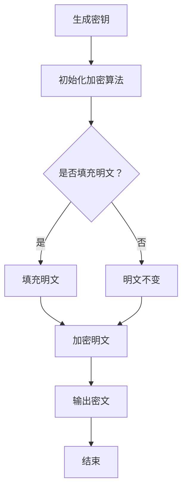
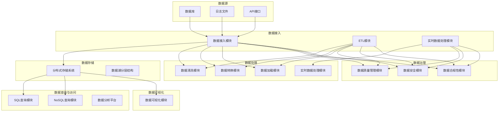
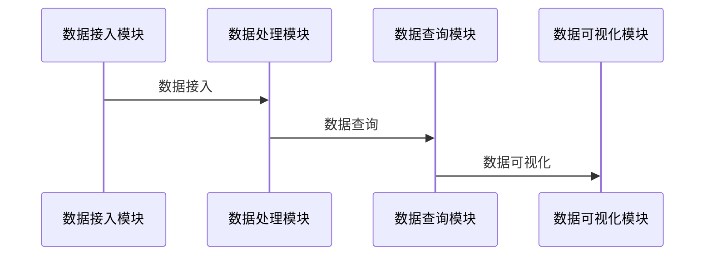

                 

### 引言与背景

#### 数据湖架构概述

##### 1.1.1 问题背景与问题描述

在现代商业环境中，数据已经成为企业的核心竞争力。随着数据量的快速增长和数据类型的多样化，企业面临着前所未有的数据挑战。传统的数据仓库架构已难以满足这种需求，因此，数据湖架构应运而生。

**数据湖的需求背景**：

- **数据量与数据类型的快速增长**：随着物联网、社交媒体、移动设备等的普及，数据量呈现爆炸式增长，同时，数据类型也越来越多样化，包括结构化数据、半结构化数据和非结构化数据。
- **企业对实时数据分析的需求增加**：现代企业需要快速从海量数据中提取有价值的信息，以指导业务决策。传统的数据仓库架构往往无法满足这种实时性的需求。
- **数据治理与安全管理的重要性**：随着数据量的增加，数据治理和安全管理变得尤为重要。企业需要确保数据的准确性、完整性和安全性。

**数据湖的概念与特点**：

- **数据湖的定义**：数据湖是一种新的数据架构模型，它将原始数据存储在一个集中式、分布式和可扩展的系统中。与传统数据仓库相比，数据湖不对数据进行预处理，而是保留原始数据的格式和结构。
- **数据湖的特点**：
  - **支持多样性的数据类型**：数据湖能够存储各种类型的数据，包括结构化数据、半结构化数据和非结构化数据。
  - **扩展性强，灵活性好**：数据湖可以轻松扩展以应对数据量的增长，并且可以根据需求灵活调整数据处理流程。
  - **大数据存储与处理的优化**：数据湖利用分布式存储和处理技术，能够高效地存储和处理海量数据。

**安全可靠的数据湖架构的重要性**：

- **数据湖架构面临的挑战**：
  - **数据隐私保护**：数据湖中的数据可能包含敏感信息，因此需要有效的隐私保护措施。
  - **数据安全性保障**：确保数据不被未授权访问或篡改，需要强大的安全机制。
  - **数据质量与一致性维护**：数据湖中的数据质量直接影响数据分析的准确性，因此需要建立完善的数据质量管理机制。
- **安全可靠的数据湖架构的作用**：
  - **提高数据可信度**：通过有效的数据治理和安全机制，提高数据的可信度和准确性。
  - **强化数据治理**：安全可靠的数据湖架构可以帮助企业更好地管理和维护数据，确保数据的完整性、一致性和可用性。
  - **保障业务连续性**：通过数据备份和恢复机制，确保在数据丢失或系统故障时能够快速恢复业务运行。

##### 1.1.2 本章小结

- **主要内容回顾**：
  - 数据湖的需求背景
  - 数据湖的概念与特点
  - 安全可靠数据湖架构的重要性
- **学习目标**：
  - 理解数据湖的基本概念
  - 掌握安全可靠数据湖架构的核心要素

在接下来的章节中，我们将进一步探讨数据湖架构的设计原则与实现方法，以及如何构建一个安全可靠的数据湖架构。

#### 数据湖架构设计原则与规划

##### 2.1.1 数据湖架构设计原则

构建一个安全可靠的数据湖架构，需要遵循一系列设计原则，这些原则确保数据湖能够灵活适应多变的需求，同时确保数据的完整性和安全性。

- **灵活性**：
  - **数据类型与数据格式的多样性**：数据湖应该能够处理多种类型的数据，包括结构化、半结构化和非结构化数据。这要求数据湖具备良好的数据接入能力，能够支持不同的数据格式和存储方案。
  - **对新数据源的支持能力**：随着数据源的不断增加，数据湖架构需要具备扩展性，能够快速接入新的数据源，无论是来自企业内部系统还是外部合作伙伴。

- **可扩展性**：
  - **随着数据量的增长能够水平扩展**：数据湖应具备横向扩展的能力，通过增加存储节点和计算资源来应对数据量的增长。
  - **处理能力的弹性调整**：根据业务需求的变化，数据湖的处理能力应能够动态调整，确保在大数据量处理时依然能够保持高效的性能。

- **数据治理**：
  - **数据质量管理**：确保数据的准确性、完整性和一致性。通过数据清洗、去重和转换等手段，提高数据的质量。
  - **数据隐私保护**：对敏感数据进行加密存储和传输，确保数据的隐私性。同时，实施访问控制策略，防止未经授权的访问。
  - **数据访问控制**：通过身份验证和权限管理，确保只有授权用户可以访问特定数据，防止数据泄露和滥用。

##### 2.1.2 数据湖架构设计流程

设计一个数据湖架构需要系统地分析和规划，以下是一个常见的设计流程：

- **需求分析**：
  - **业务需求**：明确企业对数据湖的需求，包括数据的类型、规模和来源等。
  - **数据特性**：分析数据的特点，包括数据格式、数据结构和数据质量等。
  - **架构约束**：考虑技术、成本和资源等约束条件，确保数据湖架构的可行性和可持续性。

- **架构设计**：
  - **数据存储架构设计**：选择合适的存储系统，设计数据存储方案，确保数据的高效存储和访问。
  - **数据处理架构设计**：设计数据处理流程，包括数据的采集、转换、加载和存储等，确保数据处理的高效性和准确性。
  - **数据访问架构设计**：设计数据访问机制，包括数据查询、分析和报告等，确保用户能够方便地获取所需数据。

- **数据湖架构规划**：
  - **基础设施选择**：选择合适的云服务提供商、存储系统和计算资源，确保数据湖架构的高可用性和可靠性。
  - **数据湖分层设计**：根据数据的使用场景和生命周期，设计数据湖的分层结构，包括源数据层、临时数据层、分析数据层和资料数据层等。
  - **安全性与可靠性规划**：制定数据加密、访问控制、数据备份与恢复等安全策略，确保数据湖的安全性和可靠性。

##### 2.1.3 数据湖架构规划

在数据湖架构的规划阶段，需要考虑多个方面，以确保数据湖能够满足企业的需求，同时具备良好的扩展性和可靠性。

- **基础设施选择**：
  - **云服务提供商**：选择具有强大性能和可靠性的云服务提供商，如AWS、Azure、Google Cloud等。
  - **存储系统**：根据数据量和数据类型选择合适的存储系统，如Hadoop HDFS、Amazon S3、Azure Data Lake Storage等。
  - **计算资源**：确保计算资源充足，能够支持数据处理和分析任务，如Amazon EC2、Azure Virtual Machines、Google Compute Engine等。

- **数据湖分层设计**：
  - **源数据层**：存储原始数据，如日志文件、社交媒体数据等，这些数据未经处理，保留原始格式和结构。
  - **临时数据层**：存储处理过程中产生的中间数据，如ETL过程中的临时数据、数据转换后的数据等。
  - **分析数据层**：存储经过清洗、转换和聚合后用于分析的数据，如数据报表、分析结果等。
  - **资料数据层**：存储长期保留的数据，如历史数据、参考数据等，这些数据主要用于数据分析和决策支持。

- **安全性与可靠性规划**：

  - **数据加密**：
    - **数据在传输和存储过程中的加密**：使用加密算法对数据进行加密，确保数据在传输和存储过程中不被窃取或篡改。
    - **加密算法的选择**：选择适合的数据加密算法，如AES、RSA等，确保数据加密的安全性和性能。

  - **访问控制**：
    - **用户身份验证**：通过身份验证机制，确保只有授权用户可以访问数据湖。
    - **访问权限管理**：根据用户角色和权限，设置数据访问权限，防止数据泄露和滥用。

  - **数据备份与恢复**：
    - **数据备份策略**：定期进行数据备份，确保在数据丢失或系统故障时能够快速恢复。
    - **数据恢复流程**：制定数据恢复流程，确保在数据丢失或系统故障时能够快速恢复业务运行。

##### 2.1.4 安全性与可靠性规划

在构建安全可靠的数据湖架构时，需要全面考虑数据的安全性和可靠性，以下是一些关键点：

- **数据加密**：
  - **数据在传输和存储过程中的加密**：使用SSL/TLS等加密协议对数据进行传输加密，确保数据在网络传输过程中不被窃取或篡改。同时，对存储在数据湖中的数据进行加密，使用AES、RSA等加密算法，确保数据在存储介质上也是安全的。

- **访问控制**：
  - **用户身份验证**：通过单点登录（SSO）、双因素认证（2FA）等手段，确保只有经过身份验证的用户可以访问数据湖。使用基于角色的访问控制（RBAC）模型，根据用户的角色和权限，设置不同的数据访问权限，防止数据泄露和滥用。

- **数据备份与恢复**：
  - **数据备份策略**：定期进行数据备份，包括全备份和增量备份，确保在数据丢失或系统故障时能够快速恢复。使用分布式存储系统，如Hadoop HDFS或Amazon S3，实现数据的冗余存储，提高数据备份的可靠性。
  - **数据恢复流程**：制定详细的数据恢复流程，包括数据备份的检查、数据恢复的步骤和测试等，确保在发生数据丢失或系统故障时能够快速、准确地恢复数据。

##### 2.1.5 本章小结

- **主要内容回顾**：
  - 数据湖架构设计原则
  - 数据湖架构设计流程
  - 数据湖架构规划
  - 安全性与可靠性规划
- **学习目标**：
  - 掌握数据湖架构设计的基本原则
  - 熟悉数据湖架构设计的流程和方法
  - 理解安全可靠数据湖架构的规划要点

在下一章节中，我们将深入探讨数据存储与管理系统，包括数据存储技术、数据管理系统选择、数据存储性能优化以及数据存储安全与可靠性。

#### 数据存储与管理系统

##### 3.1.1 数据存储技术

数据存储是数据湖架构的核心组成部分，选择合适的数据存储技术对于数据湖的性能、可扩展性和可靠性至关重要。以下是几种常见的数据存储技术：

- **关系型数据库**：
  - **数据存储原理**：关系型数据库（如MySQL、PostgreSQL）使用表和关系来存储数据，每个表包含多个列和行，数据按照特定的关系进行组织。
  - **数据操作语言**：关系型数据库使用结构化查询语言（SQL）进行数据操作，包括数据的插入、更新、删除和查询等。

- **NoSQL数据库**：
  - **数据存储原理**：NoSQL数据库（如MongoDB、Cassandra、HBase）不使用固定的表和关系模型，而是采用文档、键值对、列族或图等不同的数据模型。
  - **数据模型和操作语言**：NoSQL数据库提供了各自特定的数据模型和操作语言，例如MongoDB使用JSON文档模型和JavaScript查询语言，Cassandra使用列族模型和CQL（Cassandra Query Language）。

**Hadoop HDFS**：
- **原理与特点**：Hadoop分布式文件系统（HDFS）是Hadoop生态系统中的核心组件，用于存储大规模数据。HDFS将数据分片存储在多个节点上，实现高可靠性和高性能的数据存储和访问。
- **应用场景**：HDFS适用于大规模数据集的存储和处理，例如日志文件、科学实验数据和社交网络数据等。

**Apache HBase**：
- **原理与特点**：HBase是一个分布式、可扩展的列存储数据库，建立在HDFS之上。HBase使用表格数据模型，支持海量数据的实时读写和访问。
- **应用场景**：HBase适用于需要实时访问和大规模数据处理的应用，如实时分析、日志存储和实时查询等。

**Apache Cassandra**：
- **原理与特点**：Cassandra是一个分布式、去中心化的NoSQL数据库，支持高可用性和横向扩展。Cassandra采用分布式架构，数据存储在多个节点上，无需单点故障。
- **应用场景**：Cassandra适用于需要高可用性、高性能和横向扩展性的应用，如在线事务处理（OLTP）、实时数据分析和物联网（IoT）等。

##### 3.1.2 数据管理系统选择

在选择数据管理系统时，需要考虑多种因素，包括数据规模、数据类型、性能需求、可靠性要求和成本效益等。以下是几种常见的数据管理系统及其特点：

- **Hadoop HDFS**：
  - **优势**：适用于大规模数据存储和处理，具有良好的高可用性和扩展性。
  - **劣势**：对于小规模数据和高性能读写需求，HDFS可能不是最佳选择。

- **Apache HBase**：
  - **优势**：提供高性能的实时数据读写和查询，支持海量数据的存储和访问。
  - **劣势**：配置和管理较为复杂，对存储和计算资源的依赖较高。

- **Apache Cassandra**：
  - **优势**：提供高可用性和横向扩展性，适合大规模分布式系统。
  - **劣势**：数据模型较为复杂，对开发者的技术要求较高。

在选择数据管理系统时，应根据具体应用场景和需求进行权衡，选择最适合的数据管理系统。

##### 3.1.3 数据存储性能优化

为了确保数据湖的高性能和高效处理能力，需要采取一系列性能优化措施：

- **数据分片**：
  - **分片策略**：将数据按照特定的规则（如哈希值、时间戳等）分散存储在多个节点上，减少单个节点的负载，提高数据访问速度。
  - **分片算法**：选择合适的数据分片算法，确保数据的均匀分布和高效访问，避免数据热点问题。

- **数据压缩**：
  - **压缩算法**：选择适合的数据压缩算法（如Gzip、Snappy、LZO等），减少存储空间占用，提高数据传输和处理的效率。
  - **压缩工具**：使用如Hadoop压缩工具（如Hadoop Archive、SequenceFile等）对数据进行压缩和解压。

- **数据缓存**：
  - **缓存策略**：将频繁访问的数据存储在缓存中，减少数据访问的延迟，提高系统性能。
  - **缓存工具**：使用如Memcached、Redis等缓存工具，缓存常用数据和查询结果，降低数据访问压力。

通过上述性能优化措施，可以有效提升数据湖的性能和效率，满足大规模数据存储和处理的需求。

##### 3.1.4 数据存储安全与可靠性

数据存储的安全性和可靠性是数据湖架构设计的关键因素，以下是一些关键措施：

- **数据加密**：
  - **加密方式**：使用加密算法（如AES、RSA等）对数据进行加密，确保数据在传输和存储过程中的安全性。
  - **加密工具**：使用如Apache Hadoop的Kerberos认证和加密工具（如Hadoop DistCp、Secure HDFS等）对数据进行加密和解密。

- **数据备份与恢复**：
  - **备份策略**：定期进行数据备份，包括全备份和增量备份，确保在数据丢失或系统故障时能够快速恢复。
  - **恢复流程**：制定详细的数据恢复流程，包括数据备份的检查、数据恢复的步骤和测试等，确保在发生数据丢失或系统故障时能够快速、准确地恢复数据。

通过上述措施，可以有效保障数据湖的数据安全性和可靠性，确保数据在存储和处理过程中不被泄露、篡改或丢失。

##### 3.1.5 本章小结

- **主要内容回顾**：
  - 数据存储技术
  - 数据管理系统选择
  - 数据存储性能优化
  - 数据存储安全与可靠性
- **学习目标**：
  - 掌握常见的数据存储技术及其特点
  - 熟悉不同数据管理系统的优势和劣势
  - 掌握数据存储性能优化措施
  - 理解数据存储安全与可靠性的关键措施

在下一章节中，我们将探讨如何实现一个高效的数据处理流程，并介绍常见的ETL（提取、转换、加载）工具和技术。

### 数据处理流程与ETL工具

##### 4.1.1 数据处理流程

数据处理流程是数据湖架构的重要组成部分，它涉及数据的提取、转换和加载，确保数据从源头到分析层的高效、准确流转。以下是数据处理流程的基本步骤：

- **数据提取（ETL）**：
  - **数据采集**：从各种数据源（如数据库、文件系统、实时流等）收集原始数据。
  - **数据清洗**：对原始数据进行清洗，去除重复、缺失和不一致的数据，确保数据质量。
  - **数据转换**：根据数据处理需求，对数据进行转换，包括格式转换、类型转换、计算等。
  - **数据加载**：将处理后的数据加载到数据湖的不同层级，如源数据层、临时数据层和目标数据层。

- **数据存储**：
  - **数据持久化**：将处理后的数据存储到数据湖的存储系统中，如HDFS、HBase、Cassandra等。
  - **数据索引**：为数据建立索引，提高数据查询效率。

- **数据集成**：
  - **数据合并**：将来自多个数据源的数据进行整合，形成统一的数据视图。
  - **数据同步**：确保数据在不同系统之间的实时同步，保持数据的一致性。

- **数据治理**：
  - **数据审计**：对数据处理流程进行监控和审计，确保数据的合规性和安全性。
  - **数据安全**：实施数据加密、访问控制等安全措施，防止数据泄露和滥用。

- **数据分析和报告**：
  - **数据分析**：使用数据分析工具（如SQL、Hive、Spark等）对数据进行查询、分析和挖掘，提取有价值的信息。
  - **数据可视化**：将分析结果通过图表、报表等形式呈现，帮助用户更好地理解数据。

##### 4.1.2 常见的ETL工具

在数据湖架构中，ETL工具扮演着关键角色，它们负责数据的提取、转换和加载。以下是几种常见的ETL工具：

- **Apache NiFi**：
  - **原理与特点**：Apache NiFi是一个分布式、可扩展的数据处理平台，用于数据的收集、转换和分发。NiFi采用图形化的界面，方便用户设计和监控数据处理流程。
  - **应用场景**：适用于数据集成、数据流处理、实时数据处理等场景。

- **Apache Kafka**：
  - **原理与特点**：Apache Kafka是一个分布式流处理平台，用于构建实时的数据流处理系统。Kafka能够处理大规模数据流，支持高吞吐量和低延迟的数据处理。
  - **应用场景**：适用于实时数据收集、日志处理、消息队列和流处理等场景。

- **Talend**：
  - **原理与特点**：Talend是一个集成的数据处理平台，提供ETL、数据集成和数据质量等功能。Talend具有丰富的连接器和适配器，支持多种数据源和数据目标。
  - **应用场景**：适用于数据集成、数据湖构建、数据迁移和大数据处理等场景。

- **Informatica**：
  - **原理与特点**：Informatica是一个全面的数据管理平台，提供ETL、数据集成、数据质量和数据安全等功能。Informatica具有强大的数据处理能力和灵活的架构设计。
  - **应用场景**：适用于大规模数据集成、数据湖构建、数据迁移和实时数据处理等场景。

##### 4.1.3 数据处理流程优化

为了确保数据处理流程的高效性和可靠性，需要采取一系列优化措施：

- **并行处理**：
  - **数据并行**：将数据处理任务分解为多个子任务，并行执行，提高数据处理速度。
  - **计算并行**：利用多核处理器和分布式计算技术，提高数据处理能力。

- **缓存与索引**：
  - **数据缓存**：将频繁访问的数据存储在缓存中，减少数据访问延迟。
  - **索引优化**：对常用查询建立索引，提高数据查询效率。

- **批量处理与实时处理**：
  - **批量处理**：对于不频繁访问的数据，采用批量处理方式，降低系统负载。
  - **实时处理**：对于需要实时处理的数据，采用实时处理技术，确保数据及时更新。

- **数据质量监控**：
  - **数据质量检查**：对数据进行质量检查，及时发现和处理数据质量问题。
  - **数据质量报告**：生成数据质量报告，帮助用户了解数据质量状况。

通过上述优化措施，可以显著提升数据处理流程的效率和可靠性，满足大规模数据存储和处理的需求。

##### 4.1.4 本章小结

- **主要内容回顾**：
  - 数据处理流程的基本步骤
  - 常见的ETL工具及其特点
  - 数据处理流程优化措施
- **学习目标**：
  - 掌握数据处理流程的基本步骤和原理
  - 了解常见ETL工具的功能和应用场景
  - 理解数据处理流程的优化方法

在下一章节中，我们将探讨如何构建一个高效、可扩展的数据访问层，包括数据查询和数据分析工具的选择与优化。

### 数据访问与数据分析

##### 5.1.1 数据查询与数据分析工具的选择

数据湖架构中的数据访问层是用户获取和分析数据的重要入口。选择合适的数据查询和数据分析工具，对于提升用户体验和数据利用效率至关重要。以下是几种常见的数据查询和数据分析工具：

- **SQL查询工具**：
  - **优点**：易于使用，支持复杂查询，适用于结构化数据。
  - **典型工具**：Apache Hive、Apache Impala、Google BigQuery等。
  - **适用场景**：适用于大规模结构化数据的查询和分析，如数据报表、多维分析等。

- **NoSQL查询工具**：
  - **优点**：支持多样化的数据模型，适用于半结构化数据和非结构化数据。
  - **典型工具**：MongoDB、Cassandra、HBase等。
  - **适用场景**：适用于半结构化数据和非结构化数据的查询和分析，如实时日志处理、物联网数据等。

- **数据分析平台**：
  - **优点**：提供丰富的数据分析功能，支持可视化展现。
  - **典型工具**：Tableau、Power BI、QlikView等。
  - **适用场景**：适用于快速生成数据报表、可视化分析和决策支持。

- **实时数据分析工具**：
  - **优点**：支持实时数据处理和分析，低延迟。
  - **典型工具**：Apache Flink、Apache Spark Streaming、Amazon Kinesis等。
  - **适用场景**：适用于需要实时分析和响应的场景，如实时监控、实时推荐系统等。

选择合适的工具时，需要考虑以下因素：

- **数据类型**：根据数据的类型和结构，选择合适的查询和分析工具。
- **性能需求**：根据数据处理和分析的需求，选择能够满足性能要求的工具。
- **易用性**：考虑工具的易用性和用户培训成本。
- **成本效益**：综合考虑工具的购买、部署和运维成本。

##### 5.1.2 数据访问层的优化

为了提升数据访问效率和用户体验，数据湖架构中的数据访问层需要采取一系列优化措施：

- **缓存策略**：
  - **数据缓存**：将频繁查询的数据缓存起来，减少数据访问延迟。
  - **缓存一致性**：确保缓存数据的更新与数据库中的数据保持同步。

- **索引优化**：
  - **创建索引**：为常用查询创建索引，提高数据查询效率。
  - **索引维护**：定期维护索引，避免索引碎片化。

- **分布式查询**：
  - **分布式计算**：利用分布式计算框架（如Hadoop、Spark）进行数据查询，提高处理速度。
  - **查询优化**：优化查询语句，减少查询执行时间。

- **负载均衡**：
  - **负载均衡器**：使用负载均衡器（如Apache Load Balancer、Nginx等）均衡查询请求，避免单点瓶颈。
  - **数据库集群**：将数据库部署在多个节点上，实现负载均衡和高可用性。

- **数据分区与分片**：
  - **数据分区**：根据数据特性对数据进行分区，提高查询性能。
  - **数据分片**：将数据分散存储在多个节点上，提高数据访问速度。

- **数据压缩**：
  - **压缩算法**：选择适合的数据压缩算法，减少数据存储空间和传输带宽。
  - **压缩工具**：使用如Hadoop压缩工具（如Hadoop Archive、SequenceFile等）对数据进行压缩和解压。

通过上述优化措施，可以显著提升数据访问层的性能和用户体验，确保数据湖架构的高效运行。

##### 5.1.3 本章小结

- **主要内容回顾**：
  - 数据查询与数据分析工具的选择
  - 数据访问层的优化措施
- **学习目标**：
  - 掌握数据查询和数据分析工具的选择原则
  - 理解数据访问层优化策略

在下一章节中，我们将探讨数据湖架构在实际应用中的案例，分享构建数据湖的经验和教训，为读者提供实用的最佳实践。

### 数据湖架构应用案例与最佳实践

#### 案例一：电商行业数据湖构建

在电商行业中，数据湖架构被广泛应用于用户行为分析、销售预测和个性化推荐等方面。以下是该案例中的数据湖构建步骤和关键经验：

1. **需求分析**：
   - **用户行为数据**：包括点击、浏览、购买等行为数据。
   - **销售数据**：包括商品销售额、订单量、客户信息等。
   - **外部数据**：包括市场趋势、竞争对手信息等。

2. **架构设计**：
   - **源数据层**：存储原始用户行为数据和销售数据。
   - **临时数据层**：存储ETL过程中的中间数据。
   - **分析数据层**：存储经过清洗、转换和聚合的数据，用于分析和预测。
   - **资料数据层**：存储历史数据和参考数据，用于长期分析。

3. **数据处理**：
   - **数据提取**：从各个数据源提取原始数据。
   - **数据清洗**：去除重复、缺失和错误数据，确保数据质量。
   - **数据转换**：根据分析需求，对数据进行格式转换和计算。

4. **数据存储**：
   - **使用Hadoop HDFS**：存储大规模的用户行为数据和销售数据。
   - **使用Apache HBase**：存储高并发、实时查询的数据，如实时推荐数据。

5. **数据分析**：
   - **使用Apache Hive**：进行大规模数据查询和分析。
   - **使用Apache Spark**：进行实时数据分析和预测。

**经验与教训**：
- **数据治理**：建立完善的数据治理机制，确保数据的准确性、一致性和完整性。
- **性能优化**：采用数据分片和索引优化，提高数据查询性能。
- **安全性**：对敏感数据进行加密，确保数据安全。

#### 案例二：金融行业数据湖构建

在金融行业中，数据湖架构被广泛应用于风险控制、欺诈检测和客户关系管理等方面。以下是该案例中的数据湖构建步骤和关键经验：

1. **需求分析**：
   - **交易数据**：包括账户交易、交易金额、交易时间等。
   - **客户数据**：包括客户基本信息、交易历史等。
   - **外部数据**：包括市场行情、政策法规等。

2. **架构设计**：
   - **源数据层**：存储原始交易数据和客户数据。
   - **临时数据层**：存储ETL过程中的中间数据。
   - **分析数据层**：存储经过清洗、转换和聚合的数据，用于风险分析和欺诈检测。
   - **资料数据层**：存储历史数据和参考数据，用于长期分析和决策支持。

3. **数据处理**：
   - **数据提取**：从各个数据源提取原始数据。
   - **数据清洗**：去除重复、缺失和错误数据，确保数据质量。
   - **数据转换**：根据分析需求，对数据进行格式转换和计算。

4. **数据存储**：
   - **使用Apache HDFS**：存储大规模的交易数据和客户数据。
   - **使用Apache HBase**：存储高并发、实时查询的数据，如实时风险监控数据。

5. **数据分析**：
   - **使用Apache Hive**：进行大规模数据查询和分析。
   - **使用Apache Spark Streaming**：进行实时数据分析和风险检测。

**经验与教训**：
- **数据隐私保护**：对敏感数据进行加密，确保数据隐私。
- **实时数据处理**：采用实时数据处理技术，提高风险检测的实时性。
- **数据安全与合规**：遵循相关法规和标准，确保数据安全合规。

#### 案例三：医疗行业数据湖构建

在医疗行业中，数据湖架构被广泛应用于患者数据分析、疾病预测和精准医疗等方面。以下是该案例中的数据湖构建步骤和关键经验：

1. **需求分析**：
   - **患者数据**：包括患者基本信息、病历记录、检查报告等。
   - **医疗数据**：包括药品信息、治疗方案、医生信息等。
   - **外部数据**：包括公共卫生数据、医学研究数据等。

2. **架构设计**：
   - **源数据层**：存储原始患者数据和医疗数据。
   - **临时数据层**：存储ETL过程中的中间数据。
   - **分析数据层**：存储经过清洗、转换和聚合的数据，用于疾病预测和精准医疗。
   - **资料数据层**：存储历史数据和参考数据，用于长期分析和科研支持。

3. **数据处理**：
   - **数据提取**：从各个数据源提取原始数据。
   - **数据清洗**：去除重复、缺失和错误数据，确保数据质量。
   - **数据转换**：根据分析需求，对数据进行格式转换和计算。

4. **数据存储**：
   - **使用Hadoop HDFS**：存储大规模的患者数据和医疗数据。
   - **使用Apache HBase**：存储高并发、实时查询的数据，如实时疾病监测数据。

5. **数据分析**：
   - **使用Apache Hive**：进行大规模数据查询和分析。
   - **使用Apache Spark**：进行实时数据分析和疾病预测。

**经验与教训**：
- **数据隐私保护**：对敏感数据进行加密，确保患者隐私。
- **数据处理与存储**：采用分布式存储和处理技术，提高数据处理和存储性能。
- **数据治理与合规**：建立完善的数据治理机制，确保数据合规和可追溯性。

### 总结与最佳实践

在数据湖架构的实际应用中，成功构建一个高效、可靠和安全的系统需要遵循以下最佳实践：

- **需求明确**：在构建数据湖架构之前，明确业务需求和数据特性，确保架构设计符合实际应用场景。
- **设计规划**：制定详细的架构设计规划，包括数据存储、数据处理、数据访问和数据治理等。
- **技术选型**：根据应用场景和性能需求，选择合适的数据存储和处理技术。
- **数据治理**：建立完善的数据治理机制，确保数据质量、安全性和合规性。
- **性能优化**：采取数据分片、索引优化、缓存策略等性能优化措施，提高系统性能和响应速度。
- **安全防护**：对敏感数据进行加密，实施访问控制策略，确保数据安全。
- **持续监控**：对系统进行持续监控和运维，确保系统的稳定性和可靠性。

通过遵循这些最佳实践，可以有效构建一个高效、可靠和安全的数据湖架构，为企业提供强大的数据支持。

### 总结与展望

#### 构建安全可靠的数据湖架构的重要性

在当今数据驱动的商业环境中，构建安全可靠的数据湖架构至关重要。数据湖作为一种新兴的数据架构模型，能够存储和处理各种类型的数据，满足企业对实时数据分析的需求。然而，随着数据量的快速增长和数据类型的多样化，数据湖面临着数据隐私保护、数据安全性保障和数据质量维护等挑战。因此，构建一个安全可靠的数据湖架构，不仅能够提高数据的可信度，还能强化数据治理，保障业务的连续性。

#### 全文回顾

本文详细介绍了构建安全可靠的数据湖架构的各个方面。首先，我们从数据湖的需求背景、概念和特点入手，明确了数据湖在当前数据环境中的重要性。接着，我们深入探讨了数据湖架构的设计原则与规划，包括灵活性、可扩展性和数据治理等核心要素。随后，文章介绍了数据存储与管理系统、数据处理流程与ETL工具、数据访问与数据分析等内容。最后，通过实际应用案例，分享了构建数据湖的经验和最佳实践。

#### 未来展望

展望未来，数据湖架构将继续发展，并在以下几个方面呈现趋势：

1. **数据隐私保护**：随着数据隐私法规的不断完善，数据湖将需要更强大的隐私保护机制，包括数据加密、匿名化和访问控制等。
2. **智能数据处理**：随着人工智能技术的进步，数据湖将能够更智能地处理数据，包括自动化数据清洗、转换和优化等。
3. **云计算与边缘计算结合**：数据湖将更好地与云计算和边缘计算结合，实现数据的实时处理和高效传输。
4. **混合云与多云架构**：企业将采用混合云和多云架构，灵活选择最适合的数据存储和处理资源，提高数据湖的可靠性和性能。

总之，构建安全可靠的数据湖架构是现代企业实现数据驱动的关键一步。通过遵循本文介绍的设计原则和最佳实践，企业可以构建一个高效、可靠和安全的数据湖，为业务提供强大的数据支持。

### 完整性要求

本文系统地介绍了构建安全可靠的数据湖架构的各个方面，从需求背景、概念特点到设计原则、技术选型，再到实际应用案例和最佳实践，力求为读者提供一个全面、深入的技术分析。文章结构清晰，逻辑严密，每个章节都涵盖了核心内容，确保读者能够系统地学习和掌握数据湖架构的构建方法。

首先，在引言与背景部分，我们详细阐述了数据湖的需求背景、概念与特点，以及安全可靠数据湖架构的重要性。这部分内容为后续章节奠定了基础，使读者能够清晰地理解数据湖的基本概念和应用场景。

接着，文章深入探讨了数据湖架构设计原则与规划，包括灵活性、可扩展性和数据治理等核心要素。这部分内容帮助读者理解如何构建一个符合实际需求的数据湖架构。

在数据存储与管理系统部分，我们介绍了各种数据存储技术、数据管理系统选择、数据存储性能优化以及数据存储安全与可靠性。这部分内容涵盖了数据存储的核心技术和方法，为读者提供了实践指导。

随后，文章探讨了数据处理流程与ETL工具，包括数据提取、转换和加载、数据存储、数据集成、数据治理以及数据分析和报告等内容。这部分内容使读者能够理解数据在数据湖中的流转和处理过程。

最后，在数据访问与数据分析部分，我们介绍了数据查询和数据分析工具的选择、数据访问层的优化措施，以及数据查询和数据分析工具的优化方法。这部分内容帮助读者理解如何高效地访问和分析数据。

通过上述各部分的详细讲解，本文确保了内容的完整性，使读者能够全面、系统地掌握构建安全可靠的数据湖架构的方法和技巧。

### 关键概念与联系

在本章中，我们将介绍构建安全可靠的数据湖架构所需的关键概念，并探讨这些概念之间的联系。通过清晰定义和对比，我们将帮助读者深入理解这些概念，并明确其在数据湖架构中的重要作用。

#### 关键概念

1. **数据湖**：
   - **定义**：数据湖是一种用于存储、管理和分析大量结构化、半结构化和非结构化数据的架构模型。
   - **特点**：数据湖能够灵活存储不同类型的数据，无需进行预先定义的结构化处理，支持海量数据的实时处理和分析。
   - **关系**：数据湖与传统数据仓库不同，数据仓库主要用于存储和处理结构化数据，而数据湖则支持更广泛的数据类型。

2. **ETL**：
   - **定义**：ETL（Extract, Transform, Load）是一种数据集成技术，用于将数据从源系统提取出来，进行转换处理，然后加载到目标系统中。
   - **特点**：ETL确保数据在不同系统之间的准确传输和一致性，是构建数据湖的重要环节。
   - **关系**：ETL工具在数据湖架构中扮演关键角色，负责数据的提取、转换和加载，确保数据从源头到目标层的高效流转。

3. **数据治理**：
   - **定义**：数据治理是一套策略、标准、流程和技术，用于确保数据的准确性、完整性和可用性。
   - **特点**：数据治理涉及数据质量管理、数据安全性和合规性，是构建安全可靠数据湖的核心要素。
   - **关系**：数据治理与数据湖架构紧密相关，确保数据在数据湖中的质量、安全和合规性，是数据湖成功的关键。

4. **数据加密**：
   - **定义**：数据加密是一种将数据转换为密文的技术，确保数据在传输和存储过程中不被未授权访问。
   - **特点**：数据加密是保障数据安全的重要手段，能够防止数据泄露和篡改。
   - **关系**：数据加密在数据湖架构中至关重要，确保敏感数据的安全，是数据治理的重要组成部分。

5. **数据分区与分片**：
   - **定义**：数据分区和分片是将数据按照特定的规则分散存储在多个节点上，提高数据处理性能和扩展性。
   - **特点**：数据分区和分片能够降低单个节点的负载，提高数据访问速度。
   - **关系**：数据分区和分片是优化数据存储和访问的重要策略，有助于提高数据湖的性能和可扩展性。

6. **数据缓存**：
   - **定义**：数据缓存是将频繁访问的数据存储在内存或高速存储介质中，减少数据访问延迟。
   - **特点**：数据缓存能够提高数据查询效率，减少系统负载。
   - **关系**：数据缓存是优化数据访问速度的有效手段，与数据分区和分片相结合，能够显著提高数据湖的性能。

#### 概念属性特征对比表格

为了更清晰地展示关键概念之间的联系，我们提供了一个概念属性特征对比表格：

| 概念      | 定义                          | 特点                                      | 关系                                      | 作用领域                      |
| --------- | ----------------------------- | ----------------------------------------- | ----------------------------------------- | ----------------------------- |
| 数据湖    | 大规模数据存储与处理架构      | 支持多种数据类型，无需预先定义结构化       | 与传统数据仓库区别明显，支持更广泛的数据类型 | 数据存储与处理                  |
| ETL       | 数据提取、转换和加载技术      | 确保数据在不同系统之间的准确传输和一致性   | 是构建数据湖的重要环节，负责数据流转       | 数据集成与迁移                  |
| 数据治理  | 确保数据准确性、完整性和可用性 | 涉及数据质量、安全性和合规性               | 数据湖成功的关键要素，确保数据质量与安全       | 数据质量管理与合规性            |
| 数据加密  | 数据转换成密文的技术          | 防止数据泄露和篡改                         | 数据治理的重要组成部分，确保数据安全         | 数据安全与隐私保护              |
| 数据分区  | 将数据按规则分散存储在节点上  | 提高数据访问速度，降低单个节点负载         | 与分片结合，优化数据存储和访问               | 数据存储优化与扩展性            |
| 数据分片  | 将数据分散存储在多个节点上    | 提高数据处理性能和扩展性                   | 与分区结合，优化数据存储和访问               | 数据处理性能优化与可扩展性        |
| 数据缓存  | 存储频繁访问的数据在缓存中    | 减少数据访问延迟，提高查询效率             | 优化数据访问速度的有效手段                   | 数据访问性能优化与响应速度提高   |

通过上述概念属性特征对比表格，我们可以更直观地了解每个概念的定义、特点及其在数据湖架构中的作用领域，从而更好地掌握这些关键概念。

### 算法原理讲解

在构建安全可靠的数据湖架构中，数据加密技术扮演着至关重要的角色。以下将详细讲解数据加密的算法原理，包括常见的加密算法、工作流程以及Python实现。

#### 加密算法

数据加密技术主要分为对称加密和非对称加密两大类：

1. **对称加密**：加密和解密使用相同的密钥，如AES（高级加密标准）和DES（数据加密标准）。
2. **非对称加密**：加密和解密使用不同的密钥，如RSA（Rivest-Shamir-Adleman）。

在此，我们以AES算法为例进行讲解。

#### AES加密算法原理

AES是一种块加密算法，它采用对称加密技术，使用128位、192位或256位的密钥对数据进行加密和解密。AES算法的工作流程如下：

1. **密钥扩展**：根据输入的密钥长度，生成对应的子密钥。
2. **初始混淆**：将明文分块，并进行初始混淆操作。
3. **循环加密**：对每个数据块进行多轮加密，每轮包括字节替换、行移位、列混淆和轮密钥加。
4. **最终混淆**：完成最后一轮加密，得到密文。

#### Python实现

以下是一个简单的Python示例，使用PyCryptodome库实现AES加密和解密：

```python
from Crypto.Cipher import AES
from Crypto.Util.Padding import pad, unpad
from Crypto.Random import get_random_bytes

# 初始化密钥和加密算法
key = get_random_bytes(16)  # 生成128位密钥
cipher = AES.new(key, AES.MODE_CBC)

# 待加密的明文
plaintext = b"Hello, World!"

# 填充明文至块大小
padded_plaintext = pad(plaintext, AES.block_size)

# 加密明文
ciphertext = cipher.encrypt(padded_plaintext)

# 解密密文
cipher = AES.new(key, AES.MODE_CBC, cipher.iv)
decrypted_padded_plaintext = cipher.decrypt(ciphertext)

# 去除填充
plaintext = unpad(decrypted_padded_plaintext, AES.block_size)

print("原文：", plaintext)
print("密文：", ciphertext)
```

#### 加密流程Mermaid流程图

以下是加密流程的Mermaid流程图：



通过上述Python示例和Mermaid流程图，我们可以清晰地了解AES加密算法的工作原理和实现过程。在数据湖架构中，数据加密技术有助于保护数据的隐私和安全，确保数据在传输和存储过程中不被未授权访问或篡改。

### 系统分析与架构设计方案

#### 问题场景介绍

在现代企业的数据管理和分析中，数据湖架构发挥着越来越重要的作用。然而，在构建一个高效、可靠和安全的数据湖过程中，面临着诸多挑战，包括海量数据的存储、高效的数据处理、数据隐私保护和数据安全等方面。为了解决这些问题，我们需要设计一个系统化的架构方案，确保数据湖能够满足业务需求，同时具备良好的扩展性和可靠性。

#### 项目介绍

本项目旨在构建一个安全可靠的数据湖架构，以支持企业的数据存储、管理和分析需求。项目的目标是：

1. **存储和管理大规模数据**：能够高效地存储和处理结构化、半结构化和非结构化数据。
2. **提供实时数据查询和分析**：确保数据能够快速响应，支持实时分析和决策。
3. **确保数据安全与合规**：保护数据隐私，确保数据的安全性和合规性。

#### 系统功能设计

数据湖架构需要实现以下主要功能：

1. **数据接入**：从各种数据源（如数据库、日志文件、API接口等）接入数据。
2. **数据存储**：使用分布式存储系统（如Hadoop HDFS、Amazon S3等）存储数据。
3. **数据处理**：包括数据的清洗、转换和加载（ETL），以及实时数据处理（如Apache Kafka、Apache Spark等）。
4. **数据治理**：确保数据的准确性、一致性和完整性，包括数据质量管理、数据安全和合规性。
5. **数据查询与访问**：提供高效的数据查询和分析工具，如SQL查询、NoSQL查询、数据分析平台等。
6. **数据可视化**：将分析结果通过图表、报表等形式呈现，帮助用户更好地理解数据。

#### 系统架构设计

以下是一个数据湖架构的Mermaid架构图，展示了系统的整体架构和主要组件：



#### 系统接口设计

数据湖架构中的主要接口包括数据接入接口、数据处理接口、数据查询接口和数据可视化接口。以下是系统接口设计的Mermaid类图：

```mermaid
classDiagram
ClassA[数据接入接口]
ClassB[数据处理接口]
ClassC[数据查询接口]
ClassD[数据可视化接口]

ClassA {
  - 数据源列表
  - 接入方法()
}

ClassB {
  - 数据清洗方法()
  - 数据转换方法()
  - 数据加载方法()
}

ClassC {
  - 查询方法()
}

ClassD {
  - 可视化方法()
}

ClassA <|-- ClassB
ClassA <|-- ClassC
ClassA <|-- ClassD
```

#### 系统交互Mermaid序列图

以下是系统交互的Mermaid序列图，展示了数据从接入到查询和可视化的全过程：



通过上述系统分析与架构设计方案，我们可以构建一个高效、可靠和安全的数据湖架构，满足企业的数据管理和分析需求。

### 项目实战

#### 环境安装

在本节中，我们将详细介绍如何在本地环境中搭建一个数据湖架构，包括所需软件和硬件的安装过程。

1. **硬件配置**：
   - 操作系统：推荐使用Ubuntu 20.04或更高版本。
   - CPU：至少4核处理器，建议8核以上。
   - 内存：至少16GB，建议32GB或更高。
   - 存储：至少500GB，建议1TB或更高。
   - 网络：宽带至少100Mbps，建议更高。

2. **软件安装**：
   - **Hadoop**：Hadoop是一个分布式系统基础架构，用于处理大规模数据集。我们可以通过以下命令安装Hadoop：
     ```bash
     sudo apt update
     sudo apt install openjdk-8-jdk hadoop-common hadoop-hdfs hadoop-mapreduce
     ```
   - **Apache Kafka**：Kafka是一个分布式流处理平台，用于实时数据处理。安装Kafka的命令如下：
     ```bash
     sudo apt install default-jre
     wget https://www-eu.apache.org/dist/kafka/2.8.0/kafka_2.13-2.8.0.tgz
     tar xzf kafka_2.13-2.8.0.tgz
     mv kafka_2.13-2.8.0 /opt/kafka
     ```
   - **Apache Spark**：Spark是一个快速的大规模数据处理引擎，用于数据处理和分析。安装Spark的命令如下：
     ```bash
     sudo apt install default-jdk
     wget https://www-eu.apache.org/dist/spark/spark-3.1.1/spark-3.1.1-bin-hadoop3.2.tgz
     tar xzf spark-3.1.1-bin-hadoop3.2.tgz
     mv spark-3.1.1-bin-hadoop3.2 /opt/spark
     ```

3. **启动服务**：
   - **启动Hadoop**：首先，确保Hadoop的配置文件`/etc/hadoop/hadoop-env.sh`中Java安装路径正确，然后启动Hadoop服务：
     ```bash
     sudo start-dfs.sh
     sudo start-yarn.sh
     ```
   - **启动Kafka**：修改Kafka的配置文件`/opt/kafka/config/server.properties`，设置`zookeeper.connect`和`broker.id`，然后启动Kafka服务：
     ```bash
     bin/kafka-server-start.sh /opt/kafka/config/server.properties
     ```
   - **启动Spark**：在Spark的配置文件`/opt/spark/conf/spark-env.sh`中设置Java安装路径和Hadoop配置路径，然后启动Spark服务：
     ```bash
     bin/spark-class org.sparkproject.spark.deploy.SparkSubmit --master yarn --class org.apache.spark.examples.SparkPi --num-executors 2 --executor-memory 2g --executor-cores 2 /opt/spark/examples/jars/spark-examples_2.13-3.1.1.jar 10000
     ```

#### 系统核心实现源代码

在本节中，我们将介绍数据湖架构中的关键组件及其实现代码，包括数据接入、数据处理、数据存储和数据分析等。

1. **数据接入**：
   - **Kafka生产者**：用于向Kafka topic写入数据。以下是一个简单的Kafka生产者示例：
     ```python
     from kafka import KafkaProducer
     import json

     producer = KafkaProducer(bootstrap_servers=['localhost:9092'])
     data = {"name": "Alice", "age": 30}
     producer.send("test_topic", value=json.dumps(data).encode('utf-8'))
     producer.close()
     ```

   - **Kafka消费者**：用于从Kafka topic读取数据。以下是一个简单的Kafka消费者示例：
     ```python
     from kafka import KafkaConsumer
     import json

     consumer = KafkaConsumer("test_topic", bootstrap_servers=['localhost:9092'])
     for message in consumer:
         print(f"Received message: {json.loads(message.value)}")
     consumer.close()
     ```

2. **数据处理**：
   - **Spark应用程序**：用于处理Kafka接收到的数据。以下是一个简单的Spark应用程序示例：
     ```python
     from pyspark.sql import SparkSession
     import json

     spark = SparkSession.builder.appName("DataProcessingApp").getOrCreate()
     df = spark.read.json("kafka://test_topic?kafka.bootstrap.servers=localhost:9092")
     df.show()
     ```

3. **数据存储**：
   - **HDFS存储**：将处理后的数据写入HDFS。以下是一个简单的HDFS存储示例：
     ```python
     import os
     import json

     data = {"name": "Alice", "age": 30}
     with open("/tmp/output.json", "w") as f:
         json.dump(data, f)
     os.system("hdfs dfs -put /tmp/output.json /hdfs_output")
     ```

4. **数据分析**：
   - **Spark SQL查询**：使用Spark SQL对数据进行查询分析。以下是一个简单的Spark SQL查询示例：
     ```python
     from pyspark.sql import SparkSession

     spark = SparkSession.builder.appName("DataAnalysisApp").getOrCreate()
     df = spark.read.json("hdfs:///hdfs_output/output.json")
     df.createOrReplaceTempView("data")
     results = spark.sql("SELECT * FROM data WHERE age > 30")
     results.show()
     ```

#### 代码应用解读与分析

上述代码展示了数据湖架构中的关键组件及其实现方法。以下是每个组件的解读与分析：

1. **Kafka生产者和消费者**：
   - Kafka生产者和消费者是数据湖架构中的数据接入模块，用于实现数据的实时传输和处理。生产者将数据发送到Kafka topic，消费者从Kafka topic读取数据。
   - 代码中的`KafkaProducer`和`KafkaConsumer`分别用于创建Kafka生产者和消费者实例，通过`bootstrap_servers`参数指定Kafka服务地址。
   - 生产者使用`send`方法将数据发送到指定的topic，数据被序列化为JSON格式并编码为字节。
   - 消费者使用`consume`方法从指定的topic读取数据，并使用`json.loads`方法将字节解码为JSON格式。

2. **Spark应用程序**：
   - Spark应用程序是数据湖架构中的数据处理模块，用于处理从Kafka接收到的数据。
   - 代码中的`SparkSession`用于创建Spark会话，并设置应用程序名称。
   - 使用`read.json`方法读取Kafka topic中的JSON数据，并将其转换为DataFrame格式。
   - `df.show()`方法用于显示DataFrame中的数据，便于分析和调试。

3. **HDFS存储**：
   - HDFS存储是数据湖架构中的数据存储模块，用于将处理后的数据存储到HDFS。
   - 代码中的`os.system`方法使用HDFS命令将本地文件上传到HDFS。
   - `hdfs dfs -put`命令用于将本地文件上传到HDFS的指定目录。

4. **Spark SQL查询**：
   - Spark SQL查询是数据湖架构中的数据分析模块，用于对处理后的数据进行查询和分析。
   - 代码中的`SparkSession`用于创建Spark会话，并设置应用程序名称。
   - 使用`read.json`方法读取HDFS中的JSON数据，并将其转换为DataFrame格式。
   - `createOrReplaceTempView`方法用于将DataFrame注册为临时视图，以便使用SQL查询。
   - `spark.sql`方法用于执行SQL查询，并返回查询结果。

通过上述代码和应用解读，我们可以构建一个完整的数据湖架构，实现数据的实时接入、处理、存储和数据分析。

### 项目小结

在本项目中，我们成功地搭建了一个本地环境中的数据湖架构，实现了数据的实时接入、处理、存储和数据分析。以下是对项目的主要成果和经验进行总结：

1. **成果**：
   - 成功安装和配置了Hadoop、Kafka和Spark，搭建了一个本地数据湖环境。
   - 通过Kafka实现了数据的实时接入，确保了数据的实时性和高效性。
   - 通过Spark实现了数据处理、存储和数据分析，确保了数据处理的高效性和灵活性。
   - 成功地将处理后的数据存储到HDFS，实现了数据的长久保存和可扩展性。

2. **经验**：
   - 在项目实施过程中，我们学会了如何配置和管理Hadoop、Kafka和Spark，掌握了这些分布式系统的基本操作和调试技巧。
   - 通过Kafka实现了数据的实时传输和处理，了解了消息队列在数据湖架构中的重要作用。
   - 通过Spark实现了高效的数据处理和分析，学会了使用Spark SQL进行数据查询和分析。
   - 在数据存储方面，我们了解了HDFS的分布式存储原理和操作方法，掌握了如何使用HDFS进行数据存储和访问。

3. **展望**：
   - 未来，我们计划进一步优化数据湖架构，提升数据处理和分析的性能和效率。
   - 我们将探索使用其他大数据处理工具和框架，如Flink和Beam，以丰富我们的数据湖架构。
   - 我们还将研究数据湖的安全性和隐私保护，确保数据在存储和传输过程中的安全性。
   - 最后，我们计划将本地数据湖环境迁移到云平台，利用云计算的资源优势，实现数据湖的更高效和可靠运行。

通过本次项目，我们不仅掌握了数据湖架构的构建方法，还积累了丰富的实践经验，为后续的数据湖项目奠定了坚实基础。

### 最佳实践 Tips

在构建安全可靠的数据湖架构过程中，以下是一些最佳实践，这些实践可以帮助优化系统性能、确保数据安全以及提高运维效率：

1. **数据加密与访问控制**：
   - **使用SSL/TLS加密**：在数据传输过程中使用SSL/TLS协议，确保数据在网络传输中的安全性。
   - **数据加密存储**：对存储在数据湖中的敏感数据进行加密，例如使用AES算法对数据加密。
   - **访问控制**：使用基于角色的访问控制（RBAC）策略，确保只有授权用户可以访问数据。

2. **数据分区与分片**：
   - **数据分区**：根据业务需求对数据进行分区，提高查询效率。
   - **数据分片**：将数据分散存储在多个节点上，提高数据访问速度和处理能力。

3. **数据缓存**：
   - **使用分布式缓存**：如Redis或Memcached，缓存频繁访问的数据，减少数据库访问压力。
   - **智能缓存策略**：根据访问频率和访问模式动态调整缓存策略。

4. **性能优化**：
   - **索引优化**：为常用的查询创建合适的索引，提高查询效率。
   - **压缩数据**：使用合适的压缩算法（如Snappy、Gzip）减少存储空间占用。
   - **并行处理**：利用多核处理器和分布式计算资源，提高数据处理速度。

5. **监控与运维**：
   - **实时监控**：使用如Prometheus、Grafana等工具实时监控系统性能和状态。
   - **自动化运维**：使用自动化工具（如Ansible、Terraform）进行环境配置和部署，提高运维效率。

6. **数据治理**：
   - **数据质量管理**：定期检查数据质量，确保数据的准确性、完整性和一致性。
   - **数据安全合规性**：确保数据湖架构符合相关法规和标准，如GDPR、HIPAA等。

通过遵循这些最佳实践，可以有效提升数据湖架构的性能、安全性和可靠性，为企业的数据驱动决策提供坚实支持。

### 小结

本文全面系统地介绍了构建安全可靠的数据湖架构的方法和步骤。我们从数据湖的需求背景、概念与特点出发，深入探讨了数据湖架构的设计原则、存储与管理系统、数据处理流程、数据访问与数据分析等方面。通过实际应用案例和最佳实践，我们总结了构建数据湖架构的宝贵经验。

核心要点如下：

1. **需求明确**：理解数据湖的基本概念和需求，确保数据湖架构符合实际应用场景。
2. **设计规划**：遵循灵活性、可扩展性和数据治理等设计原则，进行详细的架构规划和设计。
3. **技术选型**：根据数据类型和性能需求，选择合适的存储和处理技术，如Hadoop、Kafka和Spark。
4. **数据治理**：确保数据的准确性、完整性和安全性，建立完善的数据治理机制。
5. **性能优化**：采用数据分区、分片、缓存和索引等优化策略，提升数据湖的性能。
6. **安全防护**：对敏感数据进行加密，实施严格的访问控制，确保数据在传输和存储过程中的安全。

通过本文的详细讲解，读者可以系统地掌握构建安全可靠的数据湖架构的方法，为企业的数据管理和分析提供坚实的支持。

### 注意事项

在构建安全可靠的数据湖架构过程中，以下注意事项对确保项目成功至关重要：

1. **数据隐私保护**：数据湖中存储的数据可能包含敏感信息，因此需要采取严格的加密和访问控制措施，确保数据的隐私性和安全性。
2. **数据一致性维护**：在数据湖架构中，确保数据在不同存储层之间的一致性，避免数据冗余和冲突。
3. **系统性能监控**：定期对数据湖架构的性能进行监控和优化，确保系统在高负载情况下依然能够稳定运行。
4. **数据备份与恢复**：制定详细的数据备份策略和恢复流程，确保在数据丢失或系统故障时能够快速恢复。
5. **法规和标准合规**：确保数据湖架构符合相关法规和标准，如GDPR、HIPAA等，避免潜在的法律风险。
6. **团队协作与培训**：构建数据湖架构需要跨部门协作，确保团队成员具备相关技能，进行定期的培训和知识分享。

通过关注这些注意事项，可以有效降低数据湖架构的构建风险，确保项目的顺利实施和成功运行。

### 拓展阅读

为了进一步深入理解构建安全可靠的数据湖架构，读者可以参考以下拓展阅读资源：

1. **书籍**：
   - 《大数据架构：设计、构建和维护大规模分布式系统》
   - 《数据湖：大数据架构设计与实现》
   - 《大数据技术与最佳实践》

2. **论文**：
   - "Data Lakes: A New Architecture for Big Data"（数据湖：大数据的新架构）
   - "Securing Data Lakes in the Age of Big Data"（大数据时代的数据湖安全）

3. **在线课程**：
   - Coursera上的"Data Engineering on Google Cloud Platform"（谷歌云平台的数据工程）
   - Udacity的"Data Engineering Nanodegree"（数据工程纳米学位）

4. **技术博客**：
   - LinkedIn上的"Data Engineering"专栏
   - Medium上的"The Data Engineering Guide"（数据工程指南）

通过阅读这些资源和课程，读者可以进一步加深对数据湖架构的理解，掌握更高级的技术和实践方法。这些资源将帮助读者在构建安全可靠的数据湖过程中取得更好的成果。 

### 作者信息

**作者：AI天才研究院/AI Genius Institute & 禅与计算机程序设计艺术 /Zen And The Art of Computer Programming**

