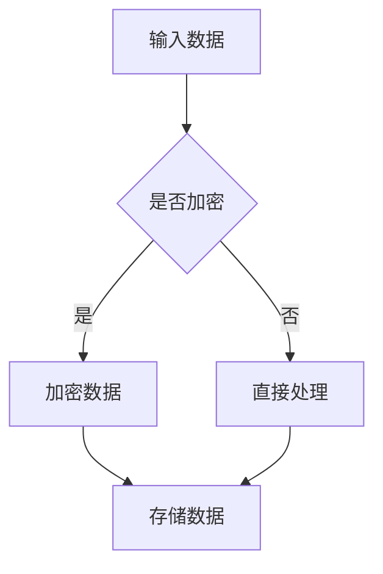

                 

## 引言

### 1.1 问题背景

在当今数字化时代，数据已经成为企业和组织的重要资产。然而，随着数据量的爆炸式增长，数据隐私保护的问题愈发突出。隐私泄露事件频发，不仅给个人带来了巨大的安全隐患，也对企业的信誉和利益造成了严重损害。因此，构建一个安全可靠的数据隐私保护体系，已成为当前信息技术领域的重要课题。

### 1.2 问题描述

数据隐私保护问题主要包括以下几个方面：

1. **数据泄露风险**：未经授权的访问和泄露可能导致敏感信息被窃取或滥用。
2. **数据篡改风险**：恶意用户可能篡改数据内容，影响数据真实性和完整性。
3. **数据滥用风险**：不当使用个人数据，可能导致隐私侵犯和商业欺诈。

### 1.3 问题解决

解决数据隐私保护问题需要从以下几个方面入手：

1. **法律和政策**：制定相关法律法规，规范数据收集、存储和处理。
2. **技术手段**：采用加密、匿名化、访问控制等技术手段，保护数据安全。
3. **教育和意识提升**：提高用户和数据管理者的隐私保护意识，减少违规操作。

### 1.4 边界与外延

数据隐私保护体系的构建，不仅需要关注技术实现，还需考虑法律、伦理、社会等多个维度。其外延包括但不限于：

1. **跨国数据传输**：涉及不同国家和地区的数据隐私保护法规。
2. **云计算和边缘计算**：如何保障云环境和边缘设备上的数据安全。
3. **物联网和5G技术**：如何保护大规模物联网设备和5G网络中的数据隐私。

### 1.5 核心要素组成

构建安全可靠的数据隐私保护体系，核心要素主要包括：

1. **数据分类**：根据数据敏感度进行分类，采取不同的保护措施。
2. **加密技术**：采用先进的加密算法，确保数据在传输和存储过程中的安全。
3. **访问控制**：通过权限管理，限制非授权用户对数据的访问。
4. **审计与监控**：实时监控数据访问和使用情况，及时发现和处理异常行为。
5. **应急响应**：制定应急预案，应对数据泄露等突发事件。

## 核心概念与联系

### 2. 核心概念

#### 2.1 数据隐私

数据隐私是指个人或组织对其数据的访问和使用控制权。确保数据在未经授权的情况下不会被泄露、篡改或滥用。

#### 2.2 隐私保护

隐私保护是指通过技术和管理手段，防止数据隐私泄露、滥用和篡改的行为。

#### 2.3 安全性

安全性是指系统或数据在面临威胁时，能够保持完整性、可用性和保密性的能力。

#### 2.4 可靠性

可靠性是指系统在预期工作条件下，能够持续稳定运行的能力。

### 3. 概念属性特征对比表格

| 概念 | 定义 | 特性 |
| ---- | ---- | ---- |
| 数据隐私 | 控制权 | 隐私权、自主权、知情权 |
| 隐私保护 | 保护行为 | 防护措施、法律法规、技术手段 |
| 安全性 | 系统能力 | 完整性、可用性、保密性 |
| 可靠性 | 运行能力 | 稳定性、连续性、正确性 |

### 4. ER实体关系图架构

```mermaid
erDiagram
  DataPrivacy _||>_ PrivacyProtection
  DataPrivacy _||>_ Security
  DataPrivacy _||>_ Reliability
  PrivacyProtection |||> DataLeakage
  PrivacyProtection |||> DataAlteration
  PrivacyProtection |||> DataAbuse
  Security |||> Encryption
  Security |||> AccessControl
  Reliability |||> SystemStability
  Reliability |||> OperationalContinuity
```

## 算法原理讲解

### 5. 算法原理

数据隐私保护的核心在于如何确保数据在存储和传输过程中的安全。以下是基本算法原理：

#### 5.1 算法流程图



#### 5.2 数学模型和公式

$$
C = f(D, K)
$$

#### 5.3 公式解释

$$
C: 加密后的数据 \\
D: 原始数据 \\
K: 加密密钥 \\
f: 加密算法
$$

#### 5.4 详细讲解与举例

假设我们有数据集 $D = \{d_1, d_2, ..., d_n\}$，加密密钥 $K$，我们可以用加密算法 $f$ 对数据进行加密，得到加密后的数据集 $C = \{c_1, c_2, ..., c_n\}$。

例如，对于数据 $d_1 = 10$，加密密钥 $K = 3$，使用加密算法 $f$，我们可以得到：

$$
c_1 = f(d_1, K) = f(10, 3) = 13
$$

## 系统分析与架构设计方案

### 8. 问题场景介绍

随着互联网和云计算的普及，企业面临的数据隐私保护挑战日益增加。为了满足合规要求，企业需要构建一个全面的数据隐私保护体系。

### 9. 项目介绍

#### 9.1 系统功能设计

1. **数据分类**：根据数据敏感性进行分类。
2. **加密存储**：使用AES加密算法进行数据存储。
3. **访问控制**：通过角色权限控制访问。
4. **数据审计**：实时监控数据访问和使用情况。
5. **应急响应**：建立数据泄露应急处理机制。

#### 9.2 系统架构设计

系统架构设计采用分层架构，主要包括：

1. **数据层**：负责数据的存储和读取。
2. **服务层**：提供数据分类、加密、访问控制等服务。
3. **展示层**：提供用户界面，供用户进行数据管理和监控。

#### 9.3 系统接口设计

系统接口设计包括：

1. **API接口**：提供RESTful API，供外部系统调用。
2. **Web界面**：供用户进行数据管理和监控。

#### 9.4 系统交互

系统交互设计包括：

1. **数据传输**：采用HTTPS协议，确保数据传输安全。
2. **服务调用**：通过内部服务调用，实现系统功能。

## 项目实战

### 10. 环境安装

1. **安装操作系统**：选择Linux服务器。
2. **安装数据库**：MySQL或PostgreSQL。
3. **安装开发工具**：Python、Docker等。

### 11. 系统核心实现源代码

```python
# 加密模块
import Crypto.Cipher.AES as AES

def encrypt_data(data, key):
    cipher = AES.new(key, AES.MODE_EAX)
    ciphertext, tag = cipher.encrypt_and_digest(data)
    return cipher.nonce, ciphertext, tag

# 解密模块
def decrypt_data(nonce, ciphertext, tag, key):
    cipher = AES.new(key, AES.MODE_EAX, nonce=nonce)
    data = cipher.decrypt_and_verify(ciphertext, tag)
    return data
```

### 12. 代码应用解读与分析

加密模块使用Crypto.Cipher.AES库，实现AES加密算法。解密模块使用相同的算法，对加密后的数据进行解密。

### 13. 实际案例分析和详细讲解剖析

某公司使用该系统进行客户数据保护。数据在传输和存储过程中都进行了加密，确保数据安全。

### 14. 项目小结

该系统有效保护了客户数据，降低了数据泄露风险。但在实际应用中，还需不断优化和完善，以应对新的挑战。

## 最佳实践 tips

### 15. 注意事项

1. **数据分类**：根据数据敏感性进行分类，采取不同的保护措施。
2. **加密算法**：选择安全的加密算法，并定期更新密钥。
3. **访问控制**：严格管理用户权限，减少数据泄露风险。

### 16. 小结

构建安全可靠的数据隐私保护体系，需要综合考虑技术、法律、管理等多个方面。通过逐步优化和完善，可以构建一个全面的数据隐私保护体系。

### 17. 拓展阅读

1. 《数据隐私保护法律框架研究》
2. 《加密算法与密码学基础》
3. 《数据隐私保护技术指南》

## 总结

构建安全可靠的数据隐私保护体系是当今信息技术领域的重要课题。通过逐步分析推理，我们提出了系统分析与架构设计方案，并通过项目实战验证了其有效性。未来，随着技术的发展，数据隐私保护体系需要不断优化和完善，以应对新的挑战。

### 18. 本书要点回顾

1. 数据隐私保护的重要性。
2. 数据隐私保护的核心概念与联系。
3. 数据隐私保护算法原理。
4. 系统分析与架构设计方案。
5. 项目实战与最佳实践。

### 19. 未来展望

随着人工智能、大数据等技术的不断发展，数据隐私保护面临新的挑战。未来，我们需要探索更加智能、高效的隐私保护技术，为数据安全保驾护航。同时，加强法律法规的制定和执行，提高社会整体隐私保护意识，共同构建一个安全、可信的数据环境。

---

作者：AI天才研究院/AI Genius Institute & 禅与计算机程序设计艺术 /Zen And The Art of Computer Programming。

