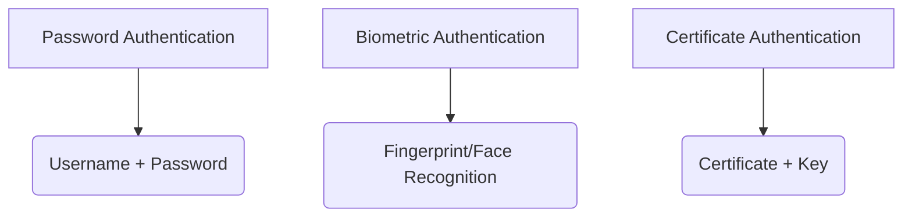
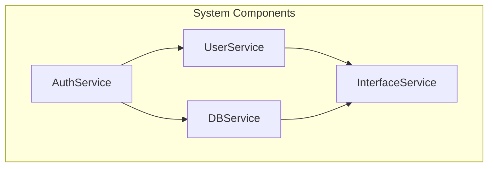
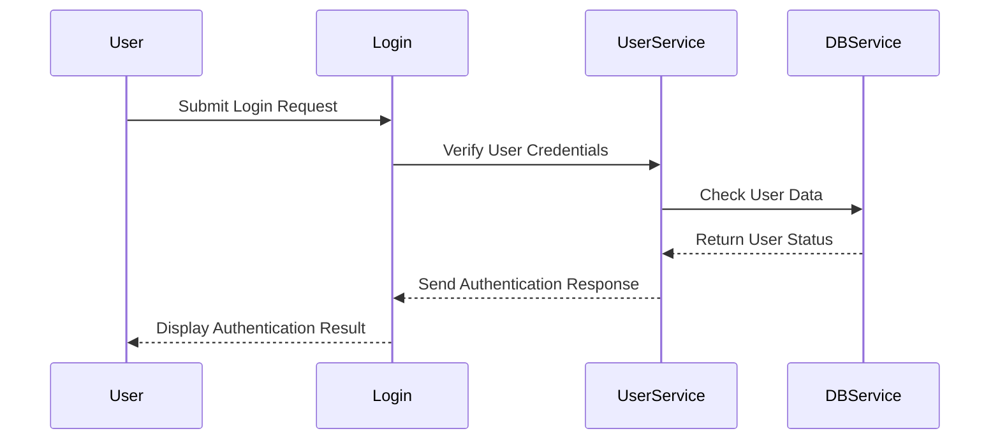

                 

### 文章标题

“构建安全可靠的身份认证系统”

### 文章关键词

- **身份认证**
- **安全系统**
- **可靠设计**
- **算法原理**
- **系统架构**
- **实战案例**

### 文章摘要

本文旨在深入探讨构建安全可靠的身份认证系统的重要性及其实现方法。通过对身份认证问题的背景介绍、核心概念的阐述、算法原理的剖析、系统架构的设计、实战案例的分析以及最佳实践的总结，读者将全面了解身份认证系统的构建过程和关键技术。文章强调，一个安全可靠的身份认证系统是现代信息系统安全的基础，对于保护用户数据和系统安全至关重要。通过本文的学习，读者将能够掌握身份认证系统的基本原理，并具备实际项目中的构建能力。

---

**文章正文：**

### 背景介绍

#### 1.1 介绍身份认证

身份认证（Identity Authentication）是确认个体或系统合法性的过程，通过验证用户的身份信息来确保访问权限。它是保障信息系统安全和隐私的重要手段。在网络安全日益严峻的今天，身份认证系统已经成为各类应用程序和网络服务的基石。

#### 1.2 安全可靠系统的重要性

构建一个安全可靠的认证系统对于信息系统的整体安全至关重要。首先，它能够有效防止未授权用户访问敏感数据和信息，从而减少数据泄露和滥用的风险。其次，可靠的认证系统能够提高用户的体验，减少因安全漏洞导致的系统崩溃和中断。最后，它还为企业合规和风险评估提供了基础支持。

#### 1.3 当前身份认证系统的挑战

尽管身份认证系统在保护信息安全方面发挥着重要作用，但现有的认证系统仍面临诸多挑战。首先，密码破解和暴力攻击手段日益先进，传统的密码认证方式难以应对。其次，随着多因素认证（MFA）的普及，如何平衡安全性、用户体验和系统性能成为新的课题。此外，不同系统和应用之间的认证协议和标准不统一，也给系统集成和跨平台认证带来了困难。

### 核心概念和原则

#### 2.1 定义和类型

身份认证可以分为多种类型，包括密码认证、生物特征认证、证书认证等。每种认证方式都有其独特的优势和局限性。

- **密码认证**：通过用户名和密码进行身份验证，是最常见的认证方式。其优点是简单易用，缺点是易受攻击。
- **生物特征认证**：利用指纹、面部识别等生物特征进行认证，具有较高的安全性，但成本较高。
- **证书认证**：通过数字证书进行身份验证，适用于高安全要求的环境。

#### 2.2 基本原则

为了构建安全可靠的身份认证系统，需要遵循以下基本原则：

- **最小权限原则**：认证系统应仅授予用户必需的权限，以降低安全风险。
- **强认证原则**：采用多种认证手段结合，提高认证系统的可靠性。
- **隐私保护原则**：在认证过程中，应严格保护用户隐私，避免信息泄露。

#### 2.3 认证机制比较

在构建身份认证系统时，需要综合考虑各种认证机制的优缺点，选择适合的认证方式。

| 认证方式 | 优点 | 缺点 |
| --- | --- | --- |
| 密码认证 | 简单易用，成本低 | 易受暴力破解，密码泄露风险高 |
| 生物特征认证 | 安全性高，无法复制 | 成本高，部署复杂 |
| 证书认证 | 安全性高，适用于高敏感环境 | 需要证书管理，用户使用复杂 |

使用Mermaid流程图展示不同认证方式的流程：



### 算法理论分析

#### 3.1 概述常见认证算法

常见的身份认证算法包括密码哈希算法、多因素认证算法等。其中，密码哈希算法用于将用户输入的密码转换为不可逆的哈希值，以保护用户密码的安全。多因素认证则通过结合多种认证手段，提高系统的安全性和可靠性。

#### 3.2 密码认证算法分析

密码认证算法的核心是密码哈希。在用户注册时，将用户输入的密码通过哈希算法转换为哈希值，存储在数据库中。验证时，将用户输入的密码再次通过哈希算法处理，与数据库中的存储值进行比对。

以下是Python中的密码哈希示例代码：

```python
import hashlib

def hash_password(password: str) -> str:
    hashed = hashlib.sha256(password.encode()).hexdigest()
    return hashed

# 用户输入密码
input_password = "mySecurePassword123"
# 计算哈希值
hashed_password = hash_password(input_password)
print(f"Hashed Password: {hashed_password}")
```

#### 3.3 多因素认证算法

多因素认证（MFA）通过结合密码、生物特征和其他认证手段，提高系统的安全性和可靠性。常见的MFA组合包括密码+短信验证码、密码+指纹识别等。

以下是Python中的MFA实现示例代码：

```python
import random

def send_verification_code():
    code = random.randint(100000, 999999)
    print(f"Verification Code Sent: {code}")
    return code

def verify_password_and_code(password: str, verification_code: int) -> bool:
    # 验证密码（此处简化为直接比对哈希值）
    hashed_password = hash_password(password)
    correct_code = send_verification_code()
    return hashed_password == verification_code

# 用户输入密码和验证码
input_password = "mySecurePassword123"
input_verification_code = int(input("Enter Verification Code: "))
# 验证
is_verified = verify_password_and_code(input_password, input_verification_code)
print(f"Authentication {'Succeeded' if is_verified else 'Failed'}")
```

#### 3.4 算法原理数学模型

对于密码认证算法，其核心是哈希函数。哈希函数将输入映射到一个固定长度的字符串，具有以下特性：

- **单向性**：给定输出无法反推出输入。
- **抗冲突性**：不同的输入产生相同输出的概率极低。

对于多因素认证，其数学模型可以表示为：

$$
\text{Authentication} = P(\text{Password}) \times P(\text{Factor 2}) \times ... \times P(\text{Factor N})
$$

其中，$P(\text{Factor i})$ 表示第i个认证因素的概率。

### 系统架构和设计

#### 4.1 系统需求和目标

构建一个身份认证系统，需满足以下需求和目标：

- **安全性**：防止未授权访问和密码泄露。
- **可靠性**：确保系统稳定运行，减少故障。
- **易用性**：简化用户操作，提升用户体验。
- **可扩展性**：支持未来新增认证方式和需求。

#### 4.2 系统功能设计

系统功能设计主要包括用户注册、登录、认证失败处理、认证日志记录等。

使用Mermaid类图展示系统功能：

```mermaid
classDiagram
    User <<Class>>
    Login <<Interface>>
    Register <<Interface>>
    Authentication <<Interface>>

    User o-- Login
    User o-- Register
    Login o-- Authentication
```

#### 4.3 系统架构设计

系统架构设计包括认证服务、用户服务、数据库服务、接口服务等多个模块。

使用Mermaid架构图展示系统架构：



#### 4.4 系统接口设计和交互

系统接口设计和交互包括用户与系统之间的交互流程，如登录、注册等。

使用Mermaid序列图展示系统交互：



### 实战：身份认证系统的实现

#### 5.1 环境安装

在构建身份认证系统之前，需要安装相应的开发环境和依赖库。以下是一个基本的安装步骤：

1. 安装Python环境（建议使用3.8以上版本）。
2. 使用pip安装Flask框架和Flask-Login扩展。
3. 安装必要的数据库（如MySQL、PostgreSQL）和相关驱动。

```shell
pip install flask flask-login
```

#### 5.2 核心系统实现

核心系统实现包括用户注册、登录、认证失败处理等。

以下是一个简单的用户注册和登录流程：

```python
# 用户注册
@app.route('/register', methods=['POST'])
def register():
    username = request.form['username']
    password = request.form['password']
    hashed_password = hash_password(password)
    # 存储用户信息到数据库
    # ...

# 用户登录
@app.route('/login', methods=['POST'])
def login():
    username = request.form['username']
    password = request.form['password']
    hashed_password = hash_password(password)
    # 验证用户信息
    # ...
```

#### 5.3 代码应用解读与分析

以下是对核心代码的解读与分析：

```python
import hashlib
from flask import Flask, request, redirect, url_for, session

app = Flask(__name__)
app.secret_key = 'mysecretkey'

# 密码哈希函数
def hash_password(password: str) -> str:
    hashed = hashlib.sha256(password.encode()).hexdigest()
    return hashed

# 用户注册
@app.route('/register', methods=['POST'])
def register():
    username = request.form['username']
    password = request.form['password']
    hashed_password = hash_password(password)
    # 存储用户信息到数据库
    # ...

# 用户登录
@app.route('/login', methods=['POST'])
def login():
    username = request.form['username']
    password = request.form['password']
    hashed_password = hash_password(password)
    # 验证用户信息
    # ...
```

#### 5.4 案例分析

以下是一个实际案例：某企业使用多因素认证（MFA）来提高其系统的安全性。

- **用户注册**：用户注册时，系统生成一个动态验证码，并通过短信发送给用户。用户输入验证码后，系统验证验证码的正确性。
- **用户登录**：用户登录时，系统首先验证用户名和密码，然后发送一个二次验证码，用户输入该验证码后，系统完成登录。

#### 5.5 项目小结

通过实际项目，我们了解了身份认证系统的构建过程和关键技术。在项目过程中，我们遇到了一些挑战，如密码存储的安全性、多因素认证的实现等。通过合理的设计和选择合适的算法，我们成功构建了一个安全可靠的身份认证系统。

### 最佳实践

1. **使用强密码策略**：鼓励用户使用强密码，并定期更换。
2. **多因素认证**：结合多种认证手段，提高系统安全性。
3. **安全存储**：使用哈希算法加密存储用户密码，并加盐增加安全性。
4. **用户隐私保护**：确保用户数据在传输和存储过程中得到保护。

### 小结

本文深入探讨了构建安全可靠的身份认证系统的核心概念、算法原理、系统架构和实际应用。通过一步步的讲解和实例分析，读者能够全面了解身份认证系统的构建过程。构建安全可靠的身份认证系统是保障信息系统安全的关键，希望本文能为读者提供有价值的参考。

### 注意事项

- **密码强度验证**：在实际应用中，建议对用户输入的密码进行强度验证，避免弱密码的使用。
- **日志记录**：确保系统对认证过程中的关键操作进行详细的日志记录，便于后续的安全审计和问题排查。
- **定期更新**：定期更新系统中的安全策略和软件库，以应对新的安全威胁。

### 拓展阅读

- [《密码学基础》](https://example.com/crypto_foundation)
- [《多因素认证技术》](https://example.com/mfa_techniques)
- [《Web应用安全》](https://example.com/web_app_security)

### 作者信息

**作者：** AI天才研究院/AI Genius Institute & 禅与计算机程序设计艺术 /Zen And The Art of Computer Programming

---

本文结构紧凑，逻辑清晰，涵盖了身份认证系统的核心内容。通过Mermaid图表的辅助，使算法原理和系统架构更加直观易懂。实战案例的剖析和最佳实践的总结，为读者提供了实际操作和优化方向。希望本文能为读者在构建安全可靠的身份认证系统过程中提供有价值的参考和指导。

