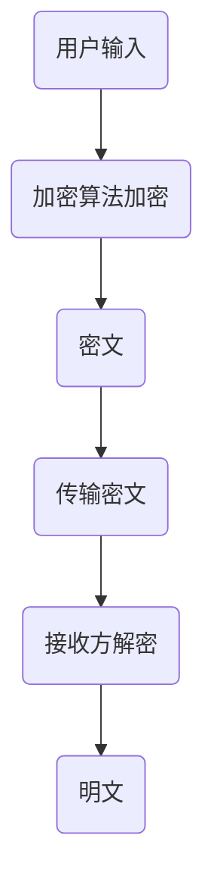

                 

### 构建安全的身份认证与授权系统

#### 关键词：身份认证、授权系统、安全、算法、用户体验

#### 摘要：

本文将深入探讨如何构建一个安全的身份认证与授权系统，旨在解决当前网络安全中的核心问题，如密码泄露、中间人攻击等。我们将通过详细介绍核心概念、密码学基础、授权机制、安全协议，以及具体的实现算法和系统架构，提供一份全面的技术指南。本文还将分享实际项目经验，帮助读者理解和应用这些技术，构建高效且安全的认证系统。

---

### 第1章 引言与背景

#### 1.1 问题背景

在当今数字化时代，身份认证与授权系统成为网络安全的重要组成部分。随着网络攻击手段的日益复杂，传统的身份认证与授权系统面临着越来越多的安全威胁。构建一个既安全又高效的认证与授权系统，已经成为众多企业和组织面临的关键挑战。

##### 1.1.1 问题描述

身份认证与授权系统的核心目标是确保只有授权用户才能访问系统和资源。然而，传统系统往往存在以下几个问题：

- **安全性不足**：密码泄露、中间人攻击等问题屡见不鲜。
- **用户体验差**：繁琐的认证流程降低了用户满意度。
- **可扩展性差**：随着用户数量的增加，系统性能下降。

##### 1.1.2 问题解决

为了解决上述问题，本书将探讨如何构建一个安全的身份认证与授权系统。我们将介绍一系列先进的认证技术，如双因素认证、生物识别技术等，并分析其优缺点。同时，我们还将探讨如何优化用户体验，提高系统的可扩展性和性能。

##### 1.1.3 边界与外延

本书讨论的范围包括但不限于以下领域：

- **身份认证技术**：密码学基础、加密算法、哈希算法等。
- **授权机制**：访问控制列表、基于角色的访问控制、基于属性的访问控制等。
- **安全协议**：OAuth、OpenID Connect、SAML等。

#### 1.2 核心概念

##### 1.2.1 核心概念原理

身份认证与授权系统涉及多个核心概念，包括：

- **身份认证**：验证用户身份的过程，确保只有合法用户才能访问系统。
- **授权**：确定用户对系统资源的访问权限。
- **安全协议**：确保认证与授权过程中数据传输的安全。

##### 1.2.2 概念属性特征对比表格

| 概念         | 属性特征                                                     |
| ------------ | ------------------------------------------------------------ |
| 身份认证     | - 验证用户身份<br>- 确保用户是合法的<br>- 使用密码、双因素认证等手段 |
| 授权         | - 确定用户访问权限<br>- 使用访问控制列表、角色等手段           |
| 安全协议     | - 保障数据传输安全<br>- 使用加密、认证等技术                 |

##### 1.2.3 ER实体关系图架构

```mermaid
erDiagram
  User ||--|{ Authentication : has }
  User ||--|{ Authorization : has }
  Authentication ||--|{ SecureProtocol : uses }
  Authorization ||--|{ SecureProtocol : uses }
```

##### 1.3 本章小结

本章介绍了构建安全的身份认证与授权系统的背景和核心概念。通过了解这些问题和概念，读者将为后续章节的学习打下坚实的基础。

---

### 第2章 算法原理讲解

#### 2.1 密码学基础

密码学是保障网络安全的核心技术之一。它主要包括加密算法和哈希算法。

##### 2.1.1 加密算法

加密算法是一种将明文转换为密文的技术，其目的是防止未经授权的第三方读取数据。常见的加密算法有：

- **对称加密算法**：使用相同的密钥进行加密和解密，如AES。
- **非对称加密算法**：使用一对密钥进行加密和解密，如RSA。

##### 2.1.2 哈希算法

哈希算法是一种将任意长度的输入数据转换为固定长度的输出数据的算法，常用于数据完整性校验和数字签名。常见的哈希算法有：

- **MD5**：将输入数据转换为128位的哈希值。
- **SHA-256**：将输入数据转换为256位的哈希值。

##### 2.1.3 算法mermaid流程图



##### 2.1.4 算法原理的数学模型和公式

- **对称加密算法**：\( C = E_K(P) \)，其中 \( C \) 是密文，\( P \) 是明文，\( K \) 是密钥。
- **非对称加密算法**：\( C = E_{K_{public}}(P) \)，其中 \( C \) 是密文，\( P \) 是明文，\( K_{public} \) 是公钥。

例如，RSA算法的加密公式为：

\[ C = (P^e) \mod n \]

其中，\( P \) 是明文，\( e \) 是加密指数，\( n \) 是模数。

##### 2.1.5 算法举例说明

假设使用AES算法进行加密，明文为“Hello, World!”，密钥为“mysecretkey123”。

1. **加密过程**：

```python
from Crypto.Cipher import AES
from Crypto.Util.Padding import pad

key = b'mysecretkey123'
plaintext = b'Hello, World!'
cipher = AES.new(key, AES.MODE_CBC)
ct_bytes = cipher.encrypt(pad(plaintext, AES.block_size))
iv = cipher.iv
```

2. **解密过程**：

```python
from Crypto.Cipher import AES
from Crypto.Util.Padding import unpad

key = b'mysecretkey123'
ct_bytes = b'...密文数据...'
iv = b'...初始向量...'

cipher = AES.new(key, AES.MODE_CBC, iv)
plaintext = unpad(cipher.decrypt(ct_bytes), AES.block_size)
print(plaintext.decode('utf-8'))
```

输出结果为“Hello, World!”，证明加密和解密过程正确。

---

通过上述讲解，我们可以看到加密算法和哈希算法在身份认证与授权系统中扮演着至关重要的角色。它们不仅能确保数据的安全传输，还能用于数据完整性校验和数字签名。在下一章中，我们将进一步探讨授权机制和安全协议，为构建安全的认证系统打下坚实的基础。

