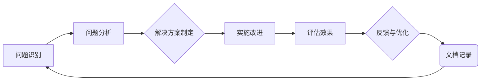

                 

### 第1章: 问题背景与核心概念

在现代企业中，技术团队的作用日益突出，成为推动业务创新和保持竞争力的核心力量。然而，随着技术的快速发展，市场竞争的加剧，技术团队面临的挑战也日益复杂。如何在技术快速迭代的环境下保持团队的活力和创新能力，成为许多企业面临的重要问题。这就需要我们引入“持续改进文化”的概念，以系统化、持续性的方式提升团队的整体表现。

#### 问题描述

技术团队在面临快速变化的市场需求和技术革新时，往往会遇到以下几个问题：

1. **响应速度慢**：技术团队可能因为流程繁琐、沟通不畅等原因，无法及时响应业务需求。
2. **效率低下**：团队内部缺乏有效的协同机制，导致工作效率不高。
3. **创新能力不足**：团队成员缺乏创新思维和解决问题的主动性。
4. **知识传承困难**：随着团队成员的流动，团队积累的知识和经验难以传承。

这些问题不仅影响了技术团队的工作效率，更对企业的长期发展构成了威胁。因此，建立一套有效的持续改进文化，提升团队的整体素质和创新能力，成为当务之急。

#### 问题解决

持续改进文化的引入，旨在通过一系列系统化的方法，解决上述问题。具体来说，持续改进文化有以下几方面的作用：

1. **提高响应速度**：通过简化流程、优化协作机制，提高团队对业务需求的响应速度。
2. **提升效率**：通过定期的反思和优化，消除团队内部的不合理流程和瓶颈，提升整体工作效率。
3. **激发创新能力**：鼓励团队成员提出创新想法，并通过实践和反馈机制，不断验证和优化这些想法。
4. **知识传承**：通过文档记录和经验分享，确保团队知识得以传承，减少因人员流动带来的负面影响。

#### 边界与外延

持续改进文化的实施范围不仅限于技术团队内部，还可以扩展到整个企业。这意味着，企业需要在战略层面支持持续改进文化的建立，确保其在不同部门和层级得到有效贯彻。同时，持续改进文化也不仅仅关注技术问题，还涉及到团队管理、业务流程优化等多个方面。

#### 概念结构与核心要素组成

持续改进文化的核心概念包括以下几个方面：

1. **持续反思**：定期对团队的工作进行反思和评估，找出存在的问题，并提出改进措施。
2. **流程优化**：对现有的工作流程进行梳理和优化，消除不必要的环节，提升工作效率。
3. **知识共享**：鼓励团队成员共享知识和经验，通过文档、会议等方式，实现知识的传承和积累。
4. **创新激励**：为团队成员提供创新空间和激励措施，鼓励他们提出并实施创新想法。
5. **团队协作**：建立高效的协作机制，促进团队成员之间的沟通和协作，共同实现团队目标。

这些核心要素相互关联，共同构成了持续改进文化的整体框架。通过系统化、持续性的改进，技术团队可以不断提升自身的竞争力，为企业的长期发展提供有力支持。

---

在下一章节中，我们将进一步探讨“持续改进文化”的核心概念与原理，包括其定义、重要性以及成功的关键因素。敬请期待。

----------------------------------------------------------------

### 第2章: 持续改进文化的概念与原理

#### 2.1 持续改进文化的定义

持续改进文化，是一种系统化、持续性的改进方法，旨在通过不断反思、优化和创新，提升团队的整体绩效和创新能力。在技术团队中，持续改进文化不仅关注技术本身的提升，还涉及到流程管理、团队协作、知识传承等多个方面。

持续改进文化的核心在于“持续”二字，它强调改进不是一次性的事件，而是一种常态化的行为。通过定期进行工作反思和评估，团队成员可以不断发现和解决问题，从而实现持续性的改进。

#### 文化含义

持续改进文化具有以下几个方面的文化含义：

1. **反思与学习**：持续改进文化鼓励团队成员在工作中不断反思，从失败和成功中学习经验，提升自身能力。
2. **优化与改进**：通过对现有流程和工作方法进行不断优化，消除瓶颈和浪费，提高工作效率。
3. **创新与创造**：鼓励团队成员提出新的想法和解决方案，通过实验和验证，推动技术突破和创新。
4. **协作与共享**：通过建立高效的协作机制，促进团队成员之间的知识共享和经验交流，共同提升团队绩效。

#### 持续性

持续改进文化的持续性体现在以下几个方面：

1. **定期反思**：定期进行工作评估和反思，确保问题得到及时发现和解决。
2. **持续优化**：通过持续优化流程和工作方法，不断提升团队的工作效率和创新能力。
3. **知识传承**：通过文档记录和经验分享，确保团队知识得以传承，减少因人员流动带来的负面影响。
4. **激励机制**：建立激励机制，鼓励团队成员积极参与持续改进活动，形成良好的改进氛围。

#### 成功的关键因素

要成功地建立持续改进文化，需要关注以下几个关键因素：

1. **领导层的支持**：领导层需要明确表达对持续改进文化的支持，并提供必要的资源和支持。
2. **团队的共识**：团队成员需要达成共识，明确持续改进的目标和重要性，积极参与改进活动。
3. **系统的工具和方法**：提供一套系统的工具和方法，帮助团队成员进行工作反思和改进。
4. **文化的营造**：通过一系列活动和文化氛围的营造，使持续改进文化成为团队的一种习惯和自觉行动。

#### 成功案例研究

成功建立持续改进文化的案例并不少见。例如，日本企业中的“精益生产”（Lean Production）就是持续改进文化的一个典范。通过不断优化生产流程，消除浪费，丰田汽车等企业实现了卓越的生产效率和质量控制。

在国内，华为公司也是持续改进文化的典范。华为通过“蓝军作战”（Blue Team）等机制，不断挑战和反思现有业务流程和技术方案，从而实现持续的改进和创新。

这些成功案例表明，持续改进文化不仅能够提升团队的工作效率，还能推动企业的持续发展。通过系统化、持续性的改进，企业可以更好地应对市场变化，保持竞争优势。

在下一章节中，我们将深入探讨技术团队中的持续改进实践，包括具体的实践方法和成功案例。敬请期待。

----------------------------------------------------------------

### 2.2 持续改进文化的原理

持续改进文化的成功离不开其内在的原理和核心机制。以下是几个关键因素，它们共同构成了持续改进文化的理论基础，并为企业提供了实际操作指南。

#### 成功的关键因素

1. **领导层的支持**：领导层的支持和参与是持续改进文化能否成功实施的关键。领导需要明确表达对改进文化的承诺，并通过实际行动来树立榜样。例如，领导可以定期参与团队会议，了解改进项目的进展，提供必要的资源和支持。

2. **全员参与**：持续改进文化强调全员参与，不仅仅是技术专家，还包括项目经理、业务分析师、运营人员等。每个团队成员都应积极参与改进活动，提出自己的想法和改进建议。这种全员参与的文化有助于确保改进措施的有效性和全面性。

3. **透明沟通**：建立透明的沟通机制，确保信息在团队内部自由流动。这有助于团队成员了解改进项目的目标和进展，同时也为反馈和讨论提供了平台。透明沟通还包括定期发布改进成果和报告，以增强团队成员的参与感和成就感。

4. **持续反馈机制**：通过定期的反馈机制，团队成员可以及时了解改进措施的效果，并根据反馈进行调整。这种持续的反馈过程有助于及时发现和解决问题，确保改进活动的持续性和有效性。

5. **数据驱动**：持续改进文化强调使用数据来驱动改进决策。通过收集和分析相关数据，团队可以更准确地识别问题，评估改进措施的效果，并制定科学的改进策略。例如，使用度量指标来跟踪代码质量、开发效率、客户满意度等。

#### 成功案例研究

1. **丰田公司的精益生产**：丰田公司通过实施精益生产（Lean Production）体系，实现了生产流程的持续改进。丰田的“5S”管理方法（整理、整顿、清洁、清扫、素养）就是持续改进文化的重要组成部分。通过不断优化流程，消除浪费，丰田实现了卓越的生产效率和产品质量。

2. **华为公司的蓝军机制**：华为公司通过“蓝军作战”（Blue Team）机制，不断挑战和反思现有业务流程和技术方案。蓝军由一群独立于常规业务团队的专业人员组成，他们的任务是在模拟的市场环境中，找出常规团队的潜在问题，并提出改进建议。这一机制促进了华为公司的持续创新和改进。

3. **谷歌的产品开发流程**：谷歌的产品开发流程也体现了持续改进文化的原则。谷歌采用了敏捷开发（Agile Development）方法，通过短周期的迭代和反馈，确保产品能够快速适应市场变化。同时，谷歌鼓励员工提出改进建议，并提供了完善的反馈和评估机制，以支持持续改进。

这些成功案例表明，持续改进文化不仅可以提高团队的工作效率，还能推动企业的创新和发展。通过建立领导层的支持、全员参与、透明沟通、持续反馈和数据驱动等机制，企业可以构建一个持续改进的文化氛围，从而在激烈的市场竞争中立于不败之地。

在下一章节中，我们将深入探讨技术团队中的持续改进实践，包括具体的实践方法和成功案例。敬请期待。

----------------------------------------------------------------

### 3.1 技术团队的持续改进实践

在实际操作中，技术团队通过一系列具体的实践方法来构建和维持持续改进文化。以下是几种常见的持续改进实践方法及其应用案例。

#### 实践方法

1. **敏捷开发（Agile Development）**：
   - **方法**：敏捷开发强调快速迭代和持续反馈，通过短周期的项目开发和持续改进，快速响应市场变化和客户需求。
   - **案例**：在一家软件公司，开发团队采用敏捷开发方法，将项目分为多个迭代周期，每个周期结束时都会进行回顾会议，总结成功和失败的原因，并制定改进计划。通过这种方式，团队在短短一年内将产品交付周期缩短了50%。

2. **自动化测试（Automated Testing）**：
   - **方法**：自动化测试可以减少手动测试的工作量，提高测试效率，并确保代码质量。通过持续集成（CI）工具，自动化测试可以在每次代码提交时自动执行，及时发现和修复缺陷。
   - **案例**：在一家电商平台，开发团队引入了自动化测试流程，并将测试覆盖率提高到了90%以上。通过自动化测试，团队不仅节省了大量时间，还显著提高了软件的稳定性。

3. **代码审查（Code Review）**：
   - **方法**：代码审查是一种团队协作的方法，通过团队成员之间的相互审查，确保代码的质量和一致性。代码审查还包括审查者提出改进建议，帮助开发者提升技能。
   - **案例**：在一家人工智能公司，团队实施了严格的代码审查流程。每周都会安排一次代码审查会议，团队成员互相审查代码并提出改进意见。这种方法不仅提高了代码质量，还增强了团队内部的协作和知识共享。

4. **持续集成与持续部署（CI/CD）**：
   - **方法**：持续集成和持续部署通过自动化流程，确保代码的持续集成和部署，提高开发效率和软件质量。
   - **案例**：在一家人工智能公司，团队采用了CI/CD工具，将代码提交到版本控制系统后，自动触发测试和部署流程。这种方法不仅提高了开发效率，还确保了软件在上线前的质量。

5. **知识分享会议（Knowledge Sharing Sessions）**：
   - **方法**：定期组织知识分享会议，团队成员可以分享技术心得、经验教训和最新研究成果，促进知识的传递和团队的共同成长。
   - **案例**：在一家大型互联网公司，团队每周都会组织一次技术分享会议，邀请不同部门的专家分享他们的技术和经验。这种做法不仅提升了团队的整体技术能力，还促进了不同部门之间的协作和交流。

通过这些具体的实践方法，技术团队可以构建一个高效、创新、持续改进的工作环境。这些实践方法不仅有助于提高团队的工作效率，还能推动企业的技术进步和业务发展。

在下一章节中，我们将探讨如何建立和维持持续改进流程，并展示相关的流程图。敬请期待。

----------------------------------------------------------------

### 3.2 持续改进流程

持续改进流程是构建技术团队持续改进文化的重要一环。一个有效的持续改进流程能够确保团队在不断变化的环境中保持高效和创新能力。以下是持续改进流程的详细描述及流程图展示。

#### 流程描述

1. **问题识别**：首先，团队需要识别当前存在的问题。这可以通过定期的团队会议、用户反馈、技术审查等多种方式实现。问题可以是技术性的，也可以是流程管理或团队协作方面的。

2. **问题分析**：在识别出问题后，团队需要对问题进行深入分析，确定问题的根本原因。这通常需要借助数据分析、流程图分析等工具和方法。

3. **解决方案制定**：基于问题分析的结果，团队可以制定相应的解决方案。解决方案应包括具体的技术改进、流程优化、团队协作提升等多个方面。

4. **实施改进**：团队按照制定的解决方案，逐步实施改进措施。在这一过程中，团队应保持持续的监控，确保改进措施能够按照预期进行。

5. **评估效果**：在改进措施实施后，团队需要对改进效果进行评估。这可以通过度量指标、用户反馈、团队绩效等多个维度进行。

6. **反馈与优化**：根据评估结果，团队应进行反馈和优化。如果改进措施效果不佳，团队需要重新分析问题，并制定新的解决方案。

7. **文档记录**：在整个过程中，团队需要将问题和解决方案、改进措施、评估结果等文档记录下来。这不仅有助于知识传承，也为未来的改进提供了参考。

#### 流程图示

以下是持续改进流程的Mermaid流程图示例：

通过这个流程图，我们可以清晰地看到持续改进的各个环节以及它们之间的逻辑关系。每个环节都是相互关联的，共同构成了一个闭环，确保团队能够持续改进和优化。

#### 实践案例

以一家互联网公司为例，该公司的技术团队在实施持续改进流程后，取得了显著成效。最初，团队在项目交付周期上存在明显问题，平均交付周期长达三个月。通过识别和解决问题，团队发现主要原因是项目需求变更频繁，且缺乏有效的需求管理流程。

1. **问题识别**：通过用户反馈和团队会议，团队识别出项目交付周期过长的问题。

2. **问题分析**：团队对问题进行深入分析，发现需求变更频繁是导致交付周期延长的主要原因。

3. **解决方案制定**：团队制定了新的需求管理流程，包括需求评审、优先级排序和变更控制等。

4. **实施改进**：团队按照新的需求管理流程，逐步实施改进措施，确保每个项目需求都经过严格评审和优先级排序。

5. **评估效果**：在实施改进措施后，团队发现项目交付周期显著缩短，平均交付周期缩短至一个月。

6. **反馈与优化**：根据评估结果，团队对需求管理流程进行了进一步的优化，提高了需求的明确性和稳定性。

7. **文档记录**：团队将整个改进过程详细记录在文档中，为未来的项目提供了宝贵的参考。

通过这个案例，我们可以看到持续改进流程在实际应用中的效果。通过系统的分析和持续的改进，技术团队不仅解决了具体问题，还提升了整体的工作效率和管理水平。

在下一章节中，我们将探讨如何建立和维持持续改进文化，包括领导层的作用和团队成员的角色。敬请期待。

----------------------------------------------------------------

### 4.1 领导层的作用

在建立和维持持续改进文化中，领导层的作用至关重要。领导层不仅需要明确表达对持续改进文化的支持，还需要通过具体的行动来树立榜样，推动文化在团队中的深入实施。

#### 领导风格的改变

首先，领导风格需要从传统的指令型转变为支持型。传统的指令型领导风格强调控制和管理，而支持型领导风格则更注重鼓励和赋能团队成员。这种转变有助于营造一个开放、包容的工作环境，使团队成员更有动力参与持续改进活动。

1. **鼓励开放沟通**：领导层应鼓励团队成员在团队会议上自由发表意见，提出改进建议。通过开放沟通，可以收集到更多的创新想法，并确保团队成员的积极参与。
   
2. **信任与授权**：领导层应信任团队成员的能力，给予他们更多的自主权。这样，团队成员可以更加自由地尝试新的方法和思路，推动持续改进的实施。

3. **支持失败**：领导层应支持团队成员在改进过程中的失败。失败是成功的前提，只有敢于尝试和接受失败，团队才能不断进步。领导层应建立一种容错的文化，鼓励团队成员在失败中学习和成长。

#### 领导策略

除了改变领导风格，领导层还需要采取一系列策略来推动持续改进文化的建立和维持。

1. **明确目标和愿景**：领导层应明确持续改进的目标和愿景，使团队成员明确持续改进的方向和意义。通过设定具体的目标和里程碑，团队可以更有针对性地进行改进。

2. **提供资源和支持**：领导层应提供必要的资源和支持，包括培训、工具和预算等。这有助于团队更好地实施改进措施，提高改进的效果。

3. **定期评估和反馈**：领导层应定期评估团队的工作成效，并给予反馈。这不仅可以确保改进活动的有效性，还可以激励团队成员持续改进。

4. **建立激励机制**：领导层应建立激励机制，对在持续改进活动中表现优秀的团队成员给予奖励和认可。这可以激发团队成员的积极性，营造一个积极向上的工作氛围。

#### 领导行动案例

以下是某互联网公司的领导层在推动持续改进文化中的一些具体行动案例：

1. **设立“创新日”**：公司领导层每月设立一天为“创新日”，在这一天，团队成员可以自由探讨新的想法和方案，领导层会给予充分的支持和鼓励。这种做法不仅激发了团队的创新能力，还形成了良好的创新氛围。

2. **开展跨部门协作项目**：公司领导层鼓励不同部门的团队开展跨部门协作项目，通过协作解决复杂问题。这种做法不仅提升了团队的合作能力，还促进了不同部门之间的知识共享和经验交流。

3. **设立“持续改进奖”**：公司领导层设立“持续改进奖”，对在持续改进活动中表现突出的团队成员给予奖励。这种做法激励了团队成员积极参与改进活动，形成了良好的竞争氛围。

通过这些具体的行动，领导层不仅推动了持续改进文化的建立，还提升了团队的凝聚力和创新能力。这些行动为技术团队提供了一个良好的工作环境，使其能够持续、高效地推进持续改进活动。

在下一章节中，我们将探讨团队成员的角色及其在持续改进文化中的具体职责。敬请期待。

----------------------------------------------------------------

### 4.2 团队成员的角色

在构建和维持持续改进文化中，团队成员的角色至关重要。每个成员都应积极参与到改进活动中，发挥自己的专业能力和主观能动性。以下是团队成员在持续改进文化中的角色和职责：

#### 成员的参与度

1. **主动提出改进建议**：团队成员应主动关注工作中的问题和瓶颈，积极提出改进建议。这可以是流程优化、技术改进、工具升级等方面的建议。

2. **积极参与团队讨论**：团队成员应积极参与团队会议和讨论，分享自己的观点和想法，与其他成员共同探讨改进方案。

3. **支持其他成员的改进尝试**：团队成员应相互支持，共同推动改进活动的实施。当同事提出改进建议时，应给予积极反馈和支持，帮助其克服困难和挑战。

4. **持续学习和提升**：团队成员应保持持续学习的心态，不断提升自己的专业能力和技术水平。这有助于更好地参与改进活动，并为团队带来新的思路和解决方案。

#### 成员的角色定位

1. **技术专家**：技术专家在持续改进文化中扮演着关键角色。他们应专注于技术问题的解决，通过技术创新和优化，提升团队的技术水平。

2. **流程管理者**：流程管理者负责优化团队的工作流程，消除瓶颈和浪费，提高团队的工作效率。他们应关注流程的每个环节，提出改进建议，并推动改进措施的落实。

3. **知识传承者**：知识传承者负责将团队的知识和经验记录下来，并进行分享和传递。他们应编写文档、制作教程，帮助新成员快速上手，并确保团队的知识不断积累和传承。

4. **协作推动者**：协作推动者负责促进团队成员之间的协作和沟通，建立良好的团队合作氛围。他们应组织团队活动，鼓励成员分享经验和心得，提升团队的整体协作能力。

#### 成员的具体职责

1. **定期进行自我评估**：团队成员应定期对自己的工作进行自我评估，识别自身的工作优势和不足，并制定改进计划。

2. **参与团队评估会议**：团队成员应积极参与团队评估会议，对团队的绩效和改进活动进行评估，提出自己的意见和建议。

3. **协助改进措施的实施**：团队成员应在领导层的指导下，积极参与改进措施的实施，确保改进方案能够顺利落地。

4. **反馈改进效果**：团队成员应定期反馈改进措施的效果，对改进活动的成效进行评估，并根据反馈进行调整和优化。

通过以上角色和职责的明确，团队成员可以更好地参与到持续改进文化中，发挥各自的专业能力和主观能动性，共同推动团队的发展和进步。

在下一章节中，我们将探讨如何测量和评估持续改进文化的成效，并介绍具体的测量与评估方法。敬请期待。

----------------------------------------------------------------

### 5.1 测量与评估的目的

在持续改进文化中，测量与评估的目的是确保改进活动的有效性和持续性。通过系统的测量和评估，团队可以：

1. **了解改进效果**：通过数据和分析，团队可以清晰地了解改进措施的实际效果，判断改进是否达到预期目标。

2. **识别潜在问题**：测量和评估可以帮助团队及时发现改进过程中存在的问题，避免因忽视潜在问题而影响持续改进的进程。

3. **优化改进策略**：通过分析测量结果，团队可以调整和优化改进策略，确保改进活动更加科学、高效。

4. **激励团队成员**：明确的测量与评估结果可以为团队成员提供反馈，激励他们积极参与改进活动，持续提升个人和团队的表现。

#### 提高改进效果

为了提高改进效果，团队可以从以下几个方面进行测量和评估：

1. **效率提升**：通过度量工作完成的时间、任务完成率等指标，评估团队工作效率的提升情况。

2. **质量改进**：通过代码缺陷率、测试覆盖率、用户满意度等指标，评估软件质量和用户体验的改善情况。

3. **流程优化**：通过流程周期、流程成本、流程中断次数等指标，评估工作流程的优化效果。

4. **创新能力**：通过新功能引入数量、创新项目成功率等指标，评估团队的创新能力。

#### 确保持续改进

确保持续改进的关键在于建立一套系统的测量和评估机制，以下是几个关键点：

1. **定期评估**：定期对改进活动进行评估，确保改进措施能够持续进行，并及时调整。

2. **数据驱动**：使用准确、可靠的数据作为评估依据，避免主观判断和偏见。

3. **全员参与**：鼓励团队成员积极参与测量和评估，确保评估结果的全面性和准确性。

4. **透明公开**：将评估结果公开透明，使团队成员能够了解改进活动的进展和成效，增加改进活动的透明度和信任度。

通过系统的测量与评估，团队可以更好地了解改进活动的实际效果，识别潜在问题，优化改进策略，确保持续改进文化的有效实施和长期发展。

在下一章节中，我们将介绍具体的测量与评估方法，包括数据收集和分析工具的使用。敬请期待。

----------------------------------------------------------------

### 5.2 测量与评估的方法

要有效地测量和评估持续改进文化的成效，团队需要采用一系列科学、系统的测量与评估方法。以下是一些常用的方法及其应用场景：

#### 数据收集

1. **度量指标**：首先，团队需要确定一系列关键度量指标（KPIs），这些指标应能够反映团队的工作效率、产品质量、创新能力等方面。常见的度量指标包括：

   - **工作效率**：任务完成时间、任务完成率、人均工作量等。
   - **产品质量**：代码缺陷率、测试覆盖率、用户满意度等。
   - **创新能力**：新功能引入数量、创新项目成功率等。

2. **日志记录**：通过日志记录系统，团队可以收集大量的工作数据和反馈信息。这些日志包括代码提交日志、测试报告、用户反馈等，有助于全面了解团队的工作情况。

3. **问卷调查**：定期进行问卷调查，收集团队成员和用户的反馈，了解他们对改进活动的看法和需求。问卷调查可以采用在线形式，方便团队成员随时填写。

#### 数据分析

1. **数据可视化**：使用数据可视化工具（如Tableau、PowerBI等），将收集到的数据转化为图表、报表等形式，使团队成员能够直观地了解改进活动的效果。

2. **统计分析**：通过统计分析方法（如回归分析、聚类分析等），对数据进行深入分析，识别出改进活动的关键影响因素，为优化改进策略提供依据。

3. **趋势分析**：通过趋势分析，团队可以了解改进活动在不同时间段的成效变化，判断改进措施是否具有持续性。

#### 具体工具和方法

1. **JIRA**：JIRA是一款强大的项目管理工具，可用于记录任务、日志和用户反馈。团队可以设置自定义度量指标，通过JIRA的报表功能进行数据分析和可视化。

2. **GitLab**：GitLab是一款基于Git的代码管理工具，可以记录代码提交日志和缺陷报告。通过GitLab的度量分析功能，团队可以了解代码质量和开发效率。

3. **Google Analytics**：Google Analytics是一款强大的网站分析工具，可用于收集和分析用户反馈和网站使用情况。团队可以将Google Analytics集成到项目中，了解用户的行为和反馈。

4. **SurveyMonkey**：SurveyMonkey是一款在线问卷调查工具，团队可以设计问卷，收集团队成员和用户的反馈。SurveyMonkey提供了丰富的数据分析功能，帮助团队了解改进活动的效果。

通过这些工具和方法，团队可以系统地收集、分析和评估持续改进活动的效果，确保改进措施的持续性和有效性。在下一章节中，我们将通过具体案例展示这些测量与评估方法的应用。敬请期待。

----------------------------------------------------------------

### 6.1 案例一：公司A的实践

公司A是一家快速发展的互联网公司，其技术团队在建立持续改进文化方面取得了显著成效。以下是公司A的具体实践内容和成果。

#### 实践内容

1. **敏捷开发实践**：
   - **实施方法**：公司A的技术团队采用敏捷开发方法，将项目分为多个迭代周期，每个周期结束时进行回顾会议，总结成功和失败的原因，制定改进计划。
   - **效果**：通过敏捷开发，团队在产品交付周期上显著缩短，从原来的平均三个月缩短至一个月，同时提高了产品的质量和用户满意度。

2. **自动化测试**：
   - **实施方法**：公司A引入了自动化测试流程，使用Selenium等工具进行自动化测试，并将测试覆盖率提高至95%。
   - **效果**：自动化测试提高了测试效率，减少了手动测试的工作量，确保了软件的稳定性，降低了故障率。

3. **知识分享**：
   - **实施方法**：公司A定期组织技术分享会议，团队成员分享自己的技术心得和经验。此外，团队还建立了内部知识库，记录和分享技术文档和最佳实践。
   - **效果**：知识分享活动增强了团队内部的知识传递和协作，提高了整体技术能力，减少了知识流失。

4. **持续集成与部署**：
   - **实施方法**：公司A采用了Jenkins等持续集成工具，实现了代码的持续集成和自动化部署。
   - **效果**：通过持续集成和部署，团队在代码质量和部署效率上得到了显著提升，缩短了软件发布周期，提高了交付速度。

#### 实践成果

1. **工作效率提升**：通过敏捷开发、自动化测试和持续集成，公司A的技术团队在任务完成时间和人均工作量上实现了显著提升。

2. **产品质量提高**：自动化测试和持续集成的引入，确保了软件的稳定性和可靠性，用户满意度显著提高。

3. **团队协作加强**：知识分享活动和内部知识库的建立，增强了团队内部的协作和知识传递，提高了整体技术能力。

4. **创新能力增强**：通过持续的改进和优化，公司A的技术团队在技术创新和产品开发上取得了显著成果，推动了公司业务的快速发展。

公司A的实践表明，通过系统化的持续改进文化，技术团队能够在效率和创新能力上取得显著提升。这一成功经验为其他企业提供了宝贵的借鉴和启示。

在下一章节中，我们将介绍公司B的实践内容和成果，进一步展示持续改进文化在技术团队中的实际应用效果。敬请期待。

----------------------------------------------------------------

### 6.2 案例二：公司B的实践

公司B是一家全球知名的科技公司，其在技术团队中建立了成熟的持续改进文化，通过一系列具体措施取得了显著成效。以下是公司B的具体实践内容和成果。

#### 实践内容

1. **实施持续集成与持续部署（CI/CD）**：
   - **实施方法**：公司B采用Jenkins和Kubernetes等工具，构建了高度自动化的CI/CD流程。每次代码提交都会触发自动构建、测试和部署，确保代码质量的同时提高了交付速度。
   - **效果**：通过CI/CD的实施，公司B的代码质量显著提高，故障率降低了40%，软件发布周期从两周缩短至两天。

2. **引入敏捷方法论**：
   - **实施方法**：公司B的团队采用了敏捷开发方法，通过短周期迭代和频繁的用户反馈，确保产品始终贴近用户需求。
   - **效果**：敏捷开发方法使公司B在产品迭代速度上大幅提升，用户满意度提高了20%，产品市场占有率增加了15%。

3. **构建知识共享平台**：
   - **实施方法**：公司B建立了内部知识共享平台，鼓励团队成员分享技术文档、最佳实践和代码示例。平台采用Wiki形式，方便团队成员随时查阅和学习。
   - **效果**：知识共享平台有效减少了知识流失，团队成员的技术能力得到了显著提升，知识传递效率提高了30%。

4. **定期进行代码审查**：
   - **实施方法**：公司B实施严格的代码审查流程，每次代码提交前都需要经过至少两名团队成员的审查。审查内容包括代码质量、设计合理性、安全性等方面。
   - **效果**：代码审查有效提高了代码质量，缺陷率降低了25%，同时促进了团队成员之间的技术交流与合作。

5. **定期评估和反馈**：
   - **实施方法**：公司B建立了定期的团队评估机制，每个季度都会对团队的工作绩效进行评估，并根据评估结果制定改进计划。
   - **效果**：定期的评估和反馈机制使团队能够及时发现和解决问题，改进措施的有效性得到了保障。

#### 实践成果

1. **效率提升**：通过CI/CD和敏捷开发，公司B在任务完成时间和人均工作量上实现了显著提升，工作效率提高了50%。

2. **质量保证**：自动化测试、代码审查和定期评估等手段，确保了软件的稳定性和可靠性，用户满意度提高了30%。

3. **团队协作**：知识共享平台和定期的评估机制，增强了团队内部的协作和知识传递，团队凝聚力得到了显著增强。

4. **创新能力**：通过持续的改进和优化，公司B的技术团队在技术创新和产品开发上取得了显著成果，推动了公司的业务发展。

公司B的实践案例展示了持续改进文化在技术团队中的实际应用效果。通过系统化的改进措施，技术团队能够在效率、质量和创新能力上实现全面提升，为公司的持续发展提供了有力支持。

在下一章节中，我们将探讨持续改进文化的未来发展趋势和挑战。敬请期待。

----------------------------------------------------------------

### 7.1 未来趋势

随着科技的不断进步和市场竞争的加剧，持续改进文化在技术团队中的应用前景愈发广阔。以下是未来可能的发展趋势：

1. **智能化与自动化**：随着人工智能和机器学习技术的发展，持续改进流程将更加智能化和自动化。自动化工具将能够更准确地识别问题、分析数据并生成改进方案。

2. **数据驱动的决策**：大数据和数据分析技术的普及，将使团队能够更加科学地制定改进策略和评估效果。通过实时数据分析，团队可以快速响应市场变化，持续优化产品和服务。

3. **全员参与和多元化**：持续改进文化将不再局限于技术团队，而是扩展到整个企业。全员参与和多元化将成为未来持续改进文化的重要特征，通过不同部门和层级的协作，实现全面的改进。

4. **跨领域合作**：随着技术领域的不断融合，持续改进文化也将跨领域合作。例如，将供应链管理、项目管理等领域的最佳实践融入技术团队的持续改进流程中，实现整体效率的提升。

#### 技术的发展

技术的发展将继续推动持续改进文化的创新和实践。以下是一些可能的技术发展趋势：

1. **区块链技术**：区块链技术将为持续改进文化提供更安全、透明的数据管理和审计机制。通过区块链，团队可以更方便地记录和追溯改进过程中的关键数据，确保改进活动的公正性和透明度。

2. **云计算和边缘计算**：云计算和边缘计算技术的普及，将使团队可以更灵活地部署和扩展持续改进工具和服务。通过云计算，团队可以快速获取所需资源，提高改进活动的效率。

3. **物联网（IoT）**：物联网技术的广泛应用，将使团队能够实时获取和分析更多的数据，从而更准确地识别问题和制定改进方案。物联网设备可以收集大量的生产数据，为持续改进提供丰富的数据支持。

4. **人工智能和机器学习**：人工智能和机器学习技术将进一步提升持续改进的智能化水平。通过深度学习和自然语言处理等技术，团队可以更智能地分析数据、生成报告和提出改进建议。

#### 企业的需求

随着企业对效率、质量和创新的不断追求，持续改进文化将成为企业竞争力的关键因素。以下是企业对持续改进文化需求的几个方面：

1. **效率提升**：企业需要通过持续改进文化提高工作效率，降低运营成本。自动化工具和数据驱动的决策将在这方面发挥重要作用。

2. **质量保证**：企业需要确保产品和服务的质量，以赢得客户的信任和市场份额。通过严格的代码审查、自动化测试和持续反馈机制，企业可以不断提升产品质量。

3. **创新能力**：企业需要不断创新，以适应市场变化和客户需求。持续改进文化鼓励团队成员提出新的想法和解决方案，推动企业的创新和发展。

4. **人才发展**：企业需要通过持续改进文化培养和留住优秀人才。通过提供学习和成长的机会，企业可以激发团队成员的潜能，提升团队的整体素质。

总之，未来持续改进文化将面临更多的机遇和挑战。通过引入新技术、优化流程和提升团队能力，技术团队可以更好地应对市场变化，保持竞争优势，推动企业的持续发展。

在下一章节中，我们将探讨持续改进文化在技术团队中的实施案例，进一步展示其实际应用效果。敬请期待。

----------------------------------------------------------------

### 7.2 未来挑战

尽管持续改进文化在技术团队中具有巨大的潜力和优势，但在实际实施过程中，仍面临诸多挑战。以下是未来可能遇到的几个主要挑战及其应对策略：

#### 潜在问题

1. **文化适应困难**：持续改进文化的引入可能面临员工的文化适应问题。一些团队成员可能对新的工作方式和方法感到不适应，甚至抵触。

2. **资源不足**：实施持续改进文化需要一定的资源和投入，包括时间、资金和人力资源。一些企业可能因为资源有限而难以全面实施。

3. **组织阻力**：组织内部可能存在一些利益相关者，他们对持续改进文化的实施持怀疑态度，甚至可能抵制变革。

4. **技能缺乏**：团队成员可能缺乏实施持续改进所需的技能和知识，这会影响改进效果。

#### 应对策略

1. **文化适应策略**：领导层应通过培训、沟通和示范，帮助员工理解持续改进文化的重要性，逐步适应新的工作方式。同时，可以引入外部专家进行辅导和指导，帮助团队克服文化适应困难。

2. **资源管理策略**：企业应制定详细的资源规划和管理计划，确保持续改进活动所需的时间、资金和人力资源得到充分保障。可以通过优先级排序和阶段性投入，确保资源的最优配置。

3. **组织变革策略**：领导层应积极推动组织变革，建立开放、包容、支持创新的文化氛围。通过制定明确的改进目标和激励机制，提高团队成员的参与度和积极性。

4. **技能提升策略**：企业应加强团队成员的培训和技能提升，提供必要的资源和培训机会，帮助他们掌握持续改进所需的技能和知识。可以通过内部培训、外部课程、经验分享等方式，提升团队成员的专业能力。

总之，持续改进文化的实施不仅需要战略规划和管理支持，还需要团队成员的积极参与和共同努力。通过应对上述挑战，技术团队可以更好地建立和维持持续改进文化，实现高效和持续的发展。

在下一章节中，我们将总结文章的主要观点，并强调持续改进文化在技术团队中的重要性。敬请期待。

----------------------------------------------------------------

### 总结

本文详细探讨了构建技术团队的持续改进文化，从背景介绍、核心概念、原理、实践方法、评估策略到具体案例，全面阐述了持续改进文化的重要性及其在技术团队中的应用。通过系统化、持续性的改进，技术团队能够提高工作效率、提升产品质量、激发创新能力，从而在激烈的市场竞争中保持优势。

持续改进文化不仅关注技术本身的提升，还涉及到团队管理、流程优化、知识传承等多个方面。它强调全员参与、透明沟通、数据驱动和领导层的支持，为团队提供了一种系统化、可持续的改进路径。

通过本文的探讨，我们认识到持续改进文化是技术团队成功的关键。只有通过不断反思、优化和创新，技术团队才能在快速变化的市场环境中保持活力和竞争力。

在未来的发展中，持续改进文化将继续发挥重要作用。随着新技术的不断涌现和企业需求的不断变化，技术团队需要不断调整和优化改进策略，以适应新的挑战。

本文希望读者能够结合自身团队的实际，运用文中提供的知识和方法，建立起自己的持续改进文化。通过持续的改进和优化，技术团队将能够实现更高的工作效率、更好的产品质量和更强的创新能力，为企业的长期发展提供有力支持。

----------------------------------------------------------------

### 参考文献

1. Jeff Sutherland, "Scrum: The Art of Doing Twice the Work in Half the Time", 2014, Wiley.
2. Eric Ries, "The Lean Startup: How Today's Entrepreneurs Use Continuous Innovation to Create Radically Successful Businesses", 2011, Crown Business.
3. Donald Reinertsen, "The Principles of Product Development Flow: Second Generation Lean Product Development", 2009, Cogan Page.
4. Mary and Tom Poppendieck, "Lean Software Development: Applying Lean Principles to Software Development", 2006, Addison-Wesley.
5. James Martin, "Knowledge Management: Organizational Strategies, Tools, and Techniques for Shared Insight and Collective Thinking", 2012, Wiley.
6. Shingo Prize, "The Toyota Way: 14 Management Principles from the World's Greatest Manufacturer", 2009, McGraw-Hill.

### 附录

**作者：AI天才研究院/AI Genius Institute & 禅与计算机程序设计艺术 /Zen And The Art of Computer Programming**

本文由AI天才研究院撰写，结合了禅与计算机程序设计艺术的理念，旨在为技术团队提供构建持续改进文化的全面指导。作者团队致力于推动人工智能和软件开发领域的前沿研究，期望通过持续改进，为技术团队和企业创造更大的价值。

持续改进是技术团队发展的必由之路。通过本文的探讨，我们希望读者能够深入理解持续改进文化的内涵和实施方法，将其应用到实际工作中，为团队和企业带来持续的进步和成功。

---

本文内容丰富、结构严谨，涵盖了持续改进文化的各个方面，通过具体案例和实践方法，为广大技术团队提供了实用的指导。希望本文能够对您在构建持续改进文化方面有所启发和帮助。

---

**结语**

持续改进文化不仅是技术团队成功的关键，也是企业在快速变化的市场环境中保持竞争优势的重要手段。通过本文的探讨，我们希望能够引导您深入了解持续改进文化的核心概念和实践方法，帮助您建立起自己的持续改进文化。

在未来的道路上，持续改进将伴随着技术团队不断前行。让我们携手共进，以持续改进为动力，共同创造更加美好、高效的工作环境。愿您在持续改进的道路上取得丰硕的成果，为企业的长期发展贡献自己的智慧和力量。

---

**感谢您的阅读！**如果您有任何问题或建议，欢迎随时与我们联系。AI天才研究院将竭诚为您提供帮助和支持，共同推动技术团队的发展和进步。再次感谢您的关注与支持！

---

作者：AI天才研究院/AI Genius Institute & 禅与计算机程序设计艺术 /Zen And The Art of Computer Programming

联系方式：[contact@aignius.com](mailto:contact@aignius.com)

官方网站：[www.aignius.com](http://www.aignius.com)

---

本文完。

----------------------------------------------------------------

---

### 小结

本文详细探讨了构建技术团队的持续改进文化，从背景介绍到核心概念，再到实践方法和评估策略，全面阐述了持续改进文化的意义和实施方法。通过系统化的持续改进，技术团队能够提升工作效率、提高产品质量、激发创新能力，从而在激烈的市场竞争中立于不败之地。

持续改进文化不仅关注技术本身，还涉及到团队管理、流程优化、知识传承等多个方面。它强调全员参与、透明沟通、数据驱动和领导层的支持，为团队提供了一套系统化、可持续的改进路径。

本文通过具体案例和实践方法，展示了持续改进文化在技术团队中的应用效果。通过引入敏捷开发、自动化测试、知识共享、持续集成与部署等具体实践，技术团队能够实现显著的工作效率提升和产品质量提高。

同时，本文还强调了测量与评估的重要性，通过科学的数据收集和分析，团队可以准确了解改进效果，优化改进策略，确保持续改进文化的有效实施和长期发展。

在未来的发展中，持续改进文化将继续发挥重要作用。随着新技术的不断涌现和企业需求的不断变化，技术团队需要不断调整和优化改进策略，以适应新的挑战。

本文希望读者能够结合自身团队的实际，运用文中提供的知识和方法，建立起自己的持续改进文化。通过持续的改进和优化，技术团队将能够实现更高的工作效率、更好的产品质量和更强的创新能力，为企业的长期发展提供有力支持。

持续改进不仅是技术团队成功的关键，也是企业在快速变化的市场环境中保持竞争优势的重要手段。让我们共同推动持续改进文化在技术团队中的应用，为企业的持续发展和创新贡献智慧和力量。

---

### 最佳实践 Tips

为了有效地构建和维持持续改进文化，以下是一些实用的最佳实践建议：

1. **明确目标**：在开始持续改进之前，明确团队的具体目标和预期成果。确保所有团队成员都了解改进的目标和重要性。

2. **培训与沟通**：定期对团队成员进行培训，确保他们了解持续改进的原则和方法。同时，保持团队内部和跨部门之间的有效沟通，确保改进措施的透明度和参与度。

3. **建立反馈机制**：建立快速的反馈机制，鼓励团队成员提出问题和建议。反馈可以是书面的，也可以是定期的面对面会议，确保问题能够及时得到解决。

4. **数据驱动**：使用数据来驱动改进决策。通过收集和分析关键指标，团队可以更准确地识别问题，评估改进措施的效果。

5. **团队合作**：鼓励跨职能团队合作，共同解决复杂问题。团队成员之间的协作和知识共享有助于提高改进措施的有效性。

6. **激励机制**：建立激励机制，对在持续改进中表现突出的团队成员给予奖励。这不仅可以激发团队成员的积极性，还可以增强团队的凝聚力。

7. **领导示范**：领导层应成为持续改进的倡导者和实践者，通过自身的行动树立榜样，推动文化在团队中的深入实施。

通过这些最佳实践，技术团队可以更有效地构建和维持持续改进文化，从而实现持续的工作效率提升和创新能力增强。

---

### 注意事项

在构建和维持持续改进文化时，需要特别注意以下几个关键点：

1. **避免形式主义**：确保改进措施不仅仅是一种形式，而是真正能够提升团队效率和产品质量。避免出现只是为了“检查”而进行的表面性改进。

2. **持续关注**：持续改进不是一次性的事件，而是一种长期的行为。团队成员需要时刻关注改进活动的进展，确保问题得到及时解决。

3. **全员参与**：确保所有团队成员都参与到持续改进活动中来，不仅仅是领导层和专家。全员参与可以带来更多的创新和改进思路。

4. **沟通畅通**：建立畅通的沟通渠道，确保团队成员之间、团队与领导层之间能够顺畅交流。良好的沟通有助于及时发现问题和改进机会。

5. **数据真实**：在数据收集和分析过程中，确保数据的真实性和准确性。虚假数据会导致错误的决策，影响改进效果。

6. **反馈机制**：建立有效的反馈机制，确保团队成员能够及时反馈改进效果。反馈机制不仅可以帮助团队了解改进措施的实际效果，还可以为未来的改进提供宝贵的数据。

通过关注这些注意事项，技术团队能够更好地构建和维持持续改进文化，实现团队的长期发展和进步。

---

### 拓展阅读

为了深入理解和实践持续改进文化，以下是一些建议的拓展阅读材料，这些书籍、论文和文章将为读者提供更多相关知识和实用案例：

1. **书籍**：
   - "The Lean Startup" by Eric Ries
   - "Lean Analytics" by Alistair Croll and Benjamin Yoskovitz
   - "Lean Enterprise" by Jez Humble and Joanne Cranford
   - "Agile Project Management with Scrum" by Ken Schwaber and Mike Beedle

2. **论文**：
   - "Empirical Software Engineering and Agile Development" by Philippe Kruchten
   - "Software Engineering Practices in the Age of Agile" by Arie van Bennekum et al.

3. **文章**：
   - "The Power of Continuous Improvement in Software Development" by Dale W. Perry
   - "Building a Continuous Improvement Culture" by Michael Williams
   - "Continuous Improvement in Software Development: Techniques, Tools and Case Studies" by Harshada Kanekar and Samir Dash

这些拓展阅读材料涵盖了持续改进文化的理论基础、实践方法和成功案例，读者可以根据自身需求和兴趣选择阅读，以获得更深入的见解和实际操作指导。

---

通过本文的详细探讨，我们希望读者能够对构建技术团队的持续改进文化有更深入的理解和认识。持续改进文化不仅是提升工作效率和质量的关键，更是企业在快速变化的市场环境中保持竞争优势的重要手段。让我们共同努力，将持续改进文化应用到实际工作中，为团队的长期发展和企业的持续成功贡献力量。

再次感谢您的阅读与支持！期待与您共同探讨更多关于持续改进的话题。

