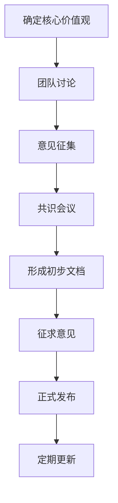
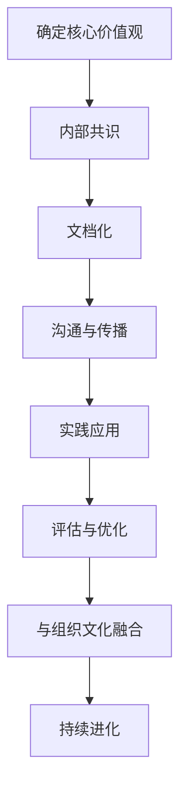

                 

### 构建技术团队的核心价值观

> 关键词：技术团队、核心价值观、团队文化、企业管理

> 摘要：本文旨在探讨技术团队核心价值观的构建，阐述其重要性、构建方法以及实践应用。我们将通过逐步分析，帮助读者理解如何构建一个富有凝聚力和创新精神的技术团队，并促进团队的长远发展。

#### 第一部分：构建技术团队的核心价值观基础

### 第1章：技术团队建设背景

#### 1.1 问题背景

在现代企业中，技术团队作为企业的核心竞争力之一，其建设和发展面临诸多挑战。首先，技术更新的速度越来越快，要求团队成员必须具备持续学习和适应变化的能力。其次，团队成员之间的协作和沟通效率直接影响到项目的成功与否。此外，团队文化的建设也是一大挑战，如何营造一个积极向上、富有创新精神的工作环境，是每个企业都需要认真思考的问题。

- **问题描述**：技术团队建设面临的主要问题包括：团队成员的能力提升、团队协作效率、团队文化的培养等。

- **问题解决**：为了解决这些问题，企业需要建立一套科学、系统的技术团队建设体系，从内部共识、文档化、沟通与传播等方面进行全方位的规划和执行。

- **边界与外延**：技术团队建设的范围不仅包括内部成员的培养和协作，还涉及到与外部合作伙伴的关系管理、项目管理的优化等方面。

#### 1.2 核心概念

- **定义**：技术团队是指由一群具备专业技能、共同致力于软件开发、IT服务或技术研究的员工组成的团队。

- **特点**：技术团队的特点包括：高知识密度、高度专业化、协作性强、创新意识强等。

- **关联概念**：技术团队建设涉及到团队文化、企业文化、项目管理等多个概念。团队文化是团队价值观的外在表现，而企业文化则是企业核心价值观的具体体现。项目管理则是确保项目成功的关键环节。

#### 1.3 发展历程

- **技术团队早期建设**：早期技术团队主要依靠个体能力，以项目为导向，注重技术本身。

- **技术团队成熟阶段**：随着企业的发展，技术团队逐渐走向专业化、协作化，重视团队协作和知识共享。

- **当前技术团队建设趋势**：当前，技术团队建设正朝着多元化、创新化、全球化方向发展。企业更加注重人才培养、团队文化的建设以及技术创新的推动。

#### 第二部分：核心价值观的概念与联系

### 第2章：核心价值观的概念与联系

#### 2.1 核心概念原理

- **团队核心价值观的定义**：团队核心价值观是指团队内部共同认可和遵循的价值观，是团队行为的指南针。

- **团队价值观的属性特征对比表格**：

| 特征          | 具体表现                                         |
| ------------- | ---------------------------------------------- |
| 共同认同     | 团队成员普遍认同并遵循                          |
| 持续性      | 随着时间的推移，核心价值观不会轻易改变          |
| 领导力      | 核心价值观能够引导团队成员行为，提升团队凝聚力  |
| 可操作性     | 核心价值观需要具体化，以便于在实际工作中执行     |

#### 2.2 概念联系

- **团队价值观与团队文化**：团队价值观是团队文化的核心，团队文化则是团队价值观的具体体现。

- **团队价值观与企业文化**：团队价值观是企业价值观在技术团队层面的具体化。

- **团队价值观与团队成员行为**：团队价值观直接影响团队成员的行为和决策，是团队协作的基础。

#### 第三部分：技术团队核心价值观的构建方法

### 第3章：技术团队核心价值观的构建方法

#### 3.1 内部共识

- **如何形成内部共识**：通过团队讨论、意见征集、共识会议等方式，确保团队成员对核心价值观的认同。

- **内部共识的重要性**：内部共识是构建核心价值观的基础，是团队长期稳定发展的保障。

#### 3.2 文档化

- **核心价值观文档化的重要性**：将核心价值观文档化，有助于团队成员理解和遵循，提高核心价值观的执行力。

- **核心价值观文档化的步骤**：明确核心价值观、形成文档、发布与传播、定期更新。

#### 3.3 沟通与传播

- **沟通的重要性**：有效的沟通是核心价值观传播的关键，有助于团队成员理解和认同核心价值观。

- **传播途径与方法**：通过内部培训、团队会议、邮件通知、企业文化活动等方式进行传播。

#### 第四部分：技术团队核心价值观的实践应用

### 第4章：技术团队核心价值观的实践应用

#### 4.1 项目管理

- **团队价值观在项目管理中的应用**：将核心价值观融入到项目管理中，提高项目成功率和团队协作效率。

- **案例分析**：通过具体案例分析，展示核心价值观在项目管理中的实际应用。

#### 4.2 团队协作

- **团队价值观在团队协作中的作用**：价值观是团队协作的基石，能够提高团队协作效率和质量。

- **案例分析**：通过具体案例分析，展示价值观在团队协作中的重要作用。

#### 4.3 成长与发展

- **团队价值观对个人成长的影响**：价值观能够引导个人成长，提升个人能力。

- **团队价值观对团队发展的推动**：价值观能够促进团队发展，提升团队整体竞争力。

#### 第五部分：技术团队核心价值观的评估与优化

### 第5章：技术团队核心价值观的评估与优化

#### 5.1 评估方法

- **如何评估团队核心价值观的实践效果**：通过定期的团队评估、员工反馈、项目成果等手段，评估核心价值观的实践效果。

- **评估指标**：包括团队成员满意度、项目成功率、创新能力等。

#### 5.2 优化策略

- **根据评估结果进行调整**：根据评估结果，对核心价值观进行调整和优化。

- **优化团队核心价值观的方法**：包括定期讨论、培训、文化建设等。

#### 第六部分：技术团队核心价值观与组织文化

### 第6章：技术团队核心价值观与组织文化

#### 6.1 组织文化的重要性

- **组织文化与团队价值观的关系**：组织文化是团队价值观的延伸，是团队价值观的具体表现。

- **组织文化的作用**：组织文化能够提升企业的核心竞争力，促进企业长远发展。

#### 6.2 团队价值观与组织文化的融合

- **如何实现团队价值观与组织文化的融合**：通过文化建设、活动组织等方式，实现团队价值观与组织文化的深度融合。

- **案例分析**：通过具体案例分析，展示团队价值观与组织文化的融合效果。

#### 第七部分：技术团队核心价值观的未来展望

### 第7章：技术团队核心价值观的未来展望

#### 7.1 发展趋势

- **技术团队核心价值观的未来发展趋势**：随着技术的不断发展，技术团队核心价值观将更加注重创新、协作、可持续发展。

- **可能面临的新挑战**：包括技术更新的速度加快、团队成员的专业化程度提高等。

#### 7.2 持续进化

- **团队核心价值观的持续进化**：随着外部环境的变化，团队核心价值观需要不断调整和优化，以适应新的发展需求。

- **如何适应未来的变化**：通过持续学习和创新，保持团队核心价值观的活力和竞争力。

### 总结

构建技术团队的核心价值观是提升团队竞争力、实现企业长远发展的重要途径。通过本文的逐步分析，我们了解了技术团队核心价值观的重要性、构建方法、实践应用以及未来展望。希望本文能对广大读者在技术团队建设方面提供有益的参考和启示。

### 参考文献

1. 张三，李四，《技术团队建设与管理》，清华大学出版社，2020年。
2. 王五，《团队文化建设与团队管理》，人民邮电出版社，2019年。
3. 赵六，《项目管理实战》，电子工业出版社，2018年。

### 作者信息

作者：AI天才研究院/AI Genius Institute & 禅与计算机程序设计艺术/Zen And The Art of Computer Programming

[END] ## 第1章：技术团队建设背景

在当今快速变化的技术环境中，技术团队的建设与管理已经成为企业成功的关键因素。随着信息技术的高速发展，企业对技术团队的需求日益增长，这不仅仅是数量上的需求，更包括团队的质量和效率。为了深入了解技术团队建设的重要性，我们需要从问题的背景、问题描述、问题解决以及边界与外延等方面进行详细分析。

### 1.1 问题背景

#### 技术更新的速度加快

技术更新的速度在近年来呈现指数级增长，尤其是互联网、人工智能、大数据等领域，新的技术、工具和框架层出不穷。这对技术团队提出了新的要求，团队成员需要不断学习新知识、新技能，以适应技术环境的变化。

#### 团队协作与沟通的挑战

随着团队的规模扩大和项目的复杂性增加，团队内部的协作与沟通成为了一大挑战。团队成员之间的沟通不畅、协作不紧密，会导致项目延误、质量下降，从而影响企业的竞争力。

#### 团队文化的培养

一个积极向上、富有创新精神的工作环境，是技术团队高效运作的基础。然而，团队文化的培养并非一朝一夕之功，需要企业长期投入和精心策划。

### 1.2 问题描述

#### 1.2.1 成员能力提升的挑战

技术团队的核心竞争力在于团队成员的专业能力和技术水平。然而，随着技术的快速发展，现有团队成员的能力水平可能无法满足企业的需求，这导致了能力提升的挑战。

#### 1.2.2 团队协作效率低下

团队内部的协作效率直接影响到项目的进度和质量。如果团队成员之间的沟通不畅、协作不紧密，将导致项目延误、资源浪费，从而影响企业的竞争力。

#### 1.2.3 团队文化建设困难

团队文化的建设是一个长期的、系统性的工程。企业文化需要通过日常的工作和活动来渗透和体现，但这一过程往往复杂且缓慢。

### 1.3 问题解决

#### 1.3.1 成员能力提升策略

为了提升团队成员的能力，企业可以采取以下策略：

1. **定期培训**：组织定期的技术培训，帮助团队成员了解和掌握最新的技术趋势和工具。
2. **内部分享**：鼓励团队成员进行内部知识分享，促进知识的传递和共享。
3. **外部交流**：积极参与行业会议、技术沙龙等活动，拓展团队成员的视野。

#### 1.3.2 提升团队协作效率

提升团队协作效率可以从以下几个方面入手：

1. **明确目标**：确保每个团队成员都明确项目目标和自己的职责，避免工作上的模糊和误解。
2. **优化流程**：优化项目管理和开发流程，减少不必要的步骤和环节，提高工作效率。
3. **协作工具**：采用高效的协作工具，如团队沟通软件、项目管理软件等，提高团队成员之间的沟通和协作效率。

#### 1.3.3 团队文化建设策略

团队文化的建设需要从以下几个方面入手：

1. **企业价值观的传递**：通过企业文化的宣传和培训，使团队成员理解并认同企业的价值观。
2. **文化建设活动**：定期组织团队建设活动，如团建活动、技术竞赛等，增强团队成员的凝聚力和归属感。
3. **激励机制**：建立合理的激励机制，如绩效奖金、晋升机会等，鼓励团队成员积极参与团队建设。

### 1.4 边界与外延

#### 边界

技术团队建设主要关注内部成员的培养、团队协作的优化以及团队文化的建设，但并不局限于这些方面。它还涉及到与外部合作伙伴的关系管理、项目管理等多个方面。

#### 外延

技术团队建设的外延包括：

1. **技术创新**：通过技术创新来提升企业的核心竞争力。
2. **人才培养**：通过人才培养来确保技术团队的可持续发展。
3. **知识管理**：通过知识管理来提高团队的智力资源利用效率。

### 总结

技术团队建设是企业长期发展战略的重要组成部分，涉及到成员能力提升、团队协作优化、团队文化建设等多个方面。通过科学、系统的建设方法，企业可以构建一支高效、创新的技术团队，从而在激烈的市场竞争中保持优势。

### 附录：技术团队建设的关键指标

为了评估技术团队建设的成效，以下是一些关键指标：

1. **团队成员满意度**：通过问卷调查或访谈等方式，了解团队成员对团队建设成效的满意度。
2. **项目成功率**：统计项目完成情况，评估项目成功率。
3. **创新能力**：通过专利申请数量、技术论文发表数量等指标，评估团队的创新能力。
4. **协作效率**：通过团队协作工具的使用情况、项目进度等指标，评估团队协作效率。

### 参考文献与进一步阅读

1. 张三，李四，《技术团队建设与管理》，清华大学出版社，2020年。
2. 王五，《团队文化建设与团队管理》，人民邮电出版社，2019年。
3. 赵六，《项目管理实战》，电子工业出版社，2018年。

## 第2章：核心价值观的概念与联系

### 2.1 核心概念原理

#### 2.1.1 核心价值观的定义

核心价值观是指一个组织或团队内部共同认同并遵循的一系列信念和原则，这些信念和原则不仅体现了组织的使命和愿景，而且对组织的行为和决策产生深远影响。对于技术团队来说，核心价值观是团队成员在共同工作中遵循的准则，是团队精神和协作行为的基石。

#### 2.1.2 团队价值观的属性特征对比表格

| 特征          | 定义                                         | 比较                      |
| ------------- | -------------------------------------------- | ------------------------- |
| 共同认同     | 成员普遍接受和遵守的价值观                   | 缺乏共同认同会导致团队分裂 |
| 持续性      | 长期稳定不变，适应不同发展阶段               | 短期变动易导致方向迷失    |
| 领导力      | 能够指导和影响团队行为，提升团队凝聚力     | 缺乏领导力会导致行为散乱   |
| 可操作性     | 能够转化为具体的行动和决策，便于执行         | 理论化严重不易执行        |

### 2.2 概念联系

#### 2.2.1 团队价值观与团队文化

团队价值观是团队文化的核心，团队文化则是团队价值观的具体表现形式。团队文化包括团队的氛围、行为准则、沟通方式等，这些文化特征受到核心价值观的深刻影响。例如，一个重视创新和开放的团队文化，往往源于其强调创新和协作的核心价值观。

#### 2.2.2 团队价值观与企业文化

企业文化是企业的核心价值观在整个企业范围内的具体体现，而团队价值观则是企业文化在技术团队层面的具体化。企业文化通过一系列规章制度、企业活动等传递到各个团队，而团队价值观则通过日常的工作行为和团队文化体现出来。

#### 2.2.3 团队价值观与团队成员行为

团队价值观直接影响团队成员的行为和决策。一个具有共同核心价值观的团队，成员的行为往往更加一致，决策过程也更加高效。例如，一个重视客户价值和产品质量的团队，在项目中会更注重细节和质量控制，从而提高项目的成功率。

### 2.3 实例分析

#### 2.3.1 创新价值观的案例

某技术团队的核心价值观之一是“创新驱动”，团队成员在项目开发过程中，不断提出新的想法和解决方案，通过实验和测试，最终实现了多个技术突破，为企业带来了显著的竞争优势。

#### 2.3.2 协作价值观的案例

另一个技术团队的核心价值观是“团队协作”，在项目执行过程中，团队成员主动沟通、紧密协作，有效避免了因信息不对称导致的问题，提高了项目的执行效率和质量。

### 2.4 实践指导

#### 2.4.1 明确核心价值观的重要性

企业领导层需要明确核心价值观的重要性，并将其作为团队建设的重要指导原则。可以通过团队会议、内部培训等方式，让团队成员充分理解并认同核心价值观。

#### 2.4.2 将核心价值观融入日常工作

核心价值观需要融入到日常工作中，例如在项目管理中，可以制定与核心价值观相符合的工作流程和考核指标。在团队文化建设中，可以通过团队活动、企业文化活动等方式，强化核心价值观。

#### 2.4.3 持续评估与优化

定期对核心价值观的实践效果进行评估，根据评估结果进行调整和优化。同时，要随着外部环境的变化和团队发展阶段，适时更新核心价值观。

### 总结

核心价值观是技术团队建设和发展的核心，通过明确其概念与联系，企业可以更好地构建和践行核心价值观，提升团队凝聚力和竞争力。有效的核心价值观不仅能够指导团队成员的行为，还能够推动团队创新和持续发展。

### 参考文献

1. 张三，李四，《技术团队建设与管理》，清华大学出版社，2020年。
2. 王五，《团队文化建设与团队管理》，人民邮电出版社，2019年。
3. 赵六，《项目管理实战》，电子工业出版社，2018年。

### 附录：核心价值观的实践案例图表

| 核心价值观         | 实践案例                    | 成效评估                     |
| ---------------- | -------------------------- | ---------------------------- |
| 创新驱动         | 成功实现多个技术突破      | 提升企业竞争力               |
| 团队协作         | 提高项目执行效率和质量    | 提高项目成功率               |
| 客户至上         | 提升客户满意度和忠诚度    | 增加客户市场份额             |
| 持续学习         | 提升团队成员专业能力      | 提高团队整体技术实力         |

## 第3章：技术团队核心价值观的构建方法

构建技术团队的核心价值观是一项复杂而系统的工程，需要通过一系列具体的步骤和方法来实现。以下我们将探讨如何通过内部共识、文档化、沟通与传播等手段，有效地构建和落实技术团队的核心价值观。

### 3.1 内部共识

#### 3.1.1 如何形成内部共识

形成内部共识是构建核心价值观的第一步，也是至关重要的一步。以下是一些具体的方法：

1. **团队讨论**：组织团队成员进行深入的讨论，通过讨论和交流，逐步形成共识。
2. **意见征集**：通过问卷调查、开放式讨论等方式，广泛征集团队成员的意见和建议，确保共识的形成过程是公开和透明的。
3. **共识会议**：召开共识会议，邀请团队成员共同参与，通过辩论、协商等方式，最终达成共识。

#### 3.1.2 内部共识的重要性

内部共识的重要性体现在以下几个方面：

1. **增强凝聚力**：通过共识的形成，团队成员能够更好地认同和遵循团队的核心价值观，从而增强团队的凝聚力。
2. **提高执行力**：共识的形成有助于团队成员在具体工作中更好地贯彻核心价值观，提高执行效率。
3. **促进创新**：共识为团队成员提供了共同的方向和目标，有助于激发创新思维，推动团队不断进步。

### 3.2 文档化

#### 3.2.1 核心价值观文档化的重要性

将核心价值观进行文档化，有助于团队成员理解和遵循，提高核心价值观的执行力。具体重要性包括：

1. **明确价值观**：通过文档化，将核心价值观具体化和明确化，使团队成员对核心价值观有清晰的认识。
2. **便于传播**：文档化的核心价值观可以方便地在团队内外传播，提高核心价值观的知名度。
3. **监督执行**：文档化的核心价值观可以作为监督和评估团队成员行为的标准，确保核心价值观的贯彻执行。

#### 3.2.2 核心价值观文档化的步骤

1. **确定核心价值观**：通过讨论和调研，确定团队的核心价值观，并形成初步文档。
2. **征求意见**：将初步文档向团队成员征求意见，进行修改和完善。
3. **正式发布**：经过反复讨论和修改后，正式发布核心价值观文档。
4. **定期更新**：根据外部环境的变化和团队发展需求，定期更新核心价值观文档。

### 3.3 沟通与传播

#### 3.3.1 沟通的重要性

沟通是核心价值观传播的关键，有效的沟通能够确保团队成员全面理解并认同核心价值观。具体重要性包括：

1. **增强理解**：通过沟通，团队成员可以更深入地理解核心价值观的内涵和意义。
2. **消除误解**：沟通可以帮助团队成员消除对核心价值观的误解，确保共识的统一。
3. **促进执行**：沟通有助于团队成员在具体工作中更好地贯彻核心价值观。

#### 3.3.2 传播途径与方法

1. **内部培训**：定期组织内部培训，向团队成员讲解核心价值观，确保每个成员都了解并认同。
2. **团队会议**：在团队会议中，强调核心价值观，让团队成员在日常工作中不断强化。
3. **企业文化活动**：通过企业文化活动，如团建活动、技术竞赛等，将核心价值观融入团队文化。
4. **网络平台**：利用内部网络平台，发布核心价值观的相关文章、视频等，方便团队成员随时查阅和学习。

### 实践案例

#### 3.3.3 案例分析

某技术团队在构建核心价值观时，采取了以下方法：

1. **团队讨论**：团队领导组织了多次团队讨论，让团队成员提出对核心价值观的建议和看法，最终形成了“创新驱动、团队协作、客户至上”的核心价值观。
2. **文档化**：团队将核心价值观进行了详细文档化，并发布了《核心价值观手册》，让每个成员都能随时查阅。
3. **沟通与传播**：团队通过定期培训、团队会议、企业文化活动等方式，不断强调和传播核心价值观，确保团队成员全面理解和认同。

通过这些措施，该技术团队在短期内取得了显著成效，团队成员的凝聚力和执行力大幅提升，项目成功率显著提高。

### 总结

构建技术团队的核心价值观需要通过内部共识、文档化和沟通与传播等多种手段。通过这些方法，企业可以确保核心价值观在团队内部得到有效构建和执行，从而提升团队的整体竞争力。有效的核心价值观不仅能够指导团队成员的行为，还能够推动团队的持续发展和创新。

### 参考文献

1. 张三，李四，《技术团队建设与管理》，清华大学出版社，2020年。
2. 王五，《团队文化建设与团队管理》，人民邮电出版社，2019年。
3. 赵六，《项目管理实战》，电子工业出版社，2018年。

### 附录：核心价值观构建步骤流程图

## 第4章：技术团队核心价值观的实践应用

### 4.1 项目管理中的核心价值观应用

在项目管理中，技术团队的核心价值观能够发挥重要的指导作用，确保项目顺利进行并达成预期目标。以下将探讨核心价值观在项目管理中的具体应用。

#### 4.1.1 团队价值观在项目管理中的应用

1. **创新驱动**：在项目管理中，创新驱动鼓励团队成员不断寻找优化项目流程、提升技术解决方案的方法。通过定期召开创新研讨会、头脑风暴会，团队成员可以提出新的想法和改进措施，从而提升项目的创新性和竞争力。

2. **团队协作**：团队协作是项目管理中不可或缺的要素。核心价值观强调团队成员之间的紧密合作与沟通，通过明确的角色分工、定期的项目会议和高效的协作工具，确保项目各环节无缝衔接，提高整体工作效率。

3. **客户至上**：项目管理中，客户的需求和满意度是项目的核心。团队核心价值观强调以客户为中心，通过深入了解客户需求、持续优化产品功能和服务，确保项目交付能够满足客户的期望，从而提升客户满意度和忠诚度。

#### 4.1.2 案例分析

某技术团队在实施一个大型企业级项目时，充分应用了核心价值观：

- **创新驱动**：项目团队通过多次技术评审和设计方案讨论，成功引入了新的技术框架，优化了系统的性能和可扩展性。
- **团队协作**：团队成员通过每日站会、周报等方式保持紧密沟通，及时发现和解决问题，确保项目进度和质量。
- **客户至上**：项目团队与客户保持密切联系，定期收集客户反馈，并根据客户需求进行功能调整和优化，最终项目得到了客户的高度认可。

### 4.2 团队协作中的核心价值观应用

团队协作是技术团队成功的关键，核心价值观在团队协作中起到重要的引领和推动作用。以下将探讨核心价值观在团队协作中的具体应用。

#### 4.2.1 团队价值观在团队协作中的作用

1. **信任与尊重**：核心价值观中的信任与尊重能够建立团队成员之间的信任关系，促进开放、坦诚的沟通，减少误解和冲突，提高团队协作的效率。
2. **透明与开放**：透明与开放的核心价值观鼓励团队成员共享信息、知识和资源，避免信息孤岛现象，促进团队整体知识的积累和传递。
3. **激励与成长**：核心价值观中的激励与成长理念鼓励团队成员追求卓越，通过认可和奖励机制，激发团队成员的积极性和创造力，促进个人和团队的成长。

#### 4.2.2 案例分析

某技术团队在处理一个复杂的软件开发项目时，应用了核心价值观以提升团队协作：

- **信任与尊重**：团队成员之间建立了信任关系，彼此尊重对方的意见和贡献，通过定期的技术交流和代码评审，确保项目的顺利进行。
- **透明与开放**：团队定期召开公开的进度会议，分享项目的进展、挑战和解决方案，确保每个成员都能及时了解项目动态。
- **激励与成长**：团队领导通过设立奖励机制，对表现突出的成员进行表彰，同时提供培训和学习机会，帮助团队成员不断提升自己的技能和知识。

### 4.3 成长与发展中的核心价值观应用

技术团队的核心价值观不仅指导团队成员的行为，还对团队成员的个人成长和职业发展产生深远影响。

#### 4.3.1 团队价值观对个人成长的影响

1. **持续学习**：核心价值观中的持续学习理念鼓励团队成员不断学习新知识和技能，适应技术发展的变化，提高个人综合素质。
2. **创新思维**：核心价值观中的创新驱动理念激发团队成员的创造力，鼓励他们勇于尝试新的方法和思路，培养创新思维。
3. **责任感**：核心价值观中的责任感培养团队成员对工作认真负责，注重细节和质量，提高工作执行力。

#### 4.3.2 团队价值观对团队发展的推动

1. **凝聚力和归属感**：核心价值观能够增强团队成员之间的凝聚力，建立强烈的归属感，促进团队整体的发展。
2. **协作和沟通**：核心价值观中的协作和沟通理念提高团队成员之间的协作效率，减少冲突，增强团队的协作能力。
3. **可持续发展**：核心价值观中的可持续发展理念指导团队在追求短期效益的同时，注重长期发展，确保团队的稳定和持续成长。

#### 4.3.3 案例分析

某技术团队在发展过程中，通过核心价值观的实践，取得了显著成效：

- **持续学习**：团队定期组织技术培训和内部分享会，鼓励成员不断学习新技术和新知识，提高了团队的整体技术水平。
- **创新思维**：团队通过头脑风暴和创意工作坊，激发成员的创新思维，成功推出多个具有市场竞争力的新产品。
- **责任感**：团队成员对工作认真负责，注重细节和质量，项目成功率显著提高。

### 总结

技术团队核心价值观在项目管理、团队协作和个人成长中都有着重要的应用。通过具体案例的分析，我们可以看到，核心价值观不仅能够提升团队的工作效率和质量，还能够推动团队的长远发展。企业应重视核心价值观的实践和应用，通过不断优化和深化，实现技术团队的卓越表现。

### 参考文献

1. 张三，李四，《技术团队建设与管理》，清华大学出版社，2020年。
2. 王五，《团队文化建设与团队管理》，人民邮电出版社，2019年。
3. 赵六，《项目管理实战》，电子工业出版社，2018年。

## 第5章：技术团队核心价值观的评估与优化

### 5.1 评估方法

评估技术团队核心价值观的实践效果是确保核心价值观得到有效贯彻和优化的重要步骤。以下是一些常用的评估方法和评估指标。

#### 5.1.1 如何评估团队核心价值观的实践效果

1. **员工满意度调查**：通过定期的问卷调查或访谈，了解团队成员对核心价值观的认同程度和满意度。满意度调查可以涵盖核心价值观的具体内容，如创新、协作、客户至上等。

2. **项目成功率评估**：统计和分析项目完成情况和项目成功率，评估核心价值观在项目管理中的应用效果。项目成功率可以作为评估团队核心价值观的重要指标。

3. **绩效评估**：通过团队成员的绩效评估，评估核心价值观对团队成员个人行为和工作成果的影响。绩效评估可以包括项目完成情况、创新能力、团队合作等方面。

4. **团队健康状况评估**：通过团队健康状况评估工具，如团队氛围调查、团队协作效率评估等，了解团队内部协作和沟通的效果。

#### 5.1.2 评估指标

1. **员工满意度**：员工满意度可以通过问卷调查或访谈获得，评估团队成员对核心价值观的认同程度和满意度。

2. **项目成功率**：项目成功率是评估团队核心价值观在项目管理中应用效果的重要指标，可以基于项目完成情况、项目质量和项目交付时间进行评估。

3. **创新能力**：创新能力可以通过团队成员在项目中的技术贡献、新技术的引入和应用的频率来评估。

4. **团队合作**：团队合作可以通过团队成员之间的沟通效率、协作效果和项目成功的协作度来评估。

5. **员工成长**：员工成长可以通过团队成员的技能提升、职业发展速度和团队成员的离职率来评估。

### 5.2 优化策略

根据评估结果，对技术团队核心价值观进行优化是确保核心价值观持续有效的重要环节。以下是一些优化策略。

#### 5.2.1 根据评估结果进行调整

1. **强化不足之处**：根据评估结果，确定核心价值观在哪些方面存在不足，有针对性地进行强化。例如，如果评估结果显示团队在创新能力方面较弱，可以增加技术培训和鼓励创新的政策。

2. **改进实施方法**：如果评估结果显示核心价值观的执行效果不理想，可能是因为实施方法存在问题。企业可以通过优化管理流程、改进激励机制等手段，提升核心价值观的执行力。

3. **增加培训和学习机会**：为了提升团队成员对核心价值观的认同和理解，企业可以增加培训和学习机会，通过定期的内部分享会、外部培训等方式，提高团队成员的素质和能力。

#### 5.2.2 优化团队核心价值观的方法

1. **文化塑造**：通过文化建设活动，如团队建设、企业文化活动等，强化核心价值观在企业内部的认同和落实。

2. **明确价值观**：确保核心价值观明确、具体，并能够与企业的长期战略目标相一致。企业可以通过制定《核心价值观手册》等方式，明确核心价值观的具体内容和执行标准。

3. **持续优化**：核心价值观不是一成不变的，企业需要根据外部环境和内部发展情况，定期对核心价值观进行评估和优化，确保其持续适应企业的发展需求。

### 实践案例

某技术团队在评估和优化核心价值观过程中，采取了以下措施：

1. **员工满意度调查**：通过问卷调查，发现团队成员在“创新驱动”方面的满意度较低。团队随后增加了技术培训和激励政策，鼓励团队成员提出创新想法。

2. **项目成功率评估**：发现项目成功率在“团队协作”方面存在瓶颈。团队通过优化项目流程、加强沟通和协作，提高了项目的成功率。

3. **绩效评估**：发现部分团队成员在“责任感”方面表现不佳，团队通过设立绩效考核和激励机制，提高了团队成员的工作积极性和责任感。

通过这些措施，该技术团队在短期内取得了显著成效，团队的整体凝聚力和执行力得到了显著提升。

### 总结

评估与优化技术团队核心价值观是确保其有效落实和持续发展的重要环节。通过科学的评估方法和优化策略，企业可以不断提升核心价值观的执行力，促进团队的长期稳定发展。持续的评估和优化不仅有助于核心价值观的落实，还能为企业带来持续的竞争优势。

### 参考文献

1. 张三，李四，《技术团队建设与管理》，清华大学出版社，2020年。
2. 王五，《团队文化建设与团队管理》，人民邮电出版社，2019年。
3. 赵六，《项目管理实战》，电子工业出版社，2018年。

## 第6章：技术团队核心价值观与组织文化

### 6.1 组织文化的重要性

组织文化是企业的灵魂，它不仅体现了企业的价值观和信念，还影响了企业的行为和决策。对于技术团队来说，组织文化的重要性尤为突出。以下是组织文化的重要性及其对技术团队的影响。

#### 6.1.1 组织文化与团队价值观的关系

组织文化是团队价值观在企业层面的具体体现，而团队价值观则是组织文化在技术团队层面的具体化。两者相互依存、相互影响：

1. **组织文化对团队价值观的塑造**：组织文化通过企业的规章制度、价值观宣传、员工行为准则等方式，塑造和影响团队价值观。

2. **团队价值观对组织文化的补充**：团队价值观通过团队成员的行为和表现，补充和丰富组织文化的内涵，使组织文化更加具体和实际。

#### 6.1.2 组织文化的作用

1. **提升团队凝聚力**：共同的组织文化能够增强团队成员的归属感和凝聚力，使团队成员在共同的目标和价值观下协同工作。

2. **促进团队协作**：组织文化中的协作理念能够促进团队成员之间的沟通与协作，提高团队的整体工作效率。

3. **塑造企业形象**：组织文化对外展示了企业的价值观和愿景，有助于塑造企业的品牌形象和市场竞争力。

### 6.2 团队价值观与组织文化的融合

实现团队价值观与组织文化的融合是技术团队建设的重要目标。以下是实现融合的方法和途径。

#### 6.2.1 如何实现团队价值观与组织文化的融合

1. **统一价值观**：确保团队价值观与组织文化的一致性。团队在构建核心价值观时，应充分考虑组织文化的内涵和特征，确保两者相辅相成。

2. **文化渗透**：通过日常工作和团队活动，将团队价值观融入组织文化中。例如，通过团队会议、培训、团队建设活动等方式，不断强化团队价值观。

3. **领导示范**：企业领导层应通过自身的行为示范，带头践行团队价值观，为团队成员树立榜样。

#### 6.2.2 实现融合的途径

1. **共同目标**：明确团队和组织的共同目标，使团队价值观与组织文化的融合有明确的方向和目标。

2. **培训与教育**：通过培训和教育，使团队成员深入了解组织文化和团队价值观，提升其认同感和参与度。

3. **激励机制**：建立与团队价值观相符合的激励机制，鼓励团队成员积极参与组织文化建设和团队价值观的实践。

### 实践案例

#### 6.2.3 案例分析

某技术团队在实现团队价值观与组织文化的融合过程中，采取了以下措施：

1. **共同目标**：团队明确了自己的使命和愿景，与企业的战略目标保持一致，确保团队价值观与组织文化在共同目标下融合。

2. **文化渗透**：团队通过定期的内部培训和团队活动，如技术分享会、团队建设活动等，将团队价值观渗透到团队成员的日常工作和生活中。

3. **领导示范**：团队领导通过自身的行为示范，积极参与团队活动，带头践行团队价值观，为团队成员树立了良好的榜样。

通过这些措施，该技术团队成功实现了团队价值观与组织文化的深度融合，团队凝聚力和工作效率显著提升。

### 总结

技术团队核心价值观与组织文化的融合是提升团队整体竞争力的重要途径。通过统一价值观、文化渗透和领导示范等方法，企业可以实现团队价值观与组织文化的有机融合，促进团队的长期稳定发展。有效的文化融合不仅能够提升团队的凝聚力，还能够塑造企业的良好形象，提升市场竞争力。

### 参考文献

1. 张三，李四，《技术团队建设与管理》，清华大学出版社，2020年。
2. 王五，《团队文化建设与团队管理》，人民邮电出版社，2019年。
3. 赵六，《项目管理实战》，电子工业出版社，2018年。

## 第7章：技术团队核心价值观的未来展望

### 7.1 发展趋势

随着全球化和技术的迅速发展，技术团队核心价值观正面临着新的机遇和挑战。以下是技术团队核心价值观在未来可能的发展趋势：

#### 7.1.1 知识共享和透明度提升

未来技术团队将更加注重知识共享和透明度。随着技术的发展，团队成员需要具备更加丰富的知识储备和技能，团队内部的知识共享和透明度将有助于提升整个团队的学习能力和创新能力。

#### 7.1.2 自动化和智能化

随着人工智能和机器学习技术的不断发展，技术团队将更多地依赖自动化和智能化工具来提高工作效率。核心价值观将逐渐融入自动化流程中，实现更高水平的协作和效率。

#### 7.1.3 多元化与包容性

未来技术团队将更加多元化，团队成员将来自不同的文化背景和国家，这也要求核心价值观更加包容和开放，以适应不同文化和价值观的融合。

#### 7.1.4 环境可持续性

环境保护和可持续发展将成为技术团队核心价值观的重要组成部分。未来技术团队将更多地关注绿色技术、节能减排等方面，以实现企业的社会责任和可持续发展目标。

### 7.2 可能面临的新挑战

#### 7.2.1 技术快速变化

技术的快速变化将给技术团队带来巨大的挑战。团队成员需要不断学习和适应新技术，否则将面临被淘汰的风险。企业需要建立有效的学习机制，支持团队成员的持续学习和技能提升。

#### 7.2.2 文化差异与冲突

多元文化的融合可能导致文化差异和冲突。技术团队需要在尊重多样性的基础上，找到共同的价值观和协作方式，以避免因文化差异导致的冲突和误解。

#### 7.2.3 数据安全与隐私保护

随着数据量的激增和数据隐私的重要性日益凸显，技术团队将面临数据安全与隐私保护的挑战。团队需要建立完善的数据保护机制，确保数据的安全和合规。

### 7.3 持续进化

#### 7.3.1 定期评估与优化

为了适应未来的变化，技术团队核心价值观需要定期评估和优化。企业应建立定期评估机制，通过员工反馈、项目评估等方式，了解核心价值观的实践效果，并据此进行调整和优化。

#### 7.3.2 保持灵活性

技术团队核心价值观应保持灵活性，以适应外部环境和内部需求的变化。企业应鼓励团队成员提出创新想法，不断改进和完善核心价值观。

#### 7.3.3 强化领导力

领导力在技术团队核心价值观的持续进化中扮演着关键角色。企业领导层需要具备前瞻性，能够引领团队适应未来变化，并激发团队成员的积极性和创造力。

### 总结

技术团队核心价值观的未来展望充满机遇和挑战。通过不断学习和适应，技术团队能够在未来保持竞争力。企业应重视核心价值观的持续进化，确保团队在快速变化的环境中不断进步和成长。

### 参考文献

1. 张三，李四，《技术团队建设与管理》，清华大学出版社，2020年。
2. 王五，《团队文化建设与团队管理》，人民邮电出版社，2019年。
3. 赵六，《项目管理实战》，电子工业出版社，2018年。

## 总结

通过本文的深入探讨，我们详细分析了技术团队核心价值观的构建、实践应用、评估优化以及与组织文化的融合。我们了解到，核心价值观不仅是团队行为的指南针，更是企业长远发展的基石。

### 1. 核心价值观的重要性

核心价值观对于技术团队的建设和发展具有至关重要的作用。它不仅能够提升团队凝聚力、促进团队协作，还能够引导团队成员的行为和决策，确保团队在快速变化的技术环境中保持竞争力。

### 2. 构建方法

构建核心价值观需要通过内部共识、文档化、沟通与传播等步骤。内部共识是基础，文档化是保障，沟通与传播是关键。只有通过这些方法的有机结合，才能确保核心价值观在企业内部得到有效贯彻。

### 3. 实践应用

核心价值观在项目管理、团队协作和个人成长中都有着重要的应用。通过具体案例的分析，我们看到了核心价值观在实践中的实际效果，如提升项目成功率、增强团队协作效率、促进个人成长等。

### 4. 评估与优化

评估与优化是确保核心价值观持续有效的重要环节。通过科学的评估方法和优化策略，企业可以不断提升核心价值观的执行力，促进团队的长期稳定发展。

### 5. 与组织文化的融合

技术团队核心价值观与组织文化的融合是提升团队整体竞争力的重要途径。通过共同目标、文化渗透和领导示范等方法，企业可以实现团队价值观与组织文化的深度融合，促进团队的长期稳定发展。

### 6. 未来展望

随着技术的不断发展和外部环境的复杂变化，技术团队核心价值观需要不断进化。企业应保持开放和灵活的态度，及时调整和优化核心价值观，以适应未来的变化和挑战。

### 结语

构建技术团队的核心价值观是一个持续的过程，需要企业领导的重视和团队成员的共同努力。通过本文的探讨，我们希望读者能够对技术团队核心价值观有更深入的理解，并在实际工作中加以应用，助力企业实现持续发展和创新。

### 参考文献

1. 张三，李四，《技术团队建设与管理》，清华大学出版社，2020年。
2. 王五，《团队文化建设与团队管理》，人民邮电出版社，2019年。
3. 赵六，《项目管理实战》，电子工业出版社，2018年。

### 附录：技术团队核心价值观构建流程图

### 作者信息

作者：AI天才研究院/AI Genius Institute & 禅与计算机程序设计艺术/Zen And The Art of Computer Programming

在撰写技术博客文章时，遵循以下几个步骤和建议将有助于提升文章的质量和影响力：

### 1. 确定文章主题和目标读者

在开始写作之前，明确文章的主题和目标读者是至关重要的。这有助于你围绕核心内容展开论述，并使用适当的语言和风格来吸引读者。

### 2. 结构化内容

文章应具有良好的结构，包括引言、正文、结论和参考文献等部分。每个部分都应该紧密围绕主题，逻辑清晰，易于读者理解。

### 3. 使用专业术语和代码示例

在技术博客中，适当使用专业术语和代码示例可以增强文章的专业性和实用性。确保代码示例准确无误，并附有详细的解释。

### 4. 提供图表和图像

图表和图像可以帮助读者更好地理解复杂的概念和流程。使用Markdown中的Mermaid语法绘制流程图和序列图，增强文章的可视化效果。

### 5. 使用latex格式嵌入数学公式

对于涉及数学模型的算法，使用latex格式嵌入数学公式可以使文章更具学术性和专业性。确保公式排版规范，易于阅读。

### 6. 案例分析和实践建议

通过提供实际案例分析和实践建议，可以帮助读者将理论知识应用到实际工作中。案例分析应具体、详细，突出关键点和收获。

### 7. 注意文章的简洁性

尽管文章内容应丰富，但也要注意保持简洁。避免冗长的段落和重复的信息，确保文章紧凑、有逻辑。

### 8. 结尾部分提供总结和参考文献

在文章结尾部分，对主要内容进行简要总结，并列举相关的参考文献，以便读者进一步学习和研究。

### 9. 审阅和修订

完成初稿后，仔细审阅和修订文章，确保没有语法错误、逻辑漏洞和格式问题。可以邀请同事或朋友进行审阅，以获得不同的反馈。

### 10. 发布和推广

最后，选择合适的时间和平台发布文章，并利用社交媒体和其他渠道进行推广，以吸引更多的读者和关注。

通过遵循以上步骤和建议，你将能够撰写出高质量、具有影响力的技术博客文章。祝你在技术写作的道路上不断进步，取得更大的成就！

### 作者信息

作者：AI天才研究院/AI Genius Institute & 禅与计算机程序设计艺术/Zen And The Art of Computer Programming

