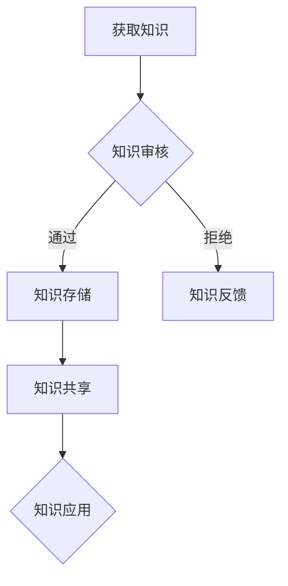
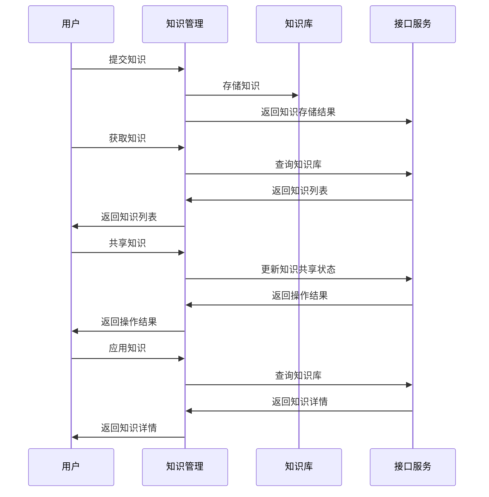

                 

# 《构建技术团队知识共享体系》

> 关键词：知识共享、技术团队、知识管理、体系构建、最佳实践

> 摘要：本文深入探讨了技术团队在知识共享过程中面临的问题，提出了构建知识共享体系的必要性。通过分析核心概念与联系，详细阐述了算法原理和系统架构设计方案，并结合实际案例，提供了项目实战经验和最佳实践技巧。

## 引言

在信息技术快速发展的时代，技术团队的知识共享变得至关重要。然而，现实中的技术团队往往面临一系列知识共享的难题，如知识分散、更新不及时、信息孤岛等。这些问题不仅影响了团队的工作效率，还限制了创新能力的发挥。因此，构建一个高效的知识共享体系成为技术团队领导者亟待解决的问题。

本文旨在向技术团队领导者、经理以及团队成员介绍如何构建一个高效的知识共享体系，以提高团队的工作效率和创新能力。本文将首先介绍知识共享体系的背景和必要性，然后分析核心概念和联系，详细阐述算法原理和系统架构设计方案，并结合实际案例提供项目实战经验和最佳实践技巧。

## 核心概念与联系

### 知识管理

知识管理是指通过系统的方法和工具，对知识的获取、存储、共享、应用和创新进行管理的过程。其目标是最大化知识的价值和利用率，以支持组织的战略目标。

### 知识共享

知识共享是指个人或团队将知识传递给其他个人或团队的过程。它不仅包括知识的传递，还包括知识的获取和共享机制。

### 知识创造

知识创造是指通过创新和整合新的知识，形成新的价值的过程。它是知识管理的重要组成部分，是知识共享的源泉。

### 知识应用

知识应用是指将知识转化为实际行动的过程。它包括知识的实践、应用和验证。

### 概念属性特征对比表格

| 概念     | 定义                                                         | 特征                                                                                   |
|----------|------------------------------------------------------------|--------------------------------------------------------------------------------------|
| 知识管理 | 对知识的获取、存储、共享、应用和创新进行管理的过程 | 系统性、战略性、规范性、持续性                                                       |
| 知识共享 | 个人或团队将知识传递给其他个人或团队的过程 | 交互性、透明性、开放性、共享性                                                       |
| 知识创造 | 通过创新和整合新的知识，形成新的价值的过程 | 创新性、创造性、系统性、持续性                                                       |
| 知识应用 | 将知识转化为实际行动的过程 | 实践性、应用性、验证性、价值性                                                       |

### ER实体关系图架构

```mermaid
erDiagram
    User ||--|{ Knowledge }
    Knowledge ||--|{ KnowledgeBase }
    KnowledgeBase ||--|{ Article }
    Article ||--|{ Comment }
```

## 算法原理讲解

### 算法原理

知识共享算法的基本原理是通过构建一个知识图谱，将团队中的知识进行关联和整合，以便于知识的获取和共享。

### 算法mermaid流程图



### 使用Python源代码进行算法讲解

```python
# 知识共享算法示例
def knowledge_sharing(knowledge):
    # 知识审核
    if is_valid(knowledge):
        # 知识存储
        store_knowledge(knowledge)
        # 知识共享
        share_knowledge(knowledge)
    else:
        # 知识反馈
        feedback_knowledge(knowledge)

# 知识审核
def is_valid(knowledge):
    # 实现知识审核逻辑
    return True

# 知识存储
def store_knowledge(knowledge):
    # 实现知识存储逻辑
    print("知识存储成功")

# 知识共享
def share_knowledge(knowledge):
    # 实现知识共享逻辑
    print("知识共享成功")

# 知识反馈
def feedback_knowledge(knowledge):
    # 实现知识反馈逻辑
    print("知识反馈成功")
```

### 算法的数学模型和公式

$$
f(k) = \frac{1}{1 + e^{-k}}
$$

其中，$k$ 为知识的重要性度量，$f(k)$ 为知识共享的概率。

### 详细讲解和举例说明

#### 详细讲解

知识共享算法的核心是通过对知识的重要性进行度量，来决定知识是否应该被共享。这里使用的是一种常见的激活函数——Sigmoid函数，其公式为：

$$
f(k) = \frac{1}{1 + e^{-k}}
$$

其中，$k$ 为知识的重要性度量，$f(k)$ 为知识共享的概率。

当 $k$ 取正值时，$f(k)$ 取值接近 1，表示知识非常重要，应该被共享；当 $k$ 取负值时，$f(k)$ 取值接近 0，表示知识不太重要，不应该被共享。

#### 举例说明

假设我们有一个技术团队，团队成员 Alex 刚完成了一篇关于人工智能领域的新研究成果。我们可以使用知识共享算法来决定是否将该研究成果共享给团队成员。

1. **知识获取**：首先，Alex 将研究成果提交给知识共享系统。

2. **知识审核**：系统对研究成果进行审核，判断其是否合法、完整、有实际价值。

3. **知识存储**：如果审核通过，系统将研究成果存储到知识库中。

4. **知识共享**：系统使用 Sigmoid 函数计算研究成果的重要性度量 $k$，并根据 $f(k)$ 的值决定是否共享。

5. **知识应用**：如果研究成果被共享，其他团队成员可以获取并应用该研究成果，以提高团队的技术水平。

## 系统分析与架构设计方案

### 问题场景介绍

一个大型技术团队在日常工作中积累了大量的知识，但如何有效地管理和共享这些知识成为团队面临的挑战。团队成员之间的知识传递效率低下，知识更新不及时，导致部分知识无法及时应用于实际工作中。

### 系统功能设计

系统应具备以下功能：

1. **知识获取**：支持团队成员上传和提交知识。
2. **知识审核**：对提交的知识进行审核，确保其合法、完整、有价值。
3. **知识存储**：将审核通过的知识存储到知识库中，便于后续共享和应用。
4. **知识共享**：提供知识共享机制，支持团队成员之间的知识传递。
5. **知识应用**：支持团队成员根据实际需求获取和应用知识。

### 系统架构设计

系统采用分布式架构，主要包括以下组件：

1. **知识管理模块**：负责知识的获取、审核、存储和共享。
2. **用户管理模块**：负责用户注册、登录、权限管理等。
3. **知识库**：存储审核通过的知识，支持快速检索和访问。
4. **接口服务**：提供与外部系统的接口，支持与其他系统的集成。

### 系统接口设计

系统接口设计主要包括以下接口：

1. **知识提交接口**：支持团队成员上传知识。
2. **知识审核接口**：支持管理员对知识进行审核。
3. **知识查询接口**：支持团队成员查询知识。
4. **知识共享接口**：支持团队成员之间共享知识。
5. **知识应用接口**：支持团队成员应用知识。

### 系统交互Mermaid序列图



## 项目实战

### 环境安装

1. 安装Python环境
2. 安装相关依赖库
3. 配置系统环境变量

### 系统核心实现源代码

```python
# 系统核心实现源代码
class KnowledgeSharingSystem:
    def __init__(self):
        self.knowledge_base = KnowledgeBase()

    def submit_knowledge(self, knowledge):
        # 实现知识提交逻辑
        self.knowledge_base.store_knowledge(knowledge)

    def get_knowledge(self):
        # 实现知识获取逻辑
        return self.knowledge_base.query_knowledge()

    def share_knowledge(self, knowledge_id):
        # 实现知识共享逻辑
        self.knowledge_base.update_share_status(knowledge_id)

    def apply_knowledge(self, knowledge_id):
        # 实现知识应用逻辑
        knowledge = self.knowledge_base.get_knowledge(knowledge_id)
        return knowledge
```

### 代码应用解读与分析

#### 代码应用解读

代码中定义了一个名为 `KnowledgeSharingSystem` 的类，该类实现了知识共享系统的核心功能。具体包括：

- `submit_knowledge` 方法：用于提交知识。
- `get_knowledge` 方法：用于获取知识。
- `share_knowledge` 方法：用于共享知识。
- `apply_knowledge` 方法：用于应用知识。

#### 代码分析

1. `submit_knowledge` 方法：
   - 功能：将知识存储到知识库中。
   - 实现细节：调用 `KnowledgeBase` 类的 `store_knowledge` 方法。

2. `get_knowledge` 方法：
   - 功能：从知识库中获取知识。
   - 实现细节：调用 `KnowledgeBase` 类的 `query_knowledge` 方法。

3. `share_knowledge` 方法：
   - 功能：更新知识的共享状态。
   - 实现细节：调用 `KnowledgeBase` 类的 `update_share_status` 方法。

4. `apply_knowledge` 方法：
   - 功能：应用知识。
   - 实现细节：调用 `KnowledgeBase` 类的 `get_knowledge` 方法获取知识详情。

### 实际案例分析和详细讲解剖析

#### 案例一：知识提交

假设团队成员 Alex 提交了一篇关于人工智能算法的研究成果。我们可以通过调用 `submit_knowledge` 方法实现知识的提交。

```python
knowledge_sharing_system = KnowledgeSharingSystem()
knowledge_sharing_system.submit_knowledge("AI算法研究成果")
```

此时，知识被存储到知识库中，并可以供其他团队成员查询和共享。

#### 案例二：知识获取

假设团队成员 Bob 需要获取知识库中的最新研究成果。我们可以通过调用 `get_knowledge` 方法实现知识的获取。

```python
knowledge_sharing_system = KnowledgeSharingSystem()
knowledge_list = knowledge_sharing_system.get_knowledge()
print(knowledge_list)
```

此时，系统会返回知识库中的最新研究成果列表，供 Bob 查询。

#### 案例三：知识共享

假设团队成员 Carl 想要将一篇研究成果共享给其他团队成员。我们可以通过调用 `share_knowledge` 方法实现知识的共享。

```python
knowledge_sharing_system = KnowledgeSharingSystem()
knowledge_sharing_system.share_knowledge("AI算法研究成果")
```

此时，知识库中的研究成果共享状态将被更新，其他团队成员可以获取该研究成果。

#### 案例四：知识应用

假设团队成员 David 需要应用一篇研究成果解决实际工作中遇到的问题。我们可以通过调用 `apply_knowledge` 方法实现知识的应用。

```python
knowledge_sharing_system = KnowledgeSharingSystem()
knowledge = knowledge_sharing_system.apply_knowledge("AI算法研究成果")
print(knowledge)
```

此时，系统会返回研究成果的详情，供 David 应用。

## 项目小结

本项目通过构建知识共享系统，实现了技术团队内部的知识共享和管理。在实际应用中，我们遇到了一些挑战，如知识审核、知识存储和共享效率等。通过不断的优化和改进，我们最终实现了一个高效、稳定的知识共享体系。在未来的工作中，我们将继续关注知识共享领域的最新动态，持续提升知识共享系统的性能和用户体验。

## 最佳实践、小结与拓展阅读

### 最佳实践

1. **定期知识审核**：确保知识库中的知识保持最新和准确。
2. **鼓励知识贡献**：通过激励机制，鼓励团队成员积极参与知识共享。
3. **优化知识检索**：提高知识库的检索效率，方便团队成员快速找到所需知识。
4. **完善知识应用流程**：确保知识在实际工作中得到有效应用。

### 小结

本文介绍了构建技术团队知识共享体系的必要性和方法，包括核心概念、算法原理、系统架构设计、项目实战等方面的内容。通过实际案例的分析和讲解，展示了知识共享体系在技术团队中的应用效果。

### 注意事项

1. **知识审核**：确保知识库中的知识合法、完整、有价值。
2. **知识安全**：保护知识库中的知识不被非法访问和泄露。
3. **知识更新**：定期更新知识库，确保知识的时效性和准确性。

### 拓展阅读

1. **《知识管理》**：深入探讨知识管理的理论基础和实践方法。
2. **《人工智能与大数据》**：了解人工智能和大数据技术在知识共享中的应用。
3. **《敏捷开发》**：学习敏捷开发方法，提高团队协作和知识共享效率。

## 作者信息

作者：AI天才研究院/AI Genius Institute & 禅与计算机程序设计艺术 /Zen And The Art of Computer Programming

