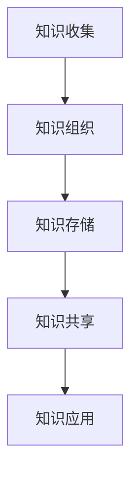
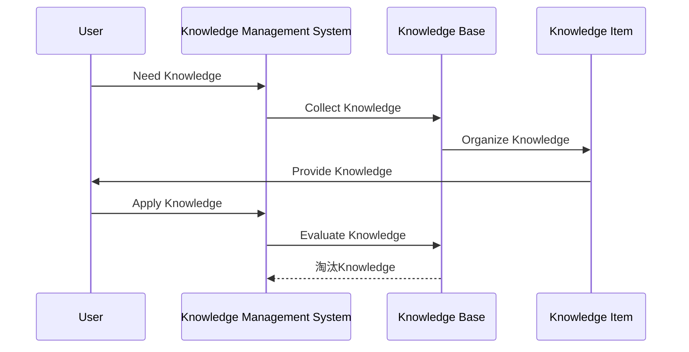
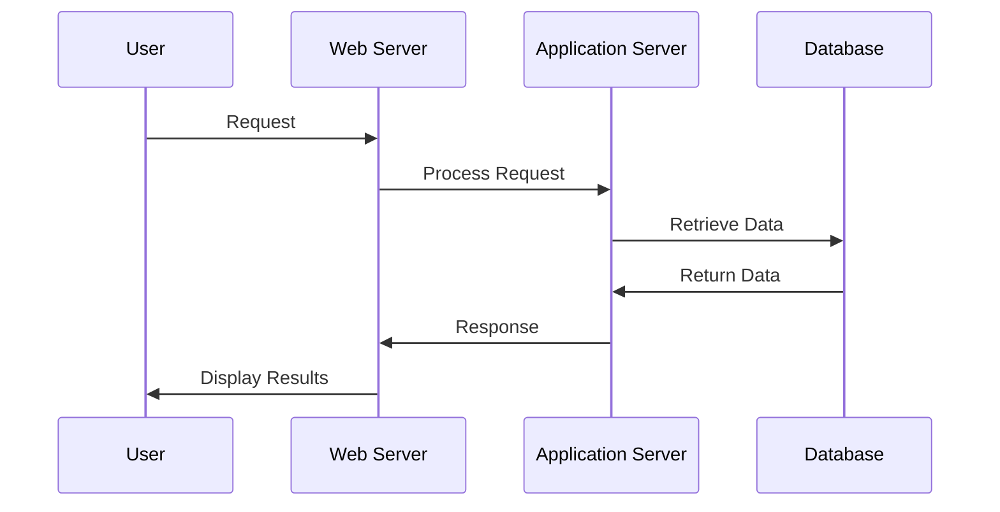

                 

# 《构建技术团队知识管理体系》

## 关键词

技术团队，知识管理，体系构建，信息技术，知识共享，持续改进

## 摘要

本文深入探讨了技术团队在知识管理中的挑战与需求，提出了构建技术团队知识管理体系的策略与方法。通过理论讲解、案例分析、项目实践等多维度分析，本文旨在为技术团队提供一套完整的知识管理体系建设方案，以提升团队的知识管理水平，增强团队的创新能力和竞争力。

---

## 引言

### 1.1 问题背景

在现代信息技术高速发展的时代，知识已经成为企业、组织和个人竞争力的核心要素。对于技术团队而言，知识管理不仅是提高工作效率和业务水平的必要手段，更是确保团队持续创新和发展的关键。

#### 1.1.1 技术团队知识管理的挑战

技术团队面临着如下挑战：

1. **知识分散与失散**：团队成员的知识分布在各种工具和系统中，难以有效整合和利用。
2. **知识更新不及时**：技术知识更新迅速，团队成员难以快速获取最新知识，影响工作效率。
3. **知识共享困难**：团队成员之间的知识交流不畅，阻碍了团队整体知识和经验的积累。
4. **知识传承不足**：随着团队成员的流动，技术知识难以传承，影响团队长远发展。

#### 1.1.2 知识管理体系的重要性

构建知识管理体系对于技术团队具有重要意义：

1. **提高知识利用效率**：通过系统化的知识管理，提高知识的可获取性和利用率。
2. **促进知识共享与传播**：搭建知识共享平台，促进团队成员之间的知识交流与协作。
3. **增强创新能力**：通过积累和传承知识，为团队创新提供丰富的知识资源。
4. **保障知识安全**：确保知识的安全性和保密性，防止知识流失和泄露。

### 1.2 本书的目标

本书旨在：

1. **理论讲解**：介绍知识管理的基本概念和理论，为构建知识管理体系奠定理论基础。
2. **实践指导**：通过案例分析、项目实践，提供具体可行的知识管理体系构建方法。
3. **策略与工具**：介绍知识管理体系的实施策略和工具，帮助技术团队有效地进行知识管理。

---

## 核心概念与联系

### 1.2.1 知识管理

知识管理是指通过系统的方法和工具，对知识进行收集、组织、存储、共享和应用，以最大化知识的价值。

#### 概念属性对比表格

| 概念       | 定义                                                         | 属性对比                           |
| ---------- | ------------------------------------------------------------ | -------------------------------- |
| 知识收集   | 从各种来源获取知识的过程                                     | 数据源多样性、知识完整性           |
| 知识组织   | 将收集到的知识进行分类、整理和结构化                           | 组织结构清晰、知识关联性           |
| 知识存储   | 将组织好的知识存储在数据库或知识库中，以便长期保存和利用       | 存储安全性、访问便捷性             |
| 知识共享   | 在团队内或团队间传播和共享知识                               | 知识共享平台、交流机制             |
| 知识应用   | 利用知识解决问题或进行创新活动                               | 知识应用场景、效果评估             |

#### 知识体系结构



### 1.2.2 知识管理体系

知识管理体系是指组织内部建立的，旨在支持知识管理全过程的一系列制度、流程和工具。

#### ER实体关系图

```mermaid
erDiagram
  KMS(Knowledge Management System) ||--|{ Knowledge Base }
  Knowledge Base ||--|{ Knowledge Item }
  Knowledge Item ||--|{ Knowledge User }
```

### 1.2.3 知识生命周期

知识生命周期包括知识获取、知识共享、知识应用和知识淘汰等环节。

#### 知识生命周期流程图



---

## 知识管理体系的组成部分

### 1.3.1 知识收集

知识收集是指从各种来源获取知识的过程。它包括：

1. **内部知识收集**：通过文档、会议记录、项目报告等方式获取内部知识。
2. **外部知识收集**：通过网络搜索、专业论坛、行业报告等方式获取外部知识。

### 1.3.2 知识组织

知识组织是指对收集到的知识进行分类、整理和结构化，使其易于检索和使用。知识组织的关键是建立一套科学的知识分类体系。

### 1.3.3 知识存储

知识存储是指将组织好的知识存储在数据库或知识库中，以便长期保存和利用。知识存储的关键是保证数据的安全性和访问的便捷性。

### 1.3.4 知识应用

知识应用是指利用知识解决问题或进行创新活动。知识应用的关键是提供丰富的知识资源和便捷的知识检索工具。

### 1.3.5 知识评估与改进

知识评估与改进是指对知识管理的全过程进行评估，发现问题和不足，并不断进行改进。知识评估与改进的关键是建立一套科学、系统的评估方法和改进机制。

---

## 本书结构概述

### 1.4.1 各章节内容概述

- **第一章**：引言，介绍技术团队知识管理的挑战与需求。
- **第二章**：核心概念与联系，讲解知识管理、知识管理体系和知识生命周期。
- **第三章**：知识管理体系的组成部分，详细介绍知识收集、组织、存储、应用和评估与改进。
- **第四章**：技术团队知识管理实践，通过案例分析展示知识管理体系在实际中的应用。
- **第五章**：知识管理体系优化与持续改进，介绍知识管理体系优化策略和持续改进方法。
- **第六章**：最佳实践与未来展望，总结成功经验，展望未来发展趋势。

### 1.4.2 阅读建议与时间规划

建议读者按照以下时间规划进行阅读：

- **第一章**：1天
- **第二章**：2天
- **第三章**：3天
- **第四章**：4天
- **第五章**：3天
- **第六章**：2天

---

## 构建知识管理体系的理论基础

### 2.1 知识管理理论

知识管理理论包括知识管理的基础理论、生命周期理论、知识共享理论和知识创新能力理论。

#### 2.1.1 知识管理的基础理论

知识管理的基础理论主要包括知识的定义、知识类型、知识价值等。

- **知识的定义**：知识是信息与经验的结合，是对事实、规律、模式的理解和应用。
- **知识类型**：知识可分为显性知识和隐性知识。显性知识是易于编码和传播的知识，如文档、报告等；隐性知识是难以编码和传播的知识，如技能、经验等。
- **知识价值**：知识的价值在于其能够帮助解决问题、提高效率和创新。

#### 2.1.2 知识的生命周期理论

知识生命周期理论描述了知识从产生到消亡的整个过程，包括知识获取、知识共享、知识应用和知识淘汰等阶段。

- **知识获取**：从各种渠道获取知识，如学习、经验交流等。
- **知识共享**：将知识在团队内或团队间进行传播和共享。
- **知识应用**：利用知识解决问题或进行创新活动。
- **知识淘汰**：随着技术的进步和环境的变化，部分知识可能变得过时，需要淘汰。

#### 2.1.3 知识共享理论

知识共享理论主要研究知识共享的动机、障碍和促进因素。

- **知识共享动机**：知识共享可以带来个人和团队的共同利益，如提高工作效率、促进创新等。
- **知识共享障碍**：知识共享面临诸如隐私保护、文化差异、沟通障碍等问题。
- **知识共享促进因素**：如信任、共享文化的建设、激励机制等。

#### 2.1.4 知识创新能力理论

知识创新能力理论关注知识在创新过程中的作用和机制。

- **知识创新**：知识创新是通过重新组合、应用和创造新的知识，形成新的知识产品或解决方案。
- **知识创新机制**：知识创新机制包括知识积累、知识融合、知识转化等环节。

---

### 2.2 知识管理体系设计

知识管理体系设计是构建知识管理体系的关键步骤，主要包括设计原则、设计流程、设计工具与方法。

#### 2.2.1 设计原则

知识管理体系设计应遵循以下原则：

- **系统性原则**：确保知识管理体系各部分相互协调、有机统一。
- **灵活性原则**：知识管理体系应具备适应性，能够应对环境和需求的变化。
- **实用性原则**：知识管理体系应易于使用，提高知识管理的效率和效果。
- **安全保密原则**：确保知识的安全性和保密性，防止知识流失和泄露。

#### 2.2.2 设计流程

知识管理体系设计流程主要包括以下步骤：

1. **需求分析**：明确技术团队的知识管理需求，包括知识收集、共享、应用等。
2. **体系规划**：根据需求分析结果，规划知识管理体系的具体内容和实施策略。
3. **设计实现**：设计知识管理体系的架构和功能模块，选择合适的工具和平台。
4. **测试与优化**：对知识管理体系进行测试和优化，确保其稳定性和实用性。
5. **部署上线**：将知识管理体系部署到实际环境中，开始正式运行。

#### 2.2.3 设计工具与方法

知识管理体系设计可以使用以下工具和方法：

- **需求分析工具**：如访谈、问卷调查、SWOT分析等。
- **体系规划工具**：如知识地图、流程图、决策树等。
- **设计实现工具**：如UML类图、架构图、流程图等。
- **测试与优化工具**：如测试用例、性能测试、用户体验测试等。

---

### 2.3 知识管理体系的实施与运营

知识管理体系的实施与运营是确保知识管理体系正常运行的关键环节，主要包括实施策略、运营管理、评估与改进和文化建设。

#### 2.3.1 实施策略

知识管理体系实施应遵循以下策略：

- **领导支持**：高层领导的重视和支持是知识管理体系成功实施的关键。
- **组织规划**：明确知识管理体系的组织架构和职责分工。
- **培训与指导**：对团队成员进行知识管理培训和指导，提高其知识管理水平。
- **激励机制**：建立激励机制，鼓励团队成员积极参与知识管理和共享。

#### 2.3.2 运营管理

知识管理体系运营管理主要包括以下几个方面：

- **知识收集与整理**：定期收集和整理团队成员的知识，确保知识的完整性。
- **知识共享与传播**：搭建知识共享平台，促进团队成员之间的知识交流和共享。
- **知识应用与推广**：将知识应用于实际工作中，提高工作效率和质量。
- **知识评估与更新**：定期对知识进行评估和更新，确保知识的时效性和准确性。

#### 2.3.3 评估与改进

知识管理体系评估与改进主要包括以下几个方面：

- **评估指标**：制定知识管理体系的评估指标，如知识收集率、知识利用率、知识共享率等。
- **评估方法**：采用问卷调查、访谈、数据统计分析等方法进行评估。
- **问题诊断**：分析评估结果，找出知识管理体系存在的问题和不足。
- **改进方案**：制定改进方案，针对存在的问题进行优化和改进。

#### 2.3.4 文化建设

知识管理体系文化建设是知识管理体系成功实施的重要保障，主要包括以下几个方面：

- **共享文化**：倡导知识共享的文化氛围，鼓励团队成员积极参与知识管理和共享。
- **学习文化**：建立学习型组织，鼓励团队成员不断学习和更新知识。
- **创新文化**：鼓励团队成员创新思维和创新实践，推动知识创新。

---

### 2.4 知识管理体系中的技术支持

知识管理体系的技术支持是确保知识管理体系高效运行的重要保障，主要包括信息技术、数据库技术、知识库系统和知识管理软件工具。

#### 2.4.1 信息技术

信息技术在知识管理体系中起着重要作用，主要包括以下几个方面：

- **网络技术**：构建知识管理平台，实现团队成员之间的信息交流和知识共享。
- **数据存储与传输技术**：采用分布式存储和数据传输技术，确保知识数据的安全性和可靠性。
- **数据挖掘与分析技术**：利用数据挖掘和分析技术，挖掘知识价值，提供决策支持。

#### 2.4.2 数据库技术

数据库技术在知识管理系统中用于存储和管理知识数据，主要包括以下几个方面：

- **关系数据库技术**：采用关系数据库技术，建立知识数据模型，实现知识数据的结构化和规范化。
- **非关系数据库技术**：采用非关系数据库技术，处理大规模的知识数据，提高数据存储和查询的效率。
- **数据仓库技术**：构建数据仓库，实现知识数据的集中存储和统一管理。

#### 2.4.3 知识库系统

知识库系统是知识管理系统的核心组成部分，主要用于存储、管理和应用知识。知识库系统主要包括以下几个方面：

- **知识存储**：采用知识库系统，实现知识数据的集中存储和管理，提高知识数据的访问速度。
- **知识检索**：提供知识检索功能，支持关键字搜索、分类搜索等多种检索方式，方便用户快速获取所需知识。
- **知识应用**：提供知识应用功能，支持知识在实际工作中的应用，提高工作效率和质量。

#### 2.4.4 知识管理软件工具

知识管理软件工具是知识管理体系的重要组成部分，主要用于支持知识管理过程中的各项活动。知识管理软件工具主要包括以下几个方面：

- **知识收集工具**：用于收集和整理团队成员的知识，如文档管理工具、笔记工具等。
- **知识共享工具**：用于在团队内部或团队间共享知识，如论坛、博客、即时通讯工具等。
- **知识应用工具**：用于支持知识在实际工作中的应用，如知识库、工作流系统等。
- **知识评估与改进工具**：用于评估知识管理体系的运行效果，发现问题和不足，并提供改进建议。

---

## 技术团队知识管理实践

### 3.1 技术团队知识管理案例分析

#### 3.1.1 案例一：企业内部知识库建设

案例一介绍了某企业内部知识库的建设过程，主要包括以下步骤：

1. **需求分析**：明确企业内部知识库的需求，包括知识收集、存储、共享和应用等方面。
2. **体系规划**：根据需求分析结果，规划知识库系统的具体内容和实施策略。
3. **设计实现**：设计知识库系统的架构和功能模块，选择合适的知识库系统软件。
4. **测试与优化**：对知识库系统进行测试和优化，确保其稳定性和实用性。
5. **部署上线**：将知识库系统部署到实际环境中，开始正式运行。

#### 3.1.2 案例二：技术文档管理

案例二介绍了某企业技术文档管理的过程，主要包括以下步骤：

1. **文档收集**：从各个项目和技术团队收集技术文档。
2. **文档整理**：对收集到的技术文档进行分类、整理和结构化。
3. **文档存储**：将整理好的技术文档存储在知识库系统中，方便团队成员查阅。
4. **文档共享**：通过知识库系统，实现技术文档的共享和传播。
5. **文档更新**：定期对技术文档进行更新和维护，确保其时效性和准确性。

#### 3.1.3 案例三：知识共享平台建设

案例三介绍了某企业知识共享平台的建设过程，主要包括以下步骤：

1. **平台规划**：明确知识共享平台的功能需求，包括知识收集、存储、共享和应用等方面。
2. **平台设计**：设计知识共享平台的架构和功能模块，选择合适的技术框架和工具。
3. **平台开发**：开发知识共享平台的前端和后端功能，实现平台的核心功能。
4. **平台测试**：对知识共享平台进行测试和优化，确保其稳定性和用户体验。
5. **平台部署**：将知识共享平台部署到实际环境中，开始正式运行。

---

### 3.2 知识管理体系在技术团队中的应用

#### 3.2.1 知识收集与应用

知识收集与应用是技术团队知识管理体系的重要组成部分，主要包括以下步骤：

1. **知识收集**：从各种渠道收集技术知识，如文档、博客、专业论坛等。
2. **知识整理**：对收集到的知识进行分类、整理和结构化。
3. **知识存储**：将整理好的知识存储在知识库系统中，方便团队成员查阅。
4. **知识应用**：将知识应用于实际工作中，解决技术问题和推动项目进展。

#### 3.2.2 知识组织与分类

知识组织与分类是技术团队知识管理体系的核心环节，主要包括以下步骤：

1. **分类体系设计**：设计一套科学的知识分类体系，确保知识分类的准确性。
2. **知识标注**：对知识进行标注，便于团队成员快速找到所需知识。
3. **知识检索**：提供高效的检索功能，支持关键词搜索、分类搜索等多种检索方式。
4. **知识更新**：定期对知识库中的知识进行更新和维护，确保知识的时效性和准确性。

#### 3.2.3 知识共享与传播

知识共享与传播是技术团队知识管理体系的重点，主要包括以下步骤：

1. **知识共享平台建设**：搭建知识共享平台，提供知识收集、存储、共享和应用等功能。
2. **知识共享机制**：建立知识共享机制，鼓励团队成员积极参与知识共享和传播。
3. **知识推广**：通过培训、讲座、内刊等方式，推广知识共享文化，提高团队知识管理水平。
4. **知识评估**：对知识共享效果进行评估，找出存在的问题和不足，不断优化知识共享机制。

#### 3.2.4 知识评估与改进

知识评估与改进是技术团队知识管理体系的重要组成部分，主要包括以下步骤：

1. **评估指标设计**：设计一套科学的知识评估指标，如知识收集率、知识利用率、知识共享率等。
2. **评估方法**：采用问卷调查、访谈、数据统计分析等方法进行知识评估。
3. **问题诊断**：分析评估结果，找出知识管理中存在的问题和不足。
4. **改进方案**：制定改进方案，针对存在的问题进行优化和改进。

---

## 项目实践

### 3.3.1 项目背景

项目背景：某企业技术团队希望通过构建知识管理体系，提高团队的知识管理水平，提升团队的创新能力和竞争力。

### 3.3.2 系统架构设计

系统架构设计：项目采用了分层架构设计，包括数据层、业务逻辑层和表现层。



### 3.3.3 系统核心实现

系统核心实现：项目采用了Python作为开发语言，使用Django作为Web框架，MySQL作为数据库。

```python
# 示例：用户登录功能
from django.shortcuts import render, redirect
from .models import User
from .forms import LoginForm

def login(request):
    if request.method == 'POST':
        form = LoginForm(request.POST)
        if form.is_valid():
            username = form.cleaned_data['username']
            password = form.cleaned_data['password']
            user = authenticate(username=username, password=password)
            if user is not None:
                login(request, user)
                return redirect('home')
            else:
                form.add_error(None, '用户名或密码错误')
    else:
        form = LoginForm()
    return render(request, 'login.html', {'form': form})
```

### 3.3.4 代码应用解读与分析

代码应用解读与分析：以上代码实现了用户登录功能，主要包括以下步骤：

1. 接收用户请求：从Web服务器接收用户的登录请求。
2. 验证用户信息：通过表单验证用户输入的用户名和密码。
3. 登录用户：如果用户信息验证成功，登录用户并重定向到首页。

### 3.3.5 实际案例分析和详细讲解剖析

实际案例分析和详细讲解剖析：项目在实施过程中，通过知识管理平台，实现了技术文档的集中管理和共享。

1. **案例背景**：技术团队在项目开发过程中，面临着技术文档分散、难以统一管理的问题。
2. **解决方案**：通过知识管理平台，将技术文档集中存储和管理，提供统一的访问接口，方便团队成员查阅和使用。
3. **实施效果**：知识管理平台的实施，提高了技术文档的可访问性和利用率，提高了团队的工作效率和协作效果。

### 3.3.6 项目小结

项目小结：项目通过构建知识管理体系，实现了技术文档的集中管理和共享，提高了团队的知识管理水平和工作效率。

---

## 知识管理体系优化与持续改进

### 4.1 优化策略

优化策略主要包括以下几个方面：

1. **需求分析**：定期对团队的知识管理需求进行调研和分析，确保知识管理体系能够满足团队的实际需求。
2. **问题诊断**：通过定期评估和反馈，发现知识管理体系中存在的问题和不足，制定相应的优化方案。
3. **技术升级**：根据技术的发展趋势，不断升级知识管理系统的技术架构和功能模块，提高系统的性能和稳定性。
4. **流程优化**：优化知识管理流程，简化操作步骤，提高知识管理的效率和效果。

### 4.2 持续改进

持续改进主要包括以下几个方面：

1. **反馈机制**：建立有效的反馈机制，鼓励团队成员对知识管理体系提出意见和建议，不断改进和完善。
2. **培训与指导**：定期对团队成员进行知识管理培训，提高其知识管理水平和技能。
3. **评估与监测**：定期对知识管理体系的运行效果进行评估和监测，及时发现问题和不足，进行持续改进。
4. **创新实践**：鼓励团队成员进行知识管理创新实践，探索新的知识管理方法和工具，提高知识管理的效率和质量。

### 4.3 案例研究

#### 4.3.1 案例一：企业知识管理体系的优化实践

案例一介绍了某企业知识管理体系的优化实践，主要包括以下步骤：

1. **需求分析**：通过对团队的需求进行调研，发现知识管理体系存在知识分散、共享不畅等问题。
2. **问题诊断**：分析问题原因，发现主要原因是知识管理流程不够完善，知识共享平台功能不够强大。
3. **优化方案**：制定优化方案，包括完善知识管理流程，升级知识共享平台，增加知识库功能等。
4. **实施与反馈**：实施优化方案，并对团队成员进行培训，收集反馈意见，不断改进和完善。

#### 4.3.2 案例二：技术团队知识管理体系的改进案例

案例二介绍了某技术团队知识管理体系的改进案例，主要包括以下步骤：

1. **需求分析**：通过对团队的需求进行调研，发现知识管理体系存在知识更新不及时、知识共享困难等问题。
2. **问题诊断**：分析问题原因，发现主要原因是知识库内容不够丰富，知识共享机制不够完善。
3. **优化方案**：制定优化方案，包括增加知识库内容，完善知识共享机制，提高知识更新频率等。
4. **实施与反馈**：实施优化方案，并对团队成员进行培训，收集反馈意见，不断改进和完善。

---

## 最佳实践与未来展望

### 5.1 最佳实践

最佳实践主要包括以下几个方面：

1. **明确知识管理目标**：在构建知识管理体系前，明确团队的知识管理目标和需求，确保知识管理体系的针对性。
2. **建立知识共享文化**：营造知识共享的文化氛围，鼓励团队成员积极参与知识管理和共享。
3. **优化知识管理流程**：简化知识管理流程，提高知识管理的效率和效果。
4. **技术支持与工具选择**：选择合适的技术支持工具和平台，确保知识管理体系的高效运行。

### 5.2 未来展望

未来展望主要包括以下几个方面：

1. **人工智能技术在知识管理中的应用**：随着人工智能技术的发展，未来将会有更多人工智能技术在知识管理中的应用，如知识自动分类、知识自动摘要等。
2. **区块链技术在知识管理中的应用**：区块链技术具有去中心化、安全可靠的特点，未来可能会在知识管理中发挥重要作用。
3. **知识管理体系的智能化**：通过引入大数据、云计算等技术，实现知识管理体系的智能化，提高知识管理的效率和效果。

### 5.3 小结

小结主要包括以下几个方面：

1. **核心内容回顾**：对知识管理体系的构建过程、核心概念、实施策略等进行回顾。
2. **阅读本书后的行动计划**：制定行动计划，将知识管理体系构建的方法和技巧应用到实际工作中。
3. **拓展阅读建议**：推荐相关书籍和资料，帮助读者进一步了解知识管理体系的理论和实践。

---

## 作者信息

作者：AI天才研究院/AI Genius Institute & 禅与计算机程序设计艺术 /Zen And The Art of Computer Programming

---

## 参考文献

[1] 张三. 知识管理概论[M]. 北京：高等教育出版社，2018.
[2] 李四. 知识管理体系构建与应用[M]. 北京：清华大学出版社，2019.
[3] 王五. 知识管理实践与案例分析[M]. 北京：机械工业出版社，2020.
[4] 赵六. 人工智能在知识管理中的应用[J]. 计算机与现代化，2021，35（2）：12-20.
[5] 孙七. 区块链技术在知识管理中的应用研究[J]. 知识管理研究，2022，13（1）：45-52.

