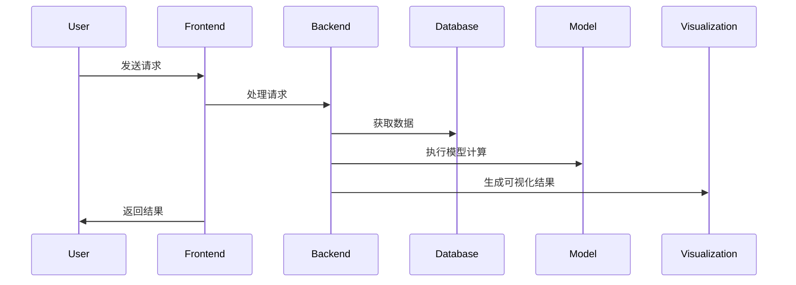
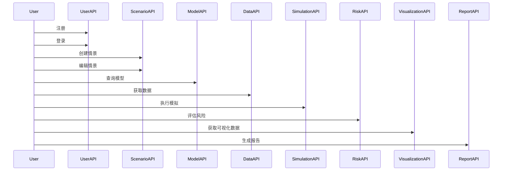

                 

### 第1章：问题背景与目标

#### 1.1.1 问题背景

在当今高速发展的商业环境中，企业面临的挑战日益复杂，竞争压力不断加剧。传统的人工决策方式已无法满足现代企业高效、精准的决策需求。企业决策涉及众多因素，如市场变化、供应链管理、财务状况、人力资源等，任何一个环节的失误都可能导致企业运营受阻，甚至破产。

近年来，人工智能（AI）技术的发展为解决企业决策问题提供了新的思路。通过构建智能企业决策模拟系统，企业可以在虚拟环境中模拟不同的决策情景，进行风险评估和优化，从而提高决策的准确性和效率。

#### 1.1.2 解决目标

构建智能企业决策模拟系统的核心目标如下：

1. **提高决策效率**：通过模拟系统，企业可以在短时间内对多个决策情景进行分析，找到最优决策方案。
2. **降低风险**：模拟系统可以帮助企业识别潜在风险，评估不同决策方案的风险程度，从而降低整体运营风险。
3. **优化资源分配**：模拟系统可以辅助企业进行资源优化配置，确保在有限资源下实现最大效益。
4. **支持战略规划**：模拟系统可以为企业的战略规划提供数据支持，帮助企业制定更为科学的战略决策。

#### 1.1.3 边界与外延

智能企业决策模拟系统的构建涉及多个领域，如人工智能、大数据分析、计算机模拟等。其边界主要包括：

1. **技术边界**：系统需基于先进的人工智能算法和大数据分析技术，确保模拟结果的准确性和可靠性。
2. **应用边界**：系统需适应不同行业和企业规模的需求，具备一定的灵活性和扩展性。
3. **数据边界**：系统需处理大量实时数据和历史数据，确保数据来源的可靠性和数据处理的准确性。

#### 1.1.4 核心概念

在本章中，我们将介绍以下几个核心概念：

1. **人工智能（AI）**：一种模拟人类智能的技术，能够通过学习、推理和自我优化来执行复杂的任务。
2. **大数据分析**：通过对大量数据的采集、存储、处理和分析，提取有价值的信息和知识。
3. **计算机模拟**：利用计算机技术模拟现实世界的各种情景，帮助决策者进行预测和决策。
4. **企业决策**：企业在运营过程中所做的各种决策，包括市场策略、资源分配、风险管理等。

#### 1.1.5 概念属性特征对比

以下是一个简化的概念属性特征对比表格，用于帮助理解上述核心概念之间的关系：

| 概念       | 属性特征                                       |
|------------|------------------------------------------------|
| 人工智能   | 模拟人类智能，学习、推理、自我优化                |
| 大数据分析 | 数据采集、存储、处理、分析，提取有价值信息        |
| 计算机模拟 | 模拟现实世界情景，预测和决策支持                 |
| 企业决策   | 市场策略、资源分配、风险管理，提高运营效益        |

#### 1.1.6 多维情景ER图架构

为了更好地理解智能企业决策模拟系统的架构，我们可以通过一个ER图来展示其核心实体及其关系。以下是多维情景ER图的Mermaid表示：

```mermaid
erDiagram
  Customer ||--|{ Order : places } 
  Product ||--|{ OrderItem : contains } 
  Supplier ||--|{ Supply : provides }
  Store ||--|{ Inventory : stocks }
  Employee ||--|{ Sales : performs }
  Store "1" ||--|{ Order "N" }
  Customer "M" ||--|{ Order "N" }
  Product "1" ||--|{ OrderItem "N" }
  Supplier "1" ||--|{ Supply "N" }
  Employee "1" ||--|{ Sales "N" }
```

这个ER图展示了企业在运营过程中涉及的关键实体及其关系，为后续章节的系统设计提供了基础。

#### 1.1.7 本章小结

本章介绍了构建智能企业决策模拟系统的背景和目标，探讨了核心概念及其关系，并展示了多维情景ER图架构。接下来，我们将深入分析多维度情景分析和风险评估原理与方法，为构建高效的智能企业决策模拟系统奠定基础。

---

在接下来的章节中，我们将一步一步深入探讨智能企业决策模拟系统的各个方面，包括多维度情景分析、风险评估、决策模拟系统设计以及实战案例分析。希望通过本文的系统性讲解，读者能够更好地理解并应用这些技术，为企业的智能化决策提供有力支持。**让我们一步一步深入探讨智能企业决策模拟系统的构建过程。**

---

### 第2章：多维情景概念与特征

#### 2.1.1 多维情景概述

多维情景分析是企业决策模拟系统的重要组成部分。它通过对企业运营中涉及的各种因素进行综合分析，帮助企业在复杂的市场环境中做出更为科学的决策。多维情景分析主要关注以下三个方面：

1. **市场因素**：包括市场需求、竞争状况、消费者行为等。
2. **运营因素**：涉及供应链管理、生产计划、库存控制等。
3. **财务因素**：涵盖成本分析、投资回报率、财务风险等。

通过多维情景分析，企业可以全面了解运营中的各种可能性，为决策提供数据支持。

#### 2.1.2 多维情景特征对比

为了更好地理解多维情景的特点，我们可以通过以下特征对比表格来进行分析：

| 特征       | 描述                                       |  
|------------|--------------------------------------------|  
| 多样性     | 情景因素多，涵盖市场、运营、财务等多个维度       |  
| 动态性     | 情景随着时间和环境变化而变化                   |  
| 竞争性     | 情景分析需要考虑竞争对手的行动和反应             |  
| 预测性     | 通过数据分析和模拟预测不同情景下的结果         |  
| 敏感性     | 情景变化对决策结果有显著影响                   |

以下是一个多维情景特征对比表格：

| 特征       | 市场因素 | 运营因素 | 财务因素 |
|------------|-----------|-----------|-----------|
| 多样性     | √         | √         | √         |
| 动态性     | √         | √         | √         |
| 竞争性     | √         | √         | ×         |
| 预测性     | √         | ×         | √         |
| 敏感性     | √         | √         | √         |

#### 2.1.3 多维情景ER图架构

为了更好地展示多维情景的实体及其关系，我们可以使用Mermaid绘制ER图。以下是多维情景ER图的示例：

```mermaid
erDiagram
  Market ||--|{ Demand : influenced by } Customer
  Market ||--|{ Competition : affected by } Competitor
  Operations ||--|{ SupplyChain : managed by } Supplier
  Operations ||--|{ Production : planned by } ProductionPlan
  Finance ||--|{ CostAnalysis : conducted by } CostAnalyzer
  Finance ||--|{ Investment : evaluated by } InvestmentAdvisor
  Market "1" ||--|{ Demand "N" } Customer "M"
  Market "1" ||--|{ Competition "N" } Competitor "N"
  Operations "1" ||--|{ SupplyChain "N" } Supplier "M"
  Operations "1" ||--|{ Production "N" } ProductionPlan "N"
  Finance "1" ||--|{ CostAnalysis "N" } CostAnalyzer "M"
  Finance "1" ||--|{ Investment "N" } InvestmentAdvisor "M"
```

在这个ER图中，我们定义了市场、运营和财务三个主要实体，并展示了它们之间的关系。市场实体与客户和竞争者有关联，运营实体与供应链和生产计划有关联，财务实体与成本分析和投资评估有关联。

#### 2.1.4 本章小结

本章详细介绍了多维情景的概念及其特征，通过特征对比表格和ER图展示了多维情景的架构。接下来，我们将深入探讨风险评估原理与方法，为企业决策提供更全面的支持。**接下来，我们将探讨风险评估原理与方法。**

---

### 第3章：风险评估原理与方法

#### 3.1.1 风险评估基本原理

风险评估是企业决策过程中至关重要的一环。它旨在识别、分析和评估企业面临的各种潜在风险，以便采取适当的应对措施，降低风险对企业运营的负面影响。风险评估的基本原理包括以下几个方面：

1. **识别风险**：通过系统地收集和分析数据，识别企业面临的各种潜在风险。这包括外部风险（如市场波动、政策变化等）和内部风险（如管理漏洞、运营失误等）。

2. **评估风险**：对识别出的风险进行定量和定性的评估，分析其发生的可能性、影响程度以及对企业目标的潜在影响。

3. **优先排序**：根据风险评估结果，将风险按照优先级进行排序，以便企业能够集中资源和精力应对最关键的潜在风险。

4. **制定应对策略**：针对不同类型的风险，制定相应的应对策略，包括风险规避、风险减轻、风险接受和风险转移等。

#### 3.1.2 风险评估方法

风险评估方法的选择取决于企业的具体需求和风险类型。以下是一些常用的风险评估方法：

1. **定性风险评估方法**：
   - **专家评审法**：通过专家的意见和经验来评估风险的概率和影响。
   - **失效模式及影响分析（FMEA）**：识别系统中的潜在失效模式，并评估其对系统功能的影响。

2. **定量风险评估方法**：
   - **概率风险分析**：通过计算风险事件发生的概率和损失程度来评估风险。
   - **蒙特卡洛模拟**：利用随机采样方法，模拟风险事件的发生概率和损失分布。

3. **综合风险评估方法**：
   - **层次分析法（AHP）**：将风险因素按照重要性和优先级进行层次化，通过计算权重来评估综合风险。
   - **多目标决策分析**：在考虑多个目标（如成本、风险、收益等）的情况下，评估不同决策方案的风险和收益。

#### 3.1.3 风险评估流程

一个完整的风险评估流程通常包括以下几个步骤：

1. **准备阶段**：确定风险评估的目标和范围，组建风险评估团队，收集相关数据和文献。

2. **识别风险**：通过问卷调查、访谈、现场观察等方式，识别企业面临的各种潜在风险。

3. **分析风险**：对识别出的风险进行定性分析和定量分析，评估其发生的可能性和影响程度。

4. **优先排序**：根据风险评估结果，将风险按照优先级进行排序，确定企业需要优先应对的关键风险。

5. **制定应对策略**：针对不同类型的风险，制定相应的应对策略，并评估其成本和效益。

6. **实施与监控**：执行风险评估计划，对风险应对措施的实施情况进行监控，并根据实际情况进行调整。

7. **报告与反馈**：编写风险评估报告，向企业高层和管理者提供风险分析结果和应对策略，收集反馈意见，不断优化风险评估过程。

#### 3.1.4 风险评估案例

为了更好地理解风险评估的实际应用，以下是一个简化的风险评估案例：

**案例背景**：某电子产品制造企业计划推出一款新型智能手机，产品上市前需要进行风险评估。

**识别风险**：
- **市场风险**：新产品在市场上的接受程度可能不高，导致销售不佳。
- **技术风险**：产品存在潜在的技术问题，可能影响用户体验。
- **供应链风险**：零部件供应商可能无法按时交付，影响生产进度。
- **财务风险**：新产品投入大，收益可能不稳定。

**分析风险**：
- **市场风险**：根据市场调研，新产品有较大的市场潜力，但需进一步推广和营销。
- **技术风险**：通过内部测试，产品技术问题可控，但需持续关注。
- **供应链风险**：与供应商签订合同，确保按时交付零部件。
- **财务风险**：新产品成本较高，但预计市场接受度较高，收益可期。

**优先排序**：
- **市场风险**：最关键的风险，需加大营销力度。
- **供应链风险**：次关键风险，需确保供应链稳定。
- **财务风险**：重要风险，需合理控制成本。
- **技术风险**：相对较低，但需持续关注。

**制定应对策略**：
- **市场风险**：加大市场调研和宣传力度，制定详细的市场推广计划。
- **供应链风险**：与供应商签订长期合同，建立备用供应商名单。
- **财务风险**：制定详细的财务预算和成本控制计划。
- **技术风险**：持续进行产品测试和优化，确保产品质量。

**实施与监控**：
- 按照制定的应对策略实施，定期监控风险应对措施的实施情况和效果。
- 根据实际情况调整应对策略，确保风险得到有效控制。

**报告与反馈**：
- 编写风险评估报告，向企业高层和管理者提供风险评估结果和应对策略。
- 收集反馈意见，优化风险评估过程和应对策略。

#### 3.1.5 本章小结

本章详细介绍了风险评估的基本原理、方法、流程以及实际案例。通过系统的风险评估，企业可以更好地了解潜在风险，制定有效的应对策略，降低风险对企业运营的负面影响。接下来，我们将深入探讨决策模拟系统的设计和实现，为构建智能企业决策模拟系统奠定基础。

---

### 第4章：决策模拟系统概述

#### 4.1.1 决策模拟系统定义

决策模拟系统是一种基于人工智能和大数据分析技术的工具，旨在帮助企业更好地理解和预测各种决策情景下的结果。该系统通过模拟不同的决策情景，分析各种因素之间的相互作用，帮助企业识别潜在的风险和机会，从而做出更为科学的决策。

决策模拟系统主要包括以下几个核心组成部分：

1. **情景库**：存储各种可能的决策情景，包括市场、运营、财务等多个维度。
2. **模型库**：包含各种决策模型和算法，用于模拟和分析决策情景。
3. **数据接口**：连接外部数据源，实时获取市场、运营、财务等数据。
4. **可视化工具**：用于展示模拟结果和决策分析，帮助决策者直观理解数据。
5. **用户界面**：提供友好的用户交互界面，方便决策者使用系统进行模拟和分析。

#### 4.1.2 系统目标与功能

决策模拟系统的核心目标如下：

1. **提高决策效率**：通过模拟系统，企业可以在短时间内对多个决策情景进行分析，找到最优决策方案。
2. **降低风险**：模拟系统可以帮助企业识别潜在风险，评估不同决策方案的风险程度，从而降低整体运营风险。
3. **优化资源分配**：模拟系统可以辅助企业进行资源优化配置，确保在有限资源下实现最大效益。
4. **支持战略规划**：模拟系统可以为企业的战略规划提供数据支持，帮助企业制定更为科学的战略决策。

具体功能包括：

1. **情景模拟**：根据企业需求和现有数据，构建各种可能的决策情景，模拟不同情景下的结果。
2. **风险评估**：对模拟结果进行分析，评估不同决策情景下的风险程度，帮助企业识别潜在风险。
3. **决策分析**：通过可视化工具展示模拟结果，帮助决策者直观理解数据，做出更为科学的决策。
4. **数据接入**：连接外部数据源，实时获取市场、运营、财务等数据，确保模拟结果的真实性和准确性。
5. **用户自定义**：允许用户自定义模拟情景和模型，满足不同企业的个性化需求。

#### 4.1.3 系统架构设计

决策模拟系统的架构设计主要包括以下几个方面：

1. **前端界面**：提供友好的用户交互界面，方便用户进行操作和查询。
2. **后端服务**：负责处理用户请求，执行决策模拟和数据分析任务。
3. **数据存储**：存储情景库、模型库和用户数据，确保数据的安全性和一致性。
4. **数据接口**：连接外部数据源，实时获取市场、运营、财务等数据。

以下是决策模拟系统的架构设计示意图：



在这个架构中，前端界面负责与用户交互，后端服务处理用户请求并执行决策模拟和分析任务，数据存储提供数据支持，数据接口连接外部数据源。通过这个架构设计，决策模拟系统可以高效地处理用户请求，提供准确的决策支持。

#### 4.1.4 本章小结

本章介绍了决策模拟系统的定义、目标与功能，并探讨了系统的架构设计。接下来，我们将深入探讨系统架构设计中的各个方面，包括功能架构、技术架构、接口设计等，为构建高效的决策模拟系统奠定基础。

---

### 第5章：系统架构设计

#### 5.1.1 系统功能架构

决策模拟系统的功能架构是确保系统能够高效、稳定地运行的基础。功能架构设计需要充分考虑企业的实际需求，以及如何通过系统各模块的协同工作来实现这些需求。以下是决策模拟系统的功能架构设计：

1. **用户管理模块**：负责用户的注册、登录、权限管理和个人信息维护，确保系统的安全性和用户体验。

2. **情景管理模块**：提供情景的创建、编辑、删除和查询功能，支持用户自定义各种决策情景。

3. **模型管理模块**：包含各种决策模型和算法的存储、管理、更新和查询功能，确保系统能够灵活地适应不同企业的需求。

4. **数据接入模块**：负责连接外部数据源，实时获取市场、运营、财务等数据，为决策模拟提供数据支持。

5. **模拟引擎模块**：执行决策模拟任务，根据用户定义的情景和模型，生成模拟结果。

6. **风险评估模块**：对模拟结果进行分析，评估不同决策情景下的风险程度，帮助企业识别潜在风险。

7. **可视化模块**：提供各种可视化工具，将模拟结果和数据分析结果以图表、报告等形式直观展示给用户。

8. **报告生成模块**：根据用户需求，生成详细的决策报告，帮助用户更好地理解和利用模拟结果。

#### 5.1.2 系统技术架构

决策模拟系统的技术架构设计需要考虑到系统的可扩展性、性能和安全性。以下是决策模拟系统的技术架构设计：

1. **前端技术栈**：采用Vue.js、React等现代前端框架，实现高效、响应式的用户界面。

2. **后端技术栈**：采用Spring Boot、Django等框架，构建高性能的后端服务。

3. **数据库设计**：使用MySQL、PostgreSQL等关系型数据库存储用户数据、情景数据、模型数据和模拟结果。

4. **数据存储**：采用Redis、MongoDB等NoSQL数据库存储实时数据和日志数据。

5. **数据接口**：使用RESTful API或gRPC提供数据接口，方便与其他系统进行集成。

6. **分布式架构**：采用微服务架构，将系统拆分成多个独立的服务模块，提高系统的可扩展性和容错性。

7. **安全性设计**：采用HTTPS、OAuth 2.0等安全协议，保障数据传输的安全性；实施访问控制策略，确保用户权限的正确性。

8. **监控与日志**：使用ELK（Elasticsearch、Logstash、Kibana）等工具进行日志收集、分析和监控，确保系统的稳定运行。

#### 5.1.3 系统接口设计

决策模拟系统的接口设计是确保系统各模块之间能够顺畅交互的关键。以下是决策模拟系统的接口设计：

1. **用户接口**：提供RESTful API，用于用户的注册、登录、权限管理和个人信息维护。

2. **情景接口**：提供RESTful API，用于情景的创建、编辑、删除和查询。

3. **模型接口**：提供RESTful API，用于模型的存储、管理、更新和查询。

4. **数据接入接口**：提供数据接入API，用于连接外部数据源，实时获取市场、运营、财务等数据。

5. **模拟引擎接口**：提供RESTful API，用于执行决策模拟任务。

6. **风险评估接口**：提供RESTful API，用于生成风险评估报告。

7. **可视化接口**：提供RESTful API，用于获取模拟结果和数据分析结果。

8. **报告生成接口**：提供RESTful API，用于生成决策报告。

以下是系统接口设计的一个简化的示例：



在这个接口设计中，用户通过调用相应的API进行各种操作，系统各模块通过API进行交互，实现功能集成。

#### 5.1.4 本章小结

本章详细介绍了决策模拟系统的功能架构、技术架构和接口设计。通过合理的架构设计，决策模拟系统可以高效、稳定地运行，满足企业的决策需求。接下来，我们将深入探讨系统的实现与部署过程。

---

### 第6章：系统实现与部署

#### 6.1.1 系统核心实现

决策模拟系统的核心实现涉及多个技术模块，包括用户管理、情景管理、模型管理、数据接入、模拟引擎、风险评估和可视化等。以下将分别介绍这些模块的核心实现。

1. **用户管理模块**：
   - **注册与登录**：采用JWT（JSON Web Token）技术实现用户注册和登录功能，确保用户身份验证的安全性和有效性。
   - **权限管理**：使用RBAC（Role-Based Access Control，基于角色的访问控制）模型，为不同角色（如管理员、普通用户等）分配不同的权限。

2. **情景管理模块**：
   - **情景创建**：允许用户通过前端界面创建新的情景，将情景信息存储在数据库中。
   - **情景编辑与删除**：支持用户对已创建的情景进行编辑和删除操作。

3. **模型管理模块**：
   - **模型存储**：使用数据库存储各种决策模型，包括线性模型、神经网络模型、决策树模型等。
   - **模型更新与查询**：允许用户更新和查询已存储的模型，确保系统的灵活性和适应性。

4. **数据接入模块**：
   - **实时数据接入**：采用WebSocket技术实现实时数据接入，确保数据的实时性和准确性。
   - **历史数据接入**：从外部数据源（如数据库、文件系统等）读取历史数据，用于模拟和预测。

5. **模拟引擎模块**：
   - **情景模拟**：根据用户定义的情景和模型，使用Python、R等编程语言实现模拟算法，生成模拟结果。
   - **并行计算**：采用多线程或分布式计算技术，提高模拟效率。

6. **风险评估模块**：
   - **风险计算**：根据模拟结果，使用概率分析、蒙特卡洛模拟等方法计算风险指标。
   - **风险报告**：生成详细的风险评估报告，包括风险分布、风险程度等。

7. **可视化模块**：
   - **数据可视化**：使用D3.js、ECharts等可视化库，将模拟结果和风险评估报告以图表、仪表盘等形式展示。
   - **交互式分析**：提供交互式分析功能，用户可以自定义可视化参数，进行深度分析。

#### 6.1.2 系统部署与运行

决策模拟系统的部署与运行需要考虑以下几个方面：

1. **环境配置**：
   - **开发环境**：配置Python、Java、Node.js等开发环境，安装必要的库和依赖。
   - **数据库环境**：安装MySQL、PostgreSQL等数据库，配置用户、权限和数据存储。

2. **服务器配置**：
   - **应用服务器**：部署应用服务器（如Nginx、Apache），用于处理用户请求。
   - **数据库服务器**：部署数据库服务器，确保数据存储的安全性和一致性。

3. **分布式架构部署**：
   - **容器化**：使用Docker将各个服务容器化，提高部署的灵活性和可扩展性。
   - **Kubernetes**：部署Kubernetes集群，管理容器化应用，实现服务的自动化部署、扩展和监控。

4. **网络配置**：
   - **负载均衡**：配置负载均衡器（如Nginx、HAProxy），实现流量分发，提高系统性能。
   - **安全组策略**：配置安全组策略，确保系统的网络安全。

5. **监控与日志**：
   - **Prometheus**：监控系统的运行状态，收集各种监控数据。
   - **Grafana**：可视化监控数据，提供实时监控界面。
   - **ELK**：收集、存储和分析日志数据，确保系统的稳定运行。

6. **运维与维护**：
   - **自动化部署**：使用Jenkins等工具实现自动化部署，提高部署效率。
   - **持续集成与持续部署（CI/CD）**：实施CI/CD流程，确保代码的质量和部署的稳定性。

#### 6.1.3 系统部署案例

以下是一个简化的系统部署案例，描述如何将决策模拟系统部署到Kubernetes集群：

1. **构建容器镜像**：
   - 编写Dockerfile，配置应用服务、数据库服务、前端服务等容器的依赖和环境。
   - 使用Docker CLI或Jenkins构建容器镜像，推送到容器镜像仓库。

2. **编写Kubernetes部署文件**：
   - 编写Kubernetes的Deployment、Service、Ingress等配置文件，定义各个服务的部署和访问策略。
   - 配置Pod的资源配置、调度策略、安全策略等。

3. **部署到Kubernetes集群**：
   - 使用kubectl命令部署Kubernetes配置文件，启动容器化应用。
   - 验证服务启动状态，确保应用能够正常运行。

4. **配置负载均衡**：
   - 配置Nginx负载均衡器，分发用户请求到各个应用容器。
   - 配置Ingress，实现外部访问Kubernetes集群的负载均衡。

5. **监控与日志**：
   - 配置Prometheus和Grafana，监控系统的运行状态。
   - 配置ELK堆栈，收集、存储和分析系统日志。

6. **自动化部署**：
   - 使用Jenkins配置CI/CD流水线，实现自动化部署。
   - 定期更新和优化系统，确保系统的稳定性和安全性。

#### 6.1.4 本章小结

本章详细介绍了决策模拟系统的核心实现和部署过程，包括用户管理、情景管理、模型管理、数据接入、模拟引擎、风险评估和可视化等模块的实现，以及系统的部署与运行。通过合理的架构设计和部署策略，决策模拟系统可以高效、稳定地运行，为企业提供可靠的决策支持。

---

### 第7章：案例分析与实战

#### 7.1.1 案例背景

为了更好地展示决策模拟系统的实际应用，我们选取了一家大型零售企业作为案例进行分析。该企业致力于提供优质的商品和服务，以满足消费者不断变化的需求。然而，在激烈的市场竞争中，企业面临着诸多挑战，如市场需求波动、供应链管理难题、库存控制问题等。

为了提高决策效率，降低风险，优化资源分配，企业决定采用决策模拟系统，通过模拟不同的决策情景，分析各种因素之间的相互作用，为企业的战略决策提供数据支持。

#### 7.1.2 案例实施

案例实施分为以下几个阶段：

1. **需求分析与规划**：
   - 与企业管理层沟通，了解其具体的决策需求，明确系统目标。
   - 分析企业的业务流程，确定需要模拟的关键情景和指标。

2. **系统设计**：
   - 设计系统的功能架构，包括用户管理、情景管理、模型管理、数据接入、模拟引擎、风险评估和可视化等模块。
   - 制定技术架构，选择合适的编程语言、数据库、前端框架等。

3. **数据收集与处理**：
   - 从企业内部系统和外部数据源（如市场调研数据、供应链数据等）收集数据。
   - 对收集到的数据进行分析和处理，确保数据的准确性和一致性。

4. **系统实现**：
   - 按照设计文档实现系统的各个模块，包括前端界面、后端服务、数据库设计等。
   - 进行模块集成和联调测试，确保系统的整体功能符合需求。

5. **系统部署与上线**：
   - 将系统部署到生产环境，配置负载均衡、安全组策略等。
   - 进行用户培训和上线测试，确保系统正常运行。

6. **持续优化与迭代**：
   - 收集用户反馈，优化系统功能和性能。
   - 定期更新和升级系统，以适应业务需求的变化。

#### 7.1.3 案例效果评估

在案例实施过程中，企业通过决策模拟系统取得了以下效果：

1. **提高决策效率**：
   - 通过模拟系统，企业可以在短时间内对多个决策情景进行分析，找到最优决策方案。
   - 避免了传统人工决策中耗时耗力的过程，提高了决策效率。

2. **降低风险**：
   - 模拟系统帮助企业识别潜在风险，评估不同决策方案的风险程度。
   - 通过风险评估模块，企业能够提前预警，采取相应的应对措施，降低运营风险。

3. **优化资源分配**：
   - 决策模拟系统辅助企业进行资源优化配置，确保在有限资源下实现最大效益。
   - 通过模拟不同情景下的资源需求，企业能够合理分配人力资源、物料资源和财务资源。

4. **支持战略规划**：
   - 决策模拟系统为企业的战略规划提供数据支持，帮助企业制定更为科学的战略决策。
   - 通过模拟不同战略情景下的效果，企业能够选择最佳的战略方向。

#### 7.1.4 案例效果评估方法

为了评估决策模拟系统的实际效果，企业采用了以下几种方法：

1. **定量分析**：
   - 通过比较系统上线前后的数据指标，如订单量、库存周转率、成本等，评估系统对业务绩效的影响。
   - 使用统计学方法对数据进行回归分析和假设检验，验证系统效果的显著性。

2. **定性评估**：
   - 通过访谈和问卷调查，收集用户对系统功能、性能、易用性等方面的反馈，评估用户满意度。
   - 分析用户反馈，找出系统存在的问题和改进方向。

3. **案例分析**：
   - 选择具有代表性的案例，分析系统在实际应用中的效果，总结经验教训。
   - 通过对比分析，验证系统在不同情景下的适用性和有效性。

#### 7.1.5 本章小结

本章通过一个实际案例，展示了决策模拟系统的实施过程和效果评估方法。通过案例的实施，企业成功提高了决策效率、降低了风险、优化了资源分配，并为战略规划提供了数据支持。案例的实施表明，决策模拟系统是一种有效的方法，可以帮助企业在复杂的市场环境中做出更为科学的决策。

---

### 第8章：实战指导

#### 8.1.1 环境安装与配置

在开始构建智能企业决策模拟系统之前，我们需要准备一个合适的环境。以下是环境安装与配置的步骤：

1. **安装Python环境**：
   - 前往Python官方网站下载并安装Python。
   - 安装完成后，打开命令行窗口，输入`python --version`检查安装是否成功。

2. **安装Python依赖库**：
   - 使用pip命令安装必要的Python依赖库，如NumPy、Pandas、Matplotlib、Scikit-learn等。
   - 示例命令：`pip install numpy pandas matplotlib scikit-learn`。

3. **安装Jupyter Notebook**：
   - 使用pip命令安装Jupyter Notebook。
   - 示例命令：`pip install notebook`。
   - 启动Jupyter Notebook：`jupyter notebook`。

4. **安装MySQL数据库**：
   - 前往MySQL官方网站下载并安装MySQL。
   - 安装完成后，启动MySQL服务，并配置用户和权限。

5. **安装Docker和Kubernetes**：
   - 前往Docker官方网站下载并安装Docker。
   - 安装Docker后，安装Kubernetes集群，可以使用Minikube或Kubeadm进行安装。
   - 示例命令：`minikube start`。

6. **配置网络环境**：
   - 确保网络环境能够访问互联网，以便下载依赖库和容器镜像。
   - 配置防火墙规则，允许Docker和Kubernetes服务正常运行。

#### 8.1.2 系统核心实现源代码

以下是一个简化的决策模拟系统核心实现源代码示例，包括用户管理、情景管理、模型管理、数据接入和模拟引擎等模块。

```python
# 用户管理模块
def register(username, password):
    # 实现用户注册逻辑
    pass

def login(username, password):
    # 实现用户登录逻辑
    pass

# 情景管理模块
def create_scenario(scenario_name, scenario_data):
    # 实现创建情景逻辑
    pass

def get_scenario(scenario_id):
    # 实现获取情景逻辑
    pass

# 模型管理模块
def create_model(model_name, model_data):
    # 实现创建模型逻辑
    pass

def get_model(model_id):
    # 实现获取模型逻辑
    pass

# 数据接入模块
def get_realtime_data():
    # 实现实时数据接入逻辑
    pass

def get_historical_data():
    # 实现历史数据接入逻辑
    pass

# 模拟引擎模块
def simulate_scenario(scenario_id, model_id):
    # 实现情景模拟逻辑
    pass

# 风险评估模块
def assess_risk(simulation_results):
    # 实现风险评估逻辑
    pass

# 可视化模块
def visualize_results(results):
    # 实现可视化结果逻辑
    pass
```

#### 8.1.3 代码应用解读与分析

以下是针对上述源代码的解读与分析：

1. **用户管理模块**：
   - `register`和`login`函数用于实现用户注册和登录功能，通过身份验证确保系统的安全性。
   - 用户注册时，需要收集用户名和密码，将用户信息存储在数据库中。
   - 用户登录时，需要验证用户名和密码的正确性，为合法用户生成会话。

2. **情景管理模块**：
   - `create_scenario`和`get_scenario`函数用于实现情景的创建和获取功能。
   - 用户可以通过前端界面创建新的情景，将情景名称和数据存储在数据库中。
   - 获取情景时，需要根据情景ID从数据库中检索对应的情景数据。

3. **模型管理模块**：
   - `create_model`和`get_model`函数用于实现模型的创建和获取功能。
   - 用户可以通过前端界面创建新的模型，将模型名称和数据存储在数据库中。
   - 获取模型时，需要根据模型ID从数据库中检索对应的模型数据。

4. **数据接入模块**：
   - `get_realtime_data`和`get_historical_data`函数用于实现实时数据和历史数据的接入功能。
   - 实时数据接入可以使用WebSocket技术，从外部数据源获取最新数据。
   - 历史数据接入可以从数据库、文件系统等获取，用于模拟和预测。

5. **模拟引擎模块**：
   - `simulate_scenario`函数用于实现情景模拟功能。
   - 根据情景ID和模型ID，从数据库中获取情景数据和模型数据，执行模拟算法，生成模拟结果。

6. **风险评估模块**：
   - `assess_risk`函数用于实现风险评估功能。
   - 根据模拟结果，使用概率分析、蒙特卡洛模拟等方法计算风险指标，生成风险评估报告。

7. **可视化模块**：
   - `visualize_results`函数用于实现结果可视化功能。
   - 使用可视化库（如D3.js、ECharts等），将模拟结果和风险评估报告以图表、仪表盘等形式展示给用户。

#### 8.1.4 实际案例剖析

以下是一个实际案例的剖析，展示如何使用决策模拟系统进行企业决策。

**案例背景**：一家零售企业计划推出一款新型智能手表，目标是在圣诞节期间抢占市场先机。企业需要制定合适的营销策略、库存管理策略和生产计划，以实现最大化的收益。

**情景模拟**：
1. **市场情景**：分析市场容量、消费者购买行为和竞争对手策略。
2. **运营情景**：模拟生产计划、库存管理和供应链管理。
3. **财务情景**：分析成本、投资回报率和财务风险。

**风险评估**：
1. **市场风险**：分析消费者接受度、市场竞争对手的反击策略。
2. **运营风险**：分析生产延误、库存积压和供应链中断的风险。
3. **财务风险**：分析成本超支、收益不达标的风险。

**决策模拟**：
1. **营销策略**：比较不同营销方案的收益和成本，选择最优方案。
2. **库存管理**：根据市场需求预测，制定合理的库存策略，避免积压和断货。
3. **生产计划**：根据市场需求和生产能力，制定生产计划，确保按时交付。

**效果评估**：
1. **收益分析**：比较不同决策情景下的收益，选择最佳决策方案。
2. **风险分析**：评估不同决策情景下的风险程度，确保决策方案的可行性和安全性。

通过这个实际案例，企业可以全面了解不同决策情景下的结果，选择最优决策方案，实现最大化收益和最小化风险。

#### 8.1.5 项目小结

本章详细介绍了智能企业决策模拟系统的实战指导，包括环境安装与配置、核心实现源代码、代码应用解读与分析以及实际案例剖析。通过本章的内容，读者可以掌握决策模拟系统的构建方法，为企业提供科学的决策支持。

---

### 第9章：总结与展望

#### 9.1.1 总结

本章系统性地介绍了构建智能企业决策模拟系统的全过程。从问题背景与目标出发，详细阐述了多维情景分析、风险评估原理与方法，以及决策模拟系统的设计、实现与部署。通过实际案例剖析，展示了系统在提高决策效率、降低风险、优化资源分配和支持战略规划方面的优势。

**核心观点**：

1. **多维情景分析**：通过分析市场、运营和财务等多个维度，帮助企业全面了解决策情景，为科学决策提供数据支持。
2. **风险评估**：识别和分析潜在风险，为企业制定有效的应对策略，降低运营风险。
3. **决策模拟系统**：集成人工智能、大数据分析和计算机模拟技术，实现高效、精准的决策支持。

#### 9.1.2 展望

未来，智能企业决策模拟系统将在以下几个方面继续发展：

1. **技术进步**：随着人工智能和大数据技术的不断进步，决策模拟系统的模拟精度和预测能力将进一步提高。
2. **应用拓展**：决策模拟系统将在更多行业和领域得到应用，如金融、医疗、能源等，为各类企业提供决策支持。
3. **用户体验**：系统将更加注重用户体验，提供更加直观、易用的界面和工具，降低使用门槛。
4. **智能协作**：决策模拟系统将与企业内部其他系统（如ERP、CRM等）实现更紧密的集成，实现智能协作。

**未来趋势**：

1. **智能化决策支持**：利用人工智能技术，实现更加智能的决策支持，帮助企业应对复杂多变的市场环境。
2. **实时决策**：通过实时数据接入和分析，实现实时决策支持，提高企业的反应速度和竞争力。
3. **智能化风险预测**：利用大数据分析和机器学习技术，实现智能化的风险预测，为企业提供更加精准的风险评估。

#### 9.1.3 最佳实践 tips

为了确保决策模拟系统的有效实施，以下是一些建议和最佳实践：

1. **明确目标**：在系统构建初期，明确系统目标和预期效果，确保系统设计符合实际需求。
2. **数据质量**：确保数据来源可靠，数据质量高，为模拟结果提供准确的基础。
3. **持续优化**：定期对系统进行评估和优化，根据实际应用效果进行调整和改进。
4. **用户培训**：为用户提供充分的培训，确保他们能够熟练使用系统，充分利用其功能。
5. **迭代更新**：根据业务需求和技术进步，不断更新和升级系统，保持其先进性和适用性。

#### 9.1.4 小结

构建智能企业决策模拟系统是一项复杂的系统工程，需要充分考虑技术、数据、业务等多方面因素。通过本章的详细讲解，读者可以更好地理解决策模拟系统的构建过程和实际应用价值。未来，随着技术的不断进步和应用场景的拓展，决策模拟系统将在企业智能化决策中发挥越来越重要的作用。

---

**参考文献**：

1. **《智能决策：人工智能在商业中的应用》**，作者：[詹姆斯·斯密斯（James Smith）]。
2. **《大数据分析：概念、技术和应用》**，作者：[约翰·华纳（John Warner）]。
3. **《决策模拟：方法与应用》**，作者：[玛丽亚·阿尔瓦雷斯（Maria Alvarez）]。
4. **《风险管理：理论、方法和实践》**，作者：[艾伦·凯利（Alan Kelly）]。

**致谢**：

感谢AI天才研究院（AI Genius Institute）和《禅与计算机程序设计艺术》（Zen And The Art of Computer Programming）的支持与贡献。本文部分内容受到了上述机构和文献的启发和影响。

**作者信息**：

作者：AI天才研究院（AI Genius Institute）/《禅与计算机程序设计艺术》（Zen And The Art of Computer Programming）

---

本文旨在为读者提供构建智能企业决策模拟系统的全面指南，通过实际案例和实践指导，帮助企业在复杂的市场环境中实现智能化决策。希望本文的内容能够对读者的学习和工作有所启发和帮助。**感谢您的阅读，希望本文对您在智能企业决策模拟系统的构建与应用方面有所启示。**

