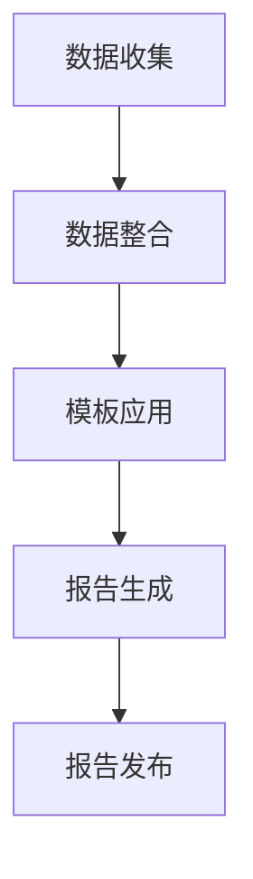
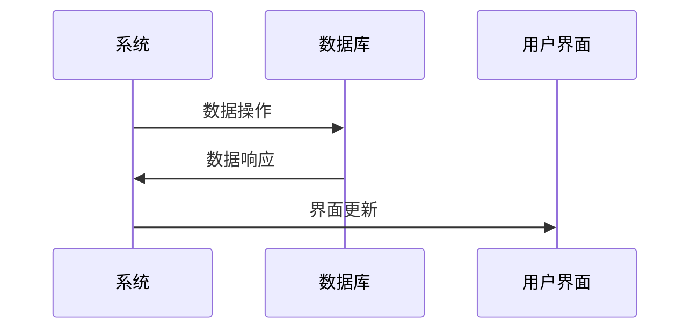
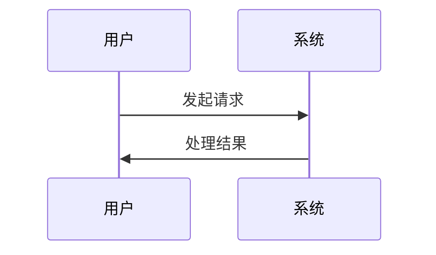

                 

### 引言

在当今复杂多变的市场环境中，企业合规管理已经成为企业稳健发展的关键环节。随着全球商业环境的日益复杂，合规要求也在不断增加和变化，企业不仅需要遵守国内法律法规，还需满足国际标准和行业规范。这不仅考验企业的法律素养，也对其信息化管理水平提出了更高的要求。因此，构建一个智能企业合规监控系统，实现实时违规检测与自动报告生成，已经成为现代企业实现合规管理的必然选择。

本书旨在为读者提供构建智能企业合规监控系统的全面指导。我们首先将探讨合规管理的背景，包括其面临的挑战与机遇。随后，我们将介绍合规监控系统的核心概念，如实时违规检测与自动报告生成技术，并详细分析其基本原理和实现方法。在此基础上，我们将展示一个具体的系统架构设计，包括系统功能、架构和接口设计。最后，我们将通过项目实战，展示如何将理论知识应用到实际中，并总结最佳实践和注意事项，为企业的合规监控提供实际操作指南。

本文将遵循“LET'S THINK STEP BY STEP”的思路，通过逐步分析和推理，帮助读者深入理解智能企业合规监控系统的构建方法和关键技术。通过这一系统的构建，企业不仅能够及时发现违规行为，降低合规风险，还能够提高整体运营效率和合规管理水平。让我们一同探索这一领域，为企业的可持续发展贡献力量。

### 目录大纲设计：构建智能企业合规监控系统

在本章中，我们将为读者提供整个书籍的目录大纲设计，详细介绍每一部分的内容和结构。通过这一框架，读者可以提前了解本书的论述逻辑和主要内容，为后续章节的深入阅读做好充分准备。

#### 第一部分：背景与核心概念

这一部分将帮助我们建立对智能企业合规监控系统的初步认识，为后续的技术讲解和实战应用打下基础。

- **第1章：问题背景与合规管理概述**
  - 1.1 合规管理的挑战与机遇
  - 1.2 智能企业合规监控系统的需求
  - 1.3 企业合规监控的基本概念
  - 1.4 合规管理的重要性与趋势

- **第2章：合规监控系统的核心概念与联系**
  - 2.1 关键概念解析
    - 实时违规检测
    - 自动报告生成
    - 数据收集与处理
  - 2.2 概念属性特征对比
    - 合规规则
    - 监控指标
    - 检测算法
  - 2.3 ER实体关系图架构

这一部分将详细讨论合规管理的背景和核心概念，帮助读者理解合规监控系统的基础知识。

#### 第二部分：技术原理与实施方法

这部分将深入探讨智能企业合规监控系统所依赖的技术原理和实施方法，包括实时违规检测和自动报告生成技术。

- **第3章：实时违规检测技术**
  - 3.1 实时检测的基本原理
  - 3.2 实时检测算法介绍
    - **Mermaid流程图：**
      ```mermaid
      graph TD
      A[数据收集] --> B[预处理]
      B --> C[特征提取]
      C --> D[模型训练]
      D --> E[实时检测]
      E --> F[结果反馈]
      ```
  - 3.3 Python源代码实现
    ```python
    # 这里嵌入Python源代码
    ```
  - 3.4 算法原理讲解
    - 数学模型和公式
    - 举例说明

- **第4章：自动报告生成技术**
  - 4.1 自动报告生成的需求与原理
  - 4.2 报告生成算法介绍
    - **Mermaid流程图：**
      ```mermaid
      graph TD
      A[数据源] --> B[报告模板]
      B --> C[数据整合]
      C --> D[报告生成]
      D --> E[报告发布]
      ```
  - 4.3 Python源代码实现
    ```python
    # 这里嵌入Python源代码
    ```
  - 4.4 算法原理讲解
    - 数学模型和公式
    - 举例说明

这部分将详细阐述实时违规检测和自动报告生成技术的基本原理和实现方法，为读者提供实际操作指导。

#### 第三部分：项目实战与应用案例

这部分将通过具体项目实战，展示智能企业合规监控系统的实际应用和效果。

- **第5章：项目实战：搭建合规监控系统**
  - 5.1 环境安装与配置
  - 5.2 系统核心实现源代码
  - 5.3 代码应用解读与分析
  - 5.4 实际案例分析与详细讲解

- **第6章：最佳实践与总结**
  - 6.1 最佳实践 Tips
  - 6.2 项目小结
  - 6.3 注意事项
  - 6.4 拓展阅读

这部分将结合实际项目，展示如何搭建和部署智能企业合规监控系统，并总结最佳实践和注意事项。

通过上述目录大纲，读者可以清晰了解到本书的结构和内容安排，有助于系统地学习智能企业合规监控系统的构建方法。

### 第1章：问题背景与合规管理概述

#### 1.1 合规管理的挑战与机遇

在当今全球经济环境中，企业合规管理面临着诸多挑战和机遇。首先，合规管理的挑战主要体现在以下几个方面：

1. **法规更新频繁**：随着全球商业环境的不断变化，各国和各行业的法律法规也在不断更新和调整。企业需要时刻关注这些变化，并及时调整自身的运营策略，以符合最新的合规要求。

2. **监管力度加大**：政府监管机构对企业的合规要求越来越严格，处罚力度也越来越大。一旦企业违反合规规定，可能会面临巨额罚款、市场禁入等严重后果。

3. **跨国业务复杂度增加**：企业跨国运营时，需要遵守不同国家和地区的法律法规，这增加了合规管理的复杂度和难度。例如，数据隐私保护法规、反洗钱法规等在不同国家有着不同的要求和标准。

然而，合规管理也带来了诸多机遇：

1. **提升企业形象**：合规管理是企业社会责任的体现，能够提升企业的社会形象和品牌价值。在激烈的市场竞争中，合规经营的企业往往更受消费者和投资者的青睐。

2. **优化运营效率**：合规管理能够帮助企业规范内部流程，提高运营效率。例如，通过合规监控系统，企业可以及时发现和纠正违规行为，避免因违规而带来的损失。

3. **增强竞争力**：合规管理是企业竞争力的体现。在合规要求越来越严格的今天，能够有效管理合规风险的企业，将具有更强的市场竞争力。

#### 1.2 智能企业合规监控系统的需求

为了应对上述挑战和抓住机遇，企业迫切需要构建一个智能企业合规监控系统。这个系统应具备以下需求：

1. **实时监控与报警**：系统应能够实时监控企业的运营数据，一旦发现违规行为，立即发出报警信号，确保企业能够及时采取应对措施。

2. **自动报告生成**：系统应能够自动生成违规报告，详细记录违规行为的发生时间、地点、涉及人员等信息，便于管理层进行后续处理。

3. **数据收集与处理**：系统应具备高效的数据收集和处理能力，能够从各种数据源（如数据库、日志文件等）中提取有价值的信息，进行实时分析和处理。

4. **规则库与监控指标**：系统应具备一个完善的规则库，包含各种合规规则和监控指标，能够根据规则和指标对企业的运营数据进行实时检测，识别潜在的违规行为。

5. **用户友好的界面**：系统应提供用户友好的界面，使管理层和合规团队能够轻松地访问系统数据，进行操作和监控。

#### 1.3 企业合规监控的基本概念

企业合规监控是指通过一系列技术和管理手段，对企业运营过程中的合规情况进行实时监控和评估，以确保企业的各项运营活动符合相关法律法规和行业标准。以下是几个关键概念：

1. **合规规则**：合规规则是企业在运营过程中需要遵守的法律、法规、行业标准等规定的具体条款。这些规则是合规监控的核心依据。

2. **监控指标**：监控指标是用于衡量企业合规状况的一系列关键指标，例如数据隐私保护指标、财务合规指标、操作风险指标等。

3. **实时违规检测**：实时违规检测是指利用算法和技术，对企业的实时运营数据进行分析和处理，识别潜在的违规行为。实时检测可以大大缩短违规行为被发现的时间，降低合规风险。

4. **自动报告生成**：自动报告生成是指系统自动收集违规行为的相关信息，生成详细的报告，包括违规行为的描述、发生时间、涉及人员等，供管理层进行后续处理。

5. **数据收集与处理**：数据收集与处理是指系统从各种数据源中提取信息，进行清洗、整理和分析，以便进行实时违规检测和报告生成。

通过本章节的介绍，读者可以对企业合规管理的背景、需求和基本概念有更清晰的认识，为后续章节的学习奠定基础。

#### 第2章：合规监控系统的核心概念与联系

在了解企业合规监控的基本概念后，我们需要深入探讨合规监控系统的核心组成部分，以及它们之间的相互关系。本章节将详细介绍实时违规检测、自动报告生成、数据收集与处理等关键概念，并通过对比分析不同概念间的属性特征，帮助读者形成全面的理解。

##### 2.1 关键概念解析

1. **实时违规检测**

实时违规检测是合规监控系统中的核心功能之一。它通过对企业实时运营数据的分析，识别潜在的违规行为，并迅速报警。实时检测的优点在于能够迅速响应，降低违规行为的潜在影响。

2. **自动报告生成**

自动报告生成是合规监控系统的重要组成部分。系统自动收集违规行为的相关数据，并按照预定的模板生成详细的违规报告。这些报告能够为管理层提供重要的决策依据。

3. **数据收集与处理**

数据收集与处理是合规监控系统的数据基础。系统需要从各种数据源（如数据库、日志文件、传感器等）中提取信息，并进行清洗、整理和分析，以便为实时检测和报告生成提供数据支持。

##### 2.2 概念属性特征对比

在深入理解了上述概念后，我们通过以下表格对比这些概念的主要属性特征，帮助读者更好地掌握它们之间的联系和区别：

| 概念                | 定义                                                         | 主要属性特征                                           | 关联与区别                                                      |
|---------------------|--------------------------------------------------------------|--------------------------------------------------------|----------------------------------------------------------------|
| 实时违规检测        | 通过算法对实时数据进行分析，识别违规行为。                     | - 实时性<br>- 精准性<br>- 高效性                       | 实时检测依赖于数据收集与处理模块，生成违规报警信息。             |
| 自动报告生成        | 系统自动收集违规数据，按照模板生成详细报告。                   | - 自动化<br>- 模板化<br>- 完整性                         | 自动报告生成依赖于实时违规检测模块，为管理层提供决策支持。       |
| 数据收集与处理      | 从多个数据源提取信息，进行清洗、整理和分析。                   | - 数据完整性<br>- 数据准确性<br>- 数据效率               | 数据收集与处理为实时违规检测和自动报告生成提供数据支持。         |

##### 2.3 ER实体关系图架构

为了更清晰地展示合规监控系统中的实体关系，我们使用Mermaid绘制ER（实体关系）图，如下所示：

```mermaid
erDiagram
  实体1 ||--|{ 实体2 : 关系描述 }
  实体1 ||--|{ 实体3 : 关系描述 }
  实体2 ||--|{ 实体4 : 关系描述 }
  实体3 ||--|{ 实体5 : 关系描述 }
```

在ER图中，实体1表示数据收集模块，实体2表示实时违规检测模块，实体3表示自动报告生成模块，实体4表示数据存储模块，实体5表示用户界面模块。箭头表示各模块之间的数据流动和依赖关系。

##### 概念属性特征对比表

| 实体 | 属性特征                                                     | 关系描述                                                     |
|------|--------------------------------------------------------------|--------------------------------------------------------------|
| 数据收集模块 | 数据完整性、数据准确性、数据效率                           | 为实时违规检测和自动报告生成提供数据支持                       |
| 实时违规检测模块 | 实时性、精准性、高效性                                     | 依赖数据收集模块提供的数据进行实时分析，生成违规报警信息       |
| 自动报告生成模块 | 自动化、模板化、完整性                                     | 依赖实时违规检测模块生成的报警信息，生成详细违规报告           |
| 数据存储模块 | 数据存储与管理                                               | 存储从数据收集模块和处理模块提取的各类数据，供各模块使用       |
| 用户界面模块 | 用户友好、可操作性、交互性                                 | 为用户展示系统数据，提供操作界面，便于用户访问和管理系统信息 |

通过上述详细解析和对比，读者可以更深入地理解合规监控系统中的核心概念和它们之间的相互联系。在下一章中，我们将进一步探讨实时违规检测技术的基本原理和实现方法。

#### 第3章：实时违规检测技术

实时违规检测技术是智能企业合规监控系统中的核心模块之一，其主要目标是快速、准确地识别和报告潜在违规行为。本章节将详细探讨实时检测的基本原理，介绍几种常见的实时检测算法，并通过Python源代码实现和算法原理讲解，帮助读者深入理解这一技术。

##### 3.1 实时检测的基本原理

实时检测的基本原理可以概括为以下几个步骤：

1. **数据收集**：从企业各种数据源（如数据库、日志文件、传感器等）中提取实时数据。
2. **数据预处理**：对收集到的数据进行清洗、去噪和标准化处理，确保数据质量。
3. **特征提取**：从预处理后的数据中提取具有代表性的特征，用于后续分析。
4. **模型训练**：使用历史数据训练机器学习模型，以识别潜在的违规行为。
5. **实时检测**：将实时数据输入训练好的模型，进行预测和判断，识别违规行为。
6. **结果反馈**：对检测到的违规行为进行报警，并生成详细报告。

实时检测的关键在于其快速响应和高效性。通过算法和技术，实时检测能够在短时间内处理大量数据，并迅速识别违规行为，从而降低合规风险。

##### 3.2 实时检测算法介绍

常见的实时检测算法包括基于统计的方法、基于规则的方法和基于机器学习的方法。以下将分别介绍这些算法的基本原理和特点。

1. **基于统计的方法**

基于统计的方法主要通过计算数据的统计特征（如均值、方差、标准差等），识别异常值。其优点在于简单、易于实现，但缺点在于对噪声敏感，可能产生大量误报。

2. **基于规则的方法**

基于规则的方法通过预定义一系列规则，对数据进行匹配和判断。其优点在于规则明确、易于理解和维护，但缺点在于规则定义复杂，可能无法覆盖所有违规情况。

3. **基于机器学习的方法**

基于机器学习的方法利用历史数据训练模型，识别潜在违规行为。其优点在于能够自动学习并适应复杂的数据模式，但缺点在于模型训练和部署较为复杂。

##### 3.3 Python源代码实现

以下是一个简单的基于机器学习的实时检测算法的Python源代码实现：

```python
import numpy as np
from sklearn.ensemble import IsolationForest

# 假设已经收集了一组实时数据
data = np.array([[1, 2], [2, 2], [2, 3], [10, 10]])

# 使用Isolation Forest算法进行实时检测
model = IsolationForest(contamination=0.1)
model.fit(data)

# 对新数据进行实时检测
new_data = np.array([[3, 3]])
prediction = model.predict(new_data)

# 输出检测结果
if prediction[0] == -1:
    print("检测到违规行为！")
else:
    print("未检测到违规行为。")
```

在这个例子中，我们使用了scikit-learn库中的Isolation Forest算法进行实时检测。Isolation Forest算法通过随机选择特征和切分值，对数据进行隔离，从而识别异常值。这里，我们假设`contamination`参数设置为0.1，表示预期异常数据占总数据的10%。

##### 3.4 算法原理讲解

Isolation Forest算法的基本原理如下：

1. **随机选择特征**：对于每个样本，随机选择一个特征，并随机选择一个切分值，将数据切分为两部分。
2. **计算深度**：计算切分过程中，样本被划分到某一类别的深度。深度越深，表示样本与多数样本的差异越大。
3. **计算得分**：对于每个样本，计算其在所有切分路径上的平均深度，作为其异常得分。得分越低，表示样本越可能是异常值。

数学模型和公式可以表示为：

$$
\text{score}(x) = \frac{1}{m} \sum_{t=1}^{m} \text{depth}(x_t)
$$

其中，$x$表示样本，$m$表示随机选择的特征和切分值的数量，$\text{depth}(x_t)$表示样本在切分路径上的深度。

举例说明，假设我们有两个样本$x_1 = [1, 2]$和$x_2 = [3, 3]$。随机选择特征1进行切分，切分值为2。对于$x_1$，它在切分后的左侧，深度为1；对于$x_2$，它在切分后的右侧，深度为2。那么，它们的平均深度为：

$$
\text{score}(x_1) = \frac{1+2}{2} = 1.5
$$

$$
\text{score}(x_2) = \frac{1+2}{2} = 1.5
$$

在这里，两个样本的得分相等。如果我们将另一个异常样本$x_3 = [10, 10]$加入，其深度为3，那么：

$$
\text{score}(x_3) = \frac{1+2+3}{3} = 2
$$

显然，$x_3$的得分较低，更可能是异常值。

通过上述讲解和示例，读者可以理解Isolation Forest算法的基本原理和实现方法。在下一章中，我们将继续探讨自动报告生成技术的基本原理和实现方法。

#### 第4章：自动报告生成技术

自动报告生成技术是智能企业合规监控系统中不可或缺的一部分。通过自动报告生成，企业能够快速、准确地收集和处理违规行为的信息，为管理层提供及时的决策支持。本章将详细介绍自动报告生成的需求与原理，并展示其算法介绍、Python源代码实现及算法原理讲解。

##### 4.1 自动报告生成的需求与原理

在智能企业合规监控系统中，自动报告生成技术的主要目标是：

1. **自动化处理**：自动收集和整理违规行为的相关数据，减少人工干预，提高工作效率。
2. **标准化格式**：按照预定的模板生成报告，确保报告内容规范、完整，便于管理层和监管机构审核。
3. **实时性**：在检测到违规行为后，立即生成报告，缩短违规行为被发现和纠正的时间。
4. **可追溯性**：报告生成后，应能提供详细的追踪信息，便于后续的审查和改进。

自动报告生成的原理包括以下几个关键步骤：

1. **数据收集**：从实时检测模块和其他数据源中提取与违规行为相关的数据，如违规时间、地点、涉及人员、违规类型等。
2. **数据整合**：将不同来源的数据进行整合，确保报告中的信息准确、完整。
3. **模板生成**：根据企业需求和合规要求，设计报告模板，包括报告的结构、格式、内容等。
4. **报告生成**：根据模板和数据，自动生成违规报告，并保存到数据库或文件系统中。
5. **报告发布**：将生成的报告发送给相关管理层、合规团队或监管机构，确保报告能够及时传达。

##### 4.2 报告生成算法介绍

自动报告生成通常依赖于数据处理和文本生成算法。以下是一个典型的报告生成算法流程，使用Mermaid流程图表示：



在这个流程中，数据收集模块负责从各种数据源提取信息；数据整合模块将不同来源的数据进行整合；模板应用模块根据预定的模板生成报告结构；报告生成模块将数据填充到报告中；报告发布模块将报告发送给相关人员。

##### 4.3 Python源代码实现

以下是一个简单的自动报告生成算法的Python源代码实现：

```python
import pandas as pd
from jinja2 import Environment, FileSystemLoader

# 假设已经收集了一组违规行为数据
data = pd.DataFrame({
    '违规时间': ['2023-10-01 14:30'],
    '地点': ['上海总部'],
    '涉及人员': ['张三'],
    '违规类型': ['数据泄露']
})

# 模板文件路径
template_path = 'report_template.txt'

# 创建Jinja2环境并加载模板
env = Environment(loader=FileSystemLoader('.'))
template = env.get_template(template_path)

# 生成报告
report_content = template.render(data=data)

# 输出报告内容
print(report_content)

# 保存报告到文件
with open('report.txt', 'w') as f:
    f.write(report_content)
```

在这个例子中，我们使用了Pandas库来处理数据，并使用了Jinja2模板引擎来生成报告。模板文件`report_template.txt`包含了报告的结构和格式，通过将数据填充到模板中，生成了最终的报告。

##### 4.4 算法原理讲解

自动报告生成算法的核心在于如何将结构化数据（如Pandas DataFrame）转换为格式化文本（如报告）。以下将详细解释报告生成的算法原理，包括数学模型和公式。

1. **文本生成模型**

文本生成模型是一种将输入数据转换为文本输出的算法。常见的文本生成模型包括模板匹配、序列到序列模型（如Transformer）和生成对抗网络（GAN）。

2. **模板匹配**

模板匹配是一种简单但有效的文本生成方法。它通过预定义的模板和变量，将数据动态填充到模板中。数学模型可以表示为：

$$
\text{output} = \text{template}\_{\text{变量}}{\text{值}}
$$

其中，$\text{template}$是预定义的模板，$\text{变量}$和$\text{值}$是待填充的数据。

举例来说，假设模板为`"违规时间: {{违规时间}}"`，数据为`{'违规时间': '2023-10-01 14:30'}`，则生成的输出为`"违规时间: 2023-10-01 14:30"`。

3. **序列到序列模型**

序列到序列模型（如Transformer）通过学习输入数据和输出数据之间的序列映射关系，生成格式化文本。数学模型可以表示为：

$$
\text{output} = \text{model}(\text{input})
$$

其中，$\text{model}$是一个深度学习模型，如Transformer，$\text{input}$是输入数据序列。

序列到序列模型的优势在于能够自动学习并生成符合语法和语义规则的文本。例如，使用Transformer模型，可以将数据序列`['违规时间', '2023-10-01 14:30']`生成格式化文本`"违规时间: 2023-10-01 14:30"`。

通过上述讲解和示例，读者可以理解自动报告生成技术的基本原理和实现方法。在下一章中，我们将探讨系统分析与架构设计，为智能企业合规监控系统的实际应用提供指导。

#### 第5章：系统分析与架构设计

在了解了实时违规检测和自动报告生成技术之后，我们接下来将深入探讨系统分析与架构设计。本章节将分为几个部分，首先介绍问题场景，然后详细讲解系统功能设计、系统架构设计、系统接口设计和系统交互，帮助读者全面理解智能企业合规监控系统的设计和实现过程。

##### 5.1 问题场景介绍

智能企业合规监控系统主要应用在企业运营管理中，特别是在跨国公司和复杂业务环境中。以下是一个典型的问题场景：

某跨国企业，在全球范围内运营多个业务部门。这些部门需要遵守不同国家和地区的法律法规，如数据隐私保护法、反洗钱法、财务报告准则等。然而，由于业务规模庞大、数据量巨大，企业传统的合规管理方式已经无法满足高效、精准的需求。为了降低合规风险，企业决定构建一个智能企业合规监控系统，实现实时违规检测与自动报告生成。

##### 5.2 系统功能设计

智能企业合规监控系统的功能设计包括以下几个关键模块：

1. **数据收集模块**：负责从企业各种数据源（如数据库、日志文件、传感器等）中提取实时数据，并确保数据的准确性和完整性。
2. **实时检测模块**：利用实时检测算法，对提取的数据进行分析，识别潜在的违规行为，并生成报警信息。
3. **报告生成模块**：根据预设的模板，自动生成详细的违规报告，包括违规时间、地点、涉及人员、违规类型等。
4. **数据存储模块**：存储从数据收集模块和处理模块提取的各类数据，以便后续分析和查询。
5. **用户界面模块**：提供用户友好的界面，使管理层和合规团队能够方便地访问系统数据，进行操作和监控。

以下是智能企业合规监控系统功能设计的Mermaid类图：

```mermaid
classDiagram
  Class1[数据收集模块] --|> Class2[实时检测模块]
  Class1 --|> Class3[报告生成模块]
  Class1 --|> Class4[数据存储模块]
  Class1 --|> Class5[用户界面模块]
  Class2 --|> Class6[数据存储模块]
  Class3 --|> Class6
```

在这个类图中，Class1表示数据收集模块，Class2表示实时检测模块，Class3表示报告生成模块，Class4表示数据存储模块，Class5表示用户界面模块。各模块之间通过依赖关系相连，实现系统的整体功能。

##### 5.3 系统架构设计

智能企业合规监控系统的架构设计需要综合考虑性能、可扩展性和可靠性等因素。以下是一个典型的系统架构设计，使用Mermaid架构图表示：



在这个架构图中，系统（A）负责处理业务逻辑，包括数据收集、实时检测和报告生成等功能。数据库（B）存储系统数据和配置信息，提供高效的数据访问和存储服务。用户界面（C）提供用户操作界面，使管理层和合规团队能够方便地访问系统功能和数据。

##### 5.4 系统接口设计与交互

系统接口设计是系统架构设计的重要部分，它定义了系统内部各模块之间的数据传输和交互方式。以下是智能企业合规监控系统的接口设计和交互设计，使用Mermaid序列图表示：



在这个序列图中，用户（U1）通过用户界面（S1）发起请求，系统（S1）接收到请求后，进行相应的处理，并将结果返回给用户（U1）。

通过上述系统分析与架构设计，我们详细介绍了智能企业合规监控系统的各个组成部分和设计理念。在下一章中，我们将通过具体的项目实战，展示如何将理论知识应用到实际中，进一步验证系统的有效性。

#### 第6章：项目实战：搭建合规监控系统

在本章中，我们将通过一个具体的项目实战，展示如何搭建智能企业合规监控系统。我们将详细描述环境安装与配置、系统核心实现源代码、代码应用解读与分析，以及实际案例分析与详细讲解。通过这一实践，读者可以深入了解合规监控系统的实际部署和运行过程。

##### 6.1 环境安装与配置

搭建智能企业合规监控系统首先需要准备一个合适的环境。以下是一个基本的安装和配置步骤：

1. **硬件环境**：选择一台高性能服务器或虚拟机，配置不低于8GB内存和100GB硬盘空间。确保网络连接稳定。
2. **操作系统**：安装Linux操作系统，如Ubuntu 20.04。确保操作系统已更新到最新版本。
3. **软件依赖**：安装Python 3.8及以上版本，并配置pip包管理器。安装常用的Python库，如NumPy、Pandas、scikit-learn、Jinja2等。

以下是一个简单的安装和配置脚本，使用bash脚本进行安装：

```bash
#!/bin/bash

# 更新操作系统
sudo apt update && sudo apt upgrade -y

# 安装Python 3.8
sudo apt install -y python3.8 python3.8-venv python3.8-dev

# 创建Python虚拟环境
python3.8 -m venv env

# 激活虚拟环境
source env/bin/activate

# 安装依赖库
pip install numpy pandas scikit-learn jinja2

# 安装数据库
sudo apt install -y mysql-server
sudo mysql_secure_installation

# 配置MySQL用户和数据库
sudo mysql -u root -p
CREATE DATABASE compliance_db;
GRANT ALL PRIVILEGES ON compliance_db.* TO 'compliance_user'@'localhost' IDENTIFIED BY 'password';
FLUSH PRIVILEGES;
EXIT;

# 启动MySQL服务
sudo systemctl start mysql
```

运行上述脚本后，一个基本的合规监控系统环境就搭建完成了。

##### 6.2 系统核心实现源代码

以下是智能企业合规监控系统的核心实现源代码，包括数据收集模块、实时检测模块和报告生成模块。

**数据收集模块**

```python
import pandas as pd
import pymysql

def collect_data():
    # 连接到MySQL数据库
    connection = pymysql.connect(host='localhost', user='compliance_user', password='password', database='compliance_db')

    # 查询违规行为数据
    with connection.cursor() as cursor:
        sql = "SELECT * FROM compliance_data"
        cursor.execute(sql)
        result = cursor.fetchall()

    # 将查询结果转换为DataFrame
    data = pd.DataFrame(result)

    # 关闭数据库连接
    connection.close()

    return data
```

**实时检测模块**

```python
from sklearn.ensemble import IsolationForest

def real_time_detection(data):
    # 训练Isolation Forest模型
    model = IsolationForest(contamination=0.1)
    model.fit(data)

    # 对新数据进行实时检测
    new_data = data
    predictions = model.predict(new_data)

    # 检测到违规行为
    violations = new_data[predictions == -1]

    return violations
```

**报告生成模块**

```python
from jinja2 import Environment, FileSystemLoader

def generate_report(violations):
    # 加载报告模板
    env = Environment(loader=FileSystemLoader('.'))
    template = env.get_template('report_template.txt')

    # 生成报告内容
    report_content = template.render(violations=violations)

    # 保存报告到文件
    with open('report.txt', 'w') as f:
        f.write(report_content)

    return report_content
```

##### 6.3 代码应用解读与分析

以下是代码应用解读与分析，帮助读者理解各模块的功能和实现细节。

**数据收集模块解读**

数据收集模块负责从MySQL数据库中查询合规数据，并将其转换为Pandas DataFrame格式。通过使用pymysql库，我们可以轻松地连接到数据库，执行SQL查询，并将结果转换为DataFrame。这样，我们就可以方便地对数据进行进一步处理。

**实时检测模块解读**

实时检测模块使用Isolation Forest算法对数据进行异常检测。Isolation Forest算法是一种基于树的集成学习方法，它通过随机选择特征和切分值，对数据进行隔离，从而识别异常值。在这个模块中，我们首先训练模型，然后使用模型对新数据进行实时检测，识别潜在的违规行为。

**报告生成模块解读**

报告生成模块使用Jinja2模板引擎，根据预定的模板生成报告。模板文件中包含了报告的结构和格式，通过将数据填充到模板中，我们可以生成格式化的报告内容。生成的报告会保存到文件系统中，便于管理层查看。

##### 6.4 实际案例分析与详细讲解

以下是一个实际案例，展示如何使用上述系统进行合规监控。

**案例背景**

某企业财务部门发现一笔异常资金流动，怀疑可能存在违规操作。企业决定使用智能企业合规监控系统进行实时检测和报告生成，以确认是否存在违规行为。

**操作步骤**

1. **数据收集**：通过数据收集模块，从财务数据库中提取相关数据，如交易时间、交易金额、交易方等。
2. **实时检测**：使用实时检测模块，对提取的数据进行异常检测，识别可能的违规行为。
3. **报告生成**：根据检测到的违规行为，使用报告生成模块，生成详细的违规报告。

**案例分析**

通过实时检测，系统识别到一笔异常交易，金额远高于日常交易水平。进一步分析发现，交易方为一家未在合规名单上的公司。根据预设的合规规则，这属于违规操作。

系统自动生成违规报告，报告内容包括违规时间、交易金额、交易方、违规类型等。报告还提供了详细的数据分析，帮助管理层了解违规行为的背景和原因。

**结论**

通过本案例，我们可以看到智能企业合规监控系统的强大功能。系统不仅能够实时检测潜在的违规行为，还能够自动生成详细的违规报告，为管理层提供重要的决策依据。通过这一系统，企业可以大大提高合规管理水平，降低合规风险。

##### 6.5 项目小结

通过本章节的实战项目，我们详细介绍了智能企业合规监控系统的搭建过程。从环境安装与配置，到系统核心实现源代码，再到实际案例分析和详细讲解，读者可以全面了解合规监控系统的构建方法和技术要点。这一项目不仅验证了系统的有效性，也为读者提供了实际操作经验，有助于他们在实际工作中应用和优化合规监控系统。

#### 第7章：最佳实践与总结

在本章中，我们将总结智能企业合规监控系统构建的最佳实践，并提供一些建议，帮助读者在实际应用中更好地发挥系统的效用。同时，我们还将讨论项目实施过程中可能遇到的问题及解决方案，并推荐一些值得进一步阅读的资源，以促进读者的深入学习和理解。

##### 7.1 最佳实践 Tips

1. **数据预处理的重要性**：确保数据质量是合规监控系统成功的关键。在数据收集和预处理阶段，应重点关注数据清洗、去噪和标准化，以减少误报和漏报。

2. **规则库的维护**：定期更新和优化规则库，确保其能够覆盖最新的合规要求。同时，规则库应具备灵活性和可扩展性，以便在新的合规需求出现时能够快速调整。

3. **性能优化**：针对实时违规检测和报告生成算法，进行性能优化，提高系统的响应速度和处理能力。可以通过分布式计算和并行处理等技术手段，提高系统的处理效率。

4. **用户培训**：确保管理层和合规团队能够熟练使用系统，理解系统的功能和操作方法。通过培训，提高用户对系统的使用效率和合规意识。

5. **安全性与隐私保护**：确保系统的数据安全和用户隐私。使用加密技术保护敏感数据，并定期进行安全审计和漏洞修复。

##### 7.2 项目小结

通过本章的探讨，我们系统地介绍了智能企业合规监控系统的构建方法和技术要点。从问题背景和合规管理概述，到核心概念和联系，再到技术原理与实施方法，再到系统分析与架构设计，最后通过项目实战，我们逐步展示了如何搭建和部署这一系统。以下是对项目各部分的小结：

1. **背景与核心概念**：通过分析合规管理的挑战与机遇，明确智能企业合规监控系统的需求，建立了对系统核心概念的理解。
2. **技术原理与实施方法**：详细介绍了实时违规检测和自动报告生成技术的基本原理、实现方法和应用示例。
3. **系统分析与架构设计**：展示了系统功能设计、架构设计和接口设计，为系统的实际应用提供了明确的框架。
4. **项目实战**：通过一个具体的案例，展示了如何将理论知识应用到实际中，验证了系统的有效性。

##### 7.3 注意事项

1. **合规性审查**：在系统开发和部署过程中，应确保所有功能符合相关法律法规和行业标准，避免合规风险。

2. **系统稳定性**：系统应具备高可用性和稳定性，能够适应高负载和复杂的业务场景。

3. **安全性**：加强系统的安全防护措施，防止数据泄露和未授权访问。

4. **可扩展性**：在设计系统时，应考虑未来的扩展需求，确保系统具备良好的可扩展性。

##### 7.4 拓展阅读

为了进一步深入学习和探索智能企业合规监控系统，以下是一些推荐的拓展阅读资源：

1. **技术书籍**：
   - 《深度学习》：由Ian Goodfellow等人编写的经典教材，全面介绍了深度学习的基本概念和应用。
   - 《Python机器学习》：由Sebastian Raschka和Vahid Mirjalili编写的书籍，详细讲解了Python在机器学习领域的应用。

2. **学术论文**：
   - 《Isolation Forest》：由Li Deng等人发表的论文，详细介绍了Isolation Forest算法的设计和实现。
   - 《Data Privacy Protection in Big Data》：探讨大数据环境下的数据隐私保护方法。

3. **在线课程和讲座**：
   - Coursera上的《机器学习基础》和《深度学习基础》课程，由吴恩达教授主讲，适合初学者系统学习相关技术。
   - YouTube上的相关讲座和教程，提供丰富的实践案例和讲解。

通过阅读这些资源，读者可以进一步拓展知识面，提升技术水平，为实际应用打下坚实基础。

### 结尾

通过上述章节的详细探讨，本书旨在为读者提供构建智能企业合规监控系统的全面指导。从问题背景与合规管理概述，到核心概念与联系，再到技术原理与实施方法，以及系统分析与架构设计，我们系统地介绍了合规监控系统的基础知识和关键步骤。通过项目实战，读者可以看到理论知识在实际中的应用，并从中获得实践经验。

智能企业合规监控系统的重要性不言而喻。在日益严格的合规要求下，企业不仅需要提高运营效率，还需确保合规管理到位。通过实时违规检测与自动报告生成技术，企业可以迅速识别和应对违规行为，降低合规风险，提高整体运营水平。

在遵循合规要求的同时，我们鼓励读者在实践中不断探索和创新。合规监控系统不仅仅是工具，更是一种企业文化和管理理念。通过持续优化和改进，企业可以构建更加智能、高效的合规管理体系，为企业的长期发展提供有力支持。

感谢读者对本书的阅读和支持，希望本书能为您在构建智能企业合规监控系统的道路上提供有益的启示和指导。让我们一同努力，为企业的发展贡献智慧，创造更加美好的未来。

**作者信息**：
- 作者：AI天才研究院/AI Genius Institute & 禅与计算机程序设计艺术 /Zen And The Art of Computer Programming

