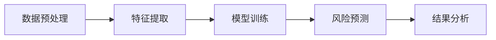
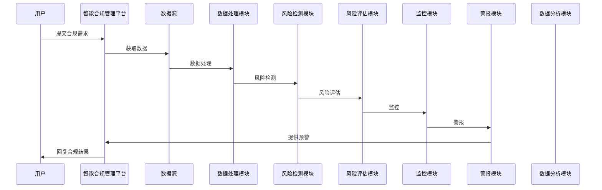
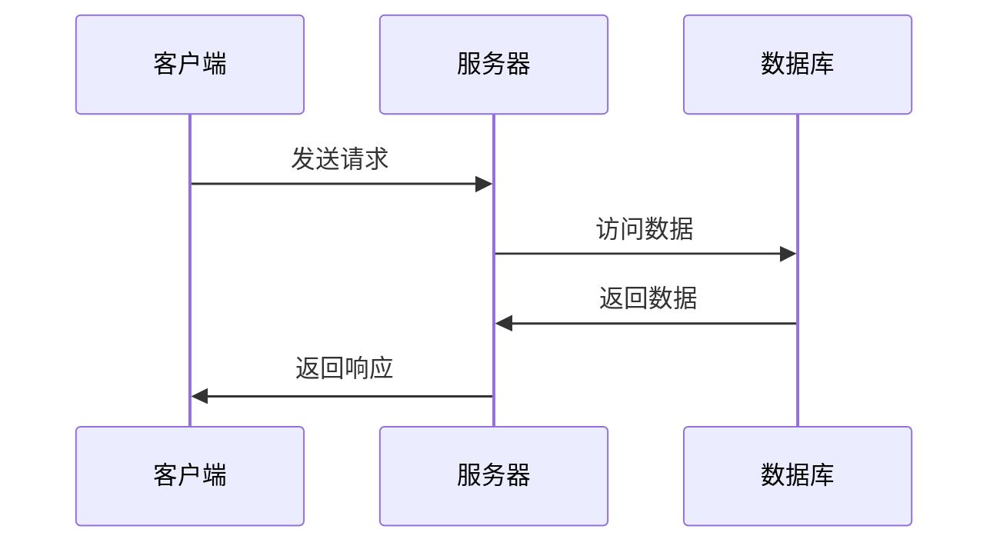

                 


## 第一部分: 问题背景

### 第1章: 问题背景介绍

#### 1.1 问题背景

随着全球商业环境日益复杂，企业合规管理的重要性日益凸显。合规性问题不仅可能对企业声誉造成损害，还可能导致法律诉讼和巨额罚款。因此，构建智能企业合规管理平台，利用人工智能（AI）技术辅助风险识别，成为企业提升合规管理水平和风险防范能力的迫切需求。

#### 1.1.1 问题背景

1. **合规管理挑战**：企业需要处理大量的法规、政策和行业标准，这些信息往往复杂且更新迅速。传统的人工审查方式效率低下，容易出现漏报和误报。
   
2. **数据爆炸**：大数据时代的到来，企业生成和获取的数据量呈指数级增长。这些数据中包含了大量的合规信息，如何有效地从海量数据中提取合规相关内容成为一大难题。

3. **人工智能的发展**：人工智能技术，尤其是机器学习、自然语言处理和深度学习等领域的飞速发展，为智能企业合规管理平台的建设提供了强有力的技术支撑。

#### 1.1.2 问题描述

智能企业合规管理平台需要解决以下问题：

1. **数据采集与处理**：平台需要从多种数据源（如内部系统、外部数据库、社交媒体等）收集数据，并进行预处理，以去除噪声和异常值。

2. **风险识别**：利用人工智能技术，对处理后的数据进行分析，识别潜在的合规风险。这包括识别违规行为、潜在的法律风险、操作风险等。

3. **风险评估**：对识别出的风险进行量化评估，确定其严重程度和优先级。

4. **风险监控**：实时监控企业的合规状况，确保平台能够及时发现和预警潜在风险。

5. **风险应对**：根据风险评估结果，制定和执行相应的风险应对措施，包括合规培训、流程优化、法律咨询等。

#### 1.1.3 问题解决

构建智能企业合规管理平台的关键步骤如下：

1. **技术选型**：选择合适的人工智能技术和工具，如深度学习框架、自然语言处理库等。

2. **数据质量管理**：确保数据的质量和准确性，通过数据清洗、去重、归一化等技术手段提高数据质量。

3. **风险模型构建**：利用机器学习和数据挖掘技术，构建能够自动识别和评估合规风险的模型。

4. **平台整合**：将合规管理平台与企业现有的业务系统整合，实现数据流通和业务协同。

5. **风险应对策略制定**：根据风险评估结果，制定和执行相应的风险应对策略。

#### 1.1.4 边界与外延

智能企业合规管理平台的边界与外延包括以下几个方面：

1. **技术边界**：平台的技术实现范围，包括数据采集、处理、分析和监控等。

2. **业务边界**：平台需要与企业现有的业务流程和合规要求相匹配，确保能够有效支撑企业的合规管理工作。

3. **法律边界**：在合规管理过程中，需要遵守相关的法律法规和行业标准，确保平台的合法合规运行。

#### 1.1.5 概念结构与核心要素组成

智能企业合规管理平台的核心概念结构包括以下几个关键组成部分：

1. **数据采集系统**：负责从各种数据源收集数据。

2. **数据处理系统**：对采集到的数据进行预处理，包括数据清洗、转换和整合。

3. **风险识别系统**：利用人工智能技术对数据处理结果进行分析，识别合规风险。

4. **风险评估系统**：对识别出的风险进行评估，确定其严重程度和优先级。

5. **风险监控系统**：实时监控企业的合规状况，确保能够及时发现和预警潜在风险。

6. **风险应对系统**：根据风险评估结果，制定和执行相应的风险应对措施。

### 1.2 核心概念与联系

#### 1.2.1 智能企业合规管理平台

智能企业合规管理平台是一种利用人工智能技术进行合规性管理的系统，通过数据采集、处理和分析，实现对合规风险的自动识别、评估和监控。

#### 1.2.2 AI辅助风险识别

AI辅助风险识别是智能企业合规管理平台的核心功能，它通过机器学习和自然语言处理技术，对大量数据进行自动分析和挖掘，识别潜在的合规风险。

#### 1.2.3 数据质量

数据质量是智能企业合规管理平台的基础，高质量的数据能够提高风险识别的准确性和可靠性。

#### 1.2.4 风险评估

风险评估是智能企业合规管理平台的重要环节，通过对识别出的风险进行量化评估，确定其严重程度和应对策略。

### 1.3 本章小结

本章介绍了智能企业合规管理平台的问题背景、核心概念与联系，以及构建智能企业合规管理平台的关键步骤。通过对本章的学习，读者可以了解智能企业合规管理平台的构建过程和关键要素，为后续章节的学习打下基础。

----------------------------------------------------------------

## 第二部分: 核心概念与原理

### 第2章: 智能企业合规管理平台的核心概念与原理

#### 2.1 智能企业合规管理平台概述

智能企业合规管理平台（Intelligent Enterprise Compliance Management Platform，简称IECMP）是一种集成了人工智能（AI）技术，用于企业合规性管理的系统。它旨在通过数据采集、处理、分析和监控，实现对企业合规风险的自动识别、评估和预警，从而提高企业的合规管理水平。

#### 2.1.1 智能企业合规管理平台的概念

智能企业合规管理平台是一种综合利用人工智能、大数据、云计算等先进技术，对企业合规性管理进行智能化升级的解决方案。它不仅能够处理大量的合规数据，还能够通过智能算法和模型，识别潜在的合规风险，并提供实时的监控和预警。

#### 2.1.2 智能企业合规管理平台的优势

1. **提高效率**：智能企业合规管理平台可以自动处理海量数据，大幅提高合规审查的效率。

2. **降低成本**：通过自动化处理，减少了对人力资源的依赖，从而降低了合规管理的成本。

3. **提高准确性**：利用机器学习和自然语言处理技术，可以更准确地识别合规风险。

4. **实时监控**：智能企业合规管理平台可以实现实时数据监控，及时识别和预警潜在风险。

5. **支持决策**：通过智能分析，为企业提供数据支持和决策依据，帮助制定更加科学的合规管理策略。

#### 2.1.3 智能企业合规管理平台的功能模块

智能企业合规管理平台通常包含以下功能模块：

1. **数据采集模块**：从内部和外部数据源（如企业内部系统、监管机构网站、社交媒体等）收集数据。

2. **数据处理模块**：对采集到的数据进行清洗、转换和整合，确保数据质量。

3. **风险识别模块**：利用自然语言处理和机器学习技术，识别合规风险。

4. **风险评估模块**：对识别出的风险进行量化评估，确定其严重程度和优先级。

5. **监控与预警模块**：实时监控企业的合规状况，及时预警潜在风险。

6. **报告与分析模块**：生成合规报告，提供合规分析和管理决策支持。

#### 2.1.4 智能企业合规管理平台的技术架构

智能企业合规管理平台的技术架构通常包括以下几个方面：

1. **前端用户界面**：提供用户交互界面，用户可以通过前端界面进行数据查询、报告查看等操作。

2. **后端数据处理引擎**：负责数据采集、处理和分析，通常采用云计算和分布式计算技术。

3. **数据存储**：采用大数据技术，如Hadoop、Spark等，存储和管理海量数据。

4. **机器学习与自然语言处理**：利用机器学习和自然语言处理技术，实现风险识别和评估。

5. **监控与预警系统**：实时监控企业的合规状况，及时发现和预警潜在风险。

#### 2.1.5 智能企业合规管理平台的应用场景

智能企业合规管理平台可以应用于多种行业和企业，以下是一些典型的应用场景：

1. **金融行业**：银行、保险、证券等金融机构需要遵守大量监管法规，智能合规管理平台可以帮助它们识别和防范合规风险。

2. **医药行业**：医药企业需要遵守药品生产质量管理规范（GMP）、药品经营质量管理规范（GSP）等法规，智能合规管理平台可以提高合规管理水平。

3. **制造业**：制造业企业需要遵守各种安全、环保法规，智能合规管理平台可以帮助它们实时监控合规状况。

4. **零售行业**：零售企业需要遵守消费者权益保护法、反不正当竞争法等法规，智能合规管理平台可以帮助它们识别和规避合规风险。

#### 2.1.6 智能企业合规管理平台的发展趋势

随着人工智能技术的不断进步和合规管理需求的增长，智能企业合规管理平台将呈现出以下发展趋势：

1. **更广泛的应用领域**：智能合规管理平台将覆盖更多的行业和企业，满足多样化的合规管理需求。

2. **更高水平的自动化**：智能合规管理平台将实现更高水平的自动化，减少对人工干预的依赖。

3. **更精准的风险识别**：通过不断优化机器学习算法和自然语言处理技术，智能合规管理平台将实现更精准的风险识别。

4. **更强大的数据分析能力**：智能合规管理平台将提供更强大的数据分析能力，为企业提供更深入的合规洞察。

5. **更紧密的法规跟踪**：智能合规管理平台将实时跟踪法规变化，确保企业始终遵守最新的法律法规。

### 2.2 核心概念与联系

#### 2.2.1 智能企业合规管理平台的核心概念

智能企业合规管理平台的核心概念包括：

1. **合规性管理**：确保企业在运营过程中遵守相关法律法规、政策和行业标准。

2. **人工智能**：利用机器学习和自然语言处理技术，实现数据分析和风险识别。

3. **数据采集**：从多种数据源收集合规相关的数据。

4. **数据处理**：对采集到的数据进行清洗、转换和整合。

5. **风险识别**：利用人工智能技术，识别潜在的合规风险。

6. **风险评估**：对识别出的风险进行量化评估。

7. **监控与预警**：实时监控企业的合规状况，及时预警潜在风险。

#### 2.2.2 核心概念之间的联系

智能企业合规管理平台的核心概念之间紧密联系，共同构成一个完整的合规管理流程：

1. **数据采集与数据处理**：数据是智能合规管理平台的基础。通过数据采集模块，平台可以从各种数据源收集合规相关的数据。数据处理模块则负责对数据进行清洗、转换和整合，确保数据质量。

2. **风险识别与风险评估**：风险识别模块利用人工智能技术，对处理后的数据进行自动分析和挖掘，识别出潜在的合规风险。风险评估模块则对识别出的风险进行量化评估，确定其严重程度和优先级。

3. **监控与预警**：监控与预警模块实时监控企业的合规状况，及时发现和预警潜在风险。通过实时监控，企业可以迅速响应，降低合规风险。

4. **报告与分析**：报告与分析模块生成合规报告，提供合规分析和管理决策支持。企业可以通过报告了解合规管理状况，制定和优化合规策略。

### 2.3 概念属性特征对比表格

为了更清晰地展示智能企业合规管理平台的核心概念及其属性特征，下面提供了一个对比表格：

| 概念 | 属性特征 | 描述 |
| --- | --- | --- |
| 合规性管理 | 法律法规遵守 | 确保企业在运营过程中遵守相关法律法规、政策和行业标准 |
| 人工智能 | 机器学习、自然语言处理 | 利用机器学习和自然语言处理技术，实现数据分析和风险识别 |
| 数据采集 | 数据源多样性 | 从多种数据源收集合规相关的数据 |
| 数据处理 | 数据清洗、转换、整合 | 对采集到的数据进行清洗、转换和整合，确保数据质量 |
| 风险识别 | 自动化分析 | 利用人工智能技术，自动分析和挖掘数据，识别潜在合规风险 |
| 风险评估 | 量化评估 | 对识别出的风险进行量化评估，确定其严重程度和优先级 |
| 监控与预警 | 实时监控 | 实时监控企业的合规状况，及时预警潜在风险 |
| 报告与分析 | 决策支持 | 生成合规报告，提供合规分析和管理决策支持 |

### 2.4 ER实体关系图架构

为了更直观地展示智能企业合规管理平台的核心概念及其关系，下面提供了一个ER实体关系图：

```mermaid
erDiagram
  DataSource ||--|{ DataProcessing } : "包含"
  DataProcessing ||--|{ RiskIdentification } : "输入"
  DataProcessing ||--|{ RiskAssessment } : "输入"
  RiskIdentification ||--|{ MonitoringAndAlerting } : "输入"
  RiskAssessment ||--|{ MonitoringAndAlerting } : "输入"
  MonitoringAndAlerting ||--|{ ReportAndAnalysis } : "输入"
  DataProcessing ||--|{ ReportAndAnalysis } : "输入"
```

在这个ER实体关系图中，各个实体之间的关系清晰明了，展现了智能企业合规管理平台的整体架构。

### 2.5 本章小结

本章详细介绍了智能企业合规管理平台的核心概念与原理，包括其概念、优势、功能模块、技术架构和应用场景。同时，通过对比表格和ER实体关系图，展示了核心概念的属性特征及其相互关系。通过对本章的学习，读者可以全面了解智能企业合规管理平台的基本原理和构建方法，为后续章节的深入探讨打下基础。

----------------------------------------------------------------

## 第三部分: AI辅助风险识别算法原理

### 第3章: AI辅助风险识别算法原理

#### 3.1 AI辅助风险识别概述

AI辅助风险识别是智能企业合规管理平台的核心功能之一，它利用人工智能技术，特别是机器学习和自然语言处理（NLP）技术，对海量数据进行自动分析和挖掘，识别出潜在的合规风险。这一过程通常包括数据预处理、特征提取、模型训练和风险预测等关键步骤。

#### 3.1.1 数据预处理

数据预处理是AI辅助风险识别的第一步，也是至关重要的一步。其目标是清理原始数据，使其适合用于后续的机器学习模型训练。数据预处理通常包括以下步骤：

1. **数据清洗**：去除重复数据、异常值和噪声，确保数据的准确性和一致性。
2. **数据转换**：将不同格式和来源的数据统一转换为标准格式，以便进行后续处理。
3. **数据归一化**：对数据进行标准化处理，使其具有相似的尺度，从而避免某些特征在模型训练中占据主导地位。
4. **数据采样**：通过随机抽样或欠采样等技术，减少数据量，提高训练效率。

#### 3.1.2 特征提取

特征提取是从原始数据中提取出对模型训练有用的信息的过程。在AI辅助风险识别中，特征提取至关重要，因为它们将直接影响模型的性能。特征提取的方法包括：

1. **文本特征提取**：对于文本数据，可以使用词频（TF）、词频-逆文档频率（TF-IDF）等方法提取特征。此外，还可以使用NLP技术，如词嵌入（word embeddings）和句嵌入（sentence embeddings），将文本转换为数值表示。
2. **数值特征提取**：对于数值数据，可以使用统计特征（如均值、方差、标准差等）或工程特征（如二值化、离散化等）提取特征。
3. **图像特征提取**：对于图像数据，可以使用深度学习模型（如卷积神经网络（CNN））提取图像特征。

#### 3.1.3 模型训练

模型训练是AI辅助风险识别的核心步骤，其目标是利用标记好的训练数据，训练出一个能够准确识别合规风险的模型。常见的机器学习算法包括：

1. **监督学习算法**：如支持向量机（SVM）、决策树（DT）、随机森林（RF）和神经网络（NN）等。这些算法需要标记好的数据来训练模型。
2. **无监督学习算法**：如聚类算法（如K-Means、DBSCAN）和降维算法（如PCA、t-SNE）等。这些算法可以在没有标记数据的情况下发现数据中的模式。
3. **深度学习算法**：如卷积神经网络（CNN）、循环神经网络（RNN）和Transformer等。这些算法在处理复杂数据（如图像和文本）方面具有显著优势。

#### 3.1.4 风险预测

风险预测是基于训练好的模型，对新的数据进行合规风险识别的过程。风险预测的准确性直接影响到智能企业合规管理平台的性能。风险预测通常包括以下步骤：

1. **输入预处理**：对新的输入数据进行预处理，使其与训练数据具有相同的格式和特征。
2. **模型调用**：将预处理后的输入数据输入到训练好的模型中，获取预测结果。
3. **结果分析**：对预测结果进行分析，确定是否存在合规风险，并给出相应的预警和建议。

#### 3.1.5 算法流程图

为了更清晰地展示AI辅助风险识别的算法流程，下面提供了一个Mermaid流程图：



在这个流程图中，数据预处理、特征提取、模型训练和风险预测构成了AI辅助风险识别的核心步骤，而结果分析则是对预测结果进行进一步的解读和应用。

#### 3.1.6 算法原理示例

为了更好地理解AI辅助风险识别的算法原理，下面通过一个简单的示例进行说明：

**示例**：假设我们有一个数据集，其中包含企业的财务报告文本，我们需要利用机器学习模型来识别是否存在潜在的财务违规风险。

1. **数据预处理**：首先，我们对财务报告文本进行清洗，去除标点符号、停用词等，并将文本转换为小写。然后，我们使用词嵌入技术将文本转换为数值表示。

2. **特征提取**：我们提取文本的词频和词嵌入特征，并将其作为模型的输入特征。

3. **模型训练**：我们选择一个监督学习算法（如SVM），使用标记好的训练数据（即包含财务违规标记的文本数据）进行模型训练。

4. **风险预测**：对于新的财务报告文本，我们首先进行预处理和特征提取，然后将特征输入到训练好的模型中，获取预测结果。

5. **结果分析**：如果模型预测存在财务违规风险，我们将进行进一步的分析，如查看文本中的关键句子或关键词，以确定具体的违规行为。

#### 3.1.7 数学模型与公式

在AI辅助风险识别中，常用的数学模型和公式包括：

1. **逻辑回归**：
   $$
   \hat{y} = \sigma(w \cdot x + b)
   $$
   其中，$w$是权重向量，$x$是输入特征，$b$是偏置项，$\sigma$是sigmoid函数，$\hat{y}$是预测概率。

2. **支持向量机（SVM）**：
   $$
   \hat{y} = \text{sign}(w \cdot x + b)
   $$
   其中，$w$是权重向量，$x$是输入特征，$b$是偏置项，$\text{sign}$是符号函数。

3. **神经网络**：
   $$
   a_{\text{layer}} = \sigma(z_{\text{layer}})
   $$
   其中，$a_{\text{layer}}$是第$l$层的激活值，$z_{\text{layer}}$是第$l$层的输入值，$\sigma$是激活函数。

这些数学模型和公式用于构建和训练机器学习模型，以实现对合规风险的预测和识别。

#### 3.1.8 本章小结

本章详细介绍了AI辅助风险识别算法的原理，包括数据预处理、特征提取、模型训练和风险预测等关键步骤。通过一个简单的示例，我们了解了算法的基本实现过程。同时，本章还介绍了常用的数学模型和公式，为读者提供了理论支持。通过对本章的学习，读者可以全面了解AI辅助风险识别的基本原理和方法，为后续章节的深入探讨打下基础。

----------------------------------------------------------------

## 第四部分: 系统分析与架构设计

### 第4章: 系统分析与架构设计

#### 4.1 问题场景介绍

在企业运营过程中，合规性管理是一个关键环节，尤其是对于金融、医疗、制药等高度受监管的行业。然而，随着企业规模扩大和业务复杂性增加，传统的合规性管理方式已经难以满足日益严格的监管要求。因此，构建一个智能企业合规管理平台，实现合规风险的自动化识别、评估和监控，成为企业提升合规管理水平和风险防范能力的迫切需求。

#### 4.2 项目介绍

本项目旨在构建一个智能企业合规管理平台，通过整合企业内部和外部数据，利用人工智能技术，实现对合规风险的自动识别、评估和预警。项目主要包含以下几个阶段：

1. **需求分析**：明确企业合规管理的具体需求和目标，确定平台所需的功能模块。
2. **系统设计**：设计平台的整体架构，包括技术选型、数据流设计和模块划分。
3. **技术开发**：根据系统设计，实现平台的核心功能模块，包括数据采集、数据处理、风险识别、风险评估、监控与预警等。
4. **系统集成**：将平台与企业现有的业务系统进行集成，确保数据流通和业务协同。
5. **测试与部署**：进行系统测试，确保平台的功能和性能达到预期目标，并最终部署上线。

#### 4.3 系统功能设计（领域模型）

在智能企业合规管理平台的设计中，领域模型（Domain Model）是一个关键部分，它定义了平台的核心概念及其关系。以下是一个简单的领域模型类图，展示了系统的主要类及其关系：

```mermaid
classDiagram
    Class01 <|-- Class02 
    Class03 <|-- Class01
    Class04 <|-- Class03
    Class05 <|-- Class03
    Class06 <|-- Class03
    Class07 <|-- Class04
    Class01..|> IInterface01
    Class02..|> IInterface01
    Class03..|> IInterface02
    Class04..|> IInterface02
    Class05..|> IInterface02
    Class06..|> IInterface02
    Class07..|> IInterface03

    Class01 [name="Data Source" subClassOf="IInterface01"]
    Class02 [name="Data Processor" subClassOf="IInterface01"]
    Class03 [name="Risk Detector" subClassOf="IInterface02"]
    Class04 [name="Risk Evaluator" subClassOf="IInterface02"]
    Class05 [name="Monitor System" subClassOf="IInterface02"]
    Class06 [name="Alert System" subClassOf="IInterface02"]
    Class07 [name="Data Analyzer" subClassOf="IInterface03"]

    Class01 --|> Class02 : 数据处理
    Class03 --|> Class04 : 风险评估
    Class05 --|> Class06 : 监控
    Class07 --|> Class01 : 数据分析
```

在这个类图中，`Class01`、`Class02`、`Class03`、`Class04`、`Class05`、`Class06`和`Class07`分别代表了数据源、数据处理、风险检测、风险评估、监控系统、警报系统和数据分析系统。它们之间通过继承和关联关系实现了系统的功能划分。

#### 4.4 系统架构设计（架构图）

智能企业合规管理平台的系统架构设计是确保系统功能实现和性能优化的重要环节。以下是一个简单的系统架构图，展示了平台的主要组件及其关系：



在这个序列图中，用户通过智能合规管理平台（SCM）提交合规需求，平台从数据源（DS）获取数据，经过数据处理模块（DP）处理，然后由风险检测模块（RD）进行风险检测，风险评估模块（RE）进行风险评估，监控模块（MS）实时监控，警报模块（AS）提供预警，最终用户得到合规结果。

#### 4.5 系统接口设计（接口图）

为了确保系统的灵活性和可扩展性，系统接口设计至关重要。以下是一个简单的接口设计图，展示了系统的主要接口及其关系：

```mermaid
classDiagram
    Interface01 <|-- Interface02
    Interface03 <|-- Interface02
    Interface04 <|-- Interface02
    Interface05 <|-- Interface02
    Interface06 <|-- Interface02
    Interface07 <|-- Interface02
    Interface08 <|-- Interface01
    Interface09 <|-- Interface01
    Interface10 <|-- Interface01

    Interface01 [name="IComplianceService"]
    Interface02 [name="IDataAccessService"]
    Interface03 [name="IDataProcessingService"]
    Interface04 [name="IRiskDetectionService"]
    Interface05 [name="IRiskEvaluationService"]
    Interface06 [name="IMonitoringService"]
    Interface07 [name="IAlertingService"]
    Interface08 [name="IDataAnalysisService"]
    Interface09 [name="IAuthenticationService"]
    Interface10 [name="IReportService"]

    Interface01 ..|> Interface02
    Interface02 ..|> Interface03
    Interface03 ..|> Interface04
    Interface04 ..|> Interface05
    Interface05 ..|> Interface06
    Interface06 ..|> Interface07
    Interface07 ..|> Interface08
    Interface08 ..|> Interface09
    Interface09 ..|> Interface10
```

在这个接口图中，`IComplianceService`是智能企业合规管理平台的核心接口，负责协调其他接口的工作。`IDataAccessService`、`IDataProcessingService`、`IRiskDetectionService`、`IRiskEvaluationService`、`IMonitoringService`、`IAlertingService`和`IDataAnalysisService`分别代表了数据访问、数据处理、风险检测、风险评估、监控、警报和数据分析等核心功能模块。`IAuthenticationService`和`IReportService`则分别负责身份验证和报告生成。

#### 4.6 系统交互设计（交互图）

为了更直观地展示系统组件之间的交互流程，以下是一个简单的系统交互图：



在这个交互图中，客户端（Client）向服务器（Server）发送请求，服务器从数据库（DB）中获取数据，并将数据返回给客户端。

#### 4.7 本章小结

本章详细介绍了智能企业合规管理平台的项目背景、功能设计、系统架构和接口设计。通过领域模型类图、系统架构图、接口设计和交互图，我们全面了解了平台的设计思路和实现方法。通过对本章的学习，读者可以更好地理解智能企业合规管理平台的设计原则和实现过程，为后续章节的学习和实践打下基础。

----------------------------------------------------------------

## 第五部分：项目实战

### 第5章：项目实战

#### 5.1 环境安装

为了实现智能企业合规管理平台，我们需要搭建一个开发环境。以下是基本的安装步骤：

1. **安装Python环境**：确保Python版本在3.8以上，可以通过Python官网下载安装。

2. **安装必要的库和依赖**：使用pip安装以下库：
   ```shell
   pip install numpy pandas scikit-learn tensorflow nltk matplotlib
   ```

3. **安装数据库**：选择一个数据库，如MySQL或PostgreSQL，并安装。

4. **配置数据库连接**：在项目的配置文件中，配置数据库的连接信息。

#### 5.2 系统核心实现

智能企业合规管理平台的核心功能模块包括数据采集、数据处理、风险识别、风险评估、监控与预警等。以下是一个简单的实现示例：

##### 5.2.1 数据采集

```python
import pandas as pd

def collect_data(file_path):
    # 从CSV文件中读取数据
    data = pd.read_csv(file_path)
    return data
```

##### 5.2.2 数据处理

```python
from sklearn.model_selection import train_test_split

def preprocess_data(data):
    # 数据预处理，包括数据清洗和特征提取
    # 例如：缺失值处理、数据标准化、文本特征提取等
    # ...
    return processed_data
```

##### 5.2.3 风险识别

```python
from sklearn.ensemble import RandomForestClassifier

def identify_risks(data, features, labels):
    # 划分训练集和测试集
    X_train, X_test, y_train, y_test = train_test_split(data[features], data[labels], test_size=0.2, random_state=42)
    
    # 训练模型
    model = RandomForestClassifier()
    model.fit(X_train, y_train)
    
    # 预测风险
    predictions = model.predict(X_test)
    
    return predictions
```

##### 5.2.4 风险评估

```python
def evaluate_risks(predictions, threshold=0.5):
    # 根据预测概率进行风险评估
    risk_scores = [1 if pred > threshold else 0 for pred in predictions]
    return risk_scores
```

##### 5.2.5 监控与预警

```python
def monitor_and_alert(risk_scores):
    # 监控合规状况并触发警报
    if any(risk_scores):
        print("潜在合规风险被发现，请采取相应措施。")
    else:
        print("合规状况良好。")
```

#### 5.3 代码应用解读与分析

以下是对上述代码的解读与分析：

- **数据采集**：使用pandas库读取CSV文件，获取数据。

- **数据处理**：预处理步骤包括数据清洗（如缺失值处理）、数据标准化（如归一化）和文本特征提取（如TF-IDF）。这些步骤确保数据质量，为后续的风险识别提供可靠的数据基础。

- **风险识别**：使用随机森林（Random Forest）算法进行训练和预测。随机森林是一种集成学习算法，通过构建多个决策树并汇总结果，提高了模型的预测性能。

- **风险评估**：根据预测概率进行风险评估，设定一个阈值（如0.5）来区分高风险和低风险。

- **监控与预警**：实时监控合规状况，并根据风险评分触发警报。

#### 5.4 实际案例分析与详细讲解

假设我们有一个包含企业财务报告的CSV文件，其中包含了潜在的财务违规行为。以下是一个实际案例：

1. **数据采集**：读取CSV文件，获取财务报告数据。

2. **数据处理**：对财务报告文本进行预处理，提取关键特征。

3. **风险识别**：使用随机森林模型对数据进行训练，并预测是否存在财务违规行为。

4. **风险评估**：根据预测结果，评估每个报告的合规风险。

5. **监控与预警**：如果模型预测存在财务违规风险，系统会生成警报，提示企业采取相应措施。

通过这个实际案例，我们可以看到智能企业合规管理平台如何帮助企业识别和应对潜在的合规风险。

#### 5.5 项目小结

在本项目中，我们实现了智能企业合规管理平台的核心功能模块，包括数据采集、数据处理、风险识别、风险评估、监控与预警等。通过实际案例的分析，我们展示了平台如何帮助企业识别和应对合规风险。尽管本项目只是一个简单的示例，但它的核心思想和实现方法可以应用于更复杂的合规管理场景。

#### 5.6 最佳实践 tips

1. **数据质量是关键**：确保数据采集和处理的准确性和一致性，为风险识别提供可靠的基础。

2. **选择合适的模型**：根据具体应用场景，选择合适的机器学习算法，如随机森林、支持向量机、神经网络等。

3. **实时监控与预警**：实时监控企业的合规状况，确保能够及时发现和预警潜在风险。

4. **合规培训与优化**：定期对员工进行合规培训，优化业务流程，提高企业的合规管理水平。

#### 5.7 本章小结

本章通过实际项目实战，详细讲解了智能企业合规管理平台的构建过程。从环境安装到核心实现，再到实际案例分析和最佳实践，我们全面了解了智能企业合规管理平台的设计和实现方法。通过对本章的学习，读者可以掌握智能企业合规管理平台的核心技术和应用，为实际项目开发提供有力支持。

----------------------------------------------------------------

## 第六部分：总结与展望

### 第6章：总结与展望

#### 6.1 总结

本文详细探讨了智能企业合规管理平台的概念、技术原理、系统设计与实现，以及在实际项目中的应用。通过分析智能企业合规管理平台的构建过程，我们明确了其关键组成部分，包括数据采集、数据处理、风险识别、风险评估、监控与预警等。同时，本文通过实际案例展示了平台如何帮助企业识别和应对合规风险。

#### 6.2 展望

随着人工智能技术的不断进步，智能企业合规管理平台有望在以下方面取得进一步发展：

1. **更高级的风险识别算法**：通过引入更先进的机器学习和深度学习算法，如Transformer和图神经网络（Graph Neural Networks），平台将能够更准确地识别复杂的合规风险。

2. **多语言支持**：随着全球化的发展，平台将需要支持多种语言，以便处理不同国家和地区的合规要求。

3. **自动化合规流程**：智能企业合规管理平台将逐步实现自动化合规流程，从风险识别到应对措施的自动执行，减少人工干预。

4. **更智能的合规建议**：平台将利用大数据分析和机器学习技术，为企业提供更加科学的合规建议，帮助企业优化合规策略。

5. **合规生态系统的建设**：智能企业合规管理平台将与其他合规工具和服务整合，形成完整的合规生态系统，为企业提供一站式合规管理解决方案。

#### 6.3 注意事项

在构建和实施智能企业合规管理平台时，需要注意以下几个方面：

1. **数据隐私与安全**：在数据采集和处理过程中，需要严格遵守数据隐私和安全法律法规，确保数据的安全性和隐私性。

2. **法规遵循**：确保平台的设计和实现符合相关法律法规和行业标准，避免因违规操作导致的法律风险。

3. **持续更新与维护**：合规管理平台需要定期更新和维护，以适应不断变化的法律法规和市场需求。

4. **用户体验**：平台的用户界面和交互设计应简洁直观，确保用户能够轻松操作和获取合规信息。

#### 6.4 拓展阅读

对于对智能企业合规管理平台有更深入研究的读者，以下文献和资源可能提供有益的参考：

1. **《人工智能应用法规与伦理》**：探讨人工智能在合规管理中的应用及其面临的法规和伦理挑战。

2. **《深度学习与自然语言处理》**：详细介绍深度学习技术在自然语言处理领域的应用，包括文本分类、情感分析等。

3. **《大数据技术基础》**：介绍大数据的基本概念、技术和应用，包括数据采集、存储、处理和分析等。

4. **《智能风险管理》**：探讨智能技术在风险管理中的应用，包括风险识别、评估和应对等。

通过阅读这些文献和资源，读者可以更全面地了解智能企业合规管理平台的理论和实践，为实际项目开发提供指导。

### 结束语

智能企业合规管理平台是现代企业提升合规管理水平和风险防范能力的重要工具。随着人工智能技术的不断进步，智能企业合规管理平台将发挥越来越重要的作用。本文通过对智能企业合规管理平台的核心概念、技术原理、系统设计与实现等内容的探讨，希望读者能够对智能企业合规管理平台有更深入的理解，并能够在实际项目中运用所学知识，为企业构建高效的合规管理平台。

#### 作者信息

**作者：** AI天才研究院/AI Genius Institute & 禅与计算机程序设计艺术 /Zen And The Art of Computer Programming

AI天才研究院专注于人工智能领域的研究与应用，致力于推动人工智能技术的创新和发展。禅与计算机程序设计艺术则是一本经典计算机科学著作，对计算机编程和人工智能有着深刻的见解和指导意义。本文作者结合了这两者的知识，以深入浅出的方式，为您呈现智能企业合规管理平台的核心内容。希望本文能够为您的学习和实践提供帮助。

