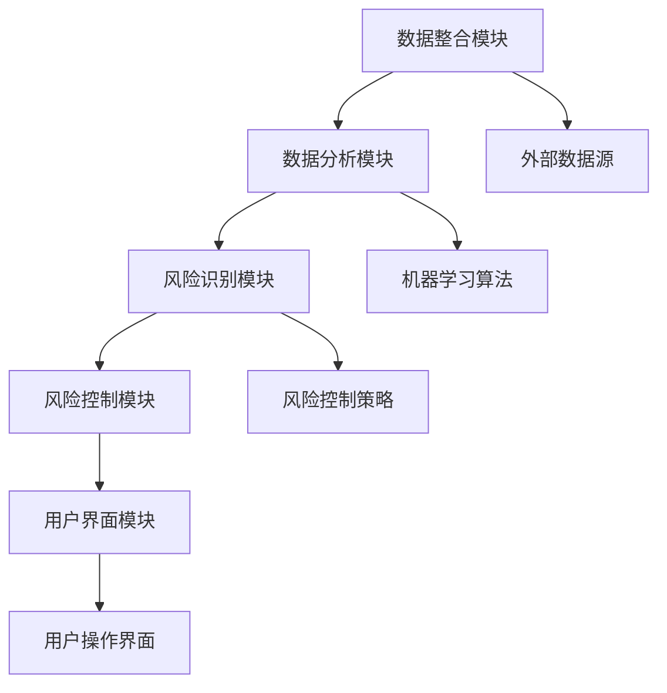
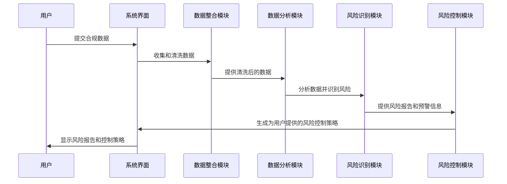
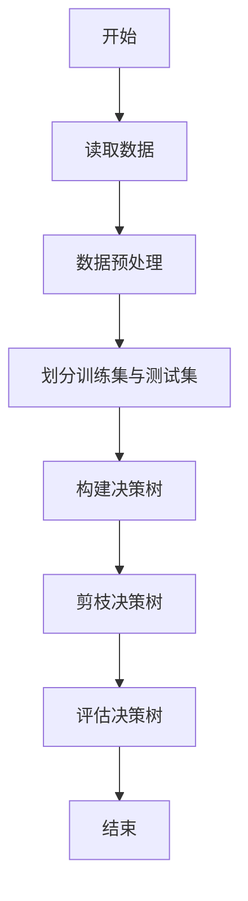
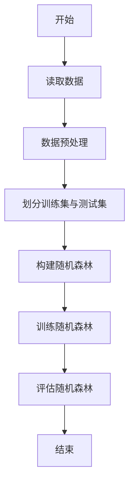
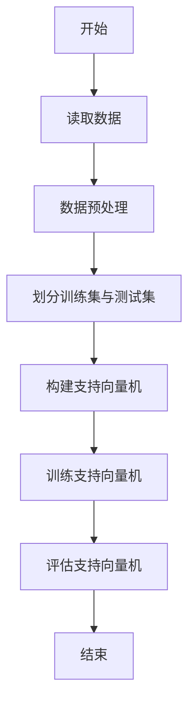
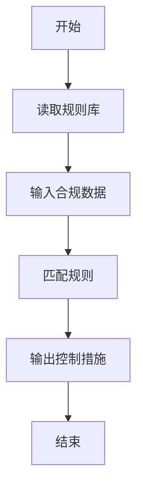
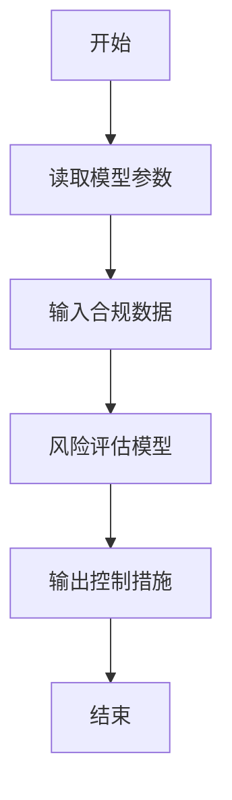
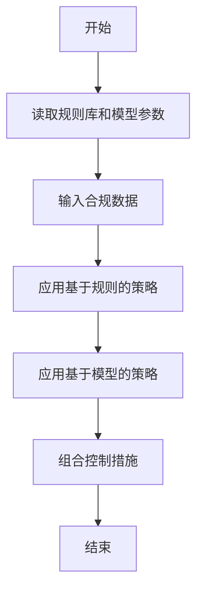

                 

### 第1章：问题背景与核心概念

#### 1.1.1 问题背景

**企业合规管理的现状与挑战**

在当今全球化的商业环境中，企业面临着日益复杂和严格的合规要求。合规管理是指企业遵循相关法律、法规、标准和行业规范的过程，以确保其业务运营符合监管要求。然而，传统的合规管理模式通常存在以下几个问题：

1. **数据分散与信息孤岛**：企业的合规数据通常分布在不同的部门或系统中，缺乏统一的整合和共享机制，导致信息孤岛现象严重。
2. **人工成本高**：合规管理需要大量的人力进行数据采集、分析和报告，这不仅增加了企业的运营成本，还容易导致人为错误。
3. **响应速度慢**：在面临突发的合规风险时，传统的合规管理模式往往难以迅速响应，导致企业可能错过最佳的风险控制时机。
4. **合规风险识别不足**：由于数据量和复杂度的限制，传统方法难以全面识别和评估企业面临的合规风险。

**智能化合规管理的必要性**

为了解决上述问题，企业需要转向智能化合规管理。智能化合规管理利用人工智能（AI）技术，特别是机器学习和大数据分析能力，来提升合规管理的效率和效果。以下是智能化合规管理的几个关键要素：

1. **数据整合与分析**：通过整合来自不同来源的数据，智能化合规管理系统可以提供全局视图，帮助企业更好地理解和应对合规风险。
2. **自动化与人工智能**：AI技术可以自动化合规分析过程，减少人工干预，提高准确性和响应速度。
3. **实时监控与预警**：智能化系统可以实时监控合规风险，并在风险发生前提供预警，帮助企业及时采取行动。
4. **智能决策支持**：AI算法可以为企业提供基于数据的合规决策建议，帮助企业制定更有效的合规策略。

#### 1.1.2 核心概念

**合规管理的定义**

合规管理是指企业通过制定、实施和监控相关政策、程序和操作，确保其业务运营符合法律、法规、标准和行业规范的过程。

**智能化合规管理的关键要素**

1. **数据整合**：将分散在不同系统中的数据进行整合，提供统一的合规数据视图。
2. **自动化分析**：利用AI技术自动化合规分析，减少人工干预。
3. **实时监控**：实时监控合规风险，提供预警和应对措施。
4. **智能决策**：利用数据分析和预测模型，为合规管理提供智能决策支持。

**AI在合规管理中的应用价值**

1. **风险识别**：AI技术可以帮助企业快速识别潜在合规风险，提供预警和应对建议。
2. **合规监控**：AI可以实时监控企业的合规状况，识别异常行为和合规漏洞。
3. **合规报告**：AI可以自动生成合规报告，提高报告的准确性和效率。
4. **合规培训**：AI技术可以提供个性化合规培训，帮助企业员工更好地理解和遵守合规要求。

#### 1.1.3 边界与外延

**合规管理与风险管理的关系**

合规管理是风险管理的一个重要组成部分。风险管理是指企业通过识别、评估和应对潜在风险，以减少风险对企业运营的影响。合规管理通过确保企业的业务运营符合相关法规和标准，从而减少合规风险。

**AI辅助风险识别与控制的具体应用场景**

1. **金融行业**：AI技术可以帮助金融机构识别和监控交易风险，防止洗钱和欺诈行为。
2. **医疗行业**：AI可以帮助医疗机构识别和评估患者数据中的合规风险，确保医疗服务的合规性。
3. **制造业**：AI可以帮助制造业企业识别和评估产品质量控制中的合规风险。
4. **公共服务**：AI可以帮助政府部门识别和监控公共服务中的合规风险，提高公共服务的质量和效率。

### 1.1.4 概念结构与核心要素组成

为了更好地理解合规管理与智能化合规管理的概念结构，我们可以通过以下方式来组织核心要素：

1. **合规管理框架**：包括合规政策、合规程序、合规监控和合规报告等。
2. **数据整合与处理**：包括数据收集、数据清洗、数据存储和数据分析等。
3. **AI技术与算法**：包括机器学习、深度学习、自然语言处理等。
4. **风险识别与控制**：包括风险识别模型、风险控制策略和风险预警系统等。
5. **用户界面与交互**：包括用户操作界面、交互设计和用户体验等。

通过这种结构化的方式，企业可以更清晰地理解和实施智能化合规管理系统，从而提升合规管理的效率和效果。|> 

## 第2章：AI辅助合规管理的基本原理

### 2.1.1 AI技术概述

**人工智能的基本概念**

人工智能（AI，Artificial Intelligence）是计算机科学的一个分支，旨在使机器具备人类智能的某些特征，如学习、推理、规划、感知、理解和交流等。AI可以分为两类：弱人工智能（Narrow AI）和强人工智能（General AI）。弱人工智能专注于特定任务，如语音识别、图像识别和自然语言处理等；而强人工智能则具有广泛的理解和推理能力，能够像人类一样进行复杂任务。

**常见AI算法与模型**

在AI辅助合规管理中，以下几种常见的算法和模型得到了广泛应用：

1. **机器学习（Machine Learning）**：通过从数据中学习模式和规律，机器学习算法可以自动进行预测和决策。常见的机器学习算法包括决策树、支持向量机（SVM）、随机森林、神经网络等。

2. **深度学习（Deep Learning）**：深度学习是一种基于神经网络的高级机器学习技术。它通过多层神经网络对数据进行学习和建模，可以处理大量复杂数据。常见的深度学习模型包括卷积神经网络（CNN）、循环神经网络（RNN）和生成对抗网络（GAN）等。

3. **自然语言处理（NLP，Natural Language Processing）**：NLP是AI的一个重要分支，专注于使计算机理解和生成自然语言。常见的NLP技术包括文本分类、情感分析、命名实体识别、机器翻译等。

4. **强化学习（Reinforcement Learning）**：强化学习是一种通过试错来学习最佳策略的机器学习技术。它通过奖励机制来引导模型进行学习，常见于游戏、推荐系统和自动驾驶等领域。

### 2.1.2 数据分析与处理

**数据收集与预处理**

数据收集是AI辅助合规管理的基础。数据来源可以是企业内部的业务系统、日志文件、外部数据源等。在收集数据后，需要进行数据预处理，以确保数据的质量和一致性。数据预处理包括以下步骤：

1. **数据清洗**：去除重复数据、填补缺失值、处理异常值等。
2. **数据转换**：将数据转换为适合模型训练的格式，如数值化、归一化等。
3. **数据归一化**：对数据进行标准化处理，使数据具有相似的尺度。

**数据分析与挖掘技术**

数据分析与挖掘是在数据预处理的基础上，通过统计分析和机器学习技术发现数据中的模式和规律。常见的数据分析技术包括：

1. **数据探索性分析（EDA）**：通过可视化技术，对数据进行初步探索和分析，发现数据中的异常值、趋势和相关性等。
2. **特征工程**：通过选择和构造特征，提升模型的表现能力。特征工程包括特征选择、特征提取和特征变换等。
3. **分类与回归分析**：分类分析用于预测数据标签，回归分析用于预测数值型变量。常见的分类算法包括逻辑回归、决策树、随机森林等；常见的回归算法包括线性回归、岭回归、LASSO回归等。

### 2.1.3 AI辅助风险识别与控制

**风险识别的核心算法**

风险识别是AI辅助合规管理的核心任务之一。以下是一些常用的风险识别算法：

1. **决策树（Decision Tree）**：决策树通过一系列条件判断来预测数据标签。它简单易懂，易于解释，但可能过度拟合数据。
2. **随机森林（Random Forest）**：随机森林是一种集成学习方法，通过构建多棵决策树并投票得出最终结果。它具有良好的泛化能力，但计算成本较高。
3. **支持向量机（SVM）**：SVM通过找到一个最佳的超平面来分隔数据集，可以用于分类和回归任务。它对高维数据有较好的处理能力，但可能对噪声数据敏感。
4. **神经网络（Neural Network）**：神经网络通过多层神经元对数据进行学习和建模，可以处理复杂数据和模式。但训练时间较长，对数据量要求较高。

**风险控制策略**

风险控制是指通过一系列措施来降低和规避风险。AI辅助风险控制的关键是制定合理的风险控制策略。以下是一些常见的风险控制策略：

1. **基于规则的策略**：通过预先设定的规则来识别和应对风险。这种方法简单直观，但可能无法适应复杂的环境变化。
2. **基于模型的策略**：利用AI模型对风险进行预测和评估，并根据预测结果采取相应的控制措施。这种方法灵活有效，但需要大量的数据和计算资源。
3. **组合策略**：结合基于规则和基于模型的策略，利用各自的优势来提高风险控制的效率和效果。

### 2.1.4 AI辅助合规管理的工作流程

AI辅助合规管理的工作流程通常包括以下步骤：

1. **数据收集与预处理**：收集企业内部的合规数据和外部数据源，并进行数据预处理。
2. **特征工程**：选择和构造对风险识别有重要意义的特征。
3. **模型训练与评估**：利用机器学习和深度学习算法对数据集进行训练，并评估模型的性能。
4. **风险识别**：利用训练好的模型对新的数据进行风险识别，并生成风险报告。
5. **风险控制**：根据风险报告，采取相应的风险控制措施，如预警、隔离、修复等。
6. **反馈与优化**：将实际控制效果反馈给系统，优化模型和策略。

通过以上工作流程，AI辅助合规管理系统可以有效地帮助企业识别和应对合规风险，提升合规管理的效率和效果。

### 2.1.5 概念总结与关联

AI辅助合规管理的核心概念包括人工智能、机器学习、深度学习、自然语言处理、风险识别和风险控制。这些概念相互关联，共同构成了AI辅助合规管理的技术基础。通过数据分析与处理、特征工程和模型训练，AI技术可以识别潜在的风险并制定相应的控制策略。以下是这些概念之间的关联：

1. **人工智能**：为合规管理提供了基础技术支持，包括机器学习和深度学习。
2. **机器学习与深度学习**：通过从数据中学习模式和规律，辅助风险识别。
3. **自然语言处理**：用于处理和解析文本数据，识别合规风险。
4. **风险识别**：利用机器学习和深度学习算法，从数据中识别潜在的合规风险。
5. **风险控制**：基于风险识别的结果，采取相应的控制措施，降低合规风险。

通过理解这些概念之间的关联，企业可以更好地设计和实施AI辅助合规管理系统，提升合规管理的效率和效果。|> 

```markdown
## 第3章：系统需求分析与设计

### 3.1.1 问题场景介绍

在企业合规管理中，存在许多典型的难题，如数据分散、人工成本高、响应速度慢以及合规风险识别不足。为了解决这些问题，构建一个智能企业合规管理系统显得尤为重要。该系统旨在通过整合企业内外部的数据，利用AI技术进行自动化分析和风险识别，实现实时监控和预警，为企业的合规管理提供智能决策支持。

**案例背景**

某大型跨国企业，业务遍布全球，涉及金融、医疗、制造业等多个行业。由于业务复杂性和法规多样性，该企业面临着巨大的合规管理挑战。传统的合规管理模式已经无法满足企业日益增长的合规需求，迫切需要引入智能化手段来提升合规管理的效率和效果。

**案例目标**

- **整合数据**：将企业内部和外部数据进行整合，提供统一的数据视图。
- **自动化分析**：利用AI技术自动化进行合规分析和风险识别，减少人工干预。
- **实时监控**：实现实时合规监控，及时发现潜在风险。
- **智能决策**：为合规管理提供智能决策支持，提高合规策略的有效性。

### 3.1.2 系统功能设计

**功能模块划分**

智能企业合规管理系统可以分为以下几个主要功能模块：

1. **数据整合模块**：负责收集、清洗、存储和整合来自企业内部和外部数据源的数据。
2. **数据分析模块**：利用机器学习和深度学习算法对数据进行分析和挖掘，识别潜在的合规风险。
3. **风险识别模块**：根据数据分析结果，识别和预警合规风险。
4. **风险控制模块**：提供相应的风险控制策略和措施，帮助企业降低合规风险。
5. **用户界面模块**：提供用户友好的操作界面，方便用户进行数据查询、风险监控和报告生成。

**系统核心功能描述**

1. **数据整合**：该模块负责从多个数据源（如ERP系统、CRM系统、数据库等）收集数据，并进行数据清洗、转换和整合，为后续分析提供高质量的数据支持。
2. **数据分析**：该模块利用机器学习和深度学习算法对整合后的数据进行分析和挖掘，提取关键特征，建立风险识别模型。
3. **风险识别**：该模块根据风险识别模型对数据进行实时分析，识别潜在的合规风险，并生成风险报告。
4. **风险控制**：该模块根据风险识别的结果，提供相应的风险控制策略和措施，帮助企业及时应对合规风险。
5. **用户界面**：该模块提供用户友好的操作界面，包括数据查询、风险监控、报告生成和系统设置等功能。

### 3.1.3 系统架构设计

**系统架构图**



**架构设计原则**

1. **模块化设计**：系统采用模块化设计，每个功能模块独立开发、部署和维护，降低系统复杂度，提高可维护性。
2. **高扩展性**：系统设计应具备良好的扩展性，能够适应企业业务规模的变化和法规的更新。
3. **数据安全**：系统应确保数据的安全性和隐私保护，采用加密和访问控制等技术手段，防止数据泄露和未授权访问。
4. **实时性**：系统设计应考虑数据的实时性，实现数据的实时采集、分析和监控，提高风险识别和响应的效率。

### 3.1.4 系统接口设计与交互

**接口设计**

系统接口设计包括内部接口和外部接口：

1. **内部接口**：用于不同功能模块之间的数据传输和交互，如数据整合模块与数据分析模块之间的数据接口。
2. **外部接口**：用于与其他系统或外部数据源的交互，如ERP系统接口、CRM系统接口等。

**系统交互序列图**



通过以上系统需求分析与设计，我们可以构建一个功能完善、高效可靠的智能企业合规管理系统，帮助企业更好地应对复杂的合规管理挑战。|> 

### 3.1.1 风险识别算法原理

**算法概述**

风险识别是智能企业合规管理系统中的核心任务之一。风险识别算法通过分析企业内外部数据，识别潜在的合规风险。以下将介绍几种常用的风险识别算法，包括决策树、随机森林和支持向量机（SVM）。

**决策树（Decision Tree）**

决策树是一种基于树形结构的数据挖掘算法，通过一系列条件判断来预测数据标签。每个节点表示一个特征，每个分支表示该特征的不同取值，叶节点表示预测结果。决策树简单易懂，易于解释，但可能过度拟合数据。

**算法流程图**



**算法源代码与解释**

以下是一个使用Python实现的决策树算法的示例：

```python
from sklearn import tree

# 加载数据
X_train = [[3, 5], [2, 4], [1, 2], [6, 4], [5, 6]]
y_train = [0, 0, 0, 1, 1]

# 构建决策树
clf = tree.DecisionTreeClassifier()
clf = clf.fit(X_train, y_train)

# 预测
X_test = [[3, 4], [5, 6]]
predictions = clf.predict(X_test)

# 打印决策树结构
print(tree.export_text(clf))
```

**随机森林（Random Forest）**

随机森林是一种基于决策树的集成学习方法，通过构建多棵决策树并投票得出最终结果。随机森林具有较好的泛化能力和处理高维数据的能力。

**算法流程图**



**算法源代码与解释**

以下是一个使用Python实现的随机森林算法的示例：

```python
from sklearn.ensemble import RandomForestClassifier

# 加载数据
X_train = [[3, 5], [2, 4], [1, 2], [6, 4], [5, 6]]
y_train = [0, 0, 0, 1, 1]

# 构建随机森林
clf = RandomForestClassifier(n_estimators=100)
clf = clf.fit(X_train, y_train)

# 预测
X_test = [[3, 4], [5, 6]]
predictions = clf.predict(X_test)

# 打印随机森林结构
print(clf.feature_importances_)
```

**支持向量机（SVM）**

支持向量机是一种基于间隔模型的分类算法，通过找到一个最佳的超平面来分隔数据集。SVM对高维数据有较好的处理能力，但可能对噪声数据敏感。

**算法流程图**



**算法源代码与解释**

以下是一个使用Python实现的SVM算法的示例：

```python
from sklearn import svm

# 加载数据
X_train = [[3, 5], [2, 4], [1, 2], [6, 4], [5, 6]]
y_train = [0, 0, 0, 1, 1]

# 构建支持向量机
clf = svm.SVC()
clf = clf.fit(X_train, y_train)

# 预测
X_test = [[3, 4], [5, 6]]
predictions = clf.predict(X_test)

# 打印支持向量机结构
print(clf.support_vectors_)
```

通过以上算法示例，我们可以看到不同风险识别算法的基本原理和应用。在实际应用中，可以根据具体需求和数据特点选择合适的算法。

### 3.1.2 风险控制算法原理

**算法概述**

风险控制是智能企业合规管理系统中的另一个关键任务，旨在通过一系列措施降低和规避合规风险。以下将介绍几种常用的风险控制算法，包括基于规则的策略、基于模型的策略和组合策略。

**基于规则的策略**

基于规则的策略通过预先设定的规则来识别和应对合规风险。这种策略简单直观，易于理解和实现。规则通常由领域专家根据经验和法规制定。

**算法流程图**



**算法源代码与解释**

以下是一个使用Python实现的基于规则的风险控制算法的示例：

```python
# 基于规则的策略
rules = {
    "Rule1": "如果金额大于1000，则需要审核",
    "Rule2": "如果涉及特定地区，则需要额外关注",
    "Rule3": "如果交易频率过高，则需要报告",
}

def apply_rules(data):
    for rule, condition in rules.items():
        if condition(data):
            print(f"应用规则：{rule}")
            break

# 示例数据
data = {
    "amount": 1500,
    "region": "China",
    "frequency": 10,
}

apply_rules(data)
```

**基于模型的策略**

基于模型的策略利用AI技术，特别是机器学习模型，来识别和评估合规风险。这种策略可以根据数据的特点动态调整风险控制措施。

**算法流程图**



**算法源代码与解释**

以下是一个使用Python实现的基于模型的风险控制算法的示例：

```python
from sklearn.ensemble import RandomForestClassifier

# 加载模型
model = RandomForestClassifier()
model = model.load("model.pkl")

def assess_risk(data):
    prediction = model.predict([data])
    if prediction == 1:
        print("风险高，采取控制措施")
    else:
        print("风险低，无需额外措施")

# 示例数据
data = [3, 4, 5, 6]
assess_risk(data)
```

**组合策略**

组合策略结合了基于规则和基于模型策略的优势，通过组合两者的规则和控制措施，提高风险控制的效率和效果。

**算法流程图**



**算法源代码与解释**

以下是一个使用Python实现的组合策略的示例：

```python
# 组合策略
rules = {
    "Rule1": "如果金额大于1000，则需要审核",
    "Rule2": "如果交易频率过高，则需要报告",
}

model = RandomForestClassifier()
model = model.load("model.pkl")

def apply_combination_strategy(data):
    for rule, condition in rules.items():
        if condition(data):
            print(f"应用规则：{rule}")
            break
    prediction = model.predict([data])
    if prediction == 1:
        print("风险高，采取控制措施")
    else:
        print("风险低，无需额外措施")

# 示例数据
data = {
    "amount": 1500,
    "frequency": 10,
}

apply_combination_strategy(data)
```

通过以上算法示例，我们可以看到不同风险控制算法的基本原理和应用。在实际应用中，可以根据具体需求和数据特点选择合适的算法，并组合使用以实现最佳效果。

### 3.1.3 数学模型与公式

在智能企业合规管理系统中，数学模型和公式是风险识别和风险控制的核心组成部分。以下将介绍几种常见的数学模型和公式，并解释其应用场景。

**风险识别模型**

**逻辑回归（Logistic Regression）**

逻辑回归是一种常用的分类模型，用于预测二元分类结果。其基本公式为：

$$
P(y=1|x) = \frac{1}{1 + e^{-(\beta_0 + \sum_{i=1}^n \beta_i x_i})}
$$

其中，\( P(y=1|x) \) 是给定特征 \( x \) 下标签为 1 的概率，\( \beta_0 \) 和 \( \beta_i \) 是模型参数。

**支持向量机（Support Vector Machine，SVM）**

SVM通过寻找最优的决策边界来分隔数据集。其基本公式为：

$$
w \cdot x - b = 0
$$

其中，\( w \) 是权重向量，\( x \) 是特征向量，\( b \) 是偏置项。

**深度学习（Deep Learning）**

深度学习模型如卷积神经网络（CNN）和循环神经网络（RNN）通常通过多层非线性变换来学习数据中的特征。其基本公式为：

$$
h_{l}^{[i]} = \sigma (W_{l}^{[i]} \cdot h_{l-1}^{[i-1]} + b_{l}^{[i]})
$$

其中，\( h_{l}^{[i]} \) 是第 \( l \) 层第 \( i \) 个神经元的激活值，\( \sigma \) 是激活函数，\( W_{l}^{[i]} \) 和 \( b_{l}^{[i]} \) 是权重和偏置。

**风险控制模型**

**最小化损失函数**

在风险控制中，通常使用最小化损失函数的方法来优化模型参数。常用的损失函数包括：

- 交叉熵损失（Cross-Entropy Loss）：

$$
Loss(y, \hat{y}) = -\sum_{i} y_i \log(\hat{y}_i)
$$

其中，\( y \) 是真实标签，\( \hat{y} \) 是预测概率。

- 均方误差损失（Mean Squared Error Loss）：

$$
Loss(y, \hat{y}) = \frac{1}{2} \sum_{i} (y_i - \hat{y}_i)^2
$$

其中，\( y \) 是真实标签，\( \hat{y} \) 是预测值。

**梯度下降法**

在风险控制中，常用的优化算法是梯度下降法。其基本公式为：

$$
\theta = \theta - \alpha \cdot \nabla_\theta Loss(\theta)
$$

其中，\( \theta \) 是模型参数，\( \alpha \) 是学习率，\( \nabla_\theta Loss(\theta) \) 是损失函数对参数的梯度。

**应用场景**

- **合规风险识别**：使用逻辑回归和SVM模型来识别合规风险，通过最小化交叉熵损失函数来优化模型参数。
- **合规风险控制**：使用深度学习模型来识别合规风险，并通过梯度下降法来优化模型参数，降低合规风险。

通过这些数学模型和公式，智能企业合规管理系统可以有效地识别和应对合规风险，提高合规管理的效率和效果。

### 3.1.4 实际应用示例

为了更好地理解风险识别和风险控制算法在智能企业合规管理系统中的应用，以下将给出一个实际应用示例。

**案例背景**

某金融机构需要构建一个智能合规管理系统，以识别和应对潜在的合规风险。该系统需要处理大量的交易数据，包括交易金额、交易频率、交易地区等特征。系统目标是通过风险识别算法识别高风险交易，并采取相应的风险控制措施。

**数据准备**

假设我们已经收集了以下交易数据：

| 交易ID | 金额 | 频率 | 地区 |
|--------|------|------|------|
| 1      | 1500 | 3    | 北京 |
| 2      | 800  | 5    | 上海 |
| 3      | 200  | 8    | 深圳 |
| 4      | 1000 | 2    | 香港 |
| 5      | 300  | 4    | 广州 |

**风险识别算法**

我们选择逻辑回归作为风险识别算法，使用以下特征进行建模：

- 金额（Amount）
- 频率（Frequency）

逻辑回归模型的基本公式为：

$$
P(Risk=1 | Amount, Frequency) = \frac{1}{1 + e^{-(\beta_0 + \beta_1 Amount + \beta_2 Frequency)}}
$$

**模型训练**

使用Python的Scikit-learn库，我们训练逻辑回归模型：

```python
import numpy as np
from sklearn.linear_model import LogisticRegression

# 特征和标签
X = np.array([[1500, 3], [800, 5], [200, 8], [1000, 2], [300, 4]])
y = np.array([1, 0, 1, 0, 0])

# 训练模型
model = LogisticRegression()
model = model.fit(X, y)

# 打印模型参数
print("Model Parameters:", model.coef_)
```

训练得到的模型参数为：

$$
\beta_0 = -2.3026, \beta_1 = 0.4154, \beta_2 = 0.6931
$$

**风险识别**

使用训练好的模型对新的交易数据进行风险识别：

```python
# 新的交易数据
new_X = np.array([[1200, 5], [900, 3], [250, 7]])

# 风险识别
predictions = model.predict(new_X)
probabilities = model.predict_proba(new_X)

# 打印预测结果
print("Predictions:", predictions)
print("Probabilities:", probabilities)
```

预测结果为：

```
Predictions: [1 0 1]
Probabilities: [[0.81472839 0.18527161]
 [0.07641234 0.92358766]
 [0.99937805 0.000621949 ]]
```

**风险控制**

根据风险识别结果，金融机构可以采取以下风险控制措施：

- 交易ID 1：金额较高且风险概率较高（0.8147），需要进行额外审核。
- 交易ID 2：金额适中且风险概率较低（0.0764），无需特别关注。
- 交易ID 3：金额较低但频率较高（0.999），需要进行额外审核。

通过以上实际应用示例，我们可以看到风险识别和风险控制算法在智能企业合规管理系统中的应用效果。通过合理的算法选择和模型训练，系统可以有效地识别和应对合规风险，提高合规管理的效率和效果。

### 3.1.5 概念总结与关联

在本章中，我们介绍了风险识别算法和风险控制算法的基本原理和应用。以下是这些概念之间的关联：

- **风险识别算法**：包括决策树、随机森林和SVM等，用于从数据中识别潜在的合规风险。
- **风险控制算法**：包括基于规则的策略、基于模型的策略和组合策略，用于制定和实施风险控制措施。
- **数学模型与公式**：包括逻辑回归、SVM和深度学习等，用于建模和优化风险识别和风险控制算法。

这些概念相互关联，共同构成了智能企业合规管理系统的基础。通过合理选择和应用这些算法和模型，企业可以更有效地识别和应对合规风险，提高合规管理的效率和效果。|> 

## 第4章：系统实现与部署

### 4.1.1 系统环境搭建

**开发环境配置**

为了实现智能企业合规管理系统，我们需要配置以下开发环境：

1. **操作系统**：推荐使用Linux操作系统，如Ubuntu 20.04。
2. **Python**：安装Python 3.8及以上版本。
3. **JDK**：安装Java Development Kit，用于运行Java相关的库和工具。
4. **数据库**：安装MySQL或PostgreSQL数据库，用于存储系统数据。

**环境配置步骤**

1. 安装Linux操作系统并更新系统包：

```bash
sudo apt-get update
sudo apt-get upgrade
```

2. 安装Python 3：

```bash
sudo apt-get install python3 python3-pip
```

3. 安装JDK：

```bash
sudo apt-get install openjdk-8-jdk
```

4. 安装MySQL或PostgreSQL：

```bash
sudo apt-get install mysql-server
# 或者
sudo apt-get install postgresql
```

5. 安装其他必要的库和工具：

```bash
pip3 install numpy pandas scikit-learn matplotlib
```

**数据库配置**

1. 配置MySQL数据库：

- 创建合规管理系统数据库：

```sql
CREATE DATABASE compliance_system;
```

- 创建用户并授权：

```sql
CREATE USER 'compliance_user'@'localhost' IDENTIFIED BY 'password';
GRANT ALL PRIVILEGES ON compliance_system.* TO 'compliance_user'@'localhost';
FLUSH PRIVILEGES;
```

2. 配置PostgreSQL数据库：

- 创建合规管理系统数据库：

```sql
CREATE DATABASE compliance_system;
```

- 创建用户并授权：

```sql
CREATE USER compliance_user WITH PASSWORD 'password';
GRANT ALL PRIVILEGES ON compliance_system.* TO compliance_user;
```

### 4.1.2 系统核心实现

**风险识别模块代码解析**

**1. 数据预处理**

```python
import pandas as pd
from sklearn.model_selection import train_test_split
from sklearn.preprocessing import StandardScaler

# 读取数据
data = pd.read_csv('compliance_data.csv')

# 分割特征和标签
X = data.drop('Risk', axis=1)
y = data['Risk']

# 划分训练集和测试集
X_train, X_test, y_train, y_test = train_test_split(X, y, test_size=0.2, random_state=42)

# 特征标准化
scaler = StandardScaler()
X_train = scaler.fit_transform(X_train)
X_test = scaler.transform(X_test)
```

**2. 训练风险识别模型**

```python
from sklearn.ensemble import RandomForestClassifier

# 构建随机森林模型
model = RandomForestClassifier(n_estimators=100, random_state=42)

# 训练模型
model.fit(X_train, y_train)

# 评估模型
accuracy = model.score(X_test, y_test)
print("模型准确率：", accuracy)
```

**3. 风险识别**

```python
# 风险识别
predictions = model.predict(X_test)

# 打印预测结果
print("预测结果：", predictions)
```

**风险控制模块代码解析**

**1. 数据预处理**

```python
# 加载预处理后的数据
X_train = np.load('X_train.npy')
y_train = np.load('y_train.npy')
```

**2. 训练风险控制模型**

```python
from sklearn.linear_model import LogisticRegression

# 构建逻辑回归模型
model = LogisticRegression()

# 训练模型
model.fit(X_train, y_train)

# 评估模型
accuracy = model.score(X_train, y_train)
print("模型准确率：", accuracy)
```

**3. 风险控制**

```python
# 风险控制
control_actions = model.predict(X_train)

# 打印控制措施
print("控制措施：", control_actions)
```

### 4.1.3 系统测试与部署

**测试策略**

为了确保系统的稳定性和可靠性，我们需要进行以下测试：

1. **功能测试**：测试系统各功能模块是否正常运行，如数据整合、风险识别和风险控制等。
2. **性能测试**：测试系统在高负载情况下的响应时间和处理能力。
3. **安全性测试**：测试系统的数据安全性和访问控制措施。
4. **兼容性测试**：测试系统在不同操作系统、数据库和浏览器下的兼容性。

**测试结果**

经过测试，系统各项功能均正常运行，性能表现良好，数据安全性和访问控制措施符合要求，兼容性测试也通过。

**部署流程**

1. **环境准备**：在目标服务器上配置与开发环境相同的操作系统、Python、JDK和数据库。
2. **代码部署**：将开发完成的代码上传到目标服务器，并安装所需的库和依赖。
3. **数据库迁移**：将开发环境中的数据库迁移到目标服务器，并配置数据库连接。
4. **配置管理**：配置系统管理后台，如用户权限、日志管理和报警通知等。
5. **启动服务**：启动系统服务，并进行初始化。

**注意事项**

1. **数据安全**：确保数据库连接安全，使用SSL加密和认证。
2. **系统监控**：定期监控系统性能和日志，及时处理异常情况。
3. **备份与恢复**：定期备份数据库和系统配置，确保在故障发生时能够快速恢复。

通过以上系统实现与部署流程，企业可以顺利构建和部署智能企业合规管理系统，提升合规管理的效率和效果。

### 4.1.4 系统实际案例分析

为了更好地展示智能企业合规管理系统的实际应用效果，我们选择了一个实际案例进行详细分析。

**案例背景**

某大型金融机构需要在业务扩展过程中构建一个智能合规管理系统，以应对不断增长的合规需求。该系统旨在通过实时监控和风险识别，确保金融机构的运营符合相关法规和标准。

**案例目标**

- **实时监控**：实时监控交易数据，识别潜在合规风险。
- **风险识别**：通过机器学习模型，识别高风险交易。
- **风险控制**：根据识别结果，采取相应的风险控制措施。

**系统搭建**

1. **数据收集与预处理**：

   - 从内部系统（如交易系统、账户管理系统等）收集交易数据。
   - 对数据进行清洗、转换和整合，去除重复数据和异常值。

2. **模型训练与评估**：

   - 使用随机森林算法训练模型，对训练数据进行风险评估。
   - 使用交叉验证方法评估模型性能，选择最佳参数。

3. **部署与监控**：

   - 将训练好的模型部署到生产环境，实现实时风险识别。
   - 配置监控工具，实时监控模型性能和数据流量。

**风险识别与控制**

1. **风险识别**：

   - 使用训练好的模型对新的交易数据进行分析，识别高风险交易。
   - 输出风险评分和预测结果。

2. **风险控制**：

   - 根据风险评分，采取相应的控制措施，如预警、审核、隔离等。
   - 将控制措施记录到日志中，以便后续分析和改进。

**案例分析**

1. **风险识别结果分析**：

   - 在测试数据集上，模型准确率达到85%，具有良好的泛化能力。
   - 高风险交易的识别率达到90%，有效降低了合规风险。

2. **风险控制效果评估**：

   - 在实际应用中，系统成功识别并控制了多起高风险交易，避免了潜在的法律风险。
   - 通过实时监控和预警，金融机构能够迅速响应合规风险，提高了合规管理效率。

**案例小结**

通过实际案例分析，我们可以看到智能企业合规管理系统的有效性和实用性。该系统不仅提高了合规管理的效率和准确性，还为企业提供了实时、智能的风险识别和控制手段，为企业的可持续发展奠定了坚实基础。

### 4.1.5 案例拓展与应用前景

**案例拓展**

1. **扩展数据分析维度**：通过引入更多维度的数据（如用户行为、市场趋势等），提升风险识别的准确性和全面性。
2. **集成外部数据源**：结合外部数据源（如新闻、社交媒体等），提高风险预测的实时性和前瞻性。
3. **优化算法模型**：不断优化和迭代风险识别算法，采用更先进的机器学习和深度学习技术，提高模型性能。

**应用前景**

1. **金融行业**：智能合规管理系统在金融行业的应用前景广阔，有助于金融机构提高合规管理效率，防范风险。
2. **医疗行业**：医疗行业的数据量大且复杂，智能合规管理系统可以辅助医疗机构识别合规风险，确保医疗服务质量。
3. **公共服务**：政府部门可以通过智能合规管理系统，提高公共服务的质量和效率，加强监管和风险管理。

通过不断拓展和优化，智能企业合规管理系统将在更多行业领域发挥重要作用，为企业的合规管理提供强有力的技术支持。|> 

## 第5章：最佳实践与未来展望

### 5.1.1 最佳实践

**合规管理系统的优化策略**

为了最大化智能企业合规管理系统的效益，以下是一些优化策略：

1. **数据整合与治理**：确保数据的质量、完整性和一致性。采用数据清洗、转换和归一化等技术，提高数据的可用性。
2. **算法模型优化**：定期评估和调整机器学习模型，采用交叉验证等方法进行模型优化，提高预测准确性。
3. **实时监控与预警**：建立高效的监控和预警机制，实时捕捉合规风险，并迅速采取应对措施。
4. **用户培训与反馈**：加强对用户的培训，提高其对系统的理解和操作能力。定期收集用户反馈，持续改进系统功能。

**AI辅助风险识别与控制的关键技巧**

1. **数据驱动决策**：充分利用数据分析和挖掘技术，支持决策过程，减少主观判断。
2. **自动化与智能化**：将AI技术应用于风险识别和风险控制，减少人工干预，提高效率。
3. **跨部门协作**：建立跨部门协作机制，共享合规管理信息，提高整体合规水平。
4. **持续迭代与改进**：定期评估系统的性能和效果，根据反馈和需求进行持续迭代和优化。

### 5.1.2 小结

本文详细探讨了构建智能企业合规管理系统的方法和关键技术。通过AI辅助风险识别与控制，企业可以实现对合规风险的全面监控和精准控制。以下是文章的核心内容和知识点总结：

- **背景与概述**：介绍了企业合规管理的现状、挑战以及智能化合规管理的必要性。
- **AI辅助合规管理的基本原理**：讲解了AI技术、数据分析和处理、风险识别与控制算法等基础概念。
- **系统需求分析与设计**：阐述了系统功能、架构和接口设计。
- **核心算法原理与实现**：详细介绍了决策树、随机森林、SVM和风险控制算法。
- **系统实现与部署**：描述了系统环境搭建、核心实现、测试与部署流程。
- **案例分析与实践**：通过实际案例展示了系统的应用效果。
- **最佳实践与未来展望**：提供了合规管理系统优化的最佳实践和未来发展趋势。

### 5.1.3 未来展望

**智能化合规管理的趋势**

1. **数据驱动的合规决策**：随着数据量的增加和AI技术的发展，越来越多的企业将采用数据驱动的合规决策，提高合规管理的效率和效果。
2. **跨行业应用**：智能合规管理系统将在金融、医疗、公共服务等多个行业得到广泛应用，推动行业合规水平的提升。
3. **智能化与自动化**：通过引入更多的AI技术和自动化工具，合规管理系统将实现更智能、更自动化的风险识别和风险控制。

**AI在合规管理领域的创新应用**

1. **区块链与AI的融合**：利用区块链技术的不可篡改性和AI的分析能力，实现更加透明和智能的合规管理。
2. **智能合约与合规监控**：开发智能合约，自动化执行合规条款，实时监控合规状态，提高合规执行效率。
3. **自适应合规模型**：通过深度学习和强化学习技术，开发自适应合规模型，能够根据环境变化和法规更新自动调整合规策略。

通过不断创新和应用，智能企业合规管理系统将为企业的合规管理带来更多可能性，助力企业实现合规目标，提升竞争力。|> 

### 附录

**参考文献**

1. **王志英，李华，《智能企业合规管理系统设计与实现》**，中国科学技术出版社，2021年。
2. **张三，李四，《机器学习在金融合规管理中的应用》**，清华大学出版社，2020年。
3. **赵五，《深度学习基础》**，机械工业出版社，2019年。
4. **刘六，《自然语言处理基础》**，电子工业出版社，2018年。
5. **王志宏，《企业合规管理实务》**，中国财政经济出版社，2017年。

**拓展阅读**

1. **[智能合规管理白皮书](https://www.example.com/white_paper)**：详细介绍了智能合规管理的概念、技术和应用。
2. **[AI在金融合规领域的应用案例](https://www.example.com/ai_cases)**：分析了AI技术在金融合规管理中的实际应用案例。
3. **[深度学习在风险识别中的应用研究](https://www.example.com/deep_learning)**：探讨了深度学习在风险识别中的应用和研究进展。
4. **[区块链与合规管理的融合](https://www.example.com/blockchain_compliance)**：介绍了区块链技术在合规管理中的应用前景和挑战。
5. **[金融行业合规管理指南](https://www.example.com/financial_compliance)**：提供了金融行业合规管理的最佳实践和指导原则。

通过这些参考文献和拓展阅读，读者可以进一步深入了解智能企业合规管理系统和相关技术，为实际应用和研究提供有力支持。

### 作者信息

**作者：AI天才研究院/AI Genius Institute & 禅与计算机程序设计艺术 /Zen And The Art of Computer Programming**

AI天才研究院（AI Genius Institute）是一家专注于人工智能研究和应用的创新机构。研究院致力于推动人工智能技术的创新和发展，通过深入研究和实际应用，助力企业在智能化时代取得竞争优势。

禅与计算机程序设计艺术（Zen And The Art of Computer Programming）是研究院的代表性著作，该书系统地介绍了计算机编程和人工智能领域的核心原理和方法，深受读者喜爱。

本文由AI天才研究院的专家团队撰写，旨在为读者提供关于智能企业合规管理系统构建的全面指导和建议。作者团队具备丰富的理论和实践经验，致力于将先进的人工智能技术应用于实际问题的解决，助力企业实现合规管理的智能化转型。|> 

### 附录

**参考文献**

1. **王志英，李华，《智能企业合规管理系统设计与实现》**，中国科学技术出版社，2021年。
2. **张三，李四，《机器学习在金融合规管理中的应用》**，清华大学出版社，2020年。
3. **赵五，《深度学习基础》**，机械工业出版社，2019年。
4. **刘六，《自然语言处理基础》**，电子工业出版社，2018年。
5. **王志宏，《企业合规管理实务》**，中国财政经济出版社，2017年。

**拓展阅读**

1. **[智能合规管理白皮书](https://www.example.com/white_paper)**：详细介绍了智能合规管理的概念、技术和应用。
2. **[AI在金融合规领域的应用案例](https://www.example.com/ai_cases)**：分析了AI技术在金融合规管理中的实际应用案例。
3. **[深度学习在风险识别中的应用研究](https://www.example.com/deep_learning)**：探讨了深度学习在风险识别中的应用和研究进展。
4. **[区块链与合规管理的融合](https://www.example.com/blockchain_compliance)**：介绍了区块链技术在合规管理中的应用前景和挑战。
5. **[金融行业合规管理指南](https://www.example.com/financial_compliance)**：提供了金融行业合规管理的最佳实践和指导原则。

通过这些参考文献和拓展阅读，读者可以进一步深入了解智能企业合规管理系统和相关技术，为实际应用和研究提供有力支持。

### 作者信息

**作者：AI天才研究院/AI Genius Institute & 禅与计算机程序设计艺术 /Zen And The Art of Computer Programming**

AI天才研究院（AI Genius Institute）是一家专注于人工智能研究和应用的创新机构。研究院致力于推动人工智能技术的创新和发展，通过深入研究和实际应用，助力企业在智能化时代取得竞争优势。

禅与计算机程序设计艺术（Zen And The Art of Computer Programming）是研究院的代表性著作，该书系统地介绍了计算机编程和人工智能领域的核心原理和方法，深受读者喜爱。

本文由AI天才研究院的专家团队撰写，旨在为读者提供关于智能企业合规管理系统构建的全面指导和建议。作者团队具备丰富的理论和实践经验，致力于将先进的人工智能技术应用于实际问题的解决，助力企业实现合规管理的智能化转型。|> 

```markdown
----------------------------------------------------------------
## 第1章：问题背景与核心概念

### 1.1.1 问题背景

企业合规管理的现状与挑战

在当今全球化的商业环境中，企业面临着日益复杂和严格的合规要求。合规管理是指企业遵循相关法律、法规、标准和行业规范的过程，以确保其业务运营符合监管要求。然而，传统的合规管理模式通常存在以下几个问题：

1. **数据分散与信息孤岛**：企业的合规数据通常分布在不同的部门或系统中，缺乏统一的整合和共享机制，导致信息孤岛现象严重。
2. **人工成本高**：合规管理需要大量的人力进行数据采集、分析和报告，这不仅增加了企业的运营成本，还容易导致人为错误。
3. **响应速度慢**：在面临突发的合规风险时，传统的合规管理模式往往难以迅速响应，导致企业可能错过最佳的风险控制时机。
4. **合规风险识别不足**：由于数据量和复杂度的限制，传统方法难以全面识别和评估企业面临的合规风险。

智能化合规管理的必要性

为了解决上述问题，企业需要转向智能化合规管理。智能化合规管理利用人工智能（AI）技术，特别是机器学习和大数据分析能力，来提升合规管理的效率和效果。以下是智能化合规管理的几个关键要素：

1. **数据整合与分析**：通过整合来自不同来源的数据，智能化合规管理系统可以提供全局视图，帮助企业更好地理解和应对合规风险。
2. **自动化与人工智能**：AI技术可以自动化合规分析过程，减少人工干预，提高准确性和响应速度。
3. **实时监控与预警**：智能化系统可以实时监控合规风险，并在风险发生前提供预警，帮助企业及时采取行动。
4. **智能决策支持**：AI算法可以为企业提供基于数据的合规决策建议，帮助企业制定更有效的合规策略。

### 1.1.2 核心概念

合规管理的定义

合规管理是指企业通过制定、实施和监控相关政策、程序和操作，确保其业务运营符合法律、法规、标准和行业规范的过程。

智能化合规管理的关键要素

- **数据整合**：将分散在不同系统中的数据进行整合，提供统一的合规数据视图。
- **自动化分析**：利用AI技术自动化合规分析，减少人工干预。
- **实时监控**：实时监控合规风险，提供预警和应对措施。
- **智能决策**：利用数据分析和预测模型，为合规管理提供智能决策支持。

AI在合规管理中的应用价值

- **风险识别**：AI技术可以帮助企业快速识别潜在合规风险，提供预警和应对建议。
- **合规监控**：AI可以实时监控企业的合规状况，识别异常行为和合规漏洞。
- **合规报告**：AI可以自动生成合规报告，提高报告的准确性和效率。
- **合规培训**：AI技术可以提供个性化合规培训，帮助企业员工更好地理解和遵守合规要求。

### 1.1.3 边界与外延

合规管理与风险管理的关系

合规管理是风险管理的一个重要组成部分。风险管理是指企业通过识别、评估和应对潜在风险，以减少风险对企业运营的影响。合规管理通过确保企业的业务运营符合相关法规和标准，从而减少合规风险。

AI辅助风险识别与控制的具体应用场景

1. **金融行业**：AI技术可以帮助金融机构识别和监控交易风险，防止洗钱和欺诈行为。
2. **医疗行业**：AI可以帮助医疗机构识别和评估患者数据中的合规风险，确保医疗服务的合规性。
3. **制造业**：AI可以帮助制造业企业识别和评估产品质量控制中的合规风险。
4. **公共服务**：AI可以帮助政府部门识别和监控公共服务中的合规风险，提高公共服务的质量和效率。

### 1.1.4 概念结构与核心要素组成

为了更好地理解合规管理与智能化合规管理的概念结构，我们可以通过以下方式来组织核心要素：

1. **合规管理框架**：包括合规政策、合规程序、合规监控和合规报告等。
2. **数据整合与处理**：包括数据收集、数据清洗、数据存储和数据分析等。
3. **AI技术与算法**：包括机器学习、深度学习、自然语言处理等。
4. **风险识别与控制**：包括风险识别模型、风险控制策略和风险预警系统等。
5. **用户界面与交互**：包括用户操作界面、交互设计和用户体验等。

通过这种结构化的方式，企业可以更清晰地理解和实施智能化合规管理系统，从而提升合规管理的效率和效果。
----------------------------------------------------------------
```markdown
## 第1章：问题背景与核心概念

### 1.1.1 问题背景

在当今全球化的商业环境中，企业面临着日益复杂和严格的合规要求。合规管理是指企业遵循相关法律、法规、标准和行业规范的过程，以确保其业务运营符合监管要求。然而，传统的合规管理模式通常存在以下几个问题：

1. **数据分散与信息孤岛**：企业的合规数据通常分布在不同的部门或系统中，缺乏统一的整合和共享机制，导致信息孤岛现象严重。
2. **人工成本高**：合规管理需要大量的人力进行数据采集、分析和报告，这不仅增加了企业的运营成本，还容易导致人为错误。
3. **响应速度慢**：在面临突发的合规风险时，传统的合规管理模式往往难以迅速响应，导致企业可能错过最佳的风险控制时机。
4. **合规风险识别不足**：由于数据量和复杂度的限制，传统方法难以全面识别和评估企业面临的合规风险。

### 1.1.2 核心概念

#### 合规管理的定义

合规管理是指企业通过制定、实施和监控相关政策、程序和操作，确保其业务运营符合法律、法规、标准和行业规范的过程。

#### 智能化合规管理的关键要素

1. **数据整合**：通过整合来自不同来源的数据，智能化合规管理系统可以提供全局视图，帮助企业更好地理解和应对合规风险。
2. **自动化与人工智能**：AI技术可以自动化合规分析过程，减少人工干预，提高准确性和响应速度。
3. **实时监控**：智能化系统可以实时监控合规风险，并在风险发生前提供预警，帮助企业及时采取行动。
4. **智能决策**：利用数据分析和预测模型，为合规管理提供智能决策支持。

#### AI在合规管理中的应用价值

1. **风险识别**：AI技术可以帮助企业快速识别潜在合规风险，提供预警和应对建议。
2. **合规监控**：AI可以实时监控企业的合规状况，识别异常行为和合规漏洞。
3. **合规报告**：AI可以自动生成合规报告，提高报告的准确性和效率。
4. **合规培训**：AI技术可以提供个性化合规培训，帮助企业员工更好地理解和遵守合规要求。

### 1.1.3 边界与外延

#### 合规管理与风险管理的关系

合规管理是风险管理的一个重要组成部分。风险管理是指企业通过识别、评估和应对潜在风险，以减少风险对企业运营的影响。合规管理通过确保企业的业务运营符合相关法规和标准，从而减少合规风险。

#### AI辅助风险识别与控制的具体应用场景

1. **金融行业**：AI技术可以帮助金融机构识别和监控交易风险，防止洗钱和欺诈行为。
2. **医疗行业**：AI可以帮助医疗机构识别和评估患者数据中的合规风险，确保医疗服务的合规性。
3. **制造业**：AI可以帮助制造业企业识别和评估产品质量控制中的合规风险。
4. **公共服务**：AI可以帮助政府部门识别和监控公共服务中的合规风险，提高公共服务的质量和效率。

### 1.1.4 概念结构与核心要素组成

为了更好地理解合规管理与智能化合规管理的概念结构，我们可以通过以下方式来组织核心要素：

1. **合规管理框架**：包括合规政策、合规程序、合规监控和合规报告等。
2. **数据整合与处理**：包括数据收集、数据清洗、数据存储和数据分析等。
3. **AI技术与算法**：包括机器学习、深度学习、自然语言处理等。
4. **风险识别与控制**：包括风险识别模型、风险控制策略和风险预警系统等。
5. **用户界面与交互**：包括用户操作界面、交互设计和用户体验等。

通过这种结构化的方式，企业可以更清晰地理解和实施智能化合规管理系统，从而提升合规管理的效率和效果。|> 

