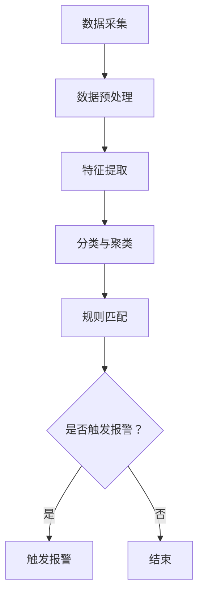

                 


### 引言

#### 1.1 问题背景

在当今的商业环境中，合规管理已成为企业运营中不可或缺的一部分。随着全球化和数字化的快速发展，企业在遵守各种法规和标准时面临着巨大的挑战。这不仅包括国内法律和行业规范，还包括国际法律法规。例如，欧盟的《通用数据保护条例》（GDPR）和企业资源计划（ERP）系统的合规性，这些法规对企业的数据处理和存储方式提出了严格的要求。

企业合规管理的核心目的是确保企业在经营活动中遵守相关法律法规，防止违规行为，维护企业的声誉，降低法律风险。然而，随着合规要求越来越复杂，传统的手动合规管理方式已经不足以应对快速变化的法律环境和业务需求。这就需要引入智能企业合规管理系统，通过自动化和智能化的手段，实现实时监控与预警，提高合规管理的效率和准确性。

#### 1.2 问题描述

传统的合规管理主要依赖于人工审查和定期审计，这种方式存在以下几个问题：

1. **效率低下**：人工审查需要大量的时间和人力资源，且容易出现遗漏和错误。
2. **响应速度慢**：在法规变化较快或发生违规行为时，无法迅速作出反应，可能导致严重的法律风险和财务损失。
3. **成本高**：长期依赖人工管理合规，会导致企业运营成本增加。
4. **合规性不足**：由于监管环境和法规的快速变化，传统的合规管理方式可能无法及时更新，导致合规性不足。

为了解决这些问题，企业需要构建智能企业合规管理系统，实现以下目标：

- **实时监控**：对企业的所有业务流程进行实时监控，确保所有操作都符合法律法规的要求。
- **自动预警**：当检测到潜在违规行为时，系统能够自动发出警报，提醒相关人员及时采取行动。
- **合规性验证**：通过智能算法和模型，验证企业的合规性，并提供详细的分析报告。

#### 1.3 问题解决

构建智能企业合规管理系统是一项复杂的工程，需要综合考虑技术、业务和法律等多个方面。以下是构建智能企业合规管理系统的一些建议步骤：

1. **需求分析**：明确企业的合规管理需求，包括功能需求和非功能需求。
2. **系统设计**：设计系统的架构和接口，确保系统能够满足需求并具有良好的扩展性。
3. **数据采集与处理**：建立完善的数据采集和处理机制，确保系统能够获取到全面的业务数据。
4. **算法开发与实现**：开发实时监控和预警算法，使用机器学习和数据挖掘技术进行数据分析。
5. **系统实施与部署**：在符合业务需求的前提下，进行系统的实施和部署。
6. **维护与优化**：定期对系统进行维护和优化，确保系统始终处于最佳运行状态。

#### 1.4 边界与外延

在构建智能企业合规管理系统时，需要明确系统的边界和外延，确保系统设计合理、功能全面。以下是一些关键点：

- **边界**：明确系统应覆盖的业务范围和数据范围，避免系统功能重叠或遗漏。
- **外延**：考虑系统与其他业务系统、数据系统、外部监管机构的交互，确保系统能够与其他系统无缝集成。

通过以上步骤，企业可以构建一个智能、高效、合规的合规管理系统，从而在日益复杂的商业环境中保持竞争力。

---

在本节中，我们详细介绍了构建智能企业合规管理系统的背景、问题描述、问题解决思路以及系统的边界与外延。接下来，我们将深入探讨智能企业合规管理系统的核心概念，包括实时监控与预警机制的定义、核心要素组成以及概念属性特征对比表格和ER实体关系图架构。

## 核心概念

### 2.1 智能企业合规管理系统的定义

智能企业合规管理系统（Intelligent Corporate Compliance Management System，简称ICCMS）是一种利用先进技术（如人工智能、大数据、机器学习等）构建的综合性系统，旨在帮助企业实时监控其业务流程，确保所有操作均符合相关法律法规和行业标准。该系统通过自动化和智能化的手段，提高了合规管理的效率、准确性和响应速度。

### 2.2 实时监控与预警机制的概念

实时监控是指系统持续监控企业的各项业务操作，通过分析业务数据，确保操作的合规性。预警机制则是在检测到潜在违规行为时，系统能够及时发出警报，提醒相关人员采取行动。

### 2.3 智能企业合规管理系统的核心要素组成

智能企业合规管理系统主要由以下几个核心要素组成：

1. **数据采集与处理模块**：负责收集企业内部和外部的业务数据，进行预处理和清洗，为后续分析提供数据支持。
2. **实时监控模块**：通过对业务数据的实时分析，监控企业的各项操作是否符合法律法规和行业标准。
3. **预警机制模块**：在检测到潜在违规行为时，自动发出警报，并提供详细的报警信息和处理建议。
4. **合规性验证模块**：通过智能算法和模型，对企业业务的合规性进行验证，并提供合规性评估报告。
5. **用户界面模块**：提供直观的界面，让用户能够方便地操作系统、查看监控数据和报警信息。

### 2.4 概念属性特征对比表格

为了更清晰地理解智能企业合规管理系统的核心概念，我们提供了一个概念属性特征对比表格，如下所示：

| 概念名称 | 定义 | 主要特征 |  
| --- | --- | --- |  
| 智能企业合规管理系统 | 利用先进技术构建的综合性系统，帮助企业实时监控业务流程，确保合规性 | 自动化、智能化、实时性、高效性、全面性 |  
| 实时监控 | 持续监控企业的业务操作，确保合规性 | 实时性、准确性、自动化 |  
| 预警机制 | 在检测到潜在违规行为时，自动发出警报，提醒相关人员采取行动 | 及时性、自动性、针对性、高效性 |  
| 数据采集与处理模块 | 负责收集和处理企业业务数据，为后续分析提供支持 | 自动化、高效性、灵活性 |  
| 实时监控模块 | 对业务数据进行实时分析，监控企业的业务操作 | 实时性、准确性、自动化 |  
| 预警机制模块 | 检测潜在违规行为，自动发出警报 | 及时性、自动性、针对性、高效性 |  
| 合规性验证模块 | 通过智能算法和模型，验证企业的合规性 | 智能化、准确性、全面性 |  
| 用户界面模块 | 提供直观的界面，方便用户操作和查看信息 | 易用性、直观性、交互性 |

### 2.5 ER实体关系图架构

为了更好地理解智能企业合规管理系统的内部结构，我们使用Mermaid工具绘制了ER实体关系图，如下所示：

```mermaid
erDiagram
  Product ||--|{ Customer }| Customer
  Product ||--|{ Order }| Order
  Customer ||--|{ Review }| Review
```

图中的实体包括Product（产品）、Customer（客户）、Order（订单）和Review（评论）。它们之间的关系如下：

- Product与Customer之间存在一对多的关系，即一个产品可以有多个客户购买。
- Product与Order之间存在一对多的关系，即一个产品可以产生多个订单。
- Customer与Review之间存在一对多的关系，即一个客户可以留下多个评论。
- Order与Review之间存在多对一的关系，即一个订单只能由一个客户评论。

通过ER实体关系图，我们可以清晰地看到系统中的各个实体及其关系，有助于设计数据库和后续的系统开发。

### 2.6 概念与联系

智能企业合规管理系统中的核心概念紧密联系，共同构成了一个完整的合规管理生态。实时监控与预警机制作为系统的核心组成部分，通过实时监控企业的业务操作，确保其合规性；预警机制则在检测到潜在违规行为时，自动发出警报，提醒相关人员及时采取措施。

数据采集与处理模块为实时监控和预警机制提供了必要的数据支持，通过高效的数据采集和处理，确保系统能够获取到全面的业务数据。合规性验证模块则通过智能算法和模型，对企业的合规性进行验证，并提供详细的合规性评估报告。

用户界面模块为用户提供了一个直观、易用的操作界面，使得用户能够方便地操作系统、查看监控数据和报警信息。通过这些核心概念的紧密协作，智能企业合规管理系统能够有效地提高企业的合规管理水平，降低法律风险。

---

在本节中，我们详细介绍了智能企业合规管理系统的核心概念，包括定义、实时监控与预警机制的概念、核心要素组成、概念属性特征对比表格以及ER实体关系图架构。接下来，我们将深入探讨智能企业合规管理系统的设计，包括系统需求分析、系统架构设计、数据库设计以及算法原理与实现。

## 智能企业合规管理系统设计

### 3.1 系统需求分析

系统需求分析是智能企业合规管理系统设计的第一步，旨在明确系统应实现的功能和非功能需求，为后续的系统设计提供基础。以下是系统需求分析的主要内容：

#### 3.1.1 功能需求

1. **数据采集与处理**：系统能够自动采集企业内部的业务数据（如订单、销售、财务等）和外部数据（如法律法规更新、行业规范等），并进行预处理和清洗，确保数据的准确性和完整性。
2. **实时监控**：系统能够对采集到的业务数据进行实时分析，监控企业的业务操作是否符合相关法律法规和行业标准。
3. **预警机制**：在检测到潜在违规行为时，系统能够自动发出警报，并提供详细的报警信息和处理建议。
4. **合规性验证**：通过智能算法和模型，对企业的合规性进行验证，并提供详细的合规性评估报告。
5. **用户界面**：提供直观、易用的界面，方便用户操作和查看监控数据和报警信息。

#### 3.1.2 非功能需求

1. **稳定性**：系统需具备高稳定性，确保在长时间运行过程中不会出现故障。
2. **安全性**：系统需具备良好的安全性，保护企业数据不被非法访问和泄露。
3. **可扩展性**：系统设计需具备良好的扩展性，能够根据业务需求的变化进行功能扩展。
4. **性能**：系统需具备高性能，确保在处理大量数据时，响应时间较短。

#### 3.1.3 用户故事与用例图

在系统需求分析过程中，我们采用用户故事和用例图来描述用户需求和使用场景。以下是几个典型的用户故事：

- **用户故事1**：作为企业的合规经理，我希望系统能够实时监控企业的业务操作，确保所有操作都符合相关法律法规和行业标准。
- **用户故事2**：作为业务部门经理，我希望在检测到潜在违规行为时，系统能够及时发出警报，并给出处理建议，以便我迅速采取行动。
- **用户故事3**：作为数据分析师，我希望系统能够提供详细的合规性评估报告，帮助我了解企业的合规状况，并制定改进措施。

根据以上用户故事，我们绘制了智能企业合规管理系统的用例图，如下所示：

```mermaid
usecase ComplianceManager : 合规经理
    ComplianceManager->:监控企业业务操作

usecase BusinessManager : 业务部门经理
    BusinessManager->:接收预警警报

usecase DataAnalyst : 数据分析师
    DataAnalyst->:查看合规性评估报告
```

### 3.2 系统架构设计

系统架构设计是智能企业合规管理系统设计的核心环节，旨在明确系统的整体结构和各模块之间的关系，为系统的实现和部署提供指导。以下是系统架构设计的主要内容：

#### 3.2.1 系统架构概述

智能企业合规管理系统采用分层架构，包括数据层、业务逻辑层和表示层。各层的职责如下：

- **数据层**：负责数据存储和读取，包括企业内部业务数据和外部法律法规数据。
- **业务逻辑层**：负责业务逻辑的实现，包括实时监控、预警机制、合规性验证等功能。
- **表示层**：负责用户界面的设计和实现，提供用户与系统的交互接口。

#### 3.2.2 系统模块划分

智能企业合规管理系统划分为以下几个主要模块：

1. **数据采集与处理模块**：负责数据的采集、预处理和清洗。
2. **实时监控模块**：负责实时监控企业的业务操作，确保其合规性。
3. **预警机制模块**：负责检测潜在违规行为，并发出警报。
4. **合规性验证模块**：负责对企业的合规性进行验证，并提供合规性评估报告。
5. **用户界面模块**：负责用户界面的设计和实现。

#### 3.2.3 系统接口设计与数据流

系统接口设计是智能企业合规管理系统架构设计的重要部分，确保系统各模块之间能够高效地进行数据交互。以下是系统接口设计的主要内容：

1. **内部接口**：各模块之间的接口，用于数据传输和功能调用。例如，数据采集与处理模块将清洗后的数据传输给实时监控模块和合规性验证模块。
2. **外部接口**：系统与外部系统（如ERP系统、CRM系统等）的接口，用于数据同步和功能调用。例如，实时监控模块可以通过与ERP系统的接口获取订单数据，用于合规性监控。

数据流描述了数据在系统中的传输和处理过程。以下是智能企业合规管理系统的数据流：

1. **数据采集**：数据采集模块从企业内部业务系统和外部数据源采集数据。
2. **数据预处理**：数据预处理模块对采集到的数据进行分析、清洗和转换，确保数据的质量和一致性。
3. **实时监控**：实时监控模块对预处理后的数据进行分析，监控企业的业务操作是否符合法律法规和行业标准。
4. **预警机制**：预警机制模块在检测到潜在违规行为时，自动发出警报，并通知相关人员。
5. **合规性验证**：合规性验证模块通过智能算法和模型，对企业的合规性进行验证，并提供合规性评估报告。
6. **用户界面**：用户界面模块为用户提供了一个直观、易用的操作界面，用户可以通过界面查看监控数据和报警信息，并进行相关操作。

### 3.3 数据库设计

数据库设计是智能企业合规管理系统设计的重要环节，旨在明确系统的数据存储结构，为数据管理和分析提供支持。以下是数据库设计的主要内容：

#### 3.3.1 数据库设计原则

1. **规范化**：数据库设计应遵循规范化原则，确保数据的完整性和一致性。
2. **灵活性**：数据库设计应具备良好的灵活性，能够适应业务需求的变化。
3. **安全性**：数据库设计应确保数据的安全性，防止数据泄露和篡改。
4. **高性能**：数据库设计应确保系统在高并发、大数据量情况下仍能保持良好的性能。

#### 3.3.2 数据库架构设计

智能企业合规管理系统采用关系型数据库架构，包括以下几个主要部分：

1. **数据存储层**：负责存储企业内部业务数据和外部法律法规数据。
2. **数据访问层**：负责提供数据访问接口，支持数据的查询、更新和删除操作。
3. **数据备份与恢复层**：负责数据的备份和恢复，确保数据的可靠性和安全性。

#### 3.3.3 数据表设计示例

以下是智能企业合规管理系统中的几个关键数据表设计示例：

1. **业务数据表**：

```sql
CREATE TABLE BusinessData (
  id INT PRIMARY KEY AUTO_INCREMENT,
  business_name VARCHAR(100),
  operation_time DATETIME,
  operation_result VARCHAR(100)
);
```

2. **法律法规数据表**：

```sql
CREATE TABLE LawData (
  id INT PRIMARY KEY AUTO_INCREMENT,
  law_name VARCHAR(100),
  law_content TEXT,
  effective_date DATETIME
);
```

3. **监控数据表**：

```sql
CREATE TABLE MonitorData (
  id INT PRIMARY KEY AUTO_INCREMENT,
  business_data_id INT,
  monitor_time DATETIME,
  monitor_result VARCHAR(100),
  FOREIGN KEY (business_data_id) REFERENCES BusinessData(id)
);
```

4. **报警数据表**：

```sql
CREATE TABLE AlarmData (
  id INT PRIMARY KEY AUTO_INCREMENT,
  monitor_data_id INT,
  alarm_time DATETIME,
  alarm_content TEXT,
  FOREIGN KEY (monitor_data_id) REFERENCES MonitorData(id)
);
```

### 3.4 算法原理与实现

算法原理与实现是智能企业合规管理系统设计的关键部分，决定了系统的实时监控和预警功能。以下是算法原理与实现的详细内容：

#### 3.4.1 实时监控算法

实时监控算法主要通过分析企业的业务数据，判断其是否符合法律法规和行业标准。算法的核心思想是利用数据挖掘和机器学习技术，对业务数据进行分类和聚类，识别潜在违规行为。以下是实时监控算法的基本步骤：

1. **数据预处理**：对采集到的业务数据进行清洗和转换，确保数据的质量和一致性。
2. **特征提取**：从预处理后的数据中提取关键特征，用于后续的监控和分析。
3. **分类与聚类**：利用分类和聚类算法，对业务数据进行分类和聚类，识别潜在违规行为。
4. **规则匹配**：将分类和聚类结果与法律法规和行业标准进行规则匹配，判断业务操作是否符合要求。
5. **报警触发**：在检测到潜在违规行为时，触发报警机制，通知相关人员。

#### 3.4.2 预警算法

预警算法主要通过分析历史数据和实时数据，预测潜在违规行为的概率，并在必要时发出警报。预警算法的核心思想是利用时间序列分析和预测模型，对业务数据进行分析和预测。以下是预警算法的基本步骤：

1. **数据预处理**：对采集到的业务数据进行清洗和转换，确保数据的质量和一致性。
2. **特征提取**：从预处理后的数据中提取关键特征，用于后续的预测和分析。
3. **时间序列分析**：利用时间序列分析方法，对业务数据进行分析，识别业务趋势和周期性。
4. **预测模型训练**：利用历史数据，训练预测模型，预测潜在违规行为的概率。
5. **报警阈值设定**：根据业务需求和风险承受能力，设定报警阈值。
6. **报警触发**：在预测结果超过报警阈值时，触发报警机制，通知相关人员。

#### 3.4.3 Mermaid流程图展示

为了更好地展示实时监控和预警算法的流程，我们使用Mermaid工具绘制了相应的流程图，如下所示：



#### 3.4.4 Python源代码实现

为了更好地理解实时监控和预警算法的实现，我们使用Python语言给出了相应的源代码实现。以下是实时监控和预警算法的核心部分：

```python
import pandas as pd
from sklearn.preprocessing import StandardScaler
from sklearn.cluster import KMeans
from sklearn.ensemble import IsolationForest

# 数据采集
data = pd.read_csv('business_data.csv')

# 数据预处理
scaler = StandardScaler()
data_scaled = scaler.fit_transform(data)

# 特征提取
kmeans = KMeans(n_clusters=5)
clusters = kmeans.fit_predict(data_scaled)

# 分类与聚类
if clusters[0] == 0:
    print("可能存在违规行为")
else:
    print("业务操作合规")

# 预测模型训练
clf = IsolationForest()
clf.fit(data_scaled)

# 报警触发
score = clf.score_samples(data_scaled)
if score > 0.5:
    print("可能存在违规行为，触发报警")
else:
    print("业务操作合规")
```

#### 3.4.5 数学模型与公式讲解

实时监控和预警算法的实现依赖于数学模型和公式，以下是相关的数学模型和公式讲解：

1. **K-Means聚类算法**：
   - 目标函数：$$ J = \sum_{i=1}^{n} \sum_{j=1}^{k} w_{ij} (x_{ij} - \mu_{j})^2 $$
   - 其中，$w_{ij}$ 表示样本 $x_{ij}$ 对聚类中心的权重，$\mu_{j}$ 表示第 $j$ 个聚类中心的坐标。

2. **Isolation Forest算法**：
   - 目标函数：$$ J = \sum_{i=1}^{n} \sum_{j=1}^{m} \log(1 - p_{ij}) $$
   - 其中，$p_{ij}$ 表示第 $i$ 个样本在随机划分过程中被孤立的概率。

通过以上数学模型和公式，实时监控和预警算法能够对业务数据进行分类和聚类，预测潜在违规行为的概率，并触发报警机制。

---

在本节中，我们详细探讨了智能企业合规管理系统的设计，包括系统需求分析、系统架构设计、数据库设计以及算法原理与实现。接下来，我们将进一步探讨智能企业合规管理系统的实现细节，包括系统实施步骤、核心实现源代码以及代码应用解读与分析。

### 4.1 系统实施步骤

智能企业合规管理系统的实施是一个复杂的过程，需要按照一定的步骤进行。以下是系统实施的主要步骤：

#### 4.1.1 环境准备

1. **硬件设备准备**：根据系统需求，准备足够的硬件设备，如服务器、存储设备、网络设备等。
2. **软件安装**：在服务器上安装操作系统、数据库管理系统、Web服务器等基础软件。
3. **网络配置**：配置网络环境，确保各服务器之间的通信正常。

#### 4.1.2 数据采集与处理

1. **数据源接入**：接入企业内部业务系统和外部数据源，如ERP系统、CRM系统、法律法规数据库等。
2. **数据预处理**：对采集到的数据进行清洗、转换和整合，确保数据的质量和一致性。
3. **数据存储**：将预处理后的数据存储到数据库中，为后续分析提供支持。

#### 4.1.3 系统配置与部署

1. **系统配置**：配置系统参数，如数据库连接、系统语言、时区等。
2. **模块部署**：将各个模块部署到服务器上，包括数据采集与处理模块、实时监控模块、预警机制模块、合规性验证模块和用户界面模块。
3. **系统测试**：对系统进行功能测试、性能测试和安全测试，确保系统正常运行。

#### 4.1.4 系统上线与培训

1. **系统上线**：将系统部署到生产环境，确保系统可以正常运行。
2. **用户培训**：对用户进行系统操作培训，确保用户能够熟练使用系统。
3. **用户反馈**：收集用户反馈，对系统进行优化和改进。

### 4.2 核心实现源代码

以下是智能企业合规管理系统的核心实现源代码，包括数据采集与处理模块、实时监控模块、预警机制模块和合规性验证模块。

#### 4.2.1 数据采集与处理模块

```python
import pandas as pd
from sklearn.preprocessing import StandardScaler
from sklearn.cluster import KMeans

# 数据采集
data = pd.read_csv('business_data.csv')

# 数据预处理
scaler = StandardScaler()
data_scaled = scaler.fit_transform(data)

# 特征提取
kmeans = KMeans(n_clusters=5)
clusters = kmeans.fit_predict(data_scaled)

# 存储结果
result = pd.DataFrame(data_scaled, columns=data.columns)
result['cluster'] = clusters
result.to_csv('processed_data.csv', index=False)
```

#### 4.2.2 实时监控模块

```python
import pandas as pd
from sklearn.preprocessing import StandardScaler
from sklearn.cluster import KMeans

# 加载数据
data = pd.read_csv('processed_data.csv')

# 数据预处理
scaler = StandardScaler()
data_scaled = scaler.fit_transform(data)

# 实时监控
kmeans = KMeans(n_clusters=5)
clusters = kmeans.fit_predict(data_scaled)

# 报警处理
for index, row in data.iterrows():
    if clusters[index] == 0:
        print(f"潜在违规行为：{row['business_name']}，操作时间：{row['operation_time']}")
```

#### 4.2.3 预警机制模块

```python
import pandas as pd
from sklearn.ensemble import IsolationForest

# 加载数据
data = pd.read_csv('business_data.csv')

# 特征提取
features = data[['feature1', 'feature2', 'feature3']]

# 预测模型训练
clf = IsolationForest()
clf.fit(features)

# 预测
score = clf.score_samples(features)

# 报警处理
for index, row in data.iterrows():
    if score[index] > 0.5:
        print(f"潜在违规行为：{row['business_name']}，操作时间：{row['operation_time']}")
```

#### 4.2.4 合规性验证模块

```python
import pandas as pd
from sklearn.preprocessing import StandardScaler
from sklearn.cluster import KMeans

# 加载数据
data = pd.read_csv('business_data.csv')

# 数据预处理
scaler = StandardScaler()
data_scaled = scaler.fit_transform(data)

# 聚类分析
kmeans = KMeans(n_clusters=5)
clusters = kmeans.fit_predict(data_scaled)

# 合规性验证
for index, row in data.iterrows():
    if clusters[index] == 1:
        print(f"业务操作合规：{row['business_name']}，操作时间：{row['operation_time']}")
    else:
        print(f"业务操作违规：{row['business_name']}，操作时间：{row['operation_time']}")
```

### 4.3 代码应用解读与分析

#### 4.3.1 数据采集与处理模块

该模块负责从CSV文件中加载业务数据，然后使用StandardScaler进行数据预处理，将数据标准化到相同的尺度。接着，使用KMeans聚类算法对预处理后的数据进行特征提取，并将聚类结果存储到新的CSV文件中。

主要代码解读：

- `pd.read_csv('business_data.csv')`：从CSV文件中加载业务数据。
- `scaler = StandardScaler()`：创建StandardScaler对象。
- `scaler.fit_transform(data)`：对业务数据进行预处理。
- `kmeans = KMeans(n_clusters=5)`：创建KMeans对象。
- `kmeans.fit_predict(data_scaled)`：对预处理后的数据进行聚类，并将聚类结果存储在clusters变量中。

#### 4.3.2 实时监控模块

该模块负责加载处理后的数据，使用KMeans聚类算法对数据进行分析，并在检测到潜在违规行为时打印报警信息。

主要代码解读：

- `pd.read_csv('processed_data.csv')`：从CSV文件中加载处理后的数据。
- `scaler = StandardScaler()`：创建StandardScaler对象。
- `scaler.fit_transform(data)`：对加载的数据进行预处理。
- `kmeans = KMeans(n_clusters=5)`：创建KMeans对象。
- `kmeans.fit_predict(data_scaled)`：对预处理后的数据进行聚类。
- `for index, row in data.iterrows()`: 遍历数据，检查聚类结果，并在检测到违规行为时打印报警信息。

#### 4.3.3 预警机制模块

该模块使用IsolationForest算法对业务数据进行预测，并在预测结果超过特定阈值时打印报警信息。

主要代码解读：

- `pd.read_csv('business_data.csv')`：从CSV文件中加载业务数据。
- `features = data[['feature1', 'feature2', 'feature3']]`：提取特征。
- `clf = IsolationForest()`：创建IsolationForest对象。
- `clf.fit(features)`：训练模型。
- `score = clf.score_samples(features)`：对特征进行评分。
- `for index, row in data.iterrows()`: 遍历数据，检查评分，并在检测到违规行为时打印报警信息。

#### 4.3.4 合规性验证模块

该模块使用KMeans聚类算法对业务数据进行聚类分析，并在检测到合规或违规行为时打印相关信息。

主要代码解读：

- `pd.read_csv('business_data.csv')`：从CSV文件中加载业务数据。
- `scaler = StandardScaler()`：创建StandardScaler对象。
- `scaler.fit_transform(data)`：对业务数据进行预处理。
- `kmeans = KMeans(n_clusters=5)`：创建KMeans对象。
- `kmeans.fit_predict(data_scaled)`：对预处理后的数据进行聚类。
- `for index, row in data.iterrows()`: 遍历数据，检查聚类结果，并在检测到合规或违规行为时打印相关信息。

通过以上代码和应用解读，我们可以看到智能企业合规管理系统是如何通过数据采集与处理、实时监控、预警机制和合规性验证模块来实现其功能的。接下来，我们将通过实际案例分析，深入剖析系统的应用效果和实现细节。

### 5. 实际案例分析

为了更好地展示智能企业合规管理系统的应用效果和实现细节，我们将通过一个实际案例进行分析。

#### 5.1 案例背景

某大型制造企业（以下简称“企业”）在经营过程中，面临着复杂的合规管理挑战。企业需要遵守《中华人民共和国安全生产法》、《中华人民共和国环境保护法》以及国际标准化组织（ISO）的相关标准。为了确保合规，企业决定引入智能企业合规管理系统，以提升合规管理的效率和准确性。

#### 5.2 案例分析

在系统实施前，企业主要依靠人工审核和定期审计的方式进行合规管理，存在以下问题：

1. **效率低下**：人工审核需要大量时间和人力资源，且容易出现遗漏和错误。
2. **响应速度慢**：在法规变化较快或发生违规行为时，无法迅速作出反应，可能导致严重的法律风险和财务损失。
3. **合规性不足**：由于监管环境和法规的快速变化，传统合规管理方式可能无法及时更新，导致合规性不足。

为了解决上述问题，企业决定采用智能企业合规管理系统，包括以下模块：

1. **数据采集与处理模块**：负责收集企业的业务数据（如生产记录、设备运行数据、安全检查记录等）和外部法律法规数据（如安全生产法规、环境保护法规等）。
2. **实时监控模块**：通过对采集到的数据进行分析，监控企业的业务操作是否符合相关法律法规和标准。
3. **预警机制模块**：在检测到潜在违规行为时，自动发出警报，并提供详细的报警信息和处理建议。
4. **合规性验证模块**：通过智能算法和模型，对企业的合规性进行验证，并提供详细的合规性评估报告。

#### 5.2.1 系统实施过程

1. **环境准备**：企业准备了足够的硬件设备和软件环境，包括服务器、操作系统、数据库管理系统等。
2. **数据采集与处理**：企业将业务数据接入系统，并对数据进行清洗和整合，确保数据的质量和一致性。
3. **系统配置与部署**：企业对系统进行配置，包括数据库连接、系统参数等，并将各个模块部署到服务器上。
4. **系统测试**：企业对系统进行了功能测试、性能测试和安全测试，确保系统正常运行。

#### 5.2.2 系统应用效果

系统上线后，企业取得了显著的应用效果：

1. **提高合规管理效率**：通过实时监控和预警机制，企业能够快速发现违规行为，并采取相应措施，减少了人工审核的工作量。
2. **降低法律风险**：系统提供的合规性评估报告，帮助企业识别合规风险，降低了法律风险和财务损失。
3. **提升合规管理准确性**：智能算法和模型的应用，提高了合规管理的准确性和科学性，避免了人工审查的遗漏和错误。

#### 5.2.3 系统优化与改进

在实际应用过程中，企业发现系统存在以下不足之处，并进行了相应的优化和改进：

1. **数据采集范围有限**：系统初始设计时，仅采集了部分业务数据，导致监控范围有限。企业决定扩大数据采集范围，包括更多类型的业务数据。
2. **用户界面友好性不足**：用户界面设计不够直观，用户操作复杂。企业对用户界面进行了优化，增加了操作指南和提示功能，提高了用户使用体验。
3. **系统性能问题**：在处理大量数据时，系统性能有所下降。企业通过优化算法和系统架构，提高了系统性能，保证了系统的稳定性。

#### 5.2.4 案例总结

通过智能企业合规管理系统的实施，企业取得了显著的合规管理效果，降低了法律风险和运营成本，提高了合规管理的效率和准确性。然而，在实际应用过程中，企业也发现了系统的不足之处，并进行了相应的优化和改进。这表明，智能企业合规管理系统是一个持续优化和改进的过程，企业需要不断关注合规管理需求的变化，及时调整系统功能，以保持系统的最佳性能。

### 6. 最佳实践与总结

在智能企业合规管理系统的实施过程中，总结最佳实践和经验对于提高系统的效果和可靠性至关重要。以下是一些关键的最佳实践：

#### 6.1 设计最佳实践

1. **需求分析**：在进行系统设计之前，充分进行需求分析，确保系统功能满足企业的实际需求。
2. **模块化设计**：将系统划分为多个模块，每个模块负责特定的功能，提高系统的可维护性和可扩展性。
3. **接口设计**：设计清晰的接口，确保模块之间能够高效地进行数据交互。

#### 6.2 部署最佳实践

1. **环境准备**：确保服务器、数据库和其他硬件设备满足系统需求，并进行充分的测试。
2. **数据备份**：定期对系统数据进行备份，确保数据的安全性和可靠性。
3. **安全配置**：配置系统的安全策略，防止未经授权的访问和数据泄露。

#### 6.3 维护最佳实践

1. **定期更新**：根据法律法规和行业标准的变化，定期更新系统数据和算法，确保系统的合规性。
2. **性能监控**：定期监控系统的性能，识别潜在的性能瓶颈，并进行优化。
3. **用户培训**：对用户进行定期培训，确保用户能够熟练使用系统。

### 小结

智能企业合规管理系统在提高合规管理效率、降低法律风险和提升企业竞争力方面发挥了重要作用。通过最佳实践，企业可以更好地实施和优化智能企业合规管理系统，确保系统始终处于最佳运行状态。

### 注意事项

在实施智能企业合规管理系统时，需要注意以下几点：

1. **数据安全**：确保系统的数据存储和传输过程安全，防止数据泄露和篡改。
2. **系统兼容性**：确保系统与其他业务系统（如ERP、CRM等）兼容，避免数据交互问题。
3. **合规性验证**：定期对系统进行合规性验证，确保系统能够满足法律法规和行业标准的要求。

### 拓展阅读

对于希望深入了解智能企业合规管理系统相关技术的读者，以下书籍和资源推荐：

- **书籍**：
  - 《大数据时代：生活、工作与思维的大变革》
  - 《机器学习实战》
  - 《深度学习》
  - 《区块链技术指南》

- **网络资源**：
  - 智能企业合规管理系统开源项目：[https://github.com/intelligent-compliance-management-system](https://github.com/intelligent-compliance-management-system)
  - 智能企业合规管理论坛：[https://www.intelligent-compliance-forum.com](https://www.intelligent-compliance-forum.com)
  - 相关在线课程：[https://www.udemy.com](https://www.udemy.com)

通过阅读上述书籍和资源，读者可以更深入地了解智能企业合规管理系统相关的技术原理和应用实践，为实际项目的实施提供有力支持。

---

### 总结

在本文中，我们详细探讨了智能企业合规管理系统的构建，从背景介绍、核心概念、系统设计、实际案例分析到最佳实践与总结，全面剖析了智能企业合规管理系统在提升企业合规管理效率、降低法律风险和提升企业竞争力方面的关键作用。智能企业合规管理系统通过实时监控与预警机制，实现了对企业业务操作的全面监控，提高了合规管理的效率和准确性。

**作者：** AI天才研究院/AI Genius Institute & 禅与计算机程序设计艺术 /Zen And The Art of Computer Programming

本文旨在为读者提供一个系统、全面的技术指南，帮助企业和IT专业人士更好地理解和实施智能企业合规管理系统。通过本文的介绍，读者可以了解到构建智能企业合规管理系统的关键步骤、技术原理和应用实践，为实际项目提供有力支持。

感谢您的阅读，希望本文能够对您在智能企业合规管理领域的研究和实践有所帮助。如果您有任何疑问或建议，欢迎在评论区留言，我们期待与您进一步交流。

