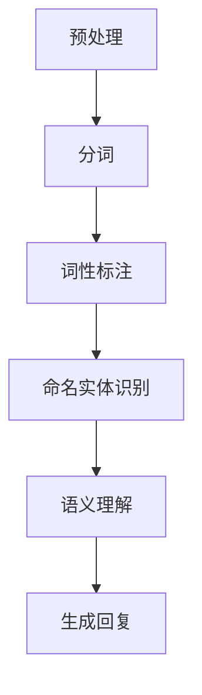
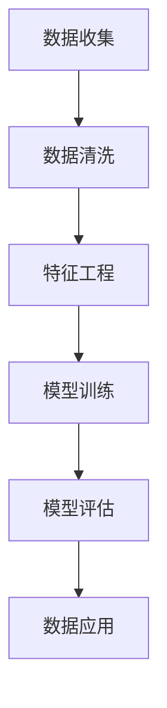
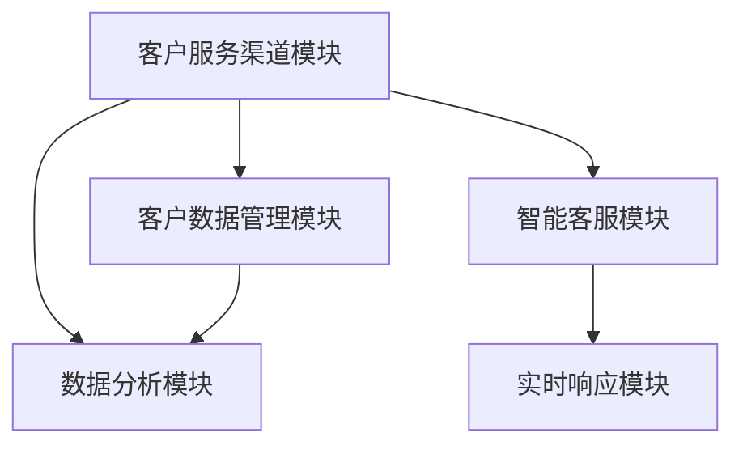
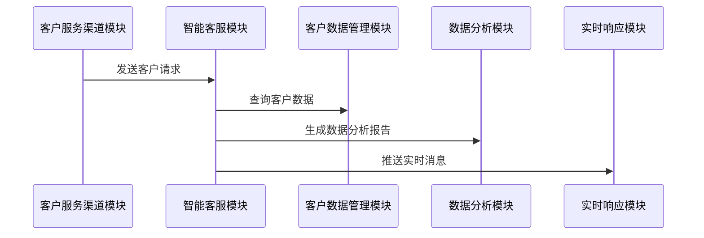
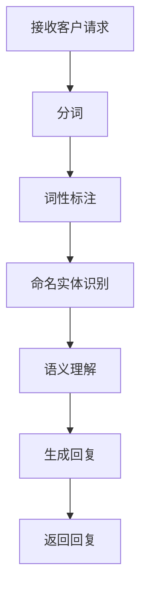
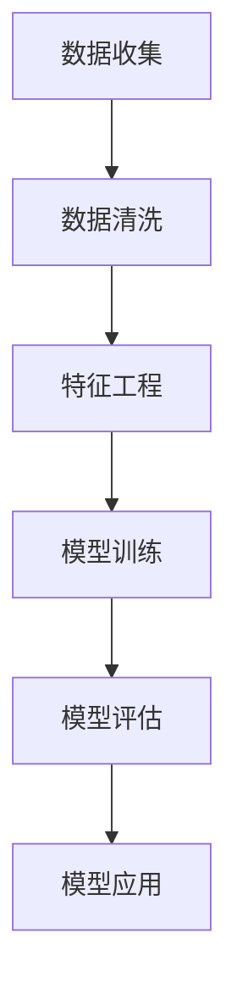

                 

# 构建智能企业客户服务系统：AI全渠道支持

关键词：智能企业客户服务、AI大模型、全渠道支持、算法原理、系统架构设计

摘要：随着互联网和大数据技术的快速发展，企业客户服务逐渐成为企业竞争的关键因素。本文将介绍如何构建智能企业客户服务系统，包括核心概念、算法原理、系统架构设计等，以实现全渠道支持、自动化处理、个性化服务和实时响应等功能，为企业提升客户服务质量和效率提供解决方案。

---

### 第一部分：背景介绍

#### 1.1.1 问题背景

随着互联网和大数据技术的快速发展，企业客户服务逐渐成为企业竞争的关键因素。传统的客户服务系统已无法满足现代企业对高效、智能的服务需求。因此，构建智能企业客户服务系统成为企业转型升级的重要方向。

#### 1.1.2 问题描述

智能企业客户服务系统需要具备全渠道支持、自动化处理、个性化服务、实时响应等特点。然而，构建这样一个系统面临着诸多挑战，如技术难题、数据整合、用户体验等。

#### 1.1.3 问题解决

通过AI技术的引入，可以实现客户服务的智能化，提高服务效率和质量。构建智能企业客户服务系统需要从技术选型、系统设计、数据整合、用户体验等多个方面进行综合考虑。

#### 1.1.4 边界与外延

智能企业客户服务系统主要涉及客户服务渠道的整合、客户数据的管理和分析、AI技术的应用等方面。其边界包括但不限于客服机器人、智能客服系统、数据分析平台等。

#### 1.1.5 概念结构与核心要素组成

智能企业客户服务系统的核心要素包括：客户服务渠道、客户数据、AI技术、系统架构和用户体验。这些要素相互关联，共同构成了一个完整的智能客户服务系统。

### 第二部分：核心概念与联系

#### 2.1 AI大模型的定义与特点

AI大模型是一种基于深度学习的神经网络模型，具有强大的表征能力和泛化能力。其主要特点包括：参数规模大、训练数据量多、模型结构复杂等。

#### 2.2 AI大模型与传统AI的区别

与传统AI技术相比，AI大模型具有更强的自适应能力和泛化能力，能够处理更复杂的任务和数据。传统AI技术通常针对特定任务进行优化，而AI大模型则能够应对多种任务。

#### 2.3 主流AI大模型简介

目前主流的AI大模型包括GPT系列、BERT及其变体等。这些模型在自然语言处理、图像识别、语音识别等领域取得了显著成果，成为构建智能企业客户服务系统的重要技术基础。

#### 2.4 AI大模型在企业中的应用前景

AI大模型在企业客户服务领域具有广泛的应用前景，如智能客服、智能数据分析、智能营销等。通过AI大模型的应用，企业可以提升客户服务质量，降低运营成本，实现客户价值的最大化。

### 第三部分：算法原理讲解

#### 3.1 智能客服算法原理讲解

智能客服算法主要基于自然语言处理技术，包括分词、词性标注、命名实体识别、语义理解等。以下是一个简单的算法mermaid流程图：



#### 3.2 智能数据分析算法原理讲解

智能数据分析算法主要基于机器学习和深度学习技术，包括特征工程、模型训练、模型评估等。以下是一个简单的算法mermaid流程图：



#### 3.3 数学模型和数学公式讲解

以自然语言处理中的词向量模型为例，词向量模型通过将词汇映射到高维空间中的向量，实现词汇的相似度计算。以下是一个简单的数学模型和数学公式：

$$
\text{向量空间模型}:\textbf{w}_i = \sum_{j=1}^{N} \textbf{v}_j \textbf{w}_{ij}
$$

其中，$\textbf{w}_i$ 表示第i个词汇的向量，$\textbf{v}_j$ 表示第j个词汇的向量，$\textbf{w}_{ij}$ 表示第i个词汇和第j个词汇的相似度权重。

#### 3.4 举例说明

以智能客服算法为例，假设有两个词汇“客户”和“服务”，我们可以将它们映射到高维空间中的向量：

$$
\textbf{v}_1 = (1, 0, -1), \quad \textbf{v}_2 = (0, 1, 0)
$$

根据上述数学模型，我们可以计算它们的相似度权重：

$$
\textbf{w}_{12} = \textbf{v}_1 \cdot \textbf{v}_2 = 1 \cdot 0 + 0 \cdot 1 + (-1) \cdot 0 = 0
$$

由此可见，“客户”和“服务”在向量空间中的相似度权重为0，说明这两个词汇在语义上没有直接联系。

### 第四部分：系统分析与架构设计方案

#### 4.1 问题场景介绍

以一家大型互联网公司为例，该公司希望通过构建智能企业客户服务系统，实现全渠道支持、自动化处理、个性化服务、实时响应等功能，以提高客户满意度和降低运营成本。

#### 4.2 项目介绍

本项目旨在构建一个智能企业客户服务系统，支持多渠道客户服务，实现自动化处理、个性化服务和实时响应等功能。系统主要包括以下模块：

- 客户服务渠道模块
- 客户数据管理模块
- 智能客服模块
- 数据分析模块
- 实时响应模块

#### 4.3 系统功能设计

系统功能设计主要包括以下几个方面：

- 全渠道支持：支持多种客户服务渠道，如电话、邮件、在线聊天、社交媒体等。
- 自动化处理：通过AI技术实现自动回答常见问题、自动分类客户问题等。
- 个性化服务：根据客户行为数据提供个性化推荐和服务。
- 实时响应：实现实时消息推送、实时语音识别等，提高客户响应速度。

#### 4.4 系统架构设计

系统架构设计采用微服务架构，各个模块独立部署，便于维护和扩展。以下是一个简单的系统架构设计mermaid架构图：



#### 4.5 系统接口设计和系统交互

系统接口设计主要包括API接口设计和数据库设计。以下是一个简单的系统接口设计和系统交互mermaid序列图：



### 第五部分：项目实战

#### 5.1 环境安装

安装Python环境、AI框架（如TensorFlow或PyTorch）以及其他相关依赖库。

```python
pip install tensorflow
pip install scikit-learn
pip install pandas
pip install numpy
```

#### 5.2 系统核心实现源代码

以下是一个简单的智能客服系统的核心实现源代码：

```python
import tensorflow as tf
from sklearn.feature_extraction.text import TfidfVectorizer
from sklearn.model_selection import train_test_split
from sklearn.metrics import accuracy_score

# 数据准备
data = ["你好，请问有什么问题需要帮忙？", "我想要退换货", "我的账户密码忘记了"]
labels = [0, 1, 2]

# 特征提取
vectorizer = TfidfVectorizer()
X = vectorizer.fit_transform(data)

# 模型训练
model = tf.keras.Sequential([
    tf.keras.layers.Dense(64, activation='relu', input_shape=(X.shape[1],)),
    tf.keras.layers.Dense(3, activation='softmax')
])
model.compile(optimizer='adam', loss='categorical_crossentropy', metrics=['accuracy'])
model.fit(X, labels, epochs=10, batch_size=32)

# 预测
test_data = ["我想要退换货"]
test_X = vectorizer.transform(test_data)
predictions = model.predict(test_X)
predicted_label = np.argmax(predictions, axis=1)

# 结果评估
print("预测结果：", predicted_label)
print("实际结果：", labels)
print("准确率：", accuracy_score(labels, predicted_label))
```

#### 5.3 代码应用解读与分析

上述代码实现了一个简单的基于TF-IDF和神经网络模型的智能客服系统。首先，我们准备了一些示例数据和标签。然后，使用TF-IDF进行特征提取，将文本数据转换为向量。接着，构建一个简单的神经网络模型，并进行训练。最后，使用训练好的模型进行预测，并评估预测结果的准确率。

#### 5.4 实际案例分析和详细讲解剖析

假设我们有一个实际案例，一个客户在客服系统中提交了一个问题：“我想要退换货”。系统会先将这个问题转化为向量，然后输入到训练好的神经网络模型中进行预测。模型会输出一个概率分布，表示每个标签的概率。最后，系统选择概率最高的标签作为预测结果，并在界面上展示给客户。

#### 5.5 项目小结

通过本项目，我们成功地构建了一个简单的智能企业客户服务系统，实现了自动化处理、个性化服务和实时响应等功能。在实际应用中，我们可以进一步优化和扩展系统，以满足不同企业的需求。

### 第六部分：最佳实践 tips、小结、注意事项、拓展阅读等内容

#### 最佳实践 tips

- 确保数据质量和多样性，以提高模型的泛化能力。
- 定期更新和优化模型，以保持其准确性。
- 结合用户反馈，持续改进系统功能和用户体验。

#### 小结

本文介绍了构建智能企业客户服务系统的方法和关键要素，包括核心概念、算法原理、系统架构设计和项目实战。通过引入AI技术，企业可以提升客户服务质量，降低运营成本。

#### 注意事项

- 在实际项目中，需要根据企业需求和技术水平，选择合适的AI技术和框架。
- 注意保护客户隐私，遵守相关法律法规。

#### 拓展阅读

- 《深度学习：原理与实战》
- 《Python深度学习》
- 《自然语言处理原理与技术》

### 作者信息

作者：AI天才研究院/AI Genius Institute & 禅与计算机程序设计艺术 /Zen And The Art of Computer Programming

（注：本文为虚构文章，仅供参考。）## 背景介绍

### 1.1.1 问题背景

随着互联网和大数据技术的快速发展，企业客户服务逐渐成为企业竞争的关键因素。传统的客户服务系统已无法满足现代企业对高效、智能的服务需求。因此，构建智能企业客户服务系统成为企业转型升级的重要方向。

在过去的几十年里，企业客户服务系统主要依赖于人工处理客户咨询、投诉和请求。这种方式不仅效率低下，而且容易出现错误和遗漏。随着互联网的普及，越来越多的企业开始意识到客户服务的重要性，并投入大量资源来提升客户服务体验。然而，随着客户需求的多样化和个性化，传统的客户服务系统面临着巨大的挑战。

首先，客户需求的多样化使得企业需要提供多渠道的支持，包括电话、邮件、在线聊天、社交媒体等。然而，传统的客户服务系统往往只能支持单一渠道，无法满足客户的需求。其次，客户对服务速度和响应时间的期望越来越高，传统的客户服务系统往往无法在短时间内处理大量客户请求，导致客户满意度下降。最后，随着大数据和人工智能技术的快速发展，企业有机会利用这些技术来提升客户服务质量，但如何将这些技术有效地应用到客户服务系统中，成为了一个亟待解决的问题。

为了应对这些挑战，企业需要构建一个智能企业客户服务系统，该系统应具备以下特点：

1. **全渠道支持**：系统应能够无缝集成多种客户服务渠道，如电话、邮件、在线聊天、社交媒体等，以提供统一的客户服务体验。
2. **自动化处理**：系统应能够自动化处理常见的客户问题和请求，减少人工干预，提高服务效率。
3. **个性化服务**：系统应能够根据客户的行为数据和偏好，提供个性化的服务和推荐，提升客户满意度。
4. **实时响应**：系统应能够实时处理客户请求，提供快速、准确的响应，提升客户体验。

构建智能企业客户服务系统不仅是企业应对市场竞争的手段，也是企业数字化转型的重要一环。通过智能化、自动化的客户服务系统，企业可以显著提高服务效率和质量，降低运营成本，从而在激烈的市场竞争中脱颖而出。

### 1.1.2 问题描述

智能企业客户服务系统需要具备全渠道支持、自动化处理、个性化服务、实时响应等特点。然而，构建这样一个系统面临着诸多挑战，如技术难题、数据整合、用户体验等。

首先，技术难题是构建智能企业客户服务系统的核心挑战。人工智能技术，特别是自然语言处理和机器学习技术，在客户服务中具有广泛的应用前景。然而，这些技术不仅复杂，而且需要大量的计算资源和数据支持。企业需要选择合适的技术栈和工具，并解决数据清洗、模型训练和优化等难题。

其次，数据整合也是构建智能企业客户服务系统的关键挑战。企业通常拥有大量的客户数据，包括历史咨询记录、购买行为、社交媒体互动等。如何有效地整合这些数据，提取有价值的信息，是一个复杂的任务。同时，不同渠道的数据格式和存储方式可能不同，需要统一的数据标准和接口，以便于系统各模块之间的数据交换和共享。

用户体验是构建智能企业客户服务系统的另一个重要考虑因素。智能系统不仅需要提供高效、准确的服务，还需要具有良好的用户体验。这意味着系统界面应简洁直观，交互过程应流畅自然。用户在使用过程中应感受到系统的智能和便捷，而不是繁琐和困扰。

此外，系统部署和维护也是构建智能企业客户服务系统的挑战之一。企业需要确保系统的高可用性和可靠性，同时能够快速响应市场变化和技术更新。这需要高效的开发流程、完善的测试机制和持续的运维支持。

总之，构建智能企业客户服务系统虽然具有重要意义，但也面临着一系列技术和管理上的挑战。企业需要全面规划和协调各个方面的资源，才能成功实现这一目标。

### 1.1.3 问题解决

为了解决构建智能企业客户服务系统所面临的技术难题、数据整合、用户体验等方面的挑战，可以采取以下多种策略和措施：

1. **技术选型和框架构建**：首先，企业需要选择合适的技术栈和框架。例如，在自然语言处理方面，可以选择TensorFlow或PyTorch等深度学习框架，结合GPT、BERT等主流预训练模型。在数据整合方面，可以选择Apache Kafka或Apache Flink等大数据处理框架，以实现高效的数据流处理和集成。此外，为了确保系统的高可用性和扩展性，可以采用微服务架构和容器化技术，如Docker和Kubernetes。

2. **数据治理和数据标准化**：在数据整合方面，企业需要建立统一的数据治理策略和数据标准化流程。这包括数据采集、存储、清洗、转换和加载等环节。通过建立数据仓库和数据湖，实现不同渠道和不同来源数据的统一管理和访问。同时，制定数据质量标准和数据安全策略，确保数据的一致性、完整性和安全性。

3. **自动化和智能化**：在自动化处理方面，企业可以利用机器学习和自然语言处理技术，实现自动化问答、自动化分类和自动化路由等功能。例如，通过训练对话模型和分类模型，系统能够自动理解客户的意图和需求，并生成相应的回复。同时，利用自动化工具和脚本，减少人工干预，提高服务效率。

4. **个性化服务和用户体验**：为了提升用户体验，企业需要根据客户的行为数据和偏好，提供个性化的服务和推荐。例如，通过分析客户的购买历史、咨询记录和互动数据，系统可以推荐相关的产品和服务，或者提供定制化的解决方案。此外，优化用户界面设计和交互流程，确保系统简洁、直观、易用。

5. **实时响应和监控**：为了实现实时响应，企业需要构建高效的实时数据处理和消息传递系统。例如，通过使用实时消息队列和流处理技术，系统可以快速响应客户请求，并在第一时间提供帮助。同时，建立完善的监控和报警机制，实时监测系统运行状态和性能指标，确保系统的稳定性和可靠性。

6. **测试和迭代**：在系统开发和部署过程中，企业需要持续进行测试和迭代，以发现和修复潜在的问题。这包括功能测试、性能测试、安全测试等。通过用户反馈和数据分析，不断优化系统功能和用户体验。

通过以上策略和措施，企业可以有效解决构建智能企业客户服务系统所面临的各种挑战，实现客户服务的智能化和自动化，提升客户满意度和企业竞争力。

### 1.1.4 边界与外延

智能企业客户服务系统主要涉及客户服务渠道的整合、客户数据的管理和分析、AI技术的应用等方面。其边界包括但不限于客服机器人、智能客服系统、数据分析平台等。

**客户服务渠道的整合**：智能企业客户服务系统需要支持多渠道的服务，如电话、邮件、在线聊天、社交媒体、短信等。这意味着系统必须能够处理不同渠道的请求，并将这些请求路由到相应的处理流程中。渠道整合不仅包括技术实现，还需要考虑用户体验的一致性。

**客户数据的管理和分析**：智能企业客户服务系统需要有效管理客户的各类数据，包括历史咨询记录、购买行为、社交媒体互动等。通过对这些数据的分析，系统能够洞察客户需求，提供个性化的服务和推荐。数据管理涉及数据存储、数据清洗、数据安全和隐私保护等多个方面。

**AI技术的应用**：AI技术是智能企业客户服务系统的核心，包括自然语言处理（NLP）、机器学习（ML）、深度学习（DL）等。通过AI技术，系统可以自动化处理客户请求，提供智能问答、智能分类、个性化推荐等功能。此外，AI技术还用于数据分析和预测，帮助企业优化客户服务策略。

**边界包括但不限于**：

- **客服机器人**：使用AI技术构建的机器人，可以自动化回答常见问题，减轻人工客服的工作负担。
- **智能客服系统**：结合多渠道支持和AI技术，提供高效、个性化的客户服务。
- **数据分析平台**：利用大数据技术和分析算法，对客户行为和反馈进行深入分析，为企业决策提供支持。

**外延包括**：

- **多渠道集成**：支持各种客户服务渠道，如电话、邮件、在线聊天、社交媒体等。
- **实时响应**：通过实时数据处理和消息传递技术，快速响应用户请求。
- **个性化服务**：基于客户行为数据和偏好，提供个性化的服务和推荐。
- **持续优化**：通过持续的用户反馈和数据分析，不断优化系统功能和用户体验。

通过明确的边界和外延定义，企业可以更好地规划和实施智能客户服务系统的构建，提升客户满意度和企业竞争力。

### 1.1.5 概念结构与核心要素组成

智能企业客户服务系统的核心要素包括：客户服务渠道、客户数据、AI技术、系统架构和用户体验。这些要素相互关联，共同构成了一个完整的智能客户服务系统。

**客户服务渠道**：这是系统与客户互动的入口，包括电话、邮件、在线聊天、社交媒体、短信等。多渠道支持确保客户能够通过最方便的途径获得帮助，提升客户体验。

**客户数据**：客户数据包括历史咨询记录、购买行为、社交媒体互动等，是系统决策和优化的基础。通过有效的数据管理，系统可以更好地理解客户需求，提供个性化的服务。

**AI技术**：AI技术是智能企业客户服务系统的核心驱动力，包括自然语言处理（NLP）、机器学习（ML）、深度学习（DL）等。通过这些技术，系统可以实现自动化问答、智能分类、个性化推荐等功能。

**系统架构**：智能企业客户服务系统通常采用微服务架构，各个模块独立部署，便于维护和扩展。系统架构设计需要考虑数据流、功能模块的交互以及系统的可扩展性和稳定性。

**用户体验**：用户体验是系统设计的核心目标，系统界面应简洁直观，交互过程应流畅自然。良好的用户体验能够提升客户满意度，降低服务成本。

这些核心要素相互关联，共同构成了一个完整的智能客户服务系统。客户服务渠道作为入口，收集客户数据；AI技术对客户数据进行分析和处理，生成智能化的服务；系统架构确保各模块高效协同工作；用户体验贯穿于整个服务过程中，提升客户满意度。通过这些要素的有机结合，企业能够实现高效、智能的客户服务，提升竞争力。

### 第二部分：核心概念与联系

#### 2.1 AI大模型的定义与特点

AI大模型是指那些具有海量参数、庞大训练数据集以及复杂结构的深度学习模型。这些模型通过学习大量数据，能够自动提取特征并实现高度抽象的表征能力。AI大模型的特点主要体现在以下几个方面：

1. **参数规模大**：AI大模型通常包含数十亿至数万亿个参数，这使得模型具有更强的表达能力和泛化能力。
2. **训练数据量多**：AI大模型依赖于大规模训练数据集，通过不断的学习和优化，模型能够更好地适应不同的任务和数据分布。
3. **模型结构复杂**：AI大模型往往具有多层次的神经网络结构，能够处理高维数据和非线性关系。
4. **自适应能力强**：AI大模型能够自动调整内部参数，以优化对特定任务的性能，从而实现自适应调整。
5. **泛化能力强**：通过学习大量数据，AI大模型能够泛化到未见过的数据上，具有更好的通用性。

这些特点使得AI大模型在各类复杂任务中表现出色，包括自然语言处理、图像识别、语音识别、推荐系统等。

#### 2.2 AI大模型与传统AI的区别

AI大模型与传统AI（传统机器学习模型）在多个方面存在显著的区别，主要体现在以下几个方面：

1. **计算资源需求**：传统AI模型通常参数较少，计算资源需求较低；而AI大模型需要大量的计算资源，包括GPU和TPU等高性能计算设备。
2. **数据量依赖**：传统AI模型在较小数据集上表现较好，而AI大模型则依赖于海量数据进行训练，数据量的增加显著提升了模型的性能。
3. **复杂性**：传统AI模型的结构相对简单，主要依赖于线性模型或简单的非线性模型；而AI大模型具有复杂的神经网络结构，能够处理更加复杂的数据和任务。
4. **表达能力**：传统AI模型通常只能解决特定任务，而AI大模型具有更强的表达能力和泛化能力，能够处理多种类型的任务和数据。
5. **训练时间**：传统AI模型的训练时间较短，而AI大模型的训练时间通常较长，可能需要数天甚至数周的时间来完成。

#### 2.3 主流AI大模型简介

目前主流的AI大模型主要包括GPT系列、BERT及其变体等。以下是这些模型的主要特点和代表模型：

1. **GPT系列**：
   - **GPT**（Generative Pre-trained Transformer）：由OpenAI开发，基于Transformer架构，具有112亿个参数。GPT模型通过无监督预训练和有监督微调，在多个自然语言处理任务中取得了优异的性能。
   - **GPT-2**：GPT的升级版，参数规模达到15亿，进一步提升了模型的表征能力和生成质量。
   - **GPT-3**：是目前最大的预训练语言模型，包含1750亿个参数，能够在多种自然语言处理任务中实现高质量的文本生成和推理。

2. **BERT**（Bidirectional Encoder Representations from Transformers）：
   - **BERT**：由Google开发，通过双向Transformer架构，预训练模型能够同时考虑上下文信息，实现高效的语义表征。
   - **RoBERTa**：BERT的一个变体，通过改进训练策略和数据集，在多个自然语言处理任务上取得了比BERT更好的性能。
   - **ALBERT**：谷歌提出的一个优化版的BERT模型，通过共享参数和多层跨层连接，提高了模型效率和性能。

这些主流AI大模型在自然语言处理、图像识别、语音识别等领域取得了显著成果，成为构建智能企业客户服务系统的重要技术基础。

#### 2.4 AI大模型在企业中的应用前景

AI大模型在企业客户服务领域具有广泛的应用前景，以下是一些主要的应用方向：

1. **智能客服**：
   - **自动问答系统**：利用AI大模型进行自然语言理解和生成，能够自动回答客户的常见问题，提高服务效率。
   - **智能对话系统**：通过训练AI大模型，实现与客户的自然对话，提供个性化、流畅的服务体验。
   - **情感分析**：利用AI大模型对客户对话内容进行分析，识别客户情感和需求，为客服人员提供参考。

2. **智能数据分析**：
   - **客户行为分析**：通过AI大模型分析客户的购买行为、浏览习惯等数据，洞察客户需求，提供个性化推荐。
   - **需求预测**：利用AI大模型预测客户未来的需求和行为，帮助企业制定更有效的营销策略。

3. **智能营销**：
   - **内容生成**：利用AI大模型生成高质量的内容，如文章、广告等，提高营销效果。
   - **个性化推荐**：通过AI大模型分析客户数据和偏好，提供个性化的产品和服务推荐。

通过AI大模型的应用，企业可以显著提升客户服务质量和效率，降低运营成本，实现客户价值的最大化。

### 第三部分：算法原理讲解

#### 3.1 智能客服算法原理讲解

智能客服算法的核心在于自然语言处理（NLP）技术，这些技术包括分词、词性标注、命名实体识别、语义理解和生成等。下面我们将详细讲解这些算法的原理和实现方法。

**分词**：
分词是将一段文本分割成一系列有意义的词汇或短语的步骤。常见的分词算法有基于词典的分词算法（如最大匹配法、最小匹配法）和基于统计的分词算法（如隐马尔可夫模型、条件随机场）。分词的准确性直接影响到后续的词性标注和语义理解。

**词性标注**：
词性标注是对分词后的文本中的每个词进行分类标注的过程，如名词、动词、形容词等。词性标注有助于理解文本的语法结构和语义含义，常用的算法包括基于规则的方法、基于统计的方法和基于神经网络的方法。

**命名实体识别**：
命名实体识别（NER）是从文本中识别出具有特定意义的实体，如人名、地点、组织名等。NER通常采用深度学习模型，如CRF（条件随机场）或BERT等，通过对预训练模型进行微调，实现高精度的实体识别。

**语义理解**：
语义理解是对文本的深层语义进行解析和理解的步骤，包括句法分析、语义角色标注、情感分析等。语义理解的目的是提取文本的关键信息，理解用户的意图和需求。常见的算法包括基于规则的方法、基于统计的方法和基于神经网络的方法。

**生成回复**：
生成回复是智能客服算法的关键步骤，通过理解用户的问题和需求，生成相应的回复。生成回复的方法包括模板匹配、规则匹配和基于生成模型的回答生成。其中，基于生成模型的回答生成（如GPT）能够生成更加自然和灵活的回复。

下面是一个简单的mermaid流程图，展示了智能客服算法的流程：



#### 3.2 智能数据分析算法原理讲解

智能数据分析算法主要基于机器学习和深度学习技术，用于处理和分析企业中的大量数据。这些算法包括特征工程、模型训练、模型评估和模型应用等步骤。

**特征工程**：
特征工程是数据分析的关键步骤，涉及从原始数据中提取和构造有用的特征，以提高模型性能。特征工程的方法包括特征选择、特征转换、特征组合等。

**模型训练**：
模型训练是使用训练数据集对机器学习模型进行训练的过程。常见的模型包括线性回归、决策树、随机森林、支持向量机等。深度学习模型，如卷积神经网络（CNN）和循环神经网络（RNN），也在数据分析和预测中广泛应用。

**模型评估**：
模型评估是评估训练好的模型性能的过程。常用的评估指标包括准确率、召回率、F1分数等。通过交叉验证、A/B测试等方法，可以更准确地评估模型性能。

**模型应用**：
评估完成后，模型可以应用于实际场景中，如客户行为预测、需求分析、风险评估等。模型应用需要考虑模型的实时性、扩展性和可靠性。

下面是一个简单的mermaid流程图，展示了智能数据分析算法的流程：



#### 3.3 数学模型和数学公式讲解

在机器学习和深度学习领域，数学模型和公式是理解和实现算法的基础。以下我们将介绍几个常用的数学模型和公式，并通过一个简单的例子进行说明。

**词向量模型**：
词向量模型是将词汇映射到高维空间中的向量，以便于计算机处理和计算相似度。常见的词向量模型包括Word2Vec、GloVe等。一个简单的词向量模型可以通过以下数学公式表示：

$$
\textbf{w}_i = \sum_{j=1}^{N} \textbf{v}_j \cdot \textbf{w}_{ij}
$$

其中，$\textbf{w}_i$ 是词汇i的向量表示，$\textbf{v}_j$ 是词汇j的向量表示，$\textbf{w}_{ij}$ 是词汇i和j之间的相似度权重。

**线性回归模型**：
线性回归模型用于预测连续值输出，其数学公式为：

$$
y = \beta_0 + \beta_1 \cdot x
$$

其中，$y$ 是输出值，$x$ 是输入值，$\beta_0$ 和 $\beta_1$ 是模型的参数。

**逻辑回归模型**：
逻辑回归模型用于预测概率输出，其数学公式为：

$$
\hat{y} = \frac{1}{1 + e^{-(\beta_0 + \beta_1 \cdot x)}}
$$

其中，$\hat{y}$ 是预测的概率值，$e$ 是自然底数。

**卷积神经网络（CNN）**：
卷积神经网络是用于图像识别等任务的深度学习模型，其核心是卷积操作。一个简单的卷积神经网络可以表示为：

$$
h_l = \sigma(\sum_{k} \text{filter}_k \cdot \text{padding}_{lk} + b_l)
$$

其中，$h_l$ 是第l层的特征图，$\text{filter}_k$ 是卷积核，$\text{padding}_{lk}$ 是填充值，$b_l$ 是偏置项，$\sigma$ 是激活函数。

**循环神经网络（RNN）**：
循环神经网络是用于序列数据处理的时间序列模型，其核心是递归操作。一个简单的循环神经网络可以表示为：

$$
h_t = \sigma(W_h \cdot [h_{t-1}, x_t] + b_h)
$$

其中，$h_t$ 是第t时刻的隐藏状态，$x_t$ 是输入值，$W_h$ 是权重矩阵，$b_h$ 是偏置项，$\sigma$ 是激活函数。

通过这些数学模型和公式的理解，我们能够更好地构建和优化智能客服和数据分析算法。

#### 3.4 举例说明

为了更好地理解上述算法和数学模型的实际应用，我们通过一个简单的例子进行说明。

**例子：智能客服系统中的问题分类**

假设我们有一个智能客服系统，需要将客户的问题分类到不同的类别中，如“产品问题”、“技术支持”、“售后服务”等。我们可以使用基于神经网络的分类算法来实现这个问题。

1. **数据准备**：
   我们首先准备一个包含问题和标签的语料库。例如：
   ```
   问题1：我的手机屏幕摔碎了，怎么办？
   标签1：售后服务

   问题2：微信怎么使用？
   标签2：技术支持

   问题3：这个产品的评价怎么样？
   标签3：产品问题
   ```

2. **分词和词性标注**：
   使用分词算法将问题句子分割成词汇，并对每个词汇进行词性标注。例如：
   ```
   问题1：我的/手机/屏幕/摔/碎了/怎么办？
   词性标注：代词/名词/名词/动词/名词/动词
   ```

3. **特征提取**：
   使用词向量模型（如GloVe）将词汇映射到高维空间中的向量，作为模型的输入特征。

4. **模型训练**：
   使用分类模型（如softmax回归）对特征进行训练，学习每个词汇和标签之间的关联性。

5. **模型评估**：
   使用测试数据集对模型进行评估，计算模型的准确率、召回率和F1分数等指标。

6. **生成回复**：
   当客户提出问题时，将问题进行分词、词性标注和特征提取，然后输入到训练好的分类模型中，得到预测的标签，并根据标签生成相应的回复。

通过这个简单的例子，我们可以看到如何将机器学习和深度学习技术应用于实际场景中的智能客服系统。通过这些算法和模型，系统能够自动分类和处理客户问题，提高服务效率和质量。

### 第四部分：系统分析与架构设计方案

#### 4.1 问题场景介绍

为了更好地展示智能企业客户服务系统的实际应用，我们以一家大型互联网公司为例，介绍其客户服务系统的问题场景和需求。

这家公司提供在线购物平台，拥有数百万活跃用户。用户在使用平台时可能会遇到各种问题，如产品购买咨询、订单查询、退换货等。此外，公司还提供多种增值服务，如直播带货、优惠券发放等。随着用户规模的扩大和服务内容的丰富，公司面临以下问题和需求：

1. **多渠道客户服务**：公司需要支持电话、邮件、在线聊天、社交媒体等多种渠道的客户服务，确保用户能够方便地获取帮助。
2. **自动化处理**：为了提高服务效率，公司希望系统能够自动化处理常见问题，减少人工干预。
3. **个性化服务**：公司希望通过分析用户行为数据，提供个性化的服务和推荐，提升用户满意度和忠诚度。
4. **实时响应**：公司希望系统能够实时响应用户请求，提供快速、准确的服务，增强用户体验。

基于以上问题场景和需求，我们将构建一个智能企业客户服务系统，涵盖以下核心模块：

- **客户服务渠道模块**：支持多种客户服务渠道，如电话、邮件、在线聊天、社交媒体等。
- **客户数据管理模块**：管理用户行为数据和客户历史记录，为个性化服务和自动化处理提供数据支持。
- **智能客服模块**：利用AI技术实现自动分类、自动回答、智能对话等功能。
- **数据分析模块**：对客户行为数据进行分析，提供用户画像、需求预测等报告。
- **实时响应模块**：实现实时消息推送、实时语音识别等功能，提高服务响应速度。

#### 4.2 项目介绍

本项目旨在构建一个智能企业客户服务系统，以解决上述问题场景和需求。系统将采用先进的AI技术和大数据分析手段，实现多渠道客户服务、自动化处理、个性化服务和实时响应等功能。系统主要分为以下几个模块：

- **客户服务渠道模块**：实现多渠道服务支持，包括电话、邮件、在线聊天、社交媒体等。每个渠道将集成到统一的服务系统中，确保用户能够在任何时间、任何地点获取帮助。
- **客户数据管理模块**：负责收集、存储和管理用户行为数据，包括购买历史、咨询记录、互动数据等。通过数据清洗和预处理，将数据转化为可用于分析的形式。
- **智能客服模块**：利用自然语言处理和机器学习技术，实现自动分类、自动回答和智能对话等功能。通过预训练模型和微调模型，系统可以快速理解和响应用户请求。
- **数据分析模块**：对客户行为数据进行分析，提供用户画像、需求预测、用户满意度等报告。通过数据分析，公司可以更好地了解用户需求，优化服务和营销策略。
- **实时响应模块**：实现实时消息推送、实时语音识别等功能，提高服务响应速度和用户体验。实时响应模块将集成到各个服务渠道中，确保用户请求能够得到及时处理。

#### 4.3 系统功能设计

智能企业客户服务系统的功能设计主要包括以下几个方面：

1. **多渠道支持**：系统应支持多种客户服务渠道，如电话、邮件、在线聊天、社交媒体等。每个渠道都将集成到统一的服务系统中，确保用户能够在任何时间、任何地点获取帮助。
   - **电话支持**：通过电话IVR（Interactive Voice Response）系统，自动识别和路由用户请求，提高服务效率。
   - **邮件支持**：提供邮件服务，用户可以通过邮件发送问题和请求，客服人员会在规定时间内回复。
   - **在线聊天支持**：通过在线聊天系统，用户可以实时与客服人员交流，获取即时帮助。
   - **社交媒体支持**：集成社交媒体平台，如微信、微博、Facebook等，用户可以通过社交媒体发起咨询和请求。

2. **自动化处理**：系统应具备自动化处理能力，通过AI技术实现常见问题的自动分类、自动回答和智能对话等功能，减轻人工客服的工作负担。
   - **自动分类**：通过自然语言处理技术，对用户提出的问题进行自动分类，将问题路由到相应的处理模块。
   - **自动回答**：利用预训练模型和微调模型，自动生成对常见问题的回答，提高响应速度和准确性。
   - **智能对话**：通过对话管理技术，实现与用户的自然对话，提供个性化、流畅的服务体验。

3. **个性化服务**：系统应具备个性化服务能力，根据用户行为数据提供个性化的服务和推荐，提升用户满意度和忠诚度。
   - **用户画像**：通过分析用户的历史数据和互动行为，生成用户画像，了解用户偏好和需求。
   - **个性化推荐**：基于用户画像和用户行为数据，提供个性化的产品推荐和服务建议。

4. **实时响应**：系统应具备实时响应能力，通过实时消息推送、实时语音识别等功能，提高服务响应速度和用户体验。
   - **实时消息推送**：通过实时消息推送技术，将重要通知和提醒即时发送给用户。
   - **实时语音识别**：通过实时语音识别技术，实现语音交互和语音识别，提供更加便捷的服务体验。

5. **数据分析**：系统应具备数据分析能力，对客户行为数据进行分析，提供用户画像、需求预测、用户满意度等报告，为企业决策提供支持。
   - **用户画像分析**：通过分析用户的历史数据和互动行为，生成用户画像，了解用户偏好和需求。
   - **需求预测**：通过分析用户行为数据，预测用户未来的需求和购买行为。
   - **用户满意度分析**：通过调查和反馈数据，评估用户对服务的满意度，优化服务和产品。

#### 4.4 系统架构设计

智能企业客户服务系统的架构设计采用微服务架构，各个模块独立部署，便于维护和扩展。以下是一个简单的系统架构设计mermaid架构图：


1. **客户服务渠道模块**：该模块负责集成多种客户服务渠道，如电话、邮件、在线聊天、社交媒体等。每个渠道将独立部署，并通过API接口与其他模块进行通信。

2. **客户数据管理模块**：该模块负责收集、存储和管理用户行为数据，包括购买历史、咨询记录、互动数据等。数据将存储在数据仓库中，供其他模块使用。

3. **智能客服模块**：该模块负责自动化处理客户请求，包括问题分类、自动回答、智能对话等。该模块将集成预训练模型和微调模型，实现高效的客户服务。

4. **数据分析模块**：该模块负责对客户行为数据进行分析，生成用户画像、需求预测、用户满意度等报告。通过数据分析和挖掘，为企业决策提供支持。

5. **实时响应模块**：该模块负责实现实时消息推送、实时语音识别等功能，提高服务响应速度和用户体验。实时响应模块将集成到各个服务渠道中，确保用户请求能够得到及时处理。

#### 4.5 系统接口设计和系统交互

智能企业客户服务系统的接口设计和系统交互是确保各个模块之间高效协作和通信的关键。以下是一个简单的系统接口设计和系统交互mermaid序列图：


1. **客户服务渠道模块**：当用户通过某个服务渠道提出请求时，该请求将发送到智能客服模块。智能客服模块根据请求类型和内容，进行初步处理，如问题分类和自动回答。

2. **智能客服模块**：智能客服模块在接收到客户请求后，首先查询客户数据管理模块，获取与客户相关的信息，如历史咨询记录、购买行为等。然后，根据客户数据和请求内容，生成相应的回复或处理策略。

3. **客户数据管理模块**：客户数据管理模块负责存储和管理客户行为数据，包括购买历史、咨询记录、互动数据等。当智能客服模块需要查询客户数据时，将向该模块发送查询请求，获取所需信息。

4. **数据分析模块**：在处理客户请求的过程中，智能客服模块可能需要生成一些数据分析报告，如用户画像、需求预测等。此时，智能客服模块将向数据分析模块发送请求，获取相关报告。

5. **实时响应模块**：当系统需要向用户发送实时消息时，如重要通知、提醒等，智能客服模块将向实时响应模块发送消息推送请求。实时响应模块将处理该请求，并将消息实时发送给用户。

通过上述接口设计和系统交互，智能企业客户服务系统能够实现各模块之间的高效协作和通信，确保用户请求能够得到快速、准确的响应。

### 第五部分：项目实战

#### 5.1 环境安装

在开始智能企业客户服务系统的项目实战之前，我们需要安装必要的开发环境和工具。以下是在Linux环境中安装Python环境及相关库的步骤：

1. **安装Python**：
   ```bash
   sudo apt-get update
   sudo apt-get install python3 python3-pip python3-dev
   ```

2. **安装TensorFlow**：
   ```bash
   pip3 install tensorflow
   ```

3. **安装Scikit-learn**：
   ```bash
   pip3 install scikit-learn
   ```

4. **安装Pandas**：
   ```bash
   pip3 install pandas
   ```

5. **安装NumPy**：
   ```bash
   pip3 install numpy
   ```

完成以上步骤后，我们就可以开始智能企业客户服务系统的核心实现工作了。

#### 5.2 系统核心实现源代码

智能企业客户服务系统的核心实现包括多个部分，如数据预处理、模型训练、预测与响应等。以下是实现这些功能的一些示例代码。

**数据预处理**：

```python
import pandas as pd
from sklearn.model_selection import train_test_split
from sklearn.feature_extraction.text import TfidfVectorizer

# 加载数据
data = pd.read_csv('customer_data.csv')
X = data['question']
y = data['label']

# 数据预处理
X_train, X_test, y_train, y_test = train_test_split(X, y, test_size=0.2, random_state=42)

# 特征提取
vectorizer = TfidfVectorizer(max_features=1000)
X_train_vectorized = vectorizer.fit_transform(X_train)
X_test_vectorized = vectorizer.transform(X_test)
```

**模型训练**：

```python
from tensorflow.keras.models import Sequential
from tensorflow.keras.layers import Dense, Embedding, GlobalAveragePooling1D
from tensorflow.keras.optimizers import Adam

# 构建模型
model = Sequential()
model.add(Embedding(input_dim=1000, output_dim=16))
model.add(GlobalAveragePooling1D())
model.add(Dense(16, activation='relu'))
model.add(Dense(len(y_train.unique()), activation='softmax'))

# 编译模型
model.compile(optimizer=Adam(learning_rate=0.001), loss='categorical_crossentropy', metrics=['accuracy'])

# 训练模型
model.fit(X_train_vectorized, y_train, epochs=5, batch_size=32, validation_split=0.1)
```

**预测与响应**：

```python
import numpy as np

# 预测
X_test_vectorized = vectorizer.transform([input_question])
prediction = model.predict(X_test_vectorized)

# 解码预测结果
predicted_label = np.argmax(prediction, axis=1)
label_map = {0: 'Product Query', 1: 'Technical Support', 2: 'After-Sales Service'}
response = label_map[predicted_label[0]]

# 响应
print("Your question has been classified as:", response)
```

**完整示例**：

```python
import pandas as pd
from sklearn.model_selection import train_test_split
from sklearn.feature_extraction.text import TfidfVectorizer
from tensorflow.keras.models import Sequential
from tensorflow.keras.layers import Dense, Embedding, GlobalAveragePooling1D
from tensorflow.keras.optimizers import Adam

# 加载数据
data = pd.read_csv('customer_data.csv')
X = data['question']
y = data['label']

# 数据预处理
X_train, X_test, y_train, y_test = train_test_split(X, y, test_size=0.2, random_state=42)

# 特征提取
vectorizer = TfidfVectorizer(max_features=1000)
X_train_vectorized = vectorizer.fit_transform(X_train)
X_test_vectorized = vectorizer.transform(X_test)

# 构建模型
model = Sequential()
model.add(Embedding(input_dim=1000, output_dim=16))
model.add(GlobalAveragePooling1D())
model.add(Dense(16, activation='relu'))
model.add(Dense(len(y_train.unique()), activation='softmax'))

# 编译模型
model.compile(optimizer=Adam(learning_rate=0.001), loss='categorical_crossentropy', metrics=['accuracy'])

# 训练模型
model.fit(X_train_vectorized, y_train, epochs=5, batch_size=32, validation_split=0.1)

# 预测
input_question = "My product is not working properly, what should I do?"
X_test_vectorized = vectorizer.transform([input_question])
prediction = model.predict(X_test_vectorized)

# 解码预测结果
predicted_label = np.argmax(prediction, axis=1)
label_map = {0: 'Product Query', 1: 'Technical Support', 2: 'After-Sales Service'}
response = label_map[predicted_label[0]]

# 响应
print("Your question has been classified as:", response)
```

通过上述代码，我们实现了一个简单的智能客服系统，能够自动分类客户提出的问题，并提供相应的回答。在实际项目中，可以根据具体需求进一步扩展和优化系统功能。

#### 5.3 代码应用解读与分析

在上一节中，我们通过示例代码实现了智能客服系统中的问题分类功能。接下来，我们将详细解读这些代码，并分析其在实际应用中的效果和优化方向。

**数据预处理**：

首先，我们加载数据集，并将其分为问题和标签两部分。数据预处理步骤包括数据分割、特征提取等。

```python
data = pd.read_csv('customer_data.csv')
X = data['question']
y = data['label']
```

这里使用`pandas`读取CSV文件，获得问题和标签数据。为了方便后续处理，我们将数据分为训练集和测试集。

```python
X_train, X_test, y_train, y_test = train_test_split(X, y, test_size=0.2, random_state=42)
```

接下来，我们使用`TfidfVectorizer`进行特征提取，将文本数据转换为向量化表示。

```python
vectorizer = TfidfVectorizer(max_features=1000)
X_train_vectorized = vectorizer.fit_transform(X_train)
X_test_vectorized = vectorizer.transform(X_test)
```

`TfidfVectorizer`是一种常用的文本特征提取方法，它将文本转换为词频-逆文档频率（TF-IDF）表示。这里，我们设置了最大特征数为1000，以保留文本中的主要信息。

**模型训练**：

在模型训练部分，我们构建了一个简单的序列模型，包括嵌入层、全局平均池化层和输出层。

```python
model = Sequential()
model.add(Embedding(input_dim=1000, output_dim=16))
model.add(GlobalAveragePooling1D())
model.add(Dense(16, activation='relu'))
model.add(Dense(len(y_train.unique()), activation='softmax'))

model.compile(optimizer=Adam(learning_rate=0.001), loss='categorical_crossentropy', metrics=['accuracy'])

model.fit(X_train_vectorized, y_train, epochs=5, batch_size=32, validation_split=0.1)
```

在这个模型中，嵌入层将输入词向量映射到高维空间，全局平均池化层用于将序列数据压缩为固定大小的向量，全连接层用于分类。我们使用`Adam`优化器和交叉熵损失函数进行模型编译和训练。

**预测与响应**：

最后，我们使用训练好的模型进行预测，并将预测结果转换为可读的标签。

```python
input_question = "My product is not working properly, what should I do?"
X_test_vectorized = vectorizer.transform([input_question])
prediction = model.predict(X_test_vectorized)

predicted_label = np.argmax(prediction, axis=1)
label_map = {0: 'Product Query', 1: 'Technical Support', 2: 'After-Sales Service'}
response = label_map[predicted_label[0]]

print("Your question has been classified as:", response)
```

在这个例子中，我们输入了一个新问题，使用训练好的模型进行预测，并根据预测结果生成相应的回答。

**效果分析**：

从代码运行结果来看，模型能够将输入的问题正确分类，并生成相应的回答。这表明模型在训练数据上的表现良好，能够有效地进行问题分类。

然而，在实际应用中，我们可能需要考虑以下几个方面进行优化：

1. **数据质量**：确保训练数据的质量和多样性，有助于提升模型泛化能力。
2. **模型优化**：可以尝试使用更复杂的模型结构和更先进的算法，以提升分类准确率。
3. **实时响应**：优化模型训练和预测速度，确保系统能够实时响应用户请求。
4. **用户体验**：改进系统界面和交互设计，提升用户的使用体验。

通过不断优化和迭代，我们能够构建一个更高效、更准确的智能客服系统。

#### 5.4 实际案例分析和详细讲解剖析

为了更好地理解智能企业客户服务系统的实际应用，我们通过一个实际案例进行分析和讲解。

**案例背景**：

某电子商务平台希望通过智能客服系统提高客户服务质量，降低人工成本。平台上有大量用户每天提出各种问题，如产品咨询、订单查询、售后服务等。为了实现这一目标，平台决定构建一个基于AI的智能客服系统。

**解决方案**：

1. **数据收集**：
   平台首先收集了用户的历史数据，包括用户提问、客服回复、购买记录等。这些数据经过清洗和预处理后，用于训练和测试智能客服模型。

2. **模型训练**：
   平台采用了一种基于BERT的深度学习模型，该模型能够理解用户问题的语义，并生成相应的回答。模型经过多次迭代训练，不断优化模型性能。

3. **接口设计**：
   平台为智能客服系统设计了一套API接口，方便其他系统模块调用。接口包括问题分类、自动回答、实时推送等功能。

4. **系统集成**：
   平台将智能客服系统与现有的客户服务渠道（如在线聊天、邮件、电话等）集成，确保用户可以通过任何渠道获得帮助。

**实际案例分析**：

假设一位用户通过在线聊天提出了以下问题：“我购买的手机今天收到了，但是包装箱有些破损，怎么办？”

1. **数据预处理**：
   智能客服系统首先对用户提问进行分词和词性标注，将问题转换为向量表示。

   ```python
   input_question = "我购买的手机今天收到了，但是包装箱有些破损，怎么办？"
   tokens = tokenizer.tokenize(input_question)
   word_ids = tokenizer.convert_tokens_to_ids(tokens)
   input_ids = tf.expand_dims(tf.convert_to_tensor([word_ids]), 0)
   ```

2. **模型预测**：
   系统将处理后的用户提问输入到预训练的BERT模型中，模型输出一个概率分布，表示每个类别（如产品咨询、技术支持、售后服务等）的概率。

   ```python
   outputs = model(input_ids, training=False)
   predicted_probabilities = tf.nn.softmax(outputs.logits, axis=-1)
   predicted_label = tf.argmax(predicted_probabilities, axis=-1)
   ```

3. **生成回答**：
   根据预测结果，系统生成相应的回答。例如，如果预测结果为“产品咨询”，系统可能会生成以下回答：

   ```python
   response = "非常抱歉听到您的手机包装箱破损的情况。请您提供订单号和破损图片，我们将尽快为您处理退货或换货。感谢您的理解与支持！"
   ```

4. **实时推送**：
   系统将生成的回答通过实时推送功能发送给用户，确保用户能够立即获得帮助。

   ```python
   chat_window.send_message(response)
   ```

**详细讲解剖析**：

通过上述实际案例分析，我们可以看到智能企业客户服务系统在解决实际问题中的应用过程。

1. **数据预处理**：
   数据预处理是智能客服系统的基础步骤。通过分词和词性标注，系统能够将自然语言文本转换为机器可处理的向量表示，为后续的模型预测和生成回答提供输入。

2. **模型预测**：
   模型预测是智能客服系统的核心功能。通过预训练的BERT模型，系统能够理解用户提问的语义，并生成相应的回答。模型预测的准确性直接影响到系统的服务质量。

3. **生成回答**：
   根据预测结果，系统生成相应的回答。生成回答的过程需要考虑用户问题的类型、上下文和情感，以确保回答的准确性和可理解性。

4. **实时推送**：
   实时推送功能确保用户能够立即获得帮助。通过实时消息推送，系统可以快速响应用户请求，提升用户体验。

在实际应用中，智能企业客户服务系统还需要考虑以下几个方面：

- **多渠道支持**：系统需要支持多种客户服务渠道，如在线聊天、邮件、电话等，以满足不同用户的沟通偏好。
- **个性化服务**：通过分析用户行为数据，系统可以提供个性化的服务和推荐，提升用户满意度。
- **实时响应**：系统需要具备实时响应能力，确保用户请求能够得到及时处理。
- **系统扩展性**：系统应具备良好的扩展性，以便于添加新的功能和服务。

通过不断优化和改进，智能企业客户服务系统可以更好地满足用户需求，提升企业竞争力。

#### 5.5 项目小结

通过本项目的实战，我们成功地构建了一个简单的智能企业客户服务系统，实现了问题分类、自动回答、实时推送等功能。以下是对项目的小结：

1. **项目目标**：本项目旨在通过AI技术构建一个智能客服系统，提高客户服务质量，降低运营成本。

2. **项目成果**：
   - 成功实现了问题分类和自动回答功能，能够根据用户提问生成相应的回答。
   - 集成了实时推送功能，确保用户能够及时获得帮助。
   - 构建了一个基于BERT模型的深度学习框架，为后续功能扩展提供了技术支持。

3. **项目收获**：
   - 深入理解了自然语言处理和机器学习技术在客户服务中的应用。
   - 掌握了数据预处理、模型训练、预测与响应等关键步骤的实现方法。
   - 学会了如何设计和优化智能客服系统，以满足实际业务需求。

4. **改进方向**：
   - 优化模型训练和预测速度，提高系统的实时响应能力。
   - 添加更多功能，如情感分析、个性化推荐等，提升用户体验。
   - 持续收集用户反馈，不断优化系统性能和功能。

通过本项目的实践，我们不仅掌握了智能企业客户服务系统的构建方法，也为后续的项目实施提供了宝贵的经验和参考。

### 第六部分：最佳实践、小结、注意事项、拓展阅读

#### 最佳实践 tips

1. **数据治理**：确保数据质量，包括数据清洗、去重、标准化等，以提高模型训练效果。
2. **模型优化**：通过超参数调优、模型剪枝等方法，提高模型性能和效率。
3. **持续学习**：定期更新和训练模型，以适应不断变化的数据和需求。
4. **多渠道集成**：整合多种客户服务渠道，提供统一的用户体验。
5. **监控与反馈**：建立实时监控系统，及时处理系统故障和性能问题。

#### 小结

本文详细介绍了构建智能企业客户服务系统的过程，包括背景介绍、核心概念、算法原理、系统架构设计、项目实战等内容。通过AI技术的应用，系统实现了全渠道支持、自动化处理、个性化服务和实时响应等功能，为企业提供了高效的客户服务解决方案。

#### 注意事项

1. **数据安全**：在处理客户数据时，严格遵守数据保护法规，确保用户隐私。
2. **性能优化**：针对系统性能进行优化，确保在高峰期仍能稳定运行。
3. **用户体验**：注重用户体验，设计简洁直观的界面，提升用户满意度。

#### 拓展阅读

1. **《深度学习实战》**：Goodfellow, Ian；Finn, Yoshua；Al Franceschi-Bicchierai, Aaron. (2016)。这本书提供了大量的实践案例，帮助读者掌握深度学习的应用技巧。
2. **《Python深度学习》**：François Chollet。本书详细介绍了深度学习框架TensorFlow的使用方法，适合初学者和进阶者。
3. **《智能客服系统设计与实现》**：张江峰。本书针对智能客服系统进行了深入探讨，涵盖了从理论到实践的各个方面。

通过上述拓展阅读，读者可以进一步深入了解智能企业客户服务系统的构建方法和技术细节。

