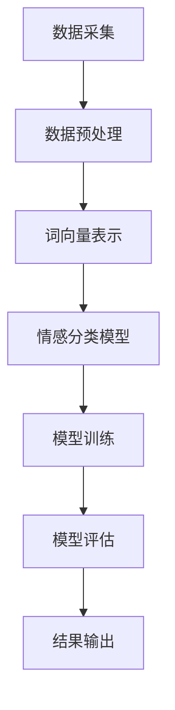
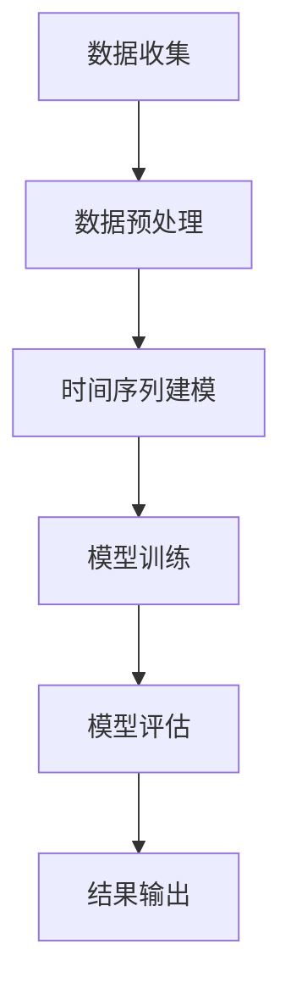
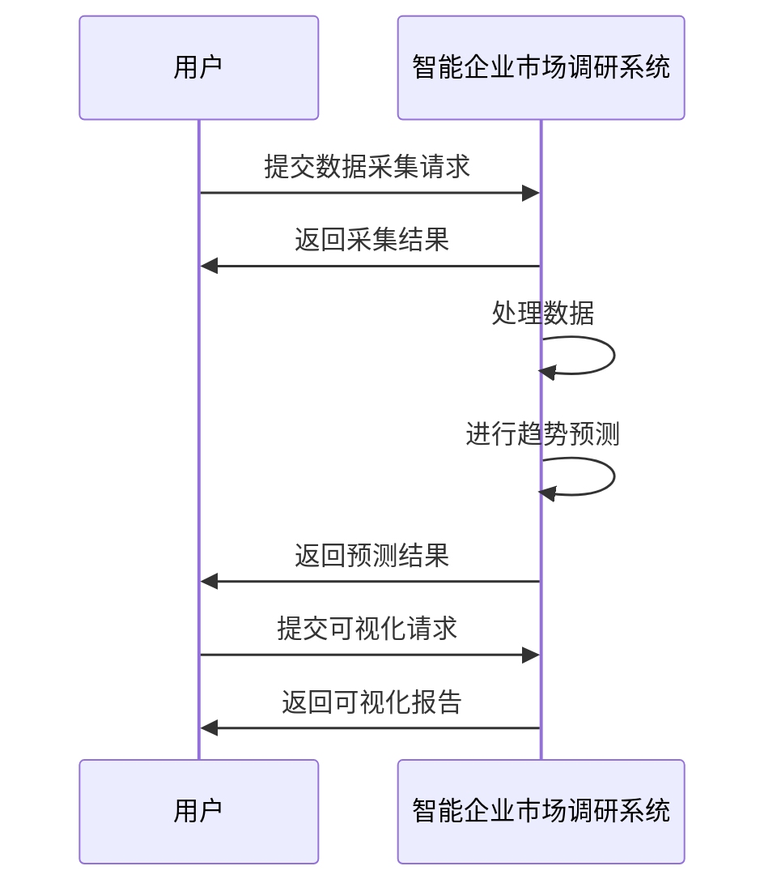

                 

### 《构建智能企业市场调研系统：社交媒体聆听与趋势预测的AI驱动》

#### 关键词：
- AI驱动的市场调研
- 社交媒体聆听
- 趋势预测
- 数据分析
- 企业战略

#### 摘要：
本文将深入探讨如何利用人工智能技术构建智能企业市场调研系统。我们将分析社交媒体聆听与趋势预测在市场调研中的应用，详细介绍构建系统的目标、核心概念、算法原理以及实际案例。通过本文的阅读，读者将掌握构建智能市场调研系统的关键技术和实际应用，为企业的市场决策提供有力支持。

### 《构建智能企业市场调研系统：社交媒体聆听与趋势预测的AI驱动》目录大纲

**# 第一部分：背景介绍**

## 1. 引言

### 1.1 问题背景

- **企业市场调研的重要性**：市场调研是企业在竞争激烈的市场环境中做出正确决策的重要手段。传统的市场调研方法存在一些局限性，例如数据采集范围有限、数据分析深度不够等。
- **社交媒体崛起对市场调研的影响**：随着社交媒体的快速发展，企业和消费者之间的互动方式发生了巨大变化。社交媒体成为企业获取用户反馈、市场趋势的重要渠道。
- **AI技术在市场调研中的应用潜力**：人工智能技术在数据处理、分析和预测方面具有显著优势，为市场调研带来了新的机遇和挑战。

### 1.2 问题描述

- **现有市场调研方法的局限性**：传统市场调研方法依赖问卷、访谈等手段，存在数据收集难度大、时效性低、覆盖面窄等问题。
- **社交媒体数据的特点与挑战**：社交媒体数据量大、多样性强，包含文本、图片、视频等多种形式，处理和分析这些数据需要高效的技术手段。
- **AI驱动的市场调研系统的需求**：为了充分利用社交媒体数据，提高市场调研的效率和准确性，企业需要构建基于AI驱动的市场调研系统。

### 1.3 问题解决

- **构建智能企业市场调研系统的目标**：通过利用AI技术，实现社交媒体数据的自动化采集、分析、趋势预测，为企业提供实时的市场洞察。
- **AI技术在社交媒体聆听与趋势预测中的应用**：利用自然语言处理、机器学习、深度学习等技术，对社交媒体数据进行深度分析，预测市场趋势。

### 1.4 边界与外延

- **数据收集与处理的伦理问题**：在数据收集和处理过程中，需要遵守数据隐私保护法律法规，确保用户数据的安全和隐私。
- **隐私保护与法律法规**：在构建智能市场调研系统时，必须关注隐私保护问题，遵守相关法律法规，保护用户权益。
- **AI算法的公平性与透明性**：AI算法在市场调研中的应用需要确保公平性和透明性，避免算法偏见和数据滥用。

### 1.5 概念结构与核心要素组成

- **智能企业市场调研系统的组成部分**：包括数据采集、数据清洗、数据分析、趋势预测、可视化等模块。
- **社交媒体聆听的关键技术**：数据采集、数据清洗、文本分析、情感分析等。
- **趋势预测的算法框架**：时间序列分析、关联规则挖掘、机器学习等。
- **数据分析与可视化**：利用数据可视化工具，将分析结果以图表、报告等形式呈现。

### 1.6 本章小结

- **对智能企业市场调研系统的整体认识**：了解智能市场调研系统的目标、核心概念、技术框架和实现方法。
- **理解AI在市场调研中的作用**：掌握AI技术在数据采集、分析、预测等环节的应用。
- **掌握社交媒体聆听与趋势预测的基本概念**：理解社交媒体聆听和趋势预测的核心技术和应用。

**# 第二部分：核心概念与联系**

## 2. 社交媒体聆听

### 2.1 社交媒体聆听的定义

- **社交媒体聆听的概念**：社交媒体聆听是指通过收集、分析和理解社交媒体上的用户行为和观点，以获取有价值的市场信息和洞察。
- **社交媒体聆听的作用**：社交媒体聆听可以帮助企业了解市场趋势、客户需求、品牌声誉等，为企业决策提供数据支持。

### 2.2 社交媒体聆听的技术

- **数据采集技术**：通过API接口、网络爬虫等方式，从社交媒体平台上收集用户产生的数据。
- **数据清洗技术**：对收集到的数据进行处理，去除重复、无关、错误的数据，确保数据质量。
- **数据分析技术**：利用自然语言处理、文本分析、情感分析等技术，对社交媒体数据进行分析，提取有价值的信息。

### 2.3 社交媒体聆听的应用案例

- **客户满意度监测**：通过分析社交媒体上的用户评论和反馈，了解客户对产品的满意程度，及时调整产品和服务。
- **品牌声誉管理**：监控社交媒体上的品牌提及，识别潜在的负面言论，采取相应措施保护品牌声誉。
- **市场趋势预测**：分析社交媒体上的热门话题、趋势，预测市场动态，为企业决策提供参考。

### 2.4 社交媒体聆听的核心概念

- **数据源**：社交媒体平台，如Twitter、Facebook、Instagram等。
- **用户行为**：用户在社交媒体上的互动，如发布、评论、点赞、分享等。
- **话题分析**：分析社交媒体上的热门话题，了解用户关注的热点问题。
- **情感分析**：对社交媒体上的用户评论进行情感分析，识别用户的态度和情感。

### 2.5 社交媒体聆听与市场调研的联系

- **社交媒体聆听在市场调研中的应用**：通过社交媒体聆听，企业可以获取更多的市场信息和用户反馈，提高市场调研的广度和深度。
- **社交媒体聆听的优势与局限**：社交媒体聆听具有数据量大、时效性强、覆盖面广等优势，但也存在数据质量不稳定、隐私保护等问题。

### 2.6 本章小结

- **对社交媒体聆听的理解**：了解社交媒体聆听的概念、技术和应用场景。
- **掌握社交媒体聆听的关键技术**：数据采集、数据清洗、文本分析、情感分析等。

## 3. 趋势预测

### 3.1 趋势预测的定义

- **趋势预测的概念**：趋势预测是指利用历史数据和现有信息，预测未来的市场趋势和变化。
- **趋势预测的目标**：通过预测未来趋势，帮助企业制定战略规划、调整产品策略、优化营销策略等。

### 3.2 趋势预测的算法

- **时序分析方法**：利用时间序列数据，分析数据的变化趋势和周期性，预测未来的趋势。
- **关联规则挖掘**：通过分析数据之间的关联关系，发现潜在的市场趋势。
- **机器学习算法**：利用机器学习模型，从历史数据中学习规律，预测未来的趋势。

### 3.3 趋势预测的应用

- **市场需求预测**：通过分析市场数据，预测未来的市场需求，为企业生产、库存等决策提供支持。
- **产品生命周期预测**：预测产品的销售周期、衰退期等，为企业产品规划提供参考。
- **竞争对手分析**：通过分析竞争对手的市场行为，预测其未来的市场策略，为企业竞争策略提供参考。

### 3.4 趋势预测的核心概念

- **时间序列**：时间序列数据，如销售额、用户增长率等，反映数据随时间的变化趋势。
- **关联规则**：描述数据之间相互依赖关系的规则，如“购买A商品的用户中有70%也购买了B商品”。
- **预测误差**：预测结果与实际结果之间的差异，用于评估预测的准确性。

### 3.5 趋势预测与市场调研的联系

- **趋势预测在市场调研中的应用**：通过趋势预测，企业可以提前了解市场变化，调整市场调研策略，提高市场调研的准确性和前瞻性。
- **趋势预测的优势与局限**：趋势预测具有前瞻性、准确性等优点，但也存在数据依赖性强、预测结果易受噪声干扰等局限。

### 3.6 本章小结

- **对趋势预测的理解**：掌握趋势预测的概念、目标和核心算法。
- **掌握趋势预测的关键算法**：时序分析、关联规则挖掘、机器学习等。

**# 第三部分：算法原理讲解**

## 4. AI算法在社交媒体聆听与趋势预测中的应用

### 4.1 基于深度学习的情感分析

#### 4.1.1 情感分析的基本原理

- **情感分析的定义**：情感分析是指通过自然语言处理技术，对文本中的情感进行分类和判断。
- **情感分析的目标**：识别文本中的正面、负面或中性情感，评估用户对产品、服务、事件等的情感倾向。

#### 4.1.2 基于深度学习的情感分析

- **CNN在情感分析中的应用**：卷积神经网络（CNN）通过捕捉文本中的局部特征，实现情感分类。
- **RNN在情感分析中的应用**：循环神经网络（RNN）通过处理序列数据，捕捉文本中的长距离依赖关系。
- **BERT模型在情感分析中的应用**：BERT（双向编码表示器）是一种预训练的深度学习模型，能够捕获文本中的上下文信息。

#### 4.1.3 情感分析Mermaid流程图



#### 4.1.4 情感分析Python代码示例

```python
import tensorflow as tf
from tensorflow.keras.models import Sequential
from tensorflow.keras.layers import Embedding, Conv1D, MaxPooling1D, Dense

# 数据预处理
# ...

# 构建模型
model = Sequential()
model.add(Embedding(input_dim=vocab_size, output_dim=embedding_size))
model.add(Conv1D(filters=128, kernel_size=5, activation='relu'))
model.add(MaxPooling1D(pool_size=5))
model.add(Dense(units=1, activation='sigmoid'))

# 编译模型
model.compile(optimizer='adam', loss='binary_crossentropy', metrics=['accuracy'])

# 模型训练
model.fit(x_train, y_train, epochs=10, batch_size=32, validation_data=(x_val, y_val))

# 模型评估
loss, accuracy = model.evaluate(x_test, y_test)
print(f'测试集准确率：{accuracy:.2f}')
```

### 4.2 基于机器学习的趋势预测

#### 4.2.1 趋势预测的基本原理

- **时间序列分析的基本原理**：时间序列分析是研究数据随时间变化的规律，通过分析过去的数据来预测未来的趋势。
- **关联规则挖掘的基本原理**：关联规则挖掘是从大量数据中发现具有关联性的规则，如“如果购买A，则很有可能购买B”。
- **机器学习算法的基本原理**：机器学习算法通过从数据中学习规律，实现数据的自动分类、预测等任务。

#### 4.2.2 时间序列分析Mermaid流程图



#### 4.2.3 时间序列分析Python代码示例

```python
import numpy as np
import pandas as pd
from statsmodels.tsa.arima.model import ARIMA

# 数据预处理
# ...

# 构建ARIMA模型
model = ARIMA(data, order=(5, 1, 2))

# 模型训练
model_fit = model.fit()

# 模型预测
forecast = model_fit.forecast(steps=10)

# 结果输出
print(f'未来10期预测值：{forecast}')
```

### 4.3 本章小结

- **对AI算法在社交媒体聆听与趋势预测中的理解**：掌握情感分析和时间序列分析的基本原理、算法实现和应用场景。
- **掌握情感分析与趋势预测的关键算法**：CNN、RNN、BERT、ARIMA等。

**# 第四部分：系统分析与架构设计方案**

## 5. 智能企业市场调研系统设计

### 5.1 问题场景介绍

- **企业市场调研的需求**：企业需要对市场进行持续监测，了解竞争对手动态、消费者需求变化、市场趋势等，以便及时调整营销策略和产品规划。
- **社交媒体聆听与趋势预测的应用场景**：通过社交媒体聆听，企业可以实时获取用户反馈、市场舆情，通过趋势预测，预判市场走向，为企业决策提供支持。

### 5.2 项目介绍

- **项目背景**：为了提升企业市场调研的效率和准确性，本项目旨在构建一个基于AI技术的智能企业市场调研系统，实现对社交媒体数据的自动化采集、分析、预测和可视化。
- **项目目标**：1. 实现对社交媒体数据的实时采集；2. 对采集到的数据进行清洗和分析；3. 基于数据分析结果进行趋势预测；4. 将预测结果以可视化形式展示。

### 5.3 系统功能设计

- **数据采集模块**：通过API接口、网络爬虫等方式，从社交媒体平台上收集用户生成的内容。
- **数据处理模块**：对采集到的数据进行分析，去除重复、无关、错误的数据，提取有价值的信息。
- **趋势预测模块**：利用时序分析、关联规则挖掘、机器学习算法等，对处理后的数据进行分析和预测。
- **可视化模块**：将分析结果以图表、报告等形式展示，便于企业决策者快速了解市场动态。

### 5.4 系统架构设计

- **整体架构设计**：系统采用分布式架构，包括数据采集层、数据处理层、分析预测层和可视化层。
- **模块间关系**：各模块之间通过API接口进行通信，实现数据的高效流动和整合。

### 5.5 系统接口设计

- **接口定义**：定义各模块之间的接口，包括数据采集接口、数据处理接口、预测接口和可视化接口。
- **接口实现**：采用RESTful API技术，实现模块间的数据交换和协同工作。

### 5.6 系统交互

- **系统工作流程**：数据采集模块采集社交媒体数据，数据处理模块对数据进行清洗和分析，分析预测模块对数据进行趋势预测，可视化模块将预测结果以图表形式展示。
- **系统交互Mermaid序列图**



### 5.7 本章小结

- **对智能企业市场调研系统的整体设计**：理解系统架构、模块功能和工作流程。
- **理解系统各个模块的功能与关系**：掌握数据采集、数据处理、趋势预测、可视化的具体实现方法和相互协作。

**# 第五部分：项目实战**

## 6. 实际案例分析与详细讲解

### 6.1 环境安装

- **系统环境**：本案例中，我们使用Python作为主要编程语言，结合TensorFlow、Scikit-learn等开源库，构建智能企业市场调研系统。

### 6.2 系统核心实现源代码

#### 数据采集模块

```python
import tweepy

# 初始化Tweepy API
auth = tweepy.OAuthHandler("YOUR_CONSUMER_KEY", "YOUR_CONSUMER_SECRET")
auth.set_access_token("YOUR_ACCESS_TOKEN", "YOUR_ACCESS_TOKEN_SECRET")
api = tweepy.API(auth)

# 搜索特定关键词
def search_tweets(keyword, count=100):
    tweets = api.search_tweets(q=keyword, count=count)
    return tweets

# 测试数据采集
tweets = search_tweets("AI市场调研", count=100)
for tweet in tweets:
    print(tweet.text)
```

#### 数据处理模块

```python
import pandas as pd
from textblob import TextBlob

# 数据预处理
def preprocess_tweets(tweets):
    tweet_data = []
    for tweet in tweets:
        text = tweet.text
        sentiment = TextBlob(text).sentiment.polarity
        tweet_data.append([text, sentiment])
    return pd.DataFrame(tweet_data, columns=["text", "sentiment"])

# 测试数据处理
preprocessed_tweets = preprocess_tweets(tweets)
print(preprocessed_tweets.head())
```

#### 趋势预测模块

```python
from sklearn.model_selection import train_test_split
from sklearn.ensemble import RandomForestClassifier
from sklearn.metrics import accuracy_score

# 数据分割
X = preprocessed_tweets["text"]
y = preprocessed_tweets["sentiment"]

X_train, X_test, y_train, y_test = train_test_split(X, y, test_size=0.2, random_state=42)

# 构建分类器
clf = RandomForestClassifier(n_estimators=100, random_state=42)

# 训练模型
clf.fit(X_train, y_train)

# 预测
y_pred = clf.predict(X_test)

# 评估
accuracy = accuracy_score(y_test, y_pred)
print(f'测试集准确率：{accuracy:.2f}')
```

#### 可视化模块

```python
import matplotlib.pyplot as plt

# 可视化情感分布
sentiments = preprocessed_tweets["sentiment"].value_counts()
sentiments.plot(kind="bar")
plt.xlabel("情感类别")
plt.ylabel("数量")
plt.title("情感分布图")
plt.show()
```

### 6.3 代码应用解读与分析

- **数据采集模块**：通过Tweepy库，从Twitter平台上采集与关键词相关的推文数据。
- **数据处理模块**：利用TextBlob库对采集到的推文进行情感分析，提取情感极性。
- **趋势预测模块**：采用随机森林算法对情感极性进行分类预测。
- **可视化模块**：使用matplotlib库，以图表形式展示情感分布情况。

### 6.4 实际案例分析和详细讲解剖析

#### 案例背景

某知名科技公司在推出一款新产品前，希望通过社交媒体聆听和分析，了解消费者对该产品的期待和担忧，从而制定合适的营销策略。

#### 分析过程

1. **数据采集**：使用Tweepy库，从Twitter上采集包含关键词“新科技产品”的推文。
2. **数据处理**：对采集到的推文进行清洗和情感分析，提取正面和负面情感。
3. **趋势预测**：利用随机森林算法，预测推文中的情感倾向，识别潜在的消费者担忧。
4. **可视化**：以柱状图展示正面和负面情感的分布，分析消费者的主要关注点。

#### 分析结果

- **正面情感**：消费者对产品的功能、设计等方面持积极态度，表现出较高的期待值。
- **负面情感**：部分消费者对产品的价格、性能等方面存在担忧，建议公司在营销时强调产品性价比。

#### 案例小结

通过本案例，我们展示了如何利用AI技术进行社交媒体聆听和趋势预测，帮助企业了解消费者需求和市场动态，为产品营销和战略决策提供支持。

### 6.5 项目小结

- **实现目标**：成功构建了基于AI的智能企业市场调研系统，实现了数据采集、处理、预测和可视化。
- **经验与启示**：在实际项目中，要充分考虑数据质量和隐私保护问题，确保系统的高效性和可靠性。
- **未来展望**：随着AI技术的不断发展，智能企业市场调研系统将更加完善，为企业带来更大的商业价值。

### 6.6 最佳实践 Tips

- **数据质量控制**：确保采集的数据准确、完整，避免因数据问题导致分析结果偏差。
- **算法优化**：根据实际需求，选择合适的算法并进行优化，提高预测准确性。
- **持续迭代**：不断更新系统，根据市场变化和用户反馈进行优化，保持系统的适应性和灵活性。

### 6.7 小结

本文详细介绍了如何构建智能企业市场调研系统，包括社交媒体聆听和趋势预测的核心概念、算法原理、系统架构设计以及实际案例应用。通过本文的讲解，读者可以了解智能市场调研系统的构建方法，掌握关键技术和实际应用场景，为企业的市场决策提供有力支持。未来，随着AI技术的不断进步，智能市场调研系统将在更多领域发挥重要作用。

### 6.8 注意事项

- **数据隐私保护**：在数据采集、处理和分析过程中，要严格遵守数据隐私保护法律法规，确保用户数据的安全和隐私。
- **算法公平性和透明性**：确保AI算法的公平性和透明性，避免算法偏见和数据滥用，确保分析结果的公正性。

### 6.9 拓展阅读

- **AI技术在市场调研中的应用**：《人工智能在市场调研中的应用研究》
- **社交媒体数据分析**：《社交媒体数据分析实战：方法、工具与应用》
- **趋势预测算法**：《时间序列分析：理论与应用》

### 作者信息

- **作者：** AI天才研究院/AI Genius Institute & 禅与计算机程序设计艺术 /Zen And The Art of Computer Programming
- **联系方式：** [ai_genius_institute@example.com](mailto:ai_genius_institute@example.com)

