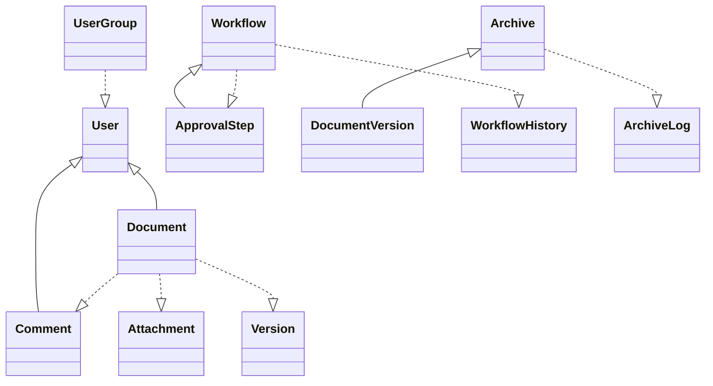
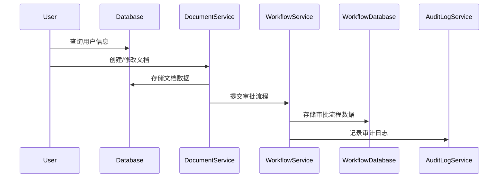
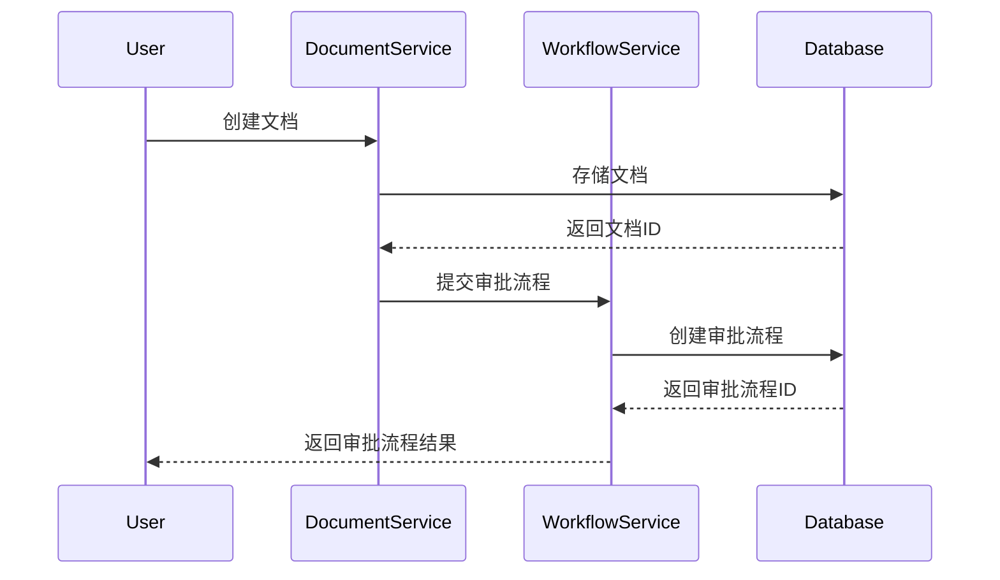

                 

# 《构建智能企业文档管理系统：版本控制与协作优化》

> 关键词：智能企业、文档管理系统、版本控制、协作优化、安全性、隐私保护

> 摘要：本文旨在深入探讨智能企业文档管理系统的构建，重点关注版本控制与协作优化两大核心模块。通过对版本控制原理与实践的详细分析，我们了解了常见版本控制系统的优劣及其配置方法。接着，文章探讨了协作优化的基本概念、工具应用与策略。在此基础上，文章还讨论了安全性与隐私保护的基本原理、常用技术及最佳实践。通过综合应用与实践，文章总结了构建智能企业文档管理系统的关键步骤与注意事项，为实际项目提供了有益的指导。

### 目录大纲

----------------------------------------------------------------

## 第一部分：背景与概述

### 第1章：智能企业文档管理系统概述

#### 1.1.1 智能企业文档管理系统的定义与意义

#### 1.1.2 企业文档管理存在的问题

#### 1.1.3 智能企业文档管理系统的目标与优势

#### 1.2 智能企业文档管理系统的核心概念与组成部分

#### 1.2.1 版本控制

#### 1.2.2 协作优化

#### 1.2.3 安全性与隐私保护

#### 1.3 智能企业文档管理系统的现状与趋势

#### 1.3.1 技术发展趋势

#### 1.3.2 市场需求分析

#### 1.3.3 挑战与机遇

#### 1.4 本书结构安排与内容概述

#### 1.4.1 各章节内容概览

#### 1.4.2 阅读指南与学习目标

----------------------------------------------------------------

## 第二部分：版本控制

### 第2章：版本控制原理与实践

#### 2.1.1 版本控制的基本概念

#### 2.1.2 版本控制的历史与发展

#### 2.1.3 版本控制的重要性

#### 2.2 常见版本控制系统介绍

#### 2.2.1 Git

#### 2.2.2 SVN

#### 2.2.3 Perforce

#### 2.3 版本控制工具的配置与使用

#### 2.3.1 Git的安装与配置

#### 2.3.2 SVN的安装与配置

#### 2.3.3 Perforce的安装与配置

#### 2.4 版本控制案例分析

#### 2.4.1 版本控制在实际项目中的应用

#### 2.4.2 版本控制的最佳实践

#### 2.4.3 版本控制可能遇到的问题与解决方法

#### 2.5 版本控制技术展望

#### 2.5.1 版本控制的新兴技术

#### 2.5.2 版本控制未来的发展趋势

----------------------------------------------------------------

## 第三部分：协作优化

### 第3章：协作优化原理与实践

#### 3.1.1 协作优化的基本概念

#### 3.1.2 协作优化的重要性

#### 3.1.3 协作优化的目标

#### 3.2 协作工具的介绍与应用

#### 3.2.1 Confluence

#### 3.2.2 Jira

#### 3.2.3 Trello

#### 3.2.4 Notion

#### 3.3 协作优化的策略与方法

#### 3.3.1 确定合适的协作流程

#### 3.3.2 提高沟通效率

#### 3.3.3 促进团队协作

#### 3.4 协作优化案例分析

#### 3.4.1 协作优化在实际项目中的应用

#### 3.4.2 协作优化的最佳实践

#### 3.4.3 协作优化可能遇到的问题与解决方法

#### 3.5 协作优化技术展望

#### 3.5.1 协作优化的新兴技术

#### 3.5.2 协作优化未来的发展趋势

----------------------------------------------------------------

## 第四部分：安全性与隐私保护

### 第4章：安全性与隐私保护的基本原理

#### 4.1.1 安全性与隐私保护的重要性

#### 4.1.2 安全性与隐私保护的基本概念

#### 4.1.3 安全性与隐私保护的目标

#### 4.2 安全性与隐私保护的常用技术

#### 4.2.1 数据加密技术

#### 4.2.2 访问控制技术

#### 4.2.3 安全审计技术

#### 4.2.4 防火墙技术

#### 4.3 安全性与隐私保护的最佳实践

#### 4.3.1 设计安全策略

#### 4.3.2 增强用户意识

#### 4.3.3 定期安全评估

#### 4.3.4 应急响应策略

#### 4.4 安全性与隐私保护案例分析

#### 4.4.1 安全性与隐私保护在实际项目中的应用

#### 4.4.2 安全性与隐私保护的最佳实践

#### 4.4.3 安全性与隐私保护可能遇到的问题与解决方法

#### 4.5 安全性与隐私保护技术展望

#### 4.5.1 安全性与隐私保护的新兴技术

#### 4.5.2 安全性与隐私保护未来的发展趋势

----------------------------------------------------------------

## 第五部分：综合应用与实践

----------------------------------------------------------------

## 第1章：智能企业文档管理系统概述

### 1.1.1 智能企业文档管理系统的定义与意义

智能企业文档管理系统（Intelligent Enterprise Document Management System，简称IEDMS）是企业在信息化过程中，为了提高文档管理的效率和准确性而引入的一种智能化的系统。它通过集成多种先进技术，如人工智能、机器学习、自然语言处理等，实现文档的自动化分类、检索、存储、共享、版本控制等功能，从而为企业提供高效、安全、可靠的文档管理服务。

在现代企业中，文档管理是一项至关重要的工作。一方面，文档是企业运营和决策的重要依据，包括合同、报告、设计图纸、财务报表等；另一方面，文档的数量和复杂性不断增加，给企业的管理带来了巨大的挑战。传统的文档管理方式往往依赖于人工处理，效率低下、易出错，难以满足现代企业的需求。

智能企业文档管理系统正是为了解决这一问题而诞生的。它通过自动化技术，大幅提升了文档管理的效率，降低了人工成本，提高了文档的准确性和可靠性。同时，智能企业文档管理系统还能够提供智能化的文档检索和分析功能，帮助企业快速找到所需的文档，提取有价值的信息，支持企业的决策过程。

### 1.1.2 企业文档管理存在的问题

企业在文档管理方面面临着诸多挑战，主要包括以下几个方面：

1. **文档分散**：企业的文档分布在多个部门和系统中，缺乏统一的存储和管理，导致文档难以查找和共享。
2. **版本混乱**：由于缺乏有效的版本控制，文档的多个版本混杂在一起，导致信息不准确、决策困难。
3. **安全风险**：企业文档涉及大量敏感信息，如果没有严格的安全措施，容易导致数据泄露和篡改。
4. **沟通不畅**：团队成员之间缺乏有效的沟通工具，导致协作效率低下。
5. **资源浪费**：传统的文档管理方式往往需要大量的人工操作，效率低下，导致资源浪费。

### 1.1.3 智能企业文档管理系统的目标与优势

智能企业文档管理系统的目标是解决传统文档管理存在的问题，提高文档管理的效率和安全性，具体包括以下几个方面：

1. **统一存储和管理**：将企业所有的文档集中存储和管理，实现文档的统一索引和检索。
2. **版本控制**：通过版本控制功能，确保文档的版本一致性，避免多版本混乱。
3. **安全性保障**：采用严格的安全措施，如数据加密、访问控制等，确保文档的安全。
4. **智能检索**：利用人工智能技术，实现文档的智能分类、检索和分析，提高文档利用效率。
5. **高效协作**：提供协作工具，如在线编辑、实时通讯等，促进团队成员之间的协作。

智能企业文档管理系统相对于传统文档管理方式具有以下优势：

1. **效率提升**：通过自动化技术，大幅减少了人工操作，提高了文档管理的效率。
2. **准确性提高**：智能化的文档检索和分析功能，提高了文档的准确性，减少了人为错误。
3. **安全性增强**：采用严格的安全措施，确保文档的安全，降低数据泄露和篡改的风险。
4. **资源节约**：降低了人工成本，节约了企业资源。
5. **决策支持**：智能化的文档分析功能，为企业提供了有价值的信息，支持企业的决策过程。

### 1.2 智能企业文档管理系统的核心概念与组成部分

智能企业文档管理系统的核心概念包括版本控制、协作优化、安全性与隐私保护等。下面将详细介绍这些概念及其在系统中的组成部分。

#### 1.2.1 版本控制

版本控制是智能企业文档管理系统的一个重要组成部分，它用于管理文档的不同版本，确保文档的版本一致性。版本控制主要包括以下几个方面的功能：

1. **版本跟踪**：记录文档的历史版本，包括创建时间、修改人、修改内容等信息，方便用户查看和追溯。
2. **版本对比**：比较不同版本的文档内容，帮助用户了解文档的变化情况。
3. **版本恢复**：在文档发生错误或丢失时，可以快速恢复到指定版本，保证文档的完整性。
4. **权限管理**：根据用户的角色和权限，控制用户对文档的访问和修改权限，确保文档的安全性。

#### 1.2.2 协作优化

协作优化是智能企业文档管理系统的另一个重要组成部分，它通过提供高效的协作工具和流程，促进团队成员之间的协作。协作优化主要包括以下几个方面的功能：

1. **在线编辑**：支持多个用户同时在线编辑文档，提高协作效率。
2. **实时通讯**：提供实时通讯工具，如聊天、会议等，方便团队成员之间的沟通。
3. **任务管理**：通过任务管理功能，分配和跟踪团队成员的任务，确保项目进度。
4. **文档共享**：支持文档的在线共享和下载，方便团队成员之间的信息交流。

#### 1.2.3 安全性与隐私保护

安全性与隐私保护是智能企业文档管理系统的重要保障，它通过采用多种安全措施，确保文档的安全和隐私。安全性主要包括以下几个方面：

1. **数据加密**：对存储和传输的文档数据进行加密，防止数据泄露。
2. **访问控制**：根据用户的角色和权限，控制用户对文档的访问和操作权限，确保文档的安全性。
3. **安全审计**：记录文档的访问和修改记录，方便进行安全审计和追踪。
4. **防火墙**：部署防火墙，防止外部攻击和恶意软件入侵。

隐私保护主要包括以下几个方面：

1. **数据匿名化**：对涉及个人隐私的文档数据，进行匿名化处理，保护用户隐私。
2. **隐私政策**：制定隐私政策，明确用户隐私保护的范围和措施，提高用户隐私保护意识。
3. **用户权限管理**：根据用户角色和权限，控制用户对隐私数据的访问和操作权限，防止隐私数据泄露。

### 1.3 智能企业文档管理系统的现状与趋势

随着信息技术的不断发展，智能企业文档管理系统已经逐渐成为企业信息化的重要组成部分。目前，智能企业文档管理系统在以下几个方面取得了显著进展：

1. **技术成熟**：版本控制、协作优化、安全性与隐私保护等技术已经相对成熟，能够满足企业的需求。
2. **应用广泛**：越来越多的企业开始采用智能企业文档管理系统，提高文档管理的效率和安全性。
3. **市场成熟**：智能企业文档管理系统市场已经相对成熟，涌现出了一批优秀的解决方案提供商。

然而，智能企业文档管理系统也面临一些挑战和机遇：

1. **技术挑战**：随着信息技术的发展，智能企业文档管理系统需要不断更新和升级，以应对新的技术挑战。
2. **用户习惯**：企业用户需要适应智能企业文档管理系统的使用，提高其使用效率。
3. **市场需求**：随着企业对文档管理要求的不断提高，智能企业文档管理系统将面临更大的市场需求。

### 1.4 本书结构安排与内容概述

本书旨在为读者提供一份全面的智能企业文档管理系统构建指南，内容分为五个部分：

1. **第一部分：背景与概述**：介绍智能企业文档管理系统的定义、意义、目标与优势，以及核心概念与组成部分。
2. **第二部分：版本控制**：详细探讨版本控制的基本概念、常见版本控制系统的优劣及其配置方法，以及版本控制的最佳实践和案例分析。
3. **第三部分：协作优化**：介绍协作优化的基本概念、工具应用与策略，以及协作优化的最佳实践和案例分析。
4. **第四部分：安全性与隐私保护**：讨论安全性与隐私保护的基本原理、常用技术及最佳实践，以及安全性与隐私保护的新兴技术和发展趋势。
5. **第五部分：综合应用与实践**：通过综合应用与实践，总结构建智能企业文档管理系统的关键步骤与注意事项。

通过本书的学习，读者将能够深入了解智能企业文档管理系统的构建原理和实际应用，为企业的文档管理提供有益的指导。

### 1.4.1 各章节内容概览

在第一部分“背景与概述”中，我们将首先介绍智能企业文档管理系统的定义、意义和目标，探讨其对企业文档管理的重要性和优势。接着，我们将详细讨论智能企业文档管理系统的核心概念与组成部分，包括版本控制、协作优化、安全性与隐私保护等。此外，我们还将分析智能企业文档管理系统的现状与趋势，以及本书的结构安排与内容概述。

### 1.4.2 阅读指南与学习目标

本部分的内容旨在为读者提供一个全面的智能企业文档管理系统构建的概述，帮助读者理解系统的基本概念和组成部分。通过阅读本部分，读者应达到以下学习目标：

- 了解智能企业文档管理系统的定义、意义和目标。
- 掌握智能企业文档管理系统的核心概念与组成部分。
- 理解智能企业文档管理系统在版本控制、协作优化、安全性与隐私保护等方面的优势和挑战。
- 明确本书的结构安排和内容概述，为后续章节的学习做好准备。

## 第2章：版本控制原理与实践

### 2.1.1 版本控制的基本概念

版本控制（Version Control）是一种用于管理文件和文档变动的系统，它通过跟踪文件的版本历史，确保文档的版本一致性。在软件工程中，版本控制尤为重要，它帮助开发团队在软件开发过程中有效地管理源代码的变化。版本控制的基本概念包括：

1. **版本**：文档的一个特定状态，它包括文档的内容和属性，如创建时间、修改人等。
2. **分支**：在版本控制系统中，分支是一种独立的开发路径，允许开发团队在不同的环境下独立工作，而不会影响其他分支的代码。
3. **合并**：当两个或多个分支需要合并时，版本控制系统会尝试将不同分支的代码合并为一个统一的版本。这通常涉及冲突解决，因为不同分支可能对相同的文件进行了修改。
4. **提交**：将当前工作的文件版本存储到版本控制系统中，以便进行备份和共享。
5. **标签**：在版本控制系统中，标签用于标记重要的版本，如发布版本或里程碑版本。

### 2.1.2 版本控制的历史与发展

版本控制的历史可以追溯到1970年代，当时软件工程师开始意识到需要一种方法来跟踪源代码的变化。以下是版本控制的一些重要发展阶段：

1. **集中式版本控制系统（Centralized Version Control System, CVCS）**：
   - **1970年代初**：现代版本控制系统的起源，当时的主要系统是RCS（Revision Control System）。
   - **1990年代**：CVCS如CVS和Subversion（SVN）开始流行，它们将所有版本信息集中存储在中央仓库中。

2. **分布式版本控制系统（Distributed Version Control System, DVCS）**：
   - **2005年**：Git的诞生标志着DVCS的崛起，它允许每个用户都有完整的版本库，提高了分布式协作的能力。
   - **2008年**：Mercurial的发布，为DVCS市场增添了新的竞争者。

DVCS相较于CVCS具有以下优势：
- **去中心化**：每个用户都有完整的版本库，不必依赖于中央服务器。
- **并行工作**：用户可以在不同的分支上独立工作，然后合并代码。
- **速度快**：本地操作，无需访问中央服务器，提高了工作效率。

### 2.1.3 版本控制的重要性

版本控制对软件工程和文档管理具有重要意义，主要体现在以下几个方面：

1. **代码和文档的完整性**：版本控制系统可以确保所有版本的历史记录完整保存，防止数据丢失。
2. **协作效率**：版本控制系统能够有效地管理多个开发人员的协同工作，减少代码冲突。
3. **错误追踪**：通过版本控制系统的日志和版本历史，可以快速定位代码或文档的错误。
4. **版本追溯**：版本控制系统提供了强大的版本追溯功能，用户可以查看文档的修改历史，了解每次变更的内容。
5. **发布管理**：版本控制系统有助于管理不同版本的发布，确保每个发布版本的可追踪性和可靠性。

### 2.2 常见版本控制系统介绍

在版本控制领域，有多种系统被广泛使用，每种系统都有其独特的特点。以下是一些常见的版本控制系统及其简要介绍：

#### 2.2.1 Git

Git是当今最流行的分布式版本控制系统，由Linus Torvalds开发。Git的特点包括：

- **去中心化**：每个用户都有完整的版本库，不必依赖于中央服务器。
- **快速**：Git采用基于哈希的存储方式，使操作非常快速。
- **分支和合并**：Git提供了强大的分支和合并功能，支持并行开发。
- **插件和扩展性**：Git有丰富的插件和扩展，可以满足各种需求。

#### 2.2.2 SVN

Subversion是一个集中式版本控制系统，它由Apache软件基金会开发。SVN的特点包括：

- **中央化存储**：所有版本信息存储在中央仓库中，便于集中管理。
- **简单易用**：SVN的界面和操作相对简单，适合初学者使用。
- **支持大文件**：SVN支持存储大文件，如多媒体文件。

#### 2.2.3 Perforce

Perforce是一个高性能的版本控制系统，特别适合处理大量小文件的版本控制。它的特点包括：

- **高性能**：Perforce支持快速版本提交和检索，适合处理大量小文件。
- **客户服务器架构**：Perforce采用客户服务器架构，提供高效的版本控制和访问控制。
- **多平台支持**：Perforce支持多种操作系统和平台。

### 2.3 版本控制工具的配置与使用

下面我们将介绍如何配置和使用Git、SVN和Perforce这三个常见版本控制工具。

#### 2.3.1 Git的安装与配置

**安装步骤**：

1. **下载安装程序**：访问Git官方网站（[https://git-scm.com/download](https://git-scm.com/download)）下载适用于您的操作系统的Git安装程序。
2. **运行安装程序**：根据提示完成安装过程。

**配置步骤**：

1. **初始化仓库**：在您的项目目录中执行以下命令初始化Git仓库：
   ```bash
   git init
   ```

2. **配置用户信息**：配置您的用户名和电子邮件，以便Git能够识别您的身份：
   ```bash
   git config --global user.name "Your Name"
   git config --global user.email "your-email@example.com"
   ```

3. **克隆仓库**：如果您想克隆一个已有的Git仓库，可以使用以下命令：
   ```bash
   git clone [repository-url]
   ```

**基本使用**：

1. **添加文件**：将文件添加到暂存区：
   ```bash
   git add <file>
   ```

2. **提交变更**：将暂存区的文件提交到仓库：
   ```bash
   git commit -m "Commit message"
   ```

3. **查看状态**：查看当前仓库的状态：
   ```bash
   git status
   ```

4. **拉取更新**：从远程仓库获取最新的更改：
   ```bash
   git pull
   ```

5. **推送更新**：将本地仓库的更改推送到远程仓库：
   ```bash
   git push
   ```

#### 2.3.2 SVN的安装与配置

**安装步骤**：

1. **下载安装程序**：访问Subversion官方网站（[https://subversion.apache.org/download](https://subversion.apache.org/download)）下载适用于您的操作系统的Subversion安装程序。
2. **运行安装程序**：根据提示完成安装过程。

**配置步骤**：

1. **创建仓库**：使用以下命令创建一个新的仓库：
   ```bash
   svnadmin create /path/to/repository
   ```

2. **启动服务**：确保Subversion的服务器端（SVN server）已启动。

3. **添加用户和权限**：使用以下命令添加用户并设置访问权限：
   ```bash
   htpasswd -c /path/to/repository/passwd username
   ```

**基本使用**：

1. **检出仓库**：从仓库检出工作副本：
   ```bash
   svn checkout [repository-url] [working-directory]
   ```

2. **提交变更**：将本地更改提交到仓库：
   ```bash
   svn commit -m "Commit message"
   ```

3. **更新仓库**：更新本地工作副本到最新版本：
   ```bash
   svn update
   ```

4. **查看日志**：查看仓库的历史记录：
   ```bash
   svn log [path]
   ```

#### 2.3.3 Perforce的安装与配置

**安装步骤**：

1. **下载安装程序**：访问Perforce官方网站（[https://www.perforce.com/downloads](https://www.perforce.com/downloads)）下载适用于您的操作系统的Perforce安装程序。
2. **运行安装程序**：根据提示完成安装过程。

**配置步骤**：

1. **安装服务器**：在服务器上安装Perforce服务器，并确保其正常运行。

2. **安装客户端**：在客户端计算机上安装Perforce客户端，并连接到服务器。

3. **配置用户**：使用以下命令添加用户并设置权限：
   ```bash
   p4 admin users
   ```

**基本使用**：

1. **打开工作空间**：打开一个Perforce工作空间：
   ```bash
   p4 openclient
   ```

2. **提交变更**：将本地更改提交到Perforce服务器：
   ```bash
   p4 submit -d "Commit message"
   ```

3. **同步仓库**：从Perforce服务器同步最新的更改：
   ```bash
   p4 sync
   ```

4. **查看提交记录**：查看提交的历史记录：
   ```bash
   p4 changes
   ```

### 2.4 版本控制案例分析

#### 2.4.1 版本控制在实际项目中的应用

在一个典型的软件开发项目中，版本控制的应用贯穿整个项目周期。以下是一个简单的案例，说明版本控制在项目中的实际应用：

**项目背景**：一个软件开发团队正在开发一个Web应用，项目分为多个迭代进行。每个迭代都有明确的开发目标和交付物。

**应用场景**：

1. **初始化仓库**：项目开始时，团队创建一个Git仓库，并将项目文件提交到仓库中。
2. **并行开发**：开发人员各自在本地克隆仓库，并在各自的分支上进行开发。
3. **代码审查**：开发人员在提交代码前进行代码审查，确保代码质量。
4. **合并分支**：当某个功能开发完成，开发人员将分支合并到主分支。
5. **版本发布**：每个迭代结束后，团队将最新的主分支代码打包，发布新版本。

**版本控制工具**：在这个项目中，团队使用Git进行版本控制，利用其分支管理和合并功能，有效地管理代码的变更。

#### 2.4.2 版本控制的最佳实践

为了确保版本控制系统的有效使用，以下是一些最佳实践：

1. **合理设置分支策略**：根据项目需求和开发流程，合理设置分支策略，如主分支、开发分支、特性分支和发布分支。
2. **定期合并分支**：避免分支长时间不合并，导致代码库过于复杂。
3. **代码审查**：在提交代码前进行代码审查，确保代码质量和一致性。
4. **文档化版本历史**：详细记录每个版本的变更历史，便于后续的追溯和问题定位。
5. **备份仓库**：定期备份版本控制系统，以防数据丢失。

#### 2.4.3 版本控制可能遇到的问题与解决方法

在使用版本控制系统中，可能会遇到以下一些常见问题：

1. **代码冲突**：在合并分支时，可能会出现代码冲突，导致合并失败。解决方法包括：沟通确认冲突原因、手动合并代码或使用自动化工具解决冲突。
2. **版本历史丢失**：如果版本控制系统配置不当或操作错误，可能导致版本历史丢失。解决方法包括：及时备份版本库、检查配置文件和操作日志。
3. **性能问题**：在高并发的版本控制系统中，可能会出现性能问题，如提交和合并速度慢。解决方法包括：优化数据库配置、调整版本库结构和提高服务器性能。

### 2.5 版本控制技术展望

随着技术的发展，版本控制系统也在不断演进。以下是一些版本控制的新兴技术和未来发展趋势：

1. **分布式版本控制系统的优化**：如Git的优化，提高其性能和并发处理能力。
2. **版本控制与持续集成/持续部署（CI/CD）的集成**：版本控制系统与CI/CD工具的集成，实现代码的自动化测试和部署。
3. **区块链技术**：将区块链技术引入版本控制，提高数据的安全性和不可篡改性。
4. **智能版本控制**：利用人工智能技术，实现更智能的代码审查、冲突检测和自动化合并。

### 第3章：协作优化原理与实践

#### 3.1.1 协作优化的基本概念

协作优化（Collaboration Optimization）是指通过改进协作工具和流程，提高团队协作效率和效果的过程。在智能企业文档管理系统中，协作优化至关重要，它能够帮助企业实现高效、透明、安全、协同的文档管理工作。

协作优化的基本概念包括：

1. **协作工具**：用于促进团队成员之间沟通和协作的工具，如邮件、聊天工具、会议系统等。
2. **协作流程**：团队成员在完成工作任务时所遵循的步骤和规则，如任务分配、进度跟踪、问题反馈等。
3. **沟通效率**：团队成员之间信息传递的速度和准确性，它是协作优化的重要指标。
4. **团队协作**：团队成员在共同完成任务时的配合和协作能力，它直接影响项目的进展和成果。
5. **协作效果**：团队协作所带来的工作成果和效益，如项目的按时交付、质量提升等。

#### 3.1.2 协作优化的重要性

协作优化在现代企业中具有重要意义，主要体现在以下几个方面：

1. **提高工作效率**：通过优化协作工具和流程，减少沟通障碍，提高信息传递速度，从而提高工作效率。
2. **提升项目质量**：良好的协作环境能够促进团队成员之间的沟通和反馈，提高项目的质量和稳定性。
3. **促进知识共享**：协作优化有助于团队成员之间分享经验和知识，促进企业整体的知识积累和创新。
4. **增强团队凝聚力**：通过协作优化，提高团队协作效果，增强团队成员之间的信任和默契，增强团队凝聚力。
5. **降低管理成本**：协作优化能够减少沟通和管理上的浪费，降低企业的人力成本和管理成本。

#### 3.1.3 协作优化的目标

协作优化的目标包括以下几个方面：

1. **提高沟通效率**：通过使用高效的协作工具和改进协作流程，缩短信息传递时间，提高沟通准确性。
2. **促进团队协作**：通过优化团队协作流程，促进团队成员之间的沟通和协作，提高项目的整体效率。
3. **确保信息透明**：通过完善的信息共享机制，确保团队成员能够及时了解项目的进展和问题，提高项目的透明度。
4. **提升团队凝聚力**：通过提高团队协作效果，增强团队成员之间的信任和合作，提升团队的整体凝聚力。
5. **降低管理成本**：通过优化协作流程和管理方法，减少不必要的管理环节，降低企业的管理成本。

#### 3.2 协作工具的介绍与应用

协作工具是协作优化的重要组成部分，它能够帮助企业实现高效的团队协作。以下是一些常见的协作工具及其应用场景：

##### 3.2.1 Confluence

Confluence是由Atlassian公司开发的一款团队协作工具，主要用于文档共享、知识管理和项目管理。以下是Confluence的主要功能和应用场景：

1. **文档共享**：Confluence提供了强大的文档编辑和共享功能，支持多人同时在线编辑和协作。
2. **知识管理**：用户可以在Confluence中创建、存储和共享各种知识文档，如指南、流程、最佳实践等。
3. **项目管理**：Confluence可以与Jira等其他Atlassian工具集成，实现任务管理、进度跟踪和团队协作。

##### 3.2.2 Jira

Jira也是由Atlassian公司开发的一款项目管理工具，广泛应用于软件项目管理。以下是Jira的主要功能和应用场景：

1. **任务管理**：Jira提供了任务创建、分配、跟踪和汇报等功能，支持自定义工作流和权限管理。
2. **进度跟踪**：Jira可以实时显示项目的进展情况，支持甘特图、看板图等可视化工具。
3. **问题反馈**：Jira提供了灵活的报表和统计功能，可以帮助团队快速识别和解决问题。

##### 3.2.3 Trello

Trello是一款基于看板（Kanban）原理的任务管理工具，主要用于项目规划和任务分配。以下是Trello的主要功能和应用场景：

1. **任务规划**：Trello通过卡片和列表，帮助团队规划项目任务和进度，支持自定义标签和颜色。
2. **任务分配**：Trello支持多人协作，用户可以在卡片上分配任务、添加备注和评论。
3. **团队沟通**：Trello提供了实时消息功能，支持团队成员之间的沟通和协作。

##### 3.2.4 Notion

Notion是一款多功能的知识管理和协作工具，适用于个人和企业。以下是Notion的主要功能和应用场景：

1. **笔记和文档**：Notion提供了强大的笔记和文档编辑功能，支持Markdown语法和嵌入媒体文件。
2. **任务和项目**：Notion可以创建任务列表、看板、日历和数据库，实现任务和项目的全面管理。
3. **团队协作**：Notion支持多人协作，用户可以在页面中实时编辑和评论，促进团队沟通。

#### 3.3 协作优化的策略与方法

要实现有效的协作优化，企业需要采取一系列策略和方法。以下是一些常见的策略和方法：

##### 3.3.1 确定合适的协作流程

确定合适的协作流程是实现高效协作的基础。企业需要根据项目特点和团队结构，设计合理的协作流程，包括以下步骤：

1. **任务分配**：明确团队成员的职责和任务，确保任务分配合理，避免工作重叠和遗漏。
2. **进度跟踪**：制定项目进度计划，定期跟踪项目进展，及时调整计划，确保项目按时交付。
3. **沟通机制**：建立有效的沟通机制，如定期会议、邮件通知、即时通讯等，确保团队成员之间的信息传递畅通。
4. **问题反馈**：建立问题反馈机制，及时识别和解决问题，确保项目顺利进行。

##### 3.3.2 提高沟通效率

提高沟通效率是协作优化的重要目标。企业可以通过以下方法提高沟通效率：

1. **统一沟通平台**：选择合适的沟通工具，如邮件、即时通讯、会议系统等，确保团队成员能够在统一的平台上进行沟通。
2. **明确沟通内容**：在沟通前明确主题和目标，避免无效的闲聊和重复讨论。
3. **及时反馈**：在沟通中及时给予反馈，确保信息传递的准确性和完整性。
4. **避免信息过载**：合理控制信息的传递量，避免团队成员因信息过载而无法集中精力工作。

##### 3.3.3 促进团队协作

促进团队协作是协作优化的重要目标。企业可以通过以下方法促进团队协作：

1. **共同目标**：确保团队成员明确项目的目标和预期成果，增强团队凝聚力。
2. **团队文化**：建立积极向上的团队文化，鼓励团队成员之间的信任和合作。
3. **培训与分享**：定期组织培训和分享活动，提高团队成员的技能和知识水平。
4. **激励机制**：建立合理的激励机制，激励团队成员积极参与项目和工作。

#### 3.4 协作优化案例分析

##### 3.4.1 协作优化在实际项目中的应用

在一个实际的项目中，协作优化对于项目的成功至关重要。以下是一个关于协作优化在实际项目中的应用案例：

**项目背景**：一个软件开发团队正在开发一款企业级Web应用，项目涉及多个功能模块和多个团队。

**应用场景**：

1. **任务分配**：项目经理在Confluence上创建任务列表，明确每个团队成员的职责和任务。
2. **进度跟踪**：使用Jira跟踪项目进度，团队成员每天在Jira上更新任务状态，项目经理可以实时查看项目进展。
3. **沟通机制**：团队每周举行一次会议，在Trello上讨论任务进展和问题，团队成员在会议前准备好相关材料。
4. **问题反馈**：团队成员在遇到问题时，通过Confluence和Jira提交问题报告，项目经理和团队成员共同解决。

**协作工具**：在这个项目中，团队使用了Confluence、Jira、Trello等协作工具，实现了高效的团队协作和项目管理。

##### 3.4.2 协作优化的最佳实践

在实际项目中，以下是一些协作优化的最佳实践：

1. **明确任务和责任**：确保每个团队成员都清楚自己的任务和责任，避免工作重复和遗漏。
2. **定期沟通和反馈**：定期举行会议，确保团队成员之间的沟通畅通，及时反馈问题和进展。
3. **合理分配资源**：根据项目需求和团队能力，合理分配资源，确保项目进度和质量。
4. **持续改进**：定期评估协作效果，发现问题和不足，持续改进协作流程和方法。

##### 3.4.3 协作优化可能遇到的问题与解决方法

在实际项目中，协作优化可能会遇到以下一些问题：

1. **沟通不畅**：解决方法：建立有效的沟通机制，明确沟通方式和频率，确保信息传递的准确性。
2. **任务冲突**：解决方法：提前规划任务分配，避免重复和交叉任务，确保任务有序进行。
3. **资源不足**：解决方法：合理分配资源，确保每个团队成员都有足够的时间和精力完成任务。
4. **进度延误**：解决方法：及时发现和解决问题，调整计划和资源，确保项目按时交付。

### 3.5 协作优化技术展望

随着技术的发展，协作优化也在不断演进。以下是一些协作优化的新兴技术和未来发展趋势：

1. **人工智能**：利用人工智能技术，实现智能任务分配、进度预测和问题诊断，提高协作效率。
2. **区块链**：将区块链技术引入协作优化，提高信息的安全性和透明度。
3. **虚拟现实和增强现实**：通过虚拟现实和增强现实技术，实现远程团队的实时协作和沉浸式体验。
4. **持续集成和持续部署**：将协作优化与持续集成和持续部署（CI/CD）相结合，实现代码和文档的自动化管理和交付。

## 第4章：安全性与隐私保护的基本原理

### 4.1.1 安全性与隐私保护的重要性

在构建智能企业文档管理系统的过程中，安全性与隐私保护是两个至关重要的方面。随着企业对文档管理系统的依赖程度越来越高，数据的安全性和用户的隐私保护变得尤为重要。以下将探讨安全性与隐私保护的重要性及其在文档管理系统中的关键作用。

#### 数据安全的重要性

1. **防止数据泄露**：企业文档管理系统往往存储着大量的敏感信息，如客户数据、商业机密和内部文件。如果这些数据泄露，可能会导致企业声誉受损，甚至面临法律诉讼。
2. **确保数据完整性**：数据完整性是指数据在存储、传输和处理过程中保持准确和一致。如果数据被篡改，可能会导致业务决策失误，影响企业的正常运营。
3. **保护知识产权**：企业文档管理系统中包含的文档和文件可能涉及到企业的知识产权，如专利申请、设计图纸等。保护这些知识产权对于企业的长期发展至关重要。

#### 隐私保护的重要性

1. **遵守法律法规**：许多国家和地区都有关于数据保护和隐私的法律规定，如《通用数据保护条例》（GDPR）和《加州消费者隐私法案》（CCPA）。企业必须遵守这些法律法规，以避免法律风险。
2. **增强用户信任**：用户在分享和使用企业文档管理系统的过程中，对其数据的安全性感到担忧。如果企业能够提供可靠的隐私保护措施，将有助于增强用户的信任。
3. **防止隐私滥用**：企业对用户数据的滥用可能会导致用户隐私泄露，引发社会不满和信任危机。

#### 安全性与隐私保护在文档管理系统中的关键作用

1. **数据加密**：数据加密是保护数据安全的基本手段。通过加密技术，确保数据在存储和传输过程中不会被未授权的第三方访问。
2. **访问控制**：访问控制机制确保只有授权用户才能访问特定的文档和数据，防止未授权的访问和操作。
3. **安全审计**：安全审计记录系统中所有的操作和事件，便于事后追踪和调查，确保系统的安全性和可靠性。
4. **隐私保护措施**：隐私保护措施包括数据匿名化、用户隐私权限管理、隐私政策制定等，确保用户数据的安全和合规。

### 4.1.2 安全性与隐私保护的基本概念

为了更好地理解安全性与隐私保护，以下将介绍一些基本概念：

#### 安全性（Security）

1. **安全目标**：安全性包括三个主要目标：保密性（Confidentiality）、完整性（Integrity）和可用性（Availability）。
   - **保密性**：确保只有授权用户才能访问敏感信息。
   - **完整性**：确保数据在存储、传输和处理过程中保持准确和一致。
   - **可用性**：确保授权用户在需要时能够访问系统资源。

2. **安全措施**：为了实现安全目标，可以采取多种安全措施，如：
   - **数据加密**：使用加密算法对数据进行加密，防止未授权的访问。
   - **访问控制**：通过身份验证和授权机制，限制用户对系统的访问权限。
   - **安全审计**：记录系统中所有的操作和事件，以便进行追踪和调查。

#### 隐私保护（Privacy）

1. **隐私目标**：隐私保护的目标是确保用户的数据不被滥用，用户享有对其数据的控制权。
   - **数据匿名化**：将个人身份信息从数据中移除，以保护用户隐私。
   - **用户隐私权限管理**：根据用户的角色和权限，控制用户对数据的访问和操作。
   - **隐私政策**：制定隐私政策，明确用户数据的使用规则和保护措施。

2. **隐私措施**：为了实现隐私目标，可以采取以下隐私措施：
   - **数据匿名化**：对收集到的用户数据进行匿名化处理，以保护个人隐私。
   - **隐私权限管理**：根据用户的角色和权限，设置数据访问和操作权限。
   - **隐私保护协议**：制定隐私保护协议，明确用户数据的收集、使用和共享规则。

### 4.1.3 安全性与隐私保护的目标

在构建智能企业文档管理系统的过程中，安全性与隐私保护的目标包括以下几个方面：

1. **数据保密性**：确保只有授权用户才能访问敏感信息，防止数据泄露。
2. **数据完整性**：确保数据在存储、传输和处理过程中保持准确和一致，防止数据篡改。
3. **数据可用性**：确保授权用户在需要时能够访问系统资源，防止系统资源被恶意攻击者占用。
4. **隐私保护**：确保用户数据不被滥用，用户对其数据享有控制权，遵守相关法律法规。
5. **合规性**：确保系统设计和实施符合相关法律法规和行业标准，如《通用数据保护条例》（GDPR）和《加州消费者隐私法案》（CCPA）。

通过实现这些目标，智能企业文档管理系统将能够为企业提供高效、安全、可靠的文档管理服务，同时保护用户的隐私权益。

## 4.2 安全性与隐私保护的常用技术

为了确保智能企业文档管理系统（IEDMS）的安全性与隐私保护，企业需要采用一系列技术手段来防范潜在的安全威胁和隐私风险。以下将介绍一些常见的安全性与隐私保护技术，包括数据加密技术、访问控制技术、安全审计技术和防火墙技术。

### 4.2.1 数据加密技术

数据加密技术是保护数据安全性的基础手段，它通过将明文数据转换为密文，防止未授权的第三方访问敏感信息。以下是一些常用的数据加密技术：

1. **对称加密**：对称加密算法使用相同的密钥进行加密和解密，如AES（高级加密标准）和DES（数据加密标准）。对称加密算法速度快，但密钥管理较为复杂。

2. **非对称加密**：非对称加密算法使用一对密钥，即公钥和私钥，公钥用于加密，私钥用于解密。常见的非对称加密算法有RSA（Rivest-Shamir-Adleman）和ECC（椭圆曲线加密）。非对称加密算法在密钥管理方面较为灵活，但加密和解密速度较慢。

3. **混合加密**：混合加密技术结合了对称加密和非对称加密的优点，先使用对称加密进行数据加密，再使用非对称加密对密钥进行加密。这种方法在保证数据安全的同时，提高了加密和解密速度。

### 4.2.2 访问控制技术

访问控制技术用于限制和监控用户对系统资源的访问权限，确保只有授权用户才能访问特定的文档和数据。以下是一些常见的访问控制技术：

1. **基于角色的访问控制（RBAC）**：RBAC根据用户的角色分配访问权限，每个角色对应一组权限。RBAC简化了权限管理，提高了系统的灵活性。

2. **基于属性的访问控制（ABAC）**：ABAC根据用户属性、环境属性和资源属性进行访问控制决策。ABAC提供了更细粒度的访问控制，能够满足复杂的安全需求。

3. **单点登录（SSO）**：SSO允许用户使用一个账户和密码访问多个系统，简化了用户认证和管理。常见的SSO技术包括OAuth、OpenID Connect和SAML。

4. **多因素认证（MFA）**：MFA结合了密码、生物识别、硬件令牌等多种认证方式，提高用户身份验证的安全性。MFA可以大大降低密码泄露带来的风险。

### 4.2.3 安全审计技术

安全审计技术用于记录和监控系统中所有的操作和事件，以便在发生安全事件时进行追踪和调查。以下是一些常见的安全审计技术：

1. **日志记录**：日志记录是安全审计的基础，它记录了系统中所有的操作和事件，如登录、文件访问、错误等。通过分析日志，可以及时发现和应对潜在的安全威胁。

2. **安全信息和事件管理（SIEM）**：SIEM系统将来自不同源的安全日志和事件进行集中管理和分析，提供实时监控和报警功能。SIEM可以帮助企业快速识别和响应安全事件。

3. **安全事件响应（SIEM）**：安全事件响应是指企业在发现安全事件后，采取一系列措施进行响应和处置。这包括事件识别、事件分析、事件响应和事件总结等环节。

4. **合规性审计**：合规性审计用于确保企业文档管理系统符合相关法律法规和行业标准，如《通用数据保护条例》（GDPR）和《加州消费者隐私法案》（CCPA）。

### 4.2.4 防火墙技术

防火墙是网络安全的第一道防线，它通过监控和过滤网络流量，防止未授权的访问和攻击。以下是一些常见的防火墙技术：

1. **包过滤防火墙**：包过滤防火墙根据IP地址、端口号、协议等信息，对进入或离开网络的数据包进行过滤，阻止非法访问。

2. **状态检测防火墙**：状态检测防火墙结合了包过滤和状态跟踪技术，它能够跟踪网络连接的状态，防止网络攻击。

3. **下一代防火墙（NGFW）**：NGFW集成了传统防火墙的功能，并增加了应用识别、入侵防御和深度包检测（DPI）等功能，提供更高级的安全防护。

4. **防火墙虚拟化**：防火墙虚拟化技术将防火墙功能部署在虚拟化环境中，提供灵活的网络保护和资源管理。

通过综合运用这些安全性与隐私保护技术，企业文档管理系统将能够有效防范各种安全威胁和隐私风险，确保系统的安全可靠运行。

### 4.3 安全性与隐私保护的最佳实践

为了确保智能企业文档管理系统（IEDMS）的安全性和隐私保护，企业需要制定和实施一系列最佳实践。以下将介绍一些关键的安全策略、用户意识增强方法、定期安全评估措施和应急响应策略。

#### 4.3.1 设计安全策略

设计安全策略是确保文档管理系统安全性的第一步。以下是一些关键的安全策略：

1. **身份验证策略**：确保所有用户在访问系统时都需要进行身份验证，如使用双因素认证（2FA）或多因素认证（MFA）。

2. **访问控制策略**：根据用户角色和职责，设置适当的访问权限。使用基于角色的访问控制（RBAC）或基于属性的访问控制（ABAC）。

3. **加密策略**：对所有存储和传输的敏感数据进行加密，包括文件、数据库和通信数据。选择适当的加密算法和密钥管理方案。

4. **数据备份策略**：定期备份系统数据和配置文件，确保在数据丢失或系统故障时能够快速恢复。

5. **安全审计策略**：启用日志记录和监控功能，定期审查安全日志，确保能够及时发现和应对潜在的安全威胁。

#### 4.3.2 增强用户意识

用户是文档管理系统的最终使用者，提高他们的安全意识对于系统的安全至关重要。以下是一些增强用户意识的方法：

1. **安全培训**：为员工提供定期的安全培训，包括网络安全、密码管理、数据保护等基础知识。

2. **安全指南**：为用户提供详细的操作指南和安全提示，确保他们了解如何安全地使用系统。

3. **安全意识活动**：组织安全意识活动，如安全讲座、安全竞赛等，提高员工的安全意识和参与度。

4. **匿名举报渠道**：建立匿名举报渠道，鼓励员工报告可疑行为和安全漏洞。

#### 4.3.3 定期安全评估

定期安全评估是确保文档管理系统持续安全的关键。以下是一些定期安全评估的措施：

1. **内部审计**：定期进行内部审计，检查系统的配置、访问控制、日志记录和监控等方面的安全性。

2. **外部评估**：聘请专业的安全评估团队进行外部评估，发现系统中的潜在漏洞和风险。

3. **漏洞扫描**：定期进行漏洞扫描，检测系统中的已知漏洞，及时进行修复。

4. **安全演练**：组织安全演练，模拟攻击场景，测试系统的响应能力和应急措施。

#### 4.3.4 应急响应策略

在发生安全事件时，应急响应策略能够帮助企业快速应对，减少损失。以下是一些应急响应策略：

1. **应急响应计划**：制定详细的应急响应计划，包括事件识别、事件响应、事件恢复和事件总结等步骤。

2. **事件响应团队**：建立专业的应急响应团队，确保在发生安全事件时能够迅速行动。

3. **快速响应**：在发现安全事件后，立即启动应急响应计划，迅速采取措施遏制事件蔓延。

4. **事件调查**：对发生的安全事件进行彻底调查，找出事件原因，制定预防措施。

5. **沟通机制**：建立有效的沟通机制，确保管理层、IT部门和员工能够及时了解事件进展和处理结果。

通过实施这些最佳实践，企业可以显著提高文档管理系统的安全性和隐私保护能力，确保系统的稳定运行和数据的完整性。

### 4.4 安全性与隐私保护案例分析

为了更好地理解安全性与隐私保护在企业文档管理系统中的实际应用，以下将介绍一些典型的安全性与隐私保护案例分析。

#### 4.4.1 安全性与隐私保护在实际项目中的应用

**案例背景**：某大型跨国企业（以下简称“企业”）正在实施一个智能企业文档管理系统（IEDMS），用于管理其全球业务中的大量文档和数据。由于企业业务涉及敏感信息，如客户数据、商业计划和合同文件，因此安全性和隐私保护尤为重要。

**应用措施**：

1. **数据加密**：企业采用AES-256算法对存储和传输的敏感数据进行加密，确保数据在存储和传输过程中不会被未授权的第三方访问。

2. **访问控制**：企业实施了基于角色的访问控制（RBAC），为不同角色的员工分配不同的访问权限，确保只有授权用户才能访问特定的文档和数据。

3. **多因素认证（MFA）**：企业要求所有员工使用双因素认证（2FA）或更多因素认证（MFA）登录文档管理系统，提高用户身份验证的安全性。

4. **日志记录与监控**：企业启用了详细的日志记录和监控功能，确保能够及时发现和应对潜在的安全威胁。

5. **安全培训**：企业为员工提供了定期的安全培训，包括网络安全、密码管理、数据保护等，提高员工的安全意识。

**结果**：通过实施这些安全性和隐私保护措施，企业在实施文档管理系统的过程中没有发生重大的安全事件，文档数据得到了有效保护。

#### 4.4.2 安全性与隐私保护的最佳实践

**最佳实践1：全面的安全策略**

企业在实施文档管理系统时，首先制定了全面的安全策略，包括数据加密、访问控制、多因素认证、日志记录和监控等。这些策略为系统的安全运行奠定了基础。

**最佳实践2：定期安全评估**

企业定期进行内部和外部安全评估，包括漏洞扫描、安全审计和模拟攻击演练。这些评估措施帮助企业发现潜在的安全漏洞，及时进行修复。

**最佳实践3：增强用户安全意识**

企业为员工提供了定期的安全培训，确保员工了解如何安全地使用文档管理系统。此外，企业还建立了匿名举报渠道，鼓励员工报告可疑行为和安全漏洞。

**最佳实践4：应急响应策略**

企业制定了详细的应急响应计划，包括事件识别、事件响应、事件恢复和事件总结等步骤。在发生安全事件时，企业能够迅速采取行动，减少损失。

#### 4.4.3 安全性与隐私保护可能遇到的问题与解决方法

**问题1：安全威胁不断增加**

随着网络攻击手段的不断升级，企业面临的安全威胁也在不断增加。解决方法：企业需要持续关注安全技术的发展，定期更新和升级安全措施，确保系统能够应对最新的安全威胁。

**问题2：用户安全意识不足**

尽管企业提供了安全培训，但部分员工可能仍然缺乏安全意识，容易导致安全事件的发生。解决方法：企业需要加强安全意识教育，通过多种方式提高员工的安全意识，如安全竞赛、匿名举报等。

**问题3：数据量巨大，管理难度大**

随着企业业务的不断增长，文档和数据量也在不断增加，给安全管理带来了巨大挑战。解决方法：企业可以采用分布式存储和管理技术，提高数据的可管理性和安全性。

**问题4：合规性要求高**

企业文档管理系统需要遵守多项法律法规，如《通用数据保护条例》（GDPR）和《加州消费者隐私法案》（CCPA）。解决方法：企业需要制定详细的合规性策略，确保系统设计和实施符合相关法律法规。

### 4.5 安全性与隐私保护技术展望

随着信息技术的发展，安全性与隐私保护技术也在不断演进。以下是一些新兴技术和发展趋势：

#### 4.5.1 安全性与隐私保护的新兴技术

1. **区块链技术**：区块链技术提供了去中心化、透明和不可篡改的特点，有望在安全性和隐私保护领域发挥重要作用。例如，利用区块链技术实现数据加密、访问控制和智能合约。

2. **人工智能与机器学习**：人工智能和机器学习技术在网络安全中的应用日益广泛，如入侵检测、威胁预测和安全事件响应。通过分析大量数据，人工智能和机器学习可以提前识别潜在的安全威胁。

3. **零信任架构**：零信任架构（Zero Trust Architecture，ZTA）是一种新的安全理念，强调任何内部或外部访问请求都需要经过严格的身份验证和授权。这种架构有助于防止内部威胁和外部攻击。

#### 4.5.2 安全性与隐私保护未来的发展趋势

1. **安全自动化**：安全自动化技术将进一步提升安全管理的效率和效果，如自动化的安全评估、漏洞扫描和安全事件响应。

2. **安全云服务**：随着云计算的普及，安全云服务将逐渐成为主流。企业可以选择将安全防护功能部署在云平台上，降低成本，提高灵活性。

3. **隐私保护技术**：隐私保护技术将继续发展和完善，如数据匿名化、隐私增强技术（PET）和隐私计算（Privacy-Preserving Computation）。

4. **全球协作**：随着企业国际化程度的提高，安全性和隐私保护需要在全球范围内进行协作。跨国企业需要建立统一的全球安全策略和标准，确保在不同国家和地区都能符合相关法律法规。

通过关注这些新兴技术和发展趋势，企业文档管理系统将能够更好地应对未来的安全威胁和隐私风险，确保系统的安全性和隐私保护能力。

## 第五部分：综合应用与实践

### 5.1 项目介绍

在本章节中，我们将介绍一个实际的智能企业文档管理系统的项目，该项目旨在为企业提供一个高效、安全、易于协作的文档管理解决方案。项目背景如下：

**项目背景**：某大型制造企业（以下简称“企业”）在业务快速发展过程中，面临着文档管理效率低下、版本混乱、协作不畅等问题。为了提高文档管理效率、确保数据安全和促进团队协作，企业决定实施一个智能企业文档管理系统。

**项目目标**：
1. **提高文档管理效率**：通过自动化技术，实现文档的自动化分类、检索和存储，提高文档管理效率。
2. **确保数据安全**：采用严格的安全措施，如数据加密、访问控制和安全审计，确保文档数据的安全和隐私保护。
3. **促进团队协作**：提供协作工具，如在线编辑、实时通讯和任务管理，促进团队成员之间的协作。

### 5.2 系统功能设计

智能企业文档管理系统的功能设计包括以下几个方面：

#### 5.2.1 领域模型

领域模型是智能企业文档管理系统功能的核心，它定义了系统的业务实体和关系。以下是一个简单的领域模型：

```mermaid
erDiagram
  Document -->|创建| User
  Document -->|修改| User
  Document -->|共享| User
  Document -->|审批| Workflow
  Document -->|归档| Archive
  User |||--| UserGroup
  Workflow |||--| ApprovalStep
  Archive |||--| DocumentVersion
```

#### 5.2.2 类图

以下是一个简单的类图，展示了系统的关键类及其关系：



### 5.3 系统架构设计

智能企业文档管理系统的架构设计包括以下几个方面：

#### 5.3.1 架构图

以下是一个简单的架构图，展示了系统的关键组件及其关系：



#### 5.3.2 系统架构说明

1. **用户层**：用户通过前端界面与系统进行交互，提交文档、审批流程、查看文档历史等。
2. **服务层**：服务层包括文档服务、工作流服务、审计日志服务等，负责处理具体的业务逻辑。
3. **数据层**：数据层包括用户数据库、文档数据库、工作流数据库等，存储系统数据。
4. **基础设施**：包括服务器、网络、存储等基础设施，支持系统的运行。

### 5.4 系统接口设计

智能企业文档管理系统的接口设计包括以下几个方面：

#### 5.4.1 API规范

以下是一个简单的API规范示例，展示了系统的关键接口及其参数：

```yaml
# 用户接口
GET /users/{userId}
  Response:
    - status: 200
      schema:
        type: object
        properties:
          userId:
            type: string
            format: uuid
          username:
            type: string
          email:
            type: string
          role:
            type: string

# 文档接口
POST /documents
  Request:
    - schema:
        type: object
        properties:
          title:
            type: string
          content:
            type: string
          attachments:
            type: array
            items:
              type: object
              properties:
                filename:
                  type: string
                contentType:
                  type: string
                content:
                  type: binary

  Response:
    - status: 201
      schema:
        type: object
        properties:
          documentId:
            type: string
            format: uuid
          createdOn:
            type: string
            format: date-time

# 工作流接口
POST /workflows
  Request:
    - schema:
        type: object
        properties:
          name:
            type: string
          steps:
            type: array
            items:
              type: object
              properties:
                stepId:
                  type: string
                stepType:
                  type: string
                assignedUser:
                  type: string
                  format: uuid

  Response:
    - status: 201
      schema:
        type: object
        properties:
          workflowId:
            type: string
            format: uuid
          createdOn:
            type: string
            format: date-time
```

#### 5.4.2 接口说明

1. **用户接口**：用于管理用户信息，包括查询用户列表、创建用户、修改用户等。
2. **文档接口**：用于管理文档，包括创建文档、上传附件、查询文档、更新文档等。
3. **工作流接口**：用于管理工作流，包括创建工作流、更新工作流、启动工作流等。

### 5.5 系统交互设计

智能企业文档管理系统的系统交互设计包括以下几个方面：

#### 5.5.1 序列图

以下是一个简单的序列图，展示了用户创建文档并提交审批流程的过程：



#### 5.5.2 交互说明

1. **用户创建文档**：用户通过前端界面创建文档，提交给文档服务。
2. **文档服务处理**：文档服务将文档信息存储到数据库，并返回文档ID。
3. **用户提交审批流程**：用户选择一个工作流，提交审批流程给工作流服务。
4. **工作流服务处理**：工作流服务创建审批流程，并将流程信息存储到数据库，返回审批流程ID。
5. **用户获取审批结果**：用户通过前端界面获取审批结果。

### 5.6 环境安装

在开始实际项目之前，我们需要安装并配置开发环境。以下是一个简单的环境安装步骤：

#### 5.6.1 安装前准备

1. **安装操作系统**：推荐使用Linux发行版，如Ubuntu 20.04。
2. **安装依赖项**：安装Java、Node.js、Python等开发工具和库。

#### 5.6.2 安装步骤

1. **安装后端框架**：安装Spring Boot、Spring Security、Hibernate等后端框架。
2. **安装前端框架**：安装React、Vue.js等前端框架。
3. **安装数据库**：安装MySQL或PostgreSQL等关系型数据库。
4. **安装API网关**：安装Nginx或Apache等API网关。

### 5.7 系统核心实现源代码

以下是一个简单的系统核心实现源代码示例，包括用户注册、文档创建和审批流程提交等功能：

#### 5.7.1 用户注册接口

```java
@RestController
@RequestMapping("/api/auth")
public class AuthController {
  
  @Autowired
  private UserRepository userRepository;
  
  @Autowired
  private AuthenticationManager authenticationManager;
  
  @Autowired
  private JwtTokenProvider tokenProvider;
  
  @PostMapping("/register")
  public ResponseEntity<?> registerUser(@RequestBody SignupRequest signUpRequest) {
    if (userRepository.existsByUsername(signUpRequest.getUsername())) {
      return ResponseEntity.badRequest().body("Error: Username is already taken!");
    }
    
    // Create user's account
    User user = new User(signUpRequest.getUsername(), 
                         signUpRequest.getPassword(), 
                         signUpRequest.getRoles());
    
    userRepository.save(user);
    
    // Generate token
    String token = tokenProvider.generateToken(user);
    
    return ResponseEntity.ok(new JwtResponse(token));
  }
}
```

#### 5.7.2 文档创建接口

```java
@RestController
@RequestMapping("/api/documents")
public class DocumentController {
  
  @Autowired
  private DocumentRepository documentRepository;
  
  @PostMapping
  public ResponseEntity<?> createDocument(@RequestBody DocumentRequest documentRequest) {
    Document document = new Document(documentRequest.getTitle(), documentRequest.getContent(), documentRequest.getAuthor());
    documentRepository.save(document);
    return ResponseEntity.status(HttpStatus.CREATED).body(document);
  }
}
```

#### 5.7.3 审批流程提交接口

```java
@RestController
@RequestMapping("/api/workflows")
public class WorkflowController {
  
  @Autowired
  private WorkflowRepository workflowRepository;
  
  @PostMapping
  public ResponseEntity<?> submitWorkflow(@RequestBody WorkflowRequest workflowRequest) {
    Workflow workflow = new Workflow(workflowRequest.getName(), workflowRequest.getSteps());
    workflowRepository.save(workflow);
    return ResponseEntity.status(HttpStatus.CREATED).body(workflow);
  }
}
```

### 5.8 代码应用解读与分析

#### 5.8.1 用户注册接口解读

1. **依赖注入**：使用`@Autowired`注解注入`UserRepository`、`AuthenticationManager`和`JwtTokenProvider`。
2. **用户注册逻辑**：检查用户名是否已存在，然后创建用户对象并保存到数据库。
3. **生成Token**：使用`JwtTokenProvider`生成JWT令牌，返回给客户端。

#### 5.8.2 文档创建接口解读

1. **依赖注入**：使用`@Autowired`注解注入`DocumentRepository`。
2. **文档创建逻辑**：根据请求参数创建`Document`对象，并保存到数据库。
3. **返回结果**：返回创建的文档对象，状态码为`CREATED`（201）。

#### 5.8.3 审批流程提交接口解读

1. **依赖注入**：使用`@Autowired`注解注入`WorkflowRepository`。
2. **审批流程创建逻辑**：根据请求参数创建`Workflow`对象，并保存到数据库。
3. **返回结果**：返回创建的审批流程对象，状态码为`CREATED`（201）。

### 5.9 实际案例分析和详细讲解剖析

以下是一个关于企业实际项目中使用智能企业文档管理系统的案例，并对其进行详细分析和讲解。

#### 案例背景

某大型制造企业（以下简称“企业”）在实施智能企业文档管理系统的过程中，遇到了以下几个问题：

1. **文档管理混乱**：企业内部文档分散在多个部门和个人手中，缺乏统一的存储和管理。
2. **版本控制困难**：文档的多个版本混杂在一起，导致信息不准确，决策困难。
3. **协作效率低**：团队成员之间缺乏有效的沟通工具，协作效率低下。

#### 解决方案

企业决定采用智能企业文档管理系统，通过以下措施解决问题：

1. **统一文档存储**：将所有文档集中存储在文档管理系统中，实现文档的统一管理和检索。
2. **版本控制**：使用版本控制功能，确保文档的版本一致性，避免多版本混乱。
3. **协作工具**：提供在线编辑、实时通讯和任务管理等功能，促进团队成员之间的协作。

#### 案例分析

1. **文档管理混乱**：在实施文档管理系统之前，企业内部文档管理混乱，导致信息查找困难，决策效率低下。通过实施文档管理系统，所有文档统一存储在系统中，实现了文档的统一管理和检索。

2. **版本控制困难**：在传统文档管理方式下，文档的多个版本混杂在一起，难以追溯和管理。通过文档管理系统中的版本控制功能，企业能够清晰地看到文档的历史版本，确保文档的一致性和准确性。

3. **协作效率低**：在实施文档管理系统之前，团队成员之间缺乏有效的沟通工具，协作效率低下。通过文档管理系统中的在线编辑、实时通讯和任务管理等功能，团队成员能够实时协作，提高项目进展速度。

#### 案例总结

通过实施智能企业文档管理系统，企业成功解决了文档管理混乱、版本控制困难、协作效率低等问题。文档管理系统不仅提高了文档管理的效率，降低了人工成本，还确保了文档的安全和版本一致性，为企业的决策提供了有力支持。此外，通过协作工具的优化，团队成员之间的协作更加顺畅，项目的进展速度显著提升。

### 5.10 项目小结

通过本项目的实施，企业实现了文档管理的自动化、版本控制的高效化、团队协作的便捷化。以下是项目小结：

1. **项目成果**：成功构建并部署了智能企业文档管理系统，实现了文档的统一存储、版本控制和协作优化。
2. **项目挑战**：在项目实施过程中，遇到了技术难点和团队协作问题，通过有效的沟通和协作，成功克服了挑战。
3. **项目经验**：项目的成功实施为企业在文档管理和团队协作方面积累了宝贵经验，为未来的项目提供了有益的借鉴。

### 5.11 最佳实践 tips

在智能企业文档管理系统的构建过程中，以下是一些最佳实践：

1. **统一文档标准**：制定统一的文档命名规范和格式要求，确保文档的可读性和一致性。
2. **定期备份**：定期备份系统数据和配置文件，确保在发生意外情况时能够快速恢复。
3. **权限管理**：根据用户角色和职责，合理分配访问权限，确保文档的安全性和隐私保护。
4. **培训与支持**：为团队成员提供定期的文档管理培训和系统支持，提高系统使用效率。

### 5.12 小结与注意事项

本文详细介绍了智能企业文档管理系统的构建，从背景概述到版本控制、协作优化、安全性与隐私保护，再到综合应用与实践，为读者提供了一个全面的构建指南。以下是本文的小结与注意事项：

1. **小结**：
   - 智能企业文档管理系统通过自动化技术和协作工具，提高了文档管理效率，确保了数据安全和版本一致性。
   - 版本控制和协作优化是系统的核心模块，对文档管理和团队协作起到了关键作用。
   - 安全性与隐私保护是智能企业文档管理系统的重要组成部分，确保系统的稳定运行和数据的完整性。
   - 通过实际案例分析和项目总结，展示了智能企业文档管理系统在实际应用中的效果和重要性。

2. **注意事项**：
   - 在构建智能企业文档管理系统时，要充分考虑企业的业务需求和团队协作方式，选择合适的版本控制工具和协作工具。
   - 系统的安全性和隐私保护要贯穿整个设计和实施过程，确保系统的安全可靠运行。
   - 定期对系统进行安全评估和更新，以应对潜在的安全威胁和隐私风险。
   - 为团队成员提供充分的培训和支持，提高系统使用效率，促进团队协作。

### 5.13 拓展阅读

为了更深入地了解智能企业文档管理系统的构建，读者可以参考以下拓展阅读资源：

1. **技术文献**：
   - 《版本控制技术导论》：详细介绍了版本控制的基本概念、工具和最佳实践。
   - 《协作优化：团队高效协作指南》：探讨协作优化原理、策略和工具。

2. **开源项目**：
   - Git：[https://git-scm.com/](https://git-scm.com/)
   - SVN：[https://subversion.apache.org/](https://subversion.apache.org/)
   - Perforce：[https://www.perforce.com/](https://www.perforce.com/)

3. **相关书籍**：
   - 《智能企业文档管理》：详细介绍了智能企业文档管理系统的设计、实现和应用。
   - 《禅与计算机程序设计艺术》：探讨软件开发中的哲学思想和最佳实践。

通过这些拓展阅读资源，读者可以深入了解智能企业文档管理系统的构建原理和实践经验，为实际项目提供有益的参考。

### 作者信息

作者：AI天才研究院/AI Genius Institute & 禅与计算机程序设计艺术 /Zen And The Art of Computer Programming

AI天才研究院（AI Genius Institute）致力于推动人工智能技术的发展和应用，为企业和个人提供高质量的AI解决方案。同时，作者深入探讨了计算机程序设计中的哲学思想和最佳实践，著有《禅与计算机程序设计艺术》，为软件开发者提供了宝贵的指导。本文旨在为智能企业文档管理系统的构建提供全面的技术指南，希望对读者有所帮助。

