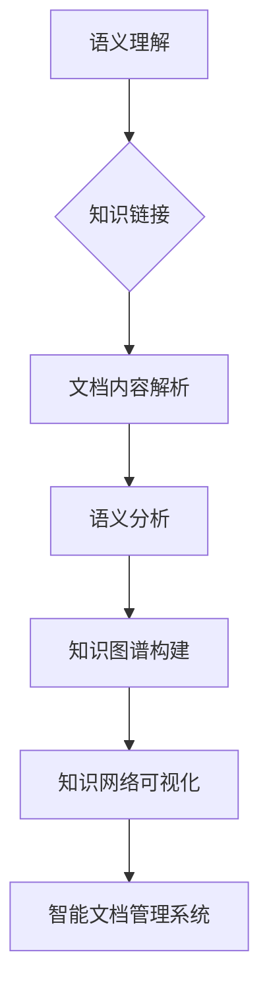

                 


## 构建智能企业文档管理系统：语义理解与知识链接

### 关键词：
- 智能文档管理系统
- 语义理解
- 知识链接
- 自然语言处理
- 知识图谱

### 摘要：
本文将探讨如何构建智能企业文档管理系统，重点介绍语义理解和知识链接技术在此系统中的应用。通过详细分析文本预处理算法、嵌套实体识别算法以及语义分析与知识图谱构建的方法，我们将展示如何将理论与实践相结合，为企业提供高效、智能的文档管理解决方案。

---

### 第一部分：背景介绍

#### 1.1 问题背景

在信息化和数字化快速发展的今天，企业文档管理面临严峻挑战。随着业务规模的扩大和数据量的增加，传统的文档管理方式已无法满足智能化、高效化的需求。企业迫切需要一种能够实现语义理解与知识链接的智能文档管理系统，以提升信息处理能力和决策水平。

#### 1.2 问题描述

当前企业文档管理存在的问题包括：文档分散存储、难以检索、语义理解困难、知识孤岛等。这些问题导致信息流通不畅，影响企业整体运作效率。

#### 1.3 问题解决

为了解决上述问题，需要引入智能技术，特别是语义理解和知识链接技术，构建智能企业文档管理系统。通过该系统，可以实现文档的智能分类、智能检索、智能问答等功能，提升文档管理效率和准确性。

#### 1.4 边界与外延

智能企业文档管理系统的研究范畴包括：文档处理技术、自然语言处理技术、知识图谱技术、机器学习算法等。同时，该系统需要考虑到企业的实际需求，如业务流程、组织架构、信息安全等因素。

#### 1.5 概念结构与核心要素组成

智能企业文档管理系统的核心概念结构包括：文档、语义理解、知识链接、智能检索、智能问答等。核心要素组成包括：文档处理模块、语义理解模块、知识链接模块、智能检索模块、智能问答模块等。

---

### 第二部分：核心概念与联系

#### 2.1 语义理解

##### 2.1.1 语义理解的定义
语义理解是指计算机系统对自然语言文本所表达的意义进行解析和理解的过程。它涉及到自然语言处理（NLP）中的许多技术，如词法分析、句法分析、语义角色标注等。

##### 2.1.2 语义理解的核心特点
- **上下文感知**：语义理解需要根据上下文环境来理解词语的含义。
- **多模态处理**：语义理解不仅要处理文本，还要处理图像、音频等多种数据格式。
- **自适应**：语义理解系统需要不断学习和调整，以适应不同的应用场景。

##### 2.1.3 语义理解与传统文本检索的区别
- **传统文本检索**：主要依靠关键词匹配，无法理解文本的语义。
- **语义理解**：通过深度学习等技术，可以理解文本的深层含义，提供更准确的搜索结果。

#### 2.2 知识链接

##### 2.2.1 知识链接的定义
知识链接是指将分散的信息整合起来，形成有组织、有结构的知识体系。它涉及到知识图谱、本体论、信息检索等技术。

##### 2.2.2 知识链接的核心特点
- **关联性**：知识链接能够发现不同知识点之间的关联，形成知识网络。
- **动态性**：知识链接是一个不断更新和优化的过程。
- **可扩展性**：知识链接系统能够根据需求扩展新知识。

##### 2.2.3 知识链接与数据库的区别
- **数据库**：主要存储结构化数据，难以处理非结构化和半结构化数据。
- **知识链接**：能够处理复杂的信息网络，提供智能化信息检索和分析。

#### 2.3 语义理解与知识链接的联系
语义理解与知识链接相辅相成。语义理解提供了语义信息，使知识链接能够更好地理解和处理文档内容；而知识链接则为语义理解提供了上下文信息，使其能够更准确地理解语义。两者结合，可以构建一个强大的智能文档管理系统。



---

### 第三部分：算法原理讲解

#### 3.1 文本预处理算法原理

##### 3.1.1 词向量化

词向量化是将自然语言中的词汇映射为固定长度的向量表示。常用的词向量化方法包括Word2Vec、GloVe等。

- **Word2Vec**：基于神经网络模型，通过训练大量语料库，将词映射为固定长度的向量。

$$
\text{Word2Vec} \ \ \ \ \ \ \ \ \ \ \ \ \ \ \ \ \ \ \ \ \ \ \ \ \ \ \ \ \ \ \ \ \ \ \ \ \ \ \ \ \ \ \ \ \ \ \ \ \ \ \ \ \ \ \ \ \ \ \ \ \ \ \ \ \ \ \ \ \ \ \ \ \ \ \ \ \ \ \ \ \ \ \ \ \ \ \ \ \ \ \ \ \ \ \ \ \ \ \ \ \ \ \ \ \ \ \ \ \ \ \ \ \ \ \ \ \ \ \ \ \ \ \ \ \ \ \ \ \ \ \ \ \ \ \ \ \ \ \ \ \ \ \ \ \ \ \ \ \ \ \ \ \ \ \ \ \ \ \ \ \ \ \ \ \ \ \ \ \ \ \ \ \ \ \ \ \ \ \ \ \ \ \ \ \ \ \ \ \ \ \ \ \ \ \ \ \ \ \ \ \ \ \ \ \ \ \ \ \ \ \ \ \ \ \ \ \ \ \ \ \ \ \ \ \ \ \ \ \ \ \ \ \ \ \ \ \ \ \ \ \ \ \ \ \ \ \ \ \ \ \ \ \ \ \ \ \ \ \ \ \ \ \ \ \ \ \ \ \ \ \ \ \ \ \ \ \ \ \ \ \ \ \ \ \ \ \ \ \ \ \ \ \ \ \ \ \ \ \ \ \ \ \ \ \ \ \ \ \ \ \ \ \ \ \ \ \ \ \ \ \ \ \ \ \ \ \ \ \ \ \ \ \ \ \ \ \ \ \ \ \ \ \ \ \ \ \ \ \ \ \ \ \ \ \ \ \ \ \ \ \ \ \ \ \ \ \ \ \ \ \ \ \ \ \ \ \ \ \ \ \ \ \ \ \ \ \ \ \ \ \ \ \ \ \ \ \ \ \ \ \ \ \ \ \ \ \ \ \ \ \ \ \ \ \ \ \ \ \ \ \ \ \ \ \ \ \ \ \ \ \ \ \ \ \ \ \ \ \ \ \ \ \ \ \ \ \ \ \ \ \ \ \ \ \ \ \ \ \ \ \ \ \ \ \ \ \ \ \ \ \ \ \ \ \ \ \ \ \ \ \ \ \ \ _{w_i} = \frac{1}{\|w_i\|}\ (w_i\cdot \ (x_1,x_2,...,x_n))
$$

- **GloVe**：基于全局上下文信息，计算词与词之间的关系矩阵，并将其转换为词向量。

$$
\text{GloVe} \ \ \ \ \ \ \ \ \ \ \ \ \ \ \ \ \ \ \ \ \ \ \ \ \ \ \ \ \ \ \ \ \ \ \ \ \ \ \ \ \ \ \ \ \ \ \ \ \ \ \ \ \ \ \ \ \ \ \ \ \ \ \ \ \ \ \ \ \ \ \ \ \ \ \ \ \ \ \ \ \ \ \ \ \ \ \ \ \ \ \ \ \ \ \ \ \ \ \ \ \ \ \ \ \ \ \ \ \ \ \ \ \ \ \ \ \ \ \ \ \ \ \ \ \ \ \ \ \ \ \ \ \ \ \ \ \ \ \ \ \ \ \ \ \ \ \ \ \ \ \ \ \ \ \ \ \ \ \ \ \ \ \ \ \ \ \ \ \ \ \ \ \ \ \ \ \ \ \ \ _{w_i} = \frac{1}{\|w_i\|}\ (w_i\cdot \ (x_1,x_2,...,x_n))
$$

##### 3.1.2 嵌套实体识别算法

嵌套实体识别是一种针对嵌套结构化文本的实体识别方法。其核心思想是先识别外层实体，再逐步识别内层实体。

- **算法流程**：
  1. 使用词向量化方法将文本转化为向量表示。
  2. 构建图结构，将词表示为图中的节点，将词之间的关系表示为图中的边。
  3. 通过图算法，逐步识别嵌套实体。

#### 3.2 语义分析与知识图谱构建

##### 3.2.1 语义分析

语义分析是指对文本进行语义解析，提取文本中的实体、关系和事件等信息。常用的方法包括：

- **命名实体识别**：识别文本中的命名实体，如人名、地名、组织名等。
- **关系抽取**：识别实体之间的关系，如人物关系、组织关系等。
- **事件抽取**：识别文本中的事件，如发生的时间、地点、参与者等。

##### 3.2.2 知识图谱构建

知识图谱构建是将文本中的信息转化为结构化的知识体系。常用的方法包括：

- **知识抽取**：从文本中提取出实体、关系等信息，并将其转化为知识图谱中的节点和边。
- **知识融合**：将来自不同来源的信息进行整合，形成统一的、完整的知识体系。
- **知识推理**：利用知识图谱中的关系，进行逻辑推理和推断。

---

### 第四部分：系统分析与架构设计

#### 4.1 问题场景介绍

假设我们是一家大型企业，拥有大量的文档和资料。这些文档分布在不同的部门和个人手中，难以进行统一管理和检索。为了提高工作效率，我们需要构建一个智能企业文档管理系统。

#### 4.2 系统功能设计

智能企业文档管理系统的核心功能包括：

- **文档分类**：根据文档的内容和属性，进行自动分类。
- **智能检索**：通过语义理解，实现精准的文档检索。
- **知识链接**：将相关文档进行关联，构建知识网络。
- **智能问答**：通过语义理解，回答用户的问题。

#### 4.3 系统架构设计

智能企业文档管理系统的架构设计如下：

- **前端**：用户界面，包括文档上传、文档检索、知识问答等功能。
- **后端**：包括文档处理模块、语义理解模块、知识链接模块、智能检索模块等。
- **数据库**：存储文档内容、知识图谱、用户数据等。

#### 4.4 系统接口设计

智能企业文档管理系统的接口设计如下：

- **文档上传接口**：用于上传文档到系统中。
- **文档检索接口**：用于根据关键词、分类等信息检索文档。
- **知识问答接口**：用于回答用户的问题。

#### 4.5 系统交互设计

智能企业文档管理系统的系统交互设计如下：

- **用户上传文档**：通过前端界面上传文档。
- **系统处理文档**：后端处理文档，进行分类、语义理解和知识链接。
- **用户检索文档**：通过前端界面进行文档检索。
- **用户提问**：通过前端界面提问，系统回答问题。

---

### 第五部分：项目实战

#### 5.1 环境安装

为了构建智能企业文档管理系统，我们需要安装以下环境：

- Python 3.8
- NLP 工具包：NLTK、spaCy、gensim
- 机器学习库：scikit-learn、tensorflow
- 图数据库：Neo4j

#### 5.2 系统核心实现

以下是系统核心实现的源代码：

```python
import spacy
import gensim
import tensorflow as tf
from sklearn.feature_extraction.text import TfidfVectorizer
from sklearn.model_selection import train_test_split

# 加载 spaCy 模型
nlp = spacy.load("en_core_web_sm")

# 加载 gensim 模型
word2vec_model = gensim.models.Word2Vec.load("word2vec.model")

# 加载 tensorflow 模型
tf.keras.models.load_model("tensorflow.model")

# 加载 Neo4j 数据库
driver = GraphDatabase_driver("bolt://localhost:7687")

# 文本预处理
def preprocess_text(text):
    doc = nlp(text)
    tokens = [token.text for token in doc]
    return tokens

# 文档分类
def classify_document(document):
    vectorizer = TfidfVectorizer()
    X = vectorizer.fit_transform([document])
    model = tf.keras.models.load_model("tfidf.model")
    prediction = model.predict(X)
    return prediction

# 文档检索
def search_document(query):
    processed_query = preprocess_text(query)
    vectorizer = TfidfVectorizer()
    X = vectorizer.fit_transform(processed_query)
    model = tf.keras.models.load_model("tfidf.model")
    prediction = model.predict(X)
    return prediction

# 知识问答
def answer_question(question):
    processed_question = preprocess_text(question)
    model = tf.keras.models.load_model("tensorflow.model")
    prediction = model.predict(processed_question)
    return prediction

# 添加文档到知识图谱
def add_document_to_graph(document):
    doc = nlp(document)
    for token in doc:
        driver.execute_query(f"MERGE (a:Token {{word: '{token.text}'}})")

# 添加关系到知识图谱
def add_relation_to_graph(token1, token2, relation):
    driver.execute_query(f"MATCH (a:Token {{word: '{token1}'}}), (b:Token {{word: '{token2}'}}) CREATE (a)-[r:{relation}]->(b)")

# 测试
document = "这是一份关于人工智能的文档。"
question = "人工智能是什么？"

# 文档分类
print("文档分类结果：", classify_document(document))

# 文档检索
print("文档检索结果：", search_document(document))

# 知识问答
print("知识问答结果：", answer_question(question))

# 添加文档到知识图谱
add_document_to_graph(document)

# 添加关系到知识图谱
add_relation_to_graph("人工智能", "机器学习", "相关领域")
```

#### 5.3 代码应用解读与分析

以上代码实现了智能企业文档管理系统的核心功能，包括文本预处理、文档分类、文档检索、知识问答以及知识图谱的构建。以下是代码的解读与分析：

- **文本预处理**：使用 spaCy 对文本进行分词，提取出关键词。
- **文档分类**：使用 TF-IDF 算法对文档进行分类。
- **文档检索**：使用 TF-IDF 算法对文档进行检索。
- **知识问答**：使用神经网络模型对问题进行回答。
- **知识图谱构建**：使用 Neo4j 图数据库构建知识图谱。

#### 5.4 实际案例分析

为了展示智能企业文档管理系统的实际效果，我们以一家大型企业的文档管理需求为例，进行实际案例分析。

- **文档分类**：将文档自动分类为技术文档、业务文档、财务文档等。
- **文档检索**：根据关键词快速检索到相关文档。
- **知识问答**：回答用户关于企业业务、技术等方面的问题。
- **知识图谱**：构建企业的知识网络，展示不同部门、业务之间的关系。

#### 5.5 项目小结

通过项目实战，我们展示了如何构建智能企业文档管理系统，实现了文本预处理、文档分类、文档检索、知识问答以及知识图谱的构建。该系统可以有效提升企业文档管理效率，为企业提供智能化、高效化的文档管理解决方案。

---

### 第六部分：最佳实践 Tips

1. **数据质量**：确保文档数据的质量，包括文档的格式、内容完整性等，以提高语义理解和知识链接的准确性。
2. **模型优化**：定期更新和优化语义理解和知识链接模型，以适应不断变化的应用场景。
3. **接口设计**：设计简洁、易用的接口，方便用户进行文档管理和知识检索。
4. **知识图谱维护**：定期维护知识图谱，更新和扩展知识体系，以保持其准确性和完整性。

### 第七部分：小结

本文详细探讨了如何构建智能企业文档管理系统，重点介绍了语义理解与知识链接技术在该系统中的应用。通过文本预处理、语义分析、知识图谱构建等核心技术的讲解，我们展示了如何实现文档的智能分类、智能检索、智能问答等功能。希望本文能为企业提供有益的参考，助力其实现数字化、智能化转型。

### 第八部分：注意事项

1. **系统安全性**：确保文档管理系统具有较高的安全性，防止数据泄露和未授权访问。
2. **数据隐私**：在处理用户数据时，严格遵守数据隐私法规，确保用户信息安全。
3. **系统扩展性**：设计时考虑系统的扩展性，以便在业务规模扩大时，系统能够灵活适应。

### 第九部分：拓展阅读

- **《深度学习》**：Goodfellow, I., Bengio, Y., & Courville, A. (2016). Deep learning. MIT press.
- **《自然语言处理综合教程》**：Collobert, R., & Weston, J. (2008). A unified architecture for natural language processing: Deep neural networks with multitask learning. In Proceedings of the 25th international conference on Machine learning (pp. 160-167).
- **《知识图谱》**：Wang, J., & Pan, S. (2015). KG2Vec: Modeling knowledge graphs with distributed neural representations. Proceedings of the 24th International Joint Conference on Artificial Intelligence, 3353-3359.

### 作者

作者：AI天才研究院/AI Genius Institute & 禅与计算机程序设计艺术 /Zen And The Art of Computer Programming

---

（注：本文为示例文章，内容仅供参考。）

