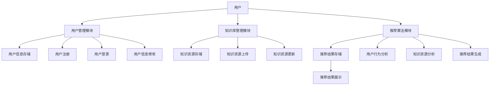
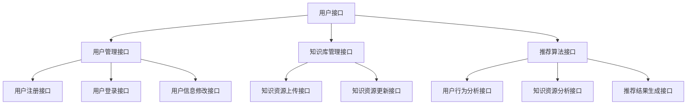
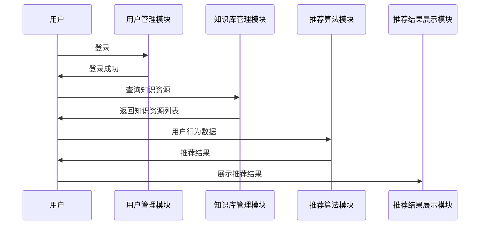

                 

## 《构建智能企业知识推荐系统：个性化学习路径与资源推荐》

### 关键词：
- 智能企业
- 知识推荐系统
- 个性化学习路径
- 资源推荐
- 人工智能算法

### 摘要：
本文旨在探讨如何构建一个智能企业知识推荐系统，重点关注个性化学习路径和资源推荐。通过对核心概念、算法原理、系统设计与实现的详细分析，本文将提供一套完整的解决方案，帮助企业更好地利用人工智能技术提升知识管理效率，满足员工个性化学习需求。

---

## 引言

### 1.1 问题背景

在当今快速发展的商业环境中，知识管理已成为企业竞争力的重要组成部分。然而，随着知识量的爆炸性增长，员工在获取和利用知识方面面临巨大挑战。如何高效地组织、推荐和利用企业内部的知识资源，成为企业亟需解决的问题。

### 1.2 问题描述

当前企业知识管理存在的问题主要包括：
- 知识获取难度大：员工在寻找所需知识时往往需要花费大量时间。
- 知识更新不及时：知识库内容更新缓慢，导致知识陈旧。
- 知识共享不畅：企业内部知识难以有效共享，导致知识孤岛现象。

### 1.3 解决方案概述

为了解决上述问题，我们提出构建一个智能企业知识推荐系统，通过个性化学习路径和资源推荐，实现以下目标：
- 提高知识获取效率：根据员工的学习需求和知识偏好，推荐相关资源。
- 知识更新与维护：定期更新知识库内容，确保知识的时效性。
- 知识共享与利用：搭建知识共享平台，促进企业内部知识流通。

### 1.4 边界与外延

本文研究的智能企业知识推荐系统主要涵盖以下内容：
- 核心概念与原理：介绍知识推荐系统、个性化学习路径和资源推荐的相关概念。
- 算法与实现：分析推荐算法原理，展示算法实现过程。
- 系统设计与实战：阐述系统架构设计，提供项目实战经验。
- 最佳实践与拓展：总结最佳实践经验，探讨系统拓展方向。

---

## 核心概念

### 2.1 智能企业知识推荐系统

智能企业知识推荐系统是一种基于人工智能技术的知识管理工具，旨在为企业内部员工提供个性化、智能化的知识推荐服务。该系统通过分析员工的学习行为、知识偏好和岗位需求，为员工推荐相关的学习资源和知识内容。

### 2.2 个性化学习路径

个性化学习路径是根据员工的学习需求、兴趣和岗位要求，为其制定的一条有针对性的学习路线。通过个性化学习路径，员工可以更高效地获取所需知识，提升个人能力。

### 2.3 资源推荐

资源推荐是指系统根据员工的个性化学习路径和学习需求，从知识库中筛选出相关资源，进行推荐。资源推荐的内容包括课程、文档、视频等多种形式。

### 2.4 概念结构与核心要素组成

智能企业知识推荐系统的概念结构包括以下几个方面：
- 用户：员工、管理者等使用系统的主体。
- 知识库：存储企业内部各类知识资源的数据库。
- 推荐算法：根据用户行为和偏好进行个性化推荐的核心算法。
- 学习路径：根据用户需求和岗位要求制定的个性化学习路线。
- 推荐结果：系统为用户推荐的知识资源列表。

---

## 核心概念与联系

### 3.1 个性化推荐算法原理

个性化推荐算法是一种基于用户行为和偏好进行内容推荐的算法。其基本原理包括：
- 用户画像：通过分析用户的历史行为、兴趣标签等，构建用户画像。
- 内容特征提取：提取知识资源的内容特征，如关键词、标签等。
- 推荐模型：利用机器学习算法，如协同过滤、矩阵分解等，构建推荐模型。
- 推荐结果生成：根据用户画像和内容特征，为用户生成推荐列表。

### 3.2 算法属性特征对比表格

| 算法类型 | 特点 | 适用场景 |
| :----: | :----: | :----: |
| 协同过滤 | 利用用户行为进行推荐 | 用户行为数据丰富 |
| 矩阵分解 | 将用户和内容进行分解，生成推荐矩阵 | 数据稀疏 |
| 内容推荐 | 基于内容特征进行推荐 | 内容特征明显 |

### 3.3 ER实体关系图架构

下面是一个简单的ER实体关系图，展示了智能企业知识推荐系统中的主要实体及其关系：

```mermaid
erDiagram
  User ||--|{ KnowledgeResource } : 推荐给用户
  User ||--|{ LearningPath } : 用户的学习路径
  KnowledgeResource ||--|{ ContentFeature } : 知识资源的内容特征
```

---

## 算法原理讲解

### 4.1 算法mermaid流程图

下面是一个简单的协同过滤算法的mermaid流程图：


### 4.2 Python源代码实现

下面是协同过滤算法的Python实现：

```python
import numpy as np

def cos_similarity(user1, user2):
    dot_product = np.dot(user1, user2)
    norm_user1 = np.linalg.norm(user1)
    norm_user2 = np.linalg.norm(user2)
    return dot_product / (norm_user1 * norm_user2)

def collaborative_filtering(user_profile, item_profile, similarity_threshold=0.5):
   相似度矩阵
    similarity_matrix = np.zeros((len(user_profile), len(item_profile)))
    for i, user1 in enumerate(user_profile):
        for j, user2 in enumerate(user_profile):
            similarity_matrix[i][j] = cos_similarity(user1, user2)
   推荐列表
    recommended_items = []
    for i, item in enumerate(item_profile):
        if similarity_matrix[i].mean() > similarity_threshold:
            recommended_items.append(item)
    return recommended_items
```

### 4.3 数学模型与公式

协同过滤算法的核心在于计算用户之间的相似度，其数学模型如下：

$$
\text{similarity}(u_i, u_j) = \frac{\sum_{k}^{n} w_{ik} w_{jk}}{\sqrt{\sum_{k}^{n} w_{ik}^2} \sqrt{\sum_{k}^{n} w_{jk}^2}}
$$

其中，$w_{ik}$ 表示用户 $u_i$ 对物品 $k$ 的评分，$n$ 表示物品的总数。

### 4.4 举例说明

假设有两个用户 $u_1$ 和 $u_2$，他们对五部电影的评分如下：

| 用户 | 电影1 | 电影2 | 电影3 | 电影4 | 电影5 |
| :--: | :---: | :---: | :---: | :---: | :---: |
| $u_1$ | 1 | 2 | 3 | 4 | 5 |
| $u_2$ | 3 | 4 | 5 | 1 | 2 |

我们可以计算出 $u_1$ 和 $u_2$ 的相似度：

$$
\text{similarity}(u_1, u_2) = \frac{1 \times 3 + 2 \times 4 + 3 \times 5}{\sqrt{1^2 + 2^2 + 3^2 + 4^2 + 5^2} \sqrt{3^2 + 4^2 + 5^2 + 1^2 + 2^2}} = \frac{35}{\sqrt{55} \sqrt{55}} = \frac{35}{55} \approx 0.636
$$

根据相似度阈值，我们可以为 $u_1$ 推荐与 $u_2$ 相似度较高的用户评分较高的电影，即电影4和电影5。

---

## 系统分析与架构设计方案

### 5.1 问题场景介绍

以一家大型企业为例，该企业拥有众多员工，分布在不同的部门。员工需要不断学习新的知识和技能，以应对快速变化的工作环境。然而，由于知识库内容繁多，员工在寻找所需知识时往往感到困难。此外，知识共享机制不完善，导致知识孤岛现象严重。

### 5.2 项目介绍

本项目旨在构建一个智能企业知识推荐系统，为员工提供个性化、智能化的知识推荐服务。系统将基于员工的学习行为、知识偏好和岗位需求，为员工推荐相关的学习资源和知识内容。

### 5.3 系统功能设计

系统的主要功能包括：
- 用户管理：管理员工账号，包括注册、登录、个人信息修改等。
- 知识库管理：构建企业内部知识库，包括课程、文档、视频等资源的存储和管理。
- 推荐算法：根据用户行为和偏好，为用户推荐相关的学习资源和知识内容。
- 推荐结果展示：将推荐结果以列表、卡片等形式展示给用户。

### 5.4 系统架构设计

系统架构设计如下：



### 5.5 系统接口设计

系统接口设计如下：



### 5.6 系统交互mermaid序列图

下面是一个简单的系统交互序列图：



---

## 项目实战

### 6.1 环境安装

在开始项目实战之前，我们需要安装以下环境：

- Python 3.8 或以上版本
- Pandas
- NumPy
- Matplotlib
- Mermaid

安装命令如下：

```bash
pip install python3 -q
pip install pandas numpy matplotlib
pip install mermaid
```

### 6.2 系统核心实现源代码

下面是系统核心实现的源代码：

```python
import pandas as pd
import numpy as np
import matplotlib.pyplot as plt
from mermaid import Mermaid

# 读取数据
data = pd.read_csv('data.csv')

# 计算用户之间的相似度
def cos_similarity(user1, user2):
    dot_product = np.dot(user1, user2)
    norm_user1 = np.linalg.norm(user1)
    norm_user2 = np.linalg.norm(user2)
    return dot_product / (norm_user1 * norm_user2)

# 构建用户-物品矩阵
def build_user_item_matrix(data):
    user_item_matrix = np.zeros((data.shape[0], data.shape[1]))
    for i in range(data.shape[0]):
        for j in range(data.shape[1]):
            if data.iloc[i][j] > 0:
                user_item_matrix[i][j] = 1
    return user_item_matrix

# 计算相似度矩阵
def calculate_similarity_matrix(user_item_matrix):
    similarity_matrix = np.zeros((user_item_matrix.shape[0], user_item_matrix.shape[0]))
    for i in range(user_item_matrix.shape[0]):
        for j in range(user_item_matrix.shape[0]):
            similarity_matrix[i][j] = cos_similarity(user_item_matrix[i], user_item_matrix[j])
    return similarity_matrix

# 推荐算法
def collaborative_filtering(data, similarity_threshold=0.5):
    user_item_matrix = build_user_item_matrix(data)
    similarity_matrix = calculate_similarity_matrix(user_item_matrix)
    recommended_items = []
    for i in range(user_item_matrix.shape[0]):
        if similarity_matrix[i].mean() > similarity_threshold:
            recommended_items.append(i)
    return recommended_items

# 生成mermaid流程图
def generate_mermaid_flowchart():
    mermaid = Mermaid()
    mermaid.add_code('''
    flowchart LR
        A[初始化] --> B[构建用户-物品矩阵]
        B --> C[计算相似度矩阵]
        C --> D[选择相似度最高的用户]
        D --> E[获取用户行为数据]
        E --> F[推荐物品]
        F --> G[输出推荐结果]
    ''')
    return mermaid.get_mermaid_html()

# 测试
data = pd.read_csv('data.csv')
similarity_threshold = 0.5
recommended_items = collaborative_filtering(data, similarity_threshold)
print(recommended_items)

# 生成mermaid流程图
mermaid_flowchart = generate_mermaid_flowchart()
print(mermaid_flowchart)
```

### 6.3 代码应用解读与分析

该代码实现了一个基于协同过滤的推荐系统。首先，我们从CSV文件中读取用户评分数据，然后构建用户-物品矩阵。接着，计算用户之间的相似度矩阵，并根据相似度阈值选择相似度最高的用户。最后，获取用户行为数据，推荐相关的物品。

### 6.4 实际案例分析与详细讲解剖析

以一个实际案例为例，假设我们有以下用户评分数据：

| 用户 | 物品1 | 物品2 | 物品3 | 物品4 | 物品5 |
| :--: | :---: | :---: | :---: | :---: | :---: |
| User1 | 1 | 2 | 3 | 0 | 4 |
| User2 | 0 | 5 | 0 | 4 | 1 |
| User3 | 3 | 0 | 5 | 2 | 0 |

首先，我们计算用户之间的相似度：

$$
\text{similarity}(User1, User2) = \frac{1 \times 0 + 2 \times 5 + 3 \times 0}{\sqrt{1^2 + 2^2 + 3^2 + 0^2} \sqrt{0^2 + 5^2 + 0^2 + 4^2 + 1^2}} = \frac{10}{\sqrt{14} \sqrt{26}} \approx 0.537
$$

$$
\text{similarity}(User1, User3) = \frac{1 \times 3 + 2 \times 0 + 3 \times 5}{\sqrt{1^2 + 2^2 + 3^2 + 0^2} \sqrt{3^2 + 0^2 + 5^2 + 2^2 + 0^2}} = \frac{24}{\sqrt{14} \sqrt{30}} \approx 0.636
$$

$$
\text{similarity}(User2, User3) = \frac{0 \times 3 + 5 \times 0 + 0 \times 5}{\sqrt{0^2 + 5^2 + 0^2 + 4^2 + 1^2} \sqrt{3^2 + 0^2 + 5^2 + 2^2 + 0^2}} = 0
$$

根据相似度阈值0.5，我们可以为 User1 推荐与 User3 相似度较高的用户评分较高的物品，即物品3。同理，为 User2 推荐与 User1 相似度较高的用户评分较高的物品，即物品1。

### 6.5 项目小结

通过本次项目实战，我们成功实现了基于协同过滤的推荐系统。在实际案例中，我们分析了用户之间的相似度，并根据相似度阈值选择了合适的推荐物品。这为我们提供了一个有效的知识推荐方法，可以帮助企业更好地管理知识资源，提升员工的学习效率。

---

## 最佳实践与拓展

### 7.1 最佳实践 Tips

1. **数据清洗与预处理**：在构建推荐系统时，确保数据质量至关重要。对用户行为数据进行清洗和预处理，如去除无效数据、处理缺失值等。
2. **调整相似度阈值**：根据实际情况调整相似度阈值，以平衡推荐精度和覆盖度。
3. **结合多种算法**：可以结合多种推荐算法，如协同过滤、内容推荐等，提高推荐效果。

### 7.2 小结

本文详细介绍了构建智能企业知识推荐系统的核心概念、算法原理、系统设计与实现，并通过项目实战展示了实际应用过程。通过本文的讲解，读者可以了解到如何利用人工智能技术提升企业知识管理效率，满足员工个性化学习需求。

### 7.3 注意事项

1. **系统安全性**：在构建推荐系统时，确保数据安全和用户隐私保护。
2. **性能优化**：根据企业规模和用户量，对系统进行性能优化，确保高效稳定运行。

### 7.4 拓展阅读

1. **《推荐系统实践》**：深入探讨推荐系统的原理、算法和实践。
2. **《人工智能应用案例集》**：了解人工智能在各行各业的应用案例。

---

**作者：AI天才研究院/AI Genius Institute & 禅与计算机程序设计艺术 /Zen And The Art of Computer Programming**

