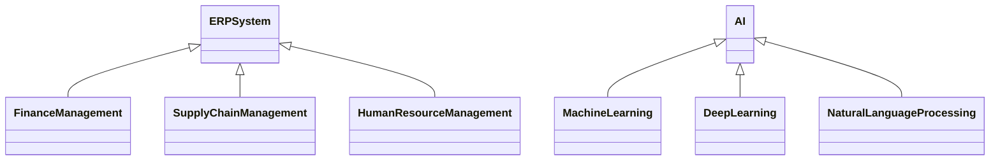

                 

## # 构建智能企业资源规划(ERP)系统：AI的深度集成

> 关键词：智能企业资源规划，ERP系统，人工智能，深度集成，应用场景，架构设计，项目实战

> 摘要：本文深入探讨了如何将人工智能技术深度集成到企业资源规划（ERP）系统中，以提高企业的运营效率和管理水平。通过详细的案例分析、算法原理讲解和项目实战，本文为读者提供了一个全面的技术指导，帮助企业和IT专业人员理解并实施智能ERP系统。

### 第一部分：背景介绍与核心概念

#### 第1章：ERP系统与AI的融合概述

##### **1.1.1 问题背景**

- **ERP系统**的定义、历史发展与重要性：企业资源规划（ERP）系统是一个集成企业多个部门信息与业务流程的管理系统，它帮助企业实现资源的有效配置和优化，提高运营效率。ERP系统的历史可以追溯到20世纪90年代，它是企业信息化的重要里程碑。

- **人工智能**的基本概念与分类：人工智能（AI）是计算机科学的一个分支，旨在使机器能够模拟人类智能行为。AI可以分为多种类型，包括机器学习、深度学习、自然语言处理等。

##### **1.1.2 问题描述**

- **企业资源规划(ERP)系统**面临的挑战：随着商业环境的快速变化，ERP系统需要应对更加复杂的需求，如全球运营、供应链协同等。传统的ERP系统在应对这些挑战时存在一定的局限性。

- **人工智能技术**如何为企业资源规划带来变革：AI技术可以为ERP系统提供智能决策支持、自动化操作和实时分析等功能，从而提升其性能和适应性。

##### **1.1.3 问题解决**

- **深度集成AI技术到ERP系统的可能性**：深度集成AI技术到ERP系统，可以实现更加智能化和自动化的业务流程，提高企业的竞争力。

- **AI在ERP系统中的应用场景**：包括供应链管理、人力资源管理、财务管理等多个方面，AI技术能够提供个性化的解决方案。

##### **1.1.4 边界与外延**

- **ERP系统**与**AI**融合的适用范围：不仅限于大型企业，中小企业也可以通过智能ERP系统提升业务水平。

- **非ERP系统中的AI应用参考**：虽然本文聚焦于ERP系统，但AI技术的应用范围广泛，还可以在市场营销、客户关系管理等领域发挥重要作用。

##### **1.1.5 概念结构与核心要素组成**

- **ERP系统**的核心要素：包括财务管理、供应链管理、人力资源管理等模块。

- **人工智能**的核心组成部分：包括机器学习、深度学习、自然语言处理等关键技术。

#### 第2章：ERP系统核心概念与AI技术关联

##### **2.1.1 核心概念**

- **企业资源规划(ERP)**：ERP系统是一种集成企业内部多个部门信息与业务流程的管理信息系统，其目标是实现资源的最佳配置和优化。

- **人工智能**：人工智能是使计算机能够执行通常需要人类智能才能完成的任务的科学技术，包括机器学习、深度学习、自然语言处理等。

##### **2.1.2 概念属性特征对比表格**

| **属性特征** | **ERP系统** | **人工智能** |
| --- | --- | --- |
| **功能模块** | 财务管理、供应链管理、人力资源管理 | 机器学习、深度学习、自然语言处理 |
| **目标** | 提高企业管理效率和决策能力 | 增强计算机模拟人类智能的能力 |
| **应用领域** | 企业内部管理 | 广泛领域，包括医疗、金融、交通等 |

##### **2.1.3 ER实体关系图架构**

#### 第3章：AI在ERP系统中的应用场景

##### **3.1.1 供应链管理**

- **AI**在供应链优化中的应用：通过机器学习和深度学习算法，可以预测供应链中的需求波动，优化库存管理，减少库存成本。

- **案例研究**：某制造企业使用AI技术优化供应链，实现了库存周转率的显著提升，降低了运营成本。

##### **3.1.2 人力资源管理**

- **AI**在招聘、培训与绩效管理中的应用：AI可以帮助企业进行智能招聘，分析员工绩效，提供个性化的培训建议。

- **案例研究**：某科技公司通过AI技术优化招聘流程，大幅提高了招聘效率和员工满意度。

##### **3.1.3 财务管理**

- **AI**在财务报表分析、预测与决策支持中的应用：AI可以自动分析财务数据，提供预测报表，支持决策制定。

- **案例研究**：某金融企业利用AI技术进行财务报表分析，提高了财务透明度和决策效率。

### 第二部分：算法原理讲解与数学模型

#### 第4章：深度集成AI技术的ERP系统架构设计

##### **4.1.1 系统功能设计**

- **领域模型**：ERP系统中的核心业务领域，如财务管理、供应链管理、人力资源管理。

##### **4.1.2 系统架构设计**

- **系统架构**：ERP系统与AI技术集成的总体架构，包括数据层、应用层、表示层等。

##### **4.1.3 系统接口设计**

- **系统接口**：ERP系统与外部系统、应用之间的接口，如API接口、数据库接口等。

##### **4.1.4 系统交互设计**

- **系统交互**：ERP系统与AI技术之间的交互流程，如数据采集、数据处理、结果反馈等。

### 第三部分：项目实战

#### 第5章：AI算法在ERP系统中的应用原理

##### **5.1.1 机器学习基础**

- **机器学习**的基本概念与算法分类：介绍常见的机器学习算法，如线性回归、决策树、支持向量机等。

- **机器学习**在ERP系统中的应用：如需求预测、库存优化等。

##### **5.1.2 深度学习原理**

- **深度学习**的基本概念与网络架构：介绍深度神经网络、卷积神经网络、递归神经网络等。

- **深度学习**在ERP系统中的应用：如图像识别、自然语言处理等。

##### **5.1.3 自然语言处理**

- **自然语言处理**的基本概念与关键技术：介绍词向量、序列模型、文本分类等。

- **自然语言处理**在ERP系统中的应用：如智能客服、文本分析等。

#### 第6章：数学模型与公式详解

##### **6.1.1 数学模型**

- **线性回归**、**逻辑回归**等常用模型的数学公式：介绍相关模型的数学基础。

##### **6.1.2 公式解释**

- 对数学模型中的公式进行详细解释。

##### **6.1.3 举例说明**

- 使用具体例子说明数学公式的应用。

### 第四部分：项目实战

#### 第7章：环境安装与系统核心实现

##### **7.1.1 环境安装**

- 安装ERP系统与AI相关软件环境。

##### **7.1.2 系统核心实现**

- 详细介绍ERP系统与AI技术的核心实现。

#### 第8章：代码应用解读与分析

##### **8.1.1 代码应用解读**

- 分析系统核心代码的实现逻辑。

##### **8.1.2 代码应用分析**

- 对代码应用进行性能分析和优化建议。

#### 第9章：实际案例分析

##### **9.1.1 案例背景**

- 描述具体的企业案例背景。

##### **9.1.2 案例分析**

- 分析企业在ERP系统集成AI技术中的实践。

##### **9.1.3 案例讲解**

- 对案例中的关键问题进行详细讲解。

### 第五部分：项目小结与最佳实践

#### 第10章：项目小结与最佳实践

##### **10.1.1 项目小结**

- 总结项目中的经验与教训。

##### **10.1.2 最佳实践**

- 提供最佳实践建议。

##### **10.1.3 小结、注意事项与拓展阅读**

- 对全书内容进行总结，并提供拓展阅读资源。

