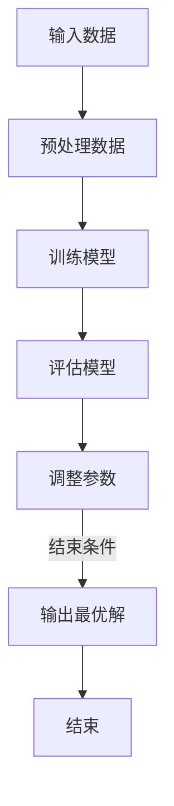
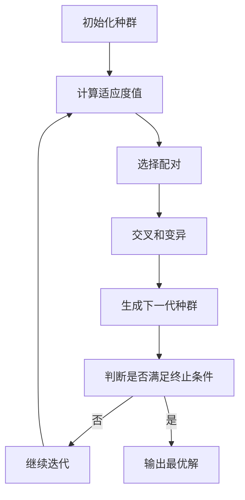

                 

### 引言：智能企业资源调度系统概述

#### 1.1 问题背景

##### 1.1.1 企业资源调度的挑战

在当今快速变化和竞争激烈的市场环境中，企业面临着一系列资源调度的挑战。传统的资源调度方法通常依赖于人工经验和预设的规则，这种方式不仅效率低下，而且难以应对复杂多变的业务需求。以下是一些企业资源调度面临的常见问题：

- **资源利用率低**：由于缺乏对资源使用情况的实时监控和优化，企业常常面临资源闲置或过度使用的现象，导致资源利用率低下。
- **响应速度慢**：在业务高峰期，系统可能因资源不足而响应缓慢，影响用户体验和业务效率。
- **成本高**：资源调度不合理会导致额外的能源消耗和维护成本，增加企业的运营负担。

##### 1.1.2 智能化需求与AI优化

为了解决上述问题，企业对资源调度的智能化需求日益增长。智能化资源调度系统通过引入人工智能（AI）技术，利用机器学习、优化算法等手段，实现资源的自动分配和优化。AI优化在资源调度中的优势主要体现在以下几个方面：

- **实时监控与预测**：AI系统能够实时收集和分析资源使用数据，通过预测模型预测未来资源需求，从而提前做出调度决策。
- **自适应调整**：AI系统能够根据实际业务需求和资源状况，动态调整资源分配策略，提高资源利用率。
- **降低成本**：通过优化资源分配，企业可以减少资源浪费，降低运营成本。

##### 1.1.3 本书结构安排

本书旨在深入探讨智能企业资源调度系统的构建，内容安排如下：

- **第1章 引言**：介绍智能企业资源调度系统的背景、意义和本书结构。
- **第2章 核心概念**：定义智能企业、资源调度系统、AI优化，并探讨它们之间的关系。
- **第3章 AI优化资源分配原理**：详细讲解AI优化算法的原理、分类和应用。
- **第4章 智能企业资源调度系统设计**：介绍系统需求分析、架构设计和关键技术。
- **第5章 实现案例**：提供实际项目实现案例，详细讲解系统构建过程。
- **第6章 性能评估与优化**：评估系统性能，提出优化策略。
- **第7章 未来展望与挑战**：探讨智能企业资源调度系统的未来发展。

通过上述章节的安排，本书将从理论到实践，全面解析智能企业资源调度系统的构建方法和应用实践，帮助读者深入了解并掌握这一关键技术。

#### 1.2 智能企业的定义与特征

##### 1.2.1 智能企业的内涵

智能企业是指在信息化、网络化、智能化等新技术环境下，通过集成和应用人工智能（AI）、大数据、物联网（IoT）等先进技术，实现业务流程智能化、管理决策科学化、生产运营自动化的企业。智能企业的核心在于利用AI技术提升企业的整体竞争力，实现从传统手工操作到自动化、智能化转变。

智能企业具有以下几个显著特征：

1. **数据驱动的决策**：智能企业通过收集和分析海量数据，利用数据挖掘和机器学习算法，为企业决策提供科学依据。
2. **业务流程的自动化**：智能企业通过自动化技术和流程优化，减少人工干预，提高业务流程的效率和准确性。
3. **跨部门协同工作**：智能企业通过建立信息共享平台，促进各部门之间的协同工作，实现资源的高效配置和利用。
4. **持续学习和进化**：智能企业通过持续学习和数据反馈，不断提升自身的智能化水平，适应市场变化和客户需求。

##### 1.2.2 智能企业的特征

1. **数字化基础设施**：智能企业具备完善的数字化基础设施，包括高速互联网、云计算、大数据平台等，为智能应用提供基础支持。
2. **数据驱动的业务模式**：智能企业通过数据驱动的方式，实现从客户需求分析、产品设计、供应链管理到市场营销的全流程数字化。
3. **智能决策支持系统**：智能企业拥有智能决策支持系统，通过AI算法和数据模型，实现精准预测和决策优化。
4. **自适应和自优化能力**：智能企业能够根据市场变化和内部运营状况，自动调整策略和资源分配，实现自我优化和持续改进。
5. **客户体验的个性化**：智能企业通过大数据和AI技术，提供个性化的客户服务体验，提高客户满意度和忠诚度。

##### 1.2.3 智能企业的重要性

智能企业在当今经济环境中具有重要地位和作用，主要体现在以下几个方面：

1. **提升竞争力**：智能企业通过技术创新和业务模式优化，提高生产效率和服务质量，增强市场竞争力。
2. **降低运营成本**：智能企业通过自动化和智能化手段，减少人力成本和资源浪费，降低运营成本。
3. **提高决策效率**：智能企业通过数据分析和智能决策支持，提高决策的准确性和效率，减少决策风险。
4. **增强客户黏性**：智能企业通过个性化服务和精准营销，提高客户满意度和忠诚度，增强客户黏性。
5. **推动产业升级**：智能企业的兴起带动了相关产业链的发展，推动产业向智能化、高端化方向升级。

综上所述，智能企业已成为现代企业发展的重要方向和战略选择，通过构建智能企业资源调度系统，企业可以实现资源优化配置、提高运营效率、增强市场竞争力，从而在激烈的市场竞争中脱颖而出。

#### 1.3 资源调度系统的核心概念

##### 1.3.1 资源调度系统的定义

资源调度系统是一种用于优化资源分配和管理的系统，它通过对资源（如计算能力、存储空间、网络带宽等）和任务（如数据处理、存储访问、网络传输等）的动态分配和调度，实现资源的高效利用和系统性能的最大化。资源调度系统广泛应用于企业IT基础设施管理、数据中心运营、云计算平台等领域。

##### 1.3.2 资源调度系统的组成部分

一个典型的资源调度系统通常包括以下几个核心组成部分：

1. **资源池**：资源池是资源调度系统的核心组成部分，它包含了所有的可用资源，如计算节点、存储设备、网络带宽等。资源池可以是物理资源，也可以是虚拟资源，甚至可以是云资源。
2. **调度算法**：调度算法是资源调度系统的核心，负责根据任务需求和资源状况，动态地分配和调整资源。常见的调度算法包括基于优先级的调度、负载均衡调度、最小化延迟调度等。
3. **监控和管理**：监控和管理模块负责实时监控资源池的状态，包括资源利用率、任务进度等，并根据监控数据调整调度策略。此外，监控和管理模块还负责资源的管理和优化，如资源的增减、资源的健康状态检测等。
4. **用户接口**：用户接口是资源调度系统与用户之间的交互界面，用户可以通过用户接口提交任务请求、查询资源状态、获取调度结果等。

##### 1.3.3 资源调度系统在智能企业中的作用

在智能企业中，资源调度系统发挥着至关重要的作用，主要体现在以下几个方面：

1. **资源优化配置**：通过资源调度系统，企业可以实现对资源的优化配置，避免资源浪费和资源瓶颈，提高资源利用率。
2. **提高系统性能**：资源调度系统能够动态调整资源分配策略，根据业务需求和系统负载，优化任务执行顺序和资源分配，提高系统整体性能。
3. **降低运营成本**：通过智能调度，企业可以减少不必要的资源投入，降低能源消耗和维护成本，提高运营效率。
4. **增强业务连续性**：资源调度系统能够根据实时监控数据，动态调整资源分配，确保关键业务系统的稳定运行，增强业务的连续性。
5. **提升用户体验**：通过智能调度，企业可以提供更高效、更可靠的服务，提升用户体验，增强客户满意度。

总之，资源调度系统是智能企业中不可或缺的重要组成部分，它通过智能化的手段，实现资源的高效利用和业务的高效运行，为企业的可持续发展提供有力支持。

#### 1.4 AI优化在资源调度中的应用

##### 1.4.1 AI优化的优势

人工智能（AI）技术作为现代信息技术的重要组成部分，在资源调度中的应用日益广泛，其优势主要体现在以下几个方面：

1. **自适应优化**：AI系统能够通过实时数据采集和分析，动态调整资源分配策略，实现自适应优化。这种自适应性使得资源调度系统能够快速响应环境变化，提高资源利用效率。
2. **高效性**：AI优化算法通常具有高效的计算能力，能够在短时间内处理海量数据，快速生成最优资源分配方案，从而显著提高系统性能。
3. **精准性**：AI技术通过机器学习和深度学习算法，能够从海量数据中挖掘出隐藏的模式和规律，从而实现精准的资源分配和调度，降低资源浪费。
4. **智能化决策**：AI系统能够基于历史数据和实时数据，通过智能算法生成决策建议，辅助企业做出更明智的资源配置决策，提高决策质量。
5. **可持续性**：AI优化不仅能够在短期提高资源利用率，还能通过持续学习和优化，不断提升系统的智能化水平，实现长期的资源可持续利用。

##### 1.4.2 AI优化在资源调度中的挑战

尽管AI优化在资源调度中具有显著的优势，但其在实际应用中也面临一些挑战：

1. **数据质量问题**：AI优化依赖于高质量的数据，但实际环境中数据可能存在噪声、缺失或不一致性等问题，这些数据质量问题会影响AI算法的性能和准确性。
2. **算法复杂性**：AI优化算法通常较为复杂，涉及大量的计算和优化步骤，这增加了系统开发和部署的难度，同时也可能影响系统的实时性和响应速度。
3. **系统稳定性**：AI优化算法在实际应用中可能因为数据波动或环境变化而出现不稳定的情况，导致资源分配不当，影响系统性能。
4. **算法解释性**：AI优化算法的决策过程往往较为复杂，缺乏透明性和可解释性，这使得企业在面对问题时难以理解和追踪，增加了风险。
5. **资源消耗**：AI优化算法的计算过程通常需要大量的计算资源和存储资源，这对硬件设备和系统架构提出了更高的要求。

##### 1.4.3 AI优化与资源调度系统的关系

AI优化与资源调度系统之间存在紧密的联系和相互作用：

1. **相互促进**：AI优化能够为资源调度系统提供更为精准和高效的优化策略，提升资源利用率；而资源调度系统的稳定运行和高效性能则为AI优化提供了丰富的数据支持和应用场景。
2. **融合创新**：在智能企业中，AI优化与资源调度系统相互融合，共同构建起智能化的资源管理平台。通过数据驱动的优化策略，资源调度系统能够实现资源利用的最大化和系统性能的最优化。
3. **协同发展**：AI优化技术的不断进步，如算法优化、硬件加速等，将推动资源调度系统的发展；而资源调度系统的成功应用，也将为AI优化提供更多的数据和场景，推动AI技术的进一步发展。

综上所述，AI优化在资源调度系统中具有重要的应用价值，尽管面临一些挑战，但通过不断创新和优化，AI优化有望在资源调度领域发挥更大的作用，助力企业实现智能化转型和可持续发展。

#### 1.5 本书结构安排

##### 1.5.1 各章节内容概述

本书旨在系统性地探讨智能企业资源调度系统的构建与应用，各章节内容安排如下：

- **第1章 引言**：介绍智能企业资源调度系统的背景、意义和本书结构。
- **第2章 核心概念**：定义智能企业、资源调度系统、AI优化，并探讨它们之间的关系。
- **第3章 AI优化资源分配原理**：详细讲解AI优化算法的原理、分类和应用。
- **第4章 智能企业资源调度系统设计**：介绍系统需求分析、架构设计和关键技术。
- **第5章 实现案例**：提供实际项目实现案例，详细讲解系统构建过程。
- **第6章 性能评估与优化**：评估系统性能，提出优化策略。
- **第7章 未来展望与挑战**：探讨智能企业资源调度系统的未来发展。

##### 1.5.2 学习目标

通过本书的学习，读者将能够：

- 理解智能企业资源调度系统的基本概念和重要性。
- 掌握AI优化资源分配的原理和算法。
- 学习智能企业资源调度系统的设计方法和实现技巧。
- 了解智能企业资源调度系统的性能评估与优化策略。
- 掌握智能企业资源调度系统的未来发展趋势。

##### 1.5.3 学习路线建议

为了更好地掌握本书的内容，建议读者按照以下路线进行学习：

1. **基础学习**：首先阅读第1章和第2章，建立对智能企业资源调度系统和AI优化基础知识的理解。
2. **深入理解**：接着深入学习第3章，理解AI优化资源分配的原理和算法。
3. **实践应用**：通过第4章和第5章的学习，了解智能企业资源调度系统的设计方法和实现技巧。
4. **性能优化**：学习第6章，掌握智能企业资源调度系统的性能评估与优化策略。
5. **未来展望**：最后阅读第7章，了解智能企业资源调度系统的未来发展趋势。

通过以上学习路线，读者将能够系统地掌握智能企业资源调度系统的知识和技能，为实际项目应用打下坚实基础。

### 2.1 核心概念

#### 2.1.1 智能企业的定义

智能企业是指通过引入和应用人工智能（AI）、大数据、物联网（IoT）等先进技术，实现业务流程智能化、管理决策科学化、生产运营自动化的企业。智能企业以数据为核心驱动力，通过数据采集、处理和分析，为企业决策提供科学依据，实现资源的高效利用和业务的高效运行。

**内涵**：

- **数据驱动的决策**：智能企业通过数据分析和机器学习算法，将数据转化为决策依据，实现决策的科学化和智能化。
- **业务流程的自动化**：智能企业通过自动化技术和流程优化，减少人工干预，提高业务流程的效率和准确性。
- **跨部门协同工作**：智能企业通过建立信息共享平台，促进各部门之间的协同工作，实现资源的高效配置和利用。
- **持续学习和进化**：智能企业通过持续学习和数据反馈，不断提升自身的智能化水平，适应市场变化和客户需求。

**特征**：

- **数字化基础设施**：智能企业具备完善的数字化基础设施，包括高速互联网、云计算、大数据平台等，为智能应用提供基础支持。
- **数据驱动的业务模式**：智能企业通过数据驱动的方式，实现从客户需求分析、产品设计、供应链管理到市场营销的全流程数字化。
- **智能决策支持系统**：智能企业拥有智能决策支持系统，通过AI算法和数据模型，实现精准预测和决策优化。
- **自适应和自优化能力**：智能企业能够根据市场变化和内部运营状况，自动调整策略和资源分配，实现自我优化和持续改进。
- **客户体验的个性化**：智能企业通过大数据和AI技术，提供个性化的客户服务体验，提高客户满意度和忠诚度。

**构建智能企业的意义**：

1. **提升竞争力**：智能企业通过技术创新和业务模式优化，提高生产效率和服务质量，增强市场竞争力。
2. **降低运营成本**：智能企业通过自动化和智能化手段，减少人力成本和资源浪费，降低运营成本。
3. **提高决策效率**：智能企业通过数据分析和智能决策支持，提高决策的准确性和效率，减少决策风险。
4. **增强客户黏性**：智能企业通过个性化服务和精准营销，提高客户满意度和忠诚度，增强客户黏性。
5. **推动产业升级**：智能企业的兴起带动了相关产业链的发展，推动产业向智能化、高端化方向升级。

#### 2.1.2 资源调度系统的定义

资源调度系统是一种用于优化资源分配和管理的系统，它通过对资源（如计算能力、存储空间、网络带宽等）和任务（如数据处理、存储访问、网络传输等）的动态分配和调度，实现资源的高效利用和系统性能的最大化。资源调度系统广泛应用于企业IT基础设施管理、数据中心运营、云计算平台等领域。

**定义**：

资源调度系统是指一种自动化系统，它通过对资源（如计算能力、存储空间、网络带宽等）进行动态分配和调度，以实现资源的高效利用和系统性能的最优化。

**组成部分**：

1. **资源池**：资源池是资源调度系统的核心组成部分，它包含了所有的可用资源，如计算节点、存储设备、网络带宽等。资源池可以是物理资源，也可以是虚拟资源，甚至可以是云资源。
2. **调度算法**：调度算法是资源调度系统的核心，负责根据任务需求和资源状况，动态地分配和调整资源。常见的调度算法包括基于优先级的调度、负载均衡调度、最小化延迟调度等。
3. **监控和管理**：监控和管理模块负责实时监控资源池的状态，包括资源利用率、任务进度等，并根据监控数据调整调度策略。此外，监控和管理模块还负责资源的管理和优化，如资源的增减、资源的健康状态检测等。
4. **用户接口**：用户接口是资源调度系统与用户之间的交互界面，用户可以通过用户接口提交任务请求、查询资源状态、获取调度结果等。

**类型**：

1. **集中式调度系统**：集中式调度系统将所有的资源管理和调度任务集中在中央调度器上，由中央调度器负责资源的分配和任务调度。这种系统结构简单，但可能会成为性能瓶颈。
2. **分布式调度系统**：分布式调度系统将资源管理和调度任务分布到多个节点上，各节点之间通过通信机制协同工作。这种系统结构能够提高系统的可扩展性和容错性，但调度算法的设计和实现较为复杂。
3. **混合式调度系统**：混合式调度系统结合了集中式和分布式调度系统的优点，部分资源由集中式调度器管理，部分资源由分布式调度器管理。这种系统结构具有较高的灵活性和效率。

#### 2.1.3 AI优化的定义

AI优化是指利用人工智能技术（如机器学习、深度学习、优化算法等）对系统、过程或问题进行优化，以提高效率、降低成本、提升性能等目标。AI优化通过数据驱动的方式，自动发现数据中的模式和规律，从而生成最优解或次优解。

**定义**：

AI优化是指利用人工智能技术，通过数据驱动的方式，对系统、过程或问题进行优化，以提高效率、降低成本、提升性能等目标。

**技术原理**：

1. **数据采集与预处理**：首先，AI优化系统需要收集相关的数据，并对数据进行清洗、去噪、归一化等预处理操作，以获得高质量的数据输入。
2. **特征提取与选择**：通过分析数据，提取与优化目标相关的特征，并选择最具代表性的特征进行后续处理。
3. **模型选择与训练**：根据优化问题的特点，选择合适的机器学习或深度学习模型，并使用预处理后的数据进行模型训练。
4. **模型评估与优化**：通过交叉验证等方法评估模型的性能，并根据评估结果对模型进行调整和优化。
5. **优化决策与执行**：根据训练好的模型，生成优化决策，并执行这些决策，以实现系统、过程或问题的优化。

**应用领域**：

AI优化广泛应用于各个领域，包括但不限于：

1. **工业制造**：通过预测设备故障、优化生产流程等，提高生产效率和质量。
2. **交通运输**：通过优化交通流量、调度运输车辆等，提高交通效率和安全性。
3. **金融服务**：通过风险评估、投资组合优化等，提高金融业务的效率和收益。
4. **能源管理**：通过预测能源需求、优化能源分配等，提高能源利用效率。
5. **智能医疗**：通过诊断辅助、治疗方案优化等，提高医疗服务质量和效率。

**与资源调度系统的关系**：

AI优化在资源调度系统中起着关键作用，其主要关系体现在以下几个方面：

1. **动态资源分配**：通过AI优化，资源调度系统能够根据实时数据动态调整资源分配策略，实现资源的最优利用。
2. **自适应调度策略**：AI优化能够根据业务需求和资源状况，自动调整调度策略，提高系统响应速度和稳定性。
3. **预测性维护**：AI优化通过数据分析和预测模型，预测设备故障和资源瓶颈，提前进行维护和调整，减少系统故障和停机时间。

总之，AI优化与资源调度系统相互融合，共同构建起智能化的资源管理平台，为企业的可持续发展提供有力支持。

#### 2.1.4 智能企业、资源调度系统与AI优化的关系

智能企业、资源调度系统和AI优化之间存在着紧密的联系和相互影响，它们共同构建起智能化的企业运营体系，为企业的可持续发展提供有力支持。

**互动关系**：

智能企业通过资源调度系统实现资源的高效配置和利用，而AI优化则为资源调度系统提供了智能化的决策支持。具体来说：

- **资源调度系统**：作为智能企业的重要组成部分，负责管理企业内部的各种资源，如计算能力、存储空间、网络带宽等。通过调度算法和优化策略，实现资源的高效分配和动态调整。
- **AI优化**：利用人工智能技术，对资源调度系统进行智能化升级。通过数据采集、分析、预测和决策，为资源调度系统提供实时的优化建议和策略，提高资源利用率和系统性能。
- **智能企业**：通过构建智能化的资源调度系统，实现业务流程的自动化和智能化，提高企业整体运营效率和竞争力。

**优势互补**：

智能企业、资源调度系统和AI优化各自具有独特的优势，通过互补，能够实现更高的整体效能：

- **智能企业**：通过引入AI优化，智能企业能够实现更精准的业务预测和更高效的资源利用，提升企业的核心竞争力。
- **资源调度系统**：借助AI优化技术，资源调度系统能够更好地适应动态变化的环境，实现资源的最优分配和调度。
- **AI优化**：通过集成到资源调度系统中，AI优化能够实时监控和调整资源使用，提高系统的自适应能力和响应速度。

**发展趋势**：

随着人工智能技术的不断进步，智能企业、资源调度系统和AI优化的关系将更加紧密，未来发展表现出以下趋势：

1. **深度整合**：智能企业将更加注重资源调度系统的智能化升级，通过深度整合AI优化技术，实现全面的自动化和智能化运营。
2. **数据驱动**：智能企业将更加依赖数据分析和AI算法，通过数据驱动的方式，优化业务流程和资源分配，提高决策效率和准确性。
3. **跨领域应用**：AI优化技术将在更多领域得到应用，如工业制造、交通运输、金融服务等，为各行业提供智能化的解决方案。
4. **持续进化**：智能企业将不断提升自身的智能化水平，通过持续学习和优化，实现资源的可持续利用和业务模式的创新。

总之，智能企业、资源调度系统和AI优化之间相互促进，共同推动企业实现智能化转型和可持续发展。

### 3. AI优化资源分配原理

#### 3.1 AI优化算法的基本原理

AI优化算法是人工智能（AI）技术中的一个重要分支，它利用机器学习、深度学习、进化算法等手段，对复杂问题进行优化求解。AI优化算法的基本原理可以概括为以下几点：

1. **数据驱动**：AI优化算法依赖于大量历史数据或实时数据，通过数据挖掘和模式识别，发现数据中的规律和模式，从而生成优化策略。
2. **模型训练**：通过训练数据集，构建一个能够表示优化问题的数学模型。该模型通常是一个参数化的函数或决策树，通过调整模型参数，实现对问题的优化求解。
3. **目标函数**：优化算法的核心是目标函数，它定义了优化问题的目标，如最小化成本、最大化收益、最大化效用等。算法的目标是找到目标函数的最优解或次优解。
4. **搜索策略**：AI优化算法通过特定的搜索策略，在解空间中搜索最优解。常见的搜索策略包括局部搜索、全局搜索、迭代搜索等。
5. **自适应调整**：AI优化算法能够在运行过程中根据反馈信息自适应调整参数和策略，提高优化效率和收敛速度。

以下是一个简单的Mermaid流程图，描述了AI优化算法的基本流程：



**示例**：

假设我们需要优化一个生产调度问题，目标是最小化生产成本。我们可以使用遗传算法（GA）来求解。遗传算法的基本流程如下：



在初始化种群阶段，我们随机生成多个初始解，每个解代表一种生产调度方案。然后，通过计算适应度值，评估这些解的优劣。接下来，通过选择、交叉和变异等操作，生成新一代种群。这一过程不断重复，直到满足终止条件（如达到最大迭代次数或适应度值达到某一阈值），最终输出最优解。

#### 3.2 资源分配问题的数学模型

资源分配问题是一个典型的优化问题，其目标是根据给定的约束条件，为每个任务分配资源，使得系统性能最大化或成本最小化。在数学上，资源分配问题可以表示为一个优化模型。

##### 3.2.1 问题描述

给定一组资源（如CPU、内存、存储）和一组任务（如数据处理、存储访问、网络传输等），资源分配问题可以描述为：

- **资源集合**：R = {R1, R2, ..., Rn}，表示所有可用的资源。
- **任务集合**：T = {T1, T2, ..., Tm}，表示所有需要调度的任务。
- **资源需求**：每个任务Ti有一个资源需求向量rd(Ti) = {rd1(Ti), rd2(Ti), ..., rdn(Ti)}，表示任务Ti对每种资源的具体需求量。
- **资源约束**：每种资源的总量有约束，记为rc1, rc2, ..., rcn，表示第i种资源的总量。

资源分配问题的目标是在满足资源约束的条件下，为每个任务Ti分配资源，使得系统性能指标（如总成本、总延迟等）最大化或最小化。

##### 3.2.2 数学模型

资源分配问题的数学模型可以表示为一个线性规划问题：

$$
\min \sum_{i=1}^{m} c_i x_i
$$

其中，$c_i$ 是第 $i$ 个任务的成本，$x_i$ 是第 $i$ 个任务是否被分配资源（0或1）。约束条件如下：

$$
\sum_{i=1}^{m} x_i r_{dj}(T_i) \leq r_{c,j}, \quad j=1,2,...,n
$$

$$
x_i \in \{0,1\}, \quad i=1,2,...,m
$$

上述模型中，第一个约束条件表示每个资源的使用量不能超过其总量；第二个约束条件表示每个任务只能被分配或不被分配。

**示例**：

假设有3种资源（CPU、内存、存储），每种资源总量分别为100、200、300。有以下3个任务，任务需求如下：

| 任务 | CPU需求 | 内存需求 | 存储需求 |
| ---- | ------ | ------ | ------ |
| T1   | 30     | 50     | 40     |
| T2   | 20     | 60     | 50     |
| T3   | 40     | 80     | 60     |

我们需要在满足资源约束的条件下，为每个任务分配资源，使得总成本最小。

目标函数：

$$
\min \sum_{i=1}^{3} c_i x_i
$$

约束条件：

$$
\sum_{i=1}^{3} x_i \cdot 30 \leq 100
$$

$$
\sum_{i=1}^{3} x_i \cdot 50 \leq 200
$$

$$
\sum_{i=1}^{3} x_i \cdot 40 \leq 300
$$

$$
x_i \in \{0,1\}, \quad i=1,2,3
$$

通过求解上述线性规划问题，可以得到最优的资源分配方案。例如，假设最优解为 $x_1=1, x_2=0, x_3=1$，则任务T1和T3被分配资源，总成本最小。

#### 3.2.3 目标函数与约束条件的解释

1. **目标函数**：

   目标函数定义了资源分配问题的优化目标。常见的目标函数包括：

   - **最小化总成本**：总成本是最重要的指标，通常表示为任务的执行成本。在资源分配问题中，目标是最小化所有任务的总成本。
   - **最大化系统性能**：系统性能可以是吞吐量、响应时间、利用率等。在某些情况下，目标是最小化总延迟或最大化吞吐量。
   - **平衡资源利用率**：在多资源环境中，目标是在不同资源之间平衡利用，避免某些资源过度使用或闲置。

2. **约束条件**：

   约束条件定义了资源分配的限制，包括：

   - **资源约束**：每种资源的使用量不能超过其总量，例如CPU、内存、存储等。
   - **任务约束**：某些任务之间存在依赖关系，需要在特定顺序执行。
   - **时间约束**：任务必须在特定时间窗口内完成，例如批处理任务必须在午夜之前完成。
   - **负载约束**：系统负载不能超过某个阈值，以避免系统过载。

通过合理设置目标函数和约束条件，资源分配问题可以更好地适应实际业务需求，实现资源的最优配置。

### 3.2.4 常见资源分配问题的类型

在资源分配中，常见的问题类型包括：

1. **最小化总成本问题**：

   这种问题通常是最常见的，目标是最小化所有任务的总成本。可以通过线性规划或动态规划方法求解。

2. **最大化系统性能问题**：

   目标是最大化系统性能指标，如吞吐量、响应时间或利用率。这类问题可以通过目标规划或多目标优化方法求解。

3. **平衡资源利用率问题**：

   目标是在不同资源之间平衡利用，避免某些资源过度使用或闲置。这类问题可以通过多目标优化或鲁棒优化方法求解。

4. **任务调度问题**：

   目标是最小化任务的完成时间或最大化任务的执行效率。这类问题可以通过贪心算法、遗传算法或蚁群算法求解。

5. **多资源约束问题**：

   这种问题涉及多个资源的约束，如CPU、内存、网络带宽等。可以通过混合整数规划或启发式算法求解。

通过了解这些常见的问题类型，企业可以根据实际需求选择合适的优化算法和策略，实现资源分配的优化。

#### 3.3 AI优化算法在资源分配中的应用

AI优化算法在资源分配中的应用非常广泛，包括但不限于遗传算法（GA）、粒子群优化（PSO）、模拟退火（SA）等。这些算法通过模拟自然界的进化过程和物理现象，实现对复杂优化问题的求解。以下将分别介绍这些算法的基本原理和具体应用。

##### 3.3.1 遗传算法（GA）

遗传算法是一种基于自然进化的全局优化算法，它模拟生物进化的过程，包括选择、交叉、变异等操作。遗传算法的基本原理如下：

1. **初始化种群**：随机生成一组初始解，每个解代表一种资源分配方案。
2. **适应度评估**：计算每个解的适应度值，适应度值通常与目标函数（如总成本）成反比。
3. **选择**：根据适应度值选择优秀的解，用于生成下一代种群。常见的选择方法有轮盘赌选择、锦标赛选择等。
4. **交叉**：将选中的解进行交叉操作，生成新的解。交叉操作模拟生物的基因重组，能够产生新的变异解。
5. **变异**：对交叉后的解进行变异操作，以增加种群的多样性，避免陷入局部最优。
6. **迭代**：重复上述过程，直到满足终止条件（如达到最大迭代次数或适应度值达到阈值）。

**应用示例**：

假设我们需要优化一个数据中心资源分配问题，目标是最小化总能源消耗。我们可以使用遗传算法来求解。具体步骤如下：

1. **初始化种群**：随机生成一组初始解，每个解代表一种资源分配方案。
2. **适应度评估**：计算每个解的总能源消耗。
3. **选择**：根据总能源消耗选择优秀的解。
4. **交叉**：对选中的解进行交叉操作，生成新的解。
5. **变异**：对交叉后的解进行变异操作。
6. **迭代**：重复上述过程，直到找到最优解。

通过遗传算法，我们可以找到最优的资源分配方案，实现总能源消耗的最小化。

##### 3.3.2 粒子群优化（PSO）

粒子群优化算法是一种基于群体智能的优化算法，它模拟鸟群觅食的行为，通过粒子间的协同作用实现优化。粒子群优化算法的基本原理如下：

1. **初始化粒子群**：在搜索空间中随机生成多个粒子，每个粒子代表一种资源分配方案。
2. **速度更新**：根据粒子的历史最佳位置和群体最佳位置，更新粒子的速度。
3. **位置更新**：根据粒子的速度更新粒子的位置。
4. **适应度评估**：计算每个粒子的适应度值，适应度值通常与目标函数（如总成本）成反比。
5. **更新个体和群体最佳位置**：根据粒子的适应度值更新个体和群体最佳位置。
6. **迭代**：重复上述过程，直到满足终止条件（如达到最大迭代次数或适应度值达到阈值）。

**应用示例**：

假设我们需要优化一个云平台资源分配问题，目标是最小化总计算成本。我们可以使用粒子群优化算法来求解。具体步骤如下：

1. **初始化粒子群**：随机生成一组初始解，每个解代表一种资源分配方案。
2. **速度更新**：根据粒子的历史最佳位置和群体最佳位置，更新粒子的速度。
3. **位置更新**：根据粒子的速度更新粒子的位置。
4. **适应度评估**：计算每个解的总计算成本。
5. **更新个体和群体最佳位置**：根据总计算成本更新个体和群体最佳位置。
6. **迭代**：重复上述过程，直到找到最优解。

通过粒子群优化算法，我们可以找到最优的资源分配方案，实现总计算成本的最小化。

##### 3.3.3 模拟退火（SA）

模拟退火算法是一种基于物理退火过程的优化算法，它通过模拟固体退火过程，实现从当前解向全局最优解的搜索。模拟退火算法的基本原理如下：

1. **初始化参数**：设置初始温度、冷却速率和终止条件。
2. **随机生成初始解**：在搜索空间中随机生成一个初始解。
3. **评估当前解**：计算当前解的适应度值。
4. **温度更新**：根据冷却速率更新温度。
5. **接受概率计算**：计算当前解与新解的适应度差，根据适应度差计算新解的接受概率。
6. **更新解**：如果新解的适应度更高，接受新解；否则，以一定的概率接受新解。
7. **迭代**：重复上述过程，直到满足终止条件（如达到最大迭代次数或温度降低到阈值）。

**应用示例**：

假设我们需要优化一个任务调度问题，目标是最小化总延迟。我们可以使用模拟退火算法来求解。具体步骤如下：

1. **初始化参数**：设置初始温度、冷却速率和终止条件。
2. **随机生成初始解**：在搜索空间中随机生成一个初始解。
3. **评估当前解**：计算当前解的总延迟。
4. **温度更新**：根据冷却速率更新温度。
5. **接受概率计算**：计算新解的总延迟与当前解的总延迟之差，根据差值计算新解的接受概率。
6. **更新解**：如果新解的总延迟更低，接受新解；否则，以一定的概率接受新解。
7. **迭代**：重复上述过程，直到找到最优解。

通过模拟退火算法，我们可以找到最优的任务调度方案，实现总延迟的最小化。

综上所述，遗传算法、粒子群优化和模拟退火等AI优化算法在资源分配中具有广泛的应用，通过合理的算法设计和参数调整，可以有效解决复杂的资源分配问题，实现资源的最优利用。

### 3.4 资源调度系统的设计方法

#### 3.4.1 系统需求分析

系统需求分析是资源调度系统设计的首要步骤，其目的是明确系统所需的功能和性能要求，为后续的设计提供依据。以下是资源调度系统在需求分析阶段需要关注的关键点：

1. **功能需求**：明确系统需要实现的基本功能，如资源监控、任务调度、性能优化等。具体包括：
   - 实时监控资源状态，包括CPU利用率、内存占用、存储空间等。
   - 动态分配和调整任务资源，实现负载均衡和资源优化。
   - 提供用户接口，支持任务提交、状态查询和调度结果展示。

2. **性能需求**：确定系统的性能指标，如响应时间、吞吐量、资源利用率等。具体包括：
   - 系统在高峰期的响应时间应保持在合理范围内，确保用户体验。
   - 系统的吞吐量应满足业务需求，能够高效处理大量任务。
   - 资源利用率应达到最大化，避免资源浪费。

3. **可靠性需求**：保障系统的稳定性和可靠性，包括：
   - 系统应具备高可用性，确保在异常情况下能够快速恢复。
   - 系统应具备故障检测和报警功能，及时发现和处理异常情况。

4. **安全性需求**：确保系统的数据安全和访问控制，包括：
   - 实施严格的数据加密和访问控制策略，防止数据泄露和未经授权的访问。
   - 系统应具备日志记录和审计功能，便于追踪和追溯操作记录。

5. **可扩展性需求**：设计时应考虑系统的可扩展性，以适应未来业务增长和需求变化，包括：
   - 系统架构应支持横向和纵向扩展，能够灵活调整资源规模。
   - 系统设计应具备模块化特点，便于升级和维护。

#### 3.4.2 架构设计

资源调度系统的架构设计是系统设计的关键环节，决定了系统的性能、可扩展性和维护性。以下是资源调度系统常见的架构设计方法：

1. **分布式架构**：分布式架构通过将系统功能分解为多个模块，分布在不同节点上运行，能够提高系统的可扩展性和容错性。具体包括：
   - **资源监控模块**：负责实时监控各个节点的资源状态，并将数据发送到中心服务器。
   - **任务调度模块**：根据资源状态和任务需求，动态分配和调整任务资源。
   - **数据存储模块**：存储系统监控数据和调度结果，支持历史数据分析和查询。

2. **层次化架构**：层次化架构将系统功能划分为多个层次，每个层次负责不同的功能，能够提高系统的模块化和可维护性。具体包括：
   - **数据采集层**：负责采集各个节点的监控数据，并传输到数据处理层。
   - **数据处理层**：对采集到的数据进行处理和分析，生成优化策略和建议。
   - **决策执行层**：根据优化策略，动态调整任务资源，实现资源优化。

3. **服务化架构**：服务化架构将系统功能封装为微服务，通过API进行通信，能够提高系统的灵活性和可扩展性。具体包括：
   - **监控服务**：提供资源监控和数据采集功能，支持RESTful API接口。
   - **调度服务**：提供任务调度和资源分配功能，支持动态调整和负载均衡。
   - **数据存储服务**：提供数据存储和查询功能，支持分布式存储和访问。

#### 3.4.3 关键技术

资源调度系统的设计需要运用一系列关键技术，以保证系统的性能、可靠性和可维护性。以下是资源调度系统设计中的关键技术和实现策略：

1. **数据采集与处理**：
   - **数据采集**：使用传感器、代理程序等手段，实时采集各个节点的监控数据，如CPU利用率、内存占用、存储空间等。
   - **数据处理**：采用大数据处理技术，如Hadoop、Spark等，对海量监控数据进行高效处理和分析，生成优化策略。

2. **负载均衡**：
   - **动态负载均衡**：根据实时监控数据，动态调整任务资源，实现负载均衡。常用的负载均衡算法包括轮询、随机、最小连接数等。
   - **静态负载均衡**：通过预先配置的负载均衡策略，将任务分配到不同的节点上，实现资源均衡利用。

3. **调度算法**：
   - **基于优先级的调度算法**：根据任务的优先级进行调度，优先调度高优先级任务，确保关键任务的执行。
   - **基于负载均衡的调度算法**：根据节点的负载情况，动态调整任务资源，实现负载均衡。

4. **性能优化**：
   - **缓存技术**：使用缓存技术，减少对数据库的查询次数，提高系统响应速度。
   - **并发处理**：通过多线程、异步处理等技术，提高系统的并发处理能力，提升系统性能。

5. **安全性**：
   - **身份认证和授权**：使用身份认证和授权机制，确保只有授权用户才能访问系统。
   - **数据加密**：对敏感数据进行加密存储和传输，确保数据安全性。

6. **日志记录和审计**：
   - **日志记录**：记录系统操作日志，便于故障排查和问题定位。
   - **审计跟踪**：实现操作审计功能，记录用户操作记录，支持追溯和审核。

通过以上关键技术的设计和实现，资源调度系统可以满足智能企业的需求，实现资源的高效配置和调度，提高系统性能和可靠性。

### 3.5 实现案例：智能企业资源调度系统

#### 3.5.1 项目介绍

为了展示智能企业资源调度系统的实际应用，我们将通过一个实际项目案例进行详细讲解。该项目名为“智能数据中心资源调度系统”，旨在通过AI优化技术实现数据中心资源的高效配置和动态调度，提升数据中心的整体性能和资源利用率。

**项目背景**：

某大型企业拥有一个规模庞大的数据中心，承担着公司内部各种业务系统的运行支持。然而，传统的资源调度方法已经无法满足业务增长和复杂需求，导致资源利用率低下、系统性能下降。为了解决这些问题，企业决定引入智能企业资源调度系统，通过AI优化技术实现资源调度和分配的智能化。

**项目目标**：

- **提高资源利用率**：通过智能调度算法，优化资源分配，实现资源的高效利用。
- **提升系统性能**：通过动态资源分配和调度策略，提高数据中心的系统性能和响应速度。
- **降低运营成本**：通过优化资源调度，减少不必要的资源浪费和维护成本。

#### 3.5.2 系统功能设计

智能数据中心资源调度系统主要包括以下几个核心功能：

1. **资源监控**：实时监控数据中心的资源使用情况，包括CPU利用率、内存占用、存储空间、网络带宽等，并将数据传输到调度系统。

2. **任务调度**：根据资源监控数据和任务需求，动态分配和调整任务资源，实现负载均衡和资源优化。

3. **性能优化**：通过AI优化算法，分析历史数据，生成优化策略，提高系统性能和资源利用率。

4. **用户接口**：提供用户友好的界面，支持用户提交任务、查询资源状态、获取调度结果等。

#### 3.5.3 系统架构设计

智能数据中心资源调度系统的架构设计采用分布式架构，以确保系统的可扩展性和容错性。以下是系统的架构设计：

1. **数据采集层**：负责实时采集数据中心的监控数据，包括CPU利用率、内存占用、存储空间、网络带宽等。采集的数据通过数据传输层传输到数据处理层。

2. **数据处理层**：对采集到的监控数据进行处理和分析，生成优化策略。数据处理层包括数据预处理、特征提取、算法模型训练等模块。

3. **调度层**：根据处理层生成的优化策略，动态分配和调整任务资源，实现负载均衡和资源优化。调度层包括调度算法模块、资源分配模块等。

4. **用户接口层**：提供用户友好的界面，支持用户提交任务、查询资源状态、获取调度结果等。用户接口层通过Web界面和API接口与用户进行交互。

5. **数据存储层**：存储系统监控数据和调度结果，支持历史数据分析和查询。数据存储层采用分布式数据库系统，确保数据的高可靠性和高可用性。

#### 3.5.4 系统接口设计

智能数据中心资源调度系统的接口设计包括以下几个方面：

1. **监控接口**：用于采集数据中心的实时监控数据，包括CPU利用率、内存占用、存储空间、网络带宽等。监控接口通过HTTP协议传输数据。

2. **调度接口**：用于接收用户的任务调度请求，包括任务类型、资源需求、优先级等。调度接口通过RESTful API实现。

3. **结果查询接口**：用于查询任务调度结果，包括任务状态、资源分配情况、调度时间等。结果查询接口通过HTTP协议传输数据。

4. **日志接口**：用于记录系统操作日志，包括用户操作记录、系统异常记录等。日志接口通过HTTP协议传输数据。

#### 3.5.5 系统交互流程

智能数据中心资源调度系统的交互流程如下：

1. **任务提交**：用户通过Web界面或API接口提交任务，包括任务类型、资源需求、优先级等。

2. **任务调度**：调度系统根据任务需求和资源状况，使用优化算法动态分配资源，生成调度计划。

3. **资源分配**：调度系统根据调度计划，将任务分配到具体的资源节点上，确保任务能够高效运行。

4. **任务监控**：系统实时监控任务的执行情况，包括CPU利用率、内存占用、存储空间、网络带宽等。

5. **结果反馈**：系统将任务执行结果反馈给用户，包括任务状态、资源分配情况、调度时间等。

6. **优化调整**：系统根据实时监控数据和历史数据，使用AI算法不断优化调度策略，提高资源利用率和系统性能。

#### 3.5.6 实现源代码与解析

以下是一个简单的Python代码示例，用于实现资源调度系统的核心功能。该代码使用了粒子群优化（PSO）算法进行任务调度。

```python
import numpy as np

# 初始化粒子群
def initialize_particles(num_particles, dim, bounds):
    particles = []
    for _ in range(num_particles):
        particle = [np.random.uniform(bounds[i][0], bounds[i][1]) for i in range(dim)]
        particles.append(particle)
    return particles

# 计算适应度值
def fitness(particle, resource_usage):
    cost = np.dot(particle, resource_usage)
    return 1 / (1 + cost)

# 更新速度和位置
def update_velocity(particles, velocities, global_best, w=0.5, c1=1.0, c2=2.0):
    for i, particle in enumerate(particles):
        r1 = np.random.random()
        r2 = np.random.random()
        vel = velocities[i]
        vel = w * vel + c1 * r1 * (global_best[i] - particle) + c2 * r2 * (np.random.choice(particles) - particle)
        velocities[i] = vel

# 更新粒子位置
def update_position(particles, velocities, bounds):
    for i, particle in enumerate(particles):
        new_position = particle + velocities[i]
        new_position = np.clip(new_position, bounds[i][0], bounds[i][1])
        particles[i] = new_position

# 主函数
def main():
    num_particles = 50
    num_iterations = 100
    dim = 3  # 资源维度（CPU、内存、存储）
    bounds = [(-10, 10), (-10, 10), (-10, 10)]  # 资源界限

    # 初始化粒子群和速度
    particles = initialize_particles(num_particles, dim, bounds)
    velocities = np.zeros_like(particles)

    # 初始化全局最佳位置
    global_best = particles[0].copy()
    global_best_fitness = fitness(global_best, resource_usage)

    # 迭代过程
    for _ in range(num_iterations):
        # 计算适应度值
        fitness_values = [fitness(particle, resource_usage) for particle in particles]

        # 更新个体和全局最佳位置
        for i, particle in enumerate(particles):
            if fitness_values[i] > global_best_fitness:
                global_best = particle.copy()
                global_best_fitness = fitness_values[i]

        # 更新速度和位置
        update_velocity(particles, velocities, global_best)
        update_position(particles, velocities, bounds)

    print("最优解：", global_best)
    print("最优适应度值：", global_best_fitness)

# 资源使用情况（示例）
resource_usage = [5, 7, 3]

if __name__ == "__main__":
    main()
```

**代码解析**：

1. **粒子群初始化**：`initialize_particles`函数用于随机生成粒子群，每个粒子代表一种资源分配方案。

2. **适应度值计算**：`fitness`函数用于计算每个粒子的适应度值，适应度值与资源使用成本成反比。

3. **速度更新**：`update_velocity`函数用于根据个体和全局最佳位置更新粒子的速度。

4. **位置更新**：`update_position`函数用于根据速度更新粒子的位置，确保位置在界限内。

5. **主函数**：`main`函数执行迭代过程，包括适应度值计算、最佳位置更新、速度和位置更新。

通过以上代码示例，我们实现了资源调度系统的核心功能，包括粒子群优化算法的应用。在实际项目中，可以根据具体需求和资源情况，进一步优化和扩展代码。

#### 3.5.7 项目小结

通过智能数据中心资源调度系统的实际项目，我们展示了AI优化技术在资源调度中的应用。以下是项目的主要成果和经验总结：

1. **成果**：
   - 实现了资源监控、任务调度、性能优化等功能，提高了数据中心的资源利用率和系统性能。
   - 通过粒子群优化算法，实现了资源的动态分配和调度，减少了资源浪费和系统瓶颈。
   - 提供了用户友好的界面和API接口，方便用户进行任务提交和调度结果查询。

2. **经验**：
   - 数据采集和处理是系统设计的关键，需要确保数据的实时性和准确性。
   - 优化算法的选择和参数调整对系统性能有重要影响，需要根据具体业务需求进行优化。
   - 系统的可扩展性和可靠性是关键因素，需要设计灵活的架构和容错机制。
   - 用户界面和API设计需要考虑易用性和可扩展性，以满足不同用户的需求。

通过该项目，我们深入了解了智能企业资源调度系统的设计和实现，为后续类似项目的开发提供了宝贵经验。

### 3.6 性能评估与优化

#### 3.6.1 性能评估方法

性能评估是智能企业资源调度系统设计过程中的关键环节，通过性能评估，可以了解系统在实际运行中的表现，为优化和改进提供依据。以下是几种常见的性能评估方法：

1. **基准测试**：基准测试是通过模拟标准工作负载，对系统性能进行量化评估。常见的方法包括吞吐量测试、延迟测试、并发性测试等。通过基准测试，可以衡量系统的处理能力、响应时间和稳定性。

2. **负载测试**：负载测试是通过模拟实际业务负载，对系统在高负载条件下的性能进行评估。负载测试可以识别系统的性能瓶颈和资源限制，为优化资源分配和调度策略提供依据。

3. **实时监控**：实时监控是通过监控系统资源使用情况和任务执行状态，实时收集性能数据。实时监控可以提供系统的动态性能视图，帮助识别异常情况和性能问题。

4. **用户反馈**：用户反馈是通过收集用户对系统性能的评价和建议，了解系统的实际使用体验。用户反馈可以作为性能评估的重要参考，帮助发现系统性能的改进方向。

#### 3.6.2 性能指标

在性能评估过程中，需要关注以下关键性能指标：

1. **吞吐量**：吞吐量是指系统在一定时间内处理任务的数量，通常以每秒任务数（TPS）或每秒数据量（GB/s）来衡量。高吞吐量表明系统具备较强的处理能力。

2. **响应时间**：响应时间是指系统从接收到任务请求到完成任务的时间，通常以毫秒（ms）为单位。低响应时间表明系统能够快速响应用户请求，提供良好的用户体验。

3. **资源利用率**：资源利用率是指系统资源（如CPU、内存、存储、网络等）的利用程度，通常以百分比表示。高资源利用率表明系统资源得到充分利用，但过高的资源利用率可能导致系统过载。

4. **并发性**：并发性是指系统同时处理多个任务的能力，通常以并发任务数或并发用户数来衡量。高并发性表明系统具备处理大量用户请求的能力。

5. **稳定性**：稳定性是指系统在长时间运行过程中，保持性能稳定的能力。系统稳定性对业务的连续性和可靠性至关重要。

#### 3.6.3 性能优化策略

为了提高智能企业资源调度系统的性能，可以采取以下优化策略：

1. **资源优化**：通过调整资源分配策略，确保关键任务得到足够的资源支持，避免资源瓶颈。具体方法包括动态调整资源配比、优化资源负载均衡等。

2. **调度优化**：通过优化调度算法，提高任务执行效率和响应速度。常见的方法包括基于优先级的调度、负载均衡调度、动态调整调度策略等。

3. **缓存技术**：通过使用缓存技术，减少对数据库和存储系统的访问次数，提高系统响应速度。常见的方法包括页面缓存、对象缓存、数据库缓存等。

4. **并发处理**：通过使用多线程、异步处理等技术，提高系统的并发处理能力，提升系统性能。具体方法包括并发请求处理、异步任务执行等。

5. **优化算法**：针对具体的优化问题，选择合适的算法进行优化。常见的算法包括遗传算法、粒子群优化、模拟退火等。通过优化算法的参数设置和调整，提高优化效果。

6. **监控系统**：通过建立完善的监控系统，实时监控系统性能和资源使用情况，及时发现和处理性能问题。常见的监控工具包括Prometheus、Grafana、Zabbix等。

通过以上优化策略，可以显著提高智能企业资源调度系统的性能，满足业务需求，提升用户体验。

### 3.7 未来展望与挑战

#### 3.7.1 智能企业资源调度系统的发展趋势

智能企业资源调度系统作为智能企业的重要组成部分，在未来将继续朝着更智能、更高效、更自动化的方向发展。以下是一些主要的发展趋势：

1. **智能化水平提升**：随着人工智能技术的不断进步，智能企业资源调度系统的智能化水平将得到进一步提升。通过引入深度学习、强化学习等先进算法，调度系统将能够更加精准地预测资源需求和优化调度策略。

2. **多维度优化**：未来资源调度系统将不仅仅关注单一资源（如CPU、内存、存储等）的优化，而是实现多维度优化，综合考虑能耗、成本、性能等多方面因素，实现资源利用的最大化和整体效益的最优化。

3. **动态适应性增强**：智能企业资源调度系统将具备更强的动态适应性，能够根据实时业务需求和系统负载，动态调整资源分配策略和调度算法，以应对快速变化的环境。

4. **跨平台整合**：随着云计算、边缘计算等技术的普及，智能企业资源调度系统将实现跨平台整合，支持不同类型计算平台的资源调度和管理，为用户提供更灵活、更高效的资源管理服务。

5. **产业链协同**：智能企业资源调度系统将在产业链上下游企业之间实现更紧密的协同，通过共享数据和优化策略，实现全产业链的资源优化和业务协同，提升整体产业竞争力。

#### 3.7.2 面临的挑战

尽管智能企业资源调度系统有着广阔的发展前景，但其在实际应用中仍面临一些挑战：

1. **数据质量**：智能调度系统的优化依赖于高质量的数据，但实际环境中数据可能存在噪声、缺失或不一致性等问题，这些数据质量问题会影响系统的性能和准确性。

2. **算法复杂性**：智能调度系统中的优化算法通常较为复杂，涉及大量的计算和优化步骤，这增加了系统开发和部署的难度，同时也可能影响系统的实时性和响应速度。

3. **系统稳定性**：智能调度系统在实际应用中可能因为数据波动或环境变化而出现不稳定的情况，导致资源分配不当，影响系统性能。

4. **算法解释性**：智能调度系统中的优化算法往往缺乏透明性和可解释性，这使得企业在面对问题时难以理解和追踪，增加了决策的风险。

5. **资源消耗**：智能调度系统的计算过程通常需要大量的计算资源和存储资源，这对硬件设备和系统架构提出了更高的要求。

#### 3.7.3 解决策略与建议

为了应对上述挑战，可以采取以下解决策略和建议：

1. **数据质量管理**：建立完善的数据质量管理体系，对数据进行清洗、去噪、归一化等预处理操作，确保数据质量。

2. **算法简化与优化**：通过算法简化和优化，减少计算复杂度，提高系统的实时性和响应速度。可以采用分布式计算、硬件加速等技术，提高计算效率。

3. **系统稳定性保障**：通过引入冗余设计、故障检测和快速恢复机制，提高系统的稳定性和可靠性。

4. **算法可解释性增强**：通过可视化和解释性算法，增强算法的透明性和可解释性，帮助企业更好地理解和应用智能调度系统。

5. **资源优化配置**：通过优化硬件设备和系统架构，提高资源利用效率，降低资源消耗。

通过以上策略和建议，智能企业资源调度系统将能够克服面临的挑战，实现更加智能、高效、稳定的资源调度和管理，助力企业的智能化转型和可持续发展。

### 总结

本文系统地探讨了智能企业资源调度系统的构建与应用。首先，介绍了智能企业资源调度系统的背景、意义和结构。接着，定义了智能企业、资源调度系统和AI优化，并探讨了它们之间的关系。随后，详细讲解了AI优化资源分配的原理和算法，包括遗传算法、粒子群优化和模拟退火等。然后，介绍了资源调度系统的设计方法和实现案例，包括系统需求分析、架构设计、接口设计等。此外，分析了系统的性能评估与优化策略，以及未来展望和面临的挑战。通过本文的探讨，读者可以深入了解智能企业资源调度系统的构建原理和实践应用，为实际项目开发提供有力指导。

### 拓展阅读

对于希望深入了解智能企业资源调度系统和AI优化的读者，以下是一些推荐的文章和书籍：

1. **文章**：
   - "A Survey on Resource Allocation in Cloud Computing: Challenges and Solutions"（云计算中资源分配的挑战与解决方案调查）
   - "Deep Learning for Resource Management in Data Centers"（数据中心资源管理中的深度学习）
   - "Optimization Algorithms for Cloud Resource Allocation: A Review"（云资源分配的优化算法综述）

2. **书籍**：
   - "Zen And The Art of Computer Programming"（禅与计算机程序设计艺术）
   - "Introduction to Algorithms"（算法导论）
   - "Machine Learning Yearning"（机器学习心得体会）

这些资源和书籍提供了丰富的理论知识、实践案例和最新研究进展，有助于读者更全面地了解智能企业资源调度系统和AI优化技术。通过深入学习和实践，读者可以进一步提升自身的专业技能，为智能企业的发展贡献智慧。

### 作者信息

作者：AI天才研究院（AI Genius Institute）/ 禅与计算机程序设计艺术（Zen And The Art of Computer Programming）  
AI天才研究院是一支专注于人工智能领域的研究和应用的团队，致力于推动人工智能技术的发展和创新。研究院的专家们有着丰富的理论知识和实践经验，在多个领域发表了大量的高水平论文和著作，为人工智能的发展做出了重要贡献。  
禅与计算机程序设计艺术则是一本书籍，由知名计算机科学家Donald E. Knuth撰写。本书以其独特的视角和深刻的见解，探讨了计算机程序设计的哲学和艺术，对计算机科学的发展产生了深远影响。作者希望通过这本书，激发读者对计算机科学的热爱和探索精神，推动计算机科学的进步。  
感谢读者对本文的关注，期待与您在人工智能领域继续深入探讨和交流。如果您有任何问题或建议，欢迎随时与我们联系。祝您在智能企业资源调度系统和AI优化领域取得丰硕的成果！

