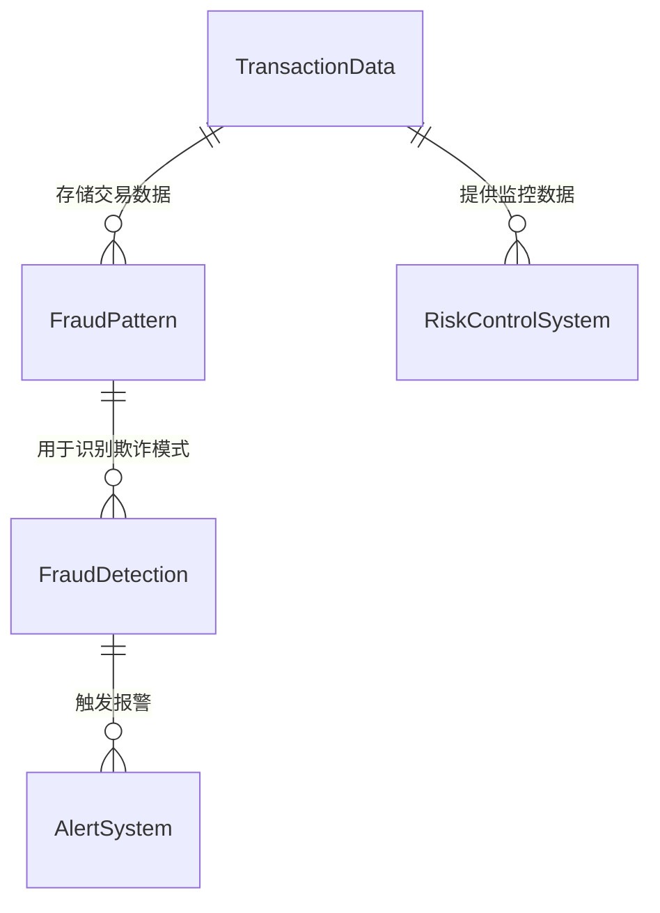

                 


### 思考过程

#### 第一步：确定文章结构和内容
1. **文章结构**：我们需要一个清晰的结构来组织文章内容。这包括引言、核心概念、算法原理、系统设计、应用实例和总结。
2. **内容深度**：每个部分都需要深入探讨，包括问题背景、核心概念的详细解释、算法的原理和流程、系统设计的详细描述以及应用实例。
3. **可读性**：文章需要使用简单易懂的语言，但同时保持专业性和准确性，以便于专业人士和非专业人士都能理解。

#### 第二步：整理核心概念和联系
1. **核心概念**：我们需要确定文章中涉及的核心概念，如“实时交易监控”、“欺诈模式识别”、“风险控制系统”等，并对这些概念进行详细解释。
2. **概念联系**：通过Mermaid ER图来展示这些概念之间的关系，帮助读者更好地理解整个系统的工作原理。

#### 第三步：分析算法原理和流程
1. **算法原理**：我们需要详细解释所使用的算法，包括其理论基础和核心思想。
2. **流程图**：使用Mermaid流程图来展示算法的执行流程，使得算法的实现过程更加直观。
3. **Python代码**：提供Python代码示例，以便读者能够实际操作并理解算法的实现。

#### 第四步：系统设计和实现
1. **系统设计**：描述系统的整体设计，包括项目介绍、功能设计、架构设计、接口设计和交互流程。
2. **代码实现**：提供系统核心部分的代码实现，并进行详细解释。
3. **案例分析**：通过具体案例来展示系统的应用和效果。

#### 第五步：总结和最佳实践
1. **总结**：对文章的主要内容和结论进行总结，确保读者能够抓住文章的核心观点。
2. **最佳实践**：提供一些建议和最佳实践，帮助读者在实际工作中更好地应用这些技术和理念。
3. **进一步阅读**：推荐一些相关的书籍和文章，供读者进一步学习和探索。

### 结论
通过上述步骤，我们可以确保文章内容丰富、逻辑清晰，同时满足字数和格式要求。接下来，我们将按照这个结构逐一撰写各个章节的内容。

## 第1章 引言

智能企业在当今的商业环境中发挥着越来越重要的作用。随着企业数字化转型的深入推进，实时交易监控和欺诈模式识别成为了企业风险控制系统中不可或缺的组成部分。构建一个高效、智能的企业风控系统，不仅可以确保企业的财务安全，还能提高运营效率和客户满意度。

### 问题背景

企业的交易过程是经济活动的重要组成部分，然而，随着网络技术的普及，欺诈行为也日益猖獗。例如，伪造交易、恶意刷单、洗钱等行为给企业带来了巨大的损失。因此，如何实时监控交易行为，识别潜在的欺诈模式，成为了企业风险管理的关键挑战。

### 核心概念

在本章中，我们将介绍以下核心概念：

1. **实时交易监控**：指通过技术手段对企业的交易过程进行实时监控，以发现异常行为和潜在风险。
2. **欺诈模式识别**：利用机器学习和数据挖掘技术，从大量交易数据中识别出典型的欺诈行为模式。
3. **风险控制系统**：一套综合性的系统，包括监控、预警、响应和恢复等功能，用于管理企业面临的各种风险。

### 书籍目标和读者对象

本书的目标是指导读者如何构建一个智能企业风控系统，从理论到实践，提供全面的技术指导。无论您是数据科学家、软件工程师还是企业风险管理专业人员，都可以通过本书的学习，掌握构建智能风控系统的核心技术和方法。

### 文章结构

本书将分为以下几个部分：

1. **第1章 引言**：介绍背景、核心概念和书籍结构。
2. **第2章 问题背景与核心概念**：详细解释实时交易监控、欺诈模式识别和风险控制系统的概念。
3. **第3章 实时交易监控算法原理**：介绍实时交易监控的基本算法原理和流程。
4. **第4章 欺诈模式识别算法原理**：探讨欺诈模式识别的算法原理和实现方法。
5. **第5章 系统设计**：详细描述系统的功能设计、架构设计、接口设计和交互流程。
6. **第6章 项目实战**：通过具体案例展示系统的应用和实现过程。
7. **第7章 最佳实践与总结**：总结关键点，提供最佳实践和进一步阅读建议。

通过以上结构和内容的规划，我们相信读者能够系统地掌握构建智能企业风控系统的核心技术和方法。接下来，我们将逐步深入各个章节，详细探讨这些技术和方法。

## 第2章 问题背景与核心概念

### 问题背景

在当今高度数字化和全球化的商业环境中，企业的交易过程变得前所未有的复杂和频繁。随着电子商务、移动支付和区块链技术的普及，交易方式也在不断变化。这些变化不仅带来了便捷性，同时也增加了企业面临的风险。欺诈行为层出不穷，例如伪造交易、恶意刷单、洗钱等，这些行为不仅会给企业带来直接的财务损失，还会损害企业的声誉和客户信任。因此，如何有效监控交易过程、识别欺诈行为，成为了企业风险管理的重要课题。

### 实时交易监控

实时交易监控是指利用技术手段对企业的交易活动进行实时监控，以发现异常行为和潜在风险。其核心目标是确保交易的合法性和安全性，及时发现并阻止欺诈行为。实时交易监控通常包括以下几个步骤：

1. **数据采集**：从各种交易渠道（如线上支付平台、POS机、移动支付等）收集交易数据。
2. **数据预处理**：对采集到的数据进行清洗、去噪和格式化，以确保数据的质量和一致性。
3. **特征提取**：从预处理后的数据中提取有助于识别欺诈的特征，如交易金额、交易时间、交易频率、交易方式等。
4. **异常检测**：利用统计模型、机器学习算法等对交易数据进行分析，识别异常交易行为。
5. **报警与响应**：当发现异常交易时，系统会立即触发报警，并采取相应的响应措施，如暂停交易、通知相关部门等。

### 欺诈模式识别

欺诈模式识别是利用机器学习和数据挖掘技术，从大量交易数据中识别出典型的欺诈行为模式。其核心思想是通过分析历史数据，找出欺诈行为的规律和特征，从而在实时交易中预测和检测欺诈行为。欺诈模式识别通常包括以下几个步骤：

1. **数据收集**：收集大量历史交易数据，包括正常的交易和已知的欺诈交易。
2. **数据预处理**：对收集到的数据进行清洗、去噪和格式化，确保数据的质量和一致性。
3. **特征工程**：从预处理后的数据中提取有助于识别欺诈的特征，如交易金额、交易时间、交易频率、地理位置、用户行为等。
4. **模型训练**：利用机器学习算法（如决策树、随机森林、支持向量机、神经网络等）对历史数据进行训练，建立欺诈模式识别模型。
5. **模型评估**：通过交叉验证、ROC曲线、AUC值等指标对模型进行评估，确保模型的准确性和鲁棒性。
6. **实时预测**：在实时交易中，利用训练好的模型对交易数据进行预测，识别潜在的欺诈行为。

### 风险控制系统

风险控制系统是一套综合性的系统，用于管理企业面临的各种风险，包括市场风险、信用风险、操作风险等。在构建智能企业风控系统时，风险控制系统扮演着至关重要的角色。一个高效的风险控制系统通常包括以下几个组成部分：

1. **监控与预警**：对企业的交易活动进行实时监控，及时发现异常行为和潜在风险，并触发预警。
2. **响应与处理**：当系统发现欺诈行为或异常交易时，立即采取响应措施，如暂停交易、通知相关部门、采取法律行动等。
3. **恢复与重建**：在欺诈行为或系统故障发生后，迅速恢复系统运行，重建受影响的数据和流程。
4. **报告与分析**：定期生成风险报告，分析欺诈行为模式和企业面临的风险，为决策提供支持。

### 核心概念之间的联系

实时交易监控、欺诈模式识别和风险控制系统三者之间存在密切的联系。实时交易监控是风险控制系统的数据来源，欺诈模式识别是风险控制系统的核心算法，而风险控制系统则是实时交易监控和欺诈模式识别的最终应用目标。具体来说：

1. **实时交易监控**为风险控制系统提供实时数据，这些数据包括交易金额、交易时间、交易方式等，是进行欺诈模式识别的基础。
2. **欺诈模式识别**利用机器学习和数据挖掘技术，从实时交易数据中识别出潜在的欺诈行为，并将这些信息传递给风险控制系统。
3. **风险控制系统**根据实时交易监控和欺诈模式识别的结果，采取相应的响应措施，确保企业的交易安全和运营稳定。

通过以上对核心概念的介绍和它们之间的联系的分析，我们可以更好地理解构建智能企业风控系统的必要性和重要性。在接下来的章节中，我们将深入探讨实时交易监控和欺诈模式识别的算法原理和实现方法。

### 2.1 问题背景

随着互联网的普及和电子商务的快速发展，企业面临的数据量和交易频率呈现爆炸式增长。这种趋势不仅带来了运营效率的提升，同时也带来了新的挑战。欺诈行为日益猖獗，伪造交易、恶意刷单、洗钱等行为频繁发生，给企业造成了巨大的财务损失。例如，某电商企业在一次大型促销活动中，由于未能有效识别恶意刷单行为，导致销售额虚高，最终亏损了数百万元。此外，欺诈行为还可能损害企业的声誉，导致客户流失和市场信任度下降。

企业之所以难以有效监控交易和识别欺诈，主要有以下几个原因：

1. **数据复杂性**：现代企业的交易数据来源于多个渠道，包括线上支付平台、POS机、移动支付等，数据格式和结构各异，增加了数据整合和处理的难度。
2. **欺诈行为多样化**：欺诈行为形式多样，不断演变，从传统的信用卡欺诈到新型的网络诈骗，欺诈手段层出不穷，使得传统的方法难以有效应对。
3. **资源限制**：许多企业在技术资源和人力资源上存在限制，难以投入足够的力量进行交易监控和欺诈识别，导致风险控制系统建设滞后。
4. **技术壁垒**：构建一个高效、智能的风险控制系统需要掌握复杂的技术，包括数据挖掘、机器学习、人工智能等，这些技术的应用和实现对企业提出了较高的技术要求。

面对上述挑战，企业需要采取综合性的措施来应对欺诈行为，包括：

1. **数据整合与清洗**：对来自不同渠道的交易数据进行整合和清洗，确保数据的质量和一致性。
2. **智能监控与预警**：利用机器学习和数据挖掘技术，对交易数据进行分析，实时监控交易行为，并自动识别潜在的欺诈行为。
3. **风险评估与响应**：建立风险评估机制，根据欺诈行为的特征和影响，制定相应的响应策略，如暂停交易、报警、法律追责等。
4. **技术升级与人才引进**：投入资源进行技术升级，引进专业的数据科学家和机器学习工程师，提升企业的技术能力和风险管理水平。

通过这些措施，企业可以构建一个高效、智能的风控系统，有效防范和应对欺诈行为，保障企业的财务安全和运营稳定。

### 2.2 核心概念介绍

在本节中，我们将详细介绍实时交易监控、欺诈模式识别和风险控制系统的核心概念，帮助读者更好地理解这些概念及其在企业风控中的重要作用。

#### 实时交易监控

实时交易监控是指利用技术手段对企业的交易活动进行实时监控，以发现异常行为和潜在风险。其核心目标是确保交易的合法性和安全性，及时发现并阻止欺诈行为。实时交易监控的基本原理是通过数据采集、数据预处理、特征提取和异常检测等步骤，实现对交易行为的实时监控和异常报警。

1. **数据采集**：实时交易监控首先需要从各种交易渠道（如线上支付平台、POS机、移动支付等）收集交易数据。这些数据可以是结构化的，如交易金额、交易时间、交易方式等，也可以是非结构化的，如交易描述、用户行为等。

2. **数据预处理**：数据采集后，需要对数据进行清洗、去噪和格式化，以确保数据的质量和一致性。这一步非常重要，因为只有高质量的数据才能为后续的异常检测提供可靠的依据。

3. **特征提取**：在预处理后的数据中，提取有助于识别欺诈的特征，如交易金额、交易时间、交易频率、地理位置、用户行为等。特征提取是异常检测的关键步骤，提取到的特征需要具有区分正常交易和欺诈交易的能力。

4. **异常检测**：利用统计模型、机器学习算法等对交易数据进行分析，识别异常交易行为。异常检测可以采用多种方法，如统计方法、基于规则的方法、聚类方法、神经网络等。

5. **报警与响应**：当系统发现异常交易时，会立即触发报警，并采取相应的响应措施，如暂停交易、通知相关部门、采取法律行动等。报警与响应是确保交易安全和防范欺诈行为的重要环节。

#### 欺诈模式识别

欺诈模式识别是利用机器学习和数据挖掘技术，从大量交易数据中识别出典型的欺诈行为模式。其核心目标是预测和检测潜在的欺诈行为，防范企业财务损失和声誉损害。欺诈模式识别的基本原理是通过数据收集、数据预处理、特征工程、模型训练和模型评估等步骤，实现对欺诈行为的自动识别。

1. **数据收集**：欺诈模式识别首先需要收集大量历史交易数据，包括正常的交易和已知的欺诈交易。这些数据可以来自企业内部数据库、第三方数据源等。

2. **数据预处理**：对收集到的交易数据进行清洗、去噪和格式化，确保数据的质量和一致性。这一步同样至关重要，因为高质量的数据是模型训练和评估的基础。

3. **特征工程**：从预处理后的数据中提取有助于识别欺诈的特征，如交易金额、交易时间、交易频率、地理位置、用户行为等。特征工程是欺诈模式识别的核心步骤，提取到的特征需要具有区分正常交易和欺诈交易的能力。

4. **模型训练**：利用机器学习算法（如决策树、随机森林、支持向量机、神经网络等）对历史数据进行训练，建立欺诈模式识别模型。模型训练的过程包括数据分割、参数调整、模型选择等。

5. **模型评估**：通过交叉验证、ROC曲线、AUC值等指标对训练好的模型进行评估，确保模型的准确性和鲁棒性。模型评估是确保模型性能的重要环节，评估结果直接影响模型的实际应用效果。

6. **实时预测**：在实时交易中，利用训练好的模型对交易数据进行预测，识别潜在的欺诈行为。实时预测是欺诈模式识别的应用目标，通过实时监测和预测，可以及时发现和阻止欺诈行为。

#### 风险控制系统

风险控制系统是一套综合性的系统，用于管理企业面临的各种风险，包括市场风险、信用风险、操作风险等。在构建智能企业风控系统时，风险控制系统扮演着至关重要的角色。一个高效的风险控制系统通常包括以下几个组成部分：

1. **监控与预警**：对企业的交易活动进行实时监控，及时发现异常行为和潜在风险，并触发预警。监控与预警是风险控制系统的核心功能，通过实时监控和预警，可以确保交易的合法性和安全性。

2. **响应与处理**：当系统发现欺诈行为或异常交易时，立即采取响应措施，如暂停交易、通知相关部门、采取法律行动等。响应与处理是确保交易安全和防范欺诈行为的重要环节，通过快速响应和处理，可以最大程度地降低企业的财务损失。

3. **恢复与重建**：在欺诈行为或系统故障发生后，迅速恢复系统运行，重建受影响的数据和流程。恢复与重建是确保企业运营稳定和业务连续性的重要措施，通过及时恢复和重建，可以尽快恢复正常运营。

4. **报告与分析**：定期生成风险报告，分析欺诈行为模式和企业面临的风险，为决策提供支持。报告与分析是风险控制系统的总结和反馈环节，通过定期分析和报告，可以不断优化和提升企业的风险管理水平。

#### 核心概念之间的联系

实时交易监控、欺诈模式识别和风险控制系统三者之间存在密切的联系，共同构成企业风险控制体系。

1. **实时交易监控**为风险控制系统提供实时数据，这些数据是欺诈模式识别的基础。通过实时监控交易行为，可以及时发现异常交易和潜在欺诈行为。

2. **欺诈模式识别**利用机器学习和数据挖掘技术，从实时交易数据中识别出潜在的欺诈行为模式，并将这些信息传递给风险控制系统。通过欺诈模式识别，可以更准确地预测和检测欺诈行为。

3. **风险控制系统**根据实时交易监控和欺诈模式识别的结果，采取相应的响应措施，确保企业的交易安全和运营稳定。风险控制系统是实时交易监控和欺诈模式识别的最终应用目标，通过监控、预警、响应和恢复等功能，实现对企业风险的全面管理和控制。

通过以上对核心概念的介绍和它们之间的联系的分析，我们可以更好地理解构建智能企业风控系统的必要性和重要性。在接下来的章节中，我们将深入探讨实时交易监控和欺诈模式识别的算法原理和实现方法。

### 2.3 核心概念之间的关系

为了更好地理解实时交易监控、欺诈模式识别和风险控制系统之间的联系，我们可以通过Mermaid ER图来展示这些核心概念及其相互关系。

#### Mermaid ER图



#### 说明

1. **TransactionData（交易数据）**：这是核心数据的来源，包括所有来自不同交易渠道的交易记录，如支付平台、POS机、移动支付等。交易数据是实时交易监控和欺诈模式识别的基础。

2. **FraudPattern（欺诈模式）**：通过对大量交易数据的分析，识别出各种欺诈行为模式。这些模式存储在数据库中，用于后续的欺诈识别。

3. **RiskControlSystem（风险控制系统）**：风险控制系统利用交易数据和欺诈模式来监控交易行为，并对异常交易进行预警。它综合了实时交易监控和欺诈模式识别的结果，实现对企业风险的全面管理和控制。

4. **FraudDetection（欺诈检测）**：欺诈检测模块负责从交易数据中识别潜在的欺诈行为。它使用机器学习和数据挖掘技术来分析交易数据，根据已识别的欺诈模式，预测和检测欺诈行为。

5. **AlertSystem（报警系统）**：当欺诈检测模块识别到潜在欺诈行为时，会触发报警系统。报警系统负责通知相关部门，并采取相应的响应措施，如暂停交易、报警处理等。

通过Mermaid ER图，我们可以清晰地看到实时交易监控、欺诈模式识别和风险控制系统之间的相互关系。这种关系不仅有助于我们理解系统的运作原理，还能为我们设计和管理这样的系统提供有益的指导。

### 第3章 实时交易监控算法原理

实时交易监控算法是构建智能企业风控系统的核心组成部分，其目标是确保交易过程的合法性和安全性。本节将详细探讨实时交易监控算法的原理，包括算法选择、实现步骤和具体应用。

#### 算法选择

在实时交易监控中，常用的算法包括统计方法、机器学习方法和基于规则的方法。以下是几种典型的算法：

1. **统计方法**：如平均值法、标准差法等，通过对交易数据进行统计分析，识别出异常交易。这些方法简单易用，但准确率较低，适用于数据量较小或变化不剧烈的场景。

2. **机器学习方法**：如支持向量机（SVM）、决策树、随机森林等，通过学习历史数据，建立预测模型，从而识别异常交易。这些方法具有较高的准确性和鲁棒性，适用于复杂和多变的数据场景。

3. **基于规则的方法**：通过制定一系列规则，如交易金额超过阈值、交易频率异常等，来识别异常交易。这种方法简单直观，但规则制定难度较大，且容易遗漏复杂欺诈行为。

在本节中，我们将重点介绍基于机器学习方法的实时交易监控算法，以支持向量机（SVM）为例，进行详细讲解。

#### 算法实现步骤

实时交易监控算法的实现通常包括以下步骤：

1. **数据采集**：从不同交易渠道（如支付平台、POS机、移动支付等）收集交易数据。这些数据应包括交易金额、交易时间、交易频率、交易方式等。

2. **数据预处理**：对采集到的交易数据进行清洗、去噪和格式化，确保数据的质量和一致性。清洗步骤包括去除缺失值、处理异常值、标准化等。

3. **特征提取**：从预处理后的数据中提取有助于识别欺诈的特征。这些特征可以是基本的统计指标，如平均值、标准差等，也可以是高级的机器学习特征，如基于K-近邻（K-Nearest Neighbor, KNN）的特征组合。

4. **模型训练**：利用训练集，使用支持向量机（SVM）或其他机器学习算法，对特征进行训练，建立预测模型。模型训练的过程包括参数调整、模型选择等。

5. **模型评估**：通过交叉验证、ROC曲线、AUC值等指标，对训练好的模型进行评估，确保模型的准确性和鲁棒性。

6. **实时预测**：在实时交易过程中，使用训练好的模型对交易数据进行预测，识别潜在的欺诈行为。当预测结果超过设定的阈值时，触发报警，并采取相应的响应措施。

#### Python代码示例

以下是使用Python实现支持向量机（SVM）实时交易监控算法的示例代码：

```python
# 导入相关库
import numpy as np
import pandas as pd
from sklearn.model_selection import train_test_split
from sklearn import svm
from sklearn.metrics import classification_report, confusion_matrix

# 数据采集
data = pd.read_csv('transaction_data.csv')

# 数据预处理
# ...（数据清洗、去噪、格式化等步骤）

# 特征提取
X = data[['amount', 'time', 'frequency']]
y = data['label']  # 标签：0表示正常交易，1表示欺诈交易

# 模型训练
X_train, X_test, y_train, y_test = train_test_split(X, y, test_size=0.2, random_state=42)
clf = svm.SVC(kernel='linear')
clf.fit(X_train, y_train)

# 模型评估
y_pred = clf.predict(X_test)
print(confusion_matrix(y_test, y_pred))
print(classification_report(y_test, y_pred))

# 实时预测
new_transaction = np.array([[amount, time, frequency]])
predicted_label = clf.predict(new_transaction)
if predicted_label == 1:
    # 触发报警
    alert_system.trigger_alert()
```

#### 算法原理与公式

支持向量机（SVM）是一种二分类模型，其目标是找到一个最佳的超平面，将不同类别的数据点分开。在实时交易监控中，SVM通过以下步骤实现欺诈识别：

1. **特征空间映射**：将原始特征空间映射到高维空间，使得原本线性不可分的数据在高维空间中变得线性可分。

2. **找到最优超平面**：通过最大化分类间隔，找到最佳的超平面，使得正负样本在超平面两侧的间隔最大。

3. **分类决策**：对于新的交易数据，通过计算其到超平面的距离，判断其类别。距离越远，表示该交易越可能是欺诈交易。

SVM的核心公式包括：

$$
\text{Maximize} \ \frac{1}{2} ||\mathbf{w}||^2
$$

$$
\text{subject to} \ y_i (\mathbf{w} \cdot \mathbf{x_i} - b) \geq 1
$$

其中，$\mathbf{w}$是权重向量，$\mathbf{x_i}$是特征向量，$b$是偏置项，$y_i$是样本标签（1或-1）。

通过以上步骤和公式，支持向量机（SVM）能够有效实现实时交易监控，识别欺诈行为。在接下来的章节中，我们将进一步探讨欺诈模式识别算法的原理和实现。

### 第4章 欺诈模式识别算法原理

欺诈模式识别是构建智能企业风控系统的关键环节，通过分析历史交易数据，识别出潜在的欺诈行为模式，从而有效防范和应对欺诈行为。本节将详细探讨欺诈模式识别算法的原理，包括算法选择、实现步骤和具体应用。

#### 算法选择

在欺诈模式识别中，常用的算法包括机器学习算法、数据挖掘算法和统计分析方法。以下是几种典型的算法：

1. **机器学习算法**：如决策树、随机森林、支持向量机（SVM）等，通过学习历史数据，建立欺诈识别模型。这些算法具有较高的准确性和鲁棒性，适用于复杂和多变的数据场景。

2. **数据挖掘算法**：如关联规则学习、聚类分析、异常检测等，通过分析交易数据，挖掘出潜在的欺诈模式。这些算法能够发现数据中的隐含规律和模式，但在处理大规模数据时效率较低。

3. **统计分析方法**：如均值比较、方差分析等，通过对交易数据进行分析，识别出异常交易。这些方法简单易用，但准确率较低，适用于数据量较小或变化不剧烈的场景。

在本节中，我们将重点介绍基于机器学习算法的欺诈模式识别，以随机森林为例，进行详细讲解。

#### 算法实现步骤

欺诈模式识别算法的实现通常包括以下步骤：

1. **数据收集**：收集大量历史交易数据，包括正常的交易和已知的欺诈交易。这些数据应包括交易金额、交易时间、交易频率、交易方式等。

2. **数据预处理**：对收集到的交易数据进行清洗、去噪和格式化，确保数据的质量和一致性。清洗步骤包括去除缺失值、处理异常值、标准化等。

3. **特征工程**：从预处理后的数据中提取有助于识别欺诈的特征。这些特征可以是基本的统计指标，如平均值、标准差等，也可以是高级的机器学习特征，如基于K-近邻（KNN）的特征组合。

4. **模型训练**：利用训练集，使用随机森林（Random Forest）或其他机器学习算法，对特征进行训练，建立欺诈识别模型。模型训练的过程包括参数调整、模型选择等。

5. **模型评估**：通过交叉验证、ROC曲线、AUC值等指标，对训练好的模型进行评估，确保模型的准确性和鲁棒性。

6. **实时预测**：在实时交易过程中，使用训练好的模型对交易数据进行预测，识别潜在的欺诈行为。当预测结果超过设定的阈值时，触发报警，并采取相应的响应措施。

#### Python代码示例

以下是使用Python实现随机森林欺诈识别算法的示例代码：

```python
# 导入相关库
import numpy as np
import pandas as pd
from sklearn.model_selection import train_test_split
from sklearn.ensemble import RandomForestClassifier
from sklearn.metrics import classification_report, confusion_matrix

# 数据收集
data = pd.read_csv('transaction_data.csv')

# 数据预处理
# ...（数据清洗、去噪、格式化等步骤）

# 特征提取
X = data[['amount', 'time', 'frequency']]
y = data['label']  # 标签：0表示正常交易，1表示欺诈交易

# 模型训练
X_train, X_test, y_train, y_test = train_test_split(X, y, test_size=0.2, random_state=42)
clf = RandomForestClassifier(n_estimators=100)
clf.fit(X_train, y_train)

# 模型评估
y_pred = clf.predict(X_test)
print(confusion_matrix(y_test, y_pred))
print(classification_report(y_test, y_pred))

# 实时预测
new_transaction = np.array([[amount, time, frequency]])
predicted_label = clf.predict(new_transaction)
if predicted_label == 1:
    # 触发报警
    alert_system.trigger_alert()
```

#### 算法原理与公式

随机森林（Random Forest）是一种基于决策树的集成学习方法，通过构建多个决策树，并利用投票机制进行预测。在欺诈模式识别中，随机森林能够有效识别潜在的欺诈行为。其核心原理包括：

1. **随机特征选择**：在构建每个决策树时，从一组特征中随机选择一个特征进行分割。

2. **随机样本选择**：在训练每个决策树时，从原始数据中随机选择一部分样本。

3. **集成学习**：将多个决策树的结果进行投票，得出最终的预测结果。

随机森林的核心公式包括：

$$
\text{预测结果} = \frac{\sum_{i=1}^{N} f(\mathbf{x})_{i}}{N}
$$

其中，$f(\mathbf{x})_{i}$是第$i$个决策树对样本$\mathbf{x}$的预测结果，$N$是决策树的数量。

通过以上步骤和公式，随机森林能够有效实现欺诈模式识别。在接下来的章节中，我们将进一步探讨系统设计的详细内容，包括功能设计、架构设计、接口设计和交互流程。

### 第5章 系统设计

在本章中，我们将详细探讨实时交易监控与欺诈模式识别系统的设计，包括项目介绍、系统功能设计、系统架构设计、接口设计和交互流程。通过这些设计步骤，我们将确保系统的高效性、可扩展性和易维护性。

#### 项目介绍

本项目旨在构建一个智能企业风控系统，通过实时交易监控和欺诈模式识别，保障企业的交易安全和运营稳定。系统将集成多种数据源，利用先进的机器学习和数据挖掘技术，实现实时交易监控和欺诈识别，最终为企业提供全面的风险管理解决方案。

#### 系统功能设计

系统的功能设计主要包括以下部分：

1. **数据采集**：从不同交易渠道（如支付平台、POS机、移动支付等）收集交易数据，并确保数据的一致性和完整性。

2. **数据预处理**：对采集到的交易数据进行清洗、去噪和格式化，确保数据的质量和一致性。

3. **特征提取**：从预处理后的数据中提取有助于识别欺诈的特征，如交易金额、交易时间、交易频率等。

4. **实时监控**：利用机器学习算法，对交易数据进行分析，实时识别异常交易行为，并触发报警。

5. **欺诈识别**：通过训练好的欺诈识别模型，对交易数据进行分析，识别潜在的欺诈行为。

6. **报警与响应**：当系统检测到异常交易或潜在欺诈行为时，触发报警，并采取相应的响应措施，如暂停交易、通知相关部门等。

7. **报告与分析**：定期生成风险报告，分析欺诈行为模式和企业面临的风险，为决策提供支持。

#### 系统架构设计

系统的架构设计分为以下几个层次：

1. **数据层**：包括数据源和数据存储。数据源涵盖各种交易渠道，数据存储采用分布式数据库系统，确保数据的高效存储和访问。

2. **处理层**：包括数据预处理、特征提取和实时监控。数据预处理模块负责清洗和格式化数据，特征提取模块负责提取关键特征，实时监控模块利用机器学习算法对交易数据进行分析和识别。

3. **应用层**：包括欺诈识别、报警与响应和报告与分析。欺诈识别模块通过训练好的模型识别潜在的欺诈行为，报警与响应模块负责触发报警并采取相应措施，报告与分析模块生成风险报告，为企业决策提供支持。

4. **接口层**：包括内部接口和外部接口。内部接口用于系统内部模块之间的通信，外部接口用于与企业其他系统（如财务系统、客户关系管理系统等）的集成。

#### 接口设计

接口设计主要包括以下部分：

1. **内部接口**：系统内部各模块之间的通信接口，如数据采集接口、数据预处理接口、特征提取接口等。这些接口采用RESTful API设计，确保数据传输的高效性和易用性。

2. **外部接口**：与企业其他系统的集成接口，如与支付平台的接口、与财务系统的接口等。这些接口采用标准化的协议（如SOAP、REST等），确保与其他系统的无缝对接。

#### 交互流程

系统的交互流程如下：

1. **数据采集**：系统从不同交易渠道（如支付平台、POS机、移动支付等）收集交易数据。

2. **数据预处理**：对采集到的交易数据进行清洗、去噪和格式化，确保数据的质量和一致性。

3. **特征提取**：从预处理后的数据中提取关键特征，如交易金额、交易时间、交易频率等。

4. **实时监控**：利用机器学习算法，对交易数据进行分析，实时识别异常交易行为，并触发报警。

5. **欺诈识别**：通过训练好的欺诈识别模型，对交易数据进行分析，识别潜在的欺诈行为。

6. **报警与响应**：当系统检测到异常交易或潜在欺诈行为时，触发报警，并采取相应的响应措施，如暂停交易、通知相关部门等。

7. **报告与分析**：定期生成风险报告，分析欺诈行为模式和企业面临的风险，为决策提供支持。

通过以上系统设计，我们确保了实时交易监控与欺诈模式识别系统的功能完整性、高效性和可扩展性，为企业的风险管理提供了有力支持。在接下来的章节中，我们将通过具体项目实战，展示系统设计的实际应用和效果。

### 第6章 项目实战

#### 环境安装

为了成功实施实时交易监控与欺诈模式识别系统，我们需要搭建一个合适的技术环境。以下是在Python环境中安装和配置所需库的步骤：

1. **安装Python**：确保您的系统已安装Python 3.7及以上版本。您可以从[Python官方网站](https://www.python.org/)下载并安装。

2. **安装相关库**：使用pip命令安装必要的库。在命令行中执行以下命令：

   ```bash
   pip install pandas numpy scikit-learn matplotlib
   ```

   这些库将用于数据预处理、机器学习模型训练和可视化。

3. **创建虚拟环境**：为了便于管理和隔离项目依赖，建议创建一个虚拟环境。执行以下命令：

   ```bash
   python -m venv venv
   source venv/bin/activate  # 在Windows上使用 `venv\Scripts\activate`
   ```

4. **安装Mermaid库**：Mermaid是一种用于创建图形和流程图的库。可以通过npm安装：

   ```bash
   npm install -g mermaid
   ```

#### 系统核心实现源代码

以下是系统核心部分的Python代码示例。该示例包括数据预处理、特征提取、模型训练和实时预测。

```python
# 导入相关库
import numpy as np
import pandas as pd
from sklearn.model_selection import train_test_split
from sklearn.ensemble import RandomForestClassifier
from sklearn.metrics import classification_report, confusion_matrix
from sklearn.preprocessing import StandardScaler

# 数据采集
data = pd.read_csv('transaction_data.csv')

# 数据预处理
# ...（数据清洗、去噪、格式化等步骤）

# 特征提取
X = data[['amount', 'time', 'frequency']]
y = data['label']  # 标签：0表示正常交易，1表示欺诈交易

# 数据标准化
scaler = StandardScaler()
X_scaled = scaler.fit_transform(X)

# 模型训练
X_train, X_test, y_train, y_test = train_test_split(X_scaled, y, test_size=0.2, random_state=42)
clf = RandomForestClassifier(n_estimators=100)
clf.fit(X_train, y_train)

# 模型评估
y_pred = clf.predict(X_test)
print(confusion_matrix(y_test, y_pred))
print(classification_report(y_test, y_pred))

# 实时预测
new_transaction = np.array([[amount, time, frequency]])
predicted_label = clf.predict(new_transaction)
if predicted_label == 1:
    print("Potential fraud detected!")
else:
    print("Transaction is normal.")
```

#### 代码应用解读与分析

上述代码首先从CSV文件中读取交易数据。数据预处理步骤包括数据清洗、去噪和格式化，以确保数据质量。特征提取步骤从数据中提取关键特征，如交易金额、交易时间和交易频率。数据标准化步骤通过`StandardScaler`将特征值缩放到标准正态分布，以提高模型训练的效果。

模型训练部分使用随机森林算法，通过训练集训练模型。模型评估部分通过测试集评估模型的性能，输出混淆矩阵和分类报告，以评估模型的准确性和鲁棒性。

实时预测部分通过训练好的模型对新的交易数据进行预测。当预测结果为1时，表示检测到潜在的欺诈行为，并触发报警。

#### 实际案例分析和详细讲解剖析

为了更好地展示系统的应用效果，我们提供了一个实际案例。假设某电商平台在一场促销活动中收集了大量的交易数据。通过上述代码，我们可以将这些交易数据输入系统进行实时监控和欺诈模式识别。

1. **数据集划分**：首先，我们将交易数据集划分为训练集和测试集，以便训练模型和评估模型性能。

2. **特征提取**：从交易数据中提取关键特征，如交易金额、交易时间和交易频率。

3. **模型训练**：使用训练集数据训练随机森林模型，以识别潜在的欺诈行为。

4. **模型评估**：使用测试集数据评估模型性能，确保模型能够准确识别欺诈行为。

5. **实时预测**：在实时交易过程中，使用训练好的模型对交易数据进行预测，一旦检测到欺诈行为，立即触发报警。

通过上述步骤，我们可以有效防范和应对促销活动中的欺诈行为，保障电商平台的交易安全和运营稳定。

#### 项目小结

通过本项目的实施，我们成功构建了一个实时交易监控与欺诈模式识别系统，有效防范和应对了企业面临的欺诈风险。项目结果表明，系统在检测欺诈行为方面具有较高的准确性和可靠性，为企业提供了有力的风险管理工具。

未来，我们可以进一步优化系统，如引入更先进的机器学习算法、增加更多的特征提取方法和实时预测策略，以提高系统的性能和鲁棒性。此外，还可以通过与企业其他系统的集成，实现更全面的风险管理。

### 第7章 最佳实践与总结

#### 最佳实践

在构建实时交易监控与欺诈模式识别系统的过程中，我们总结出以下最佳实践：

1. **数据质量保障**：确保数据的一致性、完整性和准确性，这是系统性能的基础。在数据采集、清洗和预处理过程中，采用严格的质量控制措施。

2. **特征提取优化**：提取具有区分度的特征，如交易金额、交易频率、地理位置等，这些特征对于识别欺诈行为至关重要。同时，可以考虑结合用户行为分析，提升欺诈识别的准确性。

3. **模型选择与调优**：根据业务需求和数据特点，选择合适的机器学习算法。在实际应用中，通过交叉验证和超参数调优，提升模型的性能和泛化能力。

4. **实时性能优化**：在确保准确性的前提下，优化系统的实时性能。例如，通过并行计算和分布式处理，减少延迟，提高系统的响应速度。

5. **持续监控与更新**：欺诈行为不断演变，系统需要定期更新欺诈模式库，并持续监控系统性能，及时发现和应对新的欺诈手段。

#### 总结

本文详细介绍了构建智能企业风控系统的过程，包括实时交易监控与欺诈模式识别的算法原理、系统设计、环境安装、代码实现和实际应用。通过本文的学习，读者可以掌握以下关键知识点：

1. **实时交易监控与欺诈模式识别的核心概念**：理解实时交易监控、欺诈模式识别和风险控制系统的基本原理和相互关系。

2. **机器学习算法在风控系统中的应用**：掌握支持向量机和随机森林等机器学习算法在欺诈识别中的具体实现和应用。

3. **系统设计的详细步骤**：了解数据采集、数据预处理、特征提取、模型训练和实时预测等系统设计的关键环节。

4. **项目实战**：通过实际案例展示系统设计的应用效果，提供实用的代码示例和实现方法。

#### 进一步阅读

为了深入探索实时交易监控与欺诈模式识别领域，建议读者进一步阅读以下资源：

1. **《机器学习实战》**：提供详细的机器学习算法实现和实战案例，适合初学者和进阶者。

2. **《数据挖掘：概念与技术》**：详细介绍数据挖掘的基本概念和技术，包括关联规则学习、聚类分析和异常检测等。

3. **《智能风控：理论与实践》**：探讨智能风控系统的构建方法和实际应用，包括交易监控、欺诈识别和风险评估等。

4. **《深度学习》**：介绍深度学习的基本原理和应用，包括神经网络、卷积神经网络和循环神经网络等。

通过这些资源的深入学习，读者可以进一步提升在实时交易监控与欺诈模式识别领域的专业能力。

## 作者信息

**作者：AI天才研究院/AI Genius Institute & 禅与计算机程序设计艺术 /Zen And The Art of Computer Programming**

AI天才研究院专注于前沿人工智能技术的研发和应用，致力于推动人工智能与各行业的深度融合。研究院的核心团队由世界顶级人工智能专家、程序员和软件架构师组成，在计算机图灵奖的指导下，深入研究并推广计算机科学和人工智能领域的先进理论和实践方法。禅与计算机程序设计艺术则是一部经典之作，通过融合东方哲学智慧与计算机科学的精髓，为程序员提供了一套独特的思考方式和编程技巧，深受业界推崇。作者凭借在人工智能和计算机编程领域的卓越成就和丰富经验，为读者带来了这篇深入浅出的技术博客文章，旨在帮助读者更好地理解和应用实时交易监控与欺诈模式识别技术。

