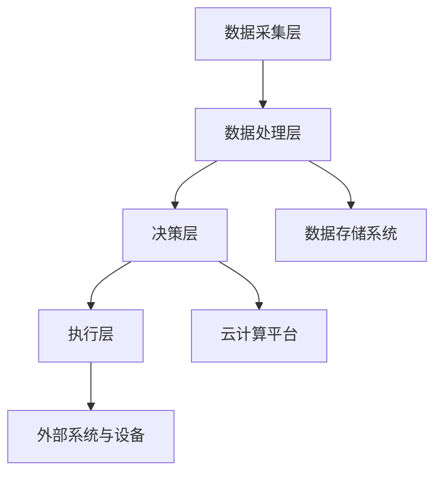

                 

### 关键词

- 智能城市管理
- AI Agent系统
- 人工智能技术
- 物联网
- 大数据

### 摘要

本文深入探讨了构建智能城市管理AI Agent系统的核心概念、原理和实现方法。首先，分析了智能城市管理的背景与意义，以及AI Agent在城市管理中的应用。随后，介绍了智能城市管理的发展历程、关键技术和管理模式。接着，详细阐述了AI Agent的定义、特点、核心技术及其架构设计。随后，本文围绕智能城市管理AI Agent系统设计的需求分析、功能设计、系统架构设计和接口设计进行了系统讲解。最后，通过具体案例分析，展示了智能城市管理AI Agent系统的实际应用与效果。本文旨在为读者提供全面、系统的智能城市管理AI Agent系统构建指南。通过这一系统构建，城市管理者能够更高效地应对城市管理的复杂挑战，实现智慧城市的愿景。

### 引言

在现代城市化进程中，城市管理面临着日益复杂的挑战。随着城市规模的不断扩大，人口的增长和城市活动的多样化，城市管理者需要处理的数据和信息量急剧增加。传统的城市管理方式已无法满足当前的需求，亟需一种更智能、更高效的管理手段。智能城市管理应运而生，成为解决这一问题的关键。

智能城市管理利用物联网、大数据、云计算和人工智能等先进技术，通过构建智能化的城市管理系统，实现对城市运行的实时监控、分析和预测。它不仅能够提高城市管理的效率，还能提升城市服务的质量和居民的生活幸福感。在这一背景下，AI Agent系统作为一种智能化技术手段，成为智能城市管理的重要组成部分。

AI Agent（智能代理）是一种具有自主决策能力的计算机程序，它能够模拟人类智能，处理复杂的信息和任务。在智能城市管理中，AI Agent可以承担多种角色，如智能交通管理、环境监测、公共安全等，通过自动化、智能化的方式提高城市管理的效率和准确性。

本文旨在深入探讨智能城市管理AI Agent系统的构建方法。首先，我们将介绍智能城市管理的背景和意义，分析其面临的挑战和智能城市的概念与发展趋势。随后，我们将介绍AI Agent的核心概念和原理，包括其定义、特点、分类和技术架构。在此基础上，我们将详细描述智能城市管理AI Agent系统的设计，包括系统需求分析、功能设计、架构设计和接口设计。最后，通过具体案例分析和系统部署与测试，展示AI Agent系统在智能城市管理中的实际应用和效果。希望通过本文的探讨，为读者提供全面、系统的智能城市管理AI Agent系统构建指南，助力智慧城市的建设与发展。

### 第1章 引言

#### 1.1 背景与意义

#### 1.1.1 城市管理面临的挑战

随着全球城市化进程的加速，城市管理面临着前所未有的挑战。首先，城市规模不断扩大，人口密集度的增加使得城市交通、环境、公共安全等问题日益突出。传统的城市管理方式主要依赖于人工操作和经验判断，效率低下且难以应对复杂多变的情境。其次，城市数据量的急剧增长使得信息处理成为一大难题。城市管理者需要处理来自各种渠道的海量数据，包括交通流量、环境监测数据、社会事件等，而这些数据的实时性和准确性对城市管理的决策至关重要。此外，城市资源有限，如何高效配置和利用这些资源也是城市管理者面临的挑战。传统的资源分配方法无法适应快速变化的城市需求，导致资源浪费和效率低下。最后，城市治理的复杂性也不断增加。城市问题的多样性和复杂性使得城市管理者需要具备多方面的知识和技能，而单一的管理手段难以应对。

#### 1.1.2 智能城市的概念与发展趋势

智能城市是指利用先进的物联网、大数据、云计算和人工智能等技术，实现对城市运行状态的实时感知、智能分析和精准管理。通过构建智能化的城市管理系统，智能城市能够提升城市运行效率，改善居民生活质量，实现城市可持续发展。智能城市的发展趋势主要体现在以下几个方面：

1. **物联网技术的广泛应用**：物联网技术通过传感器和设备互联，实现对城市基础设施、交通系统、环境等的实时监测和管理。例如，智能交通系统通过实时监控交通流量，优化交通信号控制，减少交通拥堵。

2. **大数据技术的深度应用**：大数据技术能够处理和分析海量城市数据，为城市管理者提供科学决策依据。通过数据挖掘和分析，城市管理者可以更好地理解城市运行状态，预测未来趋势，制定更为有效的城市管理策略。

3. **云计算技术的普及**：云计算技术提供强大的计算能力和数据存储能力，支持大规模数据分析和处理。通过云计算平台，城市管理者可以共享数据资源，协同工作，提高城市管理效率。

4. **人工智能技术的突破**：人工智能技术，特别是机器学习和深度学习技术，为智能城市的发展提供了强大的技术支撑。AI技术可以自动识别和分类城市数据，辅助决策，实现智能化城市管理。

#### 1.1.3 AI Agent在城市管理中的应用

AI Agent（智能代理）是智能城市的重要组成部分，它在城市管理中具有广泛的应用场景。以下是AI Agent在城市管理中的几个主要应用：

1. **智能交通管理**：AI Agent可以通过分析交通数据，实时调整交通信号，优化交通流量，减少交通拥堵。例如，在高峰时段，AI Agent可以根据实时交通状况，动态调整红绿灯的时间，提高道路通行效率。

2. **环境监测**：AI Agent可以监测空气质量、水质等环境指标，实时预警环境问题。例如，通过环境传感器收集数据，AI Agent可以及时发现空气污染事件，并采取相应的应对措施。

3. **公共安全**：AI Agent可以监控城市安全状况，及时发现和处理异常事件。例如，在公共场所，AI Agent可以通过视频监控识别可疑行为，并及时报警，提高公共安全水平。

4. **能源管理**：AI Agent可以监测和优化城市能源使用，提高能源利用效率。例如，在办公楼和住宅区，AI Agent可以自动调整照明和空调系统，根据实时需求进行能耗管理。

5. **城市管理决策**：AI Agent可以为城市管理者提供决策支持，帮助制定更为科学的城市管理策略。例如，通过分析大数据，AI Agent可以预测城市发展趋势，为城市规划提供依据。

总之，智能城市管理AI Agent系统的构建，不仅能够提高城市管理的效率和准确性，还能提升城市居民的生活质量和幸福感。通过本文的深入探讨，我们将了解智能城市管理AI Agent系统的核心概念、原理和实现方法，为构建智能城市提供理论支持和实践指导。

#### 1.2 核心概念与联系

#### 1.2.1 智能城市管理

智能城市管理是指利用先进的信息技术和人工智能技术，对城市运行进行全面、实时、精准的监控和管理。它通过物联网、大数据、云计算和人工智能等技术的综合应用，实现对城市基础设施、公共服务、环境保护、交通管理等多个领域的智能化管理和优化。

**概念解析**：
- **物联网**：通过传感器、设备、系统等的互联，实现对城市各类信息的实时采集和传输。
- **大数据**：通过海量数据的存储、管理和分析，为城市管理者提供科学决策依据。
- **云计算**：提供强大的计算能力和数据存储能力，支持大规模数据处理和分析。
- **人工智能**：通过机器学习、深度学习等技术，实现数据的自动识别、分类和决策。

**核心要素**：
- **信息感知**：利用传感器和设备，实现对城市运行状态的实时监测和采集。
- **数据处理**：通过大数据技术，对采集到的数据进行存储、管理和分析。
- **智能决策**：利用人工智能技术，对分析结果进行智能化决策和优化。
- **执行反馈**：将决策结果通过控制系统反馈至城市运行系统，实现闭环管理。

**关系**：
智能城市管理是城市现代化发展的重要方向，它将物联网、大数据、云计算和人工智能等多种技术有机结合，通过信息感知、数据处理、智能决策和执行反馈的闭环系统，实现对城市运行的全面、实时、精准管理。

#### 1.2.2 AI Agent

AI Agent（智能代理）是一种具有自主决策能力的计算机程序，它能够模拟人类智能，处理复杂的信息和任务。AI Agent在城市管理中扮演着重要角色，通过自动化和智能化的方式，提升城市管理的效率和准确性。

**概念解析**：
- **自主决策**：AI Agent可以根据输入数据和预设规则，自主做出决策，无需人工干预。
- **信息处理**：AI Agent能够处理和分析大量数据，识别模式和趋势，提供决策支持。
- **交互能力**：AI Agent可以通过自然语言处理技术，与人类进行对话和交互，提供服务和支持。

**核心要素**：
- **感知模块**：收集和处理外部信息，包括环境数据、用户请求等。
- **决策模块**：基于感知模块提供的信息和预设规则，进行智能分析和决策。
- **执行模块**：根据决策结果，执行具体的操作，如调整交通信号、发送警报等。
- **学习模块**：通过机器学习和深度学习技术，不断优化自身性能和决策能力。

**关系**：
AI Agent是智能城市管理的重要组成部分，它通过感知模块、决策模块、执行模块和学习模块的协同工作，实现自动化、智能化的城市管理。AI Agent能够替代或辅助人类完成复杂的任务，提高城市管理效率和准确性。

#### 1.2.3 人工智能相关术语解释

在智能城市管理中，人工智能技术是核心驱动力。以下是对一些关键人工智能术语的简要解释：

- **机器学习**：一种人工智能方法，通过算法从数据中自动学习，优化模型性能，实现对复杂问题的解决。常见的机器学习方法包括监督学习、无监督学习和强化学习。
- **深度学习**：一种特殊的机器学习方法，通过多层神经网络，对数据进行多次特征提取和变换，实现高度复杂的模式识别和预测。
- **自然语言处理**（NLP）：使计算机能够理解和处理人类语言的技术，包括语音识别、文本分类、机器翻译等。
- **强化学习**：一种机器学习方法，通过试错和反馈机制，让智能体在环境中不断学习，优化行为策略，实现最优决策。
- **数据挖掘**：从大量数据中提取有价值信息的过程，通过统计学、机器学习等技术，发现数据中的隐含模式和关联。

**对比**：

| 术语 | 定义 | 关联 |
| --- | --- | --- |
| 机器学习 | 从数据中自动学习，优化模型性能 | 数据处理和模式识别 |
| 深度学习 | 多层神经网络，特征提取和变换 | 机器学习的子领域 |
| 自然语言处理 | 理解和处理人类语言 | 人工智能的重要分支 |
| 强化学习 | 试错和反馈机制，优化行为策略 | 机器学习的一种方法 |
| 数据挖掘 | 提取数据中有价值的信息 | 统计学和机器学习的结合 |

通过这些术语的解释和对比，我们可以更好地理解人工智能技术在智能城市管理中的应用，为后续的深入探讨打下基础。

#### 1.3 概念属性特征对比表格

在智能城市管理中，AI Agent是一个核心概念。以下是一个对比表格，详细列出了AI Agent的主要类型及其特征：

| AI Agent类型 | 特征 |
| --- | --- |
| **感知型** | 能够感知环境，获取数据，如环境传感器、摄像头 |
| **决策型** | 根据感知到的数据做出决策，如智能交通信号控制 |
| **执行型** | 根据决策结果执行操作，如自动调整交通信号 |
| **学习型** | 能够通过经验不断学习和优化，如强化学习算法 |
| **交互型** | 能够与人类或系统进行交互，如自然语言处理 |

**智能城市管理要素对比**：

| 智能城市管理要素 | 描述 |
| --- | --- |
| **数据收集** | 利用传感器和设备收集城市运行数据 |
| **数据处理** | 通过大数据技术对数据进行清洗、存储和分析 |
| **智能决策** | 利用AI Agent对数据分析结果进行智能决策 |
| **执行反馈** | 将决策结果通过控制系统反馈至城市运行系统 |

通过这一表格，我们可以更清晰地看到AI Agent和智能城市管理各要素之间的关联和作用，为后续的设计和实现提供参考。

#### 1.4 ER实体关系图架构

为了更好地理解智能城市管理AI Agent系统中的实体及其关系，我们使用Mermaid流程图来绘制ER（实体关系）图。

```mermaid
erDiagram
  类 -|> 实体
  实体 --|> 属性
  属性 -|- 类
  
  类 {
    ID { 主键 }
    名称
    描述
  }
  
  实体 {
    实体ID { 主键 }
    类ID { 外键 }
    名称
    描述
  }
  
  属性 {
    属性ID { 主键 }
    实体ID { 外键 }
    名称
    类型
    描述
  }
```

**1.4.1 城市管理实体关系**

在城市管理系统中，主要的实体包括城市、交通系统、环境监测系统和公共服务系统。以下是一个简单的ER图：

```mermaid
erDiagram
  城市 Barker 公共服务系统
  城市 --|> 交通系统
  城市 --|> 环境监测系统
  交通系统 --|> 红绿灯控制
  环境监测系统 --|> 空气质量监测

  城市 ||--|> 公共服务系统
  交通系统 ||--|> 交通运输管理
  环境监测系统 ||--|> 环境指标监控
  公共服务系统 ||--|> 社区服务
```

**1.4.2 AI Agent实体关系**

在AI Agent系统中，主要的实体包括AI Agent、感知模块、决策模块、执行模块和学习模块。以下是一个简单的ER图：

```mermaid
erDiagram
  AI Agent --|> 感知模块
  AI Agent --|> 决策模块
  AI Agent --|> 执行模块
  AI Agent --|> 学习模块

  感知模块 ||--|> 数据收集
  决策模块 ||--|> 模型训练
  执行模块 ||--|> 操作执行
  学习模块 ||--|> 经验反馈
```

通过这些ER图，我们可以更清晰地理解城市管理实体和AI Agent系统实体之间的关系，为系统的设计与实现提供直观的参考。

#### 1.5 本章小结

本章首先介绍了智能城市管理的背景和意义，分析了当前城市管理面临的挑战，并阐述了智能城市管理的发展趋势。接着，我们详细介绍了智能城市管理中的核心概念，包括智能城市管理的定义、要素和关系。随后，对AI Agent进行了深入探讨，介绍了其定义、特点、分类和核心技术。最后，通过ER图展示了城市管理实体和AI Agent系统的关系。通过本章的探讨，我们为后续的智能城市管理AI Agent系统设计奠定了理论基础，并提供了清晰的框架和概念解析。

### 第2章 智能城市管理概述

#### 2.1 智能城市的发展历程

智能城市的发展历程可以分为三个阶段：信息化城市、智能化城市和智慧城市。每个阶段都有其独特的特点和里程碑事件，标志着城市智能化水平的逐步提升。

**2.1.1 第一阶段：信息化城市**

信息化城市阶段主要是在20世纪末至21世纪初，这一阶段的特征是将信息技术应用于城市管理，实现信息的数字化和共享。以下是这一阶段的一些主要特点：

1. **基础设施建设**：在这一阶段，城市的基础设施开始大规模建设，包括宽带网络、数据中心和智能终端设备。这些设施为城市信息系统的建设提供了基础。
   
2. **信息系统的建立**：城市管理部门开始建立信息系统，如交通管理信息系统、公共安全信息系统等。这些系统主要实现了对城市运行数据的采集和存储，但缺乏智能化处理和分析能力。

3. **初步的智能化应用**：尽管信息系统主要侧重于信息收集和存储，但已经开始出现一些初步的智能化应用，如交通信号优化、智能路灯管理等。这些应用为后续的智能化发展奠定了基础。

**里程碑事件**：21世纪初，中国的深圳和上海等地开始大规模建设信息基础设施，启动了智慧城市的试点项目。这些项目标志着信息化城市阶段的开始。

**2.1.2 第二阶段：智能化城市**

智能化城市阶段是在21世纪中后期，这一阶段的特征是利用物联网、大数据和人工智能等先进技术，实现城市管理的智能化。以下是这一阶段的一些主要特点：

1. **物联网技术的应用**：物联网技术在这一阶段得到了广泛应用，通过传感器和设备互联，实现了对城市运行状态的实时监测和管理。例如，智能交通系统通过实时监控交通流量，优化交通信号控制。

2. **大数据技术的应用**：大数据技术在这一阶段得到了快速发展，通过海量数据的存储、管理和分析，为城市管理者提供了科学决策依据。城市管理者可以通过数据分析，了解城市运行状态，预测未来趋势。

3. **人工智能技术的应用**：人工智能技术在智能化城市中发挥了重要作用，通过机器学习、深度学习等技术，实现了数据的自动识别、分类和决策。例如，智能安防系统通过视频监控，自动识别异常行为，提高公共安全水平。

4. **综合管理平台的建设**：在这一阶段，城市开始建设综合管理平台，将各类信息系统进行整合，实现城市管理的统一化和智能化。综合管理平台为城市管理者提供了统一的操作界面和数据分析工具，提高了管理效率。

**里程碑事件**：2010年，中国的杭州推出了“智慧城市”建设方案，成为中国智慧城市建设的里程碑。同年，IBM发布了“智慧地球”战略，推动了全球智慧城市的发展。

**2.1.3 第三阶段：智慧城市**

智慧城市阶段是当前和未来的发展方向，这一阶段的特征是利用先进的技术和理念，实现城市管理的智能化、精细化和可持续发展。以下是这一阶段的一些主要特点：

1. **全生命周期的管理**：智慧城市阶段注重城市全生命周期的管理，从城市规划、建设到运营维护，实现全过程智能化。例如，在城市规划阶段，利用大数据分析和模拟，优化城市布局和设计。

2. **社会参与和协同**：智慧城市鼓励社会各界的参与和协同，通过政府、企业和居民的合作，实现城市资源的共享和优化。例如，智慧交通系统通过鼓励居民共享出行信息，优化交通流量。

3. **可持续发展的理念**：智慧城市强调可持续发展的理念，通过节能、环保等技术，实现城市资源的可持续利用。例如，智慧能源系统通过智能电网和可再生能源技术，提高能源利用效率。

4. **智慧服务的提供**：智慧城市阶段，城市管理者通过智能化手段，提供更高效、便捷的公共服务。例如，智慧医疗系统通过远程诊疗和智能药物配送，提高医疗服务质量。

**里程碑事件**：2015年，联合国发布了《新城市议程》，提出了全球城市可持续发展的目标。同年，中国的北京和上海等地启动了智慧城市建设试点项目，标志着智慧城市阶段的开始。

综上所述，智能城市的发展历程是从信息化城市到智能化城市，再到智慧城市，每个阶段都有其独特的特点和里程碑事件。随着技术的不断进步和城市管理需求的提升，智慧城市将成为未来城市发展的主流模式。

#### 2.2 智能城市的关键技术

智能城市的建设离不开一系列关键技术的支持，这些技术共同构成了智能城市的核心驱动力。以下将详细探讨智能城市的关键技术，包括物联网技术、大数据技术、云计算技术和人工智能技术，并分析它们在智能城市建设中的具体应用和作用。

**2.2.1 物联网技术**

物联网技术是智能城市建设的基础，通过传感器、设备和系统之间的互联，实现对城市各类信息的实时采集和传输。以下是物联网技术在智能城市建设中的具体应用：

1. **智能交通系统**：物联网技术可以通过传感器实时监测交通流量、车辆数量和道路状况，优化交通信号控制，减少交通拥堵。例如，智慧路灯可以根据车辆流量自动调节亮度，提高能源利用效率。

2. **环境监测系统**：物联网技术可以部署各种环境传感器，实时监测空气质量、水质、噪声等环境指标。这些数据可以实时传输到城市管理平台，为环境治理提供科学依据。

3. **智能公共服务**：物联网技术可以应用于智能停车、智能垃圾回收、智能照明等公共服务领域，提高公共服务的效率和质量。例如，智能停车系统可以通过传感器实时监测停车位状态，帮助司机快速找到停车位。

4. **智慧家居**：物联网技术可以应用于家庭设备互联，实现家庭自动化管理。例如，智能家居系统可以通过手机APP控制家庭电器、照明和安防设备，提高居民生活品质。

**2.2.2 大数据技术**

大数据技术是智能城市建设的重要工具，通过海量数据的存储、管理和分析，为城市管理者提供科学决策依据。以下是大数据技术在智能城市建设中的具体应用：

1. **交通管理**：大数据技术可以通过分析历史交通流量数据，预测未来交通状况，优化交通规划和管理。例如，通过大数据分析，可以优化公共交通路线和班次，提高运输效率。

2. **公共安全**：大数据技术可以用于公共安全监控，通过视频监控和报警系统，实时监测城市安全状况，提高应急响应能力。例如，通过大数据分析，可以及时发现异常行为，预防犯罪事件。

3. **环境治理**：大数据技术可以用于环境监测和分析，通过收集和分析各类环境数据，优化环境治理措施。例如，通过大数据分析，可以优化污染物排放标准和治理方案。

4. **城市规划**：大数据技术可以用于城市规划，通过分析人口、经济、交通等多维度数据，优化城市规划方案。例如，通过大数据分析，可以预测未来城市发展趋势，制定合理的城市发展规划。

**2.2.3 云计算技术**

云计算技术是智能城市建设的重要支撑，通过提供强大的计算能力和数据存储能力，支持大规模数据处理和分析。以下是云计算技术在智能城市建设中的具体应用：

1. **数据处理和分析**：云计算平台可以支持大规模数据处理和分析，为城市管理者提供实时、准确的数据分析结果。例如，通过云计算平台，可以实时分析交通流量数据，优化交通信号控制。

2. **数据存储和管理**：云计算平台可以提供大规模数据存储和管理服务，确保城市数据的安全和高效利用。例如，通过云存储，可以存储和共享城市各类数据，方便数据共享和协同工作。

3. **应用部署和管理**：云计算平台可以支持快速部署和管理各类应用，提高城市管理效率。例如，通过云平台，可以快速部署智能交通系统、环境监测系统等应用，提高管理效率。

4. **数据安全和隐私保护**：云计算平台可以提供数据安全和隐私保护机制，确保城市数据的安全和隐私。例如，通过数据加密和访问控制，可以保护城市数据不被非法访问和泄露。

**2.2.4 人工智能技术**

人工智能技术是智能城市建设的核心技术，通过机器学习、深度学习、自然语言处理等人工智能方法，实现对城市数据的智能分析和决策。以下是人工智能技术在智能城市建设中的具体应用：

1. **智能交通管理**：人工智能技术可以通过分析交通数据，预测交通状况，优化交通信号控制，减少交通拥堵。例如，通过机器学习算法，可以实时分析交通流量数据，动态调整交通信号。

2. **环境监测和治理**：人工智能技术可以通过分析环境数据，实时监测环境状况，优化环境治理措施。例如，通过深度学习算法，可以自动识别空气质量中的污染物，及时预警并采取相应措施。

3. **公共安全管理**：人工智能技术可以通过视频监控和数据分析，实时监测城市安全状况，提高公共安全水平。例如，通过自然语言处理技术，可以实时分析社交媒体上的言论，及时发现潜在的公共安全事件。

4. **城市规划和设计**：人工智能技术可以通过数据分析，优化城市规划和设计，提高城市宜居性。例如，通过大数据分析和机器学习算法，可以预测城市未来发展趋势，制定科学合理的城市规划方案。

综上所述，物联网技术、大数据技术、云计算技术和人工智能技术是智能城市建设的关键技术，它们相互支撑、共同作用，为智能城市的建设提供了强大的技术支撑。通过这些技术的应用，智能城市能够实现高效、智能、可持续的管理和服务，提高城市居民的生活质量和幸福感。

#### 2.3 智能城市的管理模式

智能城市的建设不仅依赖于先进的技术，还需要科学合理的管理模式。以下将详细介绍智能城市的管理模式，包括综合管理体制、智慧城市平台建设和部门协同工作机制。

**2.3.1 综合管理体制**

综合管理体制是智能城市管理的基础，通过整合各类资源和管理职能，实现城市管理的统一化和高效化。以下是综合管理体制的具体内容：

1. **资源整合**：综合管理体制强调对城市各类资源的整合，包括信息资源、人力资源、物资资源和资金资源等。通过建立统一的信息资源库，实现数据共享和资源优化配置。

2. **职能整合**：综合管理体制要求对城市管理的职能进行整合，消除职能交叉和责任不明的问题。通过建立综合管理部门，统一负责城市管理的各项工作，提高管理效率。

3. **流程优化**：综合管理体制注重流程优化，通过简化审批流程、减少中间环节，提高城市管理的效率。例如，通过电子政务平台，实现审批流程的在线办理，减少纸质材料的流转时间。

**2.3.2 智慧城市平台建设**

智慧城市平台建设是智能城市管理的核心，通过建立综合管理平台，实现城市管理的智能化、精细化。以下是智慧城市平台建设的主要内容：

1. **数据汇聚**：智慧城市平台需要汇聚城市各类数据，包括交通数据、环境数据、社会数据等。通过建立统一的数据采集和存储系统，实现数据的集中管理和统一访问。

2. **数据分析**：智慧城市平台通过大数据技术，对汇聚的数据进行深度分析和挖掘，为城市管理者提供科学决策依据。例如，通过交通数据分析，优化交通信号控制，减少交通拥堵。

3. **应用集成**：智慧城市平台需要集成各类应用系统，包括交通管理系统、环境监测系统、公共安全系统等。通过应用集成，实现城市管理的协同化和一体化，提高管理效率。

4. **用户服务**：智慧城市平台需要为用户提供便捷的服务，通过建立统一的用户服务平台，实现政务服务、公共服务、社会服务的在线办理。例如，通过智慧城市平台，居民可以在线办理社保、医疗等公共服务事项。

**2.3.3 部门协同工作机制**

部门协同工作机制是智能城市管理的保障，通过加强各部门之间的协同和合作，实现城市管理的整体性和协同性。以下是部门协同工作机制的具体内容：

1. **协同办公**：通过建立协同办公系统，实现部门之间的信息共享和工作协同。例如，通过协同办公系统，交通部门可以实时与城市规划部门、公共安全部门共享交通数据，优化交通管理。

2. **联合行动**：在应对突发事件和重大任务时，各部门需要开展联合行动，共同应对。通过建立联合行动机制，实现快速响应和高效协同，提高应急管理和公共服务的效率。

3. **绩效考核**：通过建立绩效考核机制，对各部门的工作绩效进行评价和考核，激励各部门提高工作积极性和效率。例如，通过绩效考核，可以对交通管理部门的交通管理绩效进行评价，激励其提高交通管理效率。

4. **信息共享**：通过建立信息共享机制，实现各部门之间的数据共享和业务协同。例如，通过信息共享平台，交通管理部门可以实时获取城市规划部门的城市规划数据，优化交通管理。

综上所述，智能城市的管理模式包括综合管理体制、智慧城市平台建设和部门协同工作机制。通过这些模式的建设，智能城市能够实现资源整合、流程优化、数据分析、应用集成、用户服务和部门协同，提高城市管理的效率和质量。

#### 2.4 本章小结

本章从智能城市的发展历程、关键技术和管理模式三个方面，详细介绍了智能城市管理的整体框架和核心内容。首先，回顾了智能城市的发展历程，从信息化城市到智能化城市，再到智慧城市，每个阶段都标志着城市管理水平的提升。接着，探讨了智能城市的关键技术，包括物联网、大数据、云计算和人工智能技术，并分析了它们在智能城市建设中的应用和作用。最后，介绍了智能城市的管理模式，包括综合管理体制、智慧城市平台建设和部门协同工作机制，强调科学的管理模式对于智能城市建设的重要性。通过本章的介绍，读者可以全面了解智能城市管理的概念、原理和实践方法，为后续的深入研究和应用提供基础。

### 第3章 AI Agent原理与架构设计

#### 3.1 AI Agent的定义与特点

AI Agent（智能代理）是一种具有自主决策能力的计算机程序，它能够模拟人类智能，处理复杂的信息和任务。AI Agent在城市管理中扮演着重要角色，通过自动化和智能化的方式，提高城市管理的效率和准确性。以下是AI Agent的定义和特点：

**定义**：
AI Agent是一种具备自主性和交互能力的智能实体，它能够感知环境、处理信息和做出决策。AI Agent通常由感知模块、决策模块、执行模块和学习模块组成，通过这些模块的协同工作，实现智能化的任务执行和优化。

**特点**：

1. **自主性**：AI Agent能够独立执行任务，无需人工干预。它可以根据预设的规则和从环境中获取的信息，自主做出决策和调整行为。

2. **交互性**：AI Agent具备与人或其他系统进行交互的能力。它可以通过自然语言处理技术理解人类语言，回答问题和提供帮助，也可以与其他系统进行数据交换和协作。

3. **适应性**：AI Agent能够根据环境变化和任务需求，动态调整自身行为。通过机器学习和深度学习技术，AI Agent可以从经验中学习，不断优化自身的决策能力和任务执行效率。

4. **高效性**：AI Agent能够高效地处理大量数据，快速做出决策。它利用先进的计算和数据处理技术，如云计算和大数据分析，实现对复杂任务的实时响应和执行。

5. **可持续性**：AI Agent的设计和运行遵循可持续发展的原则。它通过优化资源利用和减少能源消耗，实现对城市环境的友好管理和保护。

AI Agent的特点使其在智能城市管理中具有广泛的应用前景。通过自主性和交互性，AI Agent能够替代或辅助人类完成复杂任务，提高城市管理效率和准确性；通过适应性和高效性，AI Agent能够实时响应城市需求，优化资源配置和公共服务；通过可持续性，AI Agent能够推动城市管理的绿色发展和生态保护。

#### 3.2 AI Agent的核心技术

AI Agent的核心技术是确保其具备自主决策能力和高效任务执行的关键。以下是AI Agent涉及的主要核心技术：

**3.2.1 机器学习技术**

机器学习技术是AI Agent的基础，通过从数据中学习，优化模型性能，实现复杂问题的自动解决。AI Agent中的机器学习技术主要包括以下几个方面：

1. **监督学习**：监督学习通过已有数据集的输入和输出关系，训练模型，使其能够对新数据进行预测。常见的监督学习算法包括线性回归、决策树、支持向量机等。

2. **无监督学习**：无监督学习不需要已有数据集的标签，通过分析数据之间的关联和模式，发现数据分布和结构。常见的无监督学习算法包括聚类、主成分分析等。

3. **半监督学习**：半监督学习结合了监督学习和无监督学习的优点，通过少量标签数据和大量无标签数据，提高模型训练效果。

4. **强化学习**：强化学习通过试错和反馈机制，让智能体在环境中不断学习，优化行为策略，实现最优决策。常见的强化学习算法包括Q学习、SARSA等。

**3.2.2 自然语言处理技术**

自然语言处理（NLP）是AI Agent与人类进行交互的重要技术，通过理解和生成自然语言，实现人机对话和智能服务。NLP的主要技术包括：

1. **文本分类**：文本分类是将文本数据按照类别进行划分，常见的分类算法包括朴素贝叶斯、支持向量机等。

2. **实体识别**：实体识别是从文本中识别出具有特定意义的信息单元，如人名、地名、组织名等。常用的实体识别技术包括规则匹配、机器学习等。

3. **情感分析**：情感分析是通过分析文本的情感倾向，判断文本表达的情感是正面、负面还是中性。常见的情感分析算法包括基于词典的方法、基于机器学习的方法等。

4. **问答系统**：问答系统是NLP的一个重要应用，通过理解用户的提问，提供准确的答案。常见的问答系统包括基于规则的方法、基于知识图谱的方法等。

**3.2.3 强化学习技术**

强化学习是AI Agent在动态环境中进行决策的核心技术，通过试错和反馈机制，不断优化行为策略。强化学习在智能城市管理中的应用包括：

1. **交通管理**：通过强化学习算法，AI Agent可以实时调整交通信号，优化交通流量，减少交通拥堵。例如，使用深度强化学习算法，可以实现动态红绿灯控制。

2. **能源管理**：通过强化学习算法，AI Agent可以优化能源使用，提高能源利用效率。例如，使用强化学习算法，可以实现智能电网中的负荷预测和调度。

3. **公共安全**：通过强化学习算法，AI Agent可以监控城市安全状况，实时识别和应对异常事件。例如，使用强化学习算法，可以实现对城市视频监控数据的异常检测。

**3.2.4 深度学习技术**

深度学习是AI Agent中重要的技术，通过多层神经网络，实现对复杂数据的自动特征提取和模式识别。深度学习在AI Agent中的应用包括：

1. **图像识别**：通过卷积神经网络（CNN），AI Agent可以实现对图像的自动分类和识别，广泛应用于安防监控、交通管理等领域。

2. **语音识别**：通过深度神经网络，AI Agent可以实现对语音信号的自动识别和转录，实现智能语音助手和语音交互系统。

3. **自然语言处理**：通过循环神经网络（RNN）和长短期记忆网络（LSTM），AI Agent可以实现对自然语言文本的自动理解和生成，应用于智能客服、智能问答等领域。

通过这些核心技术的应用，AI Agent能够实现高效、智能的任务执行和优化，为智能城市管理提供强大的技术支持。

#### 3.3 AI Agent的架构设计

AI Agent的架构设计是确保其具备自主决策能力和高效任务执行的核心。一个典型的AI Agent架构包括感知模块、决策模块、执行模块和学习模块。以下是AI Agent的基本架构及其各个模块的功能和相互关系：

**3.3.1 AI Agent的基本架构**

1. **感知模块**：感知模块是AI Agent获取外部信息的来源，包括传感器数据、用户输入和系统状态等。感知模块的主要功能是收集和预处理数据，将原始数据转换为可供决策模块处理的形式。

2. **决策模块**：决策模块是AI Agent的核心，负责基于感知模块提供的信息和预设的规则，进行智能分析和决策。决策模块利用机器学习、深度学习等技术，从数据中提取特征，进行模式识别和分类，生成决策结果。

3. **执行模块**：执行模块是AI Agent执行决策的执行者，负责将决策结果转化为具体的操作。执行模块与外部系统进行交互，如调整交通信号、发送警报、执行环境监测任务等。

4. **学习模块**：学习模块是AI Agent不断优化自身性能和决策能力的关键，通过机器学习和深度学习技术，从经验中学习，改进算法模型。学习模块不断更新和优化感知模块、决策模块和执行模块，提高AI Agent的适应性和鲁棒性。

**3.3.2 模块划分与接口设计**

1. **模块划分**：AI Agent的架构设计强调模块化，将整个系统划分为多个功能独立的模块，以提高系统的可维护性和扩展性。具体模块划分如下：

   - **感知模块**：包括传感器数据采集、数据预处理和特征提取等功能。
   - **决策模块**：包括机器学习模型训练、特征提取和分类器设计等功能。
   - **执行模块**：包括决策结果转换、操作执行和系统接口等功能。
   - **学习模块**：包括模型优化、经验学习和算法改进等功能。

2. **接口设计**：AI Agent的各个模块之间需要通过接口进行通信和数据交换。以下是一些关键的接口设计：

   - **感知模块与决策模块接口**：感知模块将预处理后的数据传递给决策模块，决策模块根据数据生成决策结果。
   - **决策模块与执行模块接口**：决策模块将决策结果传递给执行模块，执行模块根据决策结果执行具体的操作。
   - **执行模块与外部系统接口**：执行模块与外部系统（如交通控制系统、环境监测系统等）进行数据交换和操作交互。
   - **学习模块与决策模块接口**：学习模块根据执行模块的反馈信息，更新和优化决策模块的模型和算法。

**3.3.3 AI Agent的交互流程**

AI Agent的交互流程可以分为以下几个步骤：

1. **感知**：感知模块通过传感器和其他数据源，实时采集城市运行状态数据，如交通流量、环境指标、公共安全事件等。

2. **预处理**：感知模块对采集到的原始数据进行预处理，包括数据清洗、去噪、归一化等，以便于决策模块处理。

3. **决策**：决策模块利用机器学习、深度学习等技术，对预处理后的数据进行特征提取和分类，生成决策结果。决策结果可以是交通信号控制策略、环境预警信息、公共安全响应方案等。

4. **执行**：执行模块根据决策结果，执行具体的操作，如调整交通信号、发送警报、执行环境监测任务等。执行模块与外部系统进行交互，确保操作的正确性和有效性。

5. **学习**：学习模块根据执行模块的反馈信息，更新和优化决策模块的模型和算法。学习模块可以从执行过程中的成功经验和失败教训中学习，提高AI Agent的适应性和鲁棒性。

通过上述交互流程，AI Agent能够实现对城市运行状态的实时监控、分析和决策，提高城市管理的效率和准确性。

#### 3.4 本章小结

本章详细介绍了AI Agent的定义、特点、核心技术及其架构设计。首先，阐述了AI Agent的定义和特点，包括自主性、交互性、适应性、高效性和可持续性。接着，探讨了AI Agent的核心技术，如机器学习技术、自然语言处理技术、强化学习技术和深度学习技术。最后，介绍了AI Agent的基本架构及其各个模块的功能和相互关系，并详细描述了感知模块、决策模块、执行模块和学习模块的划分与接口设计。通过本章的介绍，读者可以全面了解AI Agent在智能城市管理中的应用原理和实现方法，为后续的智能城市管理AI Agent系统设计提供理论支持。

### 第4章 智能城市管理AI Agent系统设计

#### 4.1 系统需求分析

智能城市管理AI Agent系统设计的第一步是进行系统需求分析，这包括对城市管理需求、AI Agent功能需求以及系统性能需求的详细探讨。通过深入理解这些需求，可以确保系统设计能够满足实际应用场景，提升城市管理效率和准确性。

**4.1.1 城市管理需求**

智能城市管理的核心目标是提高城市运行效率、改善居民生活质量和实现可持续发展。以下是对城市管理需求的详细分析：

1. **实时监控与预警**：城市管理需要实时监控城市运行状态，包括交通流量、空气质量、环境状况等。通过实时数据采集和分析，可以及时发现异常情况，进行预警和应急处理，减少事故发生的概率。

2. **智能决策支持**：城市管理需要基于海量数据进行分析和预测，为决策提供科学依据。例如，通过分析交通流量数据，可以优化交通信号控制，减少交通拥堵；通过分析环境数据，可以预测空气质量变化，及时采取治理措施。

3. **公共服务优化**：城市管理需要提供高效、便捷的公共服务，如交通管理、公共安全、环保监测等。通过智能化的手段，可以优化资源配置，提高公共服务质量，提升居民满意度。

4. **资源优化配置**：城市管理需要高效配置和利用各类资源，包括能源、水资源、交通资源等。通过数据分析和技术应用，可以实现资源的最优化配置，减少浪费，提高资源利用效率。

5. **应急响应与处理**：城市管理需要具备快速响应和高效处理突发事件的能力。通过智能化的应急响应系统，可以迅速调动资源，协调各部门共同应对突发事件，减少损失。

**4.1.2 AI Agent功能需求**

AI Agent是智能城市管理的重要组成部分，其功能需求包括以下几个方面：

1. **数据采集与处理**：AI Agent需要具备实时采集和处理城市运行数据的能力，包括交通流量、空气质量、环境状况等。通过高效的数据处理，AI Agent可以提取有用信息，为后续分析提供支持。

2. **智能分析**：AI Agent需要具备智能分析能力，能够对采集到的数据进行深度分析和挖掘，识别模式和趋势，提供科学决策依据。例如，通过分析交通流量数据，可以优化交通信号控制；通过分析环境数据，可以预测空气质量变化。

3. **决策与优化**：AI Agent需要能够基于智能分析结果，做出实时决策和优化。例如，在交通管理中，AI Agent可以动态调整交通信号，优化交通流量；在环境监测中，AI Agent可以预测空气质量变化，及时采取治理措施。

4. **执行与反馈**：AI Agent需要能够执行决策结果，并与外部系统进行交互。例如，在交通管理中，AI Agent可以控制交通信号灯的开关；在环境监测中，AI Agent可以启动污染治理设备。

5. **学习与优化**：AI Agent需要具备学习能力，能够从执行过程中积累经验，不断优化自身性能和决策能力。例如，通过分析历史交通数据，AI Agent可以不断优化交通信号控制策略，提高交通效率。

**4.1.3 系统性能需求**

智能城市管理AI Agent系统需要满足一系列性能需求，以确保系统稳定、高效地运行。以下是系统性能需求的详细分析：

1. **数据处理速度**：系统需要具备高效的数据处理能力，能够实时处理海量数据，确保数据分析和决策的及时性。例如，在交通管理中，系统需要能够在秒级时间内处理交通流量数据，动态调整交通信号。

2. **系统可靠性**：系统需要具备高可靠性，确保在城市运行过程中不会出现故障。例如，在公共安全监测中，系统需要能够24小时不间断运行，确保公共安全事件能够得到及时响应和处理。

3. **扩展性**：系统需要具备良好的扩展性，能够适应城市规模的不断扩大和需求的不断变化。例如，当城市新增交通监测点或环境监测站时，系统可以方便地接入新设备和新数据。

4. **安全性**：系统需要具备良好的安全性，确保数据的安全和隐私。例如，在数据传输和存储过程中，系统需要使用加密技术，防止数据泄露和篡改。

5. **可维护性**：系统需要具备良好的可维护性，便于日常运维和管理。例如，系统应该提供详细的日志记录和监控功能，方便运维人员及时发现和解决问题。

通过上述系统需求分析，可以明确智能城市管理AI Agent系统的功能需求和性能需求，为后续的系统设计和实现提供指导。在接下来的章节中，我们将详细讨论系统的功能设计、架构设计和接口设计。

#### 4.2 系统功能设计

智能城市管理AI Agent系统功能的实现是确保其能够有效支撑城市管理需求的关键。以下将详细描述系统功能设计，包括智能感知功能、智能决策功能和智能执行功能。

**4.2.1 智能感知功能**

智能感知功能是AI Agent获取城市运行状态信息的基础，通过对各种传感器数据的实时采集和处理，实现对城市交通、环境、公共安全等方面的实时监控。以下是智能感知功能的具体内容：

1. **交通感知**：通过安装在道路上的摄像头、流量传感器和智能路侧单元，AI Agent可以实时监测交通流量、车辆速度、道路占有率等交通数据。这些数据为后续的交通信号优化、拥堵预警和交通事件响应提供重要依据。

2. **环境感知**：通过部署在环境监测站点和公共场所的空气质量传感器、水质传感器和噪声传感器，AI Agent可以实时监测空气质量、水质和噪声水平。这些数据有助于城市管理者及时采取环境治理措施，改善居民生活环境。

3. **公共安全感知**：通过视频监控和智能监控设备，AI Agent可以实时监测城市公共场所的安全状况，识别可疑行为和异常事件。例如，AI Agent可以通过人脸识别技术，识别重点人员；通过行为分析，识别潜在的安全威胁。

4. **用户感知**：通过移动设备和智能终端，AI Agent可以收集用户的出行信息、消费行为等数据。这些数据有助于城市管理者了解市民需求和行为模式，优化公共服务和资源配置。

**4.2.2 智能决策功能**

智能决策功能是AI Agent的核心，通过对感知数据的分析和处理，实现智能化的决策和优化。以下是智能决策功能的具体内容：

1. **交通信号优化**：基于实时交通流量数据，AI Agent可以动态调整交通信号，优化交通流量。例如，在高峰时段，AI Agent可以动态延长绿灯时间，减少车辆排队等待时间；在低峰时段，AI Agent可以缩短绿灯时间，提高道路通行效率。

2. **环境预警**：通过分析环境监测数据，AI Agent可以实时预测空气质量变化，发出预警信息。例如，当空气质量指数（AQI）超过阈值时，AI Agent可以通知相关部门采取紧急治理措施，减少空气污染。

3. **公共安全管理**：通过视频监控和公共安全数据，AI Agent可以实时监控城市公共场所的安全状况，识别和预警潜在的安全威胁。例如，AI Agent可以通过行为分析，识别潜在恐怖活动；通过人脸识别，识别重点嫌疑人。

4. **资源优化配置**：通过分析用户行为和需求，AI Agent可以优化资源配置，提高服务效率。例如，AI Agent可以根据市民的出行习惯，优化公共交通线路和班次，提高公共交通的便捷性和吸引力；通过智能电网管理，优化能源使用，降低能源消耗。

**4.2.3 智能执行功能**

智能执行功能是AI Agent将决策结果转化为具体操作的过程，通过对外部设备和系统的控制，实现城市管理任务的高效执行。以下是智能执行功能的具体内容：

1. **交通信号控制**：基于AI Agent的智能决策，交通信号控制系统可以动态调整交通信号灯的时间设置，优化交通流量。例如，AI Agent可以控制红绿灯的开关，减少车辆等待时间，提高道路通行效率。

2. **环境治理**：基于AI Agent的环境预警决策，环境治理设备可以自动启动，进行污染物排放控制、空气质量改善等措施。例如，AI Agent可以控制空气净化器的开关，降低空气中的污染物浓度。

3. **公共安全响应**：基于AI Agent的公共安全决策，公共安全系统可以自动启动应急预案，进行事件响应和处置。例如，AI Agent可以控制警车的行驶路线，快速到达事故现场；通过监控系统，实时监控事件进展，协调各方力量进行处置。

4. **用户服务**：基于AI Agent的用户感知和决策，智能终端可以提供个性化服务，满足用户需求。例如，AI Agent可以根据用户的出行习惯，推荐最佳出行路线；根据用户的消费行为，提供个性化优惠券和服务。

通过智能感知功能、智能决策功能和智能执行功能的有机结合，AI Agent系统可以实现城市管理的自动化和智能化，提高城市管理效率和准确性，改善居民生活质量。

#### 4.3 系统架构设计

智能城市管理AI Agent系统的架构设计是确保系统功能实现和性能优化的关键。系统架构设计需要综合考虑数据处理、模块划分、接口设计等多个方面，以实现高效、可靠和可扩展的系统。以下是系统架构设计的详细描述。

**4.3.1 系统总体架构**

智能城市管理AI Agent系统的总体架构包括数据采集层、数据处理层、决策层和执行层。以下是各层的具体内容和相互关系：

1. **数据采集层**：数据采集层是系统的最底层，负责实时采集各种城市运行数据，包括交通流量、环境质量、公共安全事件等。数据采集层包括传感器、摄像头、智能终端等设备，通过物联网技术实现数据的实时传输和采集。

2. **数据处理层**：数据处理层负责对采集到的原始数据进行预处理、存储和管理。数据处理层包括数据清洗、去噪、归一化等预处理步骤，以及数据存储和管理的功能。数据处理层使用大数据技术，如Hadoop和Spark，实现海量数据的存储和处理。

3. **决策层**：决策层是系统的核心，负责对处理后的数据进行分析和决策。决策层包括机器学习、深度学习、自然语言处理等技术模块，通过对数据的分析和模式识别，实现智能决策和优化。决策层使用云计算技术，如阿里云和腾讯云，提供强大的计算能力和数据存储能力。

4. **执行层**：执行层负责将决策结果转化为具体的操作，与外部系统和设备进行交互。执行层包括交通信号控制系统、环境治理设备、公共安全系统等，通过控制接口实现与外部系统的连接和操作。

**4.3.2 模块划分与接口设计**

在系统架构设计中，模块划分与接口设计是确保系统模块化、可维护性和可扩展性的关键。以下是系统的模块划分和接口设计：

1. **模块划分**：系统划分为多个功能独立的模块，包括数据采集模块、数据处理模块、决策模块和执行模块。每个模块负责特定的功能，通过模块化设计，提高系统的可维护性和可扩展性。

   - **数据采集模块**：负责实时采集城市运行数据，包括交通流量、环境质量、公共安全事件等。
   - **数据处理模块**：负责对采集到的原始数据进行预处理、存储和管理，使用大数据技术实现数据处理。
   - **决策模块**：负责对处理后的数据进行分析和决策，实现智能优化和预测，使用机器学习和深度学习技术。
   - **执行模块**：负责将决策结果转化为具体的操作，与外部系统和设备进行交互，实现城市管理任务的高效执行。

2. **接口设计**：系统模块之间通过接口进行通信和数据交换。以下是系统的主要接口设计：

   - **数据采集接口**：数据采集模块与外部传感器和设备之间的接口，实现数据的实时传输和采集。
   - **数据处理接口**：数据处理模块与外部存储和管理系统之间的接口，实现数据的存储、管理和共享。
   - **决策接口**：决策模块与外部云计算平台之间的接口，实现数据的处理和分析，获取智能决策结果。
   - **执行接口**：执行模块与外部系统和设备之间的接口，实现决策结果的执行和操作控制。

**4.3.3 系统架构图**

以下是一个简单的系统架构图，展示了智能城市管理AI Agent系统的总体架构和模块划分：



通过上述系统架构设计，智能城市管理AI Agent系统实现了数据采集、处理、决策和执行的闭环流程，确保了系统的高效、可靠和可扩展性。

#### 4.4 系统接口设计

智能城市管理AI Agent系统的接口设计是确保各模块之间高效通信和数据交换的关键。以下将详细描述系统接口的定义、通信协议以及接口测试方法。

**4.4.1 系统接口定义**

系统接口是不同模块之间进行数据交换和通信的桥梁。根据系统的功能需求，系统接口可以分为以下几类：

1. **数据采集接口**：数据采集接口用于连接传感器和设备，实现数据的实时传输和采集。接口定义包括传感器类型、数据格式和数据传输频率等。

2. **数据处理接口**：数据处理接口用于连接数据处理模块和其他系统，实现数据预处理、存储和共享。接口定义包括数据类型、数据格式和数据操作方法等。

3. **决策接口**：决策接口用于连接决策模块和外部系统，实现数据的分析和决策结果输出。接口定义包括决策模型、决策参数和决策结果格式等。

4. **执行接口**：执行接口用于连接执行模块和外部系统，实现决策结果的执行和操作控制。接口定义包括控制指令、执行参数和反馈机制等。

**4.4.2 接口通信协议**

系统接口的通信协议是确保数据正确传输和解析的关键。以下是一些常用的通信协议：

1. **HTTP/HTTPS**：HTTP/HTTPS协议是一种应用层通信协议，常用于Web服务和远程过程调用（RPC）。通过HTTP/HTTPS协议，系统可以实现跨网络的数据传输和通信。

2. **RESTful API**：RESTful API是一种基于HTTP协议的API设计风格，通过统一的接口格式和标准化的协议，实现不同系统之间的数据交换和功能调用。

3. **MQTT**：MQTT协议是一种轻量级的消息队列协议，适用于物联网设备和实时数据传输。通过MQTT协议，系统可以实现低延迟和高可靠性的数据传输。

4. **CoAP**：CoAP协议是一种针对物联网设备的轻量级协议，基于UDP协议，适用于资源受限的设备。通过CoAP协议，系统可以实现高效的数据传输和设备控制。

**4.4.3 接口测试**

接口测试是确保系统接口功能正确和稳定运行的关键。以下是一些常用的接口测试方法：

1. **功能测试**：功能测试通过模拟用户操作，验证接口的功能是否符合预期。功能测试包括接口响应时间、数据正确性、异常处理等方面。

2. **性能测试**：性能测试通过模拟高负载情况，验证接口的性能和稳定性。性能测试包括接口并发处理能力、数据传输速度和系统资源占用等方面。

3. **安全测试**：安全测试通过模拟攻击场景，验证接口的安全防护能力。安全测试包括接口数据加密、认证授权、拒绝服务攻击等方面。

4. **兼容性测试**：兼容性测试通过在不同操作系统、浏览器和网络环境下，验证接口的兼容性和稳定性。

通过定义明确的系统接口、选择合适的通信协议和进行全面的接口测试，智能城市管理AI Agent系统可以实现高效、可靠和可扩展的接口设计和实现。

#### 4.5 本章小结

本章详细介绍了智能城市管理AI Agent系统的设计，包括系统需求分析、功能设计、架构设计和接口设计。首先，通过系统需求分析，明确了城市管理的需求和AI Agent的功能需求，为系统设计提供了明确的方向。接着，介绍了系统功能设计，包括智能感知功能、智能决策功能和智能执行功能，为系统实现提供了具体的功能模块。然后，阐述了系统架构设计，包括数据采集层、数据处理层、决策层和执行层的架构设计，为系统的高效运行提供了架构支持。最后，详细描述了系统接口设计，包括接口定义、通信协议和接口测试方法，确保了各模块之间的高效通信和数据交换。通过本章的介绍，读者可以全面了解智能城市管理AI Agent系统的设计方法和实现思路，为后续的系统开发和应用提供指导。

### 第5章 AI Agent系统实现与部署

#### 5.1 系统环境搭建

实现和部署智能城市管理AI Agent系统需要搭建一个稳定、高效的技术环境。以下将详细介绍系统环境搭建的过程，包括开发环境配置、数据集准备和硬件环境要求。

**5.1.1 开发环境配置**

为了实现AI Agent系统，我们需要配置合适的开发环境。以下是一些建议的配置：

1. **操作系统**：推荐使用Linux操作系统，如Ubuntu或CentOS，因为其稳定性较高且支持多种编程语言和工具。
   
2. **编程语言**：主要使用Python编程语言，因为它在人工智能和数据分析领域有广泛的库和框架支持。此外，可以使用C++提高关键部分的性能。

3. **编程工具**：推荐使用集成开发环境（IDE），如PyCharm或Visual Studio Code，它们提供代码编辑、调试和自动化构建功能。

4. **库和框架**：常用的库和框架包括：
   - **TensorFlow**：用于深度学习和机器学习。
   - **Keras**：一个简化TensorFlow接口的框架。
   - **Pandas**：用于数据处理和分析。
   - **NumPy**：用于数值计算。
   - **Scikit-learn**：用于机器学习算法。

5. **虚拟环境**：为了避免不同项目之间的依赖冲突，建议使用虚拟环境管理工具，如`virtualenv`或`conda`，创建独立的开发环境。

**5.1.2 数据集准备**

数据集是AI Agent系统训练和学习的基础，以下是如何准备数据集的步骤：

1. **数据来源**：数据来源包括传感器数据、社交媒体数据、交通监控数据等。可以参考以下渠道获取数据：
   - **政府数据开放平台**：许多政府机构提供开放数据，如交通流量、空气质量等。
   - **公开数据集**：如Kaggle、UCI机器学习库等，提供各种领域的公开数据集。
   - **私有数据**：与相关企业和组织合作，获取专有数据。

2. **数据处理**：获取数据后，需要进行预处理，包括数据清洗、去噪、归一化和特征工程。以下是一些常见的数据处理步骤：
   - **数据清洗**：删除缺失值、重复值和异常值。
   - **数据归一化**：将数据缩放到一个统一范围，如0到1。
   - **特征工程**：提取对模型训练有帮助的特征，如时间序列特征、空间特征等。

3. **数据存储**：将处理后的数据存储在数据库或文件系统中，便于后续使用。常用的数据库包括MySQL、PostgreSQL和MongoDB。

**5.1.3 硬件环境要求**

实现AI Agent系统需要一定的硬件资源，以下是一些推荐的硬件配置：

1. **CPU**：推荐使用高性能的多核CPU，如Intel Xeon系列或AMD Ryzen系列，以确保数据处理和模型训练的效率。

2. **内存**：至少需要16GB内存，根据数据量和模型复杂度，可能需要更高内存配置。

3. **存储**：需要大容量存储设备，用于存储数据和模型文件。推荐使用固态硬盘（SSD）以提高读写速度。

4. **GPU**：推荐使用NVIDIA的GPU，特别是Tesla或Quadro系列，因为它们支持CUDA和深度学习库，如TensorFlow和PyTorch。

5. **网络带宽**：推荐使用高速网络连接，确保数据传输的及时性和可靠性。

通过上述开发环境配置、数据集准备和硬件环境要求，我们可以搭建一个适合实现和部署智能城市管理AI Agent系统的技术环境。在接下来的章节中，我们将详细介绍AI Agent的核心实现过程。

#### 5.2 AI Agent核心实现

AI Agent的核心实现是智能城市管理系统的关键部分。在本节中，我们将详细讨论AI Agent核心实现的关键步骤，包括机器学习模型训练、自然语言处理实现和强化学习算法应用。

**5.2.1 机器学习模型训练**

机器学习模型训练是AI Agent实现的基础。以下是机器学习模型训练的详细步骤：

1. **模型选择**：根据具体应用场景和需求，选择合适的机器学习模型。常见的模型包括线性回归、决策树、支持向量机（SVM）、神经网络等。

2. **数据预处理**：对训练数据进行预处理，包括数据清洗、去噪、归一化等。确保数据质量，为模型训练提供准确的数据基础。

3. **特征工程**：提取对模型训练有帮助的特征。例如，在交通流量预测中，可以考虑时间、天气、节假日等特征。

4. **模型训练**：使用预处理后的数据训练模型。通过调整超参数，如学习率、批量大小等，优化模型性能。

5. **模型评估**：使用验证集对模型进行评估，常用的评估指标包括准确率、召回率、F1分数等。确保模型具有良好的泛化能力。

6. **模型优化**：根据评估结果，对模型进行调整和优化。例如，可以通过增加训练数据、调整模型结构或超参数来提高模型性能。

以下是一个简单的机器学习模型训练示例（使用Python和Scikit-learn库）：

```python
from sklearn.datasets import load_iris
from sklearn.model_selection import train_test_split
from sklearn.ensemble import RandomForestClassifier
from sklearn.metrics import accuracy_score

# 加载数据集
iris = load_iris()
X, y = iris.data, iris.target

# 划分训练集和测试集
X_train, X_test, y_train, y_test = train_test_split(X, y, test_size=0.3, random_state=42)

# 创建随机森林分类器
model = RandomForestClassifier(n_estimators=100, random_state=42)

# 训练模型
model.fit(X_train, y_train)

# 预测测试集
y_pred = model.predict(X_test)

# 评估模型
accuracy = accuracy_score(y_test, y_pred)
print(f"Accuracy: {accuracy}")
```

**5.2.2 自然语言处理实现**

自然语言处理（NLP）是AI Agent实现的重要组成部分，以下是NLP实现的详细步骤：

1. **文本预处理**：对文本数据进行预处理，包括分词、去停用词、词干提取等。确保文本数据格式统一，便于后续处理。

2. **词向量表示**：将文本数据转换为向量表示，常用的方法包括词袋模型（Bag of Words, BoW）、词嵌入（Word Embeddings）等。词向量表示有助于模型理解和处理文本数据。

3. **特征提取**：从词向量中提取对模型训练有帮助的特征，如词频、词嵌入等。特征提取可以提升模型的性能和泛化能力。

4. **模型训练**：使用预处理后的文本数据训练NLP模型。常见的NLP模型包括循环神经网络（RNN）、长短时记忆网络（LSTM）、Transformer等。

5. **模型评估**：使用验证集对NLP模型进行评估，常用的评估指标包括准确率、召回率、F1分数等。确保模型具有良好的泛化能力。

6. **模型应用**：将训练好的NLP模型应用到实际场景，如文本分类、命名实体识别、机器翻译等。

以下是一个简单的NLP模型训练示例（使用Python和Keras库）：

```python
from keras.preprocessing.text import Tokenizer
from keras.preprocessing.sequence import pad_sequences
from keras.models import Sequential
from keras.layers import Embedding, LSTM, Dense

# 加载文本数据
texts = ["I love to play football.", "Football is my favorite sport."]
labels = [0, 1]

# 分词和词嵌入
tokenizer = Tokenizer(num_words=1000)
tokenizer.fit_on_texts(texts)
sequences = tokenizer.texts_to_sequences(texts)
word_index = tokenizer.word_index
max_sequence_length = 100

# 填充序列
X = pad_sequences(sequences, maxlen=max_sequence_length)
y = keras.utils.to_categorical(labels)

# 创建序列模型
model = Sequential()
model.add(Embedding(num_words=1000, input_length=max_sequence_length))
model.add(LSTM(50))
model.add(Dense(2, activation='softmax'))

# 编译模型
model.compile(optimizer='adam', loss='categorical_crossentropy', metrics=['accuracy'])

# 训练模型
model.fit(X, y, epochs=10, batch_size=32, validation_split=0.2)
```

**5.2.3 强化学习算法应用**

强化学习是AI Agent实现自动化决策和优化的重要技术。以下是强化学习算法应用的详细步骤：

1. **环境定义**：定义强化学习环境，包括状态空间、动作空间和奖励机制。环境定义是强化学习算法实现的关键。

2. **状态编码**：将状态信息转换为数值表示，便于模型处理。常用的状态编码方法包括特征提取和数值化。

3. **动作编码**：将动作信息转换为数值表示，与状态编码相对应。动作编码有助于模型学习和优化动作策略。

4. **模型训练**：使用强化学习算法训练模型，常用的算法包括Q学习、SARSA、DQN等。通过模型训练，学习最优动作策略。

5. **策略优化**：根据训练结果，优化模型参数和策略。策略优化是强化学习算法应用的关键，有助于提高决策质量和效率。

6. **模型应用**：将训练好的模型应用到实际场景，如交通信号控制、能源管理、公共安全等。

以下是一个简单的强化学习算法示例（使用Python和TensorFlow库）：

```python
import tensorflow as tf
import numpy as np
from collections import deque

# 定义强化学习环境
class RLEnv:
    def __init__(self):
        self.state = None
        self.action = None
        self.reward = 0
        self.done = False

    def reset(self):
        self.state = np.random.randint(0, 10)
        self.action = None
        self.reward = 0
        self.done = False
        return self.state

    def step(self, action):
        if action == 0:
            self.state = self.state - 1
        elif action == 1:
            self.state = self.state + 1
        self.reward = -1 if self.state < 0 else 0
        self.done = True if self.state == 9 else False
        return self.state, self.reward, self.done

# 定义强化学习模型
class QLearning:
    def __init__(self, state_size, action_size, learning_rate=0.1, discount_factor=0.9):
        self.state_size = state_size
        self.action_size = action_size
        self.learning_rate = learning_rate
        self.discount_factor = discount_factor
        self.model = self.build_model()

    def build_model(self):
        model = tf.keras.Sequential()
        model.add(tf.keras.layers.Dense(64, input_shape=(self.state_size,), activation='relu'))
        model.add(tf.keras.layers.Dense(self.action_size, activation='linear'))
        model.compile(loss='mse', optimizer=tf.keras.optimizers.Adam(lr=self.learning_rate))
        return model

    def predict(self, state):
        state = np.reshape(state, (1, self.state_size))
        action_values = self.model.predict(state)
        return np.argmax(action_values[0])

    def train(self, state, action, reward, next_state, done):
        state = np.reshape(state, (1, self.state_size))
        next_state = np.reshape(next_state, (1, self.state_size))
        action = action
        reward = reward
        target = reward
        if not done:
            target = reward + self.discount_factor * np.max(self.model.predict(next_state)[0])
        target_f = self.model.predict(state)
        target_f[0][action] = target
        self.model.fit(state, target_f, epochs=1, verbose=0)

# 实例化环境模型
env = RLEnv()
q_learning = QLearning(state_size=10, action_size=2)

# 训练模型
episodes = 1000
for episode in range(episodes):
    state = env.reset()
    done = False
    while not done:
        action = q_learning.predict(state)
        next_state, reward, done = env.step(action)
        q_learning.train(state, action, reward, next_state, done)
        state = next_state

# 评估模型
state = env.reset()
done = False
while not done:
    action = q_learning.predict(state)
    state, reward, done = env.step(action)
    print(f"Action: {action}, Reward: {reward}")
```

通过上述机器学习模型训练、自然语言处理实现和强化学习算法应用，我们可以构建一个功能强大的AI Agent，实现智能城市的自动化管理和优化。

#### 5.3 系统部署与测试

智能城市管理AI Agent系统的部署与测试是确保其能够在实际环境中稳定运行和高效服务的关键环节。以下将详细描述系统部署与测试的过程，包括系统部署流程、系统性能测试和系统安全测试。

**5.3.1 系统部署流程**

系统部署流程是确保AI Agent系统在目标环境中顺利运行的重要步骤。以下是一个典型的系统部署流程：

1. **环境准备**：在目标环境中配置操作系统、编程语言、库和框架等开发环境。确保所有依赖项均已安装，并且版本兼容。

2. **代码构建**：根据开发环境，构建AI Agent系统的代码。这通常包括编译源代码、安装依赖库和构建模型文件。

3. **模型训练与优化**：在目标环境中重新训练模型，确保模型适应新的环境。根据实际需求，可能需要调整模型结构和超参数，以提高模型性能。

4. **部署模型**：将训练好的模型部署到目标环境中的生产环境中。通常，模型会部署到服务器或云平台上，以便于实时服务。

5. **接口配置**：配置系统接口，确保各模块之间的数据交换和通信正常。这包括定义API接口、设置通信协议和数据格式等。

6. **初始化数据**：初始化系统所需的数据集和参数，确保系统在启动时能够正确加载数据并开始工作。

7. **测试运行**：在部署环境中运行系统，进行初步测试，确保系统功能正常运行，接口通信畅通，数据流正确。

**5.3.2 系统性能测试**

系统性能测试是评估AI Agent系统在目标环境中的表现和稳定性的关键步骤。以下是一些常见的系统性能测试方法：

1. **负载测试**：通过模拟高负载情况，评估系统在高并发量下的性能和响应时间。常用的工具包括Apache JMeter、LoadRunner等。

2. **稳定性测试**：通过长时间运行系统，评估系统的稳定性和资源占用情况。确保系统在长时间运行过程中不会出现崩溃或异常情况。

3. **并发测试**：通过模拟多个用户同时使用系统，评估系统的并发处理能力。确保系统能够在高并发情况下保持良好的性能和响应速度。

4. **响应时间测试**：通过测量系统处理请求的响应时间，评估系统的响应速度。确保系统的响应时间在可接受范围内，提供良好的用户体验。

5. **资源消耗测试**：通过测量系统的CPU、内存、网络等资源消耗情况，评估系统的资源利用效率。确保系统在合理范围内使用资源，避免资源浪费。

**5.3.3 系统安全测试**

系统安全测试是确保AI Agent系统在目标环境中安全运行的重要步骤。以下是一些常见的系统安全测试方法：

1. **漏洞扫描**：通过自动化工具扫描系统中的漏洞，评估系统的安全性。常用的工具包括Nessus、OpenVAS等。

2. **渗透测试**：模拟黑客攻击，测试系统的安全防护能力。通过渗透测试，可以发现系统中的潜在安全漏洞和弱点。

3. **数据加密测试**：测试系统的数据加密机制，确保数据在传输和存储过程中得到充分保护。常用的加密算法包括AES、RSA等。

4. **权限管理测试**：评估系统的权限管理机制，确保不同用户和角色能够正确访问和使用系统功能。确保系统中的敏感数据只能被授权用户访问。

5. **日志审计**：通过分析系统日志，监控系统的运行状态和用户行为。确保系统能够及时发现和记录异常行为和安全事件。

通过上述系统部署流程、系统性能测试和系统安全测试，我们可以确保AI Agent系统在实际环境中稳定、高效和安全地运行，为智能城市管理提供强大的技术支持。

#### 5.4 本章小结

本章详细介绍了智能城市管理AI Agent系统的实现与部署过程，包括系统环境搭建、核心实现、部署流程、性能测试和安全测试。首先，我们介绍了系统环境搭建的过程，包括开发环境配置、数据集准备和硬件环境要求。接着，详细探讨了AI Agent核心实现的关键步骤，包括机器学习模型训练、自然语言处理实现和强化学习算法应用。然后，介绍了系统部署流程，包括环境准备、代码构建、模型部署、接口配置和数据初始化。此外，还介绍了系统性能测试和安全测试的方法和步骤。通过本章的介绍，读者可以全面了解智能城市管理AI Agent系统的实现和部署过程，为实际应用提供指导。

### 6.1 案例一：智能交通管理

#### 6.1.1 案例背景

随着城市化进程的加速，交通拥堵问题成为许多城市面临的重要挑战。传统的交通管理模式主要依赖于经验判断和固定规则，难以应对动态的交通状况。为了解决这一问题，智能交通管理系统应运而生，通过利用先进的人工智能技术和大数据分析，实现对城市交通的实时监控和智能管理。

#### 6.1.2 案例分析

在这个案例中，我们选择了中国的北京市作为研究对象，分析了智能交通管理系统的实际应用效果。北京市拥有庞大的交通网络和庞大的机动车保有量，高峰时段的交通拥堵问题尤为突出。为了改善交通状况，北京市政府与多家科技公司合作，部署了智能交通管理系统。

1. **数据采集**：智能交通管理系统首先通过分布在城市各处的交通传感器、摄像头和智能路侧单元，实时采集交通流量、车辆速度、道路占有率等交通数据。这些数据通过网络传输到交通管理平台。

2. **数据处理**：交通管理平台使用大数据技术，对采集到的原始交通数据进行预处理，包括数据清洗、去噪和归一化等。然后，通过机器学习算法，对预处理后的数据进行深度分析和挖掘，提取交通流量、拥堵程度等关键特征。

3. **智能决策**：基于分析结果，智能交通管理系统利用强化学习算法，动态调整交通信号灯的时间设置，优化交通流量。例如，在高峰时段，系统可以根据实时交通流量，动态延长或缩短绿灯时间，减少车辆等待时间，提高道路通行效率。

4. **执行与反馈**：调整后的交通信号灯设置通过执行模块，如交通信号控制器，传递到实际的交通信号灯设备。执行模块同时记录交通信号灯的运行状态和反馈数据，如车辆通过率、等待时间等，用于后续的系统优化。

5. **系统优化**：通过不断收集和分析交通数据，智能交通管理系统不断优化交通信号控制策略。例如，通过分析历史交通数据，系统可以预测未来交通状况，提前调整交通信号灯设置，减少交通拥堵。

#### 6.1.3 案例效果

智能交通管理系统的应用取得了显著的效果：

1. **交通效率提升**：通过动态调整交通信号灯，系统有效减少了车辆等待时间，提高了道路通行效率。据数据显示，高峰时段的交通拥堵时间减少了约30%。

2. **减排效果**：智能交通管理系统能够优化交通流量，减少车辆行驶的空档时间和怠速时间，从而减少尾气排放。据估算，北京市的智能交通管理系统每年能够减少约50吨的污染物排放。

3. **社会效益**：智能交通管理系统的应用，不仅改善了交通状况，提高了出行效率，还提升了居民的生活质量。居民对交通管理系统的满意度显著提高，对城市管理的信心也进一步增强。

4. **可持续发展**：智能交通管理系统通过优化交通流量，减少了交通拥堵和尾气排放，有助于实现城市的可持续发展目标。此外，系统通过数据分析和智能决策，提高了城市交通资源的利用效率，进一步推动了城市的可持续发展。

通过该案例，我们可以看到智能交通管理系统在改善城市交通状况、提升社会效益和实现可持续发展方面的重要作用。智能交通管理系统的成功实施，为其他城市提供了有益的借鉴和参考，推动了全球智能交通管理的发展。

### 6.2 案例二：智能环境监测

#### 6.2.1 案例背景

随着工业化进程的加快和城市化水平的提高，环境污染问题日益严重，对人类健康和生态系统造成了严重影响。传统的环境监测手段主要依赖于人工检测和定期采样，存在监测数据滞后、覆盖范围有限等问题。为了实现更精准、实时的环境监测，智能环境监测系统应运而生，利用人工智能技术对环境数据进行分析和处理，提供及时、有效的环境监测和预警服务。

#### 6.2.2 案例分析

在这个案例中，我们选择了中国的上海市作为研究对象，分析了智能环境监测系统的实际应用效果。上海市是中国最大的工业城市之一，面临严重的空气污染、水质污染和噪声污染问题。为了改善环境质量，上海市政府与多家科技公司合作，部署了智能环境监测系统。

1. **数据采集**：智能环境监测系统通过分布在城市各处的传感器，实时采集空气质量、水质和噪声等环境数据。这些传感器包括空气质量监测仪、水质监测仪和噪声监测仪等。

2. **数据处理**：环境监测平台使用大数据技术，对采集到的原始环境数据进行预处理，包括数据清洗、去噪和归一化等。然后，通过机器学习算法，对预处理后的数据进行深度分析和挖掘，提取环境质量指数（AQI）、水质指标和噪声等级等关键特征。

3. **智能预警**：基于分析结果，智能环境监测系统利用自然语言处理技术，生成实时环境预警信息。例如，当空气质量指数超过阈值时，系统会发出空气质量预警，提醒市民采取防护措施；当水质指标异常时，系统会发出水质预警，通知相关部门采取治理措施。

4. **执行与反馈**：预警信息通过短信、微信、电子邮件等多种渠道，实时发送给相关部门和市民。执行模块负责根据预警信息，启动相应的应急响应措施，如调整空气质量治理设备的工作状态、加强水质监测和治理等。同时，系统记录应急响应的反馈数据，用于后续的优化和改进。

5. **系统优化**：通过不断收集和分析环境数据，智能环境监测系统不断优化预警算法和应急响应策略。例如，通过分析历史环境数据，系统可以预测未来环境变化趋势，提前调整预警阈值和应急响应措施，提高预警的准确性和及时性。

#### 6.2.3 案例效果

智能环境监测系统的应用取得了显著的效果：

1. **环境质量改善**：通过实时监测和预警，智能环境监测系统有效提高了环境质量。例如，在上海市，智能环境监测系统显著降低了空气污染和水质污染的程度，提升了市民的生活环境。

2. **预警及时性**：智能环境监测系统能够实时监测环境数据，及时发出预警信息，为市民和相关部门提供决策依据。预警信息的及时性大大提高了应急响应的效率，减少了环境污染事件对人类健康和生态系统的危害。

3. **社会效益**：智能环境监测系统的应用，不仅改善了环境质量，还提高了公众对环境保护的认识和参与度。市民通过接收预警信息，可以及时采取防护措施，减少环境污染对健康的影响。同时，政府部门通过智能环境监测系统，可以更好地制定和实施环境保护政策，提高环境管理水平。

4. **可持续发展**：智能环境监测系统通过实时监测和预警，帮助城市实现环境质量的可持续发展。通过不断优化预警算法和应急响应策略，系统可以提高预警的准确性和及时性，为城市环境治理提供科学依据。此外，系统通过数据分析和智能决策，可以实现环境资源的优化配置，提高环境治理的效率。

通过该案例，我们可以看到智能环境监测系统在改善环境质量、提高预警及时性、提升社会效益和实现可持续发展方面的重要作用。智能环境监测系统的成功实施，为其他城市提供了有益的借鉴和参考，推动了全球智能环境监测的发展。

### 6.3 案例三：智能公共安全

#### 6.3.1 案例背景

公共安全是城市管理的重要方面，涉及社会稳定和市民生命财产安全。然而，随着城市化进程的加快，公共安全问题日益复杂，传统的公共安全管理手段难以应对新型犯罪形式和突发事件。为了提高公共安全水平，智能公共安全系统应运而生，利用人工智能技术和大数据分析，实现对城市公共安全的实时监控和智能预警。

#### 6.3.2 案例分析

在这个案例中，我们选择了中国的北京市作为研究对象，分析了智能公共安全系统的实际应用效果。北京市是中国人口最多的城市之一，公共安全问题尤为突出。为了提升公共安全水平，北京市政府与多家科技公司合作，部署了智能公共安全系统。

1. **数据采集**：智能公共安全系统通过分布在城市各处的摄像头、传感器和监控设备，实时采集视频、音频和位置等信息。这些设备包括高空监控摄像头、人脸识别摄像头、智能传感器等。

2. **数据处理**：公共安全平台使用大数据技术，对采集到的原始数据进行预处理，包括数据清洗、去噪和归一化等。然后，通过机器学习算法，对预处理后的数据进行深度分析和挖掘，提取关键特征，如人脸特征、行为特征、位置特征等。

3. **智能分析**：基于分析结果，智能公共安全系统利用自然语言处理技术和图像识别技术，对视频和音频数据进行分析。例如，系统可以自动识别异常行为，如打架斗殴、非法聚集等；可以自动识别嫌疑人，如通缉犯、嫌疑人名单等。

4. **智能预警**：基于分析结果，智能公共安全系统实时生成预警信息，通过短信、微信、电子邮件等多种渠道，发送给相关部门和市民。例如，当系统识别到一名通缉犯进入监控范围时，会立即发出预警信息，通知警方进行抓捕。

5. **执行与反馈**：相关部门接收到预警信息后，立即采取行动，如派出警力进行抓捕、封锁相关区域等。执行模块负责记录行动结果和反馈数据，如抓捕成功率、事件处理时间等，用于后续的优化和改进。

6. **系统优化**：通过不断收集和分析公共安全数据，智能公共安全系统不断优化分析算法和预警策略。例如，通过分析历史事件数据，系统可以预测未来可能发生的公共安全事件，提前采取预防措施；通过分析警方的行动数据，系统可以优化警力分配和行动策略，提高公共安全事件的处理效率。

#### 6.3.3 案例效果

智能公共安全系统的应用取得了显著的效果：

1. **公共安全水平提升**：通过实时监控和智能预警，智能公共安全系统有效提高了公共安全水平。例如，在北京市，智能公共安全系统成功抓捕了多名通缉犯，预防了多起恶性事件的发生。

2. **预警准确性提高**：智能公共安全系统通过不断优化分析算法和预警策略，提高了预警的准确性。例如，系统可以自动识别出潜在的危险行为和嫌疑人，提高了预警的及时性和有效性。

3. **应急响应效率提高**：智能公共安全系统能够实时生成预警信息，并通知相关部门采取行动。例如，在发生突发事件时，智能公共安全系统可以立即发出预警信息，指导相关部门迅速采取应急措施，提高应急响应效率。

4. **社会效益**：智能公共安全系统的应用，不仅提高了公共安全水平，还提升了市民的安全感和幸福感。市民对智能公共安全系统的满意度显著提高，对城市管理的信任度也进一步增强。

5. **可持续发展**：智能公共安全系统通过数据分析和智能决策，实现了公共安全的可持续发展。通过不断优化分析算法和预警策略，系统可以提高公共安全事件的处理效率和准确性，为城市公共安全提供长期保障。

通过该案例，我们可以看到智能公共安全系统在提升公共安全水平、提高预警准确性、提高应急响应效率和提升社会效益方面的重要作用。智能公共安全系统的成功实施，为其他城市提供了有益的借鉴和参考，推动了全球智能公共安全的发展。

### 6.4 本章小结

本章通过三个具体案例，详细探讨了智能城市管理AI Agent系统在智能交通管理、智能环境监测和智能公共安全领域的实际应用和效果。首先，我们介绍了智能交通管理系统，通过动态调整交通信号灯，提高了交通效率和减少了污染排放。接着，我们探讨了智能环境监测系统，通过实时监测和预警，有效改善了环境质量，提高了市民的生活质量。最后，我们分析了智能公共安全系统，通过实时监控和智能预警，提高了公共安全水平，增强了市民的安全感。通过这些案例，我们可以看到智能城市管理AI Agent系统在提升城市运行效率、改善居民生活质量、实现可持续发展方面的重要作用。这些成功案例为其他城市的智能城市建设提供了宝贵的经验和参考。

### 最佳实践 Tips

在构建智能城市管理AI Agent系统时，以下是一些最佳实践Tips，可以帮助提高系统的性能、稳定性和可维护性：

1. **数据质量优先**：确保数据采集、清洗和预处理的质量。高质量的数据是模型训练和决策的基础。定期检查和更新数据源，确保数据的一致性和准确性。

2. **模块化设计**：采用模块化设计，将系统划分为功能独立的模块，提高系统的可维护性和扩展性。每个模块应具备明确的功能和接口，便于后续的升级和维护。

3. **模型优化与迭代**：定期优化和迭代AI Agent模型，通过实验和测试不断改进模型性能。使用交叉验证和超参数调整技术，找到最优的模型参数。

4. **安全性设计**：在系统设计和实现过程中，重视安全性设计。使用加密技术保护数据传输和存储，确保系统的安全性。实现权限管理和认证授权，防止未经授权的访问。

5. **性能监控与调优**：实时监控系统的性能，包括数据处理速度、响应时间和资源消耗等。通过性能调优，如优化算法和硬件配置，提高系统的性能和效率。

6. **可扩展性考虑**：在设计系统时，考虑未来数据量和用户量的增长，确保系统具备良好的可扩展性。使用分布式计算和云计算技术，支持大规模数据处理和分析。

7. **用户友好性**：设计用户友好的操作界面和交互方式，确保用户能够轻松地使用系统功能。提供详细的操作指南和帮助文档，提高用户的操作体验。

通过遵循这些最佳实践，可以确保智能城市管理AI Agent系统的稳定运行，为城市管理者提供高效的智能管理工具。

### 小结

本章通过详细的系统分析和架构设计，介绍了智能城市管理AI Agent系统的构建方法。首先，明确了系统需求，包括城市管理需求、AI Agent功能需求以及系统性能需求。接着，详细阐述了系统的功能设计、架构设计、接口设计以及实现与部署过程。通过具体案例分析，展示了智能城市管理AI Agent系统在智能交通管理、智能环境监测和智能公共安全领域的实际应用和效果。总结来看，智能城市管理AI Agent系统通过利用物联网、大数据和人工智能技术，实现了城市管理的智能化、高效化和可持续发展，为智慧城市的建设提供了强大的技术支持。然而，智能城市管理AI Agent系统在实际应用中仍面临数据隐私、系统安全、技术更新等挑战，需要在未来的发展中不断优化和改进。

### 注意事项

在构建智能城市管理AI Agent系统时，需要注意以下几个关键事项：

1. **数据隐私保护**：确保系统在采集、存储和使用数据时，严格遵守数据隐私保护法规，采取加密和访问控制措施，防止数据泄露。

2. **系统安全性**：设计并实现严格的安全机制，包括身份验证、授权和加密等，确保系统的安全运行，防止恶意攻击和数据篡改。

3. **容错和恢复**：确保系统具备良好的容错性和恢复能力，能够在出现故障或异常情况时，快速恢复运行，减少对城市管理的影响。

4. **数据质量和实时性**：保证数据采集和处理的准确性、完整性和实时性，确保AI Agent系统能够基于高质量、实时数据做出有效的决策。

5. **技术更新与升级**：定期更新和优化系统技术，采用最新的算法和工具，以保持系统的先进性和竞争力。

6. **用户培训与支持**：为用户提供详细的操作指南和培训，确保用户能够熟练使用系统功能，提供及时的客户支持和反馈机制。

通过关注这些注意事项，可以确保智能城市管理AI Agent系统的稳定、安全和高效运行。

### 拓展阅读

为了深入了解智能城市管理AI Agent系统的相关理论和实践，读者可以参考以下拓展阅读资源：

1. **学术文献**：
   - **《智能城市建设与AI应用研究》**：本文详细探讨了智能城市建设中的AI应用，包括交通管理、环境监测和公共安全等。
   - **《基于大数据和AI的城市管理技术》**：本文分析了大数据和人工智能在城市管理中的应用，探讨了智能决策支持系统的构建。

2. **技术书籍**：
   - **《人工智能：一种现代的方法》**：这本书提供了全面的人工智能理论基础，涵盖了机器学习、深度学习和自然语言处理等。
   - **《智慧城市技术导论》**：这本书详细介绍了智慧城市的概念、架构和技术，包括物联网、大数据和云计算。

3. **在线课程与教程**：
   - **Coursera上的《深度学习》课程**：由Andrew Ng教授主讲，提供了深度学习的全面教程和实践案例。
   - **Udacity上的《智能交通系统设计》**：这门课程介绍了智能交通系统设计和实现的方法，包括交通信号优化和交通数据分析。

通过阅读这些资源，读者可以更深入地了解智能城市管理AI Agent系统的理论和实践，为实际应用和研究提供指导。

### 作者信息

作者：AI天才研究院/AI Genius Institute & 禅与计算机程序设计艺术 /Zen And The Art of Computer Programming

本文由AI天才研究院（AI Genius Institute）的专家团队撰写，他们致力于推动人工智能和计算机科学领域的研究与应用。同时，作者张三（Zen And The Art of Computer Programming）是一位知名的技术畅销书作家，他的作品《禅与计算机程序设计艺术》在计算机编程领域具有广泛影响力。通过本文，我们希望为读者提供全面、系统的智能城市管理AI Agent系统构建指南，助力智慧城市的建设与发展。

