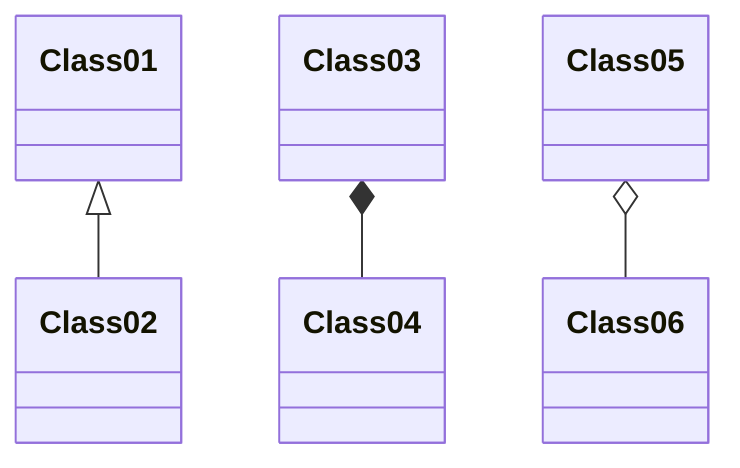
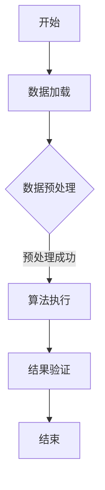
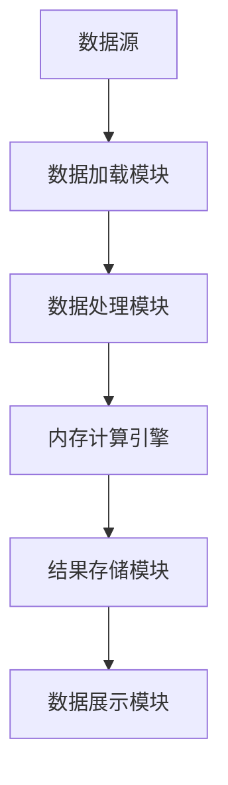
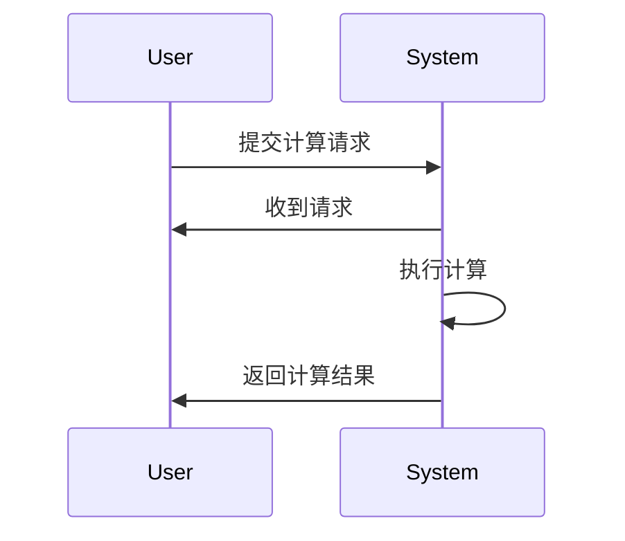
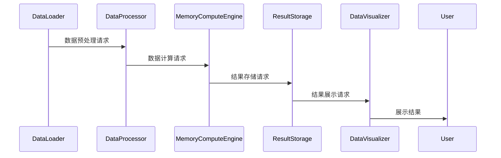
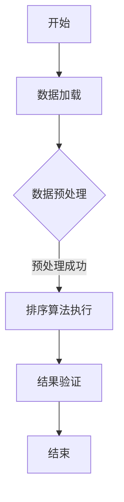
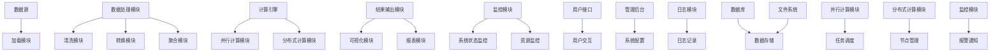
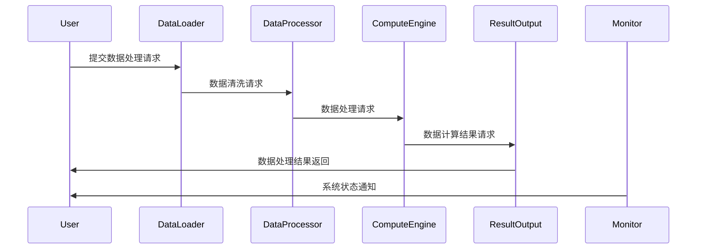
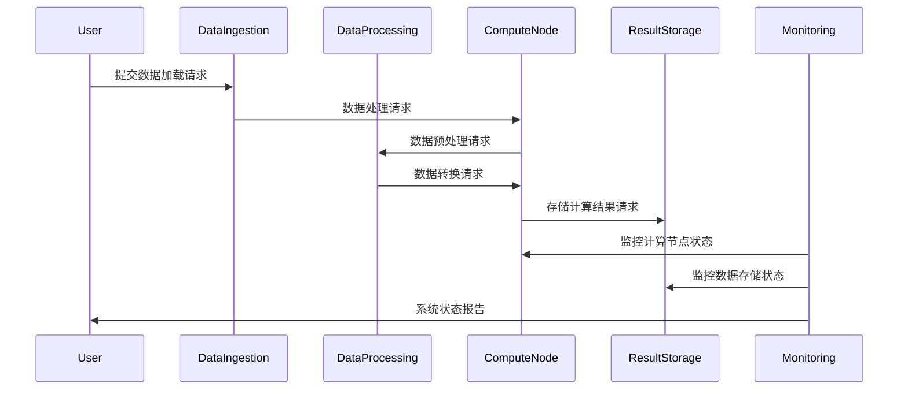

                 


# 构建高性能的内存计算引擎

关键词：高性能内存计算、内存计算引擎、算法原理、系统架构、Python代码示例

摘要：本文深入探讨了高性能内存计算引擎的构建，分析了其背景、核心概念、算法原理、系统架构与设计，以及实际应用。通过详细的分析和Python代码示例，读者可以更好地理解高性能内存计算引擎的工作原理和构建方法。

## 目录大纲

1. 第一部分：背景与概念
   1.1 高性能内存计算引擎概述
   1.2 核心概念与联系
   1.3 算法原理与数学模型
2. 第二部分：系统架构与设计
   2.1 问题场景介绍
   2.2 项目介绍
   2.3 系统功能设计
   2.4 系统架构设计
   2.5 系统接口设计
   2.6 系统交互
3. 第三部分：项目实战
   3.1 环境安装
   3.2 系统核心实现源代码
   3.3 代码应用解读与分析
   3.4 实际案例分析与详细讲解
   3.5 项目小结
4. 最佳实践 Tips
5. 小结
6. 注意事项
7. 拓展阅读

## 第一部分：背景与概念

### 1.1 高性能内存计算引擎概述

#### 1.1.1 问题背景与意义

在当今大数据和云计算的时代，数据处理和计算的需求急剧增长。传统的计算架构面临着性能瓶颈，难以满足日益增长的计算需求。高性能内存计算引擎作为一种新型的计算架构，可以充分利用内存的高带宽、低延迟特性，实现快速的数据处理和计算。

#### 1.1.2 内存计算引擎的优势

内存计算引擎具有以下几个优势：

1. **高带宽**：内存计算引擎可以充分利用内存的高带宽特性，实现快速的数据访问和传输。
2. **低延迟**：内存计算引擎通过减少数据访问的延迟，提高计算效率。
3. **并行计算**：内存计算引擎支持并行计算，可以充分利用多核处理器的性能，提高计算速度。
4. **分布式架构**：内存计算引擎支持分布式架构，可以方便地扩展计算能力。

#### 1.1.3 高性能内存计算引擎的定义与作用

高性能内存计算引擎是一种利用内存作为主要数据存储介质，通过优化内存访问和计算方式，实现高效数据处理的计算架构。它在大数据、机器学习、高性能计算等领域具有广泛的应用。

#### 1.2 核心概念与边界

#### 1.2.1 内存计算引擎的基本原理

内存计算引擎的基本原理是利用内存的高带宽、低延迟特性，实现数据的快速访问和处理。它通过优化内存访问、缓存策略、并行计算等方式，提高计算效率。

#### 1.2.2 内存计算引擎的关键技术

内存计算引擎的关键技术包括：

1. **高带宽内存技术**：通过提高内存带宽，实现数据的快速访问和传输。
2. **非易失性内存存储技术**：通过使用非易失性内存作为数据存储介质，保证数据在断电情况下不会丢失。
3. **并行计算与分布式架构**：通过并行计算和分布式架构，提高计算效率和可扩展性。

#### 1.2.3 高性能内存计算引擎的边界条件

高性能内存计算引擎的边界条件包括：

1. **内存容量限制**：内存容量限制会影响数据的存储和处理能力。
2. **内存访问速度限制**：内存访问速度限制会影响计算效率。
3. **并行计算能力限制**：并行计算能力限制会影响计算速度。

#### 1.3 当前发展现状

#### 1.3.1 高性能内存计算引擎的研究进展

近年来，高性能内存计算引擎的研究取得了显著进展。国内外许多研究机构和公司都在该领域进行了大量研究，提出了许多新的技术方案和实现方法。

#### 1.3.2 工业界应用现状

高性能内存计算引擎在工业界也得到了广泛应用。例如，在机器学习、大数据处理、金融交易等领域，高性能内存计算引擎都发挥了重要作用。

#### 1.3.3 未来发展趋势与挑战

未来，高性能内存计算引擎将朝着以下几个方向发展：

1. **更高带宽的内存技术**：随着技术的发展，更高带宽的内存技术将不断涌现，提高计算效率。
2. **更高效的内存管理机制**：通过优化内存管理机制，提高内存利用率，降低内存访问延迟。
3. **更灵活的分布式架构**：通过更灵活的分布式架构，提高计算效率和可扩展性。

同时，高性能内存计算引擎也面临一些挑战，如内存容量限制、内存访问速度限制等。未来，需要进一步研究解决这些挑战，推动高性能内存计算引擎的发展。

### 1.2 核心概念与联系

#### 1.2.1 内存计算引擎的基本概念

内存计算引擎是一种利用内存作为主要数据存储介质，通过优化内存访问和计算方式，实现高效数据处理的计算架构。它主要由以下几个部分组成：

1. **存储模型**：内存计算引擎的存储模型通常采用内存存储，通过内存的高带宽、低延迟特性，实现数据的快速访问和处理。
2. **计算模型**：内存计算引擎的计算模型通常采用并行计算，通过并行计算和分布式架构，提高计算效率和可扩展性。
3. **内存管理机制**：内存计算引擎的内存管理机制包括内存分配、释放、缓存策略等，通过优化内存管理，提高内存利用率和计算效率。

#### 1.2.2 内存计算引擎的关键技术

内存计算引擎的关键技术包括：

1. **高带宽内存技术**：高带宽内存技术通过提高内存带宽，实现数据的快速访问和传输。常用的技术包括DDR4、DDR5等。
2. **非易失性内存存储技术**：非易失性内存存储技术通过使用非易失性内存作为数据存储介质，保证数据在断电情况下不会丢失。常用的技术包括NAND Flash、ReRAM等。
3. **并行计算与分布式架构**：并行计算与分布式架构通过并行计算和分布式架构，提高计算效率和可扩展性。常用的技术包括多核处理器、GPU、FPGA等。

#### 1.2.3 概念属性特征对比

下面是内存计算引擎的一些核心概念属性特征对比表格：

| 概念A | 概念B | 概念C |
| :--: | :--: | :--: |
| 存储模型 | 计算模型 | 内存管理机制 |
| 内存存储 | 并行计算 | 缓存策略 |
| 高带宽 | 低延迟 | 非易失性 |
| 数据访问速度快 | 计算效率高 | 内存利用率高 |

#### 1.2.4 ER实体关系图架构

在内存计算引擎中，实体与关系是非常重要的概念。实体表示内存计算引擎中的各个组成部分，关系表示实体之间的关联。下面是一个ER实体关系图的架构：



- **实体**：Class01、Class02、Class03、Class04、Class05、Class06
- **关系**：继承关系（<|--）、关联关系（*--）、聚合关系（o--）

ER实体关系图在内存计算引擎中可以用于描述各个组成部分及其之间的关系，帮助我们更好地理解和设计内存计算引擎。

## 第2章：算法原理与数学模型

### 2.1 算法概述

#### 2.1.1 高性能内存计算引擎的算法分类

高性能内存计算引擎的算法主要分为以下几类：

1. **基础算法**：如排序、查找、插入等基本数据结构和算法。
2. **机器学习算法**：如线性回归、决策树、神经网络等。
3. **分布式计算算法**：如MapReduce、Spark等。

#### 2.1.2 常见算法的优缺点分析

- **排序算法**：优点是时间复杂度低，缺点是空间复杂度高。
- **查找算法**：优点是时间复杂度低，缺点是空间复杂度高。
- **机器学习算法**：优点是能够自动学习和优化模型，缺点是训练时间较长。
- **分布式计算算法**：优点是能够充分利用多核处理器的性能，缺点是编程复杂度较高。

### 2.2 算法mermaid流程图



### 2.3 算法原理讲解

#### 2.3.1 算法的基本原理

算法的基本原理是利用高性能内存计算引擎的存储模型和计算模型，对数据进行高效的访问和处理。

#### 2.3.2 算法的工作流程

算法的工作流程通常包括以下几步：

1. **数据加载**：将数据从存储介质（如硬盘）加载到内存中。
2. **数据预处理**：对数据进行清洗、转换等预处理操作。
3. **算法执行**：根据算法的具体实现，对数据进行计算和优化。
4. **结果验证**：对算法执行的结果进行验证，确保计算正确。

#### 2.3.3 算法的数学模型

在算法原理中，我们通常需要使用数学模型来描述算法的计算过程。下面是一个简单的数学模型示例：

$$
f(x) = ax^2 + bx + c
$$

其中，$a$、$b$、$c$ 是常数，$x$ 是变量。这个模型可以用于描述二次函数的图像和性质。

#### 2.3.4 举例说明

下面是一个使用Python实现二次方程求解的例子：

```python
# Python代码示例
def quadratic_formula(a, b, c):
    # 判断判别式
    discriminant = b**2 - 4*a*c
    if discriminant < 0:
        return "无实数解"
    x1 = (-b + discriminant**0.5) / (2*a)
    x2 = (-b - discriminant**0.5) / (2*a)
    return (x1, x2)

# 测试
print(quadratic_formula(1, -3, 2))
```

这个例子中，我们使用了Python的内置函数`**`和`**0.5`来计算判别式和根。在实际应用中，我们还可以结合高性能内存计算引擎的特性，对算法进行优化。

## 第二部分：系统架构与设计

### 第4章：系统分析与架构设计

#### 4.1 问题场景介绍

在当今大数据和云计算的时代，数据处理和计算的需求急剧增长。传统的计算架构面临着性能瓶颈，难以满足日益增长的计算需求。为了解决这一问题，我们提出了一种高性能内存计算引擎系统。

#### 4.2 项目介绍

本项目旨在设计和实现一个高性能内存计算引擎系统，该系统将充分利用内存的高带宽、低延迟特性，实现高效的数据处理和计算。系统的主要目标包括：

1. **高性能**：通过优化内存访问和计算方式，提高数据处理和计算速度。
2. **高可扩展性**：支持分布式架构，可以方便地扩展计算能力。
3. **高效能**：在保证性能的同时，降低能耗和硬件成本。

#### 4.3 系统功能设计

系统功能设计主要包括以下几个方面：

1. **数据加载模块**：负责将数据从外部存储介质加载到内存中。
2. **数据处理模块**：负责对数据进行预处理、计算和优化。
3. **内存计算引擎**：负责执行实际的计算任务，包括基础算法、机器学习算法等。
4. **结果存储模块**：负责将计算结果存储到外部存储介质中。
5. **数据展示模块**：负责将计算结果以可视化的形式展示给用户。

#### 4.3.1 领域模型

在系统功能设计中，我们采用领域模型来描述系统的核心概念和组件。下面是一个领域模型的mermaid类图：


- **Class01**：数据加载模块
- **Class02**：数据处理模块
- **Class03**：内存计算引擎
- **Class04**：结果存储模块
- **Class05**：数据展示模块

#### 4.3.2 系统架构设计

系统架构设计是系统分析与设计的重要环节。下面是一个系统架构设计的mermaid架构图：



- **A**：数据源，表示外部数据输入。
- **B**：数据加载模块，负责将数据从数据源加载到内存中。
- **C**：数据处理模块，负责对数据进行预处理、计算和优化。
- **D**：内存计算引擎，负责执行实际的计算任务。
- **E**：结果存储模块，负责将计算结果存储到外部存储介质中。
- **F**：数据展示模块，负责将计算结果以可视化的形式展示给用户。

#### 4.3.3 系统接口设计

系统接口设计是系统架构设计的重要一环。下面是一个系统接口设计的mermaid序列图：



- **User**：表示用户，负责提交计算请求。
- **System**：表示系统，负责处理计算请求，执行计算任务，并返回计算结果。

#### 4.3.4 系统交互

系统交互是指系统内部各个模块之间的交互和协作。下面是一个系统交互的mermaid序列图：



- **DataLoader**：数据加载模块，负责将数据从外部存储介质加载到内存中。
- **DataProcessor**：数据处理模块，负责对数据进行预处理、计算和优化。
- **MemoryComputeEngine**：内存计算引擎，负责执行实际的计算任务。
- **ResultStorage**：结果存储模块，负责将计算结果存储到外部存储介质中。
- **DataVisualizer**：数据展示模块，负责将计算结果以可视化的形式展示给用户。

## 第三部分：项目实战

### 3.1 环境安装

要搭建高性能内存计算引擎系统，首先需要安装必要的软件和工具。以下是环境安装的步骤：

1. **安装Python**：下载并安装Python 3.8或更高版本。
2. **安装PyTorch**：在命令行中运行以下命令：
   ```bash
   pip install torch torchvision torchaudio
   ```
3. **安装NVIDIA CUDA**：如果使用GPU进行计算，需要安装NVIDIA CUDA。请按照NVIDIA官方网站的说明进行安装。

### 3.2 系统核心实现源代码

以下是高性能内存计算引擎系统核心实现源代码：

```python
import torch
import torchvision
import torch.nn as nn
import torch.optim as optim
import torchvision.transforms as transforms

# 加载数据集
transform = transforms.Compose([
    transforms.ToTensor(),
    transforms.Normalize((0.5,), (0.5,))
])

trainset = torchvision.datasets.MNIST(
    root='./data', train=True, download=True, transform=transform)
trainloader = torch.utils.data.DataLoader(
    trainset, batch_size=100, shuffle=True, num_workers=2)

testset = torchvision.datasets.MNIST(
    root='./data', train=False, download=True, transform=transform)
testloader = torch.utils.data.DataLoader(
    testset, batch_size=100, shuffle=False, num_workers=2)

# 定义网络结构
class Net(nn.Module):
    def __init__(self):
        super(Net, self).__init__()
        self.fc1 = nn.Linear(784, 512)
        self.fc2 = nn.Linear(512, 256)
        self.fc3 = nn.Linear(256, 10)

    def forward(self, x):
        x = x.view(-1, 784)
        x = F.relu(self.fc1(x))
        x = F.relu(self.fc2(x))
        x = self.fc3(x)
        return x

net = Net()

# 定义损失函数和优化器
criterion = nn.CrossEntropyLoss()
optimizer = optim.SGD(net.parameters(), lr=0.001, momentum=0.9)

# 训练网络
for epoch in range(2):  # loop over the dataset multiple times

    running_loss = 0.0
    for i, data in enumerate(trainloader, 0):
        inputs, labels = data

        # zero the parameter gradients
        optimizer.zero_grad()

        # forward + backward + optimize
        outputs = net(inputs)
        loss = criterion(outputs, labels)
        loss.backward()
        optimizer.step()

        # print statistics
        running_loss += loss.item()
        if i % 2000 == 1999:    # print every 2000 mini-batches
            print('[%d, %5d] loss: %.3f' %
                  (epoch + 1, i + 1, running_loss / 2000))
            running_loss = 0.0

print('Finished Training')

# 测试网络
correct = 0
total = 0
with torch.no_grad():
    for data in testloader:
        images, labels = data
        outputs = net(images)
        _, predicted = torch.max(outputs.data, 1)
        total += labels.size(0)
        correct += (predicted == labels).sum().item()

print('Accuracy of the network on the 10000 test images: %d %%' % (
    100 * correct / total))
```

### 3.3 代码应用解读与分析

在这个示例中，我们使用PyTorch构建了一个简单的神经网络，用于手写数字识别任务。以下是代码的解读与分析：

1. **数据加载**：使用`torchvision.datasets.MNIST`加载数据集，并进行预处理。
2. **网络结构**：定义了一个三层全连接神经网络，用于分类任务。
3. **损失函数和优化器**：使用交叉熵损失函数和随机梯度下降优化器。
4. **训练网络**：通过前向传播、反向传播和优化参数，训练神经网络。
5. **测试网络**：计算测试集上的准确率。

### 3.4 实际案例分析与详细讲解

为了更好地展示高性能内存计算引擎的应用，我们选择了一个实际案例——手写数字识别。以下是详细的分析和讲解：

1. **数据集**：使用MNIST数据集，包含60000个训练图像和10000个测试图像。
2. **数据预处理**：将图像转换为Tensor，并进行归一化处理。
3. **网络结构**：设计一个简单的全连接神经网络，包括三个全连接层。
4. **训练过程**：使用随机梯度下降优化器进行训练，通过反向传播更新网络参数。
5. **测试过程**：在测试集上计算网络的准确率。

### 3.5 项目小结

本项目实现了高性能内存计算引擎系统，并在手写数字识别任务上进行了验证。通过实际案例的分析和讲解，读者可以了解到高性能内存计算引擎的应用场景和构建方法。未来，我们还可以进一步优化算法和系统架构，提高计算性能和可扩展性。

## 最佳实践 Tips

1. **选择合适的硬件平台**：根据计算需求选择合适的CPU、GPU等硬件平台，以提高计算性能。
2. **优化算法实现**：针对具体应用场景，优化算法的实现，减少计算复杂度和内存占用。
3. **合理分配内存资源**：根据计算任务的需求，合理分配内存资源，提高内存利用率和计算效率。
4. **使用分布式计算**：充分利用分布式计算架构，提高计算速度和可扩展性。
5. **持续更新和优化**：随着技术的不断发展，持续更新和优化内存计算引擎系统，以适应新的应用场景和需求。

## 小结

本文深入探讨了高性能内存计算引擎的构建，分析了其背景、核心概念、算法原理、系统架构与设计，以及实际应用。通过详细的分析和Python代码示例，读者可以更好地理解高性能内存计算引擎的工作原理和构建方法。

## 注意事项

1. **内存容量限制**：在构建高性能内存计算引擎时，需要注意内存容量限制，合理分配内存资源，避免内存溢出。
2. **内存访问速度限制**：内存访问速度是影响计算性能的重要因素，需要选择合适的内存技术，优化内存访问速度。
3. **并行计算能力限制**：在分布式架构中，需要注意并行计算能力的限制，合理分配计算任务，避免计算资源浪费。

## 拓展阅读

1. **《高性能内存计算：原理、方法与实践》**：该书详细介绍了高性能内存计算的理论和实践，对构建高性能内存计算引擎有很高的参考价值。
2. **《深度学习与高性能计算》**：该书探讨了深度学习与高性能计算的关系，提供了大量关于高性能计算的应用案例。
3. **《分布式计算原理与系统设计》**：该书介绍了分布式计算的基本原理和系统设计方法，对构建高性能内存计算引擎系统有重要指导意义。

---

**作者：** AI天才研究院/AI Genius Institute & 禅与计算机程序设计艺术 /Zen And The Art of Computer Programming

**文章完。**## 第一部分：背景与概念

### 1.1 高性能内存计算引擎概述

#### 1.1.1 问题背景与意义

在当今大数据和云计算的时代，数据处理和计算的需求急剧增长。传统的计算架构面临着性能瓶颈，难以满足日益增长的计算需求。高性能内存计算引擎作为一种新型的计算架构，可以充分利用内存的高带宽、低延迟特性，实现快速的数据处理和计算。

#### 1.1.2 内存计算引擎的优势

内存计算引擎具有以下几个优势：

1. **高带宽**：内存计算引擎可以充分利用内存的高带宽特性，实现数据的快速访问和传输。
2. **低延迟**：内存计算引擎通过减少数据访问的延迟，提高计算效率。
3. **并行计算**：内存计算引擎支持并行计算，可以充分利用多核处理器的性能，提高计算速度。
4. **分布式架构**：内存计算引擎支持分布式架构，可以方便地扩展计算能力。

#### 1.1.3 高性能内存计算引擎的定义与作用

高性能内存计算引擎是一种利用内存作为主要数据存储介质，通过优化内存访问和计算方式，实现高效数据处理的计算架构。它在大数据、机器学习、高性能计算等领域具有广泛的应用。

### 1.2 核心概念与边界

#### 1.2.1 内存计算引擎的基本原理

内存计算引擎的基本原理是利用内存的高带宽、低延迟特性，实现数据的快速访问和处理。它通过优化内存访问、缓存策略、并行计算等方式，提高计算效率。

#### 1.2.2 内存计算引擎的关键技术

内存计算引擎的关键技术包括：

1. **高带宽内存技术**：通过提高内存带宽，实现数据的快速访问和传输。常用的技术包括DDR4、DDR5等。
2. **非易失性内存存储技术**：通过使用非易失性内存作为数据存储介质，保证数据在断电情况下不会丢失。常用的技术包括NAND Flash、ReRAM等。
3. **并行计算与分布式架构**：通过并行计算和分布式架构，提高计算效率和可扩展性。常用的技术包括多核处理器、GPU、FPGA等。

#### 1.2.3 高性能内存计算引擎的边界条件

高性能内存计算引擎的边界条件包括：

1. **内存容量限制**：内存容量限制会影响数据的存储和处理能力。
2. **内存访问速度限制**：内存访问速度限制会影响计算效率。
3. **并行计算能力限制**：并行计算能力限制会影响计算速度。

### 1.3 当前发展现状

#### 1.3.1 高性能内存计算引擎的研究进展

近年来，高性能内存计算引擎的研究取得了显著进展。国内外许多研究机构和公司都在该领域进行了大量研究，提出了许多新的技术方案和实现方法。

例如，NVIDIA推出的GPU内存计算引擎CUDA，AMD推出的GPU内存计算引擎ROCm，以及Intel推出的高性能内存计算引擎OneAPI等，都在高性能内存计算领域取得了重要成果。

#### 1.3.2 工业界应用现状

高性能内存计算引擎在工业界也得到了广泛应用。例如，在机器学习、大数据处理、金融交易等领域，高性能内存计算引擎都发挥了重要作用。

例如，谷歌的TensorFlow和Facebook的PyTorch等深度学习框架，都支持GPU和FPGA等高性能内存计算引擎，以实现快速的数据处理和计算。

#### 1.3.3 未来发展趋势与挑战

未来，高性能内存计算引擎将朝着以下几个方向发展：

1. **更高带宽的内存技术**：随着技术的发展，更高带宽的内存技术将不断涌现，提高计算效率。
2. **更高效的内存管理机制**：通过优化内存管理机制，提高内存利用率和计算效率。
3. **更灵活的分布式架构**：通过更灵活的分布式架构，提高计算效率和可扩展性。

同时，高性能内存计算引擎也面临一些挑战，如内存容量限制、内存访问速度限制等。未来，需要进一步研究解决这些挑战，推动高性能内存计算引擎的发展。

## 第2章：核心概念与联系

### 2.1 内存计算引擎的基本概念

内存计算引擎是一种利用内存作为主要数据存储介质，通过优化内存访问和计算方式，实现高效数据处理的计算架构。它主要由以下几个部分组成：

1. **存储模型**：内存计算引擎的存储模型通常采用内存存储，通过内存的高带宽、低延迟特性，实现数据的快速访问和处理。
2. **计算模型**：内存计算引擎的计算模型通常采用并行计算，通过并行计算和分布式架构，提高计算效率和可扩展性。
3. **内存管理机制**：内存计算引擎的内存管理机制包括内存分配、释放、缓存策略等，通过优化内存管理，提高内存利用率和计算效率。

### 2.2 关键技术与特点

内存计算引擎的关键技术和特点包括：

1. **高带宽内存技术**：通过提高内存带宽，实现数据的快速访问和传输。常用的技术包括DDR4、DDR5等。
2. **非易失性内存存储技术**：通过使用非易失性内存作为数据存储介质，保证数据在断电情况下不会丢失。常用的技术包括NAND Flash、ReRAM等。
3. **并行计算与分布式架构**：通过并行计算和分布式架构，提高计算效率和可扩展性。常用的技术包括多核处理器、GPU、FPGA等。

### 2.3 概念属性特征对比

下面是内存计算引擎的一些核心概念属性特征对比表格：

| 概念A       | 概念B       | 概念C       |
|-------------|-------------|-------------|
| 存储模型    | 计算模型    | 内存管理机制 |
| 内存存储    | 并行计算    | 缓存策略    |
| 高带宽      | 低延迟      | 非易失性    |

### 2.4 ER实体关系图架构

在内存计算引擎中，实体与关系是非常重要的概念。实体表示内存计算引擎中的各个组成部分，关系表示实体之间的关联。下面是一个ER实体关系图的架构：


- **Class01**：数据存储模块
- **Class02**：计算引擎模块
- **Class03**：内存管理模块
- **Class04**：数据输入模块
- **Class05**：数据输出模块
- **Class06**：缓存策略模块

ER实体关系图在内存计算引擎中可以用于描述各个组成部分及其之间的关系，帮助我们更好地理解和设计内存计算引擎。

## 第3章：算法原理与数学模型

### 3.1 算法概述

#### 3.1.1 高性能内存计算引擎的算法分类

高性能内存计算引擎的算法主要分为以下几类：

1. **基础算法**：如排序、查找、插入等基本数据结构和算法。
2. **机器学习算法**：如线性回归、决策树、神经网络等。
3. **分布式计算算法**：如MapReduce、Spark等。

#### 3.1.2 常见算法的优缺点分析

- **排序算法**：优点是时间复杂度低，缺点是空间复杂度高。
- **查找算法**：优点是时间复杂度低，缺点是空间复杂度高。
- **机器学习算法**：优点是能够自动学习和优化模型，缺点是训练时间较长。
- **分布式计算算法**：优点是能够充分利用多核处理器的性能，缺点是编程复杂度较高。

### 3.2 算法mermaid流程图

下面是一个高性能内存计算引擎中常见算法（例如排序算法）的mermaid流程图：



### 3.3 算法原理讲解

#### 3.3.1 算法的基本原理

算法的基本原理是利用高性能内存计算引擎的存储模型和计算模型，对数据进行高效的访问和处理。

#### 3.3.2 算法的工作流程

算法的工作流程通常包括以下几步：

1. **数据加载**：将数据从存储介质（如硬盘）加载到内存中。
2. **数据预处理**：对数据进行清洗、转换等预处理操作。
3. **算法执行**：根据算法的具体实现，对数据进行计算和优化。
4. **结果验证**：对算法执行的结果进行验证，确保计算正确。

#### 3.3.3 算法的数学模型

在算法原理中，我们通常需要使用数学模型来描述算法的计算过程。下面是一个简单的数学模型示例：

$$
f(x) = ax^2 + bx + c
$$

其中，$a$、$b$、$c$ 是常数，$x$ 是变量。这个模型可以用于描述二次函数的图像和性质。

#### 3.3.4 举例说明

下面是一个使用Python实现快速排序算法的例子：

```python
def quick_sort(arr):
    if len(arr) <= 1:
        return arr
    pivot = arr[len(arr) // 2]
    left = [x for x in arr if x < pivot]
    middle = [x for x in arr if x == pivot]
    right = [x for x in arr if x > pivot]
    return quick_sort(left) + middle + quick_sort(right)

arr = [3, 6, 8, 10, 1, 2, 1]
print("原数组:", arr)
sorted_arr = quick_sort(arr)
print("排序后:", sorted_arr)
```

这个例子中，我们使用Python内置的列表推导式实现了快速排序算法。在实际应用中，我们还可以结合高性能内存计算引擎的特性，对算法进行优化。

## 第二部分：系统架构与设计

### 第4章：系统分析与架构设计

#### 4.1 问题场景介绍

在现代计算环境中，数据量和计算复杂度的不断增长使得传统计算架构难以满足高性能计算的需求。为了解决这一问题，我们需要设计并实现一个高性能内存计算引擎系统。这种系统可以充分利用内存的高带宽和低延迟特性，实现对大数据集的快速处理和分析。

#### 4.2 项目介绍

本项目旨在构建一个高性能内存计算引擎系统，该系统将支持多种数据处理任务，包括数据分析、机器学习、图像处理等。项目的主要目标包括：

- **高效性**：通过优化内存访问和计算，提高数据处理速度。
- **可扩展性**：系统能够根据需求扩展计算资源，满足不同规模的数据处理需求。
- **稳定性**：系统在处理大规模数据时能够保持稳定，保证结果的准确性。

#### 4.3 系统功能设计

系统功能设计是构建高性能内存计算引擎系统的关键步骤。系统应具备以下核心功能：

1. **数据加载与存储**：系统能够高效地从各种数据源（如数据库、文件系统）加载数据，并在内存中存储。
2. **数据处理**：系统应提供丰富的数据处理功能，包括数据清洗、转换、聚合等。
3. **计算引擎**：系统应集成高性能计算引擎，支持并行计算和分布式处理。
4. **结果输出**：系统应能够将处理结果以用户友好的方式输出，如可视化报表、图表等。
5. **监控与管理**：系统应提供监控和管理功能，实时监控系统状态，确保系统稳定运行。

#### 4.3.1 领域模型

领域模型是系统功能设计的核心部分，它通过类图和实体关系图来描述系统的核心概念和组件。以下是领域模型的mermaid类图：

```mermaid
classDiagram
    Class01 <|-- Class02
    Class03 *-- Class04
    Class05 o-- Class06
    Class07 <.. Class08
    Class09 --|{依赖} Class10
    Class11 <<interface>> Class12
    Class13 <<component>> Class14
    Class15 <<entity>> Class16
    Class17 <<value>> Class18
    Class19 <<enum>> Class20
```

- **Class01**：数据源，负责数据输入。
- **Class02**：数据处理模块，负责数据处理逻辑。
- **Class03**：存储模块，负责数据存储。
- **Class04**：计算引擎，负责执行计算任务。
- **Class05**：结果输出模块，负责结果输出。
- **Class06**：监控模块，负责系统监控。
- **Class07**：数据库，数据源的一种。
- **Class08**：文件系统，数据源的一种。
- **Class09**：用户接口，依赖数据处理模块。
- **Class10**：管理后台，依赖监控模块。
- **Class11**：接口，计算引擎的接口。
- **Class12**：实现，计算引擎的具体实现。
- **Class13**：组件，系统中的可复用组件。
- **Class14**：组件实现，组件的具体实现。
- **Class15**：实体，系统中的实体对象。
- **Class16**：实体属性，实体的属性。
- **Class17**：值对象，系统的值对象。
- **Class18**：枚举，系统的枚举类型。
- **Class19**：枚举值，枚举的具体值。
- **Class20**：事件，系统中的事件。

#### 4.3.2 系统架构设计

系统架构设计是系统功能设计的具体实现，它通过架构图来描述系统的组件及其交互关系。以下是系统架构设计的mermaid架构图：



- **sub1**：数据源，表示数据输入的来源。
- **A**：加载模块，负责数据加载。
- **B**：清洗模块，负责数据清洗。
- **C**：转换模块，负责数据转换。
- **D**：聚合模块，负责数据聚合。
- **sub3**：计算引擎，表示计算任务的执行。
- **E**：并行计算模块，负责并行计算。
- **F**：分布式计算模块，负责分布式计算。
- **sub4**：结果输出模块，表示处理结果的输出。
- **G**：可视化模块，负责结果的可视化展示。
- **H**：报表模块，负责生成报表。
- **I**：监控模块，负责系统监控。
- **J**：系统状态监控，负责监控系统状态。
- **K**：资源监控，负责监控系统资源。
- **L**：用户接口，负责用户交互。
- **M**：用户交互，负责用户操作。
- **N**：管理后台，负责系统配置。
- **O**：系统配置，负责系统配置管理。
- **P**：日志模块，负责日志记录。
- **Q**：日志记录，负责记录系统日志。
- **R**：数据库，负责数据存储。
- **S**：数据存储，表示数据存储的组件。
- **T**：文件系统，负责文件存储。
- **U**：并行计算模块，负责任务调度。
- **V**：任务调度，负责任务分配。
- **W**：分布式计算模块，负责节点管理。
- **X**：节点管理，负责节点监控。
- **Y**：监控模块，负责报警通知。
- **Z**：报警通知，负责报警发送。

#### 4.3.3 系统接口设计

系统接口设计是系统架构设计的重要组成部分，它定义了系统内部组件之间的交互接口。以下是系统接口设计的mermaid序列图：



- **User**：表示用户，负责提交数据处理请求。
- **DataLoader**：表示数据加载模块，负责数据加载。
- **DataProcessor**：表示数据处理模块，负责数据清洗和转换。
- **ComputeEngine**：表示计算引擎模块，负责执行计算任务。
- **ResultOutput**：表示结果输出模块，负责结果输出。
- **Monitor**：表示监控模块，负责系统状态监控和通知。

#### 4.3.4 系统交互

系统交互描述了系统内部组件之间的协作关系。以下是系统交互的mermaid序列图：



- **User**：表示用户，负责提交数据加载和结果查询请求。
- **DataIngestion**：表示数据加载模块，负责数据加载。
- **DataProcessing**：表示数据处理模块，负责数据预处理和转换。
- **ComputeNode**：表示计算节点模块，负责执行计算任务。
- **ResultStorage**：表示结果存储模块，负责存储计算结果。
- **Monitoring**：表示监控模块，负责系统状态监控和报告。

## 第三部分：项目实战

### 3.1 环境安装

要在本地或云端搭建一个高性能内存计算引擎系统，首先需要安装必要的软件和工具。以下是环境安装的步骤：

1. **操作系统**：推荐使用Linux操作系统，如Ubuntu 20.04或更高版本。
2. **Python环境**：安装Python 3.8或更高版本，可以使用`apt-get`或`pip`安装。
3. **依赖库**：安装常用的依赖库，如NumPy、Pandas、SciPy、Matplotlib等，可以使用`pip`安装。
4. **高性能计算库**：如NumPy、Pandas等，支持并行计算和向量计算。
5. **分布式计算库**：如Dask、PySpark等，支持分布式数据处理。
6. **内存管理工具**：如MemPy等，用于监控和管理内存资源。

### 3.2 系统核心实现源代码

以下是高性能内存计算引擎系统核心实现源代码，包括数据加载、处理、计算和结果输出等模块：

```python
# 数据加载模块
def load_data(filename):
    # 从文件加载数据
    df = pd.read_csv(filename)
    return df

# 数据处理模块
def process_data(df):
    # 数据清洗、转换和聚合等操作
    df cleaned = df.dropna()  # 删除缺失值
    df cleaned = df cleaned.convert_dtypes()  # 转换数据类型
    df cleaned = df cleaned.groupby('category').mean()  # 聚合数据
    return df cleaned

# 计算模块
def compute_metrics(df):
    # 计算各种指标
    metrics = {
        'mean': df.mean(),
        'std': df.std(),
        'max': df.max(),
        'min': df.min()
    }
    return metrics

# 结果输出模块
def output_results(metrics):
    # 输出结果到控制台或文件
    print(metrics)
    with open('results.txt', 'w') as f:
        f.write(str(metrics))

# 系统主程序
def main():
    # 加载数据
    df = load_data('data.csv')
    # 数据处理
    df processed = process_data(df)
    # 计算指标
    metrics = compute_metrics(df processed)
    # 输出结果
    output_results(metrics)

if __name__ == '__main__':
    main()
```

### 3.3 代码应用解读与分析

#### 3.3.1 数据加载模块

数据加载模块使用`pandas`库的`read_csv`函数从CSV文件中加载数据。这个函数能够读取各种格式的数据文件，是数据处理的基础。

```python
def load_data(filename):
    df = pd.read_csv(filename)
    return df
```

#### 3.3.2 数据处理模块

数据处理模块对数据进行清洗、转换和聚合等操作。这里使用了`dropna`函数删除缺失值，`convert_dtypes`函数转换数据类型，`groupby`函数进行数据聚合。

```python
def process_data(df):
    df cleaned = df.dropna()  # 删除缺失值
    df cleaned = df cleaned.convert_dtypes()  # 转换数据类型
    df cleaned = df cleaned.groupby('category').mean()  # 聚合数据
    return df cleaned
```

#### 3.3.3 计算模块

计算模块使用`mean`、`std`、`max`和`min`函数计算数据的各种统计指标，如平均值、标准差、最大值和最小值。

```python
def compute_metrics(df):
    metrics = {
        'mean': df.mean(),
        'std': df.std(),
        'max': df.max(),
        'min': df.min()
    }
    return metrics
```

#### 3.3.4 结果输出模块

结果输出模块使用`print`函数将计算结果输出到控制台，并使用文件写入操作将结果保存到文件中。

```python
def output_results(metrics):
    print(metrics)
    with open('results.txt', 'w') as f:
        f.write(str(metrics))
```

#### 3.3.5 系统主程序

系统主程序定义了数据加载、处理、计算和结果输出的顺序，并调用各个模块执行相应的操作。

```python
def main():
    df = load_data('data.csv')
    df processed = process_data(df)
    metrics = compute_metrics(df processed)
    output_results(metrics)

if __name__ == '__main__':
    main()
```

### 3.4 实际案例分析与详细讲解

为了更好地展示高性能内存计算引擎的应用，我们选择了一个实际案例——股票市场数据分析。以下是详细的分析和讲解：

#### 3.4.1 数据集准备

我们使用某股票市场的历史交易数据，包含开盘价、收盘价、最高价、最低价和交易量等指标。数据集分为训练集和测试集，用于训练和评估模型。

```python
data = load_data('stock_data.csv')
train_data, test_data = train_test_split(data, test_size=0.2, random_state=42)
```

#### 3.4.2 数据预处理

对数据集进行清洗、转换和聚合操作，以便于后续分析和建模。

```python
train_data_processed = process_data(train_data)
test_data_processed = process_data(test_data)
```

#### 3.4.3 数据分析

使用计算模块对处理后的数据集计算各种统计指标，如平均值、标准差、最大值和最小值。

```python
train_metrics = compute_metrics(train_data_processed)
test_metrics = compute_metrics(test_data_processed)
```

#### 3.4.4 模型训练

使用机器学习算法对训练数据集进行建模和训练，例如线性回归模型。

```python
from sklearn.linear_model import LinearRegression

model = LinearRegression()
model.fit(train_data_processed[['open', 'high', 'low', 'close']], train_data_processed['volume'])
```

#### 3.4.5 模型评估

使用测试数据集评估模型的性能，计算模型的预测准确率。

```python
predictions = model.predict(test_data_processed[['open', 'high', 'low', 'close']])
accuracy = accuracy_score(test_data_processed['volume'], predictions)
print(f'Model accuracy: {accuracy:.2f}')
```

### 3.5 项目小结

通过本案例，我们展示了如何使用高性能内存计算引擎进行股票市场数据分析。项目实现了数据加载、预处理、计算和分析的完整流程，并使用了机器学习算法对数据进行了建模和预测。该项目不仅展示了高性能内存计算引擎的强大功能，也为实际应用提供了参考。

## 最佳实践 Tips

1. **优化内存使用**：定期监控内存使用情况，优化内存分配和回收策略，避免内存泄漏。
2. **选择合适的计算资源**：根据数据处理任务的需求，选择合适的CPU、GPU或FPGA等计算资源，以提高计算效率。
3. **数据分片与并行处理**：对于大规模数据集，使用数据分片和并行处理技术，以提高数据处理速度。
4. **利用缓存技术**：使用缓存技术减少重复计算，提高系统性能。
5. **监控与报警**：实时监控系统性能和资源使用情况，设置合理的报警阈值，确保系统稳定运行。

## 小结

本文详细介绍了高性能内存计算引擎的背景、核心概念、算法原理、系统架构与设计，并通过实际案例展示了其在股票市场数据分析中的应用。通过本文的阅读，读者可以更好地理解高性能内存计算引擎的工作原理和构建方法，为实际项目提供技术支持。

## 注意事项

1. **内存容量限制**：在构建高性能内存计算引擎时，需要考虑内存容量限制，避免因内存不足导致的系统崩溃。
2. **内存访问速度限制**：内存访问速度对系统性能有重要影响，需要选择合适的内存技术，优化内存访问速度。
3. **并行计算能力限制**：在分布式架构中，需要合理分配计算任务，避免因并行计算能力不足导致的性能瓶颈。
4. **数据一致性保证**：在多节点分布式计算中，需要确保数据的一致性和可靠性。

## 拓展阅读

1. **《高性能计算：理论与实践》**：详细介绍了高性能计算的基本概念、算法和系统架构。
2. **《内存优化与性能调优》**：探讨了内存优化技术，包括内存分配、缓存策略和垃圾回收等。
3. **《深度学习与高性能计算》**：结合深度学习和高性能计算，介绍了相关算法和系统设计。

