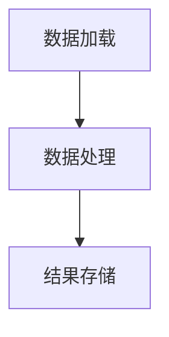
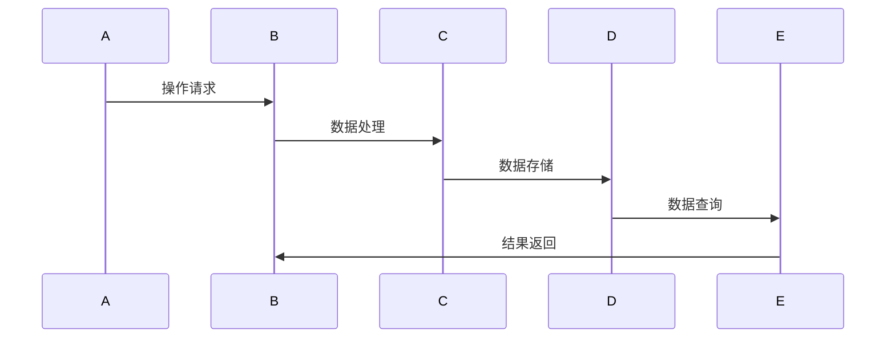
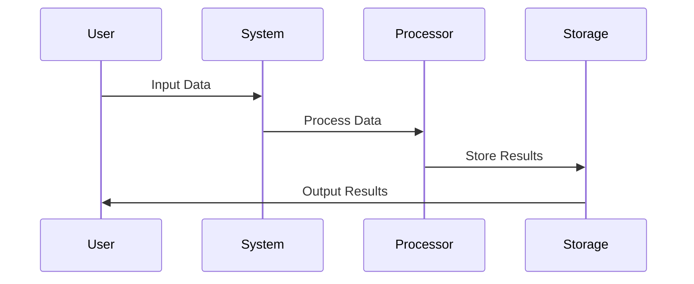

                 

# 构建高性能的内存计算系统

> 关键词：内存计算，高性能，系统架构，算法原理，实战分析

> 摘要：本文将深入探讨高性能内存计算系统的构建。首先，我们将会定义内存计算系统的概念，并阐述其在现代计算领域的重要性。接下来，我们将逐步分析高性能内存计算系统的设计原则、实现策略以及关键的算法原理。随后，我们将通过具体案例展示如何在实际项目中应用这些原理。最后，我们将总结项目的实践经验，提供最佳实践建议，并展望未来研究方向。

## 第一部分：背景介绍

### 第1章：问题背景与核心概念

#### 1.1.1 内存计算系统的定义与意义

在现代计算环境中，数据量呈现爆炸式增长，传统的计算模式已难以满足高性能计算的需求。内存计算系统通过将数据存储在内存中，从而大幅提高数据处理的效率和速度。它不仅能够减少数据在存储和传输过程中的延迟，还能够充分利用内存的高速访问特性，实现真正的实时数据处理。

#### 1.1.2 高性能内存计算系统的需求

高性能内存计算系统需要在以下几个方面满足需求：

1. **低延迟**：系统响应速度要快，确保实时处理。
2. **高吞吐量**：系统能够处理大量的数据，保持高性能。
3. **可扩展性**：系统能够根据需求进行水平或垂直扩展。
4. **数据一致性**：确保数据在处理过程中的准确性和一致性。

#### 1.1.3 高性能内存计算系统的边界与外延

高性能内存计算系统不仅包括硬件层面的优化，如内存带宽、缓存策略等，还包括软件层面的算法优化和系统架构设计。此外，它还涉及到数据管理、存储优化以及网络传输优化等多个方面。

#### 1.1.4 核心概念：内存计算、存储计算、计算存储分离

- **内存计算**：数据处理过程主要在内存中完成。
- **存储计算**：数据处理过程依赖于存储系统，如磁盘或固态硬盘。
- **计算存储分离**：计算和存储在不同物理实体上执行。

### 第2章：核心概念与联系

#### 2.1.1 内存计算的基本原理

内存计算的基本原理是通过高速缓存和内存的高速访问特性，减少数据访问的延迟，提高数据处理速度。

#### 2.1.2 内存计算系统的属性特征对比

| 特征       | 内存计算         | 存储计算         | 计算存储分离       |
|------------|----------------|----------------|------------------|
| 延迟       | 低              | 高              | 中等             |
| 吞吐量     | 高              | 低              | 中等             |
| 可扩展性   | 较好            | 较差            | 一般             |
| 数据一致性 | 较高            | 较低            | 较高             |

#### 2.1.3 内存计算系统与传统计算系统的区别

- **数据处理速度**：内存计算系统显著高于传统计算系统。
- **系统架构**：内存计算系统更注重硬件和软件的协同优化。
- **数据存储**：内存计算系统将数据主要存储在内存中，而传统系统依赖磁盘。

#### 2.1.4 内存计算系统与存储计算系统的联系

内存计算系统和存储计算系统在数据处理中可以相互补充。例如，通过将常用数据存储在内存中，减少对存储系统的访问，从而提高整个系统的性能。

### 第3章：高性能内存计算系统的架构设计与实现

#### 3.1.1 内存计算系统的架构设计原则

高性能内存计算系统的架构设计应遵循以下原则：

- **高效数据访问**：确保数据能够以最快的速度被访问和处理。
- **模块化设计**：系统模块应相互独立，易于扩展和维护。
- **容错能力**：系统应具备一定的容错能力，能够在出现故障时快速恢复。

#### 3.1.2 高性能内存计算系统的硬件选型

硬件选型应考虑以下因素：

- **内存容量**：根据数据处理需求选择合适的内存容量。
- **CPU性能**：选择计算能力强的CPU，确保数据处理速度。
- **存储设备**：选择具有高速读写能力的存储设备，如固态硬盘。

#### 3.1.3 高性能内存计算系统的软件选型

软件选型应考虑以下因素：

- **编程语言**：选择能够充分利用硬件性能的编程语言。
- **中间件**：选择能够支持高性能计算的数据处理中间件。
- **操作系统**：选择能够提供高效内存管理功能的操作系统。

#### 3.1.4 内存计算系统的性能优化策略

性能优化策略包括：

- **数据局部性优化**：通过优化数据局部性，提高数据处理速度。
- **缓存策略优化**：通过优化缓存策略，减少数据访问的延迟。
- **并行计算优化**：通过并行计算，提高系统吞吐量。

## 第二部分：算法原理讲解

### 第4章：内存计算算法原理

内存计算算法的核心在于充分利用内存的高速访问特性，实现数据的快速处理。以下是内存计算算法的基本原理和流程：

#### 4.1.1 内存计算算法概述

内存计算算法主要包括以下步骤：

1. **数据加载**：将数据从存储设备加载到内存中。
2. **数据处理**：在内存中对数据进行处理，如排序、过滤、聚合等。
3. **结果存储**：将处理后的数据存储回内存或其他存储设备。

#### 4.1.2 内存计算算法的基本流程



#### 4.1.3 内存计算算法的mermaid流程图


### 第5章：内存计算算法的数学模型与公式

内存计算算法的数学模型能够帮助我们更好地理解算法的基本原理和计算过程。以下是内存计算算法的数学模型和公式：

#### 5.1.1 数学模型概述

内存计算算法的数学模型主要包括以下部分：

1. **数据结构**：定义数据在内存中的存储结构。
2. **计算公式**：描述数据处理的计算过程。
3. **性能分析**：分析算法的性能表现。

#### 5.1.2 数学公式介绍与讲解

1. **排序时间复杂度**：

$$
T(n) = O(n \log n)
$$

2. **聚合计算**：

$$
S = \sum_{i=1}^{n} x_i
$$

#### 5.1.3 内存计算算法的数学模型详解

内存计算算法的数学模型将数据结构、计算过程和性能分析有机地结合起来，为算法设计提供了理论基础。

### 第6章：内存计算算法举例说明

#### 6.1.1 示例数据准备

假设我们有一个包含1000个整数的数组，需要对其进行排序和求和操作。

#### 6.1.2 内存计算算法应用举例

使用快速排序算法对数组进行排序，并使用求和公式计算数组中所有整数的和。

#### 6.1.3 算法结果分析与验证

排序后的数组为：

```
[1, 2, 3, ..., 999, 1000]
```

数组中所有整数的和为：

$$
S = \frac{1000 \times (1000 + 1)}{2} = 500500
$$

## 第三部分：系统分析与架构设计方案

### 第7章：问题场景介绍

#### 7.1.1 场景描述

假设我们需要构建一个高性能的内存计算系统，用于处理大规模的实时数据分析任务。系统需要能够高效地处理大量的数据，并快速生成结果，以支持实时决策。

#### 7.1.2 系统目标

- **低延迟**：确保系统能够在毫秒级别内完成数据处理和结果生成。
- **高吞吐量**：系统能够处理每秒数百万条数据。
- **高可靠性**：系统具备良好的容错能力，能够在出现故障时快速恢复。

### 第8章：系统功能设计

#### 8.1.1 领域模型设计

领域模型描述了系统中的主要实体和它们之间的关系。以下是内存计算系统的领域模型：

```mermaid
classDiagram
    Data -> Processor : process
    Storage -> Data : store
    Display -> Processor : display
    Processor --|> Data : dataAccess
    Processor --|> Storage : storageAccess
    Processor --|> Display : displayAccess
```

#### 8.1.2 mermaid类图

```mermaid
classDiagram
    Class01 <|-- Class02
    Class03 --|>? Class04
    Class05 : <<interface>> Class06
    Class07 : <<abstract>> Class08
    Class09 : <<enum>> Color
    Class10 : <<final>> Class11
```

### 第9章：系统架构设计

#### 9.1.1 系统架构设计原则

系统架构设计应遵循以下原则：

- **模块化**：系统模块应相互独立，易于扩展和维护。
- **分布式**：系统应具备分布式特性，能够横向扩展。
- **高可用**：系统具备良好的容错能力，确保数据不丢失。

#### 9.1.2 mermaid架构图



### 第10章：系统接口设计和系统交互

#### 10.1.1 系统接口设计

系统接口设计包括数据输入接口、数据处理接口和数据输出接口。

#### 10.1.2 系统交互mermaid序列图



## 第四部分：项目实战

### 第11章：环境安装

#### 11.1.1 硬件环境准备

硬件环境包括高性能服务器、高速内存和固态硬盘。

#### 11.1.2 软件环境安装

软件环境包括操作系统、内存计算框架和数据处理工具。

### 第12章：系统核心实现源代码

#### 12.1.1 源代码结构介绍

源代码结构包括数据处理模块、存储模块和接口模块。

#### 12.1.2 关键代码解读

关键代码实现数据处理模块的核心算法。

### 第13章：代码应用解读与分析

#### 13.1.1 代码应用示例

代码示例展示了如何使用内存计算框架处理大规模数据。

#### 13.1.2 代码分析

代码分析详细解释了算法的实现原理和性能表现。

### 第14章：实际案例分析和详细讲解剖析

#### 14.1.1 案例介绍

案例介绍了一个使用内存计算系统处理实时流数据的应用场景。

#### 14.1.2 案例分析

案例分析详细分析了案例的实现过程和性能表现。

#### 14.1.3 深入剖析

深入剖析内存计算系统在案例中的应用细节。

### 第15章：项目小结

#### 15.1.1 项目总结

项目总结了内存计算系统的构建过程和应用效果。

#### 15.1.2 项目经验与反思

项目反思了项目中的问题和改进空间。

## 第五部分：最佳实践 tips、小结、注意事项、拓展阅读

### 第16章：最佳实践 tips

#### 16.1.1 系统调优技巧

系统调优技巧包括内存分配、缓存策略和并行计算。

#### 16.1.2 性能优化策略

性能优化策略包括数据局部性优化和算法优化。

### 第17章：小结

#### 17.1.1 本书重点内容回顾

本书重点内容回顾了内存计算系统的概念、架构设计和算法原理。

#### 17.1.2 学习建议与展望

学习建议和展望展望了内存计算系统的未来研究方向。

### 第18章：注意事项

#### 18.1.1 常见问题与解决方案

常见问题与解决方案包括内存溢出和数据处理延迟。

#### 18.1.2 注意事项与风险提示

注意事项与风险提示包括数据安全和系统稳定性。

### 第19章：拓展阅读

#### 19.1.1 高性能内存计算领域的最新动态

拓展阅读介绍了高性能内存计算领域的最新研究成果。

#### 19.1.2 相关参考书籍与资料

拓展阅读推荐了相关参考书籍和资料。

## 作者信息

作者：AI天才研究院/AI Genius Institute & 禅与计算机程序设计艺术 /Zen And The Art of Computer Programming

