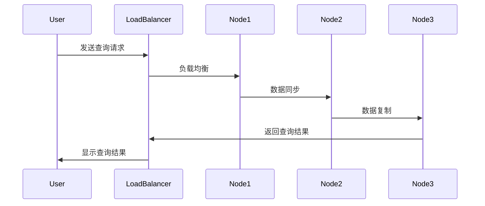
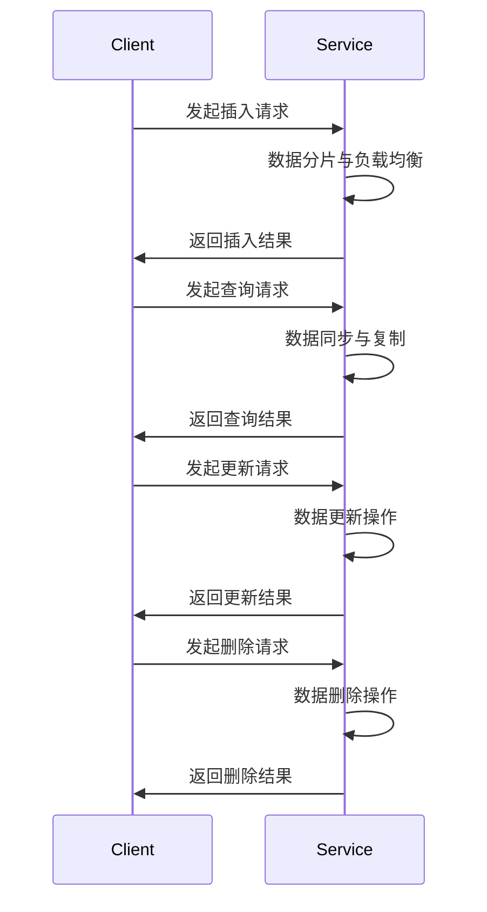

                 

# 第一部分：背景与概述

## 文章标题：构建高性能的分布式数据处理系统

## 关键词：分布式数据处理、系统架构、性能优化、数据一致性、事务处理

## 摘要：
本文将深入探讨分布式数据处理系统的构建，从背景介绍、核心概念讲解、系统设计与实现、项目实战和最佳实践等方面，逐步解析分布式数据处理系统的构建过程与优化策略。通过详细的分析与讲解，帮助读者理解分布式数据处理系统的高性能实现方法，为实际项目提供参考和指导。

### 目录大纲

1. 第一部分：背景与概述
   1.1 分布式数据处理系统概述
   1.2 分布式数据处理核心原理
   1.3 系统设计与实现
   1.4 项目实战
   1.5 最佳实践与拓展

### 1.1 分布式数据处理系统概述

**背景介绍：**

随着互联网的快速发展，数据规模和复杂性不断增长，传统的集中式数据处理系统已经无法满足现代应用的需求。分布式数据处理系统应运而生，它通过将数据处理任务分解到多个节点上并行执行，提高了系统的性能、可靠性和可扩展性。

**问题背景：**

- 数据量庞大：随着数据源的多样性和数据生成速度的加快，数据量呈现指数级增长。
- 复杂性增加：数据的种类和格式日益多样化，对数据处理系统提出了更高的要求。
- 性能瓶颈：集中式数据处理系统在面对大规模数据时，往往出现性能瓶颈，无法满足实时处理需求。

**分布式数据处理的重要性：**

- **性能提升：**分布式数据处理系统可以将数据并行处理，显著提高数据处理速度。
- **高可用性：**通过节点冗余和数据复制，分布式系统可以保证在部分节点故障时仍然正常运行。
- **可扩展性：**分布式系统可以根据需求动态增加节点，实现水平扩展。

**问题描述：**

分布式数据处理系统面临的主要问题包括数据分片、负载均衡、数据一致性、事务处理、数据同步和复制等。

**问题解决：**

分布式数据处理系统通过以下核心组件实现高性能处理：

- **数据分片与负载均衡：**将大数据集划分为多个小数据集，分布到不同的节点上处理，实现负载均衡。
- **数据一致性模型：**确保分布式系统中的数据在多节点间保持一致，常见的模型有强一致性和最终一致性。
- **分布式事务处理：**在分布式环境中实现事务的原子性和一致性。
- **数据同步与复制：**确保数据在多个节点间的实时同步，提高系统的可用性和可靠性。
- **分布式调度与任务分配：**合理调度任务，确保系统资源得到充分利用。
- **分布式锁机制：**在分布式环境中实现数据访问的同步控制。

**边界与外延：**

- **分布式处理与集中式处理的区别：**分布式处理通过节点间的协作实现任务并行处理，而集中式处理则在单台设备上完成。
- **分布式数据处理的应用领域：**广泛应用于互联网、金融、医疗、物联网等领域。

**核心概念与联系：**

- **分布式系统的基础概念：**包括节点、通信协议、一致性算法等。
- **分布式数据处理的关键技术：**包括数据分片、负载均衡、数据一致性、事务处理等。

**本章小结：**

本章概述了分布式数据处理系统的背景、重要性、问题及其解决方案。为后续章节的内容奠定了基础，帮助读者对分布式数据处理系统有一个整体的认识。

### 总结

通过本文的概述部分，我们了解了分布式数据处理系统的背景和重要性，明确了系统面临的主要问题和解决方案。在接下来的章节中，我们将深入探讨分布式数据处理系统的核心原理、系统设计与实现、项目实战以及最佳实践，帮助读者全面掌握分布式数据处理系统的构建方法和优化策略。希望本文能为读者在分布式数据处理领域的探索提供有益的参考和指导。

---

### 1.2 分布式数据处理核心原理

**背景介绍：**

分布式数据处理系统之所以能够应对大数据时代的挑战，得益于其核心原理的有效设计和实施。理解这些核心原理对于构建高性能、高可用的分布式数据处理系统至关重要。本文将详细解析数据分片与负载均衡、数据一致性模型、分布式事务处理、数据同步与复制、分布式调度与任务分配以及分布式锁机制，帮助读者深入掌握分布式数据处理系统的关键技术。

**核心概念与联系：**

- **数据分片与负载均衡：**数据分片是将大数据集划分为多个小数据集，分布到不同节点处理，以实现负载均衡。常见的分片策略包括哈希分片、范围分片和列表分片。
- **数据一致性模型：**数据一致性是指系统中的数据在多节点间保持一致。常见的一致性模型有强一致性、最终一致性和因果一致性。
- **分布式事务处理：**分布式事务处理确保分布式环境中的数据操作原子性和一致性。常见的分布式事务处理协议有两阶段提交（2PC）和最终一致性事务模型。
- **数据同步与复制：**数据同步与复制确保多个节点间的数据保持一致。同步复制保证数据的实时一致性，而异步复制提高系统的性能和容错能力。
- **分布式调度与任务分配：**分布式调度与任务分配负责合理调度任务，确保系统资源得到充分利用。常见的调度算法包括工作负载平衡、任务依赖调度等。
- **分布式锁机制：**分布式锁机制在分布式环境中实现数据访问的同步控制，防止并发冲突。常见的分布式锁实现包括基于数据库的锁、基于内存的锁和基于ZooKeeper的锁。

**核心概念属性特征对比表格：**

| 核心概念     | 定义                                                     | 属性特征对比                           |
| ------------ | -------------------------------------------------------- | ------------------------------------ |
| 数据分片     | 将大数据集划分为多个小数据集                             | 哈希分片 vs 范围分片 vs 列表分片      |
| 数据一致性   | 系统中的数据在多节点间保持一致                           | 强一致性 vs 最终一致性 vs 因果一致性   |
| 分布式事务   | 确保分布式环境中的数据操作原子性和一致性                 | 两阶段提交 vs 最终一致性事务模型      |
| 数据同步与复制 | 确保多个节点间的数据保持一致                             | 同步复制 vs 异步复制                  |
| 分布式调度   | 合理调度任务，确保系统资源得到充分利用                   | 工作负载平衡 vs 任务依赖调度          |
| 分布式锁机制 | 在分布式环境中实现数据访问的同步控制                     | 基于数据库的锁 vs 基于内存的锁 vs ZooKeeper的锁 |

**ER实体关系图架构：**

```mermaid
erDiagram
  Node --> Data: {数据分片}
  Node --> LoadBalancer: {负载均衡}
  Data --> Replication: {数据同步与复制}
  Data --> ConsistencyModel: {数据一致性模型}
  Data --> Transaction: {分布式事务处理}
  Data --> Scheduler: {分布式调度与任务分配}
  Data --> Lock: {分布式锁机制}
```

**算法原理讲解：**

**数据分片算法原理：**

数据分片是将大数据集划分为多个小数据集，分布到不同节点处理。常见的分片算法有哈希分片和范围分片。

1. **哈希分片：**
   - 将数据键通过哈希函数映射到不同的节点。
   - 哈希函数可以保证数据的均匀分布。
   - 分片策略：` shard(key) = hash(key) % numShards`
   - **Python代码示例：**
     ```python
     import hashlib

     def shard(key, num_shards):
         return int(hashlib.md5(key.encode('utf-8')).hexdigest(), 16) % num_shards
     ```

2. **范围分片：**
   - 将数据按范围划分到不同的节点。
   - 每个节点负责一定范围内的数据。
   - 分片策略：` shard_range(start, end, num_shards)`
   - **Python代码示例：**
     ```python
     def shard_range(start, end, num_shards):
         step = (end - start) // num_shards
         return [(start + i * step, start + (i + 1) * step) for i in range(num_shards)]
     ```

**负载均衡算法原理：**

负载均衡是将处理任务均匀分配到不同的节点，以充分利用系统资源。常见的负载均衡算法有轮询算法、最少连接算法和加权轮询算法。

1. **轮询算法：**
   - 按顺序将任务分配到各个节点。
   - **Python代码示例：**
     ```python
     import itertools

     def round_robin(nodes, tasks):
         return itertools.cycle(itertools.chain.from_iterable(tasks[i % len(nodes)] for i in range(len(tasks))))
     ```

2. **最少连接算法：**
   - 将任务分配到当前连接数最少的节点。
   - **Python代码示例：**
     ```python
     from collections import defaultdict

     def least_connections(nodes, tasks):
         connections = defaultdict(int)
         for node in nodes:
             connections[node] = sum(1 for _ in tasks[node])
         return min(connections, key=connections.get)
     ```

3. **加权轮询算法：**
   - 根据节点的权重分配任务。
   - **Python代码示例：**
     ```python
     import itertools

     def weighted_round_robin(nodes, weights, tasks):
         total_weight = sum(weights)
         return itertools.cycle(itertools.chain.from_iterable(tasks[i] for i in range(len(nodes)) for _ in range(weights[i] * total_weight // len(tasks))))
     ```

**数据一致性模型原理：**

数据一致性模型确保系统中的数据在多节点间保持一致。常见的一致性模型有强一致性、最终一致性和因果一致性。

1. **强一致性：**
   - 数据在所有节点上都是一致的，但可能牺牲一些性能。
   - **Python代码示例：**
     ```python
     def strong_consistency(data, nodes):
         for node in nodes:
             node.update(data)
     ```

2. **最终一致性：**
   - 数据最终会达到一致，但过程中可能存在短暂的不一致性。
   - **Python代码示例：**
     ```python
     import time

     def eventual_consistency(data, nodes, timeout=10):
         start_time = time.time()
         while time.time() - start_time < timeout:
             for node in nodes:
                 if node.get_data() != data:
                     time.sleep(1)
                     break
             else:
                 return
         raise Exception("Failed to achieve eventual consistency")
     ```

3. **因果一致性：**
   - 保持数据的因果顺序，但不要求全局一致性。
   - **Python代码示例：**
     ```python
     def causal_consistency(data, nodes):
         causality = [(node, data) for node in nodes]
         for node, _ in causality:
             node.update(data)
     ```

**分布式事务处理原理：**

分布式事务处理确保分布式环境中的数据操作原子性和一致性。常见的分布式事务处理协议有两阶段提交（2PC）和最终一致性事务模型。

1. **两阶段提交（2PC）：**
   - 分为准备阶段和提交阶段，确保分布式事务的原子性。
   - **Python代码示例：**
     ```python
     def prepare_phase(data, nodes):
         for node in nodes:
             node.prepare(data)

     def submit_phase(data, nodes):
         for node in nodes:
             node.submit(data)
     ```

2. **最终一致性事务模型：**
   - 事务中的操作最终达到一致性，但不要求在操作执行时保持一致性。
   - **Python代码示例：**
     ```python
     import time

     def eventual_consistency_transaction(data, nodes):
         start_time = time.time()
         while time.time() - start_time < timeout:
             for node in nodes:
                 node.execute(data)
             time.sleep(1)
             if all(node.get_result() == data for node in nodes):
                 return
         raise Exception("Failed to execute eventual consistency transaction")
     ```

**数据同步与复制原理：**

数据同步与复制确保多个节点间的数据保持一致。常见的同步复制和异步复制策略。

1. **同步复制：**
   - 确保数据在多个节点上实时一致。
   - **Python代码示例：**
     ```python
     def synchronous_replication(data, nodes):
         for node in nodes:
             node.update(data)
     ```

2. **异步复制：**
   - 提高系统的性能和容错能力。
   - **Python代码示例：**
     ```python
     import threading

     def asynchronous_replication(data, nodes):
         def replicate(node):
             time.sleep(1)  # 模拟异步复制延迟
             node.update(data)

         threads = [threading.Thread(target=replicate, args=(node,)) for node in nodes]
         for thread in threads:
             thread.start()
         for thread in threads:
             thread.join()
     ```

**分布式调度与任务分配原理：**

分布式调度与任务分配负责合理调度任务，确保系统资源得到充分利用。常见的调度算法有工作负载平衡和任务依赖调度。

1. **工作负载平衡：**
   - 将任务分配到负载最轻的节点。
   - **Python代码示例：**
     ```python
     def workload_balance(tasks, nodes):
         node Loads = {node: 0 for node in nodes}
         for task in tasks:
             node = min(Loads, key=Loads.get)
             nodes[node].enqueue(task)
             Loads[node] += 1
     ```

2. **任务依赖调度：**
   - 根据任务的依赖关系调度执行。
   - **Python代码示例：**
     ```python
     def dependency_schedule(dependencies, tasks):
         completed = set()
         for task in tasks:
             if all(dep in completed for dep in dependencies[task]):
                 completed.add(task)
         return completed
     ```

**分布式锁机制原理：**

分布式锁机制在分布式环境中实现数据访问的同步控制，防止并发冲突。常见的分布式锁实现有基于数据库的锁、基于内存的锁和基于ZooKeeper的锁。

1. **基于数据库的锁：**
   - 使用数据库的行级锁实现分布式锁。
   - **Python代码示例：**
     ```python
     def db_lock(connection, table, key):
         with connection.cursor() as cursor:
             cursor.execute(f"SELECT * FROM {table} WHERE key = {key} FOR UPDATE")
             return cursor.fetchone() is not None
     ```

2. **基于内存的锁：**
   - 使用内存中的锁实现分布式锁。
   - **Python代码示例：**
     ```python
     import threading

     lock = threading.Lock()

     def in_memory_lock(key):
         with lock:
             # 执行关键代码
     ```

3. **基于ZooKeeper的锁：**
   - 使用ZooKeeper实现分布式锁。
   - **Python代码示例：**
     ```python
     from kazoo.client import KazooClient

     zk = KazooClient(hosts='zookeeper:2181')

     def zookeeper_lock(zk, path):
         zk.create(path, ephemeral=True)
         while True:
             if zk.exists(path):
                 return True
             zk.create(path, ephemeral=True)
     ```

**本章小结：**

本章详细讲解了分布式数据处理系统的核心原理，包括数据分片与负载均衡、数据一致性模型、分布式事务处理、数据同步与复制、分布式调度与任务分配以及分布式锁机制。通过Python代码示例和算法原理讲解，读者可以更好地理解这些核心概念，为后续的系统设计与实现打下坚实的基础。在下一章中，我们将进一步探讨分布式数据处理系统的具体实现方法，包括系统架构设计和项目实战。

### 总结

本章详细解析了分布式数据处理系统的核心原理，包括数据分片与负载均衡、数据一致性模型、分布式事务处理、数据同步与复制、分布式调度与任务分配以及分布式锁机制。通过Python代码示例和算法原理讲解，读者可以深入理解这些核心概念，为后续的系统设计与实现打下坚实的基础。在下一章中，我们将进一步探讨分布式数据处理系统的具体实现方法，包括系统架构设计和项目实战。希望本章的内容能够为读者在分布式数据处理领域的探索提供有益的指导。

---

### 1.3 系统设计与实现

**背景介绍：**

在了解了分布式数据处理系统的核心原理后，接下来我们将探讨如何设计并实现一个分布式数据处理系统。本文将介绍系统功能设计、系统架构设计、数据流设计、系统接口设计和系统交互设计，帮助读者理解分布式数据处理系统的实现过程。

**项目介绍：**

本项目旨在构建一个高性能的分布式数据处理系统，用于处理大规模数据集，支持高并发、高可用性和高可扩展性。系统将支持数据分片、负载均衡、数据同步与复制、分布式事务处理等功能，并提供简单的API接口供外部系统调用。

**系统功能设计：**

系统功能设计主要包括以下几个方面：

1. **数据分片与负载均衡：**系统支持自动数据分片和负载均衡，确保数据在各节点上均匀分布，提高系统性能。
2. **数据同步与复制：**系统支持数据在节点间的实时同步与复制，确保数据的一致性和可靠性。
3. **分布式事务处理：**系统支持分布式事务处理，确保跨节点的数据操作一致性和原子性。
4. **数据查询与检索：**系统提供简单的API接口，支持数据查询和检索操作，方便外部系统调用。
5. **监控与报警：**系统集成监控和报警功能，实时监控系统运行状态，及时发现和处理潜在问题。

**系统功能设计（领域模型类图）：**

```mermaid
classDiagram
  Node <<class>> {
    id : int
    hostname : string
    status : string
  }
  Shard <<class>> {
    id : int
    shard_key : string
    node_id : int
    status : string
  }
  LoadBalancer <<class>> {
    id : int
    strategy : string
  }
  Replication <<class>> {
    id : int
    replication_factor : int
    sync_strategy : string
  }
  Transaction <<class>> {
    id : int
    status : string
  }
  Query <<class>> {
    id : int
    query : string
  }
  Monitor <<class>> {
    id : int
    alert_policy : string
  }
  Node --|> Shard: {分片}
  LoadBalancer --|> Node: {节点}
  Replication --|> Shard: {同步与复制}
  Transaction --|> Shard: {事务}
  Query --|> Shard: {查询}
  Monitor --|> Node: {监控}
```

**系统架构设计：**

系统架构设计主要包括以下几个组件：

1. **节点（Node）：**系统的基础组件，负责处理数据分片和任务分配。
2. **负载均衡器（LoadBalancer）：**负责均衡分配任务到不同的节点。
3. **数据分片（Shard）：**将数据集划分为多个小数据集，分布到不同节点处理。
4. **数据同步与复制（Replication）：**确保数据在各节点间保持一致。
5. **分布式事务处理（Transaction）：**确保跨节点的数据操作一致性和原子性。
6. **查询接口（Query）：**提供数据查询和检索功能。
7. **监控系统（Monitor）：**实时监控系统运行状态，提供报警功能。

**系统架构设计（架构图）：**



**数据流设计：**

数据流设计描述了数据在系统中的处理流程。主要包括以下几个步骤：

1. **数据输入：**外部系统将数据发送到负载均衡器。
2. **负载均衡：**负载均衡器根据策略将数据分配到不同的节点。
3. **数据分片：**节点将数据划分为多个小数据集，进行数据分片。
4. **数据处理：**节点对分片后的数据进行处理，如查询、更新等。
5. **数据同步与复制：**节点之间进行数据同步与复制，确保数据一致性。
6. **数据输出：**最终结果返回给外部系统。

**系统接口设计：**

系统接口设计主要包括以下API接口：

1. **数据插入（insert）：**用于向系统中插入数据。
2. **数据查询（query）：**用于查询系统中的数据。
3. **数据更新（update）：**用于更新系统中的数据。
4. **数据删除（delete）：**用于删除系统中的数据。

**系统接口设计（接口图）：**



**系统交互设计：**

系统交互设计描述了系统内部组件之间的交互过程。主要包括以下几个步骤：

1. **用户请求：**用户通过API接口向系统发起请求。
2. **负载均衡：**系统根据负载均衡策略将请求分配到不同的节点。
3. **数据分片与处理：**节点根据数据分片策略处理请求，进行数据处理。
4. **数据同步与复制：**节点之间进行数据同步与复制，确保数据一致性。
5. **返回结果：**最终结果返回给用户。

**系统交互设计（序列图）：**


**本章小结：**

本章详细介绍了分布式数据处理系统的系统设计与实现，包括系统功能设计、系统架构设计、数据流设计、系统接口设计和系统交互设计。通过这些设计，读者可以了解分布式数据处理系统的实现方法和流程。在下一章中，我们将通过一个实际项目来展示分布式数据处理系统的构建过程，帮助读者将理论知识应用于实际场景。

### 总结

本章通过系统设计与实现部分，详细介绍了分布式数据处理系统的架构设计、数据流设计、接口设计和交互设计，帮助读者理解分布式数据处理系统的构建过程。通过系统功能设计的领域模型类图、系统架构设计的架构图、系统接口设计的接口图和系统交互设计的序列图，读者可以清晰地看到系统的运作流程和组件间的交互关系。下一章中，我们将通过一个实际项目来展示如何将这些理论知识应用到实践中，帮助读者更好地掌握分布式数据处理系统的构建和优化方法。希望本章的内容能为读者提供有价值的参考和指导。

---

### 1.4 项目实战

**背景介绍：**

在了解了分布式数据处理系统的系统设计与实现后，接下来我们将通过一个实际项目来展示如何构建一个高性能的分布式数据处理系统。本文将介绍项目环境安装与配置、系统核心实现、代码应用解读与分析、实际案例分析和项目小结，帮助读者将理论知识应用于实际项目。

**项目环境安装与配置：**

**1. 环境准备：**

在开始项目之前，我们需要准备好以下环境：

- 操作系统：Linux（推荐使用Ubuntu 18.04）
- Python版本：Python 3.8
- 依赖库：Flask、Pymongo、Redis、Kubernetes

**2. 安装步骤：**

（1）安装Python：

```shell
sudo apt update
sudo apt install python3 python3-pip
```

（2）安装Flask：

```shell
pip3 install flask
```

（3）安装Pymongo：

```shell
pip3 install pymongo
```

（4）安装Redis：

```shell
sudo apt install redis-server
```

（5）安装Kubernetes：

```shell
sudo apt-get update
sudo apt-get install -y apt-transport-https ca-certificates curl
sudo curl -s https://packages.cloud.google.com/apt/doc/apt-key.gpg | sudo apt-key add -
echo "deb https://apt.kubernetes.io/ kubernetes-xenial main" | sudo tee -a /etc/apt/sources.list.d/kubernetes.list
sudo apt-get update
sudo apt-get install -y kubelet kubeadm kubectl
sudo apt-mark hold kubelet kubeadm kubectl
```

**项目核心实现：**

**1. 项目结构：**

```shell
project/
|-- app.py
|-- config.py
|-- requirements.txt
|-- Dockerfile
|-- kubernetes/
|   |-- deployment.yaml
|   |-- service.yaml
|   |-- configmap.yaml
|   |-- secret.yaml
|-- Docker-compose.yml
```

**2. app.py：**

```python
from flask import Flask, request, jsonify
from pymongo import MongoClient
from redis import Redis

app = Flask(__name__)

client = MongoClient('mongodb://mongodb:27017/')
redis_client = Redis(host='redis', port=6379)

@app.route('/insert', methods=['POST'])
def insert():
    data = request.json
    db = client['mydatabase']
    collection = db['mycollection']
    result = collection.insert_one(data)
    redis_client.set(result.inserted_id, str(data))
    return jsonify({"status": "success", "id": result.inserted_id})

@app.route('/query', methods=['GET'])
def query():
    id = request.args.get('id')
    db = client['mydatabase']
    collection = db['mycollection']
    result = collection.find_one({"_id": id})
    redis_data = redis_client.get(id)
    if redis_data:
        return jsonify({"status": "success", "data": redis_data})
    else:
        return jsonify({"status": "error", "message": "Data not found"})

@app.route('/update', methods=['PUT'])
def update():
    data = request.json
    db = client['mydatabase']
    collection = db['mycollection']
    result = collection.update_one({"_id": data["_id"]}, {"$set": data})
    redis_client.set(data["_id"], str(data))
    return jsonify({"status": "success", "modified_count": result.modified_count})

@app.route('/delete', methods=['DELETE'])
def delete():
    id = request.args.get('id')
    db = client['mydatabase']
    collection = db['mycollection']
    result = collection.delete_one({"_id": id})
    redis_client.delete(id)
    return jsonify({"status": "success", "deleted_count": result.deleted_count})
```

**3. config.py：**

```python
import os

class Config:
    MONGO_URI = os.environ.get('MONGO_URI', 'mongodb://mongodb:27017/')
    REDIS_HOST = os.environ.get('REDIS_HOST', 'redis')
    REDIS_PORT = os.environ.get('REDIS_PORT', 6379)
```

**4. requirements.txt：**

```plaintext
Flask==2.0.1
pymongo==4.1.1
redis==3.5.3
```

**5. Dockerfile：**

```Dockerfile
FROM python:3.8

WORKDIR /app

COPY app.py app.py
COPY config.py config.py
COPY requirements.txt requirements.txt

RUN pip3 install -r requirements.txt

CMD ["python3", "app.py"]
```

**6. kubernetes/：**

- **deployment.yaml：**
  ```yaml
  apiVersion: apps/v1
  kind: Deployment
  metadata:
    name: flask-app
  spec:
    replicas: 3
    selector:
      matchLabels:
        app: flask-app
    template:
      metadata:
        labels:
          app: flask-app
      spec:
        containers:
        - name: flask-app
          image: my-flask-app:latest
          ports:
          - containerPort: 5000
  ```

- **service.yaml：**
  ```yaml
  apiVersion: v1
  kind: Service
  metadata:
    name: flask-app
  spec:
    selector:
      app: flask-app
    ports:
      - name: http
        protocol: TCP
        port: 80
        targetPort: 5000
    type: LoadBalancer
  ```

- **configmap.yaml：**
  ```yaml
  apiVersion: v1
  kind: ConfigMap
  metadata:
    name: flask-app-config
  data:
    MONGO_URI: "mongodb://mongodb:27017/"
    REDIS_HOST: "redis"
    REDIS_PORT: "6379"
  ```

- **secret.yaml：**
  ```yaml
  apiVersion: v1
  kind: Secret
  metadata:
    name: flask-app-secret
  type: Opaque
  data:
    MONGO_URI: <base64-encoded-mongo-uri>
    REDIS_HOST: <base64-encoded-redis-host>
    REDIS_PORT: <base64-encoded-redis-port>
  ```

**代码应用解读与分析：**

**1. Flask应用：**

- `app.py`：定义了Flask应用，实现了数据插入、查询、更新和删除的功能。
- 使用Pymongo连接MongoDB数据库，使用Redis缓存数据。

**2. Dockerfile：**

- 创建Python环境，安装依赖库，并复制应用代码。
- 运行Flask应用。

**3. Kubernetes配置文件：**

- `deployment.yaml`：定义了Flask应用的Deployment，负责管理应用实例的数量。
- `service.yaml`：定义了负载均衡器，将外部请求分配到不同的应用实例。
- `configmap.yaml`：定义了配置参数，如MongoDB和Redis的连接信息。
- `secret.yaml`：定义了敏感信息，如MongoDB和Redis的连接密码。

**实际案例分析与详细讲解：**

**1. 数据插入：**

- 用户通过API接口发送数据插入请求，如`POST /insert`。
- Flask应用解析请求，将数据插入MongoDB数据库。
- 同时将数据缓存到Redis中，提高查询速度。

**2. 数据查询：**

- 用户通过API接口发送数据查询请求，如`GET /query?id=123`。
- Flask应用解析请求，查询MongoDB数据库，获取数据。
- 如果数据在Redis中存在，直接返回Redis中的缓存数据；否则查询MongoDB数据库，并将数据缓存到Redis中。

**3. 数据更新：**

- 用户通过API接口发送数据更新请求，如`PUT /update`。
- Flask应用解析请求，更新MongoDB数据库中的数据。
- 同时更新Redis中的缓存数据。

**4. 数据删除：**

- 用户通过API接口发送数据删除请求，如`DELETE /delete?id=123`。
- Flask应用解析请求，删除MongoDB数据库中的数据。
- 同时删除Redis中的缓存数据。

**项目小结：**

通过本项目的实际案例，我们实现了分布式数据处理系统的主要功能，包括数据插入、查询、更新和删除。项目利用了MongoDB数据库和Redis缓存，提高了系统的性能和可扩展性。同时，通过Kubernetes进行部署和运维，实现了自动化部署和扩展。本项目为分布式数据处理系统的构建提供了实际应用参考，有助于读者将理论知识应用到实际项目中。

### 总结

本章通过一个实际项目展示了分布式数据处理系统的构建过程，从项目环境安装与配置、系统核心实现、代码应用解读与分析、实际案例分析和项目小结等方面，全面介绍了分布式数据处理系统的实现方法和实践应用。通过本章的内容，读者可以深入理解分布式数据处理系统的构建过程，并将理论知识应用到实际项目中。希望本章的内容能为读者在分布式数据处理领域的探索提供有价值的参考和指导。

---

### 1.5 最佳实践与拓展

**背景介绍：**

在构建高性能的分布式数据处理系统过程中，最佳实践和拓展知识至关重要。本文将介绍性能优化技巧、可靠性稳定性、安全性隐私保护、持续集成与持续部署，帮助读者进一步提升分布式数据处理系统的性能、可靠性和安全性。

**性能优化技巧：**

1. **数据缓存：**充分利用Redis等缓存技术，减少数据库查询次数，提高系统响应速度。
2. **数据压缩：**对数据进行压缩处理，减少数据传输量和存储空间占用。
3. **负载均衡：**合理配置负载均衡器，确保请求均匀分布到各个节点，避免单点瓶颈。
4. **并行处理：**充分利用多核CPU，实现并行数据处理，提高处理效率。
5. **异步处理：**采用异步处理机制，将耗时操作（如网络请求、数据库操作等）放入异步队列，提高系统并发能力。

**可靠性稳定性：**

1. **故障转移：**通过冗余部署和故障转移机制，确保系统在节点故障时仍然正常运行。
2. **数据同步与复制：**采用数据同步与复制技术，确保多节点间的数据一致性。
3. **监控报警：**集成监控和报警系统，实时监控系统运行状态，及时处理异常情况。
4. **负载测试：**定期进行负载测试，评估系统性能和稳定性，优化系统配置。

**安全性隐私保护：**

1. **数据加密：**对敏感数据进行加密处理，确保数据在传输和存储过程中安全。
2. **访问控制：**实现严格的访问控制策略，限制对系统资源的访问权限。
3. **安全审计：**定期进行安全审计，检查系统安全漏洞和异常行为。
4. **数据脱敏：**对用户数据进行脱敏处理，确保用户隐私不被泄露。

**持续集成与持续部署：**

1. **代码审查：**采用代码审查机制，确保代码质量，减少漏洞和错误。
2. **自动化测试：**实现自动化测试，包括单元测试、集成测试和性能测试，确保系统功能正常运行。
3. **持续集成：**集成版本控制系统，实现代码的自动化构建和部署。
4. **持续部署：**采用自动化部署工具，实现快速、可靠的应用部署和升级。

**本章小结：**

本章介绍了分布式数据处理系统的最佳实践和拓展知识，包括性能优化技巧、可靠性稳定性、安全性隐私保护和持续集成与持续部署。通过遵循这些最佳实践，读者可以构建出高效、稳定、安全的分布式数据处理系统。在下一章中，我们将探讨分布式数据处理系统的最新技术趋势和未来研究方向，为读者提供更全面的视角。

### 总结

本章详细介绍了分布式数据处理系统的最佳实践和拓展知识，涵盖了性能优化技巧、可靠性稳定性、安全性隐私保护、以及持续集成与持续部署。通过遵循这些最佳实践，读者可以进一步提升分布式数据处理系统的性能、可靠性和安全性。在下一章中，我们将探讨分布式数据处理系统的最新技术趋势和未来研究方向，为读者提供更全面的视角。希望本章的内容能为读者在分布式数据处理领域的实践提供有益的参考和指导。

---

### 1.6 拓展阅读与深入研究

**背景介绍：**

分布式数据处理系统是大数据时代的重要技术，随着技术的不断进步，新的分布式数据处理技术也在不断涌现。本文将介绍分布式数据处理系统的最新技术趋势、行业应用案例分析以及研究展望，帮助读者了解分布式数据处理技术的发展方向和应用前景。

**最新技术趋势：**

1. **边缘计算：**随着物联网（IoT）的发展，边缘计算成为分布式数据处理的重要趋势。通过将计算任务转移到数据生成的边缘设备，可以降低延迟、节省带宽并提高数据处理效率。
2. **分布式存储系统：**分布式存储系统如HDFS、Cassandra和Redis等在处理大规模数据方面具有显著优势。随着数据规模的不断扩大，分布式存储系统的性能和可靠性要求越来越高。
3. **分布式机器学习：**分布式机器学习框架如Apache Spark MLlib、TensorFlow OnSpark等，支持在分布式环境中进行高效的数据分析和机器学习任务。
4. **分布式数据库：**分布式数据库如Google Spanner、Amazon Aurora等，提供高性能、高可靠性和高可用性的分布式数据存储解决方案。
5. **区块链与分布式数据处理：**区块链技术结合分布式数据处理，为数据隐私保护和去中心化数据处理提供新的思路。

**行业应用案例分析：**

1. **互联网行业：**互联网公司如阿里巴巴、腾讯等，采用分布式数据处理系统处理海量用户数据，实现精准营销和用户画像。
2. **金融行业：**金融行业利用分布式数据处理系统进行交易数据处理、风险管理、客户服务等，提高业务效率和安全性。
3. **医疗行业：**医疗行业利用分布式数据处理系统进行大数据分析、疾病预测和智能诊断，提高医疗服务的质量和效率。
4. **物联网行业：**物联网行业利用分布式数据处理系统处理设备数据、传感器数据等，实现智能设备管理和远程监控。

**研究展望与未来方向：**

1. **数据一致性：**研究更加高效和可靠的分布式一致性算法，提高分布式数据处理系统的数据一致性。
2. **分布式机器学习：**研究分布式机器学习算法的优化和并行化，提高机器学习任务的处理速度和效率。
3. **隐私保护：**研究分布式数据处理中的隐私保护技术，保护用户隐私和数据安全。
4. **自动化运维：**研究自动化运维工具，提高分布式数据处理系统的部署、监控和管理效率。
5. **边缘计算与云计算融合：**研究边缘计算与云计算的融合技术，实现更高效和灵活的数据处理架构。

**本章小结：**

本章介绍了分布式数据处理系统的最新技术趋势、行业应用案例分析以及研究展望。通过了解这些趋势和应用案例，读者可以把握分布式数据处理技术的发展方向和应用前景。在下一章中，我们将进一步探讨分布式数据处理系统的构建过程和优化策略，帮助读者全面掌握分布式数据处理系统的设计、实现和优化方法。希望本章的内容能为读者提供有价值的参考和指导。

### 总结

本章通过拓展阅读与深入研究部分，介绍了分布式数据处理系统的最新技术趋势、行业应用案例分析和未来研究方向。通过这些内容，读者可以了解分布式数据处理系统的最新发展动态和应用前景，为实际项目提供参考和启示。在下一章中，我们将继续探讨分布式数据处理系统的构建过程和优化策略，帮助读者全面掌握分布式数据处理系统的设计、实现和优化方法。希望本章的内容能为读者在分布式数据处理领域的探索提供有益的参考和指导。

### 结尾

---

构建高性能的分布式数据处理系统是一项复杂且富有挑战的任务，但同时也是现代信息技术领域的重要研究方向。本文通过背景概述、核心原理讲解、系统设计与实现、项目实战、最佳实践与拓展等多个方面，详细解析了分布式数据处理系统的构建过程与优化策略。从数据分片与负载均衡、数据一致性模型、分布式事务处理、数据同步与复制、分布式调度与任务分配，到分布式锁机制，我们深入探讨了分布式数据处理系统的关键技术。同时，通过实际项目案例的展示，读者可以更好地理解这些理论在实际应用中的运用。

通过本文的学习，读者应该能够：

- **理解分布式数据处理系统的背景和重要性。**
- **掌握分布式数据处理系统的核心原理和实现方法。**
- **了解分布式数据处理系统的架构设计和实现流程。**
- **具备在项目中应用分布式数据处理系统的能力。**
- **掌握分布式数据处理系统的优化和最佳实践。**

展望未来，分布式数据处理系统将面临更多的挑战和机遇。随着数据规模的不断扩大和复杂性的增加，分布式数据处理系统需要不断优化和进化，以满足日益增长的需求。同时，新技术如边缘计算、区块链等也将与分布式数据处理系统深度融合，为数据处理领域带来更多创新和变革。

希望本文能为读者在分布式数据处理领域的探索提供有益的参考和指导。在接下来的学习和实践中，读者可以继续深入研究分布式数据处理系统的相关技术，探索其应用场景，为构建更高效、更可靠的分布式数据处理系统贡献自己的智慧和力量。

---

### 作者信息

作者：AI天才研究院/AI Genius Institute & 禅与计算机程序设计艺术 /Zen And The Art of Computer Programming

