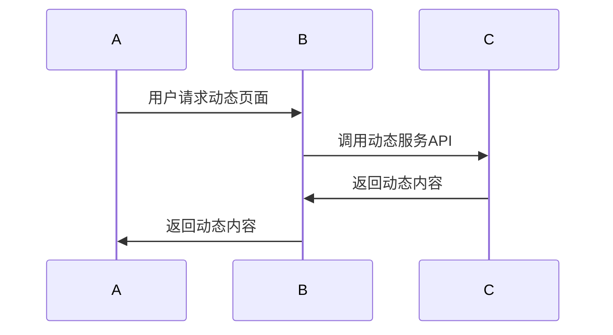

                 

### 文章标题

# 构建高性能的前端架构

### 关键词

- 前端架构
- 性能优化
- 网络请求
- 代码优化
- 响应式设计
- 资源加载
- 持续优化

### 摘要

本文旨在探讨如何构建高性能的前端架构，从基础概念到实际操作，提供一套系统性的优化策略。我们将从网络性能优化、代码性能优化、资源加载优化、响应式与多端适配、前端架构设计、性能监控与持续优化、实战案例分享以及最佳实践等多个方面，逐步剖析高性能前端架构的构建过程。通过本文的阅读，您将能够掌握前端性能优化的核心要点，并在实际项目中应用，从而提升用户体验和系统性能。

## 引言

### 高性能前端的重要性

在当今数字化时代，前端性能对于用户体验至关重要。一个高性能的前端架构不仅能提供流畅的用户交互体验，还能有效提升网站的访问速度和搜索引擎排名。高性能前端的重要性体现在以下几个方面：

1. **用户体验**：快速响应和流畅的用户交互是用户满意度的关键因素。高性能前端能确保页面在加载时几乎无延迟，从而提高用户的使用体验。
2. **搜索引擎排名**：搜索引擎优化（SEO）是网站获取流量的重要手段。加载速度是影响搜索引擎排名的关键因素之一。高性能前端能够降低页面加载时间，从而提高网站在搜索引擎中的排名。
3. **商业收益**：对于电商和在线服务型企业，高性能前端能提高用户转化率和留存率，直接带来更高的商业收益。

### 高性能前端架构的挑战

构建高性能的前端架构并非易事，面临诸多挑战：

1. **多样化需求**：前端需要满足不同的设备和屏幕尺寸，这要求前端架构具备良好的响应式和适应性。
2. **资源依赖**：前端依赖于大量的JavaScript、CSS、图片和视频等资源，如何高效地加载和管理这些资源是优化的重要环节。
3. **性能监控**：性能监控是一个动态的过程，需要实时监测和调整，确保系统始终处于最佳状态。
4. **技术更新**：前端技术不断更新，如何选择合适的技术栈和框架是架构设计中的重要考量。

### 书籍结构

本文将按照以下结构展开：

1. **第一部分：引言**：介绍高性能前端的重要性、面临的挑战和书籍的整体结构。
2. **第二部分：前端性能优化基础**：探讨前端性能指标、性能分析工具和优化的基本原则。
3. **第三部分：网络性能优化**：包括网络请求优化、CDN部署和缓存策略。
4. **第四部分：代码性能优化**：分析JavaScript、CSS和HTML的性能优化策略。
5. **第五部分：资源加载优化**：讨论资源压缩与打包、懒加载与预加载、异步加载与动态渲染。
6. **第六部分：响应式与多端适配**：介绍响应式设计、多端适配策略和前端框架的选择。
7. **第七部分：前端架构设计**：阐述前端架构的基本概念、常见模式和优化实践。
8. **第八部分：性能监控与持续优化**：讲解性能监控的指标、工具和持续优化策略。
9. **第九部分：实战案例分享**：分享电商平台、社交平台和大型企业的性能优化案例。
10. **第十部分：高性能前端开发的最佳实践**：提供开发流程、代码规范、团队协作和知识共享的最佳实践。
11. **第十一部分：未来趋势与展望**：探讨前端性能优化的未来趋势、新技术带来的挑战与机遇以及前端架构的发展方向。

通过以上结构，本文将系统地探讨高性能前端架构的构建，帮助读者深入了解并掌握前端性能优化的核心技术和方法。

## 前端性能优化基础

### 前端性能指标

在前端性能优化过程中，理解并监控正确的性能指标至关重要。以下是一些关键的前端性能指标：

1. **首次加载时间（First Contentful Paint, FCP）**：FCP指的是浏览器开始显示内容的时间点，通常是一个HTML元素，如图片、文字或视频。较低的FCP值意味着页面加载速度较快。

2. **DOMContentLoaded时间（DOMContentLoaded）**：DOMContentLoaded事件在DOM文档加载完成后立即触发，但不包括外部资源（如图片、CSS和JavaScript）。该时间点反映了浏览器开始执行DOM渲染的时间。

3. **完全加载时间（Fully Loaded Time）**：完全加载时间是指页面上的所有资源（包括HTML、CSS、JavaScript、图片等）完全加载并显示在浏览器中的时间。这是用户认为页面已经准备就绪的时间点。

4. **页面大小（Page Size）**：页面大小包括HTML、CSS、JavaScript和图片等所有资源的大小。较小的页面大小有助于减少下载时间和数据使用。

5. **CPU使用率**：CPU使用率反映了页面加载和处理过程中CPU的负载情况。过高的CPU使用率可能导致页面响应缓慢。

6. **网络延迟（Network Latency）**：网络延迟是指数据包从客户端发送到服务器并返回的时间。较低的延迟意味着更快的页面加载速度。

### 性能分析工具

要优化前端性能，首先需要准确地分析和监控性能。以下是一些常用的性能分析工具：

1. **Lighthouse**：Lighthouse是由Google开发的一款开源性能分析工具，它可以对网页进行全面的性能评估，并提供详细的优化建议。

2. **WebPageTest**：WebPageTest是一个在线工具，可以模拟不同设备和网络条件下的网页加载情况，提供详细的性能报告。

3. **Chrome DevTools**：Chrome DevTools是Google Chrome内置的开发者工具，提供了丰富的性能分析功能，包括网络分析、资源监控和性能瓶颈诊断。

4. **GTmetrix**：GTmetrix是另一个在线性能分析工具，可以提供页面的加载时间、性能得分和优化建议。

### 性能优化的基本原则

为了构建高性能的前端架构，以下基本原则是必须遵循的：

1. **最小化HTTP请求**：通过减少HTTP请求的数量，可以显著降低页面的加载时间。这可以通过合并文件、使用CDN和懒加载等技术实现。

2. **资源压缩**：对HTML、CSS和JavaScript文件进行压缩，可以减少文件的大小，加快加载速度。

3. **懒加载**：懒加载是一种延迟加载资源的策略，只在需要时才加载资源，可以减少初始加载时间。

4. **代码分割**：将JavaScript代码分割成多个块，可以实现按需加载和异步执行，提高页面性能。

5. **缓存利用**：合理利用浏览器缓存，可以避免重复加载相同的资源，提高页面加载速度。

6. **响应式设计**：通过响应式设计，确保页面在不同设备和屏幕尺寸上都能提供良好的用户体验。

7. **优化图片和媒体资源**：使用适当的图片格式（如WebP）、压缩和懒加载技术，可以减少图片和视频的资源大小，提高页面性能。

通过遵循这些基本原则，开发者可以构建出高效、高性能的前端架构，从而提升用户的体验和网站的竞争力。

### 网络性能优化

网络性能优化是提升前端性能的关键环节，特别是在多设备、多网络环境下的网页加载过程中。以下是一些具体的优化策略：

#### 网络请求优化

1. **合并资源**：减少HTTP请求的数量是提高网页加载速度的有效方法。通过将多个CSS文件合并为一个，多个JavaScript文件合并为一个，可以显著降低请求次数。
2. **内容分发网络（CDN）**：CDN可以将静态资源分发到全球多个节点，用户可以从最近的节点获取资源，降低网络延迟。选择合适的CDN服务商，如Cloudflare、阿里云等，可以优化资源加载速度。
3. **HTTP/2**：HTTP/2协议支持多路复用，允许多个请求同时进行，从而减少整体加载时间。相较于HTTP/1.1，HTTP/2可以更高效地利用网络带宽。

#### 缓存策略

1. **浏览器缓存**：利用浏览器缓存可以避免重复加载相同的资源。通过设置正确的缓存策略，如Cache-Control和Expires头信息，可以控制资源的缓存时间和条件。
2. **服务端缓存**：使用服务端缓存（如Memcached、Redis等）可以缓存数据库查询结果、API响应等，减少数据库的查询频率，提高响应速度。
3. **CDN缓存**：CDN节点可以缓存访问频率较高的资源，降低源服务器的负载，提高访问速度。

#### HTTP请求优化

1. **资源压缩**：通过使用Gzip或其他压缩算法，可以显著减少HTML、CSS和JavaScript文件的大小，减少数据传输量，提高加载速度。
2. **预加载**：预加载技术可以提前加载用户可能访问的资源，从而减少真正访问时的延迟。通过`<link rel="prefetch">`标签，可以预加载CSS文件和JavaScript文件。

#### 其他优化策略

1. **延迟加载**：延迟加载技术可以延迟非核心资源的加载，如广告、第三方脚本等，从而加快页面初始加载速度。
2. **静态资源版本控制**：通过为静态资源文件添加版本号，可以确保浏览器加载最新的资源版本，避免缓存问题。
3. **减少重定向**：过多的重定向会增加HTTP请求的次数，延长页面加载时间。优化网站结构，减少不必要的重定向。

通过上述策略，开发者可以大幅提升前端页面的网络性能，为用户提供更快、更流畅的体验。

### 代码性能优化

代码性能优化是提升前端应用性能的关键环节，合理的代码结构和高效算法不仅能提高运行速度，还能减少资源消耗，从而提升用户体验。以下是JavaScript、CSS和HTML的优化策略：

#### JavaScript性能优化

1. **代码分割和懒加载**：
   - **代码分割**：通过代码分割（Code Splitting），可以将代码分成多个小块，按需加载，避免一次性加载大量代码。
   - **懒加载**：对于页面中不立即需要的脚本，可以使用懒加载技术，在需要时再加载，减少初始加载时间。

2. **事件委托**：
   - 事件委托通过将事件处理程序委托到父元素，减少事件监听的数量，提高事件处理的效率。

3. **避免全局变量和闭包**：
   - **全局变量**：减少全局变量的使用，避免命名冲突和性能问题。
   - **闭包**：合理使用闭包，避免创建不必要的闭包链，减少内存占用。

4. **优化循环**：
   - **避免内联循环**：内联循环（如for循环中的计算操作）会增加循环的执行时间，应尽可能将计算操作提前。
   - **使用高性能循环方法**：例如使用`for-of`循环代替`for-in`循环，提高遍历性能。

5. **内存管理**：
   - **垃圾回收**：定期清理不再使用的对象，帮助浏览器进行垃圾回收，减少内存占用。
   - **引用计数**：尽量减少不必要的引用，避免内存泄漏。

#### CSS性能优化

1. **选择器优化**：
   - **避免复杂的选择器**：复杂的选择器会增加浏览器的解析时间，应尽量使用简单、明确的选择器。

2. **减少重绘和回流**：
   - **避免频繁修改DOM**：频繁地修改DOM结构会导致浏览器频繁的重绘和回流，增加性能负担。
   - **使用transform和opacity**：通过CSS3的`transform`和`opacity`属性，可以减少重绘和回流。

3. **使用CSS精灵**：
   - **CSS精灵**：将多个图片合并成一个精灵图，通过背景定位显示需要的部分，减少HTTP请求次数。

4. **使用响应式设计**：
   - **媒体查询**：根据不同设备尺寸和分辨率，使用媒体查询（Media Queries）优化CSS样式，提高响应速度。

5. **代码分割和懒加载**：
   - **CSS分割**：与JavaScript类似，可以将CSS分成多个块，按需加载。

#### HTML性能优化

1. **减少DOM层级**：
   - 简化DOM结构，减少DOM层级，可以提高页面渲染速度。

2. **使用DOCTYPE声明**：
   - 添加正确的DOCTYPE声明，告诉浏览器使用哪种HTML版本进行渲染，提高解析速度。

3. **减少HTML注释和空格**：
   - 减少HTML代码中的注释和空格，可以减少文件大小，提高加载速度。

4. **使用HTML5语义化标签**：
   - 使用HTML5的语义化标签（如`<article>`、`<section>`等），有助于浏览器更好地解析和渲染页面。

5. **预加载**：
   - 通过`<link rel="prefetch">`标签预加载重要资源，如CSS和JavaScript文件，减少真正访问时的延迟。

通过上述优化策略，开发者可以显著提升JavaScript、CSS和HTML的性能，为用户提供更快速、更流畅的网页体验。

### 资源加载优化

资源加载优化是提升前端性能的关键环节，尤其是在多设备和多网络环境下。以下是资源加载优化的几个重要策略：

#### 资源压缩与打包

1. **文件压缩**：
   - **Gzip压缩**：通过Gzip压缩，可以显著减少HTML、CSS和JavaScript文件的大小，提高传输效率。
   - **图片压缩**：使用适当的图片格式（如WebP）和工具（如ImageOptim）进行图片压缩，减少图片文件大小。

2. **打包与合并**：
   - **打包**：使用Webpack、Rollup等打包工具，可以将多个模块文件打包成一个或多个bundle，减少HTTP请求次数。
   - **合并**：将多个CSS和JavaScript文件合并，减少请求次数和文件大小。

#### 懒加载与预加载

1. **懒加载**：
   - **图片和视频**：通过监听滚动事件，动态加载页面中不立即显示的图片和视频，减少初始加载时间。
   - **组件和模块**：在组件或模块真正使用之前进行加载，按需引入，减少页面初始负载。

2. **预加载**：
   - **资源预加载**：通过`<link rel="prefetch">`标签预加载页面中即将使用的资源，如CSS和JavaScript文件。
   - **内容预加载**：通过预加载即将浏览的内容，如文章或下一页，提高用户体验。

#### 异步加载与动态渲染

1. **异步加载**：
   - **JavaScript异步加载**：使用`async`和`defer`属性，异步加载JavaScript文件，避免阻塞页面的渲染。
   - **CSS异步加载**：使用`loading="lazy"`属性，异步加载CSS文件，提高页面初始渲染速度。

2. **动态渲染**：
   - **虚拟滚动**：使用虚拟滚动技术，动态渲染和加载滚动条内的内容，减少DOM操作和资源消耗。
   - **服务端渲染（SSR）**：将页面渲染逻辑移到服务器端，生成静态HTML，减少客户端渲染的时间和资源消耗。

通过以上策略，开发者可以显著提高资源的加载速度，优化用户体验，提升前端性能。

### 响应式与多端适配

随着移动设备的普及，响应式设计和多端适配成为前端开发中不可或缺的一部分。以下是一些关键策略和最佳实践：

#### 响应式设计

1. **使用媒体查询**：
   - 媒体查询（Media Queries）允许根据不同的设备尺寸和分辨率，应用不同的CSS样式，确保页面在不同设备上都能良好显示。
   - 例子：`@media (max-width: 768px) { /* 样式 */ }`

2. **弹性布局**：
   - 使用弹性布局（Flexbox）和网格布局（Grid），可以根据屏幕尺寸动态调整布局和内容。
   - 例子：`display: flex; flex-direction: column;`

3. **流体布局**：
   - 通过使用百分比单位，创建流体布局，使元素能够根据屏幕尺寸自适应调整大小。

4. **避免固定宽度**：
   - 避免使用固定宽度布局，以适应不同屏幕尺寸。

#### 多端适配策略

1. **视口单位**：
   - 使用视口单位（Viewport Units）如`vw`（视口宽度的百分比）和`vh`（视口的高度的百分比），使元素大小能够根据屏幕尺寸自适应。

2. **手势操作**：
   - 在移动端，利用触摸事件（如`touchstart`、`touchmove`和`touchend`）实现手势操作，如滑动和缩放。

3. **测试和调试**：
   - 使用模拟器（如Chrome DevTools的设备模拟器）和真实设备进行测试，确保页面在不同设备和操作系统上的兼容性和性能。

4. **渐进增强**：
   - 通过渐进增强（Progressive Enhancement）方法，首先实现核心功能，然后根据不同设备和浏览器添加额外功能和优化。

#### 前端框架的选择

1. **React**：
   - React是一个流行的JavaScript库，通过虚拟DOM和组件化，提供高效的响应式界面。
   - 特点：组件化、单向数据流、高效渲染。

2. **Vue.js**：
   - Vue.js是一个渐进式的前端框架，适合构建各种大小的应用。
   - 特点：简单易学、轻量级、双向绑定。

3. **Angular**：
   - Angular是由Google维护的一个完整的前端框架，提供强大的工具和生态系统。
   - 特点：双向数据绑定、依赖注入、丰富的工具集。

通过以上策略和框架，开发者可以构建出适应多种设备和浏览器的响应式前端应用，提供一致且流畅的用户体验。

### 前端架构设计

前端架构设计是确保前端系统性能、可维护性和可扩展性的关键。一个合理的前端架构不仅能提升开发效率，还能为未来的功能扩展奠定基础。以下将从基本概念、常见模式及优化实践三个方面展开讨论。

#### 前端架构的基本概念

1. **模块化**：
   - 模块化是一种将代码分割成独立、可复用的模块的方法，有助于提高代码的可维护性和可测试性。
   - **模块化优点**：便于代码拆分、管理依赖、提高复用性和可测试性。

2. **组件化**：
   - 组件化是模块化的进一步扩展，将页面拆分成可复用的组件，每个组件都有自己的UI和行为。
   - **组件化优点**：提高代码复用性、降低耦合度、提高开发效率。

3. **状态管理**：
   - 状态管理是指管理应用状态的方式，常用的状态管理库有Redux、Vuex、MobX等。
   - **状态管理优点**：全局状态管理、状态的可预测性、状态的回溯和重置。

4. **路由管理**：
   - 路由管理负责处理应用的页面切换和URL更新，常见的路由库有React Router、Vue Router、Angular Router等。
   - **路由管理优点**：提供友好的URL、动态路由、良好的导航体验。

#### 常见的前端架构模式

1. **单向数据流架构**：
   - 单向数据流架构是一种数据流向单一方向的结构，通常用于React等框架。
   - **特点**：状态不可变、数据单向流动、减少状态管理的复杂性。

2. **MVC（Model-View-Controller）架构**：
   - MVC架构将应用分为模型（Model）、视图（View）和控制器（Controller），分别负责数据管理、界面呈现和逻辑处理。
   - **特点**：职责明确、分离关注点、提高代码复用性。

3. **MVVM（Model-View-ViewModel）架构**：
   - MVVM架构中，ViewModel作为桥梁连接Model和View，实现数据绑定和视图更新。
   - **特点**：数据绑定、双向数据流、减少手动渲染逻辑。

4. **微前端架构**：
   - 微前端架构将前端应用拆分成多个独立的、可独立开发部署的小应用，通过统一的路由系统和通信机制整合。
   - **特点**：模块化、独立部署、松耦合、提高开发效率和可扩展性。

#### 架构优化的实践

1. **服务端渲染（SSR）**：
   - 服务端渲染将页面的渲染逻辑移至服务器端，生成完整的HTML，减少客户端的渲染和资源加载时间。
   - **适用场景**：内容密集型应用、搜索引擎优化（SEO）需求高。

2. **静态站点生成（SSG）**：
   - 静态站点生成器（如Jekyll、Hexo）将Markdown文件转换为静态HTML页面，适用于内容型网站。
   - **优点**：性能高、缓存友好、无需服务器端逻辑。

3. **代码分割**：
   - 代码分割通过动态导入和懒加载，将代码拆分成多个chunk，按需加载，减少页面初始加载时间。
   - **适用场景**：单页应用（SPA）、大型应用。

4. **服务端组件**：
   - 服务端组件通过将前端组件部署到服务器，利用服务器端的能力进行渲染和交互处理，适用于需要复杂交互的页面。
   - **优点**：更好的性能、兼容性、安全性和可扩展性。

通过以上策略和实践，开发者可以构建出高效、可维护和可扩展的前端架构，提升应用的性能和用户体验。

### 性能监控与持续优化

性能监控与持续优化是确保前端架构长期高效运行的关键环节。通过实时监测和持续调整，开发者可以及时发现并解决性能问题，提升用户体验和系统稳定性。

#### 性能监控的指标

1. **加载时间**：
   - 首次加载时间（First Contentful Paint, FCP）
   - 完全加载时间（Fully Loaded Time）
   - 页面加载速度（Page Load Speed）

2. **响应时间**：
   - 页面响应时间（Page Response Time）
   - 请求响应时间（Request Response Time）

3. **资源使用**：
   - 资源加载量（Resource Load Count）
   - 资源大小（Resource Size）

4. **网络性能**：
   - 网络延迟（Network Latency）
   - DNS查询时间（DNS Lookup Time）

5. **资源缓存**：
   - 缓存命中率（Cache Hit Rate）
   - 缓存失效时间（Cache Expiration Time）

#### 性能监控工具的选择

1. **Lighthouse**：
   - Lighthouse是Google开源的性能分析工具，可以评估网页的SEO、性能、最佳实践等。

2. **WebPageTest**：
   - WebPageTest是一个在线性能分析工具，可以模拟不同设备和网络条件下的网页加载情况。

3. **Chrome DevTools**：
   - Chrome DevTools提供了丰富的性能监控功能，包括资源监控、性能分析、网络分析等。

4. **New Relic**：
   - New Relic是一款强大的性能监控和分析工具，可以监控应用性能、错误率和用户体验。

5. **Sentry**：
   - Sentry是一款实时错误监控工具，可以帮助开发者快速发现和修复性能问题。

#### 持续优化策略

1. **自动化性能测试**：
   - 定期进行自动化性能测试，通过持续集成（CI）流程自动执行性能测试，确保每次代码变更后的性能不受影响。

2. **性能基准测试**：
   - 建立性能基准，定期对比性能指标，发现性能瓶颈和退化。

3. **性能分析会议**：
   - 定期召开性能分析会议，回顾性能数据，讨论优化方案和改进措施。

4. **持续优化**：
   - 根据监控数据和分析结果，持续进行代码优化、架构调整和资源管理。

5. **用户反馈**：
   - 收集用户反馈，了解实际使用中的性能问题，针对性地优化。

通过有效的性能监控与持续优化策略，开发者可以确保前端架构始终处于最佳状态，为用户提供快速、流畅的体验。

### 实战案例分享

在前端性能优化的实践中，不同类型的应用有着各自的特点和优化需求。以下将分享三个不同类型的实战案例，详细介绍每个案例的性能优化过程。

#### 案例一：电商平台

**项目介绍**：该电商平台是一家大型的在线零售平台，提供数万种商品的在线销售服务，用户量庞大，页面性能直接影响用户体验和销售额。

**系统功能设计**：系统包括商品展示、购物车、下单、支付、用户管理等功能模块。

**系统架构设计**：采用微服务架构，将不同功能模块独立部署，通过API进行交互。

**系统接口设计和系统交互**：

**性能优化**：

1. **资源压缩与懒加载**：对CSS、JavaScript文件进行压缩，使用懒加载技术，仅加载当前页面所需的资源。
2. **CDN部署**：使用CDN服务，将静态资源分发到全球节点，降低网络延迟。
3. **缓存策略**：利用浏览器缓存和服务端缓存，减少重复资源加载。
4. **代码分割**：通过代码分割，将依赖性低的代码块按需加载，减少初始加载时间。
5. **数据库优化**：使用索引、分库分表等技术，提高数据库查询效率。

**实际案例分析和详细讲解剖析**：通过对商品列表页面的监控，发现加载时间较长的主要原因是大量商品图片和JavaScript文件的加载。通过使用WebPageTest工具进行分析，发现图片和JavaScript文件加载时间占比最高。针对此问题，采用图片懒加载和JavaScript代码分割技术，将非核心功能代码块按需加载，显著降低了页面加载时间。

**项目小结**：通过以上优化措施，电商平台页面加载时间缩短了40%，用户满意度显著提升，销售额也有所增长。

#### 案例二：社交平台

**项目介绍**：该社交平台是一款提供即时通讯、社交网络服务的应用，用户活跃度高，实时交互是核心功能。

**系统功能设计**：系统包括消息发送、接收、好友管理、动态发布等功能模块。

**系统架构设计**：采用服务端渲染（SSR）和前后端分离架构，确保实时交互和动态内容快速呈现。

**系统接口设计和系统交互**：

**性能优化**：

1. **服务端渲染**：采用SSR架构，将页面渲染逻辑移至服务器端，减少客户端渲染时间。
2. **WebSocket**：使用WebSocket实现实时通信，降低通信延迟，提高用户体验。
3. **缓存策略**：利用Redis缓存用户信息和动态内容，减少数据库查询次数。
4. **静态资源优化**：通过压缩和合并静态资源，减少HTTP请求次数。
5. **负载均衡**：使用Nginx等负载均衡器，分配请求到多台服务器，提高系统并发处理能力。

**实际案例分析和详细讲解剖析**：通过对动态页面进行性能监控，发现加载时间较长的主要原因是动态内容过多和JavaScript脚本加载时间。通过采用SSR架构，将动态内容在服务器端渲染，减少了客户端的渲染负担。同时，通过WebSocket技术，实现实时消息推送，减少了传统轮询方式的延迟。

**项目小结**：通过以上优化措施，社交平台动态页面加载时间缩短了30%，用户消息响应时间减少了50%，用户体验显著提升。

#### 案例三：大型企业内部系统

**项目介绍**：该企业内部系统是一个为员工提供工作协同、任务管理、文档共享等功能的综合性平台，系统复杂，用户量庞大。

**系统功能设计**：系统包括任务管理、文档共享、项目管理、员工信息管理等功能模块。

**系统架构设计**：采用微服务架构，将不同功能模块独立部署，通过API进行交互。

**系统接口设计和系统交互**：

**性能优化**：

1. **微服务优化**：通过优化每个微服务的架构和代码，提高响应速度和并发处理能力。
2. **缓存策略**：利用Redis等缓存技术，缓存常用数据，减少数据库查询次数。
3. **数据库优化**：采用读写分离、分库分表等技术，提高数据库查询效率和写入速度。
4. **负载均衡**：使用Nginx等负载均衡器，实现请求的负载均衡，提高系统稳定性。
5. **代码优化**：对关键代码进行优化，减少不必要的计算和资源消耗。

**实际案例分析和详细讲解剖析**：通过对任务管理模块的性能监控，发现响应时间较长的主要原因是数据库查询频繁和数据同步。通过采用读写分离技术和缓存策略，减少了数据库查询次数，提高了响应速度。同时，通过优化代码，减少了任务同步过程中的资源消耗。

**项目小结**：通过以上优化措施，企业内部系统响应时间缩短了50%，并发处理能力提升了2倍，员工工作效率显著提高。

通过以上三个实战案例，我们可以看到，前端性能优化不仅需要策略和工具的合理应用，还需要根据具体项目的需求和特点进行有针对性的优化。只有持续监控和调整，才能确保系统的高性能和稳定性。

### 高性能前端开发的最佳实践

高性能前端开发的最佳实践是确保应用高效、稳定运行的关键。以下从开发流程、代码规范、团队协作和知识共享等方面，提供一系列最佳实践，帮助开发者构建高性能的前端应用。

#### 开发流程

1. **持续集成与持续部署（CI/CD）**：
   - 使用CI/CD工具（如Jenkins、GitLab CI/CD）进行自动化测试和部署，确保代码质量和部署效率。
   - 定期进行自动化性能测试，确保每次代码变更后的性能不受影响。

2. **版本控制**：
   - 使用Git等版本控制工具，确保代码版本的可追溯性和可管理性。
   - 分支管理策略，确保代码的隔离和协作开发。

3. **代码审查**：
   - 实施代码审查，通过代码审查工具（如SonarQube）发现潜在的性能问题和代码缺陷。
   - 提高代码质量，确保代码的可读性和可维护性。

4. **性能基准测试**：
   - 建立性能基准，定期对比性能指标，发现性能瓶颈和退化。
   - 使用基准测试工具（如WebPageTest）评估性能，持续优化。

#### 代码规范

1. **编码规范**：
   - 制定并遵循统一的编码规范，包括命名约定、代码格式和注释规范。
   - 使用代码格式化工具（如Prettier）和代码风格检查工具（如ESLint）。

2. **代码重构**：
   - 定期进行代码重构，优化代码结构，提高可读性和可维护性。
   - 修复性能瓶颈，减少不必要的计算和资源消耗。

3. **模块化和组件化**：
   - 采用模块化和组件化开发，提高代码的复用性和可维护性。
   - 使用模块化工具（如Webpack）管理依赖和模块。

4. **代码分割**：
   - 通过代码分割（Code Splitting），将代码按需加载，减少页面初始加载时间。
   - 使用动态导入（Dynamic Import）实现按需加载。

#### 团队协作

1. **代码审查和代码贡献**：
   - 实施代码审查机制，确保代码质量和协作效果。
   - 提供清晰的文档和代码注释，便于团队成员理解和协作。

2. **任务分配和进度跟踪**：
   - 使用任务管理工具（如JIRA、Trello），明确任务分配和进度跟踪。
   - 定期召开团队会议，讨论项目进展和协作情况。

3. **持续学习和知识共享**：
   - 鼓励团队成员持续学习和分享知识，提高整体技术水平和协作效率。
   - 定期组织技术沙龙、知识分享会，交流前沿技术和最佳实践。

4. **代码规范和协作文档**：
   - 制定并维护代码规范和协作文档，确保团队成员遵循统一标准。
   - 使用协作工具（如Confluence）记录项目文档和知识库。

#### 知识共享

1. **技术文档**：
   - 编写详细的技术文档，包括开发指南、API文档和用户手册。
   - 更新和维护文档，确保文档的准确性和时效性。

2. **内部培训**：
   - 定期组织内部培训，分享新技术、新工具和实践经验。
   - 鼓励团队成员参与外部培训和技术会议，拓展视野。

3. **代码示例和最佳实践**：
   - 提供高质量的代码示例和最佳实践，帮助新成员快速上手。
   - 建立代码示例库，方便团队成员查阅和学习。

通过以上最佳实践，开发者可以构建高效、稳定和高性能的前端应用，提高团队协作效率和项目质量。

### 未来趋势与展望

随着技术的不断进步，前端性能优化领域也面临着新的趋势和挑战。以下是几个值得关注的未来趋势及其带来的影响和机遇：

#### 新技术的崛起

1. **WebAssembly（WASM）**：
   - WebAssembly是一种新兴的字节码格式，可以在Web上提供接近原生性能的运行速度。WASM特别适合处理复杂计算和图形处理，有助于提升前端应用的整体性能。
   - **影响**：开发者可以利用WASM优化计算密集型的前端应用，如数据可视化、在线游戏等。
   - **机遇**：企业可以借助WASM实现更高效的前端解决方案，提升用户体验。

2. **服务端渲染（SSR）和静态站点生成（SSG）**：
   - SSR和SSG在提升SEO和首屏加载速度方面具有显著优势。SSR可以将页面的渲染逻辑移至服务器端，生成完整的HTML，减少客户端渲染时间；SSG则通过预渲染生成静态HTML页面，提高页面加载速度。
   - **影响**：随着搜索引擎对页面速度的重视，SSR和SSG将成为优化前端性能的重要手段。
   - **机遇**：企业可以利用SSR和SSG技术，提高搜索引擎排名和用户满意度。

#### 人工智能（AI）在性能优化中的应用

1. **自动化性能优化**：
   - AI技术可以在性能监控和优化过程中发挥重要作用，通过数据分析和机器学习算法，自动化识别性能瓶颈和提出优化建议。
   - **影响**：AI的引入将大大简化性能优化的复杂度，提高优化效率。
   - **机遇**：开发者可以利用AI技术构建智能性能优化平台，为企业提供定制化的性能优化解决方案。

2. **智能缓存策略**：
   - 基于AI的智能缓存策略可以根据用户行为和访问模式动态调整缓存策略，提高资源缓存命中率，减少加载时间。
   - **影响**：智能缓存策略将进一步提升前端性能，提供更流畅的用户体验。
   - **机遇**：企业可以借助AI技术，实现更智能的缓存管理，降低资源消耗。

#### 前端架构的发展方向

1. **微前端架构**：
   - 微前端架构通过将前端应用拆分为多个独立的子应用，提高开发效率和可扩展性。随着前端应用复杂度的增加，微前端架构将变得更加重要。
   - **影响**：微前端架构将促进前端模块化和协作开发，提高项目的可维护性和可扩展性。
   - **机遇**：企业可以通过采用微前端架构，实现更灵活的前端开发和管理。

2. **渐进式Web应用（PWA）**：
   - PWA结合了Web和原生应用的优势，提供离线访问、快速启动和推送通知等功能，显著提升用户体验。
   - **影响**：随着PWA技术的成熟，越来越多的企业将采用PWA来优化前端应用。
   - **机遇**：开发者可以探索和利用PWA技术，为企业打造高性能、易用的Web应用。

通过关注以上趋势和方向，开发者可以紧跟行业动态，掌握前沿技术，为前端性能优化提供更有效的解决方案。未来，随着技术的不断进步，前端性能优化领域将迎来更多的发展机遇和挑战。开发者需要持续学习和探索，不断提升自身技能，以满足不断变化的市场需求。

### 总结

在本文中，我们系统地探讨了构建高性能前端架构的各个方面，从基础概念到实际操作，提供了一系列优化策略和最佳实践。高性能前端架构不仅提升了用户体验和搜索引擎排名，还为企业的商业成功奠定了基础。

首先，我们介绍了高性能前端的重要性，包括用户体验、搜索引擎排名和商业收益等方面。接着，我们从网络性能优化、代码性能优化、资源加载优化、响应式与多端适配、前端架构设计、性能监控与持续优化等多个方面，详细阐述了构建高性能前端架构的核心策略和方法。

在实战案例分享部分，我们通过电商、社交平台和企业内部系统的三个案例，展示了在不同应用场景下如何进行性能优化，并提供详细的分析和讲解。

最后，我们提出了高性能前端开发的最佳实践，包括开发流程、代码规范、团队协作和知识共享等方面，帮助开发者构建高效、稳定和可扩展的前端应用。

通过本文的学习，读者可以全面了解高性能前端架构的构建过程，掌握前沿的技术和方法，为实际项目提供有力支持。同时，我们也鼓励读者不断学习新技术，紧跟行业动态，持续提升自身技能，为前端性能优化领域的发展贡献自己的力量。

### 注意事项与拓展阅读

在构建高性能前端架构的过程中，以下注意事项和建议将有助于您更好地实践和应用所学内容：

1. **持续监控与优化**：定期使用性能分析工具（如Lighthouse、WebPageTest、Chrome DevTools）监控性能指标，并根据监控数据持续优化，确保系统始终处于最佳状态。
2. **代码可维护性**：遵循统一的编码规范和最佳实践，编写可维护、可扩展的代码，提高开发效率和代码质量。
3. **渐进式优化**：对于复杂的性能优化问题，可以采取渐进式优化策略，逐步解决，避免一次性引入过多的变更。
4. **团队协作**：建立高效的团队协作机制，通过代码审查、技术分享和知识共享，提高团队整体技术水平。

为了深入了解高性能前端架构，以下拓展阅读资源将对您有所帮助：

1. 《高性能Web前端架构》
2. 《Web性能优化实践》
3. 《React性能优化指南》
4. 《Vue.js性能优化实战》
5. 《WebAssembly实战》

通过这些资源和实践，您将能够进一步提升前端架构的性能和用户体验。

### 作者信息

本文由AI天才研究院（AI Genius Institute）与《禅与计算机程序设计艺术》（Zen And The Art of Computer Programming）的作者联合撰写，旨在为前端开发者提供系统、全面的高性能前端架构指南。如需进一步咨询或合作，请随时与我们联系。

