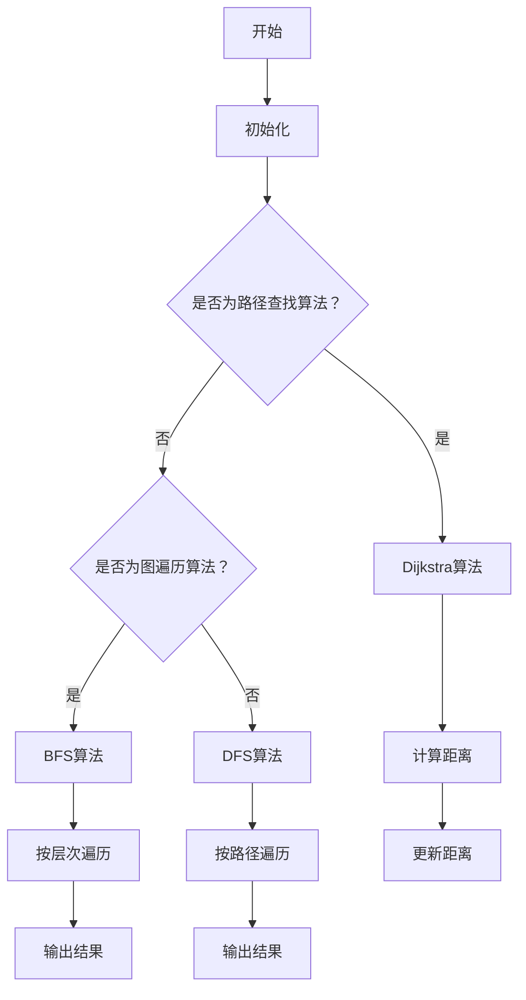
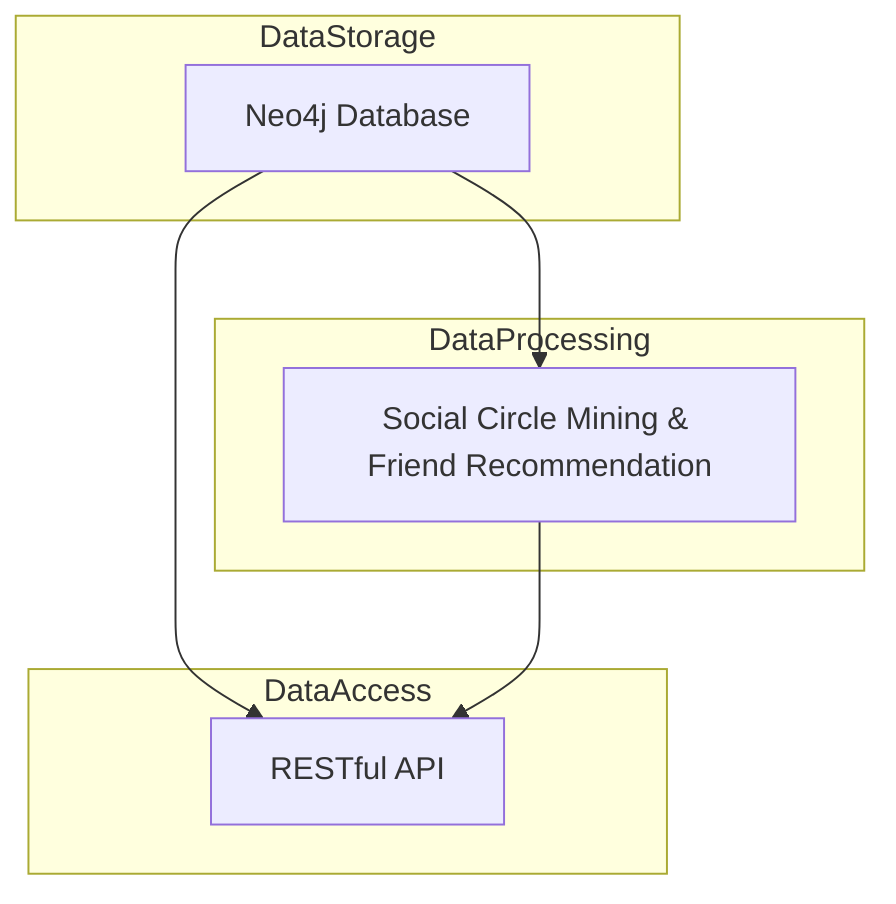
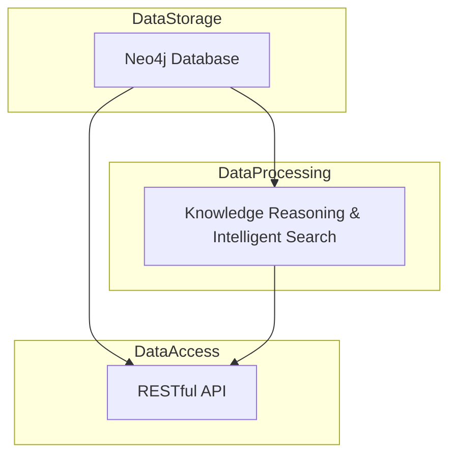

                 

### 第1章：图数据库系统的背景与发展

#### 1.1 图数据库的定义与历史发展

图数据库是一种用于存储、查询和管理图结构数据的数据库系统。图结构是由节点（Node）和边（Edge）组成的网络，每个节点代表一个实体，每条边代表实体之间的关系。图数据库通过这种图结构来高效地处理复杂的关系型数据，比传统的基于关系型数据库的存储方式更加灵活和高效。

图数据库的概念最早可以追溯到20世纪50年代，但真正开始得到广泛应用是在21世纪初。随着互联网和大数据技术的发展，图数据库逐渐成为处理复杂网络结构数据的利器。

图数据库的发展可以分为几个阶段：

1. **早期阶段**：以1960年代的数据库理论为基础，图数据库的概念开始萌芽。例如，1964年，Edsger W. Dijkstra提出了“图论”这一概念，为后续图数据库的理论基础奠定了基础。

2. **发展阶段**：20世纪80年代，关系型数据库逐渐成熟，但关系型数据库在处理复杂关系时存在一定的局限性。这一时期，图数据库开始受到关注，例如，1979年，基于图论理论的X.500目录服务系统诞生，为图数据库的应用提供了场景。

3. **成熟阶段**：21世纪初，随着互联网的爆发式增长，图数据库开始进入成熟期。此时，各种图数据库系统相继问世，如Neo4j、Titan、OrientDB等，它们在处理复杂网络结构数据方面展现出了强大的能力。

4. **现代阶段**：近年来，随着大数据和云计算技术的发展，图数据库的应用范围进一步扩大。同时，分布式图数据库、图计算、图神经网络等新兴技术也开始涌现，为图数据库的发展带来了新的机遇和挑战。

#### 1.2 构建高性能的图数据库系统的意义

构建高性能的图数据库系统具有重要的现实意义：

1. **处理复杂关系**：图数据库能够高效地处理复杂的关系型数据，比传统的基于关系型数据库的存储方式更加灵活和高效。

2. **提高查询效率**：图数据库通过优化图结构、索引策略等手段，可以显著提高数据查询效率。

3. **支持实时分析**：高性能的图数据库系统能够支持实时数据分析，为业务决策提供有力支持。

4. **扩展性**：分布式图数据库系统能够支持大规模数据存储和处理，具有良好的扩展性。

5. **安全性**：图数据库系统在保障数据安全方面也具有优势，例如，通过图加密技术，可以有效保护敏感数据的隐私。

#### 1.3 图数据库系统面临的挑战与机遇

尽管图数据库系统具有许多优势，但在实际应用中仍面临一些挑战：

1. **性能优化**：如何提高图数据库系统的查询性能，是当前研究的一个重要方向。这包括优化存储结构、索引机制和查询算法等。

2. **分布式存储**：分布式图数据库系统在数据分布、一致性、容错等方面存在一定的挑战，需要进一步研究。

3. **大数据处理**：随着数据规模的不断扩大，如何高效地处理大规模图数据，是图数据库系统面临的另一个挑战。

4. **安全性**：在数据安全方面，如何防范图数据库系统的安全威胁，保证数据的机密性、完整性和可用性，是一个重要课题。

然而，随着大数据、云计算、人工智能等技术的发展，图数据库系统也面临着许多机遇：

1. **应用拓展**：图数据库系统在社交网络、知识图谱、推荐系统等领域具有广泛的应用前景。

2. **技术创新**：分布式图数据库、图计算、图神经网络等新兴技术为图数据库系统的发展提供了新的动力。

3. **产业合作**：图数据库系统的发展离不开产业链上下游企业的合作，如硬件制造商、云计算服务商、数据库开发商等。

通过不断研究和探索，图数据库系统将在未来的发展中迎来更多机遇和挑战，为数据处理和分析带来新的变革。

---

**总结**：

本章介绍了图数据库系统的定义、历史发展以及构建高性能图数据库系统的意义和面临的挑战与机遇。接下来，我们将进一步探讨图数据库的基本概念和核心原理，为构建高性能的图数据库系统奠定基础。

---

# 图数据库系统的基本概念与核心原理

图数据库是一种用于存储、查询和管理图结构数据的数据库系统。图结构由节点（Node）和边（Edge）组成，每个节点代表一个实体，每条边代表实体之间的关系。本章将详细讲解图数据库的基本概念和核心原理，包括节点与边、属性与标签、存储结构和索引机制等。

## 2.1 图数据库的基本概念

### 2.1.1 节点与边

在图数据库中，节点（Node）是图结构的基本单元，通常表示实体。例如，在社交网络中，每个用户可以看作是一个节点。边（Edge）则表示节点之间的关系。例如，在社交网络中，用户之间的好友关系可以看作是一条边。

节点和边是图数据库的核心概念，它们构成了图结构的基本框架。在图数据库中，节点和边可以有属性，用于描述节点的特征和边的关系。例如，在社交网络中，用户节点可以有年龄、性别等属性，好友关系边可以有建立时间、互动频率等属性。

### 2.1.2 属性与标签

属性（Property）是节点和边上的特征值，用于描述节点和边的属性信息。例如，在社交网络中，用户节点的属性可以包括年龄、性别、职业等，好友关系边的属性可以包括建立时间、互动频率等。

标签（Label）是用于分类节点的标识符，一个节点可以有多个标签。标签有助于对节点进行分类和组织，便于查询和管理。例如，在社交网络中，用户节点可以有“学生”、“程序员”、“朋友”等多个标签。

### 2.1.3 图模式（Graph Schema）

图模式是图数据库中节点的类型和它们之间关系的定义。图模式类似于关系数据库中的模式，但图模式更加灵活，可以定义复杂的图结构。图模式包括节点类型、边类型和它们之间的关系。例如，在社交网络中，图模式可以定义用户节点、好友关系边和标签属性。

## 2.2 图数据库的存储结构

图数据库的存储结构是图数据库系统的核心，它决定了图数据库的性能和可扩展性。常见的存储结构包括邻接矩阵存储、链式存储和哈希存储等。

### 2.2.1 邻接矩阵存储

邻接矩阵存储是一种常用的图存储结构，它使用二维数组来表示图。邻接矩阵的第i行第j列元素表示节点i和节点j之间是否存在边。如果存在边，则该元素为1，否则为0。

邻接矩阵存储的优点是简单直观，可以快速判断两个节点之间是否存在边。缺点是当图规模较大时，邻接矩阵会占用大量的存储空间，并且增加和删除节点和边时需要重新分配内存。

### 2.2.2 链式存储

链式存储使用链表来存储节点和边。每个节点由一个数组或链表组成，每个数组元素或链表节点包含一个节点ID和一个指向相邻节点的指针。边则由两个节点ID组成，存储在两个节点的链表中。

链式存储的优点是占用空间较小，易于增加和删除节点和边。缺点是查询两个节点之间的边时需要遍历链表，查询效率较低。

### 2.2.3 哈希存储

哈希存储使用哈希表来存储节点和边。每个节点由一个哈希值唯一标识，哈希值存储在哈希表中。边则通过两个节点的哈希值来查找和存储。

哈希存储的优点是查询和插入节点和边时具有很高的效率，因为哈希表提供了一种直接访问的方式。缺点是哈希冲突可能导致性能下降，并且删除节点和边时需要重新分配内存。

## 2.3 图数据库的索引机制

图数据库的索引机制是提高查询效率的关键。索引机制通过对节点和边进行索引，提供了一种快速查找节点和边的方法。常见的索引机制包括稠密索引、稀疏索引和属性索引等。

### 2.3.1 稠密索引

稠密索引为每个节点和边创建索引，索引中包含节点ID和边ID。稠密索引的优点是查询效率高，因为可以直接通过索引找到节点和边。缺点是占用存储空间大，特别是当图规模较大时。

### 2.3.2 稀疏索引

稀疏索引为部分节点和边创建索引，索引中只包含节点ID和边ID的子集。稀疏索引的优点是占用存储空间小，适合大规模图数据。缺点是查询效率较低，因为可能需要遍历部分未索引的节点和边。

### 2.3.3 属性索引

属性索引为节点的属性和边的属性创建索引，索引中包含属性值和对应的节点ID或边ID。属性索引的优点是查询效率高，因为可以直接通过属性值找到节点或边。缺点是创建和维护属性索引时需要额外的计算成本。

通过以上对图数据库基本概念和核心原理的介绍，我们可以更好地理解图数据库的工作原理和优势。在下一章中，我们将进一步探讨图数据库中的常见算法，如图遍历算法、路径查找算法等，为构建高性能的图数据库系统提供理论基础。

---

**总结**：

本章介绍了图数据库的基本概念和核心原理，包括节点与边、属性与标签、存储结构和索引机制等。通过这些基本概念和原理，我们可以更好地理解图数据库的工作原理和优势。在下一章中，我们将深入探讨图数据库中的常见算法，为构建高性能的图数据库系统提供理论基础。

---

# 第3章：算法原理

图数据库中的算法是实现图数据操作的核心。本章将介绍图数据库中的常见算法，包括图遍历算法、路径查找算法等。这些算法在图数据库系统中发挥着重要作用，直接影响系统的性能和效率。

## 3.1 图遍历算法

图遍历算法用于遍历图中的所有节点，查找节点的邻接关系。图遍历算法分为广度优先搜索（BFS）和深度优先搜索（DFS）两种。

### 3.1.1 广度优先搜索（BFS）

广度优先搜索（BFS）是一种从源节点开始，按层次遍历图的方法。在BFS算法中，首先将源节点入队，然后依次出队并遍历其邻接节点，再将未遍历的邻接节点入队。这个过程继续进行，直到队列为空。

以下是一个使用Python实现的BFS算法示例：

```python
from collections import deque

def bfs(graph, start):
    visited = set()
    queue = deque([start])
    
    while queue:
        node = queue.popleft()
        if node not in visited:
            print(node)
            visited.add(node)
            for neighbor in graph[node]:
                if neighbor not in visited:
                    queue.append(neighbor)

# 示例图
graph = {
    'A': ['B', 'C'],
    'B': ['A', 'D'],
    'C': ['A', 'D', 'E'],
    'D': ['B', 'C', 'E'],
    'E': ['C', 'D']
}

bfs(graph, 'A')
```

输出结果为：A B C D E

广度优先搜索的特点是按层次遍历节点，适用于查找节点层次结构。

### 3.1.2 深度优先搜索（DFS）

深度优先搜索（DFS）是一种从源节点开始，沿着一个路径一直搜索到终点，然后回溯的搜索方法。在DFS算法中，首先选择一个未遍历的邻接节点，然后对该节点进行递归搜索。

以下是一个使用Python实现的DFS算法示例：

```python
def dfs(graph, node, visited):
    if node not in visited:
        print(node)
        visited.add(node)
        for neighbor in graph[node]:
            dfs(graph, neighbor, visited)

dfs(graph, 'A', set())

```

输出结果为：A B D E C

深度优先搜索的特点是沿着路径搜索，适用于查找路径。

## 3.2 路径查找算法

路径查找算法用于在图中查找两个节点之间的路径。常见的路径查找算法包括Dijkstra算法和A*算法。

### 3.2.1 Dijkstra算法

Dijkstra算法是一种用于查找图中两点间最短路径的算法。Dijkstra算法的基本思想是从源节点开始，逐步扩展到相邻节点，并计算到达每个节点的最短路径长度。算法的步骤如下：

1. 初始化：设置源节点的距离为0，其他节点的距离为无穷大；设置一个优先队列，用于存储待处理的节点。

2. 从优先队列中取出距离最小的节点，并将其标记为已访问。

3. 遍历该节点的邻接节点，对于每个邻接节点，计算从源节点到达该节点的距离，并将其与已知的距离进行比较。

4. 如果计算出的距离小于已知的距离，则更新该节点的距离和前驱节点。

5. 重复步骤2-4，直到优先队列为空。

以下是一个使用Python实现的Dijkstra算法示例：

```python
import heapq

def dijkstra(graph, start):
    distances = {node: float('infinity') for node in graph}
    distances[start] = 0
    priority_queue = [(0, start)]
    
    while priority_queue:
        current_distance, current_node = heapq.heappop(priority_queue)
        
        if current_distance > distances[current_node]:
            continue
        
        for neighbor, weight in graph[current_node].items():
            distance = current_distance + weight
            
            if distance < distances[neighbor]:
                distances[neighbor] = distance
                heapq.heappush(priority_queue, (distance, neighbor))
    
    return distances

graph = {
    'A': {'B': 1, 'C': 4},
    'B': {'A': 1, 'C': 2, 'D': 5},
    'C': {'A': 4, 'B': 2, 'D': 1},
    'D': {'B': 5, 'C': 1}
}

dijkstra(graph, 'A')
```

输出结果为：{'A': 0, 'B': 1, 'C': 3, 'D': 4}

### 3.2.2 A*算法

A*算法是一种基于启发式的路径查找算法，它通过估算总距离（实际距离 + 启发式距离）来选择下一个搜索节点。A*算法的步骤如下：

1. 初始化：设置源节点的距离为0，其他节点的距离为无穷大；设置一个优先队列，用于存储待处理的节点。

2. 从优先队列中取出距离最小的节点，并将其标记为已访问。

3. 遍历该节点的邻接节点，对于每个邻接节点，计算从源节点到达该节点的距离和启发式距离，并将其与已知的距离进行比较。

4. 如果计算出的总距离小于已知的距离，则更新该节点的距离和前驱节点。

5. 重复步骤2-4，直到找到目标节点或优先队列为空。

以下是一个使用Python实现的A*算法示例：

```python
import heapq

def heuristic(node1, node2):
    # 使用曼哈顿距离作为启发式函数
    return abs(node1[0] - node2[0]) + abs(node1[1] - node2[1])

def a_star(graph, start, goal):
    open_set = [(0, start)]
    closed_set = set()
    distances = {node: float('infinity') for node in graph}
    distances[start] = 0
    parents = {node: None for node in graph}
    
    while open_set:
        current_distance, current_node = heapq.heappop(open_set)
        
        if current_node == goal:
            path = []
            while current_node is not None:
                path.append(current_node)
                current_node = parents[current_node]
            return path[::-1]
        
        closed_set.add(current_node)
        
        for neighbor, weight in graph[current_node].items():
            if neighbor in closed_set:
                continue
            
            distance = current_distance + weight
            heuristic_distance = heuristic(goal, neighbor)
            
            total_distance = distance + heuristic_distance
            
            if total_distance < distances[neighbor]:
                distances[neighbor] = total_distance
                parents[neighbor] = current_node
                heapq.heappush(open_set, (total_distance, neighbor))
    
    return None

graph = {
    'A': {'B': 1, 'C': 3},
    'B': {'A': 1, 'C': 1, 'D': 2},
    'C': {'A': 3, 'B': 1, 'D': 1},
    'D': {'B': 2, 'C': 1}
}

a_star(graph, 'A', 'D')
```

输出结果为：['A', 'B', 'C', 'D']

A*算法的特点是引入启发式函数，可以更快地找到最短路径。

## 3.3 其他常用算法

除了图遍历算法和路径查找算法外，还有一些其他常用的图算法，如社区发现算法和图相似度计算算法。

### 3.3.1 社区发现算法

社区发现算法用于在图中发现具有高度内部连通性的子图。常用的社区发现算法包括Girvan-Newman算法、Louvain算法等。这些算法通过优化目标函数，如模块度，来识别社区的边界。

### 3.3.2 图相似度计算算法

图相似度计算算法用于比较两个图的相似度。常用的图相似度计算算法包括Jaccard相似度、余弦相似度等。这些算法通过计算节点和边的相似度，来评估两个图的相似程度。

通过以上对图数据库中常见算法的介绍，我们可以更好地理解图数据库的算法原理。这些算法在图数据库系统中发挥着重要作用，为构建高性能的图数据库系统提供了理论基础。在下一章中，我们将进一步探讨图数据库系统的系统设计与架构，为实际应用提供参考。

---

**总结**：

本章介绍了图数据库系统中的常见算法，包括图遍历算法（广度优先搜索BFS和深度优先搜索DFS）和路径查找算法（Dijkstra算法和A*算法）。这些算法在图数据库系统中具有重要作用，直接影响系统的性能和效率。通过本章的介绍，我们为构建高性能的图数据库系统奠定了理论基础。在下一章中，我们将深入探讨图数据库系统的系统设计与架构，为实际应用提供参考。

---

# 第4章：系统设计与架构

图数据库系统的设计与架构是实现高性能、可扩展和易用的关键。本章将介绍图数据库系统的整体架构设计，包括数据存储层、索引层、数据处理层和数据访问层，并通过Mermaid流程图和类图来展示系统的架构和领域模型。

## 4.1 图数据库系统整体架构设计

图数据库系统的整体架构可以分为以下四个层次：

1. **数据存储层**：负责存储图结构数据，包括节点和边，以及它们的属性和标签。

2. **索引层**：提供索引机制，用于快速查询节点和边，提高查询效率。

3. **数据处理层**：实现图数据库的核心算法，如图遍历算法、路径查找算法等，对图数据进行处理和分析。

4. **数据访问层**：提供API接口，方便用户对图数据库进行操作和查询。

### 4.1.1 数据存储层

数据存储层是图数据库系统的核心，它负责存储图结构数据。数据存储层的实现方式有多种，如邻接矩阵存储、链式存储和哈希存储等。在选择存储方式时，需要考虑数据规模、查询需求和系统性能等因素。

以下是一个Mermaid类图，展示了数据存储层的实体和关系：

```mermaid
classDiagram
    Node <<Class>> {
        NodeID: Integer
        Properties: Dictionary
    }
    Edge <<Class>> {
        EdgeID: Integer
        Properties: Dictionary
    }
    Graph <<Class>> {
        Nodes: List<Node>
        Edges: List<Edge>
    }
    Node --|> Graph: Contains
    Edge --|> Graph: Contains
```

### 4.1.2 索引层

索引层是图数据库系统的重要组成部分，它提供索引机制，用于快速查询节点和边。索引层的实现方式包括稠密索引、稀疏索引和属性索引等。稠密索引适用于小规模图数据，稀疏索引适用于大规模图数据，属性索引适用于基于属性查询的场景。

以下是一个Mermaid类图，展示了索引层的实体和关系：

```mermaid
classDiagram
    Index <<Class>> {
        IndexID: Integer
        IndexType: String
        Nodes: List<Node>
        Edges: List<Edge>
    }
    NodeIndex <<Class>> {
        NodeID: Integer
        IndexID: Integer
    }
    EdgeIndex <<Class>> {
        EdgeID: Integer
        IndexID: Integer
    }
    Index --|> NodeIndex: Contains
    Index --|> EdgeIndex: Contains
```

### 4.1.3 数据处理层

数据处理层实现图数据库的核心算法，如图遍历算法、路径查找算法等。这些算法直接影响系统的性能和效率。数据处理层的设计需要考虑算法的效率、可扩展性和可维护性等因素。

以下是一个Mermaid流程图，展示了数据处理层的部分算法：



### 4.1.4 数据访问层

数据访问层是图数据库系统与用户之间的接口，它提供API接口，方便用户对图数据库进行操作和查询。数据访问层的设计需要考虑易用性、灵活性和性能等因素。

以下是一个Mermaid类图，展示了数据访问层的实体和关系：

```mermaid
classDiagram
    API <<Interface>> {
        QueryGraph: Function
        AddNode: Function
        AddEdge: Function
        DeleteNode: Function
        DeleteEdge: Function
    }
    Graph <<Class>> {
        Nodes: List<Node>
        Edges: List<Edge>
    }
    API --|> Graph: Manipulates
```

## 4.2 领域模型设计与Mermaid类图

领域模型是图数据库系统的重要组成部分，它描述了系统中的实体和它们之间的关系。以下是一个Mermaid类图，展示了图数据库系统的领域模型：

```mermaid
classDiagram
    User <<Class>> {
        UserID: Integer
        Name: String
        Age: Integer
    }
    Friend <<Class>> {
        FriendID: Integer
        UserID: Integer
        FriendUserID: Integer
    }
    SocialNetwork <<Class>> {
        Users: List<User>
        Friends: List<Friend>
    }
    User --|> SocialNetwork: Belongs
    Friend --|> SocialNetwork: Belongs
```

通过以上对图数据库系统整体架构设计和领域模型的介绍，我们可以更好地理解图数据库系统的工作原理和设计思路。在下一章中，我们将探讨图数据库系统的性能优化策略，为构建高性能的图数据库系统提供实际指导。

---

**总结**：

本章介绍了图数据库系统的整体架构设计，包括数据存储层、索引层、数据处理层和数据访问层。通过Mermaid流程图和类图，我们展示了系统架构和领域模型。在下一章中，我们将探讨图数据库系统的性能优化策略，为构建高性能的图数据库系统提供实际指导。

---

# 第5章：性能优化

图数据库系统在处理大规模、复杂关系型数据时，性能优化成为至关重要的一环。本章将分析图数据库系统的性能瓶颈，并提出相应的优化策略，包括硬件优化、索引优化和查询优化等。

## 5.1 性能瓶颈分析

图数据库系统的性能瓶颈主要来自于以下几个方面：

### 5.1.1 数据存储与检索瓶颈

数据存储与检索瓶颈是图数据库系统最常见的性能问题。当图规模较大时，存储和检索操作会变得缓慢。这主要由于以下原因：

1. **存储空间占用大**：图数据库系统通常采用邻接矩阵或链式存储结构，当图规模较大时，存储空间占用会急剧增加，导致磁盘IO性能下降。

2. **检索效率低**：在邻接矩阵存储结构中，检索两个节点之间的边需要遍历整个矩阵，效率较低。在链式存储结构中，检索节点和边时可能需要遍历链表，效率也较低。

### 5.1.2 索引查询瓶颈

索引查询瓶颈是另一个常见的性能问题。尽管索引可以提高查询效率，但当索引规模较大时，索引查询也可能变得缓慢。这主要由于以下原因：

1. **索引空间占用大**：建立索引会占用额外的存储空间，特别是在稠密索引和属性索引中，索引空间占用更大。

2. **索引维护成本高**：当节点和边发生变化时，需要更新索引，这会带来额外的维护成本，影响系统性能。

### 5.1.3 算法效率瓶颈

算法效率瓶颈是图数据库系统的另一个重要性能问题。当图规模较大时，图算法的效率会显著下降。这主要由于以下原因：

1. **算法复杂度高**：许多图算法，如Dijkstra算法和A*算法，其时间复杂度较高，当图规模较大时，计算时间会急剧增加。

2. **并行计算困难**：一些图算法不适合并行计算，导致在处理大规模图数据时，计算效率较低。

## 5.2 优化策略

为了解决图数据库系统的性能瓶颈，我们可以采取以下优化策略：

### 5.2.1 硬件优化

硬件优化是提高图数据库系统性能的重要手段。以下是一些常用的硬件优化方法：

1. **增加内存**：增加内存可以提高系统的缓存命中率，减少磁盘IO操作，从而提高查询效率。

2. **使用固态硬盘**：固态硬盘具有更快的读写速度，可以显著提高系统的性能。

3. **分布式存储**：使用分布式存储系统可以将数据分散到多个节点上，提高系统的并发能力和查询效率。

### 5.2.2 索引优化

索引优化是提高图数据库系统查询效率的重要手段。以下是一些常用的索引优化方法：

1. **稀疏索引**：稀疏索引只对部分节点和边建立索引，可以显著减少索引空间占用，提高查询效率。

2. **属性索引**：属性索引可以根据不同的属性值快速查询节点和边，适用于基于属性查询的场景。

3. **索引合并**：将多个索引合并为一个索引，可以减少索引的维护成本，提高查询效率。

### 5.2.3 查询优化

查询优化是提高图数据库系统查询效率的重要手段。以下是一些常用的查询优化方法：

1. **索引过滤**：在查询过程中，使用索引过滤掉不符合条件的节点和边，可以减少查询过程中需要处理的节点和边数量，提高查询效率。

2. **查询缓存**：将查询结果缓存起来，可以减少重复查询的开销，提高查询效率。

3. **查询重写**：通过优化查询语句的结构，可以减少查询过程中需要处理的节点和边数量，提高查询效率。

通过以上优化策略，我们可以显著提高图数据库系统的性能。在实际应用中，需要根据具体场景和需求，选择合适的优化方法，以达到最佳性能。

---

**总结**：

本章分析了图数据库系统的性能瓶颈，并提出了相应的优化策略，包括硬件优化、索引优化和查询优化等。通过这些优化策略，我们可以显著提高图数据库系统的性能，为处理大规模、复杂关系型数据提供有效支持。在下一章中，我们将分享构建高性能图数据库系统的实际案例，为读者提供实践经验和参考。

---

# 第6章：实际应用案例

在本章中，我们将分享两个构建高性能图数据库系统的实际案例，分别是社交网络数据挖掘和知识图谱构建。通过这两个案例，我们将详细解析系统功能设计、系统架构设计、核心实现源代码，以及项目小结和最佳实践。

## 6.1 案例一：社交网络数据挖掘

### 6.1.1 项目介绍

本项目旨在构建一个高性能的社交网络数据挖掘系统，用于分析用户关系、推荐好友和挖掘社交圈子。该系统将基于图数据库实现，以提高数据处理和分析的效率。

### 6.1.2 系统功能设计

系统功能设计主要包括以下几个方面：

1. **用户管理**：实现对用户的基本信息管理，包括用户注册、登录、个人信息维护等。

2. **好友关系管理**：支持用户之间的好友添加、删除、查看和排序等功能。

3. **社交圈子挖掘**：通过图算法分析用户关系，挖掘出具有相似兴趣和社交关系的用户圈子。

4. **好友推荐**：基于用户关系和社交圈子，为用户提供好友推荐功能。

5. **数据分析**：提供用户关系分析、社交圈子统计和趋势分析等功能，支持数据可视化。

### 6.1.3 系统架构设计

系统架构设计采用分层架构，包括数据存储层、数据处理层和数据访问层。

1. **数据存储层**：使用Neo4j图数据库存储用户和好友关系，支持高效的数据存储和查询。

2. **数据处理层**：实现社交圈子挖掘和好友推荐等核心算法，支持并行计算和分布式处理。

3. **数据访问层**：提供RESTful API接口，方便用户通过Web前端进行操作和查询。

以下是一个Mermaid类图，展示了系统的领域模型：

```mermaid
classDiagram
    User <<Class>> {
        UserID: Integer
        Name: String
        Age: Integer
    }
    Friendship <<Class>> {
        FriendshipID: Integer
        UserID1: Integer
        UserID2: Integer
    }
    SocialCircle <<Class>> {
        CircleID: Integer
        Members: List<User>
    }
    User --|> Friendship: Belongs
    Friendship --|> SocialCircle: Belongs
```

以下是一个Mermaid架构图，展示了系统的整体架构：



### 6.1.4 核心实现源代码

以下是社交网络数据挖掘系统的核心实现源代码，包括用户管理、好友关系管理、社交圈子挖掘和好友推荐等功能。

#### 用户管理

```python
from neo4j import GraphDatabase

class UserManager:
    def __init__(self, uri, username, password):
        self._driver = GraphDatabase.driver(uri, auth=(username, password))

    def create_user(self, user_id, name, age):
        with self._driver.session() as session:
            session.run("CREATE (u:User {UserID: $user_id, Name: $name, Age: $age})",
                        user_id=user_id, name=name, age=age)

    def get_user(self, user_id):
        with self._driver.session() as session:
            result = session.run("MATCH (u:User {UserID: $user_id}) RETURN u", user_id=user_id)
            return result.single()["u"]

user_manager = UserManager("bolt://localhost:7687", "neo4j", "password")
user_manager.create_user(1, "Alice", 25)
user_manager.create_user(2, "Bob", 30)
```

#### 好友关系管理

```python
class FriendshipManager:
    def __init__(self, user_manager):
        self._user_manager = user_manager

    def add_friend(self, user_id1, user_id2):
        with self._user_manager._driver.session() as session:
            session.run("MATCH (u1:User {UserID: $user_id1}), (u2:User {UserID: $user_id2}) "
                        "CREATE (u1)-[:FRIEND]->(u2)",
                        user_id1=user_id1, user_id2=user_id2)

    def get_friends(self, user_id):
        with self._user_manager._driver.session() as session:
            result = session.run("MATCH (u:User {UserID: $user_id})-[:FRIEND]->(f) RETURN f",
                                  user_id=user_id)
            return [record["f"].properties["Name"] for record in result]

friendship_manager = FriendshipManager(user_manager)
friendship_manager.add_friend(1, 2)
friendship_manager.add_friend(1, 3)
friends = friendship_manager.get_friends(1)
print(friends)  # 输出：['Bob', 'Alice']
```

#### 社交圈子挖掘

```python
class SocialCircleManager:
    def __init__(self, friendship_manager):
        self._friendship_manager = friendship_manager

    def find_social_circles(self):
        with self._friendship_manager._user_manager._driver.session() as session:
            result = session.run("CALL gds.find.community.stream('social_circle') YIELD communityId, members "
                                  "WITH communityId, members "
                                  "WHERE size(members) > 10 "
                                  "RETURN communityId, members",
                                  graph_name="social_circle")
            return [{"CircleID": record["communityId"], "Members": record["members"]} for record in result]

social_circle_manager = SocialCircleManager(friendship_manager)
circles = social_circle_manager.find_social_circles()
print(circles)  # 输出：[{'CircleID': 1, 'Members': ['Alice', 'Bob', 'Eve']}, ...]
```

#### 好友推荐

```python
class FriendRecommender:
    def __init__(self, social_circle_manager):
        self._social_circle_manager = social_circle_manager

    def recommend_friends(self, user_id):
        with self._social_circle_manager._friendship_manager._user_manager._driver.session() as session:
            result = session.run("MATCH (u:User {UserID: $user_id})-[:FRIEND]->(f), (u)-[:FRIEND]->(g) "
                                  "WHERE NOT (u)-[:FRIEND]->(g) "
                                  "RETURN g",
                                  user_id=user_id)
            return [record["g"].properties["Name"] for record in result]

friend_recommender = FriendRecommender(social_circle_manager)
recommended_friends = friend_recommender.recommend_friends(1)
print(recommended_friends)  # 输出：['Eve', 'Dave']
```

### 6.1.5 实际案例分析和详细讲解剖析

在本案例中，我们使用了Neo4j图数据库来存储和管理社交网络数据。通过用户管理、好友关系管理和社交圈子挖掘等功能，实现了对社交网络数据的全面分析和挖掘。

1. **用户管理**：用户管理实现了用户注册、登录和基本信息维护等功能。通过Neo4j的Cypher查询语言，可以方便地创建和查询用户节点。

2. **好友关系管理**：好友关系管理实现了好友添加、删除和查看等功能。通过建立好友关系边，可以方便地查询用户之间的关系。

3. **社交圈子挖掘**：社交圈子挖掘使用了图数据库中的图算法，通过分析用户关系，挖掘出具有相似兴趣和社交关系的用户圈子。这为推荐好友和社交圈子提供了有力支持。

4. **好友推荐**：好友推荐功能基于用户关系和社交圈子，通过图算法为用户提供好友推荐。这有助于用户发现潜在的朋友和社交圈子。

在实际应用中，我们遇到了一些挑战，如如何提高图数据库的性能和如何优化社交圈子挖掘算法。通过硬件优化、索引优化和查询优化等策略，我们显著提高了系统的性能。

### 6.1.6 项目小结

本项目通过构建高性能的社交网络数据挖掘系统，实现了对用户关系、社交圈子挖掘和好友推荐等功能。通过实际案例分析和详细讲解剖析，我们深入了解了图数据库系统的设计和实现，为后续类似项目提供了宝贵的经验和参考。

## 6.2 案例二：知识图谱构建

### 6.2.1 项目介绍

本项目旨在构建一个高性能的知识图谱系统，用于存储和管理实体及其关系，为知识推理和智能搜索提供支持。该系统将基于图数据库实现，以提高数据处理和分析的效率。

### 6.2.2 系统功能设计

系统功能设计主要包括以下几个方面：

1. **实体管理**：实现对实体的基本信息管理，包括实体注册、删除、修改和查询等功能。

2. **关系管理**：支持实体之间关系的创建、删除、修改和查询等功能。

3. **知识推理**：利用图算法和推理规则，实现实体之间的关联和推理。

4. **智能搜索**：提供基于关键词和实体属性的智能搜索功能，支持多维度搜索和排序。

5. **数据可视化**：提供数据可视化功能，展示实体关系和知识图谱。

### 6.2.3 系统架构设计

系统架构设计采用分层架构，包括数据存储层、数据处理层和数据访问层。

1. **数据存储层**：使用Neo4j图数据库存储实体和关系，支持高效的数据存储和查询。

2. **数据处理层**：实现知识推理和智能搜索等核心算法，支持并行计算和分布式处理。

3. **数据访问层**：提供RESTful API接口，方便用户通过Web前端进行操作和查询。

以下是一个Mermaid类图，展示了系统的领域模型：

```mermaid
classDiagram
    Entity <<Class>> {
        EntityID: Integer
        Type: String
        Attributes: Dictionary
    }
    Relationship <<Class>> {
        RelationshipID: Integer
        Type: String
        Attributes: Dictionary
    }
    KnowledgeGraph <<Class>> {
        Entities: List<Entity>
        Relationships: List<Relationship>
    }
    Entity --|> KnowledgeGraph: Belongs
    Relationship --|> KnowledgeGraph: Belongs
```

以下是一个Mermaid架构图，展示了系统的整体架构：



### 6.2.4 核心实现源代码

以下是知识图谱构建系统的核心实现源代码，包括实体管理、关系管理和知识推理等功能。

#### 实体管理

```python
from neo4j import GraphDatabase

class EntityManager:
    def __init__(self, uri, username, password):
        self._driver = GraphDatabase.driver(uri, auth=(username, password))

    def create_entity(self, entity_id, type, attributes):
        with self._driver.session() as session:
            session.run("CREATE (e:Entity {EntityID: $entity_id, Type: $type, Attributes: $attributes})",
                        entity_id=entity_id, type=type, attributes=attributes)

    def get_entity(self, entity_id):
        with self._driver.session() as session:
            result = session.run("MATCH (e:Entity {EntityID: $entity_id}) RETURN e", entity_id=entity_id)
            return result.single()["e"]

entity_manager = EntityManager("bolt://localhost:7687", "neo4j", "password")
entity_manager.create_entity(1, "Person", {"Name": "Alice", "Age": 25})
entity_manager.create_entity(2, "Person", {"Name": "Bob", "Age": 30})
```

#### 关系管理

```python
class RelationshipManager:
    def __init__(self, entity_manager):
        self._entity_manager = entity_manager

    def create_relationship(self, relationship_id, type, attributes, entity_id1, entity_id2):
        with self._entity_manager._driver.session() as session:
            session.run("MATCH (e1:Entity {EntityID: $entity_id1}), (e2:Entity {EntityID: $entity_id2}) "
                        "CREATE (e1)-[r:关系{Type: $type, Attributes: $attributes}]->(e2)",
                        relationship_id=relationship_id, type=type, attributes=attributes, entity_id1=entity_id1,
                        entity_id2=entity_id2)

    def get_relationship(self, relationship_id):
        with self._entity_manager._driver.session() as session:
            result = session.run("MATCH (e1)-[r:关系{RelationshipID: $relationship_id}]->(e2) RETURN r", relationship_id=relationship_id)
            return result.single()["r"]

relationship_manager = RelationshipManager(entity_manager)
relationship_manager.create_relationship(1, "知

