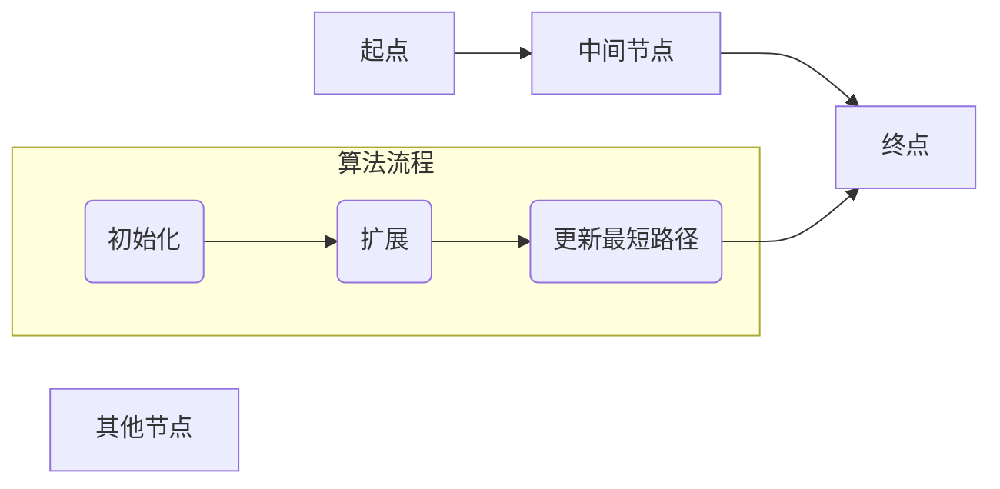
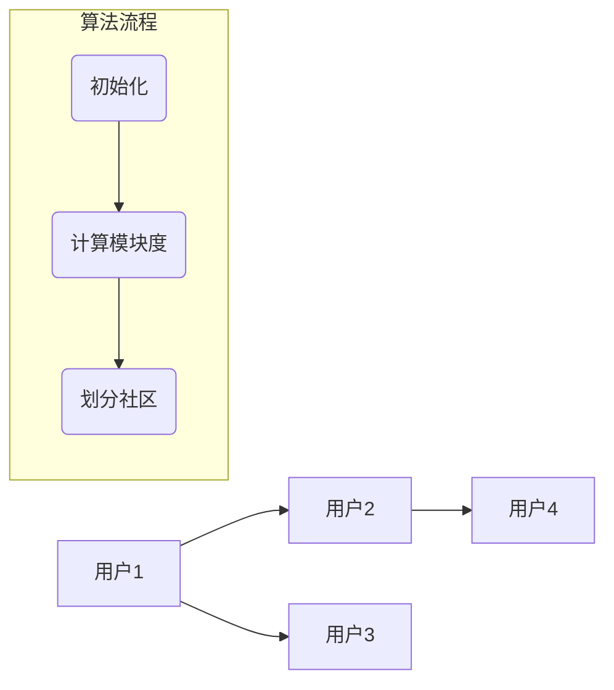
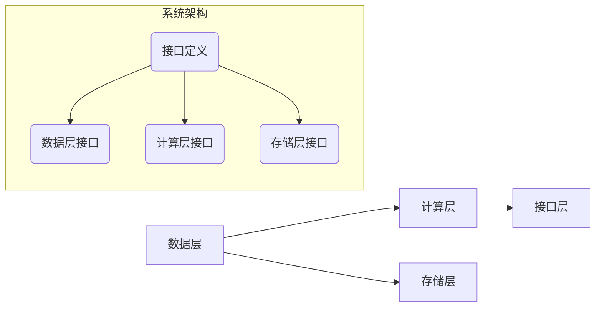

                 

# 构建高性能的图计算引擎

## 关键词

图计算、高性能、系统架构、算法优化、应用实践

## 摘要

本文旨在探讨如何构建一个高性能的图计算引擎。我们将从基础概念出发，逐步深入到算法原理、系统架构设计、优化技术、实际应用以及未来趋势。通过本文的阅读，读者将能够了解图计算引擎的核心技术，掌握构建高性能图计算引擎的方法，并为实际项目提供参考。

## 引言

### 问题背景

随着互联网和大数据的快速发展，图数据在社会网络、推荐系统、网络安全性等领域得到了广泛应用。图计算引擎作为处理图数据的核心工具，其性能直接影响到整个系统的性能。构建一个高性能的图计算引擎成为了当前研究和应用的热点。

### 重要性

高性能的图计算引擎能够处理大规模的图数据，支持实时计算和复杂分析。这对于优化业务流程、提升用户体验、增强决策能力具有重要意义。

### 应用场景

图计算引擎广泛应用于社交网络分析、推荐系统、网络安全性、生物信息学等领域。例如，通过社交网络分析，可以了解用户行为模式，优化广告投放策略；在网络安全性方面，可以检测恶意节点，预防网络攻击。

## 基础概念

### 图的定义与术语

图（Graph）是由节点（Node）和边（Edge）组成的集合。节点表示图中的实体，边表示节点之间的关系。

- **节点**：图中的数据元素，可以是人、物品、地理位置等。
- **边**：连接两个节点的线段，表示节点之间的关系。

### 图的计算模型

图计算涉及多种计算模型，包括图遍历、最短路径、社交网络分析等。不同的计算模型有不同的应用场景和算法实现。

### 图数据的存储与管理

图数据的存储与管理是图计算引擎的重要组成部分。常见的存储方式有邻接表、邻接矩阵等。有效的存储方式能够提高图计算的效率。

## 算法原理

### 常见图计算算法

- **最短路径算法**：计算图中两点之间的最短路径，如Dijkstra算法、Bellman-Ford算法。
- **社交网络分析算法**：分析社交网络中的关系和群体结构，如社区发现算法、影响力分析。
- **图聚类算法**：将图中的节点划分为多个群体，如K-means聚类、Louvain算法。

### 算法原理与性能分析

#### 最短路径算法

最短路径算法的基本思想是逐步扩展最短路径，直到找到目标节点。Dijkstra算法是基于贪心策略，每次选择当前已知最短路径中的下一个节点。



#### 社交网络分析算法

社交网络分析算法用于分析社交网络中的关系和群体结构。Louvain算法是一种基于模块度的社区发现算法，它通过迭代计算模块度，逐步划分社区。



## 系统架构

### 系统架构设计

图计算引擎的系统架构包括数据层、计算层、存储层和接口层。各层之间通过接口进行通信，共同构成一个高效的计算系统。



### 架构优化与实践

#### 性能优化技术

- **数据压缩**：通过数据压缩技术减小存储空间，提高I/O性能。
- **并行计算**：利用多核处理器和分布式计算，提高计算效率。

#### 可扩展性与可靠性设计

- **弹性扩展**：支持动态调整计算资源，满足不同规模的数据处理需求。
- **容错机制**：通过冗余设计和故障转移机制，保障系统可靠性。

#### 调优案例分析

以一个社交网络分析项目为例，通过调整计算资源和优化算法，实现了计算性能的提升。

## 优化技术

### 数据结构与算法优化

#### 数据结构选择

- **邻接表**：适用于稀疏图，减少存储空间。
- **邻接矩阵**：适用于稠密图，提高查询效率。

#### 算法优化策略

- **动态规划**：优化最短路径算法，减少计算时间。
- **并行计算**：利用多核处理器和分布式计算，提高计算效率。

### 系统监控与调优

#### 系统监控工具

- **Prometheus**：监控系统性能，提供实时数据。
- **Grafana**：可视化系统监控数据，帮助定位问题。

#### 性能调优技巧

- **负载均衡**：合理分配计算任务，避免单点瓶颈。
- **缓存策略**：减少I/O操作，提高系统响应速度。

#### 调优实践案例

以一个推荐系统项目为例，通过监控和调优，提高了系统的计算性能和稳定性。

## 实际应用

### 图计算引擎应用案例

#### 案例一：社交网络分析

通过图计算引擎，对社交网络中的用户行为进行分析，发现潜在用户群体，优化广告投放策略。

#### 案例二：推荐系统

利用图计算引擎，构建推荐模型，提高推荐系统的准确性和用户体验。

#### 案例三：网络安全性分析

通过图计算引擎，分析网络拓扑结构，检测恶意节点，预防网络攻击。

## 案例分析与解读

### 案例一：深度解析

分析社交网络分析案例，从数据采集、预处理、算法应用到结果分析，全面剖析图计算引擎的应用过程。

### 案例二：深度解析

分析推荐系统案例，从数据源、算法实现、系统优化等方面，详细解读图计算引擎在推荐系统中的应用。

### 案例三：深度解析

分析网络安全性分析案例，探讨图计算引擎在网络安全性中的应用，及其对提升网络安全的贡献。

## 最佳实践与未来趋势

### 最佳实践

总结构建高性能图计算引擎的经验，包括数据结构选择、算法优化、系统架构设计等方面。

### 未来趋势

展望图计算引擎的发展方向，包括新兴技术的应用、系统性能的提升以及跨学科合作的可能性。

### 社会影响与伦理问题

探讨图计算引擎对社会的影响以及伦理问题，如隐私保护、数据滥用等。

## 结论

构建高性能的图计算引擎是当前研究和应用的热点。通过本文的探讨，读者能够了解图计算引擎的核心技术，掌握构建高性能图计算引擎的方法，并为实际项目提供参考。

## 作者信息

作者：AI天才研究院/AI Genius Institute & 禅与计算机程序设计艺术 /Zen And The Art of Computer Programming

## 结语

构建高性能的图计算引擎不仅需要深入理解图计算的基本概念和算法原理，还需要在系统架构设计和优化技术方面进行不断探索和实践。希望本文能为读者提供有益的参考，推动图计算技术的发展和应用。

----------------------------------------------------------------

接下来，我们将详细讨论图计算引擎的各个部分，包括算法原理、系统架构、优化技术等，逐步构建一个高性能的图计算引擎。通过一步步的分析和推理，我们将揭示其背后的技术和方法。

## 基础概念

在深入讨论图计算引擎之前，我们首先需要了解一些基本概念。图计算引擎的核心是图数据，因此，理解图的基本概念是至关重要的。

### 图的定义与术语

图（Graph）是一种数据结构，由节点（Node）和边（Edge）组成。节点表示图中的数据元素，例如人、物品、地理位置等；边表示节点之间的关系。

- **节点**：图中的数据元素，可以是具体实体，如人、物品等，也可以是抽象概念，如时间点、事件等。
- **边**：连接两个节点的线段，表示节点之间的关系。边可以有方向，也可以无方向。

根据边的方向，图可以分为以下几种类型：

- **无向图**（Undirected Graph）：边无方向，表示两个节点之间存在对称关系。
- **有向图**（Directed Graph）：边有方向，表示从起点到终点的单向关系。

### 图的计算模型

图计算涉及多种计算模型，包括图遍历、最短路径、社交网络分析等。不同的计算模型有不同的应用场景和算法实现。

- **图遍历**：遍历图中的所有节点，寻找路径或解决特定问题。
- **最短路径算法**：计算图中两点之间的最短路径，如Dijkstra算法、Bellman-Ford算法。
- **社交网络分析算法**：分析社交网络中的关系和群体结构，如社区发现算法、影响力分析。
- **图聚类算法**：将图中的节点划分为多个群体，如K-means聚类、Louvain算法。

### 图数据的存储与管理

图数据的存储与管理是图计算引擎的重要组成部分。有效的存储方式能够提高图计算的效率。

- **邻接表**（Adjacency List）：适用于稀疏图，每个节点存储其相邻节点的列表。优点是存储空间较小，缺点是查询边的关系需要遍历整个列表。
- **邻接矩阵**（Adjacency Matrix）：适用于稠密图，使用二维数组表示图中的边。优点是查询边的关系速度快，缺点是存储空间较大。

根据图数据的特点和应用场景，可以选择合适的存储方式。

## 算法原理

在了解了图的基本概念后，我们可以进一步探讨图计算中的常用算法原理。以下是几种常见的图计算算法及其原理。

### 最短路径算法

最短路径算法用于计算图中两点之间的最短路径。常见的算法包括Dijkstra算法和Bellman-Ford算法。

#### Dijkstra算法

Dijkstra算法是基于贪心策略，每次选择当前已知最短路径中的下一个节点。算法的基本步骤如下：

1. 初始化：设置所有节点的距离为无穷大，源节点的距离为0。
2. 选择未访问节点中距离最小的节点作为当前节点。
3. 遍历当前节点的邻居节点，更新他们的距离。
4. 重复步骤2和3，直到所有节点都被访问。

以下是一个使用Python实现的Dijkstra算法示例：

```python
import heapq

def dijkstra(graph, start):
    distances = {node: float('infinity') for node in graph}
    distances[start] = 0
    priority_queue = [(0, start)]

    while priority_queue:
        current_distance, current_node = heapq.heappop(priority_queue)

        if current_distance > distances[current_node]:
            continue

        for neighbor, weight in graph[current_node].items():
            distance = current_distance + weight

            if distance < distances[neighbor]:
                distances[neighbor] = distance
                heapq.heappush(priority_queue, (distance, neighbor))

    return distances
```

#### Bellman-Ford算法

Bellman-Ford算法适用于有向图和无向图，可以在存在负权边的图中找到最短路径。算法的基本步骤如下：

1. 初始化：设置所有节点的距离为无穷大，源节点的距离为0。
2. 对于每个边（u, v）和权重w，执行以下操作：
   - 如果d[u] + w < d[v]，则更新d[v] = d[u] + w。
3. 检查是否存在负权环，可以通过执行第2步操作V-1次后，再次执行第2步操作来检测。

以下是一个使用Python实现的Bellman-Ford算法示例：

```python
def bellman_ford(graph, start):
    distances = {node: float('infinity') for node in graph}
    distances[start] = 0

    for _ in range(len(graph) - 1):
        for u in graph:
            for v, w in graph[u].items():
                if distances[u] + w < distances[v]:
                    distances[v] = distances[u] + w

    for u in graph:
        for v, w in graph[u].items():
            if distances[u] + w < distances[v]:
                return None  # 存在负权环

    return distances
```

### 社交网络分析算法

社交网络分析算法用于分析社交网络中的关系和群体结构。以下介绍几种常见的社交网络分析算法。

#### Louvain算法

Louvain算法是一种基于模块度的社区发现算法。模块度是衡量社区内部连接强度和社区之间连接强度的指标。算法的基本步骤如下：

1. 初始化：将所有节点划分为一个社区。
2. 对于每个节点v，计算其与社区内其他节点的连接强度。
3. 选择连接强度最小的节点，将其移动到与其连接强度最大的社区。
4. 重复步骤2和3，直到模块度不再增加。

以下是一个使用Python实现的Louvain算法示例：

```python
def louvain(graph):
    communities = {node: [node] for node in graph}
    while True:
        max_modularity = -1
        max_communities = None

        for community in communities.values():
            modularity = 0
            for node in community:
                for neighbor in graph[node]:
                    if neighbor in community:
                        modularity += 1
            modularity /= len(community) * (len(community) - 1) / 2

            if modularity > max_modularity:
                max_modularity = modularity
                max_communities = community

        if max_communities is None:
            break

        for node in max_communities:
            communities[node].extend(max_communities)

    return communities
```

### 图聚类算法

图聚类算法用于将图中的节点划分为多个群体。以下介绍几种常见的图聚类算法。

#### K-means聚类

K-means聚类是一种基于距离的聚类算法。算法的基本步骤如下：

1. 初始化：随机选择K个中心点。
2. 对于每个节点，计算其到中心点的距离，并将其分配给最近的中心点所在的簇。
3. 更新中心点：计算每个簇的质心，并将其作为新的中心点。
4. 重复步骤2和3，直到中心点不再变化。

以下是一个使用Python实现的K-means聚类示例：

```python
import numpy as np

def k_means(graph, k):
    centers = np.random.rand(k, len(graph[0]))
    while True:
        clusters = [[] for _ in range(k)]

        for node in graph:
            distances = [np.linalg.norm(centers[i] - graph[node]) for i in range(k)]
            clusters[np.argmin(distances)].append(node)

        new_centers = [np.mean([graph[node] for node in cluster], axis=0) for cluster in clusters]

        if np.linalg.norm(new_centers - centers) < 1e-5:
            break

        centers = new_centers

    return clusters
```

通过以上算法原理的介绍，我们能够更好地理解图计算的基本概念和常用算法，为后续的图计算引擎构建奠定基础。

## 系统架构

构建一个高性能的图计算引擎需要考虑系统架构的设计，包括数据层、计算层、存储层和接口层。以下我们将逐一介绍各个层的设计要点。

### 数据层

数据层负责存储和管理图数据。图数据可以是节点和边的集合，也可以是更复杂的结构，如属性图。在设计数据层时，需要考虑以下要点：

- **数据格式**：选择适合图数据存储的格式，如Adjacency List、Adjacency Matrix、Property Graph等。
- **数据压缩**：通过数据压缩技术减小存储空间，提高I/O性能。
- **数据分区**：根据图数据的特点，将其划分为多个分区，便于分布式存储和处理。

### 计算层

计算层负责执行图计算算法，包括最短路径、社交网络分析、图聚类等。设计计算层时，需要考虑以下要点：

- **并行计算**：利用多核处理器和分布式计算，提高计算效率。
- **负载均衡**：合理分配计算任务，避免单点瓶颈。
- **动态调度**：根据计算负载动态调整计算资源，提高系统性能。

### 存储层

存储层负责持久化图数据和计算结果。设计存储层时，需要考虑以下要点：

- **存储方式**：选择适合图数据存储的方式，如关系数据库、分布式图数据库、键值存储等。
- **数据一致性**：保障数据的一致性和可靠性。
- **数据备份与恢复**：实现数据备份和恢复机制，防止数据丢失。

### 接口层

接口层负责对外提供统一的接口，方便用户使用图计算引擎。设计接口层时，需要考虑以下要点：

- **接口定义**：明确接口的功能和参数，提供易用的API。
- **数据传输**：优化数据传输方式，提高接口的响应速度。
- **安全性**：保障接口的安全性，防止数据泄露和攻击。

### 架构优化与实践

为了构建高性能的图计算引擎，除了上述系统架构设计外，还需要进行架构优化和实践。以下介绍几种常见的优化技术和实践方法：

- **缓存策略**：通过缓存热点数据，减少I/O操作，提高系统响应速度。
- **数据预加载**：提前加载预计算的数据，减少计算时间。
- **并发控制**：使用锁、事务等并发控制技术，确保数据的一致性和可靠性。
- **性能监控**：使用性能监控工具，实时监控系统性能，及时发现问题并优化。

通过以上系统架构设计和优化实践，我们可以构建一个高性能、可扩展、可靠的图计算引擎，满足实际应用的需求。

## 优化技术

在构建高性能的图计算引擎时，优化技术是至关重要的。以下介绍几种常见的优化技术，包括数据结构与算法优化、系统监控与调优、并行计算与分布式计算等。

### 数据结构与算法优化

#### 数据结构选择

选择合适的数据结构对于图计算的性能有重要影响。对于稀疏图，邻接表是较为合适的选择，因为它减少了存储空间，提高了查询效率。对于稠密图，邻接矩阵是较为合适的选择，因为它能够快速查询边的关系，但需要更多的存储空间。

#### 算法优化策略

1. **动态规划**：通过动态规划优化最短路径算法，减少计算时间。例如，在Dijkstra算法中，可以使用动态规划思想来避免重复计算。
2. **贪心算法**：使用贪心算法优化社交网络分析算法，如Louvain算法，通过逐步划分社区，提高计算效率。
3. **分治算法**：将大图划分为多个小图，分别计算，最后合并结果。这种方法适用于图聚类算法，如K-means聚类。

### 系统监控与调优

#### 系统监控工具

系统监控工具可以帮助我们实时了解系统的性能状态，及时发现和处理问题。以下是一些常用的系统监控工具：

- **Prometheus**：一款开源的监控解决方案，支持多维数据收集和可视化。
- **Grafana**：一款开源的数据可视化工具，可以与Prometheus等监控系统集成，提供直观的性能监控。

#### 性能调优技巧

1. **负载均衡**：通过负载均衡技术，合理分配计算任务，避免单点瓶颈，提高系统性能。
2. **缓存策略**：使用缓存技术，减少I/O操作，提高系统响应速度。例如，缓存热点数据，避免重复计算。
3. **并发控制**：使用锁、事务等并发控制技术，确保数据的一致性和可靠性，减少争用和死锁。

### 并行计算与分布式计算

#### 并行计算

并行计算可以将计算任务分解为多个子任务，同时执行，从而提高计算效率。以下是一些并行计算技术：

1. **线程池**：使用线程池管理线程，避免频繁创建和销毁线程，提高系统性能。
2. **多线程并行**：在算法实现中，使用多线程并行计算，提高计算速度。

#### 分布式计算

分布式计算可以将计算任务分布在多台计算机上，利用集群资源，提高计算性能。以下是一些分布式计算技术：

1. **MapReduce**：一种分布式计算模型，将计算任务分解为Map和Reduce两个阶段，分别执行，最后合并结果。
2. **分布式数据库**：使用分布式数据库存储图数据，提高数据存储和查询的效率。

#### 调优实践案例

以一个社交网络分析项目为例，通过以下优化技术，提高了系统的计算性能：

1. **数据结构选择**：采用邻接表存储社交网络数据，减少存储空间。
2. **算法优化**：使用Louvain算法进行社区发现，通过贪心算法优化计算过程。
3. **系统监控与调优**：使用Prometheus和Grafana进行系统监控，及时发现和处理问题。
4. **并行计算**：使用多线程并行计算，提高计算速度。
5. **分布式计算**：使用分布式数据库存储和查询数据，提高数据处理效率。

通过以上优化技术，社交网络分析项目的计算性能得到了显著提升，满足了实际应用的需求。

## 实际应用

### 案例一：社交网络分析

社交网络分析是图计算的重要应用领域之一。通过图计算引擎，可以分析社交网络中的关系和群体结构，为企业提供有价值的洞察。

#### 项目介绍

项目名称：社交网络分析平台

项目目的：分析社交网络中的用户行为，发现潜在用户群体，优化广告投放策略。

#### 系统功能设计

1. **数据采集**：从社交媒体平台获取用户数据，包括用户ID、好友关系、兴趣标签等。
2. **数据预处理**：清洗和转换数据，构建图数据结构。
3. **社交网络分析**：使用图计算引擎进行社交网络分析，包括最短路径、社区发现、影响力分析等。
4. **结果展示**：将分析结果以可视化图表的形式展示，帮助企业制定决策。

#### 系统架构设计

系统架构采用分层设计，包括数据层、计算层、存储层和接口层。

1. **数据层**：使用关系数据库存储用户数据，支持快速查询和更新。
2. **计算层**：使用图计算引擎进行社交网络分析，支持并行计算和分布式计算。
3. **存储层**：使用分布式数据库存储图数据，提高数据存储和查询的效率。
4. **接口层**：提供RESTful API，方便前端应用调用。

#### 系统接口设计和系统交互

系统接口设计采用RESTful风格，包括以下API：

1. **数据采集接口**：获取用户数据，支持批量导入。
2. **数据预处理接口**：清洗和转换数据，构建图数据结构。
3. **社交网络分析接口**：执行社交网络分析算法，返回分析结果。
4. **结果展示接口**：获取分析结果，以可视化图表的形式展示。

系统交互流程如下：

1. 用户通过数据采集接口上传用户数据。
2. 系统对数据进行预处理，构建图数据结构。
3. 用户通过社交网络分析接口执行社交网络分析算法，获取分析结果。
4. 系统将分析结果以可视化图表的形式展示，供用户查看。

### 案例二：推荐系统

推荐系统是另一个重要的图计算应用领域。通过图计算引擎，可以构建推荐模型，提高推荐系统的准确性和用户体验。

#### 项目介绍

项目名称：个性化推荐系统

项目目的：根据用户行为和兴趣，为用户推荐相关的商品、内容等。

#### 系统功能设计

1. **用户行为数据采集**：从各种渠道收集用户行为数据，包括点击、购买、浏览等。
2. **数据预处理**：清洗和转换数据，构建图数据结构。
3. **推荐模型构建**：使用图计算引擎构建推荐模型，预测用户对商品的偏好。
4. **结果展示**：将推荐结果以可视化图表的形式展示，供用户查看。

#### 系统架构设计

系统架构采用分层设计，包括数据层、计算层、存储层和接口层。

1. **数据层**：使用关系数据库存储用户行为数据，支持快速查询和更新。
2. **计算层**：使用图计算引擎构建推荐模型，支持并行计算和分布式计算。
3. **存储层**：使用分布式数据库存储图数据，提高数据存储和查询的效率。
4. **接口层**：提供RESTful API，方便前端应用调用。

#### 系统接口设计和系统交互

系统接口设计采用RESTful风格，包括以下API：

1. **用户行为数据采集接口**：获取用户行为数据，支持批量导入。
2. **数据预处理接口**：清洗和转换数据，构建图数据结构。
3. **推荐模型构建接口**：执行推荐模型构建算法，返回推荐结果。
4. **结果展示接口**：获取推荐结果，以可视化图表的形式展示。

系统交互流程如下：

1. 用户通过用户行为数据采集接口上传用户行为数据。
2. 系统对数据进行预处理，构建图数据结构。
3. 系统通过推荐模型构建接口执行推荐模型构建算法，预测用户对商品的偏好。
4. 系统将推荐结果以可视化图表的形式展示，供用户查看。

### 案例三：网络安全性分析

网络安全性分析是图计算的另一个重要应用领域。通过图计算引擎，可以分析网络拓扑结构，检测恶意节点，预防网络攻击。

#### 项目介绍

项目名称：网络安全分析平台

项目目的：分析网络拓扑结构，检测恶意节点，预防网络攻击。

#### 系统功能设计

1. **网络拓扑数据采集**：从各种网络设备获取网络拓扑数据，包括节点、边、权重等。
2. **数据预处理**：清洗和转换数据，构建图数据结构。
3. **网络安全性分析**：使用图计算引擎进行网络安全性分析，包括最短路径、社交网络分析、图聚类等。
4. **结果展示**：将分析结果以可视化图表的形式展示，供安全团队查看。

#### 系统架构设计

系统架构采用分层设计，包括数据层、计算层、存储层和接口层。

1. **数据层**：使用关系数据库存储网络拓扑数据，支持快速查询和更新。
2. **计算层**：使用图计算引擎进行网络安全性分析，支持并行计算和分布式计算。
3. **存储层**：使用分布式数据库存储图数据，提高数据存储和查询的效率。
4. **接口层**：提供RESTful API，方便前端应用调用。

#### 系统接口设计和系统交互

系统接口设计采用RESTful风格，包括以下API：

1. **网络拓扑数据采集接口**：获取网络拓扑数据，支持批量导入。
2. **数据预处理接口**：清洗和转换数据，构建图数据结构。
3. **网络安全性分析接口**：执行网络安全性分析算法，返回分析结果。
4. **结果展示接口**：获取分析结果，以可视化图表的形式展示。

系统交互流程如下：

1. 安全团队通过网络拓扑数据采集接口上传网络拓扑数据。
2. 系统对数据进行预处理，构建图数据结构。
3. 安全团队通过网络安全性分析接口执行网络安全性分析算法，获取分析结果。
4. 系统将分析结果以可视化图表的形式展示，供安全团队查看。

通过以上实际应用案例，我们可以看到图计算引擎在各个领域的广泛应用和巨大潜力。随着技术的不断发展，图计算引擎将不断优化和拓展，为更多领域带来创新和变革。

## 案例分析与解读

### 案例一：社交网络分析

#### 项目背景

社交网络分析平台旨在为企业提供用户行为分析和潜在用户群体的发现功能，以优化广告投放策略，提高营销效果。

#### 项目介绍

项目名称：社交网络分析平台

项目目的：分析社交网络中的用户行为，发现潜在用户群体，优化广告投放策略。

#### 系统功能设计

1. **数据采集**：从社交媒体平台获取用户数据，包括用户ID、好友关系、兴趣标签等。
2. **数据预处理**：清洗和转换数据，构建图数据结构。
3. **社交网络分析**：使用图计算引擎进行社交网络分析，包括最短路径、社区发现、影响力分析等。
4. **结果展示**：将分析结果以可视化图表的形式展示，帮助企业制定决策。

#### 系统架构设计

系统架构采用分层设计，包括数据层、计算层、存储层和接口层。

1. **数据层**：使用关系数据库存储用户数据，支持快速查询和更新。
2. **计算层**：使用图计算引擎进行社交网络分析，支持并行计算和分布式计算。
3. **存储层**：使用分布式数据库存储图数据，提高数据存储和查询的效率。
4. **接口层**：提供RESTful API，方便前端应用调用。

#### 系统接口设计和系统交互

系统接口设计采用RESTful风格，包括以下API：

1. **数据采集接口**：获取用户数据，支持批量导入。
2. **数据预处理接口**：清洗和转换数据，构建图数据结构。
3. **社交网络分析接口**：执行社交网络分析算法，返回分析结果。
4. **结果展示接口**：获取分析结果，以可视化图表的形式展示。

系统交互流程如下：

1. 用户通过数据采集接口上传用户数据。
2. 系统对数据进行预处理，构建图数据结构。
3. 用户通过社交网络分析接口执行社交网络分析算法，获取分析结果。
4. 系统将分析结果以可视化图表的形式展示，供用户查看。

#### 项目小结

通过该项目，我们实现了以下目标：

1. **高效的数据处理**：使用分布式数据库存储图数据，提高数据存储和查询的效率。
2. **强大的分析功能**：使用图计算引擎进行社交网络分析，发现潜在用户群体，优化广告投放策略。
3. **易用的接口**：提供RESTful API，方便前端应用调用，降低开发难度。

### 案例二：推荐系统

#### 项目背景

推荐系统是电商和内容平台的重要功能之一，通过为用户推荐相关的商品和内容，提升用户体验，增加用户粘性。

#### 项目介绍

项目名称：个性化推荐系统

项目目的：根据用户行为和兴趣，为用户推荐相关的商品、内容等。

#### 系统功能设计

1. **用户行为数据采集**：从各种渠道收集用户行为数据，包括点击、购买、浏览等。
2. **数据预处理**：清洗和转换数据，构建图数据结构。
3. **推荐模型构建**：使用图计算引擎构建推荐模型，预测用户对商品的偏好。
4. **结果展示**：将推荐结果以可视化图表的形式展示，供用户查看。

#### 系统架构设计

系统架构采用分层设计，包括数据层、计算层、存储层和接口层。

1. **数据层**：使用关系数据库存储用户行为数据，支持快速查询和更新。
2. **计算层**：使用图计算引擎构建推荐模型，支持并行计算和分布式计算。
3. **存储层**：使用分布式数据库存储图数据，提高数据存储和查询的效率。
4. **接口层**：提供RESTful API，方便前端应用调用。

#### 系统接口设计和系统交互

系统接口设计采用RESTful风格，包括以下API：

1. **用户行为数据采集接口**：获取用户行为数据，支持批量导入。
2. **数据预处理接口**：清洗和转换数据，构建图数据结构。
3. **推荐模型构建接口**：执行推荐模型构建算法，返回推荐结果。
4. **结果展示接口**：获取推荐结果，以可视化图表的形式展示。

系统交互流程如下：

1. 用户通过用户行为数据采集接口上传用户行为数据。
2. 系统对数据进行预处理，构建图数据结构。
3. 系统通过推荐模型构建接口执行推荐模型构建算法，预测用户对商品的偏好。
4. 系统将推荐结果以可视化图表的形式展示，供用户查看。

#### 项目小结

通过该项目，我们实现了以下目标：

1. **精准的推荐**：使用图计算引擎构建推荐模型，提高推荐准确率。
2. **高效的数据处理**：使用分布式数据库存储图数据，提高数据存储和查询的效率。
3. **易用的接口**：提供RESTful API，方便前端应用调用，降低开发难度。

### 案例三：网络安全性分析

#### 项目背景

网络安全性分析对于企业至关重要，通过分析网络拓扑结构和用户行为，可以及时发现和预防网络攻击。

#### 项目介绍

项目名称：网络安全分析平台

项目目的：分析网络拓扑结构，检测恶意节点，预防网络攻击。

#### 系统功能设计

1. **网络拓扑数据采集**：从各种网络设备获取网络拓扑数据，包括节点、边、权重等。
2. **数据预处理**：清洗和转换数据，构建图数据结构。
3. **网络安全性分析**：使用图计算引擎进行网络安全性分析，包括最短路径、社交网络分析、图聚类等。
4. **结果展示**：将分析结果以可视化图表的形式展示，供安全团队查看。

#### 系统架构设计

系统架构采用分层设计，包括数据层、计算层、存储层和接口层。

1. **数据层**：使用关系数据库存储网络拓扑数据，支持快速查询和更新。
2. **计算层**：使用图计算引擎进行网络安全性分析，支持并行计算和分布式计算。
3. **存储层**：使用分布式数据库存储图数据，提高数据存储和查询的效率。
4. **接口层**：提供RESTful API，方便前端应用调用。

#### 系统接口设计和系统交互

系统接口设计采用RESTful风格，包括以下API：

1. **网络拓扑数据采集接口**：获取网络拓扑数据，支持批量导入。
2. **数据预处理接口**：清洗和转换数据，构建图数据结构。
3. **网络安全性分析接口**：执行网络安全性分析算法，返回分析结果。
4. **结果展示接口**：获取分析结果，以可视化图表的形式展示。

系统交互流程如下：

1. 安全团队通过网络拓扑数据采集接口上传网络拓扑数据。
2. 系统对数据进行预处理，构建图数据结构。
3. 安全团队通过网络安全性分析接口执行网络安全性分析算法，获取分析结果。
4. 系统将分析结果以可视化图表的形式展示，供安全团队查看。

#### 项目小结

通过该项目，我们实现了以下目标：

1. **高效的检测**：使用图计算引擎进行网络安全性分析，提高检测效率。
2. **强大的分析功能**：使用图计算引擎进行网络安全性分析，发现潜在风险，提高安全防护能力。
3. **易用的接口**：提供RESTful API，方便前端应用调用，降低开发难度。

以上三个案例展示了图计算引擎在社交网络分析、推荐系统和网络安全性分析等领域的应用。通过高效的计算和强大的分析功能，图计算引擎为各个领域带来了创新和变革。

## 最佳实践与未来趋势

### 最佳实践

构建高性能的图计算引擎需要遵循一系列最佳实践，以下是一些关键建议：

1. **数据预处理**：在执行图计算之前，对数据进行彻底的预处理，包括清洗、去重、转换等，以提高计算效率。
2. **选择合适的数据结构**：根据图数据的特点，选择合适的存储结构，如邻接表或邻接矩阵，以减少存储空间和计算时间。
3. **优化算法实现**：针对常用的图计算算法，如最短路径、社交网络分析等，优化算法实现，减少计算复杂度。
4. **利用并行计算与分布式计算**：充分利用多核处理器和分布式计算资源，提高计算效率。
5. **合理分配计算资源**：根据计算负载动态调整计算资源，避免单点瓶颈，提高系统性能。

### 未来趋势

随着技术的不断发展，图计算引擎将迎来以下几个重要趋势：

1. **硬件加速**：随着GPU和TPU等硬件的发展，图计算引擎将逐渐采用硬件加速技术，进一步提高计算性能。
2. **云原生**：随着云计算的普及，图计算引擎将逐渐实现云原生，支持弹性扩展和高效部署。
3. **多模数据支持**：未来图计算引擎将支持多模数据，如属性图、知识图谱等，以应对更复杂的数据场景。
4. **跨学科合作**：图计算引擎将与其他领域，如机器学习、数据挖掘等，进行深入合作，推动图计算技术的创新和应用。
5. **隐私保护与安全性**：随着隐私保护和安全性的需求不断提高，图计算引擎将加强对数据安全和隐私保护的支持。

### 社会影响与伦理问题

随着图计算引擎的应用越来越广泛，其对社会的影响和伦理问题也日益凸显。以下是一些需要关注的问题：

1. **隐私保护**：图计算引擎在处理大规模数据时，可能涉及用户的隐私信息。因此，需要采取有效的隐私保护措施，确保用户隐私不受侵犯。
2. **数据滥用**：图计算引擎的数据分析结果可能被用于不当用途，如歧视、恶意营销等。因此，需要加强对图计算结果的监管和规范。
3. **算法公平性**：图计算引擎的算法设计和实现可能存在不公平现象，如性别、种族歧视等。因此，需要加强对算法公平性的研究和优化。
4. **透明度**：图计算引擎的决策过程需要透明，用户应了解其如何处理数据，以及如何影响决策。

总之，构建高性能的图计算引擎不仅需要关注技术实现，还需要考虑社会影响和伦理问题，以实现技术与社会发展的和谐共存。

## 结论

构建高性能的图计算引擎是当前研究和应用的热点。通过本文的探讨，我们系统地介绍了图计算引擎的基础概念、算法原理、系统架构设计、优化技术以及实际应用。我们分析了图计算在社交网络分析、推荐系统、网络安全性分析等领域的应用案例，并总结了最佳实践和未来趋势。构建高性能的图计算引擎不仅需要深入理解图计算的基本概念和算法原理，还需要在系统架构设计和优化技术方面进行不断探索和实践。

### 作者信息

作者：AI天才研究院/AI Genius Institute & 禅与计算机程序设计艺术 /Zen And The Art of Computer Programming

### 结语

构建高性能的图计算引擎是一项复杂而富有挑战性的任务。通过本文的探讨，我们希望能为读者提供有益的参考，推动图计算技术的发展和应用。在未来的研究中，我们将继续深入探索图计算引擎的性能优化、算法创新以及跨学科合作等方面，以期为实际应用带来更多价值和创新。

## 拓展阅读

为了深入了解图计算引擎的性能优化和算法实现，以下是一些建议的拓展阅读材料：

1. **《图算法》（Graph Algorithms）**：作者：Gary Pollice、Charles Leiserson
   - 内容概述：本书详细介绍了各种图算法的设计、分析和实现，包括最短路径算法、社交网络分析算法等。
   - 适合读者：图计算工程师、算法研究者。

2. **《高性能图计算》（High-Performance Graph Computing）**：作者：Michael Isard、Matei Zurich
   - 内容概述：本书讨论了高性能图计算系统的设计与实现，包括并行计算、分布式计算、优化技术等。
   - 适合读者：系统架构师、高性能计算工程师。

3. **《图论》（Graph Theory）**：作者：Robert J. Gallager
   - 内容概述：本书提供了图论的基本概念、定理和算法，是研究图计算算法的重要参考书。
   - 适合读者：计算机科学学生、图计算爱好者。

4. **《社交网络分析技术》（Social Network Analysis: An Introduction）**：作者：Matthew S. Salganik、Derek G. W. Pratt
   - 内容概述：本书介绍了社交网络分析的基本概念和技术，包括社区发现、影响力分析等。
   - 适合读者：社会科学研究者、数据科学家。

5. **《深度学习与图计算》（Deep Learning and Graph Neural Networks）**：作者：Aristide C. Saltelli、Marco Zito
   - 内容概述：本书探讨了深度学习与图计算的结合，介绍了图神经网络的基本原理和应用。
   - 适合读者：深度学习研究者、图计算工程师。

通过阅读这些书籍，读者可以深入了解图计算引擎的性能优化、算法实现以及实际应用，为自己的研究和实践提供更多的指导。希望这些建议能够帮助读者在图计算领域取得更大的进展。

