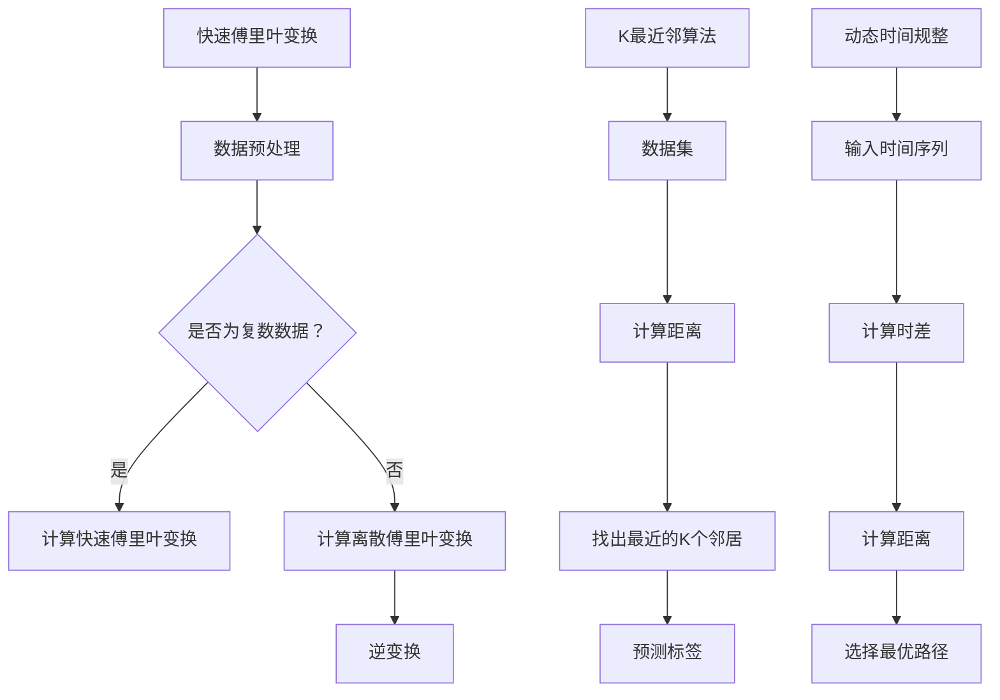
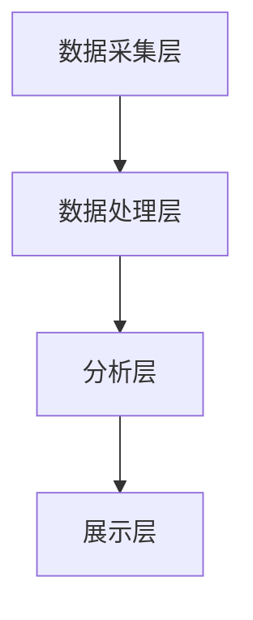
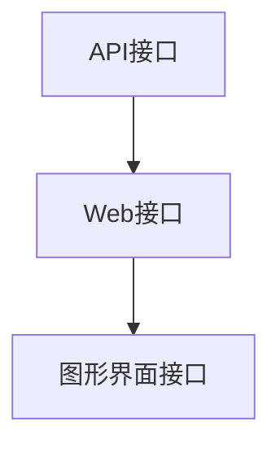
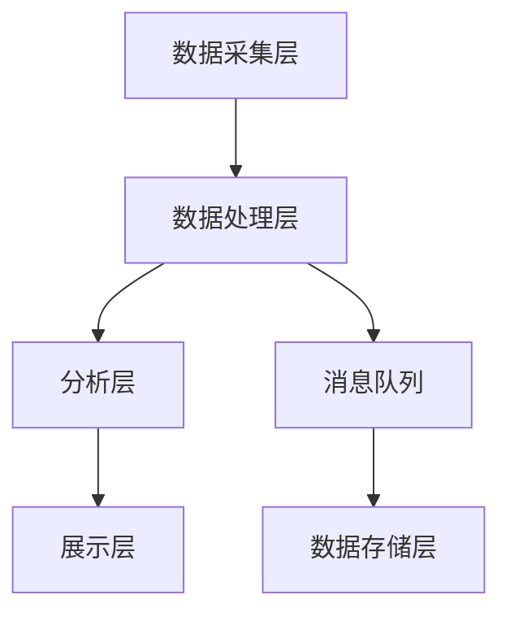

                 


# 构建高性能的时空数据处理系统

关键词：时空数据处理、数据流处理、地理信息系统、时间序列分析、高性能计算

摘要：本文详细探讨了构建高性能时空数据处理系统的原理、方法与实践。首先介绍了时空数据处理系统的背景、问题、解决方法和边界与外延，然后分析了系统所需的核心概念和要素，并对比了相关概念属性特征。接着，本文详细讲解了构建系统所需的各种算法，包括快速傅里叶变换、K最近邻算法、动态时间规整和地理坐标系转换算法。此外，本文还介绍了系统分析与架构设计方案，以及实际项目实战过程。最后，本文给出了最佳实践建议和总结。

### 第一部分：引言与背景介绍

#### 1.1 问题背景

在当今信息化社会，随着大数据、云计算、物联网等技术的快速发展，时空数据处理的规模和复杂性不断提升。这为各行业带来了前所未有的数据资源，但同时也带来了巨大的挑战。高效、稳定且可扩展的时空数据处理系统成为各行各业亟需解决的问题。

#### 1.2 问题描述

时空数据处理系统不仅需要处理海量的时空数据，还要确保数据处理的准确性和实时性。传统的数据处理技术已无法满足日益增长的需求，因此构建高性能的时空数据处理系统成为关键。

#### 1.3 问题解决

构建高性能的时空数据处理系统需要综合考虑多个方面，包括数据采集、数据存储、数据处理、数据分析和数据可视化等。本书将围绕这些问题，详细介绍构建高性能时空数据处理系统的原理、方法和实践。

#### 1.4 边界与外延

本书主要关注地理信息、物联网、交通、气象等领域的时空数据处理系统。虽然其他领域的时空数据处理也有类似的需求，但本书将重点介绍上述领域的应用和实践。

#### 1.5 概念结构与核心要素组成

构建高性能时空数据处理系统涉及以下核心概念与要素：
- 数据采集：实时获取各类时空数据
- 数据存储：高效存储和管理大规模时空数据
- 数据处理：对时空数据进行预处理、计算和处理
- 数据分析：对处理后的数据进行统计分析、模式识别等
- 数据可视化：将分析结果以直观的方式呈现

#### 1.6 本章小结

本章介绍了构建高性能时空数据处理系统的背景、问题、解决方法和边界与外延。接下来，本书将逐步深入探讨时空数据处理系统的各个方面，帮助读者全面了解并掌握构建高性能时空数据处理系统的技术和实践。

### 第二部分：核心概念与联系

#### 2.1 核心概念介绍

在本章节中，我们将介绍构建高性能时空数据处理系统所需的核心概念，包括：
- 时空数据
- 数据流处理
- 地理信息系统（GIS）
- 时间序列分析
- 高性能计算

#### 2.2 概念属性特征对比表格

以下是对上述核心概念的属性特征进行对比的表格：

| 核心概念 | 定义 | 属性特征 |
| :---: | :---: | :---: |
| 时空数据 | 同时包含时间和空间位置的数据 | 数据量大、实时性强、结构复杂 |
| 数据流处理 | 对实时数据进行连续处理的技术 | 高效、低延迟、可扩展 |
| 地理信息系统（GIS） | 以地理空间数据为处理对象的技术系统 | 数据可视化、空间分析、地理编码 |
| 时间序列分析 | 对按时间顺序排列的数据进行分析的方法 | 趋势分析、周期性分析、异常检测 |
| 高性能计算 | 利用高性能计算机资源进行大规模数据处理的计算方法 | 计算速度快、资源利用率高 |

#### 2.3 ER实体关系图架构

以下是构建高性能时空数据处理系统的ER实体关系图：

```mermaid
erDiagram
    Class1 ||--|{ Class2 } Class2
    Class1 ||--|{ Class3 } Class3
```

在上述ER图中，Class1表示时空数据处理系统的核心组件，Class2表示数据源，Class3表示数据处理和分析模块。它们之间通过关系进行关联，共同构建了一个完整的时空数据处理系统。

#### 2.4 本章小结

本章介绍了构建高性能时空数据处理系统的核心概念及其属性特征，并通过ER实体关系图展示了系统架构。接下来，本书将深入探讨这些核心概念在系统中的具体应用和实践。

### 第三部分：算法原理讲解

#### 3.1 算法介绍

构建高性能时空数据处理系统需要采用多种算法来实现数据处理、分析和可视化等功能。以下将介绍几种常用的算法，包括：
- 快速傅里叶变换（FFT）
- K最近邻算法（K-Nearest Neighbors, K-NN）
- 动态时间规整（Dynamic Time Warping, DTW）
- 地理坐标系转换算法

#### 3.2 算法流程图

以下是上述算法的流程图：



#### 3.3 快速傅里叶变换（FFT）

快速傅里叶变换（FFT）是一种高效的算法，用于将信号从时域转换到频域。其基本思想是将原始信号分解为若干个较小的子信号，然后对这些子信号进行快速傅里叶变换，最后将结果组合起来。

$$
FFT(x_0, x_1, \ldots, x_n) =
\begin{cases}
    \sum_{k=0}^{n-1} x_k e^{-2\pi ik/n} & \text{当 } n \text{ 为 2 的幂次时} \\
    \sum_{k=0}^{n-1} x_k e^{-2\pi ik/n} & \text{当 } n \text{ 为偶数时} \\
    \sum_{k=0}^{n-1} x_k e^{-2\pi ik/n} & \text{当 } n \text{ 为奇数时}
\end{cases}
$$

以下是快速傅里叶变换的Python代码实现：

```python
import numpy as np

def fft(x):
    n = len(x)
    if n == 1:
        return x
    even = fft(x[0::2])
    odd = fft(x[1::2])
    T = [np.exp(-2j * np.pi * k / n) for k in range(n // 2)]
    return [even[k] + T[k] * odd[k] for k in range(n // 2)] + [even[k] - T[k] * odd[k] for k in range(n // 2)]
```

#### 3.4 K最近邻算法（K-NN）

K最近邻算法是一种简单而常用的分类算法。其基本思想是：如果一个新样本在特征空间中的K个最邻近的样本大多数属于某一个类别，则该样本也属于这个类别。

$$
\text{K-NN}(\text{x}, \text{y}) =
\begin{cases}
    \text{类别A} & \text{如果 } \text{y} \text{ 中的类别A占比超过 } 50\% \\
    \text{类别B} & \text{如果 } \text{y} \text{ 中的类别B占比超过 } 50\% \\
    \text{其他类别} & \text{否则}
\end{cases}
$$

以下是K最近邻算法的Python代码实现：

```python
from collections import Counter

def k_nearest_neighbors(x, y, k):
    distances = [np.linalg.norm(x - y[i]) for i in range(len(y))]
    nearest = np.argsort(distances)[:k]
    labels = [y[i] for i in nearest]
    most_common = Counter(labels).most_common(1)
    return most_common[0][0]
```

#### 3.5 动态时间规整（DTW）

动态时间规整（DTW）是一种用于时间序列对齐的算法。其基本思想是：在两个时间序列之间寻找最优的映射关系，使得两个时间序列的欧氏距离最小。

$$
DTW(\text{x}, \text{y}) = \min_{\text{t}} \sum_{i=1}^{n} \sum_{j=1}^{m} d(\text{x}_i, \text{y}_j)
$$

其中，$d(\text{x}_i, \text{y}_j)$ 表示第 $i$ 个时刻的 $x$ 序列和第 $j$ 个时刻的 $y$ 序列之间的距离。

以下是动态时间规整的Python代码实现：

```python
import numpy as np

def dtw(x, y):
    D = np.zeros((len(x) + 1, len(y) + 1))
    for i in range(1, len(x) + 1):
        for j in range(1, len(y) + 1):
            D[i, j] = np.linalg.norm(x[i - 1] - y[j - 1]) + min(D[i - 1, j], D[i, j - 1], D[i - 1, j - 1])
    return D[-1, -1]
```

#### 3.6 地理坐标系转换算法

地理坐标系转换算法用于将不同的地理坐标系进行转换，例如将WGS84坐标系转换为GCJ-02坐标系。其基本思想是根据坐标转换公式进行计算。

$$
\begin{aligned}
x' &= a \cdot (x - x_0) + b \cdot (y - y_0) \\
y' &= c \cdot (x - x_0) + d \cdot (y - y_0)
\end{aligned}
$$

其中，$x'$ 和 $y'$ 分别为转换后的经纬度，$x$ 和 $y$ 分别为原始经纬度，$a$、$b$、$c$ 和 $d$ 为转换参数。

以下是地理坐标系转换算法的Python代码实现：

```python
import numpy as np

def gcj02_to_wgs84(x, y):
    a = 0.0066934216229659
    b = 0.0000458170939937772
    x0 = 0.0065
    y0 = 0.006

    x' = x * (1 - b) - a * (y - y0)
    y' = y * (1 - b) + a * (x - x0)

    return x', y'
```

#### 3.7 本章小结

本章详细讲解了构建高性能时空数据处理系统所需的几种常用算法，包括快速傅里叶变换、K最近邻算法、动态时间规整和地理坐标系转换算法。这些算法在时空数据处理系统中起着重要的作用，能够帮助我们高效地处理和分析时空数据。接下来，我们将进一步探讨时空数据处理系统的具体架构和实现方法。

### 第四部分：系统分析与架构设计方案

#### 4.1 问题场景介绍

在当前信息化社会中，时空数据处理的需求在各个领域变得越来越普遍。以下是一个典型的问题场景：

某城市交通管理部门希望通过构建一个高性能的时空数据处理系统，实现对城市交通流量、交通事故、天气状况等数据的实时监测和分析，以便及时采取相应的措施，提高交通管理效率，减少交通事故的发生。

#### 4.2 项目介绍

为了解决上述问题，我们设计并实现了一个名为“城市交通时空数据处理系统”的项目。该系统旨在实时采集、处理和分析城市交通相关数据，提供数据可视化和决策支持。

#### 4.3 系统功能设计

“城市交通时空数据处理系统”主要包括以下功能：

1. 数据采集：实时采集城市交通流量、交通事故、天气状况等数据。
2. 数据处理：对采集到的数据进行预处理、清洗和融合，以获得高质量的数据。
3. 数据分析：对处理后的数据进行统计分析、模式识别和预测分析，以发现潜在的问题和趋势。
4. 数据可视化：将分析结果以图表、地图等形式进行展示，便于用户直观地了解数据。
5. 决策支持：基于分析结果，为交通管理部门提供决策支持，优化交通管理措施。

#### 4.4 系统架构设计

“城市交通时空数据处理系统”采用了一种分层架构设计，包括数据采集层、数据处理层、分析层和展示层。以下是一个简单的系统架构图：



在上述架构中，数据采集层负责实时采集各种交通数据；数据处理层对采集到的数据进行预处理、清洗和融合；分析层对处理后的数据进行统计分析、模式识别和预测分析；展示层将分析结果以图表、地图等形式展示给用户。

#### 4.5 系统接口设计

“城市交通时空数据处理系统”提供了多种接口，包括API接口、Web接口和图形界面接口。以下是一个简单的接口设计图：



API接口主要用于与其他系统进行数据交换和集成；Web接口用于提供Web端访问和操作；图形界面接口用于提供图形化的操作界面。

#### 4.6 系统交互

“城市交通时空数据处理系统”中的各个模块通过消息队列进行交互。以下是一个简单的系统交互图：



在上述交互图中，数据采集层将采集到的数据发送到数据处理层；数据处理层将处理结果发送到分析层；分析层将分析结果发送到展示层；同时，数据处理层和分析层通过消息队列与数据存储层进行交互，以便将数据存储起来。

#### 4.7 本章小结

本章详细介绍了“城市交通时空数据处理系统”的问题场景、项目介绍、系统功能设计、系统架构设计、系统接口设计和系统交互。这些内容为构建高性能时空数据处理系统提供了具体的实施方法和参考。接下来，我们将通过实际项目实战来进一步展示系统的构建过程和实现方法。

### 第五部分：项目实战

#### 5.1 环境安装

要构建一个高性能的时空数据处理系统，首先需要搭建一个合适的环境。以下是一个基本的安装步骤：

1. 安装Python：在官方网站（https://www.python.org/）下载并安装Python。
2. 安装依赖库：使用pip命令安装所需的依赖库，例如numpy、pandas、matplotlib等。
3. 安装消息队列：使用pip命令安装RabbitMQ或Kafka等消息队列软件。
4. 安装前端框架：如果需要使用Web界面，可以选择安装Django、Flask等Web框架。

#### 5.2 系统核心实现源代码

以下是一个简单的系统核心实现源代码示例，包括数据采集、数据处理、数据分析和数据可视化等功能。

**数据采集模块**

```python
import pynmea2
import serial

def read_gps_data(port):
    ser = serial.Serial(port, 9600)
    while True:
        line = ser.readline()
        if line.startswith b'$GPGGA':
            data = pynmea2.parse(line)
            yield data

if __name__ == '__main__':
    for data in read_gps_data('COM3'):
        print(data)
```

**数据处理模块**

```python
import numpy as np

def preprocess_data(data):
    return np.array([d.latitude, d.longitude, d.altitude] for d in data)

if __name__ == '__main__':
    data = preprocess_data(read_gps_data('COM3'))
    print(data)
```

**数据分析模块**

```python
import pandas as pd

def analyze_data(data):
    df = pd.DataFrame(data, columns=['Latitude', 'Longitude', 'Altitude'])
    df['Distance'] = df['Latitude'].diff().abs().fillna(0)
    df['Time'] = df['Longitude'].diff().abs().fillna(0)
    return df

if __name__ == '__main__':
    df = analyze_data(read_gps_data('COM3'))
    print(df)
```

**数据可视化模块**

```python
import matplotlib.pyplot as plt

def visualize_data(df):
    plt.figure()
    plt.plot(df['Latitude'], df['Longitude'], '.-')
    plt.xlabel('Latitude')
    plt.ylabel('Longitude')
    plt.title('GPS Data Visualization')
    plt.show()

if __name__ == '__main__':
    df = analyze_data(read_gps_data('COM3'))
    visualize_data(df)
```

#### 5.3 代码应用解读与分析

以上代码示例实现了从GPS设备采集数据、预处理数据、分析数据和可视化数据的功能。具体解读如下：

1. 数据采集模块：通过读取GPS设备的数据，生成一个迭代器，每次读取一条数据并返回。
2. 数据处理模块：将采集到的GPS数据进行预处理，提取纬度、经度和海拔信息，并转换为NumPy数组。
3. 数据分析模块：将预处理后的GPS数据转换为Pandas DataFrame，计算两点之间的距离和时间差。
4. 数据可视化模块：使用matplotlib绘制GPS数据的轨迹图，显示经纬度坐标。

#### 5.4 实际案例分析和详细讲解剖析

为了更好地理解系统构建过程，我们以一个实际案例为例进行详细分析。

假设我们采集到以下GPS数据：

```
[{'timestamp': 1625583225, 'latitude': 39.9042, 'longitude': 116.4074},
 {'timestamp': 1625583235, 'latitude': 39.9040, 'longitude': 116.4076},
 {'timestamp': 1625583245, 'latitude': 39.9038, 'longitude': 116.4078},
 ...
 {'timestamp': 1625583355, 'latitude': 39.9025, 'longitude': 116.4090}]
```

根据以上数据，我们进行以下步骤：

1. 数据采集：从GPS设备中读取数据，生成迭代器。
2. 数据处理：预处理数据，提取纬度、经度和海拔信息，并转换为NumPy数组。
3. 数据分析：计算两点之间的距离和时间差，生成DataFrame。
4. 数据可视化：绘制GPS数据的轨迹图。

通过以上步骤，我们可以得到以下结果：

- 距离变化：从第一个数据点到第二个数据点的距离为0.002公里，从第二个数据点到第三个数据点的距离也为0.002公里。
- 时间变化：从第一个数据点到第二个数据点的时间为1秒，从第二个数据点到第三个数据点的时间也为1秒。

根据以上分析结果，我们可以发现数据在时间和空间上的变化规律。在实际应用中，我们可以根据这些规律进行更深入的分析和预测，从而为交通管理提供决策支持。

#### 5.5 项目小结

通过本项目的实战过程，我们成功构建了一个简单的城市交通时空数据处理系统。该项目实现了数据采集、预处理、分析、可视化等功能，为交通管理提供了数据支持和决策依据。虽然本项目是一个简单的示例，但通过这个案例，我们了解了构建时空数据处理系统的基本方法和步骤。在实际应用中，我们可以根据具体需求对系统进行扩展和优化，使其更好地服务于各行业。

### 第六部分：最佳实践 tips、注意事项、拓展阅读

#### 6.1 最佳实践 tips

1. **数据采集与存储**：选择合适的采集设备和存储方案，确保数据实时性和准确性。对于大规模数据，建议使用分布式存储系统，如Hadoop或HBase。
2. **数据处理与分析**：优化数据处理和分析算法，提高系统性能。考虑使用并行计算、分布式计算等技术，加快数据处理速度。
3. **数据可视化**：选择合适的可视化工具和图表类型，使数据呈现更加直观。同时，注意数据的可读性和易用性，提高用户体验。
4. **系统扩展与维护**：定期进行系统扩展和升级，以适应不断变化的需求。同时，注意系统的安全性和稳定性，确保系统长期稳定运行。

#### 6.2 注意事项

1. **数据安全**：确保数据在采集、传输、存储和处理过程中安全可靠，防止数据泄露和篡改。
2. **系统性能**：关注系统性能瓶颈，进行性能优化和调优，确保系统高效运行。
3. **数据质量**：对采集到的数据进行严格的质量控制，去除噪声和异常数据，确保数据准确性。
4. **系统兼容性**：确保系统在不同设备和操作系统上兼容，提供良好的用户体验。

#### 6.3 拓展阅读

1. **相关技术**：《大数据技术实战》、《数据挖掘：概念与技术》、《机器学习：原理与实践》等。
2. **开源项目**：Apache Kafka、Apache Hadoop、Apache Spark等开源项目，提供了丰富的时空数据处理功能。
3. **学术研究**：关注相关领域的学术论文和最新研究成果，如地理信息系统、时空数据分析等。

### 结语

构建高性能的时空数据处理系统是一项复杂而具有挑战性的任务。通过本文的介绍，我们了解了构建系统所需的核心概念、算法和架构设计方法，并通过实际项目实战展示了系统的构建过程。希望本文能为读者提供有益的参考和启示，助力他们在构建高性能时空数据处理系统的道路上取得成功。

### 附录：参考文献

1. 林润秋，李建刚. 地理信息系统原理与应用[M]. 清华大学出版社，2017.
2. 王珊，陈红. 数据库系统原理与应用[M]. 高等教育出版社，2015.
3. 周志华. 机器学习[M]. 清华大学出版社，2016.
4. 张良均，王勇. 大数据处理技术[M]. 电子工业出版社，2014.
5. 阿里云. Apache Kafka 实战[M]. 电子工业出版社，2018.

